# 张宇考研数学题源探析经典1000题

解析分册

【数学一】

主编张宇  
○ 副主编 高昆轮

# 图书在版编目（CIP）数据

张宇考研数学题源探析经典1000题．数学一．解析分册／张宇主编．—北京：北京理工大学出版社，

2022.1(2026.1重印)

ISBN 978-7-5763-0818-1

I. $①$ 张…Ⅱ. $①$ 张…Ⅲ. $①$ 高等数学－研究生－入学考试－题解Ⅳ. $①$ O13-44

中国版本图书馆CIP数据核字（2022）第005877号

责任编辑：高芳

文案编辑：胡莹

责任校对：刘亚男

责任印制：李志强

出版发行/北京理工大学出版社有限责任公司

社址/北京市丰台区四合庄路6号

邮 编/100070

电话/（010）68944451（大众售后服务热线）(010）68912824（大众售后服务热线）

网 址 / http://www.bitpress.com.cn

版印次/2026年1月第1版第16次印刷

印 刷／天津市蓟县宏图印务有限公司

开 本 $/787\mathrm{mm}\times 1092\mathrm{mm}1 / 16$

印 张/35.5

字数/886千字

定价/99.90元（共2册）

# 目录

# CONTENTS

# 基础篇

# 高等数学 3

零基础 3

第1章 函数极限与连续 8

第2章 数列极限 14

第3章 一元函数微分学的概念 17

第4章 一元函数微分学的计算 22

第5章 一元函数微分学的应用(一)——几何应用 ………………………………………… 27

第6章 一元函数微分学的应用(二)——中值定理、微分等式与微分不等式 …………………… 35

第7章 一元函数微分学的应用(三) 物理应用 42

第8章 一元函数积分学的概念与性质 43

第9章 一元函数积分学的计算 53

第10章 一元函数积分学的应用（一）几何应用 69

第11章 一元函数积分学的应用(二） 积分等式与积分不等式 75

第12章 一元函数积分学的应用(三) 物理应用 80

第13章 多元函数微分学 83

第14章 二重积分 91

第15章 微分方程 99

第16章 无穷级数 ………………………………………… 105

第17章 多元函数积分学的预备知识 112

第18章 多元函数积分学 116

# 线性代数 122

第1章 行列式 122

第2章 矩阵 127

# 华 宇 考研数学题源探析经典1000题（数学一）

第3章 向量组 132  
第4章 线性方程组 137  
第5章 特征值与特征向量 144  
第6章 二次型 ………………………………………… 156

# 概率论与数理统计 173

第1章 随机事件与概率 173  
第2章 一维随机变量及其分布 ………………………………………… 177  
第3章 多维随机变量及其分布 180  
第4章 随机变量的数字特征 188  
第5章 大数定律与中心极限定理 197  
第6章 数理统计 200

# 强化篇

# 高等数学 211

第1章 函数极限与连续 211  
第2章 数列极限 223  
第3章 一元函数微分学的概念 227  
第4章 一元函数微分学的计算 ………………………………………… 235  
第5章 一元函数微分学的应用(一)——几何应用 ………………………………………… 239  
第6章 一元函数微分学的应用(二)——中值定理、微分等式与微分不等式 ………………………………………… 253  
第7章 一元函数微分学的应用(三) 物理应用 261  
第8章 一元函数积分学的概念与性质 ………………………………………… 262  
第9章 一元函数积分学的计算 270  
第10章 一元函数积分学的应用(一)——几何应用 ………………………………………… 279  
第11章 一元函数积分学的应用(二) 积分等式与积分不等式 ………………………………………… 290  
第12章 一元函数积分学的应用(三) 物理应用 ..... 294  
第13章 多元函数微分学 296  
第14章 二重积分 312  
第15章 微分方程 333  
第16章 无穷级数 … 348  
第17章 多元函数积分学的预备知识 367  
第18章 多元函数积分学 373

# 线性代数 389

第1章 行列式 389  
第2章 余子式和代数余子式的计算 394  
第3章 矩阵运算 395  
第4章 矩阵的秩 399  
第5章 线性方程组 402  
第6章 向量组 412  
第7章 特征值与特征向量 417  
第8章 相似理论 421  
第9章 二次型 434

# 概率论与数理统计 452

第1章 随机事件和概率 452  
第2章 一维随机变量及其分布 455  
第3章 一维随机变量函数的分布 … 459  
第4章 多维随机变量及其分布 463  
第5章 多维随机变量函数的分布 467  
第6章 数字特征 476  
第7章 大数定律与中心极限定理 488  
第8章 统计量及其分布 490  
第9章 参数估计与假设检验 495

# 综合篇

测试卷一 517  
测试卷二 527  
测试卷三 538  
测试卷四 552

  
关注公众号【考研小舟】免费考研资料&无水印PDF

  
黑白&彩印都是5分/页，满4.9全国包邮下单备注：考研小舟，送草稿纸

# 基础篇

# 高等数学

# 零基础

# 1.【答案】(B)

【解析】当 $\sin^2\alpha + \sin^2\beta = 1$ 时，例如， $\alpha = \frac{\pi}{2}$ ， $\beta = 0$ ，但 $\sin \alpha + \cos \beta \neq 0$ ，即 $\sin^2\alpha + \sin^2\beta = 1$ 推不出 $\sin \alpha + \cos \beta = 0$ 。

当 $\sin \alpha +\cos \beta = 0$ 时， $\sin^2\alpha +\sin^2\beta = (-\cos \beta)^2 +\sin^2\beta = 1$ ，即 $\sin \alpha +\cos \beta = 0$ 能推出 $\sin^2\alpha +$ $\sin^2\beta = 1$ ：

2.【解析】当 $n = 1,2,3$ 时， $2^{1} + 2 > 1^{2}$ ， $2^{2} + 2 > 2^{2}$ ， $2^{3} + 2 > 3^{2}$ 显然成立.

假设当 $n = k(k\geqslant 3)$ 时结论成立，则当 $n = k + 1$ 时，

$$
2 ^ {k + 1} + 2 = 2 \left(2 ^ {k} + 2\right) - 2 > 2 k ^ {2} - 2 = (k + 1) ^ {2} + (k + 1) (k - 3) \geqslant (k + 1) ^ {2},
$$

结论也成立. 从而命题得证.

3.【解析】当 $n = 1,2$ 时，

$$
x _ {1} = 1 + a > 1, x _ {2} = \frac {1}{1 + a} + a = \frac {1 + a + a ^ {2}}{1 + a} > 1,
$$

结论成立.

假设当 $n \leqslant k (k \geqslant 2)$ 时结论成立，则当 $n = k + 1$ 时，根据归纳假设和递推关系得

$$
x _ {k - 1} > 1, 1 <   x _ {k} = \frac {1}{x _ {k - 1}} + a <   1 + a,
$$

$$
x _ {k + 1} = \frac {1}{x _ {k}} + a > \frac {1}{1 + a} + a = \frac {1 + a + a ^ {2}}{1 + a} > 1,
$$

所以当 $n = k + 1$ 时，结论也成立.因此对任意正整数 $n$ ，均有 $x_{n} > 1$ ：

4.【答案】 $2a^{5}b - 2a^{4}b^{2} + a^{3}b^{3} - ab^{5}$

【解析】由于

$$
\begin{array}{c c c c c} & 2 & 0 & 1 & 1 \\ \times) & 1 & - 1 \\ \hline & 2 & 0 & 1 & 1 \\ +) & & - 2 & 0 & - 1 \\ \hline & 2 & - 2 & 1 & 0 \\ \hline \end{array} ,
$$

故原式 $= 2a^{5}b - 2a^{4}b^{2} + a^{3}b^{3} + 0\cdot a^{2}b^{4} - ab^{5} = 2a^{5}b - 2a^{4}b^{2} + a^{3}b^{3} - ab^{5}$

5.【答案】 $\lambda^2 -\lambda -8$

【解析】 $\frac{\lambda^4 - 3\lambda^3 - 6\lambda^2 + 16\lambda}{\lambda^2 - 2\lambda} = \frac{\lambda(\lambda^3 - 3\lambda^2 - 6\lambda + 16)}{\lambda(\lambda - 2)} = \frac{\lambda^3 - 3\lambda^2 - 6\lambda + 16}{\lambda - 2},$

于是

$$
\begin{array}{c} \lambda^ {2} - \lambda - 8 \\ \lambda - 2 \Bigl) \lambda^ {3} - 3 \lambda^ {2} - 6 \lambda + 1 6 \\ \frac {\lambda^ {3} - 2 \lambda^ {2}}{- \lambda^ {2} - 6 \lambda} \\ \frac {- \lambda^ {2} + 2 \lambda}{- 8 \lambda + 1 6} \\ \frac {- 8 \lambda + 1 6}{0}, \end{array}
$$

故原式 $= \lambda^2 -\lambda -8$

【注】对于有理分式 $\frac{f(x)}{g(x)}$ ，称 $f(x), g(x)$ 所有公因式中次数最高的因式为 $f(x), g(x)$ 的最大公因式，如 $f(x) = x^3 (x^2 - 1)$ 与 $g(x) = 2x^2 (x + 1)$ 的公因式为 $x, x^2, x + 1$ 等，于是最大公因式为 $x^2 (x + 1)$ 。

一般记最高次项系数为1的最大公因式为 $(f(x),g(x))$ ，若 $(f(x),g(x)) = 1$ ，称 $f(x)$ 与 $g(x)$ 互质，如 $(x^{2},x + 1) = 1$ ：

6.【答案】 $\frac{7}{2}$

【解析】因为 $f(x) + f\left(\frac{1}{x}\right) = \frac{x^2}{1 + x^2} + \frac{\left(\frac{1}{x}\right)^2}{1 + \left(\frac{1}{x}\right)^2} = \frac{x^2}{1 + x^2} + \frac{1}{x^2 + 1} = 1,$

所以 $f(1) + f(1) = 1,f(2) + f\left(\frac{1}{2}\right) = 1,f(3) + f\left(\frac{1}{3}\right) = 1,f(4) + f\left(\frac{1}{4}\right) = 1,$

故 $f(1) + f(2) + f(3) + f(4) + f\left(\frac{1}{2}\right) + f\left(\frac{1}{3}\right) + f\left(\frac{1}{4}\right) = \frac{7}{2}.$

7.【解析】当 $\left|a - b\right|\leqslant \frac{1}{2}$ 时，有 $\left|f(a) - f(b)\right|\leqslant \left|a - b\right|\leqslant \frac{1}{2}.$

当 $|a - b| > \frac{1}{2}$ 时，不妨设 $0 \leqslant a < b \leqslant 1$ ，则 $b - a > \frac{1}{2}$ . 于是有

$$
\begin{array}{l} \left| f (a) - f (b) \right| = \left| f (a) - f (0) + f (1) - f (b) \right| \leqslant \left| f (a) - f (0) \right| + \left| f (1) - f (b) \right| \\ \leqslant | a - 0 | + | 1 - b | = 1 - (b - a) <   \frac {1}{2}. \\ \end{array}
$$

证毕.

8.【解析】 $y = x + \frac{4}{x^2} = \frac{1}{2} x + \frac{1}{2} x + \frac{4}{x^2} \geqslant 3\sqrt{\frac{1}{2}x \cdot \frac{1}{2}x \cdot \frac{4}{x^2}} = 3$ ，当且仅当 $\frac{1}{2} x = \frac{4}{x^2}$ ，即 $x = 2$ 时，等号成立，故 $y_{\min} = 3$ ：

9.【解析】 $(2x + y)^{2} = \left(\frac{2}{\sqrt{3}}\cdot \sqrt{3} x + \frac{1}{\sqrt{2}}\cdot \sqrt{2} y\right)^{2}$

$$
\leqslant \left[ \left(\frac {2}{\sqrt {3}}\right) ^ {2} + \left(\frac {1}{\sqrt {2}}\right) ^ {2} \right] \cdot \left[ (\sqrt {3} x) ^ {2} + (\sqrt {2} y) ^ {2} \right] = 1 1,
$$

当且仅当 $\frac{\frac{2}{\sqrt{3}}}{\sqrt{3}x} = \frac{\frac{1}{\sqrt{2}}}{\sqrt{2}y}$ , 即 $x = \frac{4}{\sqrt{11}}, y = \frac{3}{\sqrt{11}}$ 或 $x = -\frac{4}{\sqrt{11}}, y = -\frac{3}{\sqrt{11}}$ 时等号成立.

故 $2x + y$ 的最大值为 $\sqrt{11}$

# 10.【答案】(A)

【解析】 $f(x) = x(ax^{2} + bx - 2) = ax(x - x_{1})(x - x_{2})$ ，由韦达定理， $x_{1}x_{2} = -\frac{2}{a} < 0$ ，故 $a > 0$ ：

又 $x_{1} + x_{2} = -\frac{b}{a} < 0$ ，所以 $b > 0$ .故选(A).

11.【解析】由 $a f(x) + f\left(\frac{1}{x}\right) = a x,$ ①

倒代换，即将 $x$ 写成 $\frac{1}{x}$ ，有 $af\left(\frac{1}{x}\right) + f(x) = \frac{a}{x}.$ ②

由 $①$ ，得 $a^2 f(x) + af\left(\frac{1}{x}\right) = a^2 x.$ ③

③-②, 得 $(a^{2} - 1)f(x) = \frac{a^{2}x^{2} - a}{x}$ .

又 $a^2 \neq 1$ ，故

$$
f (x) = \frac {a ^ {2} x ^ {2} - a}{(a ^ {2} - 1) x}.
$$

12.【答案】 $\frac{1}{3}$

【解析】 $\sin \left(\frac{5\pi}{12} +\theta\right) = \sin \left[\frac{\pi}{2} -\left(\frac{\pi}{12} -\theta\right)\right] = \cos \left(\frac{\pi}{12} -\theta\right) = \frac{1}{3}.$

【注】常用 $\beta = (\alpha +\beta) - \alpha$ ， $\beta = 2\cdot \frac{\beta}{2}$ ， $\beta = (\beta -\alpha) + \alpha$ ， $\frac{\alpha + \beta}{2} = \left(\alpha -\frac{\beta}{2}\right) - \left(\frac{\alpha}{2} -\beta\right)$ 等.

13.【解析】(1)因为 $\left|x_{1} - 3\right| < 1$ ，所以 $-1 < x_{1} - 3 < 1$ ，即 $2 < x_{1} < 4$ ：

同理， $2 < x_{2} < 4$ ，所以 $4 < x_{1} + x_{2} < 8$ .又

$$
\left| x _ {1} - x _ {2} \right| = \left| (x _ {1} - 3) - (x _ {2} - 3) \right| \leqslant \left| x _ {1} - 3 \right| + \left| x _ {2} - 3 \right| <   1 + 1 = 2,
$$

所以 $\left|x_{1} - x_{2}\right| < 2$

$$
\left| f \left(x _ {1}\right) - f \left(x _ {2}\right) \right| = \left| x _ {1} ^ {2} - x _ {2} ^ {2} - x _ {1} + x _ {2} \right| = \left| x _ {1} - x _ {2} \right| \left| x _ {1} + x _ {2} - 1 \right|. \tag {2}
$$

因为 $4 < x_{1} + x_{2} < 8$ ，所以 $3 < x_{1} + x_{2} - 1 < 7$ ，又 $x_{1} \neq x_{2}$ ，所以

$$
\left| x _ {1} - x _ {2} \right| <   \left| f (x _ {1}) - f (x _ {2}) \right| <   7 \left| x _ {1} - x _ {2} \right|.
$$

14.【解析】(1)设等差数列 $\{a_{n}\}$ 的公差为 $d$ ，由已知得

$$
\left\{ \begin{array}{l} a _ {1} + a _ {2} = 4, \\ (a _ {1} + a _ {2}) + (a _ {2} + a _ {3}) = 1 2, \end{array} \right.
$$

即

$$
\left\{ \begin{array}{l} a _ {1} + a _ {2} = 4, \\ a _ {2} + a _ {3} = 8, \end{array} \right.
$$

所以 $\left\{ \begin{array}{l}a_{1} + (a_{1} + d) = 4,\\ (a_{1} + d) + (a_{1} + 2d) = 8, \end{array} \right.$ 解得 $\left\{ \begin{array}{ll}a_1 = 1,\\ d = 2. \end{array} \right.$ 所以 $a_{n} = 2n - 1$

(2) 由(1)得 $\frac{a_n}{2^{n-1}} = \frac{2n-1}{2^{n-1}}$ , 所以

$$
S _ {n} = 1 + \frac {3}{2 ^ {1}} + \frac {5}{2 ^ {2}} + \dots + \frac {2 n - 3}{2 ^ {n - 2}} + \frac {2 n - 1}{2 ^ {n - 1}}, \tag {①}
$$

$$
\frac {1}{2} S _ {n} = \frac {1}{2} + \frac {3}{2 ^ {2}} + \frac {5}{2 ^ {3}} + \dots + \frac {2 n - 3}{2 ^ {n - 1}} + \frac {2 n - 1}{2 ^ {n}}, \tag {②}
$$

$① - ②$ ，得

$$
\frac {1}{2} S _ {n} = 1 + 1 + \frac {1}{2} + \frac {1}{2 ^ {2}} + \frac {1}{2 ^ {3}} + \dots + \frac {1}{2 ^ {n - 2}} - \frac {2 n - 1}{2 ^ {n}} = 3 - \frac {2 n + 3}{2 ^ {n}},
$$

所以 $S_{n} = 6 - \frac{2n + 3}{2^{n - 1}}$

# 15.【答案】(B)

【解析】分析函数 $f(x) = -x^{2} + (\mathrm{e}^{x} - \mathrm{e}^{-x})\sin x$ 的奇偶性.

因为 $f(-x) = -x^{2} - (\mathrm{e}^{-x} - \mathrm{e}^{x})\sin x = f(x)$ ，所以 $f(x)$ 为偶函数，选项(A)和选项(C)错误.

因为 $f(1) = -1 + \left(\mathrm{e} - \frac{1}{\mathrm{e}}\right)\sin 1 > \frac{1}{2}\times \left(\frac{5}{2} -\frac{2}{5}\right) - 1 = \frac{1}{2}\times \frac{21}{10} -1 = \frac{1}{20} >0$ ，所以选项(B)正确，选项(D)错误.

16.【解析】(1) $l:\sqrt{3} x - y + 2 - \sqrt{3} = 0,$

$$
C: x ^ {2} + y ^ {2} = 1.
$$

(2) 因为 $\left\{ \begin{array}{l} x' = 3x, \\ y' = y, \end{array} \right.$ 所以 $\left\{ \begin{array}{l} x = \frac{x'}{3}, \\ y = y', \end{array} \right.$ 代入 $C$ 得 $C': \frac{(x')^2}{9} + (y')^2 = 1$ ，故曲线 $C'$ 的直角坐标方程为 $\frac{x^2}{9} + y^2 = 1$ 。

椭圆 $C^\prime$ 的参数方程为 $\left\{ \begin{array}{ll}x = 3\cos \theta ,\\ y = \sin \theta \end{array} \right.$ （ $\theta$ 为参数)，则

$$
\frac {x}{3} + \sqrt {3} y = \cos \theta + \sqrt {3} \sin \theta = 2 \sin \left(\theta + \frac {\pi}{6}\right),
$$

所以 $\frac{x}{3} +\sqrt{3} y$ 的最小值为-2.

  
关注公众号【考研小舟】免费考研资料&无水印PDF

  
黑白&彩印都是5分/页，满4.9全国包邮下单备注：考研小舟，送草稿纸

# 第1章 函数极限与连续

# 1.【答案】(D)

【解析】显然 $f(x)$ 无界.由于 $\tan x$ ，cos $x$ 具有一定的周期性，因此无法保证 $f(x)$ 的单调性，又加之乘 $x^{2}$ 项，故 $f(x)$ 不是周期函数.由于 $x^{2}\mathrm{e}^{\cos x}$ 为偶函数， $\tan x$ 为奇函数，因此 $f(x)$ 为奇函数，故选(D).

2.【解析】当 $-2 \leqslant x < 0$ ，即 $0 \leqslant x + 2 < 2$ 时，

$$
f (x) = - \frac {1}{2} f (x + 2) = - \frac {1}{2} (x + 2) [ (x + 2) ^ {2} - 4 ] = - \frac {1}{2} x (x + 2) (x + 4).
$$

3.【解析】由题意知，当 $x < -1$ 时， $1 - 2x^{2} < -1$ ；当 $-1 \leqslant x \leqslant 2$ 时， $-1 \leqslant x^{3} \leqslant 8$ ；当 $x > 2$ 时， $12x - 16 > 8$ 。故 $f(x)$ 的反函数为

$$
g (x) = \left\{ \begin{array}{l l} - \sqrt {\frac {1 - x}{2}}, & x <   - 1, \\ \sqrt [ 3 ]{x}, & - 1 \leqslant x \leqslant 8, \\ \frac {x + 1 6}{1 2}, & x > 8. \end{array} \right.
$$

4.【解析】当 $x\in \left[\pi ,2\pi\right)$ 时， $x - \pi \in \left[0,\pi\right)$ ，则

$$
f (x) = f (x - \pi) + \sin x = x - \pi + \sin x,
$$

当 $x \in [2\pi, 3\pi)$ 时， $x - 2\pi \in [0, \pi)$ ，则

$$
f (x) = f (x - \pi) + \sin x = f (x - 2 \pi) + \sin (x - \pi) + \sin x = x - 2 \pi ,
$$

故 $f(x)$ 在 $[\pi, 3\pi)$ 上的表达式为

$$
f (x) = \left\{ \begin{array}{l l} x - \pi + \sin x, & x \in \left[ \pi , 2 \pi\right), \\ x - 2 \pi , & x \in \left[ 2 \pi , 3 \pi\right). \end{array} \right.
$$

# 5.【答案】(C)

【解析】 $\lim_{x\to 0}\frac{\mathrm{e} - \mathrm{e}^{\cos x}}{\sqrt[3]{1 + x^2} - 1} = \lim_{x\to 0}\frac{\mathrm{e}(1 - \mathrm{e}^{\cos x - 1})}{\frac{1}{3}x^2} = 3\mathrm{e}\lim_{x\to 0}\frac{1 - \cos x}{x^2} = \frac{3\mathrm{e}}{2},$

所以当 $x \to 0$ 时，它们为同阶但非等价无穷小。

# 6.【答案】(D)

【解析】对于选项(D)，

$$
\lim  _ {x \rightarrow 0 ^ {+}} \frac {\left| \sin x \right|}{x} \arctan \frac {1}{x} = 1 \cdot \frac {\pi}{2} = \frac {\pi}{2},
$$

$$
\lim  _ {x \rightarrow 0 ^ {-}} \frac {\left| \sin x \right|}{x} \arctan \frac {1}{x} = (- 1) \cdot \left(- \frac {\pi}{2}\right) = \frac {\pi}{2},
$$

故选项(D)正确.

经计算，选项(A)，(B)，(C)极限均不存在.

# 7.【答案】3

【解析】当 $x \to 0$ 时，

$$
\ln \frac {2 + x}{2 + \sin x} = \ln \frac {2 + \sin x - \sin x + x}{2 + \sin x} \sim \frac {- \sin x + x}{2 + \sin x} \sim \frac {1}{2} \left(\frac {1}{6} x ^ {3}\right) = \frac {1}{1 2} x ^ {3},
$$

故与 $x^{3}$ 同阶， $n = 3$

# 8.【答案】(C)

【解析】由 $\lim_{x\to 0}\frac{2\cos x + f(x)}{x^2} = \lim_{x\to 0}\left[\frac{\sin 2x + xf(x)}{x^3} -\frac{\sin 2x - 2x\cos x}{x^3}\right],$

且 $\lim_{x\to 0}\frac{\sin 2x - 2x\cos x}{x^3} = \lim_{x\to 0}2\cos x\cdot \frac{\sin x - x}{x^3} = -2\lim_{x\to 0}\frac{x - \sin x}{x^3} = -\frac{1}{3},$

故 $\lim_{x\to 0}\frac{2\cos x + f(x)}{x^2} = 1 + \frac{1}{3} = \frac{4}{3}.$

# 9.【答案】(B)

【解析】因为 $\lim_{x\to 0}\frac{f(x) + g(x)}{f(x)} = \infty$ ，则 $①$ 不成立；

因为 $\lim_{x\to 0}\frac{f(x)g(x)}{g^2(x)} = \lim_{x\to 0}\frac{f(x)}{g(x)} = 0$ ，则 $②$ 成立；

因为 $\lim_{x\to 0}\frac{f(x)}{\ln[1 + g(x)]} = \lim_{x\to 0}\frac{f(x)}{g(x)} = 0$ ，则 $③$ 成立；

因为 $\lim_{x\to 0}\frac{f(x)}{g^2(x)} = \lim_{x\to 0}\frac{f(x)}{g(x)}\cdot \frac{1}{g(x)}$ ，结果不一定为0，则 $④$ 不成立.

综上，应选(B).

10.【答案】 $\ln \frac{2}{3}$

【解析】利用变量代换. 令 $\frac{1}{x} = t$ ，则

$$
\lim  _ {x \rightarrow + \infty} x \left(2 ^ {\frac {1}{x}} - 3 ^ {\frac {1}{x}}\right) = \lim  _ {t \rightarrow 0 ^ {+}} \frac {2 ^ {t} - 3 ^ {t}}{t} = \lim  _ {t \rightarrow 0 ^ {+}} \left(2 ^ {t} \ln 2 - 3 ^ {t} \ln 3\right) = \ln \frac {2}{3}.
$$

11.【答案】 $\frac{1}{2}$

【解析】当 $x \to 0$ 时，

$$
\begin{array}{l} \sqrt {1 + 2 x} = 1 + x + \frac {\frac {1}{2} \left(\frac {1}{2} - 1\right)}{2} \cdot (2 x) ^ {2} + o \left(x ^ {2}\right), \\ \sqrt [ 3 ]{1 + 3 x} = 1 + x + \frac {\frac {1}{3} \left(\frac {1}{3} - 1\right)}{2} \cdot (3 x) ^ {2} + o \left(x ^ {2}\right), \\ \end{array}
$$

则 $\sqrt{1 + 2x} -\sqrt[3]{1 + 3x} = \left(-\frac{1}{2} +1\right)x^2 +o(x^2) = \frac{1}{2} x^2 +o(x^2),$

故 原式 $= \lim_{x\to 0}\frac{\frac{1}{2}x^2 + o(x^2)}{x^2} = \frac{1}{2}$

12.【答案】 $\mathrm{e}^{-\frac{1}{3}}$

【解析】 $\lim_{x\to 0}\left(\frac{\arctan x}{x}\right)^{\frac{1}{\tan^2x}} = \mathrm{e}^{\lim_{x\to 0}\frac{\ln\frac{\arctan x}{x}}{\tan^2x}} = \mathrm{e}^{\lim_{x\to 0}\left(\frac{\arctan x}{x} -1\right)\frac{1}{\tan^2x}} = \mathrm{e}^{\lim_{x\to 0}\frac{\arctan x - x}{x^3}} = \mathrm{e}^{-\frac{1}{3}}.$

# 13.【答案】17

【解析】当 $x \to -2$ 时，分母是无穷小量，即极限为零，要使分式的极限存在，分子的极限也必为零，故有

$$
\lim  _ {x \rightarrow - 2} (2 x ^ {3} + a x ^ {2} - 3 x + 6) = 4 a - 4 = 0,
$$

从而得 $a = 1$

当 $a = 1$ 时， $\lim_{x\to -2}\frac{2x^3 + x^2 - 3x + 6}{x + 2}\stackrel {“0"}{=}\lim_{x\to -2}\frac{6x^2 + 2x - 3}{1} = 17$ ，即 $b = 17$ .故 $ab = 17$ ：

14.【答案】 $\frac{1}{2}$

【解析】 $\lim_{x\to 0}\frac{\sqrt{1 + \tan x} - \sqrt{1 + \sin x}}{x^2 - x\ln(1 + x)}$

$$
\begin{array}{l} = \lim  _ {x \rightarrow 0} \frac {\tan x - \sin x}{x \left[ x - \ln (1 + x) \right]} \cdot \frac {1}{\sqrt {1 + \tan x} + \sqrt {1 + \sin x}} \\ = \lim  _ {x \rightarrow 0} \frac {\tan x (1 - \cos x)}{x [ x - \ln (1 + x) ]} \cdot \lim  _ {x \rightarrow 0} \frac {1}{\sqrt {1 + \tan x} + \sqrt {1 + \sin x}} \\ = \frac {1}{2} \lim  _ {x \rightarrow 0} \frac {1 - \cos x}{x - \ln (1 + x)} = \frac {1}{2} \lim  _ {x \rightarrow 0} \frac {\sin x}{1 - \frac {1}{1 + x}} \\ = \frac {1}{2} \lim  _ {x \rightarrow 0} \frac {(1 + x) \sin x}{x} = \frac {1}{2}. \\ \end{array}
$$

15.【答案】 $2\ln 2$

【解析】 原式 $= \lim_{x\to +\infty}\left[\ln 2^{x} + \ln \left(1 + \frac{1}{2^{x}}\right)\right]\cdot \frac{2}{x}$

$$
= \lim  _ {x \rightarrow + \infty} x \ln 2 \cdot \frac {2}{x} + \lim  _ {x \rightarrow + \infty} \frac {1}{2 ^ {x}} \cdot \frac {2}{x} = 2 \ln 2.
$$

16.【答案】 $\sqrt{\mathrm{e}}$

【解析】 $\lim_{x\to \infty}\left(\cos {\frac{1}{x}} + \sin {\frac{1}{x}}\right)^{\frac{x}{2}} = \lim_{x\to \infty}\left[\left(\cos {\frac{1}{x}} + \sin {\frac{1}{x}}\right)^{2}\right]^{\frac{x}{4}}$

$$
\begin{array}{l} = \lim  _ {x \rightarrow \infty} \left(1 + \sin \frac {2}{x}\right) ^ {\frac {x}{4}} \\ = \lim  _ {x \rightarrow \infty} \left(1 + \sin \frac {2}{x}\right) ^ {\frac {1}{\sin \frac {2}{x}} \cdot \sin \frac {2}{x} \cdot \frac {x}{4}}. \\ \end{array}
$$

由于 $\lim_{x\to \infty}\sin {\frac{2}{x}}\cdot \frac{x}{4} = \lim_{x\to \infty}\frac{\sin{\frac{2}{x}}}{\frac{4}{x}} = \frac{1}{2}$ ，因此原极限 $= \sqrt{\mathrm{e}}$

【注】此题的关键是将 $\left(\cos \frac{1}{x} +\sin \frac{1}{x}\right)^{\frac{x}{2}}$ 化为 $\left[\left(\cos \frac{1}{x} +\sin \frac{1}{x}\right)^2\right]^{\frac{x}{4}}$ 利用 $\sin^2{\frac{1}{x}} + \cos^2{\frac{1}{x}} = 1$ 的性质.这样可以凑成重要极限的形式.

17.【答案】 $x - \frac{2}{3} x^3$

【解析】 $\tan x = x + \frac{1}{3} x^3 +\dots ,$

$$
\frac {1}{1 + x ^ {2}} = \frac {1}{1 - (- x ^ {2})} = 1 - x ^ {2} + x ^ {4} - \dots ,
$$

于是 $\frac{\tan x}{1 + x^2} = \left(x + \frac{1}{3}x^3 +\dots\right)(1 - x^2 +x^4 -\dots) = x - \frac{2}{3} x^3 +o(x^3),$

故 $\frac{\tan x}{1 + x^2}$ 在 $x = 0$ 处的3次泰勒多项式为 $x - \frac{2}{3} x^3$ .

18.【答案】 $x^{2} + \frac{1}{1 - e} e^{x}$

【解析】设 $\lim_{x\to 1}f(x) = a$ ，则 $f(x) = x^{2} + \mathrm{e}^{x}\cdot a$ ，等式两边取极限 $(x\rightarrow 1)$ ，有

$$
\lim  _ {x \rightarrow 1} f (x) = \lim  _ {x \rightarrow 1} \left(x ^ {2} + e ^ {x} \cdot a\right) = 1 + a e = a,
$$

从而 $a = \frac{1}{1 - \mathrm{e}}$ ，故 $f(x) = x^{2} + \frac{1}{1 - \mathrm{e}}\mathrm{e}^{x}$

19.【答案】 $\frac{3}{2}$

【解析】利用等价无穷小量代换， $\mathrm{e}^x -1\sim x(x\to 0)$ ，则

$$
\begin{array}{l} \lim  _ {x \rightarrow 0} \left(\frac {\mathrm {e} ^ {x} + x \mathrm {e} ^ {x}}{\mathrm {e} ^ {x} - 1} - \frac {1}{x}\right) = \lim  _ {x \rightarrow 0} \frac {x \mathrm {e} ^ {x} (1 + x) + 1 - \mathrm {e} ^ {x}}{x \left(\mathrm {e} ^ {x} - 1\right)} = \lim  _ {x \rightarrow 0} \frac {x \mathrm {e} ^ {x} (1 + x) + 1 - \mathrm {e} ^ {x}}{x ^ {2}} \\ = \lim  _ {x \rightarrow 0} \frac {3 x e ^ {x} + x ^ {2} e ^ {x}}{2 x} = \lim  _ {x \rightarrow 0} \frac {3 e ^ {x} + x e ^ {x}}{2} = \frac {3}{2}. \\ \end{array}
$$

【注】下面的做法是错误的：

$$
\begin{array}{l} \lim  _ {x \rightarrow 0} \left(\frac {\mathrm {e} ^ {x} + x \mathrm {e} ^ {x}}{\mathrm {e} ^ {x} - 1} - \frac {1}{x}\right) = \lim  _ {x \rightarrow 0} \left(\frac {\mathrm {e} ^ {x} + x \mathrm {e} ^ {x}}{x} - \frac {1}{x}\right) \\ = \lim  _ {x \rightarrow 0} \frac {\mathrm {e} ^ {x} + x \mathrm {e} ^ {x} - 1}{x} = \lim  _ {x \rightarrow 0} (2 \mathrm {e} ^ {x} + x \mathrm {e} ^ {x}) = 2. \\ \end{array}
$$

20.【答案】 $-\frac{1}{2} +\frac{3}{2}\ln 2 - \ln^2 2$

【解析】由连续的定义，

$$
\begin{array}{l} f (1) = \lim  _ {x \rightarrow 1 ^ {+}} \frac {1 - x \cdot 2 ^ {1 - x}}{(2 - x) (1 - x)} \stackrel {“ 0 ”} {=} \lim  _ {x \rightarrow 1 ^ {+}} \frac {- 2 ^ {1 - x} + x \cdot 2 ^ {1 - x} \ln 2}{- (1 - x) - (2 - x)} \\ = \frac {- 1 + \ln 2}{- 1} = 1 - \ln 2, \\ \end{array}
$$

$$
\begin{array}{l} f (2) = \lim  _ {x \rightarrow 2 ^ {-}} \frac {1 - x \cdot 2 ^ {1 - x}}{(2 - x) (1 - x)} \stackrel {“ 0 ”} {=} \lim  _ {x \rightarrow 2 ^ {-}} \frac {- 2 ^ {1 - x} + x \cdot 2 ^ {1 - x} \ln 2}{- (1 - x) - (2 - x)} \\ = \frac {- \frac {1}{2} + 2 \cdot \frac {1}{2} \cdot \ln 2}{1} = - \frac {1}{2} + \ln 2. \\ \end{array}
$$

故 $f(1)f(2) = (1 - \ln 2)\left(-\frac{1}{2} + \ln 2\right) = -\frac{1}{2} + \frac{3}{2}\ln 2 - \ln^2 2.$

21.【答案】(C)

【解析】 $f(x)$ 的无定义点为0，-1，1.

$$
\lim  _ {x \rightarrow - 1} \frac {\left| x \right| ^ {x} - 1}{x (x + 1) \ln | x |} = \lim  _ {x \rightarrow - 1} \frac {\mathrm {e} ^ {x \ln | x |} - 1}{x (x + 1) \ln | x |},
$$

由于 $\lim_{x\to -1}x\ln |x| = 0$ ，因此 $\mathrm{e}^{x\ln |x|} - 1\sim x\ln |x|$ ，于是

$$
\text {原 式} = \lim  _ {x \rightarrow - 1} \frac {x \ln | x |}{x (x + 1) \ln | x |} = \lim  _ {x \rightarrow - 1} \frac {1}{x + 1} = \infty ,
$$

故 $x = -1$ 为无穷间断点.

$$
\lim  _ {x \rightarrow 0} \frac {\left| x \right| ^ {x} - 1}{x (x + 1) \ln | x |} = \lim  _ {x \rightarrow 0} \frac {\mathrm {e} ^ {x \ln | x |} - 1}{x (x + 1) \ln | x |} = \lim  _ {x \rightarrow 0} \frac {1}{x + 1} = 1,
$$

$$
\lim  _ {x \rightarrow 1} \frac {\left| x \right| ^ {x} - 1}{x (x + 1) \ln | x |} = \lim  _ {x \rightarrow 1} \frac {\mathrm {e} ^ {x \ln | x |} - 1}{x (x + 1) \ln | x |} = \lim  _ {x \rightarrow 1} \frac {1}{x + 1} = \frac {1}{2}.
$$

因此 $x = 0$ ， $x = 1$ 为可去间断点.故选(C).

# 22.【答案】(C)

【解析】由函数表达式知， $x = 0$ ， $x = -2$ ， $x = 1$ 是间断点.因为

$$
\lim  _ {x \rightarrow 0} \frac {\ln | 1 - x |}{(\mathrm {e} ^ {x} - 1) (x + 2)} = \lim  _ {x \rightarrow 0} \frac {- x}{x (x + 2)} = - \frac {1}{2},
$$

$$
\lim  _ {x \rightarrow - 2} \frac {\ln | 1 - x |}{(\mathrm {e} ^ {x} - 1) (x + 2)} = \infty , \lim  _ {x \rightarrow 1} \frac {\ln | 1 - x |}{(\mathrm {e} ^ {x} - 1) (x + 2)} = - \infty ,
$$

所以 $x = 0$ 是第一类间断点， $x = -2$ ， $x = 1$ 是第二类间断点.

# 23.【答案】(B)

【解析】写出 $f(x)$ 的分段表达式(按其定义域).

当 $x > 0$ 时， $f(x) = \lim_{t\to +\infty}\frac{x + \mathrm{e}^{tx}}{1 + \mathrm{e}^{tx}} = \lim_{t\to +\infty}\frac{x\mathrm{e}^{-tx} + 1}{\mathrm{e}^{-tx} + 1} = 1;$

当 $x = 0$ 时， $f(x) = \lim_{t\to +\infty}\frac{x + \mathrm{e}^{tx}}{1 + \mathrm{e}^{tx}} = \frac{1}{2}$

当 $x < 0$ 时， $f(x) = \lim_{t\to +\infty}\frac{x + \mathrm{e}^{tx}}{1 + \mathrm{e}^{tx}} = x.$

故 $f(x) = \left\{ \begin{array}{ll}1, & x > 0,\\ \frac{1}{2}, & x = 0,\\ x, & x <   0. \end{array} \right.$

因此 $x = 0$ 为 $f(x)$ 的跳跃间断点.

# 第2章 数列极限

# 1.【答案】(A)

【解析】首先考虑极限

$$
\begin{array}{l} \lim  _ {x \rightarrow + \infty} \left(\frac {4}{\pi} \arctan \frac {x}{x + 1}\right) ^ {x} = e ^ {\lim  _ {x \rightarrow + \infty} x \ln \left(\frac {4}{\pi} \arctan \frac {x}{x + 1}\right)} \stackrel {x = \frac {1}{t}} {=} e ^ {\lim  _ {t \rightarrow 0 ^ {+}} \frac {\ln \frac {4}{\pi} + \ln \arctan \frac {1}{1 + t}}{t}} \\ = \mathrm {e} ^ {\lim  _ {t \rightarrow 0 ^ {+}} \frac {1}{\arctan \frac {1}{1 + t}} \cdot \frac {- 1}{1 + (1 + t) ^ {2}}} = \mathrm {e} ^ {- \frac {2}{\pi}}. \\ \end{array}
$$

由函数极限与数列极限的关系可知 $\lim_{n\to \infty}\left(\frac{4}{\pi}\arctan \frac{n}{n + 1}\right)^n = \mathrm{e}^{-\frac{2}{\pi}}$

2.【答案】 $\frac{1}{100}$

【解析】 $\lim_{n\to \infty}\frac{n^{99}}{n^{100} - (n - 1)^{100}} = \lim_{n\to \infty}\frac{n^{99}}{n^{100}\left[1 - \left(1 - \frac{1}{n}\right)^{100}\right]}$

$$
= - \lim  _ {n \rightarrow \infty} \frac {n ^ {9 9 - 1 0 0}}{\left(1 - \frac {1}{n}\right) ^ {1 0 0} - 1} = - \lim  _ {n \rightarrow \infty} \frac {\frac {1}{n}}{1 0 0 \left(- \frac {1}{n}\right)} = \frac {1}{1 0 0}.
$$

# 3.【答案】2

【解析】因为 $\left\{a_{n}\right\}$ 非负有界，故存在 $M > m \geqslant 0$ ，使得对任意的 $n \in \mathbf{N}_{+}$ ，有 $m \leqslant a_{n} \leqslant M$ ，故

$$
\frac {k}{n ^ {2} + M} \leqslant \frac {k}{n ^ {2} + a _ {n}} \leqslant \frac {k}{n ^ {2} + m},
$$

$$
\frac {\frac {n (n + 1)}{2}}{n ^ {2} + M} = \sum_ {k = 1} ^ {n} \frac {k}{n ^ {2} + M} \leqslant \sum_ {k = 1} ^ {n} \frac {k}{n ^ {2} + a _ {n}} \leqslant \sum_ {k = 1} ^ {n} \frac {k}{n ^ {2} + m} = \frac {\frac {n (n + 1)}{2}}{n ^ {2} + m},
$$

又 $\lim_{n\to \infty}\frac{\frac{n(n + 1)}{2}}{n^2 + M} = \lim_{n\to \infty}\frac{\frac{n(n + 1)}{2}}{n^2 + m} = \frac{1}{2}$ 故 $\lim_{n\to \infty}b_n = \frac{1}{2}$ ，于是 $\lim_{n\to \infty}\frac{1}{b_n} = 2$

4.【分析】根据极限存在准则，证明数列有极限，再由递推关系式求出极限值.

【解析】由 $x_0 > 0$ ，算术平均值不小于几何平均值，有

$$
x _ {n + 1} = \frac {1}{2} \left(x _ {n} + \frac {a}{x _ {n}}\right) \geqslant \sqrt {a} (n = 0, 1, 2, \dots),
$$

则 $\frac{x_{n + 1}}{x_n} = \frac{1}{2}\left(1 + \frac{a}{x_n^2}\right) \leqslant 1 (n = 0, 1, 2, \dots).$

故数列 $\{x_{n}\}$ 单调减少且有下界, 于是根据极限存在准则, 知 $\lim_{n\to \infty}x_n$ 存在.

记 $A = \lim_{n\to \infty}x_n$ ，则

$$
A = \lim  _ {n \rightarrow \infty} x _ {n + 1} = \lim  _ {n \rightarrow \infty} \frac {1}{2} \left(x _ {n} + \frac {a}{x _ {n}}\right) = \frac {1}{2} \left(A + \frac {a}{A}\right),
$$

解得 $A = \sqrt{a}$ ，即 $\lim_{n\to \infty}x_n = \sqrt{a}$

5.【答案】 $\left\{ \begin{array}{ll}\cos x, & x\in \left[0,\frac{\pi}{4}\right),\\ \sin x, & x\in \left[\frac{\pi}{4},\frac{\pi}{2}\right] \end{array} \right.$

【解析】 $\lim_{n\to \infty}\sqrt[n]{\sin^n x + \cos^n x} = \left\{ \begin{array}{ll}\cos x, & x\in \left[0,\frac{\pi}{4}\right),\\ \\ \sin x, & x\in \left[\frac{\pi}{4},\frac{\pi}{2}\right]. \end{array} \right.$

6.【答案】 $\left\{ \begin{array}{ll}x^3, & x > 1,\\ 1, & -1\leqslant x\leqslant 1,\\ -x^3, & x <   - 1 \end{array} \right.$

【解析】当 $x > 1$ 时， $\lim_{n\to \infty}\sqrt[n]{1 + |x|^3n} = \lim_{n\to \infty}\sqrt[n]{1 + (x^3)^n} = x^3$ ；当 $|x|\leqslant 1$ 时， $\lim_{n\to \infty}\sqrt[n]{1 + |x|^3n} = 1$ ；当 $x < -1$ 时， $\lim_{n\to \infty}\sqrt[n]{1 + |x|^3n} = -x^3$ ：

综上， $\lim_{n\to \infty}\sqrt[n]{1 + |x|^{3n}} = \left\{ \begin{array}{ll}x^3, & x > 1,\\ 1, & -1\leqslant x\leqslant 1,\\ -x^3, & x <   - 1. \end{array} \right.$

# 7.【答案】(B)

【解析】当 $x > 0$ 时，由 $x - 1 \geqslant \ln x$ ，知 $x_{n + 1} = \ln x_n + 1 \leqslant x_n$ ，即 $x_{n + 1} \leqslant x_n$ ，则数列 $\{x_n\}$ 单调不增.

【注】若 $x_{n} = 1$ ，得到 $\{x_{n}\}$ 为常数数列.

# 8.【解析】因为

$$
0 \leqslant \left| x _ {n + 1} - a \right| \leqslant k \left| x _ {n} - a \right| \leqslant k ^ {2} \left| x _ {n - 1} - a \right| \leqslant \dots \leqslant k ^ {n} \left| x _ {1} - a \right|,
$$

由于 $\lim_{n\to \infty}k^n = 0$ ，根据夹逼准则，有 $\lim_{n\to \infty}\left|x_{n + 1} - a\right| = 0$ ，即 $\{x_{n}\}$ 收敛于 $a$ ：

# 【注】这是简化版的压缩映射原理一.

9.【解析】 $\left|x_{n + 1} - a\right| = \left|f(x_n) - f(a)\right|\frac{\text{拉格朗日}}{\text{中值定理}}\left|f'(\xi)\right|\left|x_n - a\right|\leqslant k\left|x_n - a\right|$ ，其中 $\xi$ 介于 $a$ 与 $x_{n}$ 之间，由第8题知， $\{x_{n}\}$ 收敛于 $a$ ：

# 【注】这是简化版的压缩映射原理二.

10.【解析】 $\mathrm{e}^{b_n} - \mathrm{e}^{a_n} = a_n > 0$ ，又 $\mathbf{e}^x$ 为单调递增函数，故 $b_{n} > a_{n} > 0$ ，又 $\lim_{n\to \infty}b_n = 0$ ，根据夹逼准则，有 $\lim_{n\to \infty}a_n = 0$ ：  
11.【解析】由 $y = 2\ln (1 + x)$ 是单调递增函数， $b > a > 0$ ，得 $2\ln (1 + b) > 2\ln (1 + a)$ ，即 $c = 2\ln (1 + b) > 2\ln (1 + a) = a$ ，证毕.  
12.【解析】已知 $x_{1} > a > 0$ ，设 $x_{n} > a > 0$ ，则 $x_{n + 1} = 2\ln (1 + x_n) > 2\ln (1 + a) = a$ ，故 $x_{n + 1} > a > 0$ 即 $\{x_{n}\}$ 有下界.

又 $\{x_{n}\}$ 单调递减，故由单调有界准则知， $\{x_{n}\}$ 收敛.

  
关注公众号【考研小舟】免费考研资料&无水印PDF

  
黑白&彩印都是5分/页，满4.9全国包邮下单备注：考研小舟，送草稿纸

# 第3章 一元函数微分学的概念

1.【答案】 $-\frac{1}{2} f'(0)$

【解析】原式 $= \lim_{x\to 0}\frac{f(1 - \cos x) - f(0)}{(1 - \cos x) - 0} \cdot \lim_{x\to 0}\frac{1 - \cos x}{\ln(1 - x\sin x)} = f'(0)\lim_{x\to 0}\frac{1 - \cos x}{\ln(1 - x\sin x)}$

$$
\xlongequal {\text {等 价 无 穷 小 替 换}} f ^ {\prime} (0) \lim  _ {x \rightarrow 0} \frac {\frac {1}{2} x ^ {2}}{- x \sin x} = - \frac {1}{2} f ^ {\prime} (0) \lim  _ {x \rightarrow 0} \frac {x ^ {2}}{x ^ {2}} = - \frac {1}{2} f ^ {\prime} (0).
$$

2.【答案】(A)

【解析】方法一 当 $g(x)\neq 0$ 时， $\varphi (x) = \frac{F(x)}{g(x)}$

因为 $F(x)$ 在 $x = a$ 处可导， $g(x)$ 在 $x = a$ 处可导，假设 $g(a) \neq 0$ ，则 $\varphi(x)$ 在 $x = a$ 处也可导，且 $\varphi'(a) = \frac{F'(a)g(a) - F(a)g'(a)}{g^2(a)}$ 。这与 $\varphi(x)$ 在 $x = a$ 处不可导矛盾，所以 $g(a) = 0$ 。

方法二 根据定义，

$$
\begin{array}{l} F ^ {\prime} (a) = \lim  _ {h \rightarrow 0} \frac {F (a + h) - F (a)}{h} = \lim  _ {h \rightarrow 0} \frac {g (a + h) \varphi (a + h) - g (a) \varphi (a)}{h} \\ = \lim  _ {h \rightarrow 0} \frac {g (a + h) \varphi (a + h) - g (a) \varphi (a + h)}{h} + \lim  _ {h \rightarrow 0} \frac {g (a) \varphi (a + h) - g (a) \varphi (a)}{h} \\ = g ^ {\prime} (a) \lim  _ {h \rightarrow 0} \varphi (a + h) + g (a) \lim  _ {h \rightarrow 0} \frac {\varphi (a + h) - \varphi (a)}{h} \\ = g ^ {\prime} (a) \varphi (a) + g (a) \lim  _ {h \rightarrow 0} \frac {\varphi (a + h) - \varphi (a)}{h}. \\ \end{array}
$$

由于 $\varphi (x)$ 在 $x = a$ 处不可导，则 $\lim_{h\to 0}\frac{\varphi(a + h) - \varphi(a)}{h}$ 不存在.

但 $F^{\prime}(a)$ 存在，则必有 $g(a) = 0$ .此时 $F^{\prime}(a) = g^{\prime}(a)\varphi (a)$

3.【答案】(D)

【解析】令 $\Delta x = x - 2$ ，当 $x\to 2$ 时， $\Delta x\to 0$ ，则

$$
\lim  _ {x \rightarrow 2} \frac {\ln (x - 1)}{f (3 - x)} = \lim  _ {\Delta x \rightarrow 0} \frac {\ln (1 + \Delta x)}{f (1 - \Delta x)} = \lim  _ {\Delta x \rightarrow 0} \frac {\frac {\ln (1 + \Delta x)}{\Delta x}}{\frac {f (1 - \Delta x)}{\Delta x}} = 2,
$$

故 $\lim_{\Delta x \to 0} \frac{f(1 - \Delta x)}{\Delta x} = \frac{1}{2}$ ,

从而得 $f^{\prime}(1) = -\frac{1}{2}.$

4.【答案】4

【解析】原式 $= \lim_{x\to 0}\frac{f(x) + \sqrt{2}}{1}\cdot \frac{f(x) - \sqrt{2}}{x} = \lim_{x\to 0}\left[f(x) + \sqrt{2}\right]\cdot \lim_{x\to 0}\frac{f(x) - f(0)}{x - 0}$

$$
= (\sqrt {2} + \sqrt {2}) \cdot f ^ {\prime} (0) = 2 \sqrt {2} \cdot \sqrt {2} = 4.
$$

5.【答案】1

【解析】 $f_{+}^{\prime}(0) = \lim_{x\to 0^{+}}\frac{f(x) - f(0)}{x - 0} = \lim_{x\to 0^{+}}\frac{f(x)}{x}$ ，由 $n^2\leqslant \frac{1}{x} < (n + 1)^2$ ，得 $\frac{n^2}{n^2}\leqslant \frac{f(x)}{x} < \left(\frac{n + 1}{n}\right)^2$ ，当 $x\to 0^{+}$ 时， $n\to \infty$ ，根据夹逼准则， $\lim_{x\to 0^{+}}\frac{f(x)}{x} = 1$ ，即 $f_{+}^{\prime}(0) = 1$ ：

【注】此命题所给函数表达式及定义区间均异于常见的连续函数及定义区间，易对考生造成扰乱。事实上，考生必须紧抓导数定义——极限计算的方法，识别“包装”，只有利用好题目给的 $\frac{1}{(n + 1)^2} < x \leqslant \frac{1}{n^2}$ 这个连续不等式，才能用上夹逼准则，从而解决问题。

6.【答案】 $\frac{f'(0)}{f(0)}$

【解析】原式 $= \lim_{n\to \infty}\frac{\ln f\left(\frac{1}{n}\right) - \ln f(0)}{\frac{1}{n}} = \lim_{x\to 0^{+}}\frac{\ln f(x) - \ln f(0)}{x - 0} = \left[\ln f(x)\right]'\Bigg|_{x = 0} = \frac{f'(0)}{f(0)}.$

【注】要善于运用公式 $\ln{\frac{b}{a}} = \ln b - \ln a$

7.【答案】(B)

【解析】若 $f(0) \neq 0$ ，则 $\left|f(x)\right|^{\prime}\bigg|_{x = 0} = \left[\sqrt{f^{2}(x)}\right]^{\prime}\bigg|_{x = 0} = \frac{2f(x)f^{\prime}(x)}{2\sqrt{f^{2}(x)}}\bigg|_{x = 0} = \frac{f(0)f^{\prime}(0)}{|f(0)|}$ ，即 $|f(x)|$ 在 $x = 0$ 处可导，与题设矛盾，故 $f(0) = 0$ ：

记 $g(x) = |f(x)|$ ，则 $g_{+}^{\prime}(0) = \lim_{x\to 0^{+}}\frac{|f(x)|}{x} = |f^{\prime}(0)|,$

$$
g _ {-} ^ {\prime} (0) = \lim  _ {x \rightarrow 0 ^ {-}} \frac {| f (x) |}{x} = - \left| \lim  _ {x \rightarrow 0 ^ {-}} \frac {f (x)}{x} \right| = - | f ^ {\prime} (0) |.
$$

若 $f^{\prime}(0) = 0$ ，则亦有 $|f(x)|$ 在 $x = 0$ 处可导，矛盾.于是 $f^{\prime}(0)\neq 0$ ：

【注】特例法：取 $f(x) = x$ ，则 $|f(x)| = |x|$ ， $f(0) = 0$ ， $f'(0) = 1 \neq 0$ 。

8.【答案】 $y = 2x - 1$

【解析】 $\lim_{x\to 1}\left[f(x) - 1\right] = \lim_{x\to 1}\frac{f(x) - 1}{\ln x}\bullet \ln x = 0$ ，又 $f(x)$ 连续，故 $f(1) = \lim_{x\to 1}f(x) = 1$ ：

于是 $f^{\prime}(1) = \lim_{x\to 1}\frac{f(x) - f(1)}{x - 1} = \lim_{x\to 1}\frac{f(x) - 1}{\ln x} \cdot \frac{\ln x}{x - 1} = 2 \cdot 1 = 2$ .

故所求切线方程为 $y - f(1) = f'(1)(x - 1)$ ，即 $y - 1 = 2(x - 1)$ ，也即 $y = 2x - 1$ 。

# 9.【答案】(D)

【解析】由于 $\Delta f(1) = f(1 + \Delta x) - f(1)$ ，故 $\lim_{\Delta x \to 0} \frac{\Delta f(1)}{\Delta x} = f'(1)$ ，又

$$
\lim  _ {\Delta x \rightarrow 0} \frac {\mathrm {d} f (1)}{\Delta x} = \lim  _ {\Delta x \rightarrow 0} \frac {f ^ {\prime} (1) \mathrm {d} x}{\Delta x} = \lim  _ {\Delta x \rightarrow 0} \frac {f ^ {\prime} (1) \Delta x}{\Delta x} = f ^ {\prime} (1),
$$

于是原式 $= f^{\prime}(1) - f^{\prime}(1) = 0$

【注】在微分概念中，由 $\Delta y = A\Delta x + o(\Delta x)$ ，得 $\mathrm{dy} = A\Delta x$ ，故由 $\Delta x = 1 \cdot \Delta x + o(\Delta x)$ ，得 $\mathrm{dx} = 1 \cdot \Delta x$ ，也就有 $\mathrm{dy} = A\Delta x = A\mathrm{dx}$ 。

# 10.【答案】(D)

【解析】 $\lim_{x\to 0^{-}}f(x) = \lim_{x\to 0^{-}}x^{2} = 0 = f(0),\lim_{x\to 0^{+}}f(x) = \lim_{x\to 0^{+}}x^{3}\sin {\frac{1}{x}} = 0$ ，故 $f(x)$ 在点 $x = 0$ 处连续.

$$
f _ {+} ^ {\prime} (0) = \lim  _ {x \rightarrow 0 ^ {+}} \frac {f (x) - f (0)}{x - 0} = \lim  _ {x \rightarrow 0 ^ {+}} \frac {x ^ {3} \sin \frac {1}{x}}{x} = \lim  _ {x \rightarrow 0 ^ {+}} x ^ {2} \sin \frac {1}{x} = 0,
$$

$$
f _ {-} ^ {\prime} (0) = \lim  _ {x \rightarrow 0 ^ {-}} \frac {f (x) - f (0)}{x - 0} = \lim  _ {x \rightarrow 0 ^ {-}} \frac {x ^ {2}}{x} = 0,
$$

故 $f(x)$ 在点 $x = 0$ 处可导，且 $f^{\prime}(0) = 0$

又当 $x > 0$ 时， $f'(x) = 3x^2 \sin \frac{1}{x} + x^3 \cos \frac{1}{x} \cdot \left(-\frac{1}{x^2}\right) = 3x^2 \sin \frac{1}{x} - x \cos \frac{1}{x}$ ；当 $x < 0$ 时， $f'(x) = 2x$ 。故

$$
\lim  _ {x \rightarrow 0 ^ {+}} f ^ {\prime} (x) = \lim  _ {x \rightarrow 0 ^ {-}} f ^ {\prime} (x) = 0 = f ^ {\prime} (0),
$$

即 $f^{\prime}(x)$ 在 $x = 0$ 处连续.

# 11.【答案】(A)

【解析】 $f^{\prime}(0) = \lim_{x\to 0}\frac{f(x) - f(0)}{x - 0} = \lim_{x\to 0}\left[\frac{\varphi(x) - \varphi(0)}{x - 0} +\frac{\varphi(x)\left|\ln(1 + x)\right|}{x - 0}\right],$

则 $f_{+}^{\prime}(0) = \varphi^{\prime}(0) + \varphi (0),f_{-}^{\prime}(0) = \varphi^{\prime}(0) - \varphi (0),$

而 $f^{\prime}(0)$ 存在等价于 $f_{+}^{\prime}(0) = f_{-}^{\prime}(0)$ ，即 $\varphi (0) = 0$ .选项(A)正确.

12.【答案】 $2f^{\prime}(x_0)$

【解析】当 $n\to \infty$ 时， $\sin {\frac{1}{n}}\sim {\frac{1}{n}},x_n\sim {\frac{1}{n}}$ ，用等价无穷小替换，有

$$
\begin{array}{l} \lim  _ {n \rightarrow \infty} \frac {f \left(x _ {0} + \frac {1}{n}\right) - f \left(x _ {0} - x _ {n}\right)}{\sin \frac {1}{n}} \\ = \lim  _ {n \rightarrow \infty} \frac {f \left(x _ {0} + \frac {1}{n}\right) - f \left(x _ {0}\right) - \left[ f \left(x _ {0} - x _ {n}\right) - f \left(x _ {0}\right)\right]}{\frac {1}{n}} \\ = \lim  _ {n \rightarrow \infty} \frac {f \left(x _ {0} + \frac {1}{n}\right) - f \left(x _ {0}\right)}{\frac {1}{n}} + \lim  _ {n \rightarrow \infty} \frac {f \left(x _ {0} - x _ {n}\right) - f \left(x _ {0}\right)}{- x _ {n}} \cdot \frac {x _ {n}}{\frac {1}{n}} \\ = 2 f ^ {\prime} \left(x _ {0}\right). \\ \end{array}
$$

13.【答案】 $(t - 5)f^{\prime}(0)$

【解析】由于 $f(x)$ 为奇函数，故 $f(0) = 0$ ，又 $f(x)$ 在 $x = 0$ 处可导，则当 $t \neq 0$ 时，有

$$
\begin{array}{l} \lim  _ {x \rightarrow 0} \frac {f (t x) - 5 f (x)}{x} = \lim  _ {x \rightarrow 0} \frac {f (t x) - f (0) + 5 f (0) - 5 f (x)}{x} \\ = \lim  _ {x \rightarrow 0} \left[ \frac {f (t x) - f (0)}{t x} t - 5 \frac {f (x) - f (0)}{x} \right] \\ = (t - 5) f ^ {\prime} (0); \\ \end{array}
$$

当 $t = 0$ 时， $\lim_{x\to 0}\frac{f(tx) - 5f(x)}{x} = -\lim_{x\to 0}\frac{5f(x)}{x} = -5\lim_{x\to 0}\frac{f(x) - f(0)}{x} = -5f'(0)$

所以 $\lim_{x\to 0}\frac{f(tx) - 5f(x)}{x} = (t - 5)f'(0)$

14.【答案】2

【解析】由题可知 $f(x) = \left\{ \begin{array}{ll}2x, & 0 <   x <   2,\\ x^2, & 2\leqslant x <   4, \end{array} \right.$ 则

$$
f _ {-} ^ {\prime} (2) = \lim  _ {x \rightarrow 2 ^ {-}} \frac {f (x) - f (2)}{x - 2} = \lim  _ {x \rightarrow 2 ^ {-}} \frac {2 x - 4}{x - 2} = 2,
$$

$$
f _ {+} ^ {\prime} (2) = \lim  _ {x \rightarrow 2 ^ {+}} \frac {f (x) - f (2)}{x - 2} = \lim  _ {x \rightarrow 2 ^ {+}} \frac {x ^ {2} - 4}{x - 2} = 4.
$$

故 $f^{\prime}(2)$ 不存在，即知 $a = 2$

【注】分段表示的函数，讨论其连续性，可微性，关键在于分段点.

15.【解析】 $① f ( x ) = \left\{ \begin{array} { l l } {  \frac { a x + b } { 5 }   , } & { x < 1, } \\ {  \frac { 1 + a + b } { 6 }   , } & { x = 1, } \\ {  x ^ { 2 }   , } & { x > 1. } \end{array} \right.$

② 若 $f(x)$ 在 $x = 1$ 处连续，则要求 $\lim_{x \to 1^{-}} f(x) = \lim_{x \to 1^{+}} f(x) = f(1)$ 成立，即

$$
\frac {a + b}{5} = 1 = \frac {1 + a + b}{6}.
$$

当 $a + b = 5$ 时， $f(x)$ 在 $x = 1$ 处连续.

当 $x \neq 1$ 时, $f(x)$ 连续, 所以, 当 $a + b = 5$ 时, $f(x)$ 在 $(- \infty, + \infty)$ 上连续.

③当 $f_{-}^{\prime}(1) = f_{+}^{\prime}(1)$ 时， $f(x)$ 在 $x = 1$ 处可导（可导是在连续的基础上的，即 $a + b = 5$ ）。

$$
f _ {-} ^ {\prime} (1) = \lim  _ {x \rightarrow 1 ^ {-}} \frac {f (x) - f (1)}{x - 1} = \lim  _ {x \rightarrow 1 ^ {-}} \frac {\frac {a x + b}{5} - \frac {1 + a + b}{6}}{x - 1} \stackrel {“ 0 ”} {=} \frac {a}{5},
$$

$$
f _ {+} ^ {\prime} (1) = \lim  _ {x \rightarrow 1 ^ {+}} \frac {f (x) - f (1)}{x - 1} = \lim  _ {x \rightarrow 1 ^ {+}} \frac {x ^ {2} - \frac {1 + a + b}{6}}{x - 1} = \lim  _ {x \rightarrow 1 ^ {+}} \frac {x ^ {2} - 1}{x - 1} = \lim  _ {x \rightarrow 1 ^ {+}} (x + 1) = 2.
$$

故仅当 $\frac{a}{5} = 2$ ，即 $a = 10$ 时， $f_{-}^{\prime}(1) = f_{+}^{\prime}(1)$ ，即 $f(x)$ 在 $x = 1$ 处可导.

综上所述，当 $a = 10$ ， $b = -5$ 时， $f(x)$ 在 $(-\infty , + \infty)$ 上可导.

# 第4章 一元函数微分学的计算

# 1.【答案】(B)

【解析】因为 $f(x) = x^{2}$ ，所以

$$
h (x) = f [ 1 + g (x) ] = [ 1 + g (x) ] ^ {2}, h ^ {\prime} (x) = 2 [ 1 + g (x) ] g ^ {\prime} (x),
$$

故 $h^{\prime}(1) = 2\left[1 + g(1)\right]g^{\prime}(1)$ , 即 $g(1) = \frac{h^{\prime}(1)}{2g^{\prime}(1)} - 1 = -\frac{1}{2}$ . 故正确选项为(B).

2.【答案】 $\frac{1}{\mathrm{e}} (-1)^{n - 1}(n - 1)!$

【解析】令 $g(x) = (\ln^2 x - 2)\dots (\ln^n x - n)$ ，则 $f(x) = (\ln x - 1)g(x)$ .于是

$$
f ^ {\prime} (x) = \frac {1}{x} g (x) + (\ln x - 1) g ^ {\prime} (x).
$$

故 $f^{\prime}(\mathrm{e}) = \frac{1}{\mathrm{e}} g(\mathrm{e}) + 0 = \frac{1}{\mathrm{e}} (-1)^{n - 1}(n - 1)!$

# 3.【答案】-1

【解析】 $|f(x - 1)| = \sqrt{f^2(x - 1)}$ ，故

$$
\left[ \left| f (x - 1) \right| \right] ^ {\prime} = \left[ \sqrt {f ^ {2} (x - 1)} \right] ^ {\prime} = \frac {1}{2 \sqrt {f ^ {2} (x - 1)}} \cdot 2 f (x - 1) f ^ {\prime} (x - 1) = \frac {f (x - 1) f ^ {\prime} (x - 1)}{\left| f (x - 1) \right|},
$$

则 $y^\prime (1) = \left[\left|f(x - 1)\right|\right]'\bigg|_{x = 1} = \frac{f(0)f'(0)}{\left|f(0)\right|} = -1.$

【注】要学会对不易(不能)去掉绝对值的表达式求导，这里依然用到的是 $|u| = \sqrt{u^2}$ . 再如当 $x \neq 0$ 时， $(\ln |x|)' = \left(\ln \sqrt{x^2}\right)' = \frac{1}{\sqrt{x^2}} \cdot \frac{2x}{2\sqrt{x^2}} = \frac{2x}{2x^2} = \frac{1}{x}$ ，与《考研数学基础30讲·高等数学分册》中分 $x > 0, x < 0$ 讨论的结果一致，绝对值神秘地“消失”了，称为对绝对值视而不见.

# 4.【答案】(C)

【解析】 $y^\prime (x) = \mathrm{e}^{\sqrt{f(2x - 1)}}\bullet \frac{2f'(2x - 1)}{2\sqrt{f(2x - 1)}} = \frac{f'(2x - 1)}{\sqrt{f(2x - 1)}}\mathrm{e}^{\sqrt{f(2x - 1)}},$

故

$$
y ^ {\prime} (1) = \frac {f ^ {\prime} (1)}{\sqrt {f (1)}} e ^ {\sqrt {f (1)}} = \frac {1}{2} \sqrt {e}.
$$

故正确选项为(C).

5.【答案】-1

【解析】由 $x = -1$ 时， $y = 0$ ，得 $(-1 + 0)y'(-1) = 1$ ，即 $y'(-1) = -1$ 。

于是 $\left.\frac{\mathrm{d}x}{\mathrm{d}y}\right|_{y = 0} = \frac{1}{\left.\frac{\mathrm{d}y}{\mathrm{d}x}\right|_{x = -1}} = \frac{1}{y'(-1)} = -1$

【注】本题所给关系式 $(x + y^2)y' = 1$ 是一阶微分方程，可求通解，此内容要到以后才能学习到，但本题的命制恰无须解此微分方程，而利用反函数求导公式即可顺利解决.

6.【答案】 $-\frac{1}{2}$

【解析】方法一 $y^\prime = \sqrt{\frac{1 + x^2}{1 - x}}\left(\sqrt{\frac{1 - x}{1 + x^2}}\right)' = \sqrt{\frac{1 + x^2}{1 - x}}\cdot \frac{\left(\frac{1 - x}{1 + x^2}\right)'}{2\sqrt{\frac{1 - x}{1 + x^2}}}$

$$
= \frac {1}{2} \frac {1 + x ^ {2}}{1 - x} \cdot \frac {x ^ {2} - 2 x - 1}{\left(1 + x ^ {2}\right) ^ {2}} = \frac {1}{2} \cdot \frac {x ^ {2} - 2 x - 1}{(1 - x) \left(1 + x ^ {2}\right)},
$$

故 $y^{\prime}\big|_{x = 0} = -\frac{1}{2}$

方法二 由 $y = \ln \sqrt{\frac{1 - x}{1 + x^2}} = \ln \sqrt{1 - x} -\ln \sqrt{1 + x^2}$ ，得

$$
\begin{array}{l} y ^ {\prime} = \left[ \frac {1}{2} \ln (1 - x) - \frac {1}{2} \ln (1 + x ^ {2}) \right] ^ {\prime} \\ = \frac {- 1}{2 (1 - x)} - \frac {x}{1 + x ^ {2}}, \\ \end{array}
$$

故 $y^{\prime}\big|_{x = 0} = -\frac{1}{2}$

7.【答案】 $-\frac{1}{e}$

【解析】当 $t = 0$ 时， $x = 0, y = -1$ 。又 $\frac{\mathrm{dy}}{\mathrm{dx}} = \frac{\mathrm{dy} / \mathrm{dt}}{\mathrm{dx} / \mathrm{dt}}$ ，其中 $\frac{\mathrm{dx}}{\mathrm{dt}} = 1 - 2t$ ，对于 $\frac{\mathrm{dy}}{\mathrm{dt}}$ ，有 $\mathrm{e}^y + t\mathrm{e}^y\frac{\mathrm{dy}}{\mathrm{dt}} + \frac{\mathrm{dy}}{\mathrm{dt}} = 0$ ，解得 $\frac{\mathrm{dy}}{\mathrm{dt}} = -\frac{\mathrm{e}^y}{1 + t\mathrm{e}^y}$ ，于是

$$
\left. \frac {\mathrm {d} y}{\mathrm {d} x} \right| _ {t = 0} = - \left. \frac {\mathrm {e} ^ {y}}{(1 + t \mathrm {e} ^ {y}) (1 - 2 t)} \right| _ {y = - 1} = - \frac {1}{\mathrm {e}}.
$$

# 8.【答案】(C)

【解析】当 $t \geqslant 0$ 时， $\left\{ \begin{array}{l} x = 3t, \\ y = t\tan t; \end{array} \right.$ 当 $t < 0$ 时， $\left\{ \begin{array}{l} x = t, \\ y = -t\tan t. \end{array} \right.$ 即当 $x \geqslant 0$ 时， $y = \frac{x}{3}\tan \frac{x}{3}$ ；当 $x < 0$ 时， $y = -x\tan x$ 。也即

$$
y = f (x) = \left\{ \begin{array}{l l} \frac {x}{3} \tan \frac {x}{3}, & x \geqslant 0, \\ - x \tan x, & x <   0, \end{array} \right.
$$

故 $f(x)$ 在 $\left(-\frac{\pi}{2}, \frac{\pi}{2}\right)$ 内连续.

又 $f_{+}^{\prime}(0) = \lim_{x\to 0^{+}}\frac{f(x) - f(0)}{x - 0} = \lim_{x\to 0^{+}}\frac{\frac{x}{3}\tan\frac{x}{3}}{x} = 0,$

$$
f _ {-} ^ {\prime} (0) = \lim  _ {x \rightarrow 0 ^ {-}} \frac {f (x) - f (0)}{x - 0} = \lim  _ {x \rightarrow 0 ^ {-}} \frac {- x \tan x}{x} = 0,
$$

即 $f_{+}^{\prime}(0) = f_{-}^{\prime}(0) = 0$ ，故 $f^{\prime}(0)$ 存在且 $f^{\prime}(0) = 0$ ：

因为当 $x > 0$ 时，

当 $x < 0$ 时，

故 $\lim_{x\to 0^{+}}f^{\prime}(x) = \lim_{x\to 0^{-}}f^{\prime}(x) = 0 = f^{\prime}(0)$ ，则 $f^{\prime}(x)$ 在 $x = 0$ 处连续，故 $f^{\prime}(x)$ 在 $\left(-\frac{\pi}{2},\frac{\pi}{2}\right)$ 内连续.

又 $f_{+}^{\prime \prime}(0) = \lim_{x\to 0^{+}}\frac{f^{\prime}(x) - f^{\prime}(0)}{x - 0} = \lim_{x\to 0^{+}}\frac{\frac{1}{3}\tan\frac{x}{3} + \frac{x}{9}\sec^{2}\frac{x}{3}}{x} = \frac{2}{9},$

$$
f _ {-} ^ {\prime \prime} (0) = \lim  _ {x \rightarrow 0 ^ {-}} \frac {f ^ {\prime} (x) - f ^ {\prime} (0)}{x - 0} = \lim  _ {x \rightarrow 0 ^ {-}} \frac {- \tan x - x \sec^ {2} x}{x} = - 2,
$$

故 $f_{+}^{\prime \prime}(0)\neq f_{-}^{\prime \prime}(0)$ ，即 $f''(0)$ 不存在.

# 9.【答案】6

【解析】由 $f^{\prime}(x) = f^{2}(x)$ 可得 $f''(x) = 2f(x)f'(x)$ ，故 $f''(x) = 2\left[f'(x)\right]^2 + 2f(x)f''(x)$ .

又 $f(x)$ 为奇函数，故 $f(1) = -f(-1) = -1$ ，则

$$
f ^ {\prime} (1) = f ^ {2} (1) = 1, f ^ {\prime \prime} (1) = 2 f (1) f ^ {\prime} (1) = - 2,
$$

故 $f^{\prime \prime}(1) = 2\left[f^{\prime}(1)\right]^{2} + 2f(1)f^{\prime \prime}(1) = 2 + 4 = 6$

# 10.【答案】(D)

【解析】由 $f^{\prime}(x) = f^{2}(x)$ 可得 $f''(x) = 2f(x)f'(x)$ ，故 $f''(x) = 2\left[f'(x)\right]^2 + 2f(x)f''(x)$ .

又 $f^{\prime}(0) = f^{2}(0) = 1$ ， $f^{\prime\prime}(0) = 2f(0)f^{\prime}(0) = -2$ ，故 $f^{\prime\prime}(0) = 2[f^{\prime}(0)]^{2} + 2f(0)f^{\prime}(0) = 2 + 4 = 6$ .

故正确选项为(D).

11.【答案】 $-\frac{n!}{n - 2}$

【解析】 $f(x) = x^{2}\ln (1 - x)$

其中 $\ln (1 - x) = -\sum_{n = 1}^{\infty}\frac{x^n}{n}$ ，故

$$
f (x) = - \sum_ {n = 1} ^ {\infty} \frac {x ^ {n + 2}}{n} = - \sum_ {n = 3} ^ {\infty} \frac {1}{n - 2} x ^ {n},
$$

故 $f^{(n)}(0) = -\frac{n!}{n - 2} (n \geqslant 3).$

12.【答案】2

【解析】

$$
f ^ {\prime} (t) = - \mathrm {e} ^ {2 t} \sin t + 2 \mathrm {e} ^ {2 t} \cos t = \mathrm {e} ^ {2 t} (2 \cos t - \sin t),
$$

故 $f^{\prime}(0) = 2$

13.【答案】 $(1 + x\cos x)\mathrm{e}^{\sin x}$

【解析】 $\lim_{t\to \infty}x\left(1 + \frac{1}{t}\right)^{t\sin x} = \lim_{t\to \infty}x\left[\left(1 + \frac{1}{t}\right)^{t}\right]^{\sin x} = x\left[\lim_{t\to \infty}\left(1 + \frac{1}{t}\right)^{t}\right]^{\sin x} = xe^{\sin x},$

即 $f(x) = x\mathrm{e}^{\sin x},$

故 $f^{\prime}(x) = \mathrm{e}^{\sin x} + xe^{\sin x}\bullet \cos x = (1 + x\cos x)\mathrm{e}^{\sin x}.$

14.【答案】 $\left\{ \begin{array}{ll}1, & 0 <   x <   1,\\ \text{不存在，} & x = 1,\\ 2x, & 1 <   x <   2 \end{array} \right.$

【分析】先把 $f(x)$ 写成分段函数，再求导.

【解析】由题设知，

$$
f (x) = \left\{ \begin{array}{l l} x, & 0 <   x \leqslant 1, \\ x ^ {2}, & 1 <   x <   2. \end{array} \right.
$$

又因 $f_{-}^{\prime}(1) = 1 \neq 2 = f_{+}^{\prime}(1)$ (按定义求), 故 $f^{\prime}(1)$ 不存在.

故有 $f^{\prime}(x) = \left\{ \begin{array}{ll}1, & 0 <   x <   1,\\ 2x, & 1 <   x <   2. \end{array} \right.$

因此， $f^{\prime}(x) = \left\{ \begin{array}{ll}1, & 0 <   x <   1,\\ \text{不存在}, & x = 1,\\ 2x, & 1 <   x <   2. \end{array} \right.$

15.【答案】 $x - 2y + 2 = 0$

【解析】 $\frac{\mathrm{dy}}{\mathrm{dx}} = \frac{\mathrm{dy} / \mathrm{dt}}{\mathrm{dx} / \mathrm{dt}} = \frac{\mathrm{e}^t\cos t - \mathrm{e}^t\sin t}{\mathrm{e}^t\sin 2t + 2\mathrm{e}^t\cos 2t}$

当 $t = 0$ 时， $x = 0, y = 1, \frac{\mathrm{d}y}{\mathrm{d}x} = \frac{1}{2}$ ，故在点(0,1)处的切线方程为

$$
y - 1 = \frac {1}{2} (x - 0) , \text {即}   x - 2 y + 2 = 0 .
$$

16.【答案】 $8\mathrm{e}^{-2}$

【解析】 $\frac{\mathrm{dy}}{\mathrm{dx}} = \frac{\frac{\mathrm{dy}}{\mathrm{dt}}}{\frac{\mathrm{dx}}{\mathrm{dt}}} = \frac{-2t\mathrm{e}^{-t^2}}{\frac{1}{t}} = -2t^2\mathrm{e}^{-t^2},$

$$
\frac {\mathrm {d} ^ {2} y}{\mathrm {d} x ^ {2}} = \frac {\mathrm {d}}{\mathrm {d} x} (- 2 t ^ {2} \mathrm {e} ^ {- t ^ {2}}) = \frac {\frac {\mathrm {d}}{\mathrm {d} t} (- 2 t ^ {2} \mathrm {e} ^ {- t ^ {2}})}{\frac {\mathrm {d} x}{\mathrm {d} t}} = \frac {4 t (t ^ {2} - 1) \mathrm {e} ^ {- t ^ {2}}}{\frac {1}{t}} = 4 t ^ {2} (t ^ {2} - 1) \mathrm {e} ^ {- t ^ {2}},
$$

则 $\left.\frac{\mathrm{d}^2y}{\mathrm{d}x^2}\right|_{t = \sqrt{2}} = 8\mathrm{e}^{-2}.$

17.【答案】31e

【解析】由莱布尼茨公式，得

$$
\begin{array}{l} f ^ {(n)} (1) = x ^ {2} \left(\mathrm {e} ^ {x} + 5\right) ^ {(n)} \Big | _ {x = 1} + n \cdot 2 x \cdot \left(\mathrm {e} ^ {x} + 5\right) ^ {(n - 1)} \Big | _ {x = 1} + \frac {n (n - 1)}{2} \cdot 2 \cdot \left(\mathrm {e} ^ {x} + 5\right) ^ {(n - 2)} \Big | _ {x = 1} \\ = e + 2 n e + n (n - 1) e \\ = (n ^ {2} + n + 1) \mathrm {e} (n > 2), \\ \end{array}
$$

故 $f^{(5)}(1) = 31\mathrm{e}$

18.【答案】(B)

【解析】 $f^{(11)}(1) = \sum_{k = 0}^{11}\mathrm{C}_{11}^k [(x - 1)^{10}]^{(k)}(\sin x)^{(11 - k)}\Bigg{|}_{x = 1}$

$$
= C _ {1 1} ^ {1 0} \cdot 1 0! \cdot \cos 1 = 1 1! \cdot \cos 1.
$$

# 第5章 一元函数微分学的应用（一）

# 儿何应用

1.【答案】 $\sqrt{2}$

【解析】方法一 $\mathrm{e}^x +\frac{\mathrm{e}^{-x}}{2}\geqslant 2\sqrt{\mathrm{e}^x\cdot\frac{\mathrm{e}^{-x}}{2}} = \sqrt{2}$ ，当且仅当 $x = \frac{1}{2}\ln \frac{1}{2}$ 时，等号成立，故 $y$ 的最小值为 $\sqrt{2}$ ：

方法二 $y^\prime = \mathrm{e}^x -\frac{1}{2}\mathrm{e}^{-x} = \frac{2\mathrm{e}^{2x} - 1}{2\mathrm{e}^x},y'' = \mathrm{e}^x +\frac{1}{2\mathrm{e}^x} >0.$

令 $y' = 0$ ，解得 $x = \frac{1}{2} \ln \frac{1}{2}$ ，且 $y'$ 为增函数，故当 $x = \frac{1}{2} \ln \frac{1}{2}$ 时， $y$ 取到最小值，最小值为

$$
y \left| _ {x = \frac {1}{2} \ln \frac {1}{2}} = e ^ {\frac {1}{2} \ln \frac {1}{2}} + \frac {e ^ {- \frac {1}{2} \ln \frac {1}{2}}}{2} = \sqrt {\frac {1}{2}} + \frac {1}{2} \times \frac {1}{\sqrt {\frac {1}{2}}} = \sqrt {2} . \right.
$$

2.【答案】 $(-\infty , - e)$

【解析】 $f^{\prime}(x) = (-a)\cdot \mathrm{e}^{-ax} - \mathrm{e}\stackrel {\text{令}}{=}0$ ，得驻点 $x = x_0$ 满足 $-a\mathrm{e}^{-ax_0} - \mathrm{e} = 0$ ，即 $a = -\mathrm{e}^{1 + ax_0} < 0$ ，又 $x_0 < 0$ ，于是 $1 + ax_{0} > 1$ ，又因为 $-\mathbf{e}^{u}$ 为单调减函数，所以 $a < - \mathbf{e}$ .综上， $a\in (-\infty , - \mathbf{e})$ ：

【注】若命制为极值点大于零，则 $a \in (-\mathrm{e}, 0)$

3.【答案】(B)

【解析】当 $x < 0$ 时， $f(x) = \cos(-x) - 1 = \cos x - 1$ ，所以有

$$
\lim  _ {x \rightarrow 0 ^ {-}} \frac {f (x) - f (0)}{x} = \lim  _ {x \rightarrow 0 ^ {-}} \frac {\cos x - 1}{x} = \lim  _ {x \rightarrow 0 ^ {-}} \frac {- \frac {1}{2} x ^ {2}}{x} = 0,
$$

$$
\lim  _ {x \rightarrow 0 ^ {+}} \frac {f (x) - f (0)}{x} = \lim  _ {x \rightarrow 0 ^ {+}} \frac {x \ln x}{x} = - \infty ,
$$

故 $f(x)$ 在 $x = 0$ 处的右导数不存在，从而 $f(x)$ 在 $x = 0$ 处不可导.

当 $-\frac{\pi}{2} < x < 0$ 时, $f'(x) = -\sin x > 0$ , 当 $0 < x < \mathrm{e}^{-1}$ 时, $f'(x) = \ln x + 1 < 0$ , 且 $f(x)$ 在 $x = 0$ 处连续, 所以 $x = 0$ 是 $f(x)$ 的极大值点.

4.【答案】 $\left[\frac{8}{3}\sqrt{2}, + \infty\right)$

【解析】由关系式，知当 $x > 0$ 时， $x^5 + a \geqslant \frac{10}{3} x^3$ ，即 $\frac{10}{3} x^3 - x^5 \leqslant a$ 。令 $f(x) = \frac{10}{3} x^3 - x^5$ ，求出 $f(x)$ 在 $x > 0$ 时的最大值，即可得出 $a$ 的最小值。由

$$
f ^ {\prime} (x) = 1 0 x ^ {2} - 5 x ^ {4} = 5 x ^ {2} (2 - x ^ {2}) \stackrel {\text {令}} {=} 0,
$$

得 $x = \sqrt{2}$ ，且当 $0 < x < \sqrt{2}$ 时， $f'(x) > 0$ ，当 $x > \sqrt{2}$ 时， $f'(x) < 0$ ，于是 $x = \sqrt{2}$ 是唯一极大值点，即最大值点. 又

$$
f (\sqrt {2}) = \frac {1 0}{3} \times 2 \sqrt {2} - 4 \sqrt {2} = \frac {8}{3} \sqrt {2},
$$

故 $a$ 的取值范围为 $\left[\frac{8}{3}\sqrt{2}, + \infty\right)$

# 5.【答案】(C)

【解析】由于在点 $x_{1}, x_{2}$ 左右两侧 $f''(x)$ 变号，知 $(x_{1}, f(x_{1})), (x_{2}, f(x_{2}))$ 均为拐点，在点 $x = 0$ 处， $f''(x)$ 不存在，但点 $x = 0$ 左右两侧 $f''(x)$ 变号， $(0, f(0))$ 亦为拐点，共3个拐点，选(C).

# 6.【答案】1

【解析】由题设知， $\sqrt{f(1)} = \sqrt{2}$ ，则 $f(1) = 2$ .又 $y^\prime = \frac{f'(x)}{2\sqrt{f(x)}}$

$$
y ^ {\prime \prime} = \frac {f ^ {\prime \prime} (x) \cdot \sqrt {f (x)} - f ^ {\prime} (x) \cdot \frac {f ^ {\prime} (x)}{2 \sqrt {f (x)}}}{2 f (x)} = \frac {2 f ^ {\prime \prime} (x) f (x) - \left[ f ^ {\prime} (x) \right] ^ {2}}{4 \left[ f (x) \right] ^ {\frac {3}{2}}}
$$

由 $(1, \sqrt{2})$ 是拐点，有 $y''(1) = 0$ ，即 $2f''(1)f(1) - [f'(1)]^2 = 0$ ，于是 $f''(1) = 1$ ：

# 7.【答案】(B)

【解析】因为

$$
\lim  _ {x \rightarrow + \infty} \frac {\ln | e ^ {2 x} - 1 |}{x} = \lim  _ {x \rightarrow + \infty} \frac {\ln (e ^ {2 x} - 1)}{x} = \lim  _ {x \rightarrow + \infty} \frac {2 e ^ {2 x}}{e ^ {2 x} - 1} = 2,
$$

且

$$
\lim  _ {x \rightarrow + \infty} (\ln | e ^ {2 x} - 1 | - 2 x) = \lim  _ {x \rightarrow + \infty} [ \ln (e ^ {2 x} - 1) - \ln e ^ {2 x} ] = \lim  _ {x \rightarrow + \infty} \ln (1 - e ^ {- 2 x}) = 0,
$$

所以直线 $y = 2x$ 是曲线 $y(x)$ 在 $x \to +\infty$ 方向上的一条斜渐近线.

因为 $\lim_{x\to -\infty}\ln \left|\mathrm{e}^{2x} - 1\right| = \ln 1 = 0$ ，所以 $y = 0$ 是曲线 $y(x)$ 在 $x\rightarrow -\infty$ 方向上的一条水平渐近线，曲线在此方向上没有斜渐近线.

# 8.【答案】(C)

【解析】由于

$$
a = \lim  _ {x \rightarrow \infty} \frac {y}{x} = \lim  _ {x \rightarrow \infty} \ln \left(e + \frac {1}{x}\right) = \ln e = 1,
$$

$$
\begin{array}{l} b = \lim  _ {x \rightarrow \infty} (y - x) = \lim  _ {x \rightarrow \infty} \left[ x \ln \left(e + \frac {1}{x}\right) - x \right] = \lim  _ {x \rightarrow \infty} x \cdot \left[ \ln \left(e + \frac {1}{x}\right) - \ln e \right] \\ = \lim  _ {x \rightarrow \infty} x \cdot \ln \left(1 + \frac {1}{\mathrm {e} x}\right) = \lim  _ {x \rightarrow \infty} x \cdot \frac {1}{\mathrm {e} x} = \frac {1}{\mathrm {e}}, \\ \end{array}
$$

故曲线的斜渐近线为 $y = x + \frac{1}{\mathrm{e}}$ .选(C).

9.【答案】 $\frac{3\sqrt{2}}{2}$

【解析】对 $x^{2} - xy + y^{2} = 1$ 的两边关于 $x$ 求导，有

$$
2 x - \left(y + x y ^ {\prime}\right) + 2 y \cdot y ^ {\prime} = 0, \tag {*}
$$

代入 $x = 1$ ， $y = 1$ ，得 $2 - (1 + y^{\prime}) + 2y^{\prime} = 0$ ，故 $y^\prime (1) = -1$ ：

(*)式两边再对 $x$ 求导，有

$$
2 - y ^ {\prime} - y ^ {\prime} - x y ^ {\prime \prime} + 2 (y ^ {\prime}) ^ {2} + 2 y \cdot y ^ {\prime \prime} = 0,
$$

代入 $x = 1, y = 1, y'(1) = -1$ ，得 $4 - y'' + 2 + 2y'' = 0$ ，故 $y''(1) = -6$ 。

所以所求曲率为 $k = \frac{|y^{\prime\prime}|}{\left[1 + (y^{\prime})^{2}\right]^{\frac{3}{2}}}\Bigg|_{(1,1)} = \frac{3\sqrt{2}}{2}.$

# 10.【答案】(C)

【解析】由题可知，点 $(0,1)$ 在曲线 $y = f(x)$ 上，故 $f(0) = 1$

对曲率圆方程 $(x - 1)^2 + y^2 = 2$ 关于 $x$ 求导，得

$$
2 (x - 1) + 2 y \cdot y ^ {\prime} = 0, \tag {*}
$$

故可得 $y' = \frac{1 - x}{y}$ ，即有 $f'(0) = y' \Big|_{x=0} = 1$ .

对 $(^{*})$ 式两边关于 $x$ 求导，得 $2 + 2(y^{\prime})^{2} + 2y\cdot y^{\prime \prime} = 0$ ，代人 $f(0) = 1,f'(0) = 1$ ，可得

$$
f ^ {\prime \prime} (0) = y ^ {\prime \prime} \big | _ {x = 0} = - 2.
$$

故当 $x \to 0$ 时，有

$$
f (x) = f (0) + f ^ {\prime} (0) x + \frac {f ^ {\prime \prime} (0)}{2} x ^ {2} + o \left(x ^ {2}\right) = 1 + x - x ^ {2} + o \left(x ^ {2}\right).
$$

故由题意知， $a = 1$ ， $b = 1$ ， $c = -1$

11.【答案】(B)

【解析】 $\left[\frac{f(x)}{x}\right]' = \frac{xf'(x) - f(x)}{x^2}.$

令 $F(x) = xf'(x) - f(x)$

则 $F^{\prime}(x) = f^{\prime}(x) + xf^{\prime \prime}(x) - f^{\prime}(x) = xf^{\prime \prime}(x).$

因为在 $(- \infty, + \infty)$ 内， $f''(x) < 0$ ，则当 $x > 0$ 时， $F'(x) < 0$ ；当 $x < 0$ 时， $F'(x) > 0$ 。又 $F(0) = -f(0) \leqslant 0$ ，故 $F(x)$ 在 $(- \infty, 0)$ 和 $(0, + \infty)$ 内均小于 0 。

于是，在 $(- \infty, 0)$ 和 $(0, +\infty)$ 内 $\left[\frac{f(x)}{x}\right]' = \frac{F(x)}{x^2} < 0$ ，故应选(B).

【注】因为 $x^{2} > 0$ ，所以在讨论 $\frac{xf'(x) - f(x)}{x^2}$ 时，只需讨论 $xf'(\bar{x}) - f(x)$ 的正负.

12.【答案】(D)

【解析】由题设知 $\lim_{x\to 0}f(x) = 0 = f(0)$

由 $\lim_{x\to 0}\frac{f(x)}{x^2} = k(k < 0)$ ，知在点 $x = 0$ 的某去心邻域内，有 $\frac{f(x)}{x^2} = k + \alpha$ ，其中，当 $x\to 0$ 时， $\alpha \to 0$ ，则 $f(x) = kx^{2} + \alpha x^{2}$ 。

于是在点 $x = 0$ 的某去心邻域内，有 $f(x) - f(0) < 0$ ，即 $f(0)$ 为极大值.

13.【答案】(B)

【解析】令 $f(x) = \sqrt[x]{x}$ ，则 $f'(x) = \sqrt[x]{x} \cdot \frac{1}{x^2} (1 - \ln x)$ . 令 $f'(x) = 0$ ，得唯一驻点 $x = e$ .

当 $0 < x < \mathrm{e}$ 时， $f'(x) > 0$ ，则 $f(1) < f(2)$ ，即 $1 < \sqrt{2}$

当 $e < x < +\infty$ 时， $f'(x) < 0$ ，则 $f(3) > f(4) > \dots > f(n)$ ，即 $\sqrt[3]{3} > \sqrt[4]{4} > \dots > \sqrt[n]{n}$ .

因为 $(\sqrt{2})^6 = 2^3 = 8 < (\sqrt[3]{3})^6 = 3^2 = 9$ ，所以 $\sqrt{2} < \sqrt[3]{3}$

故选项(B)正确.

14.【答案】1

【解析】 $f^{\prime}(x) = n\mathrm{e}^{\frac{x}{n}} - (1 + n)$ ，令 $f^{\prime}(x) = 0$ ，得驻点 $x = n\ln \frac{n + 1}{n}$ 又 $f''(x) = \mathrm{e}^{\frac{x}{n}} > 0$ ，故 $x = \xi_{n} =$

$n\ln \frac{n + 1}{n}$ 为极小值点，从而 $\lim_{n\to \infty}\xi_n = \lim_{n\to \infty}\frac{\ln\left(1 + \frac{1}{n}\right)}{\frac{1}{n}} = 1.$

# 15.【答案】(A)

【解析】 $\lim_{x\to 0^{+}}y = \lim_{x\to 0^{+}}\left(x + \frac{|\ln x|}{x}\right) = +\infty$ ，则 $x = 0$ 为铅直渐近线.

$\lim_{x \to +\infty} y = \lim_{x \to +\infty} \left(x + \frac{|\ln x|}{x}\right) = +\infty$ ，则曲线无水平渐近线.

设 $y = ax + b$ 为曲线的斜渐近线，则

$$
a = \lim  _ {x \rightarrow + \infty} \frac {y}{x} = 1 + \lim  _ {x \rightarrow + \infty} \frac {\left| \ln x \right|}{x ^ {2}} = 1,
$$

$$
b = \lim  _ {x \rightarrow + \infty} (y - x) = \lim  _ {x \rightarrow + \infty} \frac {\left| \ln x \right|}{x} = 0,
$$

故 $y = x$ 为曲线的斜渐近线.

综上，应选(A).

# 16.【答案】(D)

【解析】令 $g(x) = f(x) - f'(0)x$ ， $x \in (0,1)$ ，则 $g'(x) = f'(x) - f'(0) > 0$ ，故 $g(x)$ 严格单调递增，又 $g(0) = f(0) = 0$ ，于是 $g(x) > g(0) = 0$ ，即 $f(x) > f'(0)x$ 。

由于 $f^{\prime}(x)$ 在 $(0,1)$ 上严格单调递增，故 $f(x)$ 在 $(0,1)$ 上为凹函数，于是有

$$
(1 - x) f (0) + f (1) x > f [ (1 - x) \bullet 0 + x \bullet 1 ] = f (x),
$$

即 $f(x) <   f(1)x$ ：

综上， $f(1)x > f(x) > f^{\prime}(0)x$ ．选(D).

# 17.【答案】(B)

【解析】由 $f^{\prime}(x_0) = 0$ 知 $x = x_0$ 为驻点，将 $x = x_0$ 代入等式，有 $\sqrt[3]{x_0} f''(x_0) = \mathrm{e}^{-x_0} - 1$ ，又 $x_0 \neq 0$ ，从而

$$
f ^ {\prime \prime} (x _ {0}) = \frac {1 - \mathrm {e} ^ {x _ {0}}}{\mathrm {e} ^ {x _ {0}} \sqrt [ 3 ]{x _ {0}}}
$$

当 $x_0 > 0$ 时， $f''(x_0) < 0$ ；当 $x_0 < 0$ 时，仍有 $f''(x_0) < 0$ 。故 $x = x_0$ 为 $f(x)$ 的极大值点。

18.【分析】函数 $f(x)$ 表达式中含有未知参数 $a$ ，可以用已知 $f(x)$ 在 $x = 0$ 和 $x = -1$ 处取得极值来确定 $a$ ，分析 $f'(x)$ 和 $f''(x)$ 的正负就可以定出 $f(x)$ 的增减区间、极大值、极小值和拐点。

【解析】 $f^{\prime}(x) = 3ax^{2} + 2x = x(3ax + 2),$

令其为零，得驻点为 $x_{1} = 0$ ， $x_{2} = -\frac{2}{3a}$

由已知可得 $a = \frac{2}{3}$ ，于是 $f^{\prime}(x) = 2x(x + 1), f^{\prime \prime}(x) = 4x + 2$

令 $f''(x) = 0$ ，得 $x = -\frac{1}{2}$ 列表分析：

<table><tr><td>x</td><td>(−∞,−1)</td><td>-1</td><td>(−1,−1/2)</td><td>−1/2</td><td>(−1/2,0)</td><td>0</td><td>(0,+∞)</td></tr><tr><td>f&#x27;(x)</td><td>+</td><td>0</td><td>-</td><td>-</td><td>-</td><td>0</td><td>+</td></tr><tr><td>f&#x27;&#x27;(x)</td><td>-</td><td>-</td><td>-</td><td>0</td><td>+</td><td>+</td><td>+</td></tr><tr><td>f(x)</td><td>↑</td><td>极大值</td><td>↓</td><td>拐点</td><td>↓</td><td>极小值</td><td>↑</td></tr></table>

所以 $(- \infty, -1)$ 和 $(0, +\infty)$ 是 $f(x)$ 的增区间， $(-1, 0)$ 是减区间； $f(-1) = \frac{7}{3}$ 是极大值， $f(0) = 2$ 是极小值；点 $\left(-\frac{1}{2}, \frac{13}{6}\right)$ 是曲线的拐点.

19.【答案】(B)

【解析】由题设， $f(x) = nx(1 - x)^n$ ，所以 $f^{\prime}(x) = n(1 - x)^{n - 1}\left[1 - (n + 1)x\right]$

令 $f^{\prime}(x) = 0$ ，得 $x_{1} = \frac{1}{n + 1}$ （易知其为极大值点）， $x_{2} = 1$ （易知其不是极大值点）.

于是 $M(n) = f(x_{1}) = \frac{n}{n + 1}\left(1 - \frac{1}{n + 1}\right)^{n}$ ，故

$$
\lim  _ {n \rightarrow \infty} M (n) = \lim  _ {n \rightarrow \infty} \frac {n}{n + 1} \left(1 - \frac {1}{n + 1}\right) ^ {n} = \lim  _ {n \rightarrow \infty} \left(\frac {n}{n + 1}\right) ^ {n + 1} = \lim  _ {n \rightarrow \infty} \frac {1}{\left(1 + \frac {1}{n}\right) ^ {n} \left(1 + \frac {1}{n}\right)} = \frac {1}{e}.
$$

【注】因 $f''\left(\frac{1}{n + 1}\right) < 0$ ，故 $f\left(\frac{1}{n + 1}\right)$ 为极大值。而当 $0 < x < 1$ 时， $f(x) > 0 = f(1)$ ，故 $f(1)$ 不是极大值。

20.【答案】(A)

【解析】因 $\lim_{x\to \pm 1}\frac{x^2 + 1}{\sqrt{x^2 - 1}} = +\infty$ ，故 $x = -1$ 和 $x = 1$ 是曲线的两条铅直渐近线.

又 $a = \lim_{x\to -\infty}\frac{y}{x} = \lim_{x\to -\infty}\frac{x^2 + 1}{x\sqrt{x^2 - 1}} = \lim_{x\to -\infty}\frac{x^2 + 1}{x|x|\sqrt{1 - \frac{1}{x^2}}} = -1,$

$$
b = \lim  _ {x \rightarrow - \infty} (y - a x) = \lim  _ {x \rightarrow - \infty} \left(\frac {x ^ {2} + 1}{\sqrt {x ^ {2} - 1}} + x\right) = 0,
$$

因此， $y = -x$ 是曲线的一条斜渐近线.同理可求得 $y = x$ 也是曲线的一条斜渐近线.

21.【答案】(D)

【解析】由 $\lim_{x\to \infty}\frac{2 + \mathrm{e}^{-x^4}}{1 - \mathrm{e}^{-x^4}} = 2$ ，得 $y = 2$ 为水平渐近线，从而知曲线无斜渐近线.

由 $\lim_{x\to 0}\frac{2 + \mathrm{e}^{-x^4}}{1 - \mathrm{e}^{-x^4}} = \infty$ ，得 $x = 0$ 为铅直渐近线.故选(D).

22.【答案】 $y = 5x - 1$

【解析】 $a = \lim_{x\to \infty}\frac{y}{x} = \lim_{x\to \infty}\frac{(4 + 5x)}{x}\mathrm{e}^{-\frac{1}{x}} = 5,$

$$
\begin{array}{l} b = \lim  _ {x \rightarrow \infty} (y - a x) = \lim  _ {x \rightarrow \infty} \left[ (4 + 5 x) e ^ {- \frac {1}{x}} - 5 x \right] = \lim  _ {x \rightarrow \infty} 4 e ^ {- \frac {1}{x}} + 5 \lim  _ {x \rightarrow \infty} x \left(e ^ {- \frac {1}{x}} - 1\right) \\ = 4 + 5 \lim  _ {x \rightarrow \infty} \frac {\mathrm {e} ^ {- \frac {1}{x}} - 1}{\frac {1}{x}} = 4 + 5 \lim  _ {x \rightarrow \infty} \frac {- \frac {1}{x}}{\frac {1}{x}} = - 1, \\ \end{array}
$$

所以斜渐近线为 $y = 5x - 1$

23.【答案】(C)

【解析】 $\lim_{x\to 0^{-}}\mathrm{e}^{-\frac{1}{x}\sqrt{x^2 - 4x + 1}} = +\infty$ ，故 $x = 0$ 为铅直渐近线.

$\lim_{x \to \infty} e^{-\frac{1}{x}} \sqrt{x^2 - 4x + 1} = +\infty$ ，故曲线无水平渐近线.

$$
\lim  _ {x \rightarrow + \infty} \frac {\mathrm {e} ^ {- \frac {1}{x} \sqrt {x ^ {2} - 4 x + 1}}}{x} = \lim  _ {x \rightarrow + \infty} \frac {\mathrm {e} ^ {- \frac {1}{x} \bullet x}}{x} = 1,
$$

$$
\begin{array}{l} \lim  _ {x \rightarrow + \infty} \left(\mathrm {e} ^ {- \frac {1}{x}} \sqrt {x ^ {2} - 4 x + 1} - x\right) = \lim  _ {x \rightarrow + \infty} \left[ \mathrm {e} ^ {- \frac {1}{x}} (\sqrt {x ^ {2} - 4 x + 1} - x) + x \left(\mathrm {e} ^ {- \frac {1}{x}} - 1\right)\right] \\ = \lim  _ {x \rightarrow + \infty} \mathrm {e} ^ {- \frac {1}{x}} \frac {- 4 x + 1}{\sqrt {x ^ {2} - 4 x + 1} + x} + \lim  _ {x \rightarrow + \infty} x \left(- \frac {1}{x}\right) \\ = - 2 - 1 = - 3, \\ \end{array}
$$

故 $y = x - 3$ 为曲线的一条斜渐近线.

$$
\lim  _ {x \rightarrow - \infty} \frac {\mathrm {e} ^ {- \frac {1}{x} \sqrt {x ^ {2} - 4 x + 1}}}{x} = \lim  _ {x \rightarrow - \infty} \frac {\mathrm {e} ^ {- \frac {1}{x}} (- x)}{x} = - 1,
$$

$$
\begin{array}{l} \lim  _ {x \rightarrow - \infty} \left(\mathrm {e} ^ {- \frac {1}{x}} \sqrt {x ^ {2} - 4 x + 1} + x\right) = \lim  _ {x \rightarrow - \infty} \left[ \mathrm {e} ^ {- \frac {1}{x}} (\sqrt {x ^ {2} - 4 x + 1} + x) - x \left(\mathrm {e} ^ {- \frac {1}{x}} - 1\right)\right] \\ = \lim  _ {x \rightarrow - \infty} \mathrm {e} ^ {- \frac {1}{x}} \frac {- 4 x + 1}{\sqrt {x ^ {2} - 4 x + 1} - x} - \lim  _ {x \rightarrow - \infty} x \left(- \frac {1}{x}\right) \\ \end{array}
$$

$$
= 2 - (- 1) = 3,
$$

故 $y = -x + 3$ 为曲线的一条斜渐近线.

综上，曲线共有3条渐近线，故选(C).

24.【答案】 $x^{2} + \left(y + \frac{1}{2}\right)^{2} = \frac{1}{4}$

【解析】方程 $x^{2} = y + 1$ 两边同时关于 $x$ 求导，得 $2x = y'$ ，两边再同时关于 $x$ 求导得 $2 = y''$

故 $y'(0) = 0, y''(0) = 2$ 。该曲线在 $(0, -1)$ 处的曲率为 $k = \frac{|y''(0)|}{\left\{1 + [y'(0)]^2\right\}^{\frac{3}{2}}} = 2$ ，则曲率圆的半径 $R = \frac{1}{k} = \frac{1}{2}$ 。由于该曲线关于 $y$ 轴对称，且为凹曲线，因此曲率圆的圆心为 $\left(0, -\frac{1}{2}\right)$ ，故曲率圆方程为 $x^2 + \left(y + \frac{1}{2}\right)^2 = \frac{1}{4}$ 。

  
关注公众号【考研小舟】免费考研资料&无水印PDF

  
黑白&彩印都是5分/页，满4.9全国包邮下单备注：考研小舟，送草稿纸

# 第6章 一元函数微分学的应用（二）

# ——中值定理、微分等式与微分不等式

# 1.【答案】(C)

【解析】 $f(x) = 0$ 的实根为 $x_{1} = 0, x_{2} = \frac{5}{4}, x_{3} = \frac{3}{2}$ ，即 $f(0) = f\left(\frac{5}{4}\right) = f\left(\frac{3}{2}\right)$ ，且 $f(x)$ 可导，则由罗尔定理，存在 $\xi_{1} \in \left(0, \frac{5}{4}\right)$ ，使 $f'(\xi_{1}) = 0$ ；存在 $\xi_{2} \in \left(\frac{5}{4}, \frac{3}{2}\right)$ ，使 $f'(\xi_{2}) = 0$ 。故 $f'(x) = 0$ 至少有两个实根。又 $f'(x) = 0$ 为一元二次方程，至多有两个实根。综上，选(C)。

# 2.【答案】(C)

【解析】记 $f(x) = x - \mathrm{e}\ln x - k$ ，则 $f^{\prime}(x) = 1 - \frac{\mathrm{e}}{x} < 0$ ， $x\in (0,1]$ ，这表明 $f(x)$ 在 $\left(0,1\right]$ 上单调递减，因而它在 $\left(0,1\right]$ 上最多只有一个零点.

又 $\lim_{x\to 0^{+}}f(x) = +\infty$ ，由极限的保号性，存在 $r$ ， $0 < r < 1$ ，使得 $f(r) > 0$ . $f(x)$ 在 $[r,1]$ 上连续， $f(r) > 0$ ， $f(1) = 1 - k$ ：

当 $f(1) = 1 - k = 0$ ，即 $k = 1$ 时， $x = 1$ 是 $f(x)$ 的一个零点，即 $x = 1$ 是方程 $x - \mathrm{e}\ln x - k = 0$ 的一个解.

当 $f(1) = 1 - k < 0$ ，即 $k > 1$ 时，由在闭区间上连续函数的零点定理，知函数 $f(x)$ 在 $(r,1) \subset (0,1)$ 内有一个零点，即方程 $x - \mathrm{e}\ln x - k = 0$ 在 $(0,1)$ 内有一个解.

当 $f(1) = 1 - k > 0$ ，即 $k < 1$ 时，在 $\left(0,1\right]$ 上 $f(x) > 0$ ，这时方程 $x - \mathrm{e}\ln x - k = 0$ 在 $\left(0,1\right]$ 上没有解.

因此，如果方程 $x - \mathrm{e}\ln x - k = 0$ 在 $\left(0,1\right]$ 上有解，则 $k$ 的最小值为1.

故正确选项为(C).

# 3.【答案】(D)

【解析】 $f(x)$ 的定义域为 $(-\infty , + \infty)$ .显然 $b > 0$ ，否则 $f(x)$ 是单调增加函数，与条件矛盾.

$f^{\prime}(x) = ae^{x} - b$ ，令 $f^{\prime}(x) = 0$ ，得驻点 $x = \ln \frac{b}{a}$

当 $x \in \left(-\infty, \ln \frac{b}{a}\right)$ 时， $f'(x) < 0$ ，则 $f(x)$ 单调递减.

当 $x \in \left(\ln \frac{b}{a}, +\infty\right)$ 时， $f'(x) > 0$ ，则 $f(x)$ 单调递增.

当 $x \to -\infty$ 时, $f(x) \to +\infty$ . 当 $x \to +\infty$ 时, $f(x) \to +\infty$ .

因此 $f\left(\ln \frac{b}{a}\right)$ 是最小值. 故当 $f\left(\ln \frac{b}{a}\right) = a \mathrm{e}^{\ln \frac{b}{a}} - b \ln \frac{b}{a} = b\left(1 - \ln \frac{b}{a}\right) < 0$ 时, $f(x)$ 有两个零点(见图), 此时 $\frac{b}{a} > \mathrm{e}$ , 即 $\frac{b}{a} \in (\mathrm{e}, +\infty)$ .

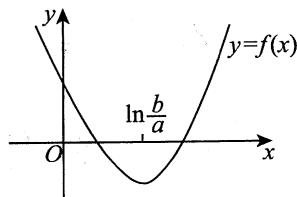

4.【答案】(D)

【解析】 $f^{\prime}(x) = \frac{1}{x} -\frac{1}{e} = \frac{e - x}{ex}\stackrel {\text{令}}{=}0,$

得 $x = \mathsf{e}$ ，又 $f''(x) = -\frac{1}{x^2} < 0$ ，故 $x = \mathbf{e}$ 是唯一极大值点，极大值为 $f(\mathfrak{e}) = a$ ：

又 $\lim_{x\to 0^{+}}f(x) = \lim_{x\to 0^{+}}\left(\ln x - \frac{x}{e} +a\right) = -\infty ,$

$$
\lim  _ {x \rightarrow + \infty} f (x) = \lim  _ {x \rightarrow + \infty} \left(\ln x - \frac {x}{e} + a\right) = \lim  _ {x \rightarrow + \infty} x \left(\frac {\ln x}{x} - \frac {1}{e} + \frac {a}{x}\right) = - \infty ,
$$

于是当 $a > 0$ 时， $f(\mathfrak{e}) > 0$ ，且 $f(x)$ 在 $(0, \mathfrak{e}), (\mathfrak{e}, +\infty)$ 上均单调，由零点定理知， $f(x)$ 有两个零点.

5.【答案】 $\frac{\sqrt{3}}{3}$

【解析】由 $\arcsin x = \frac{x}{\sqrt{1 - (\theta x)^2}}$ ，可得当 $x\neq 0$ 时，

$$
\theta^ {2} = \frac {1 - \frac {x ^ {2}}{\arcsin^ {2} x}}{x ^ {2}} = \frac {\arcsin^ {2} x - x ^ {2}}{\arcsin^ {2} x \cdot x ^ {2}},
$$

故

$$
\lim  _ {x \rightarrow 0} \theta = \lim  _ {x \rightarrow 0} \sqrt {\frac {\arcsin^ {2} x - x ^ {2}}{\arcsin^ {2} x \cdot x ^ {2}}} = \lim  _ {x \rightarrow 0} \sqrt {\frac {(\arcsin x + x) (\arcsin x - x)}{x ^ {4}}}.
$$

因为当 $x \to 0$ 时， $\arcsin x = x + \frac{1}{6} x^3 + o(x^3)$ ，故 $(\arcsin x + x)(\arcsin x - x) \sim \frac{1}{3} x^4 (x \to 0)$ ，所以原式 $= \frac{\sqrt{3}}{3}$ .

6.【解析】令 $f(t) = \ln (1 + t), t > 0$ ，在 $[0, x]$ 上对 $f(t)$ 用拉格朗日中值定理，有

$$
f (x) - f (0) = f ^ {\prime} (\xi) (x - 0), \xi \in (0, x),
$$

即 $\ln (1 + x) = \frac{1}{1 + \xi} \cdot x$ ，由于 $\frac{1}{1 + x} < \frac{1}{1 + \xi} < 1$ ，故 $\frac{x}{1 + x} < \ln (1 + x) < x (x > 0)$ .

7.【解析】令 $f(t) = \ln t, t > 0$ ，在 $[x,1 + x]$ 上对 $f(t)$ 用拉格朗日中值定理，有

$$
\ln (1 + x) - \ln x = \frac {1}{\xi}, x <   \xi <   x + 1,
$$

故 $\frac{1}{1 + x} < \ln \left(1 + \frac{1}{x}\right) < \frac{1}{x} (x > 0)$ .

【注】 $\ln \left(1 + \frac{1}{x}\right) = \ln \frac{1 + x}{x} = \ln (1 + x) - \ln x$ ，这一步构造出了 $f(b) - f(a)$ ：

8.【解析】因 $f(x) - f(0) = f'(\xi)x$ ， $x\in (0,1)$ ， $\xi \in (0,x)$ ，又 $f(0) = 1$ ， $\left|f^{\prime}(\xi)\right|\leqslant 1$ ，于是当 $0 < x < 1$ 时，有 $\left|f(x)\right| = \left|f(0) + f'(\xi)x\right|\leqslant 1 + \left|f'(\xi)\right|x\leqslant 1 + x$ ：

【注】进一步地，令 $f(0) = f(1) = 1$ ，由 $-1\leqslant f^{\prime}(x)\leqslant 1$ ，可证得当 $0 <   x <   1$ 时，

$$
\begin{array}{l} f (x) = f (0) + f ^ {\prime} \left(\xi_ {1}\right) x \leqslant 1 + x, \xi_ {1} \in (0, x), \\ f (x) = f (0) + f ^ {\prime} \left(\xi_ {2}\right) x \geqslant 1 - x, \xi_ {2} \in (0, x), \\ f (x) = f (1) + f ^ {\prime} \left(\xi_ {3}\right) (x - 1) \geqslant 1 + (x - 1) = x, \xi_ {3} \in (x, 1), \\ f (x) = f (1) + f ^ {\prime} \left(\xi_ {4}\right) (x - 1) \leqslant 1 - (x - 1) = 2 - x, \xi_ {4} \in (x, 1), \\ \end{array}
$$

也即 $f(x)$ 在 $(0,1)$ 上被包在由 $y = 1 + x$ ， $y = x$ ， $y = 1 - x$ ， $y = 2 - x$ 四条直线所围平面区域内(见图).这能直观地让考生感受到拉格朗日中值定理的重要作用之一：用 $f^{\prime}(x)$ 的大小来限定 $f(x)$ 的变化幅度大小.此题中，由于 $\left|f^{\prime}(x)\right|\leqslant 1$ ，故 $f(x)$ 被限定在一个小的区域内.

# 9.【答案】(C)

【解析】由拉格朗日中值定理知，

$$
f (x + 1) - f (x) = f ^ {\prime} (\xi), a \leqslant x <   \xi <   x + 1,
$$

故 $\lim_{x\to +\infty}\left[f(x + 1) - f(x)\right] = \lim_{x\to +\infty}f'(\xi)\xrightarrow{x <   \xi <  x + 1}\lim_{\xi \to +\infty}f'(\xi) = 0.$ (C) 正确.

取 $f(x) = \sqrt{x}$ ，则 $\lim_{x\to +\infty}(\sqrt{2x} +\sqrt{x}) = +\infty ,$

$$
\lim  _ {x \rightarrow + \infty} (\sqrt {2 x} - \sqrt {x}) = + \infty ,
$$

$$
\lim  _ {x \rightarrow + \infty} (\sqrt {x + 1} + \sqrt {x}) = + \infty .
$$

可排除(A)，(B)，(D).

【注】当 $x \to +\infty$ 时， $f'(x) \to 0$ 。意味着当 $x \to +\infty$ 时， $f(x)$ 的变化率 $\rightarrow 0$ ，于是 $f(x + 1) - f(x) \to 0 (x \to +\infty)$ 也就顺理成章了。

# 10.【答案】2

【解析】 $\ln 1 = 0$ ，当 $x > 1$ 时，

$$
\frac {f (x) - f (1)}{\ln x} = \frac {f (x) - f (1)}{\ln x - \ln 1}   \frac {\text {柯 西 中 值 定 理}}{1}   \frac {f ^ {\prime} (\xi)}{\frac {1}{\xi}} = \xi f ^ {\prime} (\xi) ,   1 <   \xi <   x .
$$

当 $x \to 1^{+}$ 时， $\xi \to 1^{+}$ ，于是原式 $= \lim_{\xi \to 1^{+}} \xi f'(\xi) = f'(1) = 2$ 。

【注】本题用洛必达法则或导数定义法亦可.

$$
\lim  _ {x \to 1 ^ {+}} {\frac {f (x) - f (1)}{\ln x}}   {\frac {\text {洛 必 达 法 则}}{x \to 1 ^ {+}}}   \lim  _ {x \to 1 ^ {+}} {\frac {f ^ {\prime} (x)}{{\frac {1}{x}}}} = \lim  _ {x \to 1 ^ {+}} x f ^ {\prime} (x) = 2 .
$$

如何用导数定义求解？见下题.

11.【解析】注意本题与上题的区别，本题未讲 $f(x)$ 在 $x = 1$ 处一阶导数连续，只有 $f(x)$ 在 $x = 1$ 处可导，上述洛必达法则和柯西中值定理均不可用。改用导数的定义来求解：

$\lim_{x \to 1^{+}} \frac{\frac{f(x) - f(1)}{x - 1}}{\frac{\ln x - \ln 1}{x - 1}} = \frac{f_{+}^{\prime}(1)}{\left. \frac{1}{x} \right|_{x=1}} = \frac{2}{1} = 2.$

12.【解析】(1) $\sin x = \sin 0 + (\sin x)'\Big|_{x = 0} \cdot x + \frac{(\sin x)''}{2!} \cdot x^2 = x - \frac{\sin\xi}{2} x^2$ ( $\xi$ 介于0, $x$ 之间).

(2) $\left|\frac{\sin x}{x} - 1\right| = \left|\frac{x - \frac{\sin\xi}{2}x^2}{x} - 1\right| = \left|1 - \frac{\sin\xi}{2}x - 1\right| \leqslant \frac{1}{2}\left|x\right|(x \neq 0)$ .

13.【解析】令 $f(x) = \mathrm{e}^{-\frac{x}{2}} - x^3 + 3x$ ，则

$$
f ^ {\prime} (x) = - \frac {1}{2} e ^ {- \frac {x}{2}} - 3 x ^ {2} + 3, f ^ {\prime \prime} (x) = \frac {1}{4} e ^ {- \frac {x}{2}} - 6 x, f ^ {\prime \prime} (x) = - \frac {1}{8} e ^ {- \frac {x}{2}} - 6,
$$

至此，由 $\mathrm{e}^{-\frac{x}{2}} > 0$ ，有 $f^{\prime \prime}(x) < 0$ ，即 $f''(x) = 0$ 无实根，则 $f(x) = 0$ 至多有3个实根.

取 $x = -\sqrt{3}$ ，有 $f(-\sqrt{3}) = \mathrm{e}^{\frac{\sqrt{3}}{2}} > 0$ ；取 $x = -1$ ，有 $f(-1) = \mathrm{e}^{\frac{1}{2}} - 2 < 0$

取 $x = 1$ ，有 $f(1) = \mathrm{e}^{-\frac{1}{2}} + 2 > 0$ ；取 $x = 2$ ，有 $f(2) = \mathrm{e}^{-1} - 2 < 0$ ：

故 $f(x) = 0$ 在 $(- \sqrt{3}, -1)$ , $(-1, 1)$ , $(1, 2)$ 内各有一个实根.

综上，两曲线恰有3个交点.

# 14.【答案】(B)

【解析】令 $F(x) = \frac{f(x)}{x}$ ，则 $F^{\prime}(x) = \frac{xf^{\prime}(x) - f(x)}{x^{2}}$

又因为当 $0 < a < x < b$ 时， $xf'(x) < f(x)$ ，所以在 $(a, b)$ 内有 $F'(x) < 0$ ， $F(x)$ 单调减少，从而 $F(a) > F(x) > F(b)$ ，即 $\frac{f(a)}{a} > \frac{f(x)}{x} > \frac{f(b)}{b}$ .

故选项(B)成立.

# 15.【答案】(A)

【解析】方法一设 $f(x) = x^4 + 4x + b$ ，方程有两个不等实根，等价于函数 $f(x)$ 有两个零点，根据4次函数的几何图形可知，此时 $f(x)$ 的极小值应小于零.

$$
f ^ {\prime} (x) = 4 x ^ {3} + 4 = 4 (x + 1) \left(x ^ {2} - x + 1\right).
$$

由 $f^{\prime}(x) = 0$ 得唯一驻点 $x = -1$

又 $f''(x) = 12x^2 \geqslant 0$ ，所以 $x = -1$ 为极小值点.

由 $f(-1) = 1 - 4 + b < 0$ 可得 $b < 3$

方法二 令 $f_{1}(x) = x^{4}$ ， $f_{2}(x) = -4x - b$ ，如图所示，方程 $x^{4} + 4x + b = 0$ 有两个不等的实根意味着 $f_{1}(x)$ 与 $f_{2}(x)$ 有两个交点.

当 $f_{2}(x)$ 与 $f_{1}(x)$ 相切时， $f_{1}(x)$ 与 $f_{2}(x)$ 恰好有一个交点，此时

$$
f _ {1} ^ {\prime} (x) = 4 x ^ {3} = f _ {2} ^ {\prime} (x) = - 4,
$$

解得 $x = -1$ ，此时 $f_{1}(-1) = 1$ ，因此 $f_{2}(-1) = 4 - b = 1$ ，即 $b = 3$ ，则 $f_{2}(x) = -4x - 3$ ：

结合图形, 知 $-b > -3$ , 即 $b < 3$ 时, 才能使得 $f_{1}(x)$ 与 $f_{2}(x)$ 有两个交点.

# 16.【答案】(B)

【解析】令 $g(x) = \ln x - \frac{x}{\mathrm{e}} + k$ ，易知 $g'(x) = \frac{1}{x} - \frac{1}{\mathrm{e}}$ 。当 $x > \mathrm{e}$ 时， $g'(x) < 0$ ；当 $0 < x < \mathrm{e}$ 时， $g'(x) > 0$ 。故在 $(0, \mathrm{e})$ 和 $(\mathrm{e}, +\infty)$ 内 $g(x)$ 分别至多有一个零点，又 $g(\mathrm{e}) = k > 0$ ， $\lim_{x \to 0^+} g(x) = -\infty$ ， $\lim_{x \to +\infty} g(x) = -\infty$ ，所以 $g(x)$ 在 $(0, +\infty)$ 内有两个零点。不妨设 $g(x)$ 的两个零点分别为 $x_1$ 和 $x_2$ ，又 $\lim_{x \to x_1} f(x) = \infty$ ， $\lim_{x \to x_2} f(x) = \infty$ ，故 $x_1$ 和 $x_2$ 均为 $f(x)$ 的无穷间断点，所以 $f(x)$ 在 $(0, +\infty)$ 内有两个间断点，故答案选(B)。

# 17.【答案】(D)

【解析】令 $F(x) = \frac{f(x)}{g(x)}$ ，由 $f'(x)g(x) - f(x)g'(x) < 0$ 可知

$$
F ^ {\prime} (x) = \left[ \frac {f (x)}{g (x)} \right] ^ {\prime} = \frac {f ^ {\prime} (x) g (x) - f (x) g ^ {\prime} (x)}{g ^ {2} (x)} <   0.
$$

从而函数 $\frac{f(x)}{g(x)}$ 单调减少，故有 $\frac{f(a)}{g(a)} > \frac{f(x)}{g(x)} > \frac{f(b)}{g(b)}$ .

由上述不等式可知选项(A)，(B)，(C)三个不等式不一定成立.

而由 $\frac{f(x)}{g(x)} >\frac{f(b)}{g(b)}$ 可知选项(D)正确.

18.【分析】欲证不等式需找出基本函数 $f(x)$ ，按常规方法求出 $f(x)$ 的极值与最值，再进行比较，即可得证.

【解析】令 $f(x) = x^{p} + (1 - x)^{p}$ ，则

$$
f ^ {\prime} (x) = p x ^ {p - 1} + p (1 - x) ^ {p - 1} (- 1) = p \left[ x ^ {p - 1} - (1 - x) ^ {p - 1} \right],
$$

$$
f ^ {\prime \prime} (x) = p (p - 1) x ^ {p - 2} + p (p - 1) (1 - x) ^ {p - 2},
$$

令 $f^{\prime}(x) = 0$ 可得 $x = \frac{1}{2}$ .

又因 $p > 1$ ，故 $f''\left(\frac{1}{2}\right) = 2p(p - 1)\left(\frac{1}{2}\right)^{p - 2} > 0$ ，于是 $f(x)$ 在 $x = \frac{1}{2}$ 处取得极小值 $f\left(\frac{1}{2}\right) = \frac{1}{2^{p - 1}}$

由于 $f(0) = f(1) = 1$ ，于是 $f(x)$ 在 $[0,1]$ 上的最小值为 $\frac{1}{2^{p - 1}}$ ，最大值为1.

故有 $\frac{1}{2^{p - 1}}\leqslant f(x)\leqslant 1$ ，即 $\frac{1}{2^{p - 1}}\leqslant x^p +(1 - x)^p\leqslant 1$

19.【分析】方程 $x^{3} - 3x + k = 0$ 是三次方程，它可能有一个实根，两个实根或者三个实根。根的个数取决于曲线 $y = x^{3} - 3x + k$ 与 $x$ 轴交点的个数。曲线 $y = x^{3} - 3x + k$ 与 $x$ 轴相切时，该切点必为 $y = x^{3} - 3x + k$ 的极值点。

【解析】设 $y = x^3 - 3x + k$ ，则当 $x \to +\infty$ 时， $y \to +\infty$ ；当 $x \to -\infty$ 时， $y \to -\infty$ . $y' = 3x^2 - 3$ ，令 $y' = 0$ ，可得 $x = -1$ 或 1.

又 $y'' = 6x$ ，由极值点的第二充分条件可知， $y''|_{x=-1} = -6 < 0$ ，则 $y|_{x=-1} = k + 2$ 为极大值； $y''|_{x=1} = 6 > 0$ ，则 $y|_{x=1} = k - 2$ 为极小值.

当极大值 $k + 2 < 0$ ，极小值 $k - 2 < 0$ 时，方程只有一个实根.同理，当极小值 $k - 2 > 0$ ，极大值 $k + 2 > 0$ 时，方程也只有一个实根.

当 $k + 2 = 0$ 或 $k - 2 = 0$ 时，方程有两个实根.当 $k + 2 > 0$ 且 $k - 2 <   0$ 时，方程有三个实根.

综上，当 $k > 2$ 或 $k < -2$ 时，方程有一个实根；当 $k = \pm 2$ 时，方程有两个实根；当 $-2 < k < 2$ 时，方程有三个实根.

20.【分析】欲证结论，相当于证明在 $(a,b)$ 内至少有一点满足

$$
\left(b ^ {2} - a ^ {2}\right) f ^ {\prime} (x) - 2 x \left[ f (b) - f (a) \right] = 0.
$$

由于 $f(x)$ 在 $[a,b]$ 上连续，在 $(a,b)$ 内可导，因此，构造函数 $F(x) = (b^{2} - a^{2})f(x) -$

# 第6章 一元函数微分学的应用（二）——中值定理、微分等式与微分不等式

$x^{2}\left[f(b) - f(a)\right]$ , 使 $F^{\prime}(x) = (b^{2} - a^{2})f^{\prime}(x) - 2x\left[f(b) - f(a)\right]$ , 于是 $F(x)$ 在 $[a,b]$ 上连续, 在 $(a,b)$ 内可导, 如果能验证 $F(a) = F(b)$ , 则由罗尔定理可证原命题成立.

【解析】构造函数 $F(x) = (b^{2} - a^{2})f(x) - [f(b) - f(a)]x^{2}$ ，由 $f(x)$ 在 $[a,b]$ 上连续，在 $(a,b)$ 内可导，可知 $F(x)$ 也在 $[a,b]$ 上连续，在 $(a,b)$ 内可导，又 $F(a) = b^{2}f(a) - a^{2}f(b) = F(b)$ ，则由罗尔定理可知，至少存在一点 $\xi \in (a,b)$ ，使

$$
F ^ {\prime} (\xi) = (b ^ {2} - a ^ {2}) f ^ {\prime} (\xi) - 2 \xi \left[ f (b) - f (a) \right] = 0,
$$

命题得证.

# 21.【答案】(B)

【解析】令 $f(x) = a_{0}x + \frac{a_{1}}{2} x^{2} + \dots + \frac{a_{n}}{n + 1} x^{n + 1}$ ，则 $f(x)$ 在 $[0,1]$ 上连续，在(0,1)内可导，且

$$
f (0) = 0, f (1) = a _ {0} + \frac {a _ {1}}{2} + \dots + \frac {a _ {n}}{n + 1} = 0.
$$

故由罗尔定理知, 至少存在一点 $\xi \in (0,1)$ , 使 $f'(\xi) = 0$ , 即 $a_0 + a_1\xi + \dots + a_n\xi^n = 0$ , 亦即方程 $a_0 + a_1x + \dots + a_nx^n = 0$ 在 $(0,1)$ 内至少有一个实根 $\xi$ .

22.【解析】(1)令 $G(x) = f(x) - \frac{f(c) - f(a)}{c - a} (x - a)$

则 $G(a) = f(a) = G(c)$

又 $G(x)$ 在 $[a,c]$ 上连续，在 $(a,c)$ 内可导，故根据罗尔定理可知，存在 $\xi \in (a,c)$ ，使得 $G'(\xi) = 0$ ，即 $f'(\xi) = \frac{f(c) - f(a)}{c - a}$ ，原命题得证.

(2) 由(1)可知，

$$
\begin{array}{l} \frac {f (b) - f (a)}{b - a} = \frac {f (b) - f (c) + f (c) - f (a)}{b - a} \\ = \frac {f (b) - f (c)}{b - c} \cdot \frac {b - c}{b - a} + \frac {f (c) - f (a)}{c - a} \cdot \frac {c - a}{b - a} \\ = f ^ {\prime} (\gamma) \cdot \frac {b - c}{b - a} + f ^ {\prime} (\xi) \cdot \frac {c - a}{b - a}, \\ \end{array}
$$

其中 $\gamma \in (c,b)$ . 令 $\frac{b - c}{b - a} = t$ , 则 $\frac{c - a}{b - a} = 1 - t$ , $0 < t < 1$ , 故 $\frac{f(b) - f(a)}{b - a} = tf'(\gamma) + (1 - t)f'(\xi)$ 介于 $f'(\gamma)$ 与 $f'(\xi)$ 之间 (当 $f'(\gamma) = f'(\xi)$ 时, 取 $\eta = \gamma$ 显然得证), 于是, 由导数的介值定理可知, 存在 $\eta$ 使得 $\eta > \xi$ , 原命题得证.

# 第7章 一元函数微分学的应用（三）

# 物理应用

# 1.【答案】 $82~\mathrm{cm / s}$

【解析】设 $P(x,y)$ ，则点 $P$ 到原点的距离为 $l = \sqrt{x^2 + y^2}$ ，且 $9y = 4x^{2}$ ，两个等式均对 $t$ 求导，得 $\frac{\mathrm{d}l}{\mathrm{d}t} = \frac{x\frac{\mathrm{d}x}{\mathrm{d}t} + y\frac{\mathrm{d}y}{\mathrm{d}t}}{\sqrt{x^2 + y^2}},9\frac{\mathrm{d}y}{\mathrm{d}t} = 8x\frac{\mathrm{d}x}{\mathrm{d}t}.$ 由题设， $x = 3$ ， $y = 4$ ， $\frac{\mathrm{d}x}{\mathrm{d}t} = 30$ ，则 $\frac{\mathrm{d}y}{\mathrm{d}t} = 80~\mathrm{cm / s}$ ， $\frac{\mathrm{d}l}{\mathrm{d}t} = 82~\mathrm{cm / s}$ ：

# 2.【答案】(A)

【解析】 $t \in (0,3)$ 时， $f(t)$ 为凸曲线，故 $f''(t) < 0$ ，于是有 $f'(t)$ 单调递减； $t \in (7,10)$ 时， $f(t)$ 为凹曲线，故 $f''(t) > 0$ ，于是有 $f'(t)$ 单调递增.

$f^{\prime}(t)$ 即为心跳次数对时间 $t$ 的变化率，即心跳次数增长速度.故选(A).

3.【解析】由题意， $\frac{\mathrm{d}V}{\mathrm{d}t} = 1$ ，又 $V = \frac{\pi}{2} y^2$ ，则 $\frac{\mathrm{d}V}{\mathrm{d}t} = \pi y\frac{\mathrm{d}y}{\mathrm{d}t}$ 故 $\left.\frac{\mathrm{d}y}{\mathrm{d}t}\right|_{y=1} = \left.\frac{\mathrm{d}V}{\mathrm{d}t}\right|_{y=1} = \left.\frac{1}{\pi y}\right|_{y=1} = \frac{1}{\pi}$ (m/min).

# 4.【答案】(B)

【解析】设圆柱体的底面半径为 $r\mathrm{cm}$ ，高为 $h\mathrm{cm}$ ，体积为 $V\mathrm{cm}^3$ ，表面积为 $S\mathrm{cm}^2$ ，时间为 $t\mathrm{s}$ 则 $V = \pi r^2 h$ ， $S = 2\pi rh + 2\pi r^2$ ，所以 $\frac{\mathrm{d}V}{\mathrm{d}t} = 2\pi rh\frac{\mathrm{d}r}{\mathrm{d}t} +\pi r^2\frac{\mathrm{d}h}{\mathrm{d}t},\frac{\mathrm{d}S}{\mathrm{d}t} = 2\pi h\frac{\mathrm{d}r}{\mathrm{d}t} +2\pi r\frac{\mathrm{d}h}{\mathrm{d}t} +4\pi r\frac{\mathrm{d}r}{\mathrm{d}t}.$

由题设， $\frac{\mathrm{d}r}{\mathrm{d}t} = 2$ ， $\frac{\mathrm{d}h}{\mathrm{d}t} = -3$ ， $\frac{\mathrm{d}V}{\mathrm{d}t} = -100\pi$ ， $\frac{\mathrm{d}S}{\mathrm{d}t} = 40\pi$ ，代入上式，舍去负值，得 $r = 10$ ， $h = 5$ ：

# 5.【答案】(D)

【解析】设时间为 $t$ s时，物体离地面的距离为 $h(t)\mathrm{m}$ ，观测器视线的倾角为 $\theta (t)$ ，如图所示，则有 $\theta (t) = \arctan {\frac{h(t)}{10}}$ ，故

$$
\frac {\mathrm {d} [ \theta (t) ]}{\mathrm {d} t} = \frac {\frac {1}{1 0}}{1 + \left[ \frac {h (t)}{1 0} \right] ^ {2}} \cdot \frac {\mathrm {d} [ h (t) ]}{\mathrm {d} t}.
$$

当 $h(t) = 20$ 时， $\frac{\mathrm{d}[h(t)]}{\mathrm{d}t} = a$ ，得 $\frac{\mathrm{d}[\theta(t)]}{\mathrm{d}t} = \frac{a}{50} = \frac{1}{10}$ 即 $a = 5$ ：

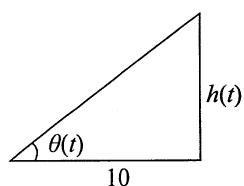

# 第8章 一元函数和分学的概念与性质

# 1.【答案】(B)

【解析】方法一 若函数 $f(x)$ 在区间 $[0,1]$ 上连续，由定积分的定义，对任意的划分

$$
T: 0 = x _ {0} <   x _ {1} <   \dots <   x _ {n} = 1,
$$

以及任意的 $\xi_{k}\in \left[x_{k - 1},x_{k}\right](1\leqslant k\leqslant n)$ ，均有 $\int_0^1 f(x)\mathrm{d}x = \lim_{\lambda (T)\to 0}\sum_{k = 1}^n f(\xi_k)\Delta x_k$ ，其中 $\Delta x_{k} = x_{k} - x_{k - 1}$ $\lambda (T) = \max_{1\leqslant k\leqslant n}\{\Delta x_k\}$

选项(A)中，分割 $T$ 是将区间 $[0,1]$ 作 $n$ 等分，点 $\xi_{k} = \frac{3k - 1}{3n}$ 为各个小区间的内点，区间长度应该为 $\frac{1}{n}$ ，而该选项错误地取为 $\frac{1}{3n}$ ，所以计算结果应为 $\frac{1}{3}\int_{0}^{1}f(x)\mathrm{d}x$ 。

选项(C)中，分割 $T$ 是将区间 $[0,1]$ 作 $3n$ 等分，点 $\xi_{k} = \frac{k - 1}{3n}$ 为各个小区间的左端点，区间长度应该为 $\frac{1}{3n}$ ，而该选项错误地取为 $\frac{1}{n}$ ，所以计算结果应为 $3\int_{0}^{1}f(x)\mathrm{d}x$ 。

选项(D)中，分割 $T$ 是将区间 $[0,1]$ 作 $3n$ 等分，点 $\xi_{k} = \frac{k}{3n}$ 为各个小区间的右端点，区间长度应该为 $\frac{1}{3n}$ ，而该选项错误地取为 $\frac{3}{n}$ ，所以计算结果应为 $9\int_{0}^{1}f(x)\mathrm{d}x$ 。

只有选项(B)中，分割 $T$ 是将区间 $[0,1]$ 作 $n$ 等分，点 $\xi_{k} = \frac{3k - 1}{3n}$ 为各个小区间的内点，区间长度为 $\frac{1}{n}$ ，计算结果为 $\int_0^1 f(x)\mathrm{d}x$ 。

故选(B).

方法二 作为选择题，本题也可以利用特殊值法得到正确答案.

取 $f(x) = 1$ ，则 $\int_0^1 f(x)\mathrm{d}x = 1$ .而

$$
\begin{array}{l} \lim  _ {n \rightarrow \infty} \sum_ {k = 1} ^ {n} f \left(\frac {3 k - 1}{3 n}\right) \frac {1}{3 n} = \lim  _ {n \rightarrow \infty} \sum_ {k = 1} ^ {n} \frac {1}{3 n} = \frac {1}{3}, \lim  _ {n \rightarrow \infty} \sum_ {k = 1} ^ {n} f \left(\frac {3 k - 1}{3 n}\right) \frac {1}{n} = \lim  _ {n \rightarrow \infty} \sum_ {k = 1} ^ {n} \frac {1}{n} = 1, \\ \lim  _ {n \rightarrow \infty} \sum_ {k = 1} ^ {3 n} f \left(\frac {k - 1}{3 n}\right) \frac {1}{n} = \lim  _ {n \rightarrow \infty} \sum_ {k = 1} ^ {3 n} \frac {1}{n} = 3, \lim  _ {n \rightarrow \infty} \sum_ {k = 1} ^ {3 n} f \left(\frac {k}{3 n}\right) \frac {3}{n} = \lim  _ {n \rightarrow \infty} \sum_ {k = 1} ^ {3 n} \frac {3}{n} = 9, \\ \end{array}
$$

所以选项(A)，(C)，(D)都不是正确选项，故选(B).

2.【答案】 $-\frac{1}{9}$

【解析】原式 $= \lim_{n\to \infty}\frac{1}{n}\cdot \left[\frac{1^2}{n^2}\ln \frac{1}{n} +\frac{2^2}{n^2}\ln \frac{2}{n} +\dots +\frac{(n - 1)^2}{n^2}\ln \frac{n - 1}{n} +\frac{n^2}{n^2}\ln \frac{n}{n}\right]$

$$
= \int_ {0} ^ {1} x ^ {2} \ln x d x = \int_ {0} ^ {1} \ln x d \left(\frac {x ^ {3}}{3}\right) = \frac {x ^ {3}}{3} \ln x \Bigg | _ {0} ^ {1} - \int_ {0} ^ {1} \frac {x ^ {3}}{3} \cdot \frac {1}{x} d x = - \frac {1}{9}.
$$

# 3.【答案】(B)

【解析】设 $t$ 时刻甲在乙前面 $s\mathrm{m}$ 处，由题图，可画出 $s = s(t)$ 的大致图形，如图所示，从而可知 $s(0) = 10 > 0$ ， $s(t_{1}) = -5 < 0$ ， $s(t_{2}) = 15 > 0$ ， $s(t_{3}) = 5 > 0$ ，由问题的实际意义可知， $s(t)$ 为连续函数，故由零点定理，有 $s(\xi_1) = s(\xi_2) = 0(\xi_1 \in (0, t_1), \xi_2 \in (t_1, t_2))$ 即在 $[0, t_3]$ 上，甲、乙相遇的次数为2.

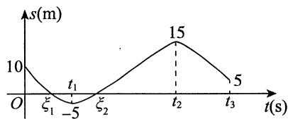

# 4.【答案】(C)

【解析】 $M = \int_{-\frac{1}{2}}^{\frac{1}{2}} 1 \mathrm{~d}x + \int_{-\frac{1}{2}}^{\frac{1}{2}} \frac{x}{1 + x^2} \mathrm{~d}x$ ，因为 $\int_{-\frac{1}{2}}^{\frac{1}{2}} \frac{x}{1 + x^2} \mathrm{~d}x = 0$ ，所以 $M = 1$ 。

令 $g(x) = (1 + x)\ln^2 (1 + x) - x^2 (0\leqslant x\leqslant 1)$ ，则有

$$
g ^ {\prime} (x) = \ln^ {2} (1 + x) + (1 + x) 2 \ln (1 + x) \frac {1}{1 + x} - 2 x = \ln^ {2} (1 + x) + 2 \ln (1 + x) - 2 x,
$$

$$
g ^ {\prime \prime} (x) = \frac {2 \ln (1 + x)}{1 + x} + \frac {2}{1 + x} - 2 = \frac {2 \ln (1 + x) + 2 - 2 (1 + x)}{1 + x} = \frac {2 \ln (1 + x) - 2 x}{1 + x}.
$$

因为 $x > 0$ 时， $\ln (1 + x) < x$ ，所以 $\ln (1 + x) - x < 0$ ，即有 $g''(x) < 0$ ， $g'(x)$ 在区间 $[0,1]$ 上单调减少，所以 $g'(x) < g'(0) = 0 (0 < x \leqslant 1)$ ，即 $g(x)$ 在区间 $[0,1]$ 上单调减少，所以 $g(x) < g(0) = 0 (0 < x \leqslant 1)$ ，即 $(1 + x)\ln^2 (1 + x) - x^2 < 0 (0 < x \leqslant 1)$ ，故 $\frac{(1 + x)\ln^2(1 + x)}{x^2} < 1$ ，所以 $\int_0^1\frac{(1 + x)\ln^2(1 + x)}{x^2}\mathrm{d}x < \int_0^1\mathrm{d}x = 1$ ，即 $N < M$ ：

当 $x > 0$ 时， $\mathrm{e}^x >1 + x$ ，所以 $\frac{\mathrm{e}^x}{1 + x} >1,\int_0^1\frac{\mathrm{e}^x}{1 + x}\mathrm{d}x > \int_0^1 1\mathrm{d}x = 1$ ，即 $K > M$

综上所述， $K > M > N$ ，故选(C).

# 5.【答案】(A)

【解析】由于 $f(x)$ 是 $(0, +\infty)$ 内的正值连续函数，则

$$
g \left(\frac {1}{2}\right) = \int_ {1} ^ {\frac {1}{2}} f (t) \mathrm {d} t <   0, g \left(\frac {3}{2}\right) = \int_ {1} ^ {\frac {3}{2}} f (t) \mathrm {d} t > 0.
$$

又 $f^{\prime}(x) < 0$ ，则 $f(x)$ 单调递减，故

$$
\left| g \left(\frac {1}{2}\right) \right| = \int_ {\frac {1}{2}} ^ {1} f (t) d t > \int_ {1} ^ {\frac {3}{2}} f (t) d t = \left| g \left(\frac {3}{2}\right) \right|.
$$

6.【答案】(A)

【解析】由题设， $f(-1) = f(1) = 0$ ， $\lim_{x\to +\infty}x\ln x = +\infty$ ， $\lim_{x\to 0^{+}}x\ln x = 0$ ， $\lim_{x\to -\infty}(x^2 +x) = +\infty$

当 $x > 0$ 时， $f'(x) = \ln x + 1 \stackrel{\text{令}}{=} 0$ ，得 $x = \frac{1}{\mathrm{e}}$

当 $x < 0$ 时， $f'(x) = 2x + 1 \stackrel{\text{令}}{=} 0$ ，得 $x = -\frac{1}{2}$ .

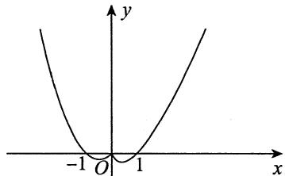

故在 $[-1,1]$ 上， $f(x) \leqslant 0$ ，其他区间上 $f(x)$ 均大于0，如图所示，于是 $\int_{a}^{b} f(x) \mathrm{d}x$ 的最小值为 $\int_{-1}^{1} f(x) \mathrm{d}x$ ，则 $a = -1$ ， $b = 1$ ：

7.【答案】(A)

【解析】因为在 $\left(0, \frac{\pi}{2}\right)$ 内 $g'(x) \geqslant 0$ ，所以 $g(x)$ 在 $\left(0, \frac{\pi}{2}\right)$ 内单调增加。又 $t \in \left(0, \frac{\pi}{2}\right)$ 时有 $t > \sin t$ ，因而，当 $t \in \left[0, \frac{\pi}{2}\right]$ 时， $g(t) \geqslant g(\sin t)$ ，从而当 $x \in \left(0, \frac{\pi}{2}\right)$ 时， $\int_{x}^{\frac{\pi}{2}} g(t) \mathrm{d}t \geqslant \int_{x}^{\frac{\pi}{2}} g(\sin t) \mathrm{d}t$ 成立。故正确选项为(A)。

【注】当 $0 < x < 1$ 时，有 $\int_{x}^{1} g(t) \mathrm{d}t \geqslant \int_{x}^{1} g(\sin t) \mathrm{d}t$ 成立；当 $1 < x < \frac{\pi}{2}$ 时，有 $\int_{x}^{1} g(t) \mathrm{d}t \leqslant \int_{x}^{1} g(\sin t) \mathrm{d}t$ 成立.

8.【答案】(C)

【解析】因为 $xf(x) = (\sqrt{1 - x^2})' = \frac{-x}{\sqrt{1 - x^2}}$ ，所以 $f(x) = \frac{-1}{\sqrt{1 - x^2}}$ ，故

$$
\int_ {0} ^ {1} \frac {1}{f (x)}   \mathrm {d} x = - \int_ {0} ^ {1} \sqrt {1 - x ^ {2}}   \mathrm {d} x   \frac {\text {定 积 分 的 几 何 意 义}}{} - \frac {\pi}{4} .
$$

故正确选项为(C).

【注】由定积分的几何意义知 $\int_0^1\sqrt{1 - x^2}\mathrm{d}x$ 等于单位圆在第一象限的面积，如图所示.

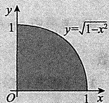

# 9.【答案】2

【解析】原式 $= \lim_{n\to \infty}\sum_{i = 1}^{n}\frac{1}{\sqrt{\frac{i}{n}}}\cdot \frac{1}{n} = \int_{0}^{1}\frac{1}{\sqrt{x}}\mathrm{d}x = 2\sqrt{x}\bigg|_{0}^{1} = 2.$

【注】设 $f(x)$ 在 $(0,1)$ 上单调，若反常积分 $\int_0^1 f(x)\mathrm{d}x$ 收敛，则

$$
\lim  _ {n \rightarrow \infty} \frac {f \left(\frac {1}{n}\right) + \cdots + f \left(\frac {n - 1}{n}\right)}{n} = \int_ {0} ^ {1} f (x) d x.
$$

解析 不妨设 $f(x)$ 在 $(0,1)$ 上是单调递增函数，则

$$
\begin{array}{l} \int_ {0} ^ {1 - \frac {1}{n}} f (x) d x = \sum_ {k = 1} ^ {n - 1} \int_ {\frac {k - 1}{n}} ^ {\frac {k}{n}} f (x) d x \\ \leqslant \sum_ {k = 1} ^ {n - 1} f \left(\frac {k}{n}\right) \cdot \frac {1}{n} = \frac {f \left(\frac {1}{n}\right) + \cdots + f \left(\frac {n - 1}{n}\right)}{n} \\ \leqslant \sum_ {k = 2} ^ {n} \int_ {\frac {k - 1}{n}} ^ {\frac {k}{n}} f (x) \mathrm {d} x = \int_ {\frac {1}{n}} ^ {1} f (x) \mathrm {d} x, \\ \end{array}
$$

由夹逼准则可知结论成立.

# 10.【答案】(A)

【解析】令 $x = -\frac{1}{2}$ ，代入题设等式，有 $f\left(\frac{1}{2}\right) - f\left(-\frac{1}{2}\right) = f(1)$ .

又 $f\left(\frac{1}{2}\right) = 0$ ，且 $f(x)$ 是奇函数，故 $2f\left(\frac{1}{2}\right) = 0 = f(1)$ ，所以 $f(x + 1) = f(x)$ ，故 $f(x)$ 是 $(-\infty, +\infty)$ 上可导的且周期为1的奇函数.

(A) 选项中 $\sin f(t)$ 是奇函数, $f(t + 1) = f(t)$ 是奇函数, 所以 $\int_0^x [\sin f(t) + f(t + 1)] \mathrm{d}t$ 是偶函数.  
(B) 选项中 $\sin f'(t)$ 是偶函数, $f'(t + 1) = f'(t)$ 是偶函数, 所以 $\int_{0}^{x} \left[\sin f'(t) + f'(t + 1)\right] \mathrm{d}t$ 是奇函数.  
(C) 选项中 $\cos f(t)$ 是偶函数, $f(t + 2) = f(t)$ 是奇函数, 所以 $\int_{0}^{x}[\cos f(t) + f(t + 2)]\mathrm{d}t$ 是非奇非偶函数.  
(D) 选项中 $\cos f'(t)$ 是偶函数, $f'(t + 2) = f'(t)$ 是偶函数, 所以 $\int_{0}^{x}[\cos f'(t) + f'(t + 2)]\mathrm{d}t$ 是奇函数.

# 11.【答案】(C)

【解析】在 $(- \infty, 0)$ 上考虑，由 $x_0$ 为 $f(x)$ 的零点可得

$$
f ^ {\prime} \left(x _ {0}\right) = f ^ {\prime} (- 1) = \lim  _ {x \rightarrow x _ {0}} \frac {f (x) - f \left(x _ {0}\right)}{x - x _ {0}} = \lim  _ {x \rightarrow x _ {0}} \frac {f (x)}{x - x _ {0}} = 1 > 0,
$$

由极限的保号性可知，存在 $\delta > 0$ ，在 $(x_0 - \delta, x_0) \cup (x_0, x_0 + \delta) \subset (-\infty, 0)$ 内有 $\frac{f(x)}{x - x_0} > 0$ 。因此，当 $x \in (x_0 - \delta, x_0)$ 时， $f(x) < 0$ ，当 $x \in (x_0, x_0 + \delta)$ 时， $f(x) > 0$ 。

由题设 $f(x)$ 在 $(- \infty, 0)$ 上有唯一零点 $x_0 = -1$ ，可得当 $x \in (-\infty, x_0 - \delta]$ 时， $f(x) < 0$ ，当 $x \in [x_0 + \delta, 0)$ 时， $f(x) > 0$ （理由见注）。

由题设 $f(x)$ 是实数集上连续的偶函数，可得当 $x\in (0,1)$ 时， $f(x) > 0$ ；当 $x\in (1, + \infty)$ 时， $f(x) <   0$ ：

综上所述，当 $x \in (-1, 1)$ 时， $f(x) \geqslant 0$ （仅在 $x = 0$ 处可能取到等号）；当 $x \in (-\infty, -1) \cup (1, +\infty)$ 时， $f(x) < 0$ 。因 $F'(x) = f(x)$ ，因此 $F(x)$ 在 $(-1, 1)$ 内严格单调增加。

故正确选项为(C).

【注】若 $f(x)$ 在 $(- \infty, 0)$ 上有唯一零点 $x_0 = -1$ 且当 $x \in (x_0 - \delta, x_0)$ 时 $f(x) < 0$ ，则当 $x \in (-\infty, x_0 - \delta]$ 时， $f(x) < 0$ 。

反证, 设存在 $x_{1} \in (-\infty, x_{0} - \delta]$ 使得 $f(x_{1}) > 0$ , 取 $x_{2} \in (x_{0} - \delta, x_{0})$ , 则有 $f(x_{2}) < 0$ , 利用连续函数的零点定理, 存在 $x_{3} \in (x_{1}, x_{2}) \subset (-\infty, x_{0})$ 使得 $f(x_{3}) = 0$ , 这与 $f(x)$ 在 $(- \infty, 0)$ 上有唯一零点 $x_{0} = -1$ 矛盾.

同理可证, 若 $f(x)$ 在 $(- \infty, 0)$ 上有唯一零点 $x_0 = -1$ 且当 $x \in (x_0, x_0 + \delta)$ 时 $f(x) > 0$ , 则当 $x \in [x_0 + \delta, 0)$ 时, $f(x) > 0$ .

# 12.【答案】(D)

【解析】根据题设条件，对任意 $x_{1}, x_{2} \in [0, 2]$ 总有 $f\left(\frac{x_{1} + x_{2}}{2}\right) > \frac{f(x_{1}) + f(x_{2})}{2}$ ，可知曲线 $f(x)$ 在 $[0, 2]$ 上是凸的，因 $f(x)$ 在 $[0, 2]$ 上单调连续，且 $f(0) = 1$ ， $f(2) = 2$ ，所以 $f(x)$ 在 $[0, 2]$ 上单调递增，进而 $f(x) > 0$ ， $x \in [0, 2]$ 。又 $g(x)$ 是 $f(x)$ 的反函数，因此， $g(1) = 0$ ， $g(2) = 2$ ， $g(x)$ 在 $[1, 2]$ 上是凹的，且 $g(x) > 0$ ， $x \in (1, 2]$ 。

如图所示，曲线 $CD$ 是 $f(x)$ 的图形，曲线 $AC$ 是 $g(x)$ 的图形.由定积分的几何意义， $P = \int_{1}^{2}g(x)\mathrm{d}x$ 表示图中曲边三角形 $ABC$ 的面积，显然 $P = \int_{1}^{2}g(x)\mathrm{d}x > 0$ ，而且 $P = \int_{1}^{2}g(x)\mathrm{d}x$ 小于直角三角形 $ABC$ 的面积，即 $P = \int_{1}^{2}g(x)\mathrm{d}x <   \frac{1}{2}\times 1\times 2 = 1.$ 因此有 $0 <   P = \int_{1}^{2}g(x)\mathrm{d}x <   1$ ：

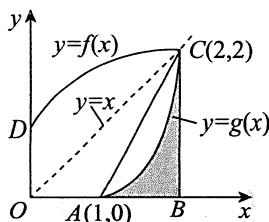

故正确选项为(D).

【注】特殊值代入法.

取 $f(x) = \sqrt{\frac{x}{2}} + 1$ ，则 $g(x) = 2(x - 1)^{2} (1 \leqslant x \leqslant 2)$ ，所以 $0 < P = \int_{1}^{2} g(x) \mathrm{d}x = \int_{1}^{2} 2(x - 1)^{2} \mathrm{d}x = \frac{2}{3} < 1$ .

13.【答案】(D)

【解析】由于 $\int_0^{+\infty}xe^{-x}\mathrm{d}x = -\int_0^{+\infty}xd(e^{-x}) = -x e^{-x}\Big|_0^{+\infty} + \int_0^{+\infty}e^{-x}\mathrm{d}x = -e^{-x}\Big|_0^{+\infty} = 1,$

$$
\int_ {- \infty} ^ {+ \infty} x \mathrm {e} ^ {- x ^ {2}} \mathrm {d} x = \frac {1}{2} \int_ {- \infty} ^ {+ \infty} \mathrm {e} ^ {- x ^ {2}} \mathrm {d} (x ^ {2}) = - \left. \frac {1}{2} \mathrm {e} ^ {- x ^ {2}} \right| _ {- \infty} ^ {+ \infty} = 0,
$$

$$
\int_ {- \infty} ^ {+ \infty} \frac {\arctan x}{1 + x ^ {2}} d x = \int_ {- \infty} ^ {+ \infty} \arctan x d (\arctan x) = \frac {1}{2} \arctan^ {2} x \Bigg | _ {- \infty} ^ {+ \infty} = 0,
$$

所以选项(A)，(B)，(C)中的积分都是收敛的，而

$$
\int_ {- \infty} ^ {+ \infty} \frac {x}{1 + x ^ {2}} d x = \int_ {- \infty} ^ {0} \frac {x}{1 + x ^ {2}} d x + \int_ {0} ^ {+ \infty} \frac {x}{1 + x ^ {2}} d x,
$$

又 $\int_{-\infty}^{0}\frac{x}{1 + x^2}\mathrm{d}x = \frac{1}{2}\int_{-\infty}^{0}\frac{\mathrm{d}(1 + x^2)}{1 + x^2} = \frac{1}{2}\ln (1 + x^2)\Bigg|_{-\infty}^{0},$

此积分发散，从而积分 $\int_{-\infty}^{+\infty}\frac{x}{1 + x^2}\mathrm{d}x$ 发散，选(D).

14.【答案】(C)

【解析】此积分为有一个瑕点 $x = 0$ 的无穷区间上的反常积分，可写为

$$
\int_ {0} ^ {+ \infty} \frac {\ln x}{(1 + x) x ^ {1 - p}} d x = \int_ {0} ^ {1} \frac {\ln x}{(1 + x) x ^ {1 - p}} d x + \int_ {1} ^ {+ \infty} \frac {\ln x}{(1 + x) x ^ {1 - p}} d x.
$$

对任意 $\varepsilon > 0$ ，有

$$
\lim  _ {x \rightarrow 0 ^ {+}} \frac {\frac {\ln x}{(1 + x) x ^ {1 - p}}}{\frac {1}{x ^ {1 - p + \varepsilon}}} = \lim  _ {x \rightarrow 0 ^ {+}} x ^ {\varepsilon} \ln x = 0,
$$

若 $\int_{0}^{1}\frac{1}{x^{1 - p + \varepsilon}}\mathrm{d}x$ 收敛, 即 $1 - p < 1, p > 0$ , 则 $\int_{0}^{1}\frac{\ln x}{(1 + x)x^{1 - p}}\mathrm{d}x$ 也收敛.

对任意 $\varepsilon > 0$ ，有

$$
\lim  _ {x \rightarrow + \infty} \frac {\frac {\ln x}{(1 + x) x ^ {1 - p}}}{\frac {1}{x ^ {2 - p - \varepsilon}}} = \lim  _ {x \rightarrow + \infty} \frac {\ln x}{x ^ {\varepsilon}} = 0,
$$

若 $\int_{1}^{+\infty}\frac{1}{x^{2 - p - \varepsilon}}\mathrm{d}x$ 收敛，即 $2 - p > 1,p <   1$ ，则 $\int_1^{+\infty}\frac{\ln x}{(1 + x)x^{1 - p}}\mathrm{d}x$ 也收敛.

综上，当 $0 < p < 1$ 时，反常积分 $\int_0^{+\infty}\frac{\ln x}{(1 + x)x^{1 - p}}\mathrm{d}x$ 收敛.

15.【答案】(B)

【解析】 $\int_{2}^{+\infty}\frac{1}{x\ln x}\mathrm{d}x = \ln \ln x\big|_{2}^{+\infty} = +\infty$ ，发散.

$$
\int_ {- 1} ^ {1} \frac {1}{\sin x} d x = \int_ {- 1} ^ {0} \frac {1}{\sin x} d x + \int_ {0} ^ {1} \frac {1}{\sin x} d x,
$$

当 $0 < x \leqslant 1$ 时, 有 $\frac{1}{\sin x} > \frac{1}{x}$ , 而 $\int_{0}^{1} \frac{\mathrm{d}x}{x} = +\infty$ , 发散, 故 $\int_{0}^{1} \frac{1}{\sin x} \mathrm{d}x = +\infty$ , 从而 $\int_{-1}^{1} \frac{1}{\sin x} \mathrm{d}x$ 发散.

又 $\int_0^1\frac{x}{\ln^2(1 + x)}\mathrm{d}x$ 与 $\int_0^1\frac{x}{x^2}\mathrm{d}x = \int_0^1\frac{1}{x}\mathrm{d}x$ 同敛散，故 $\int_0^1\frac{x}{\ln^2(1 + x)}\mathrm{d}x$ 发散.

因此，选项(A)，(C)，(D)都发散，选项(B)收敛(因 $\int_0^{+\infty}\mathrm{e}^{-x^2}\mathrm{d}x = \frac{\sqrt{\pi}}{2}$

16.【答案】 $\frac{\pi}{4}$

【解析】原式 $= \lim_{n\to \infty}\frac{1}{n}\left[\sqrt{1 - \left(\frac{1}{n}\right)^2} +\sqrt{1 - \left(\frac{2}{n}\right)^2} +\dots +\sqrt{1 - \left(\frac{n - 1}{n}\right)^2}\right]$

$$
= \int_ {0} ^ {1} \sqrt {1 - x ^ {2}} d x \xlongequal {x = \sin t} \int_ {0} ^ {\frac {\pi}{2}} \cos^ {2} t d t = \int_ {0} ^ {\frac {\pi}{2}} \frac {1 + \cos 2 t}{2} d t = \left(\frac {t}{2} + \frac {\sin 2 t}{4}\right) \Bigg | _ {0} ^ {\frac {\pi}{2}} = \frac {\pi}{4}.
$$

17.【答案】 $\frac{1}{3}\arctan 3$

【解析】因 $\frac{n}{n^2 + 9i^2} = \frac{n}{n^2\left[1 + 9\left(\frac{i}{n}\right)^2\right]} = \frac{1}{n} \cdot \frac{1}{1 + 9\left(\frac{i}{n}\right)^2},$

故 $\lim_{n\to \infty}\sum_{i = 1}^{n}\frac{n}{n^2 + 9i^2} = \lim_{n\to \infty}\sum_{i = 1}^{n}\frac{1}{n}\cdot \frac{1}{1 + 9\left(\frac{i}{n}\right)^2} = \int_0^1\frac{\mathrm{d}x}{1 + 9x^2} = \frac{1}{3}\arctan 3.$

18.【答案】(B)

【解析】令 $f(x) = \frac{\sin x}{x}$ , $x \in \left[\frac{\pi}{4}, \frac{\pi}{2}\right]$ ，则 $f'(x) = \frac{x\cos x - \sin x}{x^2}$ ，记 $g(x) = x\cos x - \sin x$ ，则 $g\left(\frac{\pi}{4}\right) = \frac{\sqrt{2}}{2}\left(\frac{\pi}{4} - 1\right) < 0$ ， $g'(x) = -x\sin x < 0\left(\frac{\pi}{4} \leqslant x \leqslant \frac{\pi}{2}\right)$ ，故 $g(x) < 0\left(\frac{\pi}{4} \leqslant x \leqslant \frac{\pi}{2}\right)$ ，即 $f'(x) < 0$ ，故 $f(x)$ 在 $\left[\frac{\pi}{4}, \frac{\pi}{2}\right]$ 上为单调递减函数.

当 $\frac{\pi}{4} \leqslant x \leqslant \frac{\pi}{2}$ 时，有 $f\left(\frac{\pi}{2}\right) \leqslant f(x) \leqslant f\left(\frac{\pi}{4}\right)$ ，即 $\frac{2}{\pi} \leqslant f(x) \leqslant \frac{2\sqrt{2}}{\pi}$ 。因此， $\frac{1}{2} \leqslant \int_{\frac{\pi}{4}}^{\frac{\pi}{2}} f(x) \mathrm{d}x \leqslant \frac{\sqrt{2}}{2}$ 。

# 19.【答案】(D)

【解析】对于选项(A)， $x^{3}\int_{0}^{x}f^{\prime}(t)\mathrm{d}t = x^{3}f(x)$ 为偶函数.

对于选项(B), $\int_0^x f(-t)\mathrm{d}t = -\int_0^x f(t)\mathrm{d}t$ 为偶函数.

对于选项(C), $\int_0^x [f'(t) + f(t)]\mathrm{d}t = f(x) + \int_0^x f(t)\mathrm{d}t,f(x)$ 为奇函数， $\int_0^x f(t)\mathrm{d}t$ 为偶函数，故二者之和是非奇非偶函数.

对于选项(D), 由于 $\left|f(x)\right|$ 为偶函数, 它的原函数中唯一的一个奇函数为 $\int_0^x\left|f(t)\right|\mathrm{d}t$ ，因此选择(D).

# 20.【答案】(D)

【解析】由于 $\frac{x}{1 + x^2}\cos^5 x$ 在 $\left[-\frac{\pi}{2},\frac{\pi}{2}\right]$ 上是奇函数，因此 $M = 0$

$$
N = \int_ {- \frac {\pi}{2}} ^ {\frac {\pi}{2}} \left(x ^ {2} \sin x + \sin^ {2} x \cos x\right) d x = 2 \int_ {0} ^ {\frac {\pi}{2}} \sin^ {2} x \cos x d x > 0,
$$

$$
P = \int_ {- \frac {\pi}{2}} ^ {\frac {\pi}{2}} (\sin^ {3} x - \cos^ {4} x) \mathrm {d} x = - 2 \int_ {0} ^ {\frac {\pi}{2}} \cos^ {4} x \mathrm {d} x <   0,
$$

因此 $P <   M <   N$ ，选(D).

# 21.【答案】(B)

【解析】令 $I = \int_{0}^{1}\frac{\ln x}{x^a\left(\tan\frac{\pi}{2}x\right)^b}\mathrm{d}x = \int_{0}^{\frac{1}{2}}\frac{\ln x}{x^a\left(\tan\frac{\pi}{2}x\right)^b}\mathrm{d}x + \int_{\frac{1}{2}}^{1}\frac{\ln x}{x^a\left(\tan\frac{\pi}{2}x\right)^b}\mathrm{d}x = I_1 + I_2.$

对于 $I_{1}$ ，当 $x\to 0^{+}$ 时，被积函数

$$
\frac {\ln x}{x ^ {a} \left(\tan \frac {\pi}{2} x\right) ^ {b}} \sim \frac {\ln x}{\left(\frac {\pi}{2}\right) ^ {b} x ^ {a + b}},
$$

故当 $a + b < 1$ 时， $I_{1}$ 收敛；

对于 $I_{2}$ ，当 $x\to 1^{-}$ 时，被积函数

$$
\frac {\ln x}{x ^ {a} \left(\tan \frac {\pi}{2} x\right) ^ {b}} \sim - \frac {1 - x}{\left(\sin \frac {\pi}{2} x\right) ^ {b} / \left[ \sin \frac {\pi}{2} (1 - x) \right] ^ {b}},
$$

又等价于 $-\left(\frac{\pi}{2}\right)^{b}(1 - x)(1 - x)^{b} = -\left(\frac{\pi}{2}\right)^{b}(1 - x)^{1 + b} = -\left(\frac{\pi}{2}\right)^{b}\frac{1}{(1 - x)^{-(1 + b)}}.$

故当 $-(1 + b) < 1$ ，即 $b > -2$ 时， $I_{2}$ 收敛.

综上， $a + b < 1$ 且 $b > -2$ 时， $I$ 收敛，故选(B).

# 22.【答案】1

【解析】设 $f(x) = x - [x]$ ，其图形如图所示.

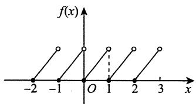

方法一 因为 $x = 1$ 是 $y = f(x)$ 的跳跃间断点，所以

$$
F _ {-} ^ {\prime} (1) = \lim  _ {x \rightarrow 1 ^ {-}} f (x) = 1, F _ {+} ^ {\prime} (1) = \lim  _ {x \rightarrow 1 ^ {+}} f (x) = 0,
$$

故 $F_{-}^{\prime}(1) - F_{+}^{\prime}(1) = 1$

方法二 $F_{-}^{\prime}(1) = \lim_{x\to 1^{-}}\frac{F(x) - F(1)}{x - 1} = \lim_{x\to 1^{-}}\frac{\int_{0}^{x}t\mathrm{d}t - \frac{1}{2}}{x - 1} = \lim_{x\to 1^{-}}\frac{x}{1} = 1,$

$$
\begin{array}{l} F _ {+} ^ {\prime} (1) = \lim  _ {x \rightarrow 1 ^ {+}} \frac {F (x) - F (1)}{x - 1} = \lim  _ {x \rightarrow 1 ^ {+}} \frac {\int_ {0} ^ {1} t d t + \int_ {1} ^ {x} (t - 1) d t - \frac {1}{2}}{x - 1} \\ = \lim  _ {x \rightarrow 1 ^ {+}} \frac {\int_ {1} ^ {x} (t - 1) \mathrm {d} t}{x - 1} = \lim  _ {x \rightarrow 1 ^ {+}} \frac {x - 1}{1} = 0, \\ \end{array}
$$

故 $F_{-}^{\prime}(1) - F_{+}^{\prime}(1) = 1$

# 23.【答案】(B)

【解析】对于选项(A)，根据微积分基本定理可得， $\left[\int_{a}^{x}f(t)\mathrm{d}t\right]' = f(x)$ ，故 $\int_{a}^{x}f(t)\mathrm{d}t$ 必为 $f(x)$ 的原函数.

对于选项(C)，根据奇函数在对称区间积分的性质，可得 $\int_{-a}^{a}f(x)\mathrm{d}x = 0$

对于选项(D)，由于 $f(x)$ 是周期为 $T$ 的函数，因此根据积分变换，可得

$$
\begin{array}{l} \int_ {a} ^ {a + T} f (x) \mathrm {d} x = \int_ {a} ^ {0} f (x) \mathrm {d} x + \int_ {0} ^ {T} f (x) \mathrm {d} x + \int_ {T} ^ {a + T} f (x) \mathrm {d} x \\ = \int_ {a} ^ {0} f (x) d x + \int_ {0} ^ {T} f (x) d x + \int_ {0} ^ {a} f (x) d x \\ = \int_ {0} ^ {T} f (x) d x. \\ \end{array}
$$

对于选项(B), 例如, $f(x) = x \cdot \operatorname{sgn}(\cos x)$ 在 $[0, \pi]$ 上可积, 即

$$
\int_ {0} ^ {\pi} f (x) \mathrm {d} x = \int_ {0} ^ {\frac {\pi}{2}} x \mathrm {d} x + \int_ {\frac {\pi}{2}} ^ {\pi} (- x) \mathrm {d} x = - \frac {\pi^ {2}}{4},
$$

但 $f(x)$ 在 $(0,\pi)$ 内没有原函数.

# 24.【答案】(A)

【解析】由 $f(x - 5) = \frac{4}{x^2 - 10x} = \frac{4}{(x - 5)^2 - 25},$

故 $f(2x + 1) = \frac{4}{(2x + 1)^2 - 25} = \frac{1}{x^2 + x - 6} = \frac{1}{(x + 3)(x - 2)}.$

于是 $\int_0^4 f(2x + 1)\mathrm{d}x = \int_0^4\frac{1}{(x + 3)(x - 2)}\mathrm{d}x = \frac{1}{5}\int_0^4\left(\frac{1}{x - 2} -\frac{1}{x + 3}\right)\mathrm{d}x,$

而 $\int_{0}^{4}\frac{\mathrm{d}x}{x - 2}$ 发散，故 $\int_0^4 f(2x + 1)\mathrm{d}x$ 为反常积分，且发散.

# 25.【答案】(B)

【解析】对于选项(A)，因 $|\sin x| \leqslant 1$ ，于是有 $\sin^2 x \leqslant |\sin x|$ ，从而 $\int_{\pi}^{2\pi} \sin^2 x \, \mathrm{d}x \leqslant \int_{\pi}^{2\pi} |\sin x| \, \mathrm{d}x$ 。

对于选项(C)，例如， $\int_{-\pi}^{\pi}\sin x\mathrm{d}x = 0 <   2 = \int_{0}^{\pi}\sin x\mathrm{d}x,[0,\pi ]\subset [-\pi ,\pi ]$

对于选项(D)，误认为 $\left|f(x)\right|$ 为偶函数.例如， $f(x) = (x + 1)^2$ ，而 $\left|f(x)\right| = (x + 1)^2$ 就不是偶函数.

对于选项(B)，事实上，由定积分性质，知 $\int_{-\frac{\pi}{4}}^{\frac{\pi}{4}}\frac{x}{1 + \cos x}\mathrm{d}x = 0$

$$
\int_ {- \frac {\pi}{4}} ^ {\frac {\pi}{4}} \left(\frac {\sin x}{1 + x ^ {4}} + \frac {1}{1 + x ^ {2}}\right) d x = \int_ {- \frac {\pi}{4}} ^ {\frac {\pi}{4}} \frac {\sin x}{1 + x ^ {4}} d x + \int_ {- \frac {\pi}{4}} ^ {\frac {\pi}{4}} \frac {1}{1 + x ^ {2}} d x = \int_ {- \frac {\pi}{4}} ^ {\frac {\pi}{4}} \frac {1}{1 + x ^ {2}} d x > 0.
$$

故选(B).

  
关注公众号【考研小舟】免费考研资料&无水印PDF

  
黑白&彩印都是5分/页，满4.9全国包邮下单备注：考研小舟，送草稿纸

# 第9章 一元函数和分学的计算

1.【解析】(1)方法一 $\int \cos^3 x\mathrm{d}x = \int (1 - \sin^2 x)\mathrm{d}(\sin x) = \sin x - \frac{1}{3}\sin^3 x + C.$

方法二 $\int \cos^3 x\mathrm{d}x = \int \frac{3\cos x + \cos 3x}{4}\mathrm{d}x = \frac{3}{4}\sin x + \frac{1}{12}\sin 3x + C.$

(2) 方法一 $\int \sin^3 x \, \mathrm{d}x = -\int (1 - \cos^2 x) \, \mathrm{d}(\cos x) = -\cos x + \frac{1}{3} \cos^3 x + C.$

方法二 $\int \sin^3 x\mathrm{d}x = \int \frac{3\sin x - \sin 3x}{4}\mathrm{d}x = -\frac{3}{4}\cos x + \frac{1}{12}\cos 3x + C.$

(3) 方法一 $\int \sec x \, \mathrm{d}x = \int \frac{\sec x (\sec x + \tan x)}{\sec x + \tan x} \, \mathrm{d}x = \int \frac{\mathrm{d}(\sec x + \tan x)}{\sec x + \tan x} = \ln |\sec x + \tan x| + C.$

方法二 $\int \sec x \, \mathrm{d}x = \int \frac{\mathrm{d}x}{\cos x} = \int \frac{\mathrm{d}\left(x + \frac{\pi}{2}\right)}{\sin\left(x + \frac{\pi}{2}\right)} = \int \frac{\mathrm{d}\left(x + \frac{\pi}{2}\right)}{2\sin\left(\frac{x}{2} + \frac{\pi}{4}\right)\cos\left(\frac{x}{2} + \frac{\pi}{4}\right)}$

$$
= \int \frac {\sec^ {2} \left(\frac {x}{2} + \frac {\pi}{4}\right) \mathrm {d} \left(\frac {x}{2} + \frac {\pi}{4}\right)}{\tan \left(\frac {x}{2} + \frac {\pi}{4}\right)} = \ln \left| \tan \left(\frac {x}{2} + \frac {\pi}{4}\right) \right| + C.
$$

(4) $\int \sec^3 x\mathrm{d}x = \int \sec x\mathrm{d}(\tan x) = \sec x\tan x - \int \tan^2 x\sec x\mathrm{d}x$

$$
\begin{array}{l} = \sec x \tan x - \int (\sec^ {3} x - \sec x) d x \\ = \sec x \tan x - \int \sec^ {3} x d x + \int \sec x d x. \\ \end{array}
$$

由(3)，得

$$
\int \sec^ {3} x \mathrm {d} x = \frac {1}{2} \left[ \sec x \tan x + \ln \left| \tan \left(\frac {x}{2} + \frac {\pi}{4}\right) \right| \right] + C.
$$

(5) $\int \frac{1}{a^2 - x^2} \, \mathrm{d}x = \int \frac{1}{2a} \left( \frac{1}{a + x} + \frac{1}{a - x} \right) \, \mathrm{d}x = \frac{1}{2a} (\ln |a + x| - \ln |a - x|) + C = \frac{1}{2a} \ln \left| \frac{a + x}{a - x} \right| + C.$   
(6) $\int \frac{1}{x^2 - a^2} \, \mathrm{d}x = -\frac{1}{2a} \int \left( \frac{1}{a + x} + \frac{1}{a - x} \right) \, \mathrm{d}x \xlongequal{\text{由 (5)}} -\frac{1}{2a} \ln \left| \frac{a + x}{a - x} \right| + C.$

(7) $\int \frac{1}{a^2 + x^2} \, \mathrm{d}x = \int \frac{1}{a^2} \cdot \frac{1}{1 + \left(\frac{x}{a}\right)^2} \, \mathrm{d}x = \frac{1}{a} \int \frac{1}{1 + \left(\frac{x}{a}\right)^2} \, \mathrm{d}\left(\frac{x}{a}\right) = \frac{1}{a} \arctan \frac{x}{a} + C.$   
(8) $\int \frac{1}{a^2 + (x + b)^2} \, \mathrm{d}x = \int \frac{1}{a^2 + (x + b)^2} \, \mathrm{d}(x + b)$ 由（7） $\frac{1}{a}\arctan \frac{x + b}{a} + C$   
(9) $\int \frac{1}{a^2 - (x + b)^2} \, \mathrm{d}x = \int \frac{1}{a^2 - (x + b)^2} \, \mathrm{d}(x + b)$ 由（5） $\frac{1}{2a} \ln \left|\frac{a + (x + b)}{a - (x + b)}\right| + C$

$$
= \frac {1}{2 a} \ln \left| \frac {x + a + b}{- x + a - b} \right| + C.
$$

(10) $\int \frac{1}{(x + b)^2 - a^2} \, \mathrm{d}x = -\int \frac{1}{a^2 - (x + b)^2} \, \mathrm{d}x$ 由（9） $-\frac{1}{2a} \ln \left| \frac{x + a + b}{-x + a - b} \right| + C.$   
(11) 设 $x = a \sec t$ ，则 $\mathrm{dx} = a \sec t \tan t \, \mathrm{dt}$ .

当 $0 < t < \frac{\pi}{2}$ 时， $x = a\sec t > 0$ ，且存在反函数，则

$$
\int \frac {\mathrm {d} x}{\sqrt {x ^ {2} - a ^ {2}}} = \int \frac {a \sec t \tan t}{a \tan t} \mathrm {d} t = \int \sec t \mathrm {d} t = \ln (\sec t + \tan t) + C _ {1} = \ln (x + \sqrt {x ^ {2} - a ^ {2}}) + C.
$$

当 $\frac{\pi}{2} < t < \pi$ 时， $x = a\sec t < 0$ ，且存在反函数，则

$$
\begin{array}{l} \int \frac {\mathrm {d} x}{\sqrt {x ^ {2} - a ^ {2}}} = - \int \sec t \mathrm {d} t = - \ln (- \sec t - \tan t) + C _ {2} \\ = - \ln (- x + \sqrt {x ^ {2} - a ^ {2}}) + C _ {3} = \ln (- x - \sqrt {x ^ {2} - a ^ {2}}) + C. \\ \end{array}
$$

综上， $\int \frac{\mathrm{d}x}{\sqrt{x^2 - a^2}} = \ln \left|x + \sqrt{x^2 - a^2}\right| + C.$

(12) $\int \frac{1}{\sqrt{a^2 - x^2}} \, \mathrm{d}x = \int \frac{1}{a} \frac{\mathrm{d}x}{\sqrt{1 - \left(\frac{x}{a}\right)^2}} = \int \frac{\mathrm{d}\left(\frac{x}{a}\right)}{\sqrt{1 - \left(\frac{x}{a}\right)^2}} = \arcsin \frac{x}{a} + C.$   
(13) 设 $x = a \tan t$ ，则 $\mathrm{d}x = a \sec^2 t \, \mathrm{d}t$ ，当 $-\frac{\pi}{2} < t < \frac{\pi}{2}$ 时， $x = a \tan t$ 存在反函数，则

$$
\int \frac {\mathrm {d} x}{\sqrt {x ^ {2} + a ^ {2}}} = \int \frac {a \sec^ {2} t \mathrm {d} t}{a \sqrt {\tan^ {2} t + 1}} = \int \frac {\sec^ {2} t}{\sec t} \mathrm {d} t = \int \sec t \mathrm {d} t = \ln | \sec t + \tan t | + C _ {1}.
$$

由 $\tan t = \frac{x}{a}$ 得 $\sec t = \frac{\sqrt{x^2 + a^2}}{a}$ ，所以

$$
\int \frac {\mathrm {d} x}{\sqrt {x ^ {2} + a ^ {2}}} = \ln | \sec t + \tan t | + C _ {1} = \ln \left(\frac {\sqrt {x ^ {2} + a ^ {2}}}{a} + \frac {x}{a}\right) + C _ {1} = \ln (\sqrt {x ^ {2} + a ^ {2}} + x) + C.
$$

(14) $\int \csc^3 x\mathrm{d}x = \int \csc^2 x\csc x\mathrm{d}x = -\int \csc x\mathrm{d}(\cot x) = -\csc x\cot x + \int \cot x\mathrm{d}(\csc x)$

$$
\begin{array}{l} = - \csc x \cot x - \int \cot^ {2} x \csc x d x = - \csc x \cot x - \int \csc x (\csc^ {2} x - 1) d x \\ = - \csc x \cot x - \int \csc^ {3} x d x + \int \csc x d x, \\ \end{array}
$$

$$
\int \csc x d x = \int \frac {\csc x (\csc x - \cot x)}{\csc x - \cot x} d x = \int \frac {d (\csc x - \cot x)}{\csc x - \cot x} = \ln | \csc x - \cot x | + C _ {1},
$$

故 $\int \csc^3 x\mathrm{d}x = \frac{1}{2} (-\csc x\cot x + \ln |\csc x - \cot x| + C_1)$

$$
= - \frac {1}{2} \csc x \cot x + \frac {1}{2} \ln | \csc x - \cot x | + C.
$$

(15) $\int \tan^2 x\mathrm{d}x = \int \frac{\sin^2x}{\cos^2x}\mathrm{d}x = \int \frac{1 - \cos^2x}{\cos^2x}\mathrm{d}x = \int \sec^2 x\mathrm{d}x - \int 1\mathrm{d}x = \tan x - x + C.$   
(16) $\int \tan^3 x\mathrm{d}x = \int \tan x(\sec^2 x - 1)\mathrm{d}x = \int \tan x\mathrm{d}(\tan x) - \int \tan x\mathrm{d}x = \frac{1}{2}\tan^2 x + \ln |\cos x| + C.$

【注】由上式可知 $n$ 次方的递推公式，即

$$
\int \tan^ {n} x d x = \int \tan^ {n - 2} x (\sec^ {2} x - 1) d x = \int \tan^ {n - 2} x d (\tan x) - \int \tan^ {n - 2} x d x = \frac {\tan^ {n - 1} x}{n - 1} - \int \tan^ {n - 2} x d x.
$$

(17) $\int \tan^4 x\mathrm{d}x\xlongequal{\text{由（16）的注}}\frac{\tan^3x}{3}-\int\tan^2x\mathrm{d}x\xlongequal{\text{由（15）}}\frac{\tan^3x}{3}-\tan x+x+C.$

(18) $\int \cot^3 x\mathrm{d}x = \int \frac{\cos^3x}{\sin^3x}\mathrm{d}x = \int \frac{1 - \sin^2x}{\sin^3x}\mathrm{d}(\sin x) = \int \frac{1}{\sin^3x}\mathrm{d}(\sin x) - \int \frac{1}{\sin x}\mathrm{d}(\sin x)$

$$
= - \frac {\csc^ {2} x}{2} + \ln | \csc x | + C.
$$

(19)方法一 $\int \frac{\cos x}{1 + \sin x} \, \mathrm{d}x = \int \frac{\mathrm{d}(1 + \sin x)}{1 + \sin x} = \ln (1 + \sin x) + C.$

方法二 令 $\sin x = \frac{2t}{1 + t^2}$ , $\cos x = \frac{1 - t^2}{1 + t^2}$ , 其中 $t = \tan \frac{x}{2}$ , 则 $\mathrm{d}x = \frac{2\mathrm{d}t}{1 + t^2}$ , 故

$$
\begin{array}{l} \int \frac {\cos x}{1 + \sin x} d x = \int \frac {\frac {1 - t ^ {2}}{1 + t ^ {2}}}{1 + \frac {2 t}{1 + t ^ {2}}} \cdot \frac {2 d t}{1 + t ^ {2}} = \int \frac {1 - t ^ {2}}{1 + t ^ {2}} \cdot \frac {1 + t ^ {2}}{(1 + t) ^ {2}} \cdot \frac {2}{1 + t ^ {2}} d t \\ = 2 \int \frac {1 - t}{(1 + t) (1 + t ^ {2})} d t = 2 \int \left(\frac {1}{1 + t} - \frac {t}{1 + t ^ {2}}\right) d t = \ln \frac {(1 + t) ^ {2}}{1 + t ^ {2}} + C \\ \end{array}
$$

$$
= \ln \frac {\left(1 + \tan \frac {x}{2}\right) ^ {2}}{1 + \tan^ {2} \frac {x}{2}} + C.
$$

(20) $\int \frac{1}{a^2\sin^2x + b^2\cos^2x} \, \mathrm{d}x = \int \frac{\mathrm{d}x}{b^2\cos^2x \left( \frac{a^2}{b^2} \tan^2 x + 1 \right)}$

$$
= \frac {1}{b ^ {2}} \int \frac {\mathrm {d} (\tan x)}{\left(\frac {a}{b} \tan x\right) ^ {2} + 1} = \frac {1}{a b} \arctan \left(\frac {a}{b} \tan x\right) + C.
$$

(21) $\int \frac{1}{\sin 2x} \, \mathrm{d}x = \int \frac{\mathrm{d}x}{2 \sin x \cos x} = \frac{1}{2} \int \frac{\mathrm{d}x}{\frac{\sin x}{\cos x} \cdot \cos^2 x} = \frac{1}{2} \int \frac{\mathrm{d}(\tan x)}{\tan x} = \frac{1}{2} \ln |\tan x| + C.$   
(22) $\int \frac{1}{\cos 2x} \, \mathrm{d}x = \frac{1}{2} \int \frac{\mathrm{d}(\sin 2x)}{\cos^2 2x} = \frac{1}{2} \int \frac{\mathrm{d}(\sin 2x)}{1 - \sin^2 2x} = \frac{1}{2} \int \frac{\mathrm{d}(\sin 2x)}{(1 - \sin 2x)(1 + \sin 2x)}$

$$
\begin{array}{l} = \frac {1}{4} \int \left(\frac {1}{1 - \sin 2 x} + \frac {1}{1 + \sin 2 x}\right) d (\sin 2 x) = \frac {1}{4} \left[ \int \frac {d (1 + \sin 2 x)}{1 + \sin 2 x} - \int \frac {d (1 - \sin 2 x)}{1 - \sin 2 x} \right] \\ = \frac {1}{4} \ln \frac {1 + \sin 2 x}{1 - \sin 2 x} + C. \\ \end{array}
$$

(23) 令 $\sin x = \frac{2t}{1 + t^2}$ , $\cos x = \frac{1 - t^2}{1 + t^2}$ , 其中 $t = \tan \frac{x}{2}$ , 则 $\mathrm{d}x = \frac{2\mathrm{d}t}{1 + t^2}$ , 故

$$
\int \frac {\mathrm {d} x}{a + b \cos x} = \int \frac {\frac {2 \mathrm {d} t}{1 + t ^ {2}}}{a + b \frac {1 - t ^ {2}}{1 + t ^ {2}}} = 2 \int \frac {\mathrm {d} t}{a (1 + t ^ {2}) + b (1 - t ^ {2})} = 2 \int \frac {\mathrm {d} t}{a + b + a t ^ {2} - b t ^ {2}}.
$$

当 $a < b$ 时，

原式 $= \frac{2}{a - b}\int \frac{\mathrm{d}t}{\frac{a + b}{a - b} + t^2} = \frac{2}{a - b}\int \frac{\mathrm{d}t}{\left(t - \sqrt{\frac{a + b}{b - a}}\right)\left(t + \sqrt{\frac{a + b}{b - a}}\right)}$

$$
\begin{array}{l} = \frac {2}{2 (a - b) \sqrt {\frac {a + b}{b - a}}} \left[ \int \frac {\mathrm {d} \left(t - \sqrt {\frac {a + b}{b - a}}\right)}{t - \sqrt {\frac {a + b}{b - a}}} - \int \frac {\mathrm {d} \left(t + \sqrt {\frac {a + b}{b - a}}\right)}{t + \sqrt {\frac {a + b}{b - a}}} \right] \\ = - \frac {1}{\sqrt {b ^ {2} - a ^ {2}}} \ln \left| \frac {t - \sqrt {\frac {a + b}{b - a}}}{t + \sqrt {\frac {a + b}{b - a}}} \right| + C \\ \end{array}
$$

$$
= - \frac {1}{\sqrt {b ^ {2} - a ^ {2}}} \ln \left| \frac {\tan \frac {x}{2} - \sqrt {\frac {a + b}{b - a}}}{\tan \frac {x}{2} + \sqrt {\frac {a + b}{b - a}}} \right| + C.
$$

当 $a = b$ 时，

$$
\text {原 式} = 2 \int \frac {\mathrm {d} t}{a + a} = \frac {1}{a} \tan \frac {x}{2} + C.
$$

当 $a > b$ 时，

原式 $= 2\int \frac{\mathrm{d}t}{a + b + (a - b)t^2} = \frac{2}{a + b}\int \frac{\mathrm{d}t}{1 + \frac{a - b}{a + b}t^2}$

$$
\begin{array}{l} = \frac {2}{a + b} \sqrt {\frac {a + b}{a - b}} \int \frac {\mathrm {d} \left(\sqrt {\frac {a - b}{a + b}} t\right)}{1 + \left(\sqrt {\frac {a - b}{a + b}} t\right) ^ {2}} = \frac {2}{\sqrt {a ^ {2} - b ^ {2}}} \int \frac {\mathrm {d} \left(\sqrt {\frac {a - b}{a + b}} t\right)}{1 + \left(\sqrt {\frac {a - b}{a + b}} t\right) ^ {2}} \\ = \frac {2}{\sqrt {a ^ {2} - b ^ {2}}} \arctan \left(\sqrt {\frac {a - b}{a + b}} \tan \frac {x}{2}\right) + C. \\ \end{array}
$$

(24) 令 $\sin x = \frac{2t}{1 + t^2}$ , $\cos x = \frac{1 - t^2}{1 + t^2}$ , 其中 $t = \tan \frac{x}{2}$ , 则 $\mathrm{d}x = \frac{2\mathrm{d}t}{1 + t^2}$ , 故

$$
\int \frac {\mathrm {d} x}{a + b \sin x} = \int \frac {\frac {2 \mathrm {d} t}{1 + t ^ {2}}}{a + b \frac {2 t}{1 + t ^ {2}}} = 2 \int \frac {\mathrm {d} t}{a (1 + t ^ {2}) + 2 b t} = 2 \int \frac {\mathrm {d} t}{a + a t ^ {2} + 2 b t}.
$$

当 $a < b$ 时，

$\int \frac{\mathrm{d}\left(\sqrt{a} + \frac{b}{\sqrt{a}}\right)}{\left(\sqrt{a} + \frac{b}{\sqrt{a}}\right)^2 - \frac{b^2 - a^2}{a}} = \frac{2}{\sqrt{a}}\int \frac{\mathrm{d}\left(\sqrt{a} + \frac{b}{\sqrt{a}}\right)}{\left(\sqrt{a} + \frac{b}{\sqrt{a}}\right)^2 - \left(\sqrt{\frac{b^2 - a^2}{a}}\right)^2}$ 原式 $= \frac{2}{\sqrt{a}}\int \frac{\left(\sqrt{a} + \frac{b}{\sqrt{a}}\right)^2 - b^2 - a^2}{a}$

$$
\begin{array}{l} = \frac {2}{\sqrt {a}} \int \frac {\mathrm {d} \left(\sqrt {a} t + \frac {b}{\sqrt {a}}\right)}{\left(\sqrt {a} t + \frac {b}{\sqrt {a}} - \sqrt {\frac {b ^ {2} - a ^ {2}}{a}}\right) \left(\sqrt {a} t + \frac {b}{\sqrt {a}} + \sqrt {\frac {b ^ {2} - a ^ {2}}{a}}\right)} \\ = \frac {2}{\sqrt {a}} \cdot \frac {1}{2 \sqrt {\frac {b ^ {2} - a ^ {2}}{a}}} \int \left(\frac {1}{\sqrt {a t} + \frac {b}{\sqrt {a}} - \sqrt {\frac {b ^ {2} - a ^ {2}}{a}}} - \frac {1}{\sqrt {a t} + \frac {b}{\sqrt {a}} + \sqrt {\frac {b ^ {2} - a ^ {2}}{a}}}\right) d \left(\sqrt {a t} + \frac {b}{\sqrt {a}}\right) \\ \end{array}
$$

$$
\begin{array}{l} = \frac {1}{\sqrt {b ^ {2} - a ^ {2}}} \ln \left| \frac {a t + b - \sqrt {b ^ {2} - a ^ {2}}}{a t + b + \sqrt {b ^ {2} - a ^ {2}}} \right| + C \\ = \frac {1}{\sqrt {b ^ {2} - a ^ {2}}} \ln \left| \frac {a \tan \frac {x}{2} + b - \sqrt {b ^ {2} - a ^ {2}}}{a \tan \frac {x}{2} + b + \sqrt {b ^ {2} - a ^ {2}}} \right| + C. \\ \end{array}
$$

当 $a = b$ 时，

原式 $= \frac{2}{a}\int \frac{\mathrm{d}t}{1 + t^2 + 2t} = \frac{2}{a}\int \frac{\mathrm{d}(1 + t)}{(1 + t)^2} = -\frac{2}{a}\cdot \frac{1}{1 + t} +C = -\frac{2}{a\left(1 + \tan\frac{x}{2}\right)} +C.$

当 $a > b$ 时，

原式 $= 2\int \frac{\mathrm{d}t}{\left(\sqrt{a}t + \frac{b}{\sqrt{a}}\right)^2 + \frac{a^2 - b^2}{a}}$

$$
\begin{array}{l} = 2 \int \frac {\mathrm {d} t}{\frac {a ^ {2} - b ^ {2}}{a} \left[ \left(\sqrt {a} \sqrt {\frac {a}{a ^ {2} - b ^ {2}}} t + \sqrt {\frac {a}{a ^ {2} - b ^ {2}}} \frac {b}{\sqrt {a}}\right) ^ {2} + 1 \right]} \\ = \frac {2 a}{a ^ {2} - b ^ {2}} \int \frac {\mathrm {d} t}{\left(\sqrt {a} \sqrt {\frac {a}{a ^ {2} - b ^ {2}}} t + \sqrt {\frac {a}{a ^ {2} - b ^ {2}}} \frac {b}{\sqrt {a}}\right) ^ {2} + 1} \\ = \frac {2 a}{a ^ {2} - b ^ {2}} \frac {\sqrt {a ^ {2} - b ^ {2}}}{a} \int \frac {\mathrm {d} \left(\frac {a}{\sqrt {a ^ {2} - b ^ {2}}} t + \frac {b}{\sqrt {a ^ {2} - b ^ {2}}}\right)}{\left(\frac {a}{\sqrt {a ^ {2} - b ^ {2}}} t + \frac {b}{\sqrt {a ^ {2} - b ^ {2}}}\right) ^ {2} + 1} \\ = \frac {2}{\sqrt {a ^ {2} - b ^ {2}}} \int \frac {\mathrm {d} \left(\frac {a}{\sqrt {a ^ {2} - b ^ {2}}} t + \frac {b}{\sqrt {a ^ {2} - b ^ {2}}}\right)}{\left(\frac {a}{\sqrt {a ^ {2} - b ^ {2}}} t + \frac {b}{\sqrt {a ^ {2} - b ^ {2}}}\right) ^ {2} + 1} \\ = \frac {2}{\sqrt {a ^ {2} - b ^ {2}}} \arctan \left(\frac {a}{\sqrt {a ^ {2} - b ^ {2}}} t + \frac {b}{\sqrt {a ^ {2} - b ^ {2}}}\right) + C \\ = \frac {2}{\sqrt {a ^ {2} - b ^ {2}}} \arctan \left(\frac {a}{\sqrt {a ^ {2} - b ^ {2}}} \tan \frac {x}{2} + \frac {b}{\sqrt {a ^ {2} - b ^ {2}}}\right) + C. \\ \end{array}
$$

2.【解析】方法一 $\int \frac{\mathrm{e}^{2x}}{\sqrt{\mathrm{e}^x - 1}}\mathrm{d}x = \int \frac{\mathrm{e}^x}{\sqrt{\mathrm{e}^x - 1}}\mathrm{d}(\mathrm{e}^x) = \int \frac{\mathrm{e}^x - 1 + 1}{\sqrt{\mathrm{e}^x - 1}}\mathrm{d}(\mathrm{e}^x)$

$$
\begin{array}{l} = \int \left(\sqrt {\mathrm {e} ^ {x} - 1} + \frac {1}{\sqrt {\mathrm {e} ^ {x} - 1}}\right) \mathrm {d} \left(\mathrm {e} ^ {x} - 1\right) \\ = \frac {2}{3} \left(\mathrm {e} ^ {x} - 1\right) ^ {\frac {3}{2}} + 2 \sqrt {\mathrm {e} ^ {x} - 1} + C. \\ \end{array}
$$

方法二 令 $t = \sqrt{\mathrm{e}^x - 1}$ ，则 $t^2 = \mathrm{e}^x - 1$ ， $x = \ln (t^2 + 1)$ ， $\mathrm{e}^{2x} = (t^2 + 1)^2$ ，故

$$
\begin{array}{l} \text {原 式} = \int \frac {\left(t ^ {2} + 1\right) ^ {2}}{t} \cdot \frac {2 t}{t ^ {2} + 1} d t = \int \left(2 t ^ {2} + 2\right) d t = \frac {2}{3} t ^ {3} + 2 t + C \\ = \frac {2}{3} \left(\mathrm {e} ^ {x} - 1\right) ^ {\frac {3}{2}} + 2 \sqrt {\mathrm {e} ^ {x} - 1} + C. \\ \end{array}
$$

3.【解析】令 $\sqrt{\frac{1 + x}{x}} = t$ ，则 $x = \frac{1}{t^2 - 1}$ ，于是

$$
\int \ln \left(1 + \sqrt {\frac {1 + x}{x}}\right) d x = \int \ln (1 + t) d \left(\frac {1}{t ^ {2} - 1}\right) = \frac {\ln (1 + t)}{t ^ {2} - 1} - \int \frac {1}{t ^ {2} - 1} \cdot \frac {1}{t + 1} d t.
$$

又

$$
\begin{array}{l} \int \frac {1}{(t ^ {2} - 1) (t + 1)} d t = \frac {1}{4} \int \left[ \frac {1}{t - 1} - \frac {1}{t + 1} - \frac {2}{(t + 1) ^ {2}} \right] d t \\ = \frac {1}{4} \ln (t - 1) - \frac {1}{4} \ln (t + 1) + \frac {1}{2 (t + 1)} + C _ {1}, \\ \end{array}
$$

所以

$$
\begin{array}{l} \int \ln \left(1 + \sqrt {\frac {1 + x}{x}}\right) d x = \frac {\ln (1 + t)}{t ^ {2} - 1} + \frac {1}{4} \ln \frac {t + 1}{t - 1} - \frac {1}{2 (t + 1)} + C \\ = x \ln \left(1 + \sqrt {\frac {1 + x}{x}}\right) + \frac {1}{2} \ln (\sqrt {1 + x} + \sqrt {x}) - \frac {\sqrt {x}}{2 (\sqrt {1 + x} + \sqrt {x})} + C. \\ \end{array}
$$

4.【解析】 $\int \mathrm{e}^{2x}\arctan \sqrt{\mathrm{e}^x - 1}\mathrm{d}x = \frac{1}{2}\int \arctan \sqrt{\mathrm{e}^x - 1}\mathrm{d}(\mathrm{e}^{2x})$

$$
= \frac {1}{2} e ^ {2 x} \arctan \sqrt {e ^ {x} - 1} - \frac {1}{4} \int \frac {e ^ {2 x}}{\sqrt {e ^ {x} - 1}} d x.
$$

又 $\int \frac{\mathrm{e}^{2x}}{\sqrt{\mathrm{e}^x - 1}}\mathrm{d}x = \int \frac{\mathrm{e}^x}{\sqrt{\mathrm{e}^x - 1}}\mathrm{d}(\mathrm{e}^x) = \int \frac{(\mathrm{e}^x - 1) + 1}{\sqrt{\mathrm{e}^x - 1}}\mathrm{d}(\mathrm{e}^x)$

$$
\begin{array}{l} = \int \sqrt {e ^ {x} - 1} d \left(e ^ {x}\right) + \int \frac {1}{\sqrt {e ^ {x} - 1}} d \left(e ^ {x}\right) \\ = \frac {2}{3} \left(\mathrm {e} ^ {x} - 1\right) \sqrt {\mathrm {e} ^ {x} - 1} + 2 \sqrt {\mathrm {e} ^ {x} - 1} + C _ {1}, \\ \end{array}
$$

所以 $\int \mathrm{e}^{2x}\arctan \sqrt{\mathrm{e}^x - 1}\mathrm{d}x = \frac{1}{2}\mathrm{e}^{2x}\arctan \sqrt{\mathrm{e}^x - 1} -\frac{1}{6} (\mathrm{e}^x +2)\sqrt{\mathrm{e}^x - 1} +C.$

# 5.【答案】(B)

【解析】令 $\sqrt{x} = t$ ，则 $x = t^2$ ， $\mathrm{dx} = 2t\mathrm{dt}$ ，且当 $x = 0$ 时， $t = 0$ ；当 $x = 1$ 时， $t = 1$ .所以

$$
\begin{array}{l} \int_ {0} ^ {1} \mathrm {e} ^ {- \sqrt {x}} \mathrm {d} x = 2 \int_ {0} ^ {1} t \mathrm {e} ^ {- t} \mathrm {d} t = - 2 t \mathrm {e} ^ {- t} \left| _ {0} ^ {1} + 2 \int_ {0} ^ {1} \mathrm {e} ^ {- t} \mathrm {d} t \right. \\ = - 2 \mathrm {e} ^ {- 1} - 2 \mathrm {e} ^ {- t} \Big | _ {0} ^ {1} = - 4 \mathrm {e} ^ {- 1} + 2 = 2 - \frac {4}{\mathrm {e}}. \\ \end{array}
$$

6.【答案】 $-\frac{2\sqrt{3}}{9}\pi$

【解析】 $\int_{0}^{1}\frac{4x - 3}{x^2 - x + 1}\mathrm{d}x = \int_{0}^{1}\frac{2(2x - 1) - 1}{x^2 - x + 1}\mathrm{d}x = 2\int_{0}^{1}\frac{\mathrm{d}(x^2 - x + 1)}{x^2 - x + 1} -\int_{0}^{1}\frac{1}{x^2 - x + 1}\mathrm{d}x$

$$
\begin{array}{l} = 2 \ln (x ^ {2} - x + 1) \Big | _ {0} ^ {1} - \int_ {0} ^ {1} \frac {1}{\left(x - \frac {1}{2}\right) ^ {2} + \left(\frac {\sqrt {3}}{2}\right) ^ {2}} d x \\ = - \frac {2}{\sqrt {3}} \arctan \left. \frac {x - \frac {1}{2}}{\frac {\sqrt {3}}{2}} \right| _ {0} ^ {1} = - \frac {2}{\sqrt {3}} \left(\frac {\pi}{6} + \frac {\pi}{6}\right) = - \frac {2 \sqrt {3}}{9} \pi . \\ \end{array}
$$

7.【答案】 $\frac{\pi^2}{16}$

【解析】 原式 $= 2\int_{0}^{1}\arctan \sqrt{x}\mathrm{d}(\arctan \sqrt{x}) = (\arctan \sqrt{x})^{2}\Big|_{0}^{1} = \left(\frac{\pi}{4}\right)^{2} = \frac{\pi^{2}}{16}.$

8.【答案】 $\frac{1}{2}\left[\sqrt{2} +\ln (\sqrt{2} +1)\right]$

【解析】由 $\int_{0}^{\frac{\pi}{4}}\sec^{3}\theta \mathrm{d}\theta = \int_{0}^{\frac{\pi}{4}}\sec \theta \mathrm{d}(\tan \theta) = \sec \theta \tan \theta \left| \begin{array}{l} \frac{\pi}{4} \\ 0 \end{array} - \int_{0}^{\frac{\pi}{4}}\sec \theta \tan^{2}\theta \mathrm{d}\theta \right.$

$$
= \sqrt {2} - \int_ {0} ^ {\frac {\pi}{4}} \left(\sec^ {3} \theta - \sec \theta\right) d \theta ,
$$

得 $\int_{0}^{\frac{\pi}{4}}\sec^{3}\theta \mathrm{d}\theta = \frac{1}{2}\left(\sqrt{2} +\int_{0}^{\frac{\pi}{4}}\sec \theta \mathrm{d}\theta\right) = \frac{1}{2}\left(\sqrt{2} +\ln \left|\sec \theta +\tan \theta \right| \right|_{0}^{\frac{\pi}{4}}$

$$
= \frac {1}{2} \left[ \sqrt {2} + \ln (\sqrt {2} + 1) \right].
$$

9.【答案】 $-\frac{1}{4}$

【解析】令 $x = t + 1$ ，则

$$
\int_ {1} ^ {2} f (x) \mathrm {d} x = \int_ {0} ^ {1} f (t + 1) \mathrm {d} t = \int_ {0} ^ {1} [ f (t) + t \ln t ] \mathrm {d} t = \int_ {0} ^ {1} f (t) \mathrm {d} t + \int_ {0} ^ {1} t \ln t \mathrm {d} t,
$$

其中 $\int_{0}^{1} t \ln t \, \mathrm{d}t \stackrel{t = \mathrm{e}^u}{=} \int_{-\infty}^{0} u \mathrm{e}^{2u} \, \mathrm{d}u = \frac{1}{2} \int_{-\infty}^{0} u \mathrm{d}(\mathrm{e}^{2u})$

$$
= \frac {1}{2} u e ^ {2 u} \left| _ {- \infty} ^ {0} - \frac {1}{2} \int_ {- \infty} ^ {0} e ^ {2 u} d u = - \frac {1}{4} e ^ {2 u} \right| _ {- \infty} ^ {0} = - \frac {1}{4},
$$

故 $\int_{1}^{2}f(x)\mathrm{d}x = -\frac{1}{4}$

10.【答案】 $\frac{\pi}{12}$

【解析】由 $y^{2} = \frac{x^{2}}{1 + x^{2}}$ ，得 $x = \frac{y}{\sqrt{1 - y^2}}$ ，故

$$
\int_ {\frac {1}{2}} ^ {\frac {\sqrt {3}}{2}} x y \mathrm {d} y = \int_ {\frac {1}{2}} ^ {\frac {\sqrt {3}}{2}} \frac {y ^ {2}}{\sqrt {1 - y ^ {2}}} \mathrm {d} y \xlongequal {y = \sin t} \int_ {\frac {\pi}{6}} ^ {\frac {\pi}{3}} \frac {\sin^ {2} t}{\cos t} \cos t \mathrm {d} t = \int_ {\frac {\pi}{6}} ^ {\frac {\pi}{3}} \sin^ {2} t \mathrm {d} t = \frac {\pi}{1 2}.
$$

11.【答案】(A)

【解析】由于 $f(x) = (\mathrm{e}^{-x})' = -\mathrm{e}^{-x}$ ，因此 $f(\ln x) = -\mathrm{e}^{-\ln x} = -\frac{1}{x}$ ，从而

$$
\int_ {1} ^ {\sqrt {2}} \frac {1}{x ^ {2}} f (\ln x) d x = - \int_ {1} ^ {\sqrt {2}} \frac {1}{x ^ {3}} d x = \left. \frac {1}{2} \frac {1}{x ^ {2}} \right| _ {1} ^ {\sqrt {2}} = \frac {1}{4} - \frac {1}{2} = - \frac {1}{4}.
$$

12.【答案】(A)

【解析】在 $g(x) = \int_0^{2x}f\left(x + \frac{t}{2}\right)\mathrm{d}t$ 中，令 $x + \frac{t}{2} = u$ ，则

$$
\begin{array}{l} g (x) = \int_ {0} ^ {2 x} f \left(x + \frac {t}{2}\right) d t = 2 \int_ {x} ^ {2 x} f (u) d u, \\ \lim  _ {x \rightarrow 0 ^ {+}} \frac {g (x)}{\sqrt {x}} = \lim  _ {x \rightarrow 0 ^ {+}} \frac {2 \int_ {x} ^ {2 x} f (u) \mathrm {d} u}{\sqrt {x}} \xlongequal {\text {洛 必 达 法 则}} 2 \lim  _ {x \rightarrow 0 ^ {+}} \frac {2 f (2 x) - f (x)}{\frac {1}{2 \sqrt {x}}} \\ = 4 \lim  _ {x \rightarrow 0 ^ {+}} \sqrt {x} [ 2 f (2 x) - f (x) ] = 0, \\ \end{array}
$$

这表明当 $x \to 0^+$ 时， $g(x)$ 是 $\sqrt{x}$ 的高阶无穷小.

13.【答案】(D)

【解析】 $\lim_{x\to 0}\varphi (x) = \lim_{x\to 0}\frac{\int_{0}^{x}tf(t)\mathrm{d}t}{x^2}\stackrel {\text{洛必达法则}}{=}\lim_{x\to 0}\frac{xf(x)}{2x} = \frac{1}{2} f(0) = 0 = \varphi (0)$ ，因此 $\varphi (x)$ 在 $x = 0$ 处连续.

当 $x \neq 0$ 时，

$$
\varphi^ {\prime} (x) = \frac {x ^ {3} f (x) - 2 x \int_ {0} ^ {x} t f (t) \mathrm {d} t}{x ^ {4}} = \frac {f (x)}{x} - \frac {2 \int_ {0} ^ {x} t f (t) \mathrm {d} t}{x ^ {3}};
$$

当 $x = 0$ 时，

$$
\lim  _ {x \rightarrow 0} \varphi^ {\prime} (x) = \lim  _ {x \rightarrow 0} \frac {f (x)}{x} - \lim  _ {x \rightarrow 0} \frac {2 \int_ {0} ^ {x} t f (t) d t}{x ^ {3}} = f ^ {\prime} (0) - \frac {2}{3} f ^ {\prime} (0) = \frac {1}{3} f ^ {\prime} (0) = \varphi^ {\prime} (0),
$$

$$
\begin{array}{l} \varphi^ {\prime} (0) = \lim  _ {x \rightarrow 0} \frac {\varphi (x) - \varphi (0)}{x - 0} = \lim  _ {x \rightarrow 0} \frac {\int_ {0} ^ {x} t f (t) d t}{x ^ {3}} = \lim  _ {x \rightarrow 0} \frac {x f (x)}{3 x ^ {2}} \\ = \frac {1}{3} \lim  _ {x \rightarrow 0} \frac {f (x)}{x} = \frac {1}{3} \lim  _ {x \rightarrow 0} \frac {f (x) - f (0)}{x} = \frac {1}{3} f ^ {\prime} (0). \\ \end{array}
$$

这表明 $\varphi'(x)$ 在 $x = 0$ 处连续，故选(D).

# 14.【答案】(C)

【解析】 $\int_{-1}^{x + 6}f(t)\mathrm{d}t + \int_{x - 3}^{4}f(t)\mathrm{d}t = 14$ 两边分别求导，得 $f(x + 6) - f(x - 3) = 0$ ，即 $f(x + 6) = f(x - 3)$ 令 $x - 3 = t$ ，则 $x = t + 3$ ，代入 $f(x + 6) = f(x - 3)$ 中得 $f(t + 9) = f(t)$ ，所以 $f(x)$ 的周期为9.

故正确选项为(C).

# 15.【答案】(C)

【解析】 $g(x) = \int_{-a}^{a}\left|x - t\right|f(t)\mathrm{d}t = \int_{-a}^{x}(x - t)f(t)\mathrm{d}t + \int_{x}^{a}(t - x)f(t)\mathrm{d}t$

$$
= x \int_ {- a} ^ {x} f (t) \mathrm {d} t - \int_ {- a} ^ {x} t f (t) \mathrm {d} t + \int_ {x} ^ {a} t f (t) \mathrm {d} t - x \int_ {x} ^ {a} f (t) \mathrm {d} t.
$$

因为 $f(x)$ 在 $[-a, a]$ 上连续，故上式中的变限积分函数均可导，求导得

$$
\begin{array}{l} g ^ {\prime} (x) = \int_ {- a} ^ {x} f (t) \mathrm {d} t + x f (x) - x f (x) - x f (x) - \int_ {x} ^ {a} f (t) \mathrm {d} t + x f (x) \\ = \int_ {- a} ^ {x} f (t) d t - \int_ {x} ^ {a} f (t) d t, \\ \end{array}
$$

其中， $\int_{-a}^{x}f(t)\mathrm{d}t\stackrel {t = -u}{=}\int_{-x}^{a}f(-u)\mathrm{d}u\stackrel {f(x)\text{为偶函数}}{=}\int_{-x}^{a}f(u)\mathrm{d}u = \int_{-x}^{a}f(t)\mathrm{d}t.$

故 $g^{\prime}(x) = \int_{-x}^{a}f(t)\mathrm{d}t - \int_{x}^{a}f(t)\mathrm{d}t = \int_{-x}^{a}f(t)\mathrm{d}t + \int_{a}^{x}f(t)\mathrm{d}t = \int_{-x}^{x}f(t)\mathrm{d}t,$

因无法确定 $f(t)$ 在 $(-x, x)$ 上的正负，故 $g(x)$ 的单调性未知.

$$
g (- x) = \int_ {- a} ^ {a} | - x - t | f (t) d t = \int_ {- a} ^ {a} | x + t | f (t) d t
$$

$$
\begin{array}{l} \xlongequal {\text {令} t = - u} \int_ {a} ^ {- a} | x - u | f (- u) \mathrm {d} (- u) \\ = \int_ {- a} ^ {a} | x - u | f (u) \mathrm {d} u = g (x), \\ \end{array}
$$

故可知 $g(x)$ 是偶函数，所以选(C).

16.【答案】(A)

【解析】因为

$$
\begin{array}{l} F (x) = \int_ {- \pi} ^ {\pi} | x - t | \sin t d t = \int_ {- \pi} ^ {x} (x - t) \sin t d t + \int_ {x} ^ {\pi} (t - x) \sin t d t \\ = x \int_ {- \pi} ^ {x} \sin t d t - \int_ {- \pi} ^ {x} t \sin t d t + \int_ {x} ^ {\pi} t \sin t d t - x \int_ {x} ^ {\pi} \sin t d t, \\ \end{array}
$$

所以

$$
\begin{array}{l} F ^ {\prime} (x) = \int_ {- \pi} ^ {x} \sin t d t + x \sin x - x \sin x - x \sin x - \int_ {x} ^ {\pi} \sin t d t + x \sin x \\ = \int_ {- \pi} ^ {x} \sin t d t - \int_ {x} ^ {\pi} \sin t d t, \\ \end{array}
$$

于是 $F^{\prime}(0) = \int_{-\pi}^{0}\sin t\mathrm{d}t - \int_{0}^{\pi}\sin t\mathrm{d}t = -\cos t\left| \begin{array}{c}0\\ -\pi \end{array} +\cos t\right|_{0}^{\pi} = -4.$

17.【答案】(A)

【解析】由于本题是求在 $x = -1$ 处的二阶导数值，不妨设 $x < 0$ ：

$$
\frac {\mathrm {d} [ y (x) ]}{\mathrm {d} x} = \mathrm {e} ^ {- \sqrt {x ^ {2}}} (x ^ {2}) ^ {\prime} = 2 x \mathrm {e} ^ {- \sqrt {x ^ {2}}} = 2 x \mathrm {e} ^ {x}, \frac {\mathrm {d} ^ {2} [ y (x) ]}{\mathrm {d} x ^ {2}} = (2 x \mathrm {e} ^ {x}) ^ {\prime} = 2 \mathrm {e} ^ {x} + 2 x \mathrm {e} ^ {x} = 2 (1 + x) \mathrm {e} ^ {x},
$$

所以

$$
\left. \frac {\mathrm {d} ^ {2} [ y (x) ]}{\mathrm {d} x ^ {2}} \right| _ {x = - 1} = 2 (1 + x) \mathrm {e} ^ {x} \Big | _ {x = - 1} = 0.
$$

18.【答案】 $\frac{1}{9} (1 - 2\sqrt{2})$

【解析】方法一 由 $f(x) = \int_{1}^{x}\sqrt{1 + t^3}\mathrm{d}t$ ，可得 $f^{\prime}(x) = \sqrt{1 + x^{3}}$ ，且 $f(1) = 0$ ，从而

$$
\begin{array}{l} \int_ {0} ^ {1} x f (x) \mathrm {d} x = \frac {1}{2} \int_ {0} ^ {1} f (x) \mathrm {d} \left(x ^ {2}\right) = \frac {1}{2} \left[ x ^ {2} f (x) \Big | _ {0} ^ {1} - \int_ {0} ^ {1} x ^ {2} f ^ {\prime} (x) \mathrm {d} x \right] \\ = - \frac {1}{2} \int_ {0} ^ {1} x ^ {2} \sqrt {1 + x ^ {3}} d x = - \frac {1}{2} \cdot \frac {2}{9} (1 + x ^ {3}) ^ {\frac {3}{2}} \Bigg | _ {0} ^ {1} \\ = \frac {1}{9} (1 - 2 \sqrt {2}). \\ \end{array}
$$

方法二 将 $f(x) = \int_{1}^{x}\sqrt{1 + t^3}\mathrm{d}t$ 代入所求表达式，得 $\int_0^1 xf(x)\mathrm{d}x = -\int_0^1 x\mathrm{d}x\int_x^1\sqrt{1 + t^3}\mathrm{d}t$ ，交换积分次序并计算，得

$$
\begin{array}{l} \int_ {0} ^ {1} x f (x) d x = - \int_ {0} ^ {1} \sqrt {1 + t ^ {3}} d t \int_ {0} ^ {t} x d x \\ = - \frac {1}{2} \int_ {0} ^ {1} t ^ {2} \sqrt {1 + t ^ {3}} d t = - \frac {1}{2} \cdot \frac {2}{9} (1 + t ^ {3}) ^ {\frac {3}{2}} \Bigg | _ {0} ^ {1} \\ = \frac {1}{9} (1 - 2 \sqrt {2}). \\ \end{array}
$$

19.【答案】e

【解析】令 $F(x) = \int_{0}^{x}f(t)\mathrm{d}t = x\mathrm{e}^{x}$ ，则

$$
\int_ {1} ^ {\mathrm {e}} \frac {f (\ln x)}{x} \mathrm {d} x = \int_ {1} ^ {\mathrm {e}} f (\ln x) \mathrm {d} (\ln x) = F (\ln x) \left| _ {1} ^ {\mathrm {e}} = F (1) - F (0) = \mathrm {e} . \right.
$$

20.【答案】 $\mathrm{e}^{-3}$

【解析】当 $n \geqslant 2$ 时，因为

$$
\begin{array}{l} a _ {n} = \int_ {0} ^ {1} x ^ {n} \sqrt {1 - x ^ {2}} d x \\ = - \frac {1}{3} x ^ {n - 1} \left(1 - x ^ {2}\right) ^ {\frac {3}{2}} \Bigg | _ {0} ^ {1} + \frac {n - 1}{3} \int_ {0} ^ {1} x ^ {n - 2} \left(1 - x ^ {2}\right) ^ {\frac {3}{2}} d x \\ = \frac {n - 1}{3} \int_ {0} ^ {1} x ^ {n - 2} \sqrt {1 - x ^ {2}} d x - \frac {n - 1}{3} \int_ {0} ^ {1} x ^ {n} \sqrt {1 - x ^ {2}} d x \\ = \frac {n - 1}{3} a _ {n - 2} - \frac {n - 1}{3} a _ {n}, \\ \end{array}
$$

所以 $a_{n} = \frac{n - 1}{n + 2} a_{n - 2}(n = 2,3,\dots)$ ，故

$$
\lim  _ {n \rightarrow \infty} \left(\frac {a _ {n}}{a _ {n - 2}}\right) ^ {n} = \lim  _ {n \rightarrow \infty} \left(\frac {n - 1}{n + 2}\right) ^ {n} = \lim  _ {n \rightarrow \infty} \left(1 + \frac {- 3}{n + 2}\right) ^ {n} = e ^ {- 3}.
$$

21.【答案】 $\frac{\pi}{2} -\arcsin \frac{\sqrt{5}}{3} +\ln 3$

【解析】 $\int_{\sqrt{5}}^{5} \frac{1}{\sqrt{|x^2 - 9|}} \, \mathrm{d}x = \int_{\sqrt{5}}^{3} \frac{1}{\sqrt{9 - x^2}} \, \mathrm{d}x + \int_{3}^{5} \frac{1}{\sqrt{x^2 - 9}} \, \mathrm{d}x$

$$
= \arcsin \frac {x}{3} \left| _ {\sqrt {5}} ^ {3} + \ln \left| x + \sqrt {x ^ {2} - 9} \right| \right| _ {3} ^ {5}
$$

$$
= \frac {\pi}{2} - \arcsin \frac {\sqrt {5}}{3} + \ln 3.
$$

22.【答案】1

【解析】 $\int_{-\infty}^{+\infty}\left|x\right|\mathrm{e}^{-x^2}\mathrm{d}x = 2\int_0^{+\infty}xe^{-x^2}\mathrm{d}x = -\int_0^{+\infty}\mathrm{e}^{-x^2}\mathrm{d}(-x^2) = -\left.\mathrm{e}^{-x^2}\right|_0^{+\infty} = 1.$

23.【答案】(D)

【解析】由题可知，

$$
f (x) = \left\{ \begin{array}{l l} x, & | x | <   1, \\ 0, & | x | = 1, \\ - x, & | x | > 1, \end{array} \right.
$$

于是有 $\int_0^2 f(x)\mathrm{d}x = \int_0^1 x\mathrm{d}x + \int_1^2 (-x)\mathrm{d}x = -1.$

24.【答案】 $\frac{2}{3}$

【解析】 原式 $= \int_{-1}^{0^{-}}\left(\frac{1}{1 + 2^{\frac{1}{x}}}\right)^{\prime}\mathrm{d}x + \int_{0^{+}}^{1}\left(\frac{1}{1 + 2^{\frac{1}{x}}}\right)^{\prime}\mathrm{d}x$

$$
= \frac {1}{1 + 2 ^ {\frac {1}{x}}} \left| _ {- 1} ^ {0 ^ {-}} + \frac {1}{1 + 2 ^ {\frac {1}{x}}} \right| _ {0 ^ {+}} ^ {1} = 1 - \frac {2}{3} + \frac {1}{3} - 0 = \frac {2}{3}.
$$

25.【答案】 $\pi \left(1 - \frac{\sqrt{3}}{2}\right)$

【解析】方法一 由于 $\arcsin x + \arccos x = \frac{\pi}{2}$ , 故

原式 $= \pi \int_{0}^{\frac{1}{2}}\frac{x}{\sqrt{1 - x^2}}\mathrm{d}x = \pi (-\sqrt{1 - x^2})\bigg|_0^{\frac{1}{2}} = \pi \left(1 - \frac{\sqrt{3}}{2}\right).$

方法二 原式 $= \int_{-\frac{1}{2}}^{\frac{1}{2}}\frac{|x|\arccos x}{\sqrt{1 - x^2}}\mathrm{d}x = \int_{-\frac{1}{2}}^{0}\frac{-x\arccos x}{\sqrt{1 - x^2}}\mathrm{d}x + \int_{0}^{\frac{1}{2}}\frac{x\arccos x}{\sqrt{1 - x^2}}\mathrm{d}x$

$$
\begin{array}{l} = \sqrt {1 - x ^ {2}} \arccos  x \left| _ {- \frac {1}{2}} ^ {0} + \int_ {- \frac {1}{2}} ^ {0} d x - \sqrt {1 - x ^ {2}} \arccos  x \right| _ {0} ^ {\frac {1}{2}} - \int_ {0} ^ {\frac {1}{2}} d x \\ = \frac {\pi}{2} - \frac {\sqrt {3}}{2} \cdot \frac {2}{3} \pi - \frac {\sqrt {3}}{2} \cdot \frac {\pi}{3} + \frac {\pi}{2} \\ = \pi - \frac {\sqrt {3}}{2} \pi = \pi \left(1 - \frac {\sqrt {3}}{2}\right). \\ \end{array}
$$

26.【答案】 $\frac{1}{2} -\frac{\sqrt{3}}{12}\pi$

【解析】令 $u = 1 - x$ ，则

原式 $= \int_{-\frac{1}{2}}^{0} \frac{u \arcsin u}{\sqrt{1 - u^2}} \, \mathrm{d}u = \int_{0}^{-\frac{1}{2}} \arcsin u \, \mathrm{d}(\sqrt{1 - u^2})$

$$
\begin{array}{l} = \sqrt {1 - u ^ {2}} \arcsin u \left| _ {0} ^ {- \frac {1}{2}} - \int_ {0} ^ {- \frac {1}{2}} d u \right. \\ = \frac {\sqrt {3}}{2} \cdot \left(- \frac {\pi}{6}\right) + \frac {1}{2} = \frac {1}{2} - \frac {\sqrt {3}}{1 2} \pi . \\ \end{array}
$$

27.【答案】 $\frac{1}{1 + x^2} +\frac{\pi}{3} x^3$

【解析】定积分 $\int_0^1 f(x)\mathrm{d}x$ 是一个常数，所以等式两端同时在[0,1]上对 $x$ 进行积分，得

$$
\int_ {0} ^ {1} f (x) \mathrm {d} x = \int_ {0} ^ {1} \frac {1}{1 + x ^ {2}} \mathrm {d} x + \int_ {0} ^ {1} \left[ x ^ {3} \int_ {0} ^ {1} f (x) \mathrm {d} x \right] \mathrm {d} x,
$$

即 $\int_{0}^{1} f(x) \mathrm{d}x = \arctan x\left|_{0}^{1} + \int_{0}^{1} f(x) \mathrm{d}x \int_{0}^{1} x^{3} \mathrm{~d}x = \frac{\pi}{4} + \frac{1}{4} \int_{0}^{1} f(x) \mathrm{d}x, \right.$

解得 $\int_0^1 f(x)\mathrm{d}x = \frac{\pi}{3}$ 故 $f(x) = \frac{1}{1 + x^2} +\frac{\pi}{3} x^3$

# 28.【答案】0

【解析】方法一 显然，被积函数中第一项为奇函数。令 $f(x) = \ln (x + \sqrt{x^2 + 1})$ ，易知 $f(-x) = \ln (\sqrt{x^2 + 1} - x) = \ln \frac{1}{\sqrt{x^2 + 1} + x} = -f(x)$ ， $x \in [-1, 1]$ ，即被积函数中第二项也为奇函数。

由定积分的性质可得，原式 $= 0$

方法二 由定积分的性质，知第一项积分为0.利用分部积分法计算第二项积分.

$$
\text {原 式} = x \ln (x + \sqrt {x ^ {2} + 1}) \Bigg | _ {- 1} ^ {1} - \int_ {- 1} ^ {1} \frac {x}{\sqrt {x ^ {2} + 1}}   \mathrm {d} x = \ln (1 + \sqrt {2}) + \ln (- 1 + \sqrt {2}) - 0 = 0 .
$$

# 29.【答案】(D)

【解析】先求出 $f(x)$ 的表达式，再由定积分算出结果.

$$
\begin{array}{l} f (x) = \int_ {0} ^ {x} \frac {\cos t}{1 + \sin^ {2} t} d t = \int_ {0} ^ {x} \frac {d (\sin t)}{1 + \sin^ {2} t} = \arctan (\sin x). \\ \int_ {0} ^ {\frac {\pi}{2}} \frac {f ^ {\prime} (x)}{1 + f ^ {2} (x)} d x = \int_ {0} ^ {\frac {\pi}{2}} \frac {d [ f (x) ]}{1 + f ^ {2} (x)} = \arctan f (x) \left| _ {0} ^ {\frac {\pi}{2}} \right. \\ \end{array}
$$

$$
= \arctan f \left(\frac {\pi}{2}\right) - \arctan f (0) = \arctan \frac {\pi}{4}.
$$

30.【答案】(D)

【解析】 $I = \int_{1}^{+\infty}f(x)\mathrm{d}x = \int_{1}^{+\infty}x^{3}\mathrm{e}^{-x^{2}}\mathrm{d}x + \int_{1}^{+\infty}f(x)\mathrm{d}x\cdot \int_{1}^{+\infty}\frac{\mathrm{d}x}{x(1 + x)}$

$$
\begin{array}{l} = - \frac {1}{2} \int_ {1} ^ {+ \infty} x ^ {2} \mathrm {d} \left(\mathrm {e} ^ {- x ^ {2}}\right) + I \cdot \int_ {1} ^ {+ \infty} \left(\frac {1}{x} - \frac {1}{1 + x}\right) \mathrm {d} x \\ = - \frac {1}{2} x ^ {2} \mathrm {e} ^ {- x ^ {2}} \left| _ {1} ^ {+ \infty} + \int_ {1} ^ {+ \infty} x \mathrm {e} ^ {- x ^ {2}} \mathrm {d} x + I \ln 2 \right., \\ \end{array}
$$

故 $(1 - \ln 2)I = \frac{1}{2}\mathrm{e}^{-1} - \frac{1}{2}\mathrm{e}^{-x^2}\Bigg|_1^{+\infty} = \mathrm{e}^{-1},$

所以 $I = \frac{1}{(1 - \ln 2)\mathrm{e}}$

# 31.【答案】(D)

【解析】当 $x > 0$ 时，

$$
F (x) = \int (x + 1) e ^ {x} d x = \int (x + 1) d \left(e ^ {x}\right) = (x + 1) e ^ {x} - \int e ^ {x} d x = x e ^ {x} + C _ {1}.
$$

当 $x < 0$ 时，

$$
F (x) = \int \frac {1}{\sqrt {1 + x ^ {2}}} d x = \ln (x + \sqrt {1 + x ^ {2}}) + C _ {2}.
$$

又 $\lim_{x\to 0^{+}}F(x) = \lim_{x\to 0^{-}}F(x)$ ，即 $\lim_{x\to 0^{+}}(xe^{x} + C_{1}) = \lim_{x\to 0^{-}}\left[\ln (x + \sqrt{1 + x^{2}}) + C_{2}\right]$ ，得 $C_1 = C_2$ ，取 $C_1 = C_2 = 1$ ，故选(D).

32.【答案】 $\frac{1}{2} -\frac{\sqrt{3}\pi}{12}$

【解析】因为 $(\sqrt{1 - x^2})' = \frac{1}{2\sqrt{1 - x^2}} \cdot (-2x) = -\frac{x}{\sqrt{1 - x^2}}$ ，所以

$$
\begin{array}{l} \int_ {0} ^ {\frac {1}{2}} \frac {x \arcsin x}{\sqrt {1 - x ^ {2}}} \mathrm {d} x = - \sqrt {1 - x ^ {2}} \arcsin x \left| _ {0} ^ {\frac {1}{2}} + \int_ {0} ^ {\frac {1}{2}} \sqrt {1 - x ^ {2}} \cdot \frac {1}{\sqrt {1 - x ^ {2}}} \mathrm {d} x \right. \\ = - \frac {\sqrt {3}}{2} \cdot \frac {\pi}{6} + \frac {1}{2} = \frac {1}{2} - \frac {\sqrt {3} \pi}{1 2}. \\ \end{array}
$$

33.【答案】 $\frac{3}{8}\pi -1$

【解析】原式 $= \int_{0}^{1}\arcsin (1 - x)\mathrm{d}\left(\frac{x^2}{2}\right) = \frac{x^2}{2}\arcsin (1 - x)\Bigg|_0^1 +\frac{1}{2}\int_0^1\frac{x^2}{\sqrt{1 - (1 - x)^2}}\mathrm{d}x$

$$
\begin{array}{l} \xlongequal {1 - x = t} \frac {1}{2} \int_ {0} ^ {1} \frac {(1 - t) ^ {2}}{\sqrt {1 - t ^ {2}}} d t = \frac {1}{2} \int_ {0} ^ {1} \frac {t ^ {2} - 1 - 2 t + 2}{\sqrt {1 - t ^ {2}}} d t \\ = - \frac {1}{2} \int_ {0} ^ {1} \sqrt {1 - t ^ {2}} d t - \int_ {0} ^ {1} \frac {t}{\sqrt {1 - t ^ {2}}} d t + \int_ {0} ^ {1} \frac {1}{\sqrt {1 - t ^ {2}}} d t \\ = - \frac {1}{2} \cdot \frac {\pi}{4} + \sqrt {1 - t ^ {2}} \Big | _ {0} ^ {1} + \arcsin t \Big | _ {0} ^ {1} = \frac {3}{8} \pi - 1. \\ \end{array}
$$

34.【答案】 $-\frac{\pi}{4}$

【解析】 $\int_0^1 y(x)\mathrm{d}x = xy(x)\Big|_0^1 -\int_0^1 xy'(x)\mathrm{d}x = -\int_0^1\sqrt{1 - x^2}\mathrm{d}x = -\frac{\pi}{4}.$

【注】为什么想到分部积分法？是因为条件中有 $xy'$ 。既然有 $y'$ ，那么只有对 $\int_{0}^{1} y(x) \, \mathrm{d}x$ 用分部积分法才能出现 $y'$ 。

35.【答案】 $\frac{1}{2}\ln 3$

【解析】 $\int_{1}^{+\infty}\frac{1}{x(x + 2)}\mathrm{d}x = \frac{1}{2}\int_{1}^{+\infty}\left(\frac{1}{x} -\frac{1}{x + 2}\right)\mathrm{d}x = \frac{1}{2}\ln \frac{x}{x + 2}\Bigg{|}_{1}^{+\infty} = -\frac{1}{2}\ln \frac{1}{3} = \frac{1}{2}\ln 3.$

36.【解析】等式两端同时乘以 $\mathrm{e}^x$ ，则有 $f^{\prime}(\mathrm{e}^{x})\bullet (\mathrm{e}^{x})^{\prime} = \sin x\bullet \mathrm{e}^{x}$ ，即 $[f(\mathrm{e}^x)]' = \mathrm{e}^x\sin x$ .故

$$
f \left(\mathrm {e} ^ {x}\right) = \int \mathrm {e} ^ {x} \sin x \mathrm {d} x = \frac {1}{2} (\sin x - \cos x) \mathrm {e} ^ {x} + C.
$$

令 $\mathrm{e}^x = t$ ，得 $x = \ln t$ ，则 $f(t) = \frac{1}{2} (\sin \ln t - \cos \ln t)t + C$ ，即

$$
f (x) = \frac {x}{2} (\sin \ln x - \cos \ln x) + C.
$$

  
关注公众号【考研小舟】免费考研资料&无水印PDF

  
黑白&彩印都是5分/页，满4.9全国包邮下单备注：考研小舟，送草稿纸

# 第10章 一元函数和数学的应用（一）

# ——儿何应用

1.【答案】 $\frac{\pi}{2} -\arctan 2$

【解析】 $\int_{0}^{+\infty}\frac{\mathrm{d}x}{x^2 + 4x + 5} = \int_{0}^{+\infty}\frac{\mathrm{d}x}{(x + 2)^2 + 1} = \arctan (x + 2)\left| \begin{array}{l}+ \infty \\ 0 \end{array} \right. = \frac{\pi}{2} -\arctan 2.$

2.【答案】4

【解析】因为在 $\left[1, \mathrm{e}^{2}\right]$ 上， $y = \frac{\ln x}{\sqrt{x}} \geqslant 0$ 恒成立，所以所求面积为

$$
\begin{array}{l} \int_ {1} ^ {\mathrm {e} ^ {2}} \frac {\ln x}{\sqrt {x}} \mathrm {d} x = \int_ {1} ^ {\mathrm {e} ^ {2}} \ln x \mathrm {d} (2 \sqrt {x}) = 2 \sqrt {x} \cdot \ln x \left| _ {1} ^ {\mathrm {e} ^ {2}} - \int_ {1} ^ {\mathrm {e} ^ {2}} 2 \sqrt {x} \cdot \frac {1}{x} \mathrm {d} x \right. \\ = 4 e - 2 \int_ {1} ^ {e ^ {2}} \frac {1}{\sqrt {x}} d x = 4 e - 2 \cdot 2 \sqrt {x} \Big | _ {1} ^ {e ^ {2}} = 4 e - (4 e - 4) = 4. \\ \end{array}
$$

3.【答案】(B)

【解析】先求两条曲线的交点横坐标.由 $\left\{ \begin{array}{l}y = x(b - x),\\ y = (\sqrt{2} -1)x^2 \end{array} \right.$ 得 $x = 0$ 和 $x = \frac{b}{\sqrt{2}}$ 因此

$$
\begin{array}{l} S _ {A} = \int_ {0} ^ {\frac {b}{\sqrt {2}}} \left[ x (b - x) - (\sqrt {2} - 1) x ^ {2} \right] d x = \int_ {0} ^ {\frac {b}{\sqrt {2}}} (b x - \sqrt {2} x ^ {2}) d x \\ = \frac {b}{2} x ^ {2} \left| _ {0} ^ {\frac {b}{\sqrt {2}}} - \frac {\sqrt {2}}{3} x ^ {3} \right| _ {0} ^ {\frac {b}{\sqrt {2}}} = \frac {b ^ {3}}{4} - \frac {b ^ {3}}{6} = \frac {b ^ {3}}{1 2}, \\ S _ {A} + S _ {B} = \int_ {0} ^ {b} x (b - x) d x = \frac {b ^ {3}}{2} - \frac {b ^ {3}}{3} = \frac {b ^ {3}}{6}, \\ \end{array}
$$

所以 $S_B = \frac{b^3}{6} -\frac{b^3}{12} = \frac{b^3}{12} = S_A$

故正确选项为(B).

4.【答案】(D)

【解析】过点 $(p, \sin p)$ 的切线方程为 $y = (x - p) \cos p + \sin p$ .

令 $x = 0$ ，得 $y = -p\cos p + \sin p$ .因为 $S_{2} = \int_{0}^{p}\sin x\mathrm{d}x = 1 - \cos p$ ，而 $S_{1} + S_{2}$ 代表一个直角梯形的面积，即

$$
S _ {1} + S _ {2} = \frac {1}{2} [ \sin p + (- p \cos p + \sin p) ] p = - \frac {p ^ {2}}{2} \cos p + p \sin p,
$$

所以

$$
\begin{array}{l} \lim  _ {p \rightarrow 0 ^ {+}} \frac {S _ {2}}{S _ {1} + S _ {2}} = \lim  _ {p \rightarrow 0 ^ {+}} \frac {1 - \cos p}{- \frac {p ^ {2}}{2} \cos p + p \sin p} \\ \xlongequal {\text {洛 必 达 法 则}} \lim  _ {p \rightarrow 0 ^ {+}} \frac {\sin p}{- p \cos p + \frac {p ^ {2}}{2} \sin p + \sin p + p \cos p} \\ = \lim  _ {p \rightarrow 0 ^ {+}} \frac {\sin p}{\frac {p ^ {2}}{2} \sin p + \sin p} = \lim  _ {p \rightarrow 0 ^ {+}} \frac {1}{\frac {p ^ {2}}{2} + 1} = 1. \\ \end{array}
$$

故正确选项为(D).

# 5.【答案】 $2\pi$

【解析】平面区域如图所示，则面积为

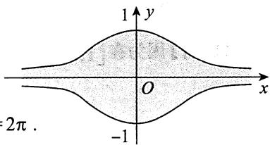

$$
S = 2 \int_ {- \infty} ^ {+ \infty} \frac {1}{1 + x ^ {2}} d x = 4 \arctan x \Bigg | _ {0} ^ {+ \infty} = 4 \times \frac {\pi}{2} = 2 \pi .
$$

# 6.【答案】2

【解析】由题设知，平面区域 $D$ 绕 $y$ 轴旋转一周所成旋转体的体积为

$$
\begin{array}{l} V = 2 \pi \int_ {0} ^ {1} x \sin \pi x d x = - 2 \int_ {0} ^ {1} x d (\cos \pi x) = - 2 \left(x \cos \pi x \left| _ {0} ^ {1} - \int_ {0} ^ {1} \cos \pi x d x\right) \right. \\ = - 2 \left(- 1 - \frac {1}{\pi} \sin \pi x \Bigg | _ {0} ^ {1}\right) = 2. \\ \end{array}
$$

7.【答案】 $-\frac{1}{4} (e - 1)$

【分析】本题利用变限函数给出 $f(x)$ ，要求考生计算定积分 $\int_{0}^{1}f(x)\mathrm{d}x$ ，以此考查考生掌握变限积分函数的熟练程度。同时，由于 $f(x)$ 是一个初等函数与一个变限积分函数的乘积，需要考生将其整合后再利用分部积分法才能解决问题，考生也可将其转化成二重积分，交换积分次序后计算得到答案，这对考生综合利用数学知识、灵活处理数学问题的能力进行了全面的考查。

【解析】方法一 $\overline{f} = \frac{1}{1 - 0}\int_{0}^{1}f(x)\mathrm{d}x = \int_{0}^{1}\left(x\int_{1}^{x}\frac{\mathrm{e}^{t^2}}{t}\mathrm{d}t\right)\mathrm{d}x = \frac{1}{2}\int_{0}^{1}\left(\int_{1}^{x}\frac{\mathrm{e}^{t^2}}{t}\mathrm{d}t\right)\mathrm{d}(x^2)$

$$
\begin{array}{l} = \frac {1}{2} \left[ x ^ {2} \int_ {1} ^ {x} \frac {\mathrm {e} ^ {t ^ {2}}}{t} \mathrm {d} t \Bigg | _ {0} ^ {1} - \int_ {0} ^ {1} x ^ {2} \mathrm {d} \left(\int_ {1} ^ {x} \frac {\mathrm {e} ^ {t ^ {2}}}{t} \mathrm {d} t\right) \right] \\ = - \frac {1}{2} \int_ {0} ^ {1} x ^ {2} \cdot \left. \frac {\mathrm {e} ^ {x ^ {2}}}{x} \mathrm {d} x = - \frac {1}{4} \mathrm {e} ^ {x ^ {2}} \right| _ {0} ^ {1} = - \frac {1}{4} (\mathrm {e} - 1). \\ \end{array}
$$

方法二 (此方法学完二重积分再看)

$$
\begin{array}{l} \bar {f} = \frac {1}{1 - 0} \int_ {0} ^ {1} f (x) d x = \int_ {0} ^ {1} \left(x \int_ {1} ^ {x} \frac {e ^ {t ^ {2}}}{t} d t\right) d x = - \int_ {0} ^ {1} x d x \int_ {x} ^ {1} \frac {e ^ {t ^ {2}}}{t} d t \\ = - \int_ {0} ^ {1} \frac {\mathrm {e} ^ {t ^ {2}}}{t} \mathrm {d} t \int_ {0} ^ {t} x \mathrm {d} x = - \frac {1}{2} \int_ {0} ^ {1} t ^ {2} \cdot \frac {\mathrm {e} ^ {t ^ {2}}}{t} \mathrm {d} t = - \frac {1}{4} \mathrm {e} ^ {t ^ {2}} \Bigg | _ {0} ^ {1} = - \frac {1}{4} (\mathrm {e} - 1). \\ \end{array}
$$

【注】函数 $y = f(x)$ 在区间 $[a, b]$ 上的平均值是指 $\frac{1}{b - a} \int_{a}^{b} f(x) \, \mathrm{d}x$ .

8.【解析】设 $P(m, \mathrm{e}^{-m})$ ， $m \geqslant 0$ ，旋转体图像如图所示，则

$$
V = \int_ {0} ^ {m} \pi \left(\mathrm {e} ^ {- x}\right) ^ {2} \mathrm {d} x = - \frac {\pi}{2} \int_ {0} ^ {m} \mathrm {e} ^ {- 2 x} \mathrm {d} (- 2 x) = - \frac {\pi}{2} \mathrm {e} ^ {- 2 x} \Bigg | _ {0} ^ {m} = \frac {\pi}{2} (1 - \mathrm {e} ^ {- 2 m}),
$$

$$
\frac {\mathrm {d} V}{\mathrm {d} t} = \frac {\mathrm {d} V}{\mathrm {d} m} \cdot \frac {\mathrm {d} m}{\mathrm {d} t} = - \frac {\pi}{2} \mathrm {e} ^ {- 2 m} \cdot (- 2) \cdot \frac {\mathrm {d} m}{\mathrm {d} t} = \pi \mathrm {e} ^ {- 2 m} \cdot \frac {\mathrm {d} m}{\mathrm {d} t}.
$$

又 $m = 1$ 时， $\frac{\mathrm{d}m}{\mathrm{d}t} = 1$ ，故 $\left.\frac{\mathrm{d}V}{\mathrm{d}t}\right|_{m = 1} = \frac{\pi}{\mathrm{e}^2}$

9.【答案】 $\ln \frac{2\sqrt{3} + 3}{3}$

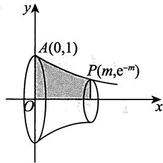

【解析】由于 $y^\prime = \cot x$ ，因此根据弧长公式，曲线 $y = \ln \sin x\left(\frac{\pi}{6}\leqslant x\leqslant \frac{\pi}{3}\right)$ 的弧长为

$$
s = \int_ {\frac {\pi}{6}} ^ {\frac {\pi}{3}} \sqrt {1 + \left(y ^ {\prime}\right) ^ {2}} d x = \int_ {\frac {\pi}{6}} ^ {\frac {\pi}{3}} \sqrt {1 + \cot^ {2} x} d x = \int_ {\frac {\pi}{6}} ^ {\frac {\pi}{3}} \csc x d x = \ln | \csc x - \cot x | \Bigg | _ {\frac {\pi}{6}} ^ {\frac {\pi}{3}} = \ln \frac {2 \sqrt {3} + 3}{3}.
$$

10.【答案】 $\sqrt{2} (\mathrm{e} - 1)$

【解析】 $s = \int_{0}^{1}\sqrt{\left[(\mathrm{e}^{\theta})^{\prime}\right]^{2} + (\mathrm{e}^{\theta})^{2}}\mathrm{d}\theta = \sqrt{2}\int_{0}^{1}\mathrm{e}^{\theta}\mathrm{d}\theta = \sqrt{2} (\mathrm{e} - 1).$

11.【答案】 $\frac{17}{12}$

【解析】由 $y^4 - 6xy + 3 = 0$ 可得 $x = \frac{1}{6} y^3 + \frac{1}{2y}$ ，故曲线 $y = y(x)$ 从点 $\left(\frac{2}{3}, 1\right)$ 到点 $\left(\frac{19}{12}, 2\right)$ 的长度为

$$
\begin{array}{l} \int_ {\frac {2}{3}} ^ {\frac {1 9}{1 2}} \sqrt {1 + \left[ y ^ {\prime} (x) \right] ^ {2}}   \mathrm {d} x   \frac {\text {换 元} , x = x (y)}{x = \frac {1}{6} y ^ {3} + \frac {1}{2 y}}   \int_ {1} ^ {2} \sqrt {1 + \left[ x ^ {\prime} (y) \right] ^ {2}}   \mathrm {d} y = \int_ {1} ^ {2} \sqrt {1 + \frac {1}{4} \left(y ^ {2} - \frac {1}{y ^ {2}}\right) ^ {2}}   \mathrm {d} y \\ = \frac {1}{2} \int_ {1} ^ {2} \sqrt {\left(y ^ {2} + \frac {1}{y ^ {2}}\right) ^ {2}} d y = \frac {1}{2} \int_ {1} ^ {2} \left(y ^ {2} + \frac {1}{y ^ {2}}\right) d y = \frac {1 7}{1 2}. \\ \end{array}
$$

# 12.【答案】(B)

【解析】先求出曲线 $y = \mathrm{e}^{x}$ 上过原点的切线，设 $(x_0, \mathrm{e}^{x_0})$ 为曲线 $y = \mathrm{e}^{x}$ 上任意一点，则该点处的切线方程为 $y - \mathrm{e}^{x_0} = \mathrm{e}^{x_0}(x - x_0)$ . 若切线过原点，则 $(0,0)$ 在切线方程上，此时 $x_0 = 1$ ，于是过原点的切线方程为 $y = \mathrm{ex}$ ，故所求的面积为 $\int_{0}^{1} (\mathrm{e}^x - \mathrm{e}x) \, \mathrm{d}x$ .

13.【答案】 $\frac{3}{4}\pi$

【解析】由旋转体的体积公式，得

$$
\begin{array}{l} V = \pi \int_ {0} ^ {+ \infty} y ^ {2} d x = \pi \int_ {0} ^ {+ \infty} \left(x ^ {2} e ^ {- x}\right) ^ {2} d x = \pi \int_ {0} ^ {+ \infty} x ^ {4} e ^ {- 2 x} d x = \frac {\pi}{2 ^ {5}} \int_ {0} ^ {+ \infty} (2 x) ^ {4} e ^ {- 2 x} d (2 x) \\ \stackrel {t = 2 x} {=} \frac {\pi}{2 ^ {5}} \int_ {0} ^ {+ \infty} t ^ {4} e ^ {- t} d t = \frac {\pi}{2 ^ {5}} \Gamma (5) = \frac {\pi}{2 ^ {5}} \cdot 4! = \frac {3}{4} \pi . \\ \end{array}
$$

14.【答案】 $\pi \left[\frac{8}{3} (\ln 2)^2 -\frac{16\ln 2}{9} +\frac{16}{27}\right]$

【解析】如图所示，所求旋转体体积为

$$
\begin{array}{l} V = \int_ {0} ^ {2} \pi (x \ln x) ^ {2} d x = \pi \int_ {0} ^ {2} x ^ {2} (\ln x) ^ {2} d x \\ = \pi \left[ \frac {1}{3} x ^ {3} (\ln x) ^ {2} \Bigg | _ {0} ^ {2} - \int_ {0} ^ {2} \frac {2}{3} x ^ {2} \ln x d x \right] \\ = \pi \left[ \frac {8}{3} (\ln 2) ^ {2} - \frac {2}{3} \left(\frac {1}{3} x ^ {3} \ln x \Big | _ {0} ^ {2} - \frac {1}{3} \int_ {0} ^ {2} x ^ {2} d x\right) \right] \\ = \pi \left[ \frac {8}{3} (\ln 2) ^ {2} - \frac {2}{3} \left(\frac {8}{3} \ln 2 - \frac {8}{9}\right) \right] \\ = \pi \left[ \frac {8}{3} (\ln 2) ^ {2} - \frac {1 6 \ln 2}{9} + \frac {1 6}{2 7} \right]. \\ \end{array}
$$

【注】由于 $\lim_{x\to 0^{+}}x\ln x = 0$ ，故不用考虑 $x = 0$ ：

15.【答案】 $\frac{1}{2}\left[\sqrt{2} +\ln (1 + \sqrt{2})\right]$

【解析】由 $\mathrm{ds} = \sqrt{1 + (y')^2}\mathrm{dx} = \sqrt{1 + x^2}\mathrm{dx}$ ，知曲线 $y = \frac{1}{2} x^{2}(0\leqslant x\leqslant 1)$ 的长度为 $s = \int_0^1\sqrt{1 + x^2}\mathrm{d}x$ 。令 $x = \tan t$ ，则

$$
s = \int_ {0} ^ {1} \sqrt {1 + x ^ {2}} d x = \int_ {0} ^ {\frac {\pi}{4}} \sec t d (\tan t)
$$

$$
\begin{array}{l} = \sec t \cdot \tan t \left| _ {0} ^ {\frac {\pi}{4}} - \int_ {0} ^ {\frac {\pi}{4}} \tan t \cdot \sec t \cdot \tan t d t \right. \\ = \sqrt {2} - \int_ {0} ^ {\frac {\pi}{4}} \sec t \cdot \sec^ {2} t d t + \int_ {0} ^ {\frac {\pi}{4}} \sec t d t \\ = \sqrt {2} - \int_ {0} ^ {\frac {\pi}{4}} \sec t d (\tan t) + \int_ {0} ^ {\frac {\pi}{4}} \sec t d t \\ = \sqrt {2} - \int_ {0} ^ {\frac {\pi}{4}} \sec t d (\tan t) + \ln (\sec t + \tan t) \left| \begin{array}{c} \frac {\pi}{4} \\ 0 \end{array} \right. \\ = \sqrt {2} - \int_ {0} ^ {\frac {\pi}{4}} \sec t d (\tan t) + \ln (1 + \sqrt {2}), \\ \end{array}
$$

得 $s = \frac{1}{2}\left[\sqrt{2} +\ln (1 + \sqrt{2})\right]$

16.【答案】(A)

【解析】 $V_{1} = \int_{1}^{\mathrm{e}}\pi \left[1 - (\ln x)^{2}\right]\mathrm{d}x = \pi \left[(\mathrm{e} - 1) - x(\ln x)^{2}\bigg|_{1}^{\mathrm{e}} + 2\int_{1}^{\mathrm{e}}\ln x\mathrm{d}x\right]$

$$
\begin{array}{l} = \pi \left(- 1 + 2 x \ln x \left| _ {1} ^ {e} - 2 \int_ {1} ^ {e} 1 d x\right) = \pi , \right. \\ V _ {2} = \int_ {1} ^ {\mathrm {e}} \pi (1 - \ln x) ^ {2} \mathrm {d} x = \pi \left[ (\mathrm {e} - 1) + \int_ {1} ^ {\mathrm {e}} (\ln x) ^ {2} \mathrm {d} x - 2 \int_ {1} ^ {\mathrm {e}} \ln x \mathrm {d} x \right] = \pi (2 \mathrm {e} - 5), \\ \end{array}
$$

因此 $V_{1} > \frac{\pi}{2} > V_{2}$

17.【答案】 $\frac{\pi}{6} (17\sqrt{17} -5\sqrt{5})$

【解析】 $x = \sqrt{y},\frac{\mathrm{d}x}{\mathrm{d}y} = \frac{1}{2\sqrt{y}},$

$$
\begin{array}{l} S = \int_ {1} ^ {4} 2 \pi x \sqrt {1 + \left(\frac {\mathrm {d} x}{\mathrm {d} y}\right) ^ {2}} \mathrm {d} y = \int_ {1} ^ {4} 2 \pi \sqrt {y} \sqrt {1 + \frac {1}{4 y}} \mathrm {d} y = 2 \pi \int_ {1} ^ {4} \sqrt {y + \frac {1}{4}} \mathrm {d} y \\ = 2 \pi \cdot \frac {2}{3} \left(y + \frac {1}{4}\right) ^ {\frac {3}{2}} \Bigg | _ {1} ^ {4} = \frac {\pi}{6} (1 7 \sqrt {1 7} - 5 \sqrt {5}). \\ \end{array}
$$

18.【答案】 $\frac{1}{4}\pi$

【解析】所求的平均值为 $\int_{0}^{1}\frac{x^2}{\sqrt{1 - x^2}}\mathrm{d}x$

令 $x = \sin \theta$ ，则

$$
\text {上 式} = \int_ {0} ^ {\frac {\pi}{2}} \sin^ {2} \theta \mathrm {d} \theta = \left(\frac {1}{2}   \theta - \frac {1}{4}   \sin 2 \theta\right) \Bigg | _ {0} ^ {\frac {\pi}{2}} = \frac {1}{4}   \pi    .
$$

19.【解析】(1)设 $D$ 的面积为 $S$ ，则

$$
\begin{array}{l} S = \int_ {\sqrt {2}} ^ {2} \frac {\sqrt {x ^ {2} - 1}}{x ^ {2}} \mathrm {d} x \stackrel {x = \sec t} {=} \int_ {\frac {\pi}{4}} ^ {\frac {\pi}{3}} \frac {\tan t}{\sec^ {2} t} \sec t \tan t \mathrm {d} t = \int_ {\frac {\pi}{4}} ^ {\frac {\pi}{3}} \frac {\tan^ {2} t}{\sec t} \mathrm {d} t \\ = \int_ {\frac {\pi}{4}} ^ {\frac {\pi}{3}} \frac {\sin^ {2} t}{\cos t} d t = \int_ {\frac {\pi}{4}} ^ {\frac {\pi}{3}} \frac {1 - \cos^ {2} t}{\cos t} d t = \int_ {\frac {\pi}{4}} ^ {\frac {\pi}{3}} (\sec t - \cos t) d t \\ = \ln \left| \sec t + \tan t \right| \left| \frac {\frac {\pi}{3}}{\frac {\pi}{4}} - \sin t \right| \left| \frac {\frac {\pi}{3}}{\frac {\pi}{4}} = \ln \frac {2 + \sqrt {3}}{1 + \sqrt {2}} - \frac {\sqrt {3} - \sqrt {2}}{2} \right. \\ = \ln \left[ (\sqrt {3} + 2) (\sqrt {2} - 1) \right] - \frac {\sqrt {3} - \sqrt {2}}{2}. \\ \end{array}
$$

(2)由旋转体的体积公式知

$$
\begin{array}{l} V = \pi \int_ {\sqrt {2}} ^ {2} \left(\frac {\sqrt {x ^ {2} - 1}}{x ^ {2}}\right) ^ {2} d x = \pi \int_ {\sqrt {2}} ^ {2} \frac {x ^ {2} - 1}{x ^ {4}} d x = \pi \int_ {\sqrt {2}} ^ {2} \left(\frac {1}{x ^ {2}} - \frac {1}{x ^ {4}}\right) d x \\ = \pi \left(- \frac {1}{x} + \frac {1}{3 x ^ {3}}\right) \Bigg | _ {\sqrt {2}} ^ {2} = \pi \left(\frac {5}{6 \sqrt {2}} - \frac {1 1}{2 4}\right) = \frac {1 0 \sqrt {2} - 1 1}{2 4} \pi . \\ \end{array}
$$

  
关注公众号【考研小舟】免费考研资料&无水印PDF

  
黑白&彩印都是5分/页，满4.9全国包邮下单备注：考研小舟，送草稿纸

# 第11章 一元函数和分学的应用（二）

# ——积分等式与积分不等式

# 1.【答案】(B)

【解析】设 $F(x) = \int_{0}^{x}\sqrt{4a^{2} - t^{2}}\mathrm{d}t + \int_{a}^{x}\frac{1}{\sqrt{4a^{2} - t^{2}}}\mathrm{d}t$ ，则

$$
F (0) = \int_ {a} ^ {0} \frac {1}{\sqrt {4 a ^ {2} - t ^ {2}}} \mathrm {d} t <   0, F (a) = \int_ {0} ^ {a} \sqrt {4 a ^ {2} - t ^ {2}} \mathrm {d} t > 0,
$$

因为 $F(x)$ 在 $[0, a]$ 上连续，故由连续函数的零点定理知，存在 $\xi \in (0, a)$ ，使得 $F(\xi) = 0$ 。

又 $F^{\prime}(x) = \sqrt{4a^{2} - x^{2}} +\frac{1}{\sqrt{4a^{2} - x^{2}}} >0$ ，所以 $F(x)$ 在 $[0,a]$ 上至多有一个零点.

综上所述， $F(x)$ 在 $[0,a]$ 上只有一个零点，即方程 $\int_0^x\sqrt{4a^2 - t^2}\mathrm{d}t + \int_a^x\frac{1}{\sqrt{4a^2 - t^2}}\mathrm{d}t = 0$ 在 $[0,a]$ 上只有一个根.

故正确选项为(B).

# 2.【答案】(D)

【解析】由题知， $f^{\prime}(x) > 0$ ，故当 $x\in (0,\pi)$ 时， $f(x) > f(-x)$ ，此时

$$
\begin{array}{l} I _ {1} = \int_ {- \pi} ^ {0} f (x) \sin x d x + \int_ {0} ^ {\pi} f (x) \sin x d x \\ \stackrel {(*)} {=} - \int_ {0} ^ {\pi} f (- u) \sin u \mathrm {d} u + \int_ {0} ^ {\pi} f (x) \sin x \mathrm {d} x \\ = \int_ {0} ^ {\pi} [ f (x) - f (- x) ] \sin x d x > 0, \\ \end{array}
$$

(*)处将 $\int_{-\pi}^{0}f(x)\sin x\mathrm{d}x$ 利用 $x = -u$ 进行换元.

亦可用积分第一中值定理证明 $I_{1} > 0$ ，即

$$
\begin{array}{l} I _ {1} = f (\xi) \int_ {- \pi} ^ {0} \sin x d x + f (\eta) \int_ {0} ^ {\pi} \sin x d x = 2 [ f (\eta) - f (\xi) ] > 0 [ \xi \in (- \pi , 0), \eta \in (0, \pi) ]. \\ I _ {2} = f (x) \sin x \Bigg | _ {- \pi} ^ {\pi} - \int_ {- \pi} ^ {\pi} f ^ {\prime} (x) \sin x d x = - \int_ {- \pi} ^ {\pi} f ^ {\prime} (x) \sin x d x. \\ \end{array}
$$

由 $I_{1}$ 的结论可知 $I_{2} = -\int_{0}^{\pi}[f'(x) - f'(-x)]\sin x\mathrm{d}x.$

由 $f''(x) < 0$ ，知 $f'(x)$ 单调递减，故当 $x \in (0, \pi)$ 时， $f'(x) < f'(-x)$ ，进而可知 $I_2 > 0$ . 故选(D).

3.【解析】必要性 $(\Rightarrow)$

由题设，对任意的 $x \in \mathbf{R}$ ， $f(x) = f(x + T)$ ，则

$$
\int_ {a} ^ {a + T} f (x) \mathrm {d} x = \int_ {a} ^ {0} f (x) \mathrm {d} x + \int_ {0} ^ {T} f (x) \mathrm {d} x + \int_ {T} ^ {a + T} f (x) \mathrm {d} x,
$$

其中 $\int_{T}^{a + T}f(x)\mathrm{d}x\stackrel {t = x - T}{=}\int_{0}^{a}f(t + T)\mathrm{d}t = \int_{0}^{a}f(t)\mathrm{d}t,$

故 $\int_{a}^{a + T}f(x)\mathrm{d}x = \int_{a}^{0}f(x)\mathrm{d}x + \int_{0}^{a}f(x)\mathrm{d}x + \int_{0}^{T}f(x)\mathrm{d}x = \int_{0}^{T}f(x)\mathrm{d}x$ ，即 $\int_{a}^{a + T}f(x)\mathrm{d}x$ 为常数.

充分性 $(\Leftarrow)$

由 $\int_{a}^{a + T}f(x)\mathrm{d}x\stackrel {\text{记}}{\equiv}C$ ，得 $\left[\int_{a}^{a + T}f(x)\mathrm{d}x\right]_{a}^{\prime} = 0$ ，即 $f(a + T) - f(a) = 0$ ，也即任给常数 $a\in \mathbf{R}$ ，有 $f(a + T) = f(a)$ ，故 $f(x)$ 以 $T$ 为周期.

证毕.

4.【分析】本题可视为证明两个函数相等(等式两端看作两个函数).

【解析】记 $\varphi (x) = \int_{0}^{x}\left[\int_{0}^{t}f(u)\mathrm{d}u\right]\mathrm{d}t,\psi (x) = \int_{0}^{x}f(t)(x - t)\mathrm{d}t,$

由 $f(x)$ 连续，得

$$
\varphi^ {\prime} (x) = \int_ {0} ^ {x} f (u) \mathrm {d} u = \int_ {0} ^ {x} f (t) \mathrm {d} t,
$$

$$
\psi^ {\prime} (x) = \left[ x \int_ {0} ^ {x} f (t) \mathrm {d} t - \int_ {0} ^ {x} t f (t) \mathrm {d} t \right] ^ {\prime} = \int_ {0} ^ {x} f (t) \mathrm {d} t + x f (x) - x f (x) = \int_ {0} ^ {x} f (t) \mathrm {d} t,
$$

故 $\varphi^{\prime}(x) = \psi^{\prime}(x)$ ，又 $\varphi (0) = \psi (0) = 0$ ，从而 $\varphi (x) = \psi (x)$ ：

【注】本题也可利用分部积分法直接证明.

5.【分析】由欲证结论出发，构造辅助函数，再对其应用微分中值定理，即可得证.

由欲证结论 $f(\xi)\int_{\xi}^{b}g(x)\mathrm{d}x = g(\xi)\int_{a}^{\xi}f(x)\mathrm{d}x$ ，得 $f(\xi)\int_{\xi}^{b}g(x)\mathrm{d}x - g(\xi)\int_{a}^{\xi}f(x)\mathrm{d}x = 0$ ，所以

$$
f (x) \int_ {x} ^ {b} g (t) \mathrm {d} t - g (x) \int_ {a} ^ {x} f (t) \mathrm {d} t = 0,
$$

即 $\left[\int_{a}^{x}f(t)\mathrm{d}t\int_{x}^{b}g(t)\mathrm{d}t\right]' = 0.$

记 $F(x) = \int_{a}^{x}f(t)\mathrm{d}t\int_{x}^{b}g(t)\mathrm{d}t$

【解析】构造辅助函数 $F(x) = \int_{a}^{x} f(t) \, \mathrm{d}t \int_{x}^{b} g(t) \, \mathrm{d}t$ ，则 $F(x)$ 在 $[a, b]$ 上连续，在 $(a, b)$ 内可导，且有 $F(a) = F(b) = 0$ ，于是由罗尔定理，知存在 $\xi \in (a, b)$ ，使 $F'(\xi) = 0$ ，即

$$
\left. \left[ \int_ {a} ^ {x} f (t) \mathrm {d} t \int_ {x} ^ {b} g (t) \mathrm {d} t \right] ^ {\prime} \right| _ {x = \xi} = 0,
$$

所以

6.【分析】对第一个积分作倒代换，可变为第二个积分，因而二者相等，再从两个积分的和积分出发，选择适当变换，即可得证.

【解析】令 $x = \frac{1}{t}$ ，则有

$$
\int_ {0} ^ {+ \infty} \frac {\mathrm {d} x}{1 + x ^ {4}} = \int_ {+ \infty} ^ {0} \frac {- \frac {1}{t ^ {2}}}{1 + \frac {1}{t ^ {4}}} \mathrm {d} t = \int_ {0} ^ {+ \infty} \frac {t ^ {2}}{1 + t ^ {4}} \mathrm {d} t,
$$

于是 $\int_{0}^{+\infty}\frac{\mathrm{d}x}{1 + x^4} = \int_{0}^{+\infty}\frac{x^2}{1 + x^4}\mathrm{d}x = \frac{1}{2}\int_{0}^{+\infty}\frac{1 + x^2}{1 + x^4}\mathrm{d}x.$

$$
\begin{array}{l} \int_ {0} ^ {+ \infty} \frac {1 + x ^ {2}}{1 + x ^ {4}} d x = \int_ {0} ^ {+ \infty} \frac {1 + \frac {1}{x ^ {2}}}{\frac {1}{x ^ {2}} + x ^ {2}} d x = \int_ {0} ^ {+ \infty} \frac {d \left(x - \frac {1}{x}\right)}{\left(x - \frac {1}{x}\right) ^ {2} + 2} \\ \xlongequal {\text {令} u = x - \frac {1}{x}} \int_ {- \infty} ^ {+ \infty} \frac {\mathrm {d} u}{u ^ {2} + 2} = 2 \int_ {0} ^ {+ \infty} \frac {\mathrm {d} u}{2 + u ^ {2}} \\ = \sqrt {2} \int_ {0} ^ {+ \infty} \frac {\mathrm {d} \left(\frac {u}{\sqrt {2}}\right)}{1 + \left(\frac {u}{\sqrt {2}}\right) ^ {2}} = \sqrt {2} \arctan \left. \frac {u}{\sqrt {2}} \right| _ {0} ^ {+ \infty} = \frac {\sqrt {2}}{2} \pi , \\ \end{array}
$$

故 $\int_{0}^{+\infty}\frac{\mathrm{d}x}{1 + x^4} = \int_{0}^{+\infty}\frac{x^2}{1 + x^4}\mathrm{d}x = \frac{\sqrt{2}}{4}\pi .$

# 7.【答案】(C)

【解析】令 $f(x) = \mathrm{e}^{x}$ ， $g(x) = \mathrm{e}^{-x}$ ，满足题干条件，但

$$
\int_ {- 1} ^ {0} f (x) g (x) \mathrm {d} x = \int_ {- 1} ^ {0} \mathrm {e} ^ {x} \cdot \mathrm {e} ^ {- x} \mathrm {d} x = \int_ {0} ^ {1} \mathrm {e} ^ {x} \cdot \mathrm {e} ^ {- x} \mathrm {d} x = \int_ {0} ^ {1} f (x) g (x) \mathrm {d} x,
$$

且

$$
\int_ {- 1} ^ {0} | f (x) g (x) | \mathrm {d} x = \int_ {- 1} ^ {0} \left| \mathrm {e} ^ {x} \cdot \mathrm {e} ^ {- x} \right| \mathrm {d} x = \int_ {0} ^ {1} \left| \mathrm {e} ^ {x} \cdot \mathrm {e} ^ {- x} \right| \mathrm {d} x = \int_ {0} ^ {1} | f (x) g (x) | \mathrm {d} x,
$$

所以选项(A)，(B)错误.

令 $f(x) = x$ ， $g(x) = -x$ ，亦满足题干条件，但

$$
\int_ {- 1} ^ {0} f [ f (x) ] \mathrm {d} x = \int_ {- 1} ^ {0} x \mathrm {d} x = \frac {1}{2} x ^ {2} \Bigg | _ {- 1} ^ {0} = - \frac {1}{2},
$$

$$
\int_ {0} ^ {1} g [ g (x) ] \mathrm {d} x = \int_ {0} ^ {1} x \mathrm {d} x = \left. \frac {1}{2} x ^ {2} \right| _ {0} ^ {1} = \frac {1}{2},
$$

所以选项(D)错误.

对于选项(C),

$$
\int_ {- 1} ^ {0} f [ g (x) ] \mathrm {d} x - \int_ {0} ^ {1} f [ g (x) ] \mathrm {d} x = \int_ {0} ^ {1} f [ g (- x) ] \mathrm {d} x - \int_ {0} ^ {1} f [ g (x) ] \mathrm {d} x = \int_ {0} ^ {1} \left\{f [ g (- x) ] - f [ g (x) ] \right\} \mathrm {d} x.
$$

因为 $f^{\prime}(x) > 0$ ， $g^{\prime}(x) <   0$ ，所以 $f(x)$ 单调增加， $g(x)$ 单调减少，所以当 $x > 0$ 时，有

$$
g (- x) > g (x), f [ g (- x) ] > f [ g (x) ],
$$

故

$$
\int_ {- 1} ^ {0} f [ g (x) ] \mathrm {d} x - \int_ {0} ^ {1} f [ g (x) ] \mathrm {d} x > 0,
$$

即

$$
\int_ {- 1} ^ {0} f [ g (x) ] \mathrm {d} x > \int_ {0} ^ {1} f [ g (x) ] \mathrm {d} x.
$$

# 8.【答案】(C)

【解析】令 $F(x) = x\int_{0}^{x}f(t)g(t)\mathrm{d}t - \int_{0}^{x}f(t)\mathrm{d}t\int_{0}^{x}g(t)\mathrm{d}t,x\geqslant 0$ ，则 $F(0) = 0$

$$
\begin{array}{l} F ^ {\prime} (x) = \int_ {0} ^ {x} f (t) g (t) d t + x f (x) g (x) - f (x) \int_ {0} ^ {x} g (t) d t - g (x) \int_ {0} ^ {x} f (t) d t \\ = \int_ {0} ^ {x} [ f (t) g (t) + f (x) g (x) - f (x) g (t) - g (x) f (t) ] d t \\ = \int_ {0} ^ {x} [ f (x) - f (t) ] [ g (x) - g (t) ] d t. \\ \end{array}
$$

当 $f(x)$ ， $g(x)$ 单调性相同时， $\left[f(x) - f(t)\right]\left[g(x) - g(t)\right] \geqslant 0$ ， $F^{\prime}(x) \geqslant 0$ ，有 $F(x) \geqslant 0$ ，故 $F(1) \geqslant 0$ 当 $f(x)$ ， $g(x)$ 单调性相反时， $\left[f(x) - f(t)\right]\left[g(x) - g(t)\right] \leqslant 0$ ， $F^{\prime}(x) \leqslant 0$ ，有 $F(x) \leqslant 0$ ，故 $F(1) \leqslant 0$ 综上，选(C).

【注】构造辅助函数时，为了前后统一量纲，令 $F(x) = x\int_{0}^{x}f(t)g(t)\mathrm{d}t - \int_{0}^{x}f(t)\mathrm{d}t\int_{0}^{x}g(t)\mathrm{d}t$ ，而不构造为 $F(x) = \int_0^x f(t)g(t)\mathrm{d}t - \int_0^x f(t)\mathrm{d}t\int_0^x g(t)\mathrm{d}t$ .

9.【解析】由已知条件 $f(a) = f(b) = 0$ ，得

$$
f (x) = f (x) - f (a) = \int_ {a} ^ {x} f ^ {\prime} (t) d t, f (x) = f (x) - f (b) = - \int_ {x} ^ {b} f ^ {\prime} (t) d t,
$$

故

$$
\begin{array}{l} \leqslant \int_ {a} ^ {x} | f ^ {\prime} (t) | d t + \int_ {x} ^ {b} | f ^ {\prime} (t) | d t \\ = \int_ {a} ^ {b} | f ^ {\prime} (t) | d t, \\ \end{array}
$$

所以当 $x \in (a, b)$ 时， $\left|f(x)\right| \leqslant \frac{1}{2} \int_{a}^{b} \left|f'(x)\right| \mathrm{d} x$ ，得证.

10.【解析】方法一任取 $x\in (0,1]$ ，由拉格朗日中值定理有 $f(x) - f(0) = f^{\prime}(\xi)x$ ， $\xi \in (0,x)$ 又 $f(0) = 0$ ，故 $f(x) = f'(\xi)x$ ， $x\in (0,1]$ ，于是

$$
\left| \int_ {0} ^ {1} f (x) \mathrm {d} x \right| = \left| \int_ {0} ^ {1} f ^ {\prime} (\xi) x \mathrm {d} x \right| \leqslant \int_ {0} ^ {1} \left| f ^ {\prime} (\xi) \right| x \mathrm {d} x \leqslant M \int_ {0} ^ {1} x \mathrm {d} x = \frac {M}{2}.
$$

方法二 设 $x \in [0,1]$ ，由 $f(0) = 0$ 知 $\int_0^x f'(t)\mathrm{d}t = f(x) - f(0) = f(x)$ ，于是

$$
\left| f (x) \right| = \left| \int_ {0} ^ {x} f ^ {\prime} (t) \mathrm {d} t \right| \leqslant \int_ {0} ^ {x} \left| f ^ {\prime} (t) \right| \mathrm {d} t \leqslant \int_ {0} ^ {x} M \mathrm {d} t = M x,
$$

故

$$
\left| \int_ {0} ^ {1} f (x) \mathrm {d} x \right| \leqslant \int_ {0} ^ {1} | f (x) | \mathrm {d} x \leqslant \int_ {0} ^ {1} M x \mathrm {d} x = \frac {M}{2}.
$$

【注】对积分 $\left|\int_0^1 f(x)\mathrm{d}x\right|$ 作估计，只要对被积函数 $f(x)$ 作估计即可.条件中给出导数 $f^{\prime}(x)$ 及 $f(0) = 0$ 的信息，自然想办法把 $f(x)$ 和 $f^{\prime}(x)$ 联系起来.在高等数学中，联系 $f(x)$ 和 $f^{\prime}(x)$ 有两种常用的办法：一是微分学中的拉格朗日中值定理(见方法一)，二是积分学中的牛顿-莱布尼茨公式（见方法二）.

11.【解析】令 $u^2 = t$ ，则

$$
\begin{array}{l} f (x) = \int_ {x} ^ {x + 1} \sin u ^ {2} d u = \int_ {x ^ {2}} ^ {(x + 1) ^ {2}} \frac {\sin t}{2 \sqrt {t}} d t = \int_ {x ^ {2}} ^ {(x + 1) ^ {2}} \frac {- 1}{2 \sqrt {t}} d (\cos t) \\ = \frac {\cos x ^ {2}}{2 x} - \frac {\cos (x + 1) ^ {2}}{2 (x + 1)} - \frac {1}{4} \int_ {x ^ {2}} ^ {(x + 1) ^ {2}} t ^ {- \frac {3}{2}} \cos t d t. \\ \end{array}
$$

故当 $x > 0$ 时， $\left|f(x)\right|\leqslant \frac{1}{2x} +\frac{1}{2(x + 1)} +\frac{1}{4}\int_{x^2}^{(x + 1)^2}t^{-\frac{3}{2}}dt$

$$
= \frac {1}{2 x} + \frac {1}{2 (x + 1)} + \frac {1}{2} \left(\frac {1}{x} - \frac {1}{x + 1}\right) = \frac {1}{x}.
$$

# 第12章 一元函数积分学的应用（三）物理应用

1.【答案】 $-\frac{\sqrt{2}}{2} G\rho$

【解析】依题意画出如图所示的直角坐标系，用微元法.取 $y$ 轴上的 $[y,y + \mathrm{d}y]\subset [0,1]$ ，此微段

细杆对质点的引力大小为 $\mathrm{d}F = G\cdot \frac{\rho\mathrm{d}y}{1 + y^2}$ ，其在 $x$ 轴正向的分力为

$$
\mathrm {d} F _ {x} = \frac {- 1}{\sqrt {1 + y ^ {2}}} \mathrm {d} F = - \frac {G \rho \mathrm {d} y}{(1 + y ^ {2}) ^ {\frac {3}{2}}} ,
$$

于是该细杆对此质点的引力沿 $x$ 轴正向的分力为

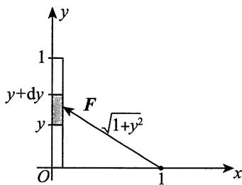

$$
F _ {x} = \int_ {0} ^ {1} \left[ - \frac {G \rho}{\left(1 + y ^ {2}\right) ^ {\frac {3}{2}}} \right] \mathrm {d} y \xlongequal {\text {令} y = \tan t} - G \rho \int_ {0} ^ {\frac {\pi}{4}} \cos t \mathrm {d} t = - \frac {\sqrt {2}}{2} G \rho .
$$

2.【答案】 $\frac{\sqrt{2}}{2}\rho ga^3$

【解析】建立如图所示的坐标系，设压力微元为 $\mathrm{d}P$

当 $y > 0$ 时， $\mathrm{d}P = \rho g\cdot \left(\frac{a}{\sqrt{2}} -y\right)\cdot 2\left(\frac{a}{\sqrt{2}} -y\right)\mathrm{d}y$ ，则

$$
P _ {1} = \int_ {0} ^ {\frac {a}{\sqrt {2}}} 2 \rho g \left(\frac {a}{\sqrt {2}} - y\right) ^ {2} d y = - 2 \rho g \cdot \frac {1}{3} \left(\frac {a}{\sqrt {2}} - y\right) ^ {3} \Bigg | _ {0} ^ {\frac {a}{\sqrt {2}}} = \frac {\sqrt {2}}{6} \rho g a ^ {3}.
$$

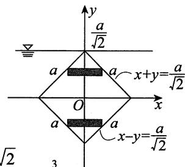

当 $y < 0$ 时， $\mathrm{d}P = \rho g\cdot \left(\frac{a}{\sqrt{2}} -y\right)\cdot 2\left(\frac{a}{\sqrt{2}} +y\right)\mathrm{d}y$ ，则

$$
\begin{array}{l} P _ {2} = \int_ {- \frac {a}{\sqrt {2}}} ^ {0} 2 \rho g \left(\frac {a ^ {2}}{2} - y ^ {2}\right) d y = 2 \rho g \cdot \frac {a ^ {2}}{2} \cdot \frac {a}{\sqrt {2}} - 2 \rho g \cdot \left(\left. \frac {1}{3} y ^ {3} \right| _ {- \frac {a}{\sqrt {2}}} ^ {0}\right) \\ = 2 \rho g \left(\frac {a ^ {3}}{2 \sqrt {2}} - \frac {1}{3} \cdot \frac {a ^ {3}}{2 \sqrt {2}}\right) = \frac {4}{3} \cdot \frac {1}{2 \sqrt {2}} \cdot \rho g a ^ {3} = \frac {\sqrt {2}}{3} \rho g a ^ {3}. \\ \end{array}
$$

故 $P = P_{1} + P_{2} = \left(\frac{\sqrt{2}}{6} +\frac{\sqrt{2}}{3}\right)\rho ga^{3} = \frac{\sqrt{2}}{2}\rho ga^{3}.$

# 3.【答案】 $\frac{GM}{R}$

【解析】设举高至 $a$ ，则 $W(a) = \int_{R}^{R + a}G\frac{M}{x^2}\mathrm{d}x$ ，故

$$
W = \lim  _ {a \rightarrow + \infty} W (a) = \int_ {R} ^ {+ \infty} G \frac {M}{x ^ {2}} d x = - G M \left. \frac {1}{x} \right| _ {R} ^ {+ \infty} = \frac {G M}{R}.
$$

4.【解析】(1)以缸底中心为原点，对称轴为 $y$ 轴在轴截面上建立如图所示的平面直角坐标系，则可设缸内表面(旋转抛物面)是由抛物线 $y = kx^{2}$ 绕 $y$ 轴旋转而成的。根据题意， $y(a) = a$ ，故 $k = \frac{1}{a}$ ，

即抛物线方程为 $y = \frac{1}{a} x^2$

于是，缸的容积为

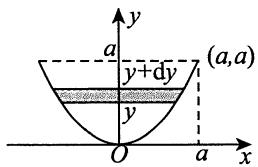

$$
V = \pi \int_ {0} ^ {a} x ^ {2} \mathrm {d} y = \pi \int_ {0} ^ {a} a y \mathrm {d} y = \frac {\pi a ^ {3}}{2} (\text {立 方 米}).
$$

因此，若以每秒 $Q$ 立方米的速率将缸中的水全部抽出，则需要的时间为

$$
t = \frac {V}{Q} = \frac {\frac {\pi a ^ {3}}{2}}{Q} = \frac {\pi a ^ {3}}{2 Q} (\text {秒}).
$$

(2) 取 $y$ 为积分变量, 其取值范围为 $[0, a]$ . 在 $y$ 轴上的区间 $[0, a]$ 内任取一个典型小区间 $[y, y + \mathrm{d}y]$ , 则在该典型小区间上需做功的微元为

$$
\mathrm {d} W = \rho g \pi x ^ {2} \mathrm {d} y \cdot (a - y) = \rho g \pi a y (a - y) \mathrm {d} y = \rho g \pi a \left(a y - y ^ {2}\right) \mathrm {d} y.
$$

于是，所求功为

$$
W = \int_ {0} ^ {a} \rho g \pi a (a y - y ^ {2}) \mathrm {d} y = \rho g \pi a \left(\frac {1}{2} a y ^ {2} - \frac {1}{3} y ^ {3}\right) \Bigg | _ {0} ^ {a} = \frac {1}{6} \rho g \pi a ^ {4} (\text {焦 耳}).
$$

5.【解析】(1)如图所示，当液面在 $y(-1\leqslant y\leqslant 1)$ 处时，容器内液体的体积为 $V = 2\int_{-1}^{y}\sqrt{1 - u^2}\mathrm{d}u$

设 $t$ 时刻液体的体积为 $V = V(t)$ ，则

$$
\frac {\mathrm {d} V}{\mathrm {d} t} = \frac {\mathrm {d} V}{\mathrm {d} y} \cdot \frac {\mathrm {d} y}{\mathrm {d} t} = 2 \sqrt {1 - y ^ {2}} \frac {\mathrm {d} y}{\mathrm {d} t},
$$

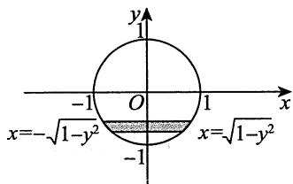

令 $y = 0$ ，并由条件 $\frac{\mathrm{d}V}{\mathrm{d}t} = 0.2$ 得 $\frac{\mathrm{dy}}{\mathrm{dt}} = 0.1$ ，故液面在 $y = 0$ 时，液面下降的速率为 $0.1\mathrm{m / min}$

$$
\begin{array}{l} W = \int_ {- 1} ^ {1} 2 \sqrt {1 - y ^ {2}} (1 - y) d y = \int_ {- 1} ^ {1} 2 \sqrt {1 - y ^ {2}} d y - \int_ {- 1} ^ {1} 2 y \sqrt {1 - y ^ {2}} d y \tag {2} \\ = 4 \int_ {0} ^ {1} \sqrt {1 - y ^ {2}} d y \xlongequal {y = \sin t} 4 \int_ {0} ^ {\frac {\pi}{2}} \cos^ {2} t d t = 4 \times \frac {\pi}{4} = \pi (J). \\ \end{array}
$$

【注】因为 $2y\sqrt{1 - y^2}$ 为奇函数，故 $\int_{-1}^{1}2y\sqrt{1 - y^2}\mathrm{d}y = 0$

# 6.【答案】(A)

【解析】设细杆的质量为 $M$ ，长为 $l$ ，建立如图所示的坐标系. 设质点距杆左端(原点)的距离为 $x_0(x_0 > 1)$ ，则引力微元大小为

$$
\mathrm {d} F = G \cdot \frac {M \cdot \frac {\mathrm {d} x}{l} \cdot a}{(x _ {0} - x) ^ {2}} = G a \frac {1}{(x _ {0} - x) ^ {2}} \mathrm {d} x, \quad \frac {M = 1 , l = 1}{0 x x + \mathrm {d} x 1 \frac {4}{3} \left| \frac {3}{2} \right.}
$$

此瞬时引力大小为

$$
\begin{array}{l} F = \int_ {0} ^ {1} \mathrm {d} F = G a \int_ {0} ^ {1} \frac {1}{\left(x _ {0} - x\right) ^ {2}} \mathrm {d} x \\ = G a \frac {1}{x _ {0} - x} \Bigg | _ {x = 0} ^ {x = 1} = G a \left(\frac {1}{x _ {0} - 1} - \frac {1}{x _ {0}}\right). \\ \end{array}
$$

故所求引力做功大小为

$$
\begin{array}{l} W = \left| \int_ {\frac {3}{2}} ^ {\frac {4}{3}} G a \left(\frac {1}{x _ {0} - 1} - \frac {1}{x _ {0}}\right) d x _ {0} \right| = \left| G a \ln \frac {x _ {0} - 1}{x _ {0}} \right| _ {\frac {3}{2}} ^ {\frac {4}{3}} \\ = \left| - G a \ln \frac {4}{3} \right| = G a \ln \frac {4}{3}. \\ \end{array}
$$

# 7.【答案】(A)

【解析】设三角形斜边与水面夹角为 $\theta$ (见图), 则斜边所在直线的方程为

$$
y = \cos \theta - x \cdot \cot \theta .
$$

直角三角板所受水的压力为

$$
\begin{array}{l} P = \rho g \int_ {0} ^ {\sin \theta} x (\cos \theta - x \cdot \cot \theta) d x \\ = \rho g \left(\cos \theta \int_ {0} ^ {\sin \theta} x d x - \cot \theta \int_ {0} ^ {\sin \theta} x ^ {2} d x\right) \\ = \frac {1}{6} \rho g \cos \theta \sin^ {2} \theta , \\ \end{array}
$$

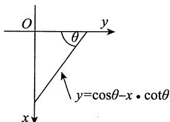

其中 $\rho$ 为水的密度， $g$ 为重力加速度.

$$
P ^ {\prime} (\theta) = \frac {1}{6} \rho g (2 \sin \theta \cos^ {2} \theta - \sin^ {3} \theta),
$$

令 $P^{\prime}(\theta) = 0$ 得到唯一驻点 $\theta = \arccos \frac{1}{\sqrt{3}}$

于是当 $\theta = \arccos \frac{1}{\sqrt{3}}$ ，即水平直角边长度 $\cos \theta = \frac{1}{\sqrt{3}}$ 时，三角板受到水的压力最大，故选(A).

# 第13章 多元函数微分学

1.【答案】 $\frac{\pi}{2} dx$

【解析】 $\frac{\partial z}{\partial x} = \frac{y - \sin(x + y)}{1 + [xy + \cos(x + y)]^2}, \frac{\partial z}{\partial y} = \frac{x - \sin(x + y)}{1 + [xy + \cos(x + y)]^2},$

故 $\mathrm{d}z\big|_{(0,\pi)} = \frac{\partial z}{\partial x}\bigg|_{(0,\pi)}\mathrm{d}x + \frac{\partial z}{\partial y}\bigg|_{(0,\pi)}\mathrm{d}y = \frac{\pi}{2}\mathrm{d}x.$

2.【答案】 $\frac{y}{\sin x} + \frac{x}{\sin y}$

【解析】因为 $z = f(\cos y - \cos x) + xy$ ，所以

$$
\frac {\partial z}{\partial x} = f ^ {\prime} (\cos y - \cos x) \cdot \sin x + y, \frac {\partial z}{\partial y} = f ^ {\prime} (\cos y - \cos x) \cdot (- \sin y) + x.
$$

故 $\frac{1}{\sin x} \cdot \frac{\partial z}{\partial x} + \frac{1}{\sin y} \cdot \frac{\partial z}{\partial y} = \frac{y}{\sin x} + \frac{x}{\sin y}.$

3.【答案】 $2y^{3}x^{y^{2}}(1 + \ln x)f^{\prime}(x^{y^{2}}) + yf(x^{y^{2}})$

【解析】 $\frac{\partial z}{\partial x} = yf'(x^{y^2})\bullet (y^2 x^{y^2 -1}),\frac{\partial z}{\partial y} = f(x^{y^2}) + yf'(x^{y^2})\bullet (x^{y^2}\bullet \ln x\bullet 2y),$

所以 $2x\frac{\partial z}{\partial x} +y\frac{\partial z}{\partial y} = 2y^3 x^{y^2}(1 + \ln x)f'(x^{y^2}) + yf(x^{y^2}).$

4.【答案】 $\frac{1}{5}$

【解析】将 $x = 0$ ， $y = 2$ 代入 $(x + 1)z + 2y\ln z - \arctan (xy) = 1$ ，得 $z + 4\ln z = 1$ .因为 $z + 4\ln z$ 是 $(0, + \infty)$ 上的增函数，且当 $z = 1$ 时， $z + 4\ln z = 1$ ，从而解得 $z = 1$ ：

$(x + 1)z + 2y\ln z - \arctan (xy) = 1$ 两端分别对 $x$ 求偏导，得

$$
z + (x + 1) \frac {\partial z}{\partial x} + 2 y \cdot \frac {1}{z} \cdot \frac {\partial z}{\partial x} - \frac {1}{1 + (x y) ^ {2}} \cdot y = 0,
$$

将 $x = 0, y = 2, z = 1$ 代入上式，解得 $\left.\frac{\partial z}{\partial x}\right|_{(0,2)} = \frac{1}{5}$

5.【答案】 $2\mathrm{e}^{x - y}$

【解析】 $F(x,y) = \int_{0}^{x - y}(x - y - t)\mathrm{e}^{t}\mathrm{d}t = (x - y)\int_{0}^{x - y}\mathrm{e}^{t}\mathrm{d}t - \int_{0}^{x - y}te^{t}\mathrm{d}t,$

于是 $\frac{\partial F}{\partial x} = \int_{0}^{x - y}\mathrm{e}^{t}\mathrm{d}t + (x - y)\mathrm{e}^{x - y} - (x - y)\mathrm{e}^{x - y} = \int_{0}^{x - y}\mathrm{e}^{t}\mathrm{d}t,\frac{\partial^{2}F}{\partial x^{2}} = \mathrm{e}^{x - y},$

$$
\frac {\partial F}{\partial y} = - \int_ {0} ^ {x - y} e ^ {t} d t - (x - y) e ^ {x - y} + (x - y) e ^ {x - y} = - \int_ {0} ^ {x - y} e ^ {t} d t, \frac {\partial^ {2} F}{\partial y ^ {2}} = e ^ {x - y},
$$

故 $\frac{\partial^2F}{\partial x^2} +\frac{\partial^2F}{\partial y^2} = \mathrm{e}^{x - y} + \mathrm{e}^{x - y} = 2\mathrm{e}^{x - y}.$

6.【答案】-1

【解析】由 $f_{x}^{\prime}(x,y) = 1 + 2\cos x$ ，知 $f(x,y) = x + 2\sin x + g(y)$

由 $f(x, \sin x) = x + \sin x$ ，得 $g(\sin x) = -\sin x$ ，即 $g(y) = -y$ ，故

$$
f (x, y) = x + 2 \sin x - y,
$$

则 $f_{y}^{\prime}(x,y)\bigg|_{y = \sin x} = -1\bigg|_{y = \sin x} = -1.$

7.【答案】 $\frac{\pi^2}{4} + 2$

【解析】由 $\frac{\partial^2[f(x,y)]}{\partial x\partial y} = 1$ ，得 $\frac{\partial [f(x,y)]}{\partial y} = x + C_1(y)$ ，所以

$$
f (x, y) = x y + \int C _ {1} (y) d y + C _ {2} (x) = x y + C _ {3} (y) + C _ {2} (x).
$$

由 $f(0,y) = \sin y,f(x,0) = \sin x$ ，得 $C_2(x) = \sin x - C_3(0),C_3(y) = \sin y - C_2(0)$

又 $f(0,0) = 0$ ，所以 $f(x,y) = xy + \sin x + \sin y$ .因此 $f\left(\frac{\pi}{2},\frac{\pi}{2}\right) = \frac{\pi^2}{4} +2$

8.【答案】 $\frac{2x(y^2 - y + 1)}{(1 + y)^2}$

【解析】令 $u = x + y$ ， $\nu = \frac{x}{y}$ ，则 $x = \frac{uv}{1 + \nu},y = \frac{u}{1 + \nu}$ ，于是

$$
f (u, v) = \left(\frac {u v}{1 + v}\right) ^ {2} - \frac {u ^ {2} v}{(1 + v) ^ {2}} + \frac {u ^ {2}}{(1 + v) ^ {2}},
$$

即 $f(x,y) = \frac{x^2}{(1 + y)^2} (y^2 -y + 1),$

所以 $f_{x}^{\prime}(x,y) = \frac{2x(y^{2} - y + 1)}{(1 + y)^{2}}$

9.【解析】 $f(x,y) = \left\{ \begin{array}{ll}\sqrt{x|y|}, & (x,y)\in D_1 = \big\{(x,y)\big|x > 0, - \infty < y < + \infty \big\} ,\\ \sqrt{-x|y|}, & (x,y)\in D_2 = \big\{(x,y)\big|x < 0, - \infty < y < + \infty \big\} ,\\ 0, & (x,y)\in D_3 = \big\{(x,y)\big|x = 0, - \infty < y < + \infty \big\} . \end{array} \right.$

① 当 $x = 0, y = 0$ 时， $f_x'(0,0) = \lim_{\Delta x \to 0} \frac{f(\Delta x, 0) - f(0,0)}{\Delta x} = \lim_{\Delta x \to 0} \frac{\sqrt{|\Delta x| \cdot 0} - 0}{\Delta x} = 0$ ；  
② 当 $x = 0, y \neq 0$ 时， $f_x'(0, y) = \lim_{\Delta x \to 0} \frac{f(\Delta x, y) - f(0, y)}{\Delta x} = \lim_{\Delta x \to 0} \frac{\sqrt{|\Delta x|} \cdot \sqrt{|y|}}{\Delta x}$ ，该极限不存在，所以 $f_x'(0, y) (y \neq 0)$ 不存在；  
③当 $(x, y) \in D_{1}$ 时， $f_{x}^{\prime}(x, y) = \frac{\partial}{\partial x} \left( \sqrt{x|y|} \right) = \frac{\sqrt{|y|}}{2\sqrt{x}} = \frac{1}{2} \sqrt{\left| \frac{y}{x} \right|}$   
④ 当 $(x, y) \in D_{2}$ 时， $f_{x}^{\prime}(x, y) = \frac{\partial}{\partial x} \left( \sqrt{-x|y|} \right) = -\frac{\sqrt{|y|}}{2\sqrt{-x}} = -\frac{1}{2} \sqrt{\left| \frac{y}{x} \right|}$ .

综上， $f_{x}^{\prime}(x,y) = \left\{ \begin{array}{ll}\frac{1}{2}\sqrt{\left|\frac{y}{x}\right|}, & x > 0, - \infty < y < + \infty ,\\ -\frac{1}{2}\sqrt{\left|\frac{y}{x}\right|}, & x < 0, - \infty < y < + \infty ,\\ 0, & x = 0,y = 0,\\ \text{不存在，} & x = 0,y\neq 0. \end{array} \right.$

# 10.【答案】(B)

【解析】设该二元函数为 $z = z(x,y)$ ，由题意知， $\frac{\partial z}{\partial y} = \frac{x}{y^2}$ ，可得 $z(x,y) = -\frac{x}{y} +\varphi (x)$ ，此时有

$$
\frac {\partial z}{\partial x} = - \frac {1}{y} + \varphi^ {\prime} (x) = P (x, y),
$$

观察选项可知，只有选项(B)符合题意.

【注】(D)项不能选，因为 $\frac{1}{x^2} -\frac{1}{y}$ 在 $(0,y)$ 处无定义.

# 11.【答案】0

【解析】由题设 $\frac{\partial u}{\partial x} = \varphi'(u)\frac{\partial u}{\partial x} + P(x), \frac{\partial u}{\partial y} = \varphi'(u)\frac{\partial u}{\partial y} - P(y)$ ，所以

$$
\frac {\partial u}{\partial x} = \frac {P (x)}{1 - \varphi^ {\prime} (u)}, \frac {\partial u}{\partial y} = - \frac {P (y)}{1 - \varphi^ {\prime} (u)}.
$$

因此

$$
\begin{array}{l} P (x) \frac {\partial z}{\partial y} + P (y) \frac {\partial z}{\partial x} = P (x) f ^ {\prime} (u) \frac {\partial u}{\partial y} + P (y) f ^ {\prime} (u) \frac {\partial u}{\partial x} \\ = - \frac {P (x) P (y) f ^ {\prime} (u)}{1 - \varphi^ {\prime} (u)} + \frac {P (x) P (y) f ^ {\prime} (u)}{1 - \varphi^ {\prime} (u)} = 0. \\ \end{array}
$$

12.【答案】 $f_{2}^{\prime} + 2xf_{11}^{\prime \prime} + (2x^{2} + y)f_{12}^{\prime \prime} + xyf_{22}^{\prime \prime}$

【解析】由题可得 $u_{x}^{\prime} = 2xf_{1}^{\prime} + yf_{2}^{\prime},$

因为 $f$ 具有二阶连续偏导数，所以 $f_{21}^{\prime \prime} = f_{12}^{\prime \prime}$ ，故

$$
u _ {x y} ^ {\prime \prime} = 2 x f _ {1 1} ^ {\prime \prime} + 2 x ^ {2} f _ {1 2} ^ {\prime \prime} + f _ {2} ^ {\prime} + y f _ {2 1} ^ {\prime \prime} + x y f _ {2 2} ^ {\prime \prime} = f _ {2} ^ {\prime} + 2 x f _ {1 1} ^ {\prime \prime} + (2 x ^ {2} + y) f _ {1 2} ^ {\prime \prime} + x y f _ {2 2} ^ {\prime \prime}.
$$

13.【解析】函数复合关系如图所示，所以

$$
\frac {\partial g}{\partial x} = y - f _ {u} ^ {\prime} \cdot \left(- \frac {y}{x ^ {2}}\right) - f _ {v} ^ {\prime} \cdot \frac {1}{y}, \frac {\partial g}{\partial y} = x - f _ {u} ^ {\prime} \cdot \frac {1}{x} - f _ {v} ^ {\prime} \cdot \left(- \frac {x}{y ^ {2}}\right),
$$

$$
\begin{array}{l} \frac {\partial^ {2} g}{\partial x ^ {2}} = \frac {y}{x ^ {2}} \left[ f _ {u u} ^ {\prime \prime} \cdot \left(- \frac {y}{x ^ {2}}\right) + f _ {u v} ^ {\prime \prime} \cdot \frac {1}{y} \right] + f _ {u} ^ {\prime} \cdot \left(- \frac {2 y}{x ^ {3}}\right) - \frac {1}{y} \left[ f _ {v u} ^ {\prime \prime} \cdot \left(- \frac {y}{x ^ {2}}\right) + f _ {v v} ^ {\prime \prime} \cdot \frac {1}{y} \right] \\ = - \frac {y ^ {2}}{x ^ {4}} f _ {u u} ^ {\prime \prime} + \frac {2}{x ^ {2}} f _ {u v} ^ {\prime \prime} - \frac {1}{y ^ {2}} f _ {v v} ^ {\prime \prime} - \frac {2 y}{x ^ {3}} f _ {u} ^ {\prime}, \\ \end{array}
$$

$$
\begin{array}{l} \frac {\partial^ {2} g}{\partial x \partial y} = 1 + f _ {u} ^ {\prime} \cdot \frac {1}{x ^ {2}} + \frac {y}{x ^ {2}} \left[ f _ {u u} ^ {\prime \prime} \cdot \frac {1}{x} + f _ {u v} ^ {\prime \prime} \cdot \left(- \frac {x}{y ^ {2}}\right) \right] + \frac {1}{y ^ {2}} f _ {v} ^ {\prime} - \frac {1}{y} \left[ f _ {v u} ^ {\prime \prime} \cdot \frac {1}{x} + f _ {v v} ^ {\prime \prime} \cdot \left(- \frac {x}{y ^ {2}}\right) \right] \\ = 1 + \frac {y}{x ^ {3}} f _ {u u} ^ {\prime \prime} - \frac {2}{x y} f _ {u v} ^ {\prime \prime} + \frac {x}{y ^ {3}} f _ {v v} ^ {\prime \prime} + \frac {1}{x ^ {2}} f _ {u} ^ {\prime} + \frac {1}{y ^ {2}} f _ {v} ^ {\prime}, \\ \end{array}
$$

$$
\begin{array}{l} \frac {\partial^ {2} g}{\partial y ^ {2}} = - \frac {1}{x} \left[ f _ {u u} ^ {\prime \prime} \bullet \left. \frac {1}{x} + f _ {u v} ^ {\prime \prime} \bullet \left(- \frac {x}{y ^ {2}}\right) \right] - \frac {2 x}{y ^ {3}} f _ {v} ^ {\prime} + \frac {x}{y ^ {2}} \left[ f _ {v u} ^ {\prime \prime} \bullet \frac {1}{x} + f _ {v v} ^ {\prime \prime} \bullet \left(\frac {x}{- y ^ {2}}\right) \right] \right] \\ = - \frac {1}{x ^ {2}} f _ {u u} ^ {\prime \prime} + \frac {2}{y ^ {2}} f _ {u v} ^ {\prime \prime} - \frac {x ^ {2}}{y ^ {4}} f _ {v v} ^ {\prime \prime} - \frac {2 x}{y ^ {3}} f _ {v} ^ {\prime}, \\ \end{array}
$$

故 $x^{2} \frac{\partial^{2} g}{\partial x^{2}} + 2 x y \frac{\partial^{2} g}{\partial x \partial y} + y^{2} \frac{\partial^{2} g}{\partial y^{2}} = 2 x y.$

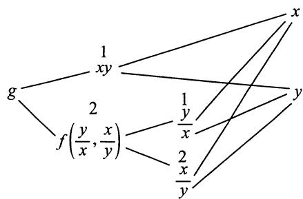

14.【解析】(1)因为 $z = xyf\left(\frac{y}{x}\right)$ ，且 $f(u)$ 可导，所以

$$
\begin{array}{l} \frac {\partial z}{\partial x} = y f \left(\frac {y}{x}\right) + x y f ^ {\prime} \left(\frac {y}{x}\right) \cdot \left(- \frac {y}{x ^ {2}}\right) = y f \left(\frac {y}{x}\right) - \frac {y ^ {2}}{x} f ^ {\prime} \left(\frac {y}{x}\right), \\ \frac {\partial z}{\partial y} = x f \left(\frac {y}{x}\right) + x y f ^ {\prime} \left(\frac {y}{x}\right) \cdot \frac {1}{x} = x f \left(\frac {y}{x}\right) + y f ^ {\prime} \left(\frac {y}{x}\right), \\ x \frac {\partial z}{\partial x} + y \frac {\partial z}{\partial y} = x y f \left(\frac {y}{x}\right) - y ^ {2} f ^ {\prime} \left(\frac {y}{x}\right) + x y f \left(\frac {y}{x}\right) + y ^ {2} f ^ {\prime} \left(\frac {y}{x}\right) = 2 x y f \left(\frac {y}{x}\right). \\ \end{array}
$$

又 $x\frac{\partial z}{\partial x} +y\frac{\partial z}{\partial y} = y^2 (\ln y - \ln x)$ ，所以 $2xyf\left(\frac{y}{x}\right) = y^{2}(\ln y - \ln x)$ ，即

$$
f \left(\frac {y}{x}\right) = \frac {y}{2 x} \ln \frac {y}{x},
$$

令 $u = \frac{y}{x}$ ，则 $f(u) = \frac{u}{2} \ln u$ ，即 $f(x) = \frac{x}{2} \ln x$

(2) 设 $f(x)$ 与 $x$ 轴所围图形面积及该图形绕 $x$ 轴旋转一周所得旋转体体积分别为 $S, V$ ，则

$$
S = \left| \int_ {0} ^ {1} f (x) d x \right| = \left| \int_ {0} ^ {1} \frac {x}{2} \ln x d x \right| = \left| \frac {1}{2} \int_ {0} ^ {1} \ln x d \left(\frac {1}{2} x ^ {2}\right) \right| = \left| \frac {1}{4} x ^ {2} \ln x \right| _ {0} ^ {1} - \frac {1}{4} \int_ {0} ^ {1} x d x = \frac {1}{8},
$$

$$
\begin{array}{l} V = \int_ {0} ^ {1} \pi [ f (x) ] ^ {2} d x = \int_ {0} ^ {1} \pi \left(\frac {x}{2} \ln x\right) ^ {2} d x = \frac {\pi}{4} \int_ {0} ^ {1} x ^ {2} \ln^ {2} x d x \\ \xlongequal {\text {令} \ln x = t} \frac {\pi}{4} \int_ {- \infty} ^ {0} \mathrm {e} ^ {2 t} \bullet t ^ {2} \bullet \mathrm {e} ^ {t} \mathrm {d} t = \frac {\pi}{4} \int_ {- \infty} ^ {0} \mathrm {e} ^ {3 t} \bullet t ^ {2} \mathrm {d} t \\ = \frac {\pi}{4} \int_ {- \infty} ^ {0} t ^ {2} \mathrm {d} \left(\frac {1}{3} \mathrm {e} ^ {3 t}\right) = \frac {\pi}{1 2} \mathrm {e} ^ {3 t} \cdot t ^ {2} \Bigg | _ {- \infty} ^ {0} - \frac {\pi}{6} \int_ {- \infty} ^ {0} t \mathrm {e} ^ {3 t} \mathrm {d} t \\ = - \frac {\pi}{6} \int_ {- \infty} ^ {0} t \mathrm {d} \left(\frac {1}{3} \mathrm {e} ^ {3 t}\right) = - \frac {\pi}{1 8} \mathrm {e} ^ {3 t} \cdot t \Bigg | _ {- \infty} ^ {0} + \frac {\pi}{1 8} \int_ {- \infty} ^ {0} \mathrm {e} ^ {3 t} \mathrm {d} t = \frac {\pi}{5 4}. \\ \end{array}
$$

15.【解析】 $\frac{\partial u}{\partial x} = \frac{\partial v}{\partial x}\mathrm{e}^{ax + by} + a\nu \mathrm{e}^{ax + by} = \mathrm{e}^{ax + by}\left(\frac{\partial v}{\partial x} +a\nu\right),$

$$
\begin{array}{l} \frac {\partial^ {2} u}{\partial x ^ {2}} = \frac {\partial^ {2} v}{\partial x ^ {2}} e ^ {a x + b y} + 2 a \frac {\partial v}{\partial x} e ^ {a x + b y} + a ^ {2} v e ^ {a x + b y} \\ = \mathrm {e} ^ {a x + b y} \left(\frac {\partial^ {2} v}{\partial x ^ {2}} + 2 a \frac {\partial v}{\partial x} + a ^ {2} v\right). \\ \end{array}
$$

同理， $\frac{\partial u}{\partial y} = \mathrm{e}^{ax + by}\left(\frac{\partial v}{\partial y} +b\nu\right),$

$$
\frac {\partial^ {2} u}{\partial y ^ {2}} = \mathrm {e} ^ {a x + b y} \left(\frac {\partial^ {2} v}{\partial y ^ {2}} + 2 b \frac {\partial v}{\partial y} + b ^ {2} v\right).
$$

将上述各式代入原等式，整理得

$$
2 \frac {\partial^ {2} v}{\partial x ^ {2}} - 2 \frac {\partial^ {2} v}{\partial y ^ {2}} + (4 a + 3) \frac {\partial v}{\partial x} + (3 - 4 b) \frac {\partial v}{\partial y} + (2 a ^ {2} - 2 b ^ {2} + 3 a + 3 b) v = 0.
$$

由题意，令 $4a + 3 = 0$ ， $3 - 4b = 0$ ，解得 $a = -\frac{3}{4}$ ， $b = \frac{3}{4}$ .此时，原等式化为

$$
\frac {\partial^ {2} v}{\partial x ^ {2}} - \frac {\partial^ {2} v}{\partial y ^ {2}} = 0.
$$

16.【解析】函数复合关系如图所示，所以

$$
\frac {\partial u}{\partial x} = \frac {\partial u}{\partial \xi} \frac {\partial \xi}{\partial x} + \frac {\partial u}{\partial \eta} \frac {\partial \eta}{\partial x} = \frac {\partial u}{\partial \xi} - \frac {\partial u}{\partial \eta}, \frac {\partial u}{\partial y} = \frac {\partial u}{\partial \eta},
$$

$$
\frac {\partial^ {2} u}{\partial x ^ {2}} = \frac {\partial}{\partial \xi} \left(\frac {\partial u}{\partial \xi} - \frac {\partial u}{\partial \eta}\right) \frac {\partial \xi}{\partial x} + \frac {\partial}{\partial \eta} \left(\frac {\partial u}{\partial \xi} - \frac {\partial u}{\partial \eta}\right) \frac {\partial \eta}{\partial x}
$$

$$
= \frac {\partial^ {2} u}{\partial \xi^ {2}} - \frac {\partial^ {2} u}{\partial \eta \partial \xi} - \frac {\partial^ {2} u}{\partial \xi \partial \eta} + \frac {\partial^ {2} u}{\partial \eta^ {2}} = \frac {\partial^ {2} u}{\partial \xi^ {2}} - 2 \frac {\partial^ {2} u}{\partial \xi \partial \eta} + \frac {\partial^ {2} u}{\partial \eta^ {2}},
$$

$$
\frac {\partial^ {2} u}{\partial x \partial y} = \frac {\partial}{\partial \xi} \left(\frac {\partial u}{\partial \xi} - \frac {\partial u}{\partial \eta}\right) \frac {\partial \xi}{\partial y} + \frac {\partial}{\partial \eta} \left(\frac {\partial u}{\partial \xi} - \frac {\partial u}{\partial \eta}\right) \frac {\partial \eta}{\partial y} = \frac {\partial^ {2} u}{\partial \xi \partial \eta} - \frac {\partial^ {2} u}{\partial \eta^ {2}},
$$

$$
\frac {\partial^ {2} u}{\partial y ^ {2}} = \frac {\partial^ {2} u}{\partial \eta^ {2}}.
$$

$$
u <   \bigg <   _ {\eta} ^ {\xi} \bigg > _ {y} ^ {x}
$$

故 $\frac{\partial^2u}{\partial x^2} + 2\frac{\partial^2u}{\partial x\partial y} + \frac{\partial^2u}{\partial y^2} = \frac{\partial^2u}{\partial\xi^2} = 0$ ，即 $\frac{\partial^2u}{\partial\xi^2} = 0$

17.【解析】方程 $F\left(x + \frac{z}{y}, y + \frac{z}{x}\right) = 0$ 两边分别对 $x$ 求偏导，得

$$
F _ {1} ^ {\prime} \cdot \left(1 + \frac {1}{y} \cdot \frac {\partial z}{\partial x}\right) + F _ {2} ^ {\prime} \cdot \left(- \frac {z}{x ^ {2}} + \frac {1}{x} \cdot \frac {\partial z}{\partial x}\right) = 0,
$$

则 $\frac{\partial z}{\partial x} = \frac{y(zF_2' - x^2F_1')}{x(xF_1' + yF_2')}$

方程 $F\left(x + \frac{z}{y}, y + \frac{z}{x}\right) = 0$ 两边分别对 $y$ 求偏导，得

$$
F _ {1} ^ {\prime} \cdot \left(- \frac {z}{y ^ {2}} + \frac {1}{y} \cdot \frac {\partial z}{\partial y}\right) + F _ {2} ^ {\prime} \cdot \left(1 + \frac {1}{x} \cdot \frac {\partial z}{\partial y}\right) = 0,
$$

则 $\frac{\partial z}{\partial y} = \frac{x(zF_1' - y^2F_2')}{y(xF_1' + yF_2')}$

所以 $x\frac{\partial z}{\partial x} +y\frac{\partial z}{\partial y} = \frac{z(xF_1' + yF_2') - (xF_1' + yF_2')xy}{xF_1' + yF_2'} = z - xy.$

# 18.【答案】(D)

【解析】设在 $D$ 内存在 $(x_0,y_0)$ ，使得 $f(x_{0},y_{0})$ 为正的最大值，则 $f(x_0,y_0) > 0$ ，且

$$
f _ {x} ^ {\prime} \left(x _ {0}, y _ {0}\right) = 0, f _ {y} ^ {\prime} \left(x _ {0}, y _ {0}\right) = 0.
$$

由题设条件得 $f_{x}^{\prime}(x_{0},y_{0}) + f_{y}^{\prime}(x_{0},y_{0}) = f(x_{0},y_{0}) = 0$ ，矛盾，故选项(A)不正确.

同理，选项(B)也不正确.

故对于任意 $(x,y)\in D,f(x,y)\equiv 0$ ，故 $f(x,y)$ 在 $D$ 的边界上和 $D$ 的内部处处为最大值，处处为最小值.

# 19.【答案】(B)

【解析】设 $A = \frac{\partial^2 f}{\partial x^2}, B = \frac{\partial^2 f}{\partial x \partial y}, C = \frac{\partial^2 f}{\partial y^2}$ , 则 $B > 0, A + C = 0$ , 于是 $AC \leqslant 0$ , 故 $AC - B^2 < 0$ , 因此在有界闭区域 $D$ 内部无极值点, 从而也无最值点. 又由二阶连续偏导数存在可知, $f(x, y)$ 的最小值与最大值一定存在, 故必在 $D$ 的边界上取得, 选项(B) 正确.

# 20.【答案】(B)

【解析】由题可得 $f_{xx}''(x,y) = 12x^2 -2,A = f_{xx}''(1,1) = 10,$

$$
f _ {y y} ^ {\prime \prime} (x, y) = 1 2 y ^ {2} - 2, C = f _ {y y} ^ {\prime \prime} (1, 1) = 1 0,
$$

$$
f _ {x y} ^ {\prime \prime} (x, y) = - 2, B = f _ {x y} ^ {\prime \prime} (1, 1) = - 2.
$$

于是 $AC - B^2 > 0$ ，且 $A > 0$ ，故 $f(1,1)$ 为极小值.同理可得 $f(-1, - 1)$ 也为极小值.

21.【解析】令 $\left\{ \begin{array}{l}f_x'(x,y) = 3x^2 -3y = 0,\\ f_y'(x,y) = -3x - 2y - 1 = 0, \end{array} \right.$ 得驻点(-1,1)， $\left(-\frac{1}{2},\frac{1}{4}\right)$ ，且

$$
f _ {x x} ^ {\prime \prime} (x, y) = 6 x, f _ {x y} ^ {\prime \prime} (x, y) = - 3, f _ {y y} ^ {\prime \prime} (x, y) = - 2.
$$

由 $A = f_{xx}^{\prime \prime}(-1,1) = -6 <   0,B = f_{xy}^{\prime \prime}(-1,1) = -3,C = f_{yy}^{\prime \prime}(-1,1) = -2,$

得 $AC - B^{2} = 3 > 0$ ，所以 $(-1,1)$ 为极大值点，极大值为 $f(-1,1) = -9$ ：

由 $A = f_{xx}^{\prime \prime}\left(-\frac{1}{2},\frac{1}{4}\right) = -3, B = f_{xy}^{\prime \prime}\left(-\frac{1}{2},\frac{1}{4}\right) = -3, C = f_{yy}^{\prime \prime}\left(-\frac{1}{2},\frac{1}{4}\right) = -2,$

得 $AC - B^2 = -3 < 0$ ，所以 $\left(-\frac{1}{2},\frac{1}{4}\right)$ 非极值点.

22.【解析】令 $\left\{ \begin{array}{l} f_{x}^{\prime}(x,y) = 8x^{3} - 8xy - x^{6} = 0, \\ f_{y}^{\prime}(x,y) = -4x^{2} + 2y = 0, \end{array} \right.$ 得驻点 $(0,0),(-2,8)$ ，且

$$
f _ {x x} ^ {\prime \prime} (x, y) = 2 4 x ^ {2} - 8 y - 6 x ^ {5}, f _ {x y} ^ {\prime \prime} (x, y) = - 8 x, f _ {y y} ^ {\prime \prime} (x, y) = 2.
$$

由 $A = f_{xx}^{\prime \prime}(0,0) = 0,B = f_{xy}^{\prime \prime}(0,0) = 0,C = f_{yy}^{\prime \prime}(0,0) = 2$ ，得 $AC - B^{2} = 0$ .又在点(0,0)附近，

$$
f (x, x ^ {2}) = - \frac {1}{7} x ^ {7} - x ^ {4} = - x ^ {4} \left(\frac {1}{7} x ^ {3} + 1\right) <   0, f (0, y) = y ^ {2} > 0 (y \neq 0),
$$

且 $f(0,0) = 0$ ，故 $(0,0)$ 不是极值点.

由 $A = f_{xx}''(-2,8) = 224, B = f_{xy}''(-2,8) = 16, C = f_{yy}''(-2,8) = 2$ ，得 $AC - B^2 > 0$ ，又 $A = 224 > 0$ ，因此 $(-2,8)$ 为极小值点，极小值为 $f(-2,8) = -\frac{96}{7}$ ，无极大值.

23.【解析】(1) $f_{x}^{\prime}(x,y) = y(1 + x)\mathrm{e}^{x - y} = y\mathrm{e}^{-y}(1 + x)\mathrm{e}^{x}$ ，将 $y$ 看作常数，两端同时对 $x$ 积分，有

$$
f (x, y) = y \mathrm {e} ^ {- y} \int (1 + x) \mathrm {e} ^ {x} \mathrm {d} x = y \mathrm {e} ^ {- y} [ x \mathrm {e} ^ {x} + C (y) ].
$$

由 $f(1,y) = y\mathrm{e}^{-y}[\mathrm{e} + C(y)] = y\mathrm{e}^{1 - y}$ ，得 $C(y) = 0$ ，故 $f(x,y) = xye^{x - y}$

(2) 令 $\left\{ \begin{array}{l} f_{x}^{\prime}(x, y) = y(1 + x)\mathrm{e}^{x - y} = 0, \\ f_{y}^{\prime}(x, y) = x(1 - y)\mathrm{e}^{x - y} = 0, \end{array} \right.$ 解得 $\left\{ \begin{array}{l} x = 0, \\ y = 0 \end{array} \right.$ 或 $\left\{ \begin{array}{l} x = -1, \\ y = 1. \end{array} \right.$ 且

$$
f _ {x x} ^ {\prime \prime} (x, y) = y (2 + x) \mathrm {e} ^ {x - y}, f _ {x y} ^ {\prime \prime} (x, y) = (1 + x - y - x y) \mathrm {e} ^ {x - y}, f _ {y y} ^ {\prime \prime} (x, y) = x (y - 2) \mathrm {e} ^ {x - y}.
$$

由 $A_{1} = f_{xx}^{\prime \prime}(0,0) = 0$ ， $B_{1} = f_{xy}^{\prime \prime}(0,0) = 1$ ， $C_1 = f_{yy}^{\prime \prime}(0,0) = 0$ ，得 $A_{1}C_{1} - B_{1}^{2} <   0$ ，故点(0,0)不是极值点.

由 $A_{2} = f_{xx}^{\prime \prime}(-1,1) = \mathrm{e}^{-2} > 0$ ， $B_{2} = f_{xy}^{\prime \prime}(-1,1) = 0$ ， $C_2 = f_{yy}''(-1,1) = \mathrm{e}^{-2}$ ，得 $A_{2}C_{2} - B_{2}^{2} > 0$ ，故点 $(-1,1)$ 是极小值点，极小值为 $f(-1,1) = -\mathrm{e}^{-2}$ ：

24.【解析】题目相当于求点 $(x,y)$ 到原点距离的平方 $d^2 = x^2 +y^2$ 的最值.

设 $F(x,y,\lambda) = x^{2} + y^{2} + \lambda (x^{2} + xy + y^{2} + 2x - 2y - 12)$ ，令

$$
\left\{ \begin{array}{l} F _ {x} ^ {\prime} = 2 x + \lambda (2 x + y + 2) = 0, \\ F _ {y} ^ {\prime} = 2 y + \lambda (x + 2 y - 2) = 0, \\ F _ {\lambda} ^ {\prime} = x ^ {2} + x y + y ^ {2} + 2 x - 2 y - 1 2 = 0, \end{array} \right.
$$

解得 $\left\{ \begin{array}{l}x = -6,\\ y = 6, \end{array} \right.$

$$
\left\{ \begin{array}{l} x = \frac {3 + \sqrt {2 1}}{3}, \\ y = \frac {- 3 + \sqrt {2 1}}{3}, \end{array} \left\{ \begin{array}{l} x = \frac {3 - \sqrt {2 1}}{3}, \\ y = \frac {- 3 - \sqrt {2 1}}{3}. \end{array} \right. \right.
$$

从而距离 $d = \sqrt{x^2 + y^2}$ 的最大、最小值一定落在以上点当中.

逐一计算可得 $d_{\mathrm{max}} = 6\sqrt{2}$ ， $d_{\mathrm{min}} = \frac{2\sqrt{15}}{3}$

# 第14章 二重积分

# 1.【答案】(B)

【解析】当 $\frac{1}{2} \leqslant t \leqslant 1$ 时， $\ln t < \sin t < t \leqslant 1$ ，故当 $\frac{1}{2} \leqslant x + y \leqslant 1$ 时，有

$$
\ln^ {7} (x + y) <   \sin^ {7} (x + y) <   (x + y) ^ {7},
$$

根据二重积分比较定理，可知 $I_1 < I_3 < I_2$ ，故选(B).

# 2.【答案】(C)

【解析】 $D_{1}$ ， $D_{2}$ 是以原点为圆心、半径分别为 $R$ 与 $\sqrt{2} R$ 的圆， $D_{3}$ 是正方形，边长为 $2R$ ，如图所示.显然有

$$
D _ {1} \subset D _ {3} \subset D _ {2}.
$$

由于 $\mathrm{e}^{-(x^2 +y^2)}$ 恒正，因此(C)成立.

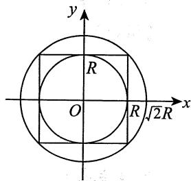

# 3.【答案】(B)

【解析】由积分中值定理知，存在 $(\xi, \eta) \in \left\{(x, y) \mid x^2 + y^2 \leqslant r^2 \right\}$ ，使得

$$
\begin{array}{l} \lim  _ {r \rightarrow 0} \frac {1}{\pi r ^ {2}} \iint_ {x ^ {2} + y ^ {2} \leqslant r ^ {2}} \mathrm {e} ^ {x ^ {2} - y ^ {2}} \cos (x + y) \mathrm {d} x \mathrm {d} y = \lim  _ {r \rightarrow 0} \frac {1}{\pi r ^ {2}} \cdot \mathrm {e} ^ {\xi^ {2} - \eta^ {2}} \cos (\xi + \eta) \cdot \pi r ^ {2} \\ = \lim  _ {r \rightarrow 0} \mathrm {e} ^ {\xi^ {2} - \eta^ {2}} \cos (\xi + \eta) = \lim  _ {(\xi , \eta) \rightarrow (0, 0)} \mathrm {e} ^ {\xi^ {2} - \eta^ {2}} \cos (\xi + \eta) = 1. \\ \end{array}
$$

# 4.【答案】(C)

【解析】 $\iint_{D}(axy + by^{2})\mathrm{d}x\mathrm{d}y = \iint_{D}axy\mathrm{d}x\mathrm{d}y + \iint_{D}by^{2}\mathrm{d}x\mathrm{d}y = I_{1} + I_{2},$

注意到积分区域 $D$ 关于 $y$ 轴对称，函数 $axy$ 关于 $x$ 为奇函数，所以 $I_{1} = 0$ ：因此原积分的符号只与 $b$ 有关，而与 $a$ 无关.

5.【答案】 $\mathrm{e}^{-\frac{1}{2}}$

【解析】交换积分次序，得

原式 $= \int_{0}^{1}\mathrm{d}y\int_{y^2}^{1}\mathrm{e}^{-\frac{y^2}{2}}\mathrm{d}x = \int_{0}^{1}(1 - y^2)\mathrm{e}^{-\frac{y^2}{2}}\mathrm{d}y = \int_{0}^{1}\mathrm{e}^{-\frac{y^2}{2}}\mathrm{d}y + \int_{0}^{1}y\mathrm{d}\left(\mathrm{e}^{-\frac{y^2}{2}}\right)$

$$
= \int_ {0} ^ {1} e ^ {- \frac {y ^ {2}}{2}} d y + y e ^ {- \frac {y ^ {2}}{2}} \Bigg | _ {0} ^ {1} - \int_ {0} ^ {1} e ^ {- \frac {y ^ {2}}{2}} d y = e ^ {- \frac {1}{2}}.
$$

# 6.【答案】1

【解析】积分区域如图所示，则

原式 $= \int_{0}^{1}\mathrm{d}x\int_{\sqrt{x}}^{1}\frac{x\mathrm{e}^{x}}{1 - \sqrt{x}}\mathrm{d}y$

$$
\begin{array}{l} = \int_ {0} ^ {1} x \mathrm {e} ^ {x} \mathrm {d} x = (x - 1) \mathrm {e} ^ {x} \Bigg | _ {0} ^ {1} \\ = 1. \\ \end{array}
$$

# 7.【答案】(B)

【解析】积分区域如图所示，所以先积 $y$ 时应是从 $y = \mathrm{e}^{x}$ 到 $y = \mathrm{e}$ ，故 $I = \int_{0}^{1} \mathrm{d}x \int_{\mathrm{e}^{x}}^{\mathrm{e}} f(x, y) \, \mathrm{d}y$ ，选(B).

# 8.【答案】(B)

【解析】积分区域如图所示，交换积分次序，得

$$
\int_ {\frac {\pi}{2}} ^ {\frac {5 \pi}{6}} d x \int_ {\sin x} ^ {1} f (x, y) d y = \int_ {\frac {1}{2}} ^ {1} d y \int_ {\pi - \arcsin y} ^ {\frac {5 \pi}{6}} f (x, y) d x,
$$

故选(B).

# 9.【答案】(C)

【解析】由题意知，此二重积分的积分区域为

$$
D = \left\{(x, y) \left| \sqrt {4 - x ^ {2}} \leqslant y \leqslant 2, - 2 \leqslant x \leqslant 2 \right. \right\},
$$

对应图像如图所示.

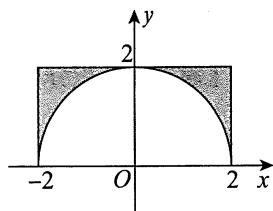

$$
I = \int_ {- 2} ^ {2} d x \int_ {\sqrt {4 - x ^ {2}}} ^ {2} f (x, y) d y = \int_ {0} ^ {2} \left[ \int_ {- 2} ^ {- \sqrt {4 - y ^ {2}}} f (x, y) d x + \int_ {\sqrt {4 - y ^ {2}}} ^ {2} f (x, y) d x \right] d y.
$$

故选项(A)错误.

又 $f(x,y) = f(-x,y)$ ，且积分区域关于 $y$ 轴对称，则 $I = 2\int_{0}^{2}\left[\int_{\sqrt{4 - y^2}}^{2}f(x,y)\mathrm{d}x\right]\mathrm{d}y$ 。故选项(B)错误。

记 $D_{1} = \left\{(x,y)\big|(x,y)\in D,x > y\right\}$ .由 $f(x,y) = f(y,x)$ ，得 $I = 4\iint_{D_1}f(x,y)\mathrm{d}x\mathrm{d}y.$

用极坐标来表示， $I = 4\int_{0}^{\frac{\pi}{4}}\mathrm{d}\theta \int_{2}^{2\sec \theta}f(r\cos \theta ,r\sin \theta)r\mathrm{d}r.$ 故选(C).

10.【答案】 $\frac{4}{27}$

【解析】 $\iint_{D} \sqrt{x^2 + y^2} \, \mathrm{d}x \, \mathrm{d}y = \int_{0}^{\frac{\pi}{3}} \, \mathrm{d}\theta \int_{0}^{\sin 3\theta} \sqrt{r^2 \cos^2\theta + r^2 \sin^2\theta} \cdot r \, \mathrm{d}r$

$$
\begin{array}{l} = \int_ {0} ^ {\frac {\pi}{3}} d \theta \int_ {0} ^ {\sin 3 \theta} r ^ {2} d r = \frac {1}{3} \int_ {0} ^ {\frac {\pi}{3}} \sin^ {3} 3 \theta d \theta \\ = \frac {1}{9} \int_ {0} ^ {\pi} \sin^ {3} t \mathrm {d} t = \frac {2}{9} \int_ {0} ^ {\frac {\pi}{2}} \sin^ {3} t \mathrm {d} t = \frac {2}{9} \cdot \frac {2}{3} = \frac {4}{2 7}. \\ \end{array}
$$

11.【答案】 $\frac{5}{144}$

【解析】由被积函数知，应先对 $x$ 积分，再对 $y$ 积分

$$
\iint_ {D} x \mathrm {e} ^ {- y ^ {2}} \mathrm {d} x \mathrm {d} y = \int_ {0} ^ {+ \infty} \mathrm {e} ^ {- y ^ {2}} \mathrm {d} y \int_ {\frac {\sqrt {y}}{3}} ^ {\frac {\sqrt {y}}{2}} x \mathrm {d} x = \int_ {0} ^ {+ \infty} \frac {1}{2} \left(\frac {y}{4} - \frac {y}{9}\right) \mathrm {e} ^ {- y ^ {2}} \mathrm {d} y = \frac {5}{1 4 4} (- \mathrm {e} ^ {- y ^ {2}}) \Bigg | _ {0} ^ {+ \infty} = \frac {5}{1 4 4}.
$$

12.【答案】 $\frac{4}{9} a^3 (3\pi - 4)$

【解析】令 $x = r\cos \theta, y = r\sin \theta$ ，则

$$
\begin{array}{l} \iint_ {D} \sqrt {4 a ^ {2} - x ^ {2} - y ^ {2}} d x d y = \int_ {0} ^ {\frac {\pi}{2}} d \theta \int_ {0} ^ {2 a \cos \theta} \sqrt {4 a ^ {2} - r ^ {2}} r d r \\ = \int_ {0} ^ {\frac {\pi}{2}} \left[ - \frac {1}{3} (4 a ^ {2} - r ^ {2}) ^ {\frac {3}{2}} \right] _ {0} ^ {2 a \cos \theta} \mathrm {d} \theta \\ = \frac {8 a ^ {3}}{3} \int_ {0} ^ {\frac {\pi}{2}} (1 - \sin^ {3} \theta) d \theta \\ = \frac {4}{9} a ^ {3} (3 \pi - 4). \\ \end{array}
$$

13.【解析】令 $x = r\cos \theta$ ， $y = r\sin \theta$ ，由 $y = \sqrt{3(1 - x^2)}$ ，得 $r^2\sin^2\theta + 3r^2\cos^2\theta = 3$ ，于是 $r^2 = \frac{3}{3\cos^2\theta + \sin^2\theta}$ 积分区域如图所示，则

$$
\begin{array}{l} \iint_ {D} \left(x ^ {2} + y ^ {2}\right) d x d y = \int_ {\frac {\pi}{3}} ^ {\frac {\pi}{2}} d \theta \int_ {0} ^ {\sqrt {\frac {3}{3 \cos^ {2} \theta + \sin^ {2} \theta}}} r ^ {3} d r = \frac {9}{4} \int_ {\frac {\pi}{3}} ^ {\frac {\pi}{2}} \frac {\tan^ {2} \theta + 1}{(3 + \tan^ {2} \theta) ^ {2}} d (\tan \theta) \\ = \frac {9}{4} \int^ {+ \infty} \frac {t ^ {2} + 1}{\sqrt {3} (3 + t ^ {2}) ^ {2}} d t = \frac {9}{4} \int^ {+ \infty} \frac {t ^ {2} + 3 - 2}{\sqrt {3} (t ^ {2} + 3) ^ {2}} d t \\ = \frac {9}{4} \int_ {\sqrt {3}} ^ {+ \infty} \frac {\mathrm {d} t}{t ^ {2} + 3} - \frac {9}{4} \int_ {\sqrt {3}} ^ {+ \infty} \frac {2 \mathrm {d} t}{\left(t ^ {2} + 3\right) ^ {2}} \\ = \frac {9}{4} \cdot \frac {1}{\sqrt {3}} \arctan \left. \frac {t}{\sqrt {3}} \right| _ {\sqrt {3}} ^ {+ \infty} - \frac {1}{4} \left(\frac {3 t}{t ^ {2} + 3} + \sqrt {3} \arctan \frac {t}{\sqrt {3}}\right) \Bigg | _ {\sqrt {3}} ^ {+ \infty} \\ = \frac {3 \sqrt {3} \pi}{1 6} - \frac {(\pi - 2) \sqrt {3}}{1 6} = \frac {\sqrt {3}}{8} (1 + \pi). \\ \end{array}
$$

14.【解析】由轮换对称性，得

$$
\begin{array}{l} \iint_ {D} \frac {x \cos \sqrt {x ^ {2} + y ^ {2}}}{x + y} d x d y = \iint_ {D} \frac {y \cos \sqrt {x ^ {2} + y ^ {2}}}{x + y} d x d y \\ = \frac {1}{2} \iint_ {D} \cos \sqrt {x ^ {2} + y ^ {2}} d x d y = \frac {1}{2} \int_ {0} ^ {\frac {\pi}{2}} d \theta \int_ {1} ^ {2} r \cos r d r \\ = \frac {\pi}{4} (2 \sin 2 + \cos 2 - \sin 1 - \cos 1). \\ \end{array}
$$

15.【解析】由对称性，得

$$
\begin{array}{l} \iint_ {D} \frac {x ^ {2} - x \cos y - y ^ {2}}{x ^ {2} + y ^ {2}} d x d y = \iint_ {D} \frac {x ^ {2} - y ^ {2}}{x ^ {2} + y ^ {2}} d x d y = 2 \int_ {\frac {\pi}{4}} ^ {\frac {\pi}{2}} d \theta \int_ {0} ^ {\frac {1}{\sin \theta}} \frac {r ^ {2} \cos^ {2} \theta - r ^ {2} \sin^ {2} \theta}{r ^ {2}} r d r \\ = \int_ {\frac {\pi}{4}} ^ {\frac {\pi}{2}} \left(\cos^ {2} \theta - \sin^ {2} \theta\right) \frac {1}{\sin^ {2} \theta} d \theta = \int_ {\frac {\pi}{4}} ^ {\frac {\pi}{2}} \cot^ {2} \theta d \theta - \int_ {\frac {\pi}{4}} ^ {\frac {\pi}{2}} 1 d \theta \\ = \int_ {\frac {\pi}{4}} ^ {\frac {\pi}{2}} \csc^ {2} \theta \mathrm {d} \theta - \int_ {\frac {\pi}{4}} ^ {\frac {\pi}{2}} 2 \mathrm {d} \theta = - \cot \theta \left| \begin{array}{c} \frac {\pi}{2} \\ \frac {\pi}{4} \end{array} - \frac {\pi}{2} = 1 - \frac {\pi}{2} \right.. \\ \end{array}
$$

16.【解析】积分区域如图所示，由对称性，用极坐标，得

$$
\begin{array}{l} \iint_ {D} \sqrt {1 - x ^ {2} - y ^ {2}} d \sigma = 2 \int_ {0} ^ {\frac {\pi}{2}} d \theta \int_ {0} ^ {\sin \theta} \sqrt {1 - r ^ {2}} r d r \\ = - \int_ {0} ^ {\frac {\pi}{2}} d \theta \int_ {0} ^ {\sin \theta} (1 - r ^ {2}) ^ {\frac {1}{2}} d (1 - r ^ {2}) \\ = - \int_ {0} ^ {\frac {\pi}{2}} \left[ \left. \frac {2}{3} (1 - r ^ {2}) ^ {\frac {3}{2}} \right| _ {0} ^ {\sin \theta} \right] d \theta \\ = - \frac {2}{3} \int_ {0} ^ {\frac {\pi}{2}} \left(\cos^ {3} \theta - 1\right) d \theta \\ = - \frac {2}{3} \left(\frac {2}{3} - \frac {\pi}{2}\right) = \frac {\pi}{3} - \frac {4}{9}. \\ \end{array}
$$

17.【解析】由于 $f(x) + f(-x)$ 为偶函数，因而 $x[f(x) + f(-x)]$ 为奇函数，又 $f(x) - f(-x)$ 为奇函数，从而 $(x + 1)f(x) + (x - 1)f(-x) = x[f(x) + f(-x)] + [f(x) - f(-x)]$ 为奇函数.故

原式 $= \int_{-1}^{1}\left[(x + 1)f(x) + (x - 1)f(-x)\right]\mathrm{d}x\int_{x^3}^{1}\sin y\mathrm{d}y$

$$
= \int_ {- 1} ^ {1} \left(\cos x ^ {3} - \cos 1\right) \left[ (x + 1) f (x) + (x - 1) f (- x) \right] d x = 0.
$$

18.【解析】积分区域如图所示，则

$$
\begin{array}{l} I = \int_ {0} ^ {1} d y \int_ {y} ^ {\sqrt {2 y - y ^ {2}}} \frac {1}{\sqrt {x ^ {2} + y ^ {2}} \sqrt {4 - x ^ {2} - y ^ {2}}} d x \\ = \int_ {0} ^ {\frac {\pi}{4}} \mathrm {d} \theta \int_ {0} ^ {2 \sin \theta} \frac {1}{\sqrt {4 - r ^ {2}}} \mathrm {d} r = \int_ {0} ^ {\frac {\pi}{4}} \left(\arcsin \frac {r}{2} \Bigg | _ {0} ^ {2 \sin \theta}\right) \mathrm {d} \theta \\ = \int_ {0} ^ {\frac {\pi}{4}} \theta d \theta = \frac {1}{2} \theta^ {2} \left| _ {0} ^ {\frac {\pi}{4}} = \frac {\pi^ {2}}{3 2} \right.. \\ \end{array}
$$

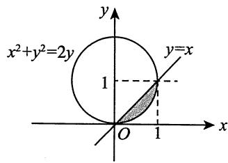

19.【解析】被积函数 $f(x,y)$ 的非零区域和积分区域的公共部分如图所示，故

$$
\begin{array}{l} \iint_ {D} f (x, y) \mathrm {d} \sigma = \int_ {0} ^ {\frac {\pi}{4}} \mathrm {d} \theta \int_ {2 \cos \theta} ^ {\frac {2}{\cos \theta}} r \sin \theta \cdot r \mathrm {d} r \\ = \frac {1}{3} \int_ {0} ^ {\frac {\pi}{4}} \left(\sin \theta \cdot r ^ {3} \left| \begin{array}{c} r = \frac {2}{\cos \theta} \\ r = 2 \cos \theta \end{array} \right.\right) d \theta \\ = \frac {8}{3} \int_ {0} ^ {\frac {\pi}{4}} \left(\frac {\sin \theta}{\cos^ {3} \theta} - \cos^ {3} \theta \sin \theta\right) d \theta \\ = \frac {8}{3} \left(\frac {1}{2} \frac {1}{\cos^ {2} \theta} + \frac {1}{4} \cos^ {4} \theta\right) \Bigg | _ {0} ^ {\frac {\pi}{4}} \\ = \frac {5}{6}. \\ \end{array}
$$

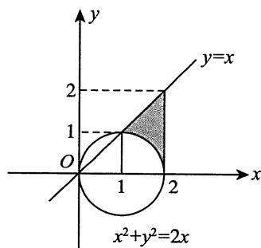

20.【解析】方法一 用极坐标系.

原式 $= \int_{0}^{\frac{\pi}{2}}\mathrm{d}\theta \int_{0}^{\frac{1}{\cos\theta + \sin\theta}}\frac{\mathrm{e}^{-r(\cos\theta + \sin\theta)}}{\sqrt{\cos\theta\sin\theta}}\mathrm{d}r$

$$
\begin{array}{l} = \int_ {0} ^ {\frac {\pi}{2}} \left[ \frac {1}{\sqrt {\cos \theta \sin \theta}} \cdot \frac {- 1}{\cos \theta + \sin \theta} \cdot e ^ {- r (\cos \theta + \sin \theta)} \right] _ {r = 0} ^ {r = \frac {1}{\cos \theta + \sin \theta}} d \theta \\ = \left(1 - \frac {1}{\mathrm {e}}\right) \int_ {0} ^ {\frac {\pi}{2}} \frac {1}{(\cos \theta + \sin \theta) \sqrt {\cos \theta \sin \theta}} \mathrm {d} \theta \\ = \left(1 - \frac {1}{\mathrm {e}}\right) \int_ {0} ^ {\frac {\pi}{2}} \frac {\mathrm {d} \theta}{\cos^ {2} \theta (1 + \tan \theta) \sqrt {\tan \theta}} \\ = \left(1 - \frac {1}{\mathrm {e}}\right) \int_ {0} ^ {\frac {\pi}{2}} \frac {\mathrm {d} (\tan \theta)}{(1 + \tan \theta) \sqrt {\tan \theta}} \\ \xlongequal {\tan \theta = u} \left(1 - \frac {1}{\mathrm {e}}\right) \int_ {0} ^ {+ \infty} \frac {\mathrm {d} u}{(1 + u) \sqrt {u}} \\ \end{array}
$$

$$
\begin{array}{l} = \left(1 - \frac {1}{\mathrm {e}}\right) \cdot 2 \int_ {0} ^ {+ \infty} \frac {\mathrm {d} (\sqrt {u})}{1 + (\sqrt {u}) ^ {2}} \\ = 2 \left(1 - \frac {1}{\mathrm {e}}\right) \cdot \arctan \sqrt {u} \Bigg | _ {0} ^ {+ \infty} \\ = \pi \left(1 - \frac {1}{\mathrm {e}}\right). \\ \end{array}
$$

方法二 用换元法.

令 $\left\{ \begin{array}{l} u = -(x + y), \\ v = x, \end{array} \right.$ 则 $D' = \{(u, v) | -1 \leqslant u \leqslant 0, 0 \leqslant v \leqslant 1, -1 \leqslant u + v \leqslant 0\}$ ，区域 $D'$ 如图中阴影部分所示.

原式 $= \iint_{D'} \frac{\mathrm{e}^u}{\sqrt{\nu(-v - u)}} \left\| \begin{array}{cc} \frac{\partial x}{\partial u} & \frac{\partial x}{\partial\nu} \\ \frac{\partial y}{\partial u} & \frac{\partial y}{\partial\nu} \end{array} \right\| \mathrm{d}u \mathrm{d}\nu = \iint_{D'} \frac{\mathrm{e}^u}{\sqrt{\nu(-v - u)}} \mathrm{d}u \mathrm{d}\nu$

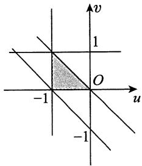

$$
\begin{array}{l} = \int_ {- 1} ^ {0} \mathrm {d} u \int_ {0} ^ {- u} \frac {\mathrm {e} ^ {u}}{\sqrt {- v ^ {2} - u v}} \mathrm {d} v = \int_ {- 1} ^ {0} \mathrm {e} ^ {u} \left(\arcsin \left. \frac {v + \frac {u}{2}}{- \frac {u}{2}} \right| _ {v = 0} ^ {v = - u}\right) \mathrm {d} u \\ = \int_ {- 1} ^ {0} \mathrm {e} ^ {u} \left(\frac {\pi}{2} + \frac {\pi}{2}\right) \mathrm {d} u = \int_ {- 1} ^ {0} \pi \mathrm {e} ^ {u} \mathrm {d} u = \pi \left(1 - \frac {1}{\mathrm {e}}\right). \\ \end{array}
$$

21.【解析】方法一 用极坐标系.

将 $(x - 1)^2 + y^2 \leqslant 1$ ，即 $x^2 + y^2 \leqslant 2x$ ，转化成 $r^2 \leqslant 2r\cos \theta$ ，即 $r \leqslant 2\cos \theta$ 。由此， $\cos \theta \geqslant 0$ ，从而 $-\frac{\pi}{2} \leqslant \theta \leqslant \frac{\pi}{2}$ ，所求积分

$$
\begin{array}{l} I = \iint_ {D} (x ^ {2} - 3 y ^ {2}) \mathrm {d} x \mathrm {d} y = \int_ {- \frac {\pi}{2}} ^ {\frac {\pi}{2}} \mathrm {d} \theta \int_ {0} ^ {2 \cos \theta} (r ^ {2} \cos^ {2} \theta - 3 r ^ {2} \sin^ {2} \theta) r \mathrm {d} r \\ = 4 \int_ {- \frac {\pi}{2}} ^ {\frac {\pi}{2}} (\cos^ {2} \theta - 3 \sin^ {2} \theta) \cos^ {4} \theta d \theta = 4 \int_ {- \frac {\pi}{2}} ^ {\frac {\pi}{2}} \left[ 4 \cos^ {2} \theta - (3 \cos^ {2} \theta + 3 \sin^ {2} \theta) \right] \cos^ {4} \theta d \theta \\ = 4 \int_ {- \frac {\pi}{2}} ^ {\frac {\pi}{2}} (4 \cos^ {6} \theta - 3 \cos^ {4} \theta) d \theta = 8 \int_ {0} ^ {\frac {\pi}{2}} (4 \cos^ {6} \theta - 3 \cos^ {4} \theta) d \theta \\ = 8 \left(4 \times \frac {5}{6} \times \frac {3}{4} \times \frac {1}{2} \times \frac {\pi}{2} - 3 \times \frac {3}{4} \times \frac {1}{2} \times \frac {\pi}{2}\right) = \frac {\pi}{2}. \\ \end{array}
$$

方法二 平移坐标系.

将坐标系整体向右平移一个单位，积分区域变成 $D^{\prime} = \left\{(x,y)\mid x^{2} + y^{2}\leqslant 1\right\}$ ，此时所求积分

$$
I = \iint_ {D ^ {\prime}} \left[ (x + 1) ^ {2} - 3 y ^ {2} \right] d x d y = \iint_ {D ^ {\prime}} \left(x ^ {2} + 2 x + 1 - 3 y ^ {2}\right) d x d y.
$$

根据对称性， $\iint_{D^{\prime}}2x\mathrm{d}x\mathrm{d}y = 0$ ；根据轮换对称性， $\iint_{D^{\prime}}x^{2}\mathrm{d}x\mathrm{d}y = \iint_{D^{\prime}}y^{2}\mathrm{d}x\mathrm{d}y.$ 故

$$
\iint_ {D ^ {\prime}} \left(x ^ {2} - 3 y ^ {2}\right) d x d y = - \iint_ {D ^ {\prime}} \left(x ^ {2} + y ^ {2}\right) d x d y = - \int_ {- \pi} ^ {\pi} d \theta \int_ {0} ^ {1} r ^ {2} r d r = - 2 \pi \times \frac {1}{4} = - \frac {\pi}{2},
$$

进而 $I = \pi -\frac{\pi}{2} = \frac{\pi}{2}$

【注】方法一的最后一步可以通过反复进行分部积分得到，但华里士公式作为熟知公式，应当直接记住.

方法二之所以能够进行，一个重要的前提是被积函数在平移之后仍然简单。如果被积函数在平移变换之后复杂程度明显上升，那么转化积分区域可能是得不偿失的。

22.【解析】由 $x^{2} + y^{2}\leqslant x + y$ ，得 $\left(x - \frac{1}{2}\right)^2 +\left(y - \frac{1}{2}\right)^2\leqslant \frac{1}{2}.$

令 $\left\{ \begin{array}{l} x = \frac{1}{2} + r \cos \theta, \\ y = \frac{1}{2} + r \sin \theta, \end{array} \right.$ 其中 $0 \leqslant \theta \leqslant 2\pi, 0 \leqslant r \leqslant \frac{1}{\sqrt{2}}$ ，则

$$
\begin{array}{l} \iint_ {D} (x + y ^ {2}) \mathrm {d} \sigma = \int_ {0} ^ {2 \pi} \mathrm {d} \theta \int_ {0} ^ {\frac {1}{\sqrt {2}}} \left[ \left(\frac {1}{2} + r \cos \theta\right) + \left(\frac {1}{2} + r \sin \theta\right) ^ {2} \right] r \mathrm {d} r \\ = \int_ {0} ^ {2 \pi} d \theta \int_ {0} ^ {\frac {1}{\sqrt {2}}} \left(\frac {3}{4} + r \cos \theta + r \sin \theta + r ^ {2} \sin^ {2} \theta\right) r d r \\ = \int_ {0} ^ {2 \pi} \left[ \left. \left(\frac {3}{8} r ^ {2} + \frac {1}{3} r ^ {3} \cos \theta + \frac {1}{3} r ^ {3} \sin \theta + \frac {1}{4} r ^ {4} \sin^ {2} \theta\right) \right| _ {r = 0} ^ {r = \frac {1}{\sqrt {2}}} \right] d \theta \\ = \int_ {0} ^ {2 \pi} \left[ \frac {3}{1 6} + \frac {1}{6 \sqrt {2}} (\sin \theta + \cos \theta) + \frac {1}{1 6} \sin^ {2} \theta \right] d \theta \\ = \frac {3}{8} \pi + \frac {1}{6 \sqrt {2}} (\sin \theta - \cos \theta) \left| _ {0} ^ {2 \pi} + \frac {1}{1 6} \int_ {0} ^ {2 \pi} \frac {1 - \cos 2 \theta}{2} d \theta \right. \\ = \frac {3}{8} \pi + \frac {\pi}{1 6} = \frac {7}{1 6} \pi . \\ \end{array}
$$

23.【解析】方法一如图所示，积分区域 $D$ 由两个圆周围成，并且被积函数是因子 $x^{2} + y^{2}$ 的函数，故选用极坐标系计算.

$$
\begin{array}{l} I = \iint_ {D} r \cdot r \mathrm {d} r \mathrm {d} \theta = \int_ {- \frac {\pi}{2}} ^ {\frac {\pi}{2}} \mathrm {d} \theta \int_ {a \cos \theta} ^ {a} r ^ {2} \mathrm {d} r + \int_ {\frac {\pi}{2}} ^ {\frac {3 \pi}{2}} \mathrm {d} \theta \int_ {0} ^ {a} r ^ {2} \mathrm {d} r \\ = \frac {2}{3} \int_ {0} ^ {\frac {\pi}{2}} \left(a ^ {3} - a ^ {3} \cos^ {3} \theta\right) d \theta + \frac {\pi}{3} a ^ {3} \\ = \frac {2 \pi}{3} a ^ {3} - \frac {2}{3} a ^ {3} \int_ {0} ^ {\frac {\pi}{2}} \cos^ {3} \theta d \theta = \frac {2}{3} a ^ {3} \left(\pi - \frac {2}{3}\right). \\ \end{array}
$$

方法二 由积分区域的可加性计算.

$$
\begin{array}{l} I = \iint_ {x ^ {2} + y ^ {2} \leqslant a ^ {2}} \sqrt {x ^ {2} + y ^ {2}} d x d y - \iint_ {\left(x - \frac {a}{2}\right) ^ {2} + y ^ {2} \leqslant \frac {a ^ {2}}{4}} \sqrt {x ^ {2} + y ^ {2}} d x d y \\ = \int_ {0} ^ {2 \pi} d \theta \int_ {0} ^ {a} r ^ {2} d r - \int_ {- \frac {\pi}{2}} ^ {\frac {\pi}{2}} d \theta \int_ {0} ^ {a \cos \theta} r ^ {2} d r \\ = \frac {2}{3} a ^ {3} \left(\pi - \frac {2}{3}\right). \\ \end{array}
$$

24.【解析】令 $\left\{ \begin{array}{l}x = r\cos \theta ,\\ y = r\sin \theta , \end{array} \right.$ 其中 $\left\{ \begin{array}{ll}0\leqslant \theta \leqslant \frac{\pi}{2}\\ 0\leqslant r\leqslant 1, \end{array} \right.$ 则有

$$
\begin{array}{l} \iint_ {D} \sqrt {\frac {1 - x ^ {2} - y ^ {2}}{1 + x ^ {2} + y ^ {2}}} d x d y = \int_ {0} ^ {\frac {\pi}{2}} d \theta \int_ {0} ^ {1} \sqrt {\frac {1 - r ^ {2}}{1 + r ^ {2}}} r d r \\ = \frac {\pi}{2} \cdot \frac {1}{2} \int_ {0} ^ {1} \sqrt {\frac {1 - r ^ {2}}{1 + r ^ {2}}} \mathrm {d} (r ^ {2}) \xlongequal {\text {令} r ^ {2} = t} \frac {\pi}{4} \int_ {0} ^ {1} \sqrt {\frac {1 - t}{1 + t}} \mathrm {d} t \\ = \frac {\pi}{4} \int_ {0} ^ {1} \frac {1 - t}{\sqrt {1 - t ^ {2}}} d t = \frac {\pi}{4} \left(\int_ {0} ^ {1} \frac {d t}{\sqrt {1 - t ^ {2}}} - \int_ {0} ^ {1} \frac {t}{\sqrt {1 - t ^ {2}}} d t\right) \\ = \frac {\pi}{4} (\arcsin t + \sqrt {1 - t ^ {2}}) \Bigg | _ {0} ^ {1} = \frac {\pi}{8} (\pi - 2). \\ \end{array}
$$

  
关注公众号【考研小舟】免费考研资料&无水印PDF

  
黑白&彩印都是5分/页，满4.9全国包邮下单备注：考研小舟，送草稿纸

# 第15章 微今方程

1.【答案】 $y = \frac{-1 - \cos x}{x}$

【解析】原方程可化为 $y' + \frac{1}{x} y = \frac{\sin x}{x}$ ，解得

$$
y = \mathrm {e} ^ {- \int \frac {1}{x} \mathrm {d} x} \left(\int \frac {\sin x}{x} \mathrm {e} ^ {\int \frac {\mathrm {d} x}{x}} \mathrm {d} x + C\right) = \frac {1}{x} \left(\int \sin x \mathrm {d} x + C\right) = \frac {C - \cos x}{x},
$$

由 $y(\pi) = 0$ ，得 $C = -1$ ，故特解为 $y = \frac{-1 - \cos x}{x}$

2.【答案】 $\arctan{\frac{y}{x}} + 3\ln{\sqrt{x^2 + y^2}} = C$ (其中 $C$ 为任意常数)

【解析】曲线 $y = y(x)$ 上任意一点 $M(x,y)$ 的切线在 $y$ 轴上的截距为 $y - xy'$ ，法线在 $x$ 轴上的截距为 $x + yy'$ ，依题意得到方程

$$
\frac {y - x y ^ {\prime}}{x + y y ^ {\prime}} = 3 \text {或} y ^ {\prime} = \frac {y - 3 x}{x + 3 y}.
$$

令 $u = \frac{y}{x}$ ，将方程化为 $x u^{\prime} = -3\frac{1 + u^{2}}{1 + 3u}$ ，积分得到 $\arctan u + 3\ln \sqrt{1 + u^2} = -3\ln |x| + C$ ，即

$$
\arctan {\frac {y}{x}} + 3 \ln {\sqrt {x ^ {2} + y ^ {2}}} = C (\text {其 中} C \text {为 任 意 常 数}).
$$

# 3.【答案】(A)

【解析】将 $\lambda y_{1} + \mu y_{2}$ 代入方程 $y^\prime +p(x)y = q(x)$ ，得

$$
\lambda \left[ y _ {1} ^ {\prime} + p (x) y _ {1} \right] + \mu \left[ y _ {2} ^ {\prime} + p (x) y _ {2} \right] = q (x).
$$

由题设可知 $y_1' + p(x)y_1 = q(x)$ ， $y_2' + p(x)y_2 = q(x)$ ，从而有 $\lambda + \mu = 1$ 。

类似地，将 $\lambda y_{1} - \mu y_{2}$ 代入齐次方程 $y^\prime +p(x)y = 0$ ，得 $\lambda -\mu = 0$ ，解得 $\lambda = \frac{1}{2}$ ， $\mu = \frac{1}{2}$ .故选项(A)正确.

事实上，当 $\lambda = -\frac{1}{2}$ ， $\mu = -\frac{1}{2}$ 时， $\lambda y_1 + \mu y_2$ 不是方程 $y' + p(x)y = q(x)$ 的解，与题设矛盾，故选项(B)不正确.

同理可知选项(D)也不正确.

当 $\lambda = \frac{2}{3}$ , $\mu = \frac{1}{3}$ 时, $\lambda y_{1} - \mu y_{2}$ 不是齐次方程 $y' + p(x)y = 0$ 的解, 与题设矛盾, 故选项(C)也不正确.

4.【分析】若把 $x$ 看作自变量，方程很难求解，若把 $y$ 看作自变量， $x$ 看作未知函数，就可以化为一阶线性微分方程。

【解析】整理微分方程可得 $\frac{\mathrm{dy}}{\mathrm{dx}} = \frac{-y^3}{2x - 3xy^2 - y^3}$ ，取倒数得 $\frac{\mathrm{dx}}{\mathrm{dy}} = -\frac{2x - 3xy^2 - y^3}{y^3}$ ，即

$$
\frac {\mathrm {d} x}{\mathrm {d} y} + \frac {2 - 3 y ^ {2}}{y ^ {3}} x = 1.
$$

利用通解公式得

$$
\begin{array}{l} x = \mathrm {e} ^ {- \int \frac {2 - 3 y ^ {2}}{y ^ {3}} \mathrm {d} y} \left(\int \mathrm {e} ^ {\int \frac {2 - 3 y ^ {2}}{y ^ {3}} \mathrm {d} y} \mathrm {d} y + C\right) = y ^ {3} \mathrm {e} ^ {\frac {1}{y ^ {2}}} \left(\int \mathrm {e} ^ {- \frac {1}{y ^ {2}}} y ^ {- 3} \mathrm {d} y + C\right) \\ = y ^ {3} \mathrm {e} ^ {\frac {1}{y ^ {2}}} \left[ \frac {1}{2} \int \mathrm {d} \left(\mathrm {e} ^ {- \frac {1}{y ^ {2}}}\right) + C \right] = y ^ {3} \mathrm {e} ^ {\frac {1}{y ^ {2}}} \left(\frac {1}{2} \mathrm {e} ^ {- \frac {1}{y ^ {2}}} + C\right) \\ = \frac {1}{2} y ^ {3} + C y ^ {3} e ^ {\frac {1}{y ^ {2}}} (y \neq 0), \\ \end{array}
$$

其中 $C$ 为任意常数. 另外, $y = 0$ 也是方程的解.

# 5.【答案】1

【解析】令 $x + y = u$ ，则 $\frac{\mathrm{dy}}{\mathrm{dx}} = \frac{\mathrm{du}}{\mathrm{dx}} - 1$ ，故 $\frac{\mathrm{du}}{\mathrm{dx}} = u^2 + 1$ ，解得 $\arctan u = x + C$ ，由 $y(0) = 0$ ，得 $u(0) = 0$ 故 $C = 0$ ，即 $\arctan (x + y) = x$ ，则 $y = \tan x - x$ .故

$$
\lim  _ {x \rightarrow 0 ^ {+}} [ y (x) ] ^ {x} = \lim  _ {x \rightarrow 0 ^ {+}} (\tan x - x) ^ {x} = e ^ {\lim  _ {x \rightarrow 0 ^ {+}} x \ln (\tan x - x)} = e ^ {0} = 1.
$$

6.【答案】 $\sin y = x + Ce^{-x}$ （其中 $C$ 为任意常数）

【解析】原方程可化为 $y' = \frac{x + 1 - \sin y}{\cos y}$ ，则 $y' \cos y = x + 1 - \sin y$ ，即 $(\sin y)' + \sin y = x + 1$ 。令 $z = \sin y$ ，于是 $z' + z = x + 1$ ，故 $z = e^{-\int 1 dx} \left[ \int e^{\int 1 dx} (x + 1) dx + C \right] = e^{-x} (xe^{x} + C) = x + Ce^{-x}$ ，即 $\sin y = x + Ce^{-x}$ （其中 $C$ 为任意常数）。

7.【解析】(1)由一阶非齐次线性微分方程的通解公式可得

$$
y = \mathrm {e} ^ {- \int \frac {1}{x ^ {2}} \mathrm {d} x} \left(\int 2 \mathrm {e} ^ {\frac {1}{x}} \mathrm {e} ^ {\int \frac {1}{x ^ {2}} \mathrm {d} x} \mathrm {d} x + C\right) = \mathrm {e} ^ {\frac {1}{x}} (2 x + C),
$$

因为 $y\left(\frac{1}{2}\right) = 0$ ，所以 $C = -1$ ，故 $y = \mathrm{e}^{\frac{1}{x}}(2x - 1)$ .

(2)因为 $k = \lim_{x\to \infty}\frac{y}{x} = \lim_{x\to \infty}\mathrm{e}^{\frac{1}{x}}\left(2 - \frac{1}{x}\right) = 2,$

$$
b = \lim  _ {x \rightarrow \infty} (y - 2 x) = \lim  _ {x \rightarrow \infty} \left[ 2 x \left(\mathrm {e} ^ {\frac {1}{x}} - 1\right) - \mathrm {e} ^ {\frac {1}{x}} \right] = \lim  _ {x \rightarrow \infty} \left[ \frac {2 \left(\mathrm {e} ^ {\frac {1}{x}} - 1\right)}{\frac {1}{x}} - \mathrm {e} ^ {\frac {1}{x}} \right] = 1,
$$

所以曲线 $y(x)$ 的斜渐近线方程为 $y = 2x + 1$

8.【解析】记 $t$ 时刻容器的水深为 $z(t)$ ，则注入的水的体积为 $V(t) = \int_0^{z(t)}\pi f^2 (u)\mathrm{d}u$ ，水面的面积

$$
S (t) = \pi f ^ {2} (z).
$$

由题意，得 $\frac{\mathrm{d}[V(t)]}{\mathrm{d}t} = \pi f^2 [z(t)]\cdot \frac{\mathrm{d}z}{\mathrm{d}t} = 3,$

$$
\frac {\mathrm {d} [ S (t) ]}{\mathrm {d} t} = \pi \cdot 2 f [ z (t) ] \frac {\mathrm {d} \left\{f [ z (t) ] \right\}}{\mathrm {d} z} \cdot \frac {\mathrm {d} z}{\mathrm {d} t} = \pi ,
$$

故 $\frac{\mathrm{d}[f(z)]}{\mathrm{d}z} \cdot \frac{2}{f(z)} = \frac{\pi}{3},$

分离变量，得 $\frac{\mathrm{d}[f(z)]}{f(z)} = \frac{\pi}{6}\mathrm{d}z,$

于是 $\int \frac{\mathrm{d}[f(z)]}{f(z)} = \frac{\pi}{6}\int \mathrm{d}z$ ，得

$$
\ln | f (z) | = \frac {\pi}{6} z + \ln C _ {1} \Rightarrow f (z) = \pm C _ {1} e ^ {\frac {\pi}{6} z} = C e ^ {\frac {\pi}{6} z} (z \geqslant 0),
$$

其中 $C$ 为任意常数，又底面积为 $16\pi \mathrm{cm}^2$ ，即 $f(0) = \pm 4$ ，得 $C = \pm 4$ ，即 $f(z) = \pm 4\mathrm{e}^{\frac{\pi}{6} z}$ （ $z\geqslant 0$ ）.

9.【分析】先将第一项积分变形，再对等式求导两次，化为微分方程后求解.

【解析】原方程可写为 $x\int_{0}^{x}f(t)\mathrm{d}t - \int_{0}^{x}f(t)\mathrm{d}t - \int_{0}^{x}tf(t)\mathrm{d}t = x$ ，等式两边分别对 $x$ 求导并化简，得 $\int_0^x f(t)\mathrm{d}t - f(x) = 1$ （隐含 $f(0) = -1$ ），

等式两边继续对 $x$ 求导，得 $f(x) - f'(x) = 0,$

解得 $f(x) = C\mathrm{e}^{x}$ ，由于 $f(0) = -1$ ，因此 $C = -1$ ，即 $f(x) = -\mathrm{e}^x (x\geqslant 0)$

10.【分析】本题可直接利用一阶线性微分方程的通解公式，不过要将通解中的不定积分写成变上限 $x$ 的积分形式.本题采用全微分的方法求解较便捷.

【解析】原方程的两端同乘 $\mathbf{e}^x$ ，得 $\frac{\mathrm{dy}}{\mathrm{dx}}\mathrm{e}^{x} + y\mathrm{e}^{x} = \varphi (x)\mathrm{e}^{x}$ ，整理可得

$$
\mathrm {e} ^ {x} \mathrm {d} y + y \mathrm {e} ^ {x} \mathrm {d} x = \varphi (x) \mathrm {e} ^ {x} \mathrm {d} x,
$$

也即 $\mathrm{d}(y\mathrm{e}^x) = \varphi (x)\mathrm{e}^x\mathrm{d}x$ ，又因 $y(0) = 0$ ，故积分得 $y\mathrm{e}^{x} = \int_{0}^{x}\varphi (t)\mathrm{e}^{t}\mathrm{d}t$ ，整理得 $y = \mathrm{e}^{-x}\int_0^x\varphi (t)\mathrm{e}^t\mathrm{d}t$

当 $x\geqslant 0$ 时， $\left|y(x)\right| = \left|\mathrm{e}^{-x}\int_{0}^{x}\varphi (t)\mathrm{e}^{t}\mathrm{d}t\right|\leqslant \mathrm{e}^{-x}\int_{0}^{x}\left|\varphi (t)\right|\mathrm{e}^{t}\mathrm{d}t$

$$
\leqslant \mathrm {e} ^ {- x} k \int_ {0} ^ {x} \mathrm {e} ^ {t} \mathrm {d} t = k \mathrm {e} ^ {- x} \left(\mathrm {e} ^ {x} - 1\right) = k \left(1 - \mathrm {e} ^ {- x}\right),
$$

即当 $x \geqslant 0$ 时， $|y(x)| \leqslant k(1 - \mathrm{e}^{-x})$ 。

11.【解析】整理题干方程，得 $y^\prime -\frac{2}{x} y = \frac{2\ln x - 1}{2x}$ ，由一阶非齐次线性微分方程的通解公式，得

$$
y (x) = \mathrm {e} ^ {\int \frac {2}{x} \mathrm {d} x} \left(\int \frac {2 \ln x - 1}{2 x} \mathrm {e} ^ {- \int \frac {2}{x} \mathrm {d} x} \mathrm {d} x + C\right) = x ^ {2} \left(\int \frac {2 \ln x - 1}{2 x ^ {3}} \mathrm {d} x + C\right) = - \frac {1}{2} \ln x + C x ^ {2},
$$

代入 $y(1) = \frac{1}{4}$ ，得 $C = \frac{1}{4}$ ，所以 $y = -\frac{1}{2}\ln x + \frac{1}{4} x^2$ .

由 $\int_{1}^{\mathrm{e}}y(x)\mathrm{d}x = \int_{1}^{\mathrm{e}}\left(-\frac{1}{2}\ln x + \frac{1}{4} x^{2}\right)\mathrm{d}x = \frac{\mathrm{e}^{3} - 7}{12}$ 得平均值为 $\frac{\mathrm{e}^3 - 7}{12(\mathrm{e} - 1)}$

12.【解析】由题意知切线方程为 $Y - y = y'(X - x)$ ，切线在 $y$ 轴上的截距为 $y - xy'$ ，故有 $x = y - xy'$ ，即 $y' - \frac{y}{x} = -1$ ，解此微分方程得

$$
y (x) = \mathrm {e} ^ {\int \frac {1}{x} \mathrm {d} x} \left[ \int \left(- \mathrm {e} ^ {- \int \frac {1}{x} \mathrm {d} x}\right) \mathrm {d} x + C \right] = x (- \ln x + C),
$$

代入 $y(1) = 0$ ，得 $C = 0$ ，即 $y(x) = -x\ln x$

$y(x)$ 在区间 $(0,1)$ 上与 $x$ 轴所围平面图形的面积为

$$
\int_ {0} ^ {1} \left| - x \ln x \right| d x = - \int_ {0} ^ {1} \ln x d \left(\frac {1}{2} x ^ {2}\right) = \int_ {0} ^ {1} \frac {1}{2} x d x = \frac {1}{4}.
$$

# 13.【答案】(D)

【解析】二阶常系数齐次线性微分方程 $y'' + 2y' + y = 0$ 的特征方程为 $r^2 + 2r + 1 = 0$ ，解得特征根为 $r_1 = r_2 = -1$ ，故通解为 $y = e^{-x}(C_1x + C_2)$ .

由题意知， $y(0) = 4$ ， $y'(0) = -2$ ，于是可得 $C_2 = 4$ ， $C_1 = 2$ 。故曲线方程为 $y = \mathrm{e}^{-x}(2x + 4) = 2(x + 2)\mathrm{e}^{-x}$ ，应选(D).

# 14.【答案】(B)

【解析】二阶常系数齐次线性微分方程 $y'' - 2y' + 5y = 0$ 的特征方程为 $r^2 - 2r + 5 = 0$ ，特征根为 $r_{1,2} = 1 \pm 2\mathrm{i}$ ，可得通解为 $y = \mathrm{e}^{x}(C_{1}\cos 2x + C_{2}\sin 2x)$ 。

由题意知， $y(0) = 0$ ， $y^\prime (0) = -2$ ，于是可得 $C_1 = 0$ ， $C_2 = -1$ ，故 $y = -\mathrm{e}^{x}\sin 2x$ ：

# 15.【答案】-1

【解析】由 $y'' - 2y' + y = 0$ 得特征方程为 $r^2 - 2r + 1 = 0$ ，即 $(r - 1)^2 = 0$ ，解得 $r_1 = r_2 = 1$ ，故通解为 $y = (C_1 + C_2x)\mathrm{e}^x$ 。由 $y(0) = 0, y'(0) = 1$ ，可得 $C_1 = 0, C_2 = 1$ ，故 $y(x) = x\mathrm{e}^x$ 。

因此 $\int_{-\infty}^{0}y(x)\mathrm{d}x = \int_{-\infty}^{0}xe^{x}\mathrm{d}x = (x - 1)e^{x}\Big|_{-\infty}^{0} = -1.$

16.【答案】 $y^{\prime \prime} - 2y^{\prime \prime} + 5y^{\prime} = 0$

【解析】由通解形式可知特征根为 $r_1 = 0, r_{2,3} = 1 \pm 2\mathrm{i}$ , 故特征方程为

$$
r (r - 1 + 2 \mathrm {i}) (r - 1 - 2 \mathrm {i}) = 0,
$$

整理得 $r^3 - 2r^2 + 5r = 0$ ，可得对应的微分方程为 $y'' - 2y'' + 5y' = 0$ ：

【注】考生应对某些高于二阶的常系数齐次线性微分方程熟练求解，并会根据解的结构形式反求微分方程.

# 17.【答案】(D)

【解析】由题可知，对应齐次方程的特征方程为 $4r^2 - 12r + 9 = 0$ ，即 $(2r - 3)^2 = 0$ ，解得 $r_1 = r_2 = \frac{3}{2}$ $\frac{3}{2}$ 为二重根，再由原方程的非齐次项 $\mathrm{e}^{\frac{3}{2} x}(3x^{2} + 2)$ ，可以确定原方程的特解形式为

$$
y ^ {*} = x ^ {2} \left(A x ^ {2} + B x + C\right) e ^ {\frac {3}{2} x}.
$$

18.【答案】 $y^{\prime \prime} - y^{\prime} - 2y = (1 - 2x)\mathrm{e}^{x}$

【解析】由条件知 $y_{1} - y_{2} = \mathrm{e}^{2x} - \mathrm{e}^{-x}$ ， $y_{1} - y_{3} = \mathrm{e}^{-x}$ 都是对应齐次方程的解，而 $(y_{1} - y_{2}) + (y_{1} - y_{3}) = \mathrm{e}^{2x}$ 也是齐次方程的解，可知 $\mathrm{e}^{2x}$ 与 $\mathrm{e}^{-x}$ 是齐次方程的两个线性无关的解。因为 $y_{2} = \mathrm{e}^{-x} + x\mathrm{e}^{x}$ 是非齐次方程的解，故 $x\mathrm{e}^{x}$ 也是非齐次方程的解。

由 $\mathrm{e}^{-x},\mathrm{e}^{2x}$ 是齐次方程的线性无关的解，可知特征根为 $r_1 = -1,r_2 = 2$ ，特征方程为 $r^2 -r - 2 =$ 0,对应的齐次方程为 $y^{\prime \prime} - y^{\prime} - 2y = 0$ ：

设所求非齐次方程为 $y^{\prime \prime} - y^{\prime} - 2y = f(x)$ ，将非齐次方程的解 $x\mathrm{e}^{x}$ 代入，得

$$
f (x) = \left(x \mathrm {e} ^ {x}\right) ^ {\prime \prime} - \left(x \mathrm {e} ^ {x}\right) ^ {\prime} - 2 x \mathrm {e} ^ {x} = (1 - 2 x) \mathrm {e} ^ {x}.
$$

故所求方程为 $y^{\prime \prime} - y^{\prime} - 2y = (1 - 2x)\mathrm{e}^{x}$

19.【分析】这是二阶常系数非齐次线性微分方程，其通解由对应的齐次方程的通解与自身的一个特解构成。对于特解，可以根据非齐次项定出特解的形式，代入原方程即可求得特解。

【解析】原方程所对应的齐次方程为 $y'' - 2y' + y = 0$ ，其特征方程为 $r^2 - 2r + 1 = 0$ ，解得 $r_1 = r_2 = 1$ 。

于是齐次方程的通解为 $Y = (C_{1} + C_{2}x)\mathrm{e}^{x}$ ，其中 $C_1$ ， $C_2$ 为任意常数.

由于特征方程有重根1，且非齐次项为 $2(3x^{2} - 2)\mathrm{e}^{x}$ ，故可设特解为

$$
y ^ {*} = x ^ {2} \left(a _ {0} x ^ {2} + a _ {1} x + a _ {2}\right) e ^ {x}.
$$

代入原方程并比较两端系数，得 $a_0 = \frac{1}{2}, a_1 = 0, a_2 = -2$ 。于是有

$$
y ^ {*} = x ^ {2} \left(\frac {1}{2} x ^ {2} - 2\right) e ^ {x}.
$$

因此，原方程的通解为

$$
y = Y + y ^ {*} = \left(C _ {1} + C _ {2} x\right) \mathrm {e} ^ {x} + x ^ {2} \left(\frac {x ^ {2}}{2} - 2\right) \mathrm {e} ^ {x},
$$

其中 $C_1, C_2$ 为任意常数.

20.【分析】这是二阶常系数非齐次线性微分方程，先求其通解，再由题设定特解.

【解析】对应齐次方程的特征方程为 $r^2 + 4r + 5 = 0$ ，解得 $r_{1,2} = -2 \pm \mathrm{i}$

于是对应齐次方程的通解为 $Y = \mathrm{e}^{-2x}(C_1\cos x + C_2\sin x)$

已知非齐次项为 $8\cos x$ ，而 $\pm \mathrm{i}$ 不是特征根，故可设原方程的一个特解为 $y^{*} = A\sin x + B\cos x$ 代入原方程，比较系数得 $A = B = 1$ ，于是原方程有特解 $y^{*} = \sin x + \cos x$ ：

因此，原方程的通解为 $y = Y + y^{*}$ ，即 $y = \mathrm{e}^{-2x}(C_1\cos x + C_2\sin x) + \sin x + \cos x$ .

为使 $x \to -\infty$ 时， $y$ 有界，必有 $C_1 = C_2 = 0$ ，故满足题设的特解为 $y = \sin x + \cos x$ 。

21.【答案】 $\frac{\sin(\sqrt{2}\ln x)}{x}$

【解析】设 $x = \mathrm{e}^{t}$ ，并记 $\mathrm{D} = \frac{\mathrm{d}}{\mathrm{d}t}$ ，则利用欧拉方程的解法可将 $x^{2}y^{\prime \prime} + 3xy^{\prime} + 3y = 0$ 化为 $\left[\mathrm{D}(\mathrm{D} - 1) + 3\mathrm{D} + 3\right]y = 0$ ，即 $\frac{\mathrm{d}^2y}{\mathrm{d}t^2} +2\frac{\mathrm{dy}}{\mathrm{dt}} +3y = 0$ ，其特征方程为 $r^2 +2r + 3 = 0$ ，得一对共轭复根 $-1\pm \sqrt{2}\mathrm{i}$ ，可得其通解为 $y = \mathrm{e}^{-t}(C_1\cos \sqrt{2} t + C_2\sin \sqrt{2} t)$ ，从而原方程的通解为

$$
y = \frac {1}{x} \left[ C _ {1} \cos (\sqrt {2} \ln x) + C _ {2} \sin (\sqrt {2} \ln x) \right].
$$

由条件 $y(1) = 0$ ， $y'(1) = \sqrt{2}$ 可得 $C_1 = 0, C_2 = 1$ ，故欧拉方程 $x^2 y'' + 3xy' + 3y = 0$ 满足条件 $y(1) = 0$ ， $y'(1) = \sqrt{2}$ 的解为 $y = \frac{\sin(\sqrt{2}\ln x)}{x}$ .

# 第16章 无穷级数

# 1.【答案】(D)

【解析】当 $n\to \infty$ 时，

$$
\frac {\left(\sqrt {n + 1} - \sqrt {n}\right) ^ {p}}{n} = \frac {1}{n \left(\sqrt {n + 1} + \sqrt {n}\right) ^ {p}} \sim \frac {1}{2 ^ {p} \cdot n ^ {\frac {1 + p}{2}}},
$$

因此，当 $1 + \frac{p}{2} > 1$ ，即 $p > 0$ 时，级数 $\sum_{n=1}^{\infty} \frac{(\sqrt{n+1} - \sqrt{n})^p}{n}$ 收敛；

当 $n\to \infty$ 时，

$$
\frac {1}{n ^ {p}} - \frac {1}{(n + 1) ^ {p}} = \frac {(n + 1) ^ {p} - n ^ {p}}{n ^ {p} (n + 1) ^ {p}} = \frac {n ^ {p} \left[ \left(1 + \frac {1}{n}\right) ^ {p} - 1 \right]}{n ^ {p} (n + 1) ^ {p}} \sim \frac {p n ^ {p - 1}}{n ^ {2 p}} = \frac {p}{n ^ {p + 1}},
$$

因此，当 $p = 0$ 或 $p + 1 > 1$ ，即 $p \geqslant 0$ 时，级数 $\sum_{n=1}^{\infty}\left[\frac{1}{n^p} - \frac{1}{(n+1)^p}\right]$ 收敛.

综上，若两个级数均收敛，则 $p > 0$ 故选(D).

2.【解析】当 $x \geqslant 0$ 时 $\sin x \leqslant x$ ，当且仅当 $x = 0$ 时取等号，则 $\frac{1}{n} > \sin \frac{1}{n}$ ， $\ln \frac{1}{n} - \ln \sin \frac{1}{n} > 0$ ，故原级数为正项级数。考查

$$
\lim  _ {x \rightarrow 0 ^ {+}} \frac {\ln x - \ln \sin x}{x ^ {2}} = \lim  _ {x \rightarrow 0 ^ {+}} \frac {\frac {1}{x} - \frac {\cos x}{\sin x}}{2 x} = \lim  _ {x \rightarrow 0 ^ {+}} \frac {\sin x - x \cos x}{2 x ^ {2} \sin x} = \frac {1}{6},
$$

由归结原则，知 $\lim_{n\to \infty}\frac{\ln\frac{1}{n} - \ln\sin\frac{1}{n}}{\frac{1}{n^2}} = \frac{1}{6}$ 又 $\sum_{n = 1}^{\infty}\frac{1}{n^2}$ 收敛，根据正项级数比较判别法的极限形式， $\sum_{n = 1}^{\infty}\left(\ln \frac{1}{n} -\ln \sin \frac{1}{n}\right)$ 收敛.

# 3.【答案】(B)

【解析】当 $n \to \infty$ 时， $\sin \frac{\lambda + 2n^2}{n^3} = \sin \left(\frac{\lambda}{n^3} + \frac{2}{n}\right)$ 单调递减且趋于0，故 $\sum_{n=1}^{\infty} (-1)^n \sin \frac{\lambda + 2n^2}{n^3}$ 符合莱布尼茨定理的条件，故收敛。又 $\left|(-1)^n \sin \frac{\lambda + 2n^2}{n^3}\right| \sim \frac{\lambda + 2n^2}{n^3} = \frac{\lambda}{n^3} + \frac{2}{n} (n \to \infty)$ 。

又 $\sum_{n=1}^{\infty} \frac{\lambda}{n^{3}}$ 收敛， $\sum_{n=1}^{\infty} \frac{2}{n}$ 发散，故 $\sum_{n=1}^{\infty} (-1)^{n} \sin \frac{\lambda + 2n^{2}}{n^{3}}$ 发散.

综上， $\sum_{n = 1}^{\infty}(-1)^{n}\sin {\frac{\lambda + 2n^{2}}{n^{3}}}$ 条件收敛.所以选(B).

4.【答案】(A)

【解析】对于选项(A)，若 $\sum_{n=0}^{\infty} a_n^2$ 收敛，则 $\lim_{n \to \infty} a_n^2 = 0$ ，当 $n$ 充分大时， $\left|a_n^2\right| < 1$ ，可得 $\left|a_n\right| < 1$ ，于是 $\left|a_n^3\right| = \left|a_n^2\right| \left|a_n\right| < \left|a_n^2\right| = a_n^2$ ，故 $\sum_{n=0}^{\infty} a_n^3$ 绝对收敛，也即 $\sum_{n=0}^{\infty} a_n^3$ 收敛.

对于选项(B), 取 $a_{n} = \frac{1}{\sqrt{n + 1}}$ ，可得 $a_{n}^{2} = \frac{1}{n + 1}$ ， $a_{n}^{3} = \frac{1}{(n + 1)^{\frac{3}{2}}}$ 则 $\sum_{n=0}^{\infty} a_{n}^{2}$ 发散，但 $\sum_{n=0}^{\infty} a_{n}^{3}$ 收敛.

对于选项(C), 取 $a_{n} = \frac{(-1)^{n + 1}}{(n + 1)^{\frac{1}{4}}}$ , 可得 $a_{n}^{3} = \frac{(-1)^{3(n + 1)}}{(n + 1)^{\frac{3}{4}}}$ , $a_{n}^{4} = \frac{1}{n + 1}$ , 则 $\sum_{n = 0}^{\infty} a_{n}^{3}$ 收敛, 但 $\sum_{n = 0}^{\infty} a_{n}^{4}$ 发散.

对于选项(D), 取 $a_{n} = \frac{1}{\sqrt[3]{n + 1}}$ ，可得 $a_{n}^{3} = \frac{1}{n + 1}$ ， $a_{n}^{4} = \frac{1}{(n + 1)^{\frac{4}{3}}}$ 则 $\sum_{n=0}^{\infty} a_{n}^{3}$ 发散，但 $\sum_{n=0}^{\infty} a_{n}^{4}$ 收敛.

5.【答案】(B)

【解析】令 $f(x) = \arctan (x + k) - \arctan x$ ，得 $f^{\prime}(x) = \frac{1}{1 + (x + k)^{2}} -\frac{1}{1 + x^{2}} < 0$ ，则 $f(x)$ 单调减少，即 $u_{n}$ 单调减少.

$$
\lim  _ {n \rightarrow \infty} \frac {\sqrt {\arctan (n + k) - \arctan n}}{\frac {1}{n}} = \sqrt {k},
$$

则 $\sum_{n=1}^{\infty} u_n$ 发散, 又 $\lim_{n \to \infty} u_n = 0$ , 由莱布尼茨判别法可知, $\sum_{n=1}^{\infty} (-1)^n u_n$ 条件收敛.

6.【答案】(D)

【解析】方法一 因为 $\sum_{k=1}^{n}(u_{k+1}-u_k)=u_{n+1}-u_1, \sum_{n=1}^{\infty}(u_{n+1}-u_n)$ 收敛, 即有 $\lim_{n\to\infty}\sum_{k=1}^{n}(u_{k+1}-u_k)=\lim_{n\to\infty}(u_{n+1}-u_1)$ 存在, 所以可以得到 $\{u_n\}$ 收敛, 从而 $\{u_n^2\}$ 收敛.

因为 $\sum_{k=1}^{n}(u_{k+1}^2 - u_k^2) = u_{n+1}^2 - u_1^2$ ，所以 $\lim_{n\to\infty}\sum_{k=1}^{n}(u_{k+1}^2 - u_k^2) = \lim_{n\to\infty}(u_{n+1}^2 - u_1^2)$ 存在，即 $\sum_{n=1}^{\infty}(u_{n+1}^2 - u_n^2)$ 收敛.

方法二 取 $u_{n} = 1 - \frac{1}{n}$ , 则 $\sum_{n=1}^{\infty}(u_{n+1} - u_{n})$ 收敛, 这时 $\sum_{n=1}^{\infty}\frac{u_{n}}{n}$ 与 $\sum_{n=1}^{\infty}(-1)^{n}\frac{1}{u_{n}}$ 均发散, 故可排除(A), (B). 取 $u_{n} = -\frac{1}{n}$ , 则 $\sum_{n=1}^{\infty}(u_{n+1} - u_{n})$ 收敛, 且 $1 - \frac{u_{n}}{u_{n+1}} = -\frac{1}{n}$ , $\sum_{n=1}^{\infty}\left(1 - \frac{u_{n}}{u_{n+1}}\right)$ 发散, 故可排除(C).

7.【解析】(1)由题 $(1 - x)\frac{\mathrm{dy}}{\mathrm{dx}} +2y = 0$ ，分离变量得 $\frac{1}{2y}\mathrm{dy} = \frac{1}{x - 1}\mathrm{dx}$ ，两端同时积分得

$$
\frac {1}{2} \ln | y | = \ln | x - 1 | + \ln C _ {1},
$$

$$
\left| y \right| ^ {\frac {1}{2}} = C _ {1} \left| x - 1 \right|,
$$

两端同时平方得 $y = C(x - 1)^2$ ，又 $y(0) = 1$ ，代入上式，解得 $C = 1$ ，故 $y(x) = (x - 1)^2$ 。

(2) 由(1)得 $y = (x - 1)^{2}$ ，则

$$
0 <   a _ {n} (1) = \int_ {0} ^ {1} (t - 1) ^ {2} \sin^ {n} t \mathrm {d} t \leqslant \int_ {0} ^ {1} (t - 1) ^ {2} t ^ {n} \mathrm {d} t,
$$

又 $\int_0^1 (t - 1)^2 t^n\mathrm{d}t = \int_0^1 (t^{n + 2} - 2t^{n + 1} + t^n)\mathrm{d}t = \frac{1}{n + 1} +\frac{1}{n + 3} -\frac{2}{n + 2} = \frac{2}{(n + 1)(n + 2)(n + 3)},$

且 $\sum_{n=1}^{\infty} \frac{2}{(n+1)(n+2)(n+3)}$ 收敛, 所以 $\sum_{n=1}^{\infty} a_n(1)$ 收敛.

8.【解析】(1)所给方程为 $a_{n}^{\prime}(x) - \frac{n}{(1 + x)\ln(1 + x)} a_{n}(x) = -\ln^{n}(1 + x)$ ，令

$$
p _ {n} (x) = - \frac {n}{(1 + x) \ln (1 + x)},
$$

则 $\mathrm{e}^{-\int p_n(x)\mathrm{d}x} = \mathrm{e}^{n\int \frac{\mathrm{d}x}{(1 + x)\ln(1 + x)}} = \mathrm{e}^{n\int \frac{\mathrm{d}\left[\ln(1 + x)\right]}{\ln(1 + x)}} = \mathrm{e}^{n\ln \left[\ln (1 + x)\right]} = \ln^n (1 + x).$

同理 $\mathrm{e}^{\int p_n(x)\mathrm{d}x} = \frac{1}{\ln^n(1 + x)}$ ，由一阶线性微分方程的通解公式，有

$$
a _ {n} (x) = \ln^ {n} (1 + x) \left\{\int \frac {1}{\ln^ {n} (1 + x)} \cdot \left[ - \ln^ {n} (1 + x) \right] d x + C \right\} = \ln^ {n} (1 + x) (- x + C),
$$

又由 $a_{n}(1) = 0$ ，得 $C = 1$ ，于是 $a_{n}(x) = (1 - x)\ln^{n}(1 + x),x > 0$

(2) $\sum_{n=1}^{\infty} \int_{0}^{1} a_{n}(x) \mathrm{d} x=\sum_{n=1}^{\infty} \int_{0}^{1}\left(1-x\right) \ln^{n}\left(1+x\right) \mathrm{d} x$ 为正项级数, 由 $\ln(1+x)<x(x>0)$ , 知

$$
\int_ {0} ^ {1} (1 - x) \ln^ {n} (1 + x) d x \leqslant \int_ {0} ^ {1} (1 - x) x ^ {n} d x = \int_ {0} ^ {1} \left(x ^ {n} - x ^ {n + 1}\right) d x
$$

$$
= \frac {1}{n + 1} - \frac {1}{n + 2} = \frac {1}{(n + 1) (n + 2)}.
$$

因为 $\sum_{n=1}^{\infty} \frac{1}{(n+1)(n+2)}$ 收敛, 故根据正项级数的比较判别法, 有 $\sum_{n=1}^{\infty} \int_{0}^{1} a_{n}(x) \mathrm{d} x$ 收敛.

9.【答案】 $(1 - \sqrt{2}, 1 + \sqrt{2})$

【解析】由题意知，幂级数 $\sum_{n=1}^{\infty} n a_n (x+1)^n$ 的收敛区间为 $(-3,1)$ ，所以幂级数 $\sum_{n=1}^{\infty} n a_n x^n$ 的收敛区间为 $(-2,2)$ ，于是 $\sum_{n=1}^{\infty} n a_n x^n$ 的收敛半径 $R = 2$ ，因为逐项积分运算不改变幂级数的收敛半径，所以 $\sum_{n=1}^{\infty} a_n x^n$ 的收敛半径 $R = 2$ ，从而 $\sum_{n=1}^{\infty} a_n (x-1)^{2n}$ 的收敛区间内的点应满足 $(x-1)^2 < 2$ ，则幂级数 $\sum_{n=1}^{\infty} a_n (x-1)^{2n}$ 的收敛区间为 $(1-\sqrt{2},1+\sqrt{2})$ 。

10.【答案】 $(-1, +\infty)$

【解析】 $\lim_{n\to \infty}\left|\frac{(n + 1)!}{(n + 1)^{n + 1}}\mathrm{e}^{-(n + 1)x}\bullet \frac{n^n}{n!}\mathrm{e}^{nx}\right| = \lim_{n\to \infty}\left|\left(\frac{n}{n + 1}\right)^n\mathrm{e}^{-x}\right| = \mathrm{e}^{-x - 1}.$

令 $\mathrm{e}^{-x - 1} < 1$ ，得 $x > -1$ ，所以收敛区间为 $(-1, +\infty)$ ：

当 $x = -1$ 时，原级数成为 $\sum_{n=1}^{\infty} \frac{n!}{n^n} \mathrm{e}^n$ ， $\frac{u_{n+1}}{u_n} = \frac{\mathrm{e}}{\left(1 + \frac{1}{n}\right)^n}$ ，分母单调增加，且 $\left(1 + \frac{1}{n}\right)^n \to \mathrm{e}(n \to \infty)$ ，进而 $\left(1 + \frac{1}{n}\right)^n < \mathrm{e}$ ，故 $\frac{u_{n+1}}{u_n} > 1$ 。 $u_{n+1} > u_1 = \mathrm{e}$ ，进而 $\lim_{n \to \infty} u_{n+1} \neq 0$ ，由级数收敛的必要条件，知当 $x = -1$ 时级数发散。故所求收敛域为 $(-1, +\infty)$ 。

11.【答案】 $\ln (1 + \sqrt{x})$

【解析】 $S(x) = \sum_{n=1}^{\infty} (-1)^{n-1} \cdot \frac{x^{\frac{n}{2}}}{n} = \sum_{n=1}^{\infty} (-1)^{n-1} \cdot \frac{(\sqrt{x})^{n}}{n}$ , 因为 $\ln(1 + x) = \sum_{n=1}^{\infty} (-1)^{n-1} \frac{x^n}{n}, -1 < x \leqslant 1$ , 所以在 $(0,1]$ 内有 $S(x) = \ln(1 + \sqrt{x})$

12.【答案】 $-1 + 2\ln 2$

【解析】令 $S(x) = \sum_{n=1}^{\infty} \frac{1}{n+1} x^{n+1} (-1 < x < 1)$ ，则

$$
S ^ {\prime} (x) = \left(\sum_ {n = 1} ^ {\infty} \frac {1}{n + 1} x ^ {n + 1}\right) ^ {\prime} = \sum_ {n = 1} ^ {\infty} x ^ {n} = \frac {x}{1 - x}.
$$

又因为 $S(0) = 0$ ，所以

$$
S (x) = \int_ {0} ^ {x} S ^ {\prime} (t) d t + S (0) = \int_ {0} ^ {x} \frac {t}{1 - t} d t = - x - \ln (1 - x),
$$

则 $S\left(\frac{1}{2}\right) = \sum_{n=1}^{\infty} \frac{1}{n+1}\left(\frac{1}{2}\right)^{n+1} = -\frac{1}{2} + \ln 2$ ，故

$$
\sum_ {n = 1} ^ {\infty} \frac {1}{(n + 1) 2 ^ {n}} = 2 \sum_ {n = 1} ^ {\infty} \frac {1}{n + 1} \left(\frac {1}{2}\right) ^ {n + 1} = 2 S \left(\frac {1}{2}\right) = 2 \left(- \frac {1}{2} + \ln 2\right) = - 1 + 2 \ln 2.
$$

13.【答案】 $\frac{5}{8} -\frac{3}{4}\ln 2$

【解析】

$$
\begin{array}{l} S (x) = \sum_ {n = 2} ^ {\infty} \frac {x ^ {n}}{n ^ {2} - 1} = \frac {1}{2} \sum_ {n = 2} ^ {\infty} \left(\frac {x ^ {n}}{n - 1} - \frac {x ^ {n}}{n + 1}\right) \\ = - \frac {x \ln (1 - x)}{2} + \frac {1}{2} \left[ \frac {\ln (1 - x)}{x} + 1 + \frac {x}{2} \right], \\ S \left(\frac {1}{2}\right) = \frac {5}{8} - \frac {3}{4} \ln 2. \\ \end{array}
$$

14.【解析】 $\lim_{n\to \infty}\left|\frac{(-2)^{n + 1} + 2}{2^{n + 1}(2n + 3)} x^{2n + 2}\cdot \frac{2^n(2n + 1)}{(-2)^n + 2}\cdot \frac{1}{x^{2n}}\right| = \left|x^2\right|,$

当 $\left|x^2\right| < 1$ ，即 $\left|x\right| < 1$ 时，幂级数收敛.代入 $x = 1$ ，-1，显然收敛，则所求收敛域为[-1,1].

$$
S (x) = \sum_ {n = 0} ^ {\infty} \frac {(- 2) ^ {n} + 2}{2 ^ {n} (2 n + 1)} x ^ {2 n} = \sum_ {n = 0} ^ {\infty} \frac {(- 1) ^ {n}}{2 n + 1} x ^ {2 n} + \sum_ {n = 0} ^ {\infty} \frac {2}{2 n + 1} \left(\frac {x ^ {2}}{2}\right) ^ {n},
$$

令 $S_{1}(x) = \sum_{n = 0}^{\infty}\frac{(-1)^{n}}{2n + 1} x^{2n}, S_{2}(x) = \sum_{n = 0}^{\infty}\frac{2}{2n + 1}\left(\frac{x^{2}}{2}\right)^{n}.$

当 $x \neq 0$ 时，

$$
\begin{array}{l} S _ {1} (x) = \sum_ {n = 0} ^ {\infty} \frac {(- 1) ^ {n}}{2 n + 1} x ^ {2 n} = \frac {1}{x} \sum_ {n = 0} ^ {\infty} \frac {(- 1) ^ {n}}{2 n + 1} x ^ {2 n + 1} = \frac {1}{x} \int_ {0} ^ {x} \left[ \sum_ {n = 0} ^ {\infty} \frac {(- 1) ^ {n}}{2 n + 1} t ^ {2 n + 1} \right] ^ {\prime} d t \\ = \frac {1}{x} \int_ {0} ^ {x} \sum_ {n = 0} ^ {\infty} (- 1) ^ {n} t ^ {2 n} d t = \frac {1}{x} \int_ {0} ^ {x} \frac {1}{1 + t ^ {2}} d t = \frac {1}{x} \arctan x, \\ \end{array}
$$

$$
\begin{array}{l} S _ {2} (x) = \sum_ {n = 0} ^ {\infty} \frac {2}{2 n + 1} \left(\frac {x ^ {2}}{2}\right) ^ {n} = \frac {2}{x} \sum_ {n = 0} ^ {\infty} \frac {x ^ {2 n + 1}}{2 ^ {n} (2 n + 1)} = \frac {2}{x} \int_ {0} ^ {x} \left[ \sum_ {n = 0} ^ {\infty} \frac {t ^ {2 n + 1}}{2 ^ {n} (2 n + 1)} \right] ^ {\prime} d t \\ = \frac {2}{x} \int_ {0} ^ {x} \frac {1}{1 - \frac {t ^ {2}}{2}} \mathrm {d} t = \frac {\sqrt {2}}{x} \ln \left| \frac {x + \sqrt {2}}{x - \sqrt {2}} \right|, \\ \end{array}
$$

则 $S(x) = \frac{1}{x}\arctan x + \frac{\sqrt{2}}{x}\ln \left|\frac{x + \sqrt{2}}{x - \sqrt{2}}\right|, 0 < |x| \leqslant 1.$

当 $x = 0$ 时， $S(0) = 3$ ：

所以 $S(x) = \left\{ \begin{array}{ll} \frac{1}{x}\arctan x + \frac{\sqrt{2}}{x}\ln \left|\frac{x + \sqrt{2}}{x - \sqrt{2}}\right|, & 0 < |x|\leqslant 1,\\ 3, & x = 0. \end{array} \right.$

15.【解析】(1)这是一阶线性微分方程，利用公式求通解.

$$
\begin{array}{l} y (x) = \mathrm {e} ^ {- \int \mathrm {d} x} \left[ \int \mathrm {e} ^ {\int \mathrm {d} x} \cdot \frac {(- x) ^ {n - 1}}{3 ^ {n} \mathrm {e} ^ {x}} \mathrm {d} x + C \right] = \mathrm {e} ^ {- x} \left[ \frac {(- 1) ^ {n - 1}}{3 ^ {n}} \int x ^ {n - 1} \mathrm {d} x + C \right] \\ = \mathrm {e} ^ {- x} \left[ \frac {(- 1) ^ {n - 1}}{n} \left(\frac {x}{3}\right) ^ {n} + C \right] (C \text {为 任 意 常 数}). \\ \end{array}
$$

(2) 根据 (1) 的通解, 由 $y(0) = 0$ 得 $C = 0$ , 所以 $a_{n}(x) = \mathrm{e}^{-x}\frac{(-1)^{n - 1}}{n}\left(\frac{x}{3}\right)^{n}$ . 利用已知级数

$$
\sum_ {n = 1} ^ {\infty} \frac {(- 1) ^ {n - 1}}{n} t ^ {n} = \ln (1 + t), - 1 <   t \leqslant 1,
$$

取 $t = \frac{x}{3}$ ，可知 $\sum_{n=1}^{\infty} a_n(x)$ 的收敛域为 $(-3, 3]$ ，且

$$
\sum_ {n = 1} ^ {\infty} a _ {n} (x) = \mathrm {e} ^ {- x} \sum_ {n = 1} ^ {\infty} \frac {(- 1) ^ {n - 1}}{n} \left(\frac {x}{3}\right) ^ {n} = \mathrm {e} ^ {- x} \ln \left(1 + \frac {x}{3}\right).
$$

16.【解析】当 $x\in (0,2)$ 时，由于

$$
\begin{array}{l} f (x) = \frac {x ^ {2} - x - 1}{x ^ {2} (x + 1)} = \frac {1}{1 + x} - \frac {1}{x ^ {2}} = \frac {1}{2} \cdot \frac {1}{1 + \frac {x - 1}{2}} + \left[ \frac {1}{1 + (x - 1)} \right] ^ {\prime} \\ = \sum_ {n = 0} ^ {\infty} \frac {(- 1) ^ {n}}{2 ^ {n + 1}} (x - 1) ^ {n} + \sum_ {n = 0} ^ {\infty} (n + 1) (- 1) ^ {n + 1} (x - 1) ^ {n}, \\ \end{array}
$$

故 $a_{n} = (-1)^{n}\left[\frac{1}{2^{n + 1}} -(n + 1)\right]$ ，于是 $\lim_{n\to \infty}\frac{(-1)^n a_n}{\sqrt{n^2 + 1}} = \lim_{n\to \infty}\frac{1}{2^{n + 1}\cdot\sqrt{n^2 + 1}} -\lim_{n\to \infty}\frac{n + 1}{\sqrt{n^2 + 1}} = -1.$

【注】展开点 $x_0 \neq 0$ 的情形： $\frac{1}{x} = \frac{1}{x_0 + (x - x_0)}$

# 17.【答案】(A)

【解析】对 $f(x)$ 先作奇延拓，再作周期为2的周期延拓，则其在 $(-\infty, +\infty)$ 上的正弦级数展开式为

$S(x)$ .由于 $S(x)$ 是周期为2的周期函数，又是奇函数，故由狄利克雷收敛定理，得

$$
S \left(- \frac {5}{2}\right) = - S \left(\frac {5}{2}\right) = - S \left(\frac {1}{2}\right) = - \frac {f \left(\frac {1}{2} - 0\right) + f \left(\frac {1}{2} + 0\right)}{2} = - \frac {\frac {1}{4} + \left(- \frac {1}{2}\right)}{2} = \frac {1}{8}.
$$

18.【答案】 $-\frac{1}{\pi}$

【解析】由题意得， $a_0 = \frac{2}{\pi}\int_0^\pi \sin x\mathrm{d}x = \frac{4}{\pi},$

$$
\begin{array}{l} a _ {n} = \frac {2}{\pi} \int_ {0} ^ {\pi} \sin x \cdot \cos n x d x = \frac {1}{\pi} \int_ {0} ^ {\pi} \left[ \sin (n + 1) x - \sin (n - 1) x \right] d x \\ = \frac {1}{\pi} \left[ \frac {1 - (- 1) ^ {n + 1}}{n + 1} + \frac {(- 1) ^ {n - 1} - 1}{n - 1} \right] = \frac {2 \left[ (- 1) ^ {n - 1} - 1 \right]}{\pi (n ^ {2} - 1)}, n = 2, 3, \dots , \\ \end{array}
$$

故 $a_{2n} = -\frac{4}{\pi(4n^2 - 1)}$ ， $n = 0,1,2,\dots$ ，则

$$
\lim  _ {n \rightarrow \infty} n ^ {2} \ln (1 + a _ {2 n}) = \lim  _ {n \rightarrow \infty} n ^ {2} \cdot \left[ - \frac {4}{\pi (4 n ^ {2} - 1)} \right] = - \frac {1}{\pi}.
$$

19.【解析】(1)由题意， $f(x) = |x|$ ， $x\in [-\pi ,\pi ]$ ， $l = \pi$ .将 $f(x)$ 延拓为以 $2\pi$ 为周期的偶函数，则

$$
\begin{array}{l} a _ {0} = \frac {1}{l} \int_ {- l} ^ {l} f (x) d x = \frac {1}{\pi} \int_ {- \pi} ^ {\pi} | x | d x = \frac {2}{\pi} \int_ {0} ^ {\pi} x d x = \pi , \\ a _ {n} = \frac {2}{l} \int_ {0} ^ {l} f (x) \cos \frac {n \pi x}{l} d x = \frac {2}{\pi} \int_ {0} ^ {\pi} x \cos n x d x \\ = \frac {2}{\pi} \left(\frac {x \sin n x}{n} + \frac {\cos n x}{n ^ {2}}\right) \Bigg | _ {0} ^ {\pi} = \frac {2}{\pi} \cdot \frac {(- 1) ^ {n} - 1}{n ^ {2}} (n = 1, 2, \dots). \\ \end{array}
$$

当 $n = 2k - 1$ 时， $a_{2k - 1} = -\frac{4}{\pi} \cdot \frac{1}{(2k - 1)^2}, k = 1, 2, \dots;$

当 $n = 2k$ 时， $a_{2k} = 0, k = 1, 2, \dots$ .

故 $f(x) = \frac{a_0}{2} +\sum_{n = 1}^{\infty}a_n\cos \frac{n\pi x}{l} = \frac{\pi}{2} -\frac{4}{\pi}\sum_{n = 1}^{\infty}\frac{\cos(2n - 1)x}{(2n - 1)^2} (-\pi \leqslant x\leqslant \pi).$

(2) 由(1)知 $f(0) = \frac{\pi}{2} - \frac{4}{\pi} \sum_{n=1}^{\infty} \frac{1}{(2n-1)^2} = 0$ ,

故 $\sum_{n=1}^{\infty} \frac{1}{(2n-1)^2} = \frac{\pi}{2} \cdot \frac{\pi}{4} = \frac{\pi^2}{8}$ .

# 第17章 多元函数和数学的预备知识

# 1.【答案】0

【解析】 原式 $= \lim_{\substack{x\to 0\\ y\to 0}}\frac{-x + y + f(x,y)}{\sqrt{x^2 + y^2}}$

$$
\begin{array}{l} = \lim  _ {\substack {x \to 0 \\ y \to 0}} \frac {f (x , y) - f (0 , 0) - (x - 0) - (-1) (y - 0)}{\sqrt {x ^ {2} + y ^ {2}}} \\ = \lim_{\substack{x\to 0\\ y\to 0}}\frac{f(x,y) - f(0,0) - f_{x}^{\prime}(0,0)(x - 0) - f_{y}^{\prime}(0,0)(y - 0)}{\sqrt{x^{2} + y^{2}}}. \\ \end{array}
$$

由于函数 $f(x,y)$ 在点 $(0,0)$ 处可微，故原式为0

# 2.【答案】(C)

【解析】直线 $L$ 的方向向量为

$$
\boldsymbol {\tau} = \left| \begin{array}{c c c} \boldsymbol {i} & \boldsymbol {j} & \boldsymbol {k} \\ 1 & 3 & 2 \\ 2 & - 1 & - 1 0 \end{array} \right| = - 2 8 \boldsymbol {i} + 1 4 \boldsymbol {j} - 7 \boldsymbol {k},
$$

平面 $\pi$ 的法向量为 $n = (4, -2, 1)$ ，由 $\tau / / n$ ，可见直线 $L$ 垂直于平面 $\pi$ 。

# 3.【答案】 $2x + 2y + z = 6$

【解析】令 $F(x,y,z) = 4 - x^{2} - y^{2} - z$ ，则

$$
F _ {x} ^ {\prime} = - 2 x, F _ {y} ^ {\prime} = - 2 y, F _ {z} ^ {\prime} = - 1,
$$

因为 $F_{x}^{\prime}\big|_{(1,1,2)} = F_{y}^{\prime}\big|_{(1,1,2)} = -2$ ， $F_{z}^{\prime}\big|_{(1,1,2)} = -1$ ，故所求切平面方程为 $-2(x - 1) - 2(y - 1) - (z - 2) = 0$ 整理可得 $2x + 2y + z = 6$ 。

4.【答案】 $z = 1$ 或 $z - 2x - 2y + 1 = 0$

【解析】设切点为 $(x_0,y_0,z_0)$ ，法向量为 $(-2x_{0}, - 2y_{0},1)$ ，则

$$
\left\{ \begin{array}{l} z _ {0} = 1 + x _ {0} ^ {2} + y _ {0} ^ {2}, \\ - 2 x _ {0} (x _ {0} - 0) - 2 y _ {0} (y _ {0} - 1) + (z _ {0} - 1) = 0, \\ - 2 x _ {0} (1 - 0) - 2 y _ {0} (0 - 1) + (1 - 1) = 0, \end{array} \right.
$$

解得 $\left\{ \begin{array}{l}x_{0} = 0,\\ y_{0} = 0,\text{或}\\ z_{0} = 1 \end{array} \right.$ $\left\{ \begin{array}{ll}x_0 = 1,\\ y_0 = 1,\\ z_0 = 3. \end{array} \right.$ 故法向量为(0，0，1)或(-2，-2，1)，所以所求平面方程为

$$
z = 1 \text {或} z - 2 x - 2 y + 1 = 0.
$$

5.【答案】 $x\ln 2 - y - z - 1 = 0$

【解析】由题意，有

$$
\frac {\partial z}{\partial x} - \ln (1 + z ^ {2}) - x \cdot \frac {2 z}{1 + z ^ {2}} \cdot \frac {\partial z}{\partial x} = 0, \frac {\partial z}{\partial y} - x \cdot \frac {2 z}{1 + z ^ {2}} \cdot \frac {\partial z}{\partial y} + e ^ {y} = 0,
$$

故 $\left.\frac{\partial z}{\partial x}\right|_{(0,0,-1)} = \ln 2,\left.\frac{\partial z}{\partial y}\right|_{(0,0,-1)} = -1.$

令 $F(x,y,z) = f(x,y) - z$ ，则在点 $(0,0,-1)$ 处的法向量为 $\pmb{n} = (\ln 2, -1, -1)$ ，于是所求切平面方程为 $\ln 2(x - 0) - (y - 0) - (z + 1) = 0$ ，即

$$
x \ln 2 - y - z - 1 = 0.
$$

6.【答案】 $-\frac{\mathrm{e}}{\mathrm{e} + 1}$

【解析】 $\frac{\partial z}{\partial x} = \frac{-\frac{y^2}{x^2}}{e^{-y} + \frac{y^2}{x}}, \frac{\partial z}{\partial y} = \frac{-e^{-y} + \frac{2y}{x}}{e^{-y} + \frac{y^2}{x}},$

故 $\operatorname{grad} z(1,1) = \left(\frac{\partial z}{\partial x}\bigg|_{(1,1)}, \frac{\partial z}{\partial y}\bigg|_{(1,1)}\right) = \left(-\frac{e}{e + 1}, \frac{2e - 1}{e + 1}\right),$

由 $z$ 在点(1,1)处可微，得

$$
\left. \frac {\partial z}{\partial l} \right| _ {(1, 1)} = \operatorname {g r a d} z (1, 1) \cdot \frac {l}{\| l \|} = \frac {- e}{e + 1} \cdot 1 = - \frac {e}{e + 1}.
$$

7.【解析】设 $M(x,y,z)$ 是所求锥面上任意一点，母线 $MM_0$ 与 $C$ 相交于点 $M_{1}(x_{1},y_{1},z_{1})$ ，则当 $x\leqslant 1$ 时，

$$
\left\{ \begin{array}{l} y _ {1} ^ {2} = x _ {1}, \\ z _ {1} = 0, \\ x _ {1} = 1 + (x - 1) t, \\ y _ {1} = 1 + (y - 1) t, \\ z _ {1} = 1 + (z - 1) t, \end{array} \right.
$$

消去 $x_{1},y_{1},z_{1},t$ ，得到关于 $x,y,z$ 的方程，即所求的锥面方程为 $(z - y)^{2} = (z - x)(z - 1)$

8.【答案】 $\frac{\sqrt{2}}{4}$

【解析】由题设可得，

$$
\left. \frac {\partial f}{\partial l} \right| _ {(0, 0)} = \lim  _ {t \rightarrow 0 ^ {+}} \frac {f \left(0 + \frac {t}{\sqrt {2}} , 0 + \frac {t}{\sqrt {2}}\right) - f (0 , 0)}{t} = \lim  _ {t \rightarrow 0 ^ {+}} \frac {\frac {t ^ {2}}{2} \cdot \frac {t}{\sqrt {2}}}{\left(\frac {t ^ {2}}{2} + \frac {t ^ {2}}{2}\right) t} = \frac {\sqrt {2}}{4}.
$$

【注】由于 $t \to 0^+$ , 则 $\left|y\right| = \frac{\left|t\right|}{\sqrt{2}} = \frac{t}{\sqrt{2}}$ 这是要注意的. 若认为 $t \to 0$ , 则会得出方向导数不存在的错误结果.

# 9.【答案】2

【解析】沿着梯度方向的方向导数最大，最大值为梯度的模.因为

$$
\left. \frac {\partial f}{\partial x} \right| _ {(0, 1)} = 0, \left. \frac {\partial f}{\partial y} \right| _ {(0, 1)} = 2,
$$

所以 $\left.\mathbf{grad}f\right|_{(0,1)} = 0i + 2j$ ，故最大方向导数为2.

10.【答案】-√5

【解析】 $\left.\mathbf{grad}f\right|_{(-1,0,1)} = \left(\frac{\partial f}{\partial x},\frac{\partial f}{\partial y},\frac{\partial f}{\partial z}\right)\bigg|_{(-1,0,1)} = (2x\mathrm{e}^{yz^2},x^2 z^2\mathrm{e}^{yz^2},2x^2 yze^{yz^2})\bigg|_{(-1,0,1)} = (-2,1,0),$

所以 $f(x,y,z)$ 在点 $(-1,0,1)$ 处的方向导数的最小值为 $-\left|\mathbf{grad}f\right|_{(-1,0,1)} = -\sqrt{5}$ .

11.【解析】函数 $z = 2 + ax^2 +by^2$ 在点(1,2)处的梯度为 $\mathbf{grad}z = (2a,4b)$ ：

由题设条件，知 $\left\{ \begin{array}{l} 2a = k, \\ 4b = 2k, \\ \sqrt{4a^2 + 16b^2} = 10, \end{array} \right.$ 其中 $k > 0$ ，解得 $a = \sqrt{5}$ ， $b = \sqrt{5}$ 。

12.【解析】(1)因为 $\mathbf{grad}f(x,y) = (1 + y,2 + x)$ ，所以

$$
g (x, y) = \left| \mathbf {g r a d} f (x, y) \right| = \sqrt {(2 + x) ^ {2} + (1 + y) ^ {2}}.
$$

(2)求 $g(x,y)$ 在曲线 $C$ 上的最大值等价于求 $(2 + x)^{2} + (1 + y)^{2}$ 在条件 $x^{2} + y^{2} = 5$ 下的最大值.

令 $F(x,y,\lambda) = (2 + x)^{2} + (1 + y)^{2} + \lambda (x^{2} + y^{2} - 5)$ ，建立方程

$$
\left\{ \begin{array}{l} F _ {x} ^ {\prime} = 2 (2 + x) + 2 \lambda x = 0, \\ F _ {y} ^ {\prime} = 2 (1 + y) + 2 \lambda y = 0, \\ F _ {\lambda} ^ {\prime} = x ^ {2} + y ^ {2} - 5 = 0, \end{array} \right.
$$

解得 $\left\{ \begin{array}{l}x = 2,\\ y = 1 \end{array} \right.$ 或 $\left\{ \begin{array}{l}x = -2,\\ y = -1. \end{array} \right.$

因为 $g(2,1) = 2\sqrt{5}$ ， $g(-2, -1) = 0$ ，所以 $g(x,y)$ 在曲线 $C$ 上的最大值为 $2\sqrt{5}$ 。

【注】不要忘记 $g(x,y)$ 的表达式需要开根号.本题的约束条件相对简单，也可以直接消元，转化成一元函数问题，即令 $x = \sqrt{5}\cos t$ ， $y = \sqrt{5}\sin t(0\leqslant t\leqslant 2\pi)$ ，考虑一元函数 $h(t) = g(\sqrt{5}\cos t,\sqrt{5}\sin t)$ 的最大值即可，在此方法下只用基本的函数关系就可以解决最值问题.

13.【解析】(1)由题意知 $z_{x}^{\prime} = \left[\mathrm{e}^{-x} - f(x)\right]y$ ， $z_{y}^{\prime} = f(x)$ ，故

$$
z (x, y) = \left[ - e ^ {- x} - \int f (x) d x \right] y + \varphi (y) = y f (x) + \psi (x),
$$

令 $y = 0$ ，可得 $\psi (x) = \varphi (0)\stackrel {\text{记}}{=}C_0$ ，又 $z_{x}^{\prime} = \left[\mathrm{e}^{-x} - f(x)\right]y = yf^{\prime}(x)$ ，消去 $y$ ，即

$$
f ^ {\prime} (x) + f (x) = \mathrm {e} ^ {- x},
$$

解微分方程，得

$$
f (x) = x \mathrm {e} ^ {- x} + C \mathrm {e} ^ {- x},
$$

又 $f(0) = 1$ ，所以 $C = 1$ ，故 $f(x) = (x + 1)\mathrm{e}^{-x}$ ，即

$$
z (x, y) = y f (x) + C _ {0} = y (x + 1) \mathrm {e} ^ {- x} + C _ {0} \left(C _ {0} \text {为 任 意 常 数}\right).
$$

(2) 由(1)知 $z(x, y) = y(x + 1)\mathrm{e}^{-x} + C_{0}$ ，则

$$
z _ {x} ^ {\prime} = y \mathrm {e} ^ {- x} - y (x + 1) \mathrm {e} ^ {- x} = - x y \mathrm {e} ^ {- x}, z _ {y} ^ {\prime} = (x + 1) \mathrm {e} ^ {- x},
$$

令 $z_{x}^{\prime} = 0, z_{y}^{\prime} = 0$ ，得 $x = -1, y = 0$ 。又

$$
A = z _ {x x} ^ {\prime \prime} = - y \mathrm {e} ^ {- x} + x y \mathrm {e} ^ {- x} = y (x - 1) \mathrm {e} ^ {- x}, B = z _ {x y} ^ {\prime \prime} = - x \mathrm {e} ^ {- x}, C = z _ {y y} ^ {\prime \prime} = 0,
$$

代入 $x = -1$ ， $y = 0$ ，得 $A = 0$ ， $B = \mathbf{e}$ ， $C = 0$ ，则 $\Delta = AC - B^2 = -\mathrm{e}^2 < 0$ ，点 $(-1,0)$ 不是极值点.故 $z(x,y)$ 无极值.

14.【答案】-k

【解析】由于 $\mathbf{rot}F(x,y,z) = \left| \begin{array}{ccc}\pmb {i} & \pmb {j} & \pmb{k}\\ \frac{\partial}{\partial x} & \frac{\partial}{\partial y} & \frac{\partial}{\partial z}\\ xy & -y\cos z & z\sin x \end{array} \right| = -y\sin z\pmb {i} - z\cos x\pmb {j} - x\pmb{k}$ ，故

$$
\left. \mathbf {r o t} F \right| _ {(1, 1, 0)} = - k.
$$

  
关注公众号【考研小舟】免费考研资料&无水印PDF

  
黑白&彩印都是5分/页，满4.9全国包邮下单备注：考研小舟，送草稿纸

# 第18章 多元函数和数学

1.【答案】 $3\pi \ln \frac{4}{3}$

【解析】 $\Sigma$ 的方程为 $y^{2} + z^{2} = 2x$ ，用定限截面法，如图所示，则

$$
I = \int_ {1} ^ {2} d x \int_ {0} ^ {2 \pi} d \theta \int_ {0} ^ {\sqrt {2 x}} \frac {r}{r ^ {2} + x ^ {2}} d r = 3 \pi \ln \frac {4}{3}.
$$

2.【答案】 $\frac{39}{38}$

【解析】 $\overline{z} = \frac{\iiint_{\Omega} z \mathrm{d}\nu}{\iiint_{\Omega} \mathrm{d}\nu},$

其中 $\iiint_{\Omega} z \mathrm{d}\nu = \int_{0}^{2\pi} \mathrm{d}\theta \int_{0}^{\sqrt{3}} r \mathrm{d}r \int_{\frac{r^2}{3}}^{\sqrt{4 - r^2}} z \mathrm{d}z = \frac{13}{4}\pi,$

$$
\iiint_ {\Omega} \mathrm {d} v = \int_ {0} ^ {2 \pi} \mathrm {d} \theta \int_ {0} ^ {\sqrt {3}} r \mathrm {d} r \int_ {\frac {r ^ {2}}{3}} ^ {\sqrt {4 - r ^ {2}}} \mathrm {d} z = \frac {1 9}{6} \pi ,
$$

则 $\overline{z} = \frac{\iiint_{\Omega} z \mathrm{d}\nu}{\iiint_{\Omega} \mathrm{d}\nu} = \frac{39}{38}$ .

# 3.【答案】 $\pi$

【解析】由于 $L$ 关于 $y$ 轴对称，故 $\oint_{L}x^{3}\mathrm{d}s = 0$ ，又

$$
\oint_ {L} y ^ {2} \mathrm {d} s = \frac {1}{2} \oint_ {L} \left(x ^ {2} + y ^ {2}\right) \mathrm {d} s = \frac {1}{2} l = \frac {1}{2} \cdot 2 \pi = \pi ,
$$

其中 $l$ 表示圆周 $L$ 的周长，于是 $\oint_{L}(x^{3} + y^{2})\mathrm{d}s = \pi .$

4.【答案】 $\frac{4\sqrt{6}}{9}\pi$

【解析】由轮换对称性，有

$$
\oint_ {\Gamma} x ^ {2} \mathrm {d} s = \oint_ {\Gamma} y ^ {2} \mathrm {d} s = \oint_ {\Gamma} z ^ {2} \mathrm {d} s, \oint_ {\Gamma} x \mathrm {d} s = \oint_ {\Gamma} y \mathrm {d} s = \oint_ {\Gamma} z \mathrm {d} s.
$$

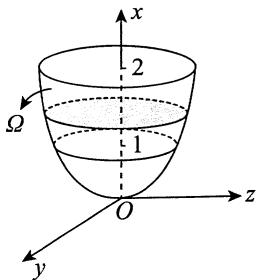

故 $\oint_{\Gamma}(y^{2} + 2x - z)\mathrm{d}s = \frac{1}{3}\oint_{\Gamma}(x^{2} + y^{2} + z^{2})\mathrm{d}s + \frac{1}{3}\oint_{\Gamma}(x + y + z)\mathrm{d}s = \frac{2}{3} l_{\Gamma}.$

如图所示，设球心到平面 $x + y + z = 1$ 的距离为 $d$ ，曲线 $\Gamma$ 围成的圆的半径为 $r$ ，则

$$
d = \frac {\left| 0 + 0 + 0 - 1 \right|}{\sqrt {1 ^ {2} + 1 ^ {2} + 1 ^ {2}}} = \frac {1}{\sqrt {3}},
$$

故 $r = \sqrt{1 - \frac{1}{3}} = \sqrt{\frac{2}{3}}$ ，于是 $l_{\Gamma} = 2\pi \sqrt{\frac{2}{3}}$ ，故

原式 $= \frac{2}{3} l_{\Gamma} = \frac{2}{3} \cdot 2\pi \sqrt{\frac{2}{3}} = \frac{4\sqrt{6}}{9}\pi$

5.【答案】 $3\sqrt{3}$

【解析】 $l$ 是过空间两点的直线段，其参数方程为 $\left\{ \begin{array}{ll}x = 1 + t,\\ y = 1 + t,\\ z = 1 + t, \end{array} \right.$ 其中 $0\leqslant t\leqslant 3$ ，于是

$$
\int_ {l} \frac {x d x + y d y + z d z}{\sqrt {x ^ {2} + y ^ {2} + z ^ {2} - x - y + 2 z}} = \int_ {0} ^ {3} \frac {3 (1 + t) d t}{\sqrt {3 (1 + t) ^ {2}}} = \sqrt {3} \int_ {0} ^ {3} d t = 3 \sqrt {3}.
$$

6.【答案】 $x^{4}y^{3} - 3xy^{2} + 5x - 4y + C$

【解析】由题，易知 $\frac{\partial u}{\partial x} = 2ax^3 y^3 - 3y^2 + 5, \frac{\partial u}{\partial y} = 3x^4 y^2 - 2bxy - 4$ ，则

$$
\frac {\partial^ {2} u}{\partial x \partial y} = 6 a x ^ {3} y ^ {2} - 6 y, \frac {\partial^ {2} u}{\partial y \partial x} = 1 2 x ^ {3} y ^ {2} - 2 b y.
$$

显然 $\frac{\partial^2u}{\partial x\partial y}$ 和 $\frac{\partial^2u}{\partial y\partial x}$ 连续，于是 $\frac{\partial^2u}{\partial x\partial y} = \frac{\partial^2u}{\partial y\partial x}$ ，故得 $a = 2, b = 3$ 。

在根据全微分求原函数时，可用①凑全微分法；②曲线积分与路径无关法；③不定积分法。应根据实际情形选用恰当的方法。此题我们可以选用方法②，选折线 $(0,0) \to (x,0) \to (x,y)$ 为积分路径，则

$$
\begin{array}{l} u (x, y) - u (0, 0) = \int_ {(0, 0)} ^ {(x, y)} \left(4 x ^ {3} y ^ {3} - 3 y ^ {2} + 5\right) d x + \left(3 x ^ {4} y ^ {2} - 6 x y - 4\right) d y \\ = \int_ {0} ^ {x} 5 \mathrm {d} x + \int_ {0} ^ {y} (3 x ^ {4} y ^ {2} - 6 x y - 4) \mathrm {d} y = 5 x + x ^ {4} y ^ {3} - 3 x y ^ {2} - 4 y. \\ \end{array}
$$

故 $u(x,y) = x^4 y^3 - 3xy^2 + 5x - 4y + C.$

7.【答案】(D)

【解析】由格林公式 $\oint_{L} P \mathrm{d}x + Q \mathrm{d}y = \iint_{D_{xy}} \left( \frac{\partial Q}{\partial x} - \frac{\partial P}{\partial y} \right) \mathrm{d}x \mathrm{d}y,$

得 $\oint_{L}(2y^{3} - 3y)\mathrm{d}x - x^{3}\mathrm{d}y = \iint_{D_{xy}}(-3x^{2} - 6y^{2} + 3)\mathrm{d}x\mathrm{d}y\stackrel {\text{记}}{=}I.$

当被积函数在积分区域上恒小于0时， $I < 0$ ；当被积函数在积分区域上恒大于0时， $I > 0$ ：故当 $L$ 为区域 $-3x^{2} - 6y^{2} + 3\geqslant 0$ 的正向边界时， $I$ 取最大值，即 $x^{2} + 2y^{2} = 1$ ：

8.【答案】 $\frac{3}{8}\pi^2$

【解析】由于积分与路径无关，因此取折线段路径

$$
L _ {1}: \left(\frac {\pi}{2}, 1\right)\rightarrow \left(\frac {\pi}{2}, 0\right); L _ {2}: \left(\frac {\pi}{2}, 0\right)\rightarrow (\pi , 0).
$$

又因为在 $L_{1}$ 上 $x \equiv \frac{\pi}{2}, f\left(\frac{\pi}{2}\right) = 0$ ，故在 $L_{1}$ 上 $\frac{f(x)}{x} = 0$ ，从而有

$$
\begin{array}{l} I = \int_ {A} ^ {B} (x + x y \sin x) d x + \frac {f (x)}{x} d y = \int_ {L _ {1}} \frac {f (x)}{x} d y + \int_ {L _ {2}} (x + x y \sin x) d x \\ = \int_ {L _ {1}} 0 \mathrm {d} y + \int_ {L _ {2}} x \mathrm {d} x = \int_ {\frac {\pi}{2}} ^ {\pi} x \mathrm {d} x = \frac {3}{8} \pi^ {2}. \\ \end{array}
$$

【注】事实上，可以求 $f(x)$ 的表达式，具体如下

因为积分与路径无关，所以

$$
\frac {\mathrm {d}}{\mathrm {d} x} \left[ \frac {f (x)}{x} \right] = \frac {\partial}{\partial y} (x + x y \sin x) = x \sin x,
$$

对 $\frac{\mathrm{d}}{\mathrm{d}x}\left[\frac{f(x)}{x}\right] = x\sin x$ 两端积分，得

$$
\frac {f (x)}{x} = \int x \sin x d x = \sin x - x \cos x + C.
$$

又 $f\left(\frac{\pi}{2}\right) = 0$ ，所以 $C = -1$ .故 $f(x) = x\sin x - x^{2}\cos x - x$

9.【解析】(1)依题设，函数 $f(x,y) = 1 - x^{2} - y^{2}$ 在平面区域 $D_{1}$ 上非负，在 $D_{1}$ 之外小于零，所以

$$
D _ {1} = \left\{(x, y) \mid x ^ {2} + y ^ {2} \leqslant 1 \right\}, I (D _ {1}) = \iint_ {D _ {1}} (1 - x ^ {2} - y ^ {2}) d x d y = \int_ {0} ^ {2 \pi} d \theta \int_ {0} ^ {1} (1 - r ^ {2}) r d r = \frac {\pi}{2}.
$$

(2) 取 $L: x^2 + 2y^2 = \frac{1}{4}$ , 顺时针方向, $\partial D_1$ 与 $L$ 之间的区域记为 $E$ . 因为

$$
\frac {\partial}{\partial x} \left(\frac {2 y \mathrm {e} ^ {x ^ {2} + 2 y ^ {2}} - x}{x ^ {2} + 2 y ^ {2}}\right) = \frac {4 x y (x ^ {2} + 2 y ^ {2} - 1) \mathrm {e} ^ {x ^ {2} + 2 y ^ {2}} + x ^ {2} - 2 y ^ {2}}{(x ^ {2} + 2 y ^ {2}) ^ {2}} = \frac {\partial}{\partial y} \left(\frac {x \mathrm {e} ^ {x ^ {2} + 2 y ^ {2}} + y}{x ^ {2} + 2 y ^ {2}}\right),
$$

所以由格林公式可知

$$
\oint_ {\partial D _ {1} + L} \frac {(x \mathrm {e} ^ {x ^ {2} + 2 y ^ {2}} + y) \mathrm {d} x + (2 y \mathrm {e} ^ {x ^ {2} + 2 y ^ {2}} - x) \mathrm {d} y}{x ^ {2} + 2 y ^ {2}}
$$

$$
= \iint_ {E} \left[ \frac {\partial}{\partial x} \left(\frac {2 y \mathrm {e} ^ {x ^ {2} + 2 y ^ {2}} - x}{x ^ {2} + 2 y ^ {2}}\right) - \frac {\partial}{\partial y} \left(\frac {x \mathrm {e} ^ {x ^ {2} + 2 y ^ {2}} + y}{x ^ {2} + 2 y ^ {2}}\right) \right] \mathrm {d} x \mathrm {d} y = 0,
$$

从而

$$
\begin{array}{l} \oint_ {\partial D _ {1}} \frac {\left(x \mathrm {e} ^ {x ^ {2} + 2 y ^ {2}} + y\right) \mathrm {d} x + \left(2 y \mathrm {e} ^ {x ^ {2} + 2 y ^ {2}} - x\right) \mathrm {d} y}{x ^ {2} + 2 y ^ {2}} = - \oint_ {L} \frac {\left(x \mathrm {e} ^ {x ^ {2} + 2 y ^ {2}} + y\right) \mathrm {d} x + \left(2 y \mathrm {e} ^ {x ^ {2} + 2 y ^ {2}} - x\right) \mathrm {d} y}{x ^ {2} + 2 y ^ {2}} \\ = - 4 \oint_ {L} \left(\mathrm {e} ^ {\frac {1}{4}} x + y\right) \mathrm {d} x + \left(2 \mathrm {e} ^ {\frac {1}{4}} y - x\right) \mathrm {d} y \\ = 4 \iint_ {x ^ {2} + 2 y ^ {2} \leqslant \frac {1}{4}} (- 2) d x d y = - \sqrt {2} \pi . \\ \end{array}
$$

10.【答案】 $\frac{7}{4}\pi$

【解析】由高斯公式，得

原式 $= \iiint_{\Omega}(3y^{2} + 1)\mathrm{d}\nu = \int_{0}^{2\pi}\mathrm{d}\theta \int_{0}^{1}r(3r^{2}\cos^{2}\theta +1)\mathrm{d}r\int_{0}^{1}\mathrm{d}x$

$$
\begin{array}{l} = \int_ {0} ^ {2 \pi} \left[ \int_ {0} ^ {1} \left(3 r ^ {3} \cos^ {2} \theta + r\right) d r \right] d \theta = \int_ {0} ^ {2 \pi} \left(\frac {3}{4} \cos^ {2} \theta + \frac {1}{2}\right) d \theta \\ = \frac {3}{4} \cdot 4 \cdot \frac {1}{2} \cdot \frac {\pi}{2} + \pi = \frac {7}{4} \pi . \\ \end{array}
$$

11.【答案】 $\frac{2}{5}\pi a^5$

【解析】由高斯公式，得

$$
\begin{array}{l} \iint_ {\Sigma} x z ^ {2} \mathrm {d} y \mathrm {d} z + \left(x ^ {2} y - z ^ {3}\right) \mathrm {d} z \mathrm {d} x + \left(2 x y + y ^ {2} z\right) \mathrm {d} x \mathrm {d} y = \iiint_ {\Omega} \left(z ^ {2} + x ^ {2} + y ^ {2}\right) \mathrm {d} v \\ = \int_ {0} ^ {2 \pi} d \theta \int_ {0} ^ {\frac {\pi}{2}} d \varphi \int_ {0} ^ {a} r ^ {2} \cdot r ^ {2} \sin \varphi d r = \frac {2}{5} \pi a ^ {5}, \\ \end{array}
$$

其中 $\Omega = \{(x,y,z) | 0 \leqslant z \leqslant \sqrt{a^2 - x^2 - y^2}\}$ .

12.【答案】 $\frac{2}{15}$

【解析】积分区域如图所示，由类对称性，得

原式 $= 2\iint_{\Sigma_1}xyz\mathrm{d}x\mathrm{d}y$

其中 $\Sigma_{1}:z = \sqrt{1 - x^{2} - y^{2}} (x\geqslant 0,y\geqslant 0)$ ，方向向上. $\Sigma_{1}$ 在 $xOy$ 面的投影域为 $D = \{(x,y)|x^2 +y^2\leqslant 1,$

$x\geqslant 0,y\geqslant 0\}$ ，故 原式 $= 2\int_{0}^{\frac{\pi}{2}}\mathrm{d}\theta \int_{0}^{1}r^{3}\sin \theta \cos \theta \cdot \sqrt{1 - r^{2}}\mathrm{d}r = \frac{2}{15}.$

13.【答案】 $2a^{2}(\mathrm{e}^{2a} - 1)\pi$

【解析】旋转曲面方程为 $x = \mathrm{e}^{\sqrt{y^2 + z^2}}$ .直接计算曲面积分比较困难，可利用高斯公式化成三重积分.添加辅助曲面 $\Sigma_1:x = \mathrm{e}^a,y^2 +z^2\leqslant a^2$ ，取前侧，则 $\Sigma_{1}$ 与 $\boldsymbol{\Sigma}$ 构成封闭曲面 $\Sigma^{*}$ ，记所围成的空间闭区域为 $\Omega$ ，由高斯公式可得

$$
\begin{array}{l} I = \left(\oiint_ {\Sigma^ {*}} - \iint_ {\Sigma_ {1}}\right) 2 \left(1 - x ^ {2}\right) \mathrm {d} y \mathrm {d} z + 8 x y \mathrm {d} z \mathrm {d} x - 4 x z \mathrm {d} x \mathrm {d} y \\ = \iiint_ {\Omega} 0 \mathrm {d} x \mathrm {d} y \mathrm {d} z - \iint_ {D _ {y z}} 2 \left(1 - \mathrm {e} ^ {2 a}\right) \mathrm {d} y \mathrm {d} z = 2 a ^ {2} \left(\mathrm {e} ^ {2 a} - 1\right) \pi , \\ \end{array}
$$

其中 $D_{yz}$ 为 $\Sigma_1$ 在 $yOz$ 平面上的投影域，是一个半径为 $a$ 的圆.

14.【解析】曲面 $\Sigma$ 在 $yOz$ 坐标面的投影域为 $D = \{(y,z)|y^2 +z^2\leqslant 1\}$ ，因为 $\frac{\partial x}{\partial y} = 2y,\frac{\partial x}{\partial z} = 2z$ ，所以

$$
\begin{array}{l} I = \iint_ {\Sigma} (x - 1) \mathrm {d} y \mathrm {d} z + (y - 1) ^ {3} \mathrm {d} z \mathrm {d} x + (z - 1) ^ {3} \mathrm {d} x \mathrm {d} y \\ = \iint_ {D} [ 1 - y ^ {2} - z ^ {2} + 2 y (y - 1) ^ {3} + 2 z (z - 1) ^ {3} ] d y d z \\ = \iint_ {D} (2 y ^ {4} + 2 z ^ {4} - 6 y ^ {3} - 6 z ^ {3} + 5 y ^ {2} + 5 z ^ {2} - 2 y - 2 z + 1) d y d z. \\ \end{array}
$$

因为区域 $D$ 关于 $y, z$ 坐标轴对称，所以 $\iint_{D} (-6y^3 - 6z^3 - 2y - 2z) \, \mathrm{d}y \, \mathrm{d}z = 0$ ，故

$$
\begin{array}{l} I = \iint_ {D} (2 y ^ {4} + 2 z ^ {4} + 5 y ^ {2} + 5 z ^ {2} + 1) d y d z \\ = \int_ {0} ^ {2 \pi} d \theta \int_ {0} ^ {1} [ 2 r ^ {4} (\cos^ {4} \theta + \sin^ {4} \theta) + 5 r ^ {2} + 1 ] r d r \\ = \int_ {0} ^ {2 \pi} \left[ \frac {1}{3} \left(\cos^ {4} \theta + \sin^ {4} \theta\right) + \frac {7}{4} \right] d \theta \\ = \frac {7}{2} \pi + \frac {8}{3} \int_ {0} ^ {\frac {\pi}{2}} \sin^ {4} \theta d \theta = 4 \pi . \\ \end{array}
$$

15.【解析】易求得 $\Sigma$ 的外法线向量为 $n = (2x, 2y, -2z)$ ，则单位法向量为

$$
\boldsymbol {n} ^ {\circ} = \left(\frac {x}{\sqrt {x ^ {2} + y ^ {2} + z ^ {2}}}, \frac {y}{\sqrt {x ^ {2} + y ^ {2} + z ^ {2}}}, \frac {- z}{\sqrt {x ^ {2} + y ^ {2} + z ^ {2}}}\right),
$$

于是

$$
\begin{array}{l} \iint_ {\Sigma} y f (x y) \mathrm {d} y \mathrm {d} z - x f (x y) \mathrm {d} z \mathrm {d} x \\ = \iint_ {\Sigma} \left[ y f (x y) \cdot \frac {x}{\sqrt {x ^ {2} + y ^ {2} + z ^ {2}}} - x f (x y) \cdot \frac {y}{\sqrt {x ^ {2} + y ^ {2} + z ^ {2}}} \right] d S = 0. \\ \end{array}
$$

如图所示，记 $\Sigma_{1}$ 为 $z = 0(x^{2} + y^{2}\leqslant 1)$ ，方向向下，记 $\Sigma_{2}$ 为 $z = 1(x^{2} + y^{2}\leqslant 2)$ ，方向向上， $\varOmega$ 为 $\Sigma ,\Sigma_1,\Sigma_2$ 围成的空间区域，则

$$
\begin{array}{l} I = \iint_ {\Sigma} (- 2 x) d y d z + y ^ {2} d z d x + (z - 1) ^ {2} d x d y = \oiint_ {\Sigma + \Sigma_ {1} + \Sigma_ {2}} - \iint_ {\Sigma_ {1}} - \iint_ {\Sigma_ {2}} \\ = \iiint_ {\Omega} (2 y + 2 z - 4) d v + \iint_ {x ^ {2} + y ^ {2} \leqslant 1} d x d y - 0 \\ = \int_ {0} ^ {1} d z \iint_ {x ^ {2} + y ^ {2} \leqslant z ^ {2} + 1} (2 y + 2 z - 4) d x d y + \pi \\ = \int_ {0} ^ {1} \pi (z ^ {2} + 1) (2 z - 4) d z + \pi = - \frac {1 7}{6} \pi . \\ \end{array}
$$

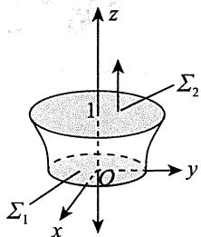

16.【解析】根据斯托克斯公式，得

$$
I = \iint_ {\Sigma} \left| \begin{array}{c c c} \mathrm {d} y \mathrm {d} z & \mathrm {d} z \mathrm {d} x & \mathrm {d} x \mathrm {d} y \\ \frac {\partial}{\partial x} & \frac {\partial}{\partial y} & \frac {\partial}{\partial z} \\ x ^ {2} - y & 2 x + y ^ {2} & z ^ {2} \end{array} \right| = \iint_ {\Sigma} 3 \mathrm {d} x \mathrm {d} y = \iint_ {D} 3 \mathrm {d} x \mathrm {d} y = 3 \cdot (\sqrt {2}) ^ {2} = 6,
$$

其中 $\Sigma$ 为任意以曲线 $\Gamma$ 为边界的空间曲面，方向向上， $D$ 为 $\Sigma$ 在 $xOy$ 面上的投影，即 $D = \{(x,y) \mid |x| + |y| \leqslant 1\}$ ，如图所示.

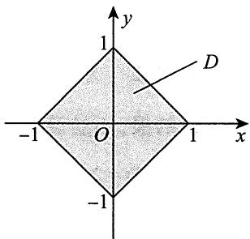

【注】本题不适合用参数表示 $\Gamma$ ，比较烦琐，但有的题目适合用参数式，所以考试时要注意选择简便的做法.

# 第1章 行列式

# 1.【答案】(B)

【解析】方法一 由 $a, b, c$ 是方程 $x^3 - 2x + 4 = 0$ 的三个不同的根，有

$$
x ^ {3} - 2 x + 4 = (x - a) (x - b) (x - c) = x ^ {3} - (a + b + c) x ^ {2} + (b c + a c + a b) x - a b c = 0,
$$

从而 $a + b + c = 0$ ，于是

$$
\left| \begin{array}{l l l} a & b & c \\ b & c & a \\ c & a & b \end{array} \right| = \left| \begin{array}{c c c} a + b + c & a + b + c & a + b + c \\ b & c & a \\ c & a & b \end{array} \right| = (a + b + c) \left| \begin{array}{l l l} 1 & 1 & 1 \\ b & c & a \\ c & a & b \end{array} \right| = 0.
$$

方法二 方程为 $x^{3} - 2x + 4 = (x + 2)(x^{2} - 2x + 2) = 0$ 。因 $a, b, c$ 是方程 $x^{3} - 2x + 4 = 0$ 的三个不同的根，不妨设 $a = -2$ ，则 $b, c$ 应满足 $x^{2} - 2x + 2 = 0$ ，由二次方程根与方程系数的关系，得 $b + c = -(2) = 2$ ，因此有 $a + b + c = 0$ 。于是

$$
\left| \begin{array}{l l l} a & b & c \\ b & c & a \\ c & a & b \end{array} \right| = \left| \begin{array}{c c c} a + b + c & a + b + c & a + b + c \\ b & c & a \\ c & a & b \end{array} \right| = (a + b + c) \left| \begin{array}{l l l} 1 & 1 & 1 \\ b & c & a \\ c & a & b \end{array} \right| = 0.
$$

# 2.【答案】(D)

【解析】方法一

$$
\left| \begin{array}{c c c c} {x} & {1} & {0} & {1} \\ {0} & {1} & {x} & {1} \\ {1} & {x} & {1} & {0} \\ {1} & {0} & {1} & {x} \end{array} \right| = \left| \begin{array}{c c c c} {x} & {1} & {0} & {1} \\ {0} & {1} & {x} & {1} \\ {0} & {x} & {0} & {- x} \\ {1} & {0} & {1} & {x} \end{array} \right| \xlongequal {\text {按 第 1 列 展 开}} x \left| \begin{array}{c c c c} {*} & {*} & {*} \\ {*} & {*} & {*} \\ {*} & {*} & {*} \end{array} \right| - \left| \begin{array}{c c c} {1} & {0} & {1} \\ {1} & {x} & {1} \\ {x} & {0} & {- x} \end{array} \right|,
$$

上式中， $x\left| \begin{array}{lll} * & * & * \\ * & * & * \\ * & * & * \end{array} \right|$ 展开后每一项均含 $x$ ，且 $\left| \begin{array}{ccc}1 & 0 & 1\\ 1 & x & 1\\ x & 0 & -x \end{array} \right| = x\left| \begin{array}{ccc}1 & 0 & 1\\ 1 & x & 1\\ 1 & 0 & -1 \end{array} \right|$ 展开后每一项也含 $x$ ，因此

$$
\left| { \begin{array}{c c c c} {x} & {1} & {0} & {1} \\ {0} & {1} & {x} & {1} \\ {1} & {x} & {1} & {0} \\ {1} & {0} & {1} & {x} \end{array} } \right|   {\text {的 常 数 项 是}} 0.
$$

方法二 此行列式展开后为关于 $x$ 的多项式，其常数项对应于取 $x = 0$ 时多项式的值，因此 $\left| \begin{array}{lll}x & 1 & 0 & 1\\ 0 & 1 & x & 1\\ 1 & x & 1 & 0\\ 1 & 0 & 1 & x \end{array} \right|$ 的常数项是它取 $x = 0$ 时的值，即 $\left| \begin{array}{cccc}0 & 1 & 0 & 1\\ 0 & 1 & 0 & 1\\ 1 & 0 & 1 & 0\\ 1 & 0 & 1 & 0 \end{array} \right|$ ，此行列式的第1行与第2行相同，故其值为0.

# 3.【答案】(A)

【解析】直接寻找行列式中含 $x^4$ 和 $x^3$ 的项.

由题可知，最高次项来自主对角线元素的乘积，此时为

$$
(- 1) ^ {\tau (1 2 3 4)} 5 x \cdot x \cdot x \cdot 2 x = 1 0 x ^ {4},
$$

则 $x^4$ 的系数为10

分析可得，含 $x^{3}$ 的项为

$$
\begin{array}{l} (- 1) ^ {r (2 1 3 4)} 1 \cdot x \cdot x \cdot 2 x + (- 1) ^ {r (4 2 3 1)} 3 \cdot x \cdot x \cdot x \\ = - 2 x ^ {3} - 3 x ^ {3} \\ = - 5 x ^ {3}, \\ \end{array}
$$

则 $x^{3}$ 的系数为-5.故选(A).

# 4.【答案】(B)

【解析】在 $f(x) = \left| \begin{array}{lll}a_{1} + x & b_{1} + x & c_{1} + x\\ a_{2} + x & b_{2} + x & c_{2} + x\\ a_{3} + x & b_{3} + x & c_{3} + x \end{array} \right|$ 中，将第1列乘-1分别加到第2，3列上得

$$
\begin{array}{l} f (x) = \left| \begin{array}{c c c} a _ {1} + x & b _ {1} + x & c _ {1} + x \\ a _ {2} + x & b _ {2} + x & c _ {2} + x \\ a _ {3} + x & b _ {3} + x & c _ {3} + x \end{array} \right| = \left| \begin{array}{c c c} a _ {1} + x & b _ {1} - a _ {1} & c _ {1} - a _ {1} \\ a _ {2} + x & b _ {2} - a _ {2} & c _ {2} - a _ {2} \\ a _ {3} + x & b _ {3} - a _ {3} & c _ {3} - a _ {3} \end{array} \right| \\ = \left| \begin{array}{c c c} a _ {1} & b _ {1} - a _ {1} & c _ {1} - a _ {1} \\ a _ {2} & b _ {2} - a _ {2} & c _ {2} - a _ {2} \\ a _ {3} & b _ {3} - a _ {3} & c _ {3} - a _ {3} \end{array} \right| + x \left| \begin{array}{c c c} 1 & b _ {1} - a _ {1} & c _ {1} - a _ {1} \\ 1 & b _ {2} - a _ {2} & c _ {2} - a _ {2} \\ 1 & b _ {3} - a _ {3} & c _ {3} - a _ {3} \end{array} \right|. \\ \end{array}
$$

当 $\left| \begin{array}{lll}1 & b_1 - a_1 & c_1 - a_1\\ 1 & b_2 - a_2 & c_2 - a_2\\ 1 & b_3 - a_3 & c_3 - a_3 \end{array} \right| = 0$ 时， $f(x)$ 是常数，它没有零点；

当 $\left| \begin{array}{lll}1 & b_1 - a_1 & c_1 - a_1\\ 1 & b_2 - a_2 & c_2 - a_2\\ 1 & b_3 - a_3 & c_3 - a_3 \end{array} \right|\neq 0$ 时， $f(x)$ 是 $x$ 的一次多项式，它只有一个零点.

# 5.【答案】(B)

【解析】 $f(x)\frac{r_1 - r_2 - r_3}{x + 1}\left| \begin{array}{ccc}x & 0 & 0\\ x + 1 & x + 4 & -1\\ x & 7 & x - 1 \end{array} \right| = x\left| \begin{array}{cc}x + 4 & -1\\ 7 & x - 1 \end{array} \right|$

$$
\begin{array}{l} = x \left(x ^ {2} + 3 x + 3\right) = x ^ {3} + 3 x ^ {2} + 3 x, \\ f ^ {\prime} (x) = 3 x ^ {2} + 6 x + 3 = 3 (x + 1) ^ {2}. \\ \end{array}
$$

又 $f^{\prime \prime}(x) = 6x + 6,f^{\prime \prime}(-1) = 0,f^{\prime \prime}(x) = 6\neq 0$ .所以 $f(x)$ 的拐点为 $(-1, - 1)$ ：

# 6.【答案】(B)

【解析】将行列式按第1行展开，得

$$
D _ {n} = \left| \begin{array}{c c c c c} 2 & 1 & 0 & \dots & 0 \\ 1 & 2 & 1 & \dots & 0 \\ 0 & 1 & 2 & \dots & 0 \\ \vdots & \vdots & \vdots & & \vdots \\ 0 & 0 & 0 & \dots & 2 \end{array} \right| = 2 D _ {n - 1} - \left| \begin{array}{c c c c c} 1 & 1 & 0 & \dots & 0 \\ 0 & 2 & 1 & \dots & 0 \\ 0 & 1 & 2 & \dots & 0 \\ \vdots & \vdots & \vdots & & \vdots \\ 0 & 0 & 0 & \dots & 2 \end{array} \right| _ {(n - 1) \times (n - 1)} = 2 D _ {n - 1} - D _ {n - 2}.
$$

由此得到递推关系式 $D_{n} - D_{n - 1} = D_{n - 1} - D_{n - 2}$ ，所以 $D_{1},D_{2},\dots ,D_{n}$ 成等差数列.而

$$
D _ {1} = 2, D _ {2} = 3 = D _ {1} + 1,
$$

所以此等差数列的首项为2，公差 $d = 1$ ，即 $D_{n} = n + 1$ .故选(B).

# 7.【答案】10

【解析】由 $r(AA^{\mathrm{T}}) = 3$ ，知 $\left|A\right| = 0,\left|AB\right| = \left|A\right|\left|B\right| = 0$ ，即

$$
\begin{array}{l} \left| \boldsymbol {A} \boldsymbol {B} \right| \xlongequal {\text {按 第} 4 \text {行 展 开}} (- 2) \left| \begin{array}{c c c} 2 & 0 & - a \\ - a & - 5 & b \\ b & b & - 2 \end{array} \right| + (- 4) \left| \begin{array}{c c c} 2 & a & - a \\ - a & 2 & b \\ b & 0 & - 2 \end{array} \right| \\ = (- 2) \left| \begin{array}{c c c} 2 & 0 & - a \\ - a & - 5 & b \\ b & b & - 2 \end{array} \right| + (- 4) \times 5 = 0  , \\ \end{array}
$$

得 $\left| \begin{array}{ccc}2 & 0 & -a\\ -a & -5 & b\\ b & b & -2 \end{array} \right| = -10$ ，于是 $\left| \begin{array}{ccc} - a & -5 & b\\ 2 & 0 & -a\\ b & b & -2 \end{array} \right| = 10.$

# 8.【答案】 $10(a - 3)$

【解析】

$$
\begin{array}{l} \left| \begin{array}{c c c c} 2 & 1 & 0 & - 1 \\ - 1 & 2 & - 5 & 3 \\ 3 & 0 & a & b \\ 1 & - 3 & 5 & 0 \end{array} \right| - \left| \begin{array}{c c c c} 2 & 1 & 0 & - 1 \\ - 1 & 2 & - 5 & 3 \\ 3 & 0 & a & b \\ 1 & - 1 & 1 & 0 \end{array} \right| = \left| \begin{array}{c c c c} 2 & 1 & 0 & - 1 \\ - 1 & 2 & - 5 & 3 \\ 3 & 0 & a & b \\ 0 & - 2 & 4 & 0 \end{array} \right| \\ = \left| \begin{array}{c c c c} 0 & 0 & 0 & - 1 \\ 5 & 5 & - 5 & 3 \\ 3 + 2 b & b & a & b \\ 0 & - 2 & 4 & 0 \end{array} \right| = (- 1) \cdot (- 1) ^ {1 + 4} \left| \begin{array}{c c c} 5 & 5 & - 5 \\ 3 + 2 b & b & a \\ 0 & - 2 & 4 \end{array} \right| \\ \end{array}
$$

$$
= 5 \left| \begin{array}{c c c} 1 & 1 & - 1 \\ 3 + 2 b & b & a \\ 0 & - 2 & 4 \end{array} \right| = 5 \left| \begin{array}{c c c} 1 & 1 & 1 \\ 3 + 2 b & b & a + 2 b \\ 0 & - 2 & 0 \end{array} \right| = 1 0 (a - 3).
$$

# 9.【答案】1

【解析】由行列式的展开定理，得

$$
A _ {1 1} - A _ {2 1} + A _ {4 1} = \left| \begin{array}{c c c c} 1 & 0 & - 1 & 1 \\ - 1 & 1 & 0 & 1 \\ 0 & 1 & 1 & 0 \\ 1 & - 1 & 0 & a \end{array} \right| = \left| \begin{array}{c c c c} 1 & 0 & - 1 & 1 \\ 0 & 1 & - 1 & 2 \\ 0 & 1 & 1 & 0 \\ 0 & - 1 & 1 & a - 1 \end{array} \right| = \left| \begin{array}{c c c} 1 & - 1 & 2 \\ 1 & 1 & 0 \\ - 1 & 1 & a - 1 \end{array} \right| = 2 a + 2,
$$

又 $A_{11} - A_{21} + A_{41} = 4$ ，故 $a = 1$ ：

【注】本题也可以直接用代数余子式的定义进行计算.注意行列式 $\left| \begin{array}{cccc}1 & 0 & -1 & 1\\ -1 & 1 & 0 & 1\\ 0 & 1 & 1 & 0\\ 1 & -1 & 0 & a \end{array} \right|$ 与行列式

$\left| \begin{array}{cccc}2 & 0 & -1 & 1\\ 3 & 1 & 0 & 1\\ 4 & 1 & 1 & 0\\ 5 & -1 & 0 & a \end{array} \right|$ 第1列元素的代数余子式相同.

# 10.【答案】 $24x^{4}$

【解析】方法一 利用行列式性质, 则

$$
\begin{array}{l} D _ {4} = x \left| \begin{array}{c c c c} 1 & 1 & 0 & 0 \\ 1 & 1 + 2 x & 2 x & 0 \\ 0 & 2 & 2 + 3 x & 3 x \\ 0 & 0 & 3 & 3 + 4 x \end{array} \right| = x \left| \begin{array}{c c c c} 1 & 1 & 0 & 0 \\ 0 & 2 x & 2 x & 0 \\ 0 & 2 & 2 + 3 x & 3 x \\ 0 & 0 & 3 & 3 + 4 x \end{array} \right| \\ = x \cdot 2 x \left| \begin{array}{l l l l} 1 & 1 & 0 & 0 \\ 0 & 1 & 1 & 0 \\ 0 & 2 & 2 + 3 x & 3 x \\ 0 & 0 & 3 & 3 + 4 x \end{array} \right| = x \cdot 2 x \left| \begin{array}{l l l l} 1 & 1 & 0 & 0 \\ 0 & 1 & 1 & 0 \\ 0 & 0 & 3 x & 3 x \\ 0 & 0 & 3 & 3 + 4 x \end{array} \right| \\ = x \cdot 2 x \cdot 3 x \left| \begin{array}{l l l l} 1 & 1 & 0 & 0 \\ 0 & 1 & 1 & 0 \\ 0 & 0 & 1 & 1 \\ 0 & 0 & 0 & 4 x \end{array} \right| = x \cdot 2 x \cdot 3 x \cdot 4 x = 2 4 x ^ {4}. \\ \end{array}
$$

方法二 $D_{4} = (3 + 4x)D_{3} - 9xD_{2} = (3 + 4x)\left[(2 + 3x)D_{2} - 4xD_{1}\right] - 9xD_{2}.$

又 $D_{1} = x$ ， $D_{2} = \left| \begin{array}{cc}x & x\\ 1 & 1 + 2x \end{array} \right| = 2x^{2}$ ，故

$$
\begin{array}{l} D _ {4} = (3 + 4 x) \left[ (2 + 3 x) \cdot 2 x ^ {2} - 4 x ^ {2} \right] - 9 x \cdot 2 x ^ {2} \\ = (3 + 4 x) \cdot 6 x ^ {3} - 1 8 x ^ {3} = 2 4 x ^ {4}. \\ \end{array}
$$

【注】① $D_{n} = \left| \begin{array}{ccccc}a_{1} & b_{1} & & & \\ c_{2} & a_{2} & b_{2} & & \\ & c_{3} & a_{3} & b_{3} & \\ & & \ddots & \ddots & \ddots \\ & & & c_{n - 1} & a_{n - 1}\\ & & & & c_{n} \end{array} \right| = a_{n}D_{n - 1} - b_{n - 1}c_{n}D_{n - 2},$

这可以作为递推的开端，往下就方便多了。

$②$ 注意 $D_{n}$ 元素分布规律为“左上至右下”阶数增加，即 $D_{1} = a_{1}$ ， $D_{2} = \left| \begin{array}{ll}a_{1} & b_{1}\\ c_{2} & a_{2} \end{array} \right|$ $D_{3} =$ $\left| \begin{array}{lll}a_1 & b_1 & 0\\ c_2 & a_2 & b_2\\ 0 & c_3 & a_3 \end{array} \right|,\dots ,$ 别弄反了.

# 11.【答案】-4

【解析】由题设条件 $A\alpha_{1} = \alpha_{1} + 2\alpha_{2} + \alpha_{3}$ ， $A\alpha_{2} = 2\alpha_{1} + \alpha_{2} + \alpha_{3}$ ， $A\alpha_{3} = \alpha_{1} + \alpha_{2} + 2\alpha_{3}$ ，故

$$
\begin{array}{l} A \left[ \alpha_ {1}, \alpha_ {2}, \alpha_ {3} \right] = \left[ \alpha_ {1} + 2 \alpha_ {2} + \alpha_ {3}, 2 \alpha_ {1} + \alpha_ {2} + \alpha_ {3}, \alpha_ {1} + \alpha_ {2} + 2 \alpha_ {3} \right] \\ = \left[ \begin{array}{l l l} \boldsymbol {\alpha} _ {1}, \boldsymbol {\alpha} _ {2}, \boldsymbol {\alpha} _ {3} \end{array} \right] \left[ \begin{array}{l l l} 1 & 2 & 1 \\ 2 & 1 & 1 \\ 1 & 1 & 2 \end{array} \right]. \\ \end{array}
$$

方法一 两边取行列式，得

$$
\left| A \left[ \boldsymbol {\alpha} _ {1}, \boldsymbol {\alpha} _ {2}, \boldsymbol {\alpha} _ {3} \right] \right| = | A | \left| \left[ \boldsymbol {\alpha} _ {1}, \boldsymbol {\alpha} _ {2}, \boldsymbol {\alpha} _ {3} \right] \right| = \left| \left[ \boldsymbol {\alpha} _ {1}, \boldsymbol {\alpha} _ {2}, \boldsymbol {\alpha} _ {3} \right] \left[ \begin{array}{l l l} 1 & 2 & 1 \\ 2 & 1 & 1 \\ 1 & 1 & 2 \end{array} \right] \right| = \left| \left[ \boldsymbol {\alpha} _ {1}, \boldsymbol {\alpha} _ {2}, \boldsymbol {\alpha} _ {3} \right] \right| \left| \begin{array}{l l l} 1 & 2 & 1 \\ 2 & 1 & 1 \\ 1 & 1 & 2 \end{array} \right|,
$$

因为 $\alpha_{1},\alpha_{2},\alpha_{3}$ 线性无关，所以 $\left|\left[\pmb{\alpha}_{1},\pmb{\alpha}_{2},\pmb{\alpha}_{3}\right]\right| \neq 0$ ，可得 $|\mathbf{A}| = \begin{vmatrix} 1 & 2 & 1 \\ 2 & 1 & 1 \\ 1 & 1 & 2 \end{vmatrix} = -4.$

方法二 因为 $\alpha_{1},\alpha_{2},\alpha_{3}$ 线性无关，记 $P = \left[a_1,a_2,a_3\right]$ ，则 $P$ 是可逆矩阵，从而可得

$$
\pmb {A} \pmb {P} = \pmb {P} \left[ \begin{array}{l l l} {1} & {2} & {1} \\ {2} & {1} & {1} \\ {1} & {1} & {2} \end{array} \right],   \text {即}   \pmb {P} ^ {- 1} \pmb {A} \pmb {P} = \left[ \begin{array}{l l l} {1} & {2} & {1} \\ {2} & {1} & {1} \\ {1} & {1} & {2} \end{array} \right],
$$

又因为相似矩阵有相同的行列式，所以 $|\mathbf{A}| = \begin{vmatrix} 1 & 2 & 1\\ 2 & 1 & 1\\ 1 & 1 & 2 \end{vmatrix} = -4$

# 第2章 矩阵

1.【答案】(C)

【解析】 $\left[ \begin{array}{lll}1 & 0 & 0\\ 2 & 1 & 0\\ 3 & \frac{4}{3} & 2 \end{array} \right]\left[ \begin{array}{ccc}1 & -1 & 2\\ 0 & 3 & -1\\ 0 & 0 & -\frac{2}{3} \end{array} \right] = \left[ \begin{array}{ccc}1 & -1 & 2\\ 2 & 1 & 3\\ 3 & 1 & \frac{10}{3} \end{array} \right],$ ，选项(A)错误；

$\left[ \begin{array}{rrr}1 & 0 & 0\\ 2 & -1 & 0\\ 3 & \frac{4}{3} & 1 \end{array} \right]\left[ \begin{array}{rrr}1 & -1 & 2\\ 0 & -3 & -1\\ 0 & 0 & -\frac{2}{3} \end{array} \right] = \left[ \begin{array}{rrr}1 & -1 & 2\\ 2 & 1 & 5\\ 3 & -7 & 4 \end{array} \right],$ 选项(B)错误；

$\left[ \begin{array}{lll}1 & 0 & 0\\ 2 & 1 & 0\\ 3 & \frac{4}{3} & 1 \end{array} \right]\left[ \begin{array}{lll}1 & 0 & 0\\ 0 & 3 & 0\\ 0 & 0 & -\frac{2}{3}\\ 0 & 0 & 1 \end{array} \right]\left[ \begin{array}{ccc}1 & -1 & 2\\ 0 & 1 & -\frac{1}{3}\\ 0 & 0 & 1 \end{array} \right] = \left[ \begin{array}{ccc}1 & 0 & 0\\ 2 & 3 & 0\\ 3 & 4 & -\frac{2}{3}\\ 0 & 0 & 1 \end{array} \right]\left[ \begin{array}{ccc}1 & -1 & 2\\ 0 & 1 & -\frac{1}{3}\\ 0 & 0 & 1 \end{array} \right] = \left[ \begin{array}{ccc}1 & -1 & 2\\ 2 & 1 & 3\\ 3 & 1 & 4 \end{array} \right],$ ，选项(C)正确；

$\left[ \begin{array}{rrr}1 & 0 & 0\\ 2 & -1 & 0\\ 3 & \frac{4}{3} & 1 \end{array} \right]\left[ \begin{array}{rrr}1 & 0 & 0\\ 0 & -3 & 0\\ 0 & 0 & -\frac{2}{3}\\ 0 & 0 & 1 \end{array} \right]\left[ \begin{array}{rrr}1 & -1 & 2\\ 0 & 1 & -\frac{1}{3}\\ 3 & -4 & -\frac{2}{3}\\ 0 & 0 & 1 \end{array} \right] = \left[ \begin{array}{rrr}1 & 0 & 0\\ 2 & 3 & 0\\ 3 & -4 & -\frac{2}{3} \end{array} \right]\left[ \begin{array}{rrr}1 & -1 & 2\\ 0 & 1 & -\frac{1}{3}\\ 0 & 0 & 1 \end{array} \right] = \left[ \begin{array}{rrr}1 & -1 & 2\\ 2 & 1 & 3\\ 3 & -7 & \frac{20}{3} \end{array} \right],$

综上所述，选(C).

【注】本题虽属于对基本计算的考查，但背景深刻。将一个矩阵分解为若干个具有特定性质的矩阵乘积的过程，称为矩阵分解，以往考研题中亦出现过这种考题形式。

2.【答案】 $\begin{bmatrix} 2 & 0 \\ 0 & 2 \end{bmatrix}$

【解析】 $A^9 = \begin{bmatrix} 1 & 9\\ 0 & 1 \end{bmatrix},$ $\pmb {B}^{9} = \left[ \begin{array}{ll} - 1 & 9\\ 0 & -1 \end{array} \right],$ 故 $A^9 -B^9 = \left[ \begin{array}{ll}2 & 0\\ 0 & 2 \end{array} \right].$

0 0 -1 0 1 0 1 0

【解析】由于 $A^2 = \left[ \begin{array}{rrr} - 1 & 0 & 0\\ 0 & 1 & 0\\ 0 & 0 & -1 \end{array} \right]$ ，则 $A^4 = \left[ \begin{array}{lll}1 & 0 & 0\\ 0 & 1 & 0\\ 0 & 0 & 1 \end{array} \right] = E$ ，故

$$
\boldsymbol {A} ^ {1 3} = (\boldsymbol {A} ^ {4}) ^ {3} \boldsymbol {A} = \boldsymbol {E} ^ {3} \boldsymbol {A} = \boldsymbol {A} = \left[ \begin{array}{l l l} 0 & 0 & - 1 \\ 0 & 1 & 0 \\ 1 & 0 & 0 \end{array} \right].
$$

1 -1 0 0 0 1 0 1 0 0 0 1 1

【解析】容易验证， $B^4 = 0$ ，故

$$
A (\boldsymbol {E} - \boldsymbol {B}) = (\boldsymbol {E} + \boldsymbol {B} + \boldsymbol {B} ^ {2} + \boldsymbol {B} ^ {3}) (\boldsymbol {E} - \boldsymbol {B}) = \boldsymbol {E} - \boldsymbol {B} ^ {4} = \boldsymbol {E},
$$

从而 $A^{-1} = E - B = \left[ \begin{array}{rrr}1 & -1 & 0 & 0\\ 0 & 1 & -1 & 0\\ 0 & 0 & 1 & -1\\ 0 & 0 & 0 & 1 \end{array} \right].$

0 1 5.【答案】 -1 1

【解析】由 $A, P$ 均可逆， $(PA)^2 = PA$ ，则 $PA(PA - E) = O$ ，知 $PA = E$ ，于是

$$
\boldsymbol {P} = \boldsymbol {A} ^ {- 1} = \left[ \begin{array}{c c} 0 & 1 \\ - 1 & 1 \end{array} \right].
$$

6.【答案】18

【解析】 $\left|\boldsymbol {C}\right| = \left| \begin{array}{cc}2\boldsymbol{A}^{\ast} & (\boldsymbol {AB})^{\ast}\\ \boldsymbol {O} & \boldsymbol{B}^{-1} \end{array} \right| = \left|2\boldsymbol{A}^{\ast}\right|\left|\boldsymbol{B}^{-1}\right| = \frac{2^{3}\left|\boldsymbol{A}\right|^{2}}{\left|\boldsymbol{B}\right|} = \frac{8\times(-3)^{2}}{4} = 18.$

7.【答案】(B)

【解析】代入选项逐个验算即可，其中

$$
\begin{array}{l} \left[ \begin{array}{l l} \boldsymbol {O} & \boldsymbol {A} \\ \boldsymbol {B} & \boldsymbol {O} \end{array} \right] \left[ \begin{array}{c c} \boldsymbol {O} & (- 1) ^ {n} | \boldsymbol {A} | \boldsymbol {B} ^ {*} \\ (- 1) ^ {n} | \boldsymbol {B} | \boldsymbol {A} ^ {*} & \boldsymbol {O} \end{array} \right] = \left[ \begin{array}{c c} (- 1) ^ {n} | \boldsymbol {B} | \boldsymbol {A A} ^ {*} & \boldsymbol {O} \\ \boldsymbol {O} & (- 1) ^ {n} | \boldsymbol {A} | \boldsymbol {B B} ^ {*} \end{array} \right] \\ = (- 1) ^ {n} \left| A \right| \left| B \right| \left[ \begin{array}{l l} E & O \\ O & E \end{array} \right] = \left| C \right| \left[ \begin{array}{l l} E & O \\ O & E \end{array} \right] = C C ^ {*}. \\ \end{array}
$$

故选(B).

8.【答案】 $-\frac{8}{3}$

【解析】由题设 $|\mathbf{A}| = 3, |\mathbf{B}| = 1$ ，所以 $\mathbf{A}^{*} = |\mathbf{A}| \mathbf{A}^{-1} = 3 \mathbf{A}^{-1}, \mathbf{B}^{*} = |\mathbf{B}| \mathbf{B}^{-1} = \mathbf{B}^{-1}$ ，故

$$
\left| \boldsymbol {A} ^ {- 1} \boldsymbol {B} ^ {*} - \boldsymbol {A} ^ {*} \boldsymbol {B} ^ {- 1} \right| = \left| \boldsymbol {A} ^ {- 1} \boldsymbol {B} ^ {- 1} - 3 \boldsymbol {A} ^ {- 1} \boldsymbol {B} ^ {- 1} \right| = \left| - 2 \boldsymbol {A} ^ {- 1} \boldsymbol {B} ^ {- 1} \right| = (- 2) ^ {3} \left| \boldsymbol {A} ^ {- 1} \right| \left| \boldsymbol {B} ^ {- 1} \right| = - \frac {8}{3}.
$$

【注】本题如果通过求逆矩阵与伴随矩阵得到 $A^{-1}B^{*} - A^{*}B^{-1}$ ，再求行列式，计算量会非常大，所以要先化简，再计算行列式，同时要注意 $\left|A + B\right|\neq \left|A\right| + \left|B\right|$

9.【答案】(C)

【解析】因为 $\mathbf{AB} = \begin{bmatrix} 0 & 1 & 0 \\ 1 & 0 & 0 \\ 0 & 0 & 1 \end{bmatrix}$ ，所以 $\begin{bmatrix} 0 & 1 & 0 \\ 1 & 0 & 0 \\ 0 & 0 & 1 \end{bmatrix} \mathbf{A} = \mathbf{B}^{-1}$ ，故互换矩阵 $\mathbf{A}$ 的第1，2行得矩阵 $\mathbf{B}^{-1}$ ，选项(C)正确.

现举例说明选项(A), (B), (D) 不正确.

当 $\mathbf{A} = \left[ \begin{array}{lll}1 & 2 & 0\\ 0 & 1 & 0\\ 0 & 0 & 1 \end{array} \right],\mathbf{B} = \left[ \begin{array}{lll} - 2 & 1 & 0\\ 1 & 0 & 0\\ 0 & 0 & 1 \end{array} \right]$ 满足 $AB = \left[ \begin{array}{lll}0 & 1 & 0\\ 1 & 0 & 0\\ 0 & 0 & 1 \end{array} \right].$

互换 $A^{-1} = \left[ \begin{array}{rrr}1 & -2 & 0\\ 0 & 1 & 0\\ 0 & 0 & 1 \end{array} \right]$ 的第1,2行得矩阵 $\left[ \begin{array}{rrr}0 & 1 & 0\\ 1 & -2 & 0\\ 0 & 0 & 1 \end{array} \right]\neq B$ ，从而选项(A)不正确.

互换 $A^{-1} = \left[ \begin{array}{rrr}1 & -2 & 0\\ 0 & 1 & 0\\ 0 & 0 & 1 \end{array} \right]$ 的第1，2列得矩阵 $\left[ \begin{array}{ccc} - 2 & 1 & 0\\ 1 & 0 & 0\\ 0 & 0 & 1 \end{array} \right] \neq B^{-1} = \left[ \begin{array}{ccc}0 & 1 & 0\\ 1 & 2 & 0\\ 0 & 0 & 1 \end{array} \right],$ ，从而选项(B)不正确.

互换 $\pmb{A} = \begin{bmatrix} 1 & 2 & 0\\ 0 & 1 & 0\\ 0 & 0 & 1 \end{bmatrix}$ 的第1,2列得矩阵 $\left[ \begin{array}{lll}2 & 1 & 0\\ 1 & 0 & 0\\ 0 & 0 & 1 \end{array} \right]\neq \pmb{B}^{-1} = \left[ \begin{array}{lll}0 & 1 & 0\\ 1 & 2 & 0\\ 0 & 0 & 1 \end{array} \right],$ ，从而选项(D)不正确.

10.【答案】(D)

【解析】令 $Q = \left[ \begin{array}{rrr}1 & 0 & 0\\ -1 & 1 & 0\\ 0 & 0 & 1 \end{array} \right]$ ，则由题设知， $C = P^{\mathrm{T}}AQ$ .容易验证： $(P^{\mathrm{T}})^{-1} = Q$ .故 $C = P^{\mathrm{T}}A(P^{\mathrm{T}})^{-1}$

11.【答案】(D)

【解析】当 $\mathbf{A} = \begin{bmatrix} 1 & 0 & 0\\ 0 & 1 & 0\\ 0 & 0 & 0 \end{bmatrix}$ ， $\pmb {B} = \left[ \begin{array}{lll}0 & 1 & 0\\ 0 & 0 & 1\\ 0 & 0 & 0 \end{array} \right]$ 时，矩阵 $\pmb{A}$ 不能经初等行变换化为矩阵 $\pmb{B}$ ，也不存在可逆矩阵 $\pmb{P}$ ，使得 $PA = B$ ，从而选项(A)，(C)不正确.

当 $\mathbf{A} = \begin{bmatrix} 1 & 0 & 0\\ 0 & 1 & 0\\ 0 & 0 & 0 \end{bmatrix}$ ， $\pmb {B} = \left[ \begin{array}{lll}0 & 0 & 0\\ 0 & 1 & 0\\ 1 & 0 & 0 \end{array} \right]$ 时，矩阵 $\pmb{A}$ 不能经初等列变换化为矩阵 $\pmb{B}$ ，也不存在可逆矩阵 $Q$ ，使得 $AQ = B$ ，从而选项(B)不正确.

若 $r(A) = 3$ ，则 $\pmb{A}$ 为可逆矩阵，由于 $\pmb{A}$ 与 $\pmb{B}$ 等价， $\pmb{B}$ 也为可逆矩阵，从而 $\pmb{A}$ 与 $\pmb{B}$ 均可通过初等列

变换化为单位矩阵，故 $\pmb{A}$ 可经初等列变换化为矩阵 $\pmb{B}$ ，从而选项(D)正确.

【注】当矩阵 $\pmb{A}$ 与矩阵 $\pmb{B}$ 等价时，存在可逆矩阵 $\pmb{P}$ ， $\pmb{Q}$ ，使得 $PAQ = B$ ，此时 $\pmb{A}$ 经初等行变换与初等列变换可以化为矩阵 $\pmb{B}$ 。

12.【答案】(C)

【解析】由题知， $\left[ \begin{array}{lll}0 & 1 & 0\\ 1 & 0 & 0\\ 0 & 0 & 1 \end{array} \right]\left[ \begin{array}{lll}1 & 0 & 0\\ 0 & 1 & 0\\ 1 & 0 & 1 \end{array} \right]A = B$ ，即 $P_{1}P_{2}^{\mathrm{T}}A = B$ ，又

$$
\boldsymbol {P} _ {1} ^ {2} = \left[ \begin{array}{l l l} 0 & 1 & 0 \\ 1 & 0 & 0 \\ 0 & 0 & 1 \end{array} \right] \left[ \begin{array}{l l l} 0 & 1 & 0 \\ 1 & 0 & 0 \\ 0 & 0 & 1 \end{array} \right] = \boldsymbol {E},
$$

故 $P_{1} = P_{1}^{9}$ ，故选(C).

13.【答案】(B)

【解析】记 $E_{ij}(k)$ 为将单位矩阵 $\pmb{E}$ 的第 $j$ 行的 $k$ 倍加到第 $i$ 行(或第 $i$ 列的 $k$ 倍加到第 $j$ 列)得到的初等矩阵，则 $\left[\pmb{E}_{ij}(k)\right]^{-1} = \pmb{E}_{ij}(-k)$ ：

由题意知， $B = E_{21}(2)A$ ， $D = CE_{31}(-3)$ ，故

$$
\boldsymbol {A} = \left[ \boldsymbol {E} _ {2 1} (2) \right] ^ {- 1} \boldsymbol {B} = \boldsymbol {E} _ {2 1} (- 2) \boldsymbol {B}, \boldsymbol {C} = \boldsymbol {D} \left[ \boldsymbol {E} _ {3 1} (- 3) \right] ^ {- 1} = \boldsymbol {D} \boldsymbol {E} _ {3 1} (3).
$$

于是，

$$
\begin{array}{l} \boldsymbol {A} \boldsymbol {C} = \boldsymbol {E} _ {2 1} (- 2) \boldsymbol {B D E} _ {3 1} (3) = \left[ \begin{array}{l l l} 1 & 0 & 0 \\ - 2 & 1 & 0 \\ 0 & 0 & 1 \end{array} \right] \left[ \begin{array}{l l l} 1 & 0 & 0 \\ 0 & 2 & 0 \\ 0 & 0 & 3 \end{array} \right] \left[ \begin{array}{l l l} 1 & 0 & 0 \\ 0 & 1 & 0 \\ 3 & 0 & 1 \end{array} \right] \\ = \left[ \begin{array}{r r r} 1 & 0 & 0 \\ - 2 & 2 & 0 \\ 0 & 0 & 3 \end{array} \right] \left[ \begin{array}{r r r} 1 & 0 & 0 \\ 0 & 1 & 0 \\ 3 & 0 & 1 \end{array} \right] = \left[ \begin{array}{r r r} 1 & 0 & 0 \\ - 2 & 2 & 0 \\ 9 & 0 & 3 \end{array} \right]. \\ \end{array}
$$

14.【答案】(D)

【解析】由 $AB = O$ ，知 $r(A) + r(B)\leqslant 3$ .又 $r(A) > 0$

$$
\boldsymbol {B} = \left[\begin{array}{c c c}1&- 1&1\\2 a&1 - a&2 a\\a&- a&a ^ {2} - 2\end{array}\right]\rightarrow \left[\begin{array}{c c c}1&- 1&1\\0&a + 1&0\\0&0&(a + 1) (a - 2)\end{array}\right],
$$

故当 $a = -1$ 时， $r(B) = 1$ ， $r(A) = 1$ 或 $r(A) = 2$ ，因此选项(A)，(C)不正确；当 $a = 2$ 时， $r(B) = 2$ ，必有 $r(A) = 1$ ，因此选项(D)正确，选项(B)不正确.

15.【答案】(C)

【解析】显然 $r(C) = 1$ ，且

$$
\boldsymbol {B} = \left[\begin{array}{c c c}1&2&2\\2&1&1\\- 2&- 1&a\end{array}\right]\rightarrow \left[\begin{array}{c c c}1&2&2\\0&- 3&- 3\\0&3&a + 4\end{array}\right]\rightarrow \left[\begin{array}{c c c}1&2&2\\0&1&1\\0&0&a + 1\end{array}\right],
$$

当 $a \neq -1$ 时，有 $r(\pmb{B}) = 3$ ，即 $\pmb{B}$ 可逆，因为 $\pmb{AB} = \pmb{C}$ ，故 $r(A) = r(AB) = r(C) = 1$ .故应选(C).

因为选项(C)成立，所以选项(D)显然不成立. 选项(A)，(B)也不成立，可举反例如下.

当 $a = -1$ 时，可取 $\pmb{A} = \begin{bmatrix} 0 & 0 & 0\\ 0 & 1 & 0\\ 0 & 0 & 0 \end{bmatrix}$ ，有 $\pmb {A}\pmb {B} = \pmb{C}$ ，此时 $r(A) = 1$ ；也可取 $\pmb {A} = \begin{bmatrix} 0 & 0 & 0\\ 0 & 1 & 0\\ 0 & 1 & 1 \end{bmatrix}$ ，也有 $\pmb {A}\pmb {B} =$ $\pmb{C}$ ，此时 $r(A) = 2$ ：

16.【答案】 $\left[ \begin{array}{ll} - 1 & 0\\ 0 & 1 \end{array} \right]$

【解析】因为矩阵 $\pmb{A}$ 的主对角线元素满足 $a_{11} + 2 = a_{22}$ ，故可设矩阵 $\pmb{A} = \begin{bmatrix} a_{11} & b \\ c & a_{11} + 2 \end{bmatrix}$ . 由于矩阵 $\pmb{A}$ 为正交矩阵，故 $\pmb{A}\pmb{A}^{\mathrm{T}} = \pmb{E}$ ，即 $a_{11}^2 + b^2 = c^2 + (a_{11} + 2)^2 = 1$ ，于是 $\left\{ \begin{array}{l} a_{11}^2 \leqslant 1, \\ (a_{11} + 2)^2 \leqslant 1, \end{array} \right.$ 解得 $\left\{ \begin{array}{l} -1 \leqslant a_{11} \leqslant 1, \\ -3 \leqslant a_{11} \leqslant -1, \end{array} \right.$ 故 $a_{11} = -1$ ，于是 $b = c = 0$ 。故 $\pmb{A} = \begin{bmatrix} -1 & 0 \\ 0 & 1 \end{bmatrix}$ 。

17.【答案】 $A^4 -5A^3 +10A^2 -10A + 5E$

【解析】由题设条件

$$
\left(A - E\right) ^ {5} = A ^ {5} - 5 A ^ {4} + 1 0 A ^ {3} - 1 0 A ^ {2} + 5 A - E = O,
$$

得 $A(A^4 - 5A^3 + 10A^2 - 10A + 5E) = E,$

知 $A^{-1} = A^4 -5A^3 +10A^2 -10A + 5E.$

18.【答案】 $4A - 8E$

【解析】由于 $A^2 = A$ ，故 $A^3 = A^2 A = AA = A$

$$
\begin{array}{l} (A - 2 E) ^ {3} - 3 A = A ^ {3} - 3 A ^ {2} (2 E) + 3 A (2 E) ^ {2} - (2 E) ^ {3} - 3 A \\ = A - 6 A + 1 2 A - 8 E - 3 A = 7 A - 8 E - 3 A = 4 A - 8 E. \\ \end{array}
$$

19.【答案】0

【解析】因为 $A^2 = 0$ ，所以 $r(A) + r(A)\leqslant 4,r(A)\leqslant 2$

$A^{*}$ 由 $A$ 中元素 $a_{ij}$ 的代数余子式(有正负号的3阶余子式) $A_{ij}$ 组成，而 $r(A)\leqslant 2$ ，故 $A_{ij} = 0$ $(i,j = 1,2,3,4)$ ，从而 $A^{*} = O$ ，故 $r(A^{*}) = 0$ ：

# 第3章 向量组

# 1.【答案】(D)

【解析】 $n$ 维向量组 $\alpha_{1},\alpha_{2},\dots ,\alpha_{r}$ 线性相关的定义为该向量组中至少有一个向量能够由其余向量线性表示.故选(D).

# 2.【答案】(D)

【解析】若向量组I与向量组Ⅱ均线性无关，则有 $r(A) = r(B) = n$ ，进而可知 $r(AB) = n$ ，即向量组Ⅲ线性无关.上述命题的逆否命题亦成立，即向量组Ⅲ线性相关时，向量组I与Ⅱ至少有一个线性相关.

# 3.【答案】(A)

【解析】方法一 直接利用线性无关的定义.

取 $\alpha_{1},\alpha_{2},\dots ,\alpha_{n + 1}$ 中任意 $n$ 个向量 $\alpha_{1},\alpha_{2},\dots ,\alpha_{i - 1},\alpha_{i + 1},\dots ,\alpha_{n},\alpha_{n + 1}$ ，设

$$
\lambda_ {1} \boldsymbol {\alpha} _ {1} + \lambda_ {2} \boldsymbol {\alpha} _ {2} + \dots + \lambda_ {i - 1} \boldsymbol {\alpha} _ {i - 1} + \lambda_ {i + 1} \boldsymbol {\alpha} _ {i + 1} + \dots + \lambda_ {n} \boldsymbol {\alpha} _ {n} + \lambda_ {n + 1} \boldsymbol {\alpha} _ {n + 1} = \mathbf {0}, \tag {*}
$$

$i = n + 1$ 时, 由已知可得 $\alpha_{1},\alpha_{2},\dots ,\alpha_{n}$ 线性无关. 当 $i\neq n + 1$ 时, 将 $\pmb{\alpha}_{n + 1} = k_1\pmb{\alpha}_1 + k_2\pmb{\alpha}_2 + \dots +k_n\pmb{\alpha}_n$ 代人(*)式, 并整理得

$$
\begin{array}{l} \left(\lambda_ {1} + \lambda_ {n + 1} k _ {1}\right) \boldsymbol {\alpha} _ {1} + \left(\lambda_ {2} + \lambda_ {n + 1} k _ {2}\right) \boldsymbol {\alpha} _ {2} + \dots + \left(\lambda_ {i - 1} + \lambda_ {n + 1} k _ {i - 1}\right) \boldsymbol {\alpha} _ {i - 1} + \\ \lambda_ {n + 1} k _ {i} \boldsymbol {\alpha} _ {i} + \left(\lambda_ {i + 1} + \lambda_ {n + 1} k _ {i + 1}\right) \boldsymbol {\alpha} _ {i + 1} + \dots + \left(\lambda_ {n} + \lambda_ {n + 1} k _ {n}\right) \boldsymbol {\alpha} _ {n} \\ = 0. \\ \end{array}
$$

已知 $\alpha_{1},\alpha_{2},\dots ,\alpha_{n}$ 线性无关，则有

$$
\left\{ \begin{array}{l} \lambda_ {1} + \lambda_ {n + 1} k _ {1} = 0, \\ \lambda_ {2} + \lambda_ {n + 1} k _ {2} = 0, \\ \dots \dots \\ \lambda_ {i - 1} + \lambda_ {n + 1} k _ {i - 1} = 0, \\ \lambda_ {n + 1} k _ {i} = 0, \\ \lambda_ {i + 1} + \lambda_ {n + 1} k _ {i + 1} = 0, \\ \dots \dots \\ \lambda_ {n} + \lambda_ {n + 1} k _ {n} = 0, \end{array} \right. \tag {* *}
$$

由 $\lambda_{n + 1}k_{i} = 0$ ，且 $k_{i}\neq 0$ ，得 $\lambda_{n + 1} = 0$ ，代入 $(\ast \ast)$ 中各式，得

$$
\lambda_ {1} = \lambda_ {2} = \dots = \lambda_ {i - 1} = \lambda_ {i + 1} = \dots = \lambda_ {n} = \lambda_ {n + 1} = 0,
$$

得证 $\alpha_{1},\alpha_{2},\dots ,\alpha_{i - 1},\alpha_{i + 1},\dots ,\alpha_{n},\alpha_{n + 1}$ 线性无关，因 $i = 1,2,\dots ,n + 1$ ，故 $\alpha_{1},\alpha_{2},\dots ,\alpha_{n},\alpha_{n + 1}$ 中任意 $n$ 个向量均线性无关.因此 $①$ ， $②$ ， $③$ 均错误，故选(A).

方法二 $\left[\pmb{\alpha}_{2},\pmb{\alpha}_{3},\pmb{\alpha}_{4},\dots ,\pmb{\alpha}_{n + 1}\right] = \left[\pmb{\alpha}_{1},\pmb{\alpha}_{2},\dots ,\pmb{\alpha}_{n}\right]\left[ \begin{array}{ccccc}0 & 0 & \dots & 0 & k_{1}\\ 1 & 0 & \dots & 0 & k_{2}\\ 0 & 1 & \dots & 0 & k_{3}\\ \vdots & \vdots & & \vdots & \vdots \\ 0 & 0 & \dots & 1 & k_{n} \end{array} \right],$

记 $\pmb{B} = \begin{bmatrix} 0 & 0 & \dots & 0 & k_1 \\ 1 & 0 & \dots & 0 & k_2 \\ 0 & 1 & \dots & 0 & k_3 \\ \vdots & \vdots & & \vdots & \vdots \\ 0 & 0 & \dots & 1 & k_n \end{bmatrix}$ , 易知 $\left|\pmb{B}\right| = (-1)^{n + 1}k_{1} \neq 0$ , 故 $\pmb{B}$ 可逆, 则 $r(\alpha_{2},\alpha_{3},\dots ,\alpha_{n + 1}) = r(\alpha_{1},\alpha_{2},\dots ,\alpha_{n}) = n$

即 $\alpha_{2},\alpha_{3},\dots ,\alpha_{n + 1}$ 线性无关， $①$ 错误.

同理可知， $②$ ， $③$ 错误.故选(A).

# 4.【答案】(D)

【解析】由 $\left| \begin{array}{ll}a_{12} & a_{14}\\ a_{32} & a_{34} \end{array} \right|\neq 0,$ （\*)

知 $r(A)\geqslant 2$ .但 $\begin{array}{rl} & {\left| \begin{array}{lll}a_{11} & a_{12} & a_{13}\\ a_{21} & a_{22} & a_{23}\\ a_{31} & a_{32} & a_{33} \end{array} \right| = 0,} \end{array}$ （\*\*）

不能得出 $r(A) < 3$ ，也就得不出 $r(A) = 2$ ，故①错误.

由 (*) 知 $\left[ \begin{array}{l} a_{12} \\ a_{32} \end{array} \right]$ , $\left[ \begin{array}{l} a_{14} \\ a_{34} \end{array} \right]$ 线性无关, 增加分量得 $\pmb{\alpha}_{2} = \left[ \begin{array}{l} a_{12} \\ a_{22} \\ a_{32} \end{array} \right]$ , $\pmb{\alpha}_{4} = \left[ \begin{array}{l} a_{14} \\ a_{24} \\ a_{34} \end{array} \right]$ 仍线性无关, 故 (2) 正确.

由 $(^{**})$ 知向量 $[a_{11}, a_{12}, a_{13}]$ , $[a_{21}, a_{22}, a_{23}]$ , $[a_{31}, a_{32}, a_{33}]$ 线性相关, 但不能保证增加分量得到的 $\pmb{\beta}_{1}, \pmb{\beta}_{2}, \pmb{\beta}_{3}$ 线性相关, 故③错误.

由 $(\ast \ast)$ 知 $\alpha_{1}, \alpha_{2}, \alpha_{3}$ 线性相关，故④正确.

故应选(D).

# 5.【答案】(D)

【解析】由于向量组 $\alpha_{1},\alpha_{2},\alpha_{3}$ 线性无关，且向量 $\beta_{2}$ 不能由 $\alpha_{1},\alpha_{2},\alpha_{3}$ 线性表示，因此向量组 $\alpha_{1},\alpha_{2},\alpha_{3},\beta_{2}$ 线性无关，故向量组 $\alpha_{1},\alpha_{2},\beta_{2}$ 线性无关，应选(D).

【注】当向量组 $\alpha_{1},\alpha_{2},\alpha_{3},\beta_{1}$ 线性相关时，向量组 $\alpha_{1},\alpha_{2},\beta_{1}$ 可能线性相关，也可能线性无关，例如当 $\pmb{\beta}_{1} = \mathbf{0}$ 时是线性相关的，当 $\pmb{\beta}_{1} = \pmb{\alpha}_{3}$ 时是线性无关的.

# 6.【答案】(A)

【解析】令 $A = \left[x_{1},x_{2},x_{3}\right]$ ，则向量组 $x_{1},x_{2},x_{3}$ 线性无关 $\Leftrightarrow r(A) = 3$ .对 $\pmb{A}$ 作初等行变换，得

$$
\boldsymbol {A} = \left[\begin{array}{c c c}1&1&- 1\\2&k&- 3\\2&- 1&1\\- 4&- 4&k + 6\end{array}\right]\rightarrow \left[\begin{array}{c c c}1&1&- 1\\0&k - 2&- 1\\0&- 3&3\\0&0&k + 2\end{array}\right]\rightarrow \left[\begin{array}{c c c}1&1&- 1\\0&1&- 1\\0&0&k - 3\\0&0&k + 2\end{array}\right].
$$

因为 $k - 3$ 与 $k + 2$ 不同时为0，所以对任意常数 $k$ ，都有 $r(A) = 3$ ，向量组 $\pmb{x}_1, \pmb{x}_2, \pmb{x}_3$ 线性无关. 应选(A).

7.【答案】(A)

【解析】令 $A = \left[a_{1},a_{2},a_{3}\right]$ ，则向量组 $a_1,a_2,a_3$ 线性无关 $\Leftrightarrow r(A) = 3$ .对 $A$ 作初等行变换，得

$$
\boldsymbol {A} = \left[\begin{array}{r r r}1&1&- 1\\1&k&- 3\\0&- 2&2\\- 2&0&k + 4\end{array}\right]\rightarrow \left[\begin{array}{r r r}1&1&- 1\\0&k - 1&- 2\\0&1&- 1\\0&2&k + 2\end{array}\right]\rightarrow \left[\begin{array}{r r r}1&1&- 1\\0&1&- 1\\0&0&k - 3\\0&0&k + 4\end{array}\right].
$$

注意到 $k - 3$ 与 $k + 4$ 不可能同时为0，所以对任意常数 $k$ ，恒有 $r(A) = 3$ ，向量组 $\alpha_{1},\alpha_{2},\alpha_{3}$ 线性无关.

8.【答案】(C)

【解析】 $\left[\pmb {\alpha} + k\pmb {\beta},\pmb {\beta} + k\pmb {\gamma},\pmb {\alpha} - \pmb {\gamma}\right] = \left[\pmb {\alpha},\pmb {\beta},\pmb {\gamma}\right]\left[ \begin{array}{lll}1 & 0 & 1\\ k & 1 & 0\\ 0 & k & -1 \end{array} \right].$

设 $\mathbf{A} = \left[ \begin{array}{lll}1 & 0 & 1\\ k & 1 & 0\\ 0 & k & -1 \end{array} \right]$ ，则 $|\pmb {A}| = k^2 -1$ ：

当向量组 $\alpha + k\beta, \beta + k\gamma, \alpha - \gamma$ 线性无关时， $|A| = k^2 - 1 \neq 0$ ，即 $k \neq \pm 1$ ，所以 $k \neq 1$ 是向量组 $\alpha + k\beta, \beta + k\gamma, \alpha - \gamma$ 线性无关的必要条件.

当 $k \neq 1$ 但 $k = -1$ 时， $|A| = 0$ ，向量组 $\alpha + k\beta, \beta + k\gamma, \alpha - \gamma$ 线性相关，所以 $k \neq 1$ 不是向量组 $\alpha + k\beta, \beta + k\gamma, \alpha - \gamma$ 线性无关的充分条件.

故正确选项为(C).

9.【答案】(A)

【解析】因为向量组 $\alpha_{1},\alpha_{2},\alpha_{3}$ 线性相关，所以向量组 $\pmb{\alpha}_{1}$ ， $\pmb{\alpha}_{2}$ ， $\pmb{\alpha}_{3}$ 的秩 $r\left([a_1,a_2,a_3]\right)\leqslant 2$ .又因为

$$
\left[ \boldsymbol {\alpha} _ {1}, \boldsymbol {\alpha} _ {2}, \boldsymbol {\alpha} _ {3} \right] = \left[\begin{array}{l l l}1&2&0\\0&1&a\\2&a&5\\a&4&- 6\end{array}\right]\rightarrow \left[\begin{array}{l l l}1&2&0\\0&1&a\\0&a - 4&5\\0&4 - 2 a&- 6\end{array}\right],
$$

所以当 $\frac{1}{a - 4} = \frac{a}{5}$ 且 $\frac{1}{4 - 2a} = \frac{a}{-6}$ , 即 $a = -1$ 时, 上述矩阵的秩为 2, 这时向量组 $\alpha_{1}, \alpha_{2}, \alpha_{3}$ 线性相关.

故正确选项为(A).

# 10.【答案】(D)

【解析】 $\alpha_{1}, \alpha_{2}, \cdots, \alpha_{s}$ 线性无关， $\pmb{\beta} = k_{1}\pmb{\alpha}_{1} + k_{2}\pmb{\alpha}_{2} + \cdots + k_{s}\pmb{\alpha}_{s}$ ，其中 $k_{1}, k_{2}, \cdots, k_{s}$ 全不为零，则 $\alpha_{1}, \alpha_{2}, \cdots, \alpha_{s}, \pmb{\beta}$ 这 $s + 1$ 个向量中任取 $s$ 个向量均线性无关，故向量组 $\alpha_{1}, \cdots, \alpha_{i - 1}, \beta, \alpha_{i + 1}, \cdots, \alpha_{s}$ 线性无关.

可用反证法，证明如下：已知 $\pmb{\alpha}_{1},\pmb{\alpha}_{2},\dots ,\pmb{\alpha}_{s}$ 线性无关，故 $\pmb{\alpha}_{1},\dots ,\pmb{\alpha}_{i - 1},\pmb{\alpha}_{i + 1},\dots ,\pmb{\alpha}_{s}$ 线性无关，若 $\pmb{\alpha}_{1},\dots ,\pmb{\alpha}_{i - 1},\pmb{\alpha}_{i + 1},\dots ,\pmb{\alpha}_{s},\pmb{\beta}$ 线性相关，则 $\pmb {\beta} = \lambda_{1}\pmb{\alpha}_{1} + \dots +\lambda_{i - 1}\pmb{\alpha}_{i - 1} + \lambda_{i + 1}\pmb{\alpha}_{i + 1} + \dots +\lambda_{s}\pmb{\alpha}_{s}$ ，这和“ $\pmb {\beta} = k_{1}\pmb{\alpha}_{1} + k_{2}\pmb{\alpha}_{2} + \dots +k_{s}\pmb{\alpha}_{s}$ ，其中 $k_{1},\dots ,k_{s}$ 全不为零”矛盾.

故应选(D).

# 11.【答案】(B)

【解析】 $\left[\pmb{\alpha}_{1},\pmb{\alpha}_{2},\pmb{\alpha}_{3}\mid \pmb{\alpha}_{4}\right] = \left[ \begin{array}{lll}1 & 2 & a\\ 1 & a & 3\\ 2 & 4 & 6 \end{array} \right]\rightarrow \left[ \begin{array}{ccc}1 & 2 & a\\ 0 & a - 2 & 3 - a\\ 0 & 0 & 6 - 2a \end{array} \right],$

故当 $a = 3$ 时，向量组 $\alpha_{1},\alpha_{2},\alpha_{3},\alpha_{4}$ 的秩是3,向量组 $\alpha_{1},\alpha_{2},\alpha_{3}$ 的秩是2,即向量组 $\alpha_{1},\alpha_{2},\alpha_{3}$ ， $\pmb{\alpha}_{4}$ 与向量组 $\alpha_{1},\alpha_{2},\alpha_{3}$ 不等价.

故正确选项为(B).

# 12.【答案】(C)

【解析】两个向量组等价的充要条件是

$$
r \left(\left[ \alpha_ {1}, \alpha_ {2}, \alpha_ {3} \right]\right) = r \left(\left[ \alpha_ {1}, \alpha_ {2}, \alpha_ {3} \mid \beta_ {1}, \beta_ {2}, \beta_ {3} \right]\right) = r \left(\left[ \beta_ {1}, \beta_ {2}, \beta_ {3} \right]\right).
$$

对矩阵 $\left[\pmb{\alpha}_1, \pmb{\alpha}_2, \pmb{\alpha}_3 \mid \pmb{\beta}_1, \pmb{\beta}_2, \pmb{\beta}_3\right]$ 作初等行变换，有

$$
\begin{array}{l} \left[\begin{array}{c c c c c c}1&3&9&0&3&1\\2&0&6&1&a&1\\- 3&- 3&- 1 5&- 1&1&b\end{array}\right]\rightarrow \left[\begin{array}{c c c c c c}1&3&9&0&3&1\\0&- 6&- 1 2&1&a - 6&- 1\\0&6&1 2&- 1&1 0&b + 3\end{array}\right] \\ \rightarrow \left[\begin{array}{c c c c c c}1&3&9&0&3&1\\0&- 6&- 1 2&1&a - 6&- 1\\0&0&0&0&a + 4&b + 2\end{array}\right], \\ \end{array}
$$

可见当 $a = -4$ ， $b = -2$ 时， $r([\pmb{\alpha}_1,\pmb{\alpha}_2,\pmb{\alpha}_3]) = r([\pmb{\alpha}_1,\pmb{\alpha}_2,\pmb{\alpha}_3|\pmb{\beta}_1,\pmb{\beta}_2,\pmb{\beta}_3]) = r([\pmb{\beta}_1,\pmb{\beta}_2,\pmb{\beta}_3]) = 2$ ，两个向量组等价.

# 13.【答案】(D)

【解析】因为 $\pmb{\beta}_{1},\pmb{\beta}_{2},\pmb{\beta}_{3}$ 为正交向量组，所以可借助施密特正交化方法解题.

$$
\boldsymbol {\beta} _ {1} = \boldsymbol {\alpha} _ {1} = \left[ \begin{array}{l} 1 \\ 1 \\ 0 \end{array} \right], \boldsymbol {\beta} _ {2} = \boldsymbol {\alpha} _ {2} - \frac {(\boldsymbol {\alpha} _ {2} , \boldsymbol {\beta} _ {1})}{(\boldsymbol {\beta} _ {1} , \boldsymbol {\beta} _ {1})} \boldsymbol {\beta} _ {1}, \boldsymbol {\beta} _ {3} = \boldsymbol {\alpha} _ {3} - \frac {(\boldsymbol {\alpha} _ {3} , \boldsymbol {\beta} _ {1})}{(\boldsymbol {\beta} _ {1} , \boldsymbol {\beta} _ {1})} \boldsymbol {\beta} _ {1} - \frac {(\boldsymbol {\alpha} _ {3} , \boldsymbol {\beta} _ {2})}{(\boldsymbol {\beta} _ {2} , \boldsymbol {\beta} _ {2})} \boldsymbol {\beta} _ {2},
$$

即 $k_{1} = \frac{(\pmb{\alpha}_{2},\pmb{\beta}_{1})}{(\pmb{\beta}_{1},\pmb{\beta}_{1})} = \frac{1}{2}$ 将 $k_{1} = \frac{1}{2}$ 代入，可得 $\pmb {\beta}_2 = \pmb {\alpha}_2 - \frac{1}{2}\pmb {\beta}_1 = \left[ \begin{array}{l}\frac{1}{2}\\ -\frac{1}{2}\\ 1 \end{array} \right],$ 故

$$
k _ {2} = \frac {\left(\boldsymbol {\alpha} _ {3} , \boldsymbol {\beta} _ {1}\right)}{\left(\boldsymbol {\beta} _ {1} , \boldsymbol {\beta} _ {1}\right)} = - \frac {1}{2}, k _ {3} = \frac {\left(\boldsymbol {\alpha} _ {3} , \boldsymbol {\beta} _ {2}\right)}{\left(\boldsymbol {\beta} _ {2} , \boldsymbol {\beta} _ {2}\right)} = - \frac {1}{3}.
$$

14.【答案】 $(- \infty, 2) \cup (2, +\infty)$

【解析】令

$$
\boldsymbol {A} = \left[ \begin{array}{l l l} 1 & a & 2 \\ 0 & 1 & 1 \\ - 1 & 1 & 1 \end{array} \right], \boldsymbol {B} = \left[ \begin{array}{l l l} 1 & 2 & a \\ 1 & 3 & 0 \\ 2 & 7 & - a \end{array} \right],
$$

若 $\alpha_{i}$ 可由 $\beta_{1},\beta_{2},\beta_{3}$ 线性表示， $i = 1,2,3$ ，即 $BX = A$ 有解，则 $r(B) = r([B|A])$ ：

又 $\pmb{B} = \begin{bmatrix} 1 & 2 & a \\ 1 & 3 & 0 \\ 2 & 7 & -a \end{bmatrix} \rightarrow \begin{bmatrix} 1 & 2 & a \\ 0 & 1 & -a \\ 0 & 0 & 0 \end{bmatrix}, r(\pmb{B}) = 2$ ，于是 $r([B|A]) = 2$ 。

$$
\begin{array}{l} [ \boldsymbol {B} | \boldsymbol {A} ] = \left[\begin{array}{l l l l l l}1&2&a&1&a&2\\1&3&0&0&1&1\\2&7&- a&- 1&1&1\end{array}\right]\rightarrow \left[\begin{array}{l l l l l l}1&2&a&1&a&2\\0&1&- a&- 1&1 - a&- 1\\0&3&- 3 a&- 3&1 - 2 a&- 3\end{array}\right] \\ \rightarrow \left[\begin{array}{c c c c c c}1&2&a&1&a&2\\0&1&- a&- 1&1 - a&- 1\\0&0&0&0&- 2 + a&0\end{array}\right], \\ \end{array}
$$

故 $a = 2$ .由题意，则 $a$ 的取值范围为 $(-\infty ,2)\bigcup (2, + \infty)$

15.【答案】 $\left[ \begin{array}{ccc} - 2 & -\frac{3}{2} & \frac{3}{2}\\ 1 & \frac{3}{2} & \frac{3}{2}\\ 1 & \frac{1}{2} & -\frac{5}{2} \end{array} \right]$

【解析】设过渡矩阵为 $C$ ，则 $\left[ \begin{array}{lll}1 & 2 & 1\\ 0 & 1 & 1\\ 1 & 0 & 1 \end{array} \right]C = \left[ \begin{array}{lll}1 & 2 & 2\\ 2 & 2 & -1\\ -1 & -1 & -1 \end{array} \right]$ ，解得 $C = \left[ \begin{array}{rrr} - 2 & -\frac{3}{2} & \frac{3}{2}\\ 1 & \frac{3}{2} & \frac{3}{2}\\ 1 & \frac{1}{2} & -\frac{5}{2} \end{array} \right].$

# 第4章 线性方程组

1.【答案】-2

【解析】 $\overline{A} = \left[ \begin{array}{lll}a & 1 & 1\\ 1 & a & 1\\ 1 & 1 & a \end{array} \right]\rightarrow \left[ \begin{array}{ccc}1 & 1 & a\\ 0 & a - 1 & 1 - a\\ 0 & 0 & (1 - a)(a + 2) \end{array} \right] = \left[ \begin{array}{c} - 2\\ 3\\ 2(a + 2) \end{array} \right].$

由题意知， $r(A) = r(\overline{A}) < 3$ ，故 $a = -2$

2.【答案】(B)

【解析】由于 $\beta_{1} = k\alpha_{1} + l\alpha_{2}, \beta_{2} = k\alpha_{2} + l\alpha_{3}, \beta_{3} = k\alpha_{3} + l\alpha_{1}$ ，因此

$$
\boldsymbol {B} = \left[ \begin{array}{l l l} \boldsymbol {\beta} _ {1}, \boldsymbol {\beta} _ {2}, \boldsymbol {\beta} _ {3} \end{array} \right] = \left[ \begin{array}{l l l} \boldsymbol {\alpha} _ {1}, \boldsymbol {\alpha} _ {2}, \boldsymbol {\alpha} _ {3} \end{array} \right] \left[ \begin{array}{l l l} k & 0 & l \\ l & k & 0 \\ 0 & l & k \end{array} \right].
$$

由于 $\pmb{\alpha}_{1}$ ， $\pmb{\alpha}_{2}$ ， $\pmb{\alpha}_{3}$ 线性无关，因此 $\left[\pmb{a}_1,\pmb{a}_2,\pmb{a}_3\right]$ 是可逆矩阵，故 $r(B) = r(C)$ ，其中

$$
\boldsymbol {C} = \left[ \begin{array}{l l l} k & 0 & l \\ l & k & 0 \\ 0 & l & k \end{array} \right], | \boldsymbol {C} | = \left| \begin{array}{l l l} k & 0 & l \\ l & k & 0 \\ 0 & l & k \end{array} \right| = k ^ {3} + l ^ {3}.
$$

于是，齐次线性方程组 $Bx = 0$ 有非零解 $\Leftrightarrow r(B) < 3\Leftrightarrow |C| = 0\Leftrightarrow k^3 +l^3 = 0\Leftrightarrow k + l = 0.$

应选(B).

3.【答案】(A)

【解析】当 $m > n$ 时，有 $r(AB) \leqslant r(A) \leqslant n < m$ 。又 $AB$ 是 $m \times m$ 矩阵，故必有 $|AB| = 0$ 。排除(B)，应选(A)。

当 $n > m$ 时， $r(AB) \leqslant r(A) \leqslant m < n$ ，不能推出(C)，且(D)错误。故排除(C)，(D)。

4.【答案】(D)

【解析】由 $r(A^{*}) = 1$ ，得 $r(A) = n - 1$ ，从而齐次线性方程组 $Ax = 0$ 的基础解系中所含解向量的个数为 $n - r(A) = n - (n - 1) = 1$ .因为 $\alpha_{1},\alpha_{2}$ 是非齐次线性方程组 $Ax = b$ 的两个不同解，所以 $\alpha_{1} - \alpha_{2}$ 是对应齐次线性方程组 $Ax = 0$ 的非零解，从而 $\alpha_{1} - \alpha_{2}$ 是 $Ax = 0$ 的一个基础解系.于是，方程组 $Ax = b$ 的通解为 $k(\alpha_{1} - \alpha_{2}) + \alpha_{1} = (k + 1)\alpha_{1} - k\alpha_{2}$ ，其中 $k$ 为任意常数.应选(D).

5.【答案】 $k\left[ \begin{array}{l}1\\ 1\\ -1\\ -1 \end{array} \right] + \left[ \begin{array}{l}0\\ 1\\ 0\\ 3 \end{array} \right], k$ 为任意常数

【解析】显然， $\pmb{\alpha}_{1} + \pmb{\alpha}_{2} - \pmb{\alpha}_{3} - \pmb{\alpha}_{4} = \mathbf{0}$ ，于是 $A\left[ \begin{array}{l}1\\ 1\\ -1\\ -1 \end{array} \right] = \mathbf{0}$ ，即 $\left[ \begin{array}{l}1\\ 1\\ -1\\ -1 \end{array} \right]$ 是 $Ax = 0$ 的解.

又 $|\pmb{\alpha}_1, \pmb{\alpha}_2, \pmb{\alpha}_3| \neq 0$ ，则 $r(\pmb{A}) = 3$ ，即 $\pmb{Ax} = \pmb{0}$ 的基础解系中仅有1个向量，故 $\left[ \begin{array}{c}1 \\ 1 \\ -1 \\ -1 \end{array} \right]$ 是 $\pmb{Ax} = \pmb{0}$ 的基础解系.

又 $[\pmb{\alpha}_{1},\pmb{\alpha}_{2},\pmb{\alpha}_{3},\pmb{\alpha}_{4}]\left[ \begin{array}{l}0\\ 1\\ 0\\ 3 \end{array} \right] = \pmb{\alpha}_{2} + 3\pmb{\alpha}_{4}$ ，即 $\begin{bmatrix} 0 \\ 1 \\ 0 \\ 3 \end{bmatrix}$ 是 $Ax = a_{2} + 3a_{4}$ 的特解.

于是 $Ax = \alpha_{2} + 3\alpha_{4}$ 的通解为 $k\left[ \begin{array}{l}1\\ 1\\ -1\\ -1 \end{array} \right] + \left[ \begin{array}{l}0\\ 1\\ 0\\ 3 \end{array} \right], k$ 为任意常数.

【注】本题不宜直接计算，否则解题速度太慢

6.【答案】 $1 < k \leqslant n$

【解析】由题设必有 $A^{*} = O$ ，从而 $r(A) < n - 1$ ，故 $Ax = 0$ 的基础解系所含解向量的个数 $k$ 满足 $1 < k \leqslant n$ ：

7.【解析】(1)设 $\alpha_{1},\alpha_{2},\alpha_{3}$ 是原方程组的3个线性无关的解，则 $\pmb{\alpha}_{1} - \pmb{\alpha}_{2}$ 与 $\pmb{\alpha}_{1} - \pmb{\alpha}_{3}$ 为原方程组对应的齐次线性方程组 $Ax = 0$ 的解，且易证 $\alpha_{1} - \alpha_{2},\alpha_{1} - \alpha_{3}$ 线性无关，故 $4 - r(A)\geqslant 2$ ，即 $r(A)\leqslant 2$ 又 $\pmb{A}$ 有一个2阶子式 $\left| \begin{array}{ll}1 & 1\\ 4 & 3 \end{array} \right| = -1\neq 0$ ，得 $r(A)\geqslant 2$ ，故 $r(A) = 2$ .对 $\pmb{A}$ 的增广矩阵 $\overline{A}$ 作初等行变换得

$$
\begin{array}{l} \bar {A} = \left[\begin{array}{c c c c c c}1&1&1&1&- 1\\4&3&5&- 1&- 1\\a&1&3&b&1\end{array}\right]\rightarrow \left[\begin{array}{c c c c c c}1&1&1&1&- 1\\0&- 1&1&- 5&3\\0&1 - a&3 - a&b - a&1 + a\end{array}\right] \\ \rightarrow \left[\begin{array}{c c c c c}1&1&1&1&- 1\\0&- 1&1&- 5&3\\0&0&4 - 2 a&b + 4 a - 5&4 - 2 a\end{array}\right]. \\ \end{array}
$$

由此得， $4 - 2a = b + 4a - 5 = 0$ ，即 $a = 2$ ， $b = -3$ ：

(2) 将 $a = 2, b = -3$ 代入 $\overline{A}$ 中继续作初等行变换得 $\overline{A} \rightarrow \left[ \begin{array}{cccc}1 & 0 & 2 & -4 \\ 0 & 1 & -1 & 5 \\ 0 & 0 & 0 & 0 \end{array} \right]$ .

则原方程组等价于 $\left\{ \begin{array}{l} x_{1} = 2 - 2x_{3} + 4x_{4}, \\ x_{2} = -3 + x_{3} - 5x_{4}, \\ x_{3} = x_{3}, \\ x_{4} = x_{4}, \end{array} \right.$ 故原方程组的通解为

$$
\left[ \begin{array}{l} {x _ {1}} \\ {x _ {2}} \\ {x _ {3}} \\ {x _ {4}} \end{array} \right] = \left[ \begin{array}{l} {2} \\ {- 3} \\ {0} \\ {0} \end{array} \right] + k _ {1} \left[ \begin{array}{l} {- 2} \\ {1} \\ {1} \\ {0} \end{array} \right] + k _ {2} \left[ \begin{array}{l} {4} \\ {- 5} \\ {0} \\ {1} \end{array} \right] (k _ {1},   k _ {2} \text {为 任 意 常 数}).
$$

(3)方程组 $A^{\mathrm{T}}Ax = 0$ 与方程组 $Ax = 0$ 同解.事实上，若 $\pmb {x} = \pmb{\xi}$ 是方程组 $A^{\mathrm{T}}Ax = 0$ 的解，则 $A^{\mathrm{T}}A\xi =$ 0，从而 $(A\xi)^{\mathrm{T}}(A\xi) = \xi^{\mathrm{T}}A^{\mathrm{T}}A\xi = \xi^{\mathrm{T}}(A^{\mathrm{T}}A\xi) = \xi^{\mathrm{T}}0 = 0.$ .由于 $A\xi$ 为列向量，故 $A\xi = 0$ .于是，方程组 $A^{\mathrm{T}}Ax = 0$ 的解也是方程组 $Ax = 0$ 的解.若 $\pmb {x} = \pmb{\xi}$ 是方程组 $Ax = 0$ 的解，则 $A\xi = 0$ ，从而 $A^{\mathrm{T}}A\xi =$ $A^{\mathrm{T}}(A\xi) = A^{\mathrm{T}}0 = 0$ ，故方程组 $Ax = 0$ 的解也是方程组 $A^{\mathrm{T}}Ax = 0$ 的解.因此，方程组 $Ax = 0$ 与方程组 $A^{\mathrm{T}}Ax = 0$ 同解.

由(2)知，方程组 $Ax = 0$ 的通解为 $\left[ \begin{array}{l}x_{1}\\ x_{2}\\ x_{3}\\ x_{4} \end{array} \right] = k_{1}\left[ \begin{array}{l} - 2\\ 1\\ 1\\ 0 \end{array} \right] + k_{2}\left[ \begin{array}{l}4\\ -5\\ 0\\ 1 \end{array} \right](k_{1},k_{2}$ 为任意常数)，所以方程组

$\mathbf{A}^{\mathrm{T}}\mathbf{A}\mathbf{x} = \mathbf{0}$ 的通解为 $\begin{bmatrix} x_1 \\ x_2 \\ x_3 \\ x_4 \end{bmatrix} = k_1 \begin{bmatrix} -2 \\ 1 \\ 1 \\ 0 \end{bmatrix} + k_2 \begin{bmatrix} 4 \\ -5 \\ 0 \\ 1 \end{bmatrix} (k_1, k_2$ 为任意常数).

# 8.【答案】(B)

【解析】 $A$ 经过初等行变换得 $\pmb{B}$ ，对应的齐次线性方程组 $Ax = 0$ 和 $Bx = 0$ 是同解方程组，且对应的任何部分列向量组构成的线性方程组也是同解方程组，故 $A,B$ 中对应的任何部分列向量组有相同的线性相关性，故应选(B).

而(A)，(C)，(D)均不成立.

例如取 $A = \begin{bmatrix} \alpha_1 \\ \alpha_2 \\ \alpha_3 \end{bmatrix} = \begin{bmatrix} 1 & 1 & 0 \\ 0 & 1 & 0 \\ 1 & 0 & 0 \end{bmatrix}$ , 则

$$
\boldsymbol {A} = \left[\begin{array}{l l l}1&1&0\\0&1&0\\1&0&0\end{array}\right]\rightarrow \left[\begin{array}{l l l}0&0&0\\0&1&0\\1&0&0\end{array}\right] = \left[\begin{array}{l}\boldsymbol {a} _ {1} ^ {\prime}\\\boldsymbol {a} _ {2} ^ {\prime}\\\boldsymbol {a} _ {3} ^ {\prime}\end{array}\right] = \boldsymbol {B}.
$$

$\alpha_{1}, \alpha_{2}$ 线性无关, 但 $\alpha_{1}^{\prime}, \alpha_{2}^{\prime}$ 线性相关. 故(A)不成立.

$A_{33} = \left| \begin{array}{ll}1 & 1\\ 0 & 1 \end{array} \right| = 1\neq B_{33} = \left| \begin{array}{ll}0 & 0\\ 0 & 1 \end{array} \right| = 0$ ，其对应的2阶子式一个不为零，一个为零.故(C)不成立.

取 $\pmb{b} = \begin{bmatrix} 2 \\ 1 \\ 1 \end{bmatrix}$ , 则 $Ax = b$ 有解, 但 $Bx = b$ 无解. 故(D)不成立.

# 9.【答案】(C)

【解析】 $A$ 是 $3 \times 3$ 矩阵， $A^2 = AA = O$ ，故 $r(A) + r(A) = 2r(A) \leqslant 3$ ，得 $r(A) \leqslant \frac{3}{2}$ ，又 $A \neq O$ ， $r(A) \geqslant 1$ ，从而知 $r(A) = 1$ 。齐次线性方程组 $Ax = 0$ 的基础解系中线性无关的解向量的个数为 $n - 1 = 3 - 1 = 2$ 。故非齐次线性方程组 $Ax = b$ 的线性无关的解向量的个数是3，应选(C)。

【注】设 $Ax = b$ 的通解为 $k_{1}\xi_{1} + k_{2}\xi_{2} + \eta$ ，则 $\eta ,\eta +\xi_1,\eta +\xi_2$ 就是 $Ax = b$ 的3个线性无关的解向量.

# 10.【答案】(D)

【解析】将 $Ax = k\pmb{\beta}_1 + \pmb{\beta}_2$ 的增广矩阵作初等行变换，得

$$
\begin{array}{l} \left[ \boldsymbol {A} \mid k \boldsymbol {\beta} _ {1} + \boldsymbol {\beta} _ {2} \right] = \left[\begin{array}{c c c c}1&1&- 1&2 k + 1\\- 1&- 2&1&k + 3\\1&- 1&- 1&3 k - 1\end{array}\right]\rightarrow \left[\begin{array}{c c c c}1&1&- 1&2 k + 1\\0&- 1&0&3 k + 4\\0&- 2&0&k - 2\end{array}\right] \\ \rightarrow \left[\begin{array}{c c c c}1&1&- 1&2 k + 1\\0&- 1&0&3 k + 4\\0&0&0&- 5 k - 1 0\end{array}\right]. \\ \end{array}
$$

又 $A\pmb{x} = k\pmb{\beta}_1 + \pmb{\beta}_2$ 有解 $\Leftrightarrow r(A) = r\left(\left[A\mid k\pmb{\beta}_1 + \pmb{\beta}_2\right]\right)$ , 得 $k = -2$ , 故应选(D).

11.【解析】(1)令 $\xi_{1} = \alpha = [1,1,1]^{\mathrm{T}}$ ， $\xi_{2} = [1,2, - 2]^{\mathrm{T}}$ ， $\xi_{3} = [2,1,2]^{\mathrm{T}}$ ，易知 $\xi_1,\xi_2,\xi_3$ 线性无关，故任意3维列向量 $\pmb{\beta}$ 均可由 $\xi_{1},\xi_{2},\xi_{3}$ 线性表示.设存在常数 $x_{1},x_{2},x_{3}$ ，使

$$
\boldsymbol {\beta} = x _ {1} \xi_ {1} + x _ {2} \xi_ {2} + x _ {3} \xi_ {3},
$$

又 $A\xi_{1} = \begin{bmatrix} 3\\ 3\\ 3 \end{bmatrix} = 3\begin{bmatrix} 1\\ 1\\ 1 \end{bmatrix} = 3\xi_{1}, A\xi_{2} = A\xi_{3} = 0,$

从而有 $A\pmb {\beta} = \pmb {A}(x_1\xi_1 + x_2\xi_2 + x_3\xi_3) = x_1\pmb {A}\xi_1 = 3x_1\left[ \begin{array}{l}1\\ 1\\ 1 \end{array} \right] = 3x_1\pmb {\alpha},$

故 $A\beta$ 和 $\alpha$ 线性相关.

(2) 当 $\pmb{\beta} = [3,6, - 3]^{\mathrm{T}}$ 时，且 $\pmb {\beta} = x_{1}\pmb{\xi}_{1} + x_{2}\pmb{\xi}_{2} + x_{3}\pmb{\xi}_{3}$ ，即解非齐次线性方程组

$$
\left\{ \begin{array}{l} x _ {1} + x _ {2} + 2 x _ {3} = 3, \\ x _ {1} + 2 x _ {2} + x _ {3} = 6, \\ x _ {1} - 2 x _ {2} + 2 x _ {3} = - 3. \end{array} \right. \tag {*}
$$

对 $(^{*})$ 的增广矩阵作初等行变换，得

$$
\left[\begin{array}{c c c c}1&1&2&3\\1&2&1&6\\1&- 2&2&- 3\end{array}\right]\rightarrow \left[\begin{array}{c c c c}1&1&2&3\\0&1&- 1&3\\0&- 3&0&- 6\end{array}\right]\rightarrow \left[\begin{array}{c c c c}1&1&2&3\\0&1&- 1&3\\0&0&- 3&3\end{array}\right]\rightarrow \left[\begin{array}{c c c c}1&0&0&3\\0&1&0&2\\0&0&1&- 1\end{array}\right],
$$

解得 $\left[x_{1},x_{2},x_{3}\right]^{\mathrm{T}} = \left[3,2, - 1\right]^{\mathrm{T}}$ ，即

$$
\boldsymbol {\beta} = 3 \xi_ {1} + 2 \xi_ {2} - \xi_ {3},
$$

$$
A \boldsymbol {\beta} = A (3 \xi_ {1} + 2 \xi_ {2} - \xi_ {3}) = 3 A \xi_ {1} = 3 \cdot 3 \left[ \begin{array}{l} 1 \\ 1 \\ 1 \end{array} \right] = \left[ \begin{array}{l} 9 \\ 9 \\ 9 \end{array} \right].
$$

【注】①以后会知道，3个线性无关的列向量 $\xi_{1},\xi_{2},\xi_{3}$ 可由以下方法得到.

由题知， $A$ 的每行元素之和为3，则 $\pmb{A}\left[ \begin{array}{l}1\\ 1\\ 1 \end{array} \right] = 3\left[ \begin{array}{l}1\\ 1\\ 1 \end{array} \right]$ 即 $A$ 有特征值 $\lambda_1 = 3$ ，对应的特征向量为 $\xi_{1} = [1,1,1]^{\mathrm{T}}$

由 $Ax = 0$ 有通解 $k_{1}[1,2, - 2]^{\mathrm{T}} + k_{2}[2,1,2]^{\mathrm{T}}$ ，知 $\pmb{A}$ 有特征值 $\lambda_2 = \lambda_3 = 0$ ，对应的特征向量为

$$
\boldsymbol {\xi} _ {2} = [ 1, 2, - 2 ] ^ {\mathrm {T}}, \boldsymbol {\xi} _ {3} = [ 2, 1, 2 ] ^ {\mathrm {T}}.
$$

②初等行变换中第二个矩阵虽不为阶梯形，也可直接求解(先求 $x_{2}$ ）

# 12.【答案】(C)

【解析】方法一 由于 $\alpha_{1},\alpha_{2},\alpha_{3}$ 与 $\beta_{1},\beta_{2},\beta_{3}$ 等价，故

$$
r \left(\left[ \alpha_ {1}, \alpha_ {2}, \alpha_ {3} \right]\right) = r \left(\left[ \beta_ {1}, \beta_ {2}, \beta_ {3} \right]\right) = r \left(\left[ \alpha_ {1}, \alpha_ {2}, \alpha_ {3}, \beta_ {1}, \beta_ {2}, \beta_ {3} \right]\right),
$$

即 $r(\pmb {A}) = r(\pmb {B}) = r([A\mid \pmb {B}])$ ，从而 $r(\pmb{A}^{\mathrm{T}})=r(\pmb{B}^{\mathrm{T}})=r\left(\begin{bmatrix}\pmb{A}^{\mathrm{T}}\\ \pmb{B}^{\mathrm{T}}\end{bmatrix}\right)$ 故②，④正确.

方法二 由矩阵 $A, B$ 列向量组等价，知存在可逆矩阵 $\pmb{P}$ ，使得 $AP = B$ ，则 $\pmb{P}^{\mathrm{T}}\pmb{A}^{\mathrm{T}} = \pmb{B}^{\mathrm{T}}$ ，故

$$
\boldsymbol {B} ^ {\mathrm {T}} \boldsymbol {x} = \mathbf {0} \Leftrightarrow \boldsymbol {P} ^ {\mathrm {T}} \boldsymbol {A} ^ {\mathrm {T}} \boldsymbol {x} = \mathbf {0} \Leftrightarrow \boldsymbol {A} ^ {\mathrm {T}} \boldsymbol {x} = \mathbf {0},
$$

所以②正确.由矩阵 $A$ ， $\pmb{B}$ 列向量组等价，可得矩阵 $A^{\mathrm{T}}$ ， $\pmb{B}^{\mathrm{T}}$ 行向量组等价，故 $A^{\mathrm{T}}x = 0\Leftrightarrow \left[ \begin{array}{l}A^{\mathrm{T}}\\ B^{\mathrm{T}} \end{array} \right]x = 0$ 所以④正确.

# 13.【答案】(D)

【解析】显然方程组（Ⅱ）的解都是方程组（I）的解. 由 $Ay = e$ 有解，知 $r(A) = r\left(\left[A \mid e\right]\right)$ ，于是 $r(A^{\mathrm{T}}) = r\left(\left[A \mid e\right]^{\mathrm{T}}\right) = r\left(\left[\begin{array}{c}A^{\mathrm{T}} \\ e^{\mathrm{T}}\end{array}\right]\right)$ ，于是方程组（I）与方程组（Ⅱ）同解.

14.【解析】当且仅当新添方程是多余方程，即新添方程可以由原方程组线性表示时，方程组(I)，(II)是同解方程组.令

$$
\begin{array}{l} a x _ {1} + b x _ {2} + c x _ {3} + d x _ {4} \\ = k _ {1} \left(x _ {1} + 3 x _ {3} + 5 x _ {4}\right) + k _ {2} \left(x _ {1} - x _ {2} - 2 x _ {3} + 2 x _ {4}\right) + k _ {3} \left(2 x _ {1} - x _ {2} + x _ {3} + 3 x _ {4}\right) \\ = \left(k _ {1} + k _ {2} + 2 k _ {3}\right) x _ {1} + \left(- k _ {2} - k _ {3}\right) x _ {2} + \left(3 k _ {1} - 2 k _ {2} + k _ {3}\right) x _ {3} + \left(5 k _ {1} + 2 k _ {2} + 3 k _ {3}\right) x _ {4}, \\ \end{array}
$$

使其对应系数相等，则

$$
\left[ \begin{array}{l} a \\ b \\ c \\ d \end{array} \right] = \left[ \begin{array}{c} k _ {1} + k _ {2} + 2 k _ {3} \\ 0 - k _ {2} - k _ {3} \\ 3 k _ {1} - 2 k _ {2} + k _ {3} \\ 5 k _ {1} + 2 k _ {2} + 3 k _ {3} \end{array} \right] = k _ {1} \left[ \begin{array}{l} 1 \\ 0 \\ 3 \\ 5 \end{array} \right] + k _ {2} \left[ \begin{array}{l} 1 \\ - 1 \\ - 2 \\ 2 \end{array} \right] + k _ {3} \left[ \begin{array}{l} 2 \\ - 1 \\ 1 \\ 3 \end{array} \right]. \tag {*}
$$

新添方程的系数行向量可由原方程组系数矩阵的行向量组线性表示，即上述方程组 $(\ast)$ 有解. 因

$$
\left[\begin{array}{c c c c}1&1&2&a\\0&- 1&- 1&b\\3&- 2&1&c\\5&2&3&d\end{array}\right]\rightarrow \left[\begin{array}{c c c c}1&1&2&a\\0&- 1&- 1&b\\0&- 5&- 5&c - 3 a\\0&- 3&- 7&d - 5 a\end{array}\right]\rightarrow \left[\begin{array}{c c c c}1&1&2&a\\0&- 1&- 1&b\\0&0&- 4&d - 5 a - 3 b\\0&0&0&c - 3 a - 5 b\end{array}\right],
$$

故当 $c - 3a - 5b = 0$ ， $d$ 为任意值时，方程组(I)，(II)同解.

因方程组(I)，(II)同解，解方程组(I)，由

$$
\left[\begin{array}{r r r r}1&0&3&5\\1&- 1&- 2&2\\2&- 1&1&3\end{array}\right]\rightarrow \left[\begin{array}{r r r r}1&0&3&5\\0&- 1&- 5&- 3\\0&- 1&- 5&- 7\end{array}\right]\rightarrow \left[\begin{array}{r r r r}1&0&3&5\\0&- 1&- 5&- 3\\0&0&0&- 4\end{array}\right],
$$

得基础解系为 $\xi = [-3, -5, 1, 0]^{\mathrm{T}}$

则其通解为 $k\left[-3, -5, 1, 0\right]^{\mathrm{T}}$ ，其中 $k$ 是任意常数。

15.【答案】-1

【解析】将平面方程联立得方程组 $\left\{ \begin{array}{l}x + ay = a,\\ ax + z = 1,\\ ay + z = 1, \end{array} \right.$ 对其增广矩阵作初等行变换，有

$$
\left[\begin{array}{c c c c}1&a&0&a\\a&0&1&1\\0&a&1&1\end{array}\right]\rightarrow \left[\begin{array}{c c c c}1&a&0&a\\0&a&1&1\\0&0&1 + a&1 + a - a ^ {2}\end{array}\right].
$$

由题意知，方程组无解.当 $a = 0$ 时，经验证方程组有解，不符合题意；当 $a\neq 0$ 时，应有 $\left\{ \begin{array}{ll}1 + a = 0,\\ 1 + a - a^2\neq 0, \end{array} \right.$ 解得 $a = -1$ ：

16.【答案】(A)

【解析】由于三张平面相交于一条直线，记

$$
\boldsymbol {\alpha} _ {1} = \left[ \begin{array}{l} a \\ 1 \\ - 1 \end{array} \right], \boldsymbol {\alpha} _ {2} = \left[ \begin{array}{l} 1 \\ 1 \\ b \end{array} \right], \boldsymbol {\alpha} _ {3} = \left[ \begin{array}{l} 1 \\ a \\ - 1 \end{array} \right], \boldsymbol {\beta} _ {1} = \left[ \begin{array}{l} a \\ 1 \\ - 1 \\ 1 \end{array} \right], \boldsymbol {\beta} _ {2} = \left[ \begin{array}{l} 1 \\ 1 \\ b \\ a \end{array} \right], \boldsymbol {\beta} _ {3} = \left[ \begin{array}{l} 1 \\ a \\ - 1 \\ 1 \end{array} \right],
$$

则 $r([\pmb{\alpha}_1,\pmb{\alpha}_2,\pmb{\alpha}_3]) = r([\pmb{\beta}_1,\pmb{\beta}_2,\pmb{\beta}_3]) = 2$ ，且 $\pmb {\beta}_1,\pmb {\beta}_2,\pmb {\beta}_3$ 任意两个向量均线性无关.

$$
\left[ \boldsymbol {\beta} _ {1}, \boldsymbol {\beta} _ {2}, \boldsymbol {\beta} _ {3} \right] = \left[\begin{array}{l l l}a&1&1\\1&1&a\\- 1&b&- 1\\1&a&1\end{array}\right]\rightarrow \left[\begin{array}{c c c}1&1&a\\0&1 - a&1 - a ^ {2}\\0&b + 1&a - 1\\0&a - 1&1 - a\end{array}\right]\rightarrow \left[\begin{array}{c c c}1&1&a\\0&1 - a&1 - a ^ {2}\\0&b + 1&a - 1\\0&0&2 - a ^ {2} - a\end{array}\right].
$$

① 当 $a = 1$ 时， $\pmb{\beta}_{1}$ 与 $\pmb{\beta}_{3}$ 线性相关，不满足题意；  
②当 $a \neq 1$ 时，

$$
\left[ \boldsymbol {\beta} _ {1}, \boldsymbol {\beta} _ {2}, \boldsymbol {\beta} _ {3} \right]\rightarrow \left[\begin{array}{c c c}1&1&a\\0&1&1 + a\\0&b + 1&a - 1\\0&0&a + 2\end{array}\right]\rightarrow \left[\begin{array}{c c c}1&1&a\\0&1&1 + a\\0&0&- b (a + 1) - 2\\0&0&a + 2\end{array}\right],
$$

要满足题意, 则 $a + 2 = 0$ 且 $-b(a + 1) - 2 = 0$ , 故 $\left\{ \begin{array}{l} a = -2, \\ b = 2. \end{array} \right.$

17.【答案】(B)

【解析】因为齐次线性方程组 $Bx = 0$ 的解空间的维数为2，所以 $r(B) = 3 - 2 = 1$ . 由 $AB = O$ 得 $r(A) + r(B) \leqslant 3$ ，从而 $r(A) \leqslant 3 - r(B) = 2$ ，又显然 $r(A) \geqslant 2$ ，故 $r(A) = 2$ . 因此，齐次线性方程组 $Ax = 0$ 的解空间的维数为1.

应选(B).

# 第5章 特征值与特征向量

# 1.【答案】(A)

【解析】根据特征值的定义 $A\alpha_{i} = \lambda_{i}\alpha_{i}, i = 1,2,3$ ，有 $(2E - A)\alpha_{i} = (2 - \lambda_{i})\alpha_{i}, i = 1,2,3$ 。可见 $\alpha_{1}, \alpha_{2}, \alpha_{3}$ 为 $2E - A$ 的特征向量，故(A)正确，(D)错误。当 $\alpha_{1} = \alpha_{2}$ 时， $\alpha_{1} - \alpha_{2} = 0$ ，(B)错误。根据不同特征值的特征向量相加不是特征向量，可知(C)错误。故选(A)。

# 2.【答案】(D)

【解析】由于 $A$ 的三重特征值 $\lambda$ 对应两个线性无关的特征向量，因此 $r(A - \lambda E) = 1$ 。而

$$
\boldsymbol {A} - \lambda \boldsymbol {E} = \left[ \begin{array}{c c c} 3 - \lambda & - 4 & 0 \\ 4 & - 5 - \lambda & 0 \\ a & 2 & - 1 - \lambda \end{array} \right],
$$

要使 $r(A - \lambda E) = 1$ ，需 $A - \lambda E$ 的第一行各元素分别与第二行和第三行对应的元素成比例，因此有 $-1 - \lambda = 0, -4a = 2(3 - \lambda), (3 - \lambda)(-5 - \lambda) = -16$ ，解得 $\lambda = -1$ ， $a = -2$ ，故正确选项为(D).

# 3.【答案】(D)

【解析】由于 $P^{-1}AP = A = \left[ \begin{array}{lll}1 & 0 & 0\\ 0 & 3 & 0\\ 0 & 0 & 3 \end{array} \right],$ 令 $P = \left[\alpha_{1},\alpha_{2},\alpha_{3}\right]$ ，则有 $AP = PA$ ，即

$$
A \left[ \boldsymbol {\alpha} _ {1}, \boldsymbol {\alpha} _ {2}, \boldsymbol {\alpha} _ {3} \right] = \left[ \boldsymbol {\alpha} _ {1}, \boldsymbol {\alpha} _ {2}, \boldsymbol {\alpha} _ {3} \right] \left[ \begin{array}{l l l} 1 & 0 & 0 \\ 0 & 3 & 0 \\ 0 & 0 & 3 \end{array} \right],
$$

即 $\left[A\alpha_{1},A\alpha_{2},A\alpha_{3}\right] = \left[\alpha_{1},3\alpha_{2},3\alpha_{3}\right].$

因 $\alpha_{1}$ 是 $A$ 属于 $\lambda = 1$ 的特征向量， $\alpha_{2}, \alpha_{3}$ 是 $A$ 属于 $\lambda = 3$ 的特征向量，且矩阵 $P$ 可逆，因此， $\alpha_{1}, \alpha_{2}, \alpha_{3}$ 线性无关.

若 $\pmb{\alpha}$ 是属于特征值 $\lambda$ 的特征向量，则 $-2\alpha$ 仍是属于特征值 $\lambda$ 的特征向量，故排除(A).

若 $\alpha, \beta$ 是属于特征值 $\lambda$ 的特征向量，则 $k_{1}\alpha + k_{2}\beta (k_{1}, k_{2}$ 不同时为零)仍是属于特征值 $\lambda$ 的特征向量.本题中， $\alpha_{2}, \alpha_{3}$ 是属于 $\lambda = 3$ 的线性无关的特征向量，故 $\alpha_{2} + \alpha_{3}, \alpha_{2} - 2\alpha_{3}$ 仍是属于 $\lambda = 3$ 的特征向量，并且 $\alpha_{2} + \alpha_{3}, \alpha_{2} - 2\alpha_{3}$ 线性无关，故排除(B).

对于(C), 因为 $\alpha_{2}, \alpha_{3}$ 均是属于 $\lambda = 3$ 的特征向量, 所以 $\alpha_{2}, \alpha_{3}$ 谁在前谁在后均正确, 故排除(C).

由于 $\alpha_{1},\alpha_{2}$ 是不同特征值的特征向量，因此 $\alpha_{1} + \alpha_{2},\alpha_{1} - \alpha_{2}$ 不再是矩阵 $A$ 的特征向量，故选(D).

# 4.【答案】(B)

【解析】若 $\lambda = -1$ 是 $A$ 的特征值，则存在 $\xi \neq 0$ ，使 $A\xi = -\xi$ ，即

$$
\left(\boldsymbol {A} + \boldsymbol {E}\right) \boldsymbol {\xi} = \mathbf {0} \Leftrightarrow \left| \boldsymbol {A} + \boldsymbol {E} \right| = 0 \Leftrightarrow r (\boldsymbol {A} + \boldsymbol {E}) <   n.
$$

故选(B).

选项(A)既不是充分条件，也不是必要条件. 选项(C)和(D)都是充分条件，但不是必要条件.

# 5.【答案】(A)

【解析】由题设条件 $A\xi = \lambda \xi$ ， $(\ast)$

且 $\pmb{A}$ 可逆知 $\lambda \neq 0$ ，在 $(^{*})$ 式的两端左边乘 $A^{\star}$ ，得

$$
A ^ {*} A \xi = | A | \xi = \lambda A ^ {*} \xi ,
$$

即 $A^{*}\xi = \frac{|A|}{\lambda}\xi .$ （204 $(**)$

$(^{**})$ 式的两端左边乘 $\pmb{P}^{-1}$ 得

$$
\boldsymbol {P} ^ {- 1} \boldsymbol {A} ^ {*} \boldsymbol {\xi} = \boldsymbol {P} ^ {- 1} \boldsymbol {A} ^ {*} \boldsymbol {P} (\boldsymbol {P} ^ {- 1} \boldsymbol {\xi}) = \frac {| \boldsymbol {A} |}{\lambda} \boldsymbol {P} ^ {- 1} \boldsymbol {\xi}.
$$

故 $P^{-1}A^{*}P$ 的特征值为 $\frac{|A|}{\lambda}$ 其对应的特征向量为 $P^{-1}\xi$

【注】 $P^{-1}A^{*}P$ 相似于 $A^*$ ，则它们应有相同的特征值 $\frac{|A|}{\lambda}$ ，再求 $P^{-1}A^{*}P$ 的特征向量也更简便

# 6.【答案】(A)

【解析】记 $P = \begin{bmatrix} 1 & 0 & 0\\ 0 & 1 & 1\\ 0 & 0 & 1 \end{bmatrix}$ ，则 $P^{-1} = \begin{bmatrix} 1 & 0 & 0\\ 0 & 1 & -1\\ 0 & 0 & 1 \end{bmatrix}$ .又记 $C = \begin{bmatrix} 1 & 1 & 0\\ 0 & 2 & 0\\ 0 & 2 & a \end{bmatrix}$ 根据题意，得 $AP = B$ ，且 $P^{-1}B = C$ ，所以 $P^{-1}AP = C$ ，即 $A$ 与 $C$ 相似，因而具有相同的特征值.易知 $C$ 的特征值为 $1,2,a$ ，所以 $A$ 的特征值为 $1,2,a$ ：

# 7.【答案】(D)

【解析】记四个选项中的矩阵依次为 $A, B, C, D$ . 由于 $A$ 为实对称矩阵，因此 $A$ 可相似对角化. 显然， $B, C, D$ 的特征值依次为3,2,0;2,2,1;0,2,2. 由于 $B$ 有三个不同的特征值，因此 $B$ 可相似对角化. 容易求得， $r(2E - C) = 1$ ， $r(2E - D) = 2$ ，故 $C$ 的二重特征值2对应两个线性无关的特征向量，而 $D$ 的二重特征值2仅对应一个线性无关的特征向量. 因此， $C$ 可相似对角化， $D$ 不可相似对角化.

8.【答案】 $\left[ \begin{array}{ll}0 & 1\\ 0 & 1 \end{array} \right]$

【解析】由题设知 $A\alpha = 0, A\beta = \beta$ ，所以 $\alpha, \beta$ 分别是矩阵 $A$ 的属于特征值0,1的特征向量，故

$\pmb{P} = [\pmb{\alpha}, \pmb{\beta}]$ 为可逆矩阵，且有 $P^{-1}AP = \begin{bmatrix} 0 & 0 \\ 0 & 1 \end{bmatrix}$ ，于是

$$
\boldsymbol {A} = \boldsymbol {P} \left[ \begin{array}{l l} 0 & 0 \\ 0 & 1 \end{array} \right] \boldsymbol {P} ^ {- 1} = \left[ \begin{array}{l l} 1 & 1 \\ 0 & 1 \end{array} \right] \left[ \begin{array}{l l} 0 & 0 \\ 0 & 1 \end{array} \right] \left[ \begin{array}{l l} 1 & - 1 \\ 0 & 1 \end{array} \right] = \left[ \begin{array}{l l} 0 & 1 \\ 0 & 1 \end{array} \right].
$$

9.【答案】 $\left[ \begin{array}{ll}1 & 0\\ 0 & 2 \end{array} \right]$

【解析】由题意， $AP = P\left[ \begin{array}{ll}1 & 0\\ 0 & 2 \end{array} \right]$ ，即 $A[\alpha ,\beta ] = [\alpha ,\beta ]\left[ \begin{array}{ll}1 & 0\\ 0 & 2 \end{array} \right],$ 故 $A\alpha = \alpha$ ， $A\beta = 2\beta$ ，又 $\alpha \neq 0$ ， $\pmb {\beta}\neq \mathbf{0}$ ，所以 $A$ 对应于 $\alpha ,\beta$ 的特征值分别为 $\lambda_1 = 1$ ， $\lambda_{2} = 2$ ，则 $A^*$ 对应于 $\alpha ,\beta$ 的特征值分别为 $\lambda_1^* = 2,\lambda_2^* = 1$ ，即 $A^{*}\alpha = 2\alpha$ ， $A^{*}\beta = \beta$ ，于是

$$
A ^ {*} \left[ \boldsymbol {\beta}, \boldsymbol {\alpha} \right] = \left[ \boldsymbol {\beta}, \boldsymbol {\alpha} \right] \left[ \begin{array}{l l} 1 & 0 \\ 0 & 2 \end{array} \right],
$$

即 $A^{*}Q = Q\left[ \begin{array}{ll}1 & 0\\ 0 & 2 \end{array} \right],Q^{-1}A^{*}Q = \left[ \begin{array}{ll}1 & 0\\ 0 & 2 \end{array} \right].$

# 10.【答案】(B)

【解析】 $\lambda_{1} = 1, \lambda_{2} = -1$ ，设 $\lambda_{3}$ 是 $A$ 的第三个特征值，则 $\lambda_{1} + \lambda_{2} + \lambda_{3} = \operatorname{tr}(A) = 3 + (-1) + (-3) = -1$ 因而 $\lambda_{3} = -1$ ，即 $\lambda_{2} = \lambda_{3} = -1$ 是 $|\lambda E - A| = 0$ 的二重根.

$$
- \boldsymbol {E} - \boldsymbol {A} = \left[\begin{array}{c c c}- 4&- 1&2\\a&0&- a\\- 4&- 1&2\end{array}\right]\rightarrow \left[\begin{array}{c c c}- 4&- 1&2\\a&0&- a\\0&0&0\end{array}\right],
$$

因要使 $r(-E - A) = 1$ ，即 $a = 0$ ，这时 $(-\pmb {E} - \pmb {A})\pmb {x} = \pmb{0}$ 才有两个线性无关的解，矩阵 $\pmb{A}$ 才可相似对角化.故正确选项为(B).

11.【分析】先求 $A$ 的特征值，再根据特征值的情况，讨论 $A$ 是否可相似对角化.

【解析】 $|\lambda E - A| = \left| \begin{array}{ccc}\lambda -1 & 1 & a\\ -2 & \lambda -a & 2\\ a & 1 & \lambda -1 \end{array} \right| = \left| \begin{array}{ccc}\lambda -1 & 1 & \lambda -1 + a\\ -2 & \lambda -a & 0\\ a & 1 & \lambda -1 + a \end{array} \right|$

$$
= \left| \begin{array}{c c c} \lambda - 1 - a & 0 & 0 \\ - 2 & \lambda - a & 0 \\ a & 1 & \lambda - 1 + a \end{array} \right| = \left[ \lambda - (1 + a) \right] (\lambda - a) \left[ \lambda - (1 - a) \right],
$$

故有 $\lambda_1 = 1 + a, \lambda_2 = a, \lambda_3 = 1 - a$

讨论特征值的重数. 对任意 $a, \lambda_1 = 1 + a \neq \lambda_2 = a; \lambda_1 = 1 + a = \lambda_3 = 1 - a \Leftrightarrow a = 0; \lambda_2 = a = \lambda_3 = 1 - a \Leftrightarrow a = \frac{1}{2}$ .

故当 $a \neq 0$ 且 $a \neq \frac{1}{2}$ 时， $\lambda_1 \neq \lambda_2 \neq \lambda_3$ ，有三个不同的特征值， $A$ 可以相似对角化.

当 $a = \frac{1}{2}$ 时， $\lambda_2 = \lambda_3 = \frac{1}{2}$ ，是二重特征值。 $r\left(\frac{1}{2} \boldsymbol{E} - \boldsymbol{A}\right) = r\left(\left[ \begin{array}{ccc} -\frac{1}{2} & 1 & \frac{1}{2} \\ -2 & 0 & 2 \\ \frac{1}{2} & 1 & -\frac{1}{2} \end{array} \right]\right) = 2$ ，故对应的线性无关的特征向量只有一个，此时 $\pmb{A}$ 不可以相似对角化。

当 $a = 0$ 时， $\lambda_1 = \lambda_3 = 1$ ，是二重特征值. $r(E - A) = r\left(\left[ \begin{array}{rrr}0 & 1 & 0\\ -2 & 1 & 2\\ 0 & 1 & 0 \end{array} \right]\right) = 2$ ，故对应的线性无关的特征向量也只有一个，此时 $\pmb{A}$ 不可以相似对角化.

【注】讨论矩阵是否能相似对角化，不必具体计算出特征向量，在有重特征值时，只需计算 $r(\lambda E - A)$ ，讨论线性无关的特征向量个数是否和重数相等即可.

12.【解析】方法一 $A$ 是3阶矩阵，每行元素之和为3，即有 $A\left[ \begin{array}{l}1\\ 1\\ 1 \end{array} \right] = \left[ \begin{array}{l}3\\ 3\\ 3 \end{array} \right] = 3\left[ \begin{array}{l}1\\ 1\\ 1 \end{array} \right]$ 故知 $A$ 有特征值 $\lambda_3 = 3$ ，其对应的特征向量为 $\xi_{3} = [1,1,1]^{\mathrm{T}}$ ：

又 $\pmb{A}$ 是实对称矩阵，不同特征值对应的特征向量相互正交，故设 $\lambda_1 = \lambda_2 = 1$ 的特征向量为 $\xi = [x_{1},x_{2},x_{3}]^{\mathrm{T}}$ ，应有 $\xi_3^{\mathrm{T}}\xi = x_1 + x_2 + x_3 = 0$

解得 $\lambda_{1} = \lambda_{2} = 1$ 的线性无关的特征向量为 $\xi_{1} = [-1,1,0]^{\mathrm{T}}$ ， $\xi_{2} = [-1,0,1]^{\mathrm{T}}$

取 $P = \left[\xi_1,\xi_2,\xi_3\right] = \left[ \begin{array}{rrr} - 1 & -1 & 1\\ 1 & 0 & 1\\ 0 & 1 & 1 \end{array} \right],P^{-1}AP = A = \left[ \begin{array}{rrr}1 & 0 & 0\\ 0 & 1 & 0\\ 0 & 0 & 3 \end{array} \right],$

故 $A = P A P^{-1}, A^{n} = P A P^{-1} \cdots P A P^{-1} = P A^{n} P^{-1}$ .

其中 $P^{-1}$ 可如下求得：

$$
\begin{array}{l} \left[\begin{array}{r r r r r r}- 1&- 1&1&1&0&0\\1&0&1&0&1&0\\0&1&1&0&0&1\end{array}\right]\rightarrow \left[\begin{array}{r r r r r r}1&0&1&0&1&0\\0&1&1&0&0&1\\0&- 1&2&1&1&0\end{array}\right]\rightarrow \left[\begin{array}{r r r r r r}1&0&1&0&1&0\\0&1&1&0&0&1\\0&0&3&1&1&1\end{array}\right] \\ \rightarrow \left[\begin{array}{c c c c c c}1&0&0&- \frac {1}{3}&\frac {2}{3}&- \frac {1}{3}\\0&1&0&- \frac {1}{3}&- \frac {1}{3}&\frac {2}{3}\\0&0&1&\frac {1}{3}&\frac {1}{3}&\frac {1}{3}\end{array}\right], \\ \end{array}
$$

则 $\pmb{P}^{-1} = \frac{1}{3}\left[ \begin{array}{rrr} - 1 & 2 & -1\\ -1 & -1 & 2\\ 1 & 1 & 1 \end{array} \right]$ ，故

$$
\begin{array}{l} \boldsymbol {A} ^ {n} = \boldsymbol {P} \boldsymbol {A} ^ {n} \boldsymbol {P} ^ {- 1} = \frac {1}{3} \left[ \begin{array}{l l l} - 1 & - 1 & 1 \\ 1 & 0 & 1 \\ 0 & 1 & 1 \end{array} \right] \left[ \begin{array}{l l l} 1 & 0 & 0 \\ 0 & 1 & 0 \\ 0 & 0 & 3 \end{array} \right] ^ {n} \left[ \begin{array}{l l l} - 1 & 2 & - 1 \\ - 1 & - 1 & 2 \\ 1 & 1 & 1 \end{array} \right] \\ = \frac {1}{3} \left[ \begin{array}{l l l} - 1 & - 1 & 1 \\ 1 & 0 & 1 \\ 0 & 1 & 1 \end{array} \right] \left[ \begin{array}{l l l} 1 & 0 & 0 \\ 0 & 1 & 0 \\ 0 & 0 & 3 ^ {n} \end{array} \right] \left[ \begin{array}{l l l} - 1 & 2 & - 1 \\ - 1 & - 1 & 2 \\ 1 & 1 & 1 \end{array} \right] = \frac {1}{3} \left[ \begin{array}{l l l} 3 ^ {n} + 2 & 3 ^ {n} - 1 & 3 ^ {n} - 1 \\ 3 ^ {n} - 1 & 3 ^ {n} + 2 & 3 ^ {n} - 1 \\ 3 ^ {n} - 1 & 3 ^ {n} - 1 & 3 ^ {n} + 2 \end{array} \right]. \\ \end{array}
$$

方法二 由方法一，得

$$
A \xi_ {3} = \lambda_ {3} \xi_ {3}  , \text {其 中}   \lambda_ {3} = 3  ,   \xi_ {3} = {\left[ \begin{array}{l} {1} \\ {1} \\ {1} \end{array} \right]}.
$$

设 $\lambda_{1} = \lambda_{2} = 1$ 对应的特征向量为 $\pmb {\xi} = \left[x_1,x_2,x_3\right]^{\mathrm{T}}$ ，则应有

$$
\boldsymbol {\xi} _ {3} ^ {\mathrm {T}} \boldsymbol {\xi} = x _ {1} + x _ {2} + x _ {3} = 0.
$$

取 $\xi_{1} = [1, - 1,0]^{\mathrm{T}}$ ，再取 $\xi_{2}$ 与 $\xi_{1}$ 正交，设 $\xi_{2} = [1,1,x]^{\mathrm{T}}$ ，代入上式得 $\xi_{2} = [1,1, - 2]^{\mathrm{T}}$ ，将 $\xi_{1},\xi_{2}$ ， $\xi_{3}$ 单位化，并取正交矩阵

$$
\boldsymbol {Q} = \left[ \begin{array}{l l l} \xi_ {1} ^ {\circ}, \xi_ {2} ^ {\circ}, \xi_ {3} ^ {\circ} \end{array} \right] = \left[ \begin{array}{c c c} \frac {1}{\sqrt {2}} & \frac {1}{\sqrt {6}} & \frac {1}{\sqrt {3}} \\ - \frac {1}{\sqrt {2}} & \frac {1}{\sqrt {6}} & \frac {1}{\sqrt {3}} \\ 0 & - \frac {2}{\sqrt {6}} & \frac {1}{\sqrt {3}} \end{array} \right],
$$

则 $Q^{-1}AQ = Q^{\mathrm{T}}AQ = \left[ \begin{array}{lll}1 & 0 & 0\\ 0 & 1 & 0\\ 0 & 0 & 3 \end{array} \right] = A.$

$$
\begin{array}{l} \boldsymbol {A} ^ {n} = \boldsymbol {Q} \boldsymbol {A} ^ {n} \boldsymbol {Q} ^ {\mathrm {T}} = \left[ \begin{array}{c c c} \frac {1}{\sqrt {2}} & \frac {1}{\sqrt {6}} & \frac {1}{\sqrt {3}} \\ - \frac {1}{\sqrt {2}} & \frac {1}{\sqrt {6}} & \frac {1}{\sqrt {3}} \\ 0 & - \frac {2}{\sqrt {6}} & \frac {1}{\sqrt {3}} \end{array} \right] \left[ \begin{array}{c c c} 1 & 0 & 0 \\ 0 & 1 & 0 \\ 0 & 0 & 3 ^ {n} \end{array} \right] \left[ \begin{array}{c c c} \frac {1}{\sqrt {2}} & - \frac {1}{\sqrt {2}} & 0 \\ \frac {1}{\sqrt {6}} & \frac {1}{\sqrt {6}} & - \frac {2}{\sqrt {6}} \\ \frac {1}{\sqrt {3}} & \frac {1}{\sqrt {3}} & \frac {1}{\sqrt {3}} \end{array} \right] \\ = \frac {1}{3} \left[ \begin{array}{l l l} 3 ^ {n} + 2 & 3 ^ {n} - 1 & 3 ^ {n} - 1 \\ 3 ^ {n} - 1 & 3 ^ {n} + 2 & 3 ^ {n} - 1 \\ 3 ^ {n} - 1 & 3 ^ {n} - 1 & 3 ^ {n} + 2 \end{array} \right]. \\ \end{array}
$$

【注】因 $\pmb{A}$ 是实对称矩阵，故不同特征值对应的特征向量应正交，且不但存在可逆矩阵 $\pmb{P}$ ，使 $P^{-1}AP = A$ ，还存在正交矩阵 $\pmb{Q}$ ，使

$$
\boldsymbol {Q} ^ {- 1} \boldsymbol {A} \boldsymbol {Q} = \boldsymbol {Q} ^ {\mathrm {T}} \boldsymbol {A} \boldsymbol {Q} = \boldsymbol {\Lambda}.
$$

方法二中利用正交矩阵 $Q$ 有 $Q^{-1} = Q^{\mathrm{T}}$ ，避免了利用初等变换求逆的过程，较简便.

# 13.【答案】0

【解析】设 $\lambda$ 是 $A$ 的任一特征值，则 $\lambda + \lambda^2 + \frac{1}{2}\lambda^3 = 0$ ，解得 $\lambda = 0$ 或 $\lambda = -1 \pm \mathrm{i}$ ，其中 $\mathrm{i}$ 是虚数单位。因为 $A$ 是实对称矩阵，其特征值 $\lambda$ 为实数，所以只能为 $\lambda = 0$ （三重），且 $A$ 相似于对角矩阵 $\left[ \begin{array}{lll}0 & 0 & 0\\ 0 & 0 & 0\\ 0 & 0 & 0 \end{array} \right]$ ，故 $r(A) = 0$ 。

14.【解析】(1)因 $\pmb{A}$ 有 $n$ 个互不相同的非零特征值， $\left|A\right| = n! \neq 0$ ，故 $\pmb{A}$ 可逆，从而有

$$
\left| \lambda E - A B \right| = \left| A \left(\lambda A ^ {- 1} - B\right) \right| = \left| A \right| \left| \lambda E - B A \right| \left| A ^ {- 1} \right| = \left| \lambda E - B A \right|,
$$

即 $AB$ 和 $BA$ 有相同的特征多项式，故有相同的特征值

若取可逆矩阵 $\pmb{P} = \pmb{A}$ ，则有 $P^{-1}ABP = A^{-1}ABA = BA$ .故有 $AB\sim BA$ ：

(2) 对于一般的 $n$ 阶矩阵 $\mathbf{A}, \mathbf{B}$ , 不一定有 $\mathbf{AB} \sim \mathbf{BA}$ , 可举反例说明.

例如，取 $\pmb{A} = \begin{bmatrix} 1 & 1 \\ -1 & -1 \end{bmatrix}$ ， $\pmb{B} = \begin{bmatrix} 1 & -1 \\ -1 & 1 \end{bmatrix}$ ，则有

$$
\boldsymbol {A} \boldsymbol {B} = \left[ \begin{array}{l l} 1 & 1 \\ - 1 & - 1 \end{array} \right] \left[ \begin{array}{l l} 1 & - 1 \\ - 1 & 1 \end{array} \right] = \left[ \begin{array}{l l} 0 & 0 \\ 0 & 0 \end{array} \right],
$$

$$
\boldsymbol {B} \boldsymbol {A} = \left[ \begin{array}{l l} 1 & - 1 \\ - 1 & 1 \end{array} \right] \left[ \begin{array}{l l} 1 & 1 \\ - 1 & - 1 \end{array} \right] = \left[ \begin{array}{l l} 2 & 2 \\ - 2 & - 2 \end{array} \right].
$$

显然 $r(AB) = 0$ ， $r(BA) = 1$ ，故 $AB$ 不相似于 $BA$ ：

【注】①要证明相似，应找出可逆矩阵 $P$ ，使得 $P^{-1}ABP = BA$ ：  
②要说明不相似只要证明其不满足某个相似的必要条件即可.   
③相似必有相同的 $\lambda$ ，但 $\lambda$ 相同不一定相似.

15.【解析】由 $|\lambda E - A| = \left| \begin{array}{ccc}\lambda -3 & -a & -4\\ -2 & \lambda +1 & -2\\ 2 & a & \lambda +3 \end{array} \right| = \left| \begin{array}{ccc}\lambda -3 & -a & -\lambda -1\\ -2 & \lambda +1 & 0\\ 2 & a & \lambda +1 \end{array} \right| = \left| \begin{array}{ccc}\lambda -1 & 0 & 0\\ -2 & \lambda +1 & 0\\ 2 & a & \lambda +1 \end{array} \right| = 0$

得 $\lambda_{1} = \lambda_{2} = -1$ （二重）， $\lambda_{3} = 1$ ：

当 $\lambda_1 = \lambda_2 = -1$ 时，因

$$
- \boldsymbol {E} - \boldsymbol {A} = \left[\begin{array}{c c c}- 4&- a&- 4\\- 2&0&- 2\\2&a&2\end{array}\right]\rightarrow \left[\begin{array}{c c c}- 2&0&- 2\\- 2&0&- 2\\2&a&2\end{array}\right]\rightarrow \left[\begin{array}{c c c}1&0&1\\0&a&0\\0&0&0\end{array}\right],
$$

故 $r(-E - A) = \left\{ \begin{array}{ll}2, & a\neq 0,\\ 1, & a = 0. \end{array} \right.$

当 $a \neq 0$ 时， $r(-E - A) = 2$ ，则 $A$ 对应于 $\lambda_1 = \lambda_2 = -1$ 的线性无关的特征向量只有一个，故 $A$ 不能相似于对角矩阵。

当 $a = 0$ 时， $r(-E - A) = 1$ ，则 $\pmb{A}$ 对应于 $\lambda_1 = \lambda_2 = -1$ 的线性无关的特征向量有两个，故 $\pmb{A}$ 相似于对角矩阵.

当 $a = 0$ ， $\lambda = -1$ 时，由 $(-\pmb {E} - \pmb {A})\pmb {x} = \left[ \begin{array}{rrr} - 4 & 0 & -4\\ -2 & 0 & -2\\ 2 & 0 & 2 \end{array} \right]\left[ \begin{array}{l}x_1\\ x_2\\ x_3 \end{array} \right] = \mathbf{0}$ ，解得 $\xi_{1} = \left[ \begin{array}{l}1\\ 0\\ -1 \end{array} \right],\xi_{2} = \left[ \begin{array}{l}0\\ 1\\ 0 \end{array} \right].$

当 $a = 0$ ， $\lambda = 1$ 时，由 $(\pmb {E} - \pmb {A})\pmb {x} = \left[ \begin{array}{rrr} - 2 & 0 & -4\\ -2 & 2 & -2\\ 2 & 0 & 4 \end{array} \right]\left[ \begin{array}{l}x_{1}\\ x_{2}\\ x_{3} \end{array} \right] = \mathbf{0}$ ，解得 $\xi_3 = \left[ \begin{array}{l}2\\ 1\\ -1 \end{array} \right].$

故存在可逆矩阵 $\pmb{P} = \left[\xi_{1},\xi_{2},\xi_{3}\right]$ ，使得 $P^{-1}AP = \begin{bmatrix} -1 & & \\ & -1 & \\ & & 1 \end{bmatrix} .$

2 1 16.【答案】 -1 3

【解析】因 $\lambda_{1} = -1, \lambda_{2} = 2, \lambda_{3} = \frac{1}{3}$ 对应的特征向量分别是 $\xi_{1}, \xi_{2}, \xi_{3}$ ，即

$$
A \xi_ {1} = - \xi_ {1}, A \xi_ {2} = 2 \xi_ {2}, A \xi_ {3} = \frac {1}{3} \xi_ {3},
$$

则 $A(-\xi_{1}) = -(-\xi_{1}), A(2\xi_{2}) = 2(2\xi_{2}), A(3\xi_{3}) = \frac{1}{3} (3\xi_{3}),$

$$
\begin{array}{l} \left[ A \left(2 \xi_ {2}\right), A \left(- \xi_ {1}\right), A \left(3 \xi_ {3}\right) \right] \\ = A \left[ 2 \xi_ {2}, - \xi_ {1}, 3 \xi_ {3} \right] = \left[ 2 (2 \xi_ {2}), - (- \xi_ {1}), \frac {1}{3} (3 \xi_ {3}) \right] \\ = \left[ 2 \xi_ {2}, - \xi_ {1}, 3 \xi_ {3} \right] \left[ \begin{array}{c c c} 2 & & \\ & - 1 & \\ & & \frac {1}{3} \end{array} \right]. \\ \end{array}
$$

取 $\pmb{P} = \left[2\xi_{2}, - \xi_{1},3\xi_{3}\right]$ ，得 $P^{-1}AP = \begin{bmatrix} 2 & & \\ & -1 & \\ & & \frac{1}{3} \end{bmatrix} .$

# 17.【答案】(B)

【解析】 $A$ 是3阶矩阵， $r(A) = 1$ ，即 $r(0E - A) = 1$ ， $(0E - A)x = 0$ 有2个线性无关的特征向量，故 $\lambda = 0$ 至少是二重特征值，不可能是一重特征值，故可排除选项(C)，(D)，也可能是三重特征值，例如 $A = \begin{bmatrix} 0 & 0 & 1\\ 0 & 0 & 0\\ 0 & 0 & 0 \end{bmatrix}$ 满足 $r(A) = 1$ ，但 $\lambda = 0$ 是三重特征值，排除选项(A)，故应选(B).

# 18.【答案】 $\pmb{E}$

【解析】由题， $A$ 是2阶矩阵，有2个不同的特征值，故 $A\sim A$ ，即存在可逆矩阵 $\pmb{P}$ ，使得 $P^{-1}AP = A,A = PAP^{-1}$ ,其中 $\pmb {\Lambda} = \left[ \begin{array}{ll}1 & 0\\ 0 & 2 \end{array} \right].$

方法一 $f(x) = x^{2} - 3x + 3 = (x - 1)(x - 2) + 1,$

则 $f(A) = (A - E)(A - 2E) + E$

$$
\begin{array}{l} = \left(P A P ^ {- 1} - P P ^ {- 1}\right) \left(P A P ^ {- 1} - 2 P P ^ {- 1}\right) + E \\ = \boldsymbol {P} \left(\left[ \begin{array}{l l} 1 & 0 \\ 0 & 2 \end{array} \right] - \boldsymbol {E}\right) \boldsymbol {P} ^ {- 1} \boldsymbol {P} \left(\left[ \begin{array}{l l} 1 & 0 \\ 0 & 2 \end{array} \right] - 2 \boldsymbol {E}\right) \boldsymbol {P} ^ {- 1} + \boldsymbol {E} \\ = \boldsymbol {P} \left[ \begin{array}{l l} 0 & 0 \\ 0 & 1 \end{array} \right] \left[ \begin{array}{l l} - 1 & 0 \\ 0 & 0 \end{array} \right] \boldsymbol {P} ^ {- 1} + \boldsymbol {E} = \boldsymbol {P} \left[ \begin{array}{l l} 0 & 0 \\ 0 & 0 \end{array} \right] \boldsymbol {P} ^ {- 1} + \boldsymbol {E} = \boldsymbol {E}. \\ \end{array}
$$

方法二 直接计算.

$$
\begin{array}{l} f (\boldsymbol {A}) = \boldsymbol {A} ^ {2} - 3 \boldsymbol {A} + 3 \boldsymbol {E} = \left(\boldsymbol {P A P} ^ {- 1}\right) ^ {2} - 3 \boldsymbol {P A P} ^ {- 1} + 3 \boldsymbol {P P} ^ {- 1} \\ = P A ^ {2} P ^ {- 1} - 3 P A P ^ {- 1} + 3 P P ^ {- 1} = P \left(A ^ {2} - 3 A + 3 E\right) P ^ {- 1} \\ = \boldsymbol {P} \left(\left[ \begin{array}{l l} 1 & 0 \\ 0 & 4 \end{array} \right] - \left[ \begin{array}{l l} 3 & 0 \\ 0 & 6 \end{array} \right] + \left[ \begin{array}{l l} 3 & 0 \\ 0 & 3 \end{array} \right]\right) \boldsymbol {P} ^ {- 1} \\ = \boldsymbol {P} \left[ \begin{array}{l l} 1 & 0 \\ 0 & 1 \end{array} \right] \boldsymbol {P} ^ {- 1} = \boldsymbol {E}. \\ \end{array}
$$

# 19.【答案】(D)

【解析】由 $A \sim B$ ，有 $|A| = |B|$ ，且存在可逆矩阵 $P$ ，使

$$
\boldsymbol {P} ^ {- 1} \boldsymbol {A} \boldsymbol {P} = \boldsymbol {B}. \tag {*}
$$

两边求逆得

$$
\boldsymbol {P} ^ {- 1} \boldsymbol {A} ^ {- 1} \boldsymbol {P} = \boldsymbol {B} ^ {- 1}, \tag {*}
$$

从而 $A^{-1}\sim B^{-1}$ ，故 $①$ 正确.

由 $(\ast)$ 式两边转置，得 $P^{\mathrm{T}}A^{\mathrm{T}}(P^{-1})^{\mathrm{T}} = B^{\mathrm{T}}$ ，记 $(P^{-1})^{\mathrm{T}} = Q$ ， $P^{\mathrm{T}} = Q^{-1}$ ，即 $Q^{-1}A^{\mathrm{T}}Q = B^{\mathrm{T}}$ ，从而 $A^{\mathrm{T}}\sim$ $B^{\mathrm{T}}$ ，故②正确.

对 $(^{**})$ 式两边乘 $|\pmb {A}|$ ，得

$$
\boldsymbol {P} ^ {- 1} \left| \boldsymbol {A} \right| \boldsymbol {A} ^ {- 1} \boldsymbol {P} = \boldsymbol {P} ^ {- 1} \boldsymbol {A} ^ {*} \boldsymbol {P} = \left| \boldsymbol {A} \right| \boldsymbol {B} ^ {- 1} = \left| \boldsymbol {B} \right| \boldsymbol {B} ^ {- 1} = \boldsymbol {B} ^ {*},
$$

从而 $A^{*}\sim B^{*}$ ，故 $③$ 正确.

因 $\pmb{A}$ 可逆，故

$$
\boldsymbol {B} \boldsymbol {A} = \boldsymbol {E} \boldsymbol {B} \boldsymbol {A} = \boldsymbol {A} ^ {- 1} \boldsymbol {A} \boldsymbol {B} \boldsymbol {A} = \boldsymbol {A} ^ {- 1} (\boldsymbol {A} \boldsymbol {B}) \boldsymbol {A},
$$

即 $AB \sim BA$ ，故④正确.

故应选(D).

20.【解析】(1) $A^2 = \left(E - \frac{3}{\alpha^{\mathrm{T}}\alpha}\alpha \alpha^{\mathrm{T}}\right)\left(E - \frac{3}{\alpha^{\mathrm{T}}\alpha}\alpha \alpha^{\mathrm{T}}\right)$

$$
\begin{array}{l} = E - \frac {6}{\boldsymbol {\alpha} ^ {\mathrm {T}} \boldsymbol {\alpha}} \boldsymbol {\alpha} \boldsymbol {\alpha} ^ {\mathrm {T}} + 9 \frac {1}{\boldsymbol {\alpha} ^ {\mathrm {T}} \boldsymbol {\alpha} (\boldsymbol {\alpha} ^ {\mathrm {T}} \boldsymbol {\alpha})} \boldsymbol {\alpha} (\boldsymbol {\alpha} ^ {\mathrm {T}} \boldsymbol {\alpha}) \boldsymbol {\alpha} ^ {\mathrm {T}} \\ = E - \frac {6}{\alpha^ {\mathrm {T}} \alpha} \alpha \alpha^ {\mathrm {T}} + 9 \frac {1}{\alpha^ {\mathrm {T}} \alpha} \alpha \alpha^ {\mathrm {T}} = E + \frac {3}{\alpha^ {\mathrm {T}} \alpha} \alpha \alpha^ {\mathrm {T}} \\ = - \left(\boldsymbol {E} - \frac {3}{\boldsymbol {\alpha} ^ {\mathrm {T}} \boldsymbol {\alpha}} \boldsymbol {\alpha} \boldsymbol {\alpha} ^ {\mathrm {T}}\right) + 2 \boldsymbol {E} = - \boldsymbol {A} + 2 \boldsymbol {E}, \\ \end{array}
$$

即 $A^2 + A = A(A + E) = 2E,$

故 $\pmb{A}$ 可逆，且 $A^{-1} = \frac{1}{2} (A + E) = \frac{1}{2}\left[\left(E - \frac{3}{\alpha^{\mathrm{T}}\alpha}\alpha \alpha^{\mathrm{T}}\right) + E\right]$

$$
= \frac {1}{2} \left(2 E - \frac {3}{\alpha^ {\mathrm {T}} \alpha} \alpha \alpha^ {\mathrm {T}}\right) = E - \frac {3}{2 \alpha^ {\mathrm {T}} \alpha} \alpha \alpha^ {\mathrm {T}}.
$$

$$
A \alpha = \left(E - \frac {3}{\alpha^ {\mathrm {T}} \alpha} \alpha \alpha^ {\mathrm {T}}\right) \alpha = \alpha - \frac {3}{\alpha^ {\mathrm {T}} \alpha} \alpha \left(\alpha^ {\mathrm {T}} \alpha\right) = \alpha - 3 \alpha = - 2 \alpha , \tag {2}
$$

故 $\alpha$ 是 $A$ 的特征向量，对应的特征值为-2.

21.【解析】由题设条件，有 $A\xi = \lambda_0\xi$ ，在等式两端的左边乘 $A^{*}$ ，且利用 $\left|A\right| = 1$ ，得

$$
A ^ {*} A \xi = | A | \xi = \xi = \lambda_ {0} A ^ {*} \xi ,
$$

即 $\lambda_0\left[ \begin{array}{rrr} - a & 1 & -2\\ -1 & b & -\frac{7}{2}\\ 2 & -3 & a \end{array} \right]\left[ \begin{array}{l}1\\ 1\\ 1 \end{array} \right] = \left[ \begin{array}{l}1\\ 1\\ 1 \end{array} \right],$

得 $\left\{ \begin{array}{l}\lambda_0(-a + 1 - 2) = 1,\\ \lambda_0\left(-1 + b - \frac{7}{2}\right) = 1,\\ \lambda_0(2 - 3 + a) = 1. \end{array} \right.$

因 $|A| = 1$ ，故 $\lambda_0 \neq 0$ ，解得 $a = 0, b = \frac{7}{2}, \lambda_0 = -1$

22.【解析】(1)已知 $A\pmb {\beta} = A(\pmb {\xi}_1 + \pmb {\xi}_2 + \pmb {\xi}_3) = \lambda_1\pmb {\xi}_1 + \lambda_2\pmb {\xi}_2 + \lambda_3\pmb {\xi}_3$ ，若 $\pmb{\beta}$ 是 $\pmb{A}$ 的特征向量，假设对应的特征值为 $\mu$ ，则有

$$
A \boldsymbol {\beta} = \mu \boldsymbol {\beta} = \mu \left(\xi_ {1} + \xi_ {2} + \xi_ {3}\right) = \lambda_ {1} \xi_ {1} + \lambda_ {2} \xi_ {2} + \lambda_ {3} \xi_ {3},
$$

从而得 $(\mu - \lambda_1)\xi_1 + (\mu - \lambda_2)\xi_2 + (\mu - \lambda_3)\xi_3 = 0$

由 $\xi_1, \xi_2, \xi_3$ 是不同特征值对应的特征向量，知 $\xi_1, \xi_2, \xi_3$ 线性无关，从而得 $\lambda_1 = \lambda_2 = \lambda_3 = \mu$ 。这和 $\lambda_1, \lambda_2, \lambda_3$ 互不相同矛盾，故 $\pmb{\beta} = \pmb{\xi}_1 + \pmb{\xi}_2 + \pmb{\xi}_3$ 不是 $A$ 的特征向量。

(2)方法一 用线性无关的定义证.

假设有数 $k_{1}, k_{2}, k_{3}$ 使得

$$
k _ {1} \boldsymbol {\beta} + k _ {2} \boldsymbol {A} \boldsymbol {\beta} + k _ {3} \boldsymbol {A} ^ {2} \boldsymbol {\beta} = \mathbf {0},
$$

将 $\pmb {\beta} = \pmb{\xi}_1 + \pmb{\xi}_2 + \pmb{\xi}_3$ 及 $A\xi_{i} = \lambda_{i}\xi_{i}(i = 1,2,3)$ 代入，得

$$
k _ {1} \left(\xi_ {1} + \xi_ {2} + \xi_ {3}\right) + k _ {2} \left(\lambda_ {1} \xi_ {1} + \lambda_ {2} \xi_ {2} + \lambda_ {3} \xi_ {3}\right) + k _ {3} \left(\lambda_ {1} ^ {2} \xi_ {1} + \lambda_ {2} ^ {2} \xi_ {2} + \lambda_ {3} ^ {2} \xi_ {3}\right) = 0,
$$

整理得

$$
\left. \left(k _ {1} + k _ {2} \lambda_ {1} + k _ {3} \lambda_ {1} ^ {2}\right) \xi_ {1} + \left(k _ {1} + k _ {2} \lambda_ {2} + k _ {3} \lambda_ {2} ^ {2}\right) \xi_ {2} + \left(k _ {1} + k _ {2} \lambda_ {3} + k _ {3} \lambda_ {3} ^ {2}\right) \xi_ {3} = 0 \right.. \tag {*}
$$

因 $\xi_1, \xi_2, \xi_3$ 线性无关，当且仅当

$$
\left\{ \begin{array}{l} k _ {1} + \lambda_ {1} k _ {2} + \lambda_ {1} ^ {2} k _ {3} = 0, \\ k _ {1} + \lambda_ {2} k _ {2} + \lambda_ {2} ^ {2} k _ {3} = 0, \\ k _ {1} + \lambda_ {3} k _ {2} + \lambda_ {3} ^ {2} k _ {3} = 0 \end{array} \right. \tag {* *}
$$

时， $(^{*})$ 式成立. 又 $\lambda_{i}(i = 1,2,3)$ 互不相同，故方程组的系数行列式

$$
\left| \begin{array}{c c c} 1 & \lambda_ {1} & \lambda_ {1} ^ {2} \\ 1 & \lambda_ {2} & \lambda_ {2} ^ {2} \\ 1 & \lambda_ {3} & \lambda_ {3} ^ {2} \end{array} \right| = (\lambda_ {3} - \lambda_ {2}) (\lambda_ {3} - \lambda_ {1}) (\lambda_ {2} - \lambda_ {1}) \neq 0,
$$

故方程组 $(\ast \ast)$ 仅有零解，即 $k_{1} = k_{2} = k_{3} = 0$ ，所以 $\pmb {\beta},\pmb {A}\pmb {\beta},\pmb{A}^{2}\pmb{\beta}$ 线性无关.

方法二 $[ \pmb {\beta},\pmb {A}\pmb {\beta},\pmb{A}^2\pmb {\beta} ] = [\pmb {\xi}_1 + \pmb {\xi}_2 + \pmb {\xi}_3,\lambda_1\pmb {\xi}_1 + \lambda_2\pmb {\xi}_2 + \lambda_3\pmb {\xi}_3,\lambda_1^2\pmb {\xi}_1 + \lambda_2^2\pmb {\xi}_2 + \lambda_3^2\pmb {\xi}_3]$

$$
= \left[ \begin{array}{l l l} \xi_ {1}, \xi_ {2}, \xi_ {3} \end{array} \right] \left[ \begin{array}{l l l} 1 & \lambda_ {1} & \lambda_ {1} ^ {2} \\ 1 & \lambda_ {2} & \lambda_ {2} ^ {2} \\ 1 & \lambda_ {3} & \lambda_ {3} ^ {2} \end{array} \right] = \left[ \begin{array}{l l l} \xi_ {1}, \xi_ {2}, \xi_ {3} \end{array} \right] C.
$$

由 $|\mathbf{C}| = \left| \begin{array}{lll}1 & \lambda_1 & \lambda_1^2\\ 1 & \lambda_2 & \lambda_2^2\\ 1 & \lambda_3 & \lambda_3^2 \end{array} \right|\neq 0$ ，知 $\pmb{c}$ 是可逆矩阵，故

$$
r \left(\left[ \boldsymbol {\beta}, \boldsymbol {A} \boldsymbol {\beta}, \boldsymbol {A} ^ {2} \boldsymbol {\beta} \right]\right) = r \left(\left[ \xi_ {1}, \xi_ {2}, \xi_ {3} \right]\right) = 3,
$$

即 $\beta, A\beta, A^2\beta$ 线性无关.

23.【解析】由于齐次线性方程组 $Ax = 0$ 的通解为 $x = k_{1}[-2,1,0]^{\mathrm{T}} + k_{2}[-3,0,1]^{\mathrm{T}}$ ，故 $\pmb{A}$ 有二重特征值 $\lambda_1 = \lambda_2 = 0$ ，且 $\pmb{\alpha}_{1} = [-2,1,0]^{\mathrm{T}}$ ， $\pmb{\alpha}_{2} = [-3,0,1]^{\mathrm{T}}$ 是 $\pmb{A}$ 的属于 $\lambda_{1} = \lambda_{2} = 0$ 的线性无关的特征向量。又 $\operatorname{tr}(A) = 1$ ，故 $\pmb{A}$ 的全部特征值为 $\lambda_{1} = \lambda_{2} = 0$ ， $\lambda_{3} = 1$ 。设 $\pmb{A}$ 的属于特征值 $\lambda_{3} = 1$ 的特征向量为 $\pmb{\alpha}_{3} = [x_{1}, x_{2}, x_{3}]^{\mathrm{T}}$ ，则 $\pmb{\alpha}_{3}^{\mathrm{T}}\pmb{\alpha}_{i} = 0 (i = 1,2)$ ，即 $\left\{ \begin{array}{l} -2x_{1} + x_{2} = 0, \\ -3x_{1} + x_{3} = 0, \end{array} \right.$ 解得 $\pmb{\alpha}_{3} = [1,2,3]^{\mathrm{T}}$ 。将 $\pmb{\alpha}_{1}$ ， $\pmb{\alpha}_{2}$ 正交化，得

$$
\boldsymbol {\beta} _ {1} = \boldsymbol {\alpha} _ {1} = \left[ - 2, 1, 0 \right] ^ {\mathrm {T}}, \boldsymbol {\beta} _ {2} = \boldsymbol {\alpha} _ {2} - \frac {\left(\boldsymbol {\alpha} _ {2} , \boldsymbol {\beta} _ {1}\right)}{\left(\boldsymbol {\beta} _ {1} , \boldsymbol {\beta} _ {1}\right)} \boldsymbol {\beta} _ {1} = \left[ - \frac {3}{5}, - \frac {6}{5}, 1 \right] ^ {\mathrm {T}}.
$$

再将 $\beta_{1},\beta_{2},\alpha_{3}$ 单位化，得

$$
\boldsymbol {\eta} _ {1} = \left[ - \frac {2}{\sqrt {5}}, \frac {1}{\sqrt {5}}, 0 \right] ^ {\mathrm {T}}, \boldsymbol {\eta} _ {2} = \left[ - \frac {3}{\sqrt {7 0}}, - \frac {6}{\sqrt {7 0}}, \frac {5}{\sqrt {7 0}} \right] ^ {\mathrm {T}}, \boldsymbol {\eta} _ {3} = \left[ \frac {1}{\sqrt {1 4}}, \frac {2}{\sqrt {1 4}}, \frac {3}{\sqrt {1 4}} \right] ^ {\mathrm {T}}.
$$

令

$$
Q = \left[ \begin{array}{l l l} \eta_ {1}, \eta_ {2}, \eta_ {3} \end{array} \right] = \left[ \begin{array}{c c c} - \frac {2}{\sqrt {5}} & - \frac {3}{\sqrt {7 0}} & \frac {1}{\sqrt {1 4}} \\ \frac {1}{\sqrt {5}} & - \frac {6}{\sqrt {7 0}} & \frac {2}{\sqrt {1 4}} \\ 0 & \frac {5}{\sqrt {7 0}} & \frac {3}{\sqrt {1 4}} \end{array} \right],
$$

则 $Q^{-1}AQ = Q^{\mathrm{T}}AQ = \left[ \begin{array}{lll}0 & 0 & 0\\ 0 & 0 & 0\\ 0 & 0 & 1 \end{array} \right].$ 于是，

$$
\boldsymbol {A} = \boldsymbol {Q} \left[ \begin{array}{l l l} 0 & 0 & 0 \\ 0 & 0 & 0 \\ 0 & 0 & 1 \end{array} \right] \boldsymbol {Q} ^ {\mathrm {T}} = \left[ \begin{array}{c c c} - \frac {2}{\sqrt {5}} & - \frac {3}{\sqrt {7 0}} & \frac {1}{\sqrt {1 4}} \\ \frac {1}{\sqrt {5}} & - \frac {6}{\sqrt {7 0}} & \frac {2}{\sqrt {1 4}} \\ 0 & \frac {5}{\sqrt {7 0}} & \frac {3}{\sqrt {1 4}} \end{array} \right] \left[ \begin{array}{l l l} 0 & 0 & 0 \\ 0 & 0 & 0 \\ 0 & 0 & 1 \end{array} \right] \left[ \begin{array}{c c c} - \frac {2}{\sqrt {5}} & \frac {1}{\sqrt {5}} & 0 \\ - \frac {3}{\sqrt {7 0}} & - \frac {6}{\sqrt {7 0}} & \frac {5}{\sqrt {7 0}} \\ \frac {1}{\sqrt {1 4}} & \frac {2}{\sqrt {1 4}} & \frac {3}{\sqrt {1 4}} \end{array} \right]
$$

$$
= \left[ \begin{array}{l l l} 0 & 0 & \frac {1}{\sqrt {1 4}} \\ 0 & 0 & \frac {2}{\sqrt {1 4}} \\ 0 & 0 & \frac {3}{\sqrt {1 4}} \end{array} \right] \left[ \begin{array}{c c c} - \frac {2}{\sqrt {5}} & \frac {1}{\sqrt {5}} & 0 \\ - \frac {3}{\sqrt {7 0}} & - \frac {6}{\sqrt {7 0}} & \frac {5}{\sqrt {7 0}} \\ \frac {1}{\sqrt {1 4}} & \frac {2}{\sqrt {1 4}} & \frac {3}{\sqrt {1 4}} \end{array} \right] = \left[ \begin{array}{l l l} \frac {1}{1 4} & \frac {1}{7} & \frac {3}{1 4} \\ \frac {1}{7} & \frac {2}{7} & \frac {3}{7} \\ \frac {3}{1 4} & \frac {3}{7} & \frac {9}{1 4} \end{array} \right].
$$

令 $\xi = \left[ \begin{array}{l} \frac{1}{\sqrt{14}} \\ \frac{2}{\sqrt{14}} \\ \frac{3}{\sqrt{14}} \end{array} \right]$ , 则 $A = \xi \xi^{\mathrm{T}}$ , 且 $\xi^{\mathrm{T}}\xi = 1$ , 故

$$
\boldsymbol {A} ^ {n} = \xi (\boldsymbol {\xi} ^ {\mathrm {T}} \boldsymbol {\xi}) ^ {n - 1} \boldsymbol {\xi} ^ {\mathrm {T}} = 1 ^ {n - 1} (\boldsymbol {\xi} \boldsymbol {\xi} ^ {\mathrm {T}}) = \boldsymbol {A} = \left[ \begin{array}{l l l} \frac {1}{1 4} & \frac {1}{7} & \frac {3}{1 4} \\ \frac {1}{7} & \frac {2}{7} & \frac {3}{7} \\ \frac {3}{1 4} & \frac {3}{7} & \frac {9}{1 4} \end{array} \right].
$$

  
关注公众号【考研小舟】免费考研资料&无水印PDF

  
黑白&彩印都是5分/页，满4.9全国包邮下单备注：考研小舟，送草稿纸

# 第6章 二次型

1.【答案】(C)

【解析】令 $\left\{ \begin{array}{l} x_{1} = y_{1} + y_{2}, \\ x_{2} = y_{1} - y_{2}, \\ x_{3} = y_{3}, \end{array} \right.$ 则 $f = -2y_{1}^{2} + 2y_{2}^{2} + 4y_{1}y_{3} - 8y_{2}y_{3} = -2(y_{1} - y_{3})^{2} + 2(y_{2} - 2y_{3})^{2} - 6y_{3}^{2}$ , 再

令 $\left\{ \begin{array}{l} z_{1} = y_{1} - y_{3}, \\ z_{2} = y_{2} - 2y_{3}, \\ z_{3} = y_{3}, \end{array} \right.$ 则 $f = -2z_1^2 + 2z_2^2 - 6z_3^2$ ，故 $f$ 的正惯性指数为 1.

2.【答案】(B)

【解析】令 $\left\{ \begin{array}{l} x_{1} = y_{1} + y_{2}, \\ x_{2} = y_{1} - y_{2}, \end{array} \right.$ 则 $f = ay_{1}^{2} - ay_{2}^{2} + y_{1}y_{3} + y_{2}y_{3} - y_{1}y_{3} + y_{2}y_{3} = ay_{1}^{2} - ay_{2}^{2} + 2y_{2}y_{3}$ .

当 $a = -1$ 时， $f = -y_1^2 + y_2^2 + 2y_2y_3 = -y_1^2 + (y_2 + y_3)^2 - y_3^2$ ，此时二次型的正惯性指数为1，负惯性指数为2，不符合题设，故选项(A)不正确.

当 $a = 1$ 时， $f = y_1^2 - y_2^2 + 2y_2y_3 = y_1^2 - (y_2 - y_3)^2 + y_3^2$ ，此时二次型的正惯性指数为2，负惯性指数为1，符合题设.

当 $a = 0$ 时，令 $\left\{ \begin{array}{l} y_{1} = z_{3}, \\ y_{2} = z_{1} + z_{2}, \\ y_{3} = z_{1} - z_{2}, \end{array} \right.$ 则 $f = 2y_{2}y_{3} = 2z_{1}^{2} - 2z_{2}^{2}$ ，此时二次型的正、负惯性指数均为1，不符合题设.

当 $a \geqslant 0$ 时, 显然包括 $a = 0$ ; 当 $a < 0$ 时, 显然包括 $a = -1$ . 故选项(C), (D)均不正确. 选(B).

3.【答案】 $\frac{1}{2}$

【解析】方法一 由于

$$
\begin{array}{l} f \left(x _ {1}, x _ {2}, x _ {3}\right) = \left(x _ {1} - x _ {2} + x _ {3}\right) ^ {2} + \left(x _ {2} - a x _ {3}\right) ^ {2} + \left(a x _ {3} + x _ {1}\right) ^ {2} \\ = 2 x _ {1} ^ {2} + 2 x _ {2} ^ {2} + \left(1 + 2 a ^ {2}\right) x _ {3} ^ {2} - 2 x _ {1} x _ {2} + 2 (1 + a) x _ {1} x _ {3} - 2 (1 + a) x _ {2} x _ {3}, \\ \end{array}
$$

因此二次型的矩阵 $A = \left[ \begin{array}{rrr}2 & -1 & 1 + a\\ -1 & 2 & -1 - a\\ 1 + a & -1 - a & 1 + 2a^2 \end{array} \right],$ 又二次型的秩为2，故 $\left|A\right| = (2a - 1)^2 = 0$ ，所以 $a = \frac{1}{2}$

方法二 若 $C = \left[ \begin{array}{rrr}1 & -1 & 1\\ 0 & 1 & -a\\ 1 & 0 & a \end{array} \right]$ 为可逆矩阵，则令 $\left[ \begin{array}{l}y_{1}\\ y_{2}\\ y_{3} \end{array} \right] = C\left[ \begin{array}{l}x_{1}\\ x_{2}\\ x_{3} \end{array} \right],$ 有 $f = y_1^2 +y_2^2 +y_3^2$ ，秩为3，与

题设矛盾，故 $C = \left[ \begin{array}{rrr}1 & -1 & 1\\ 0 & 1 & -a\\ 1 & 0 & a \end{array} \right]$ 不可逆，由

$$
\left[\begin{array}{c c c}1&- 1&1\\0&1&- a\\1&0&a\end{array}\right]\rightarrow \left[\begin{array}{c c c}1&- 1&1\\0&1&- a\\0&1&a - 1\end{array}\right]\rightarrow \left[\begin{array}{c c c}1&- 1&1\\0&1&- a\\0&0&2 a - 1\end{array}\right],
$$

则 $a = \frac{1}{2}$

# 4.【答案】(B)

【解析】记二次型 $f(x_{1},x_{2},x_{3})$ 的矩阵为 $\pmb{A}$ .由于 $f(x_{1},x_{2},x_{3})$ 经正交变换可化为标准形 $f = 5y_1^2 - y_2^2 - y_3^2$ ，因此 $\pmb{A}$ 的特征值为5，-1，-1.于是， $\operatorname {tr}(A) = 3a = 5 + (-1) + (-1) = 3$ ，故 $a = 1$ .应选(B).

# 5.【答案】(C)

【解析】设二次型矩阵为 $A$ ，则

$$
\boldsymbol {P} ^ {- 1} \boldsymbol {A} \boldsymbol {P} = \boldsymbol {P} ^ {\mathrm {T}} \boldsymbol {A} \boldsymbol {P} = \left[ \begin{array}{l l l} 1 & 0 & 0 \\ 0 & 1 & 0 \\ 0 & 0 & - 2 \end{array} \right],
$$

则 $\pmb{e}_1, \pmb{e}_2, \pmb{e}_3$ 分别是 $\pmb{A}$ 的对应于特征值 1, 1, -2 的特征向量，于是 $-\pmb{e}_3$ 也是 $\pmb{A}$ 的对应于特征值 -2 的特征向量。因此

$$
\boldsymbol {Q} ^ {- 1} \boldsymbol {A} \boldsymbol {Q} = \boldsymbol {Q} ^ {\mathrm {T}} \boldsymbol {A} \boldsymbol {Q} = \left[ \begin{array}{l l l} - 2 & 0 & 0 \\ 0 & 1 & 0 \\ 0 & 0 & 1 \end{array} \right],
$$

从而 $f(x_{1},x_{2},x_{3})$ 在正交变换 $\pmb {x} = \pmb {Q}\pmb{y}$ 下的标准形为 $-2y_1^2 +y_2^2 +y_3^2$ .故选(C).

6.【解析】(1) $f(x_{1},x_{2},x_{3}) = 0\Leftrightarrow \left\{ \begin{array}{l}x_{1} + (a - 2)x_{2} - 2x_{3} = 0,\\ x_{1} + ax_{2} + x_{3} = 0,\\ x_{1} + ax_{2} + (a - 2)x_{3} = 0. \end{array} \right.$

记上面齐次线性方程组的系数矩阵为 $\pmb{A}$ ，对 $\pmb{A}$ 作初等行变换，有

$$
A = \left[\begin{array}{c c c}1&a - 2&- 2\\1&a&1\\1&a&a - 2\end{array}\right]\rightarrow \left[\begin{array}{c c c}1&a - 2&- 2\\0&2&3\\0&2&a\end{array}\right]\rightarrow \left[\begin{array}{c c c}1&a - 2&- 2\\0&2&3\\0&0&a - 3\end{array}\right].
$$

当 $a \neq 3$ 时， $r(A) = 3$ ，方程 $f(x_{1}, x_{2}, x_{3}) = 0$ 只有零解.

当 $a = 3$ 时， $A \to \left[ \begin{array}{rrr}1 & 1 & -2\\ 0 & 2 & 3\\ 0 & 0 & 0 \end{array} \right] \to \left[ \begin{array}{rrr}1 & 0 & -\frac{7}{2}\\ 0 & 1 & \frac{3}{2}\\ 0 & 0 & 0 \end{array} \right], r(A) = 2 < 3$ ，此时方程 $f(x_{1},x_{2},x_{3}) = 0$ 有无穷多

解，通解为 $\left[ \begin{array}{l}x_{1}\\ x_{2}\\ x_{3} \end{array} \right] = k\left[ \begin{array}{l}7\\ -3\\ 2 \end{array} \right](k$ 为任意常数).

(2) 由(1)知, 当 $a \neq 3$ 时, $f(x_{1}, x_{2}, x_{3})$ 正定, 故 $f(x_{1}, x_{2}, x_{3})$ 的规范形为 $z_{1}^{2} + z_{2}^{2} + z_{3}^{2}$ . 当 $a = 3$ 时,

$$
\begin{array}{l} f \left(x _ {1}, x _ {2}, x _ {3}\right) = \left(x _ {1} + x _ {2} - 2 x _ {3}\right) ^ {2} + \left(x _ {1} + 3 x _ {2} + x _ {3}\right) ^ {2} + \left(x _ {1} + 3 x _ {2} + x _ {3}\right) ^ {2} \\ = 3 x _ {1} ^ {2} + 1 9 x _ {2} ^ {2} + 6 x _ {3} ^ {2} + 1 4 x _ {1} x _ {2} + 8 x _ {2} x _ {3}. \\ \end{array}
$$

此时记二次型 $f(x_{1},x_{2},x_{3})$ 的矩阵为 $\pmb {B} = \left[ \begin{array}{lll}3 & 7 & 0\\ 7 & 19 & 4\\ 0 & 4 & 6 \end{array} \right],$ 令

$$
\begin{array}{l} \left| \lambda \boldsymbol {E} - \boldsymbol {B} \right| = \left| \begin{array}{c c c} \lambda - 3 & - 7 & 0 \\ - 7 & \lambda - 1 9 & - 4 \\ 0 & - 4 & \lambda - 6 \end{array} \right| = \lambda (\lambda^ {2} - 2 8 \lambda + 1 2 4) \\ = \lambda \left[ \lambda - (1 4 + 6 \sqrt {2}) \right] \left[ \lambda - (1 4 - 6 \sqrt {2}) \right] = 0, \\ \end{array}
$$

解得 $\pmb{B}$ 的全部特征值为 $0, 14 + 6\sqrt{2}, 14 - 6\sqrt{2}$ ，于是 $f(x_{1}, x_{2}, x_{3})$ 的规范形为 $z_{1}^{2} + z_{2}^{2}$ 。

7.【解析】(1)由题设，二次型的矩阵 $A = \begin{bmatrix} a & 1 & 1\\ 1 & a & -1\\ 1 & -1 & a \end{bmatrix}$ ，则 $3a = 1 + 1 - 2 = 0$ ，解得 $a = 0$ ：

则 $\mathbf{A} = \begin{bmatrix} 0 & 1 & 1\\ 1 & 0 & -1\\ 1 & -1 & 0 \end{bmatrix}$ ，且其特征值为 $\lambda_1 = \lambda_2 = 1$ ， $\lambda_{3} = -2$ ：

当 $\lambda_1 = \lambda_2 = 1$ 时，由 $(\pmb {E} - \pmb {A})\pmb {x} = \left[ \begin{array}{rrr}1 & -1 & -1\\ -1 & 1 & 1\\ -1 & 1 & 1 \end{array} \right]\left[ \begin{array}{l}x_1\\ x_2\\ x_3 \end{array} \right] = \mathbf{0}$ ，解得属于 $\lambda_{1} = \lambda_{2} = 1$ 的特征向量为

$$
\boldsymbol {\xi} _ {1} = \left[ \begin{array}{l} 1 \\ 0 \\ 1 \end{array} \right], \boldsymbol {\xi} _ {2} = \left[ \begin{array}{l} 1 \\ 1 \\ 0 \end{array} \right].
$$

当 $\lambda_3 = -2$ 时，由 $(-2E - A)x = \begin{bmatrix} -2 & -1 & -1 \\ -1 & -2 & 1 \\ -1 & 1 & -2 \end{bmatrix} \begin{bmatrix} x_1 \\ x_2 \\ x_3 \end{bmatrix} = 0$ ，解得属于 $\lambda_3 = -2$ 的特征向量为 $\xi_3 = \begin{bmatrix} 1 \\ -1 \\ -1 \end{bmatrix}$ .

将 $\lambda_{1} = \lambda_{2} = 1$ 对应的特征向量 $\xi_{1},\xi_{2}$ 正交化，得

$$
\boldsymbol {\eta} _ {1} = \boldsymbol {\xi} _ {1} = [ 1, 0, 1 ] ^ {\mathrm {T}}, \boldsymbol {\eta} _ {2} = \boldsymbol {\xi} _ {2} - \frac {(\boldsymbol {\xi} _ {2} , \boldsymbol {\eta} _ {1})}{(\boldsymbol {\eta} _ {1} , \boldsymbol {\eta} _ {1})} \boldsymbol {\eta} _ {1} = [ 1, 1, 0 ] ^ {\mathrm {T}} - \frac {1}{2} [ 1, 0, 1 ] ^ {\mathrm {T}} = \left[ \frac {1}{2}, 1, - \frac {1}{2} \right] ^ {\mathrm {T}}.
$$

再将 $\pmb{\eta}_1, \pmb{\eta}_2, \pmb{\xi}_3$ 单位化，得

$$
\boldsymbol {\eta} _ {1} ^ {\circ} = \left[ \begin{array}{c} \frac {\sqrt {2}}{2} \\ 0 \\ \frac {\sqrt {2}}{2} \end{array} \right], \boldsymbol {\eta} _ {2} ^ {\circ} = \left[ \begin{array}{c} \frac {\sqrt {6}}{6} \\ \frac {\sqrt {6}}{3} \\ - \frac {\sqrt {6}}{6} \end{array} \right], \boldsymbol {\eta} _ {3} ^ {\circ} = \left[ \begin{array}{c} \frac {\sqrt {3}}{3} \\ - \frac {\sqrt {3}}{3} \\ - \frac {\sqrt {3}}{3} \end{array} \right],
$$

得正交矩阵 $\pmb{Q} = \begin{bmatrix} \frac{\sqrt{2}}{2} & \frac{\sqrt{6}}{6} & \frac{\sqrt{3}}{3}\\ 0 & \frac{\sqrt{6}}{3} & -\frac{\sqrt{3}}{3}\\ \frac{\sqrt{2}}{2} & -\frac{\sqrt{6}}{6} & -\frac{\sqrt{3}}{3} \end{bmatrix} .$

(2) 由(1)得 $Q^{\mathrm{T}}AQ = \left[ \begin{array}{ccc}1 & & \\ & 1 & \\ & & -2 \end{array} \right] = A$ ，又 $A \sim B$ ，则 $B \sim A = \left[ \begin{array}{ccc}1 & & \\ & 1 & \\ & & -2 \end{array} \right]$ ， $0 = 1 + b + 1$ ，解得 $b = -2$ 。

又有 $\pmb{A} - \pmb{E} \sim \pmb{B} - \pmb{E}$ , 则 $r(\pmb{A} - \pmb{E}) = r(\pmb{B} - \pmb{E})$ , 即 $r\left(\left[ \begin{array}{ccc}0 & & \\ & 0 & \\ & & -3 \end{array} \right]\right) = r\left(\left[ \begin{array}{ccc}0 & 0 & 0\\ c & -3 & 0\\ -1 & -1 & 0 \end{array} \right]\right)$ , 则 $c = -3$

若存在正交矩阵 $\pmb{P}$ , 则 $\pmb{P}^{\mathrm{T}}\pmb{A}\pmb{P} = \pmb{B} = (\pmb{P}^{\mathrm{T}}\pmb{A}\pmb{P})^{\mathrm{T}} = \pmb{B}^{\mathrm{T}}$ , 而题干中 $\pmb{B}$ 不是对称矩阵, 矛盾. 故不存在.

# 8.【答案】(D)

【解析】 $A$ 是实对称矩阵， $\pmb{B}$ 是对角矩阵，若 $A$ 与 $\pmb{B}$ 相似，则必有 $A$ 与 $\pmb{B}$ 合同.因

$$
\begin{array}{l} \left| \lambda E - A \right| = \left| \begin{array}{c c c c} \lambda & 0 & 0 & - 1 \\ 0 & \lambda & - 1 & 0 \\ 0 & - 1 & \lambda & 0 \\ - 1 & 0 & 0 & \lambda \end{array} \right| = \left| \begin{array}{c c c c} \lambda - 1 & 0 & 0 & - 1 \\ 0 & \lambda - 1 & - 1 & 0 \\ 0 & - 1 + \lambda & \lambda & 0 \\ - 1 + \lambda & 0 & 0 & \lambda \end{array} \right| \\ = \left| \begin{array}{c c c c} \lambda - 1 & 0 & 0 & - 1 \\ 0 & \lambda - 1 & - 1 & 0 \\ 0 & 0 & \lambda + 1 & 0 \\ 0 & 0 & 0 & \lambda + 1 \end{array} \right| = (\lambda - 1) ^ {2} (\lambda + 1) ^ {2}, \\ \end{array}
$$

则 $\pmb{A}$ 有特征值 $\lambda_{1} = 1$ (二重), $\lambda_{2} = -1$ (二重), 故 $\pmb{A}$ 与 $\pmb{B}$ 相似且合同. 故应选(D).

# 9.【答案】(A)

【解析】记互换单位矩阵 $\pmb{E}$ 的第 $i$ 行(列)与第 $j$ 行(列)所得的初等矩阵为 $\pmb{E}_{ij}$ , 则根据题意, 有 $\pmb{E}_{ij} \pmb{A} \pmb{E}_{ij} = \pmb{C}$ . 由于 $\pmb{E}_{ij}^{\mathrm{T}} = \pmb{E}_{ij}^{-1} = \pmb{E}_{ij}$ , 故 $\pmb{A}$ 与 $\pmb{C}$ 等价, 相似且合同. 应选(A).

# 10.【答案】(B)

【解析】正定矩阵的必要条件是 $a_{ii} > 0 (i = 1,2,\dots ,n)$ 及行列式大于0，可借此排除选项.

矩阵 $\mathbf{A}$ 中 $a_{33} = 0$ ，矩阵 $\pmb{C}$ 中 $c_{33} = -1$ ，故均不正定，排除.

$$
\left| \boldsymbol {D} \right| = \left| \begin{array}{c c c} 1 & 2 & - 1 \\ 2 & 5 & - 3 \\ - 1 & - 3 & 2 \end{array} \right| = \left| \begin{array}{c c c} 1 & 0 & 0 \\ 2 & 1 & - 1 \\ - 1 & - 1 & 1 \end{array} \right| = 0,
$$

故 $\pmb{D}$ 也不正定，排除.

对于 $\pmb{B} = \begin{bmatrix} 2 & -1 & 1\\ -1 & 2 & 2\\ 1 & 2 & 5 \end{bmatrix}$ ，其顺序主子式

$$
2 > 0, \left| \begin{array}{l l} 2 & - 1 \\ - 1 & 2 \end{array} \right| = 3 > 0, | \boldsymbol {B} | = \left| \begin{array}{c c c} 2 & - 1 & 1 \\ - 1 & 2 & 2 \\ 1 & 2 & 5 \end{array} \right| = \left| \begin{array}{c c c} 0 & - 1 & 0 \\ 3 & 2 & 4 \\ 5 & 2 & 7 \end{array} \right| = 1 > 0,
$$

故 $\pmb{B}$ 是正定矩阵，应选(B).

# 11.【答案】(B)

【解析】①, ②中的矩阵 $A$ 均需要为对称矩阵, 结论才能成立, ③中 $A$ 与正定矩阵合同, 则 $A$ 为对称矩阵且其特征值均大于零, 故 $A$ 为正定矩阵. 选(B).

12.【解析】(1)令 $\pmb{B} = \begin{bmatrix} 1 & 0 & 1\\ 0 & 2 & 0\\ 1 & 0 & 1 \end{bmatrix}$ ，由 $|\lambda E - B| = \left| \begin{array}{ccc}\lambda -1 & 0 & -1\\ 0 & \lambda -2 & 0\\ -1 & 0 & \lambda -1 \end{array} \right| = \lambda (\lambda -2)^2 = 0$ ，知 $\pmb{B}$ 有特征值 $\lambda_1 = 0$ ， $\lambda_{2} = \lambda_{3} = 2$ 。

当 $\lambda_{1} = 0$ 时，解得特征向量 $\pmb{\eta}_{1} = [1,0, - 1]^{\mathrm{T}}$

当 $\lambda_{2} = \lambda_{3} = 2$ 时，解得特征向量 $\pmb{\eta}_{2} = [1,0,1]^{\mathrm{T}}$ ， $\pmb{\eta}_{3} = [0,1,0]^{\mathrm{T}}$

令 $\pmb{P} = \left[ \begin{array}{lll}1 & 1 & 0\\ 0 & 0 & 1\\ -1 & 1 & 0 \end{array} \right]$ ，有 $P^{-1} = \left[ \begin{array}{ccc}\frac{1}{2} & 0 & -\frac{1}{2}\\ \frac{1}{2} & 0 & \frac{1}{2}\\ 0 & 1 & 0 \end{array} \right]$ 则 $\pmb {P}^{-1}\pmb {\cal B}\pmb {P} = \pmb {A} = \left[ \begin{array}{ccc}0 & 0 & 0\\ 0 & 2 & 0\\ 0 & 0 & 2 \end{array} \right]\stackrel {\text{记}}{\Longrightarrow}\left(\widetilde{\pmb{A}}\right)^{2}$ .则

$$
\boldsymbol {B} = \boldsymbol {P} \boldsymbol {\Lambda} \boldsymbol {P} ^ {- 1} = \boldsymbol {P} \widetilde {\boldsymbol {\Lambda}} \boldsymbol {P} ^ {- 1} \boldsymbol {P} \widetilde {\boldsymbol {\Lambda}} \boldsymbol {P} ^ {- 1} = (\boldsymbol {P} \widetilde {\boldsymbol {\Lambda}} \boldsymbol {P} ^ {- 1}) ^ {2} = (a \boldsymbol {E} + \boldsymbol {A}) ^ {2}.
$$

又由于 $\operatorname{tr}(\mathbf{A}) = 2\sqrt{2} - 3a$ ，则 $\operatorname{tr}(a\mathbf{E} + \mathbf{A}) = 2\sqrt{2}$ ，故 $\widetilde{\mathbf{A}} = \begin{bmatrix} 0 & 0 & 0 \\ 0 & \sqrt{2} & 0 \\ 0 & 0 & \sqrt{2} \end{bmatrix}$ ，

$$
\begin{array}{l} \boldsymbol {A} = \boldsymbol {P} \left[ \begin{array}{l l l} 0 & 0 & 0 \\ 0 & \sqrt {2} & 0 \\ 0 & 0 & \sqrt {2} \end{array} \right] \boldsymbol {P} ^ {- 1} - a \boldsymbol {E} = \boldsymbol {P} \left[ \begin{array}{c c c} - a & 0 & 0 \\ 0 & \sqrt {2} - a & 0 \\ 0 & 0 & \sqrt {2} - a \end{array} \right] \boldsymbol {P} ^ {- 1} \\ = \left[ \begin{array}{l l l} 1 & 1 & 0 \\ 0 & 0 & 1 \\ - 1 & 1 & 0 \end{array} \right] \left[ \begin{array}{c c c} - a & 0 & 0 \\ 0 & \sqrt {2} - a & 0 \\ 0 & 0 & \sqrt {2} - a \end{array} \right] \left[ \begin{array}{l l l} \frac {1}{2} & 0 & - \frac {1}{2} \\ \frac {1}{2} & 0 & \frac {1}{2} \\ 0 & 1 & 0 \end{array} \right] \\ = \left[ \begin{array}{c c c} \frac {\sqrt {2}}{2} - a & 0 & \frac {\sqrt {2}}{2} \\ 0 & \sqrt {2} - a & 0 \\ \frac {\sqrt {2}}{2} & 0 & \frac {\sqrt {2}}{2} - a \end{array} \right]. \\ \end{array}
$$

(2) 由(1)知, $A$ 的特征值为 $-a, \sqrt{2} - a$ (二重), 若 $A$ 正定, 则 $\left\{ \begin{array}{l} -a > 0, \\ \sqrt{2} - a > 0, \end{array} \right.$ 得 $a < 0$ .

13.【解析】(1) $\left|A\right| = \left| \begin{array}{lll}1 & 1 & a\\ 1 & a & 1\\ a & 1 & 1 \end{array} \right| = \left| \begin{array}{lll}1 & 1 & a\\ 0 & a - 1 & 1 - a\\ 0 & 1 - a & 1 - a^2 \end{array} \right|$

$$
= \left| \begin{array}{c c c} 1 & 1 & a \\ 0 & a - 1 & 1 - a \\ 0 & 0 & 2 - a - a ^ {2} \end{array} \right| = - (a - 1) ^ {2} (a + 2),
$$

显然当 $a = 1$ 时， $r(A) = 1$ ，此时齐次线性方程组 $Ax = 0$ 的解空间的维数为2，不符合题意.

当 $a = -2$ 时，

$$
\left[ \boldsymbol {A} \mid \boldsymbol {\beta} \right] = \left[\begin{array}{c c c c}1&1&- 2&1\\1&- 2&1&1\\- 2&1&1&- 2\end{array}\right]\rightarrow \left[\begin{array}{c c c c}1&1&- 2&1\\0&- 3&3&0\\0&3&- 3&0\end{array}\right]\rightarrow \left[\begin{array}{c c c c}1&0&- 1&1\\0&1&- 1&0\\0&0&0&0\end{array}\right],
$$

此时 $r(\pmb {A}) = r([A|\pmb {\beta}]) = 2 <   3$ ，符合题意，且方程组 $\pmb {A}\pmb {x} = \pmb{\beta}$ 有无穷多解，其通解为

$$
\left[ \begin{array}{l} {x _ {1}} \\ {x _ {2}} \\ {x _ {3}} \end{array} \right] = k \left[ \begin{array}{l} {1} \\ {1} \\ {1} \end{array} \right] + \left[ \begin{array}{l} {1} \\ {0} \\ {0} \end{array} \right] (k \text {为 任 意 常 数}).
$$

(2) 由(1)知， $a = -2$ ，则

$$
\left| \lambda E - A \right| = \left| \begin{array}{c c c} \lambda - 1 & - 1 & 2 \\ - 1 & \lambda + 2 & - 1 \\ 2 & - 1 & \lambda - 1 \end{array} \right| = \lambda (\lambda + 3) (\lambda - 3).
$$

令 $|\lambda E - A| = 0$ ，解得 $\pmb{A}$ 的三个特征值为 $\lambda_1 = 3$ ， $\lambda_{2} = -3$ ， $\lambda_3 = 0$ ：

对于特征值 $\lambda_1 = 3$ ，对 $3E - A$ 作初等行变换，得

$$
3 \boldsymbol {E} - \boldsymbol {A} = \left[\begin{array}{r r r}2&- 1&2\\- 1&5&- 1\\2&- 1&2\end{array}\right]\rightarrow \left[\begin{array}{r r r}1&- 5&1\\0&9&0\\0&0&0\end{array}\right]\rightarrow \left[\begin{array}{r r r}1&0&1\\0&1&0\\0&0&0\end{array}\right],
$$

故 $\pmb{A}$ 对应于特征值 $\lambda_{1} = 3$ 的线性无关的特征向量为 $\alpha_{1} = \begin{bmatrix} -1\\ 0\\ 1 \end{bmatrix} .$

对于特征值 $\lambda_{2} = -3$ ，对 $-3E - A$ 作初等行变换，得

$$
- 3 \boldsymbol {E} - \boldsymbol {A} = \left[\begin{array}{l l l}- 4&- 1&2\\- 1&- 1&- 1\\2&- 1&- 4\end{array}\right]\rightarrow \left[\begin{array}{l l l}1&1&1\\0&3&6\\0&- 3&- 6\end{array}\right]\rightarrow \left[\begin{array}{l l l}1&1&1\\0&1&2\\0&0&0\end{array}\right]\rightarrow \left[\begin{array}{l l l}1&0&- 1\\0&1&2\\0&0&0\end{array}\right],
$$

故 $\pmb{A}$ 对应于特征值 $\lambda_{2} = -3$ 的线性无关的特征向量为 $\pmb{a}_{2} = \begin{bmatrix} 1 \\ -2 \\ 1 \end{bmatrix}$ .

对于特征值 $\lambda_3 = 0$ ，由(1)知， $\begin{bmatrix} 1\\ 1\\ 1 \end{bmatrix}$ 是方程组 $(0E - A)x = 0$ 的一个基础解系，故 $A$ 对应于特征值 $\lambda_3 = 0$ 的线性无关的特征向量为 $\alpha_{3} = \left[ \begin{array}{l}1\\ 1\\ 1 \end{array} \right]$

由于 $\pmb{A}$ 是实对称矩阵，故 $\alpha_{1},\alpha_{2},\alpha_{3}$ 是正交的，将其单位化，得

$$
\boldsymbol {\eta} _ {1} = \frac {1}{\sqrt {2}} \left[ \begin{array}{c} - 1 \\ 0 \\ 1 \end{array} \right], \boldsymbol {\eta} _ {2} = \frac {1}{\sqrt {6}} \left[ \begin{array}{c} 1 \\ - 2 \\ 1 \end{array} \right], \boldsymbol {\eta} _ {3} = \frac {1}{\sqrt {3}} \left[ \begin{array}{c} 1 \\ 1 \\ 1 \end{array} \right].
$$

令 $Q = \left[ \begin{array}{ccc} -\frac{1}{\sqrt{2}} & \frac{1}{\sqrt{6}} & \frac{1}{\sqrt{3}}\\ 0 & -\frac{2}{\sqrt{6}} & \frac{1}{\sqrt{3}}\\ \frac{1}{\sqrt{2}} & \frac{1}{\sqrt{6}} & \frac{1}{\sqrt{3}} \end{array} \right]$ 则 $x = Qy$ 是正交变换，在此变换下，二次型 $f(\pmb {x}) = \pmb{x}^{\mathrm{T}}\pmb {A}\pmb{x}$ 可化为

标准形 $f = 3y_{1}^{2} - 3y_{2}^{2}$

14.【答案】(C)

【解析】由于 $|\lambda E - A| = \left| \begin{array}{ccc}\lambda +3 & 0 & 0\\ 0 & \lambda +1 & -2\\ 0 & -2 & \lambda -2 \end{array} \right| = (\lambda +3)(\lambda +2)(\lambda -3)$ ，故矩阵 $\pmb{A}$ 的特征值为-3，

$-2,3.$ 由于 $\left|\lambda E - B\right| = \left| \begin{array}{ccc}\lambda & -3 & 0\\ -3 & \lambda & 0\\ 0 & 0 & \lambda -k \end{array} \right| = (\lambda +3)(\lambda -3)(\lambda -k)$ ，故矩阵 $\pmb{B}$ 的特征值为-3， $k$ ，3.由于 $\pmb{A}$ 与 $\pmb{B}$ 合同但不相似，故 $\pmb{A}$ 与 $\pmb{B}$ 的正、负特征值的个数分别相同，但 $\pmb{A}$ 与 $\pmb{B}$ 的特征值不全相同.因此， $k <   0$ 且 $k\neq -2$ ：

15.【答案】(C)

【解析】由于二次型 $f, g$ 的矩阵分别为 $A = \begin{bmatrix} 4 & 1 & -2 \\ 1 & 1 & 1 \\ -2 & 1 & a \end{bmatrix}$ , $B = \begin{bmatrix} 2 & 0 & 0 \\ 0 & b & 0 \\ 0 & 0 & 0 \end{bmatrix}$ , $A$ 与 $B$ 合同, 故 $|A| = 3(a - 4) = 0$ , 得 $a = 4$ .

又由 $|\lambda E - A| = \lambda (\lambda -3)(\lambda -6) = 0,$

知 $\pmb{A}$ 的特征值为0,3,6，故 $b > 0$ ，选(C).

16.【答案】(D)

【解析】因为 $r(A) = 2$ ，所以 $\lambda_1 = 0$ 是 $\pmb{A}$ 的特征值，又 $\pmb{A}$ 的各行元素之和均为2,所以

$$
\boldsymbol {A} \left[ \begin{array}{l} 1 \\ 1 \\ 1 \end{array} \right] = \left[ \begin{array}{l} 2 \\ 2 \\ 2 \end{array} \right] = 2 \left[ \begin{array}{l} 1 \\ 1 \\ 1 \end{array} \right],
$$

即 $\lambda_{2} = 2$ 是 $A$ 的一个特征值. 又 $A$ 的主对角线元素之和为 5, 所以 $\lambda_{1} + \lambda_{2} + \lambda_{3} = 5$ , 解得 $\lambda_{3} = 3$ .

设正交矩阵 $\pmb{Q}$ 使得 $\pmb{Q}^{\mathrm{T}}\pmb {A}\pmb{Q} = \left[ \begin{array}{lll}\lambda_{1} & 0 & 0\\ 0 & \lambda_{2} & 0\\ 0 & 0 & \lambda_{3} \end{array} \right].$ 令 $\pmb {x} = \pmb {Q}\pmb{y}$ ，其中 $\pmb {y} = \left[ \begin{array}{l}y_{1}\\ y_{2}\\ y_{3} \end{array} \right]$ ，且满足

$$
y _ {1} ^ {2} + y _ {2} ^ {2} + y _ {3} ^ {2} = x _ {1} ^ {2} + x _ {2} ^ {2} + x _ {3} ^ {2} = 1,
$$

所以 $f(x_{1},x_{2},x_{3}) = \pmb{x}^{\mathrm{T}}\pmb {A}\pmb {x} = \left[y_{1},y_{2},y_{3}\right]\left[ \begin{array}{ccc}\lambda_{1} & 0 & 0\\ 0 & \lambda_{2} & 0\\ 0 & 0 & \lambda_{3} \end{array} \right]\left[ \begin{array}{c}y_{1}\\ y_{2}\\ y_{3} \end{array} \right] = \lambda_{1}y_{1}^{2} + \lambda_{2}y_{2}^{2} + \lambda_{3}y_{3}^{2}$

$$
\leqslant \lambda_ {3} \left(y _ {1} ^ {2} + y _ {2} ^ {2} + y _ {3} ^ {2}\right) = 3.
$$

当 $y_{1} = y_{2} = 0$ ， $y_{3} = 1$ 时， $x_{1}^{2} + x_{2}^{2} + x_{3}^{2} = 1$ ，且上述等号成立，故二次型 $f(x_{1},x_{2},x_{3})$ 满足条件 $x_{1}^{2} + x_{2}^{2} + x_{3}^{2} = 1$ 的最大值为3.

17.【解析】由题设知二次型的正惯性指数为2，负惯性指数为0，故矩阵 $\pmb{A}$ 的秩为2，由于

$$
\boldsymbol {A} = \left[\begin{array}{c c c}1&1&1\\1&a + 2&1\\1&1&a\end{array}\right]\rightarrow \left[\begin{array}{c c c}1&1&1\\0&a + 1&0\\0&0&a - 1\end{array}\right],
$$

因此 $a = -1$ 或 $a = 1$

当 $a = -1$ 时， $\pmb {A} = \left[ \begin{array}{lll}1 & 1 & 1\\ 1 & 1 & 1\\ 1 & 1 & -1 \end{array} \right],$ 二次型为

$$
f \left(x _ {1}, x _ {2}, x _ {3}\right) = \boldsymbol {x} ^ {\mathrm {T}} \boldsymbol {A} \boldsymbol {x} = x _ {1} ^ {2} + x _ {2} ^ {2} - x _ {3} ^ {2} + 2 x _ {1} x _ {2} + 2 x _ {1} x _ {3} + 2 x _ {2} x _ {3},
$$

对二次型配方得

$$
\begin{array}{l} f \left(x _ {1}, x _ {2}, x _ {3}\right) = x _ {1} ^ {2} + x _ {2} ^ {2} - x _ {3} ^ {2} + 2 x _ {1} x _ {2} + 2 x _ {1} x _ {3} + 2 x _ {2} x _ {3} \\ = x _ {1} ^ {2} + 2 x _ {1} \left(x _ {2} + x _ {3}\right) + \left(x _ {2} + x _ {3}\right) ^ {2} - 2 x _ {3} ^ {2} = \left(x _ {1} + x _ {2} + x _ {3}\right) ^ {2} - 2 x _ {3} ^ {2}, \\ \end{array}
$$

此时，二次型的正惯性指数为1，负惯性指数为1，不符合题意.

当 $a = 1$ 时， $\pmb{A} = \begin{bmatrix} 1 & 1 & 1\\ 1 & 3 & 1\\ 1 & 1 & 1 \end{bmatrix}$ ，二次型为

$$
f \left(x _ {1}, x _ {2}, x _ {3}\right) = \boldsymbol {x} ^ {\mathrm {T}} \boldsymbol {A} \boldsymbol {x} = x _ {1} ^ {2} + 3 x _ {2} ^ {2} + x _ {3} ^ {2} + 2 x _ {1} x _ {2} + 2 x _ {1} x _ {3} + 2 x _ {2} x _ {3},
$$

对二次型配方得

$$
\begin{array}{l} f \left(x _ {1}, x _ {2}, x _ {3}\right) = x _ {1} ^ {2} + 3 x _ {2} ^ {2} + x _ {3} ^ {2} + 2 x _ {1} x _ {2} + 2 x _ {1} x _ {3} + 2 x _ {2} x _ {3} \\ = x _ {1} ^ {2} + 2 x _ {1} \left(x _ {2} + x _ {3}\right) + \left(x _ {2} + x _ {3}\right) ^ {2} + 2 x _ {2} ^ {2} = \left(x _ {1} + x _ {2} + x _ {3}\right) ^ {2} + 2 x _ {2} ^ {2}, \\ \end{array}
$$

此时，二次型的正惯性指数为2，负惯性指数为0，作可逆线性变换，令 $\left\{ \begin{array}{l} z_{1} = x_{1} + x_{2} + x_{3}, \\ z_{2} = \sqrt{2} x_{2}, \\ z_{3} = x_{3}, \end{array} \right.$ 则二次型化为规范形 $z_{1}^{2} + z_{2}^{2}$ 。

综上， $a = 1$ ，所求可逆线性变换为 $\left[ \begin{array}{l}x_{1}\\ x_{2}\\ x_{3} \end{array} \right] = \left[ \begin{array}{lll}1 & 1 & 1\\ 0 & \sqrt{2} & 0\\ 0 & 0 & 1 \end{array} \right]^{-1}\left[ \begin{array}{l}z_{1}\\ z_{2}\\ z_{3} \end{array} \right] = \left[ \begin{array}{ccc}1 & -\frac{\sqrt{2}}{2} & -1\\ 0 & \frac{\sqrt{2}}{2} & 0\\ 0 & 0 & 1 \end{array} \right]\left[ \begin{array}{l}z_{1}\\ z_{2}\\ z_{3} \end{array} \right].$

【注】本题也可以通过求矩阵的特征值确定正、负惯性指数，进而确定 $a$ 的值.

当 $a = -1$ 时， $\pmb {A} = \left[ \begin{array}{lll}1 & 1 & 1\\ 1 & 1 & 1\\ 1 & 1 & -1 \end{array} \right],$ 由

$$
\left| \lambda E - A \right| = \left| \begin{array}{c c c} \lambda - 1 & - 1 & - 1 \\ - 1 & \lambda - 1 & - 1 \\ - 1 & - 1 & \lambda + 1 \end{array} \right| = \lambda \left(\lambda - \frac {1 + \sqrt {1 7}}{2}\right) \left(\lambda - \frac {1 - \sqrt {1 7}}{2}\right) = 0,
$$

得 $A$ 的特征值为0， $\frac{1 + \sqrt{17}}{2},\frac{1 - \sqrt{17}}{2}$ ，故正惯性指数为1，负惯性指数为1，不符合题意.

当 $a = 1$ 时， $\pmb{A} = \begin{bmatrix} 1 & 1 & 1\\ 1 & 3 & 1\\ 1 & 1 & 1 \end{bmatrix}$ ，由

$$
\left| \lambda E - A \right| = \left| \begin{array}{c c c} \lambda - 1 & - 1 & - 1 \\ - 1 & \lambda - 3 & - 1 \\ - 1 & - 1 & \lambda - 1 \end{array} \right| = \lambda (\lambda - 1) (\lambda - 4) = 0,
$$

得 $A$ 的特征值为0，1，4，故正惯性指数为2，负惯性指数为0，符合题意，从而所求 $a = 1$

18.【答案】(C)

【解析】 $Q = [\pmb {\alpha} + \pmb {\beta},2\pmb {\alpha}] = [\pmb {\alpha},\pmb {\beta}]\left[ \begin{array}{ll}1 & 2\\ 1 & 0 \end{array} \right] = \pmb {P}\left[ \begin{array}{ll}1 & 2\\ 1 & 0 \end{array} \right],$ 故

$$
\boldsymbol {Q} ^ {\mathrm {T}} \boldsymbol {A} \boldsymbol {Q} = \left[ \begin{array}{l l} 1 & 2 \\ 1 & 0 \end{array} \right] ^ {\mathrm {T}} \boldsymbol {P} ^ {\mathrm {T}} \boldsymbol {A} \boldsymbol {P} \left[ \begin{array}{l l} 1 & 2 \\ 1 & 0 \end{array} \right] = \left[ \begin{array}{l l} 1 & 1 \\ 2 & 0 \end{array} \right] \left[ \begin{array}{l l} 1 & 0 \\ 0 & 0 \end{array} \right] \left[ \begin{array}{l l} 1 & 2 \\ 1 & 0 \end{array} \right] = \left[ \begin{array}{l l} 1 & 2 \\ 2 & 4 \end{array} \right].
$$

19.【解析】方法一 $f = x^{\mathrm{T}}Ax = 3x_{1}^{2} + 2x_{2}^{2} + x_{3}^{2} + 4x_{1}x_{2} + 2x_{1}x_{3} + 2x_{2}x_{3}$

$$
\begin{array}{l} \stackrel {(*)} {=} \left(x _ {1} ^ {2} + 2 x _ {1} x _ {2} + x _ {2} ^ {2} + 2 x _ {1} x _ {3} + 2 x _ {2} x _ {3} + x _ {3} ^ {2}\right) + \left(x _ {1} ^ {2} + 2 x _ {1} x _ {2} + x _ {2} ^ {2}\right) + x _ {1} ^ {2} \\ = x _ {1} ^ {2} + \left(x _ {1} + x _ {2}\right) ^ {2} + \left(x _ {1} + x _ {2} + x _ {3}\right) ^ {2} \\ = 2 \left(\frac {x _ {1}}{\sqrt {2}}\right) ^ {2} + 3 \left(\frac {x _ {1} + x _ {2}}{\sqrt {3}}\right) ^ {2} + \left(x _ {1} + x _ {2} + x _ {3}\right) ^ {2}. \\ \end{array}
$$

令 $\left\{ \begin{array}{l} y_{1} = \frac{x_{1}}{\sqrt{2}}, \\ y_{2} = \frac{x_{1} + x_{2}}{\sqrt{3}}, \\ y_{3} = x_{1} + x_{2} + x_{3}, \end{array} \right.$ 即 $\left\{ \begin{array}{l} x_{1} = \sqrt{2} y_{1}, \\ x_{2} = -\sqrt{2} y_{1} + \sqrt{3} y_{2}, \\ x_{3} = -\sqrt{3} y_{2} + y_{3}, \end{array} \right.$ 于是 $\left[ \begin{array}{c} x_{1} \\ x_{2} \\ x_{3} \end{array} \right] = \left[ \begin{array}{ccc}\sqrt{2} & 0 & 0\\ -\sqrt{2} & \sqrt{3} & 0\\ 0 & -\sqrt{3} & 1 \end{array} \right]\left[ \begin{array}{c}y_{1}\\ y_{2}\\ y_{3} \end{array} \right],$ 记 $x = Cy$ ，其中

$$
\pmb {C} = \left[ \begin{array}{c c c} {\sqrt {2}} & {0} & {0} \\ {- \sqrt {2}} & {\sqrt {3}} & {0} \\ {0} & {- \sqrt {3}} & {1} \end{array} \right], \text {则} f = \pmb {x} ^ {\mathrm {T}} \pmb {A} \pmb {x} = (\pmb {C} y) ^ {\mathrm {T}} \pmb {A} (\pmb {C} y) = \pmb {y} ^ {\mathrm {T}} \pmb {C} ^ {\mathrm {T}} \pmb {A} \pmb {C} y = \pmb {y} ^ {\mathrm {T}} \pmb {\Lambda} y, \text {即 可 逆 矩 阵} \pmb {C} \text {可 使} \pmb {C} ^ {\mathrm {T}} \pmb {A} \pmb {C} = \pmb {\Lambda}.
$$

方法二 成对初等变换法.

$$
\begin{array}{l} \left[ \boldsymbol {A} \mid \boldsymbol {E} \right] = \left[\begin{array}{l l l l l l}3&2&1&1&0&0\\2&2&1&0&1&0\\1&1&1&0&0&1\end{array}\right]\rightarrow \left[\begin{array}{l l l l l l}3&2&1&1&0&0\\0&\frac {2}{3}&\frac {1}{3}&- \frac {2}{3}&1&0\\1&1&1&0&0&1\end{array}\right] \\ \rightarrow \left[\begin{array}{c c c c c c}3&0&1&1&0&0\\0&\frac {2}{3}&\frac {1}{3}&- \frac {2}{3}&1&0\\1&\frac {1}{3}&1&0&0&1\end{array}\right]\rightarrow \left[\begin{array}{c c c c c c}3&0&1&1&0&0\\0&\frac {2}{3}&\frac {1}{3}&- \frac {2}{3}&1&0\\0&\frac {1}{3}&\frac {2}{3}&- \frac {1}{3}&0&1\end{array}\right] \\ \rightarrow \left[\begin{array}{c c c c c c}3&0&0&1&0&0\\0&\frac {2}{3}&\frac {1}{3}&- \frac {2}{3}&1&0\\0&\frac {1}{3}&\frac {2}{3}&- \frac {1}{3}&0&1\end{array}\right]\rightarrow \left[\begin{array}{c c c c c c}3&0&0&1&0&0\\0&\frac {2}{3}&\frac {1}{3}&- \frac {2}{3}&1&0\\0&0&\frac {1}{2}&0&- \frac {1}{2}&1\end{array}\right] \\ \rightarrow \left[\begin{array}{c c c c c c}3&0&0&1&0&0\\0&\frac {2}{3}&0&- \frac {2}{3}&1&0\\0&0&\frac {1}{2}&0&- \frac {1}{2}&1\end{array}\right]\rightarrow \left[\begin{array}{c c c c c c}2&0&0&\frac {\sqrt {2}}{\sqrt {3}}&0&0\\0&3&0&- \sqrt {2}&\frac {3}{\sqrt {2}}&0\\0&0&1&0&- \frac {\sqrt {2}}{2}&\sqrt {2}\end{array}\right] = \left[ \boldsymbol {A} \mid \boldsymbol {C} ^ {\mathrm {T}} \right], \\ \end{array}
$$

故 $\pmb{C} = \left[ \begin{array}{ccc}\frac{\sqrt{2}}{\sqrt{3}} & -\sqrt{2} & 0\\ 0 & \frac{3}{\sqrt{2}} & -\frac{\sqrt{2}}{2}\\ 0 & 0 & \sqrt{2} \end{array} \right].$

【注】①方法一中(*)处用的是先配 $x_{3}$ ，再配 $x_{2}$ ，最后配 $x_{1}$ 的顺序，只要一次配齐一个 $x_{i}$ ， $i = 1,2,3$ ，先配谁，后配谁，是没有限制的，以利于解题为原则即可。

(2)方法二中“成对初等变换”的原理如下：

因为 $C$ 可逆, 故 $C \stackrel{\text{可写作}}{=} E_1E_2 \cdots E_k$ , 即 $C$ 等于若干 $(k)$ 个初等矩阵的乘积, 于是 $C^{\mathrm{T}}AC = A$ , 即为 $E_k^{\mathrm{T}} \cdots E_2^{\mathrm{T}}E_1^{\mathrm{T}}AE_1E_2 \cdots E_k = A$ , 而 $E_k^{\mathrm{T}} \cdots E_2^{\mathrm{T}}E_1^{\mathrm{T}}E = C^{\mathrm{T}}E = C^{\mathrm{T}}$ , 故通过初等行变换 “ $E_k^{\mathrm{T}} \cdots E_2^{\mathrm{T}}E_1^{\mathrm{T}}$ ” 和初等列变换 “ $E_1E_2 \cdots E_k$ ” 将 $A$ 化成 $A$ 的同时, 行变换 “ $E_k^{\mathrm{T}} \cdots E_2^{\mathrm{T}}E_1^{\mathrm{T}}$ ” 将 $E$ 化成 $C^{\mathrm{T}}$ , $C^{\mathrm{T}}$ 即可求出, 写为 $[A|E] \xrightarrow{\text{成对初等变换}} [A|C^{\mathrm{T}}]$ . 需要指出的是, 成对初等变换是指用结合律写成 $E_k^{\mathrm{T}} \cdots \left[E_2^{\mathrm{T}}(E_1^{\mathrm{T}}AE_1)E_2\right] \cdots E_k$ , 即 $E_i^{\mathrm{T}}$ 与 $E_i (i=1,2,\cdots,k)$ 要连续操作, 这种方法要比配方法或正交变换法简单些, 供考生参考, 本题亦可用常规的配方法或正交变换法并进一步换元得到. 显然, 这里所求的 $C$ 不唯一.

20.【解析】(1)由于 $A = \alpha \alpha^{\mathrm{T}}$ 是实对称矩阵，且 $r(A) = 1$ ， $(\alpha ,\alpha) = \alpha^{\mathrm{T}}\alpha = 3$ ，因此 $\pmb{A}$ 的特征值为 $\lambda_1 = 3$ ， $\lambda_{2} = \lambda_{3} = 0$ ：

由于 $A\pmb {\alpha} = (\pmb {\alpha}\pmb{\alpha}^{\mathrm{T}})\pmb {\alpha} = \pmb {\alpha}(\pmb{\alpha}^{\mathrm{T}}\pmb {\alpha}) = 3\pmb{\alpha}$ ，因此 $\pmb{A}$ 的属于特征值 $\lambda_1 = 3$ 的全部特征向量为

$$
k _ {1} \boldsymbol {\alpha} = k _ {1} [ 1, 1, 1 ] ^ {T} (k _ {1} \neq 0).
$$

由于 $0\pmb {E} - \pmb {A} = \left[ \begin{array}{rrr} - 1 & -1 & -1\\ -1 & -1 & -1\\ -1 & -1 & -1 \end{array} \right]\rightarrow \left[ \begin{array}{rrr}1 & 1 & 1\\ 0 & 0 & 0\\ 0 & 0 & 0 \end{array} \right],$

因此 $\pmb{A}$ 的属于特征值 $\lambda_{2} = \lambda_{3} = 0$ 的全部特征向量为

$$
k _ {2} \left[ - 1, 1, 0 \right] ^ {\mathrm {T}} + k _ {3} \left[ - 1, 0, 1 \right] ^ {\mathrm {T}} (k _ {2}, k _ {3} \text {不 全 为 零}).
$$

(2) $\left|\mathbf{A} + k\mathbf{E}\right| = \left| \begin{array}{ccc}k + 1 & 1 & 1\\ 1 & k + 1 & 1\\ 1 & 1 & k + 1 \end{array} \right| = \left| \begin{array}{ccc}k + 3 & k + 3 & k + 3\\ 1 & k + 1 & 1\\ 1 & 1 & k + 1 \end{array} \right|$

$$
= (k + 3) \left| \begin{array}{c c c} 1 & 1 & 1 \\ 1 & k + 1 & 1 \\ 1 & 1 & k + 1 \end{array} \right| = (k + 3) \left| \begin{array}{c c c} 1 & 1 & 1 \\ 0 & k & 0 \\ 0 & 0 & k \end{array} \right| = k ^ {2} (k + 3).
$$

当 $k \neq -3$ 且 $k \neq 0$ 时，方程组 $(A + kE)x = 0$ 只有零解.

当 $k = -3$ 时，方程组 $(A - 3E)x = 0$ 与 $(3E - A)x = 0$ 同解.由(1)知，方程组 $(A - 3E)x = 0$ 的通解为 $l_{1}\alpha = l_{1}[1,1,1]^{\mathrm{T}}(l_{1}$ 为任意常数).

当 $k = 0$ 时，方程组 $(A - 0E)x = 0$ 与 $(0E - A)x = 0$ 同解.由(1)知，方程组 $(A - 0E)x = 0$ 的通解为 $l_{2}[-1,1,0]^{\mathrm{T}} + l_{3}[-1,0,1]^{\mathrm{T}}(l_{2},l_{3}$ 为任意常数).

(3) 由(1)知, $\pmb{A}$ 的全部特征值为 $\lambda_{1} = 3$ , $\lambda_{2} = \lambda_{3} = 0$ . $\pmb{A}$ 的属于特征值 $\lambda_{1} = 3$ 的线性无关的特征向量为 $\pmb{\alpha} = [1,1,1]^{\mathrm{T}}$ , $\pmb{A}$ 的属于特征值 $\lambda_{2} = \lambda_{3} = 0$ 的线性无关的特征向量为 $\pmb{\alpha}_{2} = [-1,1,0]^{\mathrm{T}}$ , $\pmb{\alpha}_{3} = [-1,0,1]^{\mathrm{T}}$ . 将 $\pmb{\alpha}_{2}, \pmb{\alpha}_{3}$ 正交化, 得

$$
\boldsymbol {\beta} _ {2} = \boldsymbol {\alpha} _ {2} = \left[ - 1, 1, 0 \right] ^ {\mathrm {T}},
$$

$$
\boldsymbol {\beta} _ {3} = \boldsymbol {\alpha} _ {3} - \frac {\left(\boldsymbol {\alpha} _ {3} , \boldsymbol {\beta} _ {2}\right)}{\left(\boldsymbol {\beta} _ {2} , \boldsymbol {\beta} _ {2}\right)} \boldsymbol {\beta} _ {2} = \left[ - 1, 0, 1 \right] ^ {\mathrm {T}} - \frac {1}{2} \left[ - 1, 1, 0 \right] ^ {\mathrm {T}} = \left[ - \frac {1}{2}, - \frac {1}{2}, 1 \right] ^ {\mathrm {T}}.
$$

再将 $\alpha, \beta_{2}, \beta_{3}$ 单位化，得

$$
\boldsymbol {e} _ {1} = \left[ \frac {1}{\sqrt {3}}, \frac {1}{\sqrt {3}}, \frac {1}{\sqrt {3}} \right] ^ {\mathrm {T}}, \boldsymbol {e} _ {2} = \left[ - \frac {1}{\sqrt {2}}, \frac {1}{\sqrt {2}}, 0 \right] ^ {\mathrm {T}}, \boldsymbol {e} _ {3} = \left[ - \frac {1}{\sqrt {6}}, - \frac {1}{\sqrt {6}}, \frac {2}{\sqrt {6}} \right] ^ {\mathrm {T}}.
$$

令 $Q = \left[e_1,e_2,e_3\right] = \begin{bmatrix} \frac{1}{\sqrt{3}} & -\frac{1}{\sqrt{2}} & -\frac{1}{\sqrt{6}}\\ \frac{1}{\sqrt{3}} & \frac{1}{\sqrt{2}} & -\frac{1}{\sqrt{6}}\\ \frac{1}{\sqrt{3}} & 0 & \frac{2}{\sqrt{6}} \end{bmatrix}$ 则 $x = Qy$ 为正交变换，在此变换下二次型 $f = x^{\mathrm{T}}Ax$

可化为标准形 $f = y^{\mathrm{T}}(Q^{\mathrm{T}}AQ)y = 3y_{1}^{2}$

21.【答案】(B)

【解析】由题设知二次型 $f$ 的矩阵为 $A = \left[ \begin{array}{rrr}1 & -1 & 0\\ -1 & 1 & 0\\ 0 & 0 & 2 \end{array} \right].$ 由于

$$
\left| \lambda E - A \right| = \left| \begin{array}{c c c} \lambda - 1 & 1 & 0 \\ 1 & \lambda - 1 & 0 \\ 0 & 0 & \lambda - 2 \end{array} \right| = \lambda (\lambda - 2) ^ {2},
$$

故 $\pmb{A}$ 的特征值为2，2，0,从而 $A^2$ 的特征值为4，4，0.由于 $\pmb{A}$ 为实对称矩阵，故 $A^2$ 也为实对称矩阵，从而存在正交矩阵 $\pmb{Q}$ ，使得 $Q^{-1}A^{2}Q = Q^{\mathrm{T}}A^{2}Q = \begin{bmatrix} 4 & 0 & 0\\ 0 & 4 & 0\\ 0 & 0 & 0 \end{bmatrix}$ ，即 $A^2$ 与 $\left[ \begin{array}{lll}4 & 0 & 0\\ 0 & 4 & 0\\ 0 & 0 & 0 \end{array} \right]$ 既相似又合同.应选(B).

22.【答案】(D)

【解析】方法一 对于选项(A)，存在 $x_{1} = [1,1,1,1]^{\mathrm{T}}$ ，使得 $f_{1}(x_{1}) = 0$ ， $f_{1}$ 不正定.

对于选项(B), 存在 $\pmb{x}_2 = [1, -1, 1, -1]^{\mathrm{T}}$ , 使得 $f_2(\pmb{x}_2) = 0$ , $f_2$ 不正定.

对于选项(C)，存在 $\pmb{x}_3 = [1, 1, -1, -1]^{\mathrm{T}}$ ，使得 $f_3(\pmb{x}_3) = 0$ ， $f_3$ 不正定.

由排除法，知应选(D).

方法二 对于选项(D),

$$
f _ {4} (x _ {1}, x _ {2}, x _ {3}, x _ {4}) = (x _ {1} - x _ {2}) ^ {2} + (x _ {2} + x _ {3}) ^ {2} + (x _ {3} + x _ {4}) ^ {2} + (x _ {4} + x _ {1}) ^ {2},
$$

令 $\left\{ \begin{array}{l} y_{1} = x_{1} - x_{2}, \\ y_{2} = x_{2} + x_{3}, \\ y_{3} = x_{3} + x_{4}, \\ y_{4} = x_{4} + x_{1}, \end{array} \right.$ 即 $y = \begin{bmatrix} 1 & -1 & 0 & 0 \\ 0 & 1 & 1 & 0 \\ 0 & 0 & 1 & 1 \\ 1 & 0 & 0 & 1 \end{bmatrix} x = Cx$ ，其中

$$
| \boldsymbol {C} | = \left| \begin{array}{c c c c} 1 & - 1 & 0 & 0 \\ 0 & 1 & 1 & 0 \\ 0 & 0 & 1 & 1 \\ 1 & 0 & 0 & 1 \end{array} \right| = \left| \begin{array}{c c c c} 1 & 0 & 0 & 0 \\ 0 & 1 & 1 & 0 \\ 0 & 0 & 1 & 1 \\ 1 & 1 & 0 & 1 \end{array} \right| = \left| \begin{array}{c c c} 1 & 1 & 0 \\ 0 & 1 & 1 \\ 1 & 0 & 1 \end{array} \right| = 2 \neq 0.
$$

故 $x = C^{-1}y$ 是可逆线性变换，则由 $f_{4}$ $\frac{x = C^{-1}y}{y_1^2 + y_2^2 + y_3^2 + y_4^2}$ ，知 $f_{4}$ 是正定二次型.

方法三 $f_{4}(x_{1},x_{2},x_{3},x_{4}) = (x_{1} - x_{2})^{2} + (x_{2} + x_{3})^{2} + (x_{3} + x_{4})^{2} + (x_{4} + x_{1})^{2}$

$$
\begin{array}{l} = \left[ \begin{array}{l} x _ {1} - x _ {2}, x _ {2} + x _ {3}, x _ {3} + x _ {4}, x _ {4} + x _ {1} \end{array} \right] \left[ \begin{array}{l} x _ {1} - x _ {2} \\ x _ {2} + x _ {3} \\ x _ {3} + x _ {4} \\ x _ {4} + x _ {1} \end{array} \right] \\ = \left[ x _ {1}, x _ {2}, x _ {3}, x _ {4} \right] \left[ \begin{array}{r r r r} 1 & 0 & 0 & 1 \\ - 1 & 1 & 0 & 0 \\ 0 & 1 & 1 & 0 \\ 0 & 0 & 1 & 1 \end{array} \right] \left[ \begin{array}{r r r r} 1 & - 1 & 0 & 0 \\ 0 & 1 & 1 & 0 \\ 0 & 0 & 1 & 1 \\ 1 & 0 & 0 & 1 \end{array} \right] \left[ \begin{array}{l} x _ {1} \\ x _ {2} \\ x _ {3} \\ x _ {4} \end{array} \right] \\ = \boldsymbol {x} ^ {\mathrm {T}} \boldsymbol {D} ^ {\mathrm {T}} \boldsymbol {D} \boldsymbol {x} = \boldsymbol {x} ^ {\mathrm {T}} \boldsymbol {A} \boldsymbol {x}, \\ \end{array}
$$

其中 $A = D^{\mathrm{T}}D,|\pmb {D}| = \left| \begin{array}{rrrr}1 & -1 & 0 & 0\\ 0 & 1 & 1 & 0\\ 0 & 0 & 1 & 1\\ 1 & 0 & 0 & 1 \end{array} \right| = 1 + (-1)^{5}\left| \begin{array}{rrr} - 1 & 0 & 0\\ 1 & 1 & 0\\ 0 & 1 & 1 \end{array} \right| = 2\neq 0$ ，所以 $\pmb{D}$ 是可逆矩阵.故知 $A = D^{\mathrm{T}}D$ 是正定矩阵， $f_{4}$ 是正定二次型.

方法四 写出各二次型对应的矩阵，用顺序主子式是否都大于零来判别.

【注】要说明二次型不正定，只需找到 $x \neq 0$ ，使得 $f(x) \leqslant 0$ 即可；要说明二次型正定，则应给出证明(利用二次型正定的定义或充分必要条件).

有人认为：四个选项均是正的平方和，作变换均可化为 $y_1^2 + y_2^2 + y_3^2 + y_4^2$ ，从而认为四个选项都正确。你认为呢？这里作的变换是可逆线性变换吗？注意，选项(D)中平方和，并非配方法中的平方和，但所作变换确是可逆线性变换。

23.【解析】(1) $f(x,y,z) = x^{\mathrm{T}}\left[ \begin{array}{lll}0 & 0 & 1\\ 0 & 1 & 0\\ 1 & 0 & 0 \end{array} \right]x$ ，其二次型矩阵 $A = \left[ \begin{array}{lll}0 & 0 & 1\\ 0 & 1 & 0\\ 1 & 0 & 0 \end{array} \right],x = \left[x,y,z\right]^{\mathrm{T}}$ ，令

$$
\left| \lambda E - A \right| = \left| \begin{array}{c c c} \lambda & 0 & - 1 \\ 0 & \lambda - 1 & 0 \\ - 1 & 0 & \lambda \end{array} \right| = (\lambda - 1) ^ {2} (\lambda + 1) = 0,
$$

得 $\pmb{A}$ 的特征值为 $\lambda_1 = \lambda_2 = 1$ ， $\lambda_{3} = -1$

当 $\lambda_{1} = \lambda_{2} = 1$ 时，由 $(\pmb {E} - \pmb {A})\pmb {x} = \left[ \begin{array}{rrr}1 & 0 & -1\\ 0 & 0 & 0\\ -1 & 0 & 1 \end{array} \right]\pmb {x} = \pmb{0}$ ，得线性无关的特征向量 $\xi_1 = [1,0,1]^{\mathrm{T}}$ $\xi_{2} = [0,1,0]^{\mathrm{T}}$

当 $\lambda_3 = -1$ 时，由 $(-E - A)x = \left[ \begin{array}{rrr} - 1 & 0 & -1\\ 0 & -2 & 0\\ -1 & 0 & -1 \end{array} \right]x = 0$ ，得线性无关的特征向量 $\xi_{3} = [1,0, - 1]^{\mathrm{T}}$

$\xi_1, \xi_2, \xi_3$ 已相互正交，只需单位化，得

$$
\boldsymbol {\eta} _ {1} = \left[ \frac {1}{\sqrt {2}}, 0, \frac {1}{\sqrt {2}} \right] ^ {\mathrm {T}}, \boldsymbol {\eta} _ {2} = \left[ 0, 1, 0 \right] ^ {\mathrm {T}}, \boldsymbol {\eta} _ {3} = \left[ \frac {1}{\sqrt {2}}, 0, - \frac {1}{\sqrt {2}} \right] ^ {\mathrm {T}}.
$$

令 $Q = [\pmb{\eta}_1, \pmb{\eta}_2, \pmb{\eta}_3] = \left[ \begin{array}{ccc} \frac{1}{\sqrt{2}} & 0 & \frac{1}{\sqrt{2}} \\ 0 & 1 & 0 \\ \frac{1}{\sqrt{2}} & 0 & -\frac{1}{\sqrt{2}} \end{array} \right]$ , 即为所求正交矩阵.

记 $\pmb{y} = [u, v, w]^{\mathrm{T}}$ ，则经正交变换 $\pmb{x} = \pmb{Q}\pmb{y}$ ，有

$$
f (x, y, z) = \boldsymbol {x} ^ {\mathrm {T}} \boldsymbol {A} \boldsymbol {x} = \boldsymbol {y} ^ {\mathrm {T}} \boldsymbol {Q} ^ {\mathrm {T}} \boldsymbol {A} \boldsymbol {Q} \boldsymbol {y} = \boldsymbol {y} ^ {\mathrm {T}} \left[ \begin{array}{l l l} 1 & 0 & 0 \\ 0 & 1 & 0 \\ 0 & 0 & - 1 \end{array} \right] \boldsymbol {y} = u ^ {2} + v ^ {2} - w ^ {2}.
$$

(2) 由(1)知， $f \leqslant u^2 + v^2 + w^2$ ，又

$$
x ^ {2} + y ^ {2} + z ^ {2} = x ^ {\mathrm {T}} x = (Q y) ^ {\mathrm {T}} (Q y) = y ^ {\mathrm {T}} Q ^ {\mathrm {T}} Q y = y ^ {\mathrm {T}} y = u ^ {2} + v ^ {2} + w ^ {2},
$$

故

$$
g (x, y, z) = \frac {f (x , y , z)}{x ^ {2} + y ^ {2} + z ^ {2}} \leqslant \frac {u ^ {2} + v ^ {2} + w ^ {2}}{u ^ {2} + v ^ {2} + w ^ {2}} = 1,
$$

即函数 $g(x,y,z)$ 的最大值为1，且当 $[u,v,w]^{\mathrm{T}} = [0,1,0]^{\mathrm{T}}$ 时， $g(x,y,z) = 1$ .此时

$$
\left[ \begin{array}{l} x \\ y \\ z \end{array} \right] = \boldsymbol {Q} \left[ \begin{array}{l} 0 \\ 1 \\ 0 \end{array} \right] = \left[ \begin{array}{c c c} \frac {1}{\sqrt {2}} & 0 & \frac {1}{\sqrt {2}} \\ 0 & 1 & 0 \\ \frac {1}{\sqrt {2}} & 0 & - \frac {1}{\sqrt {2}} \end{array} \right] \left[ \begin{array}{l} 0 \\ 1 \\ 0 \end{array} \right] = \left[ \begin{array}{l} 0 \\ 1 \\ 0 \end{array} \right],
$$

故 $g(x,y,z)$ 的一个最大值点是 $(0,1,0)$

24.【解析】 $f(x_{1},x_{2},x_{3}) = x^{\mathrm{T}}Ax$ 通过正交变换化成 $2y_{1}^{2} + 2y_{2}^{2}$ ，说明 $\pmb{A}$ 有特征值 $\lambda_1 = \lambda_2 = 2$ 又 $Ax = 0$ 有解 $\xi = [1,0,1]^{\mathrm{T}}$ ，知 $\lambda_3 = 0$ 是 $\pmb{A}$ 的特征值， $\xi$ 是 $\pmb{A}$ 的对应于 $\lambda_3 = 0$ 的特征向量.因二次型矩阵是实对称矩阵，故不同特征值对应的特征向量相互正交，设对应 $\lambda_1 = \lambda_2 = 2$ 的特征向量为 $\eta = [x_1,x_2,x_3]^{\mathrm{T}}$ ，则应有 $\xi^{\mathrm{T}}\eta = x_{1} + x_{3} = 0$ ，得 $\eta_{1} = [1,0, - 1]^{\mathrm{T}}$ ， $\eta_{2} = [0,1,0]^{\mathrm{T}}$ .(注意到要求正交变换，这里 $\eta_{1}$ ， $\eta_{2}$ 之间恰好正交.)

将 $\pmb{\eta}_1, \pmb{\eta}_2, \pmb{\xi}$ 单位化，得正交矩阵 $\pmb{Q} = \left[ \begin{array}{ccc} \frac{1}{\sqrt{2}} & 0 & \frac{1}{\sqrt{2}} \\ 0 & 1 & 0 \\ -\frac{1}{\sqrt{2}} & 0 & \frac{1}{\sqrt{2}} \end{array} \right]$ . 令 $\pmb{x} = \pmb{Q}\pmb{y}$ ，则

$$
f \left(x _ {1}, x _ {2}, x _ {3}\right) = \boldsymbol {x} ^ {\mathrm {T}} \boldsymbol {A} \boldsymbol {x} \xlongequal {x = Q y} \boldsymbol {y} ^ {\mathrm {T}} \boldsymbol {Q} ^ {\mathrm {T}} \boldsymbol {A} \boldsymbol {Q} \boldsymbol {y} = 2 y _ {1} ^ {2} + 2 y _ {2} ^ {2},
$$

$x = Qy$ 即所求正交变换，且有

$$
\boldsymbol {Q} ^ {\mathrm {T}} \boldsymbol {A} \boldsymbol {Q} = \boldsymbol {Q} ^ {- 1} \boldsymbol {A} \boldsymbol {Q} = \left[ \begin{array}{l l l} 2 & & \\ & 2 & \\ & & 0 \end{array} \right] = \boldsymbol {A},
$$

则 $A = Q A Q^{-1} = Q A Q^{\mathrm{T}}$

$$
= \frac {1}{\sqrt {2}} \left[ \begin{array}{l l l} 1 & 0 & 1 \\ 0 & \sqrt {2} & 0 \\ - 1 & 0 & 1 \end{array} \right] \left[ \begin{array}{l l l} 2 & 0 & 0 \\ 0 & 2 & 0 \\ 0 & 0 & 0 \end{array} \right] \frac {1}{\sqrt {2}} \left[ \begin{array}{l l l} 1 & 0 & - 1 \\ 0 & \sqrt {2} & 0 \\ 1 & 0 & 1 \end{array} \right] = \left[ \begin{array}{l l l} 1 & 0 & - 1 \\ 0 & 2 & 0 \\ - 1 & 0 & 1 \end{array} \right].
$$

25.【解析】 $(A^{\mathrm{T}}A)^{\mathrm{T}} = A^{\mathrm{T}}(A^{\mathrm{T}})^{\mathrm{T}} = A^{\mathrm{T}}A$ ，故 $A^{\mathrm{T}}A$ 是实对称矩阵.

当 $s > n$ 时， $\pmb{A}$ 的列向量组线性相关(向量个数 $\rightharpoondown$ 向量的维数)，故 $Ax = 0$ 有非零解，即存在 $x\neq 0$ ，使得 $Ax = 0$ ，从而使 $x^{\mathrm{T}}A^{\mathrm{T}}Ax = 0$ ，故 $s > n$ 时， $A^{\mathrm{T}}A$ 不正定.

当 $s = n$ 时，范德蒙德行列式 $\left|A\right|\neq 0$ ， $A$ 是可逆矩阵，根据矩阵正定的充分必要条件，可知 $A^{\mathrm{T}}A$ 是正定矩阵.

当 $s < n$ 时， $\mathbf{A}$ 的列向量组线性无关（ $s = n$ 时， $\mathbf{A}$ 的列向量组线性无关，减少向量个数仍线性无关）， $\mathbf{Ax} = \mathbf{0}$ 只有零解，即任给 $\mathbf{x} \neq \mathbf{0}$ ，均有 $\mathbf{Ax} \neq \mathbf{0}$ ，从而有 $(\mathbf{Ax})^{\mathrm{T}}\mathbf{A}\mathbf{x} = \mathbf{x}^{\mathrm{T}}\mathbf{A}^{\mathrm{T}}\mathbf{A}\mathbf{x} > 0$ ，故 $\mathbf{A}^{\mathrm{T}}\mathbf{A}$ 是正定矩阵。

故当 $s \leqslant n$ 时， $\mathbf{A}^{\mathrm{T}} \mathbf{A}$ 是正定矩阵.

26.【答案】(D)

【解析】令 $\left\{ \begin{array}{l}x_{1} = y_{1} + y_{2},\\ x_{2} = y_{1} - y_{2},\\ x_{3} = y_{3}, \end{array} \right.$ 则

$$
f = - 2 y _ {1} ^ {2} + 2 y _ {2} ^ {2} + 4 y _ {1} y _ {3} - 8 y _ {2} y _ {3} = - 2 \left(y _ {1} - y _ {3}\right) ^ {2} + 2 \left(y _ {2} - 2 y _ {3}\right) ^ {2} - 6 y _ {3} ^ {2}.
$$

再令 $\left\{ \begin{array}{l} z_{1} = y_{1} - y_{3}, \\ z_{2} = y_{2} - 2y_{3}, \\ z_{3} = y_{3}, \end{array} \right.$ 则 $f = -2z_{1}^{2} + 2z_{2}^{2} - 6z_{3}^{2} = 0$ ，且作的两次变换均为可逆线性变换，故 $z_{2}^{2} = z_{1}^{2} + 3z_{3}^{2}$ ，为锥面。

【注】本题新意在于命制成 $f = 0$ ，而以往真题一般命制成 $f = 1$ 。若考生不注意，可能错选(C)。

27.【解析】(1)因为二次曲面 $f(x_{1},x_{2},x_{3}) = 1$ 为柱面，则二次型对应的矩阵 $\pmb{A}$ 有0特征值，所以 $|A| = 0$ ，即 $\left| \begin{array}{rrr}1 & 0 & -1\\ 0 & 1 & 0\\ -1 & 0 & a \end{array} \right| = 0$ ，解得 $a = 1$ ：

(2) $|\lambda E - A| = \left| \begin{array}{ccc}\lambda -1 & 0 & 1\\ 0 & \lambda -1 & 0\\ 1 & 0 & \lambda -1 \end{array} \right| = \lambda (\lambda -1)(\lambda -2) = 0$ ，解得 $\lambda_1 = 0,\lambda_2 = 1,\lambda_3 = 2$

当 $\lambda_{1} = 0$ 时，解 $(0E - A)x = 0$ 得 $\xi_{1} = \begin{bmatrix} 1 \\ 0 \\ 1 \end{bmatrix}$ ；当 $\lambda_{2} = 1$ 时，解 $(E - A)x = 0$ 得 $\xi_{2} = \begin{bmatrix} 0 \\ 1 \\ 0 \end{bmatrix}$ ；当 $\lambda_{3} = 2$ 时，解 $(2E - A)x = 0$ 得 $\xi_{3} = \begin{bmatrix} 1 \\ 0 \\ -1 \end{bmatrix}$ .

由于实对称矩阵中不同特征值对应的特征向量正交，故令单位正交矩阵 $Q = \left[ \begin{array}{ccc} \frac{\sqrt{2}}{2} & 0 & \frac{\sqrt{2}}{2} \\ 0 & 1 & 0 \\ \frac{\sqrt{2}}{2} & 0 & -\frac{\sqrt{2}}{2} \end{array} \right]$ ，则在正交变换 $x = Qy$ 下， $f = y_2^2 + 2y_3^2$ 。

(3) 由(2)知, $f = y_{2}^{2} + 2y_{3}^{2} = 1$ , 故该柱面的母线平行于 $y_{1}$ 轴, 即在 $O - y_{1}y_{2}y_{3}$ 坐标系下的方向向量为 $\pmb{\tau}_{y} = \begin{bmatrix} 1 \\ 0 \\ 0 \end{bmatrix}$ , 于是在 $O - x_{1}x_{2}x_{3}$ 坐标系下的方向向量为 $\pmb{\tau}_{x} = \pmb{Q}\pmb{\tau}_{y} = \pmb{Q}\begin{bmatrix} 1 \\ 0 \\ 0 \end{bmatrix} = \begin{bmatrix} \frac{\sqrt{2}}{2} \\ 0 \\ \frac{\sqrt{2}}{2} \end{bmatrix}$ .

【注】第(3)问是对知识的深度考查，一般赋分不高(多为3~5分)，但区分度明显.

# 第1章 随机事件与概率

# 1.【答案】(C)

【分析】本题采用直选法比较简便.

【解析】方法一 直选法. 由 $\overline{A + B} \supset C$ ，可见 $A + B \subset \overline{C}$ ，所以选项(C)正确.

方法二 排除法. 容易证明选项(A), (B) 和(D)不正确. 首先, 设 $A = B$ , 由 $\overline{A} = \overline{A + B} \supset C$ , 可见 $\overline{A} + \overline{B} = \overline{A} \supset C$ , $AB = \overline{\overline{A} + \overline{B}} = A \subset \overline{C}$ , 因此选项(A)和选项(D)都不正确. 其次, 由条件 $\overline{A + B} \supset C$ , 可见 $\overline{A}\overline{B} = \overline{A + B} \supset C$ , 所以选项(B)不正确. 于是选项(C)正确.

【注】该题可以用概率的语言表述.对于任意事件 $A,B,C$ ，若 $\overline{A + B}\supset C$ ，则( ）

(A) $P(\overline{A} +\overline{B}) > P(\overline{C})$   
(B) $P(\overline{A}\overline{B}) > P(\overline{C})$   
(C) $P(A + B) <   P(\overline{C})$   
(D) $P(AB) < P(C)$

那么，利用上面的分析容易得到选项（C）正确.

# 2.【答案】(D)

【解析】把“甲、乙两个篮球队比赛”视为随机试验 $E$ ，其基本事件空间为 $\Omega = \{\omega_1, \omega_2, \omega_3\}$ ，其中 $\omega_1 = \{\text{甲胜}\}$ ， $\omega_2 = \{\text{乙胜}\}$ ， $\omega_3 = \{\text{平局}\}$ 。

事件 $A = \{$ 甲胜而乙负 $\} = \{\omega_1\}$ , 因此 $\overline{A} = \{\omega_2, \omega_3\}$ , 即表示“{乙胜或平局} = $B_4$ ”.于是选项(D)正确.

【注】选项中事件 $B_{1}, B_{2}, B_{3}, B_{4}$ 可以通过基本事件分别表示为

$$
B _ {1} = \left\{\omega_ {2} \right\}, B _ {2} = \left\{\omega_ {3} \right\}, B _ {3} = \left\{\omega_ {1}, \omega_ {3} \right\}, B _ {4} = \left\{\omega_ {2}, \omega_ {3} \right\}.
$$

# 3.【答案】(C)

【解析】充分性：由 $P(A) = P(\overline{A})$ ，知 $P(A) = 1 - P(A)$ ，得 $P(A) = \frac{1}{2}$ ，故

$$
P (A) = \frac {1}{2} = \frac {1}{4} + \frac {1}{4} = \frac {1}{4} + [ P (A) ] ^ {2}.
$$

必要性：由 $P(A) = \frac{1}{4} + [P(A)]^2$ ，解得 $P(A) = \frac{1}{2}$ ，故 $P(A) = P(\overline{A}) = \frac{1}{2}$ .

# 4.【答案】(D)

【解析】设 $A = \{\text{向上走}\}$ , 则 $\overline{A} = \{\text{向右走}\}$ , 又设 $B = \{\text{走到}(3,2)\}$ , $B_0 = \{\text{按向右, 向上, 向右, 向右}\}$ , 向右的方式走到 $(3,2)\}$ , 从而有 $P(A) = p$ , $P(\overline{A}) = 1 - p$ ,

$$
P (B) = \mathrm {C} _ {5} ^ {2} p ^ {2} (1 - p) ^ {3}, P \left(B _ {0}\right) = (1 - p) p (1 - p) p (1 - p),
$$

且 $B_0 \subset B$ ，故 $B \cap B_0 = B_0$ 。于是

$$
P \left(B _ {0} \mid B\right) = \frac {P \left(B B _ {0}\right)}{P (B)} = \frac {P \left(B _ {0}\right)}{P (B)} = \frac {1}{C _ {5} ^ {2}} = \frac {1}{1 0}.
$$

# 5.【答案】(D)

【解析】 $P(\overline{A}|\overline{B}) = 1 - P(A|\overline{B}) = 1 - \frac{P(A\overline{B})}{P(\overline{B})} = 1 - \frac{P(A - B)}{P(\overline{B})} = 1 - 0 = 1$ ，所以应选(D).

由 $P(A - B) = 0$ 得不出 $A - B = \emptyset$ ，也就得不出 $A\subset B$ ，即选项(A)不正确.

由选项(B)得 $P(A) > P(B)$ , 也就有 $P(A) > P(AB)$ , 这与题设条件 $P(A - B) = P(A) - P(AB) = 0$ 矛盾, 故选项(B)也不正确.

对于选项(C)，由 $P(\overline{B}|\overline{A}) = \frac{P(\overline{A}\overline{B})}{P(\overline{A})} = 0$ ，得 $P(\overline{A}\overline{B}) = 0$ 。而实际上，

$$
P (\bar {A} \bar {B}) = 1 - P (A \bigcup B) = 1 - \left[ P (B) + P (A - B) \right] = 1 - P (B) \neq 0,
$$

故选项(C)也不正确.

# 6.【答案】(A)

【解析】由题设条件，有 $\frac{P(BA + CA)}{P(A)} = \frac{P(BA) + P(CA)}{P(A)}$ ④正确.

又 $P(B + C\mid A) = P(B\mid A) + P(C\mid A) - P(BC\mid A),$

故 $P(BC\mid A) = \frac{P(BCA)}{P(A)} = 0.$

即 $P(BCA) = 0$ ，无法得到 $P(BC) = 0$ ，故①错误.

同理，可知 $P(BC\mid \overline{A}) = \frac{P(BC) - P(BCA)}{1 - P(A)} = \frac{P(BC)}{1 - P(A)},$

因不知 $P(BC)$ 是否为零，故无法得到 $P(BC|\overline{A}) = 0$ ，③错误．②显然是错误的，选(A).

7.【答案】 $\frac{7}{12}$

【解析】由条件 $P(A|B) = P(B|A) = \frac{1}{3}$ , $P(A - B) = \frac{1}{6}$ , 得

$$
P (A) = P (B) = 3 P (A B), P (A) - P (A B) = \frac {1}{6}.
$$

由此得， $P(A) = P(B) = \frac{1}{4}$ ， $P(AB) = \frac{1}{12}$ 于是

$$
P (\bar {A} \bar {B}) = P (\overline {{A \cup B}}) = 1 - P (A \cup B) = 1 - P (A) - P (B) + P (A B) = 1 - \frac {1}{4} - \frac {1}{4} + \frac {1}{1 2} = \frac {7}{1 2}.
$$

8.【答案】 $\frac{2}{5}$

【解析】由题设知， $P(A) = \frac{7}{10}, P(A\overline{B}) = \frac{1}{2}, P(B|A\bigcup \overline{B}) = \frac{1}{4}$ ，则

$$
P (B \mid A \cup \bar {B}) = \frac {P (A B \cup B \bar {B})}{P (A \cup \bar {B})} = \frac {P (A B)}{P (A) + P (\bar {B}) - P (A \bar {B})} = \frac {P (A) - P (A \bar {B})}{P (A) + P (\bar {B}) - P (A \bar {B})} = \frac {1}{4},
$$

即 $\frac{\frac{7}{10} - \frac{1}{2}}{\frac{7}{10} + P(\overline{B}) - \frac{1}{2}} = \frac{1}{4}$ ，解得 $P(\overline{B}) = \frac{3}{5}$ 故 $P(B) = \frac{2}{5}$

# 9.【答案】(A)

【解析】对于正确选项(A)，可证明如下：

由于 $A = A\Omega = A(B \cup \overline{B}) = AB \cup A\overline{B}, B = B\Omega = B(A \cup \overline{A}) = AB \cup \overline{A}B,$

故

$$
\begin{array}{l} P (A) P (B) = \left[ P (A B) + P (A \bar {B}) \right] \left[ P (A B) + P (\bar {A} B) \right] = \left[ P (A B) + P (A \bar {B}) + P (\bar {A} B) \right] P (A B) + P (\bar {A} B) P (A \bar {B}) \\ \geqslant \left[ P (A B) + P (A \bar {B}) + P (\bar {A} B) \right] P (A B) = P (A \bigcup B) P (A B). \\ \end{array}
$$

对于选项(B)，(C)，(D)，可取反例排除：

设 $\Omega = \{\omega_1, \omega_2, \omega_3, \omega_4, \omega_5, \omega_6\}$ , $A = \{\omega_1, \omega_2\}$ , $B = \{\omega_2, \omega_3, \omega_4\}$ , 且 $P(\omega_1) = P(\omega_2) = \dots = P(\omega_6) = \frac{1}{6}$ , 则 $P(A) = \frac{1}{3}$ , $P(B) = \frac{1}{2}$ , $P(A \cup B) = \frac{2}{3}$ , $P(AB) = \frac{1}{6}$ , 于是

$$
\begin{array}{l} P (A) + P (B) = \frac {5}{6} > 2 \times \frac {1}{6} = 2 P (A B), P (A) + P (A B) = \frac {1}{2} <   \frac {2}{3} = P (A \cup B), \\ P (A) + P (B) = \frac {5}{6} > \frac {2}{3} \times \frac {1}{6} = P (A \bigcup B) P (A B). \\ \end{array}
$$

10.【答案】 $\frac{5}{16}$

【解析】 $X = 2$ ，即两个数中较小的数为2，另一个数可能是2，也可能是3或4.

$$
\begin{array}{l} P \left\{X = 2 \right\} = P \left\{X _ {1} = 2, X _ {2} = 2 \right\} + P \left\{X _ {1} = 2, X _ {2} = 3 \right\} + P \left\{X _ {1} = 2, X _ {2} = 4 \right\} + \\ P \left\{X _ {1} = 3, X _ {2} = 2 \right\} + P \left\{X _ {1} = 4, X _ {2} = 2 \right\} \\ = P \left\{X _ {1} = 2 \right\} P \left\{X _ {2} = 2 \right\} + P \left\{X _ {1} = 2 \right\} P \left\{X _ {2} = 3 \right\} + \\ \end{array}
$$

$$
\begin{array}{l} P \left\{X _ {1} = 2 \right\} P \left\{X _ {2} = 4 \right\} + P \left\{X _ {1} = 3 \right\} P \left\{X _ {2} = 2 \right\} + P \left\{X _ {1} = 4 \right\} P \left\{X _ {2} = 2 \right\} \\ = \frac {1}{1 6} + \frac {1}{1 6} + \frac {1}{1 6} + \frac {1}{1 6} + \frac {1}{1 6} = \frac {5}{1 6}. \\ \end{array}
$$

11.【答案】(A)

【解析】因为 $A, B$ 互不相容，故 $P(ABC) = 0$ 。又 $B, C$ 相互独立，故 $P(BC) = P(B)P(C) = \frac{1}{4}$ ，所以

$$
P [ A \mid (A \cup B C) ] = \frac {P (A \cup A B C)}{P (A \cup B C)} = \frac {P (A)}{P (A) + P (B C) - P (A B C)} = \frac {P (A)}{P (A) + P (B) P (C)} = \frac {P (A)}{P (A) + \frac {1}{4}} = \frac {1}{2},
$$

解得 $P(A) = \frac{1}{4}$ .

12.【答案】 $\frac{3}{64}$

【解析】因为 $A$ 与 $B$ 相互独立，所以 $P(AB) = P(A)P(B)$ 。因为 $A$ 与 $C$ 互不相容，所以 $P(AC) = 0$ ，故 $P(ABC) = 0$ ，则

$$
\begin{array}{l} P (C \mid A \cup B) = \frac {P [ C (A \cup B) ]}{P (A \cup B)} = \frac {P (C A \cup C B)}{P (A \cup B)} = \frac {P (C A) + P (C B) - P (C A B)}{P (A) + P (B) - P (A B)} = \frac {P (C B)}{P (A) + P (B) - P (A) P (B)} \\ = \frac {P (B \mid C) P (C)}{P (A) + P (B) - P (A) P (B)} = \frac {\frac {1}{8} \times \frac {1}{4}}{\frac {1}{2} + \frac {1}{3} - \frac {1}{2} \times \frac {1}{3}} = \frac {3}{6 4}. \\ \end{array}
$$

13.【答案】对立事件

【解析】由事件 $A$ 和 $B$ 及 $\overline{A}$ 和 $\overline{B}$ 各互不相容，知

$$
A B = \varnothing , \bar {A} \bar {B} = \varnothing , A + B = \bar {\bar {A}} \bar {B} = \bar {\varnothing} = \Omega ,
$$

因此 $A$ 和 $B$ 互为对立事件，即 $\overline{A} = B$ ， $\overline{B} = A$

14.【答案】相互独立

【解析】由条件知 $P(B\mid A) + P(\overline{B}\mid \overline{A}) = 1$ ，而由条件概率的性质，可知

$$
P (B \mid \bar {A}) + P (\bar {B} \mid \bar {A}) = 1.
$$

因此 $P(B\mid A) + P(\overline{B}\mid \overline{A}) = P(B\mid \overline{A}) + P(\overline{B}\mid \overline{A}),$

$$
P (B \mid A) = P (B \mid \bar {A}).
$$

由此可知 $\frac{P(AB)}{P(A)} = \frac{P(\overline{A}B)}{P(\overline{A})} = \frac{P(B) - P(AB)}{1 - P(A)},$

$$
P (A B) \left[ 1 - P (A) \right] = P (A) P (B) - P (A) P (A B),
$$

从而 $P(AB) = P(A)P(B)$ ，即 $A$ 和 $B$ 相互独立.

# 第2章 一维随机变量及其分布

# 1.【答案】0

【解析】设 $X$ 的分布函数为 $F(x)$ ，其中 $F(x)$ 作为连续型随机变量的分布函数是连续函数。因此， $Y = X + C$ 的分布函数为

$$
G (y) = P \left\{Y \leqslant y \right\} = P \left\{X + C \leqslant y \right\} = P \left\{X \leqslant y - C \right\} = F (y - C).
$$

由于 $F(x)$ 是连续函数，可见 $Y = X + C$ 的分布函数 $G(y)$ 是连续函数.因此 $G(y)$ 没有间断点.

# 2.【答案】(D)

【解析】由题意，

$$
P \left\{X \geqslant 1 \right\} = 1 - P \left\{X = 0 \right\} = 1 - C _ {n} ^ {0} \left(\frac {1}{3}\right) ^ {0} \left(\frac {2}{3}\right) ^ {n} = 1 - \left(\frac {2}{3}\right) ^ {n} = \frac {5}{9},
$$

故 $n = 2$ ，从而 $Y\sim B\left(4,\frac{1}{3}\right)$ .于是，

$$
P \left\{Y \geqslant 1 \right\} = 1 - P \left\{Y = 0 \right\} = 1 - C _ {4} ^ {0} \left(\frac {1}{3}\right) ^ {0} \left(\frac {2}{3}\right) ^ {4} = 1 - \left(\frac {2}{3}\right) ^ {4} = \frac {6 5}{8 1}.
$$

应选(D).

# 3.【答案】(B)

【解析】 $P\left\{Y > 1\right\} = P\left\{X + \left|X\right| > 1\right\}$

$$
\begin{array}{l} = P \left\{X + \left| X \right| > 1, X \geqslant 0 \right\} + P \left\{X + \left| X \right| > 1, X <   0 \right\} \\ = P \left\{2 X > 1, X \geqslant 0 \right\} + P \left\{0 > 1, X <   0 \right\} \\ = P \left\{X > \frac {1}{2}, X \geqslant 0 \right\} + 0 = P \left\{X > \frac {1}{2} \right\} = 1 - \Phi \left(\frac {1}{2}\right). \\ \end{array}
$$

# 4.【答案】(B)

【解析】设 $Z$ 表示2次试验中结果 $A_{3}$ 发生的次数，则 $Z\sim B\left(2,\frac{1}{3}\right)$

又 $X + Y + Z = 2$ ，于是 $X + Y = 2 - Z$ .根据二项分布的性质，知 $X + Y = 2 - Z\sim B\left(2,\frac{2}{3}\right)$ ，故选(B).

【注】二项分布的性质：若 $X \sim B(n, p)$ ，则 $Y = n - X \sim B(n, 1 - p)$ 。

# 5.【答案】(C)

【解析】比较概率大小，首先标准化.

$$
p _ {1} = P \left\{X \leqslant \mu - 3 \right\} = P \left\{\frac {X - \mu}{3} \leqslant - 1 \right\} = \Phi (- 1) = 1 - \Phi (1),
$$

$$
p _ {2} = P \left\{Y \geqslant \mu + 4 \right\} = P \left\{\frac {Y - \mu}{2} \geqslant 2 \right\} = 1 - P \left\{\frac {Y - \mu}{2} <   2 \right\} = 1 - \Phi (2),
$$

由于 $\Phi (x)$ 为单调递增函数，因此对于任何实数 $\mu$ ，都有 $p_1 > p_2$ ，应选(C).

# 6.【答案】(B)

【解析】设 $X$ 服从正态分布 $N(\mu, \sigma^2)$ ，则

$$
f (x) = \frac {1}{\sqrt {2 \pi} \sigma} e ^ {- \frac {(x - \mu) ^ {2}}{2 \sigma^ {2}}}, - \infty <   x <   + \infty .
$$

$f(x)$ 的驻点在 $x = \mu$ 处，且 $f(\mu) = \frac{1}{\sqrt{2\pi}\sigma}$ ，故 $\mu = 1$ ，且 $\frac{1}{\sqrt{2\pi}\sigma} = 1$ ，即 $\sigma^2 = \frac{1}{2\pi}$ ，所以选(B).

# 7.【答案】(D)

【解析】由题设知 $X$ 的概率密度为 $f(x) = \left\{ \begin{array}{ll}1, & 0 < x < 1,\\ 0, & \text{其他}, \end{array} \right.$ 由 $0 < x < 1$ ，知 $y = -\ln x > 0$ ：

由分布函数的定义 $F_{Y}(y) = P\left\{Y \leqslant y\right\}$ , 知

当 $y < 0$ 时， $F_{Y}(y) = P\{Y \leqslant y\} = P\{\varnothing\} = 0$ ；

当 $y \geqslant 0$ 时， $F_{Y}(y) = P\{Y \leqslant y\} = P\{-\ln X \leqslant y\} = P\{\ln X \geqslant -y\}$

$$
= 1 - P \left\{\ln X <   - y \right\} = 1 - P \left\{X <   e ^ {- y} \right\} = 1 - e ^ {- y}.
$$

所以 $Y$ 服从参数为1的指数分布.

# 8.【答案】(C)

【解析】该题要求找出错误的选项，用直选法和排除法都很容易找出.

方法一 直选法. 应熟知, 对于正态分布, 只有期望为零时, 其分布函数在点 $x = 0$ 处的值才等于 0.5. 由于 $F(x)$ 不是期望为零的正态分布的分布函数, 因此 $F(0) \neq 0.5$ , 于是选项(C)错误, 故选(C).

方法二 排除法. 容易确定正确的选项. 正态分布的概率密度曲线关于其数学期望对称, 因此 $f(x)$ 的曲线关于直线 $x = 1$ 对称, 故选项(A)正确; 根据分布函数的定义, $F(x)$ 是 $f(x)$ 在 $(- \infty, x)$ 上的积分, 故选项(B)正确; 由于 $X$ 服从正态分布 $N(1,2)$ , 可见当 $x = E(X) = 1$ 时, 概率密度 $f(x)$ 取最大值, 即 $f(1) = \frac{1}{\sqrt{2\pi}\sqrt{2}} e^{-\frac{(x - 1)^2}{2 \cdot 2}}\left|_{x=1} = \frac{1}{2\sqrt{\pi}}\right.$ .

于是选项(A)，(B)和(D)都正确，选项(C)错误.

9.【答案】 $\left\{ \begin{array}{ll} \frac{1}{\pi}, & -\frac{\pi}{2} < y < \frac{\pi}{2}, \\ 0, & \text{其他} \end{array} \right.$

【解析】 $y = \arctan x$ 的反函数为 $x = \tan y, -\frac{\pi}{2} < y < \frac{\pi}{2}$ , 于是

$$
f _ {Y} (y) = f _ {X} (\tan y) \cdot \left| (\tan y) ^ {\prime} \right| = \frac {1}{\pi \left(1 + \tan^ {2} y\right)} \cdot \sec^ {2} y = \frac {1}{\pi}, - \frac {\pi}{2} <   y <   \frac {\pi}{2},
$$

故 $f_{Y}(y) = \left\{ \begin{array}{ll} \frac{1}{\pi}, & -\frac{\pi}{2} < y < \frac{\pi}{2}, \\ 0, & \text{其他}. \end{array} \right.$

【注】不可漏掉“ $f_{Y}(y) = 0$ ，其他”这一段.

10.【解析】由条件知

$$
P \left\{T > t \right\} = 1 - P \left\{T \leqslant t \right\} = 1 - F (t) = e ^ {- \frac {t ^ {m}}{\theta^ {m}}},
$$

$$
P \left\{T > s + t \mid T > s \right\} = \frac {P \left\{T > s + t , T > s \right\}}{P \left\{T > s \right\}} = \frac {P \left\{T > s + t \right\}}{P \left\{T > s \right\}} = \frac {\mathrm {e} ^ {- \frac {(s + t) ^ {m}}{\theta^ {m}}}}{\mathrm {e} ^ {- \frac {s ^ {m}}{\theta^ {m}}}} = \mathrm {e} ^ {- \frac {(s + t) ^ {m} - s ^ {m}}{\theta^ {m}}}.
$$

【注】此分布为威布尔分布，是考虑元件损耗的寿命分布。若 $m = 1$ ，则成为指数分布，是理想元件(无损耗)的寿命分布。

11.【分析】 $f(x)$ 是偶函数，利用此性质可简化计算.

$Y = X^{2} + 1$ ，所以 $f_{Y}(y)$ 在 $(-\infty ,1)$ 范围内必为零.

【解析】 $F_{Y}(y) = P\left\{Y \leqslant y\right\} = P\left\{X^{2} + 1 \leqslant y\right\} = P\left\{X^{2} \leqslant y - 1\right\}$ .

当 $y < 1$ 时， $F_{Y}(y) = 0$ ；

当 $1 \leqslant y \leqslant 2$ 时， $F_{Y}(y) = P\left\{X^{2} \leqslant y - 1\right\} = P\left\{\left|X\right| \leqslant \sqrt{y - 1}\right\}$

$$
= \int_ {- \sqrt {y - 1}} ^ {\sqrt {y - 1}} f (x) \mathrm {d} x = 2 \int_ {0} ^ {\sqrt {y - 1}} x \mathrm {d} x = y - 1;
$$

当 $y > 2$ 时， $F_{Y}(y) = P\left\{X^{2} \leqslant y - 1\right\} = 1$

综上， $f_{Y}(y) = \left\{ \begin{array}{ll}1, & 1\leqslant y\leqslant 2,\\ 0, & \text{其他}, \end{array} \right.$ 即 $Y$ 服从[1,2]上的均匀分布.

# 第3章 多维随机变量及其分布

# 1.【答案】(B)

【解析】该题宜用排除法，亦可用直选法.

方法一 排除法. 易知, 选项(A), (C) 和(D) 中的随机变量的可能值都有负数, 因此不可能服从二项分布. 于是, 只有选项(B) 正确.

方法二 直选法. 由于二项分布的可能值只能是自然数, 只有选项(B)中的随机变量满足此条件, 它有0,1,2共3个可能值, 因此应该选(B). 事实上, 通过计算各可能值的概率, 容易证明选项(B)的随机变量服从参数为 $(2,p)$ 的二项分布:

$$
\begin{array}{l} P \left\{\frac {X + Y}{2} + 1 = 0 \right\} = P \left\{X = - 1, Y = - 1 \right\} = q ^ {2}, \\ P \left\{\frac {X + Y}{2} + 1 = 1 \right\} = P \left\{X = - 1, Y = 1 \right\} + P \left\{X = 1, Y = - 1 \right\} = 2 p q , \\ P \left\{\frac {X + Y}{2} + 1 = 2 \right\} = P \left\{X = 1, Y = 1 \right\} = p ^ {2}. \\ \end{array}
$$

于是，选项(B)正确.

# 2.【答案】(D)

【解析】 $X \sim B\left(1, \frac{1}{2}\right)$ ，即 $P\{X = 0\} = P\{X = 1\} = \frac{1}{2}$ 。可以将事件“ $X = 0$ ”和事件“ $X = 1$ ”看成一完备事件组。

$$
\begin{array}{l} P \left\{X Y \leqslant 0 \right\} = P \left\{X Y \leqslant 0, X = 0 \right\} + P \left\{X Y \leqslant 0, X = 1 \right\} = P \left\{X = 0 \right\} + P \left\{Y \leqslant 0, X = 1 \right\} \\ = \frac {1}{2} + P \left\{Y \leqslant 0 \right\} P \left\{X = 1 \right\} = \frac {1}{2} + \frac {1}{2} \times \frac {1}{2} = \frac {3}{4}. \\ \end{array}
$$

# 3.【答案】(C)

【解析】 $X \sim B\left(1, \frac{1}{2}\right)$ ，即 $P\{X = 0\} = P\{X = 1\} = \frac{1}{2}$ ，可以将事件“ $X = 0$ ”和事件“ $X = 1$ ”看成一完备事件组.

$$
P \left\{X + Y \geqslant 1 \right\} = P \left\{X + Y \geqslant 1, X = 0 \right\} + P \left\{X + Y \geqslant 1, X = 1 \right\} = \frac {1}{2} P \left\{Y \geqslant 1 \right\} + \frac {1}{2} P \left\{Y \geqslant 0 \right\}.
$$

又由于 $Y\sim E(1)$ ，故 $P\left\{Y\geqslant t\right\} = \int_{t}^{+\infty}\mathrm{e}^{-x}\mathrm{d}x = \mathrm{e}^{-t},t\geqslant 0$ ，所以 $P\left\{X + Y\geqslant 1\right\} = \frac{1}{2}\mathrm{e}^{-1} + \frac{1}{2} = \frac{1}{2} (1 + \mathrm{e}^{-1})$

4.【答案】 $\frac{2}{5}$

【解析】因为 $X \sim U[-3,2]$ ，所以 $X$ 的概率密度为 $f(x) = \begin{cases} \frac{1}{5}, & -3 \leqslant x \leqslant 2, \\ 0, & \text{其他，} \end{cases}$ 则

$$
\begin{array}{l} P \left\{Y + Z = 0 \right\} = P \left\{Y = 1, Z = - 1 \right\} + P \left\{Y = - 1, Z = 1 \right\} \\ = P \left\{- 1 <   X \leqslant 1 \right\} + 0 = \int_ {- 1} ^ {1} f (x) \mathrm {d} x = \int_ {- 1} ^ {1} \frac {1}{5} \mathrm {d} x = \frac {2}{5}. \\ \end{array}
$$

5.【答案】 $\frac{3}{4}$

【解析】方法一 $P\{X \geqslant Y\} = P\{X = 0, Y = 0\} + P\{X = 1, Y = 0\} + P\{X = 1, Y = 1\}$

$$
\begin{array}{l} = P \left\{X = 0 \right\} P \left\{Y = 0 \right\} + P \left\{X = 1 \right\} P \left\{Y = 0 \right\} + P \left\{X = 1 \right\} P \left\{Y = 1 \right\} \\ = \frac {1}{2} \times \frac {1}{2} + \frac {1}{2} \times \frac {1}{2} + \frac {1}{2} \times \frac {1}{2} = \frac {3}{4}. \\ \end{array}
$$

方法二 $P\{X \geqslant Y\} = 1 - P\{X < Y\} = 1 - P\{X = 0, Y = 1\} = 1 - P\{X = 0\} P\{Y = 1\}$

$$
= 1 - \frac {1}{2} \times \frac {1}{2} = \frac {3}{4}.
$$

6.【答案】 $\sum_{k = 1}^{\infty}p_k^2$

【解析】由于 $X$ 和 $Y$ 独立同分布，易得

$$
P \left\{X = Y \right\} = \sum_ {k = 1} ^ {\infty} P \left\{X = Y = x _ {k} \right\} = \sum_ {k = 1} ^ {\infty} P \left\{X = x _ {k} \right\} P \left\{Y = x _ {k} \right\} = \sum_ {k = 1} ^ {\infty} p _ {k} ^ {2}.
$$

7.【答案】(D)

【解析】由 $X, Y$ 相互独立，且均服从正态分布 $N\left(0, \frac{1}{2}\right)$ ，故 $X - Y \sim N(0, 1)$ 。

当 $z \leqslant 0$ 时，随机变量 $Z$ 的分布函数为 $F(z) = P\{Z \leqslant z\} = 0$ ；

当 $z > 0$ 时，

$$
\begin{array}{l} F (z) = P \left\{Z \leqslant z \right\} = P \left\{\left| X - Y \right| \leqslant z \right\} = P \left\{- z \leqslant X - Y \leqslant z \right\} \\ = \Phi (z) - \Phi (- z) = 2 \Phi (z) - 1, \\ \end{array}
$$

其中 $\Phi (z)$ 为标准正态分布的分布函数.

综上， $f(z) = F^{\prime}(z) = \left\{ \begin{array}{ll}\sqrt{\frac{2}{\pi}}\mathrm{e}^{-\frac{z^2}{2}}, & z > 0,\\ 0, & z\leqslant 0. \end{array} \right.$

【注】本题还可用排除法，而不必具体求解.

(A), (B) 选项显然不正确, 因为 $Z = |X - Y|$ 非负, 而 (A), (B) 选项中, $z < 0$ 时, 概率不为 0. (C) 选项不可能, 因为不满足 $\int_{-\infty}^{+\infty} f(z) \mathrm{d}z = 1$ , 事实上,

$$
\int_ {0} ^ {+ \infty} \frac {1}{\sqrt {2 \pi}} e ^ {- \frac {z ^ {2}}{2}} d z = \frac {1}{2} \int_ {- \infty} ^ {+ \infty} \frac {1}{\sqrt {2 \pi}} e ^ {- \frac {z ^ {2}}{2}} d z = \frac {1}{2}.
$$

8.【解析】(1)由题意， $X\sim U(a,b)$ ，故 $X$ 的概率密度为

$$
f _ {X} (x) = \left\{ \begin{array}{l l} { \frac {1}{b - a} ,} & {a <   x <   b,} \\ {0,} & {\text {其 他}.} \end{array} \right.
$$

对于任意给定的 $x \in (a, b)$ , 在 $X = x$ 的条件下, $Y$ 的条件概率密度为

$$
f _ {Y | X} (y \mid x) = \left\{ \begin{array}{l l} \frac {1}{b - x}, & x <   y <   b, \\ 0, & \text {其 他}. \end{array} \right.
$$

故 $X$ 和 $Y$ 的联合概率密度为

$$
f (x, y) = f _ {Y \mid X} (y \mid x) f _ {X} (x) = \left\{ \begin{array}{l l} { \frac {1}{(b - a) (b - x)} ,} & {a <   x <   y <   b ,} \\ {0 ,} & {\text {其 他}.} \end{array} \right.
$$

于是， $Y$ 的概率密度为

$$
\begin{array}{l} f _ {Y} (y) = \int_ {- \infty} ^ {+ \infty} f (x, y) \mathrm {d} x = \left\{ \begin{array}{l l} \int_ {a} ^ {y} \frac {1}{(b - a) (b - x)} \mathrm {d} x, & a <   y <   b, \\ 0, & \text {其 他} \end{array} \right. \\ = \left\{ \begin{array}{l l} { \frac {1}{b - a} \ln \frac {b - a}{b - y} ,} & {a <   y <   b,} \\ {0,} & {\text {其 他}.} \end{array} \right. \\ \end{array}
$$

$$
\begin{array}{l} P \left\{X + Y <   a + b \right\} = \int_ {a} ^ {\frac {a + b}{2}} d x \int_ {x} ^ {a + b - x} \frac {1}{(b - a) (b - x)} d y \tag {2} \\ = \int_ {a} ^ {\frac {a + b}{2}} \frac {a + b - 2 x}{(b - a) (b - x)} d x = \int_ {a} ^ {\frac {a + b}{2}} \frac {(a - b) + 2 (b - x)}{(b - a) (b - x)} d x \\ = \int_ {a} ^ {\frac {a + b}{2}} \left(\frac {2}{b - a} - \frac {1}{b - x}\right) d x = 1 + \ln (b - x) \Bigg | _ {a} ^ {\frac {a + b}{2}} = 1 - \ln 2. \\ \end{array}
$$

9.【分析】(1)系统是串联工作，所以 $X = \min \left\{X_{1}, X_{2}\right\}$ ，先求出 $X$ 的分布函数 $F(x) = P\left\{X \leqslant x\right\}$ ，再求 $X$ 的概率密度 $f(x) = F'(x)$ 。

(2) $P\{X > t + s \mid X > t\} = \frac{P\{X > t + s, X > t\}}{P\{X > t\}} = \frac{P\{X > t + s\}}{P\{X > t\}}$ ，所以只要求出 $P\{X > x\}$ ，就不

难进一步计算.

【解析】(1)当 $x > 0$ 时，

$$
\begin{array}{l} F (x) = P \left\{X \leqslant x \right\} = P \left\{\min  \left\{X _ {1}, X _ {2} \right\} \leqslant x \right\} = 1 - P \left\{\min  \left\{X _ {1}, X _ {2} \right\} > x \right\} \\ = 1 - P \left\{X _ {1} > x, X _ {2} > x \right\} = 1 - P \left\{X _ {1} > x \right\} P \left\{X _ {2} > x \right\} \\ = 1 - \int_ {x} ^ {+ \infty} \lambda_ {1} \mathrm {e} ^ {- \lambda_ {1} t} \mathrm {d} t \cdot \int_ {x} ^ {+ \infty} \lambda_ {2} \mathrm {e} ^ {- \lambda_ {2} t} \mathrm {d} t = 1 - \mathrm {e} ^ {- (\lambda_ {1} + \lambda_ {2}) x}. \\ \end{array}
$$

$$
f (x) = F ^ {\prime} (x) = \left(\lambda_ {1} + \lambda_ {2}\right) \mathrm {e} ^ {- \left(\lambda_ {1} + \lambda_ {2}\right) x}, x > 0.
$$

当 $x \leqslant 0$ 时，显然 $F(x) = 0, f(x) = 0$

所以 $f(x) = \left\{ \begin{array}{ll}(\lambda_1 + \lambda_2)\mathrm{e}^{-(\lambda_1 + \lambda_2)x}, & x > 0,\\ 0, & x\leqslant 0. \end{array} \right.$

(2) 记 $\lambda = \lambda_1 + \lambda_2$ ，则 $P\{X > x\} = \int_{x}^{+\infty} \lambda \mathrm{e}^{-\lambda t} \, \mathrm{d}t = \mathrm{e}^{-\lambda x}, x > 0$ 。

当 $t, s > 0$ 时，

$$
P \left\{X > t + s \mid X > t \right\} = \frac {P \left\{X > t + s \right\}}{P \left\{X > t \right\}} = \frac {\mathrm {e} ^ {- \lambda (t + s)}}{\mathrm {e} ^ {- \lambda t}} = \mathrm {e} ^ {- \lambda s} = P \left\{X > s \right\}.
$$

10.【解析】直接应用公式计算，但要注意非零区域(见图).

由于以 $(0,0)$ ， $(1,-1)$ ， $(1,1)$ 为顶点的三角形的面积为 $\frac{1}{2} \times 1 \times 2 = 1$ ，故

$$
f (x, y) = \left\{ \begin{array}{l l} 1, & 0 \leqslant x \leqslant 1, | y | <   x, \\ 0, & \text {其 他}. \end{array} \right.
$$

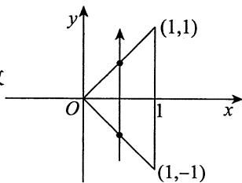

(1) $f_{X}(x) = \int_{-\infty}^{+\infty} f(x, y) \mathrm{d}y = \left\{ \begin{array}{ll} \int_{-x}^{x} \mathrm{d}y = 2x, & 0 \leqslant x \leqslant 1, \\ 0, & \text{其他}. \end{array} \right.$

$$
\begin{array}{l} f _ {Y} (y) = \int_ {- \infty} ^ {+ \infty} f (x, y) \mathrm {d} x = \left\{ \begin{array}{l l} \int_ {- y} ^ {1} \mathrm {d} x = 1 + y, & - 1 \leqslant y <   0, \\ \int_ {y} ^ {1} \mathrm {d} x = 1 - y, & 0 \leqslant y \leqslant 1, \\ 0, & \text {其 他} \end{array} \right. \\ = \left\{ \begin{array}{l l} 1 - | y |, & | y | \leqslant 1, \\ 0, & \text {其 他}. \end{array} \right. \\ f _ {X \mid Y} (x \mid y) = \frac {f (x , y)}{f _ {Y} (y)} = \left\{ \begin{array}{l l} \frac {1}{1 - \left| y \right|}, & | y | <   x \leqslant 1, \\ 0, & \text {其 他 .} \end{array} \right. \\ \end{array}
$$

$$
f _ {Y | X} (y \mid x) = \frac {f (x , y)}{f _ {X} (x)} = \left\{ \begin{array}{l l} \frac {1}{2 x}, & | y | <   x \leqslant 1, \\ 0, & \text {其 他}. \end{array} \right.
$$

由于 $f_{X}(x)f_{Y}(y)\neq f(x,y)$ ，故 $X$ 与 $Y$ 不独立.

$$
\begin{array}{l} P \left\{X > \frac {1}{2} \mid Y > 0 \right\} = \frac {P \left\{X > \frac {1}{2} , Y > 0 \right\}}{P \left\{Y > 0 \right\}} = \frac {\iint_ {x > \frac {1}{2} , y > 0} f (x , y) d x d y}{\iint_ {y > 0} f (x , y) d x d y} \tag {2} \\ = \frac {\int_ {\frac {1}{2}} ^ {1} d x \int_ {0} ^ {x} d y}{\int_ {0} ^ {1} d x \int_ {0} ^ {x} d y} = \frac {\int_ {\frac {1}{2}} ^ {1} x d x}{\int_ {0} ^ {1} x d x} = \frac {\frac {3}{8}}{\frac {1}{2}} = \frac {3}{4}. \\ P \left\{X > \frac {1}{2} \mid Y = \frac {1}{4} \right\} = \int_ {\frac {1}{2}} ^ {+ \infty} f _ {X \mid Y} \left(x \mid y = \frac {1}{4}\right) d x = \int_ {\frac {1}{2}} ^ {1} \frac {1}{1 - \frac {1}{4}} d x = \frac {2}{3}. \\ \end{array}
$$

【注】由于 $f(x,y)$ 在 $(X,Y)$ 的正概率密度区域上为常数，因此可以利用面积计算概率.

11.【解析】如图(a)所示，①当 $x < 0$ 或 $y < 0$ 时， $F(x, y) = 0$ ；

如图(b)所示，②当 $0 \leqslant y < x$ 时，

$$
F (x, y) = \int_ {- \infty} ^ {x} d s \int_ {- \infty} ^ {y} f (s, t) d t = 2 \int_ {0} ^ {y} e ^ {- t} d t \int_ {0} ^ {t} e ^ {- s} d s = 1 - 2 e ^ {- y} + e ^ {- 2 y};
$$

如图(c)所示，③当 $0 \leqslant x \leqslant y$ 时，

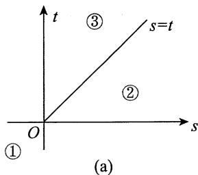

$$
\begin{array}{l} F (x, y) = \int_ {- \infty} ^ {x} d s \int_ {- \infty} ^ {y} f (s, t) d t = 2 \int_ {0} ^ {x} e ^ {- s} d s \int_ {s} ^ {y} e ^ {- t} d t \\ = 1 - 2 \mathrm {e} ^ {- y} - \mathrm {e} ^ {- 2 x} + 2 \mathrm {e} ^ {- (x + y)}. \\ \end{array}
$$

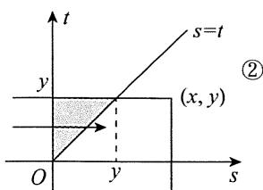  
(b)

  
(c)

于是， $(X,Y)$ 的分布函数为

$$
F (x, y) = \left\{ \begin{array}{l l} {0  ,} & {x <   0 \text {或} y <   0  ,} \\ {1 - 2 \mathrm {e} ^ {- y} + \mathrm {e} ^ {- 2 y}  ,} & {0 \leqslant y <   x  ,} \\ {1 - 2 \mathrm {e} ^ {- y} - \mathrm {e} ^ {- 2 x} + 2 \mathrm {e} ^ {- (x + y)}  ,} & {0 \leqslant x \leqslant y.} \end{array} \right.
$$

12.【解析】由题设知 $(X,Y)$ 的概率密度为

$$
f (x, y) = \left\{ \begin{array}{l l} { \frac {1}{2},} & {0 \leqslant x \leqslant 2, 0 \leqslant y \leqslant 1,} \\ {0,} & {\text {其 他}.} \end{array} \right.
$$

用卷积公式 $f_{Z}(z) = \int_{-\infty}^{+\infty}\frac{1}{|x|} f\left(x,\frac{z}{x}\right)\mathrm{d}x,0 <   z <   x\leqslant 2.$

当 $z \leqslant 0$ 或 $z \geqslant 2$ 时, $f_{Z}(z) = 0$ ;

当 $0 < z < 2$ 时， $f_{Z}(z) = \frac{1}{2} \int_{z}^{2} \frac{1}{x} \, \mathrm{d}x = \frac{1}{2} (\ln 2 - \ln z)$ .

因此 $Z = XY$ 的概率密度为

$$
f _ {Z} \left(z\right) = \left\{ \begin{array}{l l} { \frac {1}{2} \left(\ln 2 - \ln z\right),} & {0 <   z <   2,} \\ {0,} & {\text {其 他}.} \end{array} \right.
$$

【注】本题亦可用分布函数法.

正概率密度区域 $D$ 与所求概率 $F_{Z}(z) = P\{XY \leqslant z\}$ 的积分区域的公共部分有三种不同的组合形式(见图)，于是

当 $z \leqslant 0$ 时， $F_Z(z) = 0$ ；

当 $0 < z < 2$ 时，

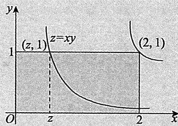

$$
F _ {Z} (z) = \int_ {0} ^ {z} d x \int_ {0} ^ {1} \frac {1}{2} d y + \int_ {z} ^ {2} d x \int_ {0} ^ {\frac {z}{x}} \frac {1}{2} d y = \frac {1}{2} z (1 - \ln z + \ln 2);
$$

当 $z \geqslant 2$ 时， $F_Z(z) = 1$

因此 $Z = XY$ 的概率密度为

$$
f _ {Z} (z) = \left\{ \begin{array}{l l} \frac {1}{2} (\ln 2 - \ln z), & 0 <   z <   2, \\ 0, & \text {其 他}. \end{array} \right.
$$

13.【解析】因为 $X$ 服从二项分布 $B\left(2, \frac{1}{2}\right)$ , 所以 $X$ 的概率分布为

<table><tr><td>X</td><td>0</td><td>1</td><td>2</td></tr><tr><td>P</td><td>1/4</td><td>1/2</td><td>1/4</td></tr></table>

(1)由 $X$ 与 $Y$ 相互独立，得

$$
P \left\{Z \leqslant \frac {5}{2} \mid X > 1 \right\} = P \left\{X + Y \leqslant \frac {5}{2} \mid X = 2 \right\} = P \left\{Y \leqslant \frac {1}{2} \mid X = 2 \right\}
$$

$$
= P \left\{Y \leqslant \frac {1}{2} \right\} = \int_ {- \infty} ^ {\frac {1}{2}} f _ {Y} (y) d y = \int_ {0} ^ {\frac {1}{2}} 4 y ^ {3} d y = \frac {1}{1 6}.
$$

(2) 由分布函数法, 得

$$
\begin{array}{l} F _ {Z} (z) = P \left\{Z \leqslant z \right\} = P \left\{X + Y \leqslant z \right\} \\ = P \left\{X + Y \leqslant z, X = 0 \right\} + P \left\{X + Y \leqslant z, X = 1 \right\} + P \left\{X + Y \leqslant z, X = 2 \right\} \\ = P \left\{Y \leqslant z, X = 0 \right\} + P \left\{Y \leqslant z - 1, X = 1 \right\} + P \left\{Y \leqslant z - 2, X = 2 \right\} \\ = P \left\{Y \leqslant z \right\} P \left\{X = 0 \right\} + P \left\{Y \leqslant z - 1 \right\} P \left\{X = 1 \right\} + P \left\{Y \leqslant z - 2 \right\} P \left\{X = 2 \right\} \\ = \frac {1}{4} F _ {Y} (z) + \frac {1}{2} F _ {Y} (z - 1) + \frac {1}{4} F _ {Y} (z - 2), \\ \end{array}
$$

故 $Z$ 的概率密度为

$$
\begin{array}{l} f _ {Z} (z) = F _ {Z} ^ {\prime} (z) = \frac {1}{4} F _ {Y} ^ {\prime} (z) + \frac {1}{2} F _ {Y} ^ {\prime} (z - 1) + \frac {1}{4} F _ {Y} ^ {\prime} (z - 2) \\ = \frac {1}{4} f _ {Y} (z) + \frac {1}{2} f _ {Y} (z - 1) + \frac {1}{4} f _ {Y} (z - 2) \\ = \left\{ \begin{array}{l l} z ^ {3}, & 0 \leqslant z \leqslant 1, \\ 2 (z - 1) ^ {3}, & 1 <   z \leqslant 2, \\ (z - 2) ^ {3}, & 2 <   z \leqslant 3, \\ 0, & \text {其 他}. \end{array} \right. \\ \end{array}
$$

14.【解析】(1)由 $\int_{-\infty}^{+\infty}f_Y(y)\mathrm{d}y = 1$ ，知 $a\neq 0$ ，且

$$
\int_ {0} ^ {+ \infty} \mathrm {e} ^ {a y} \mathrm {d} y = \frac {1}{a} \mathrm {e} ^ {a y} \left| _ {0} ^ {+ \infty} = \lim  _ {y \rightarrow + \infty} \left(\frac {1}{a} \mathrm {e} ^ {a y} - \frac {1}{a}\right) = 1 \right.,
$$

若成立，必有 $\lim_{y\to +\infty}\frac{1}{a}\mathrm{e}^{ay} = 0$ ，解得 $a = -1$

(2) 由(1)知， $Z = 2X - Y$ ，且 $X, Y$ 相互独立，故

$$
f _ {Z} (z) \stackrel {(*)} {=} \int_ {- \infty} ^ {+ \infty} f _ {X} (x) f _ {Y} (2 x - z) d x,
$$

积分区域为 $\left\{ \begin{array}{l}0 < x < 1,\\ 2x - z > 0, \end{array} \right.$ 即 $\left\{ \begin{array}{l}0 < x < 1,\\ 2x > z, \end{array} \right.$ 如图所示.于是

$$
f _ {Z} (z) = \left\{ \begin{array}{l l} \int_ {0} ^ {1} \mathrm {e} ^ {- (2 x - z)} \mathrm {d} x, & z <   0, \\ \int_ {\frac {z}{2}} ^ {1} \mathrm {e} ^ {- (2 x - z)} \mathrm {d} x, & 0 \leqslant z <   2, \\ 0, & \text {其 他} \end{array} = \left\{ \begin{array}{l l} \frac {1}{2} (1 - \mathrm {e} ^ {- 2}) \mathrm {e} ^ {z}, & z <   0, \\ \frac {1}{2} (1 - \mathrm {e} ^ {z - 2}), & 0 \leqslant z <   2, \\ 0, & \text {其 他}. \end{array} \right. \right.
$$

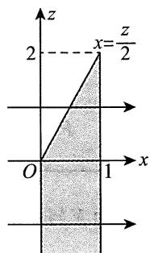

【注】①(*)处来自如下公式.设 $(X,Y)\sim f(x,y)$ ，则 $Z = aX + bY(ab\neq 0)$ 的概率密度为

$$
f _ {Z} (z) = \frac {1}{| a |} \int_ {- \infty} ^ {+ \infty} f \left(\frac {z - b y}{a}, y\right) d y = \frac {1}{| b |} \int_ {- \infty} ^ {+ \infty} f \left(x, \frac {z - a x}{b}\right) d x.
$$

进一步地，若 $X, Y$ 相互独立，且 $X \sim f_{X}(x), Y \sim f_{Y}(y)$ ，则

$$
f _ {Z} (z) = \frac {1}{| a |} \int_ {- \infty} ^ {+ \infty} f _ {X} \left(\frac {z - b y}{a}\right) f _ {Y} (y) d y = \frac {1}{| b |} \int_ {- \infty} ^ {+ \infty} f _ {X} (x) f _ {Y} \left(\frac {z - a x}{b}\right) d x.
$$

这些公式符合如下“口诀”：“积谁不换谁，换完求偏导”。

如 $f_{Z}(z) = \frac{1}{|a|}\int_{-\infty}^{+\infty}f\left(\frac{z - by}{a},y\right)\mathrm{d}y$ 中

先用第一句：“积谁不换谁”.对 $y$ 积分，则不换 $y$ ，写成 $f(\square ,y)$ ，换 $x = \frac{z - by}{a}$ 为 $f\left(\frac{z - by}{a},y\right)$

再用第二句：“换完求偏导” $\frac{\partial\left(\frac{z - by}{a}\right)}{\partial z} = \frac{1}{a}$ 因概率密度非负，要加绝对值，即为 $\frac{1}{|a|}$ 这样便记住了公式.

②考生亦可用分布函数法求 $Z$ 的概率密度，一来检查答案的正确性，二来比较两种方法的繁简.

利用分布函数法.

由题意可知， $X$ 与 $Y$ 的联合概率密度为

$$
f (x, y) = \left\{ \begin{array}{l l} {\mathrm {e} ^ {- y},} & {0 <   x <   1, y > 0,} \\ {0,} & {\text {其 他}.} \end{array} \right.
$$

由 $Z = 2X - Y$ 的分布函数 $F_{Z}(z) = \iint_{2x - y\leqslant z}f(x,y)\mathrm{d}x\mathrm{d}y$ ，可知

当 $z < 0$ 时， $F_Z(z) = \int_0^1 \mathrm{d}x \int_{2x - z}^{+\infty} \mathrm{e}^{-y} \, \mathrm{d}y = \frac{1}{2} (1 - \mathrm{e}^{-2}) \mathrm{e}^z$ ;

当 $0 \leqslant z < 2$ 时， $F_{Z}(z) = \int_{0}^{z} \mathrm{d}x \int_{0}^{+\infty} \mathrm{e}^{-y} \mathrm{d}y + \int_{\frac{z}{2}}^{1} \mathrm{d}x \int_{2x - z}^{+\infty} \mathrm{e}^{-y} \mathrm{d}y = \frac{z}{2} + \frac{1}{2} - \frac{1}{2} \mathrm{e}^{z - 2}$ ;

当 $z \geqslant 2$ 时， $F_Z(z) = 1$

故 $Z = 2X - Y$ 的概率密度为 $f_{Z}(z) = \left\{ \begin{array}{ll} \frac{1}{2} (1 - \mathrm{e}^{-2})\mathrm{e}^{z}, & z < 0,\\ \frac{1}{2} (1 - \mathrm{e}^{z - 2}), & 0\leqslant z < 2,\\ 0, & \text{其他}. \end{array} \right.$

# 第4章 随机变量的数字特征

1.【答案】 $\frac{1}{4} (e^2 + 1)^2$

【解析】因为 $X \sim B\left(2, \frac{1}{2}\right)$ , 所以

$$
\begin{array}{l} E \left(\mathrm {e} ^ {2 X}\right) = \sum_ {k = 0} ^ {2} \mathrm {e} ^ {2 k} \mathrm {C} _ {2} ^ {k} \left(\frac {1}{2}\right) ^ {k} \left(\frac {1}{2}\right) ^ {2 - k} \\ = \sum_ {k = 0} ^ {2} C _ {2} ^ {k} \left(e ^ {2} \cdot \frac {1}{2}\right) ^ {k} \left(\frac {1}{2}\right) ^ {2 - k} \\ = \left(e ^ {2} \cdot \frac {1}{2} + \frac {1}{2}\right) ^ {2} = \frac {1}{4} (e ^ {2} + 1) ^ {2}. \\ \end{array}
$$

2.【答案】(C)

【解析】 $E(Y) = E\left(\max \{X,1\}\right) = \int_{-\infty}^{+\infty}\max \{x,1\} f(x)\mathrm{d}x,$

其中 $f(x) = \left\{ \begin{array}{ll}\mathrm{e}^{-x}, & x > 0,\\ 0, & x\leqslant 0, \end{array} \right.$

即 $E(Y) = \int_{-\infty}^{+\infty}\max \{x,1\} f(x)\mathrm{d}x = \int_{0}^{+\infty}\max \{x,1\} \mathrm{e}^{-x}\mathrm{d}x$

$$
= \int_ {0} ^ {1} e ^ {- x} d x + \int_ {1} ^ {+ \infty} x e ^ {- x} d x = 1 - e ^ {- 1} + 2 e ^ {- 1} = 1 + e ^ {- 1}.
$$

故选(C).

3.【答案】(A)

【解析】根据概率密度 $f(x)$ 的归一性知，题图(a)中的 $X_{1}$ 的概率密度为

$$
f _ {1} (x) = \left\{ \begin{array}{l l} 1 + x, & - 1 \leqslant x <   0, \\ 1 - x, & 0 \leqslant x \leqslant 1, \\ 0, & \text {其 他}. \end{array} \right.
$$

题图(b)中的 $X_{2}$ 的概率密度为

$$
f _ {2} (x) = \left\{ \begin{array}{l l} \frac {1}{2}, & - 1 <   x <   1, \\ 0, & \text {其 他}. \end{array} \right.
$$

题图(c)中的 $X_{3}$ 的概率密度为

$$
f _ {3} (x) = \left\{ \begin{array}{l l} {- x,} & {- 1 <   x <   0,} \\ {x,} & {0 \leqslant x <   1,} \\ {0,} & {\text {其 他}.} \end{array} \right.
$$

因此有

$$
E \left(X _ {1}\right) = \int_ {- 1} ^ {0} x (1 + x) d x + \int_ {0} ^ {1} x (1 - x) d x = 0,
$$

$$
E \left(X _ {1} ^ {2}\right) = \int_ {- 1} ^ {0} x ^ {2} (1 + x) d x + \int_ {0} ^ {1} x ^ {2} (1 - x) d x = \frac {1}{6},
$$

$$
D \left(X _ {1}\right) = E \left(X _ {1} ^ {2}\right) - \left[ E \left(X _ {1}\right) \right] ^ {2} = \frac {1}{6}.
$$

同理， $E(X_{2}) = 0$ ， $E(X_{2}^{2}) = \frac{1}{3}$ ， $D(X_{2}) = \frac{1}{3}$ ； $E(X_{3}) = 0$ ， $E(X_{3}^{2}) = \frac{1}{2}$ ， $D(X_{3}) = \frac{1}{2}$

所以 $D(X_{1}) < D(X_{2}) < D(X_{3})$

# 4.【答案】(D)

【解析】由题设知， $P\{X = k\} = p(1 - p)^{k - 1},k = 1,2,3,\dots$ ，因此有

$$
E \left(\frac {1}{X}\right) = \sum_ {k = 1} ^ {\infty} \frac {1}{k} \left. p (1 - p) ^ {k - 1} = \frac {p}{1 - p} \sum_ {k = 1} ^ {\infty} \frac {1}{k} (1 - p) ^ {k} = \frac {p}{1 - p} \sum_ {k = 1} ^ {\infty} \frac {1}{k} x ^ {k} \right| _ {x = 1 - p}.
$$

令 $S(x) = \sum_{k=1}^{\infty} \frac{1}{k} x^{k}$ , 则 $S'(x) = \sum_{k=1}^{\infty} x^{k-1} = \frac{1}{1-x} (|x| < 1)$ , 从而有

$$
S (x) = S (0) + \int_ {0} ^ {x} \frac {1}{1 - t} d t = - \ln (1 - x) (- 1 \leqslant x <   1),
$$

故 $S(1 - p) = -\ln p$ ，于是 $E\left(\frac{1}{X}\right) = -\frac{p\ln p}{1 - p}$

# 5.【答案】(B)

【解析】此为超几何分布模型， $N = 10,M = 7,n = 3$ ，故 $E(X) = \frac{nM}{N} = \frac{3\times 7}{10} = \frac{21}{10}$

【注】要记住这一结论：超几何分布的数学期望 $E(X) = \frac{nM}{N}$ . 可以这样记， $p = \frac{M}{N}$ ，则 $E(X) = np$ ，与二项分布 $X - B(n, p)$ 的 $E(X) = np$ 在形式上一样，但要注意，超几何分布的 $E(X) = n \cdot \frac{M}{N}$ 是用组合恒等式经过计算化简得来的.

6.【答案】 $\frac{1}{3}$

【解析】由题意知， $E(X) = \int_0^1 xf(x)\mathrm{d}x = \int_0^1 2x^2\mathrm{d}x = \frac{2}{3}$

由 $F(x) = \int_{-\infty}^{x}f(t)\mathrm{d}t$ ，得 $F(x) = \left\{ \begin{array}{ll}0, & x <   0,\\ x^2, & 0\leqslant x <   1,\\ 1, & x\geqslant 1. \end{array} \right.$

从而， $P\left\{F(X) > E(X)\right\} = P\left\{X^2 > \frac{2}{3}\right\} = 1 - P\left\{-\sqrt{\frac{2}{3}} \leqslant X \leqslant \sqrt{\frac{2}{3}}\right\}$

$$
= 1 - P \left\{0 \leqslant X \leqslant \sqrt {\frac {2}{3}} \right\} = 1 - \int_ {0} ^ {\sqrt {\frac {2}{3}}} 2 x d x = \frac {1}{3}.
$$

7.【答案】 $\left|\mathrm{e}^{-1} - \mathrm{e}^{-\frac{1}{\lambda}}\right|$

【解析】由 $X$ 服从参数为 $\lambda$ 的指数分布，知 $E(X) = \frac{1}{\lambda}, D(X) = \frac{1}{\lambda^2}$ .

当 $\lambda < 1$ 时，所求概率为 $P\left\{\frac{1}{\lambda} < X < \frac{1}{\lambda^2}\right\} = \int_{\frac{1}{\lambda}}^{\frac{1}{\lambda^2}} \lambda \mathrm{e}^{-\lambda x} \, \mathrm{d}x \stackrel{t = \lambda x}{=} \int_{1}^{\frac{1}{\lambda}} \mathrm{e}^{-t} \, \mathrm{d}t = \mathrm{e}^{-1} - \mathrm{e}^{-\frac{1}{\lambda}}$

当 $\lambda \geqslant 1$ 时，所求概率为 $P\left\{\frac{1}{\lambda^2} < X < \frac{1}{\lambda}\right\} = \int_{\frac{1}{\lambda^2}}^{\frac{1}{\lambda}} \lambda \mathrm{e}^{-\lambda x} \, \mathrm{d}x \stackrel{t = \lambda x}{=} \int_{\frac{1}{\lambda}}^{1} \mathrm{e}^{-t} \, \mathrm{d}t = \mathrm{e}^{-\frac{1}{\lambda}} - \mathrm{e}^{-1}$ .

综上可知， $X$ 落在 $E(X)$ 和 $D(X)$ 之间的概率为 $\left|\mathrm{e}^{-1} - \mathrm{e}^{-\frac{1}{\lambda}}\right|$

8.【解析】设所投两点为 $X_{1}$ 和 $X_{2}$ ，显然 $(X_{1}, X_{2})$ 在正方形区域 $0 < x_{1} < 1, 0 < x_{2} < 1$ 上服从均匀分布，即有 $X_{1}$ 和 $X_{2}$ 的联合概率密度为

$$
f (x _ {1}, x _ {2}) = \left\{ \begin{array}{l l} 1, & 0 <   x _ {1} <   1, 0 <   x _ {2} <   1, \\ 0, & \text {其 他}. \end{array} \right.
$$

由题设，距离为 $X = \left|X_{1} - X_{2}\right|$

(1) 如图所示，当 $x \leqslant 0$ 时， $F(x) = P\{X \leqslant x\} = 0$ ；

当 $x \geqslant 1$ 时， $F(x) = P\{X \leqslant x\} = 1$ ；

当 $0 < x < 1$ 时，

$$
\begin{array}{l} F (x) = P \left\{X \leqslant x \right\} = P \left\{\left| X _ {1} - X _ {2} \right| \leqslant x \right\} \\ = \iint_ {\substack {| x _ {1} - x _ {2} | \leqslant x \\ 0 <   x _ {1}, x _ {2} <   1}} \mathrm {d} x _ {1} \mathrm {d} x _ {2} = 1 - (1 - x) ^ {2} = 2 x - x ^ {2}. \\ \end{array}
$$

所以 $F(x) = \left\{ \begin{array}{ll}0, & x\leqslant 0,\\ 2x - x^2, & 0 <   x <   1,f(x) = \left\{ \begin{array}{ll}2 - 2x, & 0 <   x <   1,\\ 0, & \text{其他}. \end{array} \right. \end{array} \right.$

(2) $E(X) = \int_{-\infty}^{+\infty} x f(x) \, \mathrm{d}x = \int_{0}^{1} x (2 - 2x) \, \mathrm{d}x = \left(x^2 - \frac{2}{3} x^3\right)\bigg|_{0}^{1} = \frac{1}{3}$ .

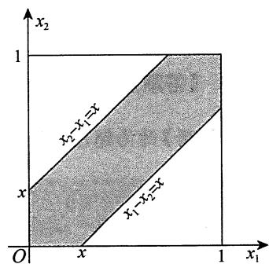

9.【解析】(1) $f(x) = A\mathrm{e}^{x(B - x)} = A\mathrm{e}^{-x^2 + Bx} = A\mathrm{e}^{\frac{B^2}{4}}\mathrm{e}^{-\left(x - \frac{B}{2}\right)^2}$ ，可以将 $f(x)$ 看成正态分布 $N\left(\frac{B}{2}, \frac{1}{2}\right)$ 的概率密度，则有 $X \sim N\left(\frac{B}{2}, \frac{1}{2}\right)$ ，且 $E(X) = 2D(X)$ ，得到 $E(X) = \frac{B}{2} = 2D(X) = 1$ ，即 $B = 2$ 。

又 $A\mathrm{e}^{\frac{B^{2}}{4}} = \frac{1}{\sqrt{2\pi}\sigma}$ 故 $A\mathrm{e} = \frac{1}{\sqrt{2\pi}\cdot\sqrt{\frac{1}{2}}} = \frac{1}{\sqrt{\pi}}$ 解得 $A = \frac{\mathrm{e}^{-1}}{\sqrt{\pi}}$

综上， $A = \frac{\mathrm{e}^{-1}}{\sqrt{\pi}}$ ， $B = 2$ ：

(2) $E(X^{2} + \mathrm{e}^{X}) = E(X^{2}) + E(\mathrm{e}^{X}),$

又 $E(X^{2}) = D(X) + [E(X)]^{2} = \frac{1}{2} + 1 = \frac{3}{2},$

$$
\begin{array}{l} E \left(\mathrm {e} ^ {X}\right) = \int_ {- \infty} ^ {+ \infty} \mathrm {e} ^ {x} f (x) \mathrm {d} x = \int_ {- \infty} ^ {+ \infty} \mathrm {e} ^ {x} \frac {1}{\sqrt {\pi}} \mathrm {e} ^ {- (x - 1) ^ {2}} \mathrm {d} x = \frac {1}{\sqrt {\pi}} \int_ {- \infty} ^ {+ \infty} \mathrm {e} ^ {- x ^ {2} + 3 x - 1} \mathrm {d} x \\ = \frac {1}{\sqrt {\pi}} \int_ {- \infty} ^ {+ \infty} e ^ {- \left(x - \frac {3}{2}\right) ^ {2}} \cdot e ^ {\frac {5}{4}} d x = e ^ {\frac {5}{4}} \int_ {- \infty} ^ {+ \infty} \frac {1}{\sqrt {\pi}} e ^ {- \left(x - \frac {3}{2}\right) ^ {2}} d x = e ^ {\frac {5}{4}}, \\ \end{array}
$$

所以 $E(X^{2} + \mathrm{e}^{X}) = \frac{3}{2} +\mathrm{e}^{\frac{5}{4}}$

(3) 由(1)知 $X \sim N\left(1, \frac{1}{2}\right)$ , 故 $(X - 1) \sim N\left(0, \frac{1}{2}\right)$ , $\sqrt{2}(X - 1) \sim N(0, 1)$ , 所以当 $y \geqslant 0$ 时,

$$
\begin{array}{l} F (y) = P \left\{Y \leqslant y \right\} = P \left\{\left| \sqrt {2} (X - 1) \right| \leqslant y \right\} = P \left\{- y \leqslant \sqrt {2} (X - 1) \leqslant y \right\} \\ = \int_ {- y} ^ {y} \frac {1}{\sqrt {2 \pi}} e ^ {- \frac {x ^ {2}}{2}} d x = 2 \int_ {0} ^ {y} \frac {1}{\sqrt {2 \pi}} e ^ {- \frac {x ^ {2}}{2}} d x = 2 \Phi (y) - 1, \\ \end{array}
$$

其中 $\Phi (y)$ 为标准正态分布的分布函数.

当 $y < 0$ 时， $F(y) = 0$

综上， $F(y) = \left\{ \begin{array}{ll}2\varPhi (y) - 1, & y\geqslant 0,\\ 0, & \text{其他}. \end{array} \right.$

# 10.【答案】(D)

【解析】因为 $X, Y$ 是两个相互独立且均服从正态分布 $N\left(0, \left(\frac{1}{\sqrt{2}}\right)^2\right)$ 的随机变量，故 $Z = X - Y$ 也服从正态分布。由

$$
E (Z) = E (X) - E (Y) = 0, D (Z) = D (X) + D (Y) = \frac {1}{2} + \frac {1}{2} = 1,
$$

知 $Z\sim N(0,1)$ .于是

$$
E \left(\left| X - Y \right|\right) = \frac {1}{\sqrt {2 \pi}} \int_ {- \infty} ^ {+ \infty} | z | e ^ {- \frac {1}{2} z ^ {2}} d z = \frac {2}{\sqrt {2 \pi}} \int_ {0} ^ {+ \infty} z e ^ {- \frac {1}{2} z ^ {2}} d z = - \left. \frac {2}{\sqrt {2 \pi}} e ^ {- \frac {1}{2} z ^ {2}} \right| _ {0} ^ {+ \infty} = \sqrt {\frac {2}{\pi}},
$$

应选(D).

11.【答案】(C)

【解析】方法一 由题知，随机变量 $X$ 与 $Y$ 的联合概率密度为 $f(x,y) = \left\{ \begin{array}{ll}\mathrm{e}^{-x - y}, & x > 0,y > 0,\\ 0, & \text{其他}, \end{array} \right.$ 故

$$
\begin{array}{l} E (Z) = \int_ {0} ^ {+ \infty} d y \int_ {0} ^ {y} (y - 1) e ^ {- x - y} d x + \int_ {0} ^ {+ \infty} d x \int_ {0} ^ {x} 2 x e ^ {- x - y} d y \\ = \int_ {0} ^ {+ \infty} (y - 1) e ^ {- y} (1 - e ^ {- y}) d y + \int_ {0} ^ {+ \infty} 2 x e ^ {- x} (1 - e ^ {- x}) d x \\ = \int_ {0} ^ {+ \infty} (3 y - 1) \left(\mathrm {e} ^ {- y} - \mathrm {e} ^ {- 2 y}\right) \mathrm {d} y = \frac {7}{4}. \\ \end{array}
$$

方法二 当 $X = x$ 时， $Z = \begin{cases} 2x, & x \geqslant Y, \\ Y - 1, & x < Y \end{cases}$ 是 $Y$ 的函数.

$$
E (Z \mid X = x) = \int_ {0} ^ {x} 2 x \mathrm {e} ^ {- y} \mathrm {d} y + \int_ {x} ^ {+ \infty} (y - 1) \mathrm {e} ^ {- y} \mathrm {d} y = 2 x \left(1 - \mathrm {e} ^ {- x}\right) + x \mathrm {e} ^ {- x} = 2 x - x \mathrm {e} ^ {- x},
$$

则 $E(Z) = E\left[E(Z|X)\right] = E(2X - X\mathrm{e}^{-X}) = 2E(X) - E(X\mathrm{e}^{-X}) = 2 - \frac{1}{4} = \frac{7}{4}$ .

【注】方法二中使用了亚当夏娃公式，公式的推导运用了全集分解思想.

① $E(Y \mid X = x)$ 是 $X = x$ 条件下 $Y$ 的条件期望, 则 $Y$ 的期望为随机变量 $E(Y \mid X)$ 的期望, 即亚当公式:

$$
E (Y) = E \left[ E (Y \mid X) \right].
$$

② $D(Y \mid X = x)$ 是 $X = x$ 条件下 $Y$ 的条件方差, 则 $Y$ 的方差为随机变量 $D(Y \mid X)$ 的期望加上随机变量 $E(Y \mid X)$ 的方差, 即夏娃公式:

$$
D (Y) = E \left[ D (Y \mid X) \right] + D \left[ E (Y \mid X) \right].
$$

12.【答案】(A)

【解析】由题知 $X \sim B\left(2, \frac{1}{3}\right)$ , $Y \sim B\left(2, \frac{1}{3}\right)$ . 设 $Z$ 表示 2 次试验中结果 $A_{3}$ 发生的次数, 则 $Z \sim B\left(2, \frac{1}{3}\right)$ . 又 $X + Y + Z = 2$ , 于是 $X + Y = 2 - Z$ . 根据二项分布的性质, 知 $X + Y \sim B\left(2, \frac{2}{3}\right)$ .

从而 $D(X) = D(Y) = \frac{4}{9}$ , $D(X + Y) = \frac{4}{9}$ . 由 $D(X + Y) = D(X) + D(Y) + 2\operatorname{Cov}(X, Y)$ , 可得 $\operatorname{Cov}(X, Y) = -\frac{2}{9}$ , 所以 $X$ 与 $Y$ 的相关系数为 $\rho_{XY} = \frac{\operatorname{Cov}(X, Y)}{\sqrt{D(X)} \cdot \sqrt{D(Y)}} = -\frac{1}{2}$ .

【注】由 $P(A_{1}) = P(A_{2}) = P(A_{3}) = \frac{1}{3}$ 得 $X\sim B\left(2,\frac{1}{3}\right)$ ， $Y\sim B\left(2,\frac{1}{3}\right)$ . $X$ 与 $Y$ 的相关系数为 $\rho_{XY} = \frac{\operatorname{Cov}(X,Y)}{\sqrt{D(X)}\bullet\sqrt{D(Y)}}$ 显然 $E(X) = E(Y) = \frac{2}{3},D(X) = D(Y) = 2\times \frac{1}{3}\times \frac{2}{3} = \frac{4}{9}$ 易知 $\operatorname {Cov}(X,Y) =$ $E(XY) - E(X)E(Y)$ ，为求 $E(XY)$ ，先求出 $XY$ 的分布律.

$X$ 和 $Y$ 的可能取值均为0,1,2，且由题意可知 $X + Y\leqslant 2$ ，所以 $XY$ 的可能取值应为0,1.

$$
P \left\{X Y = 1 \right\} = P \left\{X = 1, Y = 1 \right\} = 2 \times \frac {1}{3} \times \frac {1}{3} = \frac {2}{9}, P \left\{X Y = 0 \right\} = 1 - \frac {2}{9} = \frac {7}{9}.
$$

故 $XY$ 的分布律为

<table><tr><td>XY</td><td>0</td><td>1</td></tr><tr><td>P</td><td>7/9</td><td>2/9</td></tr></table>

得 $E(XY) = \frac{2}{9}$ ，故

$$
\operatorname {C o v} (X, Y) = E (X Y) - E (X) E (Y) = \frac {2}{9} - \frac {2}{3} \times \frac {2}{3} = - \frac {2}{9},
$$

$$
\rho_ {X Y} = \frac {\operatorname {C o v} (X , Y)}{\sqrt {D (X)} \sqrt {D (Y)}} = \frac {- \frac {2}{9}}{\frac {2}{3} \times \frac {2}{3}} = - \frac {1}{2}.
$$

# 13.【答案】(B)

【解析】方法一 由随机变量的方差的性质 $D(X + Y) = D(X) + D(Y) + 2\operatorname{Cov}(X,Y)$ ，可知 $D(X + Y) = D(X) + D(Y)$ 的充分必要条件是 $\operatorname{Cov}(X,Y) = 0$ ，即 $X$ 和 $Y$ 不相关。故选项(B)正确，选项(A)错误。

方法二 排除法. 由 $D(X + Y) = D(X) + D(Y) + 2\operatorname{Cov}(X, Y)$ , 可知 $\operatorname{Cov}(X, Y) = 0$ 是 $D(X + Y) = D(X) + D(Y)$ 的充分必要条件, 选项(A)不成立. 而 $\operatorname{Cov}(X, Y) = 0$ 时 $X$ 和 $Y$ 未必独立, 例如, 设 $X$ 和 $Y$ 的联合分布是圆域 $x^2 + y^2 \leqslant 1$ 上的均匀分布, 由对称性知 $X$ 和 $Y$ 不相关, 但是 $X$ 和 $Y$ 不独立, 排除选项(C)和(D). 故只有(B)是正确选项.

【注】方法二中，例中的 $X$ 和 $Y$ 不相关和不独立的证明，可参考强化篇第6章第16题.

# 14.【答案】(B)

【解析】由 $X$ 与 $\left|X - c\right|$ 不相关，得

$$
\operatorname {C o v} (X, | X - c |) = E (X | X - c |) - E (X) \cdot E (| X - c |) = 0. \tag {*}
$$

由题设知，随机变量 $X$ 的概率密度为 $f(x) = \left\{ \begin{array}{ll} \frac{1}{4}, & 0 < x < 4, \\ 0, & \text{其他}, \end{array} \right.$ 故 $E(X) = 2$ ，且

$$
E \left(\left| X - c \right|\right) = \int_ {0} ^ {4} \left| x - c \right| f (x) d x = \frac {1}{4} \int_ {0} ^ {c} (c - x) d x + \frac {1}{4} \int_ {c} ^ {4} (x - c) d x = \frac {c ^ {2}}{4} - c + 2,
$$

$$
E (X \mid X - c |) = \int_ {0} ^ {4} x \left| x - c \right| f (x) d x = \frac {1}{4} \int_ {0} ^ {c} x (c - x) d x + \frac {1}{4} \int_ {c} ^ {4} x (x - c) d x = \frac {c ^ {3}}{1 2} - 2 c + \frac {1 6}{3}.
$$

将上述期望代入 $(^{*})$ 式，化简得 $c^3 -6c^2 +16 = 0$ ，又 $c\in [0,4]$ ，解得 $c = 2$ ：

# 15.【答案】(D)

【解析】由题设可得

$$
P \left\{Z _ {1} = - 1 \right\} = P \left\{Z _ {2} = - 1 \right\} = P \left\{X = - 1, Y = 1 \right\} + P \left\{X = 1, Y = - 1 \right\} = \frac {1}{2},
$$

$$
P \left\{Z _ {1} = 1 \right\} = P \left\{Z _ {2} = 1 \right\} = P \left\{X = 1, Y = 1 \right\} + P \left\{X = - 1, Y = - 1 \right\} = \frac {1}{2},
$$

所以 $P\left\{Z_{1} = 1,Z_{2} = -1\right\} = 0\neq P\left\{Z_{1} = 1\right\} P\left\{Z_{2} = -1\right\} ,$

故选项(B)，(C)错误.

对 $a, b \in \{-1, 1\}$ , 有

$$
P \left\{Z _ {2} = a, X = b \right\} = P \left\{\frac {X}{Y} = a, X = b \right\} = P \left\{X = b, Y = \frac {b}{a} \right\} = P \left\{X = b \right\} P \left\{Y = \frac {b}{a} \right\} = \frac {1}{4},
$$

$$
P \left\{Z _ {2} = a \right\} P \left\{X = b \right\} = \frac {1}{2} \times \frac {1}{2} = \frac {1}{4},
$$

但 $P\{X = -1,Y = 1,Z_2 = 1\} = 0\neq P\{X = -1\} P\{Y = 1\} P\{Z_2 = 1\}$

所以 $X, Y, Z_{2}$ 不相互独立. 同理， $X, Y, Z_{1}$ 也不相互独立. 故选项(A)错误，选项(D)正确.

# 16.【答案】(D)

【解析】方法一 由于

$$
D (X + Y) = D (X - Y),
$$

因此 $D(X) + D(Y) + 2\operatorname{Cov}(X,Y) = D(X) + D(Y) - 2\operatorname{Cov}(X,Y),$

则 $\operatorname{Cov}(X, Y) = E(XY) - E(X)E(Y) = 0, E(XY) = E(X)E(Y),$

可见(D)是正确选项.

方法二 排除法. 不难验证选项(A), (B) 和(C)都不成立. 虽然 $X$ 和 $Y$ 不相关是

$$
D (X + Y) = D (X - Y) = D (X) + D (Y)
$$

的充分必要条件, 但是当 $X$ 和 $Y$ 不相关时, $X$ 和 $Y$ 未必独立, 因此选项(A)的结论一般不成立. 显然选项(C)也不成立. 为说明选项(B)不成立, 只需举一反例. 设 $X$ 和 $Y$ 均服从参数为 $p(0 < p < 1)$ 的 0-1 分布且相互独立, 从而 $D(X + Y) = D(X - Y)$ , 且 $D(X) = D(Y) = p(1 - p)$ .

<!-- ===== 第 2 部分 开始 ===== -->

由于 $P\{XY = 1\} = P\{X = 1, Y = 1\} = p^2, P\{XY = 0\} = 1 - p^2,$

因此 $XY$ 服从参数为 $p^2$ 的0-1分布，且

$$
D (X Y) = p ^ {2} (1 - p ^ {2}) \neq p ^ {2} (1 - p) ^ {2} = D (X) D (Y),
$$

可见选项(B)不成立. 故选项(A), (B)和(C)都不成立, 只有(D)是正确选项.

【注】因为 $X$ 和 $Y$ 是任意随机变量，所以选项(A)和(C)并不是非此即彼的.

# 17.【答案】(C)

【解析】 $\operatorname {Cov}(Y_1,Y_2) = \operatorname {Cov}(X_1\cos \alpha +X_2\sin \alpha ,X_1(-\sin \alpha) + X_2\cos \alpha)$

$$
\begin{array}{l} = \cos \alpha \cdot (- \sin \alpha) \cdot D \left(X _ {1}\right) + \left(\cos^ {2} \alpha - \sin^ {2} \alpha\right) \operatorname {C o v} \left(X _ {1}, X _ {2}\right) + \cos \alpha \cdot \sin \alpha \cdot D \left(X _ {2}\right) \\ = \cos \alpha \cdot \sin \alpha \left(\sigma_ {2} ^ {2} - \sigma_ {1} ^ {2}\right) + \rho \sigma_ {1} \sigma_ {2} \left(\cos^ {2} \alpha - \sin^ {2} \alpha\right) = \frac {1}{2} \left(\sigma_ {2} ^ {2} - \sigma_ {1} ^ {2}\right) \sin 2 \alpha + \rho \sigma_ {1} \sigma_ {2} \cos 2 \alpha \\ = \cos 2 \alpha \left[ \frac {1}{2} \left(\sigma_ {2} ^ {2} - \sigma_ {1} ^ {2}\right) \tan 2 \alpha + \rho \sigma_ {1} \sigma_ {2} \right] = 0. \\ \end{array}
$$

由 $\cos 2\alpha \neq 0$ ，有 $\frac{1}{2} (\sigma_2^2 -\sigma_1^2)\tan 2\alpha = -\rho \sigma_1\sigma_2$ ，即 $\tan 2\alpha = 2\rho \frac{\sigma_1\sigma_2}{\sigma_1^2 - \sigma_2^2}$ ，选(C).

# 18.【答案】(B)

【解析】由题设，有 $P\{Y = -aX\} = 1$ ，即当 $a > 0$ 时， $\rho = -1$ ；当 $a < 0$ 时， $\rho = 1$ .故 $\rho = -\frac{a}{|a|}$ ，选(B).

【注】具体计算如下：

$$
\operatorname {C o v} (X, Y) = \operatorname {C o v} (X, - a X) = - a D (X),
$$

$$
D (Y) = D (- a X) = a ^ {2} D (X),
$$

$$
\rho = \frac {\operatorname {C o v} (X , Y)}{\sqrt {D (X)} \sqrt {D (Y)}} = \frac {- a D (X)}{\sqrt {D (X)} \cdot | a | \sqrt {D (X)}} = - \frac {a}{| a |}.
$$

19.【答案】 $\frac{\sqrt{3}}{2}$

【解析】由于 $X \sim P(\lambda)$ , $Y \sim P(\lambda)$ , $\rho_{XY} = -\frac{1}{2}$ , 因此 $D(X) = D(Y) = \lambda$ ，且

$$
\begin{array}{l} D (U) = D (2 X + Y) = D (2 X) + D (Y) + 2 \operatorname {C o v} (2 X, Y) = 4 D (X) + D (Y) + 4 \operatorname {C o v} (X, Y) \\ = 4 D (X) + D (Y) + 4 \rho_ {X Y} \sqrt {D (X)} \sqrt {D (Y)} = 5 \lambda - 2 \lambda = 3 \lambda , \\ \operatorname {C o v} (U, X) = \operatorname {C o v} (2 X + Y, X) = 2 \operatorname {C o v} (X, X) + \operatorname {C o v} (Y, X) \\ = 2 D (X) + \rho_ {X Y} \sqrt {D (X)} \sqrt {D (Y)} = 2 \lambda - \frac {1}{2} \lambda = \frac {3}{2} \lambda . \\ \end{array}
$$

于是， $\rho_{UX} = \frac{\operatorname{Cov}(U,X)}{\sqrt{D(U)}\sqrt{D(X)}} = \frac{\frac{3}{2}\lambda}{\sqrt{3\lambda}\sqrt{\lambda}} = \frac{\sqrt{3}}{2}.$

20.【解析】(1) $P\{Z = 0\} = P\{X = 0,Y = 0\} +P\{X = 1,Y = 1\} = p^2 +q^2,$

$$
P \left\{Z = 1 \right\} = P \left\{X = 0, Y = 1 \right\} + P \left\{X = 1, Y = 0 \right\} = 2 p q ,
$$

故 $Z\sim \left( \begin{array}{cc}0 & 1\\ p^2 +q^2 & 2pq \end{array} \right).$

又 $P\{XZ = 0\} = P\{X = 0,Z = 0\} +P\{X = 0,Z = 1\} +P\{X = 1,Z = 0\}$

$$
\begin{array}{l} = P \left\{X = 0, Y = 0 \right\} + P \left\{X = 0, Y = 1 \right\} + P \left\{X = 1, Y = 1 \right\} \\ = p ^ {2} + p q + q ^ {2}, \\ P \left\{X Z = 1 \right\} = P \left\{X = 1, Z = 1 \right\} = P \left\{X = 1, Y = 0 \right\} = p q , \\ \end{array}
$$

故 $XZ\sim \left( \begin{array}{cc}0 & 1\\ p^2 +pq + q^2 & pq \end{array} \right).$

(2) 由(1)知， $E(X) = q$ ， $E(Z) = 2pq$ ， $E(XZ) = pq$ ，故

$$
\operatorname {C o v} (X, Z) = E (X Z) - E (X) E (Z) = p q (1 - 2 q) = p (1 - p) (2 p - 1).
$$

由于 $0 < p < 1$ ，故当 $p \neq \frac{1}{2}$ 时， $\operatorname{Cov}(X, Z) \neq 0$ ， $X$ 和 $Z$ 相关.

21.【解析】(1) $Z$ 的分布函数为

$$
\begin{array}{l} F _ {Z} (z) = P \left\{Z \leqslant z \right\} = P \left\{X Y \leqslant z \mid X = - 1 \right\} P \left\{X = - 1 \right\} + P \left\{X Y \leqslant z \mid X = 0 \right\} P \left\{X = 0 \right\} + \\ P \left\{X Y \leqslant z \mid X = 1 \right\} P \left\{X = 1 \right\} \\ = p \cdot P \left\{Y \geqslant - z \right\} + p \cdot P \left\{z \geqslant 0 \right\} + (1 - 2 p) \cdot P \left\{Y \leqslant z \right\}. \\ \end{array}
$$

① 当 $z < 0$ 时， $F_Z(z) = p \cdot \int_{-z}^{+\infty} \mathrm{e}^{-y} \, \mathrm{d}y = p \mathrm{e}^z$ ;

② 当 $z \geqslant 0$ 时， $F_Z(z) = 2p + (1 - 2p) \cdot \int_0^z e^{-y} dy = 2p + (1 - e^{-z})(1 - 2p) = 1 - e^{-z} + 2pe^{-z}$ .

故 $Z$ 的概率密度为 $f_{Z}(z) = \left\{ \begin{array}{ll}(1 - 2p)\mathrm{e}^{-z}, & z\geqslant 0,\\ pe^{z}, & z <   0. \end{array} \right.$

(2) $\operatorname{Cov}(Y,Z) = E(YZ) - E(Y)E(Z) = E(XY^2) - E(Y)\cdot E(XY)$

$$
\begin{array}{l} = E (X) E \left(Y ^ {2}\right) - E (X) \cdot \left[ E (Y) \right] ^ {2} \\ = E (X) \cdot D (Y) = (1 - 3 p) \cdot 1 = 1 - 3 p, \\ \end{array}
$$

因为 $Y$ 与 $Z$ 不相关，所以 $\operatorname{Cov}(Y,Z) = 0$ ，得 $p = \frac{1}{3}$

# 第5章 大数定律与中心极限定理

1.【答案】 $\frac{1}{2}$

【解析】本题主要考查辛钦大数定律. 由题设, $X_{i}(i = 1,2,\dots ,n,\dots)$ 均服从参数为2的指数分布, 因此,

$$
E \left(X _ {i} ^ {2}\right) = D \left(X _ {i}\right) + \left[ E \left(X _ {i}\right) \right] ^ {2} = \frac {2}{\lambda^ {2}} = \frac {1}{2}.
$$

根据辛钦大数定律, 若 $X_{1}, X_{2}, \cdots, X_{n}, \cdots$ 独立同分布且具有相同的数学期望, 即 $E(X_{i}) = \mu$ ,

则对任意的正数 $\varepsilon$ ，有 $\lim_{n\to \infty}P\left\{\left|\frac{1}{n}\sum_{i = 1}^{n}X_{i} - \mu \right| <   \varepsilon \right\} = 1,$

从而，有 $\lim_{n\to \infty}P\left\{\left|\frac{1}{n}\sum_{i = 1}^{n}X_i^2 -\frac{1}{2}\right| <   \varepsilon \right\} = 1,$

即 $Y_{n} = \frac{1}{n}\sum_{i = 1}^{n}X_{i}^{2}$ 依概率收敛于 $\frac{1}{2}$

2.【答案】 $\frac{1}{2}$

【解析】由题意知， $X_{1}, X_{2}, \dots, X_{n}, \dots$ 相互独立且同分布，故 $Y_{k} = \cos (kX_{k})(k = 1,2,\dots,n,\dots)$ 也相互独立，方差存在且一致有界。又

$$
E \left(Y _ {k} ^ {2}\right) = \int_ {- \pi} ^ {\pi} \left[ \cos (k x) \right] ^ {2} \frac {1}{2 \pi} d x = \frac {1}{2 k \pi} \int_ {- k \pi} ^ {k \pi} \cos^ {2} t d t = \frac {2 k \cdot 2}{2 k \pi} \int_ {0} ^ {\frac {\pi}{2}} \cos^ {2} t d t = \frac {2}{\pi} \cdot \frac {1}{2} \cdot \frac {\pi}{2} = \frac {1}{2},
$$

故由切比雪夫大数定律知， $\frac{1}{n}\sum_{k = 1}^{n}Y_k^2$ 依概率收敛于 $\frac{1}{n}\sum_{k = 1}^{n}E(Y_k^2)$ ，即 $\frac{1}{2}$

3.【答案】(C)

【解析】由于 $X_{i}\sim U[1,4]$ ，故 $E(X_{i}) = \frac{5}{2},D(X_{i}) = \frac{3}{4} (i = 1,2,\dots ,n,\dots)$ .由中心极限定理知

$$
\lim  _ {n \rightarrow \infty} P \left\{\frac {\sum_ {i = 1} ^ {n} X _ {i} - n \cdot \frac {5}{2}}{\sqrt {n} \cdot \frac {\sqrt {3}}{2}} \leqslant t \right\} = \Phi (t),
$$

即 $\lim_{n\to \infty}P\left\{\frac{2\sum_{i = 1}^{n}X_i - 5n}{\sqrt{n}}\leqslant \sqrt{3} t\right\} = \Phi (t).$

令 $\sqrt{3} t = x$ ，则 $t = \frac{x}{\sqrt{3}}$ ，从而

$$
\lim  _ {n \rightarrow \infty} P \left\{\frac {2 \sum_ {i = 1} ^ {n} X _ {i} - 5 n}{\sqrt {n}} \leqslant x \right\} = \Phi \left(\frac {x}{\sqrt {3}}\right).
$$

# 4.【答案】(C)

【解析】记 $X_{i}$ 为生产第 $i$ 件产品的时间(单位：分钟), $i = 1,2,\dots ,100$

由题设， $E(X_{i}) = 10, D(X_{i}) = 100$ ，记生产100件产品总共使用的时间为 $X$ ，则 $X = \sum_{i=1}^{100} X_{i}$ ，由中心极限定理知， $X$ 近似服从 $N(100 \times 10, 100 \times 100)$ ，故

$$
\begin{array}{l} P \left\{9 0 0 \leqslant X \leqslant 1 2 0 0 \right\} = P \left\{- 1 \leqslant \frac {X - 1 0 0 \times 1 0}{1 0 0} \leqslant 2 \right\} \\ \approx \varPhi (2) - \varPhi (- 1) \\ = \Phi (2) - [ 1 - \Phi (1) ] \\ = \Phi (1) + \Phi (2) - 1. \\ \end{array}
$$

选(C).

# 5.【答案】(D)

【解析】令指定的某一个盒子中球的个数为 $X$ ，则 $X \sim B\left(100, \frac{1}{5}\right)$ . 由于 $p = \frac{1}{5}$ ，则

$$
E (X) = n p = 2 0, D (X) = n p (1 - p) = 1 0 0 \times \frac {1}{5} \times \frac {4}{5} = 1 6,
$$

根据中心极限定理，有近似公式 $P\{X \leqslant 22\} = P\left\{\frac{X - 20}{\sqrt{16}} \leqslant \frac{22 - 20}{\sqrt{16}}\right\} \approx \Phi(0.5)$ 。故选(D)。

【注】二项分布概率计算有三种方法.

设 $X - B(n,p)$ ：

① 当 $n$ 不太大时 ( $n \leqslant 10$ ), 直接计算

$$
P \left\{X = k \right\} = \mathrm {C} _ {n} ^ {k} p ^ {k} (1 - p) ^ {n - k}, k = 0, 1, \dots , n;
$$

② 当 $n$ 很大, $\lambda = np$ 不大或 $nq$ 不大 (即 $p$ 很小, 或 $q = 1 - p$ 很小) 时, 根据泊松定理, 有近似公式

$$
P \left\{X = k \right\} = \mathrm {C} _ {n} ^ {k} p ^ {k} (1 - p) ^ {n - k} \approx \frac {\lambda^ {k}}{k !} \mathrm {e} ^ {- \lambda}, k = 0, 1, \dots , n;
$$

③当 $n, np, nq$ 都较大时，根据中心极限定理，有近似公式

$$
P \left\{a <   X <   b \right\} \approx \Phi \left(\frac {b - n p}{\sqrt {n p (1 - p)}}\right) - \Phi \left(\frac {a - n p}{\sqrt {n p (1 - p)}}\right).
$$

# 6.【答案】 $\sqrt{2}$

【解析】由题意，记 $Y_{i} = X_{2i} - X_{2i - 1}, i = 1,2,\dots ,n,\dots$ ，显然 $Y_{i}$ 独立同分布.

又 $E(X_{i}) = \frac{1}{2}$ ， $D(X_{i}) = E(X_{i}^{2}) - [E(X_{i})]^{2} = \frac{1}{2} -\frac{1}{4} = \frac{1}{4}$ ，故

$$
E \left(Y _ {i}\right) = E \left(X _ {2 i} - X _ {2 i - 1}\right) = E \left(X _ {2 i}\right) - E \left(X _ {2 i - 1}\right) = 0,
$$

$$
D \left(Y _ {i}\right) = D \left(X _ {2 i} - X _ {2 i - 1}\right) = D \left(X _ {2 i}\right) + D \left(X _ {2 i - 1}\right) = \frac {1}{2}.
$$

由中心极限定理知

$$
\lim  _ {n \rightarrow \infty} P \left\{\frac {\sum_ {i = 1} ^ {n} Y _ {i} - E \left(\sum_ {i = 1} ^ {n} Y _ {i}\right)}{\sqrt {D \left(\sum_ {i = 1} ^ {n} Y _ {i}\right)}} \leqslant x \right\} = \lim  _ {n \rightarrow \infty} P \left\{\frac {\sum_ {i = 1} ^ {n} Y _ {i}}{\sqrt {\frac {n}{2}}} \leqslant x \right\} = \Phi (x),
$$

于是 $a = \sqrt{2}$

# 7.【答案】0.5

【解析】设 $X$ 为“需要赔偿的车主人数”，则需要赔偿的金额为 $Y = 100X$ 万元，保费总收入 $C = 12000$ 万元.易见，随机变量 $X$ 服从参数为 $(n,p)$ 的二项分布，其中 $n = 10000$ ， $p = 0.006$ ，且

$$
E (X) = n p = 6 0, D (X) = n p (1 - p) = 5 9. 6 4.
$$

由棣莫弗-拉普拉斯定理知，随机变量 $X$ 近似服从正态分布 $N(60,59.64)$ ，则随机变量 $Y$ 近似服从正态分布 $N(6000,596400)$ 。

保险公司一年所获利润不少于6000万元的概率为

$$
P \left\{1 2 0 0 0 - Y \geqslant 6 0 0 0 \right\} = P \left\{Y \leqslant 6 0 0 0 \right\} = P \left\{\frac {Y - 6 0 0 0}{\sqrt {5 9 6 4 0 0}} \leqslant 0 \right\} \approx \Phi (0) = 0. 5 .
$$

# 8.【答案】 $1 - \frac{2}{n}$

【解析】由于 $\sum_{i=1}^{n} X_{i}^{2} \sim \chi^{2}(n)$ , 故 $E\left(\sum_{i=1}^{n} X_{i}^{2}\right)=n$ , $D\left(\sum_{i=1}^{n} X_{i}^{2}\right)=2 n$ , 由切比雪夫不等式得

$$
P \left\{0 <   \sum_ {i = 1} ^ {n} X _ {i} ^ {2} <   2 n \right\} = P \left\{\left| \sum_ {i = 1} ^ {n} X _ {i} ^ {2} - n \right| <   n \right\} \geqslant 1 - \frac {1}{n ^ {2}} D \left(\sum_ {i = 1} ^ {n} X _ {i} ^ {2}\right) = 1 - \frac {2 n}{n ^ {2}} = 1 - \frac {2}{n}.
$$

# 第6章 数理统计

# 1.【答案】(A)

【解析】由题可知， $X_{1},X_{2}$ 相互独立，故由 $\pmb{t}$ 分布形式可知

$$
\frac {X _ {1} - 1}{\left| 1 - X _ {2} \right|} = \frac {\frac {X _ {1} - 1}{1}}{\sqrt {\left(\frac {X _ {2} - 1}{1}\right) ^ {2} / 1}} \sim t (1).
$$

故选(A).

# 2.【答案】(C)

【解析】由于总体服从正态分布 $N(0,\sigma^2)$ ，由 $\chi^2$ 分布的定义知选项(A)，(B)不成立. 又选项(D)中 $F$ 分布自由度为(9,1)与 $\frac{X_1^2}{Y^2}$ 自由度不相符，所以正确选项为(C).

事实上，由题设知， $\frac{X_i}{\sigma}\sim N(0,1),i = 1,2,\dots ,10$ ，且相互独立，所以

$$
\frac {X _ {1} ^ {2}}{\sigma^ {2}} \sim \chi^ {2} (1), \sum_ {i = 2} ^ {1 0} \left(\frac {X _ {i}}{\sigma}\right) ^ {2} = \frac {9 Y ^ {2}}{\sigma^ {2}} \sim \chi^ {2} (9),
$$

又 $X_{1}$ 与 $Y^{2}$ 相互独立，故 $\frac{X_1 / \sigma}{\sqrt{\frac{9Y^2}{\sigma^2} / 9}} = \frac{X_1}{|Y|}\sim t(9)$ ，选择(C).

# 3.【答案】(D)

【解析】由题设知 $\overline{X}$ ， $\overline{Y}$ ， $S_{X}^{2}$ ， $S_{Y}^{2}$ 相互独立，且

$$
\bar {X} \sim N \left(0, \frac {\sigma^ {2}}{n}\right), \bar {Y} \sim N \left(0, \frac {\sigma^ {2}}{n}\right),
$$

$$
\frac {(n - 1) S _ {X} ^ {2}}{\sigma^ {2}} \sim \chi^ {2} (n - 1), \frac {(n - 1) S _ {Y} ^ {2}}{\sigma^ {2}} \sim \chi^ {2} (n - 1),
$$

由此可知 $\bar{X} -\bar{Y}\sim N\left(0,\frac{2\sigma^2}{n}\right)$ ，选项(A)不正确.

$$
\frac {n - 1}{\sigma^ {2}} \left(S _ {X} ^ {2} + S _ {Y} ^ {2}\right) \sim \chi^ {2} (2 n - 2),
$$

选项(B)不正确.

$$
\frac {\sqrt {n} (\bar {X} - \bar {Y}) / \sqrt {2} \sigma}{\sqrt {\frac {n - 1}{\sigma^ {2}} \left(S _ {X} ^ {2} + S _ {Y} ^ {2}\right) / 2 (n - 1)}} = \frac {\sqrt {n} (\bar {X} - \bar {Y})}{\sqrt {S _ {X} ^ {2} + S _ {Y} ^ {2}}} \sim t (2 n - 2),
$$

选项(C)不正确.

$$
\frac {\frac {(n - 1) S _ {X} ^ {2}}{\sigma^ {2}}}{\frac {(n - 1) S _ {Y} ^ {2}}{\sigma^ {2}}} \Bigg / (n - 1) = \frac {S _ {X} ^ {2}}{S _ {Y} ^ {2}} \sim F (n - 1, n - 1),
$$

选择(D).

# 4.【答案】(D)

【解析】因为标准正态随机变量的平方服从自由度为1的 $\chi^2$ 分布，当随机变量 $X$ 和 $Y$ 相互独立时，可以保证选项(A)，(B)，(C)成立，但是题中并未说明随机变量 $X$ 和 $Y$ 相互独立，所以选项(A)，(B)，(C)未必成立.

# 5.【答案】(A)

【解析】根据 $t$ 分布的概念，有 $X = \frac{X_1}{\sqrt{Y_1 / n}}$ ，其中 $X_{1}\sim N(0,1)$ ， $Y_{1}\sim \chi^{2}(n)$ ，且 $X_{1}$ ， $Y_{1}$ 相互独立.而 $X^{2} = \frac{X_{1}^{2}}{Y_{1} / n}$ ， $X_{1}^{2}\sim \chi^{2}(1)$ ，且 $X_{1}^{2}$ 与 $Y_{1}$ 相互独立，根据 $F$ 分布的概念， $X^{2}\sim F(1,n)$ ：

又 $t$ 分布的概率密度为偶函数， $P\{X > c\} = \frac{2}{5} < \frac{1}{2}$ ，所以 $c > 0$ ，且 $P\{X < -c\} = P\{X > c\}$ 。于是

$$
\begin{array}{l} P \left\{Y \leqslant c ^ {2} \right\} = P \left\{X ^ {2} \leqslant c ^ {2} \right\} = P \left\{- c \leqslant X \leqslant c \right\} \\ = 1 - P \left\{X > c \right\} - P \left\{X <   - c \right\} = 1 - \frac {2}{5} - \frac {2}{5} = \frac {1}{5}. \\ \end{array}
$$

# 6.【答案】(B)

【解析】因为 $E(\overline{X}) = E(X) = 0$ ， $D(\overline{X}) = \frac{D(X)}{n} = \frac{1}{n}$ ， $E(S^2) = D(X) = 1$ ，所以 $E(\overline{X}^2) = \frac{1}{n}$ 且

$$
E \left(Y ^ {2}\right) = E \left[ (\bar {X} - S) ^ {2} \right] = E \left(\bar {X} ^ {2}\right) - 2 E (\bar {X} S) + E \left(S ^ {2}\right) = 1 + \frac {1}{n} - 2 E (\bar {X} S).
$$

又 $\bar{X}$ 与 $S^2$ 相互独立，从而 $\bar{X}$ 与 $S$ 相互独立，故 $E(\bar{X} S) = E(\bar{X})E(S) = 0$ .因此 $E(Y^{2}) = 1 + \frac{1}{n}$ 故选(B).

# 7.【答案】(D)

【解析】由于 $\frac{(n - 1)S^2}{\sigma^2} \sim \chi^2(n - 1)$ ,

故 $D(S_X^2) = \frac{\sigma^4}{64} D\left(\frac{8S_X^2}{\sigma^2}\right) = \frac{\sigma^4}{64} \cdot 2 \cdot 8 = \frac{\sigma^4}{4},$

$$
D \left(S _ {Y} ^ {2}\right) = \frac {\sigma^ {4}}{1 0 0} D \left(\frac {1 0 S _ {Y} ^ {2}}{\sigma^ {2}}\right) = \frac {\sigma^ {4}}{1 0 0} \cdot 2 \cdot 1 0 = \frac {\sigma^ {4}}{5}.
$$

$$
D \left(S _ {1} ^ {2}\right) = D \left[ \frac {1}{2} \left(S _ {X} ^ {2} + S _ {Y} ^ {2}\right) \right] = \frac {1}{4} \left[ D \left(S _ {X} ^ {2}\right) + D \left(S _ {Y} ^ {2}\right) \right] = \frac {9 \sigma^ {4}}{8 0},
$$

$$
D \left(S _ {2} ^ {2}\right) = D \left[ \frac {1}{9} \left(4 S _ {X} ^ {2} + 5 S _ {Y} ^ {2}\right) \right] = \frac {1 6}{8 1} D \left(S _ {X} ^ {2}\right) + \frac {2 5}{8 1} D \left(S _ {Y} ^ {2}\right) = \frac {\sigma^ {4}}{9}.
$$

经比较 $D(S_2^2)$ 最小，选(D).

# 8.【答案】(D)

【解析】设 $x_{1}, x_{2}, \cdots, x_{n}$ 是相应于样本 $X_{1}, X_{2}, \cdots, X_{n}$ 的观测值，则似然函数为

$$
L (\sigma) = \prod_ {i = 1} ^ {n} f (x _ {i}; \sigma) = \left\{ \begin{array}{l l} { \frac {2 ^ {n} \prod_ {i = 1} ^ {n} x _ {i}}{\sigma^ {n}} \mathrm {e} ^ {- \frac {1}{\sigma} \sum_ {i = 1} ^ {n} x _ {i} ^ {2}},} & {x _ {i} > 0 (i = 1, 2, \dots , n),} \\ {0,} & {\text {其 他},} \end{array} \right.
$$

当 $x_{i} > 0 (i = 1,2,\dots ,n)$ 时，

$$
\ln L (\sigma) = n \ln 2 + \sum_ {i = 1} ^ {n} \ln x _ {i} - n \ln \sigma - \frac {1}{\sigma} \sum_ {i = 1} ^ {n} x _ {i} ^ {2},
$$

$$
\frac {\mathrm {d} [ \ln L (\sigma) ]}{\mathrm {d} \sigma} = - \frac {n}{\sigma} + \frac {1}{\sigma^ {2}} \sum_ {i = 1} ^ {n} x _ {i} ^ {2}.
$$

令 $\frac{\mathrm{d}\left[\ln L(\sigma)\right]}{\mathrm{d}\sigma} = 0$ ，解得 $\sigma = \frac{1}{n}\sum_{i=1}^{n}x_i^2$ ，因此 $\sigma$ 的最大似然估计量为 $\hat{\sigma} = \frac{1}{n}\sum_{i=1}^{n}X_i^2$

9.【答案】 $\frac{2n_1 + n_3}{2n}$

【解析】似然函数为

$$
L (\lambda) = \left(\lambda^ {2}\right) ^ {n _ {1}} \left[ (1 - \lambda) ^ {2} \right] ^ {n _ {2}} \left[ 2 \lambda (1 - \lambda) \right] ^ {n _ {3}} = 2 ^ {n _ {3}} \lambda^ {2 n _ {1} + n _ {3}} (1 - \lambda) ^ {2 n _ {2} + n _ {3}},
$$

取对数得 $\ln L(\lambda) = n_3\ln 2 + (2n_1 + n_3)\ln \lambda +(2n_2 + n_3)\ln (1 - \lambda),$

对 $\lambda$ 求导得 $\frac{\mathrm{d}\left[\ln L(\lambda)\right]}{\mathrm{d}\lambda} = \frac{2n_1 + n_3}{\lambda} -\frac{2n_2 + n_3}{1 - \lambda},$

令 $\frac{\mathrm{d}\left[\ln L(\lambda)\right]}{\mathrm{d}\lambda} = 0$ ，解得 $\lambda$ 的最大似然估计值为 $\hat{\lambda} = \frac{2n_1 + n_3}{2(n_1 + n_2 + n_3)} = \frac{2n_1 + n_3}{2n}$

10.【答案】 $\frac{1}{2n}\sum_{i = 1}^{n}(X_i + Y_i)$

【解析】当 $x_{i} > 0, y_{i} > 0$ 时，似然函数为 $L(\lambda) = \frac{1}{\lambda^{2n}} e^{-\frac{1}{\lambda}\sum_{i=1}^{n}(x_{i} + y_{i})}$ . 取对数，得

$$
\ln L (\lambda) = - 2 n \ln \lambda - \frac {1}{\lambda} \sum_ {i = 1} ^ {n} \left(x _ {i} + y _ {i}\right),
$$

令 $\frac{\mathrm{d}\left[\ln L(\lambda)\right]}{\mathrm{d}\lambda} = -\frac{2n}{\lambda} +\frac{1}{\lambda^2}\sum_{i = 1}^{n}(x_i + y_i) = 0$ ，得 $\lambda = \frac{1}{2n}\sum_{i = 1}^{n}(x_i + y_i)$ .故 $\lambda$ 的最大似然估计量为

$$
\hat {\lambda} = \frac {1}{2 n} \sum_ {i = 1} ^ {n} \left(X _ {i} + Y _ {i}\right).
$$

11.【答案】 $\min \left\{X_{1}, X_{2}, \dots, X_{n}\right\}$

【解析】当 $x_{1}, x_{2}, \cdots, x_{n} \geqslant \theta$ 时，似然函数为

$$
L (\theta) = \prod_ {i = 1} ^ {n} f (x _ {i}; \theta) = \prod_ {i = 1} ^ {n} e ^ {- (x _ {i} - \theta)} = e ^ {- \sum_ {i = 1} ^ {n} x _ {i} + n \theta},
$$

$$
\ln L (\theta) = - \sum_ {i = 1} ^ {n} x _ {i} + n \theta ,
$$

$\frac{\mathrm{d}\left[\ln L(\theta)\right]}{\mathrm{d}\theta} = n > 0$ ，由此可见，需要直接求其似然函数

$$
L (\theta) = \left\{ \begin{array}{l l} \mathrm {e} ^ {- \sum_ {i = 1} ^ {n} x _ {i} + n \theta}, & x _ {1}, x _ {2}, \dots , x _ {n} \geqslant \theta , \\ 0, & \text {其 他} \end{array} \right.
$$

的最大值.当 $x_{1},x_{2},\dots ,x_{n}$ 中有一个小于 $\theta$ 时， $L(\theta) = 0$ ，而当 $x_{1},x_{2},\dots ,x_{n}$ 全都大于等于 $\theta$ 时，即当 $\min \left\{x_1,x_2,\dots ,x_n\right\} \geqslant \theta$ 时， $L(\theta)$ 随 $\theta$ 的增大而增大，即当 $\theta = \min \left\{x_1,x_2,\dots ,x_n\right\}$ 时， $L(\theta)$ 取最大值.故 $\theta$ 的最大似然估计量为 $\hat{\theta} = \min \left\{X_1,X_2,\dots ,X_n\right\}$ ：

12.【分析】待估计参数只有 $\lambda$ ，但 $X$ 的一阶矩 $\int_{-\infty}^{+\infty}xf(x)\mathrm{d}x = 0$ ，故考虑二阶矩 $\int_{-\infty}^{+\infty}x^2 f(x)\mathrm{d}x$

【解析】(1) $\int_{-\infty}^{+\infty}x^{2}f(x)\mathrm{d}x = \int_{-\infty}^{+\infty}\frac{x^{2}}{2\lambda}\mathrm{e}^{-\frac{|x|}{\lambda}}\mathrm{d}x = \int_{0}^{+\infty}\frac{x^{2}}{\lambda}\mathrm{e}^{-\frac{x}{\lambda}}\mathrm{d}x = \lambda^{2}\int_{0}^{+\infty}t^{2}\mathrm{e}^{-t}\mathrm{d}t = 2\lambda^{2}.$

样本二阶矩为 $\frac{1}{n}\sum_{i = 1}^{n}X_{i}^{2}$ ，所以 $\lambda$ 的矩估计量为 $\hat{\lambda}_1 = \sqrt{\frac{1}{2n}\sum_{i = 1}^{n}X_i^2}$

(2) 似然函数 $L = \left(\frac{1}{2\lambda}\right)^n e^{-\frac{1}{\lambda}\sum_{i=1}^n |x_i|}$ , 取对数得

$$
\ln L = - n \ln 2 - n \ln \lambda - \frac {1}{\lambda} \sum_ {i = 1} ^ {n} | x _ {i} |,
$$

两边对 $\lambda$ 求导得 $\frac{\mathrm{d}(\ln L)}{\mathrm{d}\lambda} = -\frac{n}{\lambda} +\frac{1}{\lambda^2}\sum_{i = 1}^{n}\left|x_i\right|.$

令 $\frac{\mathrm{d}(\ln L)}{\mathrm{d}\lambda} = 0$ ，得 $\hat{\lambda}_2 = \frac{1}{n}\sum_{i = 1}^{n}\left|X_i\right|$

13.【解析】总体 $X$ 的概率密度为

$$
f (x; \theta) = F ^ {\prime} (x; \theta) = \left\{ \begin{array}{l l} \sqrt {\theta} x ^ {\sqrt {\theta} - 1}, & 0 <   x <   1, \\ 0, & \text {其 他}. \end{array} \right.
$$

$$
E (X) = \int_ {- \infty} ^ {+ \infty} x f (x; \theta) d x = \int_ {0} ^ {1} \sqrt {\theta} x ^ {\sqrt {\theta}} d x = \left. \frac {\sqrt {\theta}}{\sqrt {\theta} + 1} x ^ {\sqrt {\theta} + 1} \right| _ {0} ^ {1} = \frac {\sqrt {\theta}}{\sqrt {\theta} + 1},
$$

所以 $\theta = \left[\frac{E(X)}{1 - E(X)}\right]^2$ 令 $E(X) = \overline{X}$ ，得 $\theta$ 的矩估计量为 $\hat{\theta} = \left(\frac{\overline{X}}{1 - \overline{X}}\right)^2$

似然函数为

$$
L (\theta) = \prod_ {i = 1} ^ {n} f (x _ {i}; \theta) = \prod_ {i = 1} ^ {n} \sqrt {\theta} x _ {i} ^ {\sqrt {\theta} - 1} = \theta^ {\frac {1}{2} n} \left(\prod_ {i = 1} ^ {n} x _ {i}\right) ^ {\sqrt {\theta} - 1} (0 <   x _ {1}, x _ {2}, \dots , x _ {n} <   1),
$$

取对数得 $\ln L(\theta) = \frac{1}{2} n\ln \theta + (\sqrt{\theta} - 1)\sum_{i=1}^{n}\ln x_i,$

两边对 $\theta$ 求导得 $\frac{\mathrm{d}\left[\ln L(\theta)\right]}{\mathrm{d}\theta} = \frac{n}{2\theta} + \frac{1}{2\sqrt{\theta}} \sum_{i=1}^{n} \ln x_i.$

令 $\frac{\mathrm{d}\left[\ln L(\theta)\right]}{\mathrm{d}\theta} = 0$ ，得 $\theta$ 的最大似然估计量为 $\hat{\theta} = \left(\frac{n}{\sum_{i=1}^{n} \ln X_i}\right)^2$

14.【答案】(A)

【解析】设 $x_{1}, x_{2}, \dots, x_{n}$ 为 $X_{1}, X_{2}, \dots, X_{n}$ 的一组观测值， $P\{X = x_{i}\} = p(x_{i}; N) = \frac{1}{N + 1}, i = 1, 2, \dots, n$ ，则似然函数为

$$
L (N) = \prod_ {i = 1} ^ {n} p \left(x _ {i}; N\right) = \frac {1}{(N + 1) ^ {n}}, x _ {i} \in \Omega , i = 1, 2, \dots , n,
$$

当 $N$ 增大时， $L(N)$ 减小，故当 $N = \max \left\{x_{1}, x_{2}, \dots, x_{n}\right\}$ 时， $L(N)$ 达到最大，故 $N$ 的最大似然估计量为 $\widehat{N} = \max \left\{X_{1}, X_{2}, \dots, X_{n}\right\}$ ，选(A).

15.【解析】(1) $F^{\prime}(t) + \frac{2t}{\theta^{2}} F(t) = \frac{2t}{\theta^{2}}$ 为一阶线性微分方程，由通解公式得

$$
\begin{array}{l} F (t) = \mathrm {e} ^ {- \int \frac {2 t}{\theta^ {2}} \mathrm {d} t} \left(\int \frac {2 t}{\theta^ {2}} \mathrm {e} ^ {\int \frac {2 t}{\theta^ {2}} \mathrm {d} t} \mathrm {d} t + C\right) = \mathrm {e} ^ {- \frac {t ^ {2}}{\theta^ {2}}} \left(\int \frac {2 t}{\theta^ {2}} \mathrm {e} ^ {\frac {t ^ {2}}{\theta^ {2}}} \mathrm {d} t + C\right) \\ = \mathrm {e} ^ {- \frac {t ^ {2}}{\theta^ {2}}} \left(\mathrm {e} ^ {\frac {t ^ {2}}{\theta^ {2}}} + C\right) = 1 + C \mathrm {e} ^ {- \frac {t ^ {2}}{\theta^ {2}}}, t \geqslant 0, \\ \end{array}
$$

由 $F(0) = 0$ ，得 $C + 1 = 0$ ，即 $C = -1$ ，所以 $F(t) = \left\{ \begin{array}{ll}1 - \mathrm{e}^{-\frac{t^2}{\theta^2}}, & t\geqslant 0,\\ 0, & \text{其他}, \end{array} \right.$ 故概率密度为

$$
f (t; \theta) = \left\{ \begin{array}{l l} { \frac {2 t}{\theta^ {2}}   \mathrm {e} ^ {- \frac {t ^ {2}}{\theta^ {2}}},} & {t > 0,} \\ {0,} & {\text {其 他},} \end{array} \right.
$$

当 $t_1, t_2, \dots, t_n > 0$ 时，似然函数为

$$
L (\theta) = \prod_ {i = 1} ^ {n} \frac {2 t _ {i}}{\theta^ {2}} \mathrm {e} ^ {- \frac {t _ {i} ^ {2}}{\theta^ {2}}} = \frac {2 ^ {n} t _ {1} \cdots t _ {n}}{\theta^ {2 n}} \mathrm {e} ^ {- \frac {t _ {1} ^ {2} + t _ {2} ^ {2} + \cdots + t _ {n} ^ {2}}{\theta^ {2}}},
$$

则 $\ln L(\theta) = n\ln 2 + \sum_{i=1}^{n}\ln t_i - 2n\ln \theta - \frac{1}{\theta^2}\sum_{i=1}^{n}t_i^2,$

令 $\frac{\mathrm{d}\left[\ln L(\theta)\right]}{\mathrm{d}\theta} = -\frac{2n}{\theta} +\frac{2}{\theta^3}\sum_{i = 1}^{n}t_i^2 = 0,$

得 $\theta$ 的最大似然估计值为 $\hat{\theta} = \sqrt{\frac{1}{n}\sum_{i=1}^{n}t_i^2}$ .

(2)当 $\theta >0$ 时，

$$
\begin{array}{l} Q ^ {\prime} (\theta) = 2 \theta \left(\frac {\ln \theta}{2} - \frac {3}{4}\right) + \theta^ {2} \cdot \frac {1}{2 \theta} + 1 = \theta \ln \theta - \frac {3}{2} \theta + \frac {\theta}{2} + 1 = \theta \ln \theta - \theta + 1, \\ Q ^ {m} (\theta) = \ln \theta + 1 - 1 = \ln \theta , Q ^ {m} (\theta) = \frac {1}{\theta} > 0, \\ \end{array}
$$

由上可知， $\theta = 1$ 为 $Q''(\theta) = 0$ 的唯一根，且 $Q''(1) > 0$ ，故 $Q'(\theta)$ 在 $\theta = 1$ 处取极小值，且是唯一极小值，即最小值，故当 $\theta > 0$ 且 $\theta \neq 1$ 时， $Q'(\theta) > Q'(1) = 0$ ，故 $Q(\theta)$ 在 $(0, +\infty)$ 上单调递增，根据最大似然估计的不变性原则，有

$$
\hat {Q} = \hat {\theta} ^ {2} \left(\frac {1}{2} \ln \hat {\theta} - \frac {3}{4}\right) + \hat {\theta} = \frac {1}{n} \sum_ {i = 1} ^ {n} t _ {i} ^ {2} \left[ \frac {1}{4} \ln \left(\frac {1}{n} \sum_ {i = 1} ^ {n} t _ {i} ^ {2}\right) - \frac {3}{4} \right] + \sqrt {\frac {1}{n} \sum_ {i = 1} ^ {n} t _ {i} ^ {2}}.
$$

# 16.【答案】(B)

【解析】因为 $E(\bar{X}) = 0$ ， $E(\bar{X}^2) = D(\bar{X}) = \frac{\sigma^2}{n}$ ， $E(S^2) = \sigma^2$ ，所以

$$
E \left[ \frac {1}{2} \left(n \bar {X} ^ {2} + S ^ {2}\right) \right] = \frac {1}{2} \left[ E \left(n \bar {X} ^ {2}\right) + E \left(S ^ {2}\right) \right] = \sigma^ {2}.
$$

应选(B).

# 17.【答案】(D)

【解析】事实上，由于

$$
E \left[ \frac {1}{n} \sum_ {i = 1} ^ {n} \left(X _ {i} - \mu\right) ^ {2} \right] = \frac {1}{n} \sum_ {i = 1} ^ {n} E \left[ \left(X _ {i} - \mu\right) ^ {2} \right] = \frac {1}{n} \sum_ {i = 1} ^ {n} \sigma^ {2} = \sigma^ {2},
$$

可知(D)是正确选项.

【注】虽然选项(B)中的随机变量的数学期望也等于 $\sigma^2$ ，但是由于它含未知参数 $\mu$ ，故不是统计量，因此不能做估计量。

# 18.【答案】(C)

【解析】该题宜用排除法.样本方差 $S^2$ 是总体方差 $\sigma^2$ 的无偏估计量，但样本标准差 $S$ 不是总体标准差 $\sigma$ 的无偏估计量，未修正的样本标准差是总体标准差 $\sigma$ 的最大似然估计量，样本标准差 $S$ 不是总体标准差 $\sigma$ 的最大似然估计量.关于选项(D)只需指出，只有在无偏估计量中讨论最小方差性才有意义，因为如果不要求估计量是无偏的，则可以随意指定一个常数 $C$ 做 $\sigma$ 的估计量，其方差显然等于0，从而方差最小，故选项(D)也不成立，因此只剩下选项(C)成立.

其实，样本标准差 $S$ 是总体标准差 $\sigma$ 的相合估计量，是熟知的事实，也不难证明.

# 19.【答案】 $X_{1}^{2}$

【解析】由于 $E(X) = 0$ ，因此不能用样本一阶原点矩 $\bar{X}$ 求 $\sigma^2$ 的矩估计量.

令 $X_1^2 = E(X^2) = D(X) + \left[E(X)\right]^2 = \sigma^2$ ，所以 $\sigma^2$ 的矩估计量为 $\hat{\sigma}^2 = X_1^2$ .又 $E(X_1^2) = D(X_1) + \left[E(X_1)\right]^2 = \sigma^2$ ，所以 $X_{1}^{2}$ 是 $\sigma^2$ 的一个无偏估计量.

【注】本题也可求最大似然估计量后再求 $\sigma^2$ 的无偏估计量. 似然函数为 $L(\sigma^2) = \frac{1}{\sqrt{2\pi\sigma^2}} e^{-\frac{x_1^2}{2\sigma^2}}$ , 取对数得 $\ln L(\sigma^2) = \ln \frac{1}{\sqrt{2\pi}} - \frac{1}{2} \ln \sigma^2 - \frac{x_1^2}{2\sigma^2}$ , 对 $\sigma^2$ 求导并令 $\frac{\mathrm{d}\left[\ln L(\sigma^2)\right]}{\mathrm{d}(\sigma^2)} = -\frac{1}{2\sigma^2} + \frac{x_1^2}{2\sigma^4} = 0$ , 解得 $\sigma^2$ 的最大似然估计量为 $\hat{\sigma}^2 = X_1^2$ , 下同上述解法.

20.【解析】总体 $X$ 的概率分布可表示为

$$
P \left\{X = x \right\} = \mathrm {C} _ {3} ^ {x} \theta^ {3 - x} (1 - \theta) ^ {x}, x = 0, 1, 2, 3.
$$

设样本值为 $x_{1}, x_{2}, \dots, x_{n}$ , 似然函数为

$$
L (\theta) = \prod_ {i = 1} ^ {n} P \left\{X = x _ {i} \right\} = \prod_ {i = 1} ^ {n} \mathrm {C} _ {3} ^ {x _ {i}} \theta^ {3 - x _ {i}} (1 - \theta) ^ {x _ {i}} = \left(\prod_ {i = 1} ^ {n} \mathrm {C} _ {3} ^ {x _ {i}}\right) \theta^ {3 n - \sum_ {i = 1} ^ {n} x _ {i}} (1 - \theta) ^ {\sum_ {i = 1} ^ {n} x _ {i}},
$$

取对数得 $\ln L(\theta) = \sum_{i=1}^{n} \ln C_3^{x_i} + \left(3n - \sum_{i=1}^{n} x_i\right) \ln \theta + \left(\sum_{i=1}^{n} x_i\right) \ln (1 - \theta),$

对 $\theta$ 求导得 $\frac{\mathrm{d}\left[\ln L(\theta)\right]}{\mathrm{d}\theta} = \left(3n - \sum_{i=1}^{n} x_i\right) \frac{1}{\theta} - \left(\sum_{i=1}^{n} x_i\right) \frac{1}{1 - \theta},$

令 $\frac{\mathrm{d}\left[\ln L(\theta)\right]}{\mathrm{d}\theta} = 0$ ，得

$$
\theta = \frac {3 n - \sum_ {i = 1} ^ {n} x _ {i}}{3 n} = \frac {3 - \frac {1}{n} \sum_ {i = 1} ^ {n} x _ {i}}{3},
$$

故 $\theta$ 的最大似然估计量为 $\hat{\theta} = \frac{3 - \frac{1}{n}\sum_{i = 1}^{n}X_{i}}{3} = \frac{3 - \overline{X}}{3}$

因为 $E(X) = 0\cdot \theta^3 +1\cdot 3\theta^2 (1 - \theta) + 2\cdot 3\theta (1 - \theta)^2 +3\cdot (1 - \theta)^3 = 3(1 - \theta),$

$$
E (\hat {\theta}) = E \left(\frac {3 - \bar {X}}{3}\right) = \frac {3 - E (\bar {X})}{3} = \frac {3 - E (X)}{3} = \frac {3 - 3 (1 - \theta)}{3} = \theta ,
$$

所以 $\hat{\theta}$ 为 $\theta$ 的无偏估计量.

# 21.【答案】(C)

【解析】本题假设检验的假设应为 $H_0: \mu \leqslant \mu_0; H_1: \mu > \mu_0$

统计量为 $\frac{\bar{X} - \mu_0}{\sigma / \sqrt{n}} \sim N(0,1)$ , 该假设检验为单侧检验.

由于置信度为0.90，因此 $\alpha = 0.10$ ，故拒绝域为 $\overline{x} >\mu_0 + \frac{\sigma}{\sqrt{n}} z_{0.10}$

# 22.【答案】(B)

【解析】由于 $W_{1} \supset W_{2}$ , 且显著性水平为犯第一类错误的概率, 即 $H_{0}$ 成立时样本落入拒绝域的概率, 故 $\alpha_{1} > \alpha_{2}$ .

# 23.【答案】(A)

【解析】由题设知 $E(\bar{X}) = \mu ,D(\bar{X}) = \frac{1}{2},$

$$
\beta = P \left\{\bar {X} \leqslant 3 \mid \mu = 4 \right\} = P \left\{\frac {\bar {X} - 4}{\frac {1}{\sqrt {2}}} \leqslant \frac {3 - 4}{\frac {1}{\sqrt {2}}} \right\} = \Phi (- \sqrt {2}) = 1 - \Phi (\sqrt {2}),
$$

$$
\alpha = P \left\{\bar {X} > 3 \mid \mu = 2 \right\} = P \left\{\frac {\bar {X} - 2}{\frac {1}{\sqrt {2}}} > \frac {3 - 2}{\frac {1}{\sqrt {2}}} \right\} = 1 - \Phi (\sqrt {2}).
$$

24.【答案】 $1 - (0.9)^{6}$

【解析】犯第二类错误的概率

$$
\begin{array}{l} p = P \left\{X _ {i} \notin W \mid H _ {1}: \theta = 0. 9 \right\} \\ = 1 - P \left\{X _ {i} \in W \mid H _ {1}: \theta = 0. 9 \right\} \\ = 1 - P \left\{X _ {1} = 1, X _ {2} = 1, X _ {3} = 1 \mid H _ {1}: \theta = 0. 9 \right\} \\ = 1 - (0. 9) ^ {6}. \\ \end{array}
$$

  
关注公众号【考研小舟】免费考研资料&无水印PDF

  
黑白&彩印都是5分/页，满4.9全国包邮下单备注：考研小舟，送草稿纸

# 强化篇

# 第1章 函数极限与连续

1.【答案】 $\mathrm{e}^{\frac{1}{6}}$

【解析】 $\lim_{x\to 0}\left(\frac{\arcsin x}{x}\right)^{\frac{1}{\sin^2x}} = \lim_{x\to 0}\left(1 + \frac{\arcsin x - x}{x}\right)^{\frac{1}{\sin^2x}} = \exp \left\{\lim_{x\to 0}\frac{\arcsin x - x}{x\sin^2x}\right\} ,$

其中 $\lim_{x\to 0}\frac{\arcsin x - x}{x\sin^2x} = \lim_{x\to 0}\frac{\arcsin x - x}{x^3} = \lim_{x\to 0}\frac{\frac{1}{\sqrt{1 - x^2}} - 1}{3x^2} = \lim_{x\to 0}\frac{1 - \sqrt{1 - x^2}}{3x^2\sqrt{1 - x^2}}$

$$
= \lim  _ {x \rightarrow 0} \frac {\frac {1}{2} x ^ {2}}{3 x ^ {2} \sqrt {1 - x ^ {2}}} = \frac {1}{6}.
$$

故 $\lim_{x\to 0}\left(\frac{\arcsin x}{x}\right)^{\frac{1}{\sin^2x}} = \mathrm{e}^{\frac{1}{6}}.$

2.【答案】 $\mathrm{e}^2$

【解析】由定积分中值定理，对任意 $x \neq 0$ ，存在 $\theta \in (0,1)$ ，使得

$$
\int_ {0} ^ {x} (1 + \sin 2 t) ^ {\frac {1}{t}} d t = (1 + \sin 2 \theta x) ^ {\frac {1}{\theta x}} \cdot x,
$$

于是 $\frac{1}{x}\int_{0}^{x}(1 + \sin 2t)^{\frac{1}{t}}\mathrm{d}t = \left[(1 + \sin 2\theta x)^{\frac{1}{2\theta x}}\right]^{2},$

故 $\lim_{x\to 0}\frac{1}{x}\int_{0}^{x}(1 + \sin 2t)^{\frac{1}{t}}\mathrm{d}t = \lim_{x\to 0}\left[(1 + \sin 2\theta x)^{\frac{1}{2\theta x}}\right]^{2} = \mathrm{e}^{2}.$

3.【答案】 $\mathrm{e}^{-2}$

【解析】 原式 $= \mathrm{e}^{\lim_{x\to +\infty}\frac{2\ln\left(\mathrm{e}^{\frac{2}{x}\ln x} - 1\right)}{\ln x}}$

其中 $\lim_{x\to +\infty}\frac{2\ln\left(\mathrm{e}^{\frac{2}{x}\ln x} - 1\right)}{\ln x}\stackrel {\text{洛必达法则}}{=}\lim_{x\to +\infty}2\cdot \frac{\mathrm{e}^{\frac{2}{x}\ln x}\cdot\left(\frac{2}{x} - \frac{2}{x}\ln x\right)}{\mathrm{e}^{\frac{2}{x}\ln x} - 1}$

$$
= 4 \cdot \lim  _ {x \rightarrow + \infty} \frac {\mathrm {e} ^ {\frac {2}{x} \ln x} \cdot (1 - \ln x)}{x \left(\mathrm {e} ^ {\frac {2}{x} \ln x} - 1\right)} = 4 \cdot \lim  _ {x \rightarrow + \infty} \frac {1 - \ln x}{x \cdot \frac {2}{x} \ln x} = - 2.
$$

故原式 $= \mathrm{e}^{-2}$

4.【解析】 $\int_0^x\left[\mathrm{e}^{(t - x)^2} - 1\right]\sin t\mathrm{d}t\stackrel {u = x - t}{=}\int_0^x (\mathrm{e}^{u^2} - 1)\sin (x - u)\mathrm{d}u$ ，故

原式 $= \lim_{x\to 0}\frac{\int_{0}^{x}(\mathrm{e}^{u^2} - 1)\sin(x - u)\mathrm{d}u}{x^4}$

$$
\begin{array}{l} = \lim  _ {x \rightarrow 0} \frac {\sin x \int_ {0} ^ {x} \left(\mathrm {e} ^ {u ^ {2}} - 1\right) \cos u \mathrm {d} u - \cos x \int_ {0} ^ {x} \left(\mathrm {e} ^ {u ^ {2}} - 1\right) \sin u \mathrm {d} u}{x ^ {4}} \\ = \lim  _ {x \rightarrow 0} \frac {\cos x \int_ {0} ^ {x} \left(\mathrm {e} ^ {u ^ {2}} - 1\right) \cos u \mathrm {d} u + \sin x \cdot \left(\mathrm {e} ^ {x ^ {2}} - 1\right) \cos x + \sin x \int_ {0} ^ {x} \left(\mathrm {e} ^ {u ^ {2}} - 1\right) \sin u \mathrm {d} u - \cos x \cdot \left(\mathrm {e} ^ {x ^ {2}} - 1\right) \sin x}{4 x ^ {3}} \\ = \lim  _ {x \rightarrow 0} \frac {\int_ {0} ^ {x} \left(\mathrm {e} ^ {u ^ {2}} - 1\right) \cos (x - u) \mathrm {d} u}{4 x ^ {3}} \xlongequal {\text {第 一 积 分 中 值 定 理}} \lim  _ {x \rightarrow 0} \frac {\cos (x - \xi) \int_ {0} ^ {x} \left(\mathrm {e} ^ {u ^ {2}} - 1\right) \mathrm {d} u}{4 x ^ {3}} = \frac {1}{1 2}, \\ \end{array}
$$

其中 $\xi$ 介于 $0, x$ 之间.

【注】①通过换元及三角公式恒等变形，将 $x$ 移出积分号，是解决本题的关键

② 当 $x \to 0$ 时，在积分号下作 $\mathrm{e}^{(t - x)^2} - 1 \sim (t - x)^2$ 是没有依据的，不得分.

5.【答案】 $\mathrm{e}^3$

【解析】由已知

$$
\lim  _ {x \rightarrow 0} \left[ 1 + 2 x + 3 x ^ {2} + \frac {f (x)}{x} \right] ^ {\frac {1}{x}} = e ^ {\lim  _ {x \rightarrow 0} \frac {1}{x} \ln \left[ 1 + 2 x + 3 x ^ {2} + \frac {f (x)}{x} \right]} = e ^ {\lim  _ {x \rightarrow 0} \frac {2 x + 3 x ^ {2} + \frac {f (x)}{x}}{x}} = e ^ {2 + \lim  _ {x \rightarrow 0} \frac {f (x)}{x ^ {2}}} = e ^ {5},
$$

可知 $\lim_{x\to 0}\frac{f(x)}{x^2} = 3$ .所以 $\lim_{x\to 0}\left[1 + \frac{f(x)}{x}\right]^{\frac{1}{x}} = \mathrm{e}^{\lim_{x\to 0}\frac{1}{x}\ln \left[1 + \frac{f(x)}{x}\right]} = \mathrm{e}^{\lim_{x\to 0}\frac{f(x)}{x^2}} = \mathrm{e}^3.$

6.【分析】利用洛必达法则求之(本题重点考查变上限积分求导及洛必达法则运用).

【解析】 $\lim_{x\to 3}\frac{\int_{3}^{x}\left[t\int_{t}^{3}f(s)\mathrm{d}s\right]\mathrm{d}t}{(3 - x)^{3}} = \lim_{x\to 3}\frac{x\int_{x}^{3}f(s)\mathrm{d}s}{-3(3 - x)^{2}} = \lim_{x\to 3}\frac{\int_{x}^{3}f(s)\mathrm{d}s - xf(x)}{6(3 - x)}$

$$
= \lim  _ {x \rightarrow 3} \frac {- f (x) - f (x) - x f ^ {\prime} (x)}{- 6} = \lim  _ {x \rightarrow 3} \frac {2 f (x) + x f ^ {\prime} (x)}{6} = \frac {3 \cdot 4 0 1 6}{6} = 2 0 0 8.
$$

7.【答案】(B)

【解析】由题设，知 $\lim_{x\to 0}\frac{f(x)}{g(x)} = 1$

$$
\lim  _ {x \rightarrow 0} \frac {\int_ {0} ^ {x} f (t) (1 - \cos t) \mathrm {d} t}{\int_ {0} ^ {x} t ^ {2} g (t) \mathrm {d} t} = \lim  _ {x \rightarrow 0} \frac {f (x) (1 - \cos x)}{x ^ {2} g (x)} = \lim  _ {x \rightarrow 0} \frac {f (x)}{g (x)} \cdot \frac {\frac {x ^ {2}}{2}}{x ^ {2}} = \frac {1}{2}.
$$

8.【答案】(C)

【解析】当 $t \to 0$ 时，由于 $\lim_{t \to 0} \cos t^2 = 1$ ，因此 $a \int_0^{x^2} \cos t^2 \, \mathrm{d}t \sim ax^2$ 。又

$$
\sin x = x + o \left(x ^ {2}\right), b \ln (1 + x) = b x - \frac {b}{2} x ^ {2} + o \left(x ^ {2}\right),
$$

于是 $\sin x - b\ln (1 + x) = (1 - b)x + \frac{b}{2} x^2 +o(x^2)$ .故 $a = \frac{1}{2}$ ， $b = 1$ ：

9.【答案】(D)

【解析】当 $t\to 0$ 时，

$$
\mathrm {e} ^ {t \cos t ^ {2}} - \mathrm {e} ^ {t} = \mathrm {e} ^ {t} \left(\mathrm {e} ^ {t \cos t ^ {2} - t} - 1\right) \sim t (\cos t ^ {2} - 1) \sim t \left(- \frac {1}{2} t ^ {4}\right) = - \frac {1}{2} t ^ {5},
$$

于是当 $x \to 0$ 时， $\int_{0}^{x} (\mathrm{e}^{t \cos t^2} - \mathrm{e}^t) \, \mathrm{d}t \sim \int_{0}^{x} \left( -\frac{1}{2} t^5 \right) \, \mathrm{d}t = -\frac{1}{12} x^6.$

故 $(a,b) = \left(-\frac{1}{12},6\right)$

10.【答案】-15

【解析】由于 $x^{3} - 3x^{2} + bx^{2} + x - 3bx - 3 = (x - 3)(x^{2} + bx + 1)$ ，显然当 $x = 3$ 时，原极限分子为0，则分母亦应为0，因此，当 $x = 3$ 时， $x + a = 0$ ，即 $a = -3$ ，从而

$$
\lim  _ {x \rightarrow 3} \frac {x ^ {3} - 3 x ^ {2} + b x ^ {2} + x - 3 b x - 3}{x + a} = \lim  _ {x \rightarrow 3} (x ^ {2} + b x + 1) = 2 5,
$$

即 $10 + 3b = 25$ ，故 $b = 5$ .则 $ab = -15$

11.【解析】由题设 $\lim_{x\to 0}\left[\cos x + \frac{f(x)}{x}\right]^{\frac{1}{x^2}} = \mathrm{e}^{-1}$ 可得， $\lim_{x\to 0}\frac{\ln\left[\cos x + \frac{f(x)}{x}\right]}{x^2} = -1$

由极限存在与无穷小量的关系知，上式可改写成 $\frac{\ln\left[\cos x + \frac{f(x)}{x}\right]}{x^2} = -1 + o(1)$ ，其中 $o(1)$ 满足

$\lim_{x \to 0} o(1) = 0$ ，故 $\frac{f(x)}{x} = e^{x^2 [o(1) - 1]} - \cos x$ 。

$$
\begin{array}{l} \lim  _ {x \rightarrow 0} \frac {f (x)}{\sin^ {3} x} = \lim  _ {x \rightarrow 0} \frac {f (x)}{x ^ {3}} = \lim  _ {x \rightarrow 0} \frac {\mathrm {e} ^ {x ^ {2} [ o (1) - 1 ]} - \cos x}{x ^ {2}} = \lim  _ {x \rightarrow 0} \frac {\mathrm {e} ^ {x ^ {2} [ o (1) - 1 ]} - 1}{x ^ {2}} + \lim  _ {x \rightarrow 0} \frac {1 - \cos x}{x ^ {2}} \\ = \lim  _ {x \rightarrow 0} \frac {\mathrm {e} ^ {x ^ {2} [ o (1) - 1 ]} - 1}{x ^ {2} [ o (1) - 1 ]} \cdot \lim  _ {x \rightarrow 0} [ o (1) - 1 ] + \frac {1}{2} = - 1 + \frac {1}{2} = - \frac {1}{2}. \\ \end{array}
$$

【注】①由于此题未注明 $f(x)$ 可导，因此不能直接利用洛必达法则进行计算，而是利用等价无穷小计算.

② 此题也可由 $\lim_{x\to 0}\frac{\ln\left[\cos x + \frac{f(x)}{x}\right]}{x^2} = -1$ ，利用 $\ln (1 + x) \sim x (x \to 0)$ ，得

$$
\lim  _ {x \rightarrow 0} \frac {\cos x + \frac {f (x)}{x} - 1}{x ^ {2}} = - 1,
$$

从而得到 $\lim_{x\to 0}\left[\frac{f(x)}{x^3} -\frac{1 - \cos x}{x^2}\right] = -1$ .求出 $\lim_{x\to 0}\frac{f(x)}{x^3} = -\frac{1}{2}$ ，也就得到所求结果了.

# 12.【答案】3

【解析】由积分中值定理，知

$$
\int_ {0} ^ {2 x} \cos t ^ {2} \mathrm {d} t = 2 x \cos \xi^ {2} (\xi \text {介 于} 0, 2 x \text {之 间}; \text {当} x \rightarrow 0 \text {时}, \text {有} \xi \rightarrow 0).
$$

故 原式 $= \lim_{x\to 0}\frac{xf(x) + g(x)\bullet 2x\cos\xi^2}{xg(x)} = \lim_{x\to 0}\frac{f(x) + g(x)\bullet 2\cos\xi^2}{g(x)} = 3.$

【注】这里用到 $g(x)$ 在点 $x = 0$ 处的连续性， $\lim_{x\to 0}g(x) = \frac{1}{2} = g(0)$

# 13.【答案】(A)

【解析】 $f(x) = \lim_{n\to \infty}n^{x}\left[\mathrm{e}^{n\ln \left(1 + \frac{1}{n}\right)} - \mathrm{e}\right] = \lim_{n\to \infty}n^{x}\left[\mathrm{e}^{n\ln \left(1 + \frac{1}{n}\right) - 1} - 1\right]\cdot \mathrm{e}$

$$
\begin{array}{l} = \lim  _ {n \rightarrow \infty} n ^ {x} \left\{\mathrm {e} ^ {n \left[ \frac {1}{n} - \frac {1}{2 n ^ {2}} + o \left(\frac {1}{n ^ {2}}\right)\right] - 1} - 1 \right\} \cdot \mathrm {e} = \lim  _ {n \rightarrow \infty} n ^ {x} \left[ \mathrm {e} ^ {- \frac {1}{2 n} + o \left(\frac {1}{n}\right)} - 1 \right] \cdot \mathrm {e} \\ = \lim  _ {n \rightarrow \infty} n ^ {x} \left[ - \frac {1}{2 n} + o \left(\frac {1}{n}\right)\right] \cdot e = \lim  _ {n \rightarrow \infty} \left[ - \frac {e}{2} \cdot \frac {1}{n ^ {1 - x}} + e \cdot n ^ {x} \cdot o \left(\frac {1}{n}\right)\right] \\ = \left\{ \begin{array}{l l} 0, & x <   1, \\ - \frac {\mathrm {e}}{2}, & x = 1, \\ - \infty , & x > 1, \end{array} \right. \\ \end{array}
$$

易知 $f(x)$ 在 $x = 1$ 处左极限存在，右极限不存在.

14.【解析】 $\lim_{x\to +\infty}\left[\frac{x^{x + 1}}{(1 + x)^x} -\frac{x}{\mathsf{e}}\right] = \lim_{x\to +\infty}\left[\frac{x}{\left(1 + \frac{1}{x}\right)^x} -\frac{x}{\mathsf{e}}\right] = \lim_{x\to +\infty}\frac{x\left[\mathsf{e} - \left(1 + \frac{1}{x}\right)^x\right]}{\mathsf{e}\left(1 + \frac{1}{x}\right)^x}$

$$
\begin{array}{l} = \frac {1}{\mathrm {e} ^ {2}} \lim  _ {x \rightarrow + \infty} \frac {\mathrm {e} - \left(1 + \frac {1}{x}\right) ^ {x}}{\frac {1}{x}} \stackrel {\frac {1}{x} = u} {=} \frac {1}{\mathrm {e} ^ {2}} \lim  _ {u \rightarrow 0 ^ {+}} \frac {\mathrm {e} - (1 + u) ^ {\frac {1}{u}}}{u} \\ = - \frac {1}{\mathrm {e} ^ {2}} \lim  _ {u \rightarrow 0 ^ {+}} \frac {\mathrm {e} ^ {\frac {1}{u} \ln (1 + u)} - \mathrm {e}}{u} = - \frac {\mathrm {e}}{\mathrm {e} ^ {2}} \lim  _ {u \rightarrow 0 ^ {+}} \frac {\mathrm {e} ^ {\frac {1}{u} \ln (1 + u) - 1}}{u} - 1 \\ = - \frac {1}{\mathrm {e}} \lim  _ {u \rightarrow 0 ^ {+}} \frac {\frac {1}{u} \ln (1 + u) - 1}{u} = - \frac {1}{\mathrm {e}} \lim  _ {u \rightarrow 0 ^ {+}} \frac {\ln (1 + u) - u}{u ^ {2}} \\ \frac {\text {洛 必 达 法 则}}\mathrm {e} ^ {- \frac {1}{u \rightarrow 0 ^ {+}}} - \frac {1}{\mathrm {e} ^ {\lim  _ {u \rightarrow 0 ^ {+}}} \frac {\frac {1}{1 + u} - 1}{2 u}} = - \frac {1}{\mathrm {e} ^ {\lim  _ {u \rightarrow 0 ^ {+}}} \frac {- u}{2 u (1 + u)} = \frac {1}{2 \mathrm {e}}}. \\ \end{array}
$$

【注】应随时注意化简：将幂指函数化为指数函数，能求出极限的因子(其极限值不为零的因子)可利用乘积极限先求出，作变量替换将形式化简，以及用等价无穷小替换等.不要一上来就用洛必达法则.

# 15.【答案】2

【解析】原式 $= \lim_{x\to 0}\frac{\left|x\right|^x\bullet x^2\bullet(\sqrt{1 + x^2} + 1)}{x^2} = \lim_{x\to 0}\left|x\right|^x\bullet \lim_{x\to 0}(\sqrt{1 + x^2} + 1) = 1\bullet 2 = 2.$

# 16.【答案】 $\mathbf{e}^{-1}$

【解析】易知， $f(x) = \frac{x + |x|}{2} = \left\{ \begin{array}{ll}x, & x\geqslant 0,\\ 0, & x <   0, \end{array} \right.$ 故

$$
f (1 - x) = \left\{ \begin{array}{l l} 1 - x, & x \leqslant 1, \\ 0, & x > 1, \end{array} \right. f (1 + x) = \left\{ \begin{array}{l l} 1 + x, & x \geqslant - 1, \\ 0, & x <   - 1, \end{array} \right.
$$

$$
f (1 - x) f (1 + x) = \left\{ \begin{array}{l l} 1 - x ^ {2}, & - 1 \leqslant x \leqslant 1, \\ 0, & \text {其 他}, \end{array} \right.
$$

于是 $\lim_{x\to 0}[f(1 - x)f(1 + x)]^{\frac{1}{x^2}} = \lim_{x\to 0}(1 - x^2)^{\frac{1}{x^2}} = e^{\lim_{x\to 0}\frac{\ln(1 - x^2)}{x^2}} = e^{\lim_{x\to 0}\frac{1}{x^2*(-x^2)}} = e^{-1}.$

# 17.【答案】(A)

【解析】 $\lim_{x\to 0}[x - f(x)] = \lim_{x\to 0}\frac{x - f(x)}{\ln(1 + x)}\cdot \ln (1 + x) = 1\cdot 0 = 0,$

即 $\lim_{x\to 0}[x - f(x)] = 0$ ，则有 $\lim_{x\to 0}f(x) = 0$ ，但 $f(x)$ 在 $x = 0$ 处的连续性未知，故①与②均错误.

由 $\lim_{x\to 0}\frac{x - f(x)}{\ln(1 + x)} = \lim_{x\to 0}\frac{x - f(x)}{x} = 1 - \lim_{x\to 0}\frac{f(x)}{x} = 1$ ，得 $\lim_{x\to 0}\frac{f(x)}{x} = 0$ ，故③错误，④正确.

综上所述，选(A).

18.【答案】(A)

【解析】若 $\lim_{x\to 0}\frac{f(x)}{x} = 0$ ，则对任意 $\varepsilon >0$ ，存在 $\delta >0$ ，当 $0 < |x| < \delta$ 时，有 $\left|\frac{f(x)}{x} -0\right| < \varepsilon$ ，于是 $\left|\frac{|f(x)|}{x} -0\right| = \left|\frac{f(x)}{x} -0\right| < \varepsilon$ ，故 $\lim_{x\to 0}\frac{|f(x)|}{x} = 0$ ，即 $\lim_{x\to 0}\frac{|f(x)|}{x}$ 存在.

若 $\lim_{x\to 0}\frac{|f(x)|}{x}$ 存在，设 $\lim_{x\to 0}\frac{|f(x)|}{x} = a$ ，则 $\lim_{x\to 0^{+}}\frac{|f(x)|}{x} = a\geqslant 0$ ， $\lim_{x\to 0^{-}}\frac{|f(x)|}{x} = a\leqslant 0$ ，知 $a = 0$ ，即 $\lim_{x\to 0}\frac{|f(x)|}{x} = 0$ ，则对任意 $\varepsilon >0$ ，存在 $\delta >0$ ，当 $0 < |x| < \delta$ 时，有 $\left|\frac{|f(x)|}{x} -0\right| < \varepsilon$ ，于是

$$
\left| \frac {f (x)}{x} - 0 \right| = \left| \frac {| f (x) |}{x} - 0 \right| <   \varepsilon ,
$$

故 $\lim_{x\to 0}\frac{f(x)}{x} = 0$

19.【答案】(D)

【解析】当 $x \to 0$ 时，

$$
\begin{array}{l} \int_ {0} ^ {\sin x} [ (1 + t) ^ {t} - 1 ] \mathrm {d} t \sim \int_ {0} ^ {\sin x} t ^ {2} \mathrm {d} t = \frac {1}{3} \sin^ {3} x - \frac {1}{3} x ^ {3}; \\ \int_ {0} ^ {\sin x ^ {2}} (1 + t) ^ {\frac {1}{t}} \mathrm {d} t \sim \int_ {0} ^ {\sin x ^ {2}} \mathrm {e} \mathrm {d} t = \mathrm {e} \sin x ^ {2} \sim \mathrm {e} x ^ {2}; \\ \int_ {0} ^ {\sin x} [ \mathrm {e} - (1 + t) ^ {\frac {1}{t}} ] \mathrm {d} t \sim \int_ {0} ^ {\sin x} \frac {\mathrm {e} t}{2} \mathrm {d} t = \frac {\mathrm {e}}{4} \sin^ {2} x \sim \frac {\mathrm {e}}{4} x ^ {2}; \\ \int_ {0} ^ {\sin^ {2} x} \left(t e ^ {t} - t\right) d t \sim \int_ {0} ^ {\sin^ {2} x} t ^ {2} d t = \frac {1}{3} \sin^ {6} x \sim \frac {1}{3} x ^ {6}. \\ \end{array}
$$

故选(D).

20.【解析】由于函数 $f(x)$ 在点 $x = 0$ 的某一邻域内可导，且 $f(0) = 0, f'(0) \neq 0$ ，因此

$$
\lim  _ {x \rightarrow 0} \frac {f (x)}{x} = \lim  _ {x \rightarrow 0} \frac {f (x) - f (0)}{x - 0} = f ^ {\prime} (0) \neq 0, \lim  _ {x \rightarrow 0} \frac {\int_ {0} ^ {x} f (t) d t}{x ^ {2}} = \lim  _ {x \rightarrow 0} \frac {f (x)}{2 x} = \frac {1}{2} f ^ {\prime} (0) \neq 0.
$$

于是

$$
\lim  _ {x \rightarrow 0} \frac {\int_ {0} ^ {x ^ {2}} f (t) \mathrm {d} t}{x ^ {2} \int_ {0} ^ {x} f (t) \mathrm {d} t} = \lim  _ {x \rightarrow 0} \frac {2 x f \left(x ^ {2}\right)}{2 x \int_ {0} ^ {x} f (t) \mathrm {d} t + x ^ {2} f (x)} = \lim  _ {x \rightarrow 0} \frac {2 f \left(x ^ {2}\right)}{2 \int_ {0} ^ {x} f (t) \mathrm {d} t + x f (x)}
$$

$$
= \lim  _ {x \rightarrow 0} \frac {2 \frac {f \left(x ^ {2}\right)}{x ^ {2}}}{2 \frac {\int_ {0} ^ {x} f (t) \mathrm {d} t}{x ^ {2}} + \frac {f (x)}{x}} = \frac {2 \lim  _ {x \rightarrow 0} \frac {f \left(x ^ {2}\right)}{x ^ {2}}}{2 \lim  _ {x \rightarrow 0} \frac {\int_ {0} ^ {x} f (t) \mathrm {d} t}{x ^ {2}} + \lim  _ {x \rightarrow 0} \frac {f (x)}{x}} = \frac {2 f ^ {\prime} (0)}{2 f ^ {\prime} (0)} = 1.
$$

21.【解析】 $\lim_{x\to +\infty}\frac{\ln f(x)}{\ln g(x)} = \lim_{x\to +\infty}\left[\frac{\ln f(x)}{\ln g(x)} -1 + 1\right] = \lim_{x\to +\infty}\left[\frac{\ln f(x) - \ln g(x)}{\ln g(x)} +1\right]$

$$
= \lim  _ {x \rightarrow + \infty} \frac {\ln \frac {f (x)}{g (x)}}{\ln g (x)} + 1 = 0 + 1 = 1.
$$

【注】若考生用洛必达法则， $\lim_{x\to +\infty}\frac{\ln f(x)}{\ln g(x)} = \lim_{x\to +\infty}\frac{\frac{f'(x)}{f(x)}}{\frac{g'(x)}{g(x)}}$ 是错误的，不得分，因题设未给出 $f(x)$ ， $g(x)$ 可导.

22.【答案】 $1 + \frac{x^2}{2}$

【解析】当 $x \to 0$ 时， $g(x) = g(0) + g'(0)x + \frac{g''(0)}{2} x^2 + o(x^2)$ ，

因 $g(x) = \sec x$ ，故 $g(0) = 1$ ， $g^{\prime}(0) = 0$ ， $g''(0) = 1$ ，即

$$
g (x) = 1 + \frac {x ^ {2}}{2} + o \left(x ^ {2}\right), g (x) - \left(1 + \frac {x ^ {2}}{2}\right) = o \left(x ^ {2}\right),
$$

故 $f(x) = 1 + \frac{x^2}{2}$ .

23.【答案】(D)

【解析】利用等价无穷小替换.当 $x\to 0$ 时， $\mathrm{e}^x -1\sim x$ ， $x - \ln (1 + x)\sim \frac{x^2}{2}$ .因为当 $n\to \infty$ 时，有

$$
\mathrm {e} - \left(1 + \frac {1}{n}\right) ^ {n} = \mathrm {e} - \mathrm {e} ^ {n \ln \left(1 + \frac {1}{n}\right)} = \mathrm {e} \left[ 1 - \mathrm {e} ^ {n \ln \left(1 + \frac {1}{n}\right) - 1} \right] \sim \mathrm {e} \left[ 1 - n \ln \left(1 + \frac {1}{n}\right) \right] = n \mathrm {e} \left[ \frac {1}{n} - \ln \left(1 + \frac {1}{n}\right) \right] \sim \frac {\mathrm {e}}{2 n},
$$

所以 $c = \frac{\mathrm{e}}{2}$ ， $k = 1$ ，应选(D).

24.【答案】(B)

【解析】由 $\alpha(x)$ 与 $\beta(x)$ 是非零且不相等的等价无穷小量，得 $\lim_{x \to 0} \frac{\alpha(x)}{\beta(x)} = 1$ ， $\lim_{x \to 0} \frac{\beta(x)}{\alpha(x)} = 1$ ， $\alpha(x) \neq 0$ ， $\beta(x) \neq 0$ 且 $\alpha(x) \neq \beta(x)$ ，从而

$$
\lim  _ {x \rightarrow 0} \frac {\alpha (x) + \beta (x)}{\alpha (x)} = \lim  _ {x \rightarrow 0} \frac {\alpha (x)}{\alpha (x)} + \lim  _ {x \rightarrow 0} \frac {\beta (x)}{\alpha (x)} = 1 + 1 = 2,
$$

所以，当 $x\to 0$ 时， $\alpha (x) + \beta (x)\sim 2\alpha (x)$ ，不是“ $=$ ”，①错误；

同理，当 $x\to 0$ 时， $\alpha (x) + \beta (x)\sim 2\beta (x)$ ，从而 $②$ 错误；

$$
\lim  _ {x \to 0} {\frac {\alpha (x) - \beta (x)}{\alpha (x)}} = \lim  _ {x \to 0} {\frac {\alpha (x)}{\alpha (x)}} - \lim  _ {x \to 0} {\frac {\beta (x)}{\alpha (x)}} = 1 - 1 = 0 , ③ \text {正 确} ;
$$

$$
\lim  _ {x \to 0} {\frac {\alpha (x) - \beta (x)}{\beta (x)}} = \lim  _ {x \to 0} {\frac {\alpha (x)}{\beta (x)}} - \lim  _ {x \to 0} {\frac {\beta (x)}{\beta (x)}} = 1 - 1 = 0 , ④ \text {正 确}.
$$

25.【答案】(D)

【解析】由 $\lim_{x\to 0}\frac{x^3\cos{\frac{1}{x}}}{3\sin^2{x}} = \frac{1}{3}\lim_{x\to 0}x\cos {\frac{1}{x}} = 0$ ，知 $3\sin^2 x + x^3\cos {\frac{1}{x}}\sim 3\sin^2 x\sim 3x^2 (x\to 0)$ ，故

$$
\begin{array}{l} \lim  _ {x \rightarrow 0} \frac {(3 + 2 \tan x) ^ {x} - 3 ^ {x}}{3 \sin^ {2} x + x ^ {3} \cos \frac {1}{x}} = \lim  _ {x \rightarrow 0} \frac {3 ^ {x} \left[\left(1 + \frac {2}{3} \tan x\right) ^ {x} - 1 \right]}{3 x ^ {2}} = \lim  _ {x \rightarrow 0} \frac {\mathrm {e} ^ {x \ln \left(1 + \frac {2}{3} \tan x\right)} - 1}{3 x ^ {2}} \\ = \lim  _ {x \rightarrow 0} \frac {x \ln \left(1 + \frac {2}{3} \tan x\right)}{3 x ^ {2}} = \lim  _ {x \rightarrow 0} \frac {x \cdot \frac {2}{3} \tan x}{3 x ^ {2}} = \frac {2}{9}, \\ \end{array}
$$

所以当 $x \to 0$ 时，它们为同阶但非等价无穷小，故选(D).

26.【答案】(D)

【解析】当 $x \to 0$ 时，

对于(A)选项， $\sin x\sim x$ ， $(1 + x)^{\frac{2}{x}}\rightarrow \mathrm{e}^{2}$ ，则有 $\int_0^{\sin x}(1 + t)^{\frac{2}{t}}\mathrm{d}t\sim \int_0^x\mathrm{e}^2\mathrm{d}t = \mathrm{e}^2 x;$

对于(B)选项， $\ln (1 + x^2)\sim x^2$ ， $\sqrt{\cos^3x}\rightarrow 1$ ，则有 $\int_0^{\ln (1 + x^2)}\sqrt{\cos^3t}\mathrm{d}t\sim \int_0^{x^2}1\mathrm{d}t = x^2;$

对于(C)选项， $\mathrm{e}^{\cos x} - \mathrm{e}^{\sin x}\rightarrow \mathrm{e} - 1$ ，则有 $\int_0^x (\mathrm{e}^\cos t - \mathrm{e}^{\sin t})\mathrm{d}t\sim \int_0^x (\mathrm{e} - 1)\mathrm{d}t = (\mathrm{e} - 1)x;$

对于(D)选项， $x - \tan x\sim -\frac{1}{3} x^3$ ，arctan $x\sim x$ ，则有 $\int_0^{x - \tan x}\arctan t\mathrm{d}t\sim \int_0^{-\frac{1}{3} x^3}t\mathrm{d}t = \frac{1}{18} x^6.$

综上，阶数最高的是(D)选项.

【注】①讨论(A)，(B)，(C)选项用到如下结论：

若 $\lim_{x\to 0}f(x) = A\neq 0$ ， $\lim_{x\to 0}h(x) = 0$ ，且在 $x\to 0$ 时， $h(x)\neq 0$ ，则当 $x\to 0$ 时，

$$
\int_ {0} ^ {h (x)} f (t) \mathrm {d} t \sim A h (x).
$$

② 讨论(D)选项用到如下结论：

当 $x \to 0$ 时， $f(x) \sim ax^{m}$ ， $g(x) \sim bx^{n}$ ， $ab \neq 0$ ， $m$ ， $n$ 为正整数，则当 $x \to 0$ 时，

$$
\int_ {0} ^ {g (x)} f (t) \mathrm {d} t \sim \int_ {0} ^ {b x ^ {n}} a t ^ {m} \mathrm {d} t.
$$

27.【答案】-1

【解析】由题意可知， $\lim_{x\to 0}\frac{ax + bx^2 + \ln(1 + x)}{1 - \cos{x}} = \lim_{x\to 0}\frac{(a + 1)x + \left(b - \frac{1}{2}\right)x^2 + o(x^2)}{\frac{1}{2}x^2} = 1$ ，因此 $a = -1$ $b = 1$ ,故有 $ab = -1$ ：

28.【答案】2

【解析】由题意知， $\lim_{x\to 0}\frac{f(x)}{g(x)} = \lim_{x\to 0}\frac{\frac{1}{2}\ln\frac{1 + x}{1 - x} - \arctan{x}}{ax^b} = 1.$ 因为

$$
\ln (1 + x) = x - \frac {x ^ {2}}{2} + \frac {x ^ {3}}{3} + o \left(x ^ {3}\right), \ln (1 - x) = - x - \frac {x ^ {2}}{2} - \frac {x ^ {3}}{3} + o \left(x ^ {3}\right),
$$

$$
\arctan x = x - \frac {x ^ {3}}{3} + o \left(x ^ {3}\right),
$$

所以

$$
\lim  _ {x \rightarrow 0} \frac {f (x)}{g (x)} = \lim  _ {x \rightarrow 0} \frac {\frac {1}{2} \left[ x - \frac {x ^ {2}}{2} + \frac {x ^ {3}}{3} + o \left(x ^ {3}\right)\right] - \frac {1}{2} \left[ - x - \frac {x ^ {2}}{2} - \frac {x ^ {3}}{3} + o \left(x ^ {3}\right)\right] - \left[ x - \frac {x ^ {3}}{3} + o \left(x ^ {3}\right)\right]}{a x ^ {b}} = \lim  _ {x \rightarrow 0} \frac {\frac {2 x ^ {3}}{3}}{a x ^ {b}} = 1,
$$

故 $a = \frac{2}{3}, b = 3$ ，即 $ab = 2$ ：

29.【答案】(A)

【解析】由题意得， $\lim_{x\to 0}\frac{\ln(1 + x) - \tan{x}}{ax^b} = 1$ ，由泰勒公式得

$$
\text {上 式} = \lim  _ {x \rightarrow 0} \frac {x - \frac {1}{2} x ^ {2} + \frac {1}{3} x ^ {3} - \left(x + \frac {x ^ {3}}{3}\right) + o \left(x ^ {3}\right)}{a x ^ {b}} = \lim  _ {x \rightarrow 0} \frac {- \frac {1}{2} x ^ {2} + o \left(x ^ {3}\right)}{a x ^ {b}} = 1,
$$

故 $a = -\frac{1}{2}, b = 2$

30.【答案】(A)

【解析】 $\lim_{x\to 0}\frac{x - \ln(x + \sqrt{1 + x^2})}{ax^b} = \lim_{x\to 0}\frac{1 - \frac{1}{\sqrt{1 + x^2}}}{abx^{b - 1}} = \lim_{x\to 0}\frac{\sqrt{1 + x^2} - 1}{abx^{b - 1}\cdot\sqrt{1 + x^2}} = \lim_{x\to 0}\frac{\frac{1}{2}x^2}{abx^{b - 1}} = 1$

所以 $b - 1 = 2$ ， $ab = \frac{1}{2}$ ，于是 $a = \frac{1}{6}$ ， $b = 3$

【注】由本题可知，当 $x \to 0$ 时， $\ln (x + \sqrt{1 + x^2}) = x - \frac{1}{6} x^3 + o(x^3)$ 。

31.【答案】(D)

【解析】由 $\lim_{x\to 0}\frac{\arcsin{x - x}}{ax^b} = \lim_{x\to 0}\frac{x + \frac{1}{6}x^3 + o(x^3) - x}{ax^b} = 1$ ，得 $a = \frac{1}{6}, b = 3$

32.【解析】因为 $\lim_{x\to 0}\left[a\frac{2 + \mathrm{e}^{\frac{1}{x}}}{1 + \mathrm{e}^{\frac{4}{x}}} +(1 + |x|)^{\frac{1}{x}}\right]$ 存在，且

$$
\lim  _ {x \rightarrow 0 ^ {+}} \left[ a \frac {2 + \mathrm {e} ^ {\frac {1}{x}}}{1 + \mathrm {e} ^ {\frac {4}{x}}} + (1 + | x |) ^ {\frac {1}{x}} \right] = \lim  _ {x \rightarrow 0 ^ {+}} \left[ a \frac {2 + \mathrm {e} ^ {\frac {1}{x}}}{1 + \mathrm {e} ^ {\frac {4}{x}}} + (1 + x) ^ {\frac {1}{x}} \right] = 0 + \mathrm {e} = \mathrm {e},
$$

$$
\lim  _ {x \rightarrow 0 ^ {-}} \left[ a \frac {2 + \mathrm {e} ^ {\frac {1}{x}}}{1 + \mathrm {e} ^ {\frac {4}{x}}} + (1 + | x |) ^ {\frac {1}{x}} \right] = \lim  _ {x \rightarrow 0 ^ {-}} \left[ a \frac {2 + \mathrm {e} ^ {\frac {1}{x}}}{1 + \mathrm {e} ^ {\frac {4}{x}}} + (1 - x) ^ {\frac {1}{x}} \right] = 2 a + \frac {1}{\mathrm {e}},
$$

所以 $e = 2a + \frac{1}{e}$ ，解得 $a = \frac{e}{2} - \frac{1}{2e}$

# 33.【答案】(B)

【解析】由题意知，在 $x = 0$ 的某邻域内 $\sqrt{\frac{1 + x}{1 - x}} = a + bx + cx^2 +\dots$ ，知 $\sqrt{1 + x} = \sqrt{1 - x} (a + bx + cx^2 +\dots)$

由 $\lim_{x\to 0}\sqrt{1 + x} = \lim_{x\to 0}\sqrt{1 - x}\cdot a$ ，可得 $a = 1$ .又

$$
(1 + x) ^ {\frac {1}{2}} = 1 + \frac {1}{2} x + \frac {\frac {1}{2} \left(\frac {1}{2} - 1\right)}{2} x ^ {2} + \dots , (1 - x) ^ {\frac {1}{2}} = 1 - \frac {1}{2} x + \frac {\frac {1}{2} \left(\frac {1}{2} - 1\right)}{2} x ^ {2} + \dots ,
$$

故 $1 + \frac{1}{2} x - \frac{1}{8} x^2 +\dots = \left(1 - \frac{1}{2} x - \frac{1}{8} x^2 +\dots\right)(1 + bx + cx^2 +\dots)$

$$
= 1 + b x + c x ^ {2} - \frac {1}{2} x - \frac {b}{2} x ^ {2} - \frac {1}{8} x ^ {2} + \dots = 1 + \left(b - \frac {1}{2}\right) x + \left(c - \frac {b}{2} - \frac {1}{8}\right) x ^ {2} + \dots ,
$$

解得 $b = 1$ ， $c = \frac{1}{2}$

# 34.【答案】(A)

【解析】对于 ① ，严格来讲，要用定义法证明.

若 $a = 0$ ，则对任意的 $\varepsilon > 0$ ，存在 $X > 0$ ，当 $x > X$ 时， $\left|f'(x)\right| < \frac{\varepsilon}{2}$

故结合拉格朗日中值定理，存在 $\xi \in (X,x)$ ，有

$$
\begin{array}{l} \left| \frac {f (x)}{x} \right| \leqslant \frac {1}{| x |} [ | f (x) - f (X) | + | f (X) | ] = \frac {| x - X |}{| x |} | f ^ {\prime} (\xi) | + \frac {| f (X) |}{| x |} \\ = \left(1 - \frac {X}{x}\right) | f ^ {\prime} (\xi) | + \frac {| f (X) |}{x} <   1 \cdot \frac {\varepsilon}{2} + \frac {| f (X) |}{x}. \\ \end{array}
$$

当 $f(X) = 0$ 时，有 $\left|\frac{f(x)}{x}\right| < \frac{\varepsilon}{2} < \varepsilon$

当 $f(X)\neq 0$ 时，令 $x_0 = \max \left\{X,\frac{2|f(X)|}{\varepsilon}\right\}$ 则当 $x > x_0$ 时， $\left|\frac{f(x)}{x}\right| <   \frac{\varepsilon}{2} +\frac{\varepsilon}{2} = \varepsilon$

若 $a \neq 0$ ，令 $g(x) = f(x) - ax$ ，同理可证，故①正确.

对于 ② ，可举反例， $f(x) = \sin x$ 可予以否定，选(A).

【注】考试中，考生对①可用广义的洛必达法则，即 $\lim_{x\to +\infty}\frac{f(x)}{g(x)}\frac{\infty}{\lim_{x\to +\infty}\frac{f'(x)}{g'(x)}}$ 来验证其成立，但该广义法则不在《全国硕士研究生招生考试数学考试大纲》的要求内.

# 35.【答案】(A)

【解析】显然函数 $f(x)$ 的间断点为 $x = -1$ ， $x = 0$ ， $x = 1$ 。

因为 $\lim_{x\to (-1)^{-}}f(x) = \lim_{x\to (-1)^{-}}\frac{\ln(-x)}{x^2 - 1} = \lim_{x\to (-1)^{-}}\frac{1}{x - 1}\cdot \frac{\ln[1 - (x + 1)]}{x + 1} = \frac{1}{2},$

$$
\lim  _ {x \rightarrow (- 1) ^ {+}} f (x) = \lim  _ {x \rightarrow (- 1) ^ {+}} \frac {- \ln (- x)}{x ^ {2} - 1} = - \lim  _ {x \rightarrow (- 1) ^ {+}} \frac {1}{x - 1} \cdot \frac {\ln [ 1 - (x + 1) ]}{x + 1} = - \frac {1}{2},
$$

所以 $x = -1$ 为 $f(x)$ 的跳跃间断点；同理可得 $x = 1$ 为 $f(x)$ 的跳跃间断点.

由 $\lim_{x\to 0}f(x) = -\infty$ ，得 $x = 0$ 为 $f(x)$ 的无穷间断点.

故 $f(x)$ 有两个跳跃间断点，一个无穷间断点.

# 36.【答案】(D)

【解析】令 $\frac{1}{x} = t$ ，则 $f(t) = \frac{1}{t} +\frac{\sqrt{1 + t^2}}{|t|}$ ， $t\neq 0$ ，于是 $f(x) = \left\{ \begin{array}{ll} \frac{1 + \sqrt{1 + x^2}}{x}, & x > 0,\\ \frac{1 - \sqrt{1 + x^2}}{x}, & x < 0. \end{array} \right.$

由于 $\lim_{x\to 0^{+}}\frac{1 + \sqrt{1 + x^2}}{x} = +\infty ,\lim_{x\to 0^{-}}\frac{1 - \sqrt{1 + x^2}}{x} = 0,$

故 $x = 0$ 为 $f(x)$ 的第二类间断点.

# 37.【答案】(A)

【解析】函数 $f(x)$ 无定义的点为 $x = 0,1,2$ ，下面依次进行讨论.

$\lim_{x \to 0} |x - 1|^{\frac{1}{x(2 - x)}} = \lim_{x \to 0} e^{\frac{1}{x(2 - x)} \ln |x - 1|} = e^{\frac{1}{2} \lim_{x \to 0} \frac{\ln(1 - x)}{x}} = e^{-\frac{1}{2}}$ ，故 $x = 0$ 为 $f(x)$ 的可去间断点；

$\lim_{x \to 1} |x - 1|^{\frac{1}{x(2 - x)}} = \lim_{x \to 1} e^{\frac{1}{x(2 - x)} \ln |x - 1|} = e^{\lim_{x \to 1} \ln |x - 1|} = e^{-\infty} = 0$ ，故 $x = 1$ 为 $f(x)$ 的可去间断点；

$\lim_{x \to 2} |x - 1|^{\frac{1}{x(2 - x)}} = \lim_{x \to 2} e^{\frac{1}{x(2 - x)} \ln |x - 1|} = e^{\frac{1}{2} \lim_{x \to 2} \frac{\ln(x - 1)}{2 - x}} = e^{-\frac{1}{2}}$ 故 $x = 2$ 为 $f(x)$ 的可去间断点.

综上， $f(x)$ 无第二类间断点，故选(A).

38.【解析】当 $\left|x\right| > 1$ 时， $f(x) = \lim_{n\to \infty}\frac{x^{n + 1} + (\cos\pi x + 1)\sin\alpha x}{x^n + (\cos\pi x + 1)} = x$

当 $x = 1$ 时， $f(x) = 1$

当 $x = -1$ 时， $f(x) = -1$

当 $\left|x\right| < 1$ 时， $f(x) = \lim_{n\to \infty}\frac{x^{n + 1} + (\cos\pi x + 1)\sin\alpha x}{x^n + (\cos\pi x + 1)} = \sin \alpha x.$

故 $f(x) = \left\{ \begin{array}{ll}x, & |x|\geqslant 1,\\ \sin \alpha x, & |x| <   1. \end{array} \right.$

为使 $f(x)$ 连续, 则必有 $\lim_{x \to 1^{-}} \sin \alpha x = 1$ , 即 $\alpha = \frac{\pi}{2} + 2k\pi (k \in \mathbf{Z})$ , 于是 $\alpha$ 的最小正值为 $\frac{\pi}{2}$ . 可以验证当 $\alpha = \frac{\pi}{2}$ 时, $f(x)$ 在点 $x = -1$ 处也是连续的. 故 $\alpha$ 的最小正值为 $\frac{\pi}{2}$ .

# 第2章 数列极限

1.【答案】(A)

【解析】取 $x_{n} = n^{\frac{1 + (-1)^{n}}{2}},y_{n} = n^{\frac{1 - (-1)^{n}}{2}},n = 1,2,\dots$ ，则

$$
\lim  _ {n \rightarrow \infty} x _ {n} y _ {n} = \lim  _ {n \rightarrow \infty} n = \infty ,
$$

但 $\lim_{n\to \infty}x_n$ 与 $\lim_{n\to \infty}y_n$ 均不存在，且不为 $\infty$ ，故 $①,②,③$ 均不正确.

又当 $\lim_{n\to \infty}x_n = 0(x_n\neq 0)$ 时， $\lim_{n\to \infty}y_n = \lim_{n\to \infty}\left(x_ny_n\bullet \frac{1}{x_n}\right) = \infty \bullet \infty = \infty$ ，④正确.选(A).

2.【答案】 $\mathrm{e}^{-1}$

【解析】 $\frac{1}{2} +\frac{1}{6} +\dots +\frac{1}{n(n + 1)} = 1 - \frac{1}{2} +\frac{1}{2} -\frac{1}{3} +\dots +\frac{1}{n} -\frac{1}{n + 1} = 1 - \frac{1}{n + 1},$

故 原式 $= \lim_{n\to \infty}\left(1 - \frac{1}{n + 1}\right)^n = \mathrm{e}^{\lim_{n\to \infty}n\cdot \left(-\frac{1}{n + 1}\right)} = \mathrm{e}^{-1}$

3.【答案】(C)

【解析】令 $y(x) = x\mathrm{e}^{x}$ ，其图像如图所示.

当 $x > 0$ 时， $y(x)$ 严格单调递增，故当 $a_{n} > 0$ 且 $\{b_n\}$ 收敛时， $\{a_{n}\}$ 必收敛.

其逆否命题为若 $\{a_{n}\} (a_{n} > 0)$ 发散，则 $\{b_n\}$ 发散.故选(C).

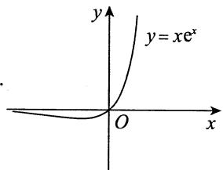

4.【答案】(C)

【解析】 $a_{n} = \int_{0}^{1}x^{n}\sqrt{1 - x^{2}}\mathrm{d}x\xlongequal{x = \sin t}\int_{0}^{\frac{\pi}{2}}\sin^{n}t\bullet \cos^{2}t\mathrm{d}t = \int_{0}^{\frac{\pi}{2}}\sin^{n}t(1 - \sin^{2}t)\mathrm{d}t = b_{n} - b_{n + 2}.$

又 $b_{n + 2} = \frac{n + 1}{n + 2} b_n$ ，则 $\lim_{n\to \infty}\left[\frac{(n + 1)a_n}{b_n}\right]^n = \lim_{n\to \infty}\left(\frac{n + 1}{n + 2}\right)^n = \mathrm{e}^{\lim_{n\to \infty}n\cdot \frac{-1}{n + 2}} = \mathrm{e}^{-1}$ .选(C).

5.【解析】注意到 $x_{n + 1} - x_n = \frac{c - x_n^2}{c + x_n}$ ( $n\in \mathbf{N}_{+}$ ), 当 $n = 1$ 时, $x_{2} - x_{1} = \frac{c - x_{1}^{2}}{c + x_{1}}\geqslant 0$ , $x_{2} - x_{1} = \frac{(\sqrt{c} - x_{1})(\sqrt{c} + x_{1})}{c + x_{1}} < \sqrt{c} -x_{1}$ , 故 $0\leqslant x_1\leqslant x_2 < \sqrt{c}$ ; 假设 $n = k$ 时, $0\leqslant x_{k} < \sqrt{c}$ , 则 $x_{k + 1} - x_k = \frac{c - x_k^2}{c + x_k} >0$ , $x_{k + 1} - x_k = \frac{(\sqrt{c} + x_k)(\sqrt{c} - x_k)}{c + x_k} < \sqrt{c} -x_k$ , 故 $0\leqslant x_{k} < x_{k + 1} < \sqrt{c}$ . 综上可得 $0\leqslant x_{n}\leqslant x_{n + 1} < \sqrt{c}(n\in \mathbf{N}_{+})$ , 从

而 $\{x_{n}\}$ 单调有界， $\lim_{n\to \infty}x_n\xrightarrow[\text{记为}]{\text{存在}}A$ 。递推式两端取极限并化简得 $A^2 = c$ ，由保号性知数列的极限值为 $A = \sqrt{c}$ 。

6.【解析】已知 $x_{1} < 0$ ，若 $x_{k} < 0$ ，则 $x_{k + 1} = \mathrm{e}^{x_k} - 1 < 0$ ，由数学归纳法得，对任意正整数 $n$ ，均有 $x_{n} < 0$ .因此，数列 $\{x_{n}\}$ 有上界.

令 $f(x) = \mathrm{e}^x - 1 - x$ ，则 $f'(x) = \mathrm{e}^x - 1 < 0 (x < 0)$ ，故 $f(x)$ 在 $(- \infty, 0]$ 上单调减少，从而当 $x < 0$ 时， $f(x) > f(0) = 0$ ，即 $\mathrm{e}^x - 1 > x$ 。于是， $x_{n+1} = \mathrm{e}^{x_n} - 1 > x_n$ 。因此，数列 $\{x_n\}$ 单调增加。

根据单调有界准则知， $\lim_{n\to \infty}x_n$ 存在.设 $\lim_{n\to \infty}x_n = a$ ，则对等式 $x_{n + 1} = \mathrm{e}^{x_n} - 1$ 两边令 $n\to \infty$ 取极限，得 $a = \mathrm{e}^a -1$ .由函数 $f(x) = \mathrm{e}^{x} - 1 - x(x\leqslant 0)$ 的单调性知，方程 $a = \mathrm{e}^a -1$ 有唯一实根 $a = 0$ .从而， $\lim_{n\to \infty}x_n = 0$ .于是

$$
\begin{array}{l} \lim  _ {n \rightarrow \infty} \left(\frac {1}{x _ {n}} - \frac {1}{x _ {n + 1}}\right) = \lim  _ {n \rightarrow \infty} \frac {x _ {n + 1} - x _ {n}}{x _ {n} x _ {n + 1}} = \lim  _ {n \rightarrow \infty} \frac {\mathrm {e} ^ {x _ {n}} - 1 - x _ {n}}{x _ {n} \left(\mathrm {e} ^ {x _ {n}} - 1\right)} = \lim  _ {t \rightarrow 0 ^ {-}} \frac {\mathrm {e} ^ {t} - 1 - t}{t \left(\mathrm {e} ^ {t} - 1\right)} \\ = \lim  _ {t \rightarrow 0 ^ {-}} \frac {\mathrm {e} ^ {t} - 1 - t}{t ^ {2}} = \lim  _ {t \rightarrow 0 ^ {-}} \frac {\mathrm {e} ^ {t} - 1}{2 t} = \frac {1}{2}. \\ \end{array}
$$

7.【解析】(1) $\cos x_{n+1} - \cos x_n = x_{n+1} > 0$ ，且 $0 < x_n < \frac{\pi}{2}$ ，故有 $0 < x_{n+1} < x_n$ ，于是 $\{x_n\}$ 单调减少且有下界， $\lim_{n \to \infty} x_n \xrightarrow[\text{记为}]{\text{存在}} a$ 。在 $\cos x_{n+1} - x_{n+1} = \cos x_n$ 两边取极限，有 $\cos a - a = \cos a$ ，得 $a = 0$ 。于是 $\lim_{n \to \infty} x_n = 0$ 。

(2) $\lim_{n\to \infty}\frac{x_{n + 1}}{x_n^2} = \lim_{n\to \infty}\frac{1 - \cos x_n}{x_n^2}\cdot \frac{x_{n + 1}}{1 - \cos x_n} = \frac{1}{2}\lim_{n\to \infty}\frac{x_{n + 1}}{1 - \cos x_{n + 1} + x_{n + 1}} = \frac{1}{2}.$

【注】这种命题将函数的具体性质与抽象理论相结合，较好地考查了考生的数学水平，还可进一步发挥.

① 将单通项 $x_{n}$ 改成双通项 $a_{n}$ 与 $b_{n}$

设 $0 < a_{n} < \frac{\pi}{2}, 0 < b_{n} < \frac{\pi}{2}, \cos a_{n} - a_{n} = \cos b_{n}$ , 且 $\lim_{n\to \infty}b_n = 0$ , 则由 $\cos a_{n} - \cos b_{n} = a_{n} > 0$ , 知 $0 < a_{n} < b_{n}$ , 由夹逼准则, 得 $\lim_{n\to \infty}a_n = 0$ , 且

$$
\lim  _ {n \rightarrow \infty} \frac {a _ {n}}{b _ {n} ^ {2}} = \lim  _ {n \rightarrow \infty} \frac {1 - \cos b _ {n}}{b _ {n} ^ {2}} \cdot \frac {a _ {n}}{1 - \cos b _ {n}} = \frac {1}{2} \lim  _ {n \rightarrow \infty} \frac {a _ {n}}{1 - \cos a _ {n} + a _ {n}} = \frac {1}{2}.
$$

与本题如出一辙.

② 将函数 $\cos x$ 改成 $\mathrm{e}^x$ .

设 $x_{n} > 0$ ， $\mathbf{e}^{x_n} - x_n = \mathbf{e}^{x_{n + 1}}$ (或更具迷惑性地写成 $\ln (\mathrm{e}^{x_n} - x_n) = x_{n + 1})$ ，则由 $\mathrm{e}^{x_n} - \mathrm{e}^{x_{n + 1}} = x_n > 0$ ，知 $x_{n} > x_{n + 1} > 0$ ，由单调有界准则知数列 $\{x_{n}\}$ 极限存在， $\lim_{n\to \infty}x_n\xlongequal[\text{记为}]{\text{存在}}a$ ，于是有 $\mathrm{e}^a -\mathrm{e}^a = a = 0$ ，得 $\lim_{n\to \infty}x_n = 0$ ，且

$$
\lim  _ {n \rightarrow \infty} \frac {x _ {n} ^ {2}}{x _ {n + 1}} = \lim  _ {n \rightarrow \infty} \frac {x _ {n} ^ {2}}{\ln \left(\mathrm {e} ^ {x _ {n}} - x _ {n}\right)} = \lim  _ {n \rightarrow \infty} \frac {x _ {n} ^ {2}}{\mathrm {e} ^ {x _ {n}} - x _ {n} - 1} = \lim  _ {n \rightarrow \infty} \frac {x _ {n} ^ {2}}{\frac {1}{2} x _ {n} ^ {2}} = 2.
$$

8.【解析】(1)已知 $0 < x_{1} < \frac{\pi}{4}$ ，设 $0 < x_{n} < \frac{\pi}{4}$ ，则 $x_{n + 1} = 2x_{n} - \tan x_{n}$

令 $f(x) = 2x - \tan x\left(0 \leqslant x \leqslant \frac{\pi}{4}\right)$ , 有 $f'(x) = 2 - \frac{1}{\cos^2 x} \stackrel{\text{令}}{=} 0$ , 得 $x = \frac{\pi}{4}$ , 当 $x \in \left(0, \frac{\pi}{4}\right)$ 时, $f'(x) > 0$ , $f(x)$ 单调递增, 又 $f(0) = 0$ , $f\left(\frac{\pi}{4}\right) = \frac{\pi}{2} - 1 < \frac{\pi}{4}$ , 于是当 $x \in \left(0, \frac{\pi}{4}\right)$ 时, $0 < f(x) < \frac{\pi}{4}$ , 即 $0 < x_{n+1} = f(x_n) < \frac{\pi}{4}$ , 故 $\{x_n\}$ 有界. 又 $x_{n+1} - x_n = x_n - \tan x_n < 0$ , $0 < x_n < \frac{\pi}{4}$ , 知 $\{x_n\}$ 单调递减, 由单调有界准则知, $\lim_{n \to \infty} x_n \stackrel{\text{存在}}{=} A$ . 故有 $A + \tan A = 2A$ , 得 $A = 0$ , 即 $\lim_{n \to \infty} x_n = 0$ .

(2) $\lim_{n\to \infty}\left(\frac{1}{x_n^2} -\frac{1}{x_nx_{n + 1}}\right) = \lim_{n\to \infty}\frac{x_{n + 1} - x_n}{x_n^2x_{n + 1}} = \lim_{n\to \infty}\frac{x_n - \tan x_n}{x_n^2(2x_n - \tan x_n)} = \lim_{x\to 0^+}\frac{x - \tan x}{x^2(2x - \tan x)} = -\frac{1}{3}.$

【注】处理此类问题的关键手段一般是将 $x_{n}$ 改写成 $x$ ，用导数工具研究函数性态，再如：

① 证明 $f(x) = (x - 1)\mathrm{e}^{x} + 1 > 0, x \neq 0$ ;  
② 设数列 $\{x_{n}\}$ 满足 $x_{n+1} \mathrm{e}^{x_{n}} = (x_{n} - 1) \mathrm{e}^{x_{n}} + 1$ , $x_{1} > 0$ , $n = 1,2,\dots$ , 证明 $\lim_{n \to \infty} x_{n}$ 存在.

事实上，对于 ① ，令 $f^{\prime}(x) = x\mathrm{e}^{x} = 0$ ，则可得 $f(x)$ 在 $x > 0$ 时单调增加， $x <   0$ 时单调减少，故 $x\neq 0$ 时 $f(x) > f(0) = 0$ ；对于 ② ，有 $x_{n + 1}\mathrm{e}^{x_n} > 0$ ，即 $x_{n + 1} > 0$ ，也即 $\left\{x_{n}\right\}$ 有下界0，又 $x_{n + 1} - x_{n} = \frac{1}{\mathrm{e}^{x_{n}}} -$ $1 <   0(x_{n} > 0)$ ，即 $\left\{x_{n}\right\}$ 单调减少，由单调有界准则，知 $\lim_{n\to \infty}x_n$ 存在.

9.【解析】 $a_{n} = \int_{0}^{1}t^{n}\left|\ln t\right|\mathrm{d}t = -\frac{1}{n + 1}\int_{0}^{1}\ln t\mathrm{d}(t^{n + 1})$

$$
= - \frac {1}{n + 1} \left(t ^ {n + 1} \ln t \Big | _ {0} ^ {1} - \int_ {0} ^ {1} t ^ {n} d t\right) = \frac {1}{(n + 1) ^ {2}},
$$

所以 $\lim_{n\to \infty}(n^{2}a_{n})^{n} = \lim_{n\to \infty}\left[\left(\frac{n}{n + 1}\right)^{2}\right]^{n} = \mathrm{e}^{\lim_{n\to \infty}2n\left(\frac{n}{n + 1} -1\right)} = \mathrm{e}^{-2}.$

10.【解析】 $a_{n} = \int_{0}^{+\infty}\frac{\mathrm{d}x}{(1 + x^{2})^{n}}\frac{\text{令}x = \tan t}{\int_{0}^{\frac{\pi}{2}}\frac{\sec^{2}t}{(\sec^{2}t)^{n}}\mathrm{d}t} = \int_{0}^{\frac{\pi}{2}}\cos^{2n - 2}t\mathrm{d}t,$

$$
\frac {a _ {n + 1}}{a _ {n}} = \frac {\int_ {0} ^ {\frac {\pi}{2}} \cos^ {2 n} t \mathrm {d} t}{\int_ {0} ^ {\frac {\pi}{2}} \cos^ {2 n - 2} t \mathrm {d} t} = \frac {(2 n - 1) ! !}{(2 n) ! !} \cdot \frac {\pi}{2} \cdot \frac {(2 n - 2) ! !}{(2 n - 3) ! !} \cdot \frac {2}{\pi} = \frac {2 n - 1}{2 n},
$$

于是 $\lim_{n\to \infty}\left(\frac{a_{n + 1}}{a_n}\right)^{\ln (1 + \mathrm{e}^{2n})} = \lim_{n\to \infty}\left(1 - \frac{1}{2n}\right)^{\ln (1 + \mathrm{e}^{2n})} = \mathrm{e}^{\lim_{n\to \infty}\ln (1 + \mathrm{e}^{2n})\cdot \left(-\frac{1}{2n}\right)}$

$$
= \mathrm {e} ^ {\lim  _ {n \rightarrow \infty} \frac {\ln (1 + \mathrm {e} ^ {2 n})}{\ln \mathrm {e} ^ {2 n}} \cdot \ln \mathrm {e} ^ {2 n} \cdot \left(- \frac {1}{2 n}\right)} = \mathrm {e} ^ {\lim  _ {n \rightarrow \infty} 2 n \cdot \left(- \frac {1}{2 n}\right)} = \mathrm {e} ^ {- 1}.
$$

11.【解析】因为 $f(x) = x$ 有唯一解 $x = 0$ ，故 $f(0) = 0$ ，且 $\left|x_{n} - 0\right| = \left|f(x_{n - 1}) - f(0)\right| = \left|f^{\prime}(\xi)\right|$ $\left|x_{n - 1} - 0\right|\leqslant \frac{1}{\mathrm{e}}\left|x_{n - 1} - 0\right|\leqslant \dots \leqslant \left(\frac{1}{\mathrm{e}}\right)^{n - 1}\left|x_1 - 0\right|$ ，其中 $\xi$ 介于 $x_{n - 1}$ 与0之间，即 $\left|x_n\right|\leqslant \mathrm{e}^{-(n - 1)}\left|x_1\right|$

因为 $0 \leqslant \mathrm{e}^{\frac{n}{2}} |x_n| \leqslant \mathrm{e}^{\frac{n}{2}} \mathrm{e}^{-(n-1)} |x_1| = \mathrm{e}^{-\frac{n}{2} + 1} |x_1|$ ，且 $\lim_{n \to \infty} \mathrm{e}^{-\frac{n}{2} + 1} |x_1| = 0$ ，故由夹逼准则可知

$$
\lim  _ {n \rightarrow \infty} \frac {\left| x _ {n} \right|}{\mathrm {e} ^ {- \frac {n}{2}}} = \lim  _ {n \rightarrow \infty} \mathrm {e} ^ {\frac {n}{2}} \left| x _ {n} \right| = 0,
$$

即当 $n\to \infty$ 时， $x_{n}$ 是 $\mathrm{e}^{-\frac{n}{2}}$ 的高阶无穷小.

  
关注公众号【考研小舟】免费考研资料&无水印PDF

  
黑白&彩印都是5分/页，满4.9全国包邮下单备注：考研小舟，送草稿纸

# 第3章 一元函数微分学的概念

1.【答案】(A)

【解析】 $f(x) = (\mathrm{e}^{x} - 1)\left|x^{3} - x^{2} + x\right| = (\mathrm{e}^{x} - 1)\left|x\right|\left|x^{2} - x + 1\right|.$

显然 $\mathbf{e}^x - 1$ 处处可导，而对任意的 $x$ 都有 $x^2 - x + 1 > 0$ ，即 $\left|x^2 - x + 1\right| = x^2 - x + 1$ 也处处可导，对于 $\left|x\right|$ ，除在 $x = 0$ 外，处处可导，现考虑 $f(x)$ 在 $x = 0$ 处是否可导，因

$$
\lim  _ {x \rightarrow 0} \frac {f (x) - f (0)}{x - 0} = \lim  _ {x \rightarrow 0} \frac {\left(\mathrm {e} ^ {x} - 1\right) | x | \left(x ^ {2} - x + 1\right)}{x} = \lim  _ {x \rightarrow 0} \frac {\mathrm {e} ^ {x} - 1}{x} \lim  _ {x \rightarrow 0} | x | \lim  _ {x \rightarrow 0} \left(x ^ {2} - x + 1\right) = 0,
$$

故 $f(x)$ 在 $x = 0$ 处可导，且 $f^{\prime}(0) = 0$

2.【答案】(A)

【解析】因 $f^{\prime}(x_0) = \lim_{x\to 0}\frac{f(x_0 + x) - f(x_0)}{x} = \lim_{x\to 0}\frac{\alpha f(x) - f(x_0)}{x}$ ，而

$$
f ^ {\prime} (0) = \lim  _ {x \rightarrow 0} \frac {f (0 + x) - f (0)}{x} = \beta ,
$$

即当 $x \to 0$ 时, $f(x) = f(0) + (\beta + \varepsilon)x$ , 其中 $\lim_{x \to 0} \varepsilon = 0$ .

故 $f^{\prime}(x_0) = \lim_{x\to 0}\frac{\alpha[f(0) + (\beta + \varepsilon)x] - f(x_0)}{x} = \lim_{x\to 0}\frac{\alpha(\beta + \varepsilon)x + \alpha f(0) - f(x_0)}{x}.$

对任意的 $x$ ，都有 $f(x + x_0) = \alpha f(x)$ ，取 $x = 0$ ，有 $f(x_0) = \alpha f(0)$ ，因此， $f^{\prime}(x_0) = \alpha \beta$ ，即选项(A)正确.

3.【答案】(C)

【解析】当 $x = 0$ 时， $f(0) = 0$ 。当 $x \neq 0$ 时， $f(x) = x^2 \sin \frac{t}{x}$ ，又 $\left|\sin \frac{t}{x}\right| \leqslant 1$ ，故 $x^2 \sin \frac{t}{x} \to 0 (x \to 0)$ ，从而 $f(x)$ 在 $x = 0$ 处连续。

又 $f^{\prime}(0) = \lim_{x\to 0}\frac{f(0 + x) - f(0)}{x} = \lim_{x\to 0}x\sin \frac{t}{x} = 0$ ，所以 $f(x)$ 在 $x = 0$ 处可导.

而当 $x \neq 0$ 时, $f'(x) = 2x\sin{\frac{t}{x}} - t\cos{\frac{t}{x}}$ , 故 $\lim_{x \to 0} f'(x)$ 不存在, 所以 $f'(x)$ 在 $x = 0$ 处不连续.

4.【答案】(B)

【解析】对于①，取 $f(x) = x^{\frac{2}{3}}$ ，则 $f(x)$ 在 $x = 0$ 处连续但不可导，故①不正确；

对于 ② ，因 $\lim_{x\to 0}f(x) = f(0)$ ，又由 $\lim_{x\to 0}\frac{f(x)}{x^2} = 0$ ，有 $f(0) = 0$ ，则

$$
f ^ {\prime} (0) = \lim  _ {x \rightarrow 0} \frac {f (x) - f (0)}{x - 0} = \lim  _ {x \rightarrow 0} \frac {f (x)}{x} = \lim  _ {x \rightarrow 0} \frac {f (x)}{x ^ {2}} \cdot x = 0,
$$

故②正确；

对于 ③ ，取 $f(x) = 1$ ，此时 $\lim_{x\to 0}\frac{f(x)}{\sqrt[3]{x}} = \infty$ ，故 ③ 不正确.

5.【答案】(B)

【解析】 $F^{\prime}(0) = \lim_{x\to 0}\frac{F(x) - F(0)}{x - 0} = \lim_{x\to 0}\frac{g\left(x^{2}\sin\frac{1}{x}\right) - g(0)}{x - 0}$ ，记

$$
I _ {1} = \left\{x \left| 0 <   | x | <   \delta , | x | \neq \frac {1}{n \pi}, n = 1, 2, \dots , \delta > 0 \right. \right\},
$$

$$
I _ {2} = \left\{x \left| | x | = \frac {1}{n \pi}, n = 1, 2, \dots \right. \right\},
$$

则

$$
\lim  _ {\substack {x \in I _ {1} \\ x \to 0}} \frac {g \left(x ^ {2} \sin \frac {1}{x}\right) - g (0)}{x - 0} = \lim  _ {\substack {x \in I _ {1} \\ x \to 0}} \frac {g \left(x ^ {2} \sin \frac {1}{x}\right) - g (0)}{x ^ {2} \sin \frac {1}{x} - 0} \cdot \frac {x ^ {2} \sin \frac {1}{x} - 0}{x - 0} = g ^ {\prime} (0) \cdot 0 = 0,
$$

$$
\lim  _ {\substack {x \in I _ {2} \\ x \to 0}} \frac {g \left(x ^ {2} \sin \frac {1}{x}\right) - g (0)}{x - 0} = \lim  _ {\substack {x \in I _ {2} \\ x \to 0}} \frac {g (0) - g (0)}{x - 0} = 0,
$$

综上， $F^{\prime}(0) = 0$ ：

6.【答案】(B)

【解析】 $f^{\prime}(x) = \frac{\frac{\mathrm{dy}}{\mathrm{dt}}}{\frac{\mathrm{dx}}{\mathrm{dt}}} = \frac{2te^{t^2}}{3t^2} = \frac{2e^{t^2}}{3t}$ ，当 $x = \frac{\pi}{2}$ 时， $t = 1$ 则

$$
f ^ {\prime} \left(\frac {\pi}{2}\right) = \frac {2 e ^ {t ^ {2}}}{3 t} \Bigg | _ {t = 1} = \frac {2 e}{3},
$$

$$
\lim  _ {n \rightarrow \infty} n \left[ f \left(\frac {\pi}{2} + \frac {2}{n}\right) - f \left(\frac {\pi}{2}\right)\right] = \lim  _ {n \rightarrow \infty} \frac {f \left(\frac {\pi}{2} + \frac {2}{n}\right) - f \left(\frac {\pi}{2}\right)}{\frac {2}{n}} \cdot 2 = 2 f ^ {\prime} \left(\frac {\pi}{2}\right) = \frac {4 e}{3}.
$$

7.【解析】由题意知，当 $x\to 0$ 时， $f(x) > 0$ ，有

$$
\begin{array}{l} f (x) ^ {f (x)} - f (0) ^ {f (x)} = f (0) ^ {f (x)} \left\{\left[ \frac {f (x)}{f (0)} \right] ^ {f (x)} - 1 \right\} \\ = f (0) ^ {f (x)} \left[ e ^ {f (x) \cdot \ln \frac {f (x)}{f (0)}} - 1 \right] \sim f (0) ^ {f (x)} f (x) \ln \frac {f (x)}{f (0)}, \\ \end{array}
$$

故 原式 $= \lim_{x\to 0}\frac{f(0)^{f(x)}f(x)\ln{\frac{f(x)}{f(0)}}}{x}$

$$
\begin{array}{l} = \lim  _ {x \rightarrow 0} f (0) ^ {f (x)} f (x) \lim  _ {x \rightarrow 0} \frac {\ln f (x) - \ln f (0)}{x - 0} \\ = f (0) ^ {f (0)} f (0) \cdot \lim  _ {x \rightarrow 0} \frac {\ln f (x) - \ln f (0)}{f (x) - f (0)} \cdot \frac {f (x) - f (0)}{x} \\ = f (0) ^ {f (0)} f (0) \cdot \frac {f ^ {\prime} (0)}{f (0)} = f ^ {\prime} (0) f (0) ^ {f (0)} = b a ^ {a}. \\ \end{array}
$$

8.【解析】当 $x\neq 0$ 时， $f(x) = \int_{0}^{x^2}g(xt)\mathrm{d}t\xlongequal{u = xt}\int_{0}^{x^3}g(u)\frac{1}{x}\mathrm{d}u = \frac{1}{x}\int_{0}^{x^3}g(u)\mathrm{d}u.$

对 $f(x)$ 求导得，

$$
f ^ {\prime} (x) = \frac {g \left(x ^ {3}\right) 3 x ^ {3} - \int_ {0} ^ {x ^ {3}} g (u) \mathrm {d} u}{x ^ {2}} = 3 x g \left(x ^ {3}\right) - \frac {\int_ {0} ^ {x ^ {3}} g (u) \mathrm {d} u}{x ^ {2}}.
$$

在 $x = 0$ 处，由定义式可得

$$
f ^ {\prime} (0) = \lim  _ {x \rightarrow 0} \frac {f (x) - f (0)}{x - 0} = \lim  _ {x \rightarrow 0} \frac {\int_ {0} ^ {x ^ {3}} g (u) d u}{x ^ {2}} = 0.
$$

故 $f^{\prime}(x) = \left\{ \begin{array}{ll}3xg(x^{3}) - \frac{\int_{0}^{x^{3}}g(u)\mathrm{d}u}{x^{2}}, & x\neq 0,\\ 0, & x = 0. \end{array} \right.$

又 $\lim_{x\to 0}f'(x) = \lim_{x\to 0}\left[3xg(x^3) - \frac{\int_0^{x^3}g(u)\mathrm{d}u}{x^2}\right]$

$$
= \lim  _ {x \rightarrow 0} 3 x g \left(x ^ {3}\right) - \lim  _ {x \rightarrow 0} \frac {\int_ {0} ^ {x ^ {3}} g (u) \mathrm {d} u}{x ^ {2}} = - \lim  _ {x \rightarrow 0} \frac {3 x ^ {2} g \left(x ^ {3}\right)}{2 x} = 0,
$$

故 $f^{\prime}(x)$ 在 $x = 0$ 处连续

9.【解析】记 $g(x) = |f(x)|$ ，则

$$
g _ {+} ^ {\prime} (a) = \lim  _ {x \rightarrow 0 ^ {+}} \frac {\left| f (a + x) \right| - \left| f (a) \right|}{x} \xlongequal {f (a) = 0} \left| \lim  _ {x \rightarrow 0 ^ {+}} \frac {f (a + x) - f (a)}{x} \right| = \left| f ^ {\prime} (a) \right|,
$$

同理， $g_{-}^{\prime}(a) = -\left|f^{\prime}(a)\right|$ ，故由 $g(x)$ 的可导性只能有 $f^{\prime}(a) = 0$ ：

10.【解析】(1)由于 $\lim_{x\to 0}f(x) = \lim_{x\to 0}\frac{g(x) - e^{-x}}{x} = \lim_{x\to 0}\left[g'(x) + e^{-x}\right] = g'(0) + 1 = a$ ，又 $g^{\prime}(0) = -1$ 故 $a = 0$ ：

(2)由定义得

$$
\begin{array}{l} f ^ {\prime} (0) = \lim  _ {x \rightarrow 0} \frac {f (x) - f (0)}{x} = \lim  _ {x \rightarrow 0} \frac {g (x) - \mathrm {e} ^ {- x}}{x ^ {2}} \stackrel {\text {洛 必 达 法 则}} {=} \lim  _ {x \rightarrow 0} \frac {g ^ {\prime} (x) + \mathrm {e} ^ {- x}}{2 x} \\ = \frac {1}{2} \lim  _ {x \rightarrow 0} \left[ \frac {g ^ {\prime} (x) - g ^ {\prime} (0)}{x} + \frac {\mathrm {e} ^ {- x} - 1}{x} \right] = \frac {g ^ {\prime \prime} (0) - 1}{2}. \\ \end{array}
$$

而 $x \neq 0$ 时显然有 $f'(x) = \frac{x\left[g'(x) + \mathrm{e}^{-x}\right] - \left[g(x) - \mathrm{e}^{-x}\right]}{x^2}$ , 故函数可导.

因此 $f^{\prime}(x) = \left\{ \begin{array}{ll} \frac{x\left[g^{\prime}(x) + \mathrm{e}^{-x}\right] - \left[g(x) - \mathrm{e}^{-x}\right]}{x^{2}}, & x\neq 0,\\ \frac{g^{\prime\prime}(0) - 1}{2}, & x = 0. \end{array} \right.$

11.【解析】(1)作泰勒展开得 $f(x) = f(0) + f'(0)x + \frac{f''(\xi)}{2} x^2$ ( $\xi$ 介于0与 $x$ 之间). 因此

$\lim_{x \to 0} \frac{g(x) - g(0)}{x} = \lim_{x \to 0} \frac{f(x) - f'(0)x}{x^2} = \lim_{x \to 0} \frac{f''(\xi)}{2} = \frac{f''(0)}{2}$ (也可用洛必达法则).

故 $g^{\prime}(x) = \left\{ \begin{array}{ll} \frac{x f^{\prime}(x) - f(x)}{x^{2}}, & x\neq 0,\\ \frac{f^{\prime\prime}(0)}{2}, & x = 0. \end{array} \right.$

(2) $g'(x) = \frac{xf'(x) - f(x)}{x^2}$ ( $x \neq 0$ ), 易见 $\lim_{x \to 0} g'(x) \xrightarrow[\text{洛必达法则}]{f''(0)} \frac{f''(0)}{2} = g'(0)$ , 故 $g'(x)$ 在 $x = 0$ 处连续.  
12.【解析】函数在 $x = 0$ 处显然左连续，而 $\lim_{x\to 0^{+}}f(x) = \frac{\pi}{2}\lim_{x\to 0^{+}}x = 0 = f(0)$ ，故函数 $f(x)$ 在 $x = 0$ 处连续。注意到单侧导数

$$
f _ {+} ^ {\prime} (0) = \lim  _ {x \rightarrow 0 ^ {+}} \frac {f (x) - f (0)}{x} = \lim  _ {x \rightarrow 0 ^ {+}} \arctan \frac {1}{\sqrt {x}} = \frac {\pi}{2},
$$

$$
f _ {-} ^ {\prime} (0) = \lim  _ {x \rightarrow 0 ^ {-}} \frac {f (x) - f (0)}{x} = \frac {\pi}{2} \lim  _ {x \rightarrow 0 ^ {-}} \frac {\mathrm {e} ^ {\sin x} - 1}{x} = \frac {\pi}{2},
$$

故 $f(x)$ 在 $x = 0$ 处可导，且 $f^{\prime}(0) = \frac{\pi}{2}$ 故导函数 $f^{\prime}(x) = \left\{ \begin{array}{ll} - \frac{\sqrt{x}}{2(x + 1)} +\arctan \frac{1}{\sqrt{x}}, & x > 0,\\ \frac{\pi}{2}, & x = 0,\\ \frac{\pi}{2}\mathrm{e}^{\sin x}\cos x, & x <   0, \end{array} \right.$ $x = 0$ 处也连续.

# 13.【答案】(B)

【解析】若 $f(a) \neq 0$ ，则存在 $x = a$ 的某邻域 $U(a)$ ，在该邻域内 $f(x)$ 与 $f(a)$ 同号。于是推知，若 $f(a) > 0$ ，则 $|f(x)| = f(x)$ （当 $x \in U(a)$ ）；若 $f(a) < 0$ ，则 $|f(x)| = -f(x)$ （当 $x \in U(a)$ ）。总之，若 $f(a) \neq 0$ ， $|f(x)|$ 在 $x = a$ 处总可导。

若 $f(a) = 0$ ，则 $\lim_{x\to a}\frac{|f(x)| - |f(a)|}{x - a} = \lim_{x\to a}\frac{|f(x)|}{x - a} = \lim_{x\to a}\frac{|f(x) - f(a)|}{x - a}$ ，从而知

$$
\lim  _ {x \rightarrow a ^ {\pm}} \frac {| f (x) | - | f (a) |}{x - a} = \lim  _ {x \rightarrow a ^ {\pm}} \frac {| f (x) - f (a) |}{x - a} = \lim  _ {x \rightarrow a ^ {\pm}} \pm \left| \frac {f (x) - f (a)}{x - a} \right| = \pm | f ^ {\prime} (a) |,
$$

其中 $x \to a^{+}$ 时取“+”， $x \to a^{-}$ 时取“-”，所以 $\left|f(x)\right|$ 在 $x = a$ 处可导的充要条件为 $\left|f'(a)\right| = 0$ ，即 $f'(a) = 0$ 。

所以当且仅当 $f(a) = 0,f^{\prime}(a)\neq 0$ 时， $\left|f(x)\right|$ 在 $x = a$ 处不可导，选(B).

# 14.【答案】(D)

【解析】 $f^{\prime}(0) = \lim_{x\to 0}\frac{(1 + x)^{x} - 1}{x} = \lim_{x\to 0}\frac{\mathrm{e}^{x\ln(1 + x)} - 1}{x} = \lim_{x\to 0}\frac{x\ln(1 + x)}{x} = 0,$

选项(A)错误.

当 $x \neq 0$ 时，

$$
f ^ {\prime} (x) = \left[ \mathrm {e} ^ {x \ln (1 + x)} - 1 \right] ^ {\prime} = \mathrm {e} ^ {x \ln (1 + x)} \left[ \ln (1 + x) + \frac {x}{1 + x} \right],
$$

$$
\lim  _ {x \rightarrow 0} f ^ {\prime} (x) = 0 = f ^ {\prime} (0),
$$

选项(B)错误.

$$
\begin{array}{l} f ^ {\prime \prime} (0) = \lim  _ {x \rightarrow 0} \frac {f ^ {\prime} (x) - f ^ {\prime} (0)}{x - 0} = \lim  _ {x \rightarrow 0} \mathrm {e} ^ {x \ln (1 + x)} \frac {(1 + x) \ln (1 + x) + x}{x (1 + x)} \\ = \lim  _ {x \rightarrow 0} {\frac {(1 + x) \ln (1 + x) + x}{x + x ^ {2}}}   {\frac {\text {洛 必 达 法 则}}{x \rightarrow 0}}   \lim  _ {x \rightarrow 0} {\frac {\ln (1 + x) + 1 + 1}{1 + 2 x}} = 2  , \\ \end{array}
$$

所以选项(C)错误，(D)正确.

# 15.【答案】-4

【解析】由题设知， $f^{\prime}(1) = \left[\ln (2x^{2} - 1)\right]^{\prime}\bigg|_{x = 1} = \frac{4x}{2x^{2} - 1}\bigg|_{x = 1} = 4.$ 于是，

$$
\begin{array}{l} \lim  _ {n \rightarrow \infty} n \left[ f \left(\frac {n + 1}{n}\right) - f \left(\frac {n + 2}{n}\right)\right] = \lim  _ {n \rightarrow \infty} \frac {f \left(1 + \frac {1}{n}\right) - f \left(1 + \frac {2}{n}\right)}{\frac {1}{n}} \\ = \lim  _ {n \rightarrow \infty} \left[ \frac {f \left(1 + \frac {1}{n}\right) - f (1)}{\frac {1}{n}} - \frac {f \left(1 + \frac {2}{n}\right) - f (1)}{\frac {1}{n}} \right] \\ = \lim  _ {n \rightarrow \infty} \left[ \frac {f \left(1 + \frac {1}{n}\right) - f (1)}{\frac {1}{n}} \right] - 2 \lim  _ {n \rightarrow \infty} \frac {f \left(1 + \frac {2}{n}\right) - f (1)}{\frac {2}{n}} \\ = f ^ {\prime} (1) - 2 f ^ {\prime} (1) = - f ^ {\prime} (1) = - 4. \\ \end{array}
$$

16.【解析】令 $t = \frac{1}{x}\rightarrow 0$ ，记 $y = \left[\frac{f(a + t)}{f(a)}\right]^{\frac{1}{t}}$ 则

$$
\ln y = \frac {\ln | f (a + t) | - \ln | f (a) |}{t}, \lim  _ {t \rightarrow 0} \ln y = \left. \frac {\mathrm {d} [ \ln | f (u) | ]}{\mathrm {d} u} \right| _ {u = a} = \frac {f ^ {\prime} (a)}{f (a)},
$$

故 $I = \mathrm{e}^{\frac{f'(a)}{f(a)}}$

【注】若直接变形： $y = \left[1 + \frac{f(a + t) - f(a)}{f(a)}\right]^{\frac{f(a)}{f(a + t) - f(a)}} \cdot \frac{f(a + t) - f(a)}{tf(a)}$ ，则要求 $f(a + t) \neq f(a)$ ，但这里不扣分.

# 17.【答案】(C)

【解析】选项(C)的证明. 用反证法, 设 $f^{\prime}(a)$ 存在, 则 $f(x)$ 在 $x = a$ 处连续, 再由题设, $f(x)$ 在 $x = a$ 的某邻域内连续, 从而

$$
f ^ {\prime} (a) = \lim  _ {x \to a} \frac {f (x) - f (a)}{x - a} \xlongequal {\text {洛 必 达 法 则}} \lim  _ {x \to a} f ^ {\prime} (x) = \infty ,
$$

矛盾，所以 $f^{\prime}(a)$ 必不存在.

选项(A)，(B)，(D)均可举出反例.

选项(A)的反例：令 $f(x) = \begin{cases} 1, & x \neq 0, \\ 0, & x = 0, \end{cases} \lim_{x \to 0} f'(x) = 0$ ，但 $f'(0)$ 不存在.

选项(B)的反例：令 $f(x) = \begin{cases} x^2\sin \frac{1}{x}, & x \neq 0, \\ 0, & x = 0, \end{cases}$ $f'(0)$ 存在且等于0，但 $\lim_{x \to 0} f'(x)$ 不存在.

选项(D)的反例同选项(A)的反例， $f^{\prime}(0)$ 不存在，但 $\lim_{x\to 0}f'(x) = 0$

18.【答案】 $-\frac{1}{2}$

【解析】由于 $f(x)$ 是偶函数，因此 $f^{\prime}(x)$ 是奇函数，即

$$
f ^ {\prime} (- 1) = - f ^ {\prime} (1) = - \lim  _ {x \rightarrow 1} \frac {\frac {\ln x}{2 x ^ {2} - \ln x} - 0}{x - 1} = - \lim  _ {x \rightarrow 1} \frac {\ln x}{(2 x ^ {2} - \ln x) (x - 1)} = - \frac {1}{2}.
$$

19.【答案】 $-A\sin b$

【解析】 $\lim_{x\to a}\frac{\cos f(x) - \cos b}{x - a} = \lim_{x\to a}\frac{-\sin\xi\bullet[f(x) - b]}{x - a} (\xi$ 介于 $f(x)$ 与 $b$ 之间） $= -A\sin b$ ：

20.【解析】因为 $f(x)$ 在 $x = 1$ 处可导，所以 $f(x)$ 在 $x = 1$ 处连续，从而

$$
\lim  _ {x \rightarrow 0} \left[ f (\cos x) - 3 f (1 + \sin^ {2} x) \right] = f (1) - 3 f (1) = - 2 f (1).
$$

由 $\lim_{x\to 0}\frac{f(\cos x) - 3f(1 + \sin^2x)}{x^2} = 2$ 可知 $\lim_{x\to 0}\left[f(\cos x) - 3f(1 + \sin^2 x)\right] = 0$ ，所以 $f(1) = 0$ ，从而有

$$
\begin{array}{l} \lim  _ {x \rightarrow 0} \frac {f (\cos x) - 3 f (1 + \sin^ {2} x)}{x ^ {2}} \\ = \lim  _ {x \rightarrow 0} \left[ \frac {f (\cos x) - f (1)}{\cos x - 1} \cdot \frac {\cos x - 1}{x ^ {2}} - 3 \frac {f (1 + \sin^ {2} x) - f (1)}{\sin^ {2} x} \cdot \frac {\sin^ {2} x}{x ^ {2}} \right] \\ = - \frac {1}{2} f ^ {\prime} (1) - 3 f ^ {\prime} (1) = - \frac {7}{2} f ^ {\prime} (1) = 2. \\ \end{array}
$$

故 $f^{\prime}(1) = -\frac{4}{7}$

21.【解析】由题知， $1 = \lim_{x\to a}\frac{f(x) - \sqrt{a}}{x - a} \cdot \lim_{x\to a}\frac{f(x) + \sqrt{a}}{x + a} = \frac{f(a) + \sqrt{a}}{2a} \cdot \lim_{x\to a}\frac{f(x) - \sqrt{a}}{x - a}$ ，

于是有 $\lim_{x\to a}\frac{f(x) - \sqrt{a}}{x - a} = \frac{2a}{f(a) + \sqrt{a}},$

故 $\lim_{x\to a}f(x) = f(a) = \sqrt{a}$

即 $f^{\prime}(a) = \lim_{x\to a}\frac{f(x) - f(a)}{x - a} = \lim_{x\to a}\frac{f(x) - \sqrt{a}}{x - a} = \frac{2a}{\sqrt{a} + \sqrt{a}} = \sqrt{a}.$

22.【解析】因为可导函数 $y = f(x) - \sin x$ 在 $x = 0$ 处取得极值，所以 $\left[f'(x) - \cos x\right]_{x=0} = f'(0) - 1 = 0$ ，解得 $f'(0) = 1$ ：

$$
\lim  _ {n \rightarrow \infty} n \left[ f \left(\frac {1}{n}\right) - f \left(a _ {n}\right)\right] = \lim  _ {n \rightarrow \infty} \frac {\left[ f \left(0 + \frac {1}{n}\right) - f (0) \right] - \left[ f \left(0 + a _ {n}\right) - f (0) \right]}{\frac {1}{n}}
$$

$$
= f ^ {\prime} (0) + \lim  _ {n \rightarrow \infty} \frac {f \left(1 - \mathrm {e} ^ {\frac {1}{n}} - \sin \frac {1}{n ^ {2}}\right) - f (0)}{- \frac {1}{n}} = f ^ {\prime} (0) + f ^ {\prime} (0) = 2 f ^ {\prime} (0) = 2,
$$

其中 $\lim_{n\to \infty}\frac{1 - \mathrm{e}^{\frac{1}{n}} - \sin\frac{1}{n^2}}{-\frac{1}{n}} = 1.$

# 第4章 一元函数微分学的计算

1.【答案】 $-\frac{1}{2\mathrm{e}}\cos \frac{1}{\mathrm{e}}$

【解析】因为 $y = \sin (\mathrm{e}^{-\sqrt{x}})$ ，所以 $\left.\frac{\mathrm{dy}}{\mathrm{dx}}\right|_{x=1} = \cos (\mathrm{e}^{-\sqrt{x}}) \cdot \mathrm{e}^{-\sqrt{x}} \cdot \left(-\frac{1}{2\sqrt{x}}\right)\Bigg|_{x=1} = -\frac{1}{2\mathrm{e}}\cos \frac{1}{\mathrm{e}}$

2.【解析】将 $x = 0$ 代入等式，得 $f^{\prime}(0) = \frac{1}{2} f[f(0) - 1] = \frac{1}{2} f(0) = \frac{1}{2}$

在 $f'(x) = \frac{1}{2} f[f(x) - 1]$ 两端关于 $x$ 求导，得 $f''(x) = \frac{1}{2} f' [f(x) - 1] \cdot f'(x)$ ，将 $f(0) = 1$ ， $f'(0) = \frac{1}{2}$ 代入上式，得 $f''(0) = \frac{1}{8}$ .

3.【答案】-3

【解析】 原式 $\frac{\text{洛必达法则}}{\lim_{x\to1}\frac{3(x - 1)^2}{y(x)}}\frac{\text{洛必达法则}}{\lim_{x\to1}\frac{6(x - 1)}{y'(x)}}.$

对隐函数求导，有 $3y^{2}y^{\prime} + xy^{\prime} + y + 2x - 2 = 0$ ，得 $y^\prime (x) = -\frac{y + 2x - 2}{3y^2 + x}$ ，且 $\lim_{x\to 1}y'(x) = 0$ ：

再用洛必达法则，原式 $= \lim_{x\to 1}\frac{6}{y''(x)}$

又 $y^{\prime \prime}(x) = -\frac{(3y^{2} + x)(y^{\prime} + 2) - (y + 2x - 2)(6yy^{\prime} + 1)}{(3y^{2} + x)^{2}}$ $\lim_{x\to 1}y''(x) = -2$

所以原式 $= -3$ ：

4.【解析】两边求导得 $\frac{\frac{y - xy'}{y^2}}{\left(\frac{x}{y}\right)^2 + 1} = \frac{2x + 2yy'}{\sqrt{x^2 + y^2} \cdot 2\sqrt{x^2 + y^2}}$ 整理得 $y' = \frac{y - x}{y + x}$ . 进而有

$$
y ^ {\prime \prime} = \frac {2 (x y ^ {\prime} - y)}{(x + y) ^ {2}} = - \frac {2 (x ^ {2} + y ^ {2})}{(x + y) ^ {3}}.
$$

5.【解析】 $\frac{\mathrm{d}x}{\mathrm{d}y} = \frac{1}{2 + \cos x}$ ，从而 $\frac{\mathrm{d}^2x}{\mathrm{d}y^2} = \frac{\mathrm{d}}{\mathrm{d}x}\left(\frac{\mathrm{d}x}{\mathrm{d}y}\right)\cdot \frac{\mathrm{d}x}{\mathrm{d}y} = \frac{\sin x}{(2 + \cos x)^3}$

6.【答案】4e

【解析】方程 $x = \arctan (t + 1)$ 两端对 $t$ 求导得 $\frac{\mathrm{d}x}{\mathrm{d}t} = \frac{1}{1 + (t + 1)^2}$ ，则 $\left.\frac{\mathrm{d}x}{\mathrm{d}t}\right|_{t=0} = \frac{1}{2}$ .

方程 $2t - \int_{1}^{y + t^2}\mathrm{e}^{-u^2}\mathrm{d}u = 0$ 两端对 $t$ 求导得 $2 - \mathrm{e}^{-(y + t^2)^2}\cdot \left(\frac{\mathrm{dy}}{\mathrm{dt}} +2t\right) = 0.$ 当 $t = 0$ 时， $y = 1$ ，则 $2 - \mathrm{e}^{-1}\bullet \frac{\mathrm{dy}}{\mathrm{dt}}\bigg|_{t = 0} = 0$ 得 $\frac{\mathrm{dy}}{\mathrm{dt}}\bigg|_{t = 0} = 2\mathrm{e}.$ 故 $\left.\frac{\mathrm{dy}}{\mathrm{dx}}\right|_{t = 0} = \left.\frac{\frac{\mathrm{dy}}{\mathrm{dt}}}{\frac{\mathrm{dx}}{\mathrm{dt}}}\right|_{t = 0} = 4\mathrm{e}.$

7.【答案】 $\frac{-6}{(2y - x)^3}$

【解析】对 $x^{2} - xy + y^{2} = 1$ 两边关于 $x$ 求导，得 $2x - xy' - y + 2yy' = 0$ ，则 $y' = \frac{y - 2x}{2y - x}$ ，故

$$
\begin{array}{l} y ^ {\prime \prime} = \frac {(2 y - x) \left(y ^ {\prime} - 2\right) - (y - 2 x) \left(2 y ^ {\prime} - 1\right)}{(2 y - x) ^ {2}} \\ = \frac {(2 y - x) (y - 2 x - 4 y + 2 x) - (y - 2 x) (2 y - 4 x - 2 y + x)}{(2 y - x) ^ {3}} \\ = \frac {- 6 \left(x ^ {2} - x y + y ^ {2}\right)}{\left(2 y - x\right) ^ {3}} = \frac {- 6}{\left(2 y - x\right) ^ {3}}. \\ \end{array}
$$

8.【答案】 $-2\pi$

【解析】由 $x = \int_{1}^{y - x}\sin^{2}\left(\frac{\pi}{4} t\right)\mathrm{d}t$ ，将 $x = 0$ 代入，有 $y = 1$ .再将所给方程两边对 $x$ 求导，得

$$
1 = \sin^ {2} \left[ \frac {\pi}{4} (y - x) \right] \cdot (y ^ {\prime} - 1),
$$

于是 $y' = \csc^2\left[\frac{\pi}{4}(y - x)\right] + 1$ 。从而 $y'' = -2\csc^2\left[\frac{\pi}{4}(y - x)\right]\cot\left[\frac{\pi}{4}(y - x)\right] \cdot \frac{\pi}{4}(y' - 1)$ 。

将 $x = 0$ ， $y = 1$ 代入，得 $y^\prime \big|_{x = 0} = 3$ ， $y^{\prime \prime}\big|_{x = 0} = -2\pi$

9.【答案】 $\frac{2\mathrm{e}^2 + \mathrm{e}}{4}$

【解析】易知 $\frac{\mathrm{d}x}{\mathrm{d}t} = 2t - 2, \frac{\mathrm{d}^2x}{\mathrm{d}t^2} = 2.$ 对 $\mathrm{e}^y\sin t - y + 1 = 0$ 的两边关于 $t$ 连续求导两次，得

$$
\mathrm {e} ^ {\mathrm {y}} \sin t \frac {\mathrm {d} \mathrm {y}}{\mathrm {d} t} + \mathrm {e} ^ {\mathrm {y}} \cos t - \frac {\mathrm {d} \mathrm {y}}{\mathrm {d} t} = 0, \mathrm {e} ^ {\mathrm {y}} \sin t \left(\frac {\mathrm {d} \mathrm {y}}{\mathrm {d} t}\right) ^ {2} + 2 \mathrm {e} ^ {\mathrm {y}} \cos t \frac {\mathrm {d} \mathrm {y}}{\mathrm {d} t} + \mathrm {e} ^ {\mathrm {y}} \sin t \frac {\mathrm {d} ^ {2} \mathrm {y}}{\mathrm {d} t ^ {2}} - \mathrm {e} ^ {\mathrm {y}} \sin t - \frac {\mathrm {d} ^ {2} \mathrm {y}}{\mathrm {d} t ^ {2}} = 0.
$$

注意到 $t = 0$ 时， $x = y = 1$ ，一并代入上述式子，得 $\left.\frac{\mathrm{d}x}{\mathrm{d}t}\right|_{t=0} = -2, \left.\frac{\mathrm{d}y}{\mathrm{d}t}\right|_{t=0} = \mathrm{e}, \left.\frac{\mathrm{d}^2y}{\mathrm{d}t^2}\right|_{t=0} = 2\mathrm{e}^2.$

因此 $\frac{\mathrm{d}^2y}{\mathrm{d}x^2}\bigg|_{t = 0} = \frac{\frac{\mathrm{d}x}{\mathrm{d}t}\frac{\mathrm{d}^2y}{\mathrm{d}t^2} - \frac{\mathrm{d}^2x}{\mathrm{d}t^2}\frac{\mathrm{d}y}{\mathrm{d}t}}{\left(\frac{\mathrm{d}x}{\mathrm{d}t}\right)^3}\bigg|_{t = 0} = \frac{2\mathrm{e}^2 + \mathrm{e}}{4}.$

# 10.【答案】3

【解析】方程两边对 $y$ 求导，得

$$
1 = \cos^ {2} \left[ \frac {\pi (x - y)}{4} \right] \cdot \left[ x ^ {\prime} (y) - 1 \right],
$$

于是 $x^{\prime}(y) = \frac{1}{\cos^{2}\left[\frac{\pi(x - y)}{4}\right]} + 1 = \sec^{2}\left[\frac{\pi(x - y)}{4}\right] + 1$ ，且当 $y = 0$ 时，有 $0 = \int_{1}^{x}\cos^{2}\left(\frac{\pi t}{4}\right)\mathrm{d}t$ 故 $x = 1$ ：

又 $x^{\prime}(0) = \sec^{2}\frac{\pi}{4} +1 = 3$ ，于是，原式 $= \lim_{n\to \infty}\frac{x\left(0 + \frac{1}{n}\right) - x(0)}{\frac{1}{n} - 0} = x^{\prime}(0) = 3.$

# 11.【答案】2

【解析】将带佩亚诺余项的泰勒公式 $f(x) = f(0) + f'(0)x + \frac{1}{2} f''(0)x^2 + o(x^2)$ 代入所给极限式，有

$$
2 = \lim  _ {x \rightarrow 0} \frac {f (0) + \left[ f ^ {\prime} (0) + 1 \right] x + \frac {1}{2} f ^ {\prime \prime} (0) x ^ {2} + o \left(x ^ {2}\right)}{\frac {1}{2} x ^ {2}},
$$

所以 $f(0) = 0, f'(0) = -1, f''(0) = 2$

# 12.【答案】 $\mathrm{e}^x (x + n - 1)$

【解析】由 $f^{\prime}(\ln x) = x\ln x$ ，则 $f^{\prime}(x) = x\mathrm{e}^{x}$ .由莱布尼茨公式，有

$$
f ^ {(n)} (x) = \left(x \mathrm {e} ^ {x}\right) ^ {(n - 1)} = \mathrm {e} ^ {x} x + \mathrm {C} _ {n - 1} ^ {1} \mathrm {e} ^ {x} (x) ^ {\prime} + 0 = \mathrm {e} ^ {x} (x + n - 1).
$$

# 13.【答案】24

【解析】 $f(x) = \ln \frac{1 - x^3}{1 - x} = \ln (1 - x^3) - \ln (1 - x)$

$$
= (- x ^ {3}) - \frac {(- x ^ {3}) ^ {2}}{2} - (- x) + \frac {(- x) ^ {2}}{2} - \frac {(- x) ^ {3}}{3} + \frac {(- x) ^ {4}}{4} - \frac {(- x) ^ {5}}{5} + o (x ^ {5}) (x \rightarrow 0),
$$

又 $f(x) = \sum_{n=0}^{5} \frac{f^{(n)}(0)}{n!} x^n + o(x^5) (x \to 0)$ ，对照可得 $\frac{f^{(5)}(0)}{5!} = \frac{1}{5}$ ，于是 $f^{(5)}(0) = 24$ .

# 14.【答案】-48

【解析】 $f(x) = 1 + \frac{2x}{1 - x + x^2} = 1 + 2x\cdot \frac{1}{1 - (x - x^2)}$

$$
\begin{array}{l} = 1 + 2 x \cdot \left[ 1 + \left(x - x ^ {2}\right) + \left(x - x ^ {2}\right) ^ {2} + \left(x - x ^ {2}\right) ^ {3} + o \left(\left(x - x ^ {2}\right) ^ {3}\right) \right] \\ = 1 + 2 x \left[ 1 + x - x ^ {3} + o \left(x ^ {3}\right)\right] = 1 + 2 x + 2 x ^ {2} - 2 x ^ {4} + o \left(x ^ {4}\right) (x \rightarrow 0). \\ \end{array}
$$

又 $f(x) = \sum_{n=0}^{4} \frac{f^{(n)}(0)}{n!} x^n + o(x^4)(x \to 0)$ ，于是有 $\frac{f^{(4)}(0)}{4!} = -2$ ，即 $f^{(4)}(0) = -48$ 。

15.【答案】 $(-1)^{n}(2n)!$

【解析】 $f^{\prime}(x) = \frac{1}{1 + x^{2}} = \sum_{n = 0}^{\infty}(-1)^{n}x^{2n}(|x| <   1),$

$$
\begin{array}{l} f (x) = f (0) + \int_ {0} ^ {x} f ^ {\prime} (t) \mathrm {d} t = \frac {\pi}{4} + \int_ {0} ^ {x} \sum_ {n = 0} ^ {\infty} (- 1) ^ {n} t ^ {2 n} \mathrm {d} t \\ = \frac {\pi}{4} + \sum_ {n = 0} ^ {\infty} (- 1) ^ {n} \int_ {0} ^ {x} t ^ {2 n} d t = \frac {\pi}{4} + \sum_ {n = 0} ^ {\infty} \frac {(- 1) ^ {n}}{2 n + 1} x ^ {2 n + 1} (| x | \leqslant 1), \\ \end{array}
$$

由泰勒展开式的唯一性，有 $f^{(2n + 1)}(0) = \frac{(-1)^n}{2n + 1} (2n + 1)! = (-1)^n (2n)! (n = 0,1,\dots).$

# 16.【答案】(B)

【解析】由于 $\left(|x|\right)' = \frac{|x|}{x} (x\neq 0)$ ，故当 $x\neq 0$ 时，

$$
f ^ {\prime} (x) = | x | \left(\frac {\sin^ {2} x}{x} + \sin 2 x\right), f ^ {\prime \prime} (x) = | x | \left(\frac {2 \sin 2 x}{x} + 2 \cos 2 x\right).
$$

于是 $f^{\prime}(0) = \lim_{x\to 0}\frac{f(x) - f(0)}{x - 0} = \lim_{x\to 0}\frac{|x|\sin^{2}x}{x} = \lim_{x\to 0}|x|x = 0,$

$$
f ^ {\prime \prime} (0) = \lim  _ {x \rightarrow 0} \frac {f ^ {\prime} (x) - f ^ {\prime} (0)}{x - 0} = \lim  _ {x \rightarrow 0} \frac {| x | \left(\frac {\sin^ {2} x}{x} + \sin 2 x\right)}{x} = \lim  _ {x \rightarrow 0} | x | \left(\frac {\sin^ {2} x}{x ^ {2}} + \frac {\sin 2 x}{x}\right) = 0,
$$

而 $\lim_{x\to 0^{+}}\frac{f^{\prime\prime}(x) - f^{\prime\prime}(0)}{x - 0} = \lim_{x\to 0^{+}}\frac{x\left(\frac{2\sin 2x}{x} + 2\cos 2x\right)}{x} = \lim_{x\to 0^{+}}\left(\frac{2\sin 2x}{x} + 2\cos 2x\right) = 6,$

$$
\lim  _ {x \rightarrow 0 ^ {-}} \frac {f ^ {\prime \prime} (x) - f ^ {\prime \prime} (0)}{x - 0} = \lim  _ {x \rightarrow 0 ^ {-}} \frac {- x \left(\frac {2 \sin 2 x}{x} + 2 \cos 2 x\right)}{x} = \lim  _ {x \rightarrow 0 ^ {-}} \left(- \frac {2 \sin 2 x}{x} - 2 \cos 2 x\right) = - 6,
$$

故 $f^{\prime \prime}(0)$ 不存在.因此，使 $f^{(n)}(0)$ 存在的阶数 $n$ 的最大值为2.应选(B).

# 第5章 一元函数微分学的应用（一）

# ——儿何应用

1.【答案】(C)

【解析】 $f(x) = \left|\ln \left|x\right|\right| = \left\{ \begin{array}{ll} - \ln \left|x\right|, & 0 <   \left|x\right| <   1,\\ \ln \left|x\right|, & \left|x\right|\geqslant 1 \end{array} \right.$

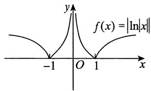

函数图像如图所示.

易知 $x = 1$ 是 $f(x)$ 的极值点， $x = 0$ 是曲线 $y = f(x)$ 的渐近线，点 $(1,0)$ 左侧附近为凹曲线，右侧为凸曲线，故 $(1,0)$ 为拐点。函数在 $x = -1$ 处不可导，故 $x = -1$ 不是 $f(x)$ 的驻点。

综上，选(C).

2.【答案】 $y = \frac{1}{3} x - 1$

【解析】方法一 由极限与无穷小的关系，有

$$
\frac {\left[ f (x) + 1 \right] x ^ {2}}{x - \sin x} = 2 + \alpha , \lim  _ {x \rightarrow 0} \alpha = 0.
$$

于是 $f(x) = \frac{(2 + \alpha)(x - \sin x)}{x^2} - 1.$

但由 $\lim_{x\to 0}\frac{x - \sin x}{x^2}\xrightarrow{\text{洛必达法则}}\lim_{x\to 0}\frac{1 - \cos x}{2x} = \lim_{x\to 0}\frac{x^2}{4x} = 0,$

$$
\lim  _ {x \rightarrow 0} (2 + \alpha) = 2,
$$

可得 $\lim_{x\to 0}f(x) = \lim_{x\to 0}\left[\frac{(2 + \alpha)(x - \sin x)}{x^2} -1\right] = 0 - 1 = -1.$

由于 $f(x)$ 在 $x = 0$ 处连续，因此 $f(0) = \lim_{x\to 0}f(x) = -1$

$$
f ^ {\prime} (0) = \lim  _ {x \rightarrow 0} \frac {f (x) - f (0)}{x - 0} = \lim  _ {x \rightarrow 0} \frac {(2 + \alpha) (x - \sin x)}{x ^ {3}} = \lim  _ {x \rightarrow 0} \frac {(2 + \alpha) \cdot \frac {1}{6} x ^ {3}}{x ^ {3}} = \frac {1}{3},
$$

所以曲线 $y = f(x)$ 在点 $(0, f(0))$ 处的切线方程为

$$
y - f (0) = f ^ {\prime} (0) (x - 0),
$$

即 $y = \frac{1}{3} x - 1$

方法二 将 $\sin x$ 按带佩亚诺余项的泰勒公式展开至 $n = 3$ ，有

$$
x - \sin x = x - \left[ x - \frac {1}{3 !} x ^ {3} + o \left(x ^ {3}\right) \right] = \frac {1}{6} x ^ {3} + o \left(x ^ {3}\right),
$$

代入原极限式，有

$$
2 = \lim  _ {x \rightarrow 0} \frac {\left[ f (x) + 1 \right] x ^ {2}}{x - \sin x} = \lim  _ {x \rightarrow 0} \frac {\left[ f (x) + 1 \right] x ^ {2}}{\frac {1}{6} x ^ {3} + o \left(x ^ {3}\right)} = \lim  _ {x \rightarrow 0} \frac {f (x) + 1}{\frac {1}{6} x + o (x)},
$$

可见 $\lim_{x\to 0}\left[f(x) + 1\right] = 0$ ，即有 $f(0) = \lim_{x\to 0}f(x) = -1$ .于是

$$
f ^ {\prime} (0) = \lim  _ {x \rightarrow 0} \frac {f (x) - f (0)}{x - 0} = \lim  _ {x \rightarrow 0} \frac {f (x) + 1}{x} = \lim  _ {x \rightarrow 0} \left[ \frac {f (x) + 1}{\frac {1}{6} x + o (x)} \cdot \frac {\frac {1}{6} x + o (x)}{x} \right] = 2 \cdot \frac {1}{6} = \frac {1}{3}.
$$

以下同方法一.

# 3.【答案】(D)

【解析】因为 $f(a)$ 是最小值，所以 $f(x) \geqslant f(a), x \in (a, b]$ ，又 $f_{+}^{\prime}(a)$ 存在，故

$$
f _ {+} ^ {\prime} (a) = \lim  _ {x \rightarrow a ^ {+}} \frac {f (x) - f (a)}{x - a} \geqslant 0.
$$

因为 $f(b)$ 是最大值，所以 $f(x)\leqslant f(b),x\in \left[a,b\right)$ ，又 $f_{-}^{\prime}(b)$ 存在，故

$$
f _ {-} ^ {\prime} (b) = \lim  _ {x \rightarrow b ^ {-}} \frac {f (x) - f (b)}{x - b} \geqslant 0.
$$

【注】(1)本题考查可导函数在端点处取最值的必要条件，总结如下：

设 $f(x)$ 在 $[a,b]$ 上可导，则 $f(x)$ 在 $[a,b]$ 上必存在最大(小)值，且

① 若 $f(x)$ 在 $x = a$ 处取 $[a, b]$ 上的最大(小)值，则 $f_{+}^{\prime}(a) \leqslant 0 (\geqslant 0)$ ；  
② 若 $f(x)$ 在 $x = b$ 处取 $[a, b]$ 上的最大(小)值，则 $f_{-}^{\prime}(b) \geqslant 0 (\leqslant 0)$ .

(2) 若 $f(x)$ 在 $[a, b]$ 上可导，且在点 $x = c \in (a, b)$ 处取最大或最小值，则必有 $f'(c) = 0$ ，此为费马定理.  
(3) 在考研中, 要习惯函数 $f(x)$ 的“升阶”或“降阶”. 若本题命制成 $F(x) = \int_{a}^{x} f(t) \mathrm{d}t$ , $x \in [a, b]$ , 此谓“升阶”. 则 $F(x)$ 是 $f(x)$ 在 $[a, b]$ 上的一个原函数, 于是

① 若 $f(x)$ 在 $[a, b]$ 上可导，且当 $f(x)$ 在 $x = a$ 处取得最大(小)值时，有 $F_{+}^{\prime \prime}(a) \leqslant 0 (\geqslant 0)$ ；  
② 若 $f(x)$ 在 $[a, b]$ 上可导，且当 $f(x)$ 在 $x = b$ 处取得最大(小)值时，有 $F_{-}^{\prime \prime}(b) \geqslant 0 (\leqslant 0)$ ；  
③ 若 $f(x)$ 在 $[a, b]$ 上可导，且当 $f(x)$ 在 $x = c \in (a, b)$ 处取得最大或最小值时，有 $F''(c) = 0$ .

# 4.【答案】(D)

【解析】 $f^{\prime}(x) = (x^{2} + 2x + a)\mathrm{e}^{x}$ ，对于 $x^{2} + 2x + a = 0$ 不存在两个不同的解，则 $\Delta = 4 - 4a \leqslant 0$ ，即 $a \geqslant 1$ ：

$f''(x) = (x^2 + 4x + a + 2)\mathrm{e}^x$ ，对于 $x^2 + 4x + a + 2 = 0$ 不存在两个不同的解，则 $\Delta = 16 - 4(a + 2) \leqslant 0$ ，即 $a \geqslant 2$ . 故选(D).

5.【答案】 $\frac{2}{\mathrm{e}}$

【解析】设 $f(x) = \frac{\ln x}{\sqrt{x}}$ ，转化为求 $f(x)$ 在 $x > 0$ 时的最大值。于是，令 $f'(x) = \frac{2 - \ln x}{2x^{\frac{3}{2}}} = 0$ ，得 $x = e^{2}$ 。

又 $x > \mathrm{e}^2$ 时， $f'(x) < 0$ ； $0 < x < \mathrm{e}^2$ 时， $f'(x) > 0$ 。故 $\left[f(x)\right]_{\max} = f(\mathrm{e}^2) = \frac{2}{\mathrm{e}}$ ，即 $a = \frac{2}{\mathrm{e}}$ 。

# 6.【答案】{1}

【解析】首先， $a > 0$ ，若不然，当 $x > 0$ 时， $\mathrm{e}^{ax}\leqslant 1$ ，此时 $\mathrm{e}^{ax}\geqslant 1 + x$ 不成立.

令 $f(x) = \mathrm{e}^{ax} - 1 - x$ ，则 $f^{\prime}(x) = a\mathrm{e}^{ax} - 1$ ，令 $f^{\prime}(x) = 0$ ，得 $\mathrm{e}^{ax} = \frac{1}{a}$ ，即 $ax = -\ln a$ ，解得 $x = -\frac{\ln a}{a}$ .

因为 $f''(x) = a^2\mathrm{e}^{ax} > 0$ ，故

$$
\left[ f (x) \right] _ {\min } = f \left(- \frac {\ln a}{a}\right) = e ^ {- \ln a} - 1 + \frac {\ln a}{a} = \frac {1}{a} - 1 + \frac {\ln a}{a} \geqslant 0,
$$

即 $1 - a + \ln a \geqslant 0$ ，又 $\ln a \leqslant a - 1$ ，故 $\ln a = a - 1$ ，得 $a = 1$ 。

综上， $a$ 的取值范围是 $\{1\}$

【注】考生熟知对任意的 $x \in \mathbf{R}$ , 有 $\mathrm{e}^x \geqslant 1 + x$ , 但本题的解答显然不是那么轻易的, 要明确本题是含参不等式问题, 才能走上正确的解题之路.

# 7.【答案】(A)

【解析】依题设， $f(x)$ 的定义域为 $(0,1)$ ，于是

$$
f (x) = \int_ {0} ^ {1} | t (t - x) | \mathrm {d} t = \int_ {0} ^ {x} (t x - t ^ {2}) \mathrm {d} t - \int_ {x} ^ {1} (t x - t ^ {2}) \mathrm {d} t = \frac {1}{3} x ^ {3} - \frac {x}{2} + \frac {1}{3},
$$

可得 $f^{\prime}(x) = x^{2} - \frac{1}{2} = \left(x - \frac{\sqrt{2}}{2}\right)\left(x + \frac{\sqrt{2}}{2}\right),$

从而知 $f(x)$ 的单调增区间为 $\left(\frac{\sqrt{2}}{2},1\right)$ , 单调减区间为 $\left(0,\frac{\sqrt{2}}{2}\right)$ .

又由 $f''(x) = 2x > 0$ ， $x\in (0,1)$ ，知曲线 $y = f(x)$ 在 $(0,1)$ 内是凹的.

8.【解析】函数 $f(x)$ 的定义域为 $(- \infty, +\infty)$ .

$$
f (x) = x ^ {2} \int_ {1} ^ {x} \ln (1 + t ^ {2}) d t - \int_ {1} ^ {x} t ^ {2} \ln (1 + t ^ {2}) d t,
$$

$$
\begin{array}{l} f ^ {\prime} (x) = 2 x \int_ {1} ^ {x} \ln (1 + t ^ {2}) d t + x ^ {2} \ln (1 + x ^ {2}) - x ^ {2} \ln (1 + x ^ {2}) = 2 x \int_ {1} ^ {x} \ln (1 + t ^ {2}) d t, \\ f ^ {\prime \prime} (x) = 2 \int_ {1} ^ {x} \ln \left(1 + t ^ {2}\right) d t + 2 x \ln \left(1 + x ^ {2}\right). \\ \end{array}
$$

令 $f^{\prime}(x) = 0$ 得 $x_{1} = 0$ ， $x_{2} = 1$ 。

$$
\begin{array}{l} f (0) = - \int_ {1} ^ {0} t ^ {2} \ln \left(1 + t ^ {2}\right) d t = \int_ {0} ^ {1} t ^ {2} \ln \left(1 + t ^ {2}\right) d t = \frac {1}{3} \int_ {0} ^ {1} \ln \left(1 + t ^ {2}\right) d \left(t ^ {3}\right) \\ = \frac {1}{3} \left[ t ^ {3} \ln \left(1 + t ^ {2}\right) \right] \Bigg | _ {0} ^ {1} - \frac {2}{3} \int_ {0} ^ {1} \frac {t ^ {4}}{1 + t ^ {2}} d t = \frac {1}{3} \ln 2 - \frac {2}{3} \int_ {0} ^ {1} \frac {\left(t ^ {4} - 1\right) + 1}{1 + t ^ {2}} d t \\ = \frac {1}{3} \ln 2 - \frac {2}{3} \int_ {0} ^ {1} \left(t ^ {2} - 1 + \frac {1}{1 + t ^ {2}}\right) d t = \frac {1}{3} \ln 2 - \frac {2}{3} \left(\frac {1}{3} t ^ {3} - t + \arctan t\right) \Bigg | _ {0} ^ {1} \\ = \frac {1}{3} \ln 2 - \frac {2}{3} \left(\frac {\pi}{4} - \frac {2}{3}\right) = \frac {1}{3} \ln 2 - \frac {\pi}{6} + \frac {4}{9}, \\ \end{array}
$$

因为 $f^{\prime \prime}(1) = 2\ln 2 > 0$ ， $f^{\prime \prime}(0) = 2\int_{1}^{0}\ln (1 + t^{2})\mathrm{d}t = -2\int_{0}^{1}\ln (1 + t^{2})\mathrm{d}t < 0$ ，所以 $f(1) = 0$ 为极小值， $f(0) = \frac{1}{3}\ln 2 - \frac{\pi}{6} + \frac{4}{9}$ 为极大值.

# 9.【答案】(D)

【解析】(A) 选项, 取 $f(x) = x^{2}, f(0) = 0, f'(0) = 0$ , 而 $x = 0$ 是极小值点, 错误.

(B) 选项, 取 $f(x) = x^3$ , $f'(0) = 0$ , $f''(0) = 0$ , 但 $x = 0$ 不是极值点, 错误.  
(C) 选项, 由 $f^{\prime}(0) > 0$ 不能决定任何区间的单调性, 错误.  
(D) 选项, 由 $f''(0) = \lim_{x \to 0} \frac{f'(x) - f'(0)}{x - 0} = \lim_{x \to 0} \frac{f'(x)}{x} > 0$ , 则存在 $\delta > 0$ , 当 $x \in (-\delta, 0)$ 时, $f'(x) < 0$ , 故 $f(x)$ 在 $(- \delta, 0)$ 内单调递减, 正确.

# 10.【答案】(D)

【解析】 $y = \sqrt[3]{x^3 - 3x^2}$ ，则

$$
a = \lim  _ {x \rightarrow \infty} \frac {y}{x} = \lim  _ {x \rightarrow \infty} \frac {\sqrt [ 3 ]{x ^ {3} - 3 x ^ {2}}}{x} = 1,
$$

$$
b = \lim  _ {x \rightarrow \infty} (y - x) = \lim  _ {x \rightarrow \infty} (\sqrt [ 3 ]{x ^ {3} - 3 x ^ {2}} - x) \xlongequal {t = \frac {1}{x}} \lim  _ {t \rightarrow 0} \frac {\sqrt [ 3 ]{1 - 3 t} - 1}{t} = - 1,
$$

故斜渐近线方程为 $y = x - 1$

# 11.【答案】(B)

【解析】令 $h(x) = \mathrm{e}^{x}f(x)$ ，则 $h^\prime (x) = \mathrm{e}^x\left[f(x) + f'(x)\right]$ ，由于 $f^{\prime}(x)$ 在[0,1]上单调增加，则 $f^{\prime}(x)\geqslant$

$f^{\prime}(0) = 0$ ，故 $f(x)$ 单调增加，则 $f(x)\geqslant f(0) = 0$ .故 $h^\prime (x)\geqslant 0$ ，即 $\mathbf{e}^{x}f(x)$ 在[0,1]上单调增加.

令 $g(x) = \frac{f(x)}{\mathrm{e}^x}$ ，则 $g'(x) = \frac{f'(x)\mathrm{e}^x - f(x)\mathrm{e}^x}{\mathrm{e}^{2x}} = \frac{f'(x) - f(x)}{\mathrm{e}^x}$ . 由拉格朗日中值定理，得 $f(x) - f(0) = f'(\xi)x$ ，其中 $0 < \xi < x \leqslant 1$ ：

故 $g^{\prime}(x) = \frac{f^{\prime}(x) - f^{\prime}(\xi)\bullet x}{\mathrm{e}^{x}},$

又 $f^{\prime}(x)$ 在 $[0,1]$ 上单调增加，则 $f^{\prime}(x)\geqslant f^{\prime}(\xi)\geqslant 0$ ，故当 $0\leqslant x\leqslant 1$ 时， $xf^{\prime}(\xi)\leqslant xf^{\prime}(x)\leqslant f^{\prime}(x)$ ，所以 $g^{\prime}(x)\geqslant 0$ ，即 $\frac{f(x)}{\mathrm{e}^x}$ 在 $[0,1]$ 上单调增加.

# 12.【答案】(B)

【解析】由 $f^{\prime}(x_0) = 0$ 可知， $x = x_0$ 是函数 $f(x)$ 的驻点，将 $x = x_0$ 代入已知式，得 $f''(x_0) = \frac{1 - \mathrm{e}^{-x_0}}{x_0}$ 当 $x_0 > 0$ 时， $\mathrm{e}^{-x_0} < 1$ ；当 $x_0 < 0$ 时， $\mathrm{e}^{-x_0} > 1$ ：

所以 $f''(x_0) > 0$ ，对一切 $x_0(x_0 \neq 0)$ 成立.

故函数在 $x = x_0$ 处取得极小值，极小值为 $f(x_0)$

# 13.【答案】(B)

【解析】等式两边对 $x$ 求导，有

$$
e ^ {- \frac {y ^ {2}}{4}} \cdot y ^ {\prime} = \frac {2}{3} (\sqrt {x} - 2) \cdot \frac {1}{2 \sqrt {x}},
$$

$$
y ^ {\prime} = \frac {1}{3 \sqrt {x}} (\sqrt {x} - 2) \mathrm {e} ^ {\frac {y ^ {2}}{4}}.
$$

令 $y' = 0$ ，得唯一驻点 $x = 4$ 。当 $0 < x < 4$ 时， $y' < 0$ ；当 $x > 4$ 时， $y' > 0$ 。

故 $x = 4$ 为极小值点.当 $x = 4$ 时，由等式可知， $y(4) = 0$ ，故极小值为0.

由题易知 $x \geqslant 0$ ，故 $x = 0$ 为端点，因为在端点处不讨论是否为极值点，所以选项(C)，(D)均不对.

# 14.【答案】(A)

【解析】充分性. 由柯西中值定理, 有

$$
\frac {f (x) - f (a)}{g (x) - g (a)} = \frac {f ^ {\prime} (\xi)}{g ^ {\prime} (\xi)}, \xi \in (a, x).
$$

因 $\frac{f'(x)}{g'(x)}$ 在区间 $(a,b)$ 内严格单调递增，则 $\frac{f'(\xi)}{g'(\xi)} < \frac{f'(x)}{g'(x)}$ ，即

$$
f ^ {\prime} (x) > g ^ {\prime} (x) \frac {f ^ {\prime} (\xi)}{g ^ {\prime} (\xi)} = g ^ {\prime} (x) \frac {f (x) - f (a)}{g (x) - g (a)},
$$

因此 $f^{\prime}(x)\left[g(x) - g(a)\right] > g^{\prime}(x)\left[f(x) - f(a)\right],$

于是 $\left[\frac{f(x) - f(a)}{g(x) - g(a)}\right]' = \frac{f'(x)[g(x) - g(a)] - g'(x)[f(x) - f(a)]}{[g(x) - g(a)]^2} > 0,$

所以 $\frac{f(x) - f(a)}{g(x) - g(a)}$ 在区间 $(a,b)$ 内严格单调递增.

必要性. 令 $f(x) = \begin{cases} x^2, & -1 \leqslant x < 0, \\ 0, & 0 \leqslant x \leqslant 1, \end{cases} g(x) = x$ ，则

$$
h (x) = \frac {f (x) - f (- 1)}{g (x) - g (- 1)} = \left\{ \begin{array}{l l} \frac {x ^ {2} - 1}{x + 1} = x - 1, & - 1 <   x <   0, \\ \frac {0 - 1}{x + 1} = - \frac {1}{x + 1}, & 0 \leqslant x <   1, \end{array} \right.
$$

于是 $h^{\prime}(x) = \left\{ \begin{array}{ll}1, & -1 <   x <   0,\\ \frac{1}{(x + 1)^{2}}, & 0\leqslant x <   1, \end{array} \right.$

其中 $h_{+}^{\prime}(0) = \lim_{x\to 0^{+}}\frac{h(x) - h(0)}{x} = \lim_{x\to 0^{+}}\frac{-\frac{1}{x + 1} + 1}{x} = 1,$

$$
h _ {-} ^ {\prime} (0) = \lim  _ {x \rightarrow 0 ^ {-}} \frac {h (x) - h (0)}{x} = \lim  _ {x \rightarrow 0 ^ {-}} \frac {x - 1 + 1}{x} = 1.
$$

于是 $\frac{f(x) - f(-1)}{g(x) - g(-1)}$ 在 $(-1,1)$ 内严格单调递增，但 $\frac{f'(x)}{g'(x)} = \begin{cases} 2x, & -1 < x < 0, \\ 0, & 0 \leqslant x < 1 \end{cases}$ 在 $(-1,1)$ 内非严格单调递增，故必要性不成立.

# 15.【答案】(B)

【解析】① $\lim_{x\to 0^{-}}(5x - 3)\mathrm{e}^{-\frac{1}{x}} = -\infty$ ，故 $x = 0$ 是一条铅直渐近线.

② $\lim_{x\to \infty}(5x - 3)\mathrm{e}^{-\frac{1}{x}}$ 不存在，故无水平渐近线.  
③斜渐近线.

$$
\begin{array}{l} a = \lim  _ {x \rightarrow \infty} \frac {5 x - 3}{x} e ^ {- \frac {1}{x}} = 5, \\ b = \lim  _ {x \rightarrow \infty} \left[ (5 x - 3) e ^ {- \frac {1}{x}} - 5 x \right] = \lim  _ {x \rightarrow \infty} \left[ (5 x - 3) - 5 x e ^ {\frac {1}{x}} \right] \cdot e ^ {- \frac {1}{x}} \\ = \lim  _ {x \rightarrow \infty} \left[ 5 x \left(1 - e ^ {\frac {1}{x}}\right) - 3 \right] = \lim  _ {x \rightarrow \infty} \left[ \frac {5 \left(1 - e ^ {\frac {1}{x}}\right)}{\frac {1}{x}} - 3 \right] = - 8, \\ \end{array}
$$

所以斜渐近线为 $y = 5x - 8$

16.【答案】(C)

【解析】① $\lim_{x\to +\infty}\frac{\sqrt{x^2 - x + 1}}{e^x - 1} = \lim_{x\to +\infty}\frac{x\sqrt{1 - \frac{1}{x} + \frac{1}{x^2}}}{e^x - 1} = 0,$

故 $y = 0$ 为水平渐近线.

② $\lim_{x\to 0}\frac{\sqrt{x^2 - x + 1}}{e^x - 1} = \infty$ ，所以 $x = 0$ 为铅直渐近线.

$a = \lim_{x\to -\infty}\frac{y(x)}{x} = \lim_{x\to -\infty}\frac{-x\sqrt{1 - \frac{1}{x} + \frac{1}{x^2}}}{x(\mathrm{e}^x - 1)} = 1,$

$$
\begin{array}{l} b = \lim  _ {x \rightarrow - \infty} [ y (x) - a x ] = \lim  _ {x \rightarrow - \infty} \left(\frac {\sqrt {x ^ {2} - x + 1}}{\mathrm {e} ^ {x} - 1} - x\right) = \lim  _ {x \rightarrow - \infty} \frac {(- x) \sqrt {1 - \frac {1}{x} + \frac {1}{x ^ {2}}} + (- x) (\mathrm {e} ^ {x} - 1)}{\mathrm {e} ^ {x} - 1} \\ \underline {{\underline {{\frac {1}{x} = t}}}} \lim  _ {t \rightarrow 0 ^ {-}} \frac {\sqrt {1 - t + t ^ {2}} + e ^ {\frac {1}{t}} - 1}{t} = \lim  _ {t \rightarrow 0 ^ {-}} \left[ \frac {\frac {1}{2} (t ^ {2} - t)}{t} + \frac {e ^ {\frac {1}{t}}}{t} \right] = - \frac {1}{2}. \\ \end{array}
$$

所以有斜渐近线 $y = x - \frac{1}{2}$

17.【答案】(D)

【解析】 $\left\{ \begin{array}{l}x = r\cos \theta = \frac{\cos\theta}{3\theta - \pi},\\ y = r\sin \theta = \frac{\sin\theta}{3\theta - \pi}, \end{array} \right.$ 当 $x\to \infty$ 时， $\theta \rightarrow \frac{\pi}{3}$

$$
a = \lim  _ {x \rightarrow \infty} \frac {y}{x} = \lim  _ {\theta \rightarrow \frac {\pi}{3}} \tan \theta = \sqrt {3},
$$

$$
b = \lim  _ {x \rightarrow \infty} (y - \sqrt {3} x) = \lim  _ {\theta \rightarrow \frac {\pi}{3}} \frac {\sin \theta - \sqrt {3} \cos \theta}{3 \theta - \pi} = \lim  _ {\theta \rightarrow \frac {\pi}{3}} \frac {\cos \theta + \sqrt {3} \sin \theta}{3} = \frac {2}{3},
$$

故所求斜渐近线为 $y = \sqrt{3} x + \frac{2}{3}$

18.【答案】 $y = x - 1$

【解析】 $a = \lim_{x\to \infty}\frac{x^2\ln\left(\sin{\frac{1}{x}} + \cos{\frac{1}{x}}\right)}{x} = \lim_{x\to \infty}\ln \left(1 + \sin {\frac{2}{x}}\right)^{\frac{x}{2}} = \ln e = 1,$

$$
b = \lim  _ {x \rightarrow \infty} \left[ x ^ {2} \ln \left(\sin \frac {1}{x} + \cos \frac {1}{x}\right) - x \right] = \lim  _ {x \rightarrow \infty} \frac {\ln \left(\sin \frac {1}{x} + \cos \frac {1}{x}\right) - \frac {1}{x}}{\frac {1}{x ^ {2}}}
$$

$$
\frac {\frac {1}{x} = t}{\underline {{=}}} \lim  _ {t \rightarrow 0} \frac {\ln (\sin t + \cos t) - t}{t ^ {2}} = \lim  _ {t \rightarrow 0} \frac {\frac {\cos t - \sin t}{\sin t + \cos t} - 1}{2 t} = \lim  _ {t \rightarrow 0} \frac {- \sin t - \sin t}{2 t (\sin t + \cos t)} = - 1,
$$

所以有斜渐近线 $y = x - 1$

19.【解析】 $a = \lim_{x\to +\infty}\frac{y}{x} = \lim_{x\to +\infty}x\left[\frac{\left(1 + \frac{1}{x}\right)^x}{e} -1\right]$

$$
\xlongequal {x = \frac {1}{t}} \lim  _ {t \rightarrow 0 ^ {+}} \frac {\mathrm {e} ^ {\frac {\ln (1 + t)}{t} - 1} - 1}{t} = \lim  _ {t \rightarrow 0 ^ {+}} \frac {\ln (1 + t) - t}{t ^ {2}} = - \frac {1}{2},
$$

$$
\begin{array}{l} b = \lim  _ {x \rightarrow + \infty} \left(y + \frac {1}{2} x\right) \stackrel {x = \frac {1}{t}} {=} \lim  _ {t \rightarrow 0 ^ {+}} \frac {2 e ^ {\frac {\ln (1 + t) - t}{t}} - 2 + t}{2 t ^ {2}} = \lim  _ {t \rightarrow 0 ^ {+}} \frac {2 \left[ e ^ {- \frac {t}{2} + \frac {t ^ {2}}{3} + o (t ^ {2})} - 1 \right] + t}{2 t ^ {2}} \\ = \lim  _ {t \rightarrow 0 ^ {+}} \frac {2 \left\{- \frac {t}{2} + \frac {t ^ {2}}{3} + o (t ^ {2}) + \frac {1}{2} \left[ - \frac {t}{2} + \frac {t ^ {2}}{3} + o (t ^ {2}) \right] ^ {2} + o (t ^ {2}) \right\} + t}{2 t ^ {2}} \\ = \lim  _ {t \rightarrow 0 ^ {+}} \frac {\frac {2}{3} t ^ {2} + \frac {1}{4} t ^ {2} + o \left(t ^ {2}\right)}{2 t ^ {2}} = \frac {1 1}{2 4}, \\ \end{array}
$$

故斜渐近线为 $y = -\frac{1}{2} x + \frac{11}{24}$

20.【答案】(C)

【解析】由 $\lim_{x\to 0}\frac{\ln\left[f(x + 2) + \mathrm{e}^{x^2}\right]}{1 - \cos{x}} = \lim_{x\to 0}\frac{f(x + 2) + \mathrm{e}^{x^2} - 1}{\frac{1}{2}x^2} = 2\lim_{x\to 0}\frac{f(x + 2)}{x^2} +2 = 4,$

可得 $\lim_{x\to 0}\frac{f(x + 2)}{x^2} = 1$ ，因此 $f(2) = 0$ ：

$$
f ^ {\prime} (2) = \lim  _ {x \rightarrow 0} \frac {f (x + 2) - f (2)}{x} = \lim  _ {x \rightarrow 0} \frac {f (x + 2)}{x} = \lim  _ {x \rightarrow 0} \frac {f (x + 2)}{x ^ {2}} \cdot x = 0,
$$

故 $x = 2$ 为 $f(x)$ 的驻点，且在 $x = 0$ 的某去心邻域内有 $\frac{f(x + 2)}{x^2} > 0$ ，即 $f(x + 2) > 0 = f(2)$ ，也即 $x = 2$ 为极小值点. 故选(C).

# 21.【答案】(B)

【解析】拐点与二阶导数有关，而题中给出的是 $f^{\prime}(x)$ 的图形，所以要由 $f^{\prime}(x)$ 推出 $f^{\prime \prime}(x)$ 的大致图形，以此分析曲线 $y = f(x)$ 的拐点个数.为叙

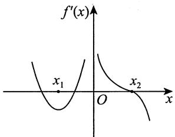

述方便，重新画图并注以字母，如图所示.

在 $x_{1}$ 处， $f^{\prime \prime}(x_{1}) = \left[f^{\prime}(x)\right]^{\prime}\bigg|_{x = x_{1}} = 0$ ，且在 $x = x_{1}$ 的左侧邻域， $f^{\prime \prime}(x) = \left[f^{\prime}(x)\right]^{\prime} < 0$ ，右侧邻域 $f^{\prime \prime}(x) = \left[f^{\prime}(x)\right]^{\prime} > 0$ ，所以点 $(x_{1}, f(x_{1}))$ 是一个拐点。类似地，在 $x = 0$ 的左侧邻域 $f^{\prime \prime}(x) = \left[f^{\prime}(x)\right]^{\prime} > 0$ ，右侧邻域 $f^{\prime \prime}(x) = \left[f^{\prime}(x)\right]^{\prime} < 0$ ，点 $(0, f(0))$ 也是一个拐点。在 $x = x_{2}$ 的左右两侧均有 $f^{\prime \prime}(x) = \left[f^{\prime}(x)\right]^{\prime} < 0$ ， $f^{\prime \prime}(x)$ 不变号。故曲线 $y = f(x)$ 只有两个拐点： $(x_{1}, f(x_{1}))$ 与 $(0, f(0))$ 。

# 22.【答案】(B)

【解析】依题意，可得

$$
f (x) = \left\{ \begin{array}{l} \frac {1}{1 - x} + \frac {1}{1 + a - x}, x <   0, \\ \frac {1}{1 + x} + \frac {1}{1 + a - x}, 0 \leqslant x <   a, \\ \frac {1}{1 + x} + \frac {1}{1 + x - a}, x \geqslant a, \end{array} \right.
$$

$$
f ^ {\prime} (x) = \left\{ \begin{array}{l} \frac {1}{(1 - x) ^ {2}} + \frac {1}{(1 + a - x) ^ {2}}, x <   0, \\ \frac {- 1}{(1 + x) ^ {2}} + \frac {1}{(1 + a - x) ^ {2}}, 0 <   x <   a, \\ \frac {- 1}{(1 + x) ^ {2}} + \frac {- 1}{(1 + x - a) ^ {2}}, x > a. \end{array} \right.
$$

故 $f(x)$ 在 $(-\infty, 0)$ 上单调递增，在 $(a, +\infty)$ 上单调递减，因此最大值总在 $[0, a]$ 中.

令 $f^{\prime}(x) = 0$ ，有 $1 + x = 1 + a - x$ ，得 $x = \frac{a}{2}$ . 比较 $f(0) = f(a) = \frac{2 + a}{1 + a}$ ， $f\left(\frac{a}{2}\right) = \frac{4}{2 + a}$ ，于是 $\left[f(x)\right]_{\max} = \frac{2 + a}{1 + a}$ .

# 23.【答案】(C)

【解析】由题图可知， $f^{\prime}(1) = f^{\prime}(3) = 0$ ，即函数 $f(x)$ 在区间(0,4)内有两个驻点 $x = 1$ 和 $x = 3$ ，故 $f(x)$ 在[0,4]上的最大值和最小值只能在 $f(0), f(1), f(3), f(4)$ 中取得.

由 $f(0) = 1$ ，有

$$
f (3) = f (1) + \int_ {1} ^ {3} f ^ {\prime} (x) d x = - 2 + 4 = 2,
$$

$$
f (4) = f (3) + \int_ {3} ^ {4} f ^ {\prime} (x) d x = 2 + (- 2) = 0.
$$

故最大值为 $f(3) = 2$ ，最小值为 $f(1) = -2$

24.【答案】 $\mathrm{e}^{-1}$

【解析】先求 $y = \tan^n x$ 在点 $M\left(\frac{\pi}{4}, 1\right)$ 处的切线方程，由

$$
y ^ {\prime} \left(\frac {\pi}{4}\right) = n \tan^ {n - 1} x \cdot \sec^ {2} x \Big | _ {x = \frac {\pi}{4}} = 2 n,
$$

得切线方程 $y - 1 = 2n\left(x - \frac{\pi}{4}\right).$

在 $x$ 轴上的截距为 $x_{n} = \frac{\pi}{4} -\frac{1}{2n}$ ，故

$$
\lim  _ {n \rightarrow \infty} y (x _ {n}) = \lim  _ {n \rightarrow \infty} \tan^ {n} \left(\frac {\pi}{4} - \frac {1}{2 n}\right) \stackrel {1 ^ {\infty}} {=} e ^ {A},
$$

其中 $A = \lim_{n\to \infty}n\left[\tan \left(\frac{\pi}{4} -\frac{1}{2n}\right) - 1\right] = \lim_{n\to \infty}\frac{\tan\left(\frac{\pi}{4} - \frac{1}{2n}\right) - \tan\frac{\pi}{4}}{\frac{1}{n}}$

$$
= - \frac {1}{2} (\tan x) ^ {\prime} \Bigg | _ {x = \frac {\pi}{4}} = - \frac {1}{2} \cdot \left. \frac {1}{\cos^ {2} x} \right| _ {x = \frac {\pi}{4}} = - 1.
$$

故原极限 $= \mathrm{e}^{-1}$

25.【解析】设曲线 $\frac{x^2}{4} + y^2 = 1 (x > 0, y > 0)$ 上的任意点为 $(x, y)$ ，则切线方程为 $\frac{xX}{4} + yY = 1$ ，切线的两个截距分别为 $X = \frac{4}{x}, Y = \frac{1}{y}$ . 于是线段 $L$ 的长度平方为

$$
d ^ {2} = \frac {1 6}{x ^ {2}} + \frac {1}{y ^ {2}} = \frac {1 6}{x ^ {2}} + \frac {4}{4 - x ^ {2}}.
$$

记 $f(x) = d^{2} = \frac{16}{x^{2}} + \frac{4}{4 - x^{2}}$ ，则 $f^{\prime}(x) = \frac{8(8 - x^{2})(3x^{2} - 8)}{x^{3}(4 - x^{2})^{2}}$ .

由此得到区间(0,2)上的唯一驻点 $x_0 = \frac{2}{3}\sqrt{6}$ . 由 $f'(x)$ 的表达式可以看出，在点 $x_0$ 左侧 $f'(x) < 0$ ，在点 $x_0$ 右侧 $f'(x) > 0$ ，故 $f(x)$ 在点 $x_0 = \frac{2}{3}\sqrt{6}$ 达到最小值，且

$$
d _ {\min } = \sqrt {f \left(\frac {2}{3} \sqrt {6}\right)} = \sqrt {\frac {1 6}{\frac {8}{3}} + \frac {4}{\frac {4}{3}}} = 3,
$$

切点坐标为 $\left(\frac{2\sqrt{6}}{3},\frac{\sqrt{3}}{3}\right)$

26.【解析】 $f(x) = \int_0^x\left|\ln (x - t)\right|\mathrm{d}t + \int_x^1\left|\ln (t - x)\right|\mathrm{d}t$

$$
= - \int_ {0} ^ {x} \ln (x - t) d t - \int_ {x} ^ {1} \ln (t - x) d t
$$

$$
\frac {\text {前 项 令} x - t = u}{\text {后 项 令} t - x = v} \int_ {x} ^ {0} \ln u \mathrm {d} u - \int_ {0} ^ {1 - x} \ln v \mathrm {d} v,
$$

则当 $x\in (0,1)$ 时，

$$
f ^ {\prime} (x) = - \ln x + \ln (1 - x) \stackrel {\text {令}} {=} 0,
$$

得 $\ln \frac{1 - x}{x} = 0$ 即 $\frac{1 - x}{x} = 1$ ，解得 $x = \frac{1}{2}$

又 $f^{\prime \prime}(x) = -\left(\frac{1}{x} +\frac{1}{1 - x}\right) <   0(0 <   x <   1),$

故 $x = \frac{1}{2}$ 是唯一的极大值点，

$$
f \left(\frac {1}{2}\right) = - \int_ {0} ^ {\frac {1}{2}} \ln u d u - \int_ {0} ^ {\frac {1}{2}} \ln v d v = - 2 \int_ {0} ^ {\frac {1}{2}} \ln u d u = - 2 u \ln u \Bigg | _ {0} ^ {\frac {1}{2}} + 2 \int_ {0} ^ {\frac {1}{2}} d u = 1 + \ln 2.
$$

而 $f(0) = f(1) = 1$ ，故 $\left[f(x)\right]_{\max} = 1 + \ln 2.$

27.【解析】(1)由 $(xy' - 2)\ln x + y = 0$ 整理得 $y' + \frac{1}{x\ln x} y = \frac{2}{x}$ ，该方程为一阶线性微分方程，根据一阶线性微分方程的通解公式，其通解为

$$
y = \mathrm {e} ^ {- \int_ {x \ln x} ^ {1} \mathrm {d} x} \left(\int_ {x} ^ {2} \mathrm {e} ^ {\int_ {x \ln x} ^ {1} \mathrm {d} x} \mathrm {d} x + C\right) = \frac {1}{\ln x} (\ln^ {2} x + C).
$$

由 $y(\mathrm{e}) = 2$ ，得 $C = 1$ .故

$$
y (x) = \ln x + \frac {1}{\ln x}, x \in (0, 1) \cup (1, + \infty).
$$

(2) $y^\prime (x) = \frac{1}{x}\left(1 - \frac{1}{\ln^2x}\right),y''(x) = \frac{1}{x^2}\left(\frac{1}{\ln^2x} +\frac{2}{\ln^3x} -1\right).$

令 $y^\prime (x) = 0$ ，得 $x = \mathbf{e}$ 或 $x = \frac{1}{\mathbf{e}}$

$y^{\prime \prime}(\mathbf{e}) = \frac{2}{\mathbf{e}^{2}} >0$ ，则 $x = \mathbf{e}$ 为极小值点，极小值为 $y(\mathrm{e}) = 2$ ：

$y^{\prime \prime}\left(\frac{1}{\mathbf{e}}\right) = -2\mathbf{e}^{2} < 0$ ，则 $x = \frac{1}{\mathrm{e}}$ 为极大值点，极大值为 $y\left(\frac{1}{\mathrm{e}}\right) = -2$ ：

28.【解析】(1)由 $(xy - 1)\mathrm{d}x + x^{2}\mathrm{d}y = 0$ 整理得 $y^\prime +\frac{1}{x} y = \frac{1}{x^2}$ ，利用一阶线性微分方程的通解公式，可得

$$
y = \mathrm {e} ^ {- \int_ {x} ^ {1} \mathrm {d} x} \left(\int_ {x ^ {2}} ^ {1} \mathrm {e} ^ {\int_ {x} ^ {1} \mathrm {d} x} \mathrm {d} x + C\right) = \frac {\ln x + C}{x}.
$$

又 $y(1) = 0$ ，则 $C = 0$ ，故 $y = \frac{\ln x}{x}$

(2) 由(1)知， $y = \frac{\ln x}{x}$ ，则

$$
y ^ {\prime} = \frac {1 - \ln x}{x ^ {2}}, y ^ {\prime \prime} = \frac {2 \ln x - 3}{x ^ {3}}.
$$

令 $y^{\prime \prime} = 0$ ，解得 $x = \mathrm{e}^{\frac{3}{2}}$

又当 $x > \mathrm{e}^{\frac{3}{2}}$ 时， $y'' > 0$ ；当 $0 < x < \mathrm{e}^{\frac{3}{2}}$ 时， $y'' < 0$ 。故拐点为 $\left(\mathrm{e}^{\frac{3}{2}}, \frac{3}{2\mathrm{e}^{\frac{3}{2}}}\right)$ 。

由于 $\lim_{x\to +\infty}\frac{\ln x}{x} = 0$ ，故 $y = 0$ 为曲线 $y = y(x)$ 在 $x\to +\infty$ 时的一条水平渐近线.

由于 $\lim_{x\to 0^{+}}\frac{\ln x}{x} = -\infty$ ，故 $x = 0$ 为曲线 $y = y(x)$ 的一条铅直渐近线.

29.【答案】(B)

【解析】 $\lim_{x\to \infty}\frac{y}{x} = \lim_{x\to \infty}\ln \left(2 + \frac{1}{x - 1}\right) = \ln 2,$

$$
\begin{array}{l} \lim  _ {x \rightarrow \infty} (y - x \ln 2) = \lim  _ {x \rightarrow \infty} \left[ x \ln \left(2 + \frac {1}{x - 1}\right) - x \ln 2 \right] = \lim  _ {x \rightarrow \infty} x \left[ \ln \left(2 + \frac {1}{x - 1}\right) - \ln 2 \right] \\ = \lim  _ {x \rightarrow \infty} x \ln \left[ 1 + \frac {1}{2 (x - 1)} \right] = \lim  _ {x \rightarrow \infty} x \cdot \frac {1}{2 (x - 1)} = \frac {1}{2}. \\ \end{array}
$$

故曲线的斜渐近线方程为 $y = x \ln 2 + \frac{1}{2}$

30.【解析】先看无定义点 $x = 0$ ，因

$$
\begin{array}{l} \lim  _ {x \rightarrow 0} y = \lim  _ {x \rightarrow 0} x ^ {3} \left(\mathrm {e} ^ {\frac {1}{x}} + \mathrm {e} ^ {- \frac {1}{x}} - 2\right) \\ \frac {\frac {1}{-} = t}{x} \lim  _ {t \rightarrow \infty} \frac {\mathrm {e} ^ {t} + \mathrm {e} ^ {- t} - 2}{t ^ {3}} = \lim  _ {t \rightarrow \infty} \frac {\mathrm {e} ^ {t} - \mathrm {e} ^ {- t}}{3 t ^ {2}} \\ = \lim  _ {t \rightarrow \infty} \frac {\mathrm {e} ^ {t} + \mathrm {e} ^ {- t}}{6 t} = \lim  _ {t \rightarrow \infty} \frac {\mathrm {e} ^ {t} - \mathrm {e} ^ {- t}}{6} = \infty , \\ \end{array}
$$

故 $x = 0$ 为曲线的铅直渐近线.

再看 $\lim_{x\to \infty}y = \lim_{x\to \infty}x^{3}\left(\mathrm{e}^{\frac{1}{x}} + \mathrm{e}^{-\frac{1}{x}} - 2\right)\stackrel {\frac{1}{x} = t}{=}\lim_{t\to 0}\frac{\mathrm{e}^{t} + \mathrm{e}^{-t} - 2}{t^{3}}$

$$
\begin{array}{l} = \lim  _ {t \rightarrow 0} \frac {1 + t + \frac {t ^ {2}}{2} + 1 - t + \frac {t ^ {2}}{2} - 2 + o \left(t ^ {2}\right)}{t ^ {3}} \\ = \lim  _ {t \rightarrow 0} \frac {t ^ {2} + o (t ^ {2})}{t ^ {3}} = \infty , \\ \end{array}
$$

故曲线无水平渐近线.

因为 $\lim_{x\to \infty}\frac{y}{x} = \lim_{x\to \infty}x^{2}\left(\mathrm{e}^{\frac{1}{x}} + \mathrm{e}^{-\frac{1}{x}} - 2\right)\xrightarrow[x]{\frac{1}{x} = t}\lim_{t\to 0}\frac{\mathrm{e}^{t} + \mathrm{e}^{-t} - 2}{t^{2}}$

$$
= \lim  _ {t \rightarrow 0} \frac {1 + t + \frac {t ^ {2}}{2} + 1 - t + \frac {t ^ {2}}{2} - 2 + o \left(t ^ {2}\right)}{t ^ {2}} = \lim  _ {t \rightarrow 0} \frac {t ^ {2} + o \left(t ^ {2}\right)}{t ^ {2}} = 1,
$$

又 $\lim_{x\to \infty}(y - x) = \lim_{x\to \infty}\left[x^{3}\left(\mathrm{e}^{\frac{1}{x}} + \mathrm{e}^{-\frac{1}{x}} - 2\right) - x\right] = \lim_{t\to 0}\frac{\mathrm{e}^{t} + \mathrm{e}^{-t} - 2 - t^{2}}{t^{3}}$

$$
\begin{array}{l} = \lim  _ {t \rightarrow 0} \frac {1 + t + \frac {t ^ {2}}{2} + \frac {t ^ {3}}{3 !} + 1 - t + \frac {t ^ {2}}{2} - \frac {t ^ {3}}{3 !} - 2 - t ^ {2} + o \left(t ^ {3}\right)}{t ^ {3}} \\ = \lim  _ {t \rightarrow 0} \frac {o \left(t ^ {3}\right)}{t ^ {3}} = 0, \\ \end{array}
$$

于是 $y = x$ 为曲线的斜渐近线.

综上，曲线的铅直渐近线为 $x = 0$ ，斜渐近线为 $y = x$

31.【答案】 $\frac{2}{3}$

【解析】由于 $\frac{\mathrm{d}x}{\mathrm{d}t} = 2\mathrm{e}^t +1$ ， $\frac{\mathrm{dy}}{\mathrm{dt}} = 4te^{t} + 2t$ ，故由参数方程求导法则可得

$$
\frac {\mathrm {d} y}{\mathrm {d} x} = \frac {4 t \mathrm {e} ^ {t} + 2 t}{2 \mathrm {e} ^ {t} + 1} = 2 t,
$$

从而 $\frac{\mathrm{d}^2y}{\mathrm{d}x^2} = \frac{\mathrm{d}}{\mathrm{d}t}\left(\frac{\mathrm{d}y}{\mathrm{d}x}\right) \cdot \frac{1}{\frac{\mathrm{d}x}{\mathrm{d}t}} = \frac{2}{2\mathrm{e}^t + 1},$

则 $\left.\frac{\mathrm{dy}}{\mathrm{dx}}\right|_{t = 0} = 0,\left.\frac{\mathrm{d}^2y}{\mathrm{dx}^2}\right|_{t = 0} = \frac{2}{3},$

所以曲线在 $t = 0$ 对应点处的曲率 $k = \frac{\left|y^{\prime\prime}\right|}{\left[1 + (y^{\prime})^{2}\right]^{\frac{3}{2}}}\Bigg|_{t = 0} = \frac{2}{3}.$

32.【答案】 $\frac{\sqrt{2}}{4}$

【解析】对方程 $x(1 + y) - \mathrm{e}^{y} + 1 = 0$ 的两端同时关于 $x$ 求一阶、二阶导数，得

$$
1 + y + x y ^ {\prime} - y ^ {\prime} \mathrm {e} ^ {y} = 0,
$$

$$
2 y ^ {\prime} + x y ^ {\prime \prime} - (y ^ {\prime}) ^ {2} e ^ {y} - y ^ {\prime \prime} e ^ {y} = 0.
$$

将 $x = 0$ ， $y = 0$ 代入上述两式，得 $y^\prime (0) = 1$ ， $y^{\prime \prime}(0) = 1$ ：

因此，曲线 $y = f(x)$ 在点 $(0,0)$ 处的曲率为

$$
k = \frac {\left| y ^ {\prime \prime} (0) \right|}{\sqrt {\left\{1 + \left[ y ^ {\prime} (0) \right] ^ {2} \right\} ^ {3}}} = \frac {1}{2 \sqrt {2}} = \frac {\sqrt {2}}{4}.
$$

33.【答案】 $\left(x - \frac{1}{2}\right)^2 + y^2 = \frac{1}{4}$

【解析】因 $x\big|_{y = 0} = 0,x'\big|_{y = 0} = 2y\big|_{y = 0} = 0,x''\big|_{y = 0} = 2 > 0$ ，故设圆的方程为 $(x - a)^{2} + y^{2} = a^{2}$ ，其图形如图所示.

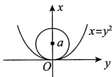

对该方程两边关于 $y$ 求二阶导数，有

$$
2 (x - a) \cdot x ^ {\prime} + 2 y = 0,
$$

$$
2 \left(x ^ {\prime}\right) ^ {2} + 2 (x - a) x ^ {\prime \prime} + 2 = 0.
$$

由于 $x\big|_{y = 0} = 0,x'\big|_{y = 0} = 0,x''\big|_{y = 0} = 2$ ，故有 $2\cdot (-a)\cdot 2 + 2 = 0$ ，得 $a = \frac{1}{2}$

于是圆的方程为 $\left(x - \frac{1}{2}\right)^2 + y^2 = \frac{1}{4}$ .

【注】考生要识别出此题是求曲率圆方程的，由 $x^{\prime}\big|_{y = 0} = 0$ ， $x''\big|_{y = 0} = 2$ ，得曲率 $k = 2$ ，即曲率半径 $R = \frac{1}{2}$ ，可直接得到答案.此题道出了曲线在(0,0)附近的近似表达及其精度(至二阶).

# 第6章 一元函数微分学的应用（二）

# ——中值定理、微分等式与微分不等式

# 1.【答案】(A)

【解析】对于 ① ，可举反例 $f(x) = \frac{\sin x^2}{x}$ ， $\lim_{x \to +\infty} f(x)$ 存在，但 $\lim_{x \to +\infty} f'(x)$ 不存在.

对于 ② ，可举反例 $f(x) = x$ ， $\lim_{x\to +\infty}f'(x)$ 存在，但 $\lim_{x\to +\infty}f(x)$ 不存在.

对于 ③ ，不妨设 $a > 0$ ，则存在 $X > 0$ ，当 $x > X$ 时， $f'(x) > \frac{a}{2}$ ，故

$$
f (x) = f (X) + \int_ {X} ^ {x} f ^ {\prime} (t) d t > f (X) + \frac {a}{2} (x - X),
$$

当 $x \to +\infty$ 时， $f(x) \to +\infty$ ，故③正确.

对于 ④ ，可举反例 $f(x) = \sqrt{x}$ ， $\lim_{x \to +\infty} f'(x) = 0$ ，但 $f(x)$ 在 $x \to +\infty$ 时无界.

# 2.【答案】(C)

【解析】常用结论：已知 $\lim_{x\to +\infty}f'(x)$ 存在，若 $\lim_{x\to +\infty}f'(x) = a\neq 0$ ，则 $f(x)$ 在 $x\rightarrow +\infty$ 时无界.其逆否命题为已知 $\lim_{x\to +\infty}f'(x)$ 存在，若 $f(x)$ 在 $x\to +\infty$ 时有界，则 $\lim_{x\to +\infty}f'(x)$ 不等于非零常数，即 $\lim_{x\to +\infty}f'(x) = 0$ 又 $\lim_{x\to +\infty}f(x)$ 存在，则 $f(x)$ 在 $x\to +\infty$ 时有界.综上，结论①正确.

已知 $\lim_{x\to +\infty}\left[f(x) + f'(x)\right]$ 存在，且

$$
\lim  _ {x \to + \infty} f (x) = \lim  _ {x \to + \infty} {\frac {f (x) \mathrm {e} ^ {x}}{\mathrm {e} ^ {x}}} {\overset {\text {广 义 洛 必 达 法 则}} {=}} \lim  _ {x \to + \infty} \left[ f (x) + f ^ {\prime} (x) \right],
$$

故 $\lim_{x\to +\infty}f'(x) = 0$ .结论 $②$ 正确，选(C).

【注】结论“已知 $\lim_{x\to +\infty}f'(x)$ 存在，若 $\lim_{x\to +\infty}f'(x) = a\neq 0$ ，则 $f(x)$ 在 $x\rightarrow +\infty$ 时无界”的证明见第1题③的证明.

3.【解析】用反证法.假设对于任意 $x\in (0,1)$ ， $f^{\prime}(x)\leqslant 1$ ，则 $F(x) = f(x) - x$ 在 $[0,1]$ 上单调递减(由 $F^{\prime}(x)\leqslant 0$ ).因此 $0 = F(0)\geqslant F(x)\geqslant F(1) = 0$ ， $x\in (0,1)$ ，即 $f(x)\equiv x$ ，与题设矛盾.故假设不成立，命题得证.  
4.【解析】(1)若 $f(x)$ 在 $(0, +\infty)$ 上有一零点 $x_0$ ，则对区间 $(0, x_0)$ 用罗尔定理即可.否则，由连续性知 $f(x)$ 在 $(0, +\infty)$ 上不变号，不妨设为恒正，则存在 $M > 1$ ，对任意 $x > M$ ，有 $f(x) < f(1)$ ，特别地，

$0 < f(2M) < f(1)$ . 又由 $f(x)$ 的连续性, 存在 $m \in (0,1)$ , 使得 $f(m) = f(2M)$ , 从而对区间 $(m,2M)$ 用罗尔定理, 即存在 $\xi \in (m,2M) \subset (0, +\infty)$ , 使 $f'(\xi) = 0$ .

(2) 记 $g(x) = f(x) - \ln \frac{2x + 1}{x + \sqrt{1 + x^2}}$ ，当 $x = 0$ 时， $\ln \frac{2x + 1}{x + \sqrt{1 + x^2}} = 0$ ，又 $\lim_{x \to +\infty} \ln \frac{2x + 1}{x + \sqrt{1 + x^2}} = 0$ ，由夹逼准则即得 $g(0) = 0$ ， $\lim_{x \to +\infty} g(x) = 0$ 。因此，由(1)的结论知存在 $\xi \in (0, +\infty)$ ，使得 $g'(\xi) = 0$ 。整理即得 $f'(\xi) = \frac{2}{2\xi + 1} - \frac{1}{\sqrt{1 + \xi^2}}$ 。

5.【解析】令 $g(x) = \ln f(x)$ ，则 $g^{\prime}(x) = \frac{f^{\prime}(x)}{f(x)}$

$$
g ^ {\prime \prime} (x) = \frac {f ^ {\prime \prime} (x) f (x) - \left[ f ^ {\prime} (x) \right] ^ {2}}{f ^ {2} (x)} <   0.
$$

又 $f(0) - 0 = 1$ ， $f^{\prime}(0) - 1 = 0$ ，得 $f(0) = 1$ ， $f^{\prime}(0) = 1$ ，也即

$$
g (0) = \ln f (0) = 0, g ^ {\prime} (0) = \frac {f ^ {\prime} (0)}{f (0)} = 1.
$$

于是 $g(x) = g(0) + g'(0)x + \frac{g''(\xi)}{2} x^2 = x + \frac{g''(\xi)}{2} x^2 \leqslant x$ ，其中 $\xi$ 介于0， $x$ 之间。故 $\ln f(x) \leqslant x$ ， $f(x) \leqslant e^x$ 。证毕。

6.【解析】(1)若 $x > x_0$ ，则存在 $\xi \in (x_0,x)$ ，有 $\frac{f(x) - f(x_0)}{x - x_0} = f'(\xi)\geqslant f'(x_0)$ （由 $f''(x)\geqslant 0$ 知 $f^{\prime}(x)$ 单调递增)，移项即得待证式. $x <   x_0$ 的情形同理可证.

(2) 用反证法. 假设存在 $x_{1} < x_{2}$ , 使 $f(x_{1}) \neq f(x_{2})$ , 不妨设 $f(x_{1}) < f(x_{2})$ , 则 $k = \frac{f(x_{2}) - f(x_{1})}{x_{2} - x_{1}} > 0$ . 由拉格朗日中值定理, 知存在 $\xi \in (x_{1}, x_{2})$ 使得 $f'(\xi) = k$ , 从而对于任意 $x > \xi$ , $f'(x) \geqslant k$ , 由(1)得, 对于任意 $x > \xi$ , $f(x) \geqslant f(\xi) + k(x - \xi)$ , 这与 $f(x)$ 的有界性矛盾. 故假设不成立, 命题得证.

7.【解析】(1)设 $x\in [0,1]$ ，则

$$
f (0) = f (x) + f ^ {\prime} (x) (0 - x) + \frac {f ^ {\prime \prime} (\xi_ {1})}{2} (0 - x) ^ {2}, \xi_ {1} \in (0, x), \tag {①}
$$

$$
f (1) = f (x) + f ^ {\prime} (x) (1 - x) + \frac {f ^ {\prime \prime} (\xi_ {2})}{2} (1 - x) ^ {2}, \xi_ {2} \in (x, 1), \tag {②}
$$

$1 - 2$ ，得 $f^{\prime}(x) = \frac{1}{2} [f^{\prime \prime}(\xi_{1})x^{2} - f^{\prime \prime}(\xi_{2})(1 - x)^{2}],$

又 $\left|f^{\prime \prime}(x)\right|\leqslant M$ ，则

$$
\left| f ^ {\prime} (x) \right| \leqslant \frac {M}{2} \cdot [ x ^ {2} + (1 - x) ^ {2} ] \leqslant \frac {(*)}{2} \cdot 1 = \frac {M}{2},
$$

当且仅当 $x = 0$ 或1时 $(^{*})$ 处等号成立.

(2) 由(1)知, 当 $x \in (0,1)$ 时, $\left|f'(x)\right| < \frac{M}{2}$ , 故只需研究 $x = 0$ 和 $x = 1$ 处 $\left|f'(x)\right|$ 的情况.

如果 $\left|f^{\prime}(0)\right| = \frac{M}{2}$ ，不妨设 $f^{\prime}(0) = \frac{M}{2}$ 则

$$
f \left(\frac {1}{2}\right) = f (0) + f ^ {\prime} (0) \left(\frac {1}{2} - 0\right) + \frac {f ^ {\prime \prime} (\xi)}{2} \left(\frac {1}{2} - 0\right) ^ {2} = 0, \xi \in \left(0, \frac {1}{2}\right),
$$

即 $\frac{M}{4} = -\frac{1}{8} f''(\xi)$ ，也即 $f''(\xi) = -2M$ ，则 $\left|f''(\xi)\right| = 2M > M$ ，矛盾。

同理，可证 $f^{\prime}(0) = -\frac{M}{2}$ 及 $|f'(1)| = \frac{M}{2}$ 均不成立，即得 $|f'(x)| < \frac{M}{2}, x \in [0,1]$ .

# 8.【答案】(B)

【解析】令 $g(x) = \mathrm{e}^{-2x}f(x)$ ，则 $g^{\prime}(x) = [-2f(x) + f^{\prime}(x)]\mathrm{e}^{-2x} > 0$ ，故 $g(x)$ 在 $[-2,2]$ 上单调增加，从而 $g(0) > g(-1)$ ，即 $f(0) > \mathrm{e}^{2}f(-1)$ ，又 $f(x) > 0$ ，所以 $\frac{f(0)}{f(-1)} > \mathrm{e}^{2}$ . 选项(B) 正确. 同理可知选项(A), (C), (D) 均不正确.

# 9.【答案】(B)

【解析】令 $\varphi(x) = \mathrm{e}^{-2x} f(x)$ ，则由题设知， $\varphi'(x) = \mathrm{e}^{-2x} [f'(x) - 2f(x)] < 0$ ，故 $\varphi(x)$ 单调减少。于是，当 $b > a > 0$ 时， $\varphi(\ln b) < \varphi(\ln a)$ ，即 $\mathrm{e}^{-2\ln b} f(\ln b) < \mathrm{e}^{-2\ln a} f(\ln a)$ ，也即 $b^{-2} f(\ln b) < a^{-2} f(\ln a)$ ，由此即得 $b^2 f(\ln a) > a^2 f(\ln b)$ 。

由题干条件无法确定 $b^{2}f(a)$ 与 $a^2 f(b)$ 的大小关系，如 $f(x) = \mathrm{e}^{x}$ ，则 $f^{\prime}(x) = \mathrm{e}^{x} < 2\mathrm{e}^{x} = 2f(x)$ ：

令 $g(x) = \frac{\mathrm{e}^x}{x^2}$ ( $x > 0$ ), 则 $g'(x) = \frac{\mathrm{e}^x(x - 2)}{x^3}$ , 当 $0 < x < 2$ 时, $g(x)$ 单调减少, 当 $x > 2$ 时, $g(x)$ 单调增加. 所以, 当 $2 > b > a > 0$ 时, $g(b) < g(a)$ , 即 $b^2 f(a) > a^2 f(b)$ ; 当 $b > a > 2$ 时, $g(b) > g(a)$ , 即 $b^2 f(a) < a^2 f(b)$ .

10.【解析】(1)当 $x > 0$ 时，对 $f(x)$ 在 $[0,x]$ 上用拉格朗日中值定理，有

$$
f (x) - f (0) = f ^ {\prime} [ x \cdot \theta (x) ] \cdot x, 0 <   \theta (x) <   1,
$$

即 $\int_0^x\mathrm{e}^{t^2}\mathrm{d}t = xf''[x\bullet \theta (x)], 0 <   \theta (x) <   1.$

若另有 $\theta^{*}(x)$ ，使得 $f(x) - f(0) = f^{\prime}[x\bullet \theta^{*}(x)]\bullet x(0 <   \theta^{*}(x) <   1)$ ，则

$$
f ^ {\prime} [ x \cdot \theta (x) ] x - f ^ {\prime} [ x \cdot \theta^ {*} (x) ] x = f ^ {\prime \prime} (\xi) \cdot x \cdot [ \theta (x) - \theta^ {*} (x) ] x = 0,
$$

其中 $\xi$ 介于 $x\cdot \theta (x)$ 与 $x\cdot \theta^{*}(x)$ 之间，而 $f''(x) > 0,x > 0$ ，故 $\theta (x) = \theta^{*}(x)$ ：

(2) 由(1)知, $\int_{0}^{x} \mathrm{e}^{t^2} \mathrm{d}t = x \cdot \mathrm{e}^{[x \cdot \theta(x)]^2} (0 < \theta(x) < 1, x > 0)$ , 解得

$$
\theta (x) = \frac {1}{x} \cdot \sqrt {\ln \frac {\int_ {0} ^ {x} e ^ {t ^ {2}} d t}{x}},
$$

故

$$
\begin{array}{l} \lim  _ {x \rightarrow 0 ^ {+}} \theta (x) = \lim  _ {x \rightarrow 0 ^ {+}} \frac {1}{x} \cdot \sqrt {\frac {\int_ {0} ^ {x} e ^ {t ^ {2}} d t - x}{x}} = \lim  _ {x \rightarrow 0 ^ {+}} \sqrt {\frac {\int_ {0} ^ {x} e ^ {t ^ {2}} d t - x}{x ^ {3}}} \\ = \sqrt {\lim  _ {x \rightarrow 0 ^ {+}} \frac {\int_ {0} ^ {x} \mathrm {e} ^ {t ^ {2}} \mathrm {d} t - x}{x ^ {3}}} = \sqrt {\lim  _ {x \rightarrow 0 ^ {+}} \frac {\mathrm {e} ^ {x ^ {2}} - 1}{3 x ^ {2}}} = \frac {\sqrt {3}}{3}. \\ \end{array}
$$

11.【解析】(1)在 $[2,3]$ 上对 $f(x)$ 应用拉格朗日中值定理，有 $f(3) - f(2) = f'(\eta) \geqslant M > 0$ ，其中 $\eta \in (2,3)$ . 又 $f(2) > 0$ ，故 $f(3) = f(2) + f'(\eta) > M$ .

又在 $[2,4]$ 上 $f^{\prime}(x) > 0,f(x)$ 单调增加，于是对任意的 $x\in [3,4]$ ，均有 $f(x) > M$ ：

(2) 令 $F(x) = \int_{3}^{x} f(t) \, \mathrm{d}t$ , $G(x) = \mathrm{e}^{x}$ , 在 $[3,4]$ 上对 $F(x)$ , $G(x)$ 应用柯西中值定理, 有

即

$$
\frac {F (4) - F (3)}{G (4) - G (3)} = \frac {F ^ {\prime} (\xi)}{G ^ {\prime} (\xi)}, \xi \in (3, 4),
$$

$$
\frac {\int_ {3} ^ {4} f (x) \mathrm {d} x}{\mathrm {e} ^ {3} (\mathrm {e} - 1)} = \frac {f (\xi)}{\mathrm {e} ^ {\xi}}, \xi \in (3, 4).
$$

又由(1)，有

$$
\int_ {3} ^ {4} f (x) \mathrm {d} x > \int_ {3} ^ {4} M \mathrm {d} x = M,
$$

故 $\frac{f(\xi)}{\mathrm{e}^{\xi}} >\frac{M}{\mathrm{e}^{3}(\mathrm{e} - 1)}$ ，即 $f(\xi) > M\cdot \frac{\mathrm{e}^{\xi - 3}}{\mathrm{e} - 1}$

【注】 $\xi \in (3,4)$ ，故 $\frac{\mathrm{e}^{\xi - 3}}{\mathrm{e} - 1}$ 与1的大小关系不确定，不能简单认为(1)成立则(2)必成立.

12.【解析】记 $F(x) = f(x) - (ax^2 + bx + c)$ ，则 $F(x)$ 在 $(\alpha, \beta)$ 内二阶可导。由已知条件，在 $(\alpha, \beta)$ 内存在 $u, v, w$ ，且 $u < v < w$ ，使得 $F(u) = F(v) = F(w) = 0$ ，故由罗尔定理知存在 $\xi_1 \in (u, v)$ ， $\xi_2 \in (v, w)$ ，使得 $F'(\xi_1) = F'(\xi_2) = 0$ 。因此，存在 $\xi \in (\xi_1, \xi_2) \subset (\alpha, \beta)$ ，使得 $F''(\xi) = f''(\xi) - 2a = 0$ ，即 $f''(\xi) = 2a$ 。

13.【答案】(D)

【解析】 $f(x)$ 在 $[0,1]$ 上二阶可导，则由带拉格朗日余项的泰勒公式，有

$$
f (x) = f \left(\frac {1}{2}\right) + f ^ {\prime} \left(\frac {1}{2}\right) \left(x - \frac {1}{2}\right) + \frac {1}{2} f ^ {\prime \prime} (\xi) \left(x - \frac {1}{2}\right) ^ {2},
$$

其中 $\xi$ 介于 $x$ 与 $\frac{1}{2}$ 之间. 又在 $[0,1]$ 上取积分得

$$
\begin{array}{l} \int_ {0} ^ {1} f (x) \mathrm {d} x = \int_ {0} ^ {1} f \left(\frac {1}{2}\right) \mathrm {d} x + \int_ {0} ^ {1} f ^ {\prime} \left(\frac {1}{2}\right) \left(x - \frac {1}{2}\right) \mathrm {d} x + \frac {1}{2} \int_ {0} ^ {1} f ^ {\prime \prime} (\xi) \left(x - \frac {1}{2}\right) ^ {2} \mathrm {d} x, \\ 0 = f \left(\frac {1}{2}\right) + f ^ {\prime} \left(\frac {1}{2}\right) \cdot \frac {1}{2} \left(x - \frac {1}{2}\right) ^ {2} \Bigg | _ {0} ^ {1} + \frac {1}{2} \int_ {0} ^ {1} f ^ {\prime \prime} (\xi) \left(x - \frac {1}{2}\right) ^ {2} d x, \\ f \left(\frac {1}{2}\right) = - \frac {1}{2} \int_ {0} ^ {1} f ^ {\prime \prime} (\xi) \left(x - \frac {1}{2}\right) ^ {2} d x. \\ \end{array}
$$

故当 $f''(x) > 0$ 时，有 $f''(\xi) > 0$ ，则 $f\left(\frac{1}{2}\right) < 0$ .因此选(D).

14.【解析】(1)记 $x_0$ 为 $[0,1]$ 上 $f(x)$ 的最大值点，又 $f(0) = f(1) = 0$ ，则 $M = f(x_0) > 0$ ， $x_0 \in (0,1)$ 且由费马定理，有 $f'(x_0) = 0$ ：

在 $[0, x_0]$ 上对 $f(x)$ 应用拉格朗日中值定理，得 $f'(\xi) = \frac{f(x_0) - f(0)}{x_0 - 0} = \frac{M}{x_0}$ ， $\xi \in (0, x_0)$ 。

对任意正整数 $n$ ， $0 < \frac{M}{n} < \frac{M}{x_0}$ ，即 $f'(x_0) < \frac{M}{n} < f'(\xi)$ . 又由于 $f'(x)$ 在 $[\xi, x_0]$ 上连续，故由介值定理，存在 $x_n \in (\xi, x_0) \subset (0, 1)$ ，使得 $f'(x_n) = \frac{M}{n}$ . 又 $f''(x) < 0$ ， $f'(x)$ 严格单调减少，故 $x_n$ 唯一.

(2) 由于 $f'(x_n) = \frac{M}{n} > \frac{M}{n + 1} = f'(x_{n + 1})$ ，且 $f'(x)$ 严格单调减少，故 $x_n < x_{n + 1}$ ，即 $\{x_n\}$ 严格单调增加，且有界，故 $\lim_{n \to \infty} x_n$ 存在。又

$$
\lim  _ {n \to \infty} f ^ {\prime} (x _ {n}) = \lim  _ {n \to \infty} {\frac {M}{n}} = 0 ,   \text {即} f ^ {\prime} \left(\lim  _ {n \to \infty} x _ {n}\right) = 0 ,
$$

由于 $f^{\prime}(x_0) = 0$ ，且导数零点唯一，故 $\lim_{n\to \infty}x_n = x_0$ ，所以 $\lim_{n\to \infty}f(x_n) = f(x_0) = M$ ：

【注】本题还可以这样做.

解析 (1) 记 $x_0$ 为 $[0,1]$ 上的最大值点， $f(x_0) = M$ 。令 $F(x) = f(x) - \frac{M}{n} x$ ，则 $F(x_0) = M - \frac{M}{n} x_0 > 0$ ， $F(1) = -\frac{M}{n} < 0$ ，由零点定理，存在 $\xi \in (x_0,1)$ ，使 $F(\xi) = 0$ 。又 $F(0) = 0$ ，由罗尔定理，

存在 $x_{n}\in (0,\xi)\subset (0,1)$ ，使 $F^{\prime}(x_n) = 0$ ，即 $f^{\prime}(x_n) = \frac{M}{n}$ 又 $f''(x) <   0$ ， $f^{\prime}(x)$ 严格单调减少，故 $x_{n}$ 唯一.

(2) 由拉格朗日中值定理, 有 $f'(x_{n+1}) - f'(x_n) = f''(\xi_n)(x_{n+1} - x_n)$ , $\xi_n$ 介于 $x_n$ , $x_{n+1}$ 之间, 则

$$
x _ {n + 1} - x _ {n} = \frac {1}{f ^ {\prime \prime} (\xi_ {n})} \left(\frac {M}{n + 1} - \frac {M}{n}\right) > 0,
$$

故 $\{x_{n}\}$ 单调增加，且有界，故 $\lim_{n\to \infty}x_n$ 存在

其余同标准答案.

15.【解析】必要性.若对任意 $x\in (a,b)$ 及适当小的 $h > 0$ ，有

$$
f (x) \leqslant \frac {1}{2} [ f (x + h) + f (x - h) ],
$$

则对上述 $x$ 及 $h$ 有

$$
\frac {f (x + h) + f (x - h) - 2 f (x)}{h ^ {2}} \geqslant 0.
$$

两边取极限，由于 $f(x)$ 二次可微，左端极限为

$$
\begin{array}{l} \lim  _ {h \rightarrow 0 ^ {+}} \frac {f (x + h) + f (x - h) - 2 f (x)}{h ^ {2}} = \lim  _ {h \rightarrow 0 ^ {+}} \frac {f ^ {\prime} (x + h) - f ^ {\prime} (x - h)}{2 h} \\ = \lim  _ {h \rightarrow 0 ^ {+}} \frac {1}{2} \left[ \frac {f ^ {\prime} (x + h) - f ^ {\prime} (x)}{h} + \frac {f ^ {\prime} (x - h) - f ^ {\prime} (x)}{- h} \right] = f _ {+} ^ {\prime \prime} (x) = f ^ {\prime \prime} (x). \\ \end{array}
$$

因此得 $f''(x) \geqslant 0, x \in (a,b)$ .

充分性. 若 $f''(x) \geqslant 0, x \in (a,b)$ , 则 $f'(x)$ 单调不减, 于是对任意的 $x \in (a,b)$ 及适当小的 $h > 0$ , 有

$$
f (x + h) + f (x - h) - 2 f (x) = \int_ {x} ^ {x + h} [ f ^ {\prime} (t) - f ^ {\prime} (t - h) ] d t \geqslant 0,
$$

即 $f(x)\leqslant \frac{1}{2}\big[f(x + h) + f(x - h)\big].$

16.【解析】令 $f(x) = \frac{1}{x^2} -\frac{\arctan x}{x^3}$ ，则

$$
f ^ {\prime} (x) = - \frac {2}{x ^ {3}} - \frac {\frac {x}{1 + x ^ {2}} - 3 \arctan x}{x ^ {4}} = \frac {3 \arctan x - 2 x - \frac {x}{1 + x ^ {2}}}{x ^ {4}}.
$$

再令 $g(x) = 3\arctan x - 2x - \frac{x}{1 + x^2}$ ，则 $g'(x) = \frac{-2x^4}{(1 + x^2)^2} < 0 (x \neq 0)$ . 故 $g(x)$ 在 $[0, +\infty)$ 上单调减少，从而当 $x > 0$ 时， $g(x) < g(0) = 0$ ，即 $f'(x) < 0$ 。由此可见， $f(x)$ 在 $(0, +\infty)$ 上单调减少。于是，当 $0 < x \leqslant 1$ 时， $f(1) \leqslant f(x) < f(0^+)$ 。由于 $f(1) = 1 - \frac{\pi}{4}$ ，

$$
f \left(0 ^ {+}\right) = \lim  _ {x \rightarrow 0 ^ {+}} \left(\frac {1}{x ^ {2}} - \frac {\arctan x}{x ^ {3}}\right) = \lim  _ {x \rightarrow 0 ^ {+}} \frac {x - \arctan x}{x ^ {3}} = \lim  _ {x \rightarrow 0 ^ {+}} \frac {1 - \frac {1}{1 + x ^ {2}}}{3 x ^ {2}} = \frac {1}{3},
$$

故当 $0 < x \leqslant 1$ 时， $1 - \frac{\pi}{4} \leqslant f(x) < \frac{1}{3}$ . 由此可见，当且仅当 $1 - \frac{\pi}{4} \leqslant k < \frac{1}{3}$ 时，方程 $\frac{1}{x^2} - \frac{\arctan x}{x^3} = k$ 在 $(0,1]$ 内有实根. 由于在 $(0,1]$ 内方程 $x - \arctan x = kx^3$ 有实根，即方程 $\frac{1}{x^2} - \frac{\arctan x}{x^3} = k$ 有实根，故所求常数 $k$ 的取值范围为 $1 - \frac{\pi}{4} \leqslant k < \frac{1}{3}$ .

# 17.【答案】(C)

【解析】令 $f(x) = \frac{\tan x}{x}$ ，则

$$
f ^ {\prime} (x) = \frac {x \sec^ {2} x - \tan x}{x ^ {2}} = \frac {x - \sin x \cos x}{x ^ {2} \cos^ {2} x} = \frac {2 x - \sin 2 x}{2 x ^ {2} \cos^ {2} x} > 0 \left(0 <   x <   \frac {\pi}{4}\right).
$$

故函数 $f(x)$ 在 $\left(0, \frac{\pi}{4}\right]$ 上单调增加，从而当 $0 < x < \frac{\pi}{4}$ 时， $f(0^{+}) < f(x) < f\left(\frac{\pi}{4}\right)$ ，即 $1 < f(x) < \frac{4}{\pi}$ 。于是，当且仅当 $1 < k < \frac{4}{\pi}$ 时，方程 $\frac{\tan x}{x} = k$ 在 $\left(0, \frac{\pi}{4}\right)$ 内有实根。

# 18.【答案】(A)

【解析】令 $f(x) = \frac{\int_{0}^{x} t \mathrm{e}^{t} \mathrm{d}t}{\int_{0}^{x} \mathrm{e}^{t} \mathrm{d}t} (x \neq 0)$ ，其中 $\int_{0}^{x} \mathrm{e}^{t} \mathrm{d}t = \mathrm{e}^{x} - 1$ ，则

$$
f ^ {\prime} (x) = \frac {x \mathrm {e} ^ {x} \cdot \int_ {0} ^ {x} \mathrm {e} ^ {t} \mathrm {d} t - \int_ {0} ^ {x} t \mathrm {e} ^ {t} \mathrm {d} t \cdot \mathrm {e} ^ {x}}{(\mathrm {e} ^ {x} - 1) ^ {2}} = \frac {\mathrm {e} ^ {x} \left(\int_ {0} ^ {x} x \mathrm {e} ^ {t} \mathrm {d} t - \int_ {0} ^ {x} t \mathrm {e} ^ {t} \mathrm {d} t\right)}{(\mathrm {e} ^ {x} - 1) ^ {2}} = \frac {\mathrm {e} ^ {x} \cdot \int_ {0} ^ {x} (x - t) \mathrm {e} ^ {t} \mathrm {d} t}{(\mathrm {e} ^ {x} - 1) ^ {2}} > 0.
$$

故 $f(x)$ 在 $(- \infty, 0)$ , $(0, +\infty)$ 上分别单调递增, 又 $\lim_{x \to 0} f(x) = \lim_{x \to 0} \frac{x \mathrm{e}^x}{\mathrm{e}^x} = 0$ , 所以当 $b > 0 > a$ 时, $f(b) > \lim_{x \to 0^+} f(x) = \lim_{x \to 0^-} f(x) > f(a)$ , 即 $\frac{\int_{0}^{b} t \mathrm{e}^t \mathrm{d}t}{\int_{0}^{b} \mathrm{e}^t \mathrm{d}t} > \frac{\int_{0}^{a} t \mathrm{e}^t \mathrm{d}t}{\int_{0}^{a} \mathrm{e}^t \mathrm{d}t}$ , 整理得 $a \mathrm{e}^a (\mathrm{e}^b - 1) > b \mathrm{e}^b (\mathrm{e}^a - 1)$ , 故(A) 正确, (B) 错误.

对于选项(C), (D), 构造函数 $g(x) = \frac{x(\mathrm{e}^x - 1)}{\mathrm{e}^x}$ ，求导得 $g'(x) = \frac{\mathrm{e}^x - 1 + x}{\mathrm{e}^x} \left\{ \begin{array}{ll} > 0, & x > 0, \\ < 0, & x < 0, \end{array} \right.$ 得 $g(x)$ 在 $(0, +\infty)$ 上单调递增，在 $(- \infty, 0)$ 上单调递减，无法判断 $g(a)$ ， $g(b)$ 的大小.

19.【分析】由题设知 $ab > 0$ ，欲证之式变为 $\frac{a}{b} < \frac{\ln a}{\ln b} < \frac{b}{a}$ .要证 $\frac{a}{b} < \frac{\ln a}{\ln b}$ ，即证 $\frac{\ln b}{b} < \frac{\ln a}{a}$ ，由此构造辅助函数 $\varphi_{1}(x) = \frac{\ln x}{x}$ ，利用 $\varphi_{1}(x)$ 的单调性证明即可；要证 $\frac{\ln a}{\ln b} < \frac{b}{a}$ ，即证 $a\ln a < b\ln b$ ，由此构造辅助函数 $\varphi_{2}(x) = x\ln x$ ，利用 $\varphi_{2}(x)$ 的单调性证明即可.

【解析】令 $\varphi_{1}(x) = \frac{\ln x}{x}$ , $\varphi_{1}^{\prime}(x) = \frac{1 - \ln x}{x^{2}} < 0 (x > e)$ , 知 $\varphi_{1}(x)$ 在 $(e, +\infty)$ 上单调递减, 于是当 $e < a < b$ 时, 有 $\varphi_{1}(b) < \varphi_{1}(a)$ , 则 $\frac{\ln b}{b} < \frac{\ln a}{a}$ , 即 $\frac{a}{b} < \frac{\ln a}{\ln b}$ ;

令 $\varphi_{2}(x) = x\ln x$ ， $\varphi_2'(x) = 1 + \ln x > 0(x > e)$ ，知 $\varphi_{2}(x)$ 在 $(\mathbf{e}, + \infty)$ 上单调递增，于是当 $e < a < b$ 时，有 $\varphi_{2}(a) < \varphi_{2}(b)$ ，则 $a\ln a < b\ln b$ ，即 $\frac{\ln a}{\ln b} < \frac{b}{a}$

综上， $\frac{a}{b} <  \frac{\ln a}{\ln b} <  \frac{b}{a}$ ，故 $a^2 <  ab\frac{\ln a}{\ln b} <  b^2$

20.【解析】由 $\lim_{x\to 0}\frac{f(x)}{x} = 1$ ，可得 $\frac{f(x)}{x} = 1 + o(1)(x\to 0)$ ，故 $f(x) = x + o(1)x$ ，则

$$
\lim  _ {x \rightarrow 0} f (x) = f (0) = 0, f ^ {\prime} (0) = \lim  _ {x \rightarrow 0} \frac {f (x) - f (0)}{x - 0} = \lim  _ {x \rightarrow 0} \frac {f (x)}{x} = 1.
$$

由 $f(x)$ 的一阶带拉格朗日余项的泰勒公式，有

$$
f (x) = f (0) + f ^ {\prime} (0) x + \frac {f ^ {\prime \prime} (\xi)}{2}   x ^ {2} = x + \frac {f ^ {\prime \prime} (\xi)}{2}   x ^ {2} (\xi \text {在} 0 \text {与} x \text {之 间}),
$$

因 $f''(x) < 0$ ，故 $f(x)\leqslant x$

21.【分析】采用反证法.在证明过程中利用一阶带拉格朗日余项的泰勒公式.

【解析】假设存在 $x_0 \in [0, +\infty)$ 使得 $f'(x_0) < 0$ ，则由一阶带拉格朗日余项的泰勒公式，有

$$
f (x) = f (x _ {0}) + f ^ {\prime} (x _ {0}) (x - x _ {0}) + \frac {f ^ {\prime \prime} (\xi)}{2   !}   (x - x _ {0}) ^ {2}   (\text {其 中}   \xi \text {在}   x _ {0} \text {与}   x \text {之 间}),
$$

又 $f''(x) \leqslant 0$ ，故 $\lim_{x \to +\infty} f(x) = -\infty$ ，即存在 $G > 0$ ，当 $x > G$ 时，有 $f(x) < 0$ ，此与题设 $f(x) > 0$ 矛盾。

因此，对于任意 $x \in [0, +\infty)$ ， $f'(x) \geqslant 0$

# 第7章 一元函数微分学的应用（三）

# 物理应用

1.【答案】 $\frac{19\sqrt{10}}{12}\mathrm{cm / s}$

【解析】 $P$ 到原点 $o$ 的距离 $s = \sqrt{x^2 + y^2}$ ，于是

$$
\frac {\mathrm {d} s}{\mathrm {d} t} = \frac {\mathrm {d}}{\mathrm {d} t} \left(\sqrt {x ^ {2} + y ^ {2}}\right) = \frac {\mathrm {d}}{\mathrm {d} x} \left(\sqrt {x ^ {2} + x}\right) \cdot \frac {\mathrm {d} x}{\mathrm {d} t} = \frac {5 (2 x + 1)}{2 \sqrt {x ^ {2} + x}}.
$$

当 $x = 9$ 时， $\left.\frac{\mathrm{d}}{\mathrm{d}t}\left(\sqrt{x^2 + y^2}\right)\right|_{x = 9} = \frac{5(2x + 1)}{2\sqrt{x^2 + x}}\bigg|_{x = 9} = \frac{19\sqrt{10}}{12} (\mathrm{cm / s})$

2.【解析】表面积为 $S = 4\pi r^2$

$$
\frac {\mathrm {d} S}{\mathrm {d} t} = 8 \pi r \frac {\mathrm {d} r}{\mathrm {d} t} = 8 \pi \cdot 5 0 \cdot 5 = 2 0 0 0 \pi (\mathrm {c m} ^ {2} / \mathrm {s}).
$$

体积为 $V = \frac{4}{3}\pi r^3$

$$
\frac {\mathrm {d} V}{\mathrm {d} t} = 4 \pi r ^ {2} \frac {\mathrm {d} r}{\mathrm {d} t} = 4 \pi \cdot 5 0 ^ {2} \cdot 5 = 5 0 0 0 0 \pi (\mathrm {c m} ^ {3} / \mathrm {s}).
$$

3.【解析】(1)由 $y = \ln \sqrt{x} = \frac{1}{2}\ln x$ 得 $y^\prime = \frac{1}{2x}$ ，曲线 $L$ 在点 $P(x,y)$ 处的切线方程为

$$
Y - \frac {1}{2} \ln x = \frac {1}{2 x} (X - x),
$$

于是 $S = \int_{2}^{4}\left(\frac{1}{2}\ln x + \frac{1}{2x} X - \frac{1}{2} -\frac{1}{2}\ln X\right)\mathrm{d}X$

$$
\begin{array}{l} = \frac {1}{2} \ln x \cdot (4 - 2) + \frac {1}{4 x} X ^ {2} \Bigg | _ {2} ^ {4} - \frac {1}{2} (4 - 2) - \frac {1}{2} \left(X \ln X - X\right) \Bigg | _ {2} ^ {4} \\ = \ln x + \frac {3}{x} - 1 - \frac {1}{2} (4 \ln 4 - 4 - 2 \ln 2 + 2) = \frac {3}{x} + \ln x - 3 \ln 2. \\ \end{array}
$$

则由 $\frac{\mathrm{d}S}{\mathrm{d}x} = -\frac{3}{x^2} + \frac{1}{x} = 0$ ，得 $x_0 = 3$ ，故有 $P_0\left(3, \frac{1}{2} \ln 3\right)$

(2) $\left.\frac{\mathrm{d}S}{\mathrm{d}t}\right|_{x = \mathrm{e}} = \left.\frac{\mathrm{d}S}{\mathrm{d}x}\right|_{x = \mathrm{e}}\cdot \left.\frac{\mathrm{d}x}{\mathrm{d}t}\right|_{x = \mathrm{e}} = \left(-\frac{3}{\mathrm{e}^2} +\frac{1}{\mathrm{e}}\right)\cdot 1 = \frac{\mathrm{e} - 3}{\mathrm{e}^2}.$

# 第8章 一元函数和分学的概念与性质

1.【解析】 原式 $= \lim_{n\to \infty}\left(1 - \cos {\frac{\pi}{\sqrt{n}}}\right)\sum_{i = 1}^{n}\frac{1}{1 + \cos{\frac{i\pi}{2n}}}.$

$$
\begin{array}{l} = \lim  _ {n \rightarrow \infty} \sum_ {i = 1} ^ {n} \frac {1}{1 + \cos \left[ \frac {\pi}{2} \left(\frac {i}{n}\right)\right]} \cdot \frac {1}{n} \cdot \frac {\pi^ {2}}{2} = \frac {\pi^ {2}}{2} \int_ {0} ^ {1} \frac {1}{1 + \cos \frac {\pi}{2} x} d x \\ \stackrel {(*)} {=} \frac {\pi^ {2}}{2} \bigg (\frac {2}{\pi} \tan \left. \frac {\pi}{4} x\right) \bigg | _ {0} ^ {1} = \frac {\pi^ {2}}{2} \bigg (\frac {2}{\pi} - 0 \bigg) = \pi . \\ \end{array}
$$

【注】(*)处是《考研数学基础30讲·高等数学分册》核心计算通关讲义的七组积分公式中的常用结论，也可计算如下：

$$
\int \frac {1}{1 + \cos \frac {\pi}{2} x} d x = \int \frac {1}{2 \cos^ {2} \frac {\pi}{4} x} d x = \frac {1}{2} \cdot \frac {4}{\pi} \int \sec^ {2} \frac {\pi}{4} x d \left(\frac {\pi}{4} x\right) = \frac {2}{\pi} \tan \frac {\pi}{4} x + C.
$$

2.【答案】(C)

【解析】 原式 $= \lim_{n\to \infty}\sum_{k = 1}^{n}\left(\frac{2k - 1}{2n} +1\right)f\left(\frac{2k - 1}{2n}\right)\cdot \frac{1}{n} = \int_{0}^{1}(x + 1)f(x)\mathrm{d}x.$

【注】 $\xi_{k} = \frac{\frac{k - 1}{n} + \frac{k}{n}}{2} = \frac{2k - 1}{2n}$

3.【答案】(C)

【解析】当 $n\to \infty$ 时， $\ln \left[1 + \frac{1}{n} f\left(\frac{i}{n}\right)\right] = \frac{1}{n} f\left(\frac{i}{n}\right) + o\left(\frac{1}{n}\right),i = 0,1,\dots ,n - 1$ ，故

$$
\sum_ {i = 0} ^ {n - 1} \ln \left[ 1 + \frac {1}{n} f \left(\frac {i}{n}\right)\right] = \sum_ {i = 0} ^ {n - 1} \frac {1}{n} f \left(\frac {i}{n}\right) + o (1), n \rightarrow \infty ,
$$

于是 原式 $= \lim_{n\to \infty}\sum_{i = 0}^{n - 1}\frac{1}{n} f\left(\frac{i}{n}\right) = \int_0^1 f(x)\mathrm{d}x.$

应选(C).

4.【答案】(C)

【解析】 $I_{1} = \int_{0}^{\pi}\frac{\sin x}{x}\mathrm{d}x + \int_{\pi}^{2\pi}\frac{\sin x}{x}\mathrm{d}x$

$$
\begin{array}{l} = \int_ {0} ^ {\pi} \frac {\sin x}{x ^ {2}} d x + \int_ {0} ^ {\pi} \frac {\sin (\pi + t)}{\pi + t} d t \\ = \int_ {0} ^ {\pi} \frac {\sin x}{x} d x - \int_ {0} ^ {\pi} \frac {\sin t}{\pi + t} d t = \int_ {0} ^ {\pi} \left(\frac {\sin x}{x} - \frac {\sin x}{\pi + x}\right) d x \\ = \int_ {0} ^ {\pi} \frac {\pi \sin x}{x (\pi + x)} d x > 0, \\ \end{array}
$$

$$
\begin{array}{l} I _ {2} = \int_ {0} ^ {2 \pi} \frac {\sin x}{2 \pi - x} d x \xlongequal {2 \pi - x = t} \int_ {0} ^ {2 \pi} \frac {\sin (2 \pi - t)}{t} d t \\ = - \int_ {0} ^ {2 \pi} \frac {\sin t}{t} d t = - I _ {1} <   0, \\ \end{array}
$$

$$
\begin{array}{l} I _ {3} = \int_ {0} ^ {2 \pi} \frac {\sin x}{x (2 \pi - x)} d x = \frac {1}{2 \pi} \left(\int_ {0} ^ {2 \pi} \frac {\sin x}{x} d x + \int_ {0} ^ {2 \pi} \frac {\sin x}{2 \pi - x} d x\right) \\ = \frac {1}{2 \pi} \left(\int_ {0} ^ {2 \pi} \frac {\sin x}{x} d x - \int_ {0} ^ {2 \pi} \frac {\sin t}{t} d t\right) = 0, \\ \end{array}
$$

故 $I_{2} < I_{3} < I_{1}$

5.【答案】(A)

【解析】 $I_{1}\stackrel {t = x^{2}}{=}\int_{0}^{2\pi}\frac{\sin t}{2\sqrt{t}}\mathrm{d}t = \int_{0}^{\pi}\frac{\sin t}{2\sqrt{t}}\mathrm{d}t + \int_{\pi}^{2\pi}\frac{\sin t}{2\sqrt{t}}\mathrm{d}t$

$$
= \int_ {0} ^ {\pi} \sin u \cdot \left(\frac {1}{2 \sqrt {u}} - \frac {1}{2 \sqrt {u + \pi}}\right) d u ^ {(*)},
$$

$$
\begin{array}{l} I _ {2} = \int_ {- \frac {\pi}{4}} ^ {\frac {\pi}{4}} \frac {\mathrm {d} x}{1 + \sin x} = \int_ {0} ^ {\frac {\pi}{4}} \left[ \frac {1}{1 + \sin x} + \frac {1}{1 + \sin (- x)} \right] \mathrm {d} x \\ = \int_ {0} ^ {\frac {\pi}{4}} \frac {2}{\cos^ {2} x} d x = 2 \tan x \left| _ {0} ^ {\frac {\pi}{4}} = 2 > 0 \right.. \\ \end{array}
$$

【注】①(*)处，除区间端点外， $I_{1}$ 的被积函数严格大于0

②因 $\int_{-a}^{a}f(x)\mathrm{d}x = \int_{-a}^{a}\left[\frac{f(x) + f(-x)}{2} +\frac{f(x) - f(-x)}{2}\right]\mathrm{d}x$

$$
= \frac {1}{2} \int_ {- a} ^ {a} [ f (x) + f (- x) ] d x = \int_ {0} ^ {a} [ f (x) + f (- x) ] d x (a > 0),
$$

故 $I_{2} = \int_{-\frac{\pi}{4}}^{\frac{\pi}{4}}\frac{\mathrm{d}x}{1 + \sin x} = \int_{0}^{\frac{\pi}{4}}\left[\frac{1}{1 + \sin x} +\frac{1}{1 + \sin(-x)}\right]\mathrm{d}x.$

# 6.【答案】 $x^{2}$

【解析】易知

$$
\begin{array}{l} \int_ {0} ^ {1} f ^ {2} (x) \mathrm {d} x - \int_ {0} ^ {1} 2 x ^ {2} f (x) \mathrm {d} x + \frac {1}{5} = \int_ {0} ^ {1} [ f ^ {2} (x) - 2 x ^ {2} f (x) + x ^ {4} ] \mathrm {d} x \\ = \int_ {0} ^ {1} [ f (x) - x ^ {2} ] ^ {2} d x \leqslant 0, \\ \end{array}
$$

又 $[f(x) - x^2]^2 \geqslant 0$ ，由积分保号性，可得 $\int_0^1 [f(x) - x^2]^2 \, \mathrm{d}x \geqslant 0$ ，故 $\int_0^1 [f(x) - x^2]^2 \, \mathrm{d}x \equiv 0$ ，因此 $f(x) = x^2$ ：

# 7.【答案】(B)

【解析】令 $f_{1}(x) = \int_{0}^{x}\mathrm{e}^{t^{2}}\mathrm{d}t$ ， $g_{1}(x) = |\sin x|$ ，则 $f(x) = f_{1}[g_{1}(x)]$ ，

$$
\frac {f _ {1} [ g _ {1} (x) ] - f _ {1} [ g _ {1} (0) ]}{x - 0} = \frac {\int_ {0} ^ {| \sin x |} e ^ {t ^ {2}} d t}{x},
$$

$$
f _ {+} ^ {\prime} (0) = \lim  _ {x \rightarrow 0 ^ {+}} \frac {\int_ {0} ^ {\sin x} e ^ {t ^ {2}} d t}{x} = \lim  _ {x \rightarrow 0 ^ {+}} e ^ {(\sin x) ^ {2}} \cdot \cos x = 1,
$$

$$
f _ {-} ^ {\prime} (0) = \lim  _ {x \rightarrow 0 ^ {-}} \frac {\int_ {0} ^ {- \sin x} e ^ {t ^ {2}} d t}{x} = \lim  _ {x \rightarrow 0 ^ {-}} e ^ {(- \sin x) ^ {2}} \cdot (- \cos x) = - 1.
$$

故 $f^{\prime}(0)$ 不存在，又显然，在 $(-\pi ,\pi)$ 内，当 $x\neq 0$ 时， $f^{\prime}(x)$ 存在，且 $g_{1}(x)$ 是偶函数， $f_{1}(x)$ 是奇函数，故 $f(x)$ 是偶函数.

令 $f_{2}(x) = \int_{0}^{x}\sin t^{2}\mathrm{d}t$ ， $g_{2}(x) = |x|$ ，则 $g(x) = f_{2}[g_{2}(x)]$

$$
g _ {+} ^ {\prime} (0) = \lim  _ {x \rightarrow 0 ^ {+}} \frac {\int_ {0} ^ {x} \sin t ^ {2} \mathrm {d} t}{x} = \lim  _ {x \rightarrow 0 ^ {+}} \sin x ^ {2} = 0,
$$

$$
g _ {-} ^ {\prime} (0) = \lim  _ {x \rightarrow 0 ^ {-}} \frac {\int_ {0} ^ {- x} \sin t ^ {2} d t}{x} = \lim  _ {x \rightarrow 0 ^ {-}} \sin (- x) ^ {2} \cdot (- 1) = 0.
$$

故 $g^{\prime}(0)$ 存在，又显然，在 $(-\pi ,\pi)$ 内，当 $x\neq 0$ 时， $g^{\prime}(x)$ 存在，且 $g_{2}(x)$ 是偶函数， $f_{2}(x)$ 是奇函数，故 $g(x)$ 是偶函数.

8.【分析】将 $\int_0^1 f^2 (x)\mathrm{d}x = A$ 视为待定常数，再将 $f(x)$ 的表达式代入，作积分，解出 $A$ ，即得 $f(x)$ ：

【解析】设 $\int_0^1 f^2 (x)\mathrm{d}x = A$ ，则 $f(x) = 3x - A\sqrt{1 - x^2}$ ，于是

$$
\begin{array}{l} A = \int_ {0} ^ {1} f ^ {2} (x) d x = \int_ {0} ^ {1} \left(3 x - A \sqrt {1 - x ^ {2}}\right) ^ {2} d x \\ = \int_ {0} ^ {1} \left[ 9 x ^ {2} - 6 A x \sqrt {1 - x ^ {2}} + A ^ {2} (1 - x ^ {2}) \right] d x \\ = \left[ 3 x ^ {3} + 2 A \left(1 - x ^ {2}\right) ^ {\frac {3}{2}} + \left(x - \frac {1}{3} x ^ {3}\right) A ^ {2} \right] \Bigg | _ {x = 0} ^ {x = 1} = 3 - 2 A + \frac {2}{3} A ^ {2}, \\ \end{array}
$$

从而 $2A^{2} - 9A + 9 = 0$ ，得 $A_{1} = 3$ ， $A_{2} = \frac{3}{2}$ .故 $f(x) = 3x - 3\sqrt{1 - x^2}$ 或 $f(x) = 3x - \frac{3}{2}\sqrt{1 - x^2}$

9.【答案】(D)

【解析】令 $\frac{m}{x} = y$ ，则 $x = \frac{m}{y}$ ， $\mathrm{dx} = -\frac{m}{y^2}\mathrm{dy}$ ，故

$$
\int_ {0} ^ {n} \sqrt {x} \left[ \frac {m}{x} \right] d x = \int_ {+ \infty} ^ {\frac {m}{n}} \sqrt {\frac {m}{y}} [ y ] \left(- \frac {m}{y ^ {2}}\right) d y = m ^ {\frac {3}{2}} \int_ {\frac {m}{n}} ^ {+ \infty} \frac {[ y ]}{y ^ {\frac {5}{2}}} d y.
$$

由于 $[y] \leqslant y$ ，故 $\frac{[y]}{y^{\frac{5}{2}}} \leqslant \frac{1}{y^{\frac{3}{2}}}$ 。又 $\int_{\frac{m}{n}}^{+\infty} \frac{1}{y^{\frac{3}{2}}} \, \mathrm{d}y$ 收敛，由比较判别法，有 $\int_{\frac{m}{n}}^{+\infty} \frac{[y]}{y^{\frac{5}{2}}} \, \mathrm{d}y$ 收敛，故 $\int_{0}^{n} \sqrt{x} \left[\frac{m}{x}\right] \, \mathrm{d}x$ 的敛散性与 $m, n$ 均无关。

10.【答案】(A)

【解析】由于 $0 < x < 1$ ，因此 $\ln x < 0$ ，令 $\ln x = -t(t > 0)$ ， $x = \mathrm{e}^{-t}$ ，有

$$
\begin{array}{l} \int_ {0} ^ {1} \frac {1}{x ^ {p} | \ln x | ^ {q}} d x = \int_ {+ \infty} ^ {0} \frac {- e ^ {- t}}{e ^ {- p t} \cdot t ^ {q}} d t = \int_ {0} ^ {+ \infty} \frac {e ^ {(p - 1) t}}{t ^ {q}} d t \\ = \int_ {0} ^ {1} \frac {\mathrm {e} ^ {(p - 1) t}}{t ^ {q}} \mathrm {d} t + \int_ {1} ^ {+ \infty} \frac {\mathrm {e} ^ {(p - 1) t}}{t ^ {q}} \mathrm {d} t. \\ \end{array}
$$

对于 $\int_0^1\frac{\mathrm{e}^{(p - 1)t}}{t^q}\mathrm{d}t$ ，等价于研究 $\int_0^1\frac{1}{t^q}\mathrm{d}t$ ，故当 $q < 1$ 时，收敛.

对于 $\int_{1}^{+\infty}\frac{\mathrm{e}^{(p - 1)t}}{t^q}\mathrm{d}t$ ，当 $p < 1$ 时，必收敛；当 $p = 1$ 时， $q > 1$ 才能使其收敛，这时 $\int_0^1\frac{1}{t^q}\mathrm{d}t$ 发散，故 $p \neq 1$ ；当 $p > 1$ 时，必发散.

综上所述， $p <   1$ ， $q <   1$ ：

11.【答案】(A)

【解析】由 $\int_{2}^{+\infty}\frac{1}{t(\ln t)^{x + 1}}\mathrm{d}t$ 收敛，得 $x > 0$ ，此时

$$
f (x) = \int_ {2} ^ {+ \infty} \frac {1}{(\ln t) ^ {x + 1}} d (\ln t) = - \frac {1}{x} (\ln t) ^ {- x} \Bigg | _ {2} ^ {+ \infty} = \frac {1}{x (\ln 2) ^ {x}}.
$$

设 $g(x) = x(\ln 2)^x$ ，令 $g^{\prime}(x) = (\ln 2)^{x} + x(\ln 2)^{x}\bullet \ln \ln 2 = 0$ ，解得 $x = -\frac{1}{\ln\ln 2}$

当 $0 < x < -\frac{1}{\ln \ln 2}$ 时， $g'(x) > 0$ ；当 $x > -\frac{1}{\ln \ln 2}$ 时， $g'(x) < 0$ 。

故 $x = -\frac{1}{\ln \ln 2}$ 为 $g(x)$ 的最大值点，即 $f(x)$ 的最小值点.

故 $x_0 = -\frac{1}{\ln \ln 2}$ ，选(A).

12.【答案】(A)

【解析】原反常积分可写为 $\int_{0}^{\frac{1}{2}}\frac{\ln x}{x^{p}(1 - x)^{1 - p}}\mathrm{d}x + \int_{\frac{1}{2}}^{1}\frac{\ln x}{x^{p}(1 - x)^{1 - p}}\mathrm{d}x.$ 若 $p < 1$ ，则存在 $\varepsilon >0$ ，使 $p + \varepsilon < 1$ ，且

$$
\lim  _ {x \rightarrow 0 ^ {+}} \frac {\frac {\ln x}{x ^ {p} (1 - x) ^ {1 - p}}}{\frac {1}{x ^ {p + \varepsilon}}} = \lim  _ {x \rightarrow 0 ^ {+}} x ^ {\varepsilon} \cdot \ln x = 0.
$$

由 $\int_0^{\frac{1}{2}}\frac{1}{x^{p + \varepsilon}}\mathrm{d}x$ 收敛，可知 $\int_0^{\frac{1}{2}}\frac{\ln x}{x^p(1 - x)^{1 - p}}\mathrm{d}x$ 也收敛.

由 $\lim_{x\to 1^{-}}\frac{\frac{\ln x}{x^p(1 - x)^{1 - p}}}{\frac{1}{(1 - x)^{-p}}} = -1\neq 0$ ，知若 $\int_{\frac{1}{2}}^{1}\frac{1}{(1 - x)^{-p}}\mathrm{d}x$ 收敛，即 $p > - 1$ ，则 $\int_{\frac{1}{2}}^{1}\frac{\ln x}{x^p(1 - x)^{1 - p}}\mathrm{d}x$ 也收敛.故选(A).

13.【答案】(B)

【解析】令 $f(x) = \frac{1}{\sqrt{x^2 + 1}}$ ，则 $\int_0^{+\infty}f^2 (x)\mathrm{d}x$ 收敛， $\int_0^{+\infty}f(x)\mathrm{d}x$ 发散，故①错误；

若 $\int_0^{+\infty}f(x)\mathrm{d}x$ 收敛，则 $\lim_{x\to +\infty}f(x) = 0$ ，进而得 $\lim_{x\to +\infty}\frac{f^2(x)}{f(x)} = 0$ ，根据比较判别法，可知 $\int_0^{+\infty}f^2 (x)\mathrm{d}x$ 收敛，故 $②$ 正确；

因为 $\lim_{x\to +\infty}x^{2}f(x)$ 存在，则在 $x\rightarrow +\infty$ 时， $f(x)$ 是比 $\frac{1}{x^2}$ 高阶或与 $\frac{1}{x^2}$ 同阶的无穷小，又 $\int_1^{+\infty}\frac{1}{x^2}\mathrm{d}x$ 收敛，故 $\int_1^{+\infty}f(x)\mathrm{d}x$ 收敛，注意到 $\int_0^{+\infty}f(x)\mathrm{d}x = \int_0^1 f(x)\mathrm{d}x + \int_1^{+\infty}f(x)\mathrm{d}x$ ，可知 $\int_0^{+\infty}f(x)\mathrm{d}x$ 收敛，故③正确；

反常积分极限形式的比较判别法只是一种充分判别法，但非必要，故④错误.

综上，选(B).

14.【答案】 $k < 1$

【解析】盯着 $x \to +\infty$ 看，由 $\mathrm{e}^{-\cos \frac{1}{x}} - \mathrm{e}^{-1} = \mathrm{e}^{-1}\left(\mathrm{e}^{-\cos \frac{1}{x} + 1} - 1\right)$ ，知当 $x \to +\infty$ 时，

$$
e ^ {- \cos \frac {1}{x} + 1} - 1 \sim 1 - \cos \frac {1}{x} \sim \frac {1}{2} \cdot \frac {1}{x ^ {2}},
$$

即原反常积分与 $\int_{1}^{+\infty}\frac{1}{x^{2 - k}}\mathrm{d}x$ 同敛散，故当 $2 - k > 1$ ，即 $k < 1$ 时，原反常积分收敛.

15.【答案】(C)

【解析】对于(A)选项， $\int_0^{+\infty}\frac{\mathrm{e}^{-x}}{\sqrt{x}}\mathrm{d}x = \int_0^1\frac{\mathrm{e}^{-x}}{\sqrt{x}}\mathrm{d}x + \int_1^{+\infty}\frac{\mathrm{e}^{-x}}{\sqrt{x}}\mathrm{d}x.$

因为 $\lim_{x\to 0^{+}}(x - 0)^{\frac{1}{2}}\frac{\mathrm{e}^{-x}}{\sqrt{x}} = \lim_{x\to 0^{+}}\mathrm{e}^{-x} = 1$ ，其中 $\frac{1}{2} < 1$ ，则 $\int_0^1\frac{\mathrm{e}^{-x}}{\sqrt{x}}\mathrm{d}x$ 收敛；

因为 $\lim_{x\to +\infty}x^{\frac{3}{2}}\frac{\mathrm{e}^{-x}}{\sqrt{x}} = \lim_{x\to +\infty}\frac{x}{\mathrm{e}^{x}} = 0$ ，其中 $\frac{3}{2} >1$ ，则 $\int_1^{+\infty}\frac{\mathrm{e}^{-x}}{\sqrt{x}}\mathrm{d}x$ 收敛.

综上， $\int_0^{+\infty}\frac{\mathrm{e}^{-x}}{\sqrt{x}}\mathrm{d}x$ 收敛.

对于(B)选项， $\lim_{x\to +\infty}x^{2}\cdot x^{2}\mathrm{e}^{-x^{2}} = \lim_{x\to +\infty}\frac{x^{4}}{\mathrm{e}^{x^{2}}} = 0$ ，其中 $2 > 1$ ，所以 $\int_0^{+\infty}x^2\mathrm{e}^{-x^2}\mathrm{d}x$ 收敛.

对于(C)选项， $\int_0^{+\infty}\frac{\mathrm{d}x}{x\ln^2x} = \int_0^{\frac{1}{2}}\frac{\mathrm{d}x}{x\ln^2x} +\int_{\frac{1}{2}}^1\frac{\mathrm{d}x}{x\ln^2x} +\int_1^2\frac{\mathrm{d}x}{x\ln^2x} +\int_2^{+\infty}\frac{\mathrm{d}x}{x\ln^2x}$ ，而 $\int_{\frac{1}{2}}^{1}\frac{\mathrm{d}x}{x\ln^2x} = -\frac{1}{\ln x}\Bigg|_{\frac{1}{2}}^{1},$ 所以 $\int_0^{+\infty}\frac{\mathrm{d}x}{x\ln^2x}$ 发散.

对于(D)选项， $\int_0^{+\infty}\frac{\mathrm{d}x}{(x + 2)\ln^2(x + 2)} = \int_0^{+\infty}\frac{\mathrm{d}\left[\ln(x + 2)\right]}{\ln^2(x + 2)} = -\frac{1}{\ln(x + 2)}\bigg|_0^{+\infty} = \frac{1}{\ln 2}$ ，显然收敛.

16.【答案】(C)

【解析】对于(A)选项，因为 $\lim_{x\to 1^{+}}(x - 1)^{\frac{1}{2}}\frac{1}{\sqrt{x^2 - 1}} = \lim_{x\to 1^{+}}\frac{1}{\sqrt{x + 1}} = \frac{1}{\sqrt{2}}$ ， $\lim_{x\to +\infty}x\frac{1}{\sqrt{x^2 - 1}} = 1$ ，所以反常积分 $\int_1^2\frac{1}{\sqrt{x^2 - 1}}\mathrm{d}x$ 收敛，反常积分 $\int_2^{+\infty}\frac{1}{\sqrt{x^2 - 1}}\mathrm{d}x$ 发散，从而反常积分 $\int_1^{+\infty}\frac{1}{\sqrt{x^2 - 1}}\mathrm{d}x$ 发散.

对于(B)选项，因为 $\lim_{x\to 1^{+}}(x - 1)^{\frac{1}{2}}\frac{1}{\sqrt{x(x - 1)}} = \lim_{x\to 1^{+}}\frac{1}{\sqrt{x}} = 1$ ， $\lim_{x\to +\infty}x\frac{1}{\sqrt{x(x - 1)}} = 1$ ，所以反常积分 $\int_1^2\frac{\mathrm{d}x}{\sqrt{x(x - 1)}}$ 收敛，反常积分 $\int_2^{+\infty}\frac{\mathrm{d}x}{\sqrt{x(x - 1)}}$ 发散，从而反常积分 $\int_1^{+\infty}\frac{\mathrm{d}x}{\sqrt{x(x - 1)}}$ 发散.

对于(C)选项，

$$
\int_ {1} ^ {+ \infty} \frac {\mathrm {d} x}{x ^ {2} \sqrt {x ^ {2} - 1}} = \int_ {1} ^ {+ \infty} \frac {\mathrm {d} x}{x ^ {3} \sqrt {1 - \frac {1}{x ^ {2}}}} = \frac {1}{2} \int_ {1} ^ {+ \infty} \frac {1}{\sqrt {1 - \frac {1}{x ^ {2}}}} \mathrm {d} \left(1 - \frac {1}{x ^ {2}}\right) = \sqrt {1 - \frac {1}{x ^ {2}}} \Bigg | _ {1} ^ {+ \infty} = 1,
$$

从而反常积分 $\int_{1}^{+\infty}\frac{\mathrm{d}x}{x^2\sqrt{x^2 - 1}}$ 收敛.

对于(D)选项， $\lim_{x\to 1^{+}}(x - 1)\cdot \frac{1}{x(x^2 - 1)} = \lim_{x\to 1^{+}}\frac{1}{x(x + 1)} = \frac{1}{2},\lim_{x\to +\infty}x^3\cdot \frac{1}{x(x^2 - 1)} = 1$ ，所以反常积分 $\int_1^2{\frac{\mathrm{d}x}{x(x^2 - 1)}}$ 发散，反常积分 $\int_2^{+\infty}\frac{\mathrm{d}x}{x(x^2 - 1)}$ 收敛，从而反常积分 $\int_1^{+\infty}\frac{\mathrm{d}x}{x(x^2 - 1)}$ 发散.

17.【解析】(1)由题可知， $[(1 + x)y - 1]\mathrm{d}x + x(1 + x)\mathrm{d}y = 0$

整理得 $y^\prime +\frac{y}{x} = \frac{1}{x(1 + x)}$

根据一阶线性微分方程的通解公式，可得

$$
y = \mathrm {e} ^ {- \int \frac {1}{x} \mathrm {d} x} \left[ \int \mathrm {e} ^ {\int \frac {1}{x} \mathrm {d} x} \cdot \frac {1}{x (x + 1)} \mathrm {d} x + C \right] = \frac {1}{x} [ \ln (x + 1) + C ].
$$

又 $y(1) = \ln 2$ ，则 $C = 0$ ，故

$$
y = \frac {\ln (x + 1)}{x}, x \in (- 1, 0) \cup (0, + \infty).
$$

(2) 由(1)知， $f(x) = \int_{-1}^{x}\frac{\ln(1 + |t|)}{|t|}\mathrm{d}t.$

因为 $\lim_{t\to 0}\frac{\ln(1 + |t|)}{|t|} = 1,$

所以 $t = 0$ 为 $\frac{\ln(1 + |t|)}{|t|}$ 的可去间断点，故 $f(x)$ 连续且

$$
f ^ {\prime} (0) = \lim  _ {x \rightarrow 0} \frac {f (x) - f (0)}{x - 0} = \lim  _ {x \rightarrow 0} \frac {\int_ {- 1} ^ {x} \frac {\ln (1 + | t |)}{| t |} d t - \int_ {- 1} ^ {0} \frac {\ln (1 + | t |)}{| t |} d t}{x - 0}
$$

$$
\xlongequal {\text {洛 必 达 法 则}} \lim  _ {x \to 0} \frac {\ln (1 + | x |)}{| x |} = 1.
$$

18.【解析】(1)由定积分的定义可得

$$
f (x) = \lim  _ {n \rightarrow \infty} \frac {x}{n} \sum_ {i = 1} ^ {n} e ^ {- \left(\frac {i x}{n}\right) ^ {2}} = \int_ {0} ^ {x} e ^ {- t ^ {2}} d t.
$$

(2) 由(1)可知，

则 $y^\prime = 2x\mathrm{e}^{x^2}\int_0^x\mathrm{e}^{-t^2}\mathrm{d}t + 1,$

$$
\begin{array}{l} y ^ {\prime \prime} = 2 \left(\mathrm {e} ^ {x ^ {2}} \int_ {0} ^ {x} \mathrm {e} ^ {- t ^ {2}} \mathrm {d} t + 2 x ^ {2} \mathrm {e} ^ {x ^ {2}} \int_ {0} ^ {x} \mathrm {e} ^ {- t ^ {2}} \mathrm {d} t + x\right) \\ = 2 \left[ (1 + 2 x ^ {2}) e ^ {x ^ {2}} \int_ {0} ^ {x} e ^ {- t ^ {2}} d t + x \right]. \\ \end{array}
$$

因为对任意的 $x$ ，有 $1 + 2x^{2} > 0$ ， $\mathbf{e}^{x^2} > 0$ ，故当 $x < 0$ 时， $y'' < 0$ ；当 $x = 0$ 时， $y'' = 0$ ；当 $x > 0$ 时， $y'' > 0$ 。又 $y(0) = f(0) = 0$ ，故 $(0,0)$ 是曲线 $y = \mathrm{e}^{x^2}f(x)$ 的拐点。

# 19.【答案】(A)

【解析】由题设， $f[\varphi (x)] = \varphi^2 (x) = -x^2 +2x + 3$ ，且 $\varphi (x)\geqslant 0$ ，则

$$
\varphi (x) = \sqrt {- x ^ {2} + 2 x + 3},
$$

其中 $-x^{2} + 2x + 3\geqslant 0$ ，即 $(x - 3)(x + 1)\leqslant 0$ ，解得 $-1\leqslant x\leqslant 3$ ，即 $[-1,3]$ 为 $\varphi (x)$ 的定义域.

又 $(-x^{2} + 2x + 3)^{\prime} = -2x + 2\stackrel {\text{令}}{=}0$ ，解得 $x = 1$ ，故当 $-1\leqslant x <   1$ 时，导数大于0；当 $1 <   x\leqslant 3$ 时，导数小于0.所以 $\varphi (1) = 2$ 为最大值， $\varphi (-1) = \varphi (3) = 0$ 为最小值，即[0,2]为 $\varphi (x)$ 的值域.

又 $\sum_{i=1}^{n}\left(\frac{i}{n}\right)^{2}\left(1-\frac{i}{n}\right)\frac{1}{n+2} \leqslant \frac{1}{n^{3}}\sum_{i=1}^{n}i^{2}(n-i) \cdot \frac{1}{n+\varphi(x)} \leqslant \sum_{i=1}^{n}\left(\frac{i}{n}\right)^{2}\left(1-\frac{i}{n}\right)\frac{1}{n},$

且 $\lim_{n\to \infty}\sum_{i = 1}^{n}\left(\frac{i}{n}\right)^{2}\left(1 - \frac{i}{n}\right)\frac{1}{n} = \int_{0}^{1}x^{2}(1 - x)\mathrm{d}x = \frac{1}{12},$

$$
\lim  _ {n \rightarrow \infty} \frac {n}{n + 2} \cdot \sum_ {i = 1} ^ {n} \left(\frac {i}{n}\right) ^ {2} \left(1 - \frac {i}{n}\right) \frac {1}{n} = 1 \cdot \int_ {0} ^ {1} x ^ {2} (1 - x) d x = \frac {1}{1 2},
$$

故由夹逼准则得， $\lim_{n\to \infty}\frac{1}{n^3}\sum_{i = 1}^{n}i^2 (n - i)\cdot \frac{1}{n + \varphi(x)} = \frac{1}{12}$ ，选(A).

# 第9章 一元函数和分学的计算

# 1.【答案】1

【解析】令 $t = \ln \frac{1}{1 - x}$ ，则 $x = 1 - \mathrm{e}^{-t}$ ，故

$$
\text {原 式} = \int_ {0} ^ {+ \infty} t \mathrm {d} (1 - \mathrm {e} ^ {- t}) = \int_ {0} ^ {+ \infty} t \bullet \mathrm {e} ^ {- t} \mathrm {d} t = 1.
$$

2.【解析】设 $\frac{x + 2}{(2x + 1)(x^2 + x + 1)} = \frac{A}{2x + 1} +\frac{Bx + D}{x^2 + x + 1}$ ，通分后可得

$$
x + 2 = A \left(x ^ {2} + x + 1\right) + (B x + D) (2 x + 1),
$$

代入特值 $x = -\frac{1}{2}, x = 0, x = 1$ ，得 $A = 2, D = 0, B = -1$ ，故

原式 $= \int \left(\frac{2}{2x + 1} -\frac{x}{x^2 + x + 1}\right)\mathrm{d}x = \ln |2x + 1| - \int \frac{x}{x^2 + x + 1}\mathrm{d}x$

$$
\begin{array}{l} = \ln | 2 x + 1 | - \frac {1}{2} \int \frac {(2 x + 1) - 1}{x ^ {2} + x + 1} d x \\ = \ln | 2 x + 1 | - \frac {1}{2} \int \frac {\mathrm {d} (x ^ {2} + x + 1)}{x ^ {2} + x + 1} + \frac {1}{2} \int \frac {\mathrm {d} x}{\left(x + \frac {1}{2}\right) ^ {2} + \left(\frac {\sqrt {3}}{2}\right) ^ {2}} \\ = \ln | 2 x + 1 | - \frac {1}{2} \ln (x ^ {2} + x + 1) + \frac {1}{\sqrt {3}} \arctan \frac {2 x + 1}{\sqrt {3}} + C. \\ \end{array}
$$

3.【答案】 $\frac{1}{2}\mathrm{e}(\cos 1 + \sin 1) - \frac{1}{2}$

【解析】令 $\ln x = t$ ，则 $x = e^{t}$ ，故

$$
\text {原 式} = \int_ {0} ^ {1} \mathrm {e} ^ {t} \cos t \mathrm {d} t = \frac {1}{2} \left(\mathrm {e} ^ {t} \cos t + \mathrm {e} ^ {t} \sin t\right) \Bigg | _ {0} ^ {1} = \frac {1}{2} \mathrm {e} (\cos 1 + \sin 1) - \frac {1}{2}.
$$

4.【解析】以 $1 - x$ 代换原方程中的 $x$ ，得 $(1 - x)f(1 - x) + f(x) = (1 - x)^{2}$ .此方程与原方程联立，解得 $f(x) = \frac{x^3 - 2x + 1}{x^2 - x + 1}$ .于是

$$
\int f (x) \mathrm {d} x = \int \frac {x ^ {3} - 2 x + 1}{x ^ {2} - x + 1} \mathrm {d} x = \int \left(x + 1 + \frac {- 2 x}{x ^ {2} - x + 1}\right) \mathrm {d} x
$$

$$
\begin{array}{l} = \frac {1}{2} x ^ {2} + x + \int \frac {- (2 x - 1) - 1}{x ^ {2} - x + 1} d x \\ = \frac {1}{2} x ^ {2} + x - \int \frac {\mathrm {d} \left(x ^ {2} - x + 1\right)}{x ^ {2} - x + 1} - \int \frac {\mathrm {d} \left(x - \frac {1}{2}\right)}{\left(x - \frac {1}{2}\right) ^ {2} + \left(\frac {\sqrt {3}}{2}\right) ^ {2}} \\ = \frac {1}{2} x ^ {2} + x - \ln (x ^ {2} - x + 1) - \frac {2}{\sqrt {3}} \arctan \frac {2 x - 1}{\sqrt {3}} + C. \\ \end{array}
$$

5.【答案】 $\frac{1}{\ln 2} + \frac{1}{\ln^2 2}$

【解析】 原式 $= \int_{1}^{+\infty}2^{-\sqrt{x}}\mathrm{d}x\frac{\sqrt{x} = t}{\sqrt{x}}\int_{1}^{+\infty}2^{-t}\cdot 2t\mathrm{d}t$

$$
\begin{array}{l} = \frac {- 2}{\ln 2} \int_ {1} ^ {+ \infty} t \mathrm {d} \left(2 ^ {- t}\right) = - \frac {2}{\ln 2} \left(t \cdot 2 ^ {- t} \Big | _ {1} ^ {+ \infty} - \int_ {1} ^ {+ \infty} 2 ^ {- t} \mathrm {d} t\right) \\ = - \frac {2}{\ln 2} \left(- \frac {1}{2} + \frac {2 ^ {- t}}{\ln 2} \Bigg | _ {1} ^ {+ \infty}\right) = \frac {1}{\ln 2} + \frac {1}{\ln^ {2} 2}. \\ \end{array}
$$

6.【答案】4

【解析】令 $x = 1 + t$ ，由 $f(x)$ 是连续的偶函数，且 $\int_0^1 f(x)\mathrm{d}x = 2$ ，得

$$
\int_ {0} ^ {2} x f (1 - x) \mathrm {d} x = \int_ {- 1} ^ {1} (1 + t) f (- t) \mathrm {d} t = 2 \int_ {0} ^ {1} f (t) \mathrm {d} t = 4.
$$

7.【答案】 $\frac{5}{3}$

【解析】令 $F(x) = \int_{x^2}^{x^2 + 1} f(t) \, \mathrm{d}t (x > 0)$ ，则 $F'(x) = 2x \left[f(x^2 + 1) - f(x^2)\right] = 2x^2$ ，则

$$
\int_ {x ^ {2}} ^ {x ^ {2} + 1} f (t) \mathrm {d} t = F (x) = \frac {2}{3} x ^ {3} + C.
$$

取极限 $x \to 0^{+}$ , 得 $\int_{0}^{1} f(t) \mathrm{d}t = C$ , 即 $C = 1$ , 则 $F(x) = \frac{2}{3} x^3 + 1 (x > 0)$ , 故

$$
\int_ {1} ^ {2} f (x) \mathrm {d} x = F (1) = \frac {2}{3} + 1 = \frac {5}{3}.
$$

8.【解析】由 $f(t) = \int_{0}^{1}t\left|t - x\right|\mathrm{d}x\xlongequal{t - x = u}\int_{t}^{t - 1}t\left|u\right|(-\mathrm{d}u) = t\int_{t - 1}^{t}\left|u\right|\mathrm{d}u$ ，故

当 $t \geqslant 1$ 时， $f(t) = t \cdot \frac{1}{2} u^2\Bigg|_{t - 1}^t = t \cdot \left(t - \frac{1}{2}\right) = t^2 - \frac{t}{2}$

当 $0 < t < 1$ 时， $f(t) = t \cdot \frac{1}{2} u^2\bigg|_0^{t - 1} + t \cdot \frac{1}{2} u^2\bigg|_0^t = t^3 - t^2 + \frac{t}{2}$

当 $t \leqslant 0$ 时, $f(t) = t \cdot \frac{1}{2} u^2\Bigg|_t^{t - 1} = -t^2 + \frac{t}{2}$ .

所以有

$$
\begin{array}{l} \int_ {- 1} ^ {2} f (t) \mathrm {d} t = \int_ {- 1} ^ {0} \left(\frac {t}{2} - t ^ {2}\right) \mathrm {d} t + \int_ {0} ^ {1} \left(t ^ {3} - t ^ {2} + \frac {t}{2}\right) \mathrm {d} t + \int_ {1} ^ {2} \left(t ^ {2} - \frac {t}{2}\right) \mathrm {d} t \\ = \left. \left(\frac {1}{4} t ^ {2} - \frac {1}{3} t ^ {3}\right) \right| _ {- 1} ^ {0} + \left. \left(\frac {1}{4} t ^ {4} - \frac {1}{3} t ^ {3} + \frac {1}{4} t ^ {2}\right) \right| _ {0} ^ {1} + \left. \left(\frac {1}{3} t ^ {3} - \frac {1}{4} t ^ {2}\right) \right| _ {1} ^ {2} \\ = - \frac {7}{1 2} + \frac {1}{6} + \frac {1 9}{1 2} = \frac {7}{6}. \\ \end{array}
$$

# 9.【答案】(C)

【解析】由 $g(x)$ 是过点 $\left(-\frac{1}{2},0\right)$ 和(0,1)的直线，可得 $g(x) = 2x + 1$ ，故

$$
\begin{array}{l} \int_ {0} ^ {2} f [ g (x) ] \mathrm {d} x = \int_ {0} ^ {2} f (2 x + 1) \mathrm {d} x \stackrel {2 x + 1 = t} {=} \int_ {1} ^ {5} f (t) \mathrm {d} \left(\frac {t - 1}{2}\right) \\ = \frac {1}{2} \int_ {1} ^ {5} f (t) d t = \frac {1}{2} \cdot 2 \int_ {0} ^ {2} f (t) d t = 1. \\ \end{array}
$$

10.【答案】 $\frac{\pi}{8} -\frac{1}{4}\ln 2$

【解析】 $f(x) = \int_{0}^{x} f'(t) \, \mathrm{d}t + f(0) = \int_{0}^{x} \arctan (t - 1)^2 \, \mathrm{d}t,$

$$
\begin{array}{l} \int_ {0} ^ {1} f (x) \mathrm {d} x = \int_ {0} ^ {1} \mathrm {d} x \int_ {0} ^ {x} \arctan (t - 1) ^ {2} \mathrm {d} t \xlongequal {\text {交 换 次 序}} \int_ {0} ^ {1} \mathrm {d} t \int_ {t} ^ {1} \arctan (t - 1) ^ {2} \mathrm {d} x \\ = \int_ {0} ^ {1} (1 - t) \arctan (t - 1) ^ {2} d t \stackrel {(1 - t) ^ {2} = u} {=} \frac {1}{2} \int_ {0} ^ {1} \arctan u d u = \frac {\pi}{8} - \frac {1}{4} \ln 2. \\ \end{array}
$$

11.【答案】 $\frac{\pi}{6}$

【解析】由题意， $f^2 (x) = -x^2 + 2x + 3$ ，且 $f(x) > 0$ ，所以

$$
f (x) = \sqrt {- x ^ {2} + 2 x + 3} = \sqrt {4 - (x - 1) ^ {2}},
$$

$$
\int_ {0} ^ {1} \frac {1}{f (x)} d x = \int_ {0} ^ {1} \frac {1}{\sqrt {4 - (x - 1) ^ {2}}} d x \stackrel {x - 1 = t} {=} \int_ {- 1} ^ {0} \frac {1}{\sqrt {2 ^ {2} - t ^ {2}}} d t = \arcsin \left. \frac {t}{2} \right| _ {- 1} ^ {0} = \frac {\pi}{6}.
$$

12.【解析】 $\int_{-1}^{1}x\ln (1 + \mathrm{e}^{x})\mathrm{d}x = \int_{-1}^{0}x\ln (1 + \mathrm{e}^{x})\mathrm{d}x + \int_{0}^{1}x\ln (1 + \mathrm{e}^{x})\mathrm{d}x$

$$
\begin{array}{l} = \int_ {1} ^ {0} (- x) \ln (1 + e ^ {- x}) (- d x) + \int_ {0} ^ {1} x \ln (1 + e ^ {x}) d x \\ = - \int_ {0} ^ {1} x \ln (1 + e ^ {- x}) d x + \int_ {0} ^ {1} x \ln (1 + e ^ {x}) d x \\ = \int_ {0} ^ {1} x \ln \frac {1 + e ^ {x}}{1 + e ^ {- x}} d x = \int_ {0} ^ {1} x \ln e ^ {x} d x = \int_ {0} ^ {1} x ^ {2} d x = \frac {1}{3}. \\ \end{array}
$$

【注】原函数不易求的非奇非偶函数在对称区间上的积分，可采用此题方法处理.

13.【解析】注意到 $\frac{1}{(x + 1)(x^2 + 1)} = \frac{1}{2(x + 1)} -\frac{x - 1}{2(x^2 + 1)}$ ，故

$$
\begin{array}{l} \int_ {0} ^ {1} \frac {\mathrm {d} x}{(x + 1) \left(x ^ {2} + 1\right)} = \frac {1}{2} \int_ {0} ^ {1} \frac {\mathrm {d} x}{x + 1} - \frac {1}{4} \int_ {0} ^ {1} \frac {\mathrm {d} \left(x ^ {2} + 1\right)}{x ^ {2} + 1} + \frac {1}{2} \int_ {0} ^ {1} \frac {\mathrm {d} x}{x ^ {2} + 1} \\ = \frac {1}{2} \ln (x + 1) \left| _ {0} ^ {1} - \frac {1}{4} \ln (x ^ {2} + 1) \right| _ {0} ^ {1} + \frac {1}{2} \arctan x \left| _ {0} ^ {1} = \frac {\pi}{8} + \frac {1}{4} \ln 2 \right.. \\ \end{array}
$$

14.【解析】分离变量得 $F(x) \mathrm{d}[F(x)] = \frac{\mathrm{d}(\sin x)}{1 + \sin^2 x}$ ，故 $F^2(x) = 2\arctan(\sin x) + C$ . 将 $F(0) = \sqrt{\pi}$ 代入得 $C = \pi$ ，又 $F(x) > 0$ ，故 $F(x) = \sqrt{2\arctan(\sin x) + \pi}$ .

15.【解析】 $\int_0^1\frac{\arcsin\sqrt{x}}{\sqrt{x(1 - x)}}  \mathrm{d}x = 2\int_0^1\frac{\arcsin\sqrt{x}}{\sqrt{1 - x}}  \mathrm{d}(\sqrt{x}) = 2\int_0^1\arcsin \sqrt{x}\mathrm{d}(\arcsin \sqrt{x}) = \frac{\pi^2}{4}.$

16.【解析】 $\int_0^{\frac{\pi}{4}}\frac{\mathrm{d}x}{\sin^2x + 3\cos^2x} = \int_0^{\frac{\pi}{4}}\frac{\mathrm{d}x}{\cos^2x(3 + \tan^2x)}\frac{t = \tan x}{3 + t^2}\int_0^1\frac{\mathrm{d}t}{3 + t^2}$

$$
= \frac {1}{\sqrt {3}} \arctan \left. \frac {t}{\sqrt {3}} \right| _ {0} ^ {1} = \frac {\pi}{6 \sqrt {3}}.
$$

17.【解析】 $x = 2$ 为奇点，应将积分区间分为两部分，即

$$
\begin{array}{l} \int_ {1} ^ {3} \frac {\mathrm {d} x}{\sqrt {\left| 2 x - x ^ {2} \right|}} = \int_ {1} ^ {2} \frac {\mathrm {d} x}{\sqrt {2 x - x ^ {2}}} + \int_ {2} ^ {3} \frac {\mathrm {d} x}{\sqrt {x ^ {2} - 2 x}} \\ = \int_ {1} ^ {2} \frac {\mathrm {d} x}{\sqrt {1 - (x - 1) ^ {2}}} + \int_ {2} ^ {3} \frac {\mathrm {d} x}{\sqrt {(x - 1) ^ {2} - 1}} \\ = \arcsin (x - 1) \left| _ {1} ^ {2} + \ln \left[ x - 1 + \sqrt {(x - 1) ^ {2} - 1} \right] \right| _ {2} ^ {3} = \frac {\pi}{2} + \ln (2 + \sqrt {3}). \\ \end{array}
$$

18.【答案】 $\frac{(-1)^n}{3^{n + 1}} n!$

【解析】记 $a_{n} = \int_{0}^{1}x^{2}\ln^{n}x\mathrm{d}x = \int_{0}^{1}\ln^{n}x\mathrm{d}\left(\frac{1}{3} x^{3}\right)$

$$
\begin{array}{l} = \frac {1}{3} x ^ {3} \ln^ {n} x \left| _ {0} ^ {1} - \int_ {0} ^ {1} \frac {1}{3} x ^ {3} \cdot n \ln^ {n - 1} x \cdot \frac {1}{x} d x \right. \\ = - \frac {n}{3} \int_ {0} ^ {1} x ^ {2} \ln^ {n - 1} x d x = - \frac {n}{3} a _ {n - 1}, n = 1, 2, \dots , \\ \end{array}
$$

于是 $a_{n} = -\frac{n}{3} a_{n - 1} = \left(-\frac{n}{3}\right)\left(-\frac{n - 1}{3}\right)a_{n - 2} = \dots = \left(-\frac{n}{3}\right)\left(-\frac{n - 1}{3}\right)\dots \left(-\frac{1}{3}\right)a_{0},$

又 $a_0 = \int_0^1 x^2\mathrm{d}x = \frac{1}{3}$ 故 $a_{n} = \frac{(-1)^{n}}{3^{n + 1}} n!$

19.【答案】(B)

【解析】当 $0 < x \leqslant 1$ 时，

$$
\begin{array}{l} f (x) = y \ln \sqrt {x ^ {2} + y ^ {2}} \Big | _ {y = 0} ^ {y = 1} - \int_ {0} ^ {1} y \cdot \frac {1}{\sqrt {x ^ {2} + y ^ {2}}} \cdot \frac {2 y}{2 \sqrt {x ^ {2} + y ^ {2}}} d y \\ = \ln \sqrt {x ^ {2} + 1} - \int_ {0} ^ {1} \frac {y ^ {2}}{x ^ {2} + y ^ {2}} d y = \ln \sqrt {x ^ {2} + 1} - \int_ {0} ^ {1} \frac {x ^ {2} + y ^ {2} - x ^ {2}}{x ^ {2} + y ^ {2}} d y \\ = \ln \sqrt {x ^ {2} + 1} - 1 + \int_ {0} ^ {1} \frac {x ^ {2}}{x ^ {2} + y ^ {2}} d y = \ln \sqrt {x ^ {2} + 1} - 1 + x \int_ {0} ^ {1} \frac {1}{1 + \left(\frac {y}{x}\right) ^ {2}} d \left(\frac {y}{x}\right) \\ = \ln \sqrt {x ^ {2} + 1} - 1 + x \arctan \frac {1}{x}, \\ \end{array}
$$

又 $f(0) = \int_{0}^{1}\ln y\mathrm{d}y = -1$ ，故

$$
\begin{array}{l} f _ {+} ^ {\prime} (0) = \lim  _ {x \rightarrow 0 ^ {+}} \frac {f (x) - f (0)}{x - 0} = \lim  _ {x \rightarrow 0 ^ {+}} \frac {\ln \sqrt {x ^ {2} + 1} - 1 + x \arctan \frac {1}{x} + 1}{x} \\ = \lim  _ {x \rightarrow 0 ^ {+}} \frac {\ln \sqrt {x ^ {2} + 1}}{x} + \lim  _ {x \rightarrow 0 ^ {+}} \arctan \frac {1}{x} \\ = \lim  _ {x \rightarrow 0 ^ {+}} \frac {\sqrt {x ^ {2} + 1} - 1}{x} + \frac {\pi}{2} = 0 + \frac {\pi}{2} = \frac {\pi}{2}. \\ \end{array}
$$

20.【解析】由题设知，积分变量 $t$ 与求导变量 $x$ 的取值在同一区间，不需要分情况讨论，故

$$
I (x) = \int_ {- 1} ^ {1} | t - x | e ^ {2 t} d t = \int_ {- 1} ^ {x} (x - t) e ^ {2 t} d t + \int_ {x} ^ {1} (t - x) e ^ {2 t} d t
$$

$$
= x \int_ {- 1} ^ {x} e ^ {2 t} d t - \int_ {- 1} ^ {x} t e ^ {2 t} d t + \int_ {x} ^ {1} t e ^ {2 t} d t - x \int_ {x} ^ {1} e ^ {2 t} d t,
$$

$$
\begin{array}{l} I ^ {\prime} (x) = \int_ {- 1} ^ {x} e ^ {2 t} d t + x e ^ {2 x} - x e ^ {2 x} - x e ^ {2 x} - \int_ {x} ^ {1} e ^ {2 t} d t + x e ^ {2 x} = \int_ {- 1} ^ {x} e ^ {2 t} d t - \int_ {x} ^ {1} e ^ {2 t} d t \\ = \mathrm {e} ^ {2 x} - \frac {1}{2} \left(\mathrm {e} ^ {2} + \mathrm {e} ^ {- 2}\right) \xlongequal {\text {令}} 0, \\ \end{array}
$$

得 $x_0 = \frac{1}{2}\ln \frac{\mathrm{e}^2 + \mathrm{e}^{-2}}{2}$ 为唯一驻点， $I''(x) = 2\mathrm{e}^{2x} > 0$ ，故 $x_0 = \frac{1}{2}\ln \frac{\mathrm{e}^2 + \mathrm{e}^{-2}}{2}$ 为 $I(x)$ 在 $[-1,1]$ 上的最小值点，最大值只能在端点 $x = -1$ ， $x = 1$ 处取得。又

$$
I (- 1) = \frac {3}{4} e ^ {2} + \frac {1}{4} e ^ {- 2}, I (1) = \frac {1}{4} e ^ {2} - \frac {5}{4} e ^ {- 2},
$$

所以 $\left[I(x)\right]_{\max} = I(-1) = \frac{3}{4}\mathrm{e}^2 +\frac{1}{4}\mathrm{e}^{-2}.$

21.【解析】由题设知，积分变量 $t$ 与求导变量 $x$ 的取值不在同一区间，需要分情况讨论.

当 $0 < x \leqslant 1$ 时，

$$
= \int_ {0} ^ {x} \left(x ^ {2} - t ^ {2}\right) d t + \int_ {x} ^ {1} \left(t ^ {2} - x ^ {2}\right) d t = \frac {4}{3} x ^ {3} - x ^ {2} + \frac {1}{3};
$$

当 $x > 1$ 时，

所以 $f(x) = \left\{ \begin{array}{ll} \frac{4}{3} x^3 -x^2 +\frac{1}{3}, & 0 <   x\leqslant 1,\\ x^2 -\frac{1}{3}, & x > 1, \end{array} \right.$

而 $f_{-}^{\prime}(1) = \lim_{x\to 1^{-}}\frac{\frac{4}{3}x^{3} - x^{2} + \frac{1}{3} - \frac{2}{3}}{x - 1} = 2,f_{+}^{\prime}(1) = \lim_{x\to 1^{+}}\frac{x^{2} - \frac{1}{3} - \frac{2}{3}}{x - 1} = 2,$

故 $f^{\prime}(x) = \left\{ \begin{array}{ll}4x^{2} - 2x, & 0 <   x\leqslant 1,\\ 2x, & x > 1. \end{array} \right.$

由 $f^{\prime}(x) = 0$ 得唯一驻点 $x = \frac{1}{2}$ ，又 $f''\left(\frac{1}{2}\right) > 0$ ，从而 $x = \frac{1}{2}$ 为 $f(x)$ 的极小值点，即为最小值点，最小值为 $f\left(\frac{1}{2}\right) = \frac{1}{4}$ .

22.【解析】 $F(x) = \int_{0}^{x}f(t)g(x - t)\mathrm{d}t\stackrel {x - t = u}{=}\int_{0}^{x}f(x - u)g(u)\mathrm{d}u$

$$
= x \int_ {0} ^ {x} g (u) \mathrm {d} u - \int_ {0} ^ {x} u g (u) \mathrm {d} u.
$$

当 $0 \leqslant x \leqslant \pi$ 时，

$$
F (x) = x \int_ {0} ^ {x} \cos u d u - \int_ {0} ^ {x} u \cos u d u = x \sin x - \int_ {0} ^ {x} u d (\sin u) = 1 - \cos x.
$$

当 $x > \pi$ 时，

$$
\begin{array}{l} F (x) = x \left[ \int_ {0} ^ {\pi} g (u) \mathrm {d} u + \int_ {\pi} ^ {x} g (u) \mathrm {d} u \right] - \left[ \int_ {0} ^ {\pi} u g (u) \mathrm {d} u + \int_ {\pi} ^ {x} u g (u) \mathrm {d} u \right] \\ = x \left(\int_ {0} ^ {\pi} \cos u d u + \int_ {\pi} ^ {x} 0 d u\right) - \left(\int_ {0} ^ {\pi} u \cos u d u + \int_ {\pi} ^ {x} 0 d u\right) = 2. \\ \end{array}
$$

于是， $F(x) = \left\{ \begin{array}{ll}1 - \cos x, & 0\leqslant x\leqslant \pi ,\\ 2, & x > \pi . \end{array} \right.$

23.【答案】 $-\frac{1}{4}$

【解析】由 $x\int_{0}^{2}\mathrm{e}^{-(xt)^{2}}\mathrm{d}t\xlongequal{\text{令}xt=u}\int_{0}^{2x}\mathrm{e}^{-u^{2}}\mathrm{d}u,$

得 $f(x) = \int_{0}^{2x}\mathrm{e}^{-u^2}\mathrm{d}u + x^2,$

于是 $f^{\prime}(x) = 2\mathrm{e}^{-4x^{2}} + 2x$ ， $f^{\prime \prime}(x) = -16x\mathrm{e}^{-4x^{2}} + 2$ ， $f^{\prime}(0) = 2$ ， $f^{\prime \prime}(0) = 2$ ，且 $f(0) = 0$ ，故

$$
g ^ {\prime \prime} (0) = \frac {- f ^ {\prime \prime} (0)}{\left[ f ^ {\prime} (0) \right] ^ {3}} = - \frac {1}{4}.
$$

24.【解析】当 $x\to 0^{+}$ 时，

$$
\begin{array}{l} F (x) = \int_ {0} ^ {x} (\sin x - \sin t) d t + \int_ {x} ^ {\frac {\pi}{2}} (\sin t - \sin x) d t \\ = x \sin x + \cos x - 1 + \cos x - \sin x \cdot \left(\frac {\pi}{2} - x\right) \\ = \left(2 x - \frac {\pi}{2}\right) \sin x + 2 \cos x - 1. \\ \end{array}
$$

方法一 直接展开. $\sin x = x + o(x^{2})$

$$
\cos x = 1 - \frac {1}{2} x ^ {2} + o (x ^ {2}),
$$

则 $F(x) = \left(2x - \frac{\pi}{2}\right)\left[x + o\left(x^{2}\right)\right] + 2\left[1 - \frac{1}{2} x^{2} + o\left(x^{2}\right)\right] - 1 = 1 - \frac{\pi}{2} x + x^{2} + o\left(x^{2}\right),$

因此 $a = 1, b = -\frac{\pi}{2}, c = 1$

方法二 由 $F^{\prime}(x) = 2\sin x + \left(2x - \frac{\pi}{2}\right)\cos x - 2\sin x = \left(2x - \frac{\pi}{2}\right)\cos x$

$$
F ^ {\prime \prime} (x) = 2 \cos x - \left(2 x - \frac {\pi}{2}\right) \sin x,
$$

故 $F(0) = 1, F_{+}^{\prime}(0) = -\frac{\pi}{2}, F_{+}^{\prime \prime}(0) = 2,$

$$
\begin{array}{l} F (x) = F (0) + F _ {+} ^ {\prime} (0) x + \frac {F _ {+} ^ {\prime \prime} (0)}{2 !} x ^ {2} + \dots \\ = 1 - \frac {\pi}{2} x + x ^ {2} + \dots , \\ \end{array}
$$

即 $a = 1, b = -\frac{\pi}{2}, c = 1$

25.【解析】当 $x\in (1,2)$ 时，

$$
x \sqrt {3 x ^ {2} - 2 x - 1} = x \sqrt {(3 x + 1) (x - 1)} = x (x - 1) \sqrt {\frac {3 x + 1}{x - 1}},
$$

令 $t = \sqrt{\frac{3x + 1}{x - 1}}$ ，有 $\frac{3x + 1}{x - 1} = t^2$ ，解得 $x = \frac{t^2 + 1}{t^2 - 3} = 1 + \frac{4}{t^2 - 3}$ 则 $\mathrm{dx} = -\frac{8t}{(t^2 - 3)^2}\mathrm{dt}$

于是

$$
\begin{array}{l} \int_ {1} ^ {2} \frac {\mathrm {d} x}{x \sqrt {3 x ^ {2} - 2 x - 1}} = \int_ {1} ^ {2} \frac {1}{x (x - 1) \sqrt {\frac {3 x + 1}{x - 1}}} \mathrm {d} x \\ = \int_ {+ \infty} ^ {\sqrt {7}} \frac {1}{\frac {t ^ {2} + 1}{t ^ {2} - 3} \cdot \frac {4}{t ^ {2} - 3} \cdot t} \cdot \frac {- 8 t}{(t ^ {2} - 3) ^ {2}} d t \\ = \int_ {\sqrt {7}} ^ {+ \infty} \frac {2}{1 + t ^ {2}} \mathrm {d} t = 2 \arctan t \left| _ {\sqrt {7}} ^ {+ \infty} \right. = \pi - 2 \arctan \sqrt {7}. \\ \end{array}
$$

26.【答案】(B)

【解析】原式 $= \int_{-1}^{2}\frac{\mathrm{d}x}{1 + 2^{\sqrt[3]{x - 2}}} +\int_{2}^{5}\frac{\mathrm{d}x}{1 + 2^{\sqrt[3]{x - 2}}}$ ，第一个积分中令 $x = 4 - t$ ，则

$$
\int_ {- 1} ^ {2} \frac {\mathrm {d} x}{1 + 2 ^ {\sqrt [ 3 ]{x - 2}}} = \int_ {5} ^ {2} \frac {- \mathrm {d} t}{1 + 2 ^ {\sqrt [ 3 ]{2 - t}}} = \int_ {2} ^ {5} \frac {\mathrm {d} x}{1 + 2 ^ {- \sqrt [ 3 ]{x - 2}}},
$$

则原式 $= \int_{2}^{5}\frac{\mathrm{d}x}{1 + 2^{-\sqrt[3]{x - 2}}} +\int_{2}^{5}\frac{\mathrm{d}x}{1 + 2^{\sqrt[3]{x - 2}}} = \int_{2}^{5}\left(\frac{1}{1 + 2^{-\sqrt[3]{x - 2}}} +\frac{1}{1 + 2^{\sqrt[3]{x - 2}}}\right)\mathrm{d}x = \int_{2}^{5}\mathrm{d}x = 3.$

27.【解析】(1) $x^{2}y^{\prime} + (x^{2} - 3)y^{2} = 0$ 整理得 $y^\prime = \left(\frac{3}{x^2} -1\right)y^2$ ，即 $y^{-2}y^{\prime} = \frac{3}{x^{2}} -1$ ，此为可分离变量型微

分方程，即 $\frac{\mathrm{dy}}{y^2} = \left(\frac{3}{x^2} - 1\right)\mathrm{dx}$ ，积分得 $-\frac{1}{y} = -\frac{3}{x} - x + C$ ，即 $y = \frac{x}{x^2 - Cx + 3}$ 。由 $y(1) = 1$ ，知 $\frac{1}{4 - C} = 1$ ，有 $C = 3$ ，故 $y(x) = \frac{x}{x^2 - 3x + 3}$ 。

(2) 由(1)知， $\int_0^3 y^2 (x)\mathrm{d}x = \int_0^3\frac{x^2}{(x^2 - 3x + 3)^2}\mathrm{d}x.$

因 $x^{2} - 3x + 3 = \left(x - \frac{3}{2}\right)^{2} + \frac{3}{4},$

令 $x - \frac{3}{2} = \frac{\sqrt{3}}{2}\tan u\left(|u| < \frac{\pi}{2}\right)$ ，则

$$
(x ^ {2} - 3 x + 3) ^ {2} = \left(\frac {3}{4} \sec^ {2} u\right) ^ {2} = \frac {9}{1 6} \sec^ {4} u, d x = \frac {\sqrt {3}}{2} \sec^ {2} u d u.
$$

当 $x = 0$ 时， $u = -\frac{\pi}{3}$ ；当 $x = 3$ 时， $u = \frac{\pi}{3}$ .于是

$$
\begin{array}{l} \int_ {0} ^ {3} \frac {x ^ {2}}{\left(x ^ {2} - 3 x + 3\right) ^ {2}} d x = \int_ {- \frac {\pi}{3}} ^ {\frac {\pi}{3}} \left(\frac {3}{4} \tan^ {2} u + \frac {3 \sqrt {3}}{2} \tan u + \frac {9}{4}\right) \cdot \frac {1 6}{9} \cdot \frac {\sqrt {3}}{2} \cos^ {2} u d u \\ = \frac {8}{3 \sqrt {3}} \cdot 2 \int_ {0} ^ {\frac {\pi}{3}} \left(\frac {3}{4} \tan^ {2} u + \frac {9}{4}\right) \cos^ {2} u d u \\ = \frac {4}{\sqrt {3}} \int_ {0} ^ {\frac {\pi}{3}} \left(\sin^ {2} u + 3 \cos^ {2} u\right) d u = \frac {4}{\sqrt {3}} \int_ {0} ^ {\frac {\pi}{3}} (2 + \cos 2 u) d u \\ = \frac {4}{\sqrt {3}} \left(2 u + \frac {1}{2} \sin 2 u\right) \Bigg | _ {0} ^ {\frac {\pi}{3}} = \frac {8 \sqrt {3} \pi}{9} + 1. \\ \end{array}
$$

28.【答案】0

【解析】 $\int_{0}^{+\infty}\frac{x\ln x}{1 + x^4}\mathrm{d}x = \int_{0}^{1}\frac{x\ln x}{1 + x^4}\mathrm{d}x + \int_{1}^{+\infty}\frac{x\ln x}{1 + x^4}\mathrm{d}x\stackrel {\text{记}}{=}I_1 + I_2,$

其中 $I_{1}, I_{2}$ 收敛.

而 $I_{1} = \frac{x - \frac{1}{t}}{t}\int_{+\infty}^{1}\frac{\frac{1}{t}(-\ln t)}{1 + \frac{1}{t^{4}}}\left(-\frac{1}{t^{2}}\right)\mathrm{d}t = -\int_{1}^{+\infty}\frac{t\ln t}{1 + t^{4}}\mathrm{d}t = -I_{2},$

故原式 $= I_{1} + I_{2} = 0$

# 第10章 一元函数和分学的应用（一）

# ——儿何应用

1.【答案】 $\frac{\mathrm{e}}{2}$

【解析】方程 $\mathrm{e}^{y} + xy + x^{3} = \mathrm{e}$ 两边对 $x$ 求导，得

$$
\mathrm {e} ^ {y} y ^ {\prime} + y + x y ^ {\prime} + 3 x ^ {2} = 0.
$$

将 $x = 0, y = 1$ 代入上式，得 $y'(0) = -\frac{1}{e}$ . 于是，曲线在点 $(0,1)$ 处的切线方程为 $y = 1 - \frac{1}{e} x$ . 切线与两坐标轴的交点分别为 $(e,0)$ 与 $(0,1)$ ，故曲线在点 $(0,1)$ 处的切线与两坐标轴所围成的三角形的面积为 $\frac{e}{2}$ .

2.【答案】 $\frac{\pi}{6}$

【解析】 $S = \frac{1}{2}\int_{0}^{\frac{\pi}{6}}(2\cos 3\theta)^{2}\mathrm{d}\theta = 2\int_{0}^{\frac{\pi}{6}}\cos^{2}3\theta \mathrm{d}\theta$

$$
\frac {t = 3 \theta}{2} \int_ {0} ^ {\frac {\pi}{2}} \cos^ {2} t d t = \frac {2}{3} \times \frac {1}{2} \times \frac {\pi}{2} = \frac {\pi}{6}.
$$

# 3.【答案】2

【解析】设所围成图形面积为 $S$ ，则

$$
\begin{array}{l} S = 2 \int_ {0} ^ {\pi} \frac {1}{2} r ^ {2} (\theta) \mathrm {d} \theta = \int_ {0} ^ {\pi} a ^ {2} (1 + \cos \theta) ^ {2} \mathrm {d} \theta \\ = a ^ {2} \int_ {0} ^ {\pi} \left(\frac {3}{2} + 2 \cos \theta + \frac {1}{2} \cos 2 \theta\right) d \theta \\ = a ^ {2} \left(\frac {3}{2} \theta + 2 \sin \theta + \frac {1}{4} \sin 2 \theta\right) \Bigg | _ {0} ^ {\pi} = \frac {3}{2} \pi a ^ {2}, \\ \end{array}
$$

又由于 $S = 6\pi$ ， $a > 0$ ，故 $a = 2$ ：

4.【解析】方程 $y'' + 3y' + 2y = e^{-x}$ 为二阶常系数非齐次线性微分方程，其相应的齐次方程的通解为 $Y = C_1 e^{-x} + C_2 e^{-2x}$ ，可设原方程的一个特解为 $y^* = A x e^{-x}$ ，代入原方程得 $A = 1$ . 故原方程的通解为

$$
y = C _ {1} \mathrm {e} ^ {- x} + C _ {2} \mathrm {e} ^ {- 2 x} + x \mathrm {e} ^ {- x}. \tag {①}
$$

①式对 $x$ 求导得

$$
y ^ {\prime} = - C _ {1} \mathrm {e} ^ {- x} - 2 C _ {2} \mathrm {e} ^ {- 2 x} + (1 - x) \mathrm {e} ^ {- x}. \tag {②}
$$

由函数 $y = y(x)$ 连续及条件 $\lim_{x\to 0}\frac{y(x)}{x} = 1$ ，得

$$
y (0) = \lim  _ {x \rightarrow 0} y (x) = 0, y ^ {\prime} (0) = \lim  _ {x \rightarrow 0} \frac {y (x) - y (0)}{x - 0} = \lim  _ {x \rightarrow 0} \frac {y (x)}{x} = 1,
$$

将其代入 ① 式及 ② 式，得 $C_1 = C_2 = 0$ ，故曲线方程为 $y = x\mathrm{e}^{-x}$

如图所示，所求面积为

$$
\begin{array}{l} S = \int_ {0} ^ {+ \infty} y (x) d x = \int_ {0} ^ {+ \infty} x e ^ {- x} d x = - \int_ {0} ^ {+ \infty} x d \left(e ^ {- x}\right) \\ = - x \mathrm {e} ^ {- x} \Big | _ {0} ^ {+ \infty} + \int_ {0} ^ {+ \infty} \mathrm {e} ^ {- x} \mathrm {d} x = - \left. \mathrm {e} ^ {- x} \right| _ {0} ^ {+ \infty} = 1. \\ \end{array}
$$

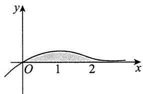

所求体积为

$$
\begin{array}{l} V = \int_ {0} ^ {+ \infty} 2 \pi x y (x) d x = 2 \pi \int_ {0} ^ {+ \infty} x ^ {2} e ^ {- x} d x = - 2 \pi \int_ {0} ^ {+ \infty} x ^ {2} d \left(e ^ {- x}\right) \\ = - 2 \pi x ^ {2} e ^ {- x} \Big | _ {0} ^ {+ \infty} + 4 \pi \int_ {0} ^ {+ \infty} x e ^ {- x} d x = 4 \pi . \\ \end{array}
$$

5.【答案】 $\frac{\sqrt{2}}{60}\pi$

【解析】 $y = \sqrt{x}$ 与 $y = x^2 (x \geqslant 0)$ 互为反函数，两个函数的图像关于直线 $y = x$ 对称，故只需计算其中一条曲线段绕 $y = x$ 旋转一周所得旋转体的体积即可.

取曲线 $y = x^2$ 进行计算：

$$
\begin{array}{l} V \stackrel {(*)} {=} \frac {\pi}{(1 + 1) ^ {\frac {3}{2}}} \int_ {0} ^ {1} (x - x ^ {2}) ^ {2} | 2 x + 1 | d x \\ = \frac {\pi}{2 \sqrt {2}} \int_ {0} ^ {1} (2 x ^ {5} - 3 x ^ {4} + x ^ {2}) d x \\ = \frac {\pi}{2 \sqrt {2}} \left(2 \times \frac {1}{6} - 3 \times \frac {1}{5} + \frac {1}{3}\right) = \frac {\sqrt {2}}{6 0} \pi . \\ \end{array}
$$

【注】(*)处来源于以下结论(见《考研数学基础30讲·高等数学分册》).

设平面曲线 $L:y = f(x)$ ， $a\leqslant x\leqslant b$ ，且 $f(x)$ 可导.

定直线 $L_{0}:Ax + By + C = 0$ ，且过 $L_{0}$ 的任一条垂线与 $L$ 至多有一个交点，如图所示，则 $L$ 绕 $L_{0}$ 旋转一周所得旋转体的体积为

$$
V = \frac {\pi}{\left(A ^ {2} + B ^ {2}\right) ^ {\frac {3}{2}}} \int_ {a} ^ {b} [ A x + B f (x) + C ] ^ {2} | A f ^ {\prime} (x) - B | d x.
$$

6.【解析】设切点坐标为 $P(x_0,y_0)$ ，于是曲线 $y = \mathrm{e}^{x}$ 在点 $P$ 处的切线斜率为 $y^\prime (x_0) = \mathrm{e}^{x_0}$ ，切线方程为 $y - y_{0} = \mathrm{e}^{x_{0}}(x - x_{0})$ ：

因为它经过点 $O(0,0)$ ，所以 $-y_{0} = -x_{0}\mathrm{e}^{x_{0}}$ 。又因 $y_{0} = \mathrm{e}^{x_{0}}$ ，代入求得 $x_{0} = 1$ ，从而 $y_{0} = \mathrm{e}^{x_{0}} = \mathrm{e}$ ，切线方程为 $y = \mathrm{ex}$ ，如图所示。

(1) $D$ 的面积为

$$
S = \int_ {- \infty} ^ {0} \mathrm {e} ^ {x} \mathrm {d} x + \int_ {0} ^ {1} (\mathrm {e} ^ {x} - \mathrm {e} x) \mathrm {d} x = \left. \mathrm {e} ^ {x} \right| _ {- \infty} ^ {0} + \left(\left. \mathrm {e} ^ {x} - \frac {\mathrm {e}}{2} x ^ {2} \right.\right) \Bigg | _ {0} ^ {1} = \frac {\mathrm {e}}{2}.
$$

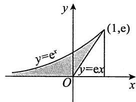

(2) $D$ 绕直线 $x = 1$ 旋转一周所成旋转体的体积微元为

$$
\mathrm {d} V = \left[ \pi (1 - \ln y) ^ {2} - \pi \left(1 - \frac {y}{\mathrm {e}}\right) ^ {2} \right] \mathrm {d} y,
$$

从而 $V = \pi \int_{0}^{\mathrm{e}}\left(\ln^{2}y - 2\ln y + \frac{2y}{\mathrm{e}} -\frac{y^{2}}{\mathrm{e}^{2}}\right)\mathrm{d}y = \frac{5}{3}\pi \mathrm{e}.$

7.【解析】 $y = \mathrm{e}^{-\frac{x}{2}}\sqrt{\sin x},x\in [2k\pi ,(2k + 1)\pi ],k = 0,1,2,\dots ,$ 体积 $V = \sum_{k = 0}^{\infty}V_{k}$ ，其中

$$
\begin{array}{l} V _ {k} = \int_ {2 k \pi} ^ {(2 k + 1) \pi} \pi y ^ {2} d x = \int_ {2 k \pi} ^ {(2 k + 1) \pi} \pi e ^ {- x} \sin x d x \\ = \frac {1}{2} \pi (1 + e ^ {- \pi}) e ^ {- 2 k \pi}, k = 0, 1, 2, \dots , \\ \end{array}
$$

故 $V = \sum_{k=0}^{\infty} \frac{1}{2} \pi (1 + \mathrm{e}^{-\pi}) \mathrm{e}^{-2k\pi} = \frac{1}{2} \pi (1 + \mathrm{e}^{-\pi}) \sum_{k=0}^{\infty} \mathrm{e}^{-2k\pi}$

$$
\stackrel {(*)} {=} \frac {1}{2} \pi (1 + e ^ {- \pi}) \frac {1}{1 - e ^ {- 2 \pi}} = \frac {\pi}{2 (1 - e ^ {- \pi})},
$$

其中 $(\ast)$ 处来自无穷递缩等比数列求和公式： $\frac{\text{首项}}{1 - \text{公比}} (|\text{公比}| < 1)$ .

8.【解析】 $y = ax^{2} (x \geqslant 0)$ 与 $y = 1 - x^{2}$ 的交点为 $A\left(\frac{1}{\sqrt{1 + a}}, \frac{a}{1 + a}\right)$ . 直线 $OA$ 的方程为 $y = \frac{a}{\sqrt{1 + a}} x$ .

(1)旋转体体积

$$
V (a) = \pi \int_ {0} ^ {\frac {1}{\sqrt {1 + a}}} \left(\frac {a ^ {2}}{1 + a} x ^ {2} - a ^ {2} x ^ {4}\right) d x = \frac {2 \pi a ^ {2}}{1 5 (1 + a) ^ {\frac {5}{2}}}.
$$

(2) $\frac{\mathrm{d}[V(a)]}{\mathrm{d}a} = \frac{2\pi}{15} \cdot \frac{2a(1 + a)^{\frac{5}{2}} - a^{2} \cdot \frac{5}{2}(1 + a)^{\frac{3}{2}}}{(1 + a)^{5}} = \frac{\pi(4a - a^{2})}{15(1 + a)^{\frac{7}{2}}}$ .

由 $a > 0$ ，得 $V(a)$ 的唯一驻点 $a = 4$ .当 $0 < a < 4$ 时， $V^{\prime}(a) > 0$ ，当 $a > 4$ 时， $V^{\prime}(a) < 0$ .故 $a = 4$ 为 $V(a)$ 的唯一极大值点，为最大值点.

9.【解析】在 $x\neq 0$ 处， $\left[\frac{f(x)}{x}\right]' = \frac{xf'(x) - f(x)}{x^2} = 1$ ，结合连续性得

$$
f (x) = x ^ {2} + C x (x \in [ 0, 1 ]) ,
$$

故 $\int_0^1\left|x^2 +Cx\right|\mathrm{d}x = 2$

当 $C \geqslant 0$ 时，解得 $C = \frac{10}{3}$ ，则 $f(x) = x^{2} + \frac{10}{3} x$ ，从而 $V = \int_{0}^{1} \pi f^{2}(x) \, \mathrm{d}x = \frac{752}{135} \pi$ ；

当 $-1 < C < 0$ 时，不符合题意；

当 $C \leqslant -1$ 时，解得 $C = -\frac{14}{3}$ ，则 $f(x) = x^{2} - \frac{14}{3}x$ ，从而 $V = \int_{0}^{1} \pi f^{2}(x) \, \mathrm{d}x = \frac{692}{135} \pi$ 。

综上，共有两组符合题意的解。

10.【答案】 $\frac{\mathrm{e}^2 + 1}{2(\mathrm{e}^2 - 1)}$

【解析】区间 $[k, k + 1](k = 0, 1, 2, \dots)$ 上的阴影面积等于矩形面积减去曲边梯形的面积，即

$$
\mathrm {e} ^ {- 2 k} - \int_ {k} ^ {k + 1} \mathrm {e} ^ {- 2 x} \mathrm {d} x = \mathrm {e} ^ {- 2 k} + \frac {1}{2} \mathrm {e} ^ {- 2 x} \left| _ {k} ^ {k + 1} = \mathrm {e} ^ {- 2 k} + \frac {1}{2} \mathrm {e} ^ {- 2 k - 2} - \frac {1}{2} \mathrm {e} ^ {- 2 k} = \left(\frac {1}{2} + \frac {1}{2 \mathrm {e} ^ {2}}\right) \mathrm {e} ^ {- 2 k}, \right.
$$

而 $\sum_{k=0}^{\infty} e^{-2k} = \frac{1}{1 - e^{-2}}$ ，故 $S = \left(\frac{1}{2} + \frac{1}{2e^2}\right)\frac{1}{1 - e^{-2}} = \frac{e^2 + 1}{2e^2} \cdot \frac{e^2}{e^2 - 1} = \frac{e^2 + 1}{2(e^2 - 1)}$ .

11.【解析】解题干给的一阶线性微分方程，有

$$
\begin{array}{l} y = \mathrm {e} ^ {- \int p \mathrm {d} x} \left(\int \mathrm {e} ^ {\int p \mathrm {d} x} q \mathrm {d} x + C\right) \\ = \mathrm {e} ^ {- x} \left(\int \mathrm {e} ^ {x} \frac {\mathrm {e} ^ {- x} \cos x}{2 \sqrt {\sin x}} \mathrm {d} x + C\right) = \mathrm {e} ^ {- x} \left(\int \frac {\cos x}{2 \sqrt {\sin x}} \mathrm {d} x + C\right) \\ = \mathrm {e} ^ {- x} \left[ \int \frac {\mathrm {d} (\sin x)}{2 \sqrt {\sin x}} + C \right] = \mathrm {e} ^ {- x} (\sqrt {\sin x} + C), \\ \end{array}
$$

又 $f(\pi) = \mathrm{e}^{-\pi}\cdot C = 0$ ，故 $C = 0$ ，得

$$
f (x) = \mathrm {e} ^ {- x} \sqrt {\sin x} (x \geqslant 0).
$$

故旋转体体积为

$$
\begin{array}{l} V = \sum_ {n = 0} ^ {\infty} \pi \int_ {2 n \pi} ^ {(2 n + 1) \pi} e ^ {- 2 x} \sin x d x = \sum_ {n = 0} ^ {\infty} \pi \frac {\left| \begin{array}{c c} (e ^ {- 2 x}) ^ {\prime} & (\sin x) ^ {\prime} \\ e ^ {- 2 x} & \sin x \end{array} \right|}{(- 2) ^ {2} + 1 ^ {2}} \Bigg | _ {2 n \pi} ^ {(2 n + 1) \pi} \\ = \frac {\pi}{5} \sum_ {n = 0} ^ {\infty} (- 2 \sin x - \cos x) e ^ {- 2 x} \left| _ {2 n \pi} ^ {(2 n + 1) \pi} = \frac {\pi}{5} \sum_ {n = 0} ^ {\infty} \left(e ^ {- 4 n \pi} \cdot e ^ {- 2 \pi} + e ^ {- 4 n \pi}\right) \right. \\ = \frac {\pi \left(1 + e ^ {- 2 \pi}\right)}{5} \sum_ {n = 0} ^ {\infty} e ^ {- 4 n \pi} = \frac {\pi \left(1 + e ^ {- 2 \pi}\right)}{5} \cdot \frac {1}{1 - e ^ {- 4 \pi}} = \frac {\pi}{5 \left(1 - e ^ {- 2 \pi}\right)}. \\ \end{array}
$$

12.【解析】令 $x^{2} - t^{2} = u$ ，则

$$
\begin{array}{l} \int_ {0} ^ {x} t f \left(x ^ {2}\right) f \left(x ^ {2} - t ^ {2}\right) \mathrm {d} t = f \left(x ^ {2}\right) \left[ - \frac {1}{2} \int_ {x ^ {2}} ^ {0} f (u) \mathrm {d} u \right] \\ = \frac {1}{2} f (x ^ {2}) \int_ {0} ^ {x ^ {2}} f (u) \mathrm {d} u, \\ \end{array}
$$

于是有 $f(x^{2})\int_{0}^{x^{2}}f(u)\mathrm{d}u = 2\sin^{2}x^{2}$ ，再令 $x^{2} = \nu$ ，有 $f(\nu)\int_{0}^{\nu}f(u)\mathrm{d}u = 2\sin^{2}\nu$ 。

又令 $F(v) = \int_{0}^{v}f(u)\mathrm{d}u$ ， $F(0) = 0$ ，于是

$$
F (v) F ^ {\prime} (v) = 2 \sin^ {2} v,
$$

上式在 $[0, \pi]$ 上对 $\nu$ 作积分，有

$$
\begin{array}{l} \int_ {0} ^ {\pi} F (v) F ^ {\prime} (v) \mathrm {d} v = \int_ {0} ^ {\pi} F (v) \mathrm {d} [ F (v) ] \\ = \frac {1}{2} F ^ {2} (\nu) \Bigg | _ {0} ^ {\pi} = 2 \int_ {0} ^ {\pi} \sin^ {2} \nu \mathrm {d} \nu = \pi , \\ \end{array}
$$

故 $F(\pi) = \sqrt{2\pi}$ ，则 $f(x)$ 在 $[0, \pi]$ 上的平均值为 $\frac{1}{\pi} \int_{0}^{\pi} f(x) \mathrm{d}x = \sqrt{\frac{2}{\pi}}$ 。

【注】① 连续函数 $f(x)$ 的一个原函数表达形式常写为 $F(x) = \int_{0}^{x} f(u) \, \mathrm{d}u$ ，考生须熟知。见到 $f(x) \int_{0}^{x} f(u) \, \mathrm{d}u$ ，一般令 $F(x) = \int_{0}^{x} f(u) \, \mathrm{d}u$ ，这样便有 $F'(x) = f(x)$ ，即得 $F'(x)F(x)$ ，于是 $\int F'(x) F(x) \, \mathrm{d}x = \int F(x) \, \mathrm{d}[F(x)] = \frac{1}{2} F^2(x) + C$ ，此思路非常重要。

②平均值是考研重点.

13.【答案】 $\frac{1}{\mathrm{e} + 1}$

【解析】由题可知， $f(x) = \left(\frac{1}{1 + \mathrm{e}^{\frac{1}{x}}}\right)^{\prime}$ ，故

  
关注公众号【考研小舟】免费考研资料&无水印PDF

  
黑白&彩印都是5分/页，满4.9全国包邮下单备注：考研小丹，送草稿纸

$$
\begin{array}{l} \bar {f} = \frac {1}{2} \int_ {- 1} ^ {1} \left(\frac {1}{1 + e ^ {\frac {1}{x}}}\right) ^ {\prime} d x = \frac {1}{2} \int_ {- 1} ^ {0} \left(\frac {1}{1 + e ^ {\frac {1}{x}}}\right) ^ {\prime} d x + \frac {1}{2} \int_ {0} ^ {1} \left(\frac {1}{1 + e ^ {\frac {1}{x}}}\right) ^ {\prime} d x \\ = \frac {1}{2} \frac {1}{1 + e ^ {\frac {1}{x}}} \left| _ {- 1} ^ {0 ^ {-}} + \frac {1}{2} \frac {1}{1 + e ^ {\frac {1}{x}}} \right| _ {0 ^ {+}} ^ {1} = \frac {1}{2} \left(1 - \frac {e}{e + 1}\right) + \frac {1}{2} \left(\frac {1}{e + 1} - 0\right) = \frac {1}{e + 1}. \\ \end{array}
$$

【注】若 $f(x)$ 在 $[a,b]$ 上除点 $c\in (a,b)$ 外均连续， $c$ 为其间断点， $F(x)$ 是 $f(x)$ 在 $[a,c)$ 与 $\left(c,b\right]$ 上的原函数，则 $\int_{a}^{b}f(x)\mathrm{d}x = F(x)\big|_{a}^{c^{-}} + F(x)\big|_{c^{+}}^{b}$ .若 $\lim_{x\to c^{-}}F(x)$ 与 $\lim_{x\to c^{+}}F(x)$ 均存在，则 $\int_{a}^{b}f(x)\mathrm{d}x$ 存在.

14.【答案】 $-\frac{2}{\pi}$

【解析】由题可知， $f(x) = \int_{a}^{x}\frac{\sin\pi t}{t}\mathrm{d}t$ ，且 $t\in (0,1)$ ，于是 $a$ 与 $x$ 均属于[0,1].当 $t\in (0,1)$ 时， $\frac{\sin\pi t}{t} >0$ ，故要使 $f(1) = 0$ ，则 $f(1)$ 上下限必相等，即 $a = 1$ ，故 $f(x) = \int_{1}^{x}\frac{\sin\pi t}{t}\mathrm{d}t$ ，可得 $f(x)$ 在区间[0,1]上的平均值为

$$
\begin{array}{l} \frac {1}{1 - 0} \int_ {0} ^ {1} f (x) d x = \int_ {0} ^ {1} d x \int_ {1} ^ {x} \frac {\sin \pi t}{t} d t = - \int_ {0} ^ {1} d t \int_ {0} ^ {t} \frac {\sin \pi t}{t} d x \\ = - \int_ {0} ^ {1} \sin \pi t d t = - \frac {2}{\pi}, \\ \end{array}
$$

积分区域如图所示.

15.【答案】2

【解析】因为 $\int_0^1 f(xt)\mathrm{d}t\stackrel {tx = u}{=}\frac{1}{x}\int_0^x f(u)\mathrm{d}u$ ，所以原方程等价于 $f(x)\int_0^x f(u)\mathrm{d}u = 2x^3$

令 $\int_0^x f(u)\mathrm{d}u = F(x)$ ，则原方程又等价于 $F^{\prime}(x)F(x) = 2x^{3}$ ，两边积分，得 $F^2 (x) = x^4 +C$ .由于 $F(0) = 0$ ,故 $F^2 (x) = x^4$ ,即 $\left[\int_0^x f(u)\mathrm{d}u\right]^2 = x^4$ .令 $x = 2$ ，并注意到 $f(x)$ 非负，得 $\int_0^2 f(u)\mathrm{d}u = 4$ .因此，

函数 $f(x)$ 在 $[0,2]$ 上的平均值为 $\frac{1}{2 - 0}\int_{0}^{2}f(u)\mathrm{d}u = 2$

16.【答案】4

【解析】令 $x(t - 1) = u$ ，则 $\int_{1}^{2}f(xt - x)\mathrm{d}t = \frac{1}{x}\int_{0}^{x}f(u)\mathrm{d}u$ ，所以 $f(x)\int_0^x f(u)\mathrm{d}u = 2x^3$ .记 $F(x) = \int_0^x f(u)\mathrm{d}u$ ， $F^{\prime}(x) = f(x)\geqslant 0$ ，则 $F(x)$ 是 $[0,3]$ 上单调不减的可导函数，满足 $\frac{\mathrm{d}}{\mathrm{d}x}\left[F^2 (x)\right] = 4x^3$ ，所以 $F^2 (x) = x^4 +C.$ 因为 $F(0) = 0$ ，所以 $C = 0$ ， $F(x) = x^{2}$ .于是， $f(x)$ 在区间[1,3]上的平均值为

$$
\frac {1}{3 - 1} \int_ {1} ^ {3} f (x) d x = \frac {1}{2} [ F (3) - F (1) ] = \frac {1}{2} (9 - 1) = 4.
$$

17.【答案】 $\frac{1}{3\pi}$

【解析】 $f(x)$ 在区间 $\left[0, \frac{3\pi}{2}\right]$ 上的平均值为

$$
\begin{array}{l} \bar {f} = \frac {2}{3 \pi} \int_ {0} ^ {\frac {3 \pi}{2}} f (x) d x = \frac {2}{3 \pi} \int_ {0} ^ {\frac {3 \pi}{2}} \left(\int_ {0} ^ {x} \frac {\cos t}{2 t - 3 \pi} d t\right) d x \\ = \frac {2}{3 \pi} \int_ {0} ^ {\frac {3 \pi}{2}} d t \int_ {t} ^ {\frac {3 \pi}{2}} \frac {\cos t}{2 t - 3 \pi} d x = - \frac {1}{3 \pi} \int_ {0} ^ {\frac {3 \pi}{2}} \cos t d t = \frac {1}{3 \pi}, \\ \end{array}
$$

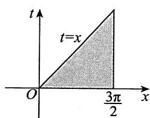

积分区域如图所示.

18.【分析】因被积函数 $t|t|$ 是奇函数，故 $f(x)$ 是偶函数.由 $f^{\prime}(x)$ 的符号知，曲线 $y = f(x)$ 与 $x$ 轴只有两个交点，再由定积分的几何意义，即可求出封闭图形的面积.

【解析】由 $t|t|$ 为奇函数知，其原函数 $f(x) = \int_{-1}^{x} t|t| \, \mathrm{d}t$ 为偶函数，而 $f(-1) = 0$ ， $f(1) = 0$ ，即曲线 $y = f(x)$ 与 $x$ 轴的交点为 $(-1,0)$ ， $(1,0)$ ：

当 $x < 0$ 时， $f'(x) = x|x| < 0$ ，故 $f(x)$ 单调减少，从而当 $-1 < x < 0$ 时， $f(x) < f(-1) = 0$ ：

当 $x > 0$ 时， $f'(x) = x|x| > 0$ ，故 $f(x)$ 单调增加，从而当 $x > 1$ 时， $f(x) > f(1) = 0$ ，因此曲线 $y = f(x)$ 与 $x$ 轴的交点只有两个。

当 $x < 0$ 时， $f(x) = \int_{-1}^{x} t |t| \, \mathrm{d}t = \int_{-1}^{x} (-t^2) \, \mathrm{d}t = -\frac{1}{3} (1 + x^3)$ ，故所求图形的面积为

$$
S = \left| \int_ {- 1} ^ {1} f (x) d x \right| = 2 \left| \int_ {- 1} ^ {0} f (x) d x \right| = 2 \left| \int_ {- 1} ^ {0} \frac {- 1}{3} \left(1 + x ^ {3}\right) d x \right| = \frac {1}{2}.
$$

19.【解析】由 $f^{\prime}(x) = 2\sqrt{f(x)}$ ，有 $\int \frac{\mathrm{d}[f(x)]}{2\sqrt{f(x)}} = \int \mathrm{d}x$ ，得 $\sqrt{f(x)} = x + C_1$ ，因 $f(0) = 1$ ，则 $C_1 = 1$ 故 $f(x) = (x + 1)^2$ ：

由 $g^{\prime}(x) = \frac{g(x)}{x - 2} +\frac{x - 2}{x}$ ，有

$$
\begin{array}{l} g (x) = \mathrm {e} ^ {\int \frac {1}{x - 2} \mathrm {d} x} \left(\int \mathrm {e} ^ {- \int \frac {1}{x - 2} \mathrm {d} x} \cdot \frac {x - 2}{x} \mathrm {d} x + C _ {2}\right) \\ = (x - 2) \left(\int \frac {1}{x} d x + C _ {2}\right) = (x - 2) \left(\ln x + C _ {2}\right). \\ \end{array}
$$

又因 $g(1) = 0$ ，有 $C_2 = 0$ ，故 $g(x) = (x - 2)\ln x$ ：

因此，曲线方程为 $(x + 1)^2 = (2 - y)\ln y(1\leqslant y < 2)$ ，其绕 $x = -1$ 旋转一周所得旋转体体积为

$$
V = \pi \int_ {1} ^ {2} (x + 1) ^ {2} d y = \pi \int_ {1} ^ {2} (2 - y) \ln y d y = \left(2 \ln 2 - \frac {5}{4}\right) \pi .
$$

20.【解析】先求切线方程，由 $\sqrt{x} +\sqrt{y} = 1$ ，两边对 $x$ 求导，得

$$
\frac {1}{2 \sqrt {x}} + \frac {1}{2 \sqrt {y}} y ^ {\prime} = 0, y ^ {\prime} = - \frac {\sqrt {y}}{\sqrt {x}} = 1 - \frac {1}{\sqrt {x}}.
$$

故在 $x = a$ 处的切线方程为 $y - (1 - \sqrt{a})^2 = \left(1 - \frac{1}{\sqrt{a}}\right)(x - a)$

切线与两坐标轴的交点坐标为 $A(\sqrt{a},0)$ ， $B(0,1 - \sqrt{a})$ ，如图所示.

由圆锥体的体积公式可得

$$
V _ {y} = \frac {\pi}{3} (\sqrt {a}) ^ {2} (1 - \sqrt {a}) = \frac {\pi}{3} \left(a - a ^ {\frac {3}{2}}\right),
$$

$$
V _ {y} ^ {\prime} = \frac {\pi}{3} \left(1 - \frac {3}{2} a ^ {\frac {1}{2}}\right),
$$

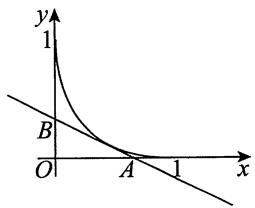

令 $V_{y}^{\prime} = 0$ ，得 $a = \frac{4}{9}$ 又 $V_{y}^{\prime \prime} = -\frac{\pi}{4} a^{-\frac{1}{2}} < 0$ ，所以 $a = \frac{4}{9}$ 为极大值点，也是最大值点，即当 $a = \frac{4}{9}$ 时，旋转体的体积 $V_{y}$ 最大.

【注】对于这一类问题，大部分考生忘记可以用圆锥体的体积公式来计算旋转体的体积，而用定积分来求，这样要麻烦得多.

$$
\begin{array}{l} V _ {y} = 2 \pi \int_ {0} ^ {\sqrt {a}} x (1 - \sqrt {a}) \left(1 - \frac {x}{\sqrt {a}}\right) d x = 2 \pi (1 - \sqrt {a}) \left(\frac {x ^ {2}}{2} - \frac {x ^ {3}}{3 \sqrt {a}}\right) \Bigg | _ {0} ^ {\sqrt {a}} \\ = 2 \pi (1 - \sqrt {a}) \frac {a}{6} = \frac {\pi}{3} \left(a - a ^ {\frac {3}{2}}\right). \\ \end{array}
$$

若用公式 $V_{y} = \pi \int_{0}^{1 - \sqrt{a}}[x(y)]^{2}\mathrm{d}y$ ，计算更烦琐.

21.【解析】(1)由题意知， $\mathrm{dy} = \frac{4y^3}{4 - y^6}\mathrm{dx}$ ， $\frac{\mathrm{dx}}{\mathrm{dy}} = \frac{4 - y^6}{4y^3} = \frac{1}{y^3} -\frac{1}{4} y^3$ ， $-2\leqslant y\leqslant -1$ .故

$$
\begin{array}{l} \sqrt {1 + \left(\frac {\mathrm {d} x}{\mathrm {d} y}\right) ^ {2}} = \sqrt {1 + \left(\frac {1}{y ^ {3}} - \frac {1}{4} y ^ {3}\right) ^ {2}} = \sqrt {\left(\frac {1}{y ^ {3}} + \frac {1}{4} y ^ {3}\right) ^ {2}} \\ = - \left(\frac {1}{y ^ {3}} + \frac {1}{4} y ^ {3}\right), - 2 \leqslant y \leqslant - 1, \\ \end{array}
$$

则 $s = \int_{-2}^{-1}\sqrt{1 + \left(\frac{\mathrm{d}x}{\mathrm{d}y}\right)^2}\mathrm{d}y = -\int_{-2}^{-1}\left(\frac{1}{y^3} +\frac{1}{4} y^3\right)\mathrm{d}y$

$$
= \left(\frac {1}{2 y ^ {2}} - \frac {1}{1 6} y ^ {4}\right) \Bigg | _ {- 2} ^ {- 1} = \frac {1}{2} - \frac {1}{1 6} - \frac {1}{8} + 1 = \frac {2 1}{1 6}.
$$

(2) 由(1)知， $x = \int \left(\frac{1}{y^3} - \frac{1}{4} y^3\right) \, \mathrm{d}y = -\frac{1}{2y^2} - \frac{1}{16} y^4 + C$ ，且 $x(-1) = -\frac{9}{16} + C = -\frac{9}{16}$ ，则 $C = 0$ 故 $x = -\frac{1}{2y^2} - \frac{1}{16} y^4$ 。

当 $\frac{\mathrm{d}x}{\mathrm{d}y} = 0$ 时， $y^6 = 4$ ，得 $y = -\sqrt[6]{4}$ 。当 $-2 \leq y < -\sqrt[6]{4}$ 时， $\frac{\mathrm{d}x}{\mathrm{d}y} > 0$ ，当 $-\sqrt[6]{4} < y \leq -1$ 时， $\frac{\mathrm{d}x}{\mathrm{d}y} < 0$ 。故 $y = -\sqrt[6]{4}$ 为最大值点，最大值为 $x_{\max} = -\frac{3}{4}$ 。

22.【解析】(1) $y' + \frac{t^2}{y} x^3 = \frac{y}{x}$ 整理为 $y' - \frac{1}{x} y = -t^2 x^3 y^{-1}$ ，由 $z = y^2$ ，得 $\frac{1}{2} \frac{\mathrm{d}z}{\mathrm{d}x} - \frac{z}{x} = -t^2 x^3$ ，即

$$
\frac {\mathrm {d} z}{\mathrm {d} x} - \frac {2}{x} z = - 2 t ^ {2} x ^ {3},
$$

根据一阶线性微分方程的求解公式，解得

$$
z = \mathrm {e} ^ {\int_ {x} ^ {2} \mathrm {d} x} \left(- 2 \int \mathrm {e} ^ {- \int_ {x} ^ {2} \mathrm {d} x} t ^ {2} x ^ {3} \mathrm {d} x + C\right) = x ^ {2} \left(- x ^ {2} t ^ {2} + C\right),
$$

即 $y^{2} = x^{2}(-x^{2}t^{2} + C)$ ，根据初始条件 $y(1) = \sqrt{9 - t^2}$ ，可得 $C = 9$ 。故 $y = x\sqrt{9 - x^{2}t^{2}}$

(2) 由(1)得 $f(x) = \frac{1}{9} \int_{0}^{3} y(x) \, \mathrm{d}t = \frac{1}{9} \int_{0}^{3} x \sqrt{9 - x^2 t^2} \, \mathrm{d}t.$

由于 $y(0) = f(0) = 0$ ， $x = 0$ 对应的点 $(0,0)$ 在曲线上，且要求 $9 - x^{2}t^{2}\geqslant 0$ ，其中 $0\leqslant t\leqslant 3$ ，故曲线 $y = f(x)$ 在 $0\leqslant x\leqslant 1$ 上存在.

于是 $y = f(x) = \frac{1}{9}\int_{0}^{3}x\sqrt{9 - x^2t^2}\mathrm{d}t\stackrel {xt = u}{=}\frac{1}{9}\int_{0}^{3x}\sqrt{9 - u^2}\mathrm{d}u,$

则 $f^{\prime}(x) = \frac{1}{9}\sqrt{9 - 9x^{2}}\cdot 3 = \sqrt{1 - x^{2}},$

故所求曲线全长为

$$
\begin{array}{l} s = \int_ {0} ^ {1} \sqrt {1 + \left[ f ^ {\prime} (x) \right] ^ {2}} d x = \int_ {0} ^ {1} \sqrt {2 - x ^ {2}} d x \\ \xlongequal {x = \sqrt {2} \sin t} \int_ {0} ^ {\frac {\pi}{4}} \sqrt {2 - 2 \sin^ {2} t} \cdot \sqrt {2} \cos t d t = 2 \int_ {0} ^ {\frac {\pi}{4}} \cos^ {2} t d t = \frac {\pi}{4} + \frac {1}{2}. \\ \end{array}
$$

23.【解析】由 $2yy' = \cos x$ 分离变量，得 $2y\mathrm{d}y = \cos x\mathrm{d}x$ ，两边积分，得 $y^{2} = \sin x + C$ ，又 $y(0) = 0$ ，有 $C = 0$ ，且 $y(x)$ 非负，故 $y(x) = \sqrt{\sin x}$ .于是

$$
f _ {n} (x) = n \int_ {0} ^ {\frac {x}{n}} \sqrt {\sin t} d t, f _ {n} ^ {\prime} (x) = \sqrt {\sin \frac {x}{n}}.
$$

根据弧长计算公式，得

$$
\begin{array}{l} s _ {n} = \int_ {0} ^ {n \pi} \sqrt {1 + \left[ f _ {n} ^ {\prime} (x) \right] ^ {2}} d x = \int_ {0} ^ {n \pi} \sqrt {1 + \sin \frac {x}{n}} d x \\ = \int_ {0} ^ {n \pi} \sqrt {\left(\sin \frac {x}{2 n} + \cos \frac {x}{2 n}\right) ^ {2}} d x = \int_ {0} ^ {n \pi} \left(\sin \frac {x}{2 n} + \cos \frac {x}{2 n}\right) d x \\ \xlongequal {\text {令} \frac {x}{2 n} = u} 2 n \int_ {0} ^ {\frac {\pi}{2}} (\sin u + \cos u) \mathrm {d} u = 2 n (1 + 1) = 4 n. \\ \end{array}
$$

24.【解析】由 $\overline{x} = \frac{\int_{0}^{a}xf(x)\mathrm{d}x}{\int_{0}^{a}f(x)\mathrm{d}x} >\frac{2}{3} a$ ，将 $a$ 变量化为 $x$ ，令 $F(x) = \int_0^x tf(t)\mathrm{d}t - \frac{2x}{3}\int_0^x f(t)\mathrm{d}t$ ，则有 $F(0) = 0$ .又对任意 $x\in (0,a)$ ，有

$$
\begin{array}{l} F ^ {\prime} (x) = x f (x) - \frac {2}{3} \int_ {0} ^ {x} f (t) \mathrm {d} t - \frac {2}{3} x f (x) \\ = \frac {1}{3} x f (x) - \frac {2}{3} \int_ {0} ^ {x} f (t) d t, \\ F ^ {\prime \prime} (x) = \frac {1}{3} f (x) + \frac {1}{3} x f ^ {\prime} (x) - \frac {2}{3} f (x) = \frac {1}{3} x f ^ {\prime} (x) - \frac {1}{3} f (x) \\ = \frac {1}{3} x \left[ f ^ {\prime} (x) - f ^ {\prime} (\xi) \right] (0 <   \xi <   x). \\ \end{array}
$$

因为 $f''(x) > 0$ ，所以 $f'(x) > f'(\xi)$ ，于是 $F''(x) > 0$ ，从而 $F'(x)$ 在区间 $[0, a]$ 上单调增加，因此当 $0 < x \leqslant a$ 时，有 $F'(x) > F'(0) = 0$ ，故 $F(x)$ 在区间 $[0, a]$ 上单调增加， $F(a) > F(0) = 0$ 。所以

$$
\int_ {0} ^ {a} x f (x) \mathrm {d} x - \frac {2 a}{3} \int_ {0} ^ {a} f (x) \mathrm {d} x > 0 , \text {即} \overline {{x}} > \frac {2 a}{3} .
$$

25.【解析】由题设知，围成的平面图形如图所示，由对称性，所求旋转体的体积为

$$
\begin{array}{l} V = 2 \int_ {0} ^ {\pi a} \pi y ^ {2} d x = 2 \pi a ^ {3} \int_ {0} ^ {\pi} (1 - \cos t) ^ {3} d t = 1 6 \pi a ^ {3} \int_ {0} ^ {\pi} \sin^ {6} \frac {t}{2} d t \\ \stackrel {t = 2 u} {=} 3 2 \pi a ^ {3} \int_ {0} ^ {\frac {\pi}{2}} \sin^ {6} u \mathrm {d} u = 3 2 \pi a ^ {3} \cdot \frac {5}{6} \cdot \frac {3}{4} \cdot \frac {1}{2} \cdot \frac {\pi}{2} = 5 \pi^ {2} a ^ {3}. \\ \end{array}
$$

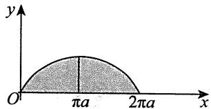

由对称性，所求旋转体的表面积为

$$
\begin{array}{l} S = 4 \pi \int_ {0} ^ {\pi} y (t) \sqrt {\left[ x ^ {\prime} (t) \right] ^ {2} + \left[ y ^ {\prime} (t) \right] ^ {2}} d t = 4 \pi \int_ {0} ^ {\pi} a (1 - \cos t) \sqrt {\left[ a (1 - \cos t) \right] ^ {2} + (a \sin t) ^ {2}} d t \\ = 4 \pi a ^ {2} \int_ {0} ^ {\pi} (1 - \cos t) \sqrt {2 (1 - \cos t)} d t = 1 6 \pi a ^ {2} \int_ {0} ^ {\pi} \sin^ {3} \frac {t}{2} d t \\ \frac {t = 2 u}{3 2 \pi a ^ {2}} \int_ {0} ^ {\frac {\pi}{2}} \sin^ {3} u \mathrm {d} u = 3 2 \pi a ^ {2} \cdot \frac {2}{3} \cdot 1 = \frac {6 4}{3} \pi a ^ {2}. \\ \end{array}
$$

26.【解析】摆线一拱弧长

$$
\begin{array}{l} s = \int_ {0} ^ {2 \pi} \sqrt {\left[ x ^ {\prime} (t) \right] ^ {2} + \left[ y ^ {\prime} (t) \right] ^ {2}} d t = a \int_ {0} ^ {2 \pi} \sqrt {(1 - \cos t) ^ {2} + (\sin t) ^ {2}} d t \\ = 2 a \int_ {0} ^ {2 \pi} \sin \frac {t}{2} d t = - 4 a \cos \left. \frac {t}{2} \right| _ {0} ^ {2 \pi} = 8 a. \\ \end{array}
$$

摆线一拱绕 $x$ 轴旋转一周所形成的旋转曲面面积为

$$
\begin{array}{l} S = 2 \pi \int_ {0} ^ {2 \pi} | y (t) | \sqrt {\left[ x ^ {\prime} (t) \right] ^ {2} + \left[ y ^ {\prime} (t) \right] ^ {2}} d t \\ = 2 \pi \int_ {0} ^ {2 \pi} a ^ {2} (1 - \cos t) \sqrt {(1 - \cos t) ^ {2} + (\sin t) ^ {2}} d t \\ = 8 \pi a ^ {2} \int_ {0} ^ {2 \pi} \sin^ {3} \frac {t}{2} d t = 8 \pi a ^ {2} \int_ {0} ^ {2 \pi} \left(1 - \cos^ {2} \frac {t}{2}\right) \sin \frac {t}{2} d t = \frac {6 4}{3} \pi a ^ {2}. \\ \end{array}
$$

按题意， $\frac{64}{3}\pi a^2 = 8a$ ，所以 $a = \frac{3}{8\pi}$

# 第11章 一元函数和分学的应用（二）

# ——积分等式与积分不等式

# 1.【答案】(B)

【解析】对于 $f^{\prime}(x) + f^{2}(x)$ ，用逆向思维，化归经典形式.

令 $F(x) = f(x)\mathrm{e}^{\int_0^x f(t)\mathrm{d}t}$ ，则

$$
F ^ {\prime} (x) = \mathrm {e} ^ {\int_ {0} ^ {x} f (t) \mathrm {d} t} [ f ^ {\prime} (x) + f ^ {2} (x) ] \geqslant 0,
$$

于是 $F(x)$ 在 $[0,1]$ 上单调增加，故有 $F(1) \geqslant F(0)$ ，则有 $f(1)\mathrm{e}^{\int_0^1 f(x)\mathrm{d}x} \geqslant f(0)$ ，又因为 $f(0) > 0$ ， $\mathrm{e}^{\int_0^1 f(x)\mathrm{d}x} > 0$ ，可知 $f(1) > 0$ ，进而可得 $\mathrm{e}^{\int_0^1 f(x)\mathrm{d}x} \geqslant \frac{f(0)}{f(1)}$ ，即 $\int_0^1 f(x)\mathrm{d}x \geqslant \ln \frac{f(0)}{f(1)}$ 。故选(B)。

2.【解析】 $\int_0^1\left[\int_{x^2}^{\sqrt{x}}f(t)\mathrm{d}t\right]\mathrm{d}x\frac{\text{分部积分}}{}\left[x\int_{x^2}^{\sqrt{x}}f(t)\mathrm{d}t\right]_0^1 -\int_0^1 x\mathrm{d}\left[\int_{x^2}^{\sqrt{x}}f(t)\mathrm{d}t\right]$

$$
\begin{array}{l} = \int_ {0} ^ {1} x f (x ^ {2}) \mathrm {d} (x ^ {2}) - \int_ {0} ^ {1} x f (\sqrt {x}) \mathrm {d} (\sqrt {x}) \\ \stackrel {u = x ^ {2}, v = \sqrt {x}} {=} \int_ {0} ^ {1} \sqrt {u} f (u) d u - \int_ {0} ^ {1} v ^ {2} f (v) d v \\ = \int_ {0} ^ {1} (\sqrt {x} - x ^ {2}) f (x) d x. \\ \end{array}
$$

# 3.【答案】(C)

【解析】令 $F(x) = f(x) - x - 1$ ， $x\in [0,1)$ ，则 $F^{\prime}(x) = f^{\prime}(x) - 1\leqslant 0$ ：

又 $F(0) = 0$ ，故 $F(x) < F(0) = 0 (0 < x < 1)$ ，则 $f(x) < x + 1 (0 < x < 1)$ ：

同理, 可得当 $0 < x < 1$ 时, $f(x) > 1 - x$ , $f(x) > x$ , $f(x) < 2 - x$ , 所以曲线 $f(x)$ 在 $y = x$ , $y = x + 1$ , $y = -x + 1$ , $y = -x + 2$ 所围正方形内, 如图所示.

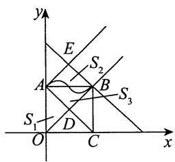

由图可知，正方形ABCO面积 $S_{1} = 1$ ，三角形ABE面积 $S_{2} = \frac{1}{4} = S_{3}$ (三角形ABD面积).故

$$
S _ {1} - S _ {3} <   \int_ {0} ^ {1} f (x) \mathrm {d} x <   S _ {1} + S _ {2},
$$

即 $\frac{3}{4} <  \int_{0}^{1}f(x)\mathrm{d}x <   \frac{5}{4}.$

4.【解析】 $\int_0^1\left(\int_x^{\sqrt{x}}\frac{\sin t}{t}\mathrm{d}t\right)\mathrm{d}x\xlongequal{\text{分部积分}}\left(x\int_x^{\sqrt{x}}\frac{\sin t}{t}\mathrm{d}t\right)\bigg|_0^1 -\int_0^1 x\mathrm{d}\left(\int_x^{\sqrt{x}}\frac{\sin t}{t}\mathrm{d}t\right)$

$$
\begin{array}{l} = - \int_ {0} ^ {1} x \left(\frac {\sin \sqrt {x}}{\sqrt {x}} \cdot \frac {1}{2 \sqrt {x}} - \frac {\sin x}{x}\right) d x = \int_ {0} ^ {1} \left(\sin x - \frac {\sin \sqrt {x}}{2}\right) d x \\ \xlongequal {t = \sqrt {x}} - \int_ {0} ^ {1} t \sin t d t + \int_ {0} ^ {1} \sin x d x = 1 - \sin 1. \\ \end{array}
$$

5.【解析】令 $F(x) = f(x) - g(x)(x\in [a,b])$ ， $G(x) = \int_{a}^{x}F(t)\mathrm{d}t(x\in [a,b])$ .易见 $G^{\prime}(x) = F(x)$ ，且 $G(x)\geqslant 0$ .从而

$$
\int_ {a} ^ {b} x F (x) \mathrm {d} x = \int_ {a} ^ {b} x \mathrm {d} [ G (x) ] = x G (x) \left| _ {a} ^ {b} - \int_ {a} ^ {b} G (x) \mathrm {d} x = - \int_ {a} ^ {b} G (x) \mathrm {d} x \leqslant 0 \right.,
$$

移项即得待证不等式.

6.【解析】由柯西积分不等式，得

$$
\left[ \int_ {a} ^ {b} \varphi (x) \psi (x) d x \right] ^ {2} \leqslant \int_ {a} ^ {b} \varphi^ {2} (x) d x \int_ {a} ^ {b} \psi^ {2} (x) d x.
$$

令 $\varphi (x) = 1$ ， $\psi (x) = f^{\prime}(x)$ ，有

$$
\left[ \int_ {a} ^ {t} 1 \cdot f ^ {\prime} (x) d x \right] ^ {2} \leqslant \int_ {a} ^ {t} 1 ^ {2} d x \int_ {a} ^ {t} \left[ f ^ {\prime} (x) \right] ^ {2} d x (a \leqslant t \leqslant b),
$$

$$
\left[ f (t) - f (a) \right] ^ {2} \leqslant (t - a) \int_ {a} ^ {t} \left[ f ^ {\prime} (x) \right] ^ {2} d x,
$$

则

可得 $\int_{a}^{b}f^{2}(t)\mathrm{d}t\leqslant \int_{a}^{b}(t - a)\mathrm{d}t\int_{a}^{b}\left[f^{\prime}(x)\right]^{2}\mathrm{d}x,$

故 $\int_{a}^{b}f^{2}(t)\mathrm{d}t\leqslant \frac{(b - a)^{2}}{2}\int_{a}^{b}\left[f^{\prime}(x)\right]^{2}\mathrm{d}x,$

即 $\int_{a}^{b}f^{2}(x)\mathrm{d}x\leqslant \frac{(b - a)^{2}}{2}\int_{a}^{b}\left[f^{\prime}(x)\right]^{2}\mathrm{d}x.$

【注】柯西积分不等式(也称柯西-施瓦茨不等式)：

若函数 $\varphi (x)$ 与 $\psi (x)$ 在 $[a,b]$ 上均连续，则有

$$
\left[ \int_ {a} ^ {b} \varphi (x) \psi (x) d x \right] ^ {2} \leqslant \int_ {a} ^ {b} [ \varphi (x) ] ^ {2} d x \int_ {a} ^ {b} [ \psi (x) ] ^ {2} d x.
$$

证明如下.

解析 方法一 令 $F(t) = \int_{a}^{t}\left[\varphi (x)\right]^{2}\mathrm{d}x\cdot \int_{a}^{t}\left[\psi (x)\right]^{2}\mathrm{d}x - \left[\int_{a}^{t}\varphi (x)\psi (x)\mathrm{d}x\right]^{2}$ ，则当 $t\geqslant a$ 时，有 $F^{\prime}(t) = \int_{a}^{t}\left[\varphi (t)\psi (x) - \varphi (x)\psi (t)\right]^{2}\mathrm{d}x\geqslant 0$ ，由此可知 $F(t)$ 单调不减，又 $F(a) = 0$ ，所以 $F(b)\geqslant 0$ ，即 $\left[\int_{a}^{b}\varphi (x)\psi (x)\mathrm{d}x\right]^{2}\leqslant \int_{a}^{b}\left[\varphi (x)\right]^{2}\mathrm{d}x\cdot \int_{a}^{b}\left[\psi (x)\right]^{2}\mathrm{d}x.$

方法二 由 $0 \leqslant \int_{a}^{b} [\varphi(x) - t\psi(x)]^2 \, \mathrm{d}x = \int_{a}^{b} [\varphi(x)]^2 \, \mathrm{d}x - 2t \int_{a}^{b} \varphi(x)\psi(x) \, \mathrm{d}x + t^2 \int_{a}^{b} [\psi(x)]^2 \, \mathrm{d}x$ ，则

$$
\Delta = 4 \left[ \int_ {a} ^ {b} \varphi (x) \psi (x) d x \right] ^ {2} - 4 \int_ {a} ^ {b} [ \varphi (x) ] ^ {2} d x \int_ {a} ^ {b} [ \psi (x) ] ^ {2} d x \leqslant 0.
$$

于是 $\left[\int_{a}^{b}\varphi (x)\psi (x)\mathrm{d}x\right]^{2}\leqslant \int_{a}^{b}\left[\varphi (x)\right]^{2}\mathrm{d}x\cdot \int_{a}^{b}\left[\psi (x)\right]^{2}\mathrm{d}x.$

# 7.【答案】(B)

【解析】令 $F(x) = \int_{0}^{x}\mathrm{e}^{-t^2}\mathrm{d}t$ $f(u)\mathrm{d}u - \int_0^x f(t)\mathrm{e}^{-t^2}\mathrm{d}t,x\in [0,1]$

则 $F^{\prime}(x) = f\left(\int_{0}^{x}\mathrm{e}^{-t^{2}}\mathrm{d}t\right)\bullet \mathrm{e}^{-x^{2}} - f(x)\mathrm{e}^{-x^{2}} = \mathrm{e}^{-x^{2}}\left[f\left(\int_{0}^{x}\mathrm{e}^{-t^{2}}\mathrm{d}t\right) - f(x)\right].$

由 $0 < \mathrm{e}^{-x^2}\leqslant 1$ 知， $\int_0^x\mathrm{e}^{-t^2}\mathrm{d}t\leqslant \int_0^x 1\mathrm{d}t = x$ ，且 $f(x)$ 单调递增，故 $F^{\prime}(x)\leqslant 0$ ，又 $F(0) = 0$ ，故 $F(1)\leqslant 0$ 即 $\int_0^1\mathrm{e}^{-t^2}\mathrm{d}t f(x)\mathrm{d}x\leqslant \int_0^1 f(x)\mathrm{e}^{-x^2}\mathrm{d}x.$ 故选项(B)正确.

因无法判断 $f(x)$ 在 $[0,1]$ 上的正负，故选项(C)，(D)均不正确.

8.【解析】(1)由题可知， $f(x) = \int_0^x\frac{\sin t}{t}\mathrm{d}t,x\in \left(0,\frac{3}{2}\pi\right)$ .由于 $f(x)$ 在 $\left[0,\frac{3}{2}\pi \right]$ 上连续，故

$$
\begin{array}{l} f \left(\frac {3}{2} \pi\right) = \int_ {0} ^ {\frac {3}{2} \pi} \frac {\sin t}{t} d t = \int_ {0} ^ {\frac {\pi}{2}} \frac {\sin t}{t} d t + \int_ {\frac {\pi}{2}} ^ {\pi} \frac {\sin t}{t} d t + \int_ {\pi} ^ {\frac {3}{2} \pi} \frac {\sin t}{t} d t \\ = \int_ {0} ^ {\frac {\pi}{2}} \frac {\sin t}{t} d t + \int_ {\frac {\pi}{2}} ^ {\pi} \frac {\sin t}{t} d t - \int_ {0} ^ {\frac {\pi}{2}} \frac {\sin u}{\pi + u} d u \\ = \int_ {0} ^ {\frac {\pi}{2}} \left(\frac {1}{t} - \frac {1}{\pi + t}\right) \sin t d t + \int_ {\frac {\pi}{2}} ^ {\pi} \frac {\sin t}{t} d t > 0. \\ \end{array}
$$

(2) 令 $F(x) = \int_{1}^{x} \frac{\sin t}{t} \, \mathrm{d}t - 2\ln |x|$ , $x \neq 0$ .

当 $x > 0$ 时， $F'(x) = \frac{\sin x - 2}{x} < 0$ ，则 $F(x)$ 单调减少，又 $F(1) = 0$ ，故 $F(x) = 0$ 在 $(0, +\infty)$ 内恰有一个实根；

当 $x < 0$ 时， $F'(x) = \frac{\sin x - 2}{x} > 0$ ，则 $F(x)$ 单调增加，又

$$
\lim  _ {x \rightarrow 0 ^ {-}} \left[ \int_ {1} ^ {x} \frac {\sin t}{t} d t - 2 \ln (- x) \right] = + \infty , F \left(- \frac {3}{2} \pi\right) = \int_ {1} ^ {- \frac {3}{2} \pi} \frac {\sin t}{t} d t - 2 \ln \frac {3}{2} \pi ,
$$

其中 $\int_{1}^{-\frac{3}{2}\pi}\frac{\sin t}{t}\mathrm{d}t\stackrel {t = -\nu}{=} - \int_{-1}^{\frac{3}{2}\pi}\frac{\sin\nu}{\nu}\mathrm{d}\nu = -\int_{0}^{\frac{3}{2}\pi}\frac{\sin\nu}{\nu}\mathrm{d}\nu -\int_{-1}^{0}\frac{\sin\nu}{\nu}\mathrm{d}\nu < 0,$

则 $F\left(-\frac{3}{2}\pi\right) < 0$ ，故 $F(x) = 0$ 在 $(- \infty, 0)$ 内恰有一个实根.

综上所述，方程恰有两个实根.

【注】第(2)问中判断 $x < 0$ 时根的情况也可以选取

$$
F (- \pi) = \int_ {1} ^ {- \pi} \frac {\sin t}{t} d t - 2 \ln \pi = - \int_ {- \pi} ^ {1} \frac {\sin t}{t} d t - 2 \ln \pi <   0.
$$

9.【解析】(1)由 $f(0) = f(1)$ ，根据罗尔定理，存在 $\xi \in (0,1)$ ，使得 $f^{\prime}(\xi) = 0$ 。又 $f''(x) < 0$ ，所以 $f^{\prime}(x)$ 在 $(0,1)$ 上严格单调减少，即对任意 $x\in (0,\xi)$ ，有 $f^{\prime}(x) > 0$ ：

$$
\begin{array}{l} a = \int_ {0} ^ {1} \sqrt {1 + \left[ f ^ {\prime} (x) \right] ^ {2}} d x = \int_ {0} ^ {\xi} \sqrt {1 + \left[ f ^ {\prime} (x) \right] ^ {2}} d x + \int_ {\xi} ^ {1} \sqrt {1 + \left[ f ^ {\prime} (x) \right] ^ {2}} d x \tag {2} \\ <   \int_ {0} ^ {\xi} \sqrt {1 + \left[ f ^ {\prime} (x) \right] ^ {2} + 2 f ^ {\prime} (x)} d x + \int_ {\xi} ^ {1} \sqrt {1 + \left[ f ^ {\prime} (x) \right] ^ {2} - 2 f ^ {\prime} (x)} d x \\ = \int_ {0} ^ {\xi} [ 1 + f ^ {\prime} (x) ] d x + \int_ {\xi} ^ {1} [ 1 - f ^ {\prime} (x) ] d x \\ = 1 + 2 f (\xi) \leqslant 3. \\ \end{array}
$$

【注】本题欲证 $\int_0^1\sqrt{1 + [f'(x)]^2}\mathrm{d}x < 3$ ，但是直接在[0,1]上无法实现此证明。故将[0,1]拆分成 $[0,\xi]$ 与 $[\xi,1]$ ，在这两个子区间上分别放缩，便可达到目的。在这里提醒一下考生，在一个大区间上完成不了的任务，一个常用的办法是切分成若干小区间来处理，这就是“三向解题法”中的黎曼思想。

# 第12章 一元函数积分学的应用（三）

# 物理应用

# 1.【答案】(C)

【解析】如图所示，以水面上某一点为原点，铅直向下的方向为 $x$ 轴正向，建立平面直角坐标系，选取 $x$ 为积分变量，设三角形薄板与水面相平齐的那条边的长为 $a$ ，相应的高为 $h$ ，重力加速度为 $g$ ，水的密度为 $\rho$ ，则

$$
F _ {1} = \int_ {0} ^ {h} \rho g x \frac {a}{h} (h - x) d x = \frac {\rho g a}{h} \int_ {0} ^ {h} (h x - x ^ {2}) d x = \frac {1}{6} \rho g a h ^ {2},
$$

$$
F _ {2} = \int_ {0} ^ {h} \rho g x \frac {a}{h} x d x = \frac {\rho g a}{h} \int_ {0} ^ {h} x ^ {2} d x = \frac {1}{3} \rho g a h ^ {2}.
$$

故 $F_{2} = 2F_{1}$ .应选(C).

  
(a)

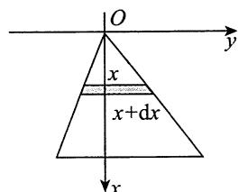  
(b)

2.【解析】(1)建立如图(a)所示的直角坐标系，则在水深 $y$ 处平板一侧所受的水压力为

$$
\mathrm {d} F = \rho g y \cdot 2 \left(1 - \frac {\sqrt {3}}{3} y\right) \mathrm {d} y,
$$

则平板一侧所受的水压力为

$$
\int_ {0} ^ {\sqrt {3}} \rho g y \cdot 2 \left(1 - \frac {\sqrt {3}}{3} y\right) d y = 2 \rho g \int_ {0} ^ {\sqrt {3}} \left(y - \frac {\sqrt {3}}{3} y ^ {2}\right) d y = 2 \rho g \left(\frac {3}{2} - 1\right) = \rho g.
$$

(2)如图(b)所示，设 $0\sim t$ 时刻水面增加的高度为 $-h$ ， $h = h(t)$ ， $h < 0$ ，则

$$
\begin{array}{l} F = \int_ {0} ^ {\sqrt {3}} 2 \rho g \left(1 - \frac {\sqrt {3}}{3} y\right) (y - h) d y \\ = \rho g - 2 \rho g \int_ {0} ^ {\sqrt {3}} \left(1 - \frac {\sqrt {3}}{3} y\right) d y \cdot h \\ = \rho g - \sqrt {3} \rho g h. \\ \end{array}
$$

又 $\frac{\mathrm{d}h}{\mathrm{d}t} = -\frac{1}{10}$ 故 $\frac{\mathrm{d}F}{\mathrm{d}t} = -\sqrt{3}\rho g\frac{\mathrm{d}h}{\mathrm{d}t} = \frac{\sqrt{3}}{10}\rho g.$

  
(a)

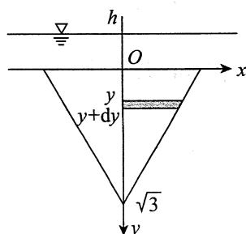  
(b)

3.【答案】 $\frac{4}{3}\rho g\pi a^4$

【解析】建立如图所示的坐标系，重力微元为 $\rho g\pi y^2\mathrm{d}x$ ，其向上移动 $2a$ ，但在水中不做功，故做

功的位移为 $2a - x$ ，故 $\mathrm{d}W = \rho g\pi y^2\mathrm{d}x\cdot (2a - x)$ ，于是

$$
\begin{array}{l} W = \int_ {0} ^ {2 a} d W = \int_ {0} ^ {2 a} (2 a - x) \rho g \pi [ a ^ {2} - (x - a) ^ {2} ] d x \\ = \frac {4}{3} \rho g \pi a ^ {4}. \\ \end{array}
$$

4.【答案】(D)

【解析】由题设知，密度函数 $\rho (x,y) = k\sqrt{x^2 + y^2} (k > 0)$

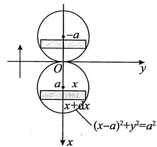

设重心坐标为 $(\overline{x},\overline{y})$ ， $D = \left\{(x,y)\mid x^2 +y^2\leqslant a^2,y\geqslant 0\right\}$ ，由对称性知 $\overline{x} = 0$ ， $\overline{y} = \frac{M_x}{M}$

其中， $M_{x} = \iint_{D}ky\sqrt{x^{2} + y^{2}}\mathrm{d}x\mathrm{d}y = k\int_{0}^{\pi}\mathrm{d}\theta \int_{0}^{a}r\sin \theta \bullet r\bullet r\mathrm{d}r = \frac{1}{2} ka^{4},$

$$
M = \iint_ {D} k \sqrt {x ^ {2} + y ^ {2}} d x d y = k \int_ {0} ^ {\pi} d \theta \int_ {0} ^ {a} r ^ {2} d r = \frac {1}{3} k \pi a ^ {3},
$$

故 $\overline{y} = \frac{M_x}{M} = \frac{3a}{2\pi}$ . 因此, 重心坐标 $(\overline{x}, \overline{y}) = \left(0, \frac{3a}{2\pi}\right)$ .

5.【答案】 $\left(\frac{2}{\mathrm{e}^2 - 1},\frac{\mathrm{e}^2 + 1}{4\mathrm{e}}\right)$

【解析】区域 $D$ 如图所示.

$$
\begin{array}{l} \bar {x} = \frac {\int_ {- 1} ^ {1} d x \int_ {0} ^ {e ^ {x}} x d y}{\int_ {- 1} ^ {1} d x \int_ {0} ^ {e ^ {x}} d y} = \frac {\int_ {- 1} ^ {1} x e ^ {x} d x}{\int_ {- 1} ^ {1} e ^ {x} d x} = \frac {2}{e ^ {2} - 1}, \\ \bar {y} = \frac {\int_ {- 1} ^ {1} d x \int_ {0} ^ {e ^ {x}} y d y}{\int_ {- 1} ^ {1} d x \int_ {0} ^ {e ^ {x}} d y} = \frac {\frac {1}{2} \int_ {- 1} ^ {1} (e ^ {x}) ^ {2} d x}{\int_ {- 1} ^ {1} e ^ {x} d x} = \frac {e ^ {2} + 1}{4 e}. \\ \end{array}
$$

故所求形心为 $\left(\frac{2}{\mathrm{e}^2 - 1},\frac{\mathrm{e}^2 + 1}{4\mathrm{e}}\right)$

# 第13章 多元函数微分学

1.【答案】(C)

【解析】 $\lim_{\Delta x\to 0}\frac{f(\Delta x,0) - f(0,0)}{\Delta x} = \lim_{\Delta x\to 0}\frac{|\Delta x|}{\Delta x}$ 不存在，故 $f_{x}^{\prime}(0,0)$ 不存在；

$\lim_{\Delta y \to 0} \frac{f(0, \Delta y) - f(0, 0)}{\Delta y} = \lim_{\Delta y \to 0} \frac{\Delta y |\Delta y|}{\Delta y} = 0$ ，故 $f_y'(0, 0)$ 存在.

2.【答案】(D)

【解析】由 $\frac{\partial f(x,y)}{\partial x} > 0$ 知, $f(x,y)$ 关于 $x$ 单调递增, 则

$$
f (1, y) > f (0, y).
$$

由 $\frac{\partial f(x,y)}{\partial y} < 0$ 知， $f(x,y)$ 关于 $y$ 单调递减，则

$$
f (x, 0) > f (x, 1).
$$

综合以上两个不等式，有

$$
f (1, 0) > f (0, 0) > f (0, 1).
$$

应选(D).

3.【答案】(B)

【解析】方法一 由题意得

$$
\begin{array}{l} F (a  , b)   {\overset {\text {令} \sin x = t} {=}}   \int_ {0} ^ {1} (a t - t ^ {2} + b) ^ {2} \mathrm {d} t \\ = \int_ {0} ^ {1} \left(t ^ {4} - 2 a t ^ {3} + a ^ {2} t ^ {2} - 2 b t ^ {2} + 2 a b t + b ^ {2}\right) d t \\ = \frac {a ^ {2}}{3} + b ^ {2} + a b - \frac {2}{3} b - \frac {1}{2} a + \frac {1}{5}. \\ \end{array}
$$

令 $\left\{ \begin{array}{l} \frac{\partial F}{\partial a} = \frac{2}{3} a + b - \frac{1}{2} = 0, \\ \frac{\partial F}{\partial b} = 2b + a - \frac{2}{3} = 0, \end{array} \right.$

解得唯一驻点 $\left(1, -\frac{1}{6}\right)$ . 因为在 $\left(1, -\frac{1}{6}\right)$ 处，有 $A = \frac{\partial^2 F}{\partial a^2} = \frac{2}{3}$ ， $B = \frac{\partial^2 F}{\partial a \partial b} = 1$ ， $C = \frac{\partial^2 F}{\partial b^2} = 2$ ，满足 $A = AC - B^2 > 0$ ， $A > 0$ ，故 $\left(1, -\frac{1}{6}\right)$ 为 $F(a, b)$ 的极小值点，也是最小值点.

方法二 令 $\sin x = t$ ，则 $F(a,b) = \int_{0}^{1}(at - t^{2} + b)^{2}\mathrm{d}t.$ 令

$$
\left\{ \begin{array}{l} \frac {\partial F}{\partial a} = \int_ {0} ^ {1} 2 (a t - t ^ {2} + b) \cdot t \mathrm {d} t = 0, \\ \frac {\partial F}{\partial b} = \int_ {0} ^ {1} 2 (a t - t ^ {2} + b) \mathrm {d} t = 0, \end{array} \right.
$$

即 $\left\{ \begin{array}{l} \frac{a}{3} + \frac{b}{2} - \frac{1}{4} = 0, \\ \frac{a}{2} + b - \frac{1}{3} = 0, \end{array} \right.$ 解得 $\left\{ \begin{array}{l} a = 1, \\ b = -\frac{1}{6}, \end{array} \right.$ 又在 $\left(1, -\frac{1}{6}\right)$ 处，

$$
A = \frac {\partial^ {2} F}{\partial a ^ {2}} = \int_ {0} ^ {1} 2 t ^ {2} \mathrm {d} t = \frac {2}{3}, B = \frac {\partial^ {2} F}{\partial a \partial b} = \int_ {0} ^ {1} 2 t \mathrm {d} t = 1, C = \frac {\partial^ {2} F}{\partial b ^ {2}} = \int_ {0} ^ {1} 2 \mathrm {d} t = 2,
$$

则 $A = AC - B^{2} > 0$ ， $A > 0$ ，故 $\left(1, - \frac{1}{6}\right)$ 为 $F(a,b)$ 的极小值点，又因为驻点唯一，故 $\left(1, - \frac{1}{6}\right)$ 为 $F(a,b)$ 的最小值点.

【注】方法二中积分号内可求导应用了如下定理：

设函数 $f(t,x)$ 在 $\{(t,x)\mid \alpha \leqslant t\leqslant \beta ,a\leqslant x\leqslant b\}$ 上连续可微，则函数 $I(t) = \int_{a}^{b}f(t,x)\mathrm{d}x$ 在区间 $[\alpha ,\beta ]$ 上连续可微，且 $I^{\prime}(t) = \int_{a}^{b}\frac{\partial f(t,x)}{\partial t}\mathrm{d}x.$

在考试中, 若是客观题, 此定理可直接使用; 若是解答题, 只需把定理叙述一遍后使用即可.

4.【解析】(1)由已知得 $\frac{f(x,y) - \sqrt{x^2 + y^2}}{\sqrt{x^2 + y^2}} = a + o(1)$ ，即

$$
f (x, y) = (a + 1) \sqrt {x ^ {2} + y ^ {2}} + o (\sqrt {x ^ {2} + y ^ {2}}),
$$

则 $\lim_{(x,y)\to (0,0)}f(x,y) = 0 = f(0,0)$ ，故函数 $f(x,y)$ 在点 $(0,0)$ 处连续.

(2) 由可微的定义, 为使上式具有微分的形式, 只需取 $a = -1$ , 此时函数 $f(x,y)$ 在点 $(0,0)$ 处的微分 $\mathrm{d}f|_{(0,0)} = 0$

5.【解析】 $\frac{\partial u}{\partial x} = \left[\mathrm{e}^{x} + f^{\prime}(x)\right]y,\frac{\partial u}{\partial y} = f^{\prime}(x),\frac{\partial^{2}u}{\partial x\partial y} = \mathrm{e}^{x} + f^{\prime}(x),\frac{\partial^{2}u}{\partial y\partial x} = f^{\prime \prime}(x),$

由于 $f(x)$ 具有二阶连续的导数，则 $u(x,y)$ 的二阶偏导数连续.从而 $\frac{\partial^2u}{\partial x\partial y} = \frac{\partial^2u}{\partial y\partial x}$ 即 $f''(x) - f'(x) = \mathrm{e}^x$ ，即 $f(x) = C_1 + C_2\mathrm{e}^x +x\mathrm{e}^x$ ，又 $f(0) = 4,f^{\prime}(0) = 3$ ，得 $C_1 = 2,C_2 = 2$ ，即

$$
f (x) = 2 + (2 + x) \mathrm {e} ^ {x}.
$$

6.【解析】令 $\frac{y}{x} = u$ ，则 $z = f(u)$ .故

$$
\frac {\partial z}{\partial x} = - \frac {y}{x ^ {2}} f ^ {\prime} (u), \frac {\partial^ {2} z}{\partial x ^ {2}} = \frac {y ^ {2}}{x ^ {4}} f ^ {\prime \prime} (u) + \frac {2 y}{x ^ {3}} f ^ {\prime} (u),
$$

$$
\frac {\partial z}{\partial y} = \frac {1}{x} f ^ {\prime} (u), \frac {\partial^ {2} z}{\partial y ^ {2}} = \frac {1}{x ^ {2}} f ^ {\prime \prime} (u),
$$

所以 $\frac{\partial^2z}{\partial x^2} +\frac{\partial^2z}{\partial y^2} = \frac{x^2 + y^2}{x^4} f''(u) + \frac{2xy}{x^4} f'(u).$

原方程可化为 $(1 + u^{2})f^{\prime \prime}(u) + 2uf^{\prime}(u) = 0$

分离变量，得 $\frac{\mathrm{d}[f'(u)]}{f'(u)} = -\frac{2u}{1 + u^2}\mathrm{d}u,$

$$
f ^ {\prime} (u) = \frac {C _ {1}}{1 + u ^ {2}},
$$

故 $f(u) = C_{1}\arctan u + C_{2},u\in (0, + \infty)$ ，其中 $C_1$ ， $C_2$ 为任意常数.

# 7.【答案】 $3\mathrm{dx} - \mathrm{dy}$

【解析】由 $\lim_{(x,y)\to (1,0)}\frac{f(x,y) - 3x + y + 5}{(x - 1)^2 + y^2} = \frac{1}{4}$ ，可知 $\lim_{(x,y)\to (1,0)}f(x,y) = -2$ 。因为 $f(x,y)$ 连续，所以 $f(1,0) = -2$ 。记 $\rho = \sqrt{(x - 1)^2 + y^2}$ ，则 $\lim_{\rho \to 0^{+}}\frac{f(x,y) - f(1,0) - 3(x - 1) + y}{\rho^2} = \frac{1}{4}$ ，所以函数的增量

$$
\Delta z = f (x, y) - f (1, 0) = 3 (x - 1) - y + o (\rho),
$$

其中 $o(\rho)$ 是当 $\rho \to 0^{+}$ 时 $\rho$ 的高阶无穷小.因此， $f(x,y)$ 在点(1,0)处可微，且 $\mathrm{d}z\big|_{(1,0)} = 3\mathrm{d}x - \mathrm{d}y$

# 8.【答案】4

【解析】 $\frac{\partial z}{\partial x} = yf_u'(xy,x + y) + f_v'(xy,x + y),\frac{\partial z}{\partial y} = xf_u'(xy,x + y) + f_v'(xy,x + y).$

由 $\mathrm{dz}\left|_{\substack{x = 2\\ y = 3}} = 6\mathrm{dx} + 5\mathrm{dy}\right.$ ，得 $\frac{\partial z}{\partial x}\Bigg|_{\substack{x = 2\\ y = 3}} = 6,\frac{\partial z}{\partial y}\Bigg|_{\substack{x = 2\\ y = 3}} = 5.$ 于是，

$$
\left\{ \begin{array}{l} 3 f _ {u} ^ {\prime} (6, 5) + f _ {v} ^ {\prime} (6, 5) = 6, \\ 2 f _ {u} ^ {\prime} (6, 5) + f _ {v} ^ {\prime} (6, 5) = 5, \end{array} \right.
$$

解得 $f_{u}^{\prime}(6,5) = 1,f_{v}^{\prime}(6,5) = 3$ .于是， $f_{u}^{\prime}(6,5) + f_{v}^{\prime}(6,5) = 4$

# 9.【答案】 $(2x - y)\mathrm{d}x - x\mathrm{d}y$

【解析】设 $xy = u$ ， $\frac{y}{x} = v$ ，有 $x^{2} = \frac{u}{v}, y^{2} = uv$ ，则

$$
f (u, v) = u v \left(\frac {u}{v} - 1\right) = u ^ {2} - u v,
$$

即 $f(x,y) = x^{2} - xy$ ，所以 $\mathrm{dz} = (2x - y)\mathrm{dx} - x\mathrm{dy}$

10.【答案】4e

【解析】方法一 $f_{y}^{\prime}(x,y) = x\mathrm{e}^{x^{3}y^{2}},f_{y}^{\prime}(x,1) = x\mathrm{e}^{x^{3}};f_{yx}^{\prime \prime}(x,1) = 3x^{3}\mathrm{e}^{x^{3}} + \mathrm{e}^{x^{3}},f_{yx}^{\prime \prime}(1,1) = 4\mathrm{e}.$

由于 $f(x,y)$ 的二阶混合偏导数在点(1,1)处是相等的，因此 $f_{xy}''(1,1) = 4\mathrm{e}$

方法二 当 $x > 0$ 时， $f(x, y) = \int_{0}^{xy} \mathrm{e}^{xt^2} \, \mathrm{d}t \frac{\frac{u}{\sqrt{x}} = t}{u = t \sqrt{x}} \int_{0}^{\frac{3}{x^2}y} \mathrm{e}^{u^2} \frac{1}{\sqrt{x}} \, \mathrm{d}u = \frac{1}{\sqrt{x}} \int_{0}^{\frac{3}{x^2}y} \mathrm{e}^{u^2} \, \mathrm{d}u$ ，得

$$
f _ {x} ^ {\prime} (x, y) = - \frac {1}{2} x ^ {- \frac {3}{2}} \int_ {0} ^ {x ^ {\frac {3}{2}} y} \mathrm {e} ^ {u ^ {2}} \mathrm {d} u + \frac {1}{\sqrt {x}} \cdot \mathrm {e} ^ {x ^ {3} y ^ {2}} \cdot \frac {3}{2} x ^ {\frac {1}{2}} y,
$$

故当 $x = 1$ 时，有 $f_{x}^{\prime}(1,y) = -\frac{1}{2}\int_{0}^{y}\mathrm{e}^{u^{2}}\mathrm{d}u + \frac{3}{2}\mathrm{e}^{y^{2}}\bullet y$ ，则

$$
\begin{array}{l} f _ {x y} ^ {\prime \prime} (1, y) = - \frac {1}{2} e ^ {y ^ {2}} + \frac {3}{2} \cdot e ^ {y ^ {2}} \cdot 2 y \cdot y + \frac {3}{2} e ^ {y ^ {2}} \cdot 1, \\ f _ {x y} ^ {\prime \prime} (1, 1) = - \frac {1}{2} e + 3 e + \frac {3}{2} e = 4 e. \\ \end{array}
$$

11.【答案】 $\frac{3}{8}$

【解析】将 $z + \mathrm{e}^{z} = xy$ 写成 $F(x,y,z) = xy - z - \mathrm{e}^{z} = 0$ ，按隐函数求导公式，有

$$
\frac {\partial z}{\partial x} = - \frac {F _ {x} ^ {\prime} (x , y , z)}{F _ {z} ^ {\prime} (x , y , z)} = - \frac {y}{- 1 - e ^ {z}} = \frac {y}{1 + e ^ {z}},
$$

$$
\frac {\partial z}{\partial y} = - \frac {F _ {y} ^ {\prime} (x , y , z)}{F _ {z} ^ {\prime} (x , y , z)} = - \frac {x}{- 1 - e ^ {z}} = \frac {x}{1 + e ^ {z}}.
$$

故 $\frac{\partial^2z}{\partial x\partial y} = \frac{\partial}{\partial y}\left(\frac{\partial z}{\partial x}\right) = \frac{\partial}{\partial y}\left(\frac{y}{1 + \mathrm{e}^z}\right) = \frac{1 + \mathrm{e}^z - y\mathrm{e}^z\frac{\partial z}{\partial y}}{(1 + \mathrm{e}^z)^2} = \frac{1}{1 + \mathrm{e}^z} -\frac{xy\mathrm{e}^z}{(1 + \mathrm{e}^z)^3},$ 以 $z = 0$ 代入 $F(x,y,z) = 0$

中，得 $xy = 1$ ，从而得 $\frac{\partial^2z}{\partial x\partial y}\bigg|_{z = 0} = \frac{3}{8}$

12.【答案】 $\frac{1}{3}\mathrm{d}x + \frac{2}{3}\mathrm{d}y$

【解析】当 $(x,y) = (0,0)$ 时， $z = 0$ .对方程 $\mathrm{e}^{x - 2y + 3z} - 2x\mathrm{e}^{-y}\cos z = 1$ 两边求全微分，得

$$
\mathrm {e} ^ {x - 2 y + 3 z} (\mathrm {d} x - 2 \mathrm {d} y + 3 \mathrm {d} z) - 2 \mathrm {e} ^ {- y} \cos z \mathrm {d} x + 2 x \mathrm {e} ^ {- y} \cos z \mathrm {d} y + 2 x \mathrm {e} ^ {- y} \sin z \mathrm {d} z = 0,
$$

将 $(x,y,z) = (0,0,0)$ 代入上式，解得 $\mathrm{dz}\big|_{(0,0)} = \frac{1}{3}\mathrm{dx} + \frac{2}{3}\mathrm{dy}$

13.【答案】(A)

【解析】记 $P = \frac{x}{x^2 + y^2 - 1}$ ， $Q = \frac{ay}{x^2 + y^2 - 1}$ ，由题意知， $\frac{\partial Q}{\partial x} = \frac{\partial P}{\partial y}$ ，则

$$
\frac {2 a x y}{(x ^ {2} + y ^ {2} - 1) ^ {2}} = \frac {2 x y}{(x ^ {2} + y ^ {2} - 1) ^ {2}},
$$

故 $a = 1$ ：

14.【答案】-edx+edy

【解析】先求 $z(0,0)$ ，在原方程中令 $x = 0$ ， $y = 0$ ，得 $\int_{1}^{z}\mathrm{e}^{-t^2}\mathrm{d}t = 0$ ，解得 $z = 1$ 。

记 $F(x,y,z) = \sin (x - y) + \int_{1}^{z}\mathrm{e}^{-t^2}\mathrm{d}t$ ，则 $F_{x}^{\prime} = \cos (x - y),F_{y}^{\prime} = -\cos (x - y),F_{z}^{\prime} = \mathrm{e}^{-z^{2}}$ ，因此有

$$
\frac {\partial z}{\partial x} = - \frac {F _ {x} ^ {\prime}}{F _ {z} ^ {\prime}} = - \frac {\cos (x - y)}{\mathrm {e} ^ {- z ^ {2}}} = - \mathrm {e} ^ {z ^ {2}} \cos (x - y),
$$

$$
\frac {\partial z}{\partial y} = - \frac {F _ {y} ^ {\prime}}{F _ {z} ^ {\prime}} = - \frac {- \cos (x - y)}{\mathrm {e} ^ {- z ^ {2}}} = \mathrm {e} ^ {z ^ {2}} \cos (x - y),
$$

且 $\mathrm{dz} = \frac{\partial z}{\partial x}\mathrm{dx} + \frac{\partial z}{\partial y}\mathrm{dy}$ ，将 $x = 0$ ， $y = 0$ ， $z = 1$ 代入上式得

$$
\left. \mathrm {d} z \right| _ {(0, 0)} = - \mathrm {e d} x + \mathrm {e d} y.
$$

15.【解析】在 $z + \ln z - \int_{y}^{x}\mathrm{e}^{-t^2}\mathrm{d}t = 1$ 两边对 $x$ 求偏导，有

$$
\left(1 + \frac {1}{z}\right) \frac {\partial z}{\partial x} - e ^ {- x ^ {2}} = 0, \frac {\partial z}{\partial x} = \frac {z}{1 + z} e ^ {- x ^ {2}}.
$$

类似可得 $\frac{\partial z}{\partial y} = -\frac{z}{1 + z}\mathrm{e}^{-y^2}.$

故 $\frac{\partial^2z}{\partial x\partial y} = \mathrm{e}^{-x^2}\frac{\partial}{\partial y}\left(\frac{z}{1 + z}\right) = \mathrm{e}^{-x^2}\frac{\frac{\partial z}{\partial y}}{(1 + z)^2} = -\frac{z}{(1 + z)^3}\mathrm{e}^{-(x^2 +y^2)}.$ （\*）

将 $x = 0$ ， $y = 0$ 代入 $z + \ln z - \int_{y}^{x}\mathrm{e}^{-t^2}\mathrm{d}t = 1$ ，得 $z + \ln z - 1 = 0$ .令 $f(z) = z + \ln z - 1$ ，则

$$
\lim  _ {z \rightarrow 0 ^ {+}} f (z) = - \infty , \lim  _ {z \rightarrow + \infty} f (z) = + \infty , f ^ {\prime} (z) = 1 + \frac {1}{z} > 0,
$$

所以 $f(z)$ 有唯一零点. 易见 $f(1) = 0$ ，所以 $x = 0, y = 0$ 时， $z = 1$ ，代入 (*) 式，得 $\left.\frac{\partial^2 z}{\partial x \partial y}\right|_{(0,0)} = -\frac{1}{8}$ .

16.【答案】(B)

【解析】 $\frac{\partial z}{\partial x} = f_1' \cdot y + f_2' \cdot \left( \frac{1}{x} + g' \cdot y \right), \frac{\partial z}{\partial y} = f_1' \cdot x + f_2' \cdot g' \cdot x,$

故 $x\frac{\partial z}{\partial x} -y\frac{\partial z}{\partial y} = f_2^{\prime}$

17.【答案】(B)

【解析】 $\frac{\partial z}{\partial x} = -\frac{\frac{\partial F}{\partial x}}{\frac{\partial F}{\partial z}} = -\frac{F_1' \cdot \frac{1}{z}}{F_1' \cdot \left(-\frac{x}{z^2}\right) + F_2' \cdot y},$

$$
\frac {\partial z}{\partial y} = - \frac {\frac {\partial F}{\partial y}}{\frac {\partial F}{\partial z}} = - \frac {F _ {2} ^ {\prime} \cdot z}{F _ {1} ^ {\prime} \cdot \left(- \frac {x}{z ^ {2}}\right) + F _ {2} ^ {\prime} \cdot y},
$$

则 $x\frac{\partial z}{\partial x} -y\frac{\partial z}{\partial y} = z.$

18.【答案】-2

【解析】令 $F(x, y, z) = 3x + xyz + z^3 - 1$ ，则 $F_x' = 3 + yz$ ， $F_z' = xy + 3z^2$ 。当 $x = 0$ ， $y = 0$ 时， $z = 1$ ，于是，

$$
\frac {\partial z}{\partial x} = - \frac {F _ {x} ^ {\prime}}{F _ {z} ^ {\prime}} = - \frac {3 + y z}{x y + 3 z ^ {2}}, \left. \frac {\partial z}{\partial x} \right| _ {x = 0} = - \left. \frac {3 + y z}{x y + 3 z ^ {2}} \right| _ {x = 0} = - 1,
$$

$$
\left. \frac {\partial^ {2} z}{\partial x ^ {2}} \right| _ {x = 0} = - \frac {y \frac {\partial z}{\partial x} (x y + 3 z ^ {2}) - (3 + y z) \left(y + 6 z \frac {\partial z}{\partial x}\right)}{(x y + 3 z ^ {2}) ^ {2}} \Bigg | _ { \begin{array}{l} x = 0 \\ y = 0 \\ z = 1 \end{array} } = - 2.
$$

19.【解析】设 $F(x,y,z) = 2z - \mathrm{e}^z +1 + \int_y^{x^2}\sin (t^2)\mathrm{d}t$ ，则

$$
F _ {x} ^ {\prime} = 2 x \sin \left(x ^ {4}\right), F _ {y} ^ {\prime} = - \sin \left(y ^ {2}\right), F _ {z} ^ {\prime} = 2 - e ^ {z},
$$

$$
\frac {\partial z}{\partial x} = - \frac {F _ {x} ^ {\prime}}{F _ {z} ^ {\prime}} = - \frac {2 x \sin \left(x ^ {4}\right)}{2 - e ^ {z}}, \frac {\partial z}{\partial y} = - \frac {F _ {y} ^ {\prime}}{F _ {z} ^ {\prime}} = \frac {\sin \left(y ^ {2}\right)}{2 - e ^ {z}}.
$$

将 $x = 1, y = 1, z = 0$ 代入，得 $\left.\frac{\partial z}{\partial x}\right|_{(1,1)} = -2\sin 1, \left.\frac{\partial z}{\partial y}\right|_{(1,1)} = \sin 1$ ，则

$$
\left. \frac {\partial^ {2} z}{\partial x \partial y} \right| _ {(1, 1)} = \frac {- 2 x \sin \left(x ^ {4}\right) \cdot e ^ {z} \cdot \frac {\partial z}{\partial y}}{\left(2 - e ^ {z}\right) ^ {2}} \Bigg | _ {(1, 1, 0)} = - 2 \sin^ {2} 1.
$$

20.【解析】对方程 $f(z - x,z - y) = 1$ 两边关于 $y$ 求偏导，得 $\frac{\partial z}{\partial y} f_1' + \left(\frac{\partial z}{\partial y} - 1\right) f_2' = 0$ ，知 $\frac{\partial z}{\partial y} = \frac{f_2'}{f_1' + f_2'}$ .同理， $\frac{\partial z}{\partial x} = \frac{f_1'}{f_1' + f_2'}$ ，故

$$
\begin{array}{l} \frac {\partial^ {2} z}{\partial x \partial y} = \frac {\frac {\partial f _ {1} ^ {\prime}}{\partial y} \left(f _ {1} ^ {\prime} + f _ {2} ^ {\prime}\right) - \frac {\partial \left(f _ {1} ^ {\prime} + f _ {2} ^ {\prime}\right)}{\partial y} f _ {1} ^ {\prime}}{\left(f _ {1} ^ {\prime} + f _ {2} ^ {\prime}\right) ^ {2}} \\ = \frac {\left[ f _ {1 1} ^ {\prime \prime} \frac {\partial z}{\partial y} + f _ {1 2} ^ {\prime \prime} \cdot \left(\frac {\partial z}{\partial y} - 1\right) \right] f _ {2} ^ {\prime} - \left[ f _ {2 1} ^ {\prime \prime} \frac {\partial z}{\partial y} + f _ {2 2} ^ {\prime \prime} \cdot \left(\frac {\partial z}{\partial y} - 1\right) \right] f _ {1} ^ {\prime}}{\left(f _ {1} ^ {\prime} + f _ {2} ^ {\prime}\right) ^ {2}} \\ = \frac {f _ {1 1} ^ {\prime \prime} \left(f _ {2} ^ {\prime}\right) ^ {2} - 2 f _ {1} ^ {\prime} f _ {2} ^ {\prime} f _ {1 2} ^ {\prime \prime} + f _ {2 2} ^ {\prime \prime} \left(f _ {1} ^ {\prime}\right) ^ {2}}{\left(f _ {1} ^ {\prime} + f _ {2} ^ {\prime}\right) ^ {3}}. \\ \end{array}
$$

21.【答案】 $\frac{\mathrm{e}^2}{\mathrm{e} - 1}$

【解析】在等式 $\int_0^x\mathrm{e}^{t^2}\mathrm{d}t + \ln (1 + y) = 0$ 与 $\mathrm{e}^{y + z} = \mathrm{e} + z\ln z$ 两边分别对 $x$ 求导，得

$$
\mathrm {e} ^ {x ^ {2}} + \frac {1}{1 + y} \cdot y ^ {\prime} = 0, \mathrm {e} ^ {y + z} \cdot \left(y ^ {\prime} + z ^ {\prime}\right) = z ^ {\prime} \ln z + z ^ {\prime}. \tag {*}
$$

当 $x = 0$ 时， $y(0) = 0, z(0) = 1$ ，代入 $(\ast)$ 式，得

$$
1 + y ^ {\prime} (0) = 0, \mathrm {e} \left[ y ^ {\prime} (0) + z ^ {\prime} (0) \right] = z ^ {\prime} (0),
$$

解得 $y^\prime (0) = -1$ ， $z^{\prime}(0) = \frac{e}{e - 1}$

故由 $\frac{\mathrm{d}u}{\mathrm{d}x} = \mathrm{e}^{x + y + z}\cdot (1 + y' + z')$ ，得

$$
\left. \frac {\mathrm {d} u}{\mathrm {d} x} \right| _ {x = 0} = \mathrm {e} ^ {y (0) + z (0)} \cdot \left[ 1 + y ^ {\prime} (0) + z ^ {\prime} (0) \right] = \frac {\mathrm {e} ^ {2}}{\mathrm {e} - 1}.
$$

22.【答案】(B)

【解析】设 $F(x,y,\lambda) = x^{2} + y^{2} + \lambda [(x - 1)^{3} - y^{2}]$

令 $\left\{ \begin{array}{l} F_{x}^{\prime} = 2x + 3\lambda (x - 1)^{2} = 0, \\ F_{y}^{\prime} = 2y - 2\lambda y = 0, \\ F_{\lambda}^{\prime} = (x - 1)^{3} - y^{2} = 0, \end{array} \right.$

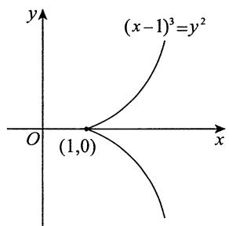

此方程组无解.

事实上，题目是在讨论如图所示的曲线 $(x - 1)^{3} = y^{2}$ 上的点到原点的距离有无最大值和最小值，显然在点(1,0)处取得最小值，最小值为1，而由图可知曲线上的点到原点的最大距离为无穷大，故不存在最大值，选(B).

【注】约束条件中有不可微点(1,0)，须从定义重新考虑，而不能因拉格朗日乘数法失效而妄下结论.

23.【答案】(D)

【解析】令 $\left\{ \begin{array}{l} f_{x}^{\prime} = 4x^{3} - 2x - 2y = 0, \\ f_{y}^{\prime} = 4y^{3} - 2x - 2y = 0; \end{array} \right.$

得到函数 $f(x,y)$ 的3个驻点 $(0,0),(1,1),(-1, - 1)$ .求二阶偏导数，得

$$
f _ {x x} ^ {\prime \prime} (x, y) = 1 2 x ^ {2} - 2, f _ {x y} ^ {\prime \prime} (x, y) = - 2, f _ {y y} ^ {\prime \prime} (x, y) = 1 2 y ^ {2} - 2.
$$

在点(1,1)处， $A = f_{xx}^{\prime \prime}(1,1) = 10,B = f_{xy}^{\prime \prime}(1,1) = -2,C = f_{yy}^{\prime \prime}(1,1) = 10,$

则 $AC - B^{2} > 0, A > 0$

故(1,1)是函数 $f(x,y)$ 的极小值点；

在点 $(-1, -1)$ 处， $A = f_{xx}''(-1, -1) = 10, B = f_{xy}''(-1, -1) = -2, C = f_{yy}''(-1, -1) = 10$

则 $AC - B^{2} > 0,A > 0$

故 $(-1, -1)$ 是函数 $f(x, y)$ 的极小值点；

在点(0,0)处， $A = f_{xx}^{\prime \prime}(0,0) = -2,B = f_{xy}^{\prime \prime}(0,0) = -2,C = f_{yy}^{\prime \prime}(0,0) = -2,$

则 $AC - B^{2} = 0$

无法使用充分条件判断. 对于 $0 < |x| < 1$ ，有

$$
f (x, 0) = x ^ {4} - x ^ {2} <   0, f (x, - x) = 2 x ^ {4} > 0, f (0, 0) = 0,
$$

故 $(0,0)$ 不是函数 $f(x,y)$ 的极值点. 故选(D).

24.【答案】(B)

【解析】当 $y = x\neq 0$ 时，

$$
f (x, x) = x ^ {2} - 4 x \mathrm {e} ^ {- \frac {1}{x ^ {2}}} + 3 \mathrm {e} ^ {- \frac {2}{x ^ {2}}} = x ^ {2} \left(1 - 4 \frac {\mathrm {e} ^ {- \frac {1}{x ^ {2}}}}{x} + 3 \frac {\mathrm {e} ^ {- \frac {2}{x ^ {2}}}}{x ^ {2}}\right),
$$

而 $\lim_{x\to 0}\left(1 - 4\frac{\mathrm{e}^{-\frac{1}{x^2}}}{x} +3\frac{\mathrm{e}^{-\frac{2}{x^2}}}{x^2}\right) = 1 > 0,$

故当 $|x| > 0$ 且充分小时， $f(x,x) > 0$ ，又 $f(0,0) = 0$ ，于是点 (0,0) 是 $f(x,x)$ 的极小值点。

当 $x = 0, y \neq 0$ 时， $f(x, y) = y^2 > 0$ ，当 $x \neq 0, y = 2\mathrm{e}^{-\frac{1}{x^2}}$ 时， $f(x, y) = -\mathrm{e}^{-\frac{2}{x^2}} < 0$ ，因此点 $(0, 0)$ 不是 $f(x, y)$ 的极小值点。

# 25.【答案】(C)

【解析】令 $f_{x}^{\prime}(x,y) = 2x + 3y^{2}(1 + x)^{2} = 0,f_{y}^{\prime}(x,y) = 2y(1 + x)^{3} = 0,$

可知 $(0,0)$ 是其唯一驻点. 由于

$$
f _ {x x} ^ {\prime \prime} (x, y) = 2 + 6 y ^ {2} (1 + x), f _ {x y} ^ {\prime \prime} (x, y) = 6 y (1 + x) ^ {2}, f _ {y y} ^ {\prime \prime} (x, y) = 2 (1 + x) ^ {3},
$$

故 $A = f_{xx}^{\prime \prime}(0,0) = 2,B = f_{xy}^{\prime \prime}(0,0) = 0,C = f_{yy}^{\prime \prime}(0,0) = 2,AC - B^{2} = 4 > 0,A > 0,$

则 $(0,0)$ 为 $f(x,y)$ 的唯一极小值点. 又 $f(0,0) = 0, f(-2,3) = -5$ ，显然 $(0,0)$ 不是 $f(x,y)$ 的最小值点.

【注】一元函数中“若函数连续, 则唯一的极值必为最值”在多元函数中不成立.

26.【解析】设 $F(x,y,z) = 2x^{2} + 2y^{2} + z^{2} + 8xz - z + 8$ ，则由

$$
\frac {\partial z}{\partial x} = - \frac {F _ {x} ^ {\prime}}{F _ {z} ^ {\prime}} = - \frac {4 x + 8 z}{2 z + 8 x - 1} = 0, \frac {\partial z}{\partial y} = - \frac {F _ {y} ^ {\prime}}{F _ {z} ^ {\prime}} = - \frac {4 y}{2 z + 8 x - 1} = 0,
$$

解得 $y = 0$ ， $4x + 8z = 0$ .再与 $2x^{2} + 2y^{2} + z^{2} + 8xz - z + 8 = 0$ 联立解得两组解：

$$
(x _ {1}, y _ {1}, z _ {1}) = (- 2, 0, 1), (x _ {2}, y _ {2}, z _ {2}) = \left(\frac {1 6}{7}, 0, - \frac {8}{7}\right).
$$

再求二阶偏导数并将两组解分别代入，得

$$
\left. \frac {\partial^ {2} z}{\partial x ^ {2}} \right| _ {(- 2, 0, 1)} = \frac {4}{1 5}, \left. \frac {\partial^ {2} z}{\partial x \partial y} \right| _ {(- 2, 0, 1)} = 0, \left. \frac {\partial^ {2} z}{\partial y ^ {2}} \right| _ {(- 2, 0, 1)} = \frac {4}{1 5};
$$

$$
\left. \frac {\partial^ {2} z}{\partial x ^ {2}} \right| _ {\left(\frac {1 6}{7}, 0, - \frac {8}{7}\right)} = - \frac {4}{1 5}, \left. \frac {\partial^ {2} z}{\partial x \partial y} \right| _ {\left(\frac {1 6}{7}, 0, - \frac {8}{7}\right)} = 0, \left. \frac {\partial^ {2} z}{\partial y ^ {2}} \right| _ {\left(\frac {1 6}{7}, 0, - \frac {8}{7}\right)} = - \frac {4}{1 5}.
$$

所以在 $(-2,0,1)$ 处， $AC - B^2 > 0$ ， $A = \frac{4}{15} > 0$ ，故 $z = 1$ 为极小值；在 $\left(\frac{16}{7}, 0, -\frac{8}{7}\right)$ 处， $AC - B^2 > 0$ ， $A = -\frac{4}{15} < 0$ ，故 $z = -\frac{8}{7}$ 为极大值.

27.【解析】由极值的必要条件，得方程组

$$
\left\{ \begin{array}{l} { \frac {\partial f}{\partial x} = 3 - 2 a x - 2 b y   \stackrel {\text {令}} {=}   0  ,} \\ { \frac {\partial f}{\partial y} = 4 - 4 a y - 2 b x   \stackrel {\text {令}} {=}   0  ,} \end{array} \right.
$$

整理得 $\left\{ \begin{array}{l} 2ax + 2by = 3, \\ bx + 2ay = 2, \end{array} \right.$

当 $\left| \begin{array}{ll}2a & 2b\\ b & 2a \end{array} \right| = 4a^2 -2b^2\neq 0$ ，即 $2a^{2} - b^{2}\neq 0$ 时，方程组有唯一解 $x_0 = \frac{3a - 2b}{2a^2 - b^2},y_0 = \frac{4a - 3b}{4a^2 - 2b^2}.$

又由于 $A = \frac{\partial^2 f}{\partial x^2}\bigg|_{(x_0, y_0)} = -2a$ ， $B = \frac{\partial^2 f}{\partial x \partial y}\bigg|_{(x_0, y_0)} = -2b$ ， $C = \frac{\partial^2 f}{\partial y^2}\bigg|_{(x_0, y_0)} = -4a$ ，故当 $AC - B^2 = 8a^2 - 4b^2 > 0$ 且 $A = -2a < 0$ ，即 $2a^2 - b^2 > 0$ 且 $a > 0$ 时， $f(x, y)$ 有唯一的极大值.

综上所述，当 $2a^{2} - b^{2} > 0$ 且 $a > 0$ 时， $f(x,y)$ 有唯一极大值.

28.【解析】 $|z|$ 的最值点与 $z^2$ 的最值点一致.构造拉格朗日函数

$$
F (x, y, z, \lambda , \mu) = z ^ {2} + \lambda \left(x ^ {2} + 9 y ^ {2} - 2 z ^ {2}\right) + \mu \left(x + 3 y + 3 z - 5\right).
$$

由 $\left\{ \begin{array}{l} \frac{\partial F}{\partial x} = 2\lambda x + \mu = 0, \\ \frac{\partial F}{\partial y} = 18\lambda y + 3\mu = 0, \\ \frac{\partial F}{\partial z} = 2z - 4\lambda z + 3\mu = 0, \\ \frac{\partial F}{\partial\lambda} = x^2 + 9y^2 - 2z^2 = 0, \\ \frac{\partial F}{\partial\mu} = x + 3y + 3z - 5 = 0, \end{array} \right.$

解得 $(x_{1},y_{1},z_{1}) = \left(1,\frac{1}{3},1\right), (x_{2},y_{2},z_{2}) = \left(-5, - \frac{5}{3},5\right).$

所以当 $x = 1, y = \frac{1}{3}$ 时， $|z| = 1$ 为最小值；当 $x = -5, y = -\frac{5}{3}$ 时， $|z| = 5$ 为最大值.

29.【解析】 $|z|$ 的最值点与 $z^2$ 的最值点一致.由题可转化为求函数 $z^2$ 以曲线方程为约束条件时的条件极值(由问题的几何意义，最大值与最小值存在，且均为条件极值).构造拉格朗日函数

$$
L (x, y, z, \lambda , \mu) = z ^ {2} + \lambda \left(x ^ {2} + y ^ {2} - 2 z ^ {2}\right) + \mu \left(x + y + 3 z - 5\right),
$$

令 $\left\{ \begin{array}{l} L_{x}^{\prime} = 2\lambda x + \mu = 0, \\ L_{y}^{\prime} = 2\lambda y + \mu = 0, \\ L_{z}^{\prime} = 2z - 4\lambda z + 3\mu = 0, \\ L_{\lambda}^{\prime} = x^{2} + y^{2} - 2z^{2} = 0, \\ L_{\mu}^{\prime} = x + y + 3z - 5 = 0, \end{array} \right.$ 解得 $\left\{ \begin{array}{l} x = 1, \\ y = 1, \text{或} \\ z = 1 \end{array} \right.$ $x = -5$ ，可知最近点为(1，1，1)，最远点为(-5，-5，5).

30.【解析】由题意可转化为求 $x^{2} + y^{2} + z^{2}$ 在约束条件下的最值.作拉格朗日函数

$$
F (x, y, z, \lambda , \mu) = x ^ {2} + y ^ {2} + z ^ {2} + \lambda (x + 2 y - 1) + \mu \left(x ^ {2} + 2 y ^ {2} + z ^ {2} - 1\right),
$$

令 $\left\{ \begin{array}{l} F_{x}^{\prime} = 2x + \lambda + 2\mu x = 0, \\ F_{y}^{\prime} = 2y + 2\lambda + 4\mu y = 0, \\ F_{z}^{\prime} = 2z + 2\mu z = 0, \\ F_{\lambda}^{\prime} = x + 2y - 1 = 0, \\ F_{\mu}^{\prime} = x^{2} + 2y^{2} + z^{2} - 1 = 0, \end{array} \right.$

解方程组得 $(x_{1},y_{1},z_{1}) = \left(-\frac{1}{3},\frac{2}{3},0\right), (x_{2},y_{2},z_{2}) = (1,0,0)$ ，分别计算目标函数值，有

$$
u \left(- \frac {1}{3}, \frac {2}{3}, 0\right) = \frac {\sqrt {5}}{3}, u (1, 0, 0) = 1,
$$

故所求最大值为1,最小值为 $\frac{\sqrt{5}}{3}$

31.【解析】将方程 $x^{2} - xy + y^{2} = 1$ 两边对 $x$ 求导，得 $2x - y - xy' + 2y \cdot y' = 0$ ，则 $y' = \frac{y - 2x}{2y - x}$

即切线方程为 $Y - y = \frac{y - 2x}{2y - x} (X - x).$

令 $Y = 0$ ，则其在 $x$ 轴上的截距为 $X = x - \frac{y(2y - x)}{y - 2x}$ ；令 $X = 0$ ，则其在 $y$ 轴上的截距为 $Y = y - \frac{x(y - 2x)}{2y - x}$ .故所求面积为

$$
\begin{array}{l} S = \frac {1}{2} X Y = \frac {1}{2} \cdot \frac {x y - 2 x ^ {2} - 2 y ^ {2} + x y}{y - 2 x} \cdot \frac {2 y ^ {2} - x y - x y + 2 x ^ {2}}{2 y - x} \\ = \frac {1}{2} \cdot 2 \cdot 2 \frac {\left[ x y - \left(x ^ {2} + y ^ {2}\right) \right] \left(x ^ {2} + y ^ {2} - x y\right)}{(y - 2 x) (2 y - x)}. \\ \end{array}
$$

由于 $x^{2} - xy + y^{2} = 1$ ，故 $S = \frac{2}{(y - 2x)(x - 2y)}$ ，即求 $(y - 2x)(x - 2y)$ 在约束条件 $x^{2} - xy + y^{2} = 1$ $(x > 0,y > 0)$ 下的最值.构造拉格朗日函数

$$
F (x, y, \lambda) = (y - 2 x) (x - 2 y) + \lambda \left(x ^ {2} - x y + y ^ {2} - 1\right),
$$

令 $\left\{ \begin{array}{l} F_{x}^{\prime} = 5y - 4x + \lambda (2x - y) = 0, \\ F_{y}^{\prime} = 5x - 4y + \lambda (2y - x) = 0, \\ F_{\lambda}^{\prime} = x^{2} - xy + y^{2} - 1 = 0, \end{array} \right.$

解得 $x = y = 1$ ，故 $S_{\min} = \frac{2}{|(-1)\cdot(-1)|} = 2$ ，即点 $P$ 坐标为(1,1).

32.【解析】由对称性， $\frac{x^2}{a^2} +\frac{y^2}{b^2} = 1$ 与 $x^{2} + y^{2} = 2y$ 相切于关于 $y$ 轴对称的两个点，其纵坐标相同，如图所示，且由图可知 $b\geqslant 2$ .于是，由 $\frac{x^2}{a^2} +\frac{y^2}{b^2} = 1$ ，得 $x^{2} = \frac{a^{2}}{b^{2}} (b^{2} - y^{2})$ ，代

人 $x^{2} + y^{2} = 2y$ ，有 $\frac{a^2}{b^2} (b^2 - y^2) + y^2 - 2y = 0$ ，即 $\frac{b^2 - a^2}{b^2} y^2 - 2y + a^2 = 0$

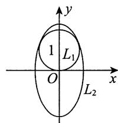

由 $\Delta = 4 - 4a^{2}\frac{b^{2} - a^{2}}{b^{2}} = 0$ ，得 $b^{2} - a^{2}b^{2} + a^{4} = 0$

又 $L_{2}$ 所围面积为 $\pi ab$ ，故问题转化为求 $ab$ 在约束条件 $b^{2} - a^{2}b^{2} + a^{4} = 0$ 下的最小值.

令 $F(a,b,\lambda) = ab + \lambda (b^{2} - a^{2}b^{2} + a^{4})$ ，由

$$
\left\{ \begin{array}{l} F _ {a} ^ {\prime} = b - 2 \lambda a b ^ {2} + 4 \lambda a ^ {3} = 0, \\ F _ {b} ^ {\prime} = a + 2 \lambda b - 2 \lambda a ^ {2} b = 0, \\ F _ {\lambda} ^ {\prime} = b ^ {2} - a ^ {2} b ^ {2} + a ^ {4} = 0, \end{array} \right.
$$

解得 $a = \frac{\sqrt{6}}{2}, b = \frac{3\sqrt{2}}{2}$ . 当 $b = 2$ 时, $a = \sqrt{2}$ . 又 $\pi \frac{\sqrt{6}}{2} \cdot \frac{3\sqrt{2}}{2} < 2\sqrt{2}\pi$ , 故 $a = \frac{\sqrt{6}}{2}, b = \frac{3\sqrt{2}}{2}$ 为所求值.

33.【解析】(1)在 $\frac{\partial^2u}{\partial x\partial y} = x^2 y$ 两边对 $y$ 积分，有 $\frac{\partial u}{\partial x} = \frac{1}{2} x^{2}y^{2} + \varphi (x)$ .根据 $u(x,0) = -x^{2} + 2$ ，有 $u_{x}^{\prime}(x,0) = -2x$ ，即 $\varphi (x) = -2x$ ， $\frac{\partial u}{\partial x} = \frac{1}{2} x^2 y^2 -2x$ ,在其两边对 $x$ 积分，有 $u(x,y) = \frac{1}{6} x^{3}y^{2} - x^{2} + \psi (y)$ 根据 $u(1,y) = \cos y$ ，即 $\frac{1}{6} y^2 -1 + \psi (y) = \cos y$ ，于是 $\psi (y) = \cos y - \frac{1}{6} y^2 +1$ ：

综上， $u(x,y) = \frac{1}{6} x^3 y^2 -x^2 +\cos y - \frac{1}{6} y^2 +1.$

(2) 记 $f(x, y) = u(x, y) - \cos y$ ，由(1)知， $f(x, y) = \frac{1}{6} x^3 y^2 - x^2 - \frac{1}{6} y^2 + 1$ ，令

$$
f _ {x} ^ {\prime} (x, y) = \frac {1}{2} x ^ {2} y ^ {2} - 2 x = 0, f _ {y} ^ {\prime} (x, y) = \frac {1}{3} x ^ {3} y - \frac {1}{3} y = 0,
$$

解得 $P_{1}(0,0), P_{2}(1,2), P_{3}(1,-2)$ . 又

$$
f _ {x x} ^ {\prime \prime} (x, y) = x y ^ {2} - 2, f _ {x y} ^ {\prime \prime} (x, y) = x ^ {2} y, f _ {y y} ^ {\prime \prime} (x, y) = \frac {1}{3} x ^ {3} - \frac {1}{3}.
$$

对于 $P_{1}(0,0)$ ，有 $A_{1} = -2, B_{1} = 0, C_{1} = -\frac{1}{3}$ ， $A_{1}C_{1} - B_{1}^{2} > 0, A_{1} < 0$ ，故 $(0,0)$ 为极大值点，极大值为 $f(0,0) = 1$ 。

对于 $P_{2}(1,2)$ ，有 $A_{2} = 2,B_{2} = 2,C_{2} = 0,A_{2}C_{2} - B_{2}^{2} <   0$ ，故(1,2)不是极值点.

对于 $P_{3}(1, - 2)$ ，有 $A_{3} = 2,B_{3} = -2,C_{3} = 0,A_{3}C_{3} - B_{3}^{2} <   0$ ，故 $(1, - 2)$ 不是极值点.

综上， $u(x,y) - \cos y$ 的极大值为1,无极小值.

34.【解析】由 $f_{yy}''(x,y) = 4$ ，两边对 $y$ 积分，得 $f_y'(x,y) = 4y + \varphi (x)$ ，两边再对 $y$ 积分，得

$$
f (x, y) = 2 y ^ {2} + \varphi (x) y + \psi (x).
$$

由条件 $f(x,0) = x^2$ ， $f_{y}^{\prime}(x,0) = \sqrt{2} x$ ，得 $\varphi (x) = \sqrt{2} x$ ， $\psi (x) = x^{2}$ ,故 $f(x,y) = 2y^{2} + \sqrt{2} xy + x^{2}$

令 $L(x,y,\lambda) = x^{2} + \sqrt{2} xy + 2y^{2} + \lambda (x^{2} + 2y^{2} - 4)$ ，由

$$
\left\{ \begin{array}{l} L _ {x} ^ {\prime} = 2 x + \sqrt {2} y + 2 \lambda x = 0, \\ L _ {y} ^ {\prime} = \sqrt {2} x + 4 y + 4 \lambda y = 0, \\ L _ {\lambda} ^ {\prime} = x ^ {2} + 2 y ^ {2} - 4 = 0, \end{array} \right.
$$

解得驻点 $(\sqrt{2},1)$ ， $(\sqrt{2}, - 1)$ ， $(- \sqrt{2},1)$ ， $(- \sqrt{2}, - 1)$ ：

由于 $f(\sqrt{2}, 1) = 6$ ， $f(\sqrt{2}, -1) = 2$ ， $f(-\sqrt{2}, 1) = 2$ ， $f(-\sqrt{2}, -1) = 6$ ，故 $f(x, y)$ 在约束条件 $x^2 + 2y^2 = 4$ 下的最大值为 $f(\sqrt{2}, 1) = f(-\sqrt{2}, -1) = 6$ ，最小值为 $f(\sqrt{2}, -1) = f(-\sqrt{2}, 1) = 2$ .

35.【解析】(1)构造拉格朗日函数 $L(x,y,z,\lambda) = xz + \frac{1}{3} y^3 +\lambda (x^2 +y^2 +z^2 -1)$ ，令

$$
\left\{ \begin{array}{l l} L _ {x} ^ {\prime} = z + 2 \lambda x = 0, & \text {①} \\ L _ {y} ^ {\prime} = y ^ {2} + 2 \lambda y = 0, & \text {②} \\ L _ {z} ^ {\prime} = x + 2 \lambda z = 0, & \text {③} \\ L _ {\lambda} ^ {\prime} = x ^ {2} + y ^ {2} + z ^ {2} - 1 = 0. & \text {④} \end{array} \right.
$$

由②知， $y(y + 2\lambda) = 0$ ，当 $y = 0$ 时，则有 $\left\{ \begin{array}{l}z + 2\lambda x = 0,\\ x + 2\lambda z = 0,\\ x^2 +z^2 = 1, \end{array} \right.$ 得 $x = \frac{\sqrt{2}}{2},z = -\frac{\sqrt{2}}{2}$ 或 $x = -\frac{\sqrt{2}}{2},z = \frac{\sqrt{2}}{2}$ 或 $x = \frac{\sqrt{2}}{2},z = \frac{\sqrt{2}}{2}$ 或 $x = -\frac{\sqrt{2}}{2},z = -\frac{\sqrt{2}}{2}$

当 $y \neq 0$ 时， $y + 2\lambda = 0$ ，则 $\lambda = -\frac{1}{2} y$ ，由① $\times x - ③ \times z$ 得

$$
x ^ {2} = z ^ {2}, \tag {⑤}
$$

将⑤代入④得 $2x^{2} + y^{2} = 1$ 。将 $\lambda = -\frac{1}{2}y$ 代入①得 $z = xy$ ，所以 $z^{2} = x^{2}y^{2}$ ，于是 $x^{2} = x^{2}y^{2} = x^{2}(1 - 2x^{2})$ ，解得 $x = z = 0$ ，代入④得 $y = \pm 1$ ：

再由 $z\geqslant 0$ ，综上可得 $\left\{ \begin{array}{ll}x = 0,\\ y = 1,\text{或}\\ z = 0 \end{array} \right.$ 或 $\left\{ \begin{array}{ll}x = -\frac{\sqrt{2}}{2},\\ y = -1,\\ z = 0 \end{array} \right.$ 或 $\left\{ \begin{array}{ll}x = \frac{\sqrt{2}}{2},\\ y = 0,\\ z = \frac{\sqrt{2}}{2} \end{array} \right.$

代入 $u = xz + \frac{1}{3} y^3$ ，进行比较后可得 $u_{\mathrm{max}} = \frac{1}{2}$

(2) $u = xz + ty^3$ , $t \in \mathbb{R}$ . 取 $(x, y, z) = (0, 1, 0)$ , 此时 $u = t$ , 当 $t \to +\infty$ 时, $u \to +\infty$ , 无最大值. 取 $(x, y, z) = (0, -1, 0)$ , 此时 $u = -t$ , 当 $t \to -\infty$ 时, $u \to +\infty$ , 无最大值. 故 $u = xz + ty^3 (z \geqslant 0)$ 无最大值.

36.【解析】 $f_{x}^{\prime}(x,y) = 6x^{2} - 6,f_{y}^{\prime}(x,y) = 6y^{2} - 6,$

$$
f _ {x x} ^ {\prime \prime} (x, y) = 1 2 x, f _ {x y} ^ {\prime \prime} (x, y) = 0, f _ {y y} ^ {\prime \prime} (x, y) = 1 2 y.
$$

由 $\left\{ \begin{array}{l} f_{x}^{\prime}(x,y) = 0, \\ f_{y}^{\prime}(x,y) = 0, \end{array} \right.$ 即 $\left\{ \begin{array}{l} x^{2} - 1 = 0, \\ y^{2} - 1 = 0, \end{array} \right.$ 解得 $f(x,y)$ 在 $D$ 内的驻点为 $(1,1)$ ，且 $f(1,1) = -3$ 。

下面求 $f(x,y)$ 在 $D$ 的边界上的最大值与最小值

在 $D$ 的边界 $x + y = 3(x > 0, y > 0)$ 上，令

$$
L (x, y, \lambda) = 2 x ^ {3} + 2 y ^ {3} - 6 x - 6 y + 5 + \lambda (x + y - 3),
$$

由方程组 $\left\{ \begin{array}{l} L_{x}^{\prime} = 6x^{2} - 6 + \lambda = 0, \\ L_{y}^{\prime} = 6y^{2} - 6 + \lambda = 0, \\ L_{\lambda}^{\prime} = x + y - 3 = 0, \end{array} \right.$ 解得 $\left\{ \begin{array}{l} x = \frac{3}{2}, \\ f\left(\frac{3}{2}, \frac{3}{2}\right) = \frac{1}{2}. \\ y = \frac{3}{2}, \end{array} \right.$

在 $D$ 的边界 $y = 0(0 \leqslant x \leqslant 3)$ 上， $f(x, y) = f(x, 0) = 2x^3 - 6x + 5$ 。令 $\frac{\mathrm{d}}{\mathrm{d}x} [f(x, 0)] = 6x^2 - 6 = 0$ ，得 $f(x, y)$ 在边界 $y = 0(0 \leqslant x \leqslant 3)$ 上的驻点 $(1, 0)$ 。由于 $f(0, 0) = 5$ ， $f(3, 0) = 41$ ， $f(1, 0) = 1$ ，因此 $f(x, y)$ 在 $D$ 的边界 $y = 0(0 \leqslant x \leqslant 3)$ 上的最大值为 $f(3, 0) = 41$ ，最小值为 $f(1, 0) = 1$ 。

同理， $f(x,y)$ 在 $D$ 的边界 $x = 0(0\leqslant y\leqslant 3)$ 上的最大值为 $f(0,3) = 41$ ，最小值为 $f(0,1) = 1$ ：

综上，得 $\max_{(x,y)\in D}\{f(x,y)\} = f(3,0) = f(0,3) = 41$ ， $\min_{(x,y)\in D}\{f(x,y)\} = f(1,1) = -3$

37.【解析】令 $\left\{ \begin{array}{l} f_{x}^{\prime} = 12x^{2} - 16xy + 16y^{2} - 33 = 0, \\ f_{y}^{\prime} = -8x^{2} + 32xy - 48 = 0, \end{array} \right.$

解得 $\left\{ \begin{array}{l}x = 2,\\ y = \frac{5}{4} \end{array} \right.$ （此处只保留 $0\leqslant y\leqslant x\leqslant 3$ 的解），则 $f\left(2,\frac{5}{4}\right) = -84$

又在边界 $y = 0(0 \leqslant x \leqslant 3)$ 上，

$$
f (x, 0) = 4 x ^ {3} - 3 3 x,
$$

令 $f_{x}^{\prime}(x,0) = 12x^{2} - 33 = 0$ ，得 $x = \frac{\sqrt{11}}{2}$ ，得点 $\left(\frac{\sqrt{11}}{2},0\right)$ ， $f\left(\frac{\sqrt{11}}{2},0\right) = -11\sqrt{11}$ .

在边界 $x = 3(0 \leqslant y \leqslant 3)$ 上，

$$
f (3, y) = 9 - 1 2 0 y + 4 8 y ^ {2},
$$

令 $f_{y}^{\prime}(3,y) = -120 + 96y = 0$ ，得 $y = \frac{5}{4}$ ，得点 $\left(3,\frac{5}{4}\right)$ ， $f\left(3,\frac{5}{4}\right) = -66$ ：

在边界 $y = x(0 \leqslant x \leqslant 3)$ 上，

$$
f (x, x) = 1 2 x ^ {3} - 8 1 x,
$$

令 $f^{\prime}(x,x) = 36x^{2} - 81 = 0$ ，得 $x = \frac{3}{2}$ ，得点 $\left(\frac{3}{2},\frac{3}{2}\right)$ ， $f\left(\frac{3}{2},\frac{3}{2}\right) = -81$ 。

且 $f(0,0) = 0$ ， $f(3,0) = 9$ ， $f(3,3) = 81$ 。

综上， $f(x,y)$ 在 $D$ 上的取值范围是[-84,81].

38.【解析】反证法.设 $u = u(x,y)$ 在区域 $D$ 的内部有函数值小于0，则函数的最小值在区域 $D$ 的内部某点 $(x_0,y_0)$ 处取得，该点必为极小值点，故必然有 $\frac{\partial^2u}{\partial x^2}\bigg|_{(x_0,y_0)}\geqslant 0,\frac{\partial^2u}{\partial y^2}\bigg|_{(x_0,y_0)}\geqslant 0$ ，由 $-2\frac{\partial^2u}{\partial x^2} -3\frac{\partial^2u}{\partial y^2} = u^2$ 得 $[u(x_0,y_0)]^2\leqslant 0$ ，则 $u(x_0,y_0) = 0$ ，矛盾.故假设不成立，命题得证.

39.【解析】(1)令 $u = x$ ， $\nu = x - y$ ，则

$$
\begin{array}{l} \frac {\partial [ g (x , y) ]}{\partial x} = \frac {\partial [ f (u , v) ]}{\partial u} \cdot \frac {\partial u}{\partial x} + \frac {\partial [ f (u , v) ]}{\partial v} \cdot \frac {\partial v}{\partial x} = \frac {\partial [ f (u , v) ]}{\partial u} + \frac {\partial [ f (u , v) ]}{\partial v} \\ = 6 (u + v) - 3 u ^ {2} = 6 (2 x - y) - 3 x ^ {2} = - 3 x ^ {2} + 1 2 x - 6 y. \\ \end{array}
$$

(2) 由(1)可知，

$$
g (x, y) = \int (- 3 x ^ {2} + 1 2 x - 6 y) d x = 6 x ^ {2} - 6 x y - x ^ {3} + \varphi (y).
$$

又 $f(u,0) = 3u^{2} - u^{3}$ ， $g(x,y) = f(x,x - y)$ ，令 $x = y = u$ ，有

$$
g (u, u) = f (u, 0) = 3 u ^ {2} - u ^ {3},
$$

且 $g(u,u) = 6u^{2} - 6u^{2} - u^{3} + \varphi (u)$ ，即 $3u^{2} - u^{3} = -u^{3} + \varphi (u)$ ，得 $\varphi (u) = 3u^2$ ，于是

$$
g (x, y) = f (x, x - y) = 6 x ^ {2} - 6 x y - x ^ {3} + 3 y ^ {2}.
$$

故 $f(u,\nu) = 3u^{2} + 3\nu^{2} - u^{3}$ ，则 $f(x,y) = 3(x^{2} + y^{2}) - x^{3}$

根据极值的必要条件，令

$$
\left\{ \begin{array}{l} f _ {x} ^ {\prime} (x, y) = 6 x - 3 x ^ {2} = 0, \\ f _ {y} ^ {\prime} (x, y) = 6 y = 0, \end{array} \right.
$$

解得函数 $f(x,y)$ 在 $D$ 内的驻点为 $(0,0), (2,0)$ ，相应的函数值为 $f(0,0) = 0, f(2,0) = 4$ 。

当点 $(x,y)$ 在圆周 $x^{2} + y^{2} = 16$ 上时，

$$
f (x, y) \stackrel {y ^ {2} = 1 6 - x ^ {2}} {=} 4 8 - x ^ {3}, - 4 \leqslant x \leqslant 4.
$$

其在圆周 $x^{2} + y^{2} = 16$ 上的最小值为 $f(4,0) = -16$ ，最大值为 $f(-4,0) = 112$ 。比较 $f(0,0) = 0$ ， $f(2,0) = 4$ ， $f(4,0) = -16$ ， $f(-4,0) = 112$ 的大小，可知 $f(x,y)$ 在有界闭区域 $D$ 上的最大值为 $f(-4,0) = 112$ ，最小值为 $f(4,0) = -16$ 。

40.【解析】(1)由 $z = z(x - y,x + 2y)$ ，有

$$
\frac {\partial z}{\partial x} = \frac {\partial z}{\partial u} + \frac {\partial z}{\partial v}, \frac {\partial z}{\partial y} = - \frac {\partial z}{\partial u} + 2 \frac {\partial z}{\partial v},
$$

$$
\frac {\partial^ {2} z}{\partial x ^ {2}} = \frac {\partial^ {2} z}{\partial u ^ {2}} + 2 \frac {\partial^ {2} z}{\partial u \partial v} + \frac {\partial^ {2} z}{\partial v ^ {2}},
$$

$$
\frac {\partial^ {2} z}{\partial y ^ {2}} = \frac {\partial^ {2} z}{\partial u ^ {2}} - 4 \frac {\partial^ {2} z}{\partial u \partial v} + 4 \frac {\partial^ {2} z}{\partial v ^ {2}},
$$

$$
\frac {\partial^ {2} z}{\partial x \partial y} = - \frac {\partial^ {2} z}{\partial u ^ {2}} + \frac {\partial^ {2} z}{\partial u \partial v} + 2 \frac {\partial^ {2} z}{\partial v ^ {2}}.
$$

代入原方程得 $9\frac{\partial^2z}{\partial u\partial v} = 3\frac{\partial z}{\partial u}$ 即 $\frac{\partial^2z}{\partial u\partial v} = \frac{1}{3}\cdot \frac{\partial z}{\partial u}$

(2)将(1)中的结果写成

$$
\frac {\partial}{\partial u} \left(\frac {\partial z}{\partial v}\right) = \frac {1}{3} \cdot \frac {\partial z}{\partial u},
$$

两边对 $u$ 积分得 $\frac{\partial z}{\partial v} = \frac{1}{3} z + \varphi_1(v)$

由题设， $\frac{\mathrm{d}[z(0,\nu)]}{\mathrm{d}\nu} = \frac{1}{3} z(0,\nu) + \mathrm{e}^{\frac{\nu}{3}}$ ，故有 $\varphi_{1}(\nu) = \mathrm{e}^{\frac{\nu}{3}}$ ，即 $z_{\nu}^{\prime} - \frac{1}{3} z = \mathrm{e}^{\frac{\nu}{3}}$ ，故

$$
z (u, v) = \mathrm {e} ^ {\frac {v}{3}} \left[ \int \mathrm {e} ^ {\frac {v}{3}} \cdot \mathrm {e} ^ {- \frac {v}{3}} \mathrm {d} v + C (u) \right] = \mathrm {e} ^ {\frac {v}{3}} \cdot v + \mathrm {e} ^ {\frac {v}{3}} \cdot C (u).
$$

又 $z(u,0) = 0 + C(u) = \sin u,$

故 $z(u,v) = \mathrm{e}^{\frac{v}{3}}(v + \sin u).$

  
关注公众号【考研小舟】  
免费考研资料&无水印PDF

  
黑白&彩印都是5分/页，满4.9全国包邮  
下单备注：考研小舟，送草稿纸

# 第14章 二重积分

1.【答案】 $\ln 2\cdot \ln (1 + \sqrt{2})$

【解析】 $\lim_{n\to \infty}\sum_{i = 1}^{n}\sum_{j = 1}^{n}\frac{1}{(n + i)\sqrt{n^2 + j^2}} = \lim_{n\to \infty}\sum_{i = 1}^{n}\sum_{j = 1}^{n}\frac{1}{\left(1 + \frac{i}{n}\right)\sqrt{1 + \left(\frac{j}{n}\right)^2}}\cdot \frac{1}{n^2}$

$$
\begin{array}{l} = \iint_ {D} \frac {1}{(1 + x) \sqrt {1 + y ^ {2}}} d x d y = \int_ {0} ^ {1} \frac {1}{1 + x} d x \int_ {0} ^ {1} \frac {1}{\sqrt {1 + y ^ {2}}} d y \\ = \ln (1 + x) \bigg | _ {0} ^ {1} \cdot \ln (y + \sqrt {1 + y ^ {2}}) \bigg | _ {0} ^ {1} = \ln 2 \cdot \ln (1 + \sqrt {2}), \\ \end{array}
$$

其中 $D = \left\{(x,y)\mid 0\leqslant x\leqslant 1,0\leqslant y\leqslant 1\right\} .$

# 2.【答案】(D)

【解析】如图所示，由轮换对称性知， $I_{1} = I_{3} = 0$ ：

在 $D_{2}$ 上， $-\pi < -3 \leqslant x - y < 0$ ；在 $D_{4}$ 上， $0 < x - y \leqslant 3 < \pi$

故 $I_{2} < 0, I_{4} > 0$

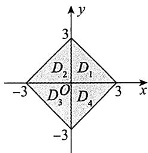

# 3.【答案】(B)

【解析】因为当 $x > 1$ 时， $\ln x <   x - 1$ ，所以在 $D$ 上，当 $x^{2} + y^{2}\neq 1$ 时， $\ln (x^2 +y^2) <   x^2 +y^2 -1$ ，从

而 $M = \iint_{D} \ln (x^{2} + y^{2}) \, \mathrm{d}x \, \mathrm{d}y < \iint_{D} (x^{2} + y^{2} - 1) \, \mathrm{d}x \, \mathrm{d}y = P.$

又因为在 $D$ 上， $1\leqslant x^{2} + y^{2}\leqslant 2$ ，所以在 $D$ 上，

$$
0 <   \ln (x ^ {2} + y ^ {2}) <   1 (x ^ {2} + y ^ {2} \neq 1), \ln (x ^ {2} + y ^ {2}) > \left[ \ln (x ^ {2} + y ^ {2}) \right] ^ {2} (x ^ {2} + y ^ {2} \neq 1),
$$

从而 $N = \iint_{D}\left[\ln (x^{2} + y^{2})\right]^{2}\mathrm{d}x\mathrm{d}y <   \iint_{D}\ln (x^{2} + y^{2})\mathrm{d}x\mathrm{d}y = M.$

于是， $N <   M <   P$ ：

4.【解析】由题意， $\overline{f} = \int_0^1 f(x)\mathrm{d}x = \frac{1}{2}$ ，又 $f(x) = 1 - a\int_{1}^{x}f(y)f(y - x)\mathrm{d}y$ ，两边关于 $x$ 作 $[0,1]$ 上的积分，有 $\int_0^1 f(x)\mathrm{d}x = 1 - a\int_0^1\mathrm{d}x\int_1^x f(y)f(y - x)\mathrm{d}y = 1 + a\int_0^1\mathrm{d}x\int_x^1 f(y)f(y - x)\mathrm{d}y$

$$
\begin{array}{l} = 1 + a \int_ {0} ^ {1} d y \int_ {0} ^ {y} f (y) f (y - x) d x = 1 + a \int_ {0} ^ {1} f (y) d y \int_ {0} ^ {y} f (y - x) d x. \\ \int_ {0} ^ {y} f (y - x) \mathrm {d} x \xlongequal {\text {令} y - x = t} \int_ {y} ^ {0} f (t) (- \mathrm {d} t) = \int_ {0} ^ {y} f (t) \mathrm {d} t, \\ \end{array}
$$

故 $\int_0^1 f(x)\mathrm{d}x = 1 + a\int_0^1 f(y)\mathrm{d}y\int_0^y f(t)\mathrm{d}t = 1 + a\int_0^1\left[\int_0^y f(t)\mathrm{d}t\right]\mathrm{d}\left[\int_0^y f(t)\mathrm{d}t\right]$

$$
= 1 + \frac {a}{2} \left[ \int_ {0} ^ {y} f (t) \mathrm {d} t \right] ^ {2} \Bigg | _ {y = 0} ^ {y = 1} = 1 + \frac {a}{2} \left[ \int_ {0} ^ {1} f (t) \mathrm {d} t \right] ^ {2},
$$

即 $\overline{f} = 1 + \frac{a}{2} (\overline{f})^2$ ，也即 $\frac{1}{2} = 1 + \frac{a}{8}$ 得 $a = -4$

# 5.【答案】(D)

【解析】 $I_{1} = \iint \limits_{\substack{0\leqslant x\leqslant 1\\ 0\leqslant y\leqslant 1}}(\sin x^{2} + \cos x^{2})  \mathrm{d}\sigma = \sqrt{2}\iint \limits_{\substack{0\leqslant x\leqslant 1\\ 0\leqslant y\leqslant 1}}\sin \left(x^{2} + \frac{\pi}{4}\right)  \mathrm{d}\sigma .$

由于 $0 \leqslant x^{2} \leqslant 1$ ，则 $\frac{\pi}{4} \leqslant x^{2} + \frac{\pi}{4} \leqslant \frac{\pi}{4} + 1$ ，故 $\frac{\sqrt{2}}{2} \leqslant \sin \left(x^{2} + \frac{\pi}{4}\right) \leqslant 1$ ，于是 $1 \leqslant I_{1} \leqslant \sqrt{2}$ .

令 $D = \left\{(x,y)\bigg|x^2 +y^2\leqslant \left(\frac{1}{2}\right)^2\right\}$ （见图），则

$$
\sqrt {x ^ {2} + y ^ {2}} \leqslant \frac {1}{2}, \sqrt {x ^ {2} + y ^ {2}} + \frac {1}{2} \leqslant 1, \ln \left(\sqrt {x ^ {2} + y ^ {2}} + \frac {1}{2}\right) \leqslant 0,
$$

故 $I_{2} \leqslant 2\iint_{|x| + |y| \leqslant \frac{1}{2}} \mathrm{d}\sigma = 2 \cdot \frac{1}{2} = 1$

综上， $I_{2}\leqslant 1\leqslant I_{1}$ ，选(D).

6.【答案】 $\frac{5}{16}\pi$

【解析】积分区域如图所示，故

$$
\begin{array}{l} \int_ {- 1} ^ {0} d x \int_ {\left(1 - x ^ {\frac {2}{3}}\right) ^ {\frac {3}{2}}} (1 - \sin x \cos y) d y + \int_ {0} ^ {1} d x \int_ {\left(1 - x ^ {\frac {2}{3}}\right) ^ {\frac {3}{2}}} (1 - \sin x \cos y) d y \\ = \int_ {- 1} ^ {1} d x \int_ {\left(1 - x ^ {\frac {2}{3}}\right) ^ {\frac {3}{2}}} ^ {(1 - x ^ {2}) ^ {\frac {1}{2}}} (1 - \sin x \cos y) d y = 2 \int_ {0} ^ {1} d x \int_ {\left(1 - x ^ {\frac {2}{3}}\right) ^ {\frac {3}{2}}} ^ {(1 - x ^ {2}) ^ {\frac {1}{2}}} d y \\ = 2 \int_ {0} ^ {1} \left[ (1 - x ^ {2}) ^ {\frac {1}{2}} - \left(1 - x ^ {\frac {2}{3}}\right) ^ {\frac {3}{2}} \right] d x \\ \end{array}
$$

$$
\begin{array}{l} = 2 \int_ {0} ^ {\frac {\pi}{2}} \cos^ {2} t d t - 2 \int_ {0} ^ {\frac {\pi}{2}} \cos^ {3} t \cdot 3 \sin^ {2} t \cdot \cos t d t \\ = 2 \int_ {0} ^ {\frac {\pi}{2}} \left[ \cos^ {2} t - 3 \cos^ {4} t \left(1 - \cos^ {2} t\right) \right] d t \\ = 2 \int_ {0} ^ {\frac {\pi}{2}} \left(\cos^ {2} t - 3 \cos^ {4} t + 3 \cos^ {6} t\right) d t \\ = 2 \cdot \frac {1}{2} \cdot \frac {\pi}{2} - 6 \cdot \frac {3}{4} \cdot \frac {1}{2} \cdot \frac {\pi}{2} + 6 \cdot \frac {5}{6} \cdot \frac {3}{4} \cdot \frac {1}{2} \cdot \frac {\pi}{2} \\ = \frac {\pi}{2} - \frac {9}{8} \pi + \frac {1 5}{1 6} \pi = \frac {5}{1 6} \pi . \\ \end{array}
$$

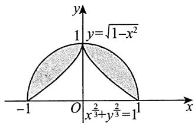

7.【解析】方法一 在极坐标系中，区域 $D$ 可表示为 $\left\{(r,\theta)\bigg|0\leqslant r\leqslant 1,0\leqslant \theta \leqslant \frac{\pi}{4}\right\}$ ，所以

$$
\begin{array}{l} \iint_ {D} \mathrm {e} ^ {(x + y) ^ {2}} (x ^ {2} - y ^ {2}) \mathrm {d} x \mathrm {d} y = \int_ {0} ^ {\frac {\pi}{4}} \mathrm {d} \theta \int_ {0} ^ {1} \mathrm {e} ^ {r ^ {2} (\sin \theta + \cos \theta) ^ {2}} r ^ {3} (\cos^ {2} \theta - \sin^ {2} \theta) \mathrm {d} r \\ = \int_ {0} ^ {1} d r \int_ {0} ^ {\frac {\pi}{4}} e ^ {r ^ {2} (\sin \theta + \cos \theta) ^ {2}} r ^ {3} (\cos^ {2} \theta - \sin^ {2} \theta) d \theta = \frac {1}{2} \int_ {0} ^ {1} r d r \int_ {0} ^ {\frac {\pi}{4}} e ^ {r ^ {2} (\sin \theta + \cos \theta) ^ {2}} d \left[ r ^ {2} (\sin \theta + \cos \theta) ^ {2} \right] \\ = \frac {1}{2} \int_ {0} ^ {1} r \left[ \mathrm {e} ^ {r ^ {2} (\sin \theta + \cos \theta) ^ {2}} \left| \begin{array}{c} \theta = \frac {\pi}{4} \\ \theta = 0 \end{array} \right. \right] \mathrm {d} r = \frac {1}{2} \int_ {0} ^ {1} r \left(\mathrm {e} ^ {2 r ^ {2}} - \mathrm {e} ^ {r ^ {2}}\right) \mathrm {d} r = \frac {(\mathrm {e} - 1) ^ {2}}{8}. \\ \end{array}
$$

方法二 令 $\left\{ \begin{array}{l} u = x - y, \\ v = x + y, \end{array} \right.$ $D_{uv} = \{(u,v)\mid u^2 +v^2\leqslant 2,v\geqslant u\geqslant 0\}$ .

因为 $\left\{ \begin{array}{l}x = \frac{u + v}{2}\\ y = \frac{v - u}{2} \end{array} \right.$ ， $(u,v)\in D_{uv}$ ， $\left\| \begin{array}{ll}\frac{\partial x}{\partial u} & \frac{\partial x}{\partial v}\\ \frac{\partial y}{\partial u} & \frac{\partial y}{\partial v} \end{array} \right\| = \frac{1}{2}$ 所以

$$
\begin{array}{l} \iint_ {D} \mathrm {e} ^ {(x + y) ^ {2}} \left(x ^ {2} - y ^ {2}\right) \mathrm {d} x \mathrm {d} y = \iint_ {D _ {u v}} \frac {1}{2} \mathrm {e} ^ {v ^ {2}} u v \mathrm {d} u \mathrm {d} v = \frac {1}{2} \int_ {0} ^ {1} u \mathrm {d} u \int_ {u} ^ {\sqrt {2 - u ^ {2}}} \mathrm {e} ^ {v ^ {2}} v \mathrm {d} v \\ = \frac {1}{4} \int_ {0} ^ {1} \left(\mathrm {e} ^ {2 - u ^ {2}} - \mathrm {e} ^ {u ^ {2}}\right) u \mathrm {d} u = \frac {\left(\mathrm {e} - 1\right) ^ {2}}{8}. \\ \end{array}
$$

8.【答案】0

【解析】令 $\left\{ \begin{array}{l}x = \frac{1}{2} r\cos \theta ,\\ y = r\sin \theta , \end{array} \right.$ 则

$$
I = \int_ {0} ^ {\frac {\pi}{2}} \mathrm {d} \theta \int_ {0} ^ {1} (1 - r ^ {2} - 2 r ^ {2} \cos^ {2} \theta) \frac {r}{2} \mathrm {d} r
$$

$$
= \frac {1}{2} \int_ {0} ^ {\frac {\pi}{2}} \mathrm {d} \theta \int_ {0} ^ {1} (1 - r ^ {2}) r \mathrm {d} r - \int_ {0} ^ {\frac {\pi}{2}} \cos^ {2} \theta \mathrm {d} \theta \int_ {0} ^ {1} r ^ {3} \mathrm {d} r = \frac {\pi}{1 6} - \frac {\pi}{1 6} = 0.
$$

9.【解析】先画出积分区域 $D$ ，如图所示，

方法一 用直角坐标.

$$
I = \int_ {1} ^ {2} d x \int_ {\frac {1}{\sqrt {3}} x} ^ {\sqrt {3} x} y e ^ {\frac {y}{x}} d y,
$$

对内层积分作积分变量代换，令 $u = \frac{y}{x}$ （视 $x$ 为常量)，当 $y = \frac{1}{\sqrt{3}} x$ 时， $u = \frac{1}{\sqrt{3}}$ ；当 $y = \sqrt{3} x$ 时， $u = \sqrt{3}$ ，得

$$
\begin{array}{l} I = \int_ {1} ^ {2} d x \int_ {\frac {1}{\sqrt {3}}} ^ {\sqrt {3}} x ^ {2} u e ^ {u} d u = \int_ {1} ^ {2} x ^ {2} d x \int_ {\frac {1}{\sqrt {3}}} ^ {\sqrt {3}} u e ^ {u} d u \\ = \frac {7}{3} \left(u e ^ {u} - e ^ {u}\right) \left| \begin{array}{l} \sqrt {3} \\ \frac {1}{\sqrt {3}} \end{array} = \frac {7}{3} \left(\sqrt {3} e ^ {\sqrt {3}} - e ^ {\sqrt {3}} - \frac {1}{\sqrt {3}} e ^ {\frac {1}{\sqrt {3}}} + e ^ {\frac {1}{\sqrt {3}}}\right) \right. \\ = \frac {7}{3} (\sqrt {3} - 1) \left(e ^ {\sqrt {3}} + \frac {1}{\sqrt {3}} e ^ {\frac {1}{\sqrt {3}}}\right). \\ \end{array}
$$

方法二 用极坐标. 先将 $D$ 化成极坐标形式, 为 $D = \left\{(r, \theta) \mid \frac{1}{\cos \theta} \leqslant r \leqslant \frac{2}{\cos \theta}, \frac{\pi}{6} \leqslant \theta \leqslant \frac{\pi}{3}\right\}$ , 所以

$$
I = \int_ {\frac {\pi}{6}} ^ {\frac {\pi}{3}} d \theta \int_ {\frac {1}{\cos \theta}} ^ {\frac {2}{\cos \theta}} r \sin \theta \cdot e ^ {\tan \theta} r d r = \frac {1}{3} \int_ {\frac {\pi}{6}} ^ {\frac {\pi}{3}} \frac {\sin \theta}{\cos^ {3} \theta} \cdot (8 - 1) \cdot e ^ {\tan \theta} d \theta .
$$

令 $u = \tan \theta$ ，得

$$
\begin{array}{l} I = \frac {7}{3} \int_ {\frac {1}{\sqrt {3}}} ^ {\sqrt {3}} u e ^ {u} d u = \frac {7}{3} \left(u e ^ {u} - e ^ {u}\right) \left| \begin{array}{l} \sqrt {3} \\ \frac {1}{\sqrt {3}} \end{array} \right. = \frac {7}{3} \left(\sqrt {3} e ^ {\sqrt {3}} - e ^ {\sqrt {3}} - \frac {1}{\sqrt {3}} e ^ {\frac {1}{\sqrt {3}}} + e ^ {\frac {1}{\sqrt {3}}}\right) \\ = \frac {7}{3} (\sqrt {3} - 1) \left(e ^ {\sqrt {3}} + \frac {1}{\sqrt {3}} e ^ {\frac {1}{\sqrt {3}}}\right). \\ \end{array}
$$

10.【答案】ln cos 1

【解析】 $\int_0^1\mathrm{d}x\int_1^x\frac{\tan y}{y}\mathrm{d}y = -\int_0^1\frac{\tan y}{y}\mathrm{d}y\int_0^y\mathrm{d}x$

$$
= - \int_ {0} ^ {1} \frac {\tan y}{y} \cdot y d y = - \int_ {0} ^ {1} \frac {\sin y}{\cos y} d y = \ln \cos 1.
$$

11.【答案】 $\frac{5}{4}\pi$

【解析】 $\iint_{D} (x - 2y)^{2} \, \mathrm{d}x \, \mathrm{d}y = \iint_{D} (x^{2} + 4y^{2} - 4xy) \, \mathrm{d}x \, \mathrm{d}y.$

由于在区域 $D$ 上， $4xy$ 为 $x$ 的奇函数，区域 $D$ 关于 $y$ 轴对称，因此 $\iint_{D} (-4xy) \, \mathrm{d}x \, \mathrm{d}y = 0$ 。所以

$$
\iint_ {D} (x - 2 y) ^ {2} \mathrm {d} x \mathrm {d} y = \iint_ {D} (x ^ {2} + 4 y ^ {2}) \mathrm {d} x \mathrm {d} y.
$$

由于区域 $D$ 中交换 $x$ 与 $y$ 的位置 $D$ 不变，因此 $I = \iint_{D} (x^2 + 4y^2) \, \mathrm{d}x \, \mathrm{d}y = \iint_{D} (y^2 + 4x^2) \, \mathrm{d}x \, \mathrm{d}y$ ，即

$$
\begin{array}{l} 2 I = \iint_ {D} \left[ \left(x ^ {2} + 4 y ^ {2}\right) + \left(y ^ {2} + 4 x ^ {2}\right) \right] d x d y \\ = 5 \iint_ {D} \left(x ^ {2} + y ^ {2}\right) \mathrm {d} x \mathrm {d} y = 5 \int_ {0} ^ {2 \pi} \mathrm {d} \theta \int_ {0} ^ {1} r ^ {2} \cdot r \mathrm {d} r = \frac {5}{4} \cdot 2 \pi = \frac {5}{2} \pi . \\ \end{array}
$$

故 $I = \frac{5}{4}\pi$

【注】本题也可以不用如上技巧，而直接用极坐标求解.先用极坐标，再用华里士公式，有

$$
\begin{array}{l} \iint_ {D} (x - 2 y) ^ {2} \mathrm {d} x \mathrm {d} y = \int_ {0} ^ {2 \pi} \mathrm {d} \theta \int_ {0} ^ {1} (r \cos \theta - 2 r \sin \theta) ^ {2} r \mathrm {d} r \\ = \int_ {0} ^ {2 \pi} (\cos^ {2} \theta - 4 \cos \theta \sin \theta + 4 \sin^ {2} \theta) d \theta \int_ {0} ^ {1} r ^ {3} d r \\ = \frac {1}{4} \int_ {0} ^ {2 \pi} \left(\cos^ {2} \theta - 4 \cos \theta \sin \theta + 4 \sin^ {2} \theta\right) d \theta \\ = \frac {1}{4} \left(4 \cdot \frac {1}{2} \cdot \frac {\pi}{2} - \frac {4}{2} \cdot 0 + 4 \cdot 4 \cdot \frac {1}{2} \cdot \frac {\pi}{2}\right) \\ = \frac {5}{4} \pi . \\ \end{array}
$$

12.【解析】 $I = \iint_{D}\left[(x - 1)^{2} + (2y + 3)^{2}\right]\mathrm{d}x\mathrm{d}y$

$$
= \iint_ {D} \left(x ^ {2} + 4 y ^ {2}\right) d x d y + \iint_ {D} (- 2 x + 1 2 y) d x d y + 1 0 \iint_ {D} d x d y,
$$

其中 $I_{2} = \iint_{D} (-2x + 12y) \, \mathrm{d}x \, \mathrm{d}y = 0$ (奇函数在对称区域上的积分性质),

$I_{3} = 10\iint \limits_{D}\mathrm{d}x\mathrm{d}y = 10ab\pi$ （椭圆的面积公式）

$$
I _ {1} = \iint_ {D} (x ^ {2} + 4 y ^ {2}) \mathrm {d} x \mathrm {d} y = \iint_ {D} x ^ {2} \mathrm {d} x \mathrm {d} y + 4 \iint_ {D} y ^ {2} \mathrm {d} x \mathrm {d} y,
$$

$$
\begin{array}{l} \iint_ {D} x ^ {2} \mathrm {d} x \mathrm {d} y = 4 \int_ {0} ^ {a} \mathrm {d} x \int_ {0} ^ {\frac {b}{a} - \sqrt {a ^ {2} - x ^ {2}}} x ^ {2} \mathrm {d} y \\ = \frac {4 b}{a} \int_ {0} ^ {a} x ^ {2} \sqrt {a ^ {2} - x ^ {2}} \mathrm {d} x \xlongequal {\text {令} x = a \sin t} 4 a ^ {3} b \int_ {0} ^ {\frac {\pi}{2}} \sin^ {2} t \cos^ {2} t \mathrm {d} t \\ = 4 a ^ {3} b \left(\int_ {0} ^ {\frac {\pi}{2}} \sin^ {2} t \mathrm {d} t - \int_ {0} ^ {\frac {\pi}{2}} \sin^ {4} t \mathrm {d} t\right) \\ = 4 a ^ {3} b \left(\frac {1}{2} \cdot \frac {\pi}{2} - \frac {3}{4} \cdot \frac {1}{2} \cdot \frac {\pi}{2}\right) = \frac {\pi}{4} a ^ {3} b. \\ \end{array}
$$

同理， $4\iint_{D}y^{2}\mathrm{d}x\mathrm{d}y = \pi ab^{3}$ ，则 $I_{1} = \frac{\pi}{4} a^{3}b + \pi ab^{3}$ ，所以 $I = 10\pi ab + \frac{\pi}{4} a^3 b + \pi ab^3$

13.【解析】设 $D_{1}$ 是 $D$ 在第一象限的部分，如图所示，则由对称性，得

$$
\begin{array}{l} \iint_ {D} \frac {x ^ {2} + y ^ {2}}{| x | + | y |} d x d y = 4 \iint_ {D _ {1}} \frac {x ^ {2} + y ^ {2}}{x + y} d x d y = 4 \iint_ {D _ {1}} \frac {r ^ {2}}{\cos \theta + \sin \theta} d r d \theta \\ = 4 \int_ {0} ^ {\frac {\pi}{2}} d \theta \int_ {\frac {1}{\cos \theta + \sin \theta}} ^ {\frac {2}{\cos \theta + \sin \theta}} \frac {r ^ {2}}{\cos \theta + \sin \theta} d r \\ = \frac {2 8}{3} \int_ {0} ^ {\frac {\pi}{2}} \frac {1}{(\cos \theta + \sin \theta) ^ {4}} d \theta \\ = \frac {7}{3} \int_ {0} ^ {\frac {\pi}{2}} \frac {1}{\sin^ {4} \left(\theta + \frac {\pi}{4}\right)} d \theta \\ = \frac {7}{3} \int_ {0} ^ {\frac {\pi}{2}} \csc^ {4} \left(\theta + \frac {\pi}{4}\right) d \theta \\ = - \frac {7}{3} \int_ {0} ^ {\frac {\pi}{2}} \left[ \cot^ {2} \left(\theta + \frac {\pi}{4}\right) + 1 \right] d \left[ \cot \left(\theta + \frac {\pi}{4}\right) \right] \\ = - \frac {7}{3} \left[ \frac {1}{3} \cot^ {3} \left(\theta + \frac {\pi}{4}\right) + \cot \left(\theta + \frac {\pi}{4}\right) \right] \Bigg | _ {0} ^ {\frac {\pi}{2}} = \frac {5 6}{9}. \\ \end{array}
$$

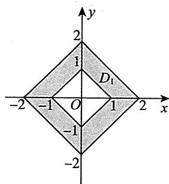

14.【答案】 $\frac{1}{2}$

【解析】交换积分次序，得 $\int_{-1}^{1}\mathrm{d}y\int_{-1}^{y}y\sqrt{1 + x^2 - y^2}\mathrm{d}x = \int_{-1}^{1}\mathrm{d}x\int_{x}^{1}y\sqrt{1 + x^2 - y^2}\mathrm{d}y.$

又因为 $\int_{x}^{1}y\sqrt{1 + x^2 - y^2}\mathrm{d}y = -\frac{1}{3} (1 + x^2 -y^2)^{\frac{3}{2}}\bigg|_x^1 = \frac{1}{3} (1 - |x|^3)$ ，所以

$$
\begin{array}{l} \text {原 式} = \int_ {- 1} ^ {1} \mathrm {d} x \int_ {x} ^ {1} y \sqrt {1 + x ^ {2} - y ^ {2}} \mathrm {d} y = \frac {1}{3} \int_ {- 1} ^ {1} (1 - | x | ^ {3}) \mathrm {d} x \\ = \frac {2}{3} \int_ {0} ^ {1} (1 - x ^ {3}) d x = \frac {2}{3} \times \frac {3}{4} = \frac {1}{2}. \\ \end{array}
$$

15.【答案】 $\frac{22}{15}$

【解析】积分区域如图所示，则

$$
\begin{array}{l} \int_ {- 1} ^ {1} \mathrm {d} x \int_ {x ^ {2}} ^ {\sqrt {2 - x ^ {2}}} (x + 1) y \mathrm {d} y \xlongequal {\text {对 称 性}} \int_ {- 1} ^ {1} \mathrm {d} x \int_ {x ^ {2}} ^ {\sqrt {2 - x ^ {2}}} y \mathrm {d} y \\ = 2 \int_ {0} ^ {1} d x \int_ {x ^ {2}} ^ {\sqrt {2 - x ^ {2}}} y d y = \int_ {0} ^ {1} \left(y ^ {2} \left| _ {x ^ {2}} ^ {\sqrt {2 - x ^ {2}}} \right.\right) d x \\ = \int_ {0} ^ {1} (2 - x ^ {2} - x ^ {4}) \mathrm {d} x = \left. \left(2 x - \frac {1}{3} x ^ {3} - \frac {1}{5} x ^ {5}\right) \right| _ {0} ^ {1} = \frac {2 2}{1 5}. \\ \end{array}
$$

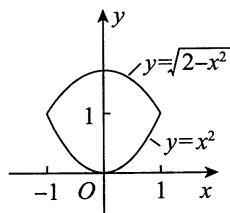

16.【解析】积分区域 $D$ 关于 $x$ 轴对称，记 $D_{1}$ 为 $D$ 在 $x$ 轴上方的部分，用直线 $y = x$ 将 $D_{1}$ 分割为 $D_{11}$ 与 $D_{12}$ 两部分，如图所示，则

$$
\begin{array}{l} \iint_ {D} | x - | y | | \mathrm {d} \sigma = 2 \iint_ {D _ {1}} | x - y | \mathrm {d} \sigma \\ = 2 \iint_ {D _ {1 1}} (x - y) d \sigma - 2 \iint_ {D _ {1 2}} (x - y) d \sigma \\ = 2 \int_ {0} ^ {1} d x \int_ {0} ^ {x} (x - y) d y - 2 \int_ {\frac {\pi}{4}} ^ {\frac {\pi}{2}} d \theta \int_ {0} ^ {2 \cos \theta} r ^ {2} (\cos \theta - \sin \theta) d r \\ = \int_ {0} ^ {1} x ^ {2} d x - \frac {1 6}{3} \int_ {\frac {\pi}{4}} ^ {\frac {\pi}{2}} \cos^ {3} \theta (\cos \theta - \sin \theta) d \theta \\ = \frac {1}{3} - \frac {4}{3} \int_ {\frac {\pi}{4}} ^ {\frac {\pi}{2}} \left(\frac {3}{2} + 2 \cos 2 \theta + \frac {1}{2} \cos 4 \theta\right) d \theta - \frac {1 6}{3} \int_ {\frac {\pi}{4}} ^ {\frac {\pi}{2}} \cos^ {3} \theta d (\cos \theta) \\ \end{array}
$$

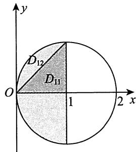

$$
\begin{array}{l} = \frac {1}{3} - \frac {4}{3} \left(\frac {3}{2} \theta + \sin 2 \theta + \frac {1}{8} \sin 4 \theta\right) \left| \begin{array}{l} \frac {\pi}{2} \\ \frac {\pi}{4} \end{array} - \frac {4}{3} \cos^ {4} \theta \right| \frac {\pi}{4} \\ = \frac {1}{3} - \frac {4}{3} \left(\frac {3 \pi}{8} - 1\right) + \frac {1}{3} = 2 - \frac {\pi}{2}. \\ \end{array}
$$

17.【解析】用曲线 $\left(x - \frac{1}{\sqrt{2}}\right)^2 + \left(y - \frac{1}{\sqrt{2}}\right)^2 = 1$ 将 $D$ 划分为 $D_{1}, D_{2}$ 两部分, 如图所示, 则有

$$
\begin{array}{l} \iint_ {D} \left| x ^ {2} + y ^ {2} - \sqrt {2} (x + y) \right| d x d y \\ = - \iint_ {D _ {1}} \left[ x ^ {2} + y ^ {2} - \sqrt {2} (x + y) \right] d x d y + \iint_ {D _ {2}} \left[ x ^ {2} + y ^ {2} - \sqrt {2} (x + y) \right] d x d y \\ = - \iint_ {D _ {1}} \left[ x ^ {2} + y ^ {2} - \sqrt {2} (x + y) \right] d x d y + \iint_ {D - D _ {1}} \left[ x ^ {2} + y ^ {2} - \sqrt {2} (x + y) \right] d x d y \\ = - 2 \iint_ {D _ {1}} \left[ x ^ {2} + y ^ {2} - \sqrt {2} (x + y) \right] d x d y + \iint_ {D} \left[ x ^ {2} + y ^ {2} - \sqrt {2} (x + y) \right] d x d y \\ = - 4 \int_ {- \frac {\pi}{4}} ^ {\frac {\pi}{4}} d \theta \int_ {0} ^ {\sqrt {2} (\cos \theta + \sin \theta)} \left[ r ^ {3} - \sqrt {2} r ^ {2} (\cos \theta + \sin \theta) \right] d r + \iint_ {D} (x ^ {2} + y ^ {2}) d x d y \\ = \frac {4}{3} \int_ {- \frac {\pi}{4}} ^ {\frac {\pi}{4}} (\cos \theta + \sin \theta) ^ {4} d \theta + \int_ {0} ^ {2 \pi} d \theta \int_ {0} ^ {2} r ^ {3} d r = \frac {1 6}{3} \int_ {- \frac {\pi}{4}} ^ {\frac {\pi}{4}} \sin^ {4} \left(\theta + \frac {\pi}{4}\right) d \theta + 8 \pi \\ \xlongequal {\theta + \frac {\pi}{4} = t} \frac {1 6}{3} \int_ {0} ^ {\frac {\pi}{2}} \sin^ {4} t d t + 8 \pi = \frac {1 6}{3} \cdot \frac {3}{4} \cdot \frac {1}{2} \cdot \frac {\pi}{2} + 8 \pi = 9 \pi . \\ \end{array}
$$

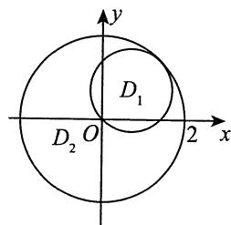

18.【解析】作出区域 $D$ ，如图所示.在 $D$ 中作曲线 $y = \frac{1}{x}$ 及直线 $x = \frac{1}{2}$ ，将 $D$ 划分成 $D_{1}$ ， $D_{2}$ 及 $D_{3}$ 三部分(见图)，则

$$
\left| x y - 1 \right| = \left\{ \begin{array}{l l} 1 - x y, & (x, y) \in D _ {1}, \\ 1 - x y, & (x, y) \in D _ {2}, \\ x y - 1, & (x, y) \in D _ {3}, \end{array} \right.
$$

$$
\begin{array}{l} \iint_ {D} | x y - 1 | \mathrm {d} \sigma = \iint_ {D _ {1}} (1 - x y) \mathrm {d} \sigma + \iint_ {D _ {2}} (1 - x y) \mathrm {d} \sigma + \iint_ {D _ {3}} (x y - 1) \mathrm {d} \sigma \\ = \int_ {0} ^ {\frac {1}{2}} d x \int_ {0} ^ {2} (1 - x y) d y + \int_ {\frac {1}{2}} ^ {2} d x \int_ {0} ^ {\frac {1}{x}} (1 - x y) d y + \int_ {\frac {1}{2}} ^ {2} d x \int_ {\frac {1}{x}} ^ {2} (x y - 1) d y \\ = \int_ {0} ^ {\frac {1}{2}} (2 - 2 x) d x + \int_ {\frac {1}{2}} ^ {2} \frac {1}{2 x} d x + \int_ {\frac {1}{2}} ^ {2} \left(2 x - 2 + \frac {1}{2 x}\right) d x = \frac {3}{2} + 2 \ln 2. \\ \end{array}
$$

19.【解析】积分区域 $D$ 如图所示，

$$
\begin{array}{l} \iint_ {D} \left(x ^ {2} + y ^ {2}\right) \mathrm {d} \sigma = \int_ {\frac {\pi}{4}} ^ {\frac {\pi}{2}} \mathrm {d} \theta \int_ {2 \cos \theta} ^ {4 \cos \theta} r ^ {3} \mathrm {d} r = \int_ {\frac {\pi}{4}} ^ {\frac {\pi}{2}} \left(\left. \frac {1}{4} r ^ {4} \right| _ {2 \cos \theta} ^ {4 \cos \theta}\right) \mathrm {d} \theta \\ = 6 0 \int_ {\frac {\pi}{4}} ^ {\frac {\pi}{2}} \cos^ {4} \theta d \theta = 6 0 \int_ {\frac {\pi}{4}} ^ {\frac {\pi}{2}} \frac {(1 + \cos 2 \theta) ^ {2}}{4} d \theta \\ = 1 5 \int_ {\frac {\pi}{4}} ^ {\frac {\pi}{2}} (1 + 2 \cos 2 \theta + \cos^ {2} 2 \theta) d \theta \\ = 1 5 \left(\frac {1}{4} \pi + \sin 2 \theta \left| \frac {\frac {\pi}{2}}{\frac {\pi}{4}} + \int_ {\frac {\pi}{4}} ^ {\frac {\pi}{2}} \frac {1 + \cos 4 \theta}{2} d \theta\right) \right. \\ = 1 5 \left(\frac {1}{4} \pi - 1 + \frac {1}{2} \cdot \frac {\pi}{4} + \frac {1}{8} \sin 4 \theta \left| \begin{array}{l} \frac {\pi}{2} \\ \frac {\pi}{4} \end{array} \right.\right) \\ = 1 5 \left(\frac {1}{4} \pi - 1 + \frac {\pi}{8}\right) = 1 5 \left(\frac {3}{8} \pi - 1\right). \\ \end{array}
$$

20.【答案】 $2\pi - \frac{16}{9}$

【解析】画出积分区域(见图)，用极坐标.

原式 $= \iint_{D_1 \cup D_2} r^2 \, \mathrm{d}r \, \mathrm{d}\theta = \iint_{D_1} r^2 \, \mathrm{d}r \, \mathrm{d}\theta + \iint_{D_2} r^2 \, \mathrm{d}r \, \mathrm{d}\theta$

$$
= \int_ {0} ^ {\frac {\pi}{2}} d \theta \int_ {2 \cos \theta} ^ {2} r ^ {2} d r + \int_ {\frac {\pi}{2}} ^ {\frac {3 \pi}{4}} d \theta \int_ {0} ^ {2} r ^ {2} d r = 2 \pi - \frac {1 6}{9}.
$$

21.【解析】 $D$ 是一正方形区域，如图所示

$$
\begin{array}{l} \iint_ {D} \sin \left(\max  \left\{x ^ {2}, y ^ {2} \right\}\right) d \sigma = \iint_ {D _ {1}} \sin x ^ {2} d \sigma + \iint_ {D _ {2}} \sin y ^ {2} d \sigma \\ = 2 \iint_ {D _ {1}} \sin x ^ {2} d \sigma = 2 \int_ {0} ^ {\sqrt {\pi}} d x \int_ {0} ^ {x} \sin x ^ {2} d y \\ = 2 \int_ {0} ^ {\sqrt {\pi}} x \sin x ^ {2} d x = \int_ {0} ^ {\sqrt {\pi}} \sin x ^ {2} d \left(x ^ {2}\right) \\ = - \cos x ^ {2} \left| _ {0} ^ {\sqrt {\pi}} \right. = - (- 1 - 1) = 2. \\ \end{array}
$$

22.【答案】 $\frac{\pi}{20}$

【解析】交换积分次序，得

$$
\begin{array}{l} \int_ {0} ^ {1} \mathrm {d} y \int_ {\sqrt {y}} ^ {1} \sqrt {x ^ {4} - y ^ {2}} \mathrm {d} x = \int_ {0} ^ {1} \mathrm {d} x \int_ {0} ^ {x ^ {2}} \sqrt {x ^ {4} - y ^ {2}} \mathrm {d} y \\ = \int_ {0} ^ {1} d x \int_ {0} ^ {x ^ {2}} \sqrt {\left(x ^ {2}\right) ^ {2} - y ^ {2}} d y = \int_ {0} ^ {1} \frac {\pi}{4} x ^ {4} d x = \frac {\pi}{2 0}. \\ \end{array}
$$

【注】 $\int_0^a\sqrt{a^2 - y^2}\mathrm{d}y(a > 0)$ 是以 $a$ 为半径的圆在第一象限部分的面积，利用定积分的几何意义计算定积分是一种“技巧”

23.【答案】 $\frac{1}{6} -\frac{1}{3e}$

【解析】交换积分次序，得

$$
\begin{array}{l} \int_ {0} ^ {1} x ^ {2} d x \int_ {x} ^ {1} e ^ {- y ^ {2}} d y = \int_ {0} ^ {1} e ^ {- y ^ {2}} d y \int_ {0} ^ {y} x ^ {2} d x \\ = \int_ {0} ^ {1} e ^ {- y ^ {2}} \cdot \frac {y ^ {3}}{3} d y = \frac {1}{3} \int_ {0} ^ {1} y ^ {3} \cdot e ^ {- y ^ {2}} d y \\ = \frac {1}{3} \cdot \left(- \frac {1}{2}\right) \int_ {0} ^ {1} y ^ {2} d \left(e ^ {- y ^ {2}}\right) \stackrel {y ^ {2} = t} {=} - \frac {1}{6} \int_ {0} ^ {1} t d \left(e ^ {- t}\right) \\ = - \frac {1}{6} \left(t e ^ {- t} + e ^ {- t}\right) \Bigg | _ {0} ^ {1} = \frac {1}{6} - \frac {1}{3 e}. \\ \end{array}
$$

24.【解析】积分区域 $D$ 如图所示，由极坐标表示：

$x^{2} + y^{2} = 4, y \geqslant 0$ 化为 $r = 2, 0 \leqslant \theta \leqslant \pi$ ;

$(x - 1)^2 + y^2 = 1, y \geqslant 0$ 化为 $r = 2\cos \theta, 0 \leqslant \theta \leqslant \frac{\pi}{2}$ .

$$
\begin{array}{l} \iint_ {D} (x y + y ^ {2}) \mathrm {d} \sigma = \int_ {0} ^ {\frac {\pi}{2}} \mathrm {d} \theta \int_ {2 \cos \theta} ^ {2} (r ^ {2} \sin \theta \cos \theta + r ^ {2} \sin^ {2} \theta) r \mathrm {d} r + \int_ {\frac {\pi}{2}} ^ {\pi} \mathrm {d} \theta \int_ {0} ^ {2} (r ^ {2} \sin \theta \cos \theta + r ^ {2} \sin^ {2} \theta) r \mathrm {d} r \\ = \int_ {0} ^ {\frac {\pi}{2}} 4 (1 - \cos^ {4} \theta) (\sin \theta \cos \theta + \sin^ {2} \theta) d \theta + \int_ {\frac {\pi}{2}} ^ {\pi} 4 (\sin \theta \cos \theta + \sin^ {2} \theta) d \theta \\ = 4 \int_ {0} ^ {\pi} (\sin \theta \cos \theta + \sin^ {2} \theta) d \theta - 4 \int_ {0} ^ {\frac {\pi}{2}} \cos^ {5} \theta \sin \theta d \theta - 4 \int_ {0} ^ {\frac {\pi}{2}} \cos^ {4} \theta \sin^ {2} \theta d \theta \\ = 0 + 8 \int_ {0} ^ {\frac {\pi}{2}} \sin^ {2} \theta d \theta + 4 \int_ {0} ^ {\frac {\pi}{2}} \cos^ {5} \theta d (\cos \theta) - 4 \int_ {0} ^ {\frac {\pi}{2}} \cos^ {4} \theta d \theta + 4 \int_ {0} ^ {\frac {\pi}{2}} \cos^ {6} \theta d \theta \\ = 8 \cdot \frac {1}{2} \cdot \frac {\pi}{2} + \frac {2}{3} \left(\cos^ {6} \frac {\pi}{2} - 1\right) - 4 \cdot \frac {3}{4} \cdot \frac {1}{2} \cdot \frac {\pi}{2} + 4 \cdot \frac {5}{6} \cdot \frac {3}{4} \cdot \frac {1}{2} \cdot \frac {\pi}{2} \\ \end{array}
$$

$$
= \frac {1 5}{8} \pi - \frac {2}{3}.
$$

【注】计算 $\int_{0}^{\frac{\pi}{2}}\sin^{n}x\mathrm{d}x$ 与 $\int_0^{\frac{\pi}{2}}\cos^n x\mathrm{d}x$ 用到华里士公式, 请考生切记此公式.

25.【答案】 $\frac{5\pi}{2}$

【解析】方法一 令 $x = 1 + r\cos \theta, y = 1 + r\sin \theta$ ，则

$$
\begin{array}{l} \iint_ {D} \left(x ^ {2} + y ^ {2}\right) \mathrm {d} \sigma = \int_ {0} ^ {2 \pi} \mathrm {d} \theta \int_ {0} ^ {1} \left(r ^ {2} + 2 r \cos \theta + 2 r \sin \theta + 2\right) r \mathrm {d} r \\ = \int_ {0} ^ {2 \pi} d \theta \int_ {0} ^ {1} \left(r ^ {3} + 2 r ^ {2} \cos \theta + 2 r ^ {2} \sin \theta + 2 r\right) d r \\ = \int_ {0} ^ {2 \pi} \left(\frac {5}{4} + \frac {2}{3} \cos \theta + \frac {2}{3} \sin \theta\right) d \theta \\ = \left. \left(\frac {5}{4} \theta + \frac {2}{3} \sin \theta - \frac {2}{3} \cos \theta\right) \right| _ {0} ^ {2 \pi} = \frac {5 \pi}{2}. \\ \end{array}
$$

方法二 作变换 $x = u + 1, y = v + 1$ ，在此变换下，与 $D$ 对应的闭区域为 $D' = \{(u, v) | u^2 + v^2 \leqslant 1\}$ ，则有 $J(u, v) = \frac{\partial(x, y)}{\partial(u, v)} = 1$ ，从而有

$$
\begin{array}{l} \iint_ {D} \left(x ^ {2} + y ^ {2}\right) \mathrm {d} \sigma = \iint_ {D ^ {\prime}} \left[ (u + 1) ^ {2} + (v + 1) ^ {2} \right] | J (u, v) | \mathrm {d} \sigma \\ = \iint_ {D ^ {\prime}} (u ^ {2} + v ^ {2} + 2) \mathrm {d} \sigma \\ = \iint_ {D ^ {\prime}} \left(u ^ {2} + v ^ {2}\right) \mathrm {d} \sigma + \iint_ {D ^ {\prime}} 2 \mathrm {d} \sigma \\ = \int_ {0} ^ {2 \pi} d \theta \int_ {0} ^ {1} r ^ {3} d r + 2 \pi = \frac {5 \pi}{2}. \\ \end{array}
$$

26.【解析】将 $D$ 分成第一、二、三、四象限中的4块，分别记为 $D_{1}, D_{2}, D_{3}, D_{4}$ (见图)，用极坐标，先对 $D_{1}$ 进行积分：

$$
\begin{array}{l} \iint_ {D _ {1}} \mathrm {e} ^ {\frac {| y |}{| x | + | y |}} \mathrm {d} \sigma = \int_ {0} ^ {\frac {\pi}{2}} \mathrm {d} \theta \int_ {0} ^ {\frac {1}{\sin \theta + \cos \theta}} \mathrm {e} ^ {\frac {\sin \theta}{\sin \theta + \cos \theta}} r \mathrm {d} r \\ = \frac {1}{2} \int_ {0} ^ {\frac {\pi}{2}} e ^ {\frac {\sin \theta}{\sin \theta + \cos \theta}} \cdot \frac {1}{(\sin \theta + \cos \theta) ^ {2}} d \theta \\ \end{array}
$$

$$
\begin{array}{l} = \frac {1}{2} \int_ {0} ^ {\frac {\pi}{2}} e ^ {\frac {\sin \theta}{\sin \theta + \cos \theta}} d \left(\frac {\sin \theta}{\sin \theta + \cos \theta}\right) \\ = \frac {1}{2} e ^ {\frac {\sin \theta}{\sin \theta + \cos \theta}} \left| _ {0} ^ {\frac {\pi}{2}} = \frac {1}{2} (e - 1) \right.. \\ \end{array}
$$

根据对称性, 被积函数关于 $x, y$ 均为偶函数, 且积分区域关于 $y$ 轴, $x$ 轴对称, 故

$$
\iint_ {D} \mathrm {e} ^ {\frac {| y |}{| x | + | y |}} \mathrm {d} \sigma = 4 \iint_ {D _ {1}} \mathrm {e} ^ {\frac {| y |}{| x | + | y |}} \mathrm {d} \sigma = 4 \cdot \frac {1}{2} (\mathrm {e} - 1) = 2 (\mathrm {e} - 1).
$$

# 27.【答案】(D)

【解析】积分区域如图所示.

$$
\begin{array}{l} \int_ {0} ^ {+ \infty} d y \int_ {y} ^ {2 y} e ^ {- x ^ {2}} d x = \int_ {0} ^ {+ \infty} d x \int_ {\frac {x}{2}} ^ {x} e ^ {- x ^ {2}} d y = \int_ {0} ^ {+ \infty} \frac {x}{2} e ^ {- x ^ {2}} d x \\ = - \frac {1}{4} \int_ {0} ^ {+ \infty} e ^ {- x ^ {2}} d (- x ^ {2}) = - \frac {1}{4} \cdot e ^ {- x ^ {2}} \Bigg | _ {0} ^ {+ \infty} = \frac {1}{4}. \\ \end{array}
$$

28.【答案】 $-\pi \left(\mathrm{e}^{\pi} - \mathrm{e}^{\frac{1}{\pi}}\right)$

【解析】当 $t > 1$ 时，设区域 $D = \left\{(x,y) \mid 1 \leqslant x \leqslant t^2, \sqrt{x} \leqslant y \leqslant t\right\}$ ，从而

$$
f (t) = - \int_ {1} ^ {t ^ {2}} d x \int_ {\sqrt {x}} ^ {t} e ^ {\frac {x}{y}} d y = - \iint_ {D} e ^ {\frac {x}{y}} d x d y,
$$

将二重积分写为先对 $x$ ，后对 $y$ 的累次积分，有 $f(t) = -\int_{1}^{t}\mathrm{d}y\int_{1}^{y^2}\mathrm{e}^{\frac{x}{y}}\mathrm{d}x = -\int_{1}^{t}y\left(\mathrm{e}^{y} - \mathrm{e}^{\frac{1}{y}}\right)\mathrm{d}y$ ，所以

$$
f ^ {\prime} (t) = - t \left(e ^ {t} - e ^ {\frac {1}{t}}\right),
$$

从而 $f^{\prime}(\pi) = -\pi \left(\mathrm{e}^{\pi} - \mathrm{e}^{\frac{1}{\pi}}\right)$

【注】由于所求为 $f^{\prime}(\pi)$ ， $\pi >1$ ，故只研究 $t > 1$ 即可.

# 29.【答案】 $4\pi$

【解析】方法一 在极坐标系中，将 $(x - 1)^2 + (y - 1)^2 = 2$ 化为 $r = 2(\cos \theta + \sin \theta) = 2\sqrt{2}\sin \left(\frac{\pi}{4} + \theta\right)$ .

$$
\iint_ {D} (x + y) \mathrm {d} \sigma = \int_ {- \frac {\pi}{4}} ^ {\frac {3 \pi}{4}} \mathrm {d} \theta \int_ {0} ^ {2 \sqrt {2} \sin \left(\frac {\pi}{4} + \theta\right)} r ^ {2} (\cos \theta + \sin \theta) \mathrm {d} r
$$

$$
\begin{array}{l} = \int_ {- \frac {\pi}{4}} ^ {\frac {3 \pi}{4}} d \theta \int_ {0} ^ {2 \sqrt {2} \sin \left(\frac {\pi}{4} + \theta\right)} \sqrt {2} r ^ {2} \sin \left(\frac {\pi}{4} + \theta\right) d r \\ = \frac {2 ^ {5}}{3} \int_ {- \frac {\pi}{4}} ^ {\frac {3 \pi}{4}} \sin^ {4} \left(\frac {\pi}{4} + \theta\right) d \theta = \frac {2 ^ {5}}{3} \int_ {0} ^ {\pi} \sin^ {4} t d t \\ = \frac {6 4}{3} \int_ {0} ^ {\frac {\pi}{2}} \sin^ {4} t \mathrm {d} t = \frac {6 4}{3} \cdot \frac {3}{4} \cdot \frac {1}{2} \cdot \frac {\pi}{2} = 4 \pi . \\ \end{array}
$$

方法二 用直角坐标.

$$
\begin{array}{l} \iint_ {D} (x + y) \mathrm {d} \sigma = \iint_ {D} \left[ (x - 1) + (y - 1) + 2 \right] \mathrm {d} \sigma \\ = \iint_ {D} (x - 1) d \sigma + \iint_ {D} (y - 1) d \sigma + 2 \iint_ {D} d \sigma . \\ \end{array}
$$

$$
\begin{array}{l} \iint_ {D} (x - 1) \mathrm {d} \sigma = \int_ {1 - \sqrt {2}} ^ {1 + \sqrt {2}} \mathrm {d} x \int_ {1 - \sqrt {2 - (x - 1) ^ {2}}} ^ {1 + \sqrt {2 - (x - 1) ^ {2}}} (x - 1) \mathrm {d} y \\ = \int_ {1 - \sqrt {2}} ^ {1 + \sqrt {2}} 2 (x - 1) \sqrt {2 - (x - 1) ^ {2}} d x \stackrel {x - 1 = t} {=} \int_ {- \sqrt {2}} ^ {\sqrt {2}} 2 t \sqrt {2 - t ^ {2}} d t = 0. \\ \end{array}
$$

同理， $\iint_{D}(y - 1)\mathrm{d}\sigma = 0$ ，而 $2\iint_{D}\mathrm{d}\sigma = 2\cdot 2\pi = 4\pi$ ，所以原式 $= 4\pi$ ：

30.【解析】如图所示，将 $D$ 分成 $D_{1} \cup D_{2}$ ， $D_{1}$ 与 $D_{2}$ 除边界之外无公共部分。

$$
\begin{array}{l} \iint_ {D} x \left| y - e ^ {x} \right| d \sigma = \iint_ {D _ {1}} x \left| y - e ^ {x} \right| d \sigma + \iint_ {D _ {2}} x \left| y - e ^ {x} \right| d \sigma \\ = \int_ {0} ^ {1} d x \int_ {e ^ {x}} ^ {2 e} x \left(y - e ^ {x}\right) d y + \int_ {0} ^ {1} d x \int_ {0} ^ {e ^ {x}} x \left(e ^ {x} - y\right) d y \\ = \int_ {0} ^ {1} \left[ \left. \left(\frac {x y ^ {2}}{2} - y x e ^ {x}\right) \right| _ {y = e ^ {x}} ^ {y = 2 e} \right] d x + \int_ {0} ^ {1} \left[ \left. \left(y x e ^ {x} - \frac {x y ^ {2}}{2}\right) \right| _ {y = 0} ^ {y = e ^ {x}} \right] d x \\ = \int_ {0} ^ {1} \left(2 e ^ {2} x - 2 e x e ^ {x} + \frac {1}{2} x e ^ {2 x}\right) d x + \int_ {0} ^ {1} \frac {x}{2} e ^ {2 x} d x \\ = \frac {5}{4} e ^ {2} - 2 e + \frac {1}{4}. \\ \end{array}
$$

31.【解析】如图所示，曲线 $x^{2} + y^{2} = 1$ 将 $D$ 分成三块，中间一块记为 $D_{3}$ ，左、右两块分别记为 $D_{1}$ 与 $D_{2}$ ，则

$$
f (x, y) = \max  \left\{\sqrt {x ^ {2} + y ^ {2}}, 1 \right\}
$$

$$
= \left\{ \begin{array}{l l} \sqrt {x ^ {2} + y ^ {2}}, & (x, y) \in D _ {1} \bigcup D _ {2}, \\ 1, & (x, y) \in D _ {3}, \end{array} \right.
$$

$$
\begin{array}{l} \iint_ {D} f (x, y) \mathrm {d} \sigma = \iint_ {D _ {1} \cup D _ {2}} \sqrt {x ^ {2} + y ^ {2}} \mathrm {d} \sigma + \iint_ {D _ {3}} \mathrm {d} \sigma \\ = \int_ {\frac {\pi}{4}} ^ {\frac {3 \pi}{4}} \mathrm {d} \theta \int_ {1} ^ {\frac {1}{\sin \theta}} r ^ {2} \mathrm {d} r + \frac {\pi}{4} \\ = \frac {1}{3} \int_ {\frac {\pi}{4}} ^ {\frac {3 \pi}{4}} \left(\csc^ {3} \theta - 1\right) d \theta + \frac {\pi}{4} \\ = \frac {1}{3} \int_ {\frac {\pi}{4}} ^ {\frac {3 \pi}{4}} \csc^ {3} \theta d \theta + \frac {\pi}{1 2}. \\ \end{array}
$$

而 $\int_{\frac{\pi}{4}}^{\frac{3\pi}{4}}\csc^3\theta \mathrm{d}\theta = \int_{\frac{\pi}{4}}^{\frac{3\pi}{4}}\csc \theta \csc^2\theta \mathrm{d}\theta$

$$
\begin{array}{l} = - \int_ {\frac {\pi}{4}} ^ {\frac {3 \pi}{4}} \csc \theta d (\cot \theta) = - \left(\csc \theta \cot \theta \left| \begin{array}{l} \frac {3 \pi}{4} \\ \frac {\pi}{4} \end{array} + \int_ {\frac {\pi}{4}} ^ {\frac {3 \pi}{4}} \cot^ {2} \theta \csc \theta d \theta \right.\right) \\ = - \left[ - \sqrt {2} - \sqrt {2} + \int_ {\frac {\pi}{4}} ^ {\frac {3 \pi}{4}} \left(\csc^ {2} \theta - 1\right) \csc \theta d \theta \right], \\ \end{array}
$$

所以

$$
\begin{array}{l} \int_ {\frac {\pi}{4}} ^ {\frac {3 \pi}{4}} \csc^ {3} \theta d \theta = \sqrt {2} + \frac {1}{2} \int_ {\frac {\pi}{4}} ^ {\frac {3 \pi}{4}} \csc \theta d \theta \\ = \sqrt {2} + \frac {1}{2} (\ln | \csc \theta - \cot \theta |) \left| \begin{array}{l} \frac {3 \pi}{4} \\ \frac {\pi}{4} \end{array} \right. \\ = \sqrt {2} + \frac {1}{2} \left[ \ln (\sqrt {2} + 1) - \ln (\sqrt {2} - 1) \right] \\ = \sqrt {2} + \ln (\sqrt {2} + 1). \\ \end{array}
$$

故原式 $= \frac{\sqrt{2}}{3} +\frac{1}{3}\ln (\sqrt{2} +1) + \frac{\pi}{12}.$

32.【解析】积分区域如图所示，则

原式 $= -\int_{0}^{1}\mathrm{d}x\int_{x}^{1}(\mathrm{e}^{-y^2} + \mathrm{e}^y\sin y)\mathrm{d}y$

$$
= - \int_ {0} ^ {1} d y \int_ {0} ^ {y} \left(e ^ {- y ^ {2}} + e ^ {y} \sin y\right) d x
$$

$$
\begin{array}{l} = - \int_ {0} ^ {1} y e ^ {- y ^ {2}} d y - \int_ {0} ^ {1} y e ^ {y} \sin y d y \\ = \frac {1}{2} e ^ {- y ^ {2}} \left| _ {0} ^ {1} - \int_ {0} ^ {1} y e ^ {y} \sin y d y \right. \\ = \frac {1}{2} e ^ {- 1} - \frac {1}{2} - \int_ {0} ^ {1} y e ^ {y} \sin y d y. \\ \end{array}
$$

其中，

$$
\begin{array}{l} \int_ {0} ^ {1} y \mathrm {e} ^ {y} \sin y \mathrm {d} y = \int_ {0} ^ {1} y \sin y \mathrm {d} (\mathrm {e} ^ {y}) \\ = y \sin y \cdot e ^ {y} \left| _ {0} ^ {1} - \int_ {0} ^ {1} e ^ {y} (\sin y + y \cos y) d y \right. \\ = \mathrm {e} \sin 1 - \int_ {0} ^ {1} \mathrm {e} ^ {y} \sin y \mathrm {d} y - \int_ {0} ^ {1} y \cos y \mathrm {d} (\mathrm {e} ^ {y}) \\ = \mathrm {e} \sin 1 - \int_ {0} ^ {1} \mathrm {e} ^ {y} \sin y \mathrm {d} y - y \cos y \cdot \mathrm {e} ^ {y} \left| _ {0} ^ {1} + \int_ {0} ^ {1} \mathrm {e} ^ {y} (\cos y - y \sin y) \mathrm {d} y \right. \\ = \mathrm {e} (\sin 1 - \cos 1) + \mathrm {e} ^ {y} \cos y \Bigg | _ {0} ^ {1} - \int_ {0} ^ {1} y \mathrm {e} ^ {y} \sin y \mathrm {d} y \\ = \mathrm {e} \sin 1 - 1 - \int_ {0} ^ {1} y \mathrm {e} ^ {y} \sin y \mathrm {d} y, \\ \end{array}
$$

则 $\int_0^1 y\mathrm{e}^y\sin y\mathrm{d}y = \frac{1}{2} (\mathrm{e}\sin 1 - 1).$

故 原式 $= \frac{1}{2}\mathrm{e}^{-1} - \frac{1}{2} -\frac{1}{2} (\mathrm{esin}1 - 1)$

$$
= \frac {\mathrm {e} ^ {- 1} - \mathrm {e} \sin 1}{2}.
$$

33.【解析】转化为直角坐标系再计算.

由 $r \leqslant 1$ ，知 $x^{2} + y^{2} \leqslant 1$ ；由 $r \leqslant 2\cos \theta$ ，知 $(x - 1)^{2} + y^{2} \leqslant 1$ ；由 $\sin \theta \geqslant 0$ ，知 $y \geqslant 0$ 。积分区域 $D_{xy}$ 如图所示。

$$
\begin{array}{l} \text {原 式} = \iint_ {D} r \cos \theta (1 + r \sin \theta) r \mathrm {d} r \mathrm {d} \theta \\ = \iint_ {D _ {x y}} x (1 + y) d x d y \\ = \iint_ {D _ {x y}} x d x d y + \iint_ {D _ {x y}} x y d x d y \\ \end{array}
$$

$$
\begin{array}{l} = \iint_ {D _ {x y}} \left(x - \frac {1}{2}\right) d x d y + \frac {1}{2} S _ {D _ {x y}} + \iint_ {D _ {x y}} x y d x d y \\ = 0 + \frac {1}{2} \times 2 \int_ {0} ^ {\frac {\sqrt {3}}{2}} d y \int_ {1 - \sqrt {1 - y ^ {2}}} ^ {\frac {1}{2}} d x + \int_ {0} ^ {\frac {\sqrt {3}}{2}} y d y \int_ {1 - \sqrt {1 - y ^ {2}}} ^ {\sqrt {1 - y ^ {2}}} x d x \\ = \int_ {0} ^ {\frac {\sqrt {3}}{2}} \sqrt {1 - y ^ {2}} d y - \frac {\sqrt {3}}{4} + \int_ {0} ^ {\frac {\sqrt {3}}{2}} \left(y \sqrt {1 - y ^ {2}} - \frac {1}{2} y\right) d y \\ = \frac {\pi}{6} + \frac {\sqrt {3}}{8} - \frac {\sqrt {3}}{4} + \frac {5}{4 8} \\ = \frac {\pi}{6} - \frac {\sqrt {3}}{8} + \frac {5}{4 8}. \\ \end{array}
$$

34.【解析】令 $a = \iint_{D} \frac{(2x^2 + 1)f(x,y)}{x^2 + y^2 + 1} \, \mathrm{d}x \, \mathrm{d}y$ ，则 $f(x,y) = \mathrm{e}^{x^2 + y^2} - a = f(y,x)$ . 由轮换对称性，得

$$
\begin{array}{l} a = \iint_ {D} \frac {(2 y ^ {2} + 1) f (x , y)}{y ^ {2} + x ^ {2} + 1} d x d y \\ = \frac {1}{2} \iint_ {D} 2 f (x, y) d x d y \\ = \iint_ {D} f (x, y) d x d y, \\ \end{array}
$$

于是 $a = \iint_{D} (\mathrm{e}^{x^2 + y^2} - a) \, \mathrm{d}x \, \mathrm{d}y$

$$
\begin{array}{l} = \int_ {0} ^ {2 \pi} \mathrm {d} \theta \int_ {0} ^ {1} \left(\mathrm {e} ^ {r ^ {2}} - a\right) r \mathrm {d} r \\ = (e - a - 1) \pi , \\ \end{array}
$$

解得 $a = \frac{(\mathrm{e} - 1)\pi}{\pi + 1}$ 故 $\iint_{D}f(x,y)\mathrm{d}x\mathrm{d}y = \frac{(\mathrm{e} - 1)\pi}{\pi + 1}$

35.【解析】方法一 由题可知，积分区域如图所示.

易求得 $y^{2} = 2x$ 与 $x + y = 4$ 的交点为 (2,2)，(8,-4)； $y^{2} = 2x$ 与 $x + y = 12$ 的交点为 (8,4)，(18,-6).故

$$
\iint_ {D} \frac {2 x + y}{x ^ {\frac {3}{2}}} d x d y = \int_ {2} ^ {8} d x \int_ {4 - x} ^ {\sqrt {2 x}} \frac {2 x + y}{x ^ {\frac {3}{2}}} d y + \int_ {8} ^ {1 8} d x \int_ {- \sqrt {2 x}} ^ {1 2 - x} \frac {2 x + y}{x ^ {\frac {3}{2}}} d y,
$$

其中， $\int_{2}^{8}\mathrm{d}x\int_{4 - x}^{\sqrt{2x}}\frac{2x + y}{x^{\frac{3}{2}}}\mathrm{d}y = \int_{2}^{8}\left(2\sqrt{2} -3x^{-\frac{1}{2}} + \frac{3}{2} x^{\frac{1}{2}} - 8x^{-\frac{3}{2}}\right)\mathrm{d}x$

$$
= 1 2 \sqrt {2} - 6 \sqrt {2} + 1 4 \sqrt {2} - 4 \sqrt {2} = 1 6 \sqrt {2},
$$

$$
\begin{array}{l} \int_ {8} ^ {1 8} d x \int_ {- \sqrt {2 x}} ^ {1 2 - x} \frac {2 x + y}{x ^ {\frac {3}{2}}} d y = \int_ {8} ^ {1 8} \left(2 \sqrt {2} - \frac {3}{2} x ^ {\frac {1}{2}} + 1 1 x ^ {- \frac {1}{2}} + 7 2 x ^ {- \frac {3}{2}}\right) d x \\ = 2 0 \sqrt {2} - 3 8 \sqrt {2} + 2 2 \sqrt {2} + 1 2 \sqrt {2} = 1 6 \sqrt {2}. \\ \end{array}
$$

故 $\iint_{D} \frac{2x + y}{x^{\frac{3}{2}}} \, \mathrm{d}x \, \mathrm{d}y = 16\sqrt{2} + 16\sqrt{2} = 32\sqrt{2}$ .

方法二 令 $\left\{ \begin{array}{l} y = \xi \sqrt{x}, \\ x + y = \eta, \end{array} \right.$ 从中解出 $\xi, \eta$ ，即得变量代换 $\left\{ \begin{array}{l} \xi = \frac{y}{\sqrt{x}}, \\ \eta = x + y. \end{array} \right.$

在这个变换下， $xOy$ 平面上的区域 $D$ 变成 $\xi O\eta$ 平面上的矩形区域 $D^{\prime}$ ，其中 $D^{\prime} = \left\{(\xi ,\eta)| - \sqrt{2}\leqslant \xi \leqslant \sqrt{2},4\leqslant \eta \leqslant 12\right\}$ ，其雅可比行列式为

$$
J = \frac {\partial (x , y)}{\partial (\xi , \eta)} = \frac {1}{\frac {\partial (\xi , \eta)}{\partial (x , y)}} = \frac {1}{\left| \begin{array}{l l} \frac {\partial \xi}{\partial x} & \frac {\partial \xi}{\partial y} \\ \frac {\partial \eta}{\partial x} & \frac {\partial \eta}{\partial y} \end{array} \right|} = \frac {1}{\left| \begin{array}{c c} - \frac {y}{2 x ^ {\frac {3}{2}}} & \frac {1}{x ^ {\frac {1}{2}}} \\ 1 & 1 \end{array} \right|} = \frac {1}{- \frac {2 x + y}{2 x ^ {\frac {3}{2}}}} = - \frac {2 x ^ {\frac {3}{2}}}{2 x + y},
$$

于是 $\iint_{D} \frac{2x + y}{x^{\frac{3}{2}}} \, \mathrm{d}x \, \mathrm{d}y = \iint_{D'} \frac{2x + y}{x^{\frac{3}{2}}} \left| \frac{\partial(x,y)}{\partial(\xi,\eta)} \right| \, \mathrm{d}\xi \, \mathrm{d}\eta$

$$
= \iint_ {D ^ {\prime}} 2 \mathrm {d} \xi \mathrm {d} \eta = 3 2 \sqrt {2}.
$$

36.【解析】将 $x^{2} + y^{2} = \sqrt{x^{2} + y^{2}} +\frac{y}{2}$ 进行极坐标变换得 $r^2 = r + \frac{1}{2} r\sin \theta$ ，即 $r = 1 + \frac{\sin\theta}{2}$ .由于

平面区域 $D$ 关于 $y$ 轴对称(见图), 故 $\iint_{D} \frac{x}{\sqrt{x^2 + y^2}} \, \mathrm{d}x \, \mathrm{d}y = 0$ . 又

$$
\begin{array}{l} \iint_ {D} \frac {y}{\sqrt {x ^ {2} + y ^ {2}}} d x d y = 2 \int_ {\frac {\pi}{4}} ^ {\frac {\pi}{2}} d \theta \int_ {0} ^ {1 + \frac {\sin \theta}{2}} \frac {r \sin \theta}{r} r d r \\ = \int_ {\frac {\pi}{4}} ^ {\frac {\pi}{2}} \sin \theta \cdot \left(1 + \frac {\sin \theta}{2}\right) ^ {2} d \theta \\ = \int_ {\frac {\pi}{4}} ^ {\frac {\pi}{2}} \left(\sin \theta + \sin^ {2} \theta + \frac {1}{4} \sin^ {3} \theta\right) d \theta \\ = - \cos \theta \left| \frac {\pi}{2} \right. + \frac {1}{2} \cdot \frac {\pi}{4} - \frac {1}{4} \sin 2 \theta \left| \frac {\pi}{2} \right. - \frac {1}{4} \left(\cos \theta \left| \frac {\pi}{2} \right. - \frac {1}{3} \cos^ {3} \theta \left| \frac {\pi}{2} \right. \right. \\ \end{array}
$$

$$
= \frac {2 9}{4 8} \sqrt {2} + \frac {\pi}{8} + \frac {1}{4},
$$

所以 $\iint_{D} \frac{x + y}{\sqrt{x^2 + y^2}} \, \mathrm{d}x \, \mathrm{d}y = \frac{29}{48} \sqrt{2} + \frac{\pi}{8} + \frac{1}{4}$ .

37.【解析】区域 $D$ 和 $D_{1}$ 如图所示

$$
I = \iint_ {D + D _ {1}} x ^ {2} y ^ {2} d x d y - \iint_ {D _ {1}} x ^ {2} y ^ {2} d x d y,
$$

其中 $\iint_{D + D_1}x^2 y^2\mathrm{d}x\mathrm{d}y = \int_{-2}^0\mathrm{d}x\int_0^2 x^2 y^2\mathrm{d}y$

$$
= \int_ {- 2} ^ {0} \frac {8}{3} x ^ {2} d x = \frac {6 4}{9}.
$$

对于 $\iint_{D_1}x^2 y^2\mathrm{d}x\mathrm{d}y$ ，可采用极坐标，得

$$
\begin{array}{l} \iint_ {D _ {1}} x ^ {2} y ^ {2} \mathrm {d} x \mathrm {d} y = \iint_ {D _ {1}} r ^ {5} \sin^ {2} \theta \cos^ {2} \theta \mathrm {d} r \mathrm {d} \theta = \int_ {\frac {\pi}{2}} ^ {\pi} \mathrm {d} \theta \int_ {0} ^ {2 \sin \theta} r ^ {5} \sin^ {2} \theta \cos^ {2} \theta \mathrm {d} r \\ = \frac {3 2}{3} \int_ {\frac {\pi}{2}} ^ {\pi} \sin^ {8} \theta (1 - \sin^ {2} \theta) d \theta = \frac {3 2}{3} \left(\int_ {0} ^ {\frac {\pi}{2}} \cos^ {8} u d u - \int_ {0} ^ {\frac {\pi}{2}} \cos^ {1 0} u d u\right) \\ \xlongequal {\text {华 里 士 公 式}} \frac {3 2}{3} \left(\frac {7}{8} \times \frac {5}{6} \times \frac {3}{4} \times \frac {1}{2} \times \frac {\pi}{2} - \frac {9}{1 0} \times \frac {7}{8} \times \frac {5}{6} \times \frac {3}{4} \times \frac {1}{2} \times \frac {\pi}{2}\right) \\ = \frac {7}{4 8} \pi . \\ \end{array}
$$

从而 $I = \frac{64}{9} -\frac{7}{48}\pi .$

38.【解析】 $I = \iint_{D}\frac{|xy|}{\sqrt{x^2 + y^2 + x^2 - y^2}}\mathrm{d}\sigma = 4\iint_{D_1}\frac{xy}{\sqrt{x^2 + y^2 + x^2 - y^2}}\mathrm{d}\sigma ,$

其中 $D_{1} = \left\{(x,y)\mid x^{2} + y^{2}\leqslant 1,0\leqslant y\leqslant x\right\}$ ，如图所示.

$$
\begin{array}{l} \iint_ {D _ {1}} \frac {x y}{\sqrt {x ^ {2} + y ^ {2}} + x ^ {2} - y ^ {2}} d \sigma = \frac {1}{2} \int_ {0} ^ {1} r d r \int_ {0} ^ {\frac {\pi}{4}} \frac {r ^ {2} \sin 2 \theta}{r + r ^ {2} \cos 2 \theta} d \theta \\ = - \frac {1}{4} \int_ {0} ^ {1} r \mathrm {d} r \int_ {0} ^ {\frac {\pi}{4}} \frac {\mathrm {d} (1 + r \cos 2 \theta)}{1 + r \cos 2 \theta} \\ = \frac {1}{4} \int_ {0} ^ {1} r \ln (1 + r) d r \\ \end{array}
$$

$$
\begin{array}{l} = \frac {1}{8} \left[ r ^ {2} \ln (1 + r) \bigg | _ {0} ^ {1} - \int_ {0} ^ {1} \frac {r ^ {2}}{1 + r} d r \right] \\ = \frac {1}{8} \left[ \ln 2 - \int_ {0} ^ {1} (r - 1) d r - \int_ {0} ^ {1} \frac {1}{1 + r} d r \right] = \frac {1}{1 6}, \\ \end{array}
$$

故 $I = 4 \times \frac{1}{16} = \frac{1}{4}$ .

# 39.【解析】方法一 常规做法.

积分区域如图所示， $xy = 1$ 与 $y = x$ 及 $y = 4x$ 的交点坐标分别为 $(1,1),\left(\frac{1}{2},2\right);$ $xy = 2$ 与 $y = x$ 及 $y = 4x$ 的交点坐标分别为 $(\sqrt{2},\sqrt{2}),\left(\frac{\sqrt{2}}{2},2\sqrt{2}\right)$ 故

$$
\begin{array}{l} \iint_ {D} \ln (x y) d x d y = \int_ {\frac {1}{2}} ^ {\frac {\sqrt {2}}{2}} d x \int_ {\frac {1}{x}} ^ {4 x} \ln (x y) d y + \int_ {\frac {\sqrt {2}}{2}} ^ {1} d x \int_ {\frac {1}{x}} ^ {\frac {2}{x}} \ln (x y) d y + \int_ {1} ^ {\sqrt {2}} d x \int_ {x} ^ {\frac {2}{x}} \ln (x y) d y \\ = I _ {1} + I _ {2} + I _ {3}, \\ \end{array}
$$

其中 $\int \ln (xy)\mathrm{d}y = y\ln (xy) - y + C$ ，则

$$
\begin{array}{l} \int_ {\frac {1}{x}} ^ {4 x} \ln (x y) d y = 4 (2 \ln 2 - 1) x + 8 x \ln x + \frac {1}{x}, \\ \int_ {\frac {1}{x}} ^ {\frac {2}{x}} \ln (x y) d y = \frac {2 \ln 2 - 1}{x}, \\ \int_ {x} ^ {\frac {2}{x}} \ln (x y) d y = \frac {2 \ln 2 - 2}{x} - 2 x \ln x + x, \\ \end{array}
$$

故 $I_{1} = \int_{\frac{1}{2}}^{\frac{\sqrt{2}}{2}}\left[4(2\ln 2 - 1)x + 8x\ln x + \frac{1}{x}\right]\mathrm{d}x$

$$
\begin{array}{l} = \left[ 2 (2 \ln 2 - 1) x ^ {2} + 4 x ^ {2} \ln x - 2 x ^ {2} + \ln x \right] \left| \begin{array}{c} \frac {\sqrt {2}}{2} \\ \frac {1}{2} \end{array} \right. \\ = \frac {3}{2} \ln 2 - 1, \\ \end{array}
$$

$$
\begin{array}{l} I _ {2} = \int_ {\frac {\sqrt {2}}{2}} ^ {1} \frac {2 \ln 2 - 1}{x} d x = (2 \ln 2 - 1) \ln x \left| _ {\frac {\sqrt {2}}{2}} ^ {1} = \ln^ {2} 2 - \frac {1}{2} \ln 2, \right. \\ I _ {3} = \int_ {1} ^ {\sqrt {2}} \left(\frac {2 \ln 2 - 2}{x} - 2 x \ln x + x\right) d x \\ \end{array}
$$

$$
\begin{array}{l} = \left[ (2 \ln 2 - 2) \ln x - x ^ {2} \ln x + x ^ {2} \right] _ {1} ^ {\sqrt {2}} \\ = \ln^ {2} 2 - 2 \ln 2 + 1, \\ \end{array}
$$

可得 $\iint_{D} \ln(xy) \, \mathrm{d}x \, \mathrm{d}y = \ln 2(2 \ln 2 - 1)$ .

方法二 $D = \left\{(x,y)\bigg|1\leqslant xy\leqslant 2,1\leqslant \frac{y}{x}\leqslant 4,x > 0\right\} ,$ 令 $xy = u,\frac{y}{x} = v$ ，则 $x = \sqrt{\frac{u}{v}},y = \sqrt{uv}$ $(u > 0,v > 0)$

$$
J = \left| \begin{array}{c c} \frac {1}{2 \sqrt {u v}} & - \frac {1}{2} \sqrt {\frac {u}{v ^ {3}}} \\ \frac {1}{2} \sqrt {\frac {v}{u}} & \frac {1}{2} \sqrt {\frac {u}{v}} \end{array} \right| = \frac {1}{2 v},
$$

$$
D ^ {\prime} = \left\{\left(u, v\right) \mid 1 \leqslant u \leqslant 2, 1 \leqslant v \leqslant 4 \right\},
$$

所以

$$
\iint_ {D} \ln (x y) d x d y = \iint_ {D ^ {\prime}} \ln u \cdot \frac {1}{2 v} d u d v = \int_ {1} ^ {2} \ln u d u \int_ {1} ^ {4} \frac {d v}{2 v} = \ln 2 (2 \ln 2 - 1).
$$

40.【解析】 $2\int_{-\frac{1}{2}}^{1}\left(\int_{0}^{x}\mathrm{e}^{-y^2}\mathrm{d}y\right)\mathrm{d}x = 2\left(-\int_{-\frac{1}{2}}^{0}\mathrm{d}x\int_{x}^{0}\mathrm{e}^{-y^2}\mathrm{d}y + \int_{0}^{1}\mathrm{d}x\int_{0}^{x}\mathrm{e}^{-y^2}\mathrm{d}y\right)$

$$
\begin{array}{l} = 2 \left(- \iint_ {- \frac {1}{2} \leqslant x \leqslant y \leqslant 0} e ^ {- y ^ {2}} d x d y + \iint_ {0 \leqslant y \leqslant x \leqslant 1} e ^ {- y ^ {2}} d x d y\right) \\ = 2 \left(- \int_ {- \frac {1}{2}} ^ {0} d y \int_ {- \frac {1}{2}} ^ {y} e ^ {- y ^ {2}} d x + \int_ {0} ^ {1} d y \int_ {y} ^ {1} e ^ {- y ^ {2}} d x\right) \\ = 2 \left[ \int_ {0} ^ {- \frac {1}{2}} \left(y + \frac {1}{2}\right) e ^ {- y ^ {2}} d y + \int_ {0} ^ {1} (1 - y) e ^ {- y ^ {2}} d y \right] \\ = - \mathrm {e} ^ {- y ^ {2}} \left| _ {0} ^ {\frac {1}{2}} + \int_ {0} ^ {- \frac {1}{2}} \mathrm {e} ^ {- y ^ {2}} \mathrm {d} y + 2 \int_ {0} ^ {1} \mathrm {e} ^ {- y ^ {2}} \mathrm {d} y + \mathrm {e} ^ {- y ^ {2}} \right| _ {0} ^ {1} \\ = 2 \int_ {0} ^ {1} e ^ {- y ^ {2}} d y - \int_ {0} ^ {\frac {1}{2}} e ^ {- y ^ {2}} d y + \frac {1}{e} - \frac {1}{\sqrt [ 4 ]{e}} \\ = 2 a - b + \frac {1}{e} - \frac {1}{\sqrt [ 4 ]{e}}, \\ \end{array}
$$

所以 $m = 2$ ， $n = 1$

41.【解析】(1) $2x^{2} + y^{2} = 2\sqrt{x^{2} + y^{2}}$ 在极坐标系下为 $r(1 + \cos^2\theta) = 2$ ，直角坐标系下的积分区域 $D$ 如图所示.故

$$
\begin{array}{l} \iint_ {D} \frac {1}{\sqrt {1 - x ^ {2}}} d \sigma = \int_ {\frac {\pi}{4}} ^ {\frac {\pi}{2}} d \theta \int_ {0} ^ {\frac {2}{1 + \cos^ {2} \theta}} \frac {1}{\sqrt {1 - r ^ {2} \cos^ {2} \theta}} r d r \\ = 2 \int_ {\frac {\pi}{4}} ^ {\frac {\pi}{2}} \frac {1}{1 + \cos^ {2} \theta} d \theta \\ = 2 \int_ {\frac {\pi}{4}} ^ {\frac {\pi}{2}} \frac {\sec^ {2} \theta}{\sec^ {2} \theta + 1} d \theta = 2 \int_ {\frac {\pi}{4}} ^ {\frac {\pi}{2}} \frac {d (\tan \theta)}{2 + \tan^ {2} \theta} \\ \frac {u = \tan \theta}{2} \int_ {1} ^ {+ \infty} \frac {\mathrm {d} u}{2 + u ^ {2}} = \sqrt {2} \arctan \left. \frac {u}{\sqrt {2}} \right| _ {1} ^ {+ \infty} \\ = \sqrt {2} \cdot \left(\frac {\pi}{2} - \arctan \frac {\sqrt {2}}{2}\right) \\ = \frac {\sqrt {2}}{2} \pi - \sqrt {2} \arctan \frac {\sqrt {2}}{2}. \\ \end{array}
$$

(2) 由积分保号性可得

$$
\begin{array}{l} a = \iint_ {D} \frac {f (x , y)}{\sqrt {1 - x ^ {2}}} d \sigma = \left| \iint_ {D} \frac {f (x , y)}{\sqrt {1 - x ^ {2}}} d \sigma \right| \leqslant \iint_ {D} \frac {\left| f (x , y) \right|}{\sqrt {1 - x ^ {2}}} d \sigma \\ \stackrel {(*)} {\Longrightarrow} | f (\xi , \eta) | \iint_ {D} \frac {1}{\sqrt {1 - x ^ {2}}} d \sigma \\ = \left(\frac {\sqrt {2}}{2} \pi - \sqrt {2} \arctan \frac {\sqrt {2}}{2}\right) | f (\xi , \eta) |, \\ \end{array}
$$

其中 $(\xi, \eta) \in D$ ，即存在 $(\xi, \eta) \in D$ ，使得 $a \leqslant \left(\frac{\sqrt{2}}{2} \pi - \sqrt{2} \arctan \frac{\sqrt{2}}{2}\right) |f(\xi, \eta)|$ ，即

$$
\left| f (\xi , \eta) \right| \geqslant \frac {a}{\frac {\sqrt {2}}{2} \pi - \sqrt {2} \arctan \frac {\sqrt {2}}{2}} \geqslant \frac {a}{\frac {\sqrt {2}}{2} \pi} = \frac {\sqrt {2}}{\pi} a.
$$

【注】(*)处利用了二重积分的中值定理.

设 $f(x,y)$ 和 $g(x,y)$ 都在闭区域 $D$ 上连续，且 $g(x,y)$ 在 $D$ 上不变号，则至少存在一点 $(\xi, \eta) \in D$ ，使得 $\iint_{D} f(x,y) \cdot g(x,y) \, \mathrm{d}x \, \mathrm{d}y = f(\xi, \eta) \iint_{D} g(x,y) \, \mathrm{d}x \, \mathrm{d}y$ 。

# 第15章 微分方程

1.【答案】 $\arctan{\frac{y}{x}} + \frac{1}{2}\ln (x^2 + y^2) = C$ ，其中 $C$ 为任意常数

【解析】由题中所给的微分方程，可得

$$
y ^ {\prime} = \frac {y - x}{y + x} = \frac {\frac {y}{x} - 1}{\frac {y}{x} + 1},
$$

令 $\frac{y}{x} = u$ ，则 $\frac{\mathrm{dy}}{\mathrm{dx}} = u + x\frac{\mathrm{du}}{\mathrm{dx}}$ ，代入上述方程并分离变量得

$$
\frac {1 + u}{1 + u ^ {2}} \mathrm {d} u = - \frac {1}{x} \mathrm {d} x,
$$

两边积分得 $\arctan u + \frac{1}{2}\ln (1 + u^2) = -\ln |x| + C,$

则微分方程的通解为 $\arctan{\frac{y}{x}} + \frac{1}{2}\ln (x^2 + y^2) = C$ ，其中 $C$ 为任意常数.

# 2.【答案】(C)

【解析】一阶线性齐次微分方程 $y' + p(x)y = 0$ 的通解为 $y = C\mathrm{e}^{-\int_{x_0}^x p(t)\mathrm{d}t}$ ，当且仅当无穷积分 $\int_{x_0}^{+\infty}p(x)\mathrm{d}x$ 发散于 $+\infty$ 时，

$$
\lim  _ {x \rightarrow + \infty} y (x) = \lim  _ {x \rightarrow + \infty} C \mathrm {e} ^ {- \int_ {x _ {0}} ^ {x} p (t) \mathrm {d} t} = C \mathrm {e} ^ {- \lim  _ {x \rightarrow + \infty} \int_ {x _ {0}} ^ {x} p (t) \mathrm {d} t} = 0.
$$

选项(A), $\int_{x_0}^{+\infty}\frac{1}{\sqrt{1 + x^3}}\mathrm{d}x$ 与 $\int_{x_0}^{+\infty}\frac{1}{x^{\frac{3}{2}}}\mathrm{d}x(x_0 > 0)$ 同敛散， $\int_{x_0}^{+\infty}\frac{1}{x^{\frac{3}{2}}}\mathrm{d}x = -2x^{-\frac{1}{2}}\Bigg|_{x_0}^{+\infty} = 2x_0^{-\frac{1}{2}}$ ，收敛，故排除；  
选项(B)， $\int_{x_0}^{+\infty}\left(-\frac{1}{\sqrt{1 + x^3}}\right)\mathrm{d}x$ 收敛，故排除；

选项(C), $\int_{x_0}^{+\infty}\frac{1}{\sqrt[4]{1 + x^3}}\mathrm{d}x$ 与 $\int_{x_0}^{+\infty}\frac{1}{x^{\frac{3}{4}}} \mathrm{d}x (x_0 > 0)$ 同敛散, $\int_{x_0}^{+\infty}\frac{1}{x^{\frac{3}{4}}} \mathrm{d}x = 4x^{\frac{1}{4}}\Bigg|_{x_0}^{+\infty}$ 发散于 $+\infty$ ，符合题意；  
选项(D), $\int_{x_0}^{+\infty}\left(-\frac{1}{\sqrt[4]{1 + x^3}}\right) \mathrm{d}x$ 发散于 $-\infty$ ，故排除.

故选(C).

3.【答案】 $y = \left(\frac{x^3}{3} + 1\right)\mathrm{e}^{-2x}$

【解析】 $y^\prime = -2\mathrm{e}^{-2x}f(x,x) + \mathrm{e}^{-2x}f_u'(x,x) + \mathrm{e}^{-2x}f_v'(x,x) = -2y + x^2\mathrm{e}^{-2x},$

因此， $y$ 满足一阶线性微分方程 $y' + 2y = x^2\mathrm{e}^{-2x}$ ，其通解为

$$
y = \mathrm {e} ^ {- \int 2 \mathrm {d} x} \left(\int x ^ {2} \mathrm {e} ^ {- 2 x} \mathrm {e} ^ {\int 2 \mathrm {d} x} \mathrm {d} x + C\right) = \left(\frac {x ^ {3}}{3} + C\right) \mathrm {e} ^ {- 2 x}.
$$

由 $y \big|_{x=0} = 1$ ，得 $C = 1$ ，所以 $y = \left(\frac{x^3}{3} + 1\right)\mathrm{e}^{-2x}$

# 4.【答案】（A）

【解析】 $y' + ay = f(x)$ 的通解为 $y(x) = \mathrm{e}^{-ax}\left[\int_0^x\mathrm{e}^{at}f(t)\mathrm{d}t + C\right]$ ， $C$ 为任意常数.

当 $a > 0$ 时，

$$
\lim  _ {x \to + \infty} y (x) = \lim  _ {x \to + \infty} {\frac {\int_ {0} ^ {x} \mathrm {e} ^ {a t} f (t) \mathrm {d} t + C}{\mathrm {e} ^ {a x}}} {\xlongequal {\text {洛 必 达 法 则}}} \lim  _ {x \to + \infty} {\frac {\mathrm {e} ^ {a x} f (x)}{a \mathrm {e} ^ {a x}}} = \lim  _ {x \to + \infty} {\frac {f (x)}{a}} = {\frac {b}{a}}.
$$

当 $a < 0$ 时，在通解公式中令 $C = -\int_{0}^{+\infty}\mathrm{e}^{at}f(t)\mathrm{d}t$ ，则

$$
y _ {0} (x) = \mathrm {e} ^ {- a x} \left[ \int_ {0} ^ {x} \mathrm {e} ^ {a t} f (t) \mathrm {d} t - \int_ {0} ^ {+ \infty} \mathrm {e} ^ {a t} f (t) \mathrm {d} t \right] = - \mathrm {e} ^ {- a x} \int_ {x} ^ {+ \infty} \mathrm {e} ^ {a t} f (t) \mathrm {d} t,
$$

$$
\lim  _ {x \to + \infty} y _ {0} (x) = -   \lim  _ {x \to + \infty} {\frac {\int_ {x} ^ {+ \infty} \mathrm {e} ^ {a t} f (t) \mathrm {d} t}{\mathrm {e} ^ {a x}}} {\frac {\text {洛 必 达 法 则}}{=}} -   \lim  _ {x \to + \infty} {\frac {- \mathrm {e} ^ {a x} f (x)}{a \mathrm {e} ^ {a x}}} = \lim  _ {x \to + \infty} {\frac {f (x)}{a}} = {\frac {b}{a}}.
$$

若 $C \neq -\int_{0}^{+\infty} \mathrm{e}^{at} f(t) \, \mathrm{d}t$ ，令 $C = -\int_{0}^{+\infty} \mathrm{e}^{at} f(t) \, \mathrm{d}t + k$ ， $k \neq 0$ ，则

$$
y (x) = \frac {- \int_ {x} ^ {+ \infty} \mathrm {e} ^ {a t} f (t) \mathrm {d} t + k}{\mathrm {e} ^ {a x}},
$$

$$
\lim  _ {x \rightarrow + \infty} y (x) \stackrel {(*)} {=} \lim  _ {x \rightarrow + \infty} \frac {- \int_ {x} ^ {+ \infty} e ^ {a t} f (t) d t}{e ^ {a x}} + \lim  _ {x \rightarrow + \infty} \frac {k}{e ^ {a x}} = \frac {b}{a} + \infty = \infty .
$$

综上所述，当 $a > 0$ 时，任意解均满足 $\lim_{x\to +\infty}y(x) = \frac{b}{a}$

当 $a < 0$ 时，只有一个解 $y_0(x)$ 满足 $\lim_{x\to +\infty}y(x) = \frac{b}{a}$ . 选(A).

【注】(*)处不可以直接使用洛必达法则，因为极限不是“ $\frac{0}{0}$ ”型.

# 5.【答案】(D)

【解析】微分方程 $y'' + ay' + by = 0$ 的特征方程为 $r^2 + ar + b = 0$ ，其判别式 $\Delta = a^2 - 4b$ ：

当 $\Delta > 0$ 时, 特征方程有两个不同的解, 设为 $r_1, r_2$ , 则 $y = C_1 \mathrm{e}^{r_1 x} + C_2 \mathrm{e}^{r_2 x}$ ( $C_1, C_2$ 为任意常数), 当且仅当 $C_1 = C_2 = 0$ 时, $y$ 才具有周期性;

当 $\Delta = 0$ 时，特征方程有两个相同的解，设为 $r_1 = r_2 = r$ ，则 $y = (C_1 + C_2x)\mathrm{e}^{rx}$ （ $C_1$ ， $C_2$ 为任意常数)，当且仅当 $C_1 = C_2 = 0$ 时， $y$ 才具有周期性；

当 $\Delta < 0$ 时，设特征方程的解为 $r_1 = \alpha + \beta \mathrm{i}$ ， $r_2 = \alpha - \beta \mathrm{i}$ ，则 $y = \mathrm{e}^{\alpha x} (C_1 \cos \beta x + C_2 \sin \beta x)$ ，当 $\alpha = 0$ 时， $y$ 才具有周期性。由 $r_1 + r_2 = -a = 0$ 得 $a = 0$ ，又 $\Delta = a^2 - 4b < 0$ ，故 $b > 0$ 。

综上，当 $a = 0$ ， $b > 0$ 时， $y^{\prime \prime} + ay^{\prime} + by = 0$ 的解在 $(-\infty , + \infty)$ 上均具有周期性.

# 6.【答案】(D)

【解析】方法一 排除法.

当 $k = 0$ 时，微分方程可化为 $y^{\prime \prime} + 4y^{\prime} = 0$ ，通解为 $y(x) = C_1 + C_2\mathrm{e}^{-4x}$ ，当 $C_1\neq 0$ 时， $\int_0^{+\infty}(C_1 + C_2\mathrm{e}^{-4x})\mathrm{d}x$ 不收敛，故排除(A)，(C).

当 $k = \frac{3}{2}$ 时，微分方程可化为 $y'' + y' + \frac{3}{2} y = 0$ ，通解为 $y(x) = \mathrm{e}^{-\frac{1}{2} x}\left(C_1\cos \frac{\sqrt{5}}{2} x + C_2\sin \frac{\sqrt{5}}{2} x\right)$ ，可得 $\int_0^{+\infty}y(x)\mathrm{d}x$ 收敛，排除(B)，故选(D).

方法二 $y^{\prime \prime} - (2k - 4)y' + ky = 0$ 的特征方程为 $r^2 -(2k - 4)r + k = 0$ ：

$$
\Delta = (2 k - 4) ^ {2} - 4 k = 4 k ^ {2} - 2 0 k + 1 6 = 4 (k - 1) (k - 4).
$$

① 当 $k < 1$ 或 $k > 4$ 时，设特征根为 $r_1, r_2$ ，方程的通解 $y(x) = C_1 \mathrm{e}^{r_1 x} + C_2 \mathrm{e}^{r_2 x}$ . 此时要使 $\int_{0}^{+\infty} y(x) \mathrm{d}x$ 收敛，则 $r_1 < 0, r_2 < 0$ ，即有 $\left\{ \begin{array}{l} r_1 \cdot r_2 = k > 0, \\ r_1 + r_2 = 2k - 4 < 0, \end{array} \right.$ 得 $0 < k < 2$ ，此时 $0 < k < 1$ .

② 当 $k = 1$ 时，特征方程为 $r^2 + 2r + 1 = 0, y(x) = (C_1 + C_2x)\mathrm{e}^{-x}$ ，此时 $\int_0^{+\infty}y(x)\mathrm{d}x$ 收敛.

③当 $k = 4$ 时，特征方程为 $r^2 - 4r + 4 = 0, y(x) = (C_1 + C_2x)\mathrm{e}^{2x}$ ，此时 $\int_0^{+\infty}y(x)\mathrm{d}x$ 发散.

④ 当 $1 < k < 4$ 时， $\Delta < 0$ ，特征方程的解为 $r_{12} = k - 2 \pm \sqrt{(k - 1)(4 - k)}\mathrm{i}$ ，方程的通解 $y(x) = \mathrm{e}^{(k - 2)x}[C_1\sin \sqrt{(k - 1)(4 - k)}x + C_2\cos \sqrt{(k - 1)(4 - k)}x]$ ，要使 $\int_0^{+\infty} y(x)\mathrm{d}x$ 收敛，则有 $k - 2 < 0$ ，即

$k <   2$ ，则 $1 <   k <   2$

综上， $k$ 的取值范围为(0,2).故选(D).

# 7.【答案】(D)

【解析】由于所求微分方程为常系数齐次线性微分方程， $y = x$ 与 $y = xe^{-2x}$ 为其特解，故特征方程的根至少有 $r_1 = r_2 = 0$ ， $r_3 = r_4 = -2$ ，从而特征方程至少为4次方程，即 $r^2 \cdot (r + 2)^2 = r^4 + 4r^3 + 4r^2 = 0$ 。因此，所求微分方程为 $y^{(4)} + 4y'' + 4y'' = 0$ 。

# 8.【答案】(A)

【解析】由题设得 $\frac{\mathrm{dy}}{\mathrm{dx}} = \frac{xy}{1 + x^2}$ ，分离变量得 $\frac{\mathrm{dy}}{y} = \frac{x}{1 + x^2}\mathrm{dx}$ ，两边积分得 $\ln |y| = \frac{1}{2}\ln (1 + x^2) + \ln C_1$ ，即 $y = \pm C_1\sqrt{1 + x^2} = C\sqrt{1 + x^2}$ . 由于 $y(0) = 1$ ，故 $C = 1$ ，即 $y = \sqrt{1 + x^2}$ . 于是有 $y' = \frac{x}{\sqrt{1 + x^2}}$ ，故 $y'(1) = \frac{\sqrt{2}}{2}$ .

9.【答案】 $x = -\frac{y^2}{2(y + 1)} + \frac{5}{y + 1}$

【解析】将方程改写为 $\frac{\mathrm{d}x}{\mathrm{d}y} + \frac{x}{y + 1} = -\frac{y}{y + 1}$ ，将 $x$ 看成关于 $y$ 的未知函数，此为 $x$ 对 $y$ 的一阶线性微分方程，则通解为

$$
\begin{array}{l} x = \mathrm {e} ^ {- \int \frac {1}{y + 1} \mathrm {d} y} \left(- \int \frac {y}{y + 1} \mathrm {e} ^ {\int \frac {1}{y + 1} \mathrm {d} y} \mathrm {d} y + C\right) \\ = \frac {1}{y + 1} \left(- \frac {y ^ {2}}{2} + C\right) = - \frac {y ^ {2}}{2 (y + 1)} + \frac {C}{y + 1}. \\ \end{array}
$$

再由初始条件 $y \big|_{x=1} = 2$ ，得 $C = 5$ ，所以 $x = -\frac{y^2}{2(y + 1)} + \frac{5}{y + 1}$ 。

10.【答案】 $y' - 2y = 2x - 2x^2$

【解析】由题意知， $y_{1} - y_{2} = \mathrm{e}^{2x}$ 为对应的一阶齐次微分方程的解，于是 $r = 2$ 为特征方程的根，故特征方程为 $r - 2 = 0$ ，可得对应的齐次微分方程为 $y' - 2y = 0$ ：

将 $y_{1} = x^{2}$ 代入 $y' - 2y = f(x)$ ，有 $2x - 2x^{2} = f(x)$ ，故微分方程为 $y' - 2y = 2x - 2x^{2}$ .

11.【答案】 $-\frac{1}{x + 1}$

【解析】由题意知，

$$
f (x) = - 1 + x + 2 x \int_ {0} ^ {x} f (t) f ^ {\prime} (t) d t - 2 \int_ {0} ^ {x} t f (t) f ^ {\prime} (t) d t,
$$

等式两边同时对 $x$ 求导，得 $f^{\prime}(x) = 1 + 2\int_{0}^{x}f(t)f^{\prime}(t)\mathrm{d}t$ ，则

$$
f ^ {\prime} (x) = f ^ {2} (x) + 1 - f ^ {2} (0).
$$

由题设知 $f(0) = -1$ ，于是 $f'(x) = f^2(x)$ . 分离变量后积分得 $f(x) = -\frac{1}{x + C}$ ，再由 $f(0) = -1$ 得出 $C = 1$ ，即 $f(x) = -\frac{1}{x + 1}$ .

12.【解析】令 $u = tx$ ，换元整理得 $3\int_{0}^{x}f(u)\mathrm{d}u = xf(x) + x^4$ .方程两边关于 $x$ 求导得一阶线性微分方程 $f^{\prime}(x) - \frac{2}{x} f(x) = -4x^{2}$ ，解得 $f(x) = x^{2}(C - 4x)$ .由 $f(1) = 0$ 知 $C = 4$ ，故 $f(x) = 4x^{2} - 4x^{3}$ ：

13.【解析】由于 $\int_0^1 xf(xt)\mathrm{d}t\stackrel {xt = u}{=}\int_0^x f(u)\mathrm{d}u$ ，故

$$
f ^ {\prime \prime} (x) + 2 f ^ {\prime} (x) + 2 f (x) = \mathrm {e} ^ {- x},
$$

对应齐次方程的通解为 $\tilde{f}(x) = \mathrm{e}^{-x} (C_1 \cos x + C_2 \sin x)$ . 设非齐次方程的特解为 $f^*(x) = A \mathrm{e}^{-x}$ , 则 $A \mathrm{e}^{-x} - 2A \mathrm{e}^{-x} + 2A \mathrm{e}^{-x} = \mathrm{e}^{-x}$ , 得 $A = 1$ .

故 $f(x) = \mathrm{e}^{-x}(C_1\cos x + C_2\sin x) + \mathrm{e}^{-x}$ . 由 $f^{\prime}(0) - 1 = 0$ ，即 $f^{\prime}(0) = 1$ ，又 $f^{\prime}(0) + 2f(0) + 1 = 0$ ，得 $f(0) = -1$ ，将 $f(0) = -1, f^{\prime}(0) = 1$ 代入通解，得 $C_1 = -2, C_2 = 0$ ，故 $f(x) = -2\mathrm{e}^{-x}\cos x + \mathrm{e}^{-x}$ .

14.【答案】 $\frac{(x^2 - 12)^2}{2}$

【解析】解微分方程 $\int \frac{\mathrm{d}y}{\sqrt{y}} = -\int 2\sqrt{2} x\mathrm{d}x$ ，得 $2\sqrt{y} = -\sqrt{2} x^{2} + C$ ，即 $y = \frac{(-\sqrt{2}x^2 + C)^2}{4}$

$$
y ^ {\prime} = (\sqrt {2} x ^ {2} - C) \sqrt {2} x = 2 x ^ {3} - \sqrt {2} C x,
$$

$$
y ^ {\prime \prime} = 6 x ^ {2} - \sqrt {2} C.
$$

由题知 $y''(-2) = 0$ ，即 $24 - \sqrt{2} C = 0$ ，得 $C = 12\sqrt{2}$ . 于是 $y = \frac{(-\sqrt{2}x^2 + 12\sqrt{2})^2}{4} = \frac{(x^2 - 12)^2}{2}$ .

15.【解析】由等式右边可导，知左边也可导，则对等式两边关于 $x$ 求导得 $f''(x) + af'(x) = -f(x)$ ，此微分方程的特征方程为 $r^2 + ar + 1 = 0$ ，其判别式 $\Delta = a^2 - 4 (a > 0)$ 。

① 当 $a > 2$ 时， $r_{1,2} = \frac{-a \pm \sqrt{a^2 - 4}}{2}$ ， $r_1, r_2$ 均为负数，此时 $f(x) = C_1 \mathrm{e}^{r_1 x} + C_2 \mathrm{e}^{r_2 x}$ .  
② 当 $a = 2$ 时， $r_1 = r_2 = -1$ ，则 $f(x) = (C_1 + C_2x)\mathrm{e}^{-x}$ .

③ 当 $0 < a < 2$ 时, $f(x) = \left(C_{1} \cos \frac{\sqrt{4 - a^{2}}}{2} x + C_{2} \sin \frac{\sqrt{4 - a^{2}}}{2} x\right) e^{-\frac{a}{2} x}$ .

在①, ②, ③三种情况中, 均有 $\lim_{x \to +\infty} f(x) = 0$ , $\lim_{x \to +\infty} f'(x) = 0$ , 故

$$
\int_ {0} ^ {+ \infty} f (x) d x = - \lim  _ {x \rightarrow + \infty} \left[ f ^ {\prime} (x) + a f (x) \right] = 0.
$$

16.【解析】将题干中的方程变形，得 $\frac{\mathrm{dy}}{\mathrm{dx}} = \frac{2\ln x - 3}{x(\ln x - 1)} y$ ，分离变量得

$$
\frac {1}{y} \mathrm {d} y = \frac {2 \ln x - 3}{x (\ln x - 1)} \mathrm {d} x,
$$

两边取不定积分，得 $\int \frac{1}{y} \mathrm{d}y = \int \frac{2\ln x - 3}{x(\ln x - 1)} \mathrm{d}x,$

$$
\begin{array}{l} \ln | y | = \int \frac {2 \ln x - 3}{\ln x - 1} d (\ln x) \\ = 2 \ln x - \ln (\ln x - 1) + C, \\ \end{array}
$$

代入 $y(\mathrm{e}^2) = \frac{\mathrm{e}^4}{2}$ ，得 $C = -\ln 2$ ，将 $C = -\ln 2$ 代入上式得

$$
y = \frac {x ^ {2}}{2 (\ln x - 1)}, y ^ {\prime} = \frac {x (2 \ln x - 3)}{2 (\ln x - 1) ^ {2}}.
$$

令 $y^\prime = 0$ 得 $x = \mathrm{e}^{\frac{3}{2}}$

当 $\mathbf{e} < x < \mathbf{e}^{\frac{3}{2}}$ 时， $y' < 0$ ， $y$ 单调递减；当 $x > \mathbf{e}^{\frac{3}{2}}$ 时， $y' > 0$ ， $y$ 单调递增，故 $y\left(\mathrm{e}^{\frac{3}{2}}\right) = \mathrm{e}^{3}$ 为最小值.

17.【答案】 $\mathrm{e}^{\frac{2}{\mathrm{e}}}$

【解析】已知 $y' + 2(\ln x + 1)y = 0$ ，则 $\frac{\mathrm{dy}}{\mathrm{dx}} = -2(\ln x + 1)y$ ，分离变量得 $-\frac{1}{2y}\mathrm{dy} = (\ln x + 1)\mathrm{dx}$ ，两边积分得

$$
- \frac {1}{2} \ln y = x \ln x + \ln C _ {0} = \ln \left(x ^ {x} \cdot C _ {0}\right),
$$

解得 $y^{-\frac{1}{2}} = C_0 \cdot x^x.$

又 $y(1) = 1$ ，故 $C_0 = 1$ ，即 $y = x^{-2x}$ .令 $y^\prime = -2(\ln x + 1)x^{-2x} = 0$ ，得 $x = \mathrm{e}^{-1}$

当 $0 < x < \mathrm{e}^{-1}$ 时， $y^\prime >0$ ；当 $\mathrm{e}^{-1} < x\leqslant 1$ 时， $y^\prime < 0$ ，故

$$
y _ {\max } = x ^ {- 2 x} \left| _ {x = e ^ {- 1}} = \left(e ^ {- 1}\right) ^ {- 2 e ^ {- 1}} = e ^ {\frac {2}{e}} \right..
$$

18.【答案】 $-\frac{1}{2}$

【解析】解方程得 $y = C \cdot \mathrm{e}^{-\int (a + \sin^2 x)\mathrm{d}x} = C \cdot \mathrm{e}^{-\int_0^x (a + \sin^2 t)\mathrm{d}t}$ ，其中 $C$ 是任意常数。要想使 $y$ 以 $\pi$ 为周期，只需使 $\int_0^x (a + \sin^2 t)\mathrm{d}t$ 以 $\pi$ 为周期即可，注意到被积函数 $a + \sin^2 t$ 本身以 $\pi$ 为周期，故当且仅当 $\int_0^\pi (a + \sin^2 t)\mathrm{d}t = a\pi + 2 \cdot \frac{1}{2} \cdot \frac{\pi}{2} = 0$ ，即 $a = -\frac{1}{2}$ 时，才有 $\int_0^x (a + \sin^2 t)\mathrm{d}t$ 以 $\pi$ 为周期。

19.【答案】(D)

【解析】设 $y = f(x)$ ，则有 $x^{2}y^{\prime} = (1 - \ln x)y$ ，即 $\frac{\mathrm{dy}}{y} = \frac{1 - \ln x}{x^2}\mathrm{dx}$ ，两边同时积分，得

$$
\ln y = \frac {\ln x}{x} + \ln C = \ln C x ^ {\frac {1}{x}},
$$

所以 $y = f(x) = Cx^{\frac{1}{x}}$

令 $x = 1$ ，则 $f(1) = C = 1$ ，所以 $f(x) = x^{\frac{1}{x}}$ ， $f'(x) = \frac{x^{\frac{1}{x}} (1 - \ln x)}{x^{2}}$ ，令 $f'(x) = 0$ ，得 $x = e$ ，易知 $f(e)$ 为极大值，即最大值，此时 $f(e) = e^{\frac{1}{e}}$ 。

20.【解析】(1)对所给等式两边求导得 $f^{\prime}(x) - f(x) = \cos x$ ，这是关于 $f(x)$ 的一阶线性微分方程，所以

$$
f (x) = \mathrm {e} ^ {\int \mathrm {d} x} \left(\int \mathrm {e} ^ {- \int \mathrm {d} x} \cos x \mathrm {d} x + C _ {1}\right) = \mathrm {e} ^ {x} \left(\int \mathrm {e} ^ {- x} \cos x \mathrm {d} x + C _ {1}\right).
$$

利用分部积分法，得

$$
\begin{array}{l} \int \mathrm {e} ^ {- x} \cos x \mathrm {d} x = - \mathrm {e} ^ {- x} \cos x - \int \mathrm {e} ^ {- x} \sin x \mathrm {d} x = - \mathrm {e} ^ {- x} \cos x + \mathrm {e} ^ {- x} \sin x - \int \mathrm {e} ^ {- x} \cos x \mathrm {d} x \\ = \frac {1}{2} e ^ {- x} (\sin x - \cos x) + C _ {2}, \\ \end{array}
$$

所以 $f(x) = \frac{1}{2} (\sin x - \cos x) + C\mathrm{e}^{x},$

其中 $C = C_{1} + C_{2}$ .由所给等式知 $f(0) = -\frac{1}{2}$ ，代入上式得 $C = 0$ ，因此 $f(x) = \frac{1}{2} (\sin x - \cos x)$

(2)所求旋转体的体积为

$$
V = \pi \int_ {\frac {\pi}{4}} ^ {\frac {5 \pi}{4}} \frac {1}{4} (\sin x - \cos x) ^ {2} d x = \frac {\pi}{4} \int_ {\frac {\pi}{4}} ^ {\frac {5 \pi}{4}} (1 - \sin 2 x) d x
$$

$$
= \frac {\pi^ {2}}{4} + \frac {\pi}{8} \cos 2 x \left| \begin{array}{l} \frac {5 \pi}{4} \\ \frac {\pi}{4} \end{array} \right. = \frac {\pi^ {2}}{4}.
$$

21.【答案】 $y = x + 2\operatorname {arccot}(x + 1)$

【解析】令 $u = y - x$ ，则 $y = x + u$ ， $\frac{\mathrm{dy}}{\mathrm{dx}} = 1 + \frac{\mathrm{du}}{\mathrm{dx}}$ ，故原方程化为 $1 + \frac{\mathrm{d}u}{\mathrm{d}x} = \cos u$ ，即 $\frac{\mathrm{d}u}{\cos u - 1} = \mathrm{d}x$ ，而

$$
\int \frac {\mathrm {d} u}{1 - \cos u} = \int \frac {\mathrm {d} u}{2 \sin^ {2} \frac {u}{2}} = - \cot \frac {u}{2} + C _ {0},
$$

故有 $\cot \frac{u}{2} = x + C$ ，即 $\cot \frac{y - x}{2} = x + C$ 。又 $y(0) = \frac{\pi}{2}$ ，即 $\cot \frac{\pi}{2} = C$ ，得 $C = 1$ ，于是

$$
\cot \frac {y - x}{2} = x + 1,
$$

解得 $y = x + 2\operatorname{arccot}(x + 1)$

22.【答案】 $x = -\frac{3}{4} y^2 +y + 1(y\geqslant -2)$

【解析】由题意知 $x' + 2y = \sqrt{x + y^2}$ , 令 $x + y^2 = u$ , 则 $\frac{\mathrm{d}u}{\mathrm{d}y} = \sqrt{u}$ , 即 $\int \frac{1}{\sqrt{u}} \, \mathrm{d}u = \int \mathrm{d}y$ , 有 $2\sqrt{u} = y + C$ , 即 $2\sqrt{x + y^2} = y + C$ , 又 $x(0) = 1$ , 于是 $C = 2$ , 得 $\sqrt{x + y^2} = \frac{y}{2} + 1$ , 整理得 $x = -\frac{3}{4} y^2 + y + 1 (y \geqslant -2)$ .

23.【答案】 $y = \ln \left[x(\ln |x| + C)\right]$ ，其中 $C$ 为任意常数

【解析】由 $\frac{\mathrm{dy}}{\mathrm{dx}} -\frac{1}{x} = \mathrm{e}^{-y}$ ，有 $\mathrm{e}^y\frac{\mathrm{dy}}{\mathrm{dx}} -\frac{1}{x}\mathrm{e}^y = 1$ .按 $\mathbf{e}^{\nu}$ 的一阶线性微分方程解之，则

$$
\mathrm {e} ^ {y} = \mathrm {e} ^ {\int \frac {1}{x} \mathrm {d} x} \left[ \int \mathrm {e} ^ {\int \left(- \frac {1}{x}\right) \mathrm {d} x} \mathrm {d} x + C \right] = x \left(\int \frac {1}{x} \mathrm {d} x + C\right) = x (\ln | x | + C),
$$

故 $y = \ln \left[x(\ln |x| + C)\right]$ ，其中 $C$ 为任意常数.

24.【答案】 $\frac{1}{4}$

【解析】微分方程 $y'' + 4y' + 4y = 0$ 的特征方程为 $r^2 + 4r + 4 = 0$ ，得 $r_{1,2} = -2$ ，故通解为 $y(x) = (C_1 + C_2x)\mathrm{e}^{-2x}$ . 由题设知 $y(0) = 0$ ， $y'(0) = 1$ ，将其代入通解得 $C_1 = 0$ ， $C_2 = 1$ ，故 $y(x) = x\mathrm{e}^{-2x}$ . 于是

$$
\int_ {0} ^ {+ \infty} y (x) d x = \int_ {0} ^ {+ \infty} x e ^ {- 2 x} d x = \lim  _ {t \rightarrow + \infty} \int_ {0} ^ {t} x e ^ {- 2 x} d x = \lim  _ {t \rightarrow + \infty} \left(- \frac {x}{2} e ^ {- 2 x} - \frac {1}{4} e ^ {- 2 x}\right) \Bigg | _ {0} ^ {t} = \frac {1}{4}.
$$

25.【答案】(D)

【解析】原方程可以写成 $y'' + 4y = \frac{1}{2} - \frac{1}{2}\cos 2x$ . 对应齐次方程的特征方程为 $r^2 + 4 = 0$ ，得 $r_{1,2} =$

$\pm 2\mathrm{i}$ ，故由待定系数法可知该方程有形如选项(D)的特解.

26.【答案】 $y = C_{1} \mathrm{e}^{x} + C_{2} \mathrm{e}^{2x} - \left( \frac{1}{2} x^{2} + x \right) \mathrm{e}^{x}$ ，其中 $C_{1}, C_{2}$ 为任意常数

【解析】对应的齐次方程的通解为 $Y = C_{1}\mathrm{e}^{x} + C_{2}\mathrm{e}^{2x}$ 。设原方程的一个特解为 $y^{*} = x(Ax + B)\mathrm{e}^{x}$ ，代入方程求得 $y^{*} = \left(-\frac{1}{2} x^{2} - x\right)\mathrm{e}^{x}$ ，所以通解为 $y = C_{1}\mathrm{e}^{x} + C_{2}\mathrm{e}^{2x} - \left(\frac{1}{2} x^{2} + x\right)\mathrm{e}^{x}$ ，其中 $C_{1}, C_{2}$ 为任意常数。

# 27.【答案】(B)

【解析】由一个特解为 $\cos x$ ，知特征方程有共轭复根 $\pm \mathrm{i}$ ，其特征方程含因式 $r^2 +1$ ；由一个特解为 $\mathbf{e}^{2x}$ ，知特征方程有单实根2，其特征方程含因式 $r - 2$ ，则特征方程为 $(r^2 +1)(r - 2) = 0$ ，整理得 $r^3 -2r^2 +r - 2 = 0$ ，故该三阶常系数齐次线性微分方程为 $y^{\prime \prime \prime} - 2y^{\prime \prime} + y^{\prime} - 2y = 0$ ：

28.【解析】由特征根法得方程有通解 $y = C_{1} + C_{2}x + C_{3}\mathrm{e}^{x} + C_{4}\mathrm{e}^{-x}$

当 $x\to 0$ 时，

$$
e ^ {x} = 1 + x + \frac {1}{2} x ^ {2} + \frac {1}{6} x ^ {3} + o (x ^ {3}), e ^ {- x} = 1 - x + \frac {1}{2} x ^ {2} - \frac {1}{6} x ^ {3} + o (x ^ {3}),
$$

则有

$$
y = \left(C _ {1} + C _ {3} + C _ {4}\right) + \left(C _ {2} + C _ {3} - C _ {4}\right) x + \frac {C _ {3} + C _ {4}}{2} x ^ {2} + \frac {C _ {3} - C _ {4}}{6} x ^ {3} + o \left(x ^ {3}\right).
$$

因此 $C_1 + C_3 + C_4 = 0, C_2 + C_3 - C_4 = 0, C_3 + C_4 = 0, C_3 - C_4 = 6$ ，解方程组得 $C_1 = 0, C_2 = -6, C_3 = 3, C_4 = -3$ ，即 $y = -6x + 3\mathrm{e}^x - 3\mathrm{e}^{-x}$

29.【解析】(1)设 $y_{2}(x) = u(x)y_{1}(x)$ 为原方程的另一个特解，则

$$
y _ {2} ^ {\prime} = u ^ {\prime} y _ {1} + u y _ {1} ^ {\prime}, y _ {2} ^ {\prime \prime} = u ^ {\prime \prime} y _ {1} + 2 u ^ {\prime} y _ {1} ^ {\prime} + u y _ {1} ^ {\prime \prime}.
$$

代入原方程中，得 $\left[y_1'' + P(x)y_1' + Q(x)y_1\right]u + \left[2y_1' + P(x)y_1\right]u' + y_1u'' = 0$ ，又 $y_{1}(x)$ 是方程的一个特解，即

$$
u ^ {\prime \prime} + \left[ \frac {2 y _ {1} ^ {\prime}}{y _ {1}} + P (x) \right] u ^ {\prime} = 0. \tag {*}
$$

设 $u^{\prime} = p$ ，则 $(^{*})$ 式化为 $p^\prime +\left[\frac{2y_1^\prime}{y_1} +P(x)\right]p = 0.$

分离变量，再积分可得 $p = C \cdot \mathrm{e}^{-\int \left[\frac{2y_1'}{y_1} + P(x)\right] \, \mathrm{d}x} = \frac{C}{y_1^2} \mathrm{e}^{-\int P(x) \, \mathrm{d}x}$ ，不妨取 $C = 1$ ，于是

$$
u (x) = \int \frac {1}{y _ {1} ^ {2}} \mathrm {e} ^ {- \int P (x) \mathrm {d} x} \mathrm {d} x.
$$

故 $y_{2}(x) = y_{1}(x)\int \frac{1}{y_{1}^{2}(x)}\mathrm{e}^{-\int P(x)\mathrm{d}x}\mathrm{d}x$ ，由于 $u(x)$ 不为常数，因此 $y_{1}(x)$ 与 $y_{2}(x)$ 线性无关.

(2) 令 $y_{1}(x) = x$ ，由(1)可知，

$$
y _ {2} (x) = x \int \frac {1}{x ^ {2}} e ^ {- \int \left(- \frac {1}{x}\right) d x} d x = x \ln | x | + C _ {0} x.
$$

故所求通解为 $y = C_{1}y_{1}(x) + C_{2}y_{2}(x) = x(C_{3} + C_{2}\ln |x|)$ ，其中 $C_2, C_3$ 为任意常数.

30.【解析】 $y^\prime = \frac{\mathrm{dy}}{\mathrm{dx}} = \frac{1}{\frac{\mathrm{dx}}{\mathrm{dy}}},$

$$
y ^ {\prime \prime} = \frac {d}{d x} \left(\frac {d y}{d x}\right) = \frac {d}{d y} \left(\frac {d y}{d x}\right) \cdot \frac {d y}{d x} = - \frac {1}{\left(\frac {d x}{d y}\right) ^ {2}} \cdot \frac {d ^ {2} x}{d y ^ {2}} \cdot \frac {1}{\frac {d x}{d y}} = - \frac {\frac {d ^ {2} x}{d y ^ {2}}}{\left(\frac {d x}{d y}\right) ^ {3}},
$$

则原方程可化为 $-\frac{\frac{\mathrm{d}^2x}{\mathrm{d}y^2}}{\left(\frac{\mathrm{d}x}{\mathrm{d}y}\right)^3} + (x + \mathrm{e}^y + \sin y)\frac{1}{\left(\frac{\mathrm{d}x}{\mathrm{d}y}\right)^3} = 0$ ，即

$$
\frac {\mathrm {d} ^ {2} x}{\mathrm {d} y ^ {2}} - x = \mathrm {e} ^ {y} + \sin y. \tag {*}
$$

方程(*)为二阶常系数非齐次线性方程.与方程(*)对应的齐次方程的特征方程为 $r^2 - 1 = 0$ ，特征根为 $r_{1,2} = \pm 1$ ，故与方程(*)对应的齐次方程的通解为 $X = C_1\mathrm{e}^{y} + C_2\mathrm{e}^{-y}$ ，其中 $C_1$ ， $C_2$ 为任意常数.

可设方程 $(*)$ 的一个特解为 $x^{*} = Aye^{y} + B\cos y + C\sin y$ ，代入方程 $(*)$ ，得 $A = \frac{1}{2}$ ， $B = 0$ ， $C = -\frac{1}{2}$ 于是 $x^{*} = \frac{1}{2} y\mathrm{e}^{y} - \frac{1}{2}\sin y$ .故方程 $(*)$ 的通解(即原方程的通解)为

$$
x = C _ {1} \mathrm {e} ^ {y} + C _ {2} \mathrm {e} ^ {- y} + \frac {1}{2}   y \mathrm {e} ^ {y} - \frac {1}{2}   \sin   y  , \text {其 中}   C _ {1}  ,   C _ {2}   \text {为 任 意 常 数}.
$$

31.【答案】 $C\cos \mathrm{e}^{-x} + \mathrm{e}^{-x}$ ，其中 $C$ 为任意常数

【解析】由 $x = -\ln t$ ，于是有

$$
\begin{array}{l} \frac {\mathrm {d} y}{\mathrm {d} x} = \frac {\mathrm {d} y / \mathrm {d} t}{\mathrm {d} x / \mathrm {d} t} = \frac {\mathrm {d} y / \mathrm {d} t}{- \frac {1}{t}} = - t \frac {\mathrm {d} y}{\mathrm {d} t}, \\ \frac {\mathrm {d} ^ {2} y}{\mathrm {d} x ^ {2}} = \frac {\mathrm {d} \left(\frac {\mathrm {d} y}{\mathrm {d} x}\right)}{\mathrm {d} x} = \frac {\mathrm {d} \left(- t \frac {\mathrm {d} y}{\mathrm {d} t}\right) / \mathrm {d} t}{\mathrm {d} x / \mathrm {d} t} = \frac {- \frac {\mathrm {d} y}{\mathrm {d} t} - t \frac {\mathrm {d} ^ {2} y}{\mathrm {d} t ^ {2}}}{- \frac {1}{t}} = t \frac {\mathrm {d} y}{\mathrm {d} t} + t ^ {2} \frac {\mathrm {d} ^ {2} y}{\mathrm {d} t ^ {2}}, \\ \end{array}
$$

故原关系式化为 $\frac{\mathrm{d}^2y}{\mathrm{d}t^2} + y = t$ ，解得 $y = C_1\cos t + C_2\sin t + t$ ，又由 $y\left(\ln \frac{2}{\pi}\right) = \frac{\pi}{2}$ ，知当 $t = \frac{\pi}{2}$ 时， $y = \frac{\pi}{2}$ ，代入得 $C_2 = 0$ 。又由 $x = -\ln t$ ，得 $t = \mathrm{e}^{-x}$ ，故 $y(x) = C\cos \mathrm{e}^{-x} + \mathrm{e}^{-x}$ ，其中 $C$ 为任意常数。

32.【解析】(1)由于 $f^{\prime}(x) = f\left(\frac{2}{x}\right)$ ，因此

$$
f ^ {\prime \prime} (x) = f ^ {\prime} \left(\frac {2}{x}\right) \cdot \left(- \frac {2}{x ^ {2}}\right),
$$

从而有 $x^{2}f^{\prime \prime}(x) + 2f^{\prime}\left(\frac{2}{x}\right) = 0$ ，由题设可知 $f^{\prime}\left(\frac{2}{x}\right) = f(x)$ ，故

$$
x ^ {2} f ^ {\prime \prime} (x) + 2 f (x) = 0.
$$

证毕.

(2) 令 $y = f(x)$ , 则 $f'(x) = \frac{\frac{\mathrm{d}y}{\mathrm{d}t}}{\frac{\mathrm{d}x}{\mathrm{d}t}} = \mathrm{e}^{-t} \frac{\mathrm{d}y}{\mathrm{d}t}$ ,

$$
f ^ {\prime \prime} (x) = \frac {\frac {\mathrm {d}}{\mathrm {d} t} \left(\mathrm {e} ^ {- t} \frac {\mathrm {d} y}{\mathrm {d} t}\right)}{\frac {\mathrm {d} x}{\mathrm {d} t}} = \mathrm {e} ^ {- 2 t} \frac {\mathrm {d} ^ {2} y}{\mathrm {d} t ^ {2}} - \mathrm {e} ^ {- 2 t} \frac {\mathrm {d} y}{\mathrm {d} t}.
$$

将 $y = f(x)$ 及上式代入方程 $x^{2}f^{\prime \prime}(x) + 2f(x) = 0$ ，化简得 $\frac{\mathrm{d}^2y}{\mathrm{d}t^2} -\frac{\mathrm{d}y}{\mathrm{d}t} +2y = 0$ ，解得

$$
\begin{array}{l} y = f (x) = \mathrm {e} ^ {\frac {1}{2} t} \left(C _ {1} \cos \frac {\sqrt {7}}{2} t + C _ {2} \sin \frac {\sqrt {7}}{2} t\right) \\ = \sqrt {x} \left[ C _ {1} \cos \left(\frac {\sqrt {7}}{2} \ln x\right) + C _ {2} \sin \left(\frac {\sqrt {7}}{2} \ln x\right) \right] (x > 0). \\ \end{array}
$$

33.【解析】 $\frac{\partial u}{\partial x} = f'(x), \frac{\partial^2 u}{\partial x^2} = f''(x), \frac{\partial u}{\partial y} = g'(y), \frac{\partial^2 u}{\partial y^2} = g''(y), \frac{\partial^2 u}{\partial x \partial y} = 0,$

代入方程，有 $\{1 + [g'(y)]^2\} f''(x) + \{1 + [f'(x)]^2\} g''(y) = 0,$

分离变量，得 $\frac{f''(x)}{1 + [f'(x)]^2} = -\frac{g''(y)}{1 + [g'(y)]^2}\overset {\text{令}}{=}C_1,$

由题设 $f''(x) \neq 0$ ，可知 $C_1 \neq 0$ ，等式 $\frac{f''(x)}{1 + [f'(x)]^2} = C_1$ 两边同时积分，得

$$
\arctan f ^ {\prime} (x) = C _ {1} x + C _ {2},
$$

于是 $f^{\prime}(x) = \tan (C_{1}x + C_{2}),$

再对 $x$ 积分，有

同理，

于是 $u(x,y) = \frac{1}{C_1}\ln \left|\frac{\cos(C_1y + C_4)}{\cos(C_1x + C_2)}\right| + C.$

34.【解析】等式 $\int_{1}^{st}f(x)\mathrm{d}x + \ln t^s +\ln s^t = \int_1^t\left[sf(x) + \frac{1}{x}\right]\mathrm{d}x + \int_1^s\left[tf(x) + \frac{1}{x}\right]\mathrm{d}x$ 可化简为

$$
\int_ {1} ^ {s t} f (x) \mathrm {d} x + s \ln t + t \ln s = s \int_ {1} ^ {t} f (x) \mathrm {d} x + t \int_ {1} ^ {s} f (x) \mathrm {d} x + \ln t + \ln s, \tag {①}
$$

(1)式两端关于 $s$ 求偏导, 有

$$
f (s t) \bullet t + \ln t + \frac {t}{s} = \int_ {1} ^ {t} f (x) d x + t f (s) + \frac {1}{s}.
$$

令 $s = 1$ ，得

$$
t f (t) + \ln t + t = \int_ {1} ^ {t} f (x) d x + t f (1) + 1, \tag {2}
$$

②式两端关于 $t$ 求导，有

$$
f (t) + t f ^ {\prime} (t) + \frac {1}{t} + 1 = f (t) + f (1).
$$

又 $f(1) = 2$ ，则 $f'(t) = \frac{1}{t} - \frac{1}{t^2}$ ，于是 $f(t) = \ln t + \frac{1}{t} + C$ 。代入 $f(1) = 2$ ，得 $C = 1$ ，故 $f(x) = \ln x + \frac{1}{x} + 1$ 。

35.【解析】由导数的几何意义，有 $y^\prime = \tan \theta$ ，即 $\theta = \arctan y^{\prime}$ ，则

$$
\frac {\mathrm {d} \theta}{\mathrm {d} x} = \frac {y ^ {\prime \prime}}{1 + \left(y ^ {\prime}\right) ^ {2}}.
$$

由题意知， $\frac{\mathrm{d}\theta}{\mathrm{d}x} = \frac{\mathrm{d}y}{\mathrm{d}x}$ ，则 $\frac{y^{\prime\prime}}{1 + (y^{\prime})^{2}} = y^{\prime}$ ，即

$$
y ^ {\prime \prime} = y ^ {\prime} [ 1 + (y ^ {\prime}) ^ {2} ] .
$$

因为曲线 $l$ 与直线 $y = x$ 相切于原点，所以 $y(0) = 0, y'(0) = 1$

令 $y^\prime = p$ ，则 $y^{\prime \prime} = p^{\prime}$ ，代入 $y^{\prime \prime} = y^{\prime}[1 + (y^{\prime})^{2}]$ ，得

$$
p ^ {\prime} = p \left(1 + p ^ {2}\right),
$$

分离变量得

$$
\frac {\mathrm {d} p}{p \left(1 + p ^ {2}\right)} = \mathrm {d} x,
$$

两边积分得

$$
\ln \frac {p ^ {2}}{1 + p ^ {2}} = 2 x + C _ {1}.
$$

当 $x = 0$ 时， $y'(0) = p = 1$ ，将 $p = 1, x = 0$ 代入上式得 $C_1 = \ln \frac{1}{2}$ ，于是有

$$
y ^ {\prime} = p = \frac {\frac {e ^ {x}}{\sqrt {2}}}{\sqrt {1 - \frac {1}{2}} e ^ {2 x}},
$$

两边积分得

$$
y = \int \frac {\frac {e ^ {x}}{\sqrt {2}}}{\sqrt {1 - \left(\frac {e ^ {x}}{\sqrt {2}}\right) ^ {2}}} d x = \arcsin \frac {e ^ {x}}{\sqrt {2}} + C _ {2}.
$$

又 $y(0) = 0$ ，将 $y = 0, x = 0$ 代入上式得 $C_2 = -\frac{\pi}{4}$ ，故 $y = \arcsin \frac{e^x}{\sqrt{2}} - \frac{\pi}{4}$ .

36.【解析】(1)由题可得

$$
\int_ {0} ^ {x} \sqrt {1 + \left[ y ^ {\prime} (t) \right] ^ {2}} d t = y ^ {\prime} (x),
$$

对等式两端关于 $x$ 求导，得 $\sqrt{1 + \left[y'(x)\right]^2} = y''(x)$

令 $y^\prime (x) = w$ ，则 $y^{\prime \prime}(x) = w^{\prime}$ ，即 $\frac{\mathrm{d}w}{\mathrm{d}x} = \sqrt{1 + w^2}$ ，分离变量，两边积分有 $\int \mathrm{d}x = \int \frac{1}{\sqrt{1 + w^2}}\mathrm{d}w$ ，解得

$$
x = \ln (\sqrt {1 + w ^ {2}} + w) + C _ {1} = \ln \left[ e ^ {C _ {1}} (\sqrt {1 + w ^ {2}} + w) \right],
$$

即 $\sqrt{1 + \left[y'(x)\right]^2} + y'(x) = C_2\mathrm{e}^x$ ，两端取倒数，有理化得 $\sqrt{1 + \left[y'(x)\right]^2} - y'(x) = \frac{1}{C_2}\mathrm{e}^{-x}$ ，两式相减，得

$$
y ^ {\prime} (x) = \frac {1}{2} \left(C _ {2} e ^ {x} - \frac {1}{C _ {2}} e ^ {- x}\right).
$$

由 $y'(0) = 0$ ，得 $C_2 = \pm 1$ ，故 $y'(x) = \frac{1}{2} (\mathrm{e}^x - \mathrm{e}^{-x}) (y' = \frac{1}{2} (-\mathrm{e}^x + \mathrm{e}^{-x})$ 舍去)，积分得

$$
y = \frac {1}{2} \left(\mathrm {e} ^ {x} + \mathrm {e} ^ {- x}\right) + C _ {3}.
$$

代入 $y(0) = 1$ ，得 $C_3 = 0$ ，即 $y = \frac{1}{2} (\mathrm{e}^x + \mathrm{e}^{-x})(x > 0)$ 。

$$
\bar {x} = \frac {\int_ {0} ^ {\ln 2} x y d x}{\int_ {0} ^ {\ln 2} y d x} = \frac {\frac {1}{2} \int_ {0} ^ {\ln 2} x \left(e ^ {x} + e ^ {- x}\right) d x}{\frac {1}{2} \int_ {0} ^ {\ln 2} \left(e ^ {x} + e ^ {- x}\right) d x} = \frac {\frac {3}{4} \ln 2 - \frac {1}{4}}{\frac {3}{4}} = \ln 2 - \frac {1}{3}, \tag {2}
$$

$$
\bar {y} = \frac {\frac {1}{2} \int_ {0} ^ {\ln 2} y ^ {2} d x}{\int_ {0} ^ {\ln 2} y d x} = \frac {\frac {1}{8} \int_ {0} ^ {\ln 2} \left(e ^ {x} + e ^ {- x}\right) ^ {2} d x}{\frac {1}{2} \int_ {0} ^ {\ln 2} \left(e ^ {x} + e ^ {- x}\right) d x} = \frac {\frac {1}{8} \left(\frac {1 5}{8} + 2 \ln 2\right)}{\frac {3}{4}} = \frac {1}{3} \ln 2 + \frac {5}{1 6},
$$

故 $(\overline{x},\overline{y}) = \left(\ln 2 - \frac{1}{3},\frac{1}{3}\ln 2 + \frac{5}{16}\right)$

37.【分析】由题设，列出变上限积分等式，接着求导，得出微分方程，求得通解，再由题设定出特解，即为所求的曲线方程.

【解析】曲线 $L: r = r(\theta)$ , $P(r, \theta)$ 为 $L$ 上任一点, $P_0(2,0)$ 为 $L$ 上的定点. 由题意, 知

$$
\frac {1}{2} \int_ {0} ^ {\theta} r ^ {2} (t) \mathrm {d} t = \frac {1}{2} \int_ {0} ^ {\theta} \sqrt {r ^ {2} (t) + \left[ r ^ {\prime} (t) \right] ^ {2}} \mathrm {d} t,
$$

两边求导，得 $r^2 (\theta) = \sqrt{r^2(\theta) + [r'(\theta)]^2}$ ，故 $r^\prime (\theta) = \pm \sqrt{r^4(\theta) - r^2(\theta)}$ ，即 $\frac{\mathrm{d}r}{r\sqrt{r^2 - 1}} = \pm \mathrm{d}\theta$ ，令 $u = \frac{1}{r}$ 得 $-\frac{\mathrm{d}u}{\sqrt{1 - u^2}} = \pm \mathrm{d}\theta$ ，解得 $\arccos u = \pm \theta +C$ ，即 $\arccos \frac{1}{r} = \pm \theta +C$ ：

将 $P_0(2,0)$ 代入可得 $C = \frac{\pi}{3}$ , 故 $\arccos \frac{1}{r} = \pm \theta + \frac{\pi}{3}$ , 即 $r\cos \left(\frac{\pi}{3} \pm \theta\right) = 1$ , 此即所求的曲线方程.

38.【答案】 $y = \frac{4}{x^2} (x < 0)$

【解析】这是属于 $y'' = f(y, y')$ 型的方程，令 $y' = p$ ，则 $y'' = p \frac{\mathrm{d}p}{\mathrm{d}y}$ ，原方程化为 $2p \frac{\mathrm{d}p}{\mathrm{d}y} = 3y^2$ ，解得 $p^2 = y^3 + C_1$

将 $y(-2) = 1$ ， $y^\prime (-2) = 1$ 代入，解得 $C_1 = 0$ ，于是 $p^2 = y^3\Rightarrow p = \pm y^{\frac{3}{2}}$ .由条件 $y^\prime (-2) = 1$ ，应取 $p = y^{\frac{3}{2}}$ ，即

$$
\frac {\mathrm {d} y}{\mathrm {d} x} = y ^ {\frac {3}{2}}, - 2 y ^ {- \frac {1}{2}} = x + C _ {2}.
$$

由 $y(-2) = 1$ ，得 $C_2 = 0$ ，则 $-2y^{-\frac{1}{2}} = x$ ，即 $\sqrt{y} = -\frac{2}{x}$ ，得 $y = \frac{4}{x^2} (x < 0)$

39.【答案】 $x = \frac{1}{2 - y^2 - e^{-\frac{y^2}{2}}}$

【解析】原方程化为 $\frac{\mathrm{d}x}{\mathrm{d}y} = xy(1 + xy^2) = xy + x^2 y^3,$

即 $\frac{\mathrm{d}x}{\mathrm{d}y} + (-y)x = y^3 x^2,$   
即 $\frac{1}{x^2} \frac{\mathrm{d}x}{\mathrm{d}y} + (-y)x^{-1} = y^3.$

令 $z = x^{-1}$ ，则 $\frac{\mathrm{d}z}{\mathrm{d}y} = -\frac{1}{x^2}\frac{\mathrm{d}x}{\mathrm{d}y},$

原方程又化为 $-\frac{\mathrm{d}z}{\mathrm{d}y} - yz = y^3,$

即 $\frac{\mathrm{d}z}{\mathrm{d}y} + yz = -y^3,$

则有 $z = \mathrm{e}^{-\int y\mathrm{d}y}\left[\int \mathrm{e}^{\int y\mathrm{d}y}(-y^{3})\mathrm{d}y + C\right] = \mathrm{e}^{-\frac{y^{2}}{2}}\left(-y^{2}\mathrm{e}^{\frac{y^{2}}{2}} + 2\mathrm{e}^{\frac{y^{2}}{2}} + C\right) = \frac{1}{x}.$

又 $x = 1, y = 0$ ，代入得 $2 + C = 1$ ， $C = -1$ ，有

$$
x = \frac {1}{2 - y ^ {2} - e ^ {- \frac {y ^ {2}}{2}}}.
$$

40.【解析】(1)由 $\frac{\partial}{\partial y}\left[xy(x + y) - f(x)y\right] = \frac{\partial}{\partial x}\left[f'(x) + x^2y\right]$ ，得 $f''(x) + f(x) = x^2$ ，所对应的齐次方程的特征方程为 $r^2 + 1 = 0$ ，故 $r_{1,2} = \pm \mathrm{i}$ ，齐次微分方程的通解为 $f_0(x) = C_1\cos x + C_2\sin x$ 。设非齐次微分方程的特解为 $f^{*}(x) = ax^{2} + bx + c$ ，代入微分方程中，得 $f^{*}(x) = x^{2} - 2$ ，故非齐次微分方程的通解为 $f(x) = C_1\cos x + C_2\sin x + x^2 - 2$ ，由于 $f(0) = 0$ ， $f'(0) = 1$ ，故 $f(x) = 2\cos x + \sin x + x^2 - 2$ 。

(2) 求全微分方程 $\left[xy^{2} - (2\cos x + \sin x)y + 2y\right]\mathrm{d}x + (-2\sin x + \cos x + 2x + x^{2}y)\mathrm{d}y = 0$ 的通解，关键是求原函数.

方法一 凑原函数法.

$$
\begin{array}{l} \left[ x y ^ {2} - (2 \cos x + \sin x) y + 2 y \right] d x + (- 2 \sin x + \cos x + 2 x + x ^ {2} y) d y \\ = x y (y d x + x d y) + (- 2 \sin x + \cos x) d y + y d (- 2 \sin x + \cos x) + 2 (x d y + y d x) \\ = d \left[ \frac {1}{2} (x y) ^ {2} + (- 2 \sin x + \cos x) y + 2 x y \right], \\ \end{array}
$$

所以该全微分方程的通解为 $\frac{1}{2} (xy)^2 + (-2\sin x + \cos x)y + 2xy = C$ （ $C$ 为任意常数）

方法二 折线法.

$$
u (x, y) = \int_ {0} ^ {x} 0 d x + \int_ {0} ^ {y} (- 2 \sin x + \cos x + 2 x + x ^ {2} y) d y = (- 2 \sin x + \cos x) y + 2 x y + \frac {1}{2} x ^ {2} y ^ {2},
$$

所以该全微分方程的通解为 $\frac{1}{2} (xy)^2 + (-2\sin x + \cos x)y + 2xy = C$ （ $C$ 为任意常数）

# 第16章 无穷级数

1.【答案】(B)

【解析】对于 $\sum_{n=1}^{\infty} \frac{1}{n^{1+\frac{1}{n}}}$ , 由于 $\lim_{n \to \infty} \frac{n^{\frac{1}{n+1}}}{\frac{1}{n}} = 1$ , 因此由正项级数比较判别法的极限形式可知, $\sum_{n=1}^{\infty} \frac{1}{n^{1+\frac{1}{n}}}$ 发散.

对于 $\sum_{n = 2}^{\infty}\frac{1}{n^{\frac{1 + \sqrt{1}}{\sqrt{\ln n}}}}$

$$
\frac {1}{n ^ {\frac {1 + \frac {1}{\sqrt {\ln n}}}{n}}} = \frac {1}{n \cdot e ^ {\frac {\ln n \cdot \frac {1}{\sqrt {\ln n}}}{n}}} = \frac {1}{n \cdot e ^ {\sqrt {\ln n}}}.
$$

令 $f(x) = \frac{1}{x\mathrm{e}^{\sqrt{\ln x}}}$ ，由于 $f(x)$ 在 $[2, +\infty)$ 上非负连续且单调递减，故由积分判别法可知，级数 $\sum_{n=2}^{\infty}\frac{1}{n^{\frac{1}{1+\sqrt{\ln n}}}}$ 的敛散性与反常积分 $\int_{2}^{+\infty}\frac{1}{x\mathrm{e}^{\sqrt{\ln x}}} \mathrm{d}x$ 的敛散性相同。又因为

$$
\begin{array}{l} \int_ {2} ^ {+ \infty} \frac {1}{x \mathrm {e} ^ {\sqrt {\ln x}}} \mathrm {d} x = \int_ {2} ^ {+ \infty} \frac {1}{\mathrm {e} ^ {\sqrt {\ln x}}} \mathrm {d} (\ln x) \stackrel {\sqrt {\ln x} = t} {=} \int_ {\sqrt {\ln 2}} ^ {+ \infty} \frac {2 t \mathrm {d} t}{\mathrm {e} ^ {t}} \\ = (- 2 t \mathrm {e} ^ {- t} - 2 \mathrm {e} ^ {- t}) \Big | _ {\sqrt {\ln 2}} ^ {+ \infty} = 2 (\sqrt {\ln 2} + 1) \mathrm {e} ^ {- \sqrt {\ln 2}}, \\ \end{array}
$$

所以级数 $\sum_{n=2}^{\infty} \frac{1}{n^{\frac{1}{1 + \sqrt{\ln n}}}}$ 收敛. 故选 (B).

2.【答案】(D)

【解析】若 $\sum_{n=1}^{\infty} nu_n$ 绝对收敛且 $\sum_{n=1}^{\infty} \frac{v_n}{n}$ 收敛, 则存在某个正数 $N$ , 当 $n > N$ 时,

$$
0 \leqslant \left| u _ {n} \cdot v _ {n} \right| = \left| n u _ {n} \cdot \frac {v _ {n}}{n} \right| \leqslant \frac {1}{2} \left| n u _ {n} \right|,
$$

由正项级数的比较判别法可知， $\sum_{n = 1}^{\infty}u_nv_n$ 绝对收敛.

上述结论的逆否命题为若 $\sum_{n=1}^{\infty}\left|u_n v_n\right|$ 发散，则 $\sum_{n=1}^{\infty} n\left|u_n\right|$ 发散或 $\sum_{n=1}^{\infty} \frac{v_n}{n}$ 发散.

故选(D).

【注】亦可取特例，令 $u_{n} = \frac{1}{n}$ ， $\nu_{n} = (-1)^{n}$ ，则 $\sum_{n=1}^{\infty} u_{n} \nu_{n}$ 条件收敛， $\sum_{n=1}^{\infty} |u_{n} \nu_{n}| = \sum_{n=1}^{\infty} \frac{1}{n}$ 发散， $\sum_{n=1}^{\infty} n |u_{n}| = \sum_{n=1}^{\infty} 1$ 发散， $\sum_{n=1}^{\infty} \frac{\nu_{n}}{n} = \sum_{n=1}^{\infty} \frac{(-1)^{n}}{n}$ 收敛， $\sum_{n=1}^{\infty} \frac{|v_{n}|}{n} = \sum_{n=1}^{\infty} \frac{1}{n}$ 发散，从而排除选项(A)，(B)，(C).

3.【答案】(B)

【解析】记 $S_{n} = \sum_{k = 1}^{n}b_{k}$ ，则 $b_{n} = S_{n} - S_{n - 1}(n\geqslant 2)$ .故 $a_{n + 1} - S_n\leqslant a_n - S_{n - 1}$ ，即数列 $\{a_{n} - S_{n - 1}\}$ 单调减少.又 $a_{n}\geqslant 0$ ， $S_{n - 1}$ 有界，故 $\{a_{n} - S_{n - 1}\}$ 有下界，于是 $\{a_{n} - S_{n - 1}\}$ 收敛，进而

$$
\lim  _ {n \rightarrow \infty} a _ {n} = \lim  _ {n \rightarrow \infty} [ (a _ {n} - S _ {n - 1}) + S _ {n - 1} ]
$$

存在，即 $\{a_{n}\}$ 收敛。故“ $\{a_{n}\}$ 收敛”是“ $\sum_{n=1}^{\infty} b_{n}$ 收敛”的必要条件。

取 $a_{n} = \frac{1}{n}$ , $b_{n} = 1$ , 则 $0 < \frac{1}{n + 1} < \frac{1}{n} + 1$ . $\left\{a_{n}\right\}$ 收敛于 0, 但 $\sum_{n=1}^{\infty} b_{n}$ 发散, 故“ $\left\{a_{n}\right\}$ 收敛”是“ $\sum_{n=1}^{\infty} b_{n}$ 收敛”的非充分条件.

4.【答案】(C)

【解析】由题意， $\sum_{n = 1}^{\infty}a_nx^n$ 的收敛半径为 $R = 1$ ，故当 $\left|r\right| <   1$ 时， $\sum_{n = 1}^{\infty}a_{n}r^{n}$ 绝对收敛，即 $\sum_{n = 1}^{\infty}\left|a_nr^n\right|$ 收敛.又 $\sum_{n = 1}^{\infty}\left|a_nr^n\right| = \sum_{n = 1}^{\infty}\left|a_{2n - 1}r^{2n - 1}\right| + \sum_{n = 1}^{\infty}\left|a_{2n}r^{2n}\right|$ ，则 $\sum_{n = 1}^{\infty}a_{2n - 1}r^{2n - 1}$ 收敛.于是，当 $\sum_{n = 1}^{\infty}a_{2n - 1}r^{2n - 1}$ 发散时， $\left|r\right|\geqslant 1$ ：

【注】本题综合性强，要求考生对概念、性质有清晰的理解，会用逆否命题解题

5.【答案】(C)

【解析】对于 ① ，因为 $\sum_{n=1}^{\infty} u_n$ 条件收敛，所以 $\sum_{n=1}^{\infty} |u_n|$ 发散，故 $\sum_{n=1}^{\infty} a_n = \sum_{n=1}^{\infty} \left[ \frac{1}{2} (u_n + |u_n|) \right] = \frac{1}{2} \left( \sum_{n=1}^{\infty} u_n + \sum_{n=1}^{\infty} |u_n| \right)$ 发散. 同理， $\sum_{n=1}^{\infty} b_n$ 发散. ① 错误.

对于 ②, $\sum_{n=1}^{\infty}\left(a_{n}-b_{n}\right)=\sum_{n=1}^{\infty}\left|u_{n}\right|$ 发散. ② 正确.

对于 ③ ，由于 $\sum_{n=1}^{\infty} u_n$ 收敛， $\sum_{n=1}^{\infty} b_n$ 发散，故

$$
\lim  _ {n \to \infty} {\frac {\sum_ {k = 1} ^ {n} u _ {k}}{\sum_ {k = 1} ^ {n} b _ {k}}} = 0 ,   \text {即}   \lim  _ {n \to \infty} {\frac {\sum_ {k = 1} ^ {n} (a _ {k} + b _ {k})}{\sum_ {k = 1} ^ {n} b _ {k}}} = 0 .
$$

所以有 $\lim_{n\to \infty}\frac{\sum_{k = 1}^{n}a_k}{\sum_{k = 1}^{n}b_k} = -1.$ ③正确.

6.【答案】(D)

【解析】令 $a_{n} = \frac{\sqrt{n + 1} - \sqrt{n}}{n^{p}} >0$ ，则当 $n\to \infty$ 时，

$$
a _ {n} = \frac {1}{(\sqrt {n + 1} + \sqrt {n}) n ^ {p}} = \frac {1}{\sqrt {n} \left(\sqrt {1 + \frac {1}{n}} + 1\right) n ^ {p}} \sim \frac {1}{2 n ^ {p + \frac {1}{2}}}
$$

故当 $p + \frac{1}{2} > 1$ ，即 $p > \frac{1}{2}$ 时， $\sum_{n=1}^{\infty} a_n$ 收敛，则原级数绝对收敛；

当 $p + \frac{1}{2} \leqslant 1$ ，即 $p \leqslant \frac{1}{2}$ 时， $\sum_{n=1}^{\infty} a_n$ 发散，则原级数非绝对收敛.

当 $0 < p + \frac{1}{2} \leqslant 1$ ，即 $-\frac{1}{2} < p \leqslant \frac{1}{2}$ 时，显然 $a_{n} \to 0 (n \to \infty)$ . 令

$$
f (x) = x ^ {p} (\sqrt {x + 1} + \sqrt {x}) (x > 0),
$$

由于 $f^{\prime}(x) = x^{p - 1}(\sqrt{x + 1} +\sqrt{x})\left(p + \frac{\sqrt{x}}{2\sqrt{x + 1}}\right),$

且 $x^{p - 1} > 0,\sqrt{x + 1} +\sqrt{x} >0$

而 $\lim_{x\to +\infty}\left(p + \frac{\sqrt{x}}{2\sqrt{x} + 1}\right) = p + \frac{1}{2} >0,$

因此当 $x$ 充分大时， $f(x)$ 单调增加，于是当 $n$ 充分大时， $a_{n} = \frac{1}{f(n)}$ 单调减少，故由莱布尼茨判别法可知，当 $-\frac{1}{2} < p \leqslant \frac{1}{2}$ 时，原级数条件收敛；

当 $p + \frac{1}{2} \leqslant 0$ ，即 $p \leqslant -\frac{1}{2}$ 时， $a_{n}$ 不趋于 $0 (n \to \infty)$ ，故当 $p \leqslant -\frac{1}{2}$ 时，原级数发散. 故选(D).

7.【解析】(1)令 $f(x) = \mathrm{e}^{x} - \mathrm{e}^{-x}$ ，在 $[0, a_{n}](0 < a_{n} < 1)$ 上用拉格朗日中值定理，有

$$
\mathrm {e} ^ {a _ {n}} - \mathrm {e} ^ {- a _ {n}} - 0 = \left(\mathrm {e} ^ {\zeta_ {n}} + \mathrm {e} ^ {- \zeta_ {n}}\right) \cdot a _ {n}, 0 <   \zeta_ {n} <   a _ {n},
$$

又当 $0 < x < 1$ 时， $f''(x) = \mathrm{e}^x - \mathrm{e}^{-x} > 0$ ，则 $f'(x) = \mathrm{e}^x + \mathrm{e}^{-x}$ 在 $(0,1)$ 上单调递增。由 $\mathrm{e}^{a_n} - \mathrm{e}^{-a_n} = (\mathrm{e}^{b_n} + \mathrm{e}^{-b_n})a_n$ 知， $\zeta_n = b_n$ ，故 $0 < b_n < a_n$ ， $n = 1,2,\dots$ 。

(2)因为当 $0 <   x <   1$ 时， $\mathbf{e}^x +\mathbf{e}^{-x} > 2$ ，所以

$$
\int_ {0} ^ {x} \left(\mathrm {e} ^ {t} + \mathrm {e} ^ {- t}\right) \mathrm {d} t > \int_ {0} ^ {x} 2 \mathrm {d} t = 2 x,
$$

即 $\mathrm{e}^{x} - \mathrm{e}^{-x} > 2x, \mathrm{e}^{\frac{x}{2}} - \mathrm{e}^{-\frac{x}{2}} > x,$

故 $\mathrm{e}^{x} - \mathrm{e}^{-x} = \left(\mathrm{e}^{\frac{x}{2}} - \mathrm{e}^{-\frac{x}{2}}\right)\left(\mathrm{e}^{\frac{x}{2}} + \mathrm{e}^{-\frac{x}{2}}\right) > x\left(\mathrm{e}^{\frac{x}{2}} + \mathrm{e}^{-\frac{x}{2}}\right),$

则 $\mathrm{e}^{a_n} - \mathrm{e}^{-a_n} = a_n(\mathrm{e}^{b_n} + \mathrm{e}^{-b_n}) > a_n\left(\mathrm{e}^{\frac{a_n}{2}} + \mathrm{e}^{-\frac{a_n}{2}}\right)$ 有 $\frac{a_n}{2} < b_n, 0 < b_n < a_n < 2b_n$ ，于是 $0 < a_{n} - b_{n} < b_{n}$ ，又 $\sum_{n=1}^{\infty} b_{n}$ 收敛，故 $\sum_{n=1}^{\infty}(b_{n} - a_{n})$ 收敛.

8.【解析】令 $f(x) = \ln \left|\frac{x + 2}{x - 1}\right|$

则 $f^{\prime}(x) = \frac{1}{x + 2} -\frac{1}{x - 1} = \frac{1}{2}\frac{1}{1 + \frac{x}{2}} +\frac{1}{1 - x}$

$$
\begin{array}{l} = \frac {1}{2} \sum_ {n = 0} ^ {\infty} \left(\frac {- x}{2}\right) ^ {n} + \sum_ {n = 0} ^ {\infty} x ^ {n} \\ = \sum_ {n = 0} ^ {\infty} \left[ (- 1) ^ {n} \frac {1}{2 ^ {n + 1}} + 1 \right] x ^ {n} (- 1 <   x <   1), \\ \end{array}
$$

$$
f (x) = \sum_ {n = 0} ^ {\infty} \frac {1}{n + 1} \left[ (- 1) ^ {n} \frac {1}{2 ^ {n + 1}} + 1 \right] x ^ {n + 1} + f (0) = \sum_ {n = 1} ^ {\infty} \frac {1}{n} \left[ (- 1) ^ {n + 1} \frac {1}{2 ^ {n}} + 1 \right] x ^ {n} + \ln 2,
$$

又 $-\frac{1}{(1 + x)^2} = \left(\frac{1}{1 + x}\right)' = \left[\sum_{n=0}^{\infty} (-1)^n \cdot x^n\right]$

$$
\begin{array}{l} = \sum_ {n = 1} ^ {\infty} (- 1) ^ {n} n x ^ {n - 1} = \sum_ {n = 0} ^ {\infty} (- 1) ^ {n + 1} (n + 1) x ^ {n} \\ = \sum_ {n = 1} ^ {\infty} (- 1) ^ {n + 1} (n + 1) x ^ {n} - 1 (- 1 <   x <   1), \\ \end{array}
$$

故

$$
\ln \left| \frac {x + 2}{x - 1} \right| - \frac {1}{(1 + x) ^ {2}} + 1 = \sum_ {n = 1} ^ {\infty} \left\{\frac {1}{n} \left[ (- 1) ^ {n + 1} \frac {1}{2 ^ {n}} + 1 \right] + (- 1) ^ {n + 1} (n + 1) \right\} x ^ {n} + \ln 2,
$$

即 $a_0 = \ln 2, a_n = \frac{1}{n}\left[\frac{(-1)^{n + 1}}{2^n} + 1\right] + (-1)^{n + 1}(n + 1)(n \geqslant 1).$

9.【解析】(1)由 $xy' - ny = 0$ 得 $\int \frac{\mathrm{d}y}{y} = n\int \frac{\mathrm{d}x}{x}$ ，则

$$
\ln | y | = n \ln | x | + \ln C _ {0},
$$

解得 $y = C \cdot x^{n}$ . 由条件 $y_{n}(1) = (n + 1)(n + 3)$ ，得 $C = (n + 1)(n + 3)$ ，从而 $y_{n}(x) = (n + 1)(n + 3)x^{n}$ .

(2) 由于 $\lim_{n\to \infty}\frac{(n + 2)(n + 4)}{(n + 1)(n + 3)} = 1$ ，因此幂级数 $\sum_{n=1}^{\infty}(n + 1)(n + 3)x^n$ 的收敛半径为 1.

当 $x = \pm 1$ 时， $\sum_{n=1}^{\infty}(n+1)(n+3)$ 与 $\sum_{n=1}^{\infty}(n+1)(n+3)(-1)^{n}$ 均发散，所以 $\sum_{n=1}^{\infty}(n+1)(n+3)x^{n}$ 的收敛域为 $(-1,1)$ .

当 $x\in (-1,1)$ 时，

$$
\begin{array}{l} S (x) = \sum_ {n = 1} ^ {\infty} (n + 1) (n + 3) x ^ {n} = \sum_ {n = 1} ^ {\infty} (n + 1) [ (n + 2) + 1 ] x ^ {n} \\ = \sum_ {n = 1} ^ {\infty} (n + 1) (n + 2) x ^ {n} + \sum_ {n = 1} ^ {\infty} (n + 1) x ^ {n}, \\ \end{array}
$$

令

$$
h (x) = \sum_ {n = 1} ^ {\infty} (n + 1) (n + 2) x ^ {n}, \tag {①}
$$

$$
g (x) = \sum_ {n = 1} ^ {\infty} (n + 1) x ^ {n}, \tag {②}
$$

对①式两边求积分，得 $f(x) = \int_{0}^{x} h(t) \, \mathrm{d}t = \sum_{n=1}^{\infty} (n + 2)x^{n+1}$ ，两边再次求积分，得 $\int_{0}^{x} f(t) \, \mathrm{d}t = \sum_{n=1}^{\infty} x^{n+2} = \sum_{n=3}^{\infty} x^{n} = \frac{1}{1 - x} - 1 - x - x^{2}$ ，所以对 $\frac{1}{1 - x} - 1 - x - x^{2}$ 求两次导有 $h(x) = 2(1 - x)^{-3} - 2$ .

同理，由 ② 式，得 $g(x) = (1 - x)^{-2} - 1$ ，所以

$$
S (x) = 2 (1 - x) ^ {- 3} + (1 - x) ^ {- 2} - 3, x \in (- 1, 1).
$$

10.【解析】(1)由于

$$
x _ {2} = \frac {a + x _ {1}}{1 + x _ {1}} = \frac {a (1 + x _ {1}) + (1 - a) x _ {1}}{1 + x _ {1}} = a + \frac {(1 - a) x _ {1}}{1 + x _ {1}} \geqslant a,
$$

设 $x_{n - 1}\geqslant a$ ，则 $x_{n} = \frac{a + x_{n - 1}}{1 + x_{n - 1}} = a + \frac{(1 - a)x_{n - 1}}{1 + x_{n - 1}}\geqslant a.$

综上， $x_{n}\geqslant a$ .故

$$
\left| x _ {n + 1} - x _ {n} \right| = \left| \frac {a + x _ {n}}{1 + x _ {n}} - \frac {a + x _ {n - 1}}{1 + x _ {n - 1}} \right| = \left| \frac {(a - 1) (x _ {n - 1} - x _ {n})}{(1 + x _ {n}) (1 + x _ {n - 1})} \right| \leqslant \frac {1 - a}{1 + x _ {n}} \left| x _ {n} - x _ {n - 1} \right| \leqslant \frac {1 - a}{1 + a} \left| x _ {n} - x _ {n - 1} \right|,
$$

其中 $0 < \frac{1 - a}{1 + a}$ 令 $k < 1$ ，因此 $\left|x_{n+1} - x_n\right| \leqslant k^{n-1}\left|x_2 - x_1\right|$ .

由正项级数的比较判别法知， $\sum_{n = 1}^{\infty}(x_{n + 1} - x_n)$ 绝对收敛.

(2) 设 $S_{n} = \sum_{i=1}^{n}\left(x_{i+1} - x_{i}\right)$ , $S_{n} = x_{n+1} - x_{n} + x_{n} - x_{n-1} + \cdots + x_{2} - x_{1} = x_{n+1} - x_{1}$ .

由 $\lim_{n\to \infty}S_n$ 存在可知 $\lim_{n\to \infty}x_{n + 1}$ 存在，记 $\lim_{n\to \infty}x_{n + 1} = A$ ，又 $x_{n + 1} = \frac{a + x_n}{1 + x_n}$ 则当 $n\to \infty$ 时，有 $A = \frac{a + A}{1 + A}$ 解得 $A = \sqrt{a}$ ，故 $\lim_{n\to \infty}\sum_{i = 1}^{n}(x_{i + 1} - x_i) = \sqrt{a} -x_1$

11.【解析】(1)方法一 微分方程 $f''(x) + f'(x) = 0$ 的特征方程为

$$
r ^ {2} + r = 0,
$$

特征根为 $r_1 = 0$ ， $r_2 = -1$ ，其通解为 $f(x) = C_{1} + C_{2}\mathrm{e}^{-x}$

将 $f(x) = C_1 + C_2\mathrm{e}^{-x}$ ， $f^{\prime}(x) = -C_{2}\mathrm{e}^{-x}$ ， $f''(x) = C_2\mathrm{e}^{-x}$ 代入方程 $f''(x) + 2f'(x) + f(x) = -1$ ，得 $C_1 = -1$ ，又 $f(0) = 0$ ，得 $C_2 = 1$ ，故 $f(x) = -1 + \mathrm{e}^{-x}$

方法二 将 $f^{\prime \prime}(x) + f^{\prime}(x) = 0$ 代入方程 $f^{\prime \prime}(x) + 2f^{\prime}(x) + f(x) = -1$ ，得 $f^{\prime}(x) + f(x) = -1$ ，此一阶线性微分方程的通解为

$$
\begin{array}{l} f (x) = \mathrm {e} ^ {- \int 1 \mathrm {d} x} \left[ \int \left(- \mathrm {e} ^ {\int 1 \mathrm {d} x}\right) \mathrm {d} x + C \right] \\ = \mathrm {e} ^ {- x} \left(- \int \mathrm {e} ^ {x} \mathrm {d} x + C\right) = - 1 + C \mathrm {e} ^ {- x}, \\ \end{array}
$$

又 $f(0) = 0$ ，得 $C = 1$ ，故 $f(x) = -1 + \mathrm{e}^{-x}$

(2) 由(1)知 $\sum_{n=2}^{\infty} f(n^{-a} \ln n) = \sum_{n=2}^{\infty} (\mathrm{e}^{-n^{-a} \ln n} - 1)$ , 考虑到 $\lim_{n \to \infty} \frac{\mathrm{e}^{-n^{-a} \ln n} - 1}{-n^{-a} \ln n} = 1$ , 故原级数与 $-\sum_{n=2}^{\infty} n^{-a} \ln n$

敛散性相同.

① 当 $0 < a \leqslant 1$ ，且 $n$ 充分大时，有 $\frac{\ln n}{n^a} > \frac{1}{n^a} > 0$ ，而 $\sum_{n=2}^{\infty} \frac{1}{n^a}$ 发散，则 $\sum_{n=2}^{\infty} \frac{\ln n}{n^a}$ 发散.

② 当 $a > 1$ 时, 总存在充分小的正数 $\varepsilon$ , 使 $a - \varepsilon > 1$ , 此时 $\lim_{n \to \infty} \frac{\frac{\ln n}{n^a}}{\frac{1}{n^{a - \varepsilon}}} = \lim_{n \to \infty} \frac{\ln n}{n^\varepsilon} = 0$ , 由于 $\sum_{n=2}^{\infty} \frac{1}{n^{a - \varepsilon}}$ 收敛, 故 $\sum_{n=2}^{\infty} \frac{\ln n}{n^a}$ 收敛.

综上所述， $a > 1$ ：

12.【答案】(A)

【解析】设幂级数 $\sum_{n=1}^{\infty} a_n (x+2)^n$ 的收敛半径为 $R$ , 则幂级数 $\sum_{n=1}^{\infty} a_n (x+2)^n$ 的收敛区间为 $(-2-R,-2+R)$ , 故幂级数 $\sum_{n=1}^{\infty} n a_n (x+2)^n$ 的收敛区间也为 $(-2-R,-2+R)$ . 因为数项级数 $\sum_{n=1}^{\infty} a_n$ 条件收敛, 所以幂级数 $\sum_{n=1}^{\infty} a_n (x+2)^n$ 在 $x=-1$ 处条件收敛, 从而 $R=1$ . 于是幂级数 $\sum_{n=1}^{\infty} n a_n (x+2)^n$ 的收敛区间为 $(-3,-1)$ . 由于 $-\sqrt{2} \in (-3,-1)$ , 故幂级数 $\sum_{n=1}^{\infty} n a_n (x+2)^n$ 在 $x=-\sqrt{2}$ 处绝对收敛.

13.【答案】(A)

【解析】因为级数 $\sum_{n=1}^{\infty} a_n 2^n$ 条件收敛, 即幂级数 $\sum_{n=1}^{\infty} a_n x^n$ 在 $x = 2$ 处条件收敛, 所以幂级数 $\sum_{n=1}^{\infty} a_n x^n$ 的收敛半径为 2. 由于 $\sum_{n=1}^{\infty} \left[ a_n (x + 1)^n \right]' = \sum_{n=1}^{\infty} n a_n (x + 1)^{n-1}$ , 故幂级数 $\sum_{n=1}^{\infty} n a_n (x + 1)^n$ 的收敛半径也为 2, 从而幂级数 $\sum_{n=1}^{\infty} n a_n (x + 1)^n$ 的收敛区间为 $(-3,1)$ .

14.【答案】(C)

【解析】对于 $\sum_{n=0}^{\infty}(u_n + v_n)x^n$ ，设其收敛半径为 $R$ ，则有 $R = \min\{R_1, R_2\} (R_1 \neq R_2)$ ，其中 $R_1$ 为 $\sum_{n=0}^{\infty} u_n x^n$ 的收敛半径， $R_2$ 为 $\sum_{n=0}^{\infty} v_n x^n$ 的收敛半径，此结论的前提是 $R_1 \neq R_2$ 。当 $R_1 = R_2$ 时， $R \geqslant R_1 = R_2$ ，

比如 $\sum_{n=0}^{\infty} x^{n}$ 和 $\sum_{n=0}^{\infty} (-1) x^{n}$ , 它们各自的收敛半径为 1, 但 $\sum_{n=0}^{\infty} (x^{n} - x^{n}) = 0$ , 收敛半径为 $+\infty$ .

由于对级数逐项求导或积分，收敛半径不变，因此 $\sum_{n=0}^{\infty} n b_n x^n$ ， $\sum_{n=0}^{\infty} \frac{b_n}{n+1} x^n$ 的收敛半径均为 $r$ 。故 (A)，(B)，(D) 选项中的级数收敛半径不一定仍为 $r$ 。

对于(C)选项， $\sum_{n = 0}^{\infty}\left(a_n + \frac{b_n}{2^n}\right)x^n = \sum_{n = 0}^{\infty}a_nx^n +\sum_{n = 0}^{\infty}\frac{b_n}{2^n} x^n$ ，其中 $\sum_{n = 0}^{\infty}a_nx^n$ 的收敛半径为 $r$ .对于 $\sum_{n = 0}^{\infty}\frac{b_n}{2^n} x^n$ ，设 $y = \frac{x}{2}$ ，则 $\sum_{n = 0}^{\infty}\frac{b_n}{2^n} x^n = \sum_{n = 0}^{\infty}b_ny^n$ ，由 $\sum_{n = 0}^{\infty}b_ny^n$ 的收敛半径为 $r$ ，可知 $\left|\frac{x}{2}\right| < r$ ，即 $\sum_{n = 0}^{\infty}\frac{b_n}{2^n} x^n$ 的收敛半径为 $2r$ .所以 $\sum_{n = 0}^{\infty}\left(a_n + \frac{b_n}{2^n}\right)x^n$ 的收敛半径为 $r$ ：

15.【解析】(1)曲线 $y = x^n$ 与 $y = x^{n + 1}$ 的交点为 $(0,0)$ ， $(1,1)$ .因为

$$
a _ {n} = \int_ {0} ^ {1} (x ^ {n} - x ^ {n + 1}) d x = \frac {1}{n + 1} - \frac {1}{n + 2} = \frac {1}{(n + 1) (n + 2)},
$$

所以收敛半径 $R = \lim_{n\to \infty}\left|\frac{a_n}{a_{n + 1}}\right| = \lim_{n\to \infty}\frac{n + 3}{n + 1} = 1$

当 $x = \pm 1$ 时，级数 $\sum_{n=1}^{\infty} a_n x^n$ 成为 $\sum_{n=1}^{\infty} \frac{(\pm 1)^n}{(n+1)(n+2)}$ ，收敛，因此幂级数的收敛域为 $[-1,1]$ 。

下面求和函数 $S(x)$ .任取 $x\in (-1,1),x\neq 0$ ，则 $\left[x^{2}S(x)\right]^{\prime \prime} = \sum_{n = 1}^{\infty}x^{n} = \frac{x}{1 - x}$ ，所以

$$
\left[ x ^ {2} S (x) \right] ^ {\prime} = \int_ {0} ^ {x} \frac {t}{1 - t} d t = - x - \ln (1 - x) (- 1 \leqslant x <   1),
$$

$$
x ^ {2} S (x) = - \int_ {0} ^ {x} [ t + \ln (1 - t) ] d t = - \frac {x ^ {2}}{2} + x + (1 - x) \ln (1 - x),
$$

即 $S(x) = \frac{2 - x}{2x} +\frac{(1 - x)\ln(1 - x)}{x^2}$

注意到所给幂级数在 $x = 1$ 处收敛，利用幂级数的和函数在收敛区间端点的连续性，有

$$
S (1) = \lim  _ {x \rightarrow \Gamma^ {-}} S (x) = \frac {1}{2} + \lim  _ {x \rightarrow \Gamma^ {-}} \frac {(1 - x) \ln (1 - x)}{x ^ {2}} = \frac {1}{2}.
$$

又 $S(0) = 0$ ，因此所给幂级数的和函数为

$$
S (x) = \left\{ \begin{array}{l l} \frac {2 - x}{2 x} + \frac {(1 - x) \ln (1 - x)}{x ^ {2}}, & - 1 \leqslant x <   0, 0 <   x <   1, \\ 0, & x = 0, \\ \frac {1}{2}, & x = 1. \end{array} \right.
$$

(2)利用(1)的结果，取 $x = -\frac{1}{2}$ ，得 $\sum_{n=1}^{\infty} \frac{(-1)^n}{2^n (n+1)(n+2)} = S\left(-\frac{1}{2}\right) = -\frac{5}{2} + 6 \ln \frac{3}{2}$ .

因此，所求级数的和 $\sum_{n=1}^{\infty} \frac{(-1)^n}{n(n+1)2^n} = -\frac{1}{4} - \frac{1}{2} \sum_{n=1}^{\infty} \frac{(-1)^n}{2^n(n+1)(n+2)} = 1 - 3 \ln \frac{3}{2}$ .

16.【解析】 $a_{n}\frac{x = \sin t}{\int_{0}^{\frac{\pi}{2}}\sin^{n}t\cos^{2}t\mathrm{d}t} = \int_{0}^{\frac{\pi}{2}}\sin^{n}t(1 - \sin^{2}t)\mathrm{d}t = b_{n} - b_{n + 2},$

由华里士公式，知 $b_{n + 2} = \frac{n + 1}{n + 2} b_n,$

故 $a_{n} = b_{n} - \frac{n + 1}{n + 2} b_{n} = \frac{1}{n + 2} b_{n},$

于是

$$
\sum_ {n = 0} ^ {\infty} \frac {b _ {n}}{(2 n + 1) a _ {n}} x ^ {2 n} = \sum_ {n = 0} ^ {\infty} \frac {n + 2}{2 n + 1} x ^ {2 n},
$$

易知级数 $\sum_{n=0}^{\infty} \frac{n+2}{2n+1} x^{2n}$ 的收敛域为 $(-1, 1)$ .

记 $S(x) = \sum_{n=0}^{\infty} \frac{n+2}{2n+1} x^{2n} = \frac{1}{2} \sum_{n=0}^{\infty} x^{2n} + \frac{3}{2} \sum_{n=0}^{\infty} \frac{x^{2n}}{2n+1} = \frac{1}{2} S_1(x) + \frac{3}{2} S_2(x),$

其中 $S_{1}(x) = \sum_{n = 0}^{\infty}x^{2n} = \frac{1}{1 - x^{2}} (-1 <   x <   1)$

而 $xS_{2}(x) = \sum_{n = 0}^{\infty}\frac{x^{2n + 1}}{2n + 1}$ ，逐项求导得

$$
[ x S _ {2} (x) ] ^ {\prime} = \left(\sum_ {n = 0} ^ {\infty} \frac {x ^ {2 n + 1}}{2 n + 1}\right) ^ {\prime} = \sum_ {n = 0} ^ {\infty} x ^ {2 n} = \frac {1}{1 - x ^ {2}} (- 1 <   x <   1).
$$

对上式积分得

$$
x S _ {2} (x) = \int_ {0} ^ {x} \frac {1}{1 - t ^ {2}} d t = \frac {1}{2} \ln \frac {1 + x}{1 - x} (- 1 <   x <   1),
$$

故当 $0 < |x| < 1$ 时， $S_{2}(x) = \frac{1}{2x} \ln \frac{1 + x}{1 - x}$ ，

当 $x = 0$ 时， $S_{2}(x) = 1$ ：

综上， $S(x) = \left\{ \begin{array}{ll} \frac{1}{2(1 - x^2)} + \frac{3}{4x}\ln \frac{1 + x}{1 - x}, & 0 < |x| < 1, \\ 2, & x = 0. \end{array} \right.$

17.【解析】(1) $a_{n} = \int_{0}^{+\infty}x^{n}\mathrm{e}^{-x}\mathrm{d}x = \int_{0}^{+\infty}x^{n}\mathrm{d}(-\mathrm{e}^{-x}) = -\mathrm{e}^{-x}\bullet x^{n}\bigg|_{0}^{+\infty} + \int_{0}^{+\infty}\mathrm{e}^{-x}\bullet nx^{n - 1}\mathrm{d}x$

$$
= n \int_ {0} ^ {+ \infty} x ^ {n - 1} \mathrm {e} ^ {- x} \mathrm {d} x = n a _ {n - 1}, n = 1, 2, \dots ,
$$

故 $a_{n} = n a_{n - 1} = n(n - 1)a_{n - 2} = \dots = n(n - 1)\bullet \dots \bullet 1 = n!$

(2) 令 $S(x) = \sum_{n=1}^{\infty} \frac{n^{2}}{n!} x^{n} (-\infty < x < +\infty)$ , 则

$$
\sum_ {n = 1} ^ {\infty} \frac {n ^ {2}}{n !} x ^ {n} = \sum_ {n = 1} ^ {\infty} \frac {n (n - 1)}{n !} x ^ {n} + \sum_ {n = 1} ^ {\infty} \frac {n}{n !} x ^ {n} = x ^ {2} \sum_ {n = 0} ^ {\infty} \frac {x ^ {n}}{n !} + x \sum_ {n = 0} ^ {\infty} \frac {x ^ {n}}{n !},
$$

故 $S(x) = x^{2}\mathrm{e}^{x} + x\mathrm{e}^{x}$ ，则 $\sum_{n = 1}^{\infty}\frac{n^2}{a_n} = \sum_{n = 1}^{\infty}\frac{n^2}{n!} = S(1) = 2\mathrm{e}$

18.【解析】(1)由强化篇第9章第18题知， $a_{n} = \frac{(-1)^{n}}{3^{n + 1}} n!$ ， $n = 0,1,2,\dots$

(2) $\sum_{n=0}^{\infty} \frac{a_n}{n!} = \sum_{n=0}^{\infty} \frac{(-1)^n}{3^{n+1}} = \frac{1}{3} \sum_{n=0}^{\infty} \left(-\frac{1}{3}\right)^n = \frac{1}{3} \times \frac{1}{1 + \frac{1}{3}} = \frac{1}{4}$ .

19.【解析】(1)由特征方程 $r^2 + 2r + 5 = 0$ 得微分方程的通解为 $y = \mathrm{e}^{-x}(C_1\cos 2x + C_2\sin 2x)$ . 由 $f(0) = 1, f'(0) = -1$ ，得 $C_1 = 1, C_2 = 0$ ，即 $f(x) = \mathrm{e}^{-x}\cos 2x$ .

(2) 由(1)可知

$$
\begin{array}{l} a _ {n} = \int_ {n \pi} ^ {+ \infty} e ^ {- x} \cos 2 x d x = \frac {\left| \begin{array}{c c} (e ^ {- x}) ^ {\prime} & (\cos 2 x) ^ {\prime} \\ e ^ {- x} & \cos 2 x \end{array} \right|}{(- 1) ^ {2} + 2 ^ {2}} \Bigg | _ {n \pi} ^ {+ \infty} \\ = \frac {1}{5} \left(- e ^ {- x} \cos 2 x + 2 e ^ {- x} \sin 2 x\right) \Bigg | _ {n \pi} ^ {+ \infty} \\ = \frac {1}{5} \left[ 0 - \left(- e ^ {- n \pi}\right) \right] = \frac {1}{5} e ^ {- n \pi}, \\ \end{array}
$$

故 $\sum_{n=1}^{\infty} a_n = \frac{e^{-\pi}}{5(1 - e^{-\pi})} = \frac{1}{5(e^{\pi} - 1)}$

20.【解析】由条件可知， $a_{n}\neq 0$ ，且 $\lim_{n\to \infty}\frac{\left|a_{n + 1}\right|}{\left|a_n\right|} = \lim_{n\to \infty}\frac{n + \frac{1}{2}}{n + 1} = 1$ ，所以幂级数 $\sum_{n = 1}^{\infty}a_nx^n$ 的收敛半径

为1，从而当 $\left|x\right| < 1$ 时，幂级数 $\sum_{n = 1}^{\infty}a_nx^n$ 收敛.

当 $\left|x\right| < 1$ 时，设 $S(x) = \sum_{n = 1}^{\infty}a_nx^n$ ，逐项求导得

$$
\begin{array}{l} S ^ {\prime} (x) = \sum_ {n = 1} ^ {\infty} n a _ {n} x ^ {n - 1} = 1 + \sum_ {n = 1} ^ {\infty} (n + 1) a _ {n + 1} x ^ {n} \\ = 1 + \sum_ {n = 1} ^ {\infty} n a _ {n} x ^ {n} + \frac {1}{2} \sum_ {n = 1} ^ {\infty} a _ {n} x ^ {n} = 1 + x S ^ {\prime} (x) + \frac {1}{2} S (x), \\ \end{array}
$$

所以 $S^{\prime}(x) - \frac{1}{2(1 - x)} S(x) = \frac{1}{1 - x}.$

根据一阶线性微分方程的通解公式得

$$
S (x) = \mathrm {e} ^ {\int \frac {\mathrm {d} x}{2 (1 - x)}} \left[ C + \int \mathrm {e} ^ {- \int \frac {\mathrm {d} x}{2 (1 - x)}} \cdot \frac {1}{1 - x} \mathrm {d} x \right] = \frac {C}{\sqrt {1 - x}} - 2.
$$

由题设知 $S(0) = 0$ ，得 $C = 2$ ，所以 $S(x) = 2\left(\frac{1}{\sqrt{1 - x}} -1\right),|x| <   1$ ：

21.【答案】 $\frac{x}{1 - x} +\mathrm{e}^x -1$

【解析】 $a_{n} - 1 = \frac{1}{n} (a_{n - 1} - 1) = \frac{1}{n}\cdot \frac{1}{n - 1} (a_{n - 2} - 1)$

$$
= \frac {1}{n} \cdot \frac {1}{n - 1} \cdot \dots \cdot \frac {1}{2} (a _ {1} - 1) = \frac {1}{n !},
$$

故 $a_{n} = 1 + \frac{1}{n!}$ ，于是当 $\left|x\right| <   1$ 时， $S(x) = \sum_{n = 1}^{\infty}a_nx^n = \sum_{n = 1}^{\infty}x^n +\sum_{n = 1}^{\infty}\frac{x^n}{n!} = \frac{x}{1 - x} +\mathrm{e}^x -1.$

22.【答案】(D)

【解析】不妨先取前几项看一下特点或找规律.

$$
\begin{array}{l} \sum_ {n = 1} ^ {\infty} \left(1 + \frac {1}{2 !} + \frac {1}{3 !} + \dots + \frac {1}{n !}\right) x ^ {n} \\ = x + \left(1 + \frac {1}{2 !}\right) x ^ {2} + \left(1 + \frac {1}{2 !} + \frac {1}{3 !}\right) x ^ {3} + \dots \\ = \left(x + \frac {1}{2 !} x ^ {2} + \frac {1}{3 !} x ^ {3} + \dots\right) + \left(x ^ {2} + \frac {1}{2 !} x ^ {3} + \frac {1}{3 !} x ^ {4} + \dots\right) + \left(x ^ {3} + \frac {1}{2 !} x ^ {4} + \frac {1}{3 !} x ^ {5} + \dots\right) + \dots \\ = \left(x + \frac {1}{2 !} x ^ {2} + \frac {1}{3 !} x ^ {3} + \dots\right) + x \left(x + \frac {1}{2 !} x ^ {2} + \frac {1}{3 !} x ^ {3} + \dots\right) + x ^ {2} \left(x + \frac {1}{2 !} x ^ {2} + \frac {1}{3 !} x ^ {3} + \dots\right) + \dots \\ = \left(x + \frac {1}{2 !} x ^ {2} + \frac {1}{3 !} x ^ {3} + \dots\right) (1 + x + x ^ {2} + \dots). \\ \end{array}
$$

又 $e^x - 1 = x + \frac{1}{2!} x^2 + \frac{1}{3!} x^3 + \dots,$

当 $|x| < 1$ 时， $\frac{1}{1 - x} = 1 + x + x^2 +\dots ,$

故原式 $= \frac{\mathrm{e}^x - 1}{1 - x}$ ，选(D).

【注】在《考研数学基础30讲·高等数学分册》中有关于求

$$
\sum_ {n = 0} ^ {\infty} a _ {n} x ^ {n} \cdot \sum_ {n = 0} ^ {\infty} b _ {n} x ^ {n} = \sum_ {n = 0} ^ {\infty} \left(\sum_ {i = 0} ^ {n} a _ {i} b _ {n - i}\right) x ^ {n}
$$

的方法，但作为选择题，反向展开，比正向求和要简单很多。

23.【解析】令 $f(x) = \frac{\mathrm{e}^x - 1}{x}$ ，因为

$$
\mathrm {e} ^ {x} = 1 + x + \frac {x ^ {2}}{2 !} + \dots + \frac {x ^ {n}}{n !} + \dots , | x | <   + \infty ,
$$

所以 $\frac{\mathrm{e}^x - 1}{x} = 1 + \frac{x}{2!} +\dots +\frac{x^{n - 1}}{n!} +\dots ,|x| <   + \infty ,x\neq 0,$

故 $\frac{\mathrm{d}}{\mathrm{d}x}\left(\frac{\mathrm{e}^x - 1}{x}\right) = \frac{1}{2!} +\frac{2}{3!} x + \dots +\frac{n}{(n + 1)!} x^{n - 1} + \dots ,$

从而有 $g(x) = \frac{x\mathrm{e}^x - \mathrm{e}^x + 1}{x^2} = \sum_{n = 1}^{\infty}\frac{n}{(n + 1)!} x^{n - 1},|x| <   + \infty ,x\neq 0.$

当 $x = 1$ 时，即得

$$
\sum_ {n = 1} ^ {\infty} \frac {n}{(n + 1) !} = 1.
$$

24.【解析】(1)由 $\sum_{n = 1}^{\infty}a_n$ 收敛，知 $\lim_{n\to \infty}a_n = 0$ ：

由积分中值定理，知 $\int_{a_n}^{\tan a_n}\mathrm{e}^{x^2}\mathrm{d}x = \mathrm{e}^{\xi_n^2}(\tan a_n - a_n)$ ，其中 $a_{n} <   \xi_{n} <   \tan a_{n}$ ，所以有

$$
\mathrm {e} ^ {\xi_ {n} ^ {2}} \left(\tan a _ {n} - a _ {n}\right) = \ln \left(1 + b _ {n}\right) ^ {b _ {n}},
$$

对上式两边求 $n\to \infty$ 的极限，有 $\lim_{n\to \infty}\mathrm{e}^{\xi_n^2}(\tan a_n - a_n) = \lim_{n\to \infty}\ln (1 + b_n)^{b_n}$ ，即 $0 = \lim_{n\to \infty}b_n\ln (1 + b_n)$

又 $\ln (1 + b_n) < b_n(b_n > 0)$ ，因此有 $0 < \ln^2(1 + b_n) < b_n\ln (1 + b_n)$ ，所以 $\lim_{n\to \infty}\ln^2(1 + b_n) = 0$ ，故 $\lim_{n\to \infty}b_n = 0$ 。

(2) 由(1)可知，当 $n \to \infty$ 时， $\ln (1 + b_n) \sim b_n$ ，则

$$
\begin{array}{l} \lim  _ {n \rightarrow \infty} \frac {\frac {b _ {n} ^ {2}}{a _ {n} ^ {2}}}{a _ {n}} = \lim  _ {n \rightarrow \infty} \frac {b _ {n} ^ {2}}{a _ {n} ^ {3}} = \lim  _ {n \rightarrow \infty} \frac {b _ {n} \cdot \ln (1 + b _ {n})}{a _ {n} ^ {3}} = \lim  _ {n \rightarrow \infty} \frac {\int_ {a _ {n}} ^ {\tan a _ {n}} \mathrm {e} ^ {x ^ {2}} \mathrm {d} x}{a _ {n} ^ {3}} \\ = \lim  _ {n \rightarrow \infty} \frac {\mathrm {e} ^ {\xi_ {n} ^ {2}} (\tan a _ {n} - a _ {n})}{a _ {n} ^ {3}} = \frac {1}{3}, \\ \end{array}
$$

由 $\sum_{n=1}^{\infty} a_n$ 收敛, 得 $\sum_{n=1}^{\infty} \frac{b_n^2}{a_n^2}$ 收敛.

25.【解析】记 $S(x) = \sum_{n = 1}^{\infty}n^{2}x^{n}$ ，则 $\int_0^x\frac{S(t)}{t}\mathrm{d}t = \sum_{n = 1}^{\infty}nx^{n}$ ，于是

$$
\int_ {0} ^ {x} \left[ \frac {1}{u} \int_ {0} ^ {u} \frac {S (t)}{t} \mathrm {d} t \right] \mathrm {d} u = \sum_ {n = 1} ^ {\infty} x ^ {n} = \frac {x}{1 - x},
$$

故求导反解得 $S(x) = \frac{x(1 + x)}{(1 - x)^3}$ ，从而原级数的和为 $S\left(-\frac{1}{2}\right) = -\frac{2}{27}$ .

26.【解析】(1)因为 $y^{\prime}\big|_{x = 1} = \frac{1}{n} x^{\frac{1 - n}{n}}\Bigg{|}_{x = 1} = \frac{1}{n}$ ，所以曲线 $y = x^{\frac{1}{n}}$ 在点(1,1)处的切线方程为

$$
y - 1 = \frac {1}{n} (x - 1) , \text {即} y = 1 + \frac {1}{n} (x - 1) .
$$

所以 $a_{n} = \int_{0}^{1}\left\{\left[1 + \frac{1}{n} (x - 1)\right] - x^{\frac{1}{n}}\right\} \mathrm{d}x = \frac{n - 1}{2n(n + 1)}.$

(2) 因为 $\rho = \lim_{n\to \infty}\left|\frac{a_{n + 1}}{a_n}\right| = \lim_{n\to \infty}\frac{n}{2(n + 1)(n + 2)}\cdot \frac{2n(n + 1)}{n - 1} = 1,$

所以级数的收敛半径为 $R = \frac{1}{\rho} = 1$

当 $x = 1$ 时，级数 $\sum_{n=2}^{\infty} a_n x^n$ 成为 $\sum_{n=2}^{\infty} \frac{n-1}{2n(n+1)}$ ，与级数 $\sum_{n=2}^{\infty} \frac{1}{n}$ 比较，可知级数发散；当 $x = -1$ 时，级数 $\sum_{n=2}^{\infty} a_n x^n$ 成为 $\sum_{n=2}^{\infty} \frac{(-1)^n (n-1)}{2n(n+1)} = \sum_{n=2}^{\infty} \frac{(-1)^n}{n+1} - \sum_{n=2}^{\infty} \frac{(-1)^n}{2n}$ ，这是两个收敛的交错级数，所以原级数收敛，因此级数 $\sum_{n=2}^{\infty} a_n x^n$ 的收敛域为 $[-1,1)$ .

利用已知结果， $\sum_{n = 2}^{\infty}\frac{x^n}{n} = -\ln (1 - x) - x$ ，当 $-1\leqslant x <   1,x\neq 0$ 时，得

$$
\begin{array}{l} S (x) = \sum_ {n = 2} ^ {\infty} \frac {n - 1}{2 n (n + 1)} x ^ {n} = \frac {1}{x} \sum_ {n = 2} ^ {\infty} \frac {x ^ {n + 1}}{n + 1} - \frac {1}{2} \sum_ {n = 2} ^ {\infty} \frac {x ^ {n}}{n} \\ = \frac {1}{x} \left[ - \ln (1 - x) - x - \frac {x ^ {2}}{2} \right] - \frac {1}{2} \left[ - \ln (1 - x) - x \right] \\ = - 1 + \frac {x - 2}{2 x} \ln (1 - x). \\ \end{array}
$$

当 $x = 0$ 时， $S(0) = 0$ ，因此 $S(x) = \left\{ \begin{array}{ll} -1 + \frac{x - 2}{2x}\ln (1 - x), & x\in [-1,1),\\ 0, & x = 0. \end{array} \right.$

27.【解析】注意到级数收敛域为 $\mathbf{R}$ ，而 $x\ln x$ 定义域为 $(0, +\infty)$ ，故 $f(x)$ 的定义域也为 $(0, +\infty)$ 。求导后代入得

$$
\begin{array}{l} x y ^ {\prime} - y = x \left[ 1 + \ln x + \sum_ {n = 0} ^ {\infty} \frac {(n + 2) x ^ {n + 1}}{(n + 1) \cdot (n + 1) !} \right] - \left[ x \ln x + \sum_ {n = 0} ^ {\infty} \frac {x ^ {n + 2}}{(n + 1) \cdot (n + 1) !} \right] \\ = x + x \sum_ {n = 0} ^ {\infty} \frac {x ^ {n + 1}}{(n + 1) !} = x \sum_ {n = 0} ^ {\infty} \frac {x ^ {n}}{n !} = x e ^ {x}. \\ \end{array}
$$

此外，由级数的逐项求极限性质， $\lim_{x\to 0^{+}}f(x) = \lim_{x\to 0^{+}}(x\ln x) + \lim_{x\to 0^{+}}\sum_{n = 0}^{\infty}\frac{x^{n + 2}}{(n + 1)\bullet(n + 1)!} = 0.$

28.【解析】注意到 $-\frac{1}{x} = \frac{1}{1 - (x + 1)} = \sum_{n=0}^{\infty}(x + 1)^n$ ， $x \in (-2,0)$ ，故求导得 $\frac{1}{x^2} = \sum_{n=1}^{\infty} n(x + 1)^{n-1}$ ，收敛域为 $(-2,0)$ 。

进而有 $\frac{x + 1}{x^2} = \sum_{n=1}^{\infty} n(x + 1)^n$ ，再求导得 $-\frac{1}{x^2} - \frac{2}{x^3} = \sum_{n=1}^{\infty} n^2 (x + 1)^{n-1}$ ，因此所求和函数为

$$
S (x) = - \frac {(x + 1) (x + 2)}{x ^ {3}}.
$$

29.【答案】[-1,1]

【解析】 $\sum_{n = 1}^{\infty}\frac{(-1)^n}{2n + 1} x^{2n + 1}$ 为缺项级数，设 $u_{n}(x) = \frac{(-1)^{n}}{2n + 1} x^{2n + 1}$ ，有

$$
\lim  _ {n \rightarrow \infty} \left| \frac {u _ {n + 1} (x)}{u _ {n} (x)} \right| = \lim  _ {n \rightarrow \infty} \left| \frac {x ^ {2 n + 3}}{2 n + 3} \cdot \frac {2 n + 1}{x ^ {2 n + 1}} \right| = x ^ {2}.
$$

当 $\left|x^2\right| < 1$ ，即 $\left|x\right| < 1$ 时，幂级数绝对收敛；当 $\left|x^2\right| > 1$ ，即 $\left|x\right| > 1$ 时，幂级数发散.故 $R = 1$ ：

当 $x = 1$ 时，级数 $\sum_{n=1}^{\infty} \frac{(-1)^n}{2n+1}$ 收敛；当 $x = -1$ 时，级数 $\sum_{n=1}^{\infty} \frac{(-1)^{n+1}}{2n+1}$ 收敛.

从而收敛域为 $[-1,1]$

30.【解析】考查幂级数： $\sum_{n = 1}^{\infty}(-1)^{n}n(n + 1)x^{n - 1}$

容易求得它的收敛半径为 $R = 1$ ，记 $S(x) = \sum_{n=1}^{\infty} (-1)^{n} n(n+1) x^{n-1}$ ， $x \in (-1,1)$ ，逐项积分，得

$$
\int_ {0} ^ {x} S (t) \mathrm {d} t = \sum_ {n = 1} ^ {\infty} (- 1) ^ {n} n (n + 1) \frac {x ^ {n}}{n} = \sum_ {n = 1} ^ {\infty} (- 1) ^ {n} (n + 1) x ^ {n}.
$$

再逐项积分，得

$$
\int_ {0} ^ {x} \left[ \int_ {0} ^ {u} S (t) \mathrm {d} t \right] \mathrm {d} u = \sum_ {n = 1} ^ {\infty} (- 1) ^ {n} x ^ {n + 1} = x \sum_ {n = 1} ^ {\infty} (- x) ^ {n} = x \cdot \frac {- x}{1 - (- x)} = \frac {- x ^ {2}}{1 + x},
$$

所以 $S(x) = \left(\frac{-x^2}{1 + x}\right)^n = \frac{-2}{(1 + x)^3}.$

再以 $x = \frac{1}{2}$ 代入，得

$$
\begin{array}{l} \sum_ {n = 1} ^ {\infty} (- 1) ^ {n} \frac {n (n + 1)}{2 ^ {n}} = \frac {1}{2} \sum_ {n = 1} ^ {\infty} (- 1) ^ {n} n (n + 1) \left(\frac {1}{2}\right) ^ {n - 1} \\ = \frac {1}{2} S \left(\frac {1}{2}\right) = \frac {1}{2} \cdot \frac {- 2}{\left(1 + \frac {1}{2}\right) ^ {3}} = - \frac {8}{2 7}. \\ \end{array}
$$

31.【解析】由 $a_{n} = \int_{0}^{+\infty}\mathrm{e}^{-n^{2}x^{2}}\mathrm{d}x = \frac{1}{n}\cdot \frac{1}{2}\cdot 2\int_{0}^{+\infty}\mathrm{e}^{-(nx)^{2}}\mathrm{d}(nx)$

$$
= \frac {1}{2 n} \Gamma \left(\frac {1}{2}\right) = \frac {\sqrt {\pi}}{2 n} (n = 1, 2, \dots),
$$

故 $a_{n}a_{n + 2} = \frac{\sqrt{\pi}}{2n}\cdot \frac{\sqrt{\pi}}{2(n + 2)} = \frac{\pi}{4}\cdot \frac{1}{n(n + 2)} = \frac{\pi}{8}\left(\frac{1}{n} -\frac{1}{n + 2}\right),$

则 $\sum_{n=1}^{\infty}(-1)^{n}a_{n}a_{n+2} = \frac{\pi}{8}\sum_{n=1}^{\infty}(-1)^{n} \cdot \left(\frac{1}{n} - \frac{1}{n+2}\right) = -\frac{\pi}{8}\left(1 - \frac{1}{2}\right) = -\frac{\pi}{16}.$

32.【答案】 $\mathbf{e} + 1$

【解析】考虑幂级数 $\sum_{n=1}^{\infty} \frac{2n-1}{n!} x^{2n}$ , 令其和函数为 $S(x)$ , 则

$$
\begin{array}{l} S (x) = x ^ {2} \sum_ {n = 1} ^ {\infty} \frac {2 n - 1}{n !} x ^ {2 n - 2} = x ^ {2} \left(\sum_ {n = 1} ^ {\infty} \frac {x ^ {2 n - 1}}{n !}\right) ^ {\prime} = x ^ {2} \left[ \frac {1}{x} \sum_ {n = 1} ^ {\infty} \frac {(x ^ {2}) ^ {n}}{n !} \right] \\ = x ^ {2} \left[ \frac {1}{x} \left(\mathrm {e} ^ {x ^ {2}} - 1\right) \right] ^ {\prime} = (2 x ^ {2} - 1) \mathrm {e} ^ {x ^ {2}} + 1 (- \infty <   x <   + \infty , x \neq 0). \\ \end{array}
$$

故 $\sum_{n = 1}^{\infty}\frac{2n - 1}{n!} = S(1) = e + 1.$

33.【答案】 $\frac{1}{2}$

【解析】令 $S(x) = \sum_{n=1}^{\infty} \frac{x^{n+2}}{(n+2) \cdot n!}$ ，则 $S'(x) = \sum_{n=1}^{\infty} x^{n+1} \cdot \frac{1}{n!} = x \sum_{n=1}^{\infty} \frac{x^n}{n!} = x(\mathrm{e}^x - 1)$ ，故

$$
\begin{array}{l} S (x) = \int_ {0} ^ {x} S ^ {\prime} (t) d t + S (0) = \int_ {0} ^ {x} t \left(e ^ {t} - 1\right) d t = \int_ {0} ^ {x} t d \left(e ^ {t} - t\right) \\ = x \left(\mathrm {e} ^ {x} - x\right) - \left(\mathrm {e} ^ {x} - \frac {1}{2} x ^ {2} - 1\right), \\ \end{array}
$$

将 $x = 1$ 代入上式，得 $S(1) = \sum_{n=1}^{\infty} \frac{1}{(n+2) \cdot n!} = e - 1 - e + \frac{1}{2} + 1 = \frac{1}{2}$ .

34.【答案】 $\frac{x^22^x}{2^x - 1}$

【解析】 $S(x) = x^{2}\sum_{n = 0}^{\infty}\left(\frac{1}{2^{x}}\right)^{n} = x^{2}\frac{1}{1 - \frac{1}{2^{x}}} = \frac{x^{2}2^{x}}{2^{x} - 1}.$

35.【解析】构造幂级数 $\sum_{n = 1}^{\infty}\frac{(-1)^{n}x^{2n}}{n(2n - 1)}$ ，易知其收敛域为[-1,1].令 $\sum_{n = 1}^{\infty}\frac{(-1)^{n}x^{2n}}{n(2n - 1)} = S(x)$ ，则

$$
\begin{array}{l} S ^ {\prime} (x) = 2 \sum_ {n = 1} ^ {\infty} \frac {(- 1) ^ {n} x ^ {2 n - 1}}{2 n - 1} = 2 \sum_ {n = 1} ^ {\infty} \int_ {0} ^ {x} (- 1) ^ {n} t ^ {2 n - 2} d t = 2 \int_ {0} ^ {x} \left[ \sum_ {n = 1} ^ {\infty} (- 1) ^ {n} t ^ {2 n - 2} \right] d t \\ = - 2 \int_ {0} ^ {x} \left[ \sum_ {n = 1} ^ {\infty} (- t ^ {2}) ^ {n - 1} \right] d t = - 2 \int_ {0} ^ {x} \frac {1}{1 + t ^ {2}} d t \\ = - 2 \arctan x (- 1 <   x <   1), \\ \end{array}
$$

所以

$$
\begin{array}{l} S (x) = \int_ {0} ^ {x} S ^ {\prime} (t) d t + S (0) = - 2 \int_ {0} ^ {x} \arctan t d t + 0 \\ = - 2 t \arctan t \left| _ {0} ^ {x} + 2 \int_ {0} ^ {x} \frac {t}{1 + t ^ {2}} d t \right. \\ \end{array}
$$

$$
= \ln (1 + x ^ {2}) - 2 x \arctan x (- 1 <   x <   1).
$$

于是 $\sum_{n=1}^{\infty} \frac{(-1)^n}{n(2n-1)} = S(1) = \lim_{x \to 1^-} S(x) = \lim_{x \to 1^-} \left[ \ln (1 + x^2) - 2x\arctan x \right] = \ln 2 - \frac{\pi}{2}$ .

36.【解析】设 $S(x) = \sum_{n=1}^{\infty} \frac{[2 + (-1)^n]^n}{n} x^n = \sum_{n=1}^{\infty} \frac{3^{2n}}{2n} x^{2n} + \sum_{n=1}^{\infty} \frac{1}{2n - 1} x^{2n - 1}$ .

对于级数 $\sum_{n=1}^{\infty} \frac{3^{2n}}{2n} x^{2n}$ , 因为 $\lim_{n \to \infty} \left| \frac{3^{2(n+1)}}{2(n+1)} \cdot \frac{2n}{3^{2n}} \cdot \frac{x^{2(n+1)}}{x^{2n}} \right| = 3^2 |x|^2$ , 所以收敛半径是 $\frac{1}{3}$ , 代入 $x = \pm \frac{1}{3}$ 可知, 级数都发散, 所以收敛域是 $\left(-\frac{1}{3}, \frac{1}{3}\right)$ .

对于级数 $\sum_{n=1}^{\infty} \frac{1}{2n-1} x^{2n-1}$ , 因为 $\lim_{n \to \infty} \left| \frac{2n-1}{2n+1} \cdot \frac{x^{2n+1}}{x^{2n-1}} \right| = |x|^2$ , 所以收敛半径是 1, 代入 $x = \pm 1$ 可知, 级数都发散, 所以收敛域是 $(-1,1)$ .

综上，级数 $\sum_{n=1}^{\infty} \frac{[2 + (-1)^n]^n}{n} x^n$ 的收敛域是 $\left(-\frac{1}{3}, \frac{1}{3}\right)$ .

令 $S_{1}(x) = \sum_{n = 1}^{\infty}\frac{3^{2n}}{2n} x^{2n}$ ，则 $S_1'(x) = \sum_{n = 1}^{\infty}3^{2n}x^{2n - 1}$ ，从而

$$
x S _ {1} ^ {\prime} (x) = \sum_ {n = 1} ^ {\infty} 3 ^ {2 n} x ^ {2 n} = \sum_ {n = 1} ^ {\infty} (9 x ^ {2}) ^ {n} = \frac {9 x ^ {2}}{1 - 9 x ^ {2}},
$$

所以 $S_{1}^{\prime}(x) = \frac{9x}{1 - 9x^{2}}.$

又因为 $S_{1}(0) = 0$ ，所以

$$
S _ {1} (x) = S _ {1} (0) + \int_ {0} ^ {x} S _ {1} ^ {\prime} (t) \mathrm {d} t = \int_ {0} ^ {x} \frac {9 t}{1 - 9 t ^ {2}} \mathrm {d} t = - \frac {1}{2} \int_ {0} ^ {x} \frac {- 1 8 t}{1 - 9 t ^ {2}} \mathrm {d} t = - \frac {1}{2} \ln \left(1 - 9 x ^ {2}\right).
$$

令 $S_{2}(x) = \sum_{n = 1}^{\infty}\frac{1}{2n - 1} x^{2n - 1}$ ，则

$$
S _ {2} ^ {\prime} (x) = \sum_ {n = 1} ^ {\infty} x ^ {2 n - 2} = \sum_ {n = 0} ^ {\infty} x ^ {2 n} = \frac {1}{1 - x ^ {2}} = \frac {1}{2} \cdot \frac {1}{1 - x} + \frac {1}{2} \cdot \frac {1}{1 + x},
$$

又因为 $S_{2}(0) = 0$ ，所以

$$
S _ {2} (x) = S _ {2} (0) + \int_ {0} ^ {x} S _ {2} ^ {\prime} (t) d t = \int_ {0} ^ {x} \left(\frac {1}{2} \cdot \frac {1}{1 - t} + \frac {1}{2} \cdot \frac {1}{1 + t}\right) d t
$$

$$
= \frac {1}{2} \ln (1 + x) - \frac {1}{2} \ln (1 - x).
$$

因而 $S(x) = -\frac{1}{2}\ln (1 - 9x^2) + \frac{1}{2}\ln (1 + x) - \frac{1}{2}\ln (1 - x), x\in \left(-\frac{1}{3},\frac{1}{3}\right).$

因为 $\frac{1}{6} \in \left(-\frac{1}{3}, \frac{1}{3}\right)$ , 所以所求级数

$$
\begin{array}{l} \sum_ {n = 1} ^ {\infty} \frac {\left[ 2 + (- 1) ^ {n} \right] ^ {n}}{n \cdot 6 ^ {n}} = S \left(\frac {1}{6}\right) = - \frac {1}{2} \ln \frac {3}{4} + \frac {1}{2} \ln \frac {7}{6} - \frac {1}{2} \ln \frac {5}{6} \\ = \frac {1}{2} \ln \left(\frac {7}{6} \cdot \frac {6}{5} \cdot \frac {4}{3}\right) = \frac {1}{2} \ln \frac {2 8}{1 5}. \\ \end{array}
$$

【注】因为所给级数奇偶项的表达式不同，所以考虑将奇偶项分开，“瓦解敌人，各个击破”

37.【答案】(A)

【解析】傅里叶系数 $a_0 = \frac{1}{\pi}\int_0^\pi (x + 1)\mathrm{d}x = \frac{\pi}{2} +1$ ，又由狄利克雷收敛定理，有

$$
S (0) = \frac {1}{2} \left[ f \left(0 ^ {+}\right) + f \left(0 ^ {-}\right) \right] = \frac {1}{2} (1 + 0) = \frac {1}{2},
$$

故 $\sum_{n=1}^{\infty} a_n = S(0) - \frac{a_0}{2} = \frac{1}{2} - \frac{1}{2}\left(\frac{\pi}{2} + 1\right) = -\frac{\pi}{4}.$

38.【答案】0

【解析】由于 $f(x) = \frac{a_0}{2} + \sum_{n=1}^{\infty} a_n \cos n\pi x$ ，因此 $f(x)$ 是作偶延拓，故

$$
\begin{array}{l} a _ {n} = 2 \int_ {0} ^ {1} (1 - x) \cdot \cos n \pi x d x = \frac {2}{n \pi} \int_ {0} ^ {1} (1 - x) d (\sin n \pi x) \\ = \frac {2}{n \pi} \left[ (1 - x) \sin n \pi x \left| _ {0} ^ {1} + \int_ {0} ^ {1} \sin n \pi x d x \right. \right] = \frac {2}{n \pi} \int_ {0} ^ {1} \sin n \pi x d x \\ = - \frac {2}{n ^ {2} \pi^ {2}} \cos n \pi x \left| _ {0} ^ {1} = - \frac {2 [ (- 1) ^ {n} - 1 ]}{n ^ {2} \pi^ {2}} = \frac {2 [ 1 - (- 1) ^ {n} ]}{n ^ {2} \pi^ {2}}, n = 1, 2, \dots , \right. \\ \end{array}
$$

故 $\sum_{n = 1}^{\infty}a_{2n} = 0$

39.【答案】0

【解析】 $a_{n} = \frac{1}{\pi}\left[\int_{-\pi}^{0}f(x)\cos nx\mathrm{d}x + \int_{0}^{\pi}f(x)\cos nx\mathrm{d}x\right]$ ，对前一个积分作 $x + \pi = t$ 的换元，则

$$
\begin{array}{l} a _ {n} = \frac {1}{\pi} \left[ \int_ {0} ^ {\pi} f (t - \pi) \cos n (t - \pi) d t + \int_ {0} ^ {\pi} f (x) \cos n x d x \right] \\ = \frac {1}{\pi} \int_ {0} ^ {\pi} \left[ - f (x) \cos n (x - \pi) + f (x) \cos n x \right] d x \\ = \frac {1}{\pi} \left[ 1 - (- 1) ^ {n} \right] \int_ {0} ^ {\pi} f (x) \cos n x d x, \\ \end{array}
$$

故 $a_{2n} = 0(n = 1,2,\dots)$

40.【解析】将 $f(x)$ 作偶延拓，则 $f(x)$ 为 $[- \pi, \pi]$ 上的偶函数，先展开成余弦级数， $b_{n} = 0$ ， $n = 1, 2, \dots$

$$
a _ {0} = \frac {2}{\pi} \int_ {0} ^ {\pi} (1 - x ^ {2}) d x = 2 \left(1 - \frac {\pi^ {2}}{3}\right),
$$

$$
\begin{array}{l} a _ {n} = \frac {2}{\pi} \int_ {0} ^ {\pi} f (x) \cos n x d x = \frac {2}{\pi} \left(\int_ {0} ^ {\pi} \cos n x d x - \int_ {0} ^ {\pi} x ^ {2} \cos n x d x\right) \\ = \frac {2}{\pi} \left(0 - \int_ {0} ^ {\pi} x ^ {2} \cos n x d x\right) = - \frac {2}{\pi} \left(\frac {x ^ {2} \sin n x}{n} \Bigg | _ {0} ^ {\pi} - \int_ {0} ^ {\pi} \frac {2 x \sin n x}{n} d x\right) \\ = \frac {2}{\pi} \cdot \frac {2 \pi \cdot (- 1) ^ {n + 1}}{n ^ {2}} = \frac {4 \cdot (- 1) ^ {n + 1}}{n ^ {2}}, n = 1, 2, \dots , \\ \end{array}
$$

故 $S(x) = \frac{a_0}{2} +\sum_{n = 1}^{\infty}a_n\cos nx$ 为函数 $f(x)$ 以 $2\pi$ 为周期的傅里叶级数的和函数，根据狄利克雷收敛定理，有

$$
S (- \pi) = \frac {f (- \pi + 0) + f (\pi - 0)}{2} = \frac {1 - \pi^ {2} + 1 - \pi^ {2}}{2} = 1 - \pi^ {2}.
$$

取 $x = 0$ ， $S(0) = f(0)$ ，得

$$
1 = 1 - \frac {\pi^ {2}}{3} + \sum_ {n = 1} ^ {\infty} \frac {4 \cdot (- 1) ^ {n + 1}}{n ^ {2}},
$$

于是 $\sum_{n=1}^{\infty} \frac{(-1)^{n+1}}{n^{2}} = \frac{\pi^{2}}{12}$ ,

故 $S(-\pi) + \sum_{n=1}^{\infty} \frac{(-1)^{n+1}}{n^2} = 1 - \pi^2 + \frac{\pi^2}{12} = 1 - \frac{11}{12} \pi^2.$

# 第17章 多元函数和今学的预备知识

1.【答案】(A)

【解析】曲线 $y = y(x)$ 上任一点 $P(x, y)$ 处的切线方向为 $(\mathrm{d}x, \mathrm{d}y)$ ，且 $f(x, y)$ 变化率最大的方向为

$$
\mathbf {g r a d} f = \frac {\partial f}{\partial x} \boldsymbol {i} + \frac {\partial f}{\partial y} \boldsymbol {j} = \mathrm {e} ^ {- (x ^ {2} + 2 y ^ {2})} \cdot (- 2 x \boldsymbol {i} - 4 y \boldsymbol {j}).
$$

由题意，得 $\frac{\mathrm{d}x}{-2x} = \frac{\mathrm{d}y}{-4y}$ 则 $\ln |y| = \ln C_1 + \ln x^2$ ，解得 $y = Cx^{2}$ .又 $y(1) = 2$ ，即 $C = 2$ ，于是 $y = 2x^{2}$

2.【解析】设曲面上的点为 $(x,y,z)$ ，它到平面 $x + y - 4z - 1 = 0$ 的距离为 $d = \frac{|x + y - 4z - 1|}{\sqrt{1^2 + 1^2 + (-4)^2}}$

在约束条件 $3x^{2} - 2xy + 3y^{2} - 4z = 0$ 上求 $d$ 的最小值等价于求 $S = (x + y - 4z - 1)^{2}$ 在上述约束条件下的最小值.

构造辅助函数 $F(x,y,z,\lambda) = (x + y - 4z - 1)^2 +\lambda (3x^2 -2xy + 3y^2 -4z)$ ，令

$$
\left\{ \begin{array}{l} \frac {\partial F}{\partial x} = 2 (x + y - 4 z - 1) + 6 \lambda x - 2 \lambda y = 0, \\ \frac {\partial F}{\partial y} = 2 (x + y - 4 z - 1) - 2 \lambda x + 6 \lambda y = 0, \\ \frac {\partial F}{\partial z} = - 8 (x + y - 4 z - 1) - 4 \lambda = 0, \\ \frac {\partial F}{\partial \lambda} = 3 x ^ {2} - 2 x y + 3 y ^ {2} - 4 z = 0, \end{array} \right.
$$

解得 $x = \frac{1}{4}, y = \frac{1}{4}, z = \frac{1}{16}$ . 根据几何意义, 此点到平面 $x + y - 4z - 1 = 0$ 的距离最小, 即

$$
d _ {\min } = \frac {\left| \frac {1}{4} + \frac {1}{4} - \frac {1}{4} - 1 \right|}{\sqrt {1 ^ {2} + 1 ^ {2} + (- 4) ^ {2}}} = \frac {\frac {3}{4}}{3 \sqrt {2}} = \frac {\sqrt {2}}{8}.
$$

3.【答案】 $\frac{x - 0}{1} = \frac{y - 1}{\frac{1}{2}} = \frac{z - 1}{1}$

【解析】将 $L$ 写成以 $z$ 为参数的方程，则 $L: \left\{ \begin{array}{l} x = 2(\sqrt{z} - 1), \\ y = \sqrt{z}, \\ z = z, \end{array} \right.$ 于是 $\left\{ \begin{array}{l} x_{z}^{\prime} = \frac{1}{\sqrt{z}}, \\ y_{z}^{\prime} = \frac{1}{2\sqrt{z}} \\ z_{z}^{\prime} = 1, \end{array} \right.$ ，当 $y = 1$ 时， $x = 0$

$z = 1$ ，于是该点处切线的方向向量为 $\left(1, \frac{1}{2}, 1\right)$ ，故切线方程为 $\frac{x - 0}{1} = \frac{y - 1}{\frac{1}{2}} = \frac{z - 1}{1}$ 。

4.【答案】 $\frac{x - 1}{1} = \frac{y - 1}{-2} = \frac{z - 1}{1}$

【解析】方程 $\left\{ \begin{array}{l}x^{2} + 2y^{2} + 3z^{2} = 6,\\ x + y + z = 3 \end{array} \right.$ 两边对 $x$ 求导得 $\left\{ \begin{array}{ll}2x + 4y\frac{\mathrm{d}y}{\mathrm{d}x} +6z\frac{\mathrm{d}z}{\mathrm{d}x} = 0,\\ 1 + \frac{\mathrm{d}y}{\mathrm{d}x} +\frac{\mathrm{d}z}{\mathrm{d}x} = 0, \end{array} \right.$ 则

$$
\left\{ \begin{array}{l} 4 \frac {\mathrm {d} y}{\mathrm {d} x} \Big | _ {(1, 1, 1)} + 6 \frac {\mathrm {d} z}{\mathrm {d} x} \Big | _ {(1, 1, 1)} = - 2, \\ \frac {\mathrm {d} y}{\mathrm {d} x} \Big | _ {(1, 1, 1)} + \frac {\mathrm {d} z}{\mathrm {d} x} \Big | _ {(1, 1, 1)} = - 1, \end{array} \right.
$$

解得 $\left.\frac{\mathrm{dy}}{\mathrm{dx}}\right|_{(1,1,1)} = -2,\left.\frac{\mathrm{dz}}{\mathrm{dx}}\right|_{(1,1,1)} = 1$ .故曲线在点(1,1,1)处的切向量为 $l = \left(1,\frac{\mathrm{dy}}{\mathrm{dx}}\bigg|_{(1,1,1)},\frac{\mathrm{dz}}{\mathrm{dx}}\bigg|_{(1,1,1)}\right) = (1, - 2,1)$ 于是，曲线在点(1,1,1)处的切线方程为 $\frac{x - 1}{1} = \frac{y - 1}{-2} = \frac{z - 1}{1}$

5.【解析】空间图形 $\Omega$ 如图所示，可知 $\overline{x} = \overline{y} = 0$

$$
\bar {z} = \frac {\iiint_ {\Omega} z \mathrm {d} v}{\iiint_ {\Omega} \mathrm {d} v} = \frac {\iint_ {x ^ {2} + y ^ {2} \leqslant 1} \mathrm {d} \sigma \int_ {x ^ {2} + y ^ {2}} ^ {1} z \mathrm {d} z}{\iint_ {x ^ {2} + y ^ {2} \leqslant 1} \mathrm {d} \sigma \int_ {x ^ {2} + y ^ {2}} ^ {1} \mathrm {d} z} = \frac {\int_ {0} ^ {2 \pi} \mathrm {d} \theta \int_ {0} ^ {1} \frac {1}{2} (1 - r ^ {4}) r \mathrm {d} r}{\int_ {0} ^ {2 \pi} \mathrm {d} \theta \int_ {0} ^ {1} (1 - r ^ {2}) r \mathrm {d} r} = \frac {2}{3},
$$

故形心为 $P\left(0,0,\frac{2}{3}\right)$ ，因此抛物面 $\Sigma$ 上任一点 $(x,y,z)$ 到点 $P$ 的距离为

$$
d = \sqrt {(x - 0) ^ {2} + (y - 0) ^ {2} + \left(z - \frac {2}{3}\right) ^ {2}} = \sqrt {x ^ {2} + y ^ {2} + \left(z - \frac {2}{3}\right) ^ {2}}.
$$

故问题转化为求 $u = x^{2} + y^{2} + \left(z - \frac{2}{3}\right)^{2}$ 在约束条件 $x^{2} + y^{2} = z$ 下的最小值，设

$$
F (x, y, z, \lambda) = x ^ {2} + y ^ {2} + \left(z - \frac {2}{3}\right) ^ {2} + \lambda \left(x ^ {2} + y ^ {2} - z\right),
$$

令 $\left\{ \begin{array}{l} F_{x}^{\prime} = 2x + 2\lambda x = 0, \\ F_{y}^{\prime} = 2y + 2\lambda y = 0, \\ F_{z}^{\prime} = 2\left(z - \frac{2}{3}\right) - \lambda = 0, \\ F_{\lambda}^{\prime} = x^{2} + y^{2} - z = 0, \end{array} \right.$

解得 $x^{2} + y^{2} = \frac{1}{6}, z = \frac{1}{6}$ 或 $x = y = z = 0$ .由题设可知最短距离必存在，且 $d\left|_{\substack{x^2 +y^2 = \frac{1}{6}\\ z = \frac{1}{6}}} = \frac{\sqrt{15}}{6} < d\right|_{(0,0,0)} = \frac{2}{3}$ 故 $d_{\min} = \frac{\sqrt{15}}{6}$

6.【答案】 $x + 3z - 3f(0,0) = 0$

【解析】曲线 $\left\{ \begin{array}{l} z = f(x, y), \\ y = 0 \end{array} \right.$ 可写成参数式： $\left\{ \begin{array}{l} x = t, \\ y = 0, \\ z = f(t, 0), \end{array} \right.$ 则 $\tau = (x_t', y_t', z_t')|_{t=0} = (1, 0, f_x'(0, 0)) = (1, 0, 3)$ ，故所求法平面方程为 $x + 3z - 3f(0, 0) = 0$ 。

7.【答案】 $y = 2$

【解析】记 $F(x,y,z) = \mathrm{e}^z -xz + y - 3$ ，则 $F_{x}^{\prime} = -z,F_{y}^{\prime} = 1,F_{z}^{\prime} = \mathrm{e}^{z} - x$ ，代入点(1,2,0)，得

$$
F _ {x} ^ {\prime} (1, 2, 0) = 0, F _ {y} ^ {\prime} (1, 2, 0) = 1, F _ {z} ^ {\prime} (1, 2, 0) = 0,
$$

所以曲面 $\mathrm{e}^z - xz + y = 3$ 在点 $(1,2,0)$ 处的切平面方程为 $0 \cdot (x - 1) + 1 \cdot (y - 2) + 0 \cdot (z - 0) = 0$ ，即 $y = 2$ 。

8.【答案】(B)

【解析】函数 $f(u,v)$ 在点(1,2)处的方向导数的最大值应等于 $f(u,v)$ 在点(1,2)处梯度的模，即 $\sqrt{\left(\frac{\partial f}{\partial u}\bigg|_{\substack{u = 1\\ v = 2}}\right)^2 + \left(\frac{\partial f}{\partial v}\bigg|_{\substack{u = 1\\ v = 2}}\right)^2}.$ 为此，先计算偏导数 $\frac{\partial f}{\partial u}\Bigg|_{\substack{u = 1\\ v = 2}}$ 和 $\frac{\partial f}{\partial v}\Bigg|_{\substack{u = 1\\ v = 2}}$

令 $x - y = u, x + \mathrm{e}^{y} = \nu$ ，则当 $u = 1, \nu = 2$ 时，有 $x - y = 1, x + \mathrm{e}^{y} = 2$ ，解得 $x = 1, y = 0$ ：

$f(x - y, x + \mathrm{e}^{y}) = x^{2} - y^{2}$ 两边分别对 $x, y$ 求偏导数，得 $\frac{\partial f}{\partial u} + \frac{\partial f}{\partial v} = 2x, -\frac{\partial f}{\partial u} + \frac{\partial f}{\partial v} \mathrm{e}^{y} = -2y$ ，将 $x = 1, y = 0$ 代入上式，可解得 $\left.\frac{\partial f}{\partial u}\right|_{\substack{u = 1 \\ v = 2}} = \left.\frac{\partial f}{\partial v}\right|_{\substack{u = 1 \\ v = 2}} = 1$ 。

因此， $f(u,v)$ 在点(1,2)处的方向导数的最大值等于 $\sqrt{2}$ .故选(B).

9.【答案】(0,e,2)

【解析】 $\left.\mathbf{grad}f(x,y,z)\right|_{(1,1,2)} = \left(2x\int_{1}^{y}\mathrm{e}^{t}\mathrm{d}t,x^{2}\mathrm{e}^{y},2\right)\bigg|_{(1,1,2)} = (0,\mathrm{e},2).$

10.【答案】 $\sqrt{10}$

【解析】如图所示， $l_{1} = \overrightarrow{P_{0}P_{1}} = (1,1)$ ， $l_{2} = \overrightarrow{P_{0}P_{2}} = (0, - 2)$ ，且

$$
\boldsymbol {l} _ {1} ^ {\circ} = (\cos \alpha_ {1}, \cos \beta_ {1}) = \left(\frac {1}{\sqrt {2}}, \frac {1}{\sqrt {2}}\right), \boldsymbol {l} _ {2} ^ {\circ} = (\cos \alpha_ {2}, \cos \beta_ {2}) = (0, - 1).
$$

由方向导数计算公式，有

$$
\left. \frac {\partial f}{\partial x} \right| _ {P _ {0}} \cdot \left. \frac {1}{\sqrt {2}} + \frac {\partial f}{\partial y} \right| _ {P _ {0}} \cdot \left. \frac {1}{\sqrt {2}} = 2 \sqrt {2}, \left. \frac {\partial f}{\partial x} \right| _ {P _ {0}} \cdot 0 + \frac {\partial f}{\partial y} \right| _ {P _ {0}} \cdot (- 1) = - 3,
$$

解得 $\left.\frac{\partial f}{\partial x}\right|_{P_0} = 1, \left.\frac{\partial f}{\partial y}\right|_{P_0} = 3$ ，故 $z$ 在点 $P_0$ 处的最大方向导数为

$$
\left| \mathbf {g r a d} z \right| _ {P _ {0}} = \sqrt {\left(\frac {\partial f}{\partial x} \right| _ {P _ {0}}) ^ {2} + \left(\frac {\partial f}{\partial y} \right| _ {P _ {0}}) ^ {2}} = \sqrt {1 0}.
$$

【注】本题的问题可作如下推广：设 $z = f(x,y)$ 可微，记任意一点 $P_0(x_0,y_0)$ ，从 $P_0$ 出发，沿两条不共线的方向 $\boldsymbol{l}_1^\circ = (\cos \alpha_1,\cos \beta_1)$ 与 $\boldsymbol{l}_2^\circ = (\cos \alpha_2,\cos \beta_2)$ 的方向导数分别为

$$
\left\{ \begin{array}{l} \left. \frac {\partial f}{\partial l _ {1} ^ {\circ}} \right| _ {P _ {0}} = \left. \frac {\partial f}{\partial x} \right| _ {P _ {0}} \cdot \cos \alpha_ {1} + \left. \frac {\partial f}{\partial y} \right| _ {P _ {0}} \cdot \cos \beta_ {1}, \\ \left. \frac {\partial f}{\partial l _ {2} ^ {\circ}} \right| _ {P _ {0}} = \left. \frac {\partial f}{\partial x} \right| _ {P _ {0}} \cdot \cos \alpha_ {2} + \left. \frac {\partial f}{\partial y} \right| _ {P _ {0}} \cdot \cos \beta_ {2}, \end{array} \right.
$$

其中 $\left| \begin{array}{ll}\cos \alpha_{1} & \cos \beta_{1}\\ \cos \alpha_{2} & \cos \beta_{2} \end{array} \right|\neq 0$

① 若 $\left.\frac{\partial f}{\partial l_1^{\circ}}\right|_{P_0}, \left.\frac{\partial f}{\partial l_2^{\circ}}\right|_{P_0}$ 不全为 0 , 则该非齐次方程组有唯一解, 如本题的解答过程.  
② 若 $\left.\frac{\partial f}{\partial l_1^0}\right|_{P_0} = \left.\frac{\partial f}{\partial l_2^0}\right|_{P_0} = 0$ ，则该齐次方程组只有零解，即 $\left.\frac{\partial f}{\partial x}\right|_{P_0} = \left.\frac{\partial f}{\partial y}\right|_{P_0} = 0$ ，故 $\left.\mathrm{d}f\right|_{P_0} = \left.\frac{\partial f}{\partial x}\right|_{P_0} = \left.\mathrm{d}x + \frac{\partial f}{\partial y}\right|_{P_0} = 0$ 。由 $P_0$ 的任意性，有 $\mathrm{d}y = 0$ 。由 $P_0$ 的任意性，有 $\mathrm{d}f = 0$ ，故 $f(x, y)$ 为一常数。

# 11.【答案】√66

【解析】函数沿梯度方向的方向导数最大，且最大值就是梯度的模，又 $\left.\mathbf{grad}u\right|_{(1,1,-2)} = (y,x,-4z)\bigg|_{(1,1,-2)} = (1,1,8)$ ，因此最大方向导数为 $\sqrt{1 + 1 + 8^2} = \sqrt{66}$ 。

# 12.【答案】(B)

【解析】 $\| \mathbf{grad}f(0,0)\| = -a$ ，又 $\left|\left[\pmb {\alpha},\pmb {\beta}\right]\right| = \left\| \pmb {\alpha}\right\| \left\| \pmb {\beta}\right\| \bullet \cos \theta \big|\leqslant \left\| \pmb {\alpha}\right\| \left\| \pmb {\beta}\right\|$ ，其中 $\theta$ 为 $\pmb{\alpha}$ 与 $\pmb{\beta}$ 的夹角.

于是 $\left|\left[\mathbf{grad}f(0,0),(b,c)\right]\right|\leqslant \left\| \mathbf{grad}f(0,0)\right\| \cdot \sqrt{b^2 + c^2} = -a\sqrt{b^2 + c^2}$ ，故选(B).

13.【答案】(D)

【解析】 $\left.\mathbf{grad}f\right|_{p_0}\bullet \overrightarrow{p_0P} = \left(\frac{\partial f}{\partial x}\bigg|_{p_0},\frac{\partial f}{\partial y}\bigg|_{p_0}\right)\left(\left. \begin{array}{l}x - x_0\\ y - y_0 \end{array} \right) = \frac{\partial f}{\partial x}\bigg|_{p_0}\bullet (x - x_0) + \frac{\partial f}{\partial y}\bigg|_{p_0}\bullet (y - y_0),$

$$
\left| \overrightarrow {p _ {0} p} \right| = \sqrt {\left(x - x _ {0}\right) ^ {2} + \left(y - y _ {0}\right) ^ {2}},
$$

又由于 $f(x,y)$ 在点 $(x_0,y_0)$ 处可微，于是有

$$
\lim  _ {p \rightarrow p _ {0}} \frac {f (x , y) - f \left(x _ {0} , y _ {0}\right) - \operatorname {g r a d} f \mid_ {p _ {0}} \cdot \overrightarrow {p _ {0} p}}{\left| \overrightarrow {p _ {0} p} \right|} = 0.
$$

14.【解析】曲面 $\Sigma$ 在点 $P\left(\frac{1}{2}, - \frac{1}{2},\frac{1}{2}\right)$ 的外侧法向量为 $\pmb {n} = (2x,4y,2z)\bigg|_{\left(\frac{1}{2}, - \frac{1}{2},\frac{1}{2}\right)} = (1, - 2,1)$ ，其方向余弦为 $\cos \alpha = \frac{1}{\sqrt{6}}$ ， $\cos \beta = -\frac{2}{\sqrt{6}}$ ， $\cos \gamma = \frac{1}{\sqrt{6}}$

函数 $f$ 沿方向 $\pmb{n}$ 的方向导数为 $\frac{\partial f}{\partial n} = \frac{\partial f}{\partial x}\cos \alpha +\frac{\partial f}{\partial y}\cos \beta +\frac{\partial f}{\partial z}\cos \gamma = \frac{1}{\sqrt{6}} (4x - 4y + 1)$

按照题意，即求函数 $S = \frac{1}{\sqrt{6}} (4x - 4y + 1)$ 在条件 $x^{2} + 2y^{2} + z^{2} = 1$ 下的最大值.

设 $F(x,y,z,\lambda) = 4x - 4y + 1 + \lambda (x^{2} + 2y^{2} + z^{2} - 1)$ ，则由方程组

$$
\left\{ \begin{array}{l} \frac {\partial F}{\partial x} = 4 + 2 \lambda x = 0, \\ \frac {\partial F}{\partial y} = - 4 + 4 \lambda y = 0, \\ \frac {\partial F}{\partial z} = 2 \lambda z = 0, \\ \frac {\partial F}{\partial \lambda} = x ^ {2} + 2 y ^ {2} + z ^ {2} - 1 = 0, \end{array} \right.
$$

解得驻点为 $M_{1}\left(\frac{2}{\sqrt{6}}, - \frac{1}{\sqrt{6}},0\right),M_{2}\left(-\frac{2}{\sqrt{6}},\frac{1}{\sqrt{6}},0\right).$

因最大值必存在，比较 $\left.\frac{\partial f}{\partial \boldsymbol{n}}\right|_{M_1} = 2 + \frac{1}{\sqrt{6}}, \left.\frac{\partial f}{\partial \boldsymbol{n}}\right|_{M_2} = -2 + \frac{1}{\sqrt{6}}$ 的大小，可知 $M_1\left(\frac{2}{\sqrt{6}}, -\frac{1}{\sqrt{6}}, 0\right)$ 即为所求.

15.【答案】 $i + \sin 1k$

【解析】记 $F(x,y,z) = (P,Q,R) = \left(|x|\cos y, - y\sin z,z\right)$ ，因为所求点为 $(1,1,0)$ ， $x = 1 > 0$ ，故 $P = |x|\cos y = x\cos y$ ，则

$$
\begin{array}{l} \mathbf {r o t} \boldsymbol {F} (1, 1, 0) = \left| \begin{array}{c c c} \boldsymbol {i} & \boldsymbol {j} & \boldsymbol {k} \\ \frac {\partial}{\partial x} & \frac {\partial}{\partial y} & \frac {\partial}{\partial z} \\ P & Q & R \end{array} \right| _ {(1, 1, 0)} = \left| \begin{array}{c c c} \boldsymbol {i} & \boldsymbol {j} & \boldsymbol {k} \\ \frac {\partial}{\partial x} & \frac {\partial}{\partial y} & \frac {\partial}{\partial z} \\ x \cos y & - y \sin z & z \end{array} \right| _ {(1, 1, 0)} \\ = (y \cos z \boldsymbol {i} + x \sin y \boldsymbol {k}) \bigg | _ {(1, 1, 0)} = \boldsymbol {i} + \sin 1 \boldsymbol {k}. \\ \end{array}
$$

  
关注公众号【考研小舟】  
免费考研资料&无水印PDF

  
黑白&彩印都是5分/页，满4.9全国包邮  
下单备注：考研小舟，送草稿纸

# 第18章 多元函数和数学

1.【答案】 $\frac{\pi}{5}$

【解析】由轮换对称性知， $\iiint_{\Omega} x^2 \, \mathrm{d}x \, \mathrm{d}y \, \mathrm{d}z = \iiint_{\Omega} y^2 \, \mathrm{d}x \, \mathrm{d}y \, \mathrm{d}z = \iiint_{\Omega} z^2 \, \mathrm{d}x \, \mathrm{d}y \, \mathrm{d}z$ ，所以

$$
\begin{array}{l} \iiint_ {\Omega} \left(x ^ {2} + 2 y ^ {2} + 3 z ^ {2}\right) d x d y d z = 2 \iiint_ {\Omega} \left(x ^ {2} + y ^ {2} + z ^ {2}\right) d x d y d z \\ = 2 \int_ {0} ^ {\frac {\pi}{2}} d \theta \int_ {0} ^ {\frac {\pi}{2}} d \varphi \int_ {0} ^ {1} r ^ {4} \sin \varphi d r = \pi \int_ {0} ^ {\frac {\pi}{2}} \sin \varphi d \varphi \int_ {0} ^ {1} r ^ {4} d r = \frac {\pi}{5}. \\ \end{array}
$$

2.【答案】 $\frac{2\sqrt{2} - 1}{3}$

【解析】 $\int_{L}y\mathrm{d}s = \int_{0}^{1}y\sqrt{1 + (x_{y}^{\prime})^{2}}\mathrm{d}y = \int_{0}^{1}y\sqrt{1 + y^{2}}\mathrm{d}y$

$$
\begin{array}{l} = \frac {1}{2} \int_ {0} ^ {1} \sqrt {1 + y ^ {2}} d (1 + y ^ {2}) \\ = \frac {1}{2} \times \frac {2}{3} (1 + y ^ {2}) ^ {\frac {3}{2}} \Bigg | _ {0} ^ {1} = \frac {1}{3} \times 2 ^ {\frac {3}{2}} - \frac {1}{3} \\ = \frac {2 \sqrt {2} - 1}{3}. \\ \end{array}
$$

# 3.【答案】(A)

【解析】记 $L$ 所围的封闭区域为 $D$ ，则由格林公式，得

$$
I = \oint_ {L} 4 y \mathrm {d} x + (x + y) ^ {2} \mathrm {d} y = 2 \iint_ {D} (x + y - 2) \mathrm {d} x \mathrm {d} y,
$$

$$
J = \oint_ {L} 4 x \mathrm {d} x + (x + y) ^ {2} \mathrm {d} y = 2 \iint_ {D} (x + y) \mathrm {d} x \mathrm {d} y,
$$

$$
K = \oint_ {L} 4 x y \mathrm {d} x + (x + y) ^ {2} \mathrm {d} y = 2 \iint_ {D} (y - x) \mathrm {d} x \mathrm {d} y.
$$

由于积分区域 $D$ 介于两直线 $x + y = 0$ 与 $x + y = 2$ 之间, 故在 $D$ 上(除点 $(0,0)$ 与 $(1,1)$ 外)有 $0 < x + y < 2$ , 因而 $I < 0$ , $J > 0$ . 由于积分区域 $D$ 关于直线 $y = x$ 对称, 因此

$$
K = \iint_ {D} (y - x) \mathrm {d} x \mathrm {d} y + \iint_ {D} (x - y) \mathrm {d} x \mathrm {d} y = 0.
$$

故 $I < K < J$

4.【解析】展开可得 $I = \iiint_{\Omega}(x^{2} + y^{2} + z^{2} + 2xy + 2yz + 2xz)\mathrm{d}x\mathrm{d}y\mathrm{d}z$

因为 $\Omega$ 关于 $xOz$ 和 $yOz$ 坐标平面对称，所以

$$
\iiint_ {\Omega} 2 x y \mathrm {d} x \mathrm {d} y \mathrm {d} z = \iiint_ {\Omega} 2 x z \mathrm {d} x \mathrm {d} y \mathrm {d} z = \iiint_ {\Omega} 2 y z \mathrm {d} x \mathrm {d} y \mathrm {d} z = 0.
$$

采用柱坐标变换，可得

$$
\begin{array}{l} \iiint_ {\Omega} \left(x ^ {2} + y ^ {2} + z ^ {2}\right) \mathrm {d} x \mathrm {d} y \mathrm {d} z = \int_ {0} ^ {2 \pi} \mathrm {d} \theta \int_ {0} ^ {1} \mathrm {d} r \int_ {r} ^ {1} \left(r ^ {2} + z ^ {2}\right) r \mathrm {d} z \\ = 2 \pi \int_ {0} ^ {1} \left[ r ^ {3} (1 - r) + \frac {1}{3} r \left(1 - r ^ {3}\right) \right] d r = \frac {3 \pi}{1 0}, \\ \end{array}
$$

所以 $I = \iiint_{\Omega} (x + y + z)^2 \, \mathrm{d}x \, \mathrm{d}y \, \mathrm{d}z = \frac{3\pi}{10}$ .

5.【答案】 $\frac{5}{4}\pi a^3$

【解析】如图所示，球心 $(0,0,0)$ 到平面 $x + y + z = \frac{3a}{2}$ 的距离为 $d = \frac{\left|0 + 0 + 0 - \frac{3a}{2}\right|}{\sqrt{1^2 + 1^2 + 1^2}} = \frac{\sqrt{3}}{2} a$

圆 $\Gamma : \left\{ \begin{array}{l} x^{2} + y^{2} + z^{2} = a^{2}, \\ x + y + z = \frac{3}{2} a \end{array} \right.$ 的半径为 $r = \sqrt{a^2 - \left(\frac{\sqrt{3}a}{2}\right)^2} = \frac{a}{2}$ , 圆 $\Gamma$ 的周长为 $2\pi r = \pi a$ , 于是

$$
\begin{array}{l} \oint_ {\Gamma} (2 y z + 2 z x + 2 x y) \mathrm {d} s \\ = \oint_ {\Gamma} \left[ (x + y + z) ^ {2} - \left(x ^ {2} + y ^ {2} + z ^ {2}\right) \right] d s \\ \xlongequal {(*)} \oint_ {\Gamma} \left[ \left(\frac {3 a}{2}\right) ^ {2} - a ^ {2} \right] d s = \frac {5 a ^ {2}}{4} \oint_ {\Gamma} 1 d s = \frac {5}{4} a ^ {2} \cdot \pi a = \frac {5}{4} \pi a ^ {3}. \\ \end{array}
$$

【注】(*)处来自边界方程 $x + y + z = \frac{3}{2} a, x^2 + y^2 + z^2 = a^2$ ，可直接代入被积函数，从而化简计算.

6.【答案】 $\pi$

【解析】 $\varGamma$ 的参数方程为 $\left\{ \begin{array}{l}x = \frac{1}{\sqrt{2}}\cos t,\\ y = \frac{1}{\sqrt{2}}\cos t,t\in [0,2\pi ],\\ z = \sin t, \end{array} \right.$ 则

$$
\begin{array}{l} \oint_ {\Gamma} \left(x ^ {2} + y ^ {2}\right) d s = \int_ {0} ^ {2 \pi} \cos^ {2} t \sqrt {\left(- \frac {1}{\sqrt {2}} \sin t\right) ^ {2} + \left(- \frac {1}{\sqrt {2}} \sin t\right) ^ {2} + \cos^ {2} t} d t \\ = \int_ {0} ^ {2 \pi} \cos^ {2} t d t = \frac {1}{2} \int_ {0} ^ {2 \pi} (1 + \cos 2 t) d t \\ = \frac {1}{2} \left. \left(t + \frac {1}{2} \sin 2 t\right) \right| _ {0} ^ {2 \pi} = \pi . \\ \end{array}
$$

7.【解析】由题可知， $\varGamma$ 关于 $z = x$ 对称，故

$$
\oint_ {\Gamma} x z (y z - x y) \mathrm {d} s = \oint_ {\Gamma} \left(x y z ^ {2} - x ^ {2} y z\right) \mathrm {d} s = \oint_ {\Gamma} x y z ^ {2} \mathrm {d} s - \oint_ {\Gamma} z ^ {2} y x \mathrm {d} s = 0,
$$

将 $z = m - x$ 代入 $x^{2} + y^{2} + z^{2} = m^{2}$ ，得

$$
\left(x - \frac {m}{2}\right) ^ {2} + \frac {1}{2} y ^ {2} = \left(\frac {m}{2}\right) ^ {2}.
$$

令 $x = \frac{m}{2} +\frac{m}{2}\cos \theta ,y = \frac{m}{\sqrt{2}}\sin \theta ,z = \frac{m}{2} -\frac{m}{2}\cos \theta ,\theta \in [0,2\pi ]$

于是

$$
\begin{array}{l} I = \oint_ {\Gamma} x z d s \\ = \int_ {0} ^ {2 \pi} \left[ \left(\frac {m}{2}\right) ^ {2} - \left(\frac {m}{2} \cos \theta\right) ^ {2} \right] \cdot \sqrt {\left(- \frac {m}{2} \sin \theta\right) ^ {2} + \left(\frac {m}{\sqrt {2}} \cos \theta\right) ^ {2} + \left(\frac {m}{2} \sin \theta\right) ^ {2}} d \theta \\ = \frac {\sqrt {2} \pi}{8} m ^ {3}. \\ \end{array}
$$

8.【答案】 $-\pi$

【解析】记 $P = \frac{x\mathrm{e}^{x^2 + 4y^2} + y}{x^2 + 4y^2}$ ， $Q = \frac{4y\mathrm{e}^{x^2 + 4y^2} - x}{x^2 + 4y^2}$ .经计算有

$$
\frac {\partial}{\partial x} \left(\frac {4 y \mathrm {e} ^ {x ^ {2} + 4 y ^ {2}} - x}{x ^ {2} + 4 y ^ {2}}\right) = \frac {8 x y (x ^ {2} + 4 y ^ {2} - 1) \mathrm {e} ^ {x ^ {2} + 4 y ^ {2}} + x ^ {2} - 4 y ^ {2}}{(x ^ {2} + 4 y ^ {2}) ^ {2}} = \frac {\partial}{\partial y} \left(\frac {x \mathrm {e} ^ {x ^ {2} + 4 y ^ {2}} + y}{x ^ {2} + 4 y ^ {2}}\right),
$$

但是这里不能用格林公式，因为在 $D$ 内的点 $O(0,0)$ 处， $P$ ， $Q$ 均不连续。故在 $D$ 内作一曲线 $L: x^2 + 4y^2 = 1$ ，取逆时针方向，从而

$$
\begin{array}{l} I = \oint_ {\partial D} \frac {\left(x \mathrm {e} ^ {x ^ {2} + 4 y ^ {2}} + y\right) \mathrm {d} x + \left(4 y \mathrm {e} ^ {x ^ {2} + 4 y ^ {2}} - x\right) \mathrm {d} y}{x ^ {2} + 4 y ^ {2}} = \oint_ {L} \frac {\left(x \mathrm {e} ^ {x ^ {2} + 4 y ^ {2}} + y\right) \mathrm {d} x + \left(4 y \mathrm {e} ^ {x ^ {2} + 4 y ^ {2}} - x\right) \mathrm {d} y}{x ^ {2} + 4 y ^ {2}} \\ = \oint_ {L} (\mathrm {e} x + y) \mathrm {d} x + (4 \mathrm {e} y - x) \mathrm {d} y, \\ \end{array}
$$

由格林公式可得 $I = \iint_{x^2 + 4y^2 \leqslant 1} (-2) \, \mathrm{d}x \, \mathrm{d}y = -\pi$

9.【解析】(1)记 $P(x,y) = y^{2}f(x) + 2ye^{x} + 2yg(x)$

$$
Q (x, y) = 2 \left[ y g (x) + f (x) \right].
$$

由题意知， $\frac{\partial Q}{\partial x} = \frac{\partial P}{\partial y}$ ，即 $2[yg^{\prime}(x) + f^{\prime}(x)] = 2yf(x) + 2\mathrm{e}^{x} + 2g(x)$ ，整理得

$$
y \left[ g ^ {\prime} (x) - f (x) \right] = - \left[ f ^ {\prime} (x) - g (x) - e ^ {x} \right],
$$

比较等式两边 $y$ 的同次幂系数，有

$$
\left\{ \begin{array}{l} g ^ {\prime} (x) - f (x) = 0, \\ f ^ {\prime} (x) - g (x) - \mathrm {e} ^ {x} = 0. \end{array} \right. \tag {①}
$$

由 ① 式, 有 $f^{\prime}(x) = g^{\prime \prime}(x)$ , 代入 ② 式, 得 $g^{\prime \prime}(x) - g(x) = \mathrm{e}^{x}$ , 解得

$$
g (x) = C _ {1} \mathrm {e} ^ {x} + C _ {2} \mathrm {e} ^ {- x} + \frac {1}{2} x \mathrm {e} ^ {x},
$$

于是 $f(x) = g'(x) = \left(C_1 + \frac{1}{2}\right)\mathrm{e}^x -C_2\mathrm{e}^{-x} + \frac{1}{2} x\mathrm{e}^x.$

又 $g(0) = 0, f(0) = 0$ ，故

$$
\left\{ \begin{array}{l} C _ {1} + C _ {2} = 0, \\ C _ {1} + \frac {1}{2} - C _ {2} = 0, \end{array} \right.
$$

解得 $C_1 = -\frac{1}{4}, C_2 = \frac{1}{4}$ , 故

$$
f (x) = \frac {1}{4} \left(\mathrm {e} ^ {x} - \mathrm {e} ^ {- x}\right) + \frac {1}{2} x \mathrm {e} ^ {x},
$$

$$
g (x) = - \frac {1}{4} \left(\mathrm {e} ^ {x} - \mathrm {e} ^ {- x}\right) + \frac {1}{2} x \mathrm {e} ^ {x}.
$$

(2)用折线法.如图所示，沿折线 $(0,0)\to (1,0)\to (1,1)$ ，有

原式 $= \int_{(0,0)}^{(1,1)}\left[y^{2}f(x) + 2y\mathrm{e}^{x} + 2yg(x)\right]\mathrm{d}x + 2\left[yg(x) + f(x)\right]\mathrm{d}y$

$$
= \int_ {0} ^ {1} 0 \mathrm {d} x + 2 \int_ {0} ^ {1} [ y g (1) + f (1) ] \mathrm {d} y
$$

$$
\begin{array}{l} = 2 \left[ \frac {1}{2} g (1) + f (1) \right] \\ = \frac {1}{4} (7 e - e ^ {- 1}). \\ \end{array}
$$

10.【解析】(1) 令 $F(x, y, z) = x^{2} + y^{2} + z^{2} - 2z$ ，则球面 $\Sigma$ 在点 $P(x, y, z)$ 处的法向量为 $\pmb{n} = (F_x', F_y', F_z') = (2x, 2y, 2z - 2)$ . 因为 $\pmb{n}$ 与平面 $x + z = 0$ 平行，故 $2x \cdot 1 + 2y \cdot 0 + (2z - 2) \cdot 1 = 0$ ，即 $z = 1 - x$ . 于是，点 $P$ 的轨迹 $\Gamma$ 的方程为 $\left\{ \begin{array}{l} x^{2} + y^{2} + z^{2} - 2z = 0, \\ z = 1 - x, \end{array} \right.$ 即 $\left\{ \begin{array}{l} 2x^{2} + y^{2} = 1, \\ z = 1 - x. \end{array} \right.$

(2)取上侧的平面区域 $z = 1 - x(2x^{2} + y^{2}\leqslant 1)$ 记为 $\Sigma_{1}$ ，则 $\Sigma_{1}$ 的单位法向量为 $\pmb {n}_1 = \left(\frac{1}{\sqrt{2}},0,\frac{1}{\sqrt{2}}\right)$ 记 $D_{xy} = \big\{(x,y)\big|2x^2 +y^2\leqslant 1\big\}$ ，根据斯托克斯公式，有

$$
\begin{array}{l} \oint_ {\Gamma} y ^ {2} \mathrm {d} x + z ^ {2} \mathrm {d} y + x ^ {2} \mathrm {d} z = \iint_ {\Sigma_ {1}} \left| \begin{array}{c c c} \frac {1}{\sqrt {2}} & 0 & \frac {1}{\sqrt {2}} \\ \frac {\partial}{\partial x} & \frac {\partial}{\partial y} & \frac {\partial}{\partial z} \\ y ^ {2} & z ^ {2} & x ^ {2} \end{array} \right| \mathrm {d} S = - \sqrt {2} \iint_ {\Sigma_ {1}} (z + y) \mathrm {d} S \\ = - 2 \iint_ {D _ {x y}} (1 - x + y) d x d y = - 2 \iint_ {D _ {x y}} d x d y \\ = - 2 \cdot \pi \cdot \frac {1}{\sqrt {2}} \cdot 1 = - \sqrt {2} \pi . \\ \end{array}
$$

11.【解析】方法一 一投二代三计算.记

$L_{x}:\left\{ \begin{array}{l}y^{2} + z^{2} = 1,\\ x = 0, \end{array} \right.$ 方向为 $(0,1,0)\to (0,0,1)$

$L_{y}:\left\{ \begin{array}{l}4x^{2} + z^{2} = 1,\\ y = 0, \end{array} \right.$ 方向为 $(0,0,1)\to \left(\frac{1}{2},0,0\right);$

$L_{z}:\left\{ \begin{array}{l}4x^{2} + y^{2} = 1,\\ z = 0, \end{array} \right.$ 方向为 $\left(\frac{1}{2},0,0\right)\to (0,1,0).$

因为

$$
\begin{array}{l} I _ {x} = \int_ {L _ {x}} \left(y z ^ {2} - \cos z\right) d x + 2 x z ^ {2} d y + (2 x y z + x \sin z) d z = \int_ {L _ {x}} 0 d y + 0 d z = 0, \\ I _ {y} = \int_ {L _ {y}} (y z ^ {2} - \cos z) d x + 2 x z ^ {2} d y + (2 x y z + x \sin z) d z \\ = \int_ {L _ {y}} (- \cos z) d x + x \sin z d z = \int_ {L _ {y}} d (- x \cos z) \\ \end{array}
$$

$$
\begin{array}{l} = - x \cos z \Bigg | _ {(0, 0, 1)} ^ {\left(\frac {1}{2}, 0, 0\right)} = - \frac {1}{2}  , \\ I _ {z} = \int_ {L _ {z}} \left(y z ^ {2} - \cos z\right) d x + 2 x z ^ {2} d y + (2 x y z + x \sin z) d z \\ = - \int_ {L _ {z}} d x = - x \left| _ {\left(\frac {1}{2}, 0, 0\right)} ^ {(0, 1, 0)} \right. = \frac {1}{2}, \\ \end{array}
$$

所以 $I = I_{x} + I_{y} + I_{z} = 0 - \frac{1}{2} +\frac{1}{2} = 0.$

方法二 根据斯托克斯公式，得

$$
\begin{array}{l} I = \oint_ {L} (y z ^ {2} - \cos z) d x + 2 x z ^ {2} d y + (2 x y z + x \sin z) d z \\ = \iint_ {\Sigma} \left| \begin{array}{c c c} \mathrm {d} y \mathrm {d} z & \mathrm {d} z \mathrm {d} x & \mathrm {d} x \mathrm {d} y \\ \frac {\partial}{\partial x} & \frac {\partial}{\partial y} & \frac {\partial}{\partial z} \\ y z ^ {2} - \cos z & 2 x z ^ {2} & 2 x y z + x \sin z \end{array} \right| \\ = \iint_ {\Sigma} (- 2 x z) d y d z + z ^ {2} d x d y. \\ \end{array}
$$

记 $D = \left\{(x,y) \mid 4x^2 + y^2 \leqslant 1, x \geqslant 0, y \geqslant 0\right\}$ , 则 $\Sigma: z = \sqrt{1 - 4x^2 - y^2}, (x,y) \in D$ . 因为 $\Sigma$ 上侧为正, 所以

$$
\begin{array}{l} I = \iint_ {D} \left(2 x \sqrt {1 - 4 x ^ {2} - y ^ {2}} \frac {\partial z}{\partial x} + 1 - 4 x ^ {2} - y ^ {2}\right) d x d y \\ = \iint_ {D} (1 - 1 2 x ^ {2} - y ^ {2}) d x d y. \\ \end{array}
$$

由强化篇第14章第8题知， $I = \iint_{D}(1 - 12x^{2} - y^{2})\mathrm{d}x\mathrm{d}y = 0$

12.【答案】 $-\frac{\sqrt{2}}{4}\pi$

【解析】由 $\left\{ \begin{array}{l} z = \sqrt{1 - x^2 - y^2}, \\ z = -x, \end{array} \right.$ 得 $\sqrt{1 - x^2 - y^2} = -x$ ，即 $2x^2 + y^2 = 1$ 。

于是曲线 $L$ 的参数方程为 $\left\{ \begin{array}{ll}x = \frac{\sqrt{2}}{2}\cos t,\\ y = \sin t,\\ z = -\frac{\sqrt{2}}{2}\cos t, \end{array} \right.$ 从 $\frac{\pi}{2}$ （起点 $A$ )到 $\frac{3\pi}{2}$ (终点 $B$ ),故

原式 $= \int_{\frac{\pi}{2}}^{\frac{3\pi}{2}}\left[\left(\frac{\sqrt{2}}{2}\cos t + \sin t + \frac{\sqrt{2}}{2}\cos t\right)\left(-\frac{\sqrt{2}}{2}\sin t\right) + |\sin t|\frac{\sqrt{2}}{2}\sin t\right]\mathrm{d}t$

$$
\begin{array}{l} = - \int_ {\frac {\pi}{2}} ^ {\pi} \sin t \cos t d t - \int_ {\pi} ^ {\frac {3 \pi}{2}} (\sin t \cos t + \sqrt {2} \sin^ {2} t) d t \\ = - \frac {\sqrt {2}}{4} \pi . \\ \end{array}
$$

13.【答案】 $-\frac{\pi}{2} - 3$

【解析】如图所示，增补有向线段 $L_{1}:y = 0(x:1\to 0)$ ， $L_{2}:x = 0(y:0\to 2)$ ，则由格林公式，得

$$
\begin{array}{l} \int_ {L} (2 y + 1) \mathrm {d} x + (3 x + 2) \mathrm {d} y \\ = \left(\oint_ {L + L _ {1} + L _ {2}} - \int_ {L _ {1}} - \int_ {L _ {2}}\right) (2 y + 1) d x + (3 x + 2) d y \\ = - \iint_ {D} d x d y - \int_ {1} ^ {0} d x - \int_ {0} ^ {2} 2 d y \\ = - \frac {1}{4} \pi \cdot 1 \cdot 2 - (- 1) - 4 = - \frac {\pi}{2} - 3. \\ \end{array}
$$

14.【答案】 $2\pi$

【解析】由格林公式，有

$$
\text {原 式} = \iint_ {D} \left\{f _ {y x} ^ {\prime \prime} (x, y) - \left[ f _ {x y} ^ {\prime \prime} (x, y) - 1 \right] \right\} \mathrm {d} x \mathrm {d} y = \iint_ {D} 1 \mathrm {d} x \mathrm {d} y = 2 \pi ,
$$

其中 $\iint_{D} \mathrm{d}x \, \mathrm{d}y$ 为区域 $D$ 的面积，即 $\pi \cdot 2 \cdot 1 = 2\pi$

15.【答案】2a

【解析】将边界方程代入被积函数，于是有

$$
I = \oint_ {L} x y ^ {\prime} \mathrm {d} x - \frac {y}{y ^ {\prime}} \mathrm {d} y = \oint_ {L} x \mathrm {d} y - y \mathrm {d} x \xlongequal {\text {格 林 公 式}} \iint_ {D} (1 + 1) \mathrm {d} \sigma = 2 a.
$$

16.【解析】将 $y = x\tan \theta$ 代入 $x^{2} + y^{2} + z^{2} = a^{2}$ ，有 $x^{2}\sec^2\theta +z^{2} = a^{2}$ ，令 $\left\{ \begin{array}{l}x\sec \theta = a\cos \alpha ,\\ z = a\sin \alpha , \end{array} \right.$ 可得曲线 $\varGamma$ 的参数方程为 $\begin{cases} x = a\cos \alpha \cos \theta ,\\ y = a\cos \alpha \sin \theta ,\\ z = a\sin \alpha , \end{cases}$ 其中参数 $\theta$ 的取值范围分如下两种情况.

① 当 $-\frac{\pi}{2} < \theta < 0$ 时，参数 $\alpha: 0 \to 2\pi$ ，则有

$$
\begin{array}{l} I (\theta) = \int_ {0} ^ {2 \pi} (a \cos \alpha \sin \theta - a \sin \alpha) (- a \sin \alpha \cos \theta) d \alpha + \\ \int_ {0} ^ {2 \pi} (a \sin \alpha - a \cos \alpha \cos \theta) (- a \sin \alpha \sin \theta) d \alpha + \\ \int_ {0} ^ {2 \pi} (a \cos \alpha \cos \theta - a \cos \alpha \sin \theta) a \cos \alpha d \alpha \\ = \int_ {0} ^ {2 \pi} a ^ {2} (\cos \theta - \sin \theta) d \alpha = 2 \pi a ^ {2} (\cos \theta - \sin \theta). \\ \end{array}
$$

令 $I^{\prime}(\theta) = 2\pi a^{2}(-\sin \theta -\cos \theta) = 0,$

可得 $\sin \theta +\cos \theta = 0$ ，结合 $-\frac{\pi}{2} <  \theta <  0$ ，解得 $\theta = -\frac{\pi}{4}$

又

故此时 $I_{\max} = I\left(-\frac{\pi}{4}\right) = 2\pi a^2 \cdot \sqrt{2} = 2\sqrt{2}\pi a^2.$

② 当 $0 < \theta < \frac{\pi}{2}$ 时, 参数 $\alpha: 2\pi \rightarrow 0$ , 类似 ① 可得 $I(\theta) = 2\pi a^2 (\sin \theta - \cos \theta)$ . 此时 $I'(\theta) = 2\pi a^2 \cdot (\cos \theta + \sin \theta) > 0$ , 故此时 $I(\theta) < I\left(\frac{\pi}{2}\right) = 2\pi a^2 < 2\sqrt{2}\pi a^2$ .

综上，当 $\theta = -\frac{\pi}{4}$ 时， $I$ 最大，最大值为 $2\sqrt{2}\pi a^2$

17.【解析】(1)记 $P(x,y) = \frac{-y^3}{2x^2 + y^6},Q(x,y) = \frac{f(x)y^2}{2x^2 + y^6}.$

由题可知， $\oint_{L}Q(x,y)\mathrm{d}y + P(x,y)\mathrm{d}x = 0$ 故 $\frac{\partial Q}{\partial x} = \frac{\partial P}{\partial y}$ 即

$$
\frac {y ^ {2} f ^ {\prime} (x) \bullet (2 x ^ {2} + y ^ {6}) - 4 x y ^ {2} f (x)}{(2 x ^ {2} + y ^ {6}) ^ {2}} = \frac {- 3 y ^ {2} (2 x ^ {2} + y ^ {6}) + y ^ {3} \bullet 6 y ^ {5}}{(2 x ^ {2} + y ^ {6}) ^ {2}}.
$$

整理得 $y^{8}f^{\prime}(x) + 2x^{2}y^{2}f^{\prime}(x) - 4xy^{2}f(x) = 3y^{8} - 6x^{2}y^{2}.$

比较得 $y^8 f'(x) = 3y^8$ ，则 $f'(x) = 3$ ，积分得 $f(x) = 3x + C$ ，代入上式，可得

$$
2 x ^ {2} y ^ {2} \cdot 3 - 4 x y ^ {2} (3 x + C) = - 6 x ^ {2} y ^ {2}.
$$

比较系数，得 $C = 0$ 故 $f(x) = 3x$

(2)设 $L_{c}:2x^{2} + y^{6} = \varepsilon ,\varepsilon$ 大于0且足够小，使 $L_{\varepsilon}$ 在 $L_0$ 内部，且取逆时针方向，如图所示，故

$$
\begin{array}{l} \oint_ {L _ {0}} = \oint_ {L _ {0} + L _ {\varepsilon} ^ {-}} - \oint_ {L _ {\varepsilon} ^ {-}} = \oint_ {L _ {\varepsilon} ^ {+}} \\ = \frac {1}{\varepsilon} \oint_ {L _ {\varepsilon} ^ {*}} - y ^ {3} d x + 3 x y ^ {2} d y = \frac {1}{\varepsilon} \iint_ {D _ {\varepsilon}: 2 x ^ {2} + y ^ {6} \leqslant \varepsilon} 6 y ^ {2} d x d y, \\ \end{array}
$$

令 $u = \sqrt{2} x, v = y^3$ ，则

$$
J = \frac {1}{\left| \begin{array}{c c} \frac {\partial u}{\partial x} & \frac {\partial u}{\partial y} \\ \frac {\partial v}{\partial x} & \frac {\partial v}{\partial y} \end{array} \right|} = \frac {1}{\left| \begin{array}{c c} \sqrt {2} & 0 \\ 0 & 3 y ^ {2} \end{array} \right|} = \frac {1}{3 \sqrt {2} y ^ {2}}.
$$

于是

原式 $= \frac{1}{\varepsilon}\iint_{D_{uv}:u^2 +y^2\leqslant \varepsilon}6y^2\cdot \frac{1}{3\sqrt{2}y^2}\mathrm{d}u\mathrm{d}v$

$$
= \frac {1}{\varepsilon} \iint_ {D _ {u v}: u ^ {2} + v ^ {2} \leqslant \varepsilon} \sqrt {2} d u d v = \frac {1}{\varepsilon} \sqrt {2} \cdot \pi \varepsilon = \sqrt {2} \pi .
$$

18.【答案】 $-\pi +\ln 3$

【解析】记 $P = \frac{x - y}{x^2 + y^2}$ , $Q = \frac{x + y}{x^2 + y^2}$ , 经计算有 $\frac{\partial Q}{\partial x} = \frac{\partial P}{\partial y} ((x,y)\neq (0,0))$ . 记点 $C(1,0)$ , 将 $L$ 改路径为 $\widehat{AC}$ 和 $\overline{CB}$ , 其中 $\widehat{AC}:x = \cos t$ , $y = \sin t$ , $t$ 从 $\pi$ 到 0; $\overline{CB}:y = 0$ 从 $C$ 到 $B$ . 于是

原式 $= \int_{\pi}^{0}\left[(\cos t - \sin t)(-\sin t) + (\cos t + \sin t)\cos t\right]\mathrm{d}t + \int_{1}^{3}\frac{1}{x}\mathrm{d}x = -\pi +\ln 3.$

19.【答案】 $\frac{1}{2} (e^x - e^{-x})$

【解析】记 $P = \left[f(x) - \mathrm{e}^{x}\right]y^{2},Q = -2yf(x)$ ，则 $\frac{\partial P}{\partial y} = 2y\left[f(x) - \mathrm{e}^x\right],\frac{\partial Q}{\partial x} = -2yf'(x).$

由题设知， $\frac{\partial Q}{\partial x} = \frac{\partial P}{\partial y}$ ，由此得 $f^{\prime}(x) + f(x) = \mathrm{e}^{x}$ .这是一阶线性微分方程，其通解为

$$
\begin{array}{l} f (x) = \mathrm {e} ^ {- \int \mathrm {d} x} \left(\int \mathrm {e} ^ {x} \mathrm {e} ^ {\int \mathrm {d} x} \mathrm {d} x + C\right) = \mathrm {e} ^ {- x} \left(\int \mathrm {e} ^ {2 x} \mathrm {d} x + C\right) \\ = \mathrm {e} ^ {- x} \left(\frac {1}{2} \mathrm {e} ^ {2 x} + C\right) = \frac {1}{2} \mathrm {e} ^ {x} + C \mathrm {e} ^ {- x}. \\ \end{array}
$$

由于 $f(0) = 0$ ，因此 $C = -\frac{1}{2}$ . 于是 $f(x) = \frac{1}{2} (\mathrm{e}^x - \mathrm{e}^{-x})$ .

20.【解析】由题设可得 $\left\{ \begin{array}{l} f_{x}^{\prime}(x, y) = 6x^{2} + 6x, \\ f_{y}^{\prime}(x, y) = 6y - 6. \end{array} \right.$

又 $f(0,0) = 0$ ，故 $f(x,y) = 2x^{3} + 3y^{2} + 3x^{2} - 6y$ .从而 $f_{xx}^{\prime \prime} = 12x + 6,f_{xy}^{\prime \prime} = 0,f_{yy}^{\prime \prime} = 6$ ：

令 $\left\{ \begin{array}{l} f_{x}^{\prime}(x,y) = 0, \\ f_{y}^{\prime}(x,y) = 0, \end{array} \right.$ 解得 $f(x,y)$ 的驻点为 $(0,1), (-1,1)$ .

在驻点 $(0,1)$ 处， $A = f_{xx}''(0,1) = 6$ ， $B = f_{xy}''(0,1) = 0$ ， $C = f_{yy}''(0,1) = 6$ 。由于 $AC - B^2 = 36 > 0$ ，且 $A = 6 > 0$ ，因此 $f(0,1) = -3$ 为极小值。

在驻点 $(-1,1)$ 处， $A = f_{xx}''(-1,1) = -6$ ， $B = f_{xy}''(-1,1) = 0$ ， $C = f_{yy}''(-1,1) = 6$ 。由于 $AC - B^2 = -36 < 0$ ，因此 $f(-1,1) = -2$ 不是极值。

21.【解析】积分区域及其在 $xOy$ 面上的投影域如图所示，

由对称性，得 $\iint_{\Sigma} |x| y \, \mathrm{d}S = 0$

$\Sigma$ 在 $xOy$ 面上的投影域为 $D = \left\{(x,y)\Bigg{|}x^{2} + y^{2}\leqslant \frac{8}{9} m\right\}$ ，故

原式 $= \iint_{\Sigma} \frac{1}{z} \, \mathrm{d}S = \iint_{D} \frac{1}{\sqrt{m - x^2 - y^2}} \sqrt{1 + (z_x')^2 + (z_y')^2} \, \mathrm{d}x \, \mathrm{d}y$

$$
\begin{array}{l} = \iint_ {D} \frac {1}{\sqrt {m - x ^ {2} - y ^ {2}}} \sqrt {1 + \frac {x ^ {2} + y ^ {2}}{m - x ^ {2} - y ^ {2}}} d x d y = \sqrt {m} \iint_ {D} \frac {1}{m - x ^ {2} - y ^ {2}} d x d y \\ = \sqrt {m} \int_ {0} ^ {2 \pi} \mathrm {d} \theta \int_ {0} ^ {\frac {2 \sqrt {2 m}}{3}} \frac {1}{m - r ^ {2}} r \mathrm {d} r = \sqrt {m} \cdot \left(- \frac {1}{2}\right) \left[ \ln (m - r ^ {2}) \right] _ {r = 0} ^ {r = \frac {2 \sqrt {2 m}}{3}} \cdot 2 \pi \\ = - \sqrt {m} \pi \left(\ln \frac {m}{9} - \ln m\right) = 2 \pi \sqrt {m} \ln 3. \\ \end{array}
$$

22.【解析】由题意可知， $\Sigma$ 为圆锥曲面，如图(a)所示，直线 $\left\{ \begin{array}{l}x = 0,\\ y = 0 \end{array} \right.$ 绕直线 $x = y = z$ 旋转一周所得曲面满足的条件为 $\mid PO\mid = \mid MO\mid$ ， $\overrightarrow{PM}\bot \tau$ ，其中点 $P(0,0,z_1)$ 是直线 $\left\{ \begin{array}{l}x = 0,\\ y = 0 \end{array} \right.$ 上异于原点 $o$ 的点，点 $M(x,y,z)$ 是点 $P$ 绕直线 $x = y = z$ 旋转一周所形成的圆周上异于点 $P$ 的点， $\pmb{\tau}$ 表示直线 $x = y = z$ 的方向向量，所以 $\left\{ \begin{array}{l}x^{2} + y^{2} + z^{2} = z_{1}^{2},\\ x + y + z - z_{1} = 0, \end{array} \right.$ 即 $x^{2} + y^{2} + z^{2} = (x + y + z)^{2}$ ，于是有 $\Sigma :xy + yz + xz = 0$ ：

如图(b)所示，当 $x + y + z = 1$ 与 $\Sigma$ 相交时，有 $z_{1} = 1$ ，由原点 $O$ 到平面 $x + y + z = 1$ 的距离 $d = \frac{\left|0 + 0 + 0 - 1\right|}{\sqrt{3}} = \frac{1}{\sqrt{3}}$ ，得平面 $x + y + z = 1$ 与曲面 $\Sigma$ 相交所得的圆的半径 $r = \sqrt{1 - d^2} = \sqrt{\frac{2}{3}}$

故 $\Sigma_{1}$ 为如图(c)所示的圆锥曲面的外侧，令 $\Sigma_{0}$ 为平面 $x + y + z = 1$ 被 $\Sigma$ 所截得的平面，方向向上，则 $\Sigma_{0}$ 的单位法向量为 $(\cos \alpha, \cos \beta, \cos \gamma) = \left( \frac{1}{\sqrt{3}}, \frac{1}{\sqrt{3}}, \frac{1}{\sqrt{3}} \right)$ ，记 $\Sigma_{1}$ ， $\Sigma_{0}$ 所围区域为 $\Omega$ ，则

$$
\begin{array}{l} \oiint_ {\Sigma_ {1} + \Sigma_ {0}} x d y d z + (y + 1) d z d x + (z + 2) d x d y \\ = \iiint_ {\Omega} (1 + 1 + 1) d v = 3 V _ {\Omega} = 3 \cdot \frac {1}{3} \pi \left(\sqrt {\frac {2}{3}}\right) ^ {2} \cdot \frac {1}{\sqrt {3}} = \frac {2 \sqrt {3}}{9} \pi , \\ \iint_ {\Sigma_ {0}} x \mathrm {d} y \mathrm {d} z + (y + 1) \mathrm {d} z \mathrm {d} x + (z + 2) \mathrm {d} x \mathrm {d} y \\ = \iint_ {\Sigma_ {0}} \left[ x \cos \alpha + (y + 1) \cos \beta + (z + 2) \cos \gamma \right] d S \\ = \frac {1}{\sqrt {3}} \iint_ {\Sigma_ {0}} (x + y + 1 + z + 2) d S \\ = \frac {1}{\sqrt {3}} \iint_ {\Sigma_ {0}} 4 \mathrm {d} S = \frac {4}{\sqrt {3}} \cdot \pi \left(\sqrt {\frac {2}{3}}\right) ^ {2} = \frac {8 \sqrt {3}}{9} \pi , \\ \end{array}
$$

故 $I = \frac{2\sqrt{3}}{9}\pi -\frac{8\sqrt{3}}{9}\pi = -\frac{2\sqrt{3}}{3}\pi .$

  
(a)

  
(b)

  
(c)

【注】参数 $t$ 是不出现在 $\Sigma$ 的表达式中的，事实上， $t$ 只表达了 $x = y = z$ 而已.

23.【解析】(1)如图(a)所示，从顶点 $A$ 到准线上任一点 $M_{1}(x_{1},y_{1},0)$ 作直线段 $\overline{AM_1}$ ，记其上任一点 $M(x,y,z)$ ，由于 $\overline{AM} / / \overline{AM}_1$ ，则

$$
\frac {x - 0}{x _ {1} - 0} = \frac {y - 1}{y _ {1} - 1} = \frac {z - 1}{- 1}, \tag {①}
$$

此即为 $L$ 的方程. 又由于 $M_{1}$ 在准线上, 因此

$$
x _ {1} ^ {2} + y _ {1} ^ {2} = 1. \tag {②}
$$

由①式得 $x_{1} = \frac{x}{1 - z}, y_{1} = \frac{y - z}{1 - z}$ ，代入②式，有 $\frac{x^2}{(1 - z)^2} + \frac{(y - z)^2}{(1 - z)^2} = 1$ ，即锥面 $\Sigma$ 的方程为

$$
x ^ {2} + (y - z) ^ {2} = (1 - z) ^ {2} (0 \leqslant z \leqslant 1).
$$

(2)如图(b)所示，设 $\Omega$ 的形心坐标为 $(\overline{x},\overline{y},\overline{z})$ ，因为 $\Omega$ 关于 $yOz$ 平面对称，所以 $\overline{x} = 0$ ：

对于 $0 \leqslant z \leqslant 1$ ，记 $D_z = \left\{(x, y) \mid x^2 + (y - z)^2 \leqslant (1 - z)^2\right\}$ . 因为

$$
V = \iiint_ {D} \mathrm {d} x \mathrm {d} y \mathrm {d} z = \int_ {0} ^ {1} \mathrm {d} z \iint_ {D _ {z}} \mathrm {d} x \mathrm {d} y = \int_ {0} ^ {1} \pi (1 - z) ^ {2} \mathrm {d} z = \frac {\pi}{3},
$$

$$
\begin{array}{l} \iiint_ {D} y \mathrm {d} x \mathrm {d} y \mathrm {d} z = \int_ {0} ^ {1} \mathrm {d} z \iint_ {D _ {z}} y \mathrm {d} x \mathrm {d} y = \int_ {0} ^ {1} \bar {y} S _ {D _ {z}} \mathrm {d} z = \int_ {0} ^ {1} z \cdot \pi (1 - z) ^ {2} \mathrm {d} z = \frac {\pi}{1 2}, \\ \iiint_ {D} z \mathrm {d} x \mathrm {d} y \mathrm {d} z = \int_ {0} ^ {1} \mathrm {d} z \iint_ {D _ {z}} z \mathrm {d} x \mathrm {d} y = \int_ {0} ^ {1} \pi z (1 - z) ^ {2} \mathrm {d} z = \frac {\pi}{1 2}, \\ \end{array}
$$

  
(a)

  
(b)

$\overline{y} = \frac{\iiint_{D} y \mathrm{d}x \mathrm{d}y \mathrm{d}z}{V} = \frac{1}{4}, \overline{z} = \frac{\iiint_{D} z \mathrm{d}x \mathrm{d}y \mathrm{d}z}{V} = \frac{1}{4}$ . 故 $\Omega$ 的形心坐标为 $\left(0, \frac{1}{4}, \frac{1}{4}\right)$ .

【注】①考生可从第(1)问中学到求锥面方程的一般方法，在考研题中，命题人给出方程 $x^{2} + (y - z)^{2} = (1 - z)^{2}$ 时，很多考生不知所云，这里的第(1)问回答了此问题.  
② 若不画图, 把 $(x, y, z)$ 与 $(-x, y, z)$ 代入表达式, 表达式不变, 也可知锥面关于 $yOz$ 平面对称, 于是 $\overline{x} = 0$ .

24.【解析】(1)设 $P(x,y,z)$ 为 $\Sigma$ 上任一点，其对应于准线上的点为 $P_0(1,y_0,z_0)$ .OP与 $OP_{0}$ 共线，得 $\frac{1}{x} = \frac{y_0}{y} = \frac{z_0}{z}$ ，且 $z_{0} = y_{0}^{2}$ ，则 $\frac{1}{x} = \frac{y_0}{y} = \frac{y_0^2}{z}$ ，故 $\left\{ \begin{array}{ll}y_0 = \frac{y}{x},\\ y_0^2 = \frac{z}{x}, \end{array} \right.$ 得 $\frac{y^2}{x^2} = \frac{z}{x}$ ，则

$$
y ^ {2} = x z, | y | \leqslant 1, 0 \leqslant x \leqslant 1, 0 \leqslant z \leqslant x.
$$

(2) 该锥面在 $xOy$ 面上的投影域为 $D = \{(x,y)| - x\leqslant y\leqslant x,0\leqslant x\leqslant 1\}$ ，利用转换投影法，又由(1)，得

$$
- \frac {\partial z}{\partial x} = \frac {y ^ {2}}{x ^ {2}}, - \frac {\partial z}{\partial y} = - \frac {2 y}{x},
$$

则

$$
\begin{array}{l} I = \iint_ {D} \left[ \left(2 x ^ {2} \cdot \frac {y ^ {2}}{x ^ {2}} - x y \cdot \frac {2 y}{x}\right) + \frac {y ^ {2}}{x} + 1 \right] d x d y \\ = \iint_ {D} \frac {y ^ {2}}{x} d x d y + \iint_ {D} d x d y = \int_ {0} ^ {1} d x \int_ {- x} ^ {x} \frac {y ^ {2}}{x} d y + \int_ {0} ^ {1} d x \int_ {- x} ^ {x} d y \\ = \int_ {0} ^ {1} \frac {2}{3} x ^ {2} d x + \int_ {0} ^ {1} 2 x d x = \frac {2}{9} + 1 = \frac {1 1}{9}. \\ \end{array}
$$

25.【解析】(1)函数 $f(x,y) = ax^{2} + by^{2}$ 在点(1,1)处的梯度为

$$
\operatorname {g r a d} f (1, 1) = \left. \left(\frac {\partial f}{\partial x}, \frac {\partial f}{\partial y}\right) \right| _ {(1, 1)} = (2 a x, 2 b y) \big | _ {(1, 1)} = (2 a, 2 b).
$$

由题设条件知， $\sqrt{(2a)^2 + (2b)^2} = 2\sqrt{2}$ 且 $\frac{2a}{1} = \frac{2b}{1} = k > 0$ ，解得 $\left\{ \begin{array}{l} a = 1, \\ b = 1. \end{array} \right.$

(2) 由(1)知 $f(x, y) = x^{2} + y^{2}$ . 记 $\Sigma_{1}$ 为 $\Sigma$ 在第一卦限的部分, 由对称性, 有 $I = 4\iint_{\Sigma_{1}} z \, \mathrm{d}S$ .

由 $x^{2} + z^{2} = 2z$ 与 $z = \sqrt{x^2 + y^2}$ 消去 $z$ 可知 $\Sigma_{1}$ 在 $xOy$ 平面的投影域为曲线 $2x^{2} + y^{2} = 2\sqrt{x^{2} + y^{2}}$ 与坐标轴围成的位于第一象限的有界区域，记其为 $D$ .由于曲面 $\Sigma$ 满足 $z = 1 + \sqrt{1 - x^2}$ ，于是

$$
\sqrt {1 + \left(z _ {x} ^ {\prime}\right) ^ {2} + \left(z _ {y} ^ {\prime}\right) ^ {2}} = \sqrt {1 + \frac {x ^ {2}}{1 - x ^ {2}}} = \frac {1}{\sqrt {1 - x ^ {2}}},
$$

从而

$$
\begin{array}{l} I = 4 \iint_ {\Sigma_ {1}} z \mathrm {d} S = 4 \iint_ {D} (1 + \sqrt {1 - x ^ {2}}) \cdot \frac {1}{\sqrt {1 - x ^ {2}}} \mathrm {d} x \mathrm {d} y = 4 \iint_ {D} \left(\frac {1}{\sqrt {1 - x ^ {2}}} + 1\right) \mathrm {d} x \mathrm {d} y \\ = 4 \int_ {0} ^ {\frac {\pi}{2}} d \theta \int_ {0} ^ {\frac {2}{1 + \cos^ {2} \theta}} \left(\frac {1}{\sqrt {1 - r ^ {2} \cos^ {2} \theta}} + 1\right) \cdot r d r \\ = 4 \int_ {0} ^ {\frac {\pi}{2}} \frac {1}{\cos^ {2} \theta} \sqrt {1 - r ^ {2} \cos^ {2} \theta} \left| _ {\frac {2}{1 + \cos^ {2} \theta}} ^ {0} d \theta + 4 \cdot \frac {1}{2} \int_ {0} ^ {\frac {\pi}{2}} \frac {4}{(1 + \cos^ {2} \theta) ^ {2}} d \theta \right. \\ = 4 \int_ {0} ^ {\frac {\pi}{2}} \frac {1 - \sqrt {1 - \frac {4 \cos^ {2} \theta}{\left(1 + \cos^ {2} \theta\right) ^ {2}}}}{\cos^ {2} \theta} d \theta + 8 \int_ {0} ^ {\frac {\pi}{2}} \frac {d \theta}{\left(1 + \cos^ {2} \theta\right) ^ {2}} \\ = 4 \int_ {0} ^ {\frac {\pi}{2}} \frac {1 - \frac {1 - \cos^ {2} \theta}{1 + \cos^ {2} \theta}}{\cos^ {2} \theta} d \theta + 8 \int_ {0} ^ {\frac {\pi}{2}} \frac {d \theta}{(1 + \cos^ {2} \theta) ^ {2}} \\ = 8 \int_ {0} ^ {\frac {\pi}{2}} \frac {\mathrm {d} \theta}{1 + \cos^ {2} \theta} + 8 \int_ {0} ^ {\frac {\pi}{2}} \frac {\mathrm {d} \theta}{(1 + \cos^ {2} \theta) ^ {2}} \\ \end{array}
$$

$$
\begin{array}{l} = 8 \int_ {0} ^ {\frac {\pi}{2}} \frac {\mathrm {d} (\tan \theta)}{\sec^ {2} \theta + 1} + 8 \int_ {0} ^ {\frac {\pi}{2}} \frac {\sec^ {2} \theta}{\left(\sec^ {2} \theta + 1\right) ^ {2}} \mathrm {d} (\tan \theta) \\ = 8 \int_ {0} ^ {+ \infty} \frac {\mathrm {d} t}{t ^ {2} + 2} + 8 \int_ {0} ^ {+ \infty} \frac {(t ^ {2} + 2) - 1}{(t ^ {2} + 2) ^ {2}} \mathrm {d} t \\ = 2 \cdot 8 \cdot \frac {1}{\sqrt {2}} \arctan \left. \frac {t}{\sqrt {2}} \right| _ {0} ^ {+ \infty} - 8 \int_ {0} ^ {+ \infty} \frac {\mathrm {d} t}{(t ^ {2} + 2) ^ {2}} \\ \xlongequal {t = \sqrt {2} \tan u} 8 \sqrt {2} \cdot \frac {\pi}{2} - 8 \int_ {0} ^ {\frac {\pi}{2}} \frac {\sqrt {2} \sec^ {2} u}{4 \sec^ {4} u} d u \\ = 4 \sqrt {2} \pi - 2 \sqrt {2} \int_ {0} ^ {\frac {\pi}{2}} \cos^ {2} u \mathrm {d} u \\ = 4 \sqrt {2} \pi - 2 \sqrt {2} \cdot \frac {1}{2} \cdot \frac {\pi}{2} = \frac {7 \sqrt {2}}{2} \pi . \\ \end{array}
$$

# 26.【答案】(B)

【解析】由轮换对称性，有

$$
I _ {1} = \iint_ {\Sigma} x ^ {2} \mathrm {d} S = \iint_ {\Sigma} y ^ {2} \mathrm {d} S = \frac {1}{2} \iint_ {\Sigma} (x ^ {2} + y ^ {2}) \mathrm {d} S = \frac {1}{2} \iint_ {\Sigma} \mathrm {d} S = \frac {1}{2} \times 2 \pi \times 1 \times 2 = 2 \pi .
$$

如图所示，把 $\Sigma$ 分为前后两侧： $\Sigma = \Sigma_{1} + \Sigma_{2}$ ，其中 $\Sigma_1:x = \sqrt{1 - y^2}$ ， $(y,z)\in D_{yz}$ (前侧)，

$\Sigma_{2}:x = -\sqrt{1 - y^{2}}$ ， $(y,z)\in D_{yz}$ (后侧)， $D_{yz} = \left\{(y,z)\mid -1\leqslant y\leqslant 1,0\leqslant z\leqslant 2\right\}$

在两个曲面上都有

$$
\mathrm {d} S = \sqrt {1 + \left(\frac {\partial x}{\partial y}\right) ^ {2} + \left(\frac {\partial x}{\partial z}\right) ^ {2}} \mathrm {d} y \mathrm {d} z = \sqrt {1 + \left(\frac {\mp y}{\sqrt {1 - y ^ {2}}}\right) ^ {2} + 0} \mathrm {d} y \mathrm {d} z = \frac {1}{\sqrt {1 - y ^ {2}}} \mathrm {d} y \mathrm {d} z,
$$

于是

$$
\begin{array}{l} I _ {2} = \iint_ {\Sigma} z ^ {2} \mathrm {d} S = \iint_ {\Sigma_ {1}} z ^ {2} \mathrm {d} S + \iint_ {\Sigma_ {2}} z ^ {2} \mathrm {d} S \\ = \iint_ {D _ {y z}} \frac {z ^ {2}}{\sqrt {1 - y ^ {2}}} d y d z + \iint_ {D _ {y z}} \frac {z ^ {2}}{\sqrt {1 - y ^ {2}}} d y d z = 2 \iint_ {D _ {y z}} \frac {z ^ {2}}{\sqrt {1 - y ^ {2}}} d y d z \\ = 2 \int_ {- 1} ^ {1} \frac {\mathrm {d} y}{\sqrt {1 - y ^ {2}}} \int_ {0} ^ {2} z ^ {2} \mathrm {d} z = \frac {1 6 \pi}{3}. \\ \end{array}
$$

由于 $\Sigma_{1}$ 和 $\Sigma_{2}$ 的方向相反，因此

$$
\iint_ {\Sigma} z ^ {2} \mathrm {d} y \mathrm {d} z = \iint_ {\Sigma_ {1}} z ^ {2} \mathrm {d} y \mathrm {d} z + \iint_ {\Sigma_ {2}} z ^ {2} \mathrm {d} y \mathrm {d} z = \iint_ {D _ {y z}} z ^ {2} \mathrm {d} y \mathrm {d} z + \left(- \iint_ {D _ {y z}} z ^ {2} \mathrm {d} y \mathrm {d} z\right) = 0,
$$

$$
\iint_ {\Sigma} x ^ {2} \mathrm {d} y \mathrm {d} z = \iint_ {\Sigma_ {1}} (1 - y ^ {2}) \mathrm {d} y \mathrm {d} z + \iint_ {\Sigma_ {2}} (1 - y ^ {2}) \mathrm {d} y \mathrm {d} z = 0,
$$

故 $I_{3} = \iint_{\Sigma}(x^{2} + z^{2})\mathrm{d}y\mathrm{d}z = 0$ ，因此 $I_{2} > I_{1} > I_{3}$

27.【解析】联立 $\left\{ \begin{array}{l}z = x^2 +y^2\\ y + z = 1, \end{array} \right.$ 消去 $z$ ，得到 $x^{2} + y^{2} = 1 - y$ ，将 $L$ 所围区域投影到 $xOy$ 面上，得到

区域 $D = \left\{(x,y)\mid x^2 +y^2\leqslant 1 - y\right\}$ ，其图形如图所示. $L$ 满足 $\left\{ \begin{array}{l}z = x^2 +y^2,\\ y + z = 1, \end{array} \right.$ 于是

$$
P = 2 x z f (1) - y ^ {3}, Q = 2 y z f (1) + x ^ {3},
$$

$$
R \stackrel {z - t = u} {=} \int_ {z - \left(x ^ {2} + y ^ {2}\right)} ^ {z} f (u) \mathrm {d} u = \int_ {0} ^ {z} f (u) \mathrm {d} u,
$$

故

$$
\begin{array}{l} \oint_ {L} P \mathrm {d} x + Q \mathrm {d} y + R \mathrm {d} z \\ = \oint_ {L} \left[ 2 x z f (1) - y ^ {3} \right] d x + \left[ 2 y z f (1) + x ^ {3} \right] d y + \left[ \int_ {0} ^ {z} f (u) d u \right] d z \\ = \iint_ {\Sigma} \left| \begin{array}{c c c} \mathrm {d} y \mathrm {d} z & \mathrm {d} z \mathrm {d} x & \mathrm {d} x \mathrm {d} y \\ \frac {\partial}{\partial x} & \frac {\partial}{\partial y} & \frac {\partial}{\partial z} \\ 2 x z f (1) - y ^ {3} & 2 y z f (1) + x ^ {3} & \int_ {0} ^ {z} f (u) \mathrm {d} u \end{array} \right| \\ = \iint_ {\Sigma} 2 x f (1) \mathrm {d} z \mathrm {d} x - \iint_ {\Sigma} 2 y f (1) \mathrm {d} y \mathrm {d} z + \iint_ {\Sigma} 3 \left(x ^ {2} + y ^ {2}\right) \mathrm {d} x \mathrm {d} y \\ = 0 + 0 + 3 \iint_ {D} \left(x ^ {2} + y ^ {2}\right) \mathrm {d} \sigma \frac {x = r \cos \theta}{y + \frac {1}{2} = r \sin \theta} 3 \int_ {0} ^ {2 \pi} \mathrm {d} \theta \int_ {0} ^ {\frac {\sqrt {5}}{2}} \left(r ^ {2} - r \sin \theta + \frac {1}{4}\right) r \mathrm {d} r \\ = \frac {1 0 5}{3 2} \pi , \\ \end{array}
$$

其中 $\Sigma$ 为平面 $y + z = 1$ 上由 $L$ 围成的椭圆面的上侧.

28.【答案】 $\frac{\pi}{2}$

【解析】由第一型曲面积分与第二型曲面积分的关系可知

$$
\text {原 式} = \iint_ {\Sigma} | x y | \cos \alpha \mathrm {d} S + \iint_ {\Sigma} z ^ {2} \cos \beta \mathrm {d} S = \iint_ {\Sigma} | x y | \mathrm {d} y \mathrm {d} z + \iint_ {\Sigma} z ^ {2} \mathrm {d} x \mathrm {d} y,
$$

其中 $\Sigma$ 关于 $yOz$ 面对称，故 $\iint_{\Sigma}|xy|\mathrm{d}y\mathrm{d}z = 0$ ，又

$$
\begin{array}{l} \iint_ {\Sigma} z ^ {2} \mathrm {d} x \mathrm {d} y = \iint_ {x ^ {2} + y ^ {2} \leqslant 1} (1 - x ^ {2} - y ^ {2}) \mathrm {d} x \mathrm {d} y \\ = \int_ {0} ^ {2 \pi} d \theta \int_ {0} ^ {1} (1 - r ^ {2}) \cdot r d r = \frac {\pi}{2}, \\ \end{array}
$$

故原式 $= \frac{\pi}{2}$

29.【解析】 $I = \iint_{\Sigma} yz \sqrt{x^2 + y^2 + z^2} \, \mathrm{d}y \, \mathrm{d}z + xz \sqrt{x^2 + y^2 + z^2} \, \mathrm{d}z \, \mathrm{d}x + (x^2y^2 - 2xy \sqrt{x^2 + y^2 + z^2}) \, \mathrm{d}x \, \mathrm{d}y$

$$
\begin{array}{l} = 0 + 0 + \iint_ {\Sigma} \left(x ^ {2} y ^ {2} - 2 x y \sqrt {x ^ {2} + y ^ {2} + z ^ {2}}\right) d x d y \\ = \iint_ {D _ {x y}} \left[ x ^ {2} y ^ {2} - 2 x y \sqrt {x ^ {2} + y ^ {2} + (1 - x ^ {2} - y ^ {2}) ^ {2}} \right] d x d y \\ = \iint_ {D _ {x y}} x ^ {2} y ^ {2} \mathrm {d} x \mathrm {d} y = 4 \int_ {0} ^ {\frac {\pi}{2}} \mathrm {d} \theta \int_ {0} ^ {2} r ^ {2} \cos^ {2} \theta \cdot r ^ {2} \sin^ {2} \theta \cdot r \mathrm {d} r \\ = 4 \int_ {0} ^ {\frac {\pi}{2}} \cos^ {2} \theta (1 - \cos^ {2} \theta) d \theta \int_ {0} ^ {2} r ^ {5} d r \\ = 4 \cdot \frac {3 2}{3} \int_ {0} ^ {\frac {\pi}{2}} \left(\cos^ {2} \theta - \cos^ {4} \theta\right) d \theta \\ = \frac {8 \pi}{3}, \\ \end{array}
$$

其中 $D_{xy} = \left\{(x,y)\mid x^2 +y^2\leqslant 4\right\}$ .对于 $\iint \limits_{\Sigma}yz\sqrt{x^2 + y^2 + z^2}\mathrm{d}y\mathrm{d}z$ 和 $\iint \limits_{\Sigma}xz\sqrt{x^2 + y^2 + z^2}\mathrm{d}z\mathrm{d}x$ ，如图所示，由于曲面 $\boldsymbol{\Sigma}$ 是关于 $yOz$ 坐标面和 $xOz$ 坐标面对称的有向曲面，且 $yz\sqrt{x^2 + y^2 + z^2}$ 为关于 $x$ 的偶函数， $xz\sqrt{x^2 + y^2 + z^2}$ 为关于 $y$ 的偶函数，因此由第二型曲面积分“奇倍偶零”的性质，有

$$
\iint_ {\Sigma} y z \sqrt {x ^ {2} + y ^ {2} + z ^ {2}} d y d z = 0, \iint_ {\Sigma} x z \sqrt {x ^ {2} + y ^ {2} + z ^ {2}} d z d x = 0.
$$

# 第1章 行列式

1.【解析】用加边法，

$$
\begin{array}{l} D _ {n} = \left| \begin{array}{c c c c} a _ {1} + x _ {1} & a _ {2} & \dots & a _ {n} \\ a _ {1} & a _ {2} + x _ {2} & \dots & a _ {n} \\ \vdots & \vdots & & \vdots \\ a _ {1} & a _ {2} & \dots & a _ {n} + x _ {n} \end{array} \right| \\ = \left| \begin{array}{c c c c c} 1 & a _ {1} & a _ {2} & \dots & a _ {n} \\ 0 & a _ {1} + x _ {1} & a _ {2} & \dots & a _ {n} \\ 0 & a _ {1} & a _ {2} + x _ {2} & \dots & a _ {n} \\ \vdots & \vdots & \vdots & & \vdots \\ 0 & a _ {1} & a _ {2} & \dots & a _ {n} + x _ {n} \end{array} \right| \\ \begin{array}{c c c c c} \underline {{r _ {i} - r _ {1}}} & 1 & a _ {1} & a _ {2} & \dots & a _ {n} \\ \hline i = 2, \dots , n + 1 & - 1 & x _ {1} & 0 & \dots & 0 \\ & - 1 & 0 & x _ {2} & \dots & 0 \\ & \vdots & \vdots & \vdots & & \vdots \\ & - 1 & 0 & 0 & \dots & x _ {n} \end{array} . \\ \end{array}
$$

因 $x_{i}\neq 0(i = 1,2,\dots ,n)$ ，故

$$
D _ {n} \xlongequal {c _ {1} + \sum_ {i = 1} ^ {n} \frac {c _ {i + 1}}{x _ {i}}} \left| \begin{array}{c c c c c} 1 + \sum_ {i = 1} ^ {n} \frac {a _ {i}}{x _ {i}} & a _ {1} & a _ {2} & \dots & a _ {n} \\ 0 & x _ {1} & 0 & \dots & 0 \\ 0 & 0 & x _ {2} & \dots & 0 \\ \vdots & \vdots & \vdots & & \vdots \\ 0 & 0 & 0 & \dots & x _ {n} \end{array} \right| = \left(1 + \sum_ {i = 1} ^ {n} \frac {a _ {i}}{x _ {i}}\right) x _ {1} x _ {2} \dots x _ {n}.
$$

2.【答案】 $b^{n} + a_{1}b^{n - 1} + a_{2}b^{n - 2} + \dots +a_{n - 1}b + a_{n}$

【解析】递推法. 按第 1 列展开, 得

$$
\begin{array}{l} D _ {n} = b \left| \begin{array}{c c c c c c} b & - 1 & 0 & \dots & 0 & 0 \\ 0 & b & - 1 & \dots & 0 & 0 \\ \vdots & \vdots & \vdots & & \vdots & \vdots \\ a _ {n - 1} & a _ {n - 2} & a _ {n - 3} & \dots & a _ {2} & b + a _ {1} \end{array} \right| _ {(n - 1) \times (n - 1)} \\ + (- 1) ^ {n + 1} a _ {n} \left| \begin{array}{c c c c c} - 1 & 0 & \dots & 0 & 0 \\ b & - 1 & \dots & 0 & 0 \\ \vdots & \vdots & & \vdots & \vdots \\ 0 & 0 & \dots & b & - 1 \end{array} \right| _ {(n - 1) \times (n - 1)} \\ = b D _ {n - 1} + (- 1) ^ {n + 1} a _ {n} \cdot (- 1) ^ {n - 1} = b D _ {n - 1} + a _ {n} (n > 1). \\ \end{array}
$$

下面进行递推，得

$$
\begin{array}{l} D _ {n} = b D _ {n - 1} + a _ {n} = b (b D _ {n - 2} + a _ {n - 1}) + a _ {n} = b ^ {2} D _ {n - 2} + a _ {n - 1} b + a _ {n} \\ = b ^ {2} \left(b D _ {n - 3} + a _ {n - 2}\right) + a _ {n - 1} b + a _ {n} = b ^ {3} D _ {n - 3} + a _ {n - 2} b ^ {2} + a _ {n - 1} b + a _ {n} \\ = \dots = b ^ {n - 1} D _ {1} + a _ {2} b ^ {n - 2} + \dots + a _ {n - 1} b + a _ {n}, \\ \end{array}
$$

其中 $D_{1} \stackrel{(*)}{=} b + a_{1}$ , 故 $D_{n} = b^{n} + a_{1}b^{n - 1} + a_{2}b^{n - 2} + \dots + a_{n - 1}b + a_{n}$ , 当 $n = 1$ 时, 也符合.

【注】(1) (*) 处提醒考生注意， $D_{n}$ 是异爪形行列式，其元素分布规律应从右下角往左上看，写出 $D_{k}(k = 1,2,\dots ,n - 1,n)$ 供考生参考：

$$
D _ {k} = \left| \begin{array}{c c c c c c} b & - 1 & 0 & \dots & 0 & 0 \\ 0 & b & - 1 & \dots & 0 & 0 \\ \vdots & \vdots & \vdots & & \vdots & \vdots \\ 0 & 0 & 0 & \dots & b & - 1 \\ a _ {k _ {i}} & a _ {k - 1} & a _ {k - 2} & \dots & a _ {2} & b + a _ {1} \end{array} \right|.
$$

事实上, 选第1列展开是基于 $D_{n}$ 的这种元素分布规律, 若选第 $n$ 列展开, 余子式便不是 $D_{n-1}$ , 破坏了元素分布规律, 无法建立递推公式.

(2)本题也可用第一数学归纳法做.由

$$
D _ {1} = b + a _ {1},
$$

$$
D _ {2} = \left| \begin{array}{l l} b & - 1 \\ a _ {2} & b + a _ {1} \end{array} \right| = b ^ {2} + a _ {1} b + a _ {2},
$$

设 $D_{k} = b^{k} + a_{1}b^{k - 1} + \dots +a_{k - 1}b + a_{k},$ （20 ①

现在来看 $D_{k + 1}$ ，将 $D_{k + 1}$ 按第1列展开，由上述解析，知

$$
D _ {k + 1} = b D _ {k} + a _ {k + 1}, \tag {②}
$$

将归纳假设①式代入②式，得

$$
D _ {k + 1} = b \left(b ^ {k} + a _ {1} b ^ {k - 1} + \dots + a _ {k - 1} b + a _ {k}\right) + a _ {k + 1}
$$

$$
= b ^ {k + 1} + a _ {1} b ^ {k} + \dots + a _ {k - 1} b ^ {2} + a _ {k} b + a _ {k + 1}.
$$

因此 ① 式对任何正整数 $k$ 都成立，即得

$$
D _ {n} = b ^ {n} + a _ {1} b ^ {n - 1} + \dots + a _ {n - 1} b + a _ {n}.
$$

3.【答案】 $\frac{64}{3}$

【解析】由于3阶矩阵 $\pmb{A}$ ， $\pmb{B}$ 相似，故 $|\pmb{A}| = |\pmb{B}| = 2$ ，进而 $\pmb{A}$ 的特征值为 $1,1,2, A + E$ 的特征值为 $2,2,3, |A + E| = 2 \times 2 \times 3 = 12, |(A + E)^{-1}| = \frac{1}{12}.$

又 $\left|(2\pmb {B})^{\star}\right| = \left|2\pmb {B}\right|^2 = (8\left|\pmb {B}\right|)^2 = 256$ ，则

$$
\left| \begin{array}{c c} (A + E) ^ {- 1} & O \\ O & (2 B) ^ {*} \end{array} \right| = \left| (A + E) ^ {- 1} \right| \cdot \left| (2 B) ^ {*} \right| = \frac {1}{1 2} \times 2 5 6 = \frac {6 4}{3}.
$$

4.【答案】(D)

【解析】由题设， $PA = P[\alpha_1,\alpha_2,\alpha_3] = [\alpha_1,\alpha_2,\alpha_3]\left[ \begin{array}{rrr} - 1 & 0 & 0\\ 0 & -2 & 0\\ 0 & 0 & -3 \end{array} \right]\stackrel {\text{记}}{=}AQ.$ 由 $\pmb{A}$ 可逆得 $P =$ $AQA^{-1}$ ，故 $|\pmb {P} - \pmb {E}| = |AQA^{-1} - AEA^{-1}| = |\pmb {A}||\pmb {Q} - \pmb {E}||\pmb{A}^{-1}| = |\pmb {Q} - \pmb {E}| = -24.$ 选(D).

5.【答案】 $(-1)^{n}10^{r}9^{n - r}$

【分析】先求出 $A$ 的相似对角矩阵，再利用相似对角矩阵，计算 $\left|f(A) - 6E\right|$

【解析】由于 $A^2 = A$ ，因此 $\pmb{A}$ 的特征值的取值范围为 $\{1,0\}$ ，又 $r(A) = r$ ，且 $\pmb{A}$ 是实对称矩阵，故知1是对应特征方程的 $r$ 重根，0是 $n - r$ 重根，且存在可逆矩阵 $\pmb{P}$ ，使得

$$
\boldsymbol {P} ^ {- 1} \boldsymbol {A} \boldsymbol {P} = \left[ \begin{array}{c c} \boldsymbol {E} _ {r} & \boldsymbol {O} \\ \boldsymbol {O} & \boldsymbol {O} \end{array} \right],   \boldsymbol {A} = \boldsymbol {P} \left[ \begin{array}{c c} \boldsymbol {E} _ {r} & \boldsymbol {O} \\ \boldsymbol {O} & \boldsymbol {O} \end{array} \right] \boldsymbol {P} ^ {- 1} = \boldsymbol {P A P} ^ {- 1}  ,
$$

故 $\left|f(A) - 6E\right| = \left|A^2 -2A - 3E - 6E\right|$

$$
\begin{array}{l} = \left| \left(P A P ^ {- 1}\right) ^ {2} - 2 \left(P A P ^ {- 1}\right) - 9 P P ^ {- 1} \right| \\ = \left| P \left(\Lambda^ {2} - 2 \Lambda - 9 E\right) P ^ {- 1} \right| \\ = \left| \boldsymbol {\Lambda} ^ {2} - 2 \boldsymbol {\Lambda} - 9 \boldsymbol {E} \right| = \left| \left[ \begin{array}{l l} \boldsymbol {E} _ {r} & \boldsymbol {0} \\ \boldsymbol {0} & \boldsymbol {0} \end{array} \right] - \left[ \begin{array}{l l} 2 \boldsymbol {E} _ {r} & \boldsymbol {0} \\ \boldsymbol {0} & \boldsymbol {0} \end{array} \right] - 9 \boldsymbol {E} \right| \\ = \left| \left[ \begin{array}{c c} - 1 0 E _ {r} & \boldsymbol {O} \\ \boldsymbol {O} & - 9 E _ {n - r} \end{array} \right] \right| \\ \end{array}
$$

$$
= (- 1 0) ^ {r} (- 9) ^ {n - r} = (- 1) ^ {n} 1 0 ^ {r} 9 ^ {n - r}.
$$

6.【答案】(C)

【解析】因

$$
\left| \boldsymbol {E} - \boldsymbol {A} \right| = 0,
$$

$$
\left| \boldsymbol {E} + \boldsymbol {A} \right| = - \left| - \boldsymbol {E} - \boldsymbol {A} \right| = 0,
$$

$$
\left| 2 E - A \right| = 0,
$$

所以 $\pmb{A}$ 的特征值为1,-1,2，进而可知 $3E - A$ 的特征值为2,4,1，故 $\left|3E - A\right| = 2\times 4\times 1 = 8$ ：

7.【解析】(1)由题设 $A\xi_{i} = \lambda_{i}\xi_{i}, i = 1,2,3$ ，且 $\alpha = \xi_1 + \xi_2 + \xi_3$ ，故

$$
\boldsymbol {A} \alpha = \boldsymbol {A} \left(\xi_ {1} + \xi_ {2} + \xi_ {3}\right) = \boldsymbol {A} \xi_ {1} + \boldsymbol {A} \xi_ {2} + \boldsymbol {A} \xi_ {3} = \lambda_ {1} \xi_ {1} + \lambda_ {2} \xi_ {2} + \lambda_ {3} \xi_ {3},
$$

$$
A ^ {2} \alpha = \lambda_ {1} ^ {2} \xi_ {1} + \lambda_ {2} ^ {2} \xi_ {2} + \lambda_ {3} ^ {2} \xi_ {3}.
$$

设存在数 $k_{1}, k_{2}, k_{3}$ , 使得

$$
k _ {1} \alpha + k _ {2} A \alpha + k _ {3} A ^ {2} \alpha = 0. \tag {*}
$$

将 $\pmb{\alpha} = \pmb{\xi}_1 + \pmb{\xi}_2 + \pmb{\xi}_3$ ， $A\pmb{\alpha} = \lambda_1\pmb{\xi}_1 + \lambda_2\pmb{\xi}_2 + \lambda_3\pmb{\xi}_3$ ， $A^2\pmb{\alpha} = \lambda_1^2\pmb{\xi}_1 + \lambda_2^2\pmb{\xi}_2 + \lambda_3^2\pmb{\xi}_3$ 代入 (*) 式，整理得

$$
\left(k _ {1} + k _ {2} \lambda_ {1} + k _ {3} \lambda_ {1} ^ {2}\right) \xi_ {1} + \left(k _ {1} + k _ {2} \lambda_ {2} + k _ {3} \lambda_ {2} ^ {2}\right) \xi_ {2} + \left(k _ {1} + k _ {2} \lambda_ {3} + k _ {3} \lambda_ {3} ^ {2}\right) \xi_ {3} = 0.
$$

因 $\lambda_1, \lambda_2, \lambda_3$ 互不相同，故 $\xi_1, \xi_2, \xi_3$ 线性无关，于是

$$
\left\{ \begin{array}{l} k _ {1} + k _ {2} \lambda_ {1} + k _ {3} \lambda_ {1} ^ {2} = 0, \\ k _ {1} + k _ {2} \lambda_ {2} + k _ {3} \lambda_ {2} ^ {2} = 0, \\ k _ {1} + k _ {2} \lambda_ {3} + k _ {3} \lambda_ {3} ^ {2} = 0, \end{array} \right.
$$

系数行列式

$$
\left| \begin{array}{c c c} 1 & \lambda_ {1} & \lambda_ {1} ^ {2} \\ 1 & \lambda_ {2} & \lambda_ {2} ^ {2} \\ 1 & \lambda_ {3} & \lambda_ {3} ^ {2} \end{array} \right| = (\lambda_ {3} - \lambda_ {1}) (\lambda_ {3} - \lambda_ {2}) (\lambda_ {2} - \lambda_ {1}) \neq 0  ,
$$

故 $k_{1} = k_{2} = k_{3} = 0$ ，即 $\alpha, A\alpha, A^{2}\alpha$ 线性无关，于是 $\pmb{P} = \left[\pmb{\alpha}, \pmb{A}\pmb{\alpha}, \pmb{A}^{2}\pmb{\alpha}\right]$ 可逆.

(2) 由 $(A^3 - A)\alpha = 0$ ，得 $A^3\alpha = A\alpha$ ，故

$$
A P = A \left[   a, A a, A ^ {2} a   \right] = \left[   A a, A ^ {2} a, A a   \right] = \left[   a, A a, A ^ {2} a   \right] \left[   \begin{array}{l l l} {{0}} & {{0}} & {{0}} \\ {{1}} & {{0}} & {{1}} \\ {{0}} & {{1}} & {{0}} \end{array} \right] {\stackrel {\text {记}} {=}} P B  ,
$$

于是 $P^{-1}AP = B$ ，即 $A\sim B$ ：

令 $|\lambda \pmb {E} - \pmb {B}| = 0$ ，即

$$
\left| \begin{array}{c c c} \lambda & 0 & 0 \\ - 1 & \lambda & - 1 \\ 0 & - 1 & \lambda \end{array} \right| = \lambda (\lambda + 1) (\lambda - 1) = 0,
$$

解得 $\pmb{B}$ 的特征值，即为 $\pmb{A}$ 的特征值 $\lambda_1 = 0$ ， $\lambda_{2} = -1$ ， $\lambda_{3} = 1$ ，则对于 $A - 3E$ ，特征值为-3，-4，-2，故 $\left|A - 3E\right| = (-3)\times (-4)\times (-2) = -24$ ：

  
关注公众号【考研小舟】  
免费考研资料&无水印PDF

  
黑白&彩印都是5分/页，满4.9全国包邮  
下单备注：考研小舟，送草稿纸

# 第2章 余子式和代数余子式的计算

# 1.【答案】(D)

【解析】记 $A_{3j}$ 表示 $D$ 中第3行第 $j$ 列元素的代数余子式，则 $A_{3j} = (-1)^{3 + j}M_{3j}(j = 1,2,3,4)$ . 对 $D$ 的第1行元素利用代数余子式的性质，得 $A_{31} - 3A_{32} + A_{33} - 2A_{34} = 0$ ，即

$$
M _ {3 1} + 3 M _ {3 2} + M _ {3 3} + 2 M _ {3 4} = 0,
$$

所以 $M_{31} + 3M_{32} - 2M_{33} + 2M_{34} = -3M_{33} = -3\left| \begin{array}{rrr}1 & -3 & -2\\ 2 & -5 & -2\\ -3 & 9 & 7 \end{array} \right| = -3.$

# 2.【答案】520

【解析】 $5A_{11} + 2A_{12} + A_{13} = \left| \begin{array}{lll}5 & 2 & 1\\ 1 & 2 & 5\\ 34 & 1 & 34 \end{array} \right| = 520.$

# 3.【答案】-15

【解析】记 $|A| = \begin{vmatrix} a_1 & a_2 & a_3 \\ 1 & 1 & 2 \\ 2 & 2 & 1 \end{vmatrix}$ , 则 $2A_{31} + 2A_{32} + A_{33} = |A| = -9$ , 而

$$
A _ {3 1} + A _ {3 2} + 2 A _ {3 3} = \left| \begin{array}{c c c} a _ {1} & a _ {2} & a _ {3} \\ 1 & 1 & 2 \\ 1 & 1 & 2 \end{array} \right| = 0,
$$

即 $\left\{ \begin{array}{l} 2(A_{31} + A_{32}) + A_{33} = -9, \\ A_{31} + A_{32} + 2A_{33} = 0, \end{array} \right.$ 解得 $A_{31} + A_{32} = -6, A_{33} = 3$ ，故 $A_{31} + A_{32} - 3A_{33} = -15$

# 4.【答案】-1

【解析】由 $A^{\mathrm{T}} = \left[ \begin{array}{lll}a_{11} & a_{21} & a_{31}\\ a_{12} & a_{22} & a_{32}\\ a_{13} & a_{23} & a_{33} \end{array} \right], A^{*} = \left[ \begin{array}{ccc}A_{11} & A_{21} & A_{31}\\ A_{12} & A_{22} & A_{32}\\ A_{13} & A_{23} & A_{33} \end{array} \right], a_{ij} = -A_{ij}$ ，得 $A^{*} = -A^{\mathrm{T}}$ .于是 $\left|A^{*}\right| = -A^{T}$ ，即 $|\pmb {A}|^{3 - 1} = (-1)^{3}|\pmb {A}|$ ，也即 $|\pmb {A}|^2 = -|\pmb {A}|$ ，故

$$
\left| \boldsymbol {A} \right| (\left| \boldsymbol {A} \right| + 1) = 0. \tag {*}
$$

由 $a_{ij}$ 不全为0知，存在 $a_{kj} \neq 0$ ，将行列式 $|A|$ 按第 $k$ 行展开，得 $|A| = a_{k1}A_{k1} + a_{k2}A_{k2} + a_{k3}A_{k3} = -a_{k1}^2 - a_{k2}^2 - a_{k3}^2 < 0$ ，故由 (*) 式知， $|A| = -1$ ：

<!-- ===== 第 3 部分 开始 ===== -->

# 第3章 矩阵运算

# 1.【答案】(B)

【解析】方法一 选项(A)，对任意的 $n$ 维列向量 $\xi$ ，有 $A\xi = 0$ 。分别取 $\xi_{1} = [1,0,\dots,0]^{\mathrm{T}}$ ， $\xi_{2} = [0,1,\dots,0]^{\mathrm{T}}$ ， $\dots$ ， $\xi_{n} = [0,0,\dots,1]^{\mathrm{T}}$ 代入，即得 $a_{ij} = 0 (i = 1,2,\dots,n; j = 1,2,\dots,n)$ 。故 $A = O$ 。选项(C)，(D)，对任意的 $n$ 阶矩阵 $\pmb{B}$ ，有 $AB = O$ 及 $B^{\mathrm{T}}AB = O$ 。只要取 $\pmb{B} = \pmb{E}$ ，即可得出 $A = O$ 。故由排除法，应选(B)。

方法二 对选项(B)，当 $\pmb{A}$ 是反对称矩阵，即 $A^{\mathrm{T}} = -A\neq 0$ 时，对任意的 $_n$ 维列向量 $\xi$ ，因 $\xi^{\mathrm{T}}A\xi$ 是数，故有 $\xi^{\mathrm{T}}A\xi = (\xi^{\mathrm{T}}A\xi)^{\mathrm{T}} = \xi^{\mathrm{T}}A^{\mathrm{T}}\xi = -\xi^{\mathrm{T}}A\xi$ ，所以 $2\xi^{\mathrm{T}}A\xi = 0$ ，即 $\xi^{\mathrm{T}}A\xi = 0$ ，但 $A\neq O$ .故选项(B)的说法是错误的，应选(B).

1 10 35 2.【答案】 $\left[ \begin{array}{lll}1 & 10 & 35\\ 0 & 1 & 10\\ 0 & 0 & 1 \end{array} \right]$

【解析】记 $A = E + B$ ，其中 $\pmb{B} = \begin{bmatrix} 0 & 1 & -1\\ 0 & 0 & 1\\ 0 & 0 & 0 \end{bmatrix}$ .由 $\pmb {B}^2 = \left[ \begin{array}{lll}0 & 0 & 1\\ 0 & 0 & 0\\ 0 & 0 & 0 \end{array} \right],\pmb {B}^3 = \pmb{0}$ ，则

$$
\begin{array}{l} \boldsymbol {A} ^ {1 0} = (\boldsymbol {E} + \boldsymbol {B}) ^ {1 0} = \boldsymbol {E} ^ {1 0} + 1 0 \boldsymbol {E} ^ {9} \boldsymbol {B} + \frac {1 0 \times 9}{2} \boldsymbol {E} ^ {8} \boldsymbol {B} ^ {2} \\ = \left[ \begin{array}{l l l} 1 & 0 & 0 \\ 0 & 1 & 0 \\ 0 & 0 & 1 \end{array} \right] + \left[ \begin{array}{l l l} 0 & 1 0 & - 1 0 \\ 0 & 0 & 1 0 \\ 0 & 0 & 0 \end{array} \right] + \left[ \begin{array}{l l l} 0 & 0 & 4 5 \\ 0 & 0 & 0 \\ 0 & 0 & 0 \end{array} \right] \\ = \left[ \begin{array}{c c c} 1 & 1 0 & 3 5 \\ 0 & 1 & 1 0 \\ 0 & 0 & 1 \end{array} \right]. \\ \end{array}
$$

2 1 3.【答案】 -3 -4

【解析】记 $A = \begin{bmatrix} 1 & 2 \\ -1 & 3 \end{bmatrix}$ , $B = \begin{bmatrix} 1 & 0 \\ -1 & 1 \end{bmatrix}$ , $C = \begin{bmatrix} 0 & 1 \\ 1 & 0 \end{bmatrix}$ , 则 $B^3 A$ 是将 $A$ 的第1行的-1倍加到第2行, 重复3次, 故 $B^3 A = \begin{bmatrix} 1 & 2 \\ -4 & -3 \end{bmatrix}$ , $B^3 A C^5$ 是将 $B^3 A$ 的第1列与第2列互换, 重复5次, 即只互换1

次，故 原式 $= B^{3}AC^{5} = \left[ \begin{array}{ll}2 & 1\\ -3 & -4 \end{array} \right].$

4.【答案】 $\begin{bmatrix} 1 & 0 & -1\\ 0 & 1 & -1\\ 0 & 0 & 0 \end{bmatrix}$

【解析】由 $|\pmb {B}| = \left| \begin{array}{lll}1 & 1 & 1\\ 0 & 1 & 1\\ 0 & 0 & 1 \end{array} \right| = 1\neq 0$ ，知 $\pmb{B}$ 可逆，且由 $AB = B^{2} - BC = B(B - C)$ ，得 $A = B(B - C)B^{-1}$ 于是

$$
\boldsymbol {A} ^ {9 9} = \boldsymbol {B} (\boldsymbol {B} - \boldsymbol {C}) \boldsymbol {B} ^ {- 1} \boldsymbol {B} (\boldsymbol {B} - \boldsymbol {C}) \boldsymbol {B} ^ {- 1} \dots \boldsymbol {B} (\boldsymbol {B} - \boldsymbol {C}) \boldsymbol {B} ^ {- 1} = \boldsymbol {B} (\boldsymbol {B} - \boldsymbol {C}) ^ {9 9} \boldsymbol {B} ^ {- 1}.
$$

又易知

$$
\boldsymbol {B} ^ {- 1} = \left[ \begin{array}{c c c} 1 & - 1 & 0 \\ 0 & 1 & - 1 \\ 0 & 0 & 1 \end{array} \right], \boldsymbol {B} - \boldsymbol {C} = \left[ \begin{array}{c c c} 1 & 0 & 0 \\ 0 & 1 & 0 \\ 0 & 0 & 0 \end{array} \right],
$$

故 $A^{99} = \begin{bmatrix} 1 & 1 & 1\\ 0 & 1 & 1\\ 0 & 0 & 1 \end{bmatrix} \begin{bmatrix} 1 & 0 & 0\\ 0 & 1 & 0\\ 0 & 0 & 0 \end{bmatrix} ^{99}\begin{bmatrix} 1 & -1 & 0\\ 0 & 1 & -1\\ 0 & 0 & 1 \end{bmatrix}$

$$
\begin{array}{l} = \left[ \begin{array}{l l l} 1 & 1 & 1 \\ 0 & 1 & 1 \\ 0 & 0 & 1 \end{array} \right] \left[ \begin{array}{l l l} 1 & 0 & 0 \\ 0 & 1 & 0 \\ 0 & 0 & 0 \end{array} \right] \left[ \begin{array}{l l l} 1 & - 1 & 0 \\ 0 & 1 & - 1 \\ 0 & 0 & 1 \end{array} \right] \\ = \left[ \begin{array}{l l l} 1 & 1 & 1 \\ 0 & 1 & 1 \\ 0 & 0 & 1 \end{array} \right] \left[ \begin{array}{c c c} 1 & - 1 & 0 \\ 0 & 1 & - 1 \\ 0 & 0 & 0 \end{array} \right] = \left[ \begin{array}{l l l} 1 & 0 & - 1 \\ 0 & 1 & - 1 \\ 0 & 0 & 0 \end{array} \right]. \\ \end{array}
$$

5.【答案】 $\frac{E}{2}$

【解析】由题意可知，

$$
\boldsymbol {E} - 2 \boldsymbol {A} + \boldsymbol {A} ^ {2} - 2 \boldsymbol {A} ^ {3} = \boldsymbol {E} - 2 \boldsymbol {A} + (\boldsymbol {E} - 2 \boldsymbol {A}) \boldsymbol {A} ^ {2} = \boldsymbol {O},
$$

即 $(E - 2A)(E + A^2) = O$

因为 $A$ 为 $n$ 阶实对称矩阵， $\left|E + A^2\right|\neq 0$ ，所以 $E - 2A = O$ ，即 $A = \frac{E}{2}$

# 6.【答案】(D)

【解析】选项(A)显然成立，因 $(A + E)(A - E) = A^2 - E = (A - E)(A + E)$ 。将选项(B)等号两边左、右各乘 $A + E$ ，即得选项(A)。选项(C)等号两边左、右各乘 $A + E$ ，且 $\left|A + E\right| \neq 0$ ，消去，也是选项(A)。故选项(A)，(B)，(C)等式均成立，由排除法，应选(D)。

选项(D)不成立，因矩阵乘法不一定满足交换律，举出反例，如取 $A = \begin{bmatrix} 0 & 1 \\ 0 & 0 \end{bmatrix}$ ，则

$$
\boldsymbol {A} + \boldsymbol {E} = \left[ \begin{array}{c c} 1 & 1 \\ 0 & 1 \end{array} \right],   \boldsymbol {A} - \boldsymbol {E} = \left[ \begin{array}{c c} - 1 & 1 \\ 0 & - 1 \end{array} \right],
$$

$$
(\boldsymbol {A} + \boldsymbol {E}) ^ {\mathrm {T}} (\boldsymbol {A} - \boldsymbol {E}) = \left[ \begin{array}{c c} 1 & 0 \\ 1 & 1 \end{array} \right] \left[ \begin{array}{c c} - 1 & 1 \\ 0 & - 1 \end{array} \right] = \left[ \begin{array}{c c} - 1 & 1 \\ - 1 & 0 \end{array} \right],
$$

而 $(A - E)(A + E)^{\mathrm{T}} = \left[ \begin{array}{cc} - 1 & 1\\ 0 & -1 \end{array} \right]\left[ \begin{array}{cc}1 & 0\\ 1 & 1 \end{array} \right] = \left[ \begin{array}{cc}0 & 1\\ -1 & -1 \end{array} \right],$

故 $(A + E)^{\mathrm{T}}(A - E)\neq (A - E)(A + E)^{\mathrm{T}}$ ，选项(D)不成立.

# 7.【答案】(D)

【解析】因为 $A^2\alpha + A\alpha - 2\alpha = 0$ ，故 $A^2\alpha = 2\alpha - A\alpha$ 。

由 $AP = PB$ ，得 $A[\alpha, A\alpha] = [A\dot{\alpha}, A^2\alpha] = [\alpha, A\alpha]\left[ \begin{array}{cc}0 & 2\\ 1 & -1 \end{array} \right] = PB$ ，故 $B = \left[ \begin{array}{ll}0 & 2\\ 1 & -1 \end{array} \right].$

【注】设 $P = [a, A\alpha]$ 不可逆，则存在 $k$ （ $k$ 为常数），使 $A\alpha = k\alpha$ ，与 $\alpha$ 不是 $A$ 的特征向量矛盾，故 $P$ 可逆。

8.【解析】(1)因 $AA^{*} = A^{*}A = |A|E$ ，故

$$
\begin{array}{l} \boldsymbol {P} \boldsymbol {Q} = \left[ \begin{array}{c c} \boldsymbol {E} & \boldsymbol {0} \\ - \boldsymbol {\alpha} ^ {\mathrm {T}} \boldsymbol {A} ^ {*} & | \boldsymbol {A} | \end{array} \right] \left[ \begin{array}{l l} \boldsymbol {A} & \boldsymbol {a} \\ \boldsymbol {\alpha} ^ {\mathrm {T}} & b \end{array} \right] \\ = \left[ \begin{array}{c c} A & a \\ - \alpha^ {\mathrm {T}} A ^ {*} A + | A | \alpha^ {\mathrm {T}} & - \alpha^ {\mathrm {T}} A ^ {*} a + b | A | \end{array} \right] \\ = \left[ \begin{array}{c c} \boldsymbol {A} & \boldsymbol {\alpha} \\ \mathbf {0} & \left| \boldsymbol {A} \right| (b - \boldsymbol {\alpha} ^ {\mathrm {T}} \boldsymbol {A} ^ {- 1} \boldsymbol {\alpha}) \end{array} \right]. \\ \end{array}
$$

(2) 由(1)可得 $\left|PQ\right| = \left|A\right|^2 (b - \alpha^{\mathrm{T}}A^{-1}\alpha)$ ，而 $\left|PQ\right| = \left|P\right|\left|Q\right|$ ，且 $\left|P\right| = \left|A\right| \neq 0$ ，故 $\left|Q\right| = \left|A\right|(b - \alpha^{\mathrm{T}}A^{-1}\alpha)$ 。

由此可知， $|\pmb {Q}|\neq 0$ 的充分必要条件为 $\pmb{a}^{\mathrm{T}}\pmb{A}^{-1}\pmb {a}\neq \pmb{b}$ ，即矩阵 $\pmb{Q}$ 可逆的充分必要条件是 $\pmb{a}^{\mathrm{T}}\pmb{A}^{-1}\pmb {\alpha}\neq \pmb{b}$ ：

【注】注意看清 $\pmb{\alpha}^{\mathrm{T}}\pmb{A}^{-1}\pmb{\alpha}$ 是一个数.

9.【解析】设与 $\pmb{A}$ 可交换的2阶矩阵为 $X = \left[ \begin{array}{ll}x_{1} & x_{2}\\ x_{3} & x_{4} \end{array} \right]$ ，则根据题意，有

$$
\left[ \begin{array}{c c} 1 & 1 \\ 0 & 1 \end{array} \right] \left[ \begin{array}{c c} x _ {1} & x _ {2} \\ x _ {3} & x _ {4} \end{array} \right] = \left[ \begin{array}{c c} x _ {1} & x _ {2} \\ x _ {3} & x _ {4} \end{array} \right] \left[ \begin{array}{c c} 1 & 1 \\ 0 & 1 \end{array} \right],
$$

即 $\left[ \begin{array}{cc}x_1 + x_3 & x_2 + x_4\\ x_3 & x_4 \end{array} \right] = \left[ \begin{array}{cc}x_1 & x_1 + x_2\\ x_3 & x_3 + x_4 \end{array} \right],$

对应元素相等，得

$$
\left\{ \begin{array}{l} x _ {1} + x _ {3} = x _ {1}, \\ x _ {2} + x _ {4} = x _ {1} + x _ {2}, \\ x _ {3} = x _ {3}, \\ x _ {4} = x _ {3} + x _ {4}, \end{array} \right.
$$

解得 $\begin{cases} x_3 = 0,\\ x_1 = x_4,\\ x_2 \end{cases}$ 为任意常数.

故与 $\pmb{A} = \begin{bmatrix} 1 & 1 \\ 0 & 1 \end{bmatrix}$ 可交换的2阶矩阵为 $X = \begin{bmatrix} x_{1} & x_{2} \\ 0 & x_{1} \end{bmatrix}$ ，其中 $x_{1}, x_{2}$ 是任意常数.

【注】①不是任意矩阵都可以与 $\pmb{A}$ 交换, 而是有一部分矩阵可与 $\pmb{A}$ 交换. 本题是用待定系数(待定矩阵)法解矩阵方程, 从而求出与 $\pmb{A}$ 可交换的所有2阶矩阵.

②因为单位矩阵 $\pmb{E}$ 可与任何矩阵交换, 故也可将 $\pmb{A}$ 分解为

$$
\pmb {A} = \left[ \begin{array}{l l} {1} & {1} \\ {0} & {1} \end{array} \right] = \pmb {E} + \left[ \begin{array}{l l} {0} & {1} \\ {0} & {0} \end{array} \right] \xlongequal {\text {记}} \pmb {E} + \pmb {C},
$$

则求与 $\pmb{A}$ 可交换的矩阵，即求与 $c$ 可交换的矩阵，且 $c$ 形式简单，更便于计算.

10.【解析】令 $AB = A$ ，即 $A(B - E) = O$ ，因 $B \neq E$ ，则 $B - E \neq O$ ，故当 $A$ 可逆时， $Ax = 0$ 有唯一零解，不存在 $B(B \neq E)$ ，使得 $AB = A$ . 当 $A$ 不可逆时， $Ax = 0$ 有非零解，存在 $B(B \neq E)$ ，使得 $AB = A$ 成立.

因为 $A = \begin{bmatrix} 2 & -2 & -4\\ -1 & 3 & 4\\ 1 & -2 & -3 \end{bmatrix} \to \begin{bmatrix} 1 & -2 & -3\\ 0 & 2 & 2\\ 0 & 1 & 1 \end{bmatrix} \to \begin{bmatrix} 1 & -2 & -3\\ 0 & 1 & 1\\ 0 & 0 & 0 \end{bmatrix} \to \begin{bmatrix} 1 & 0 & -1\\ 0 & 1 & 1\\ 0 & 0 & 0 \end{bmatrix},$

所以 $\pmb{A}$ 不可逆，且 $Ax = 0$ 有通解 $x = k[1, -1, 1]^{\mathrm{T}}$ ，其中 $k$ 为任意常数.

对于不全为零的任意常数 $k_{1}, k_{2}, k_{3}$ , 有

$$
\boldsymbol {B} - \boldsymbol {E} = \left[ \begin{array}{c c c} k _ {1} & k _ {2} & k _ {3} \\ - k _ {1} & - k _ {2} & - k _ {3} \\ k _ {1} & k _ {2} & k _ {3} \end{array} \right],
$$

则 $\pmb{B} = \pmb{E} + \left[ \begin{array}{ccc}k_{1} & k_{2} & k_{3}\\ -k_{1} & -k_{2} & -k_{3}\\ k_{1} & k_{2} & k_{3} \end{array} \right] = \left[ \begin{array}{ccc}1 + k_{1} & k_{2} & k_{3}\\ -k_{1} & 1 - k_{2} & -k_{3}\\ k_{1} & k_{2} & 1 + k_{3} \end{array} \right]\neq \pmb{E}$

且使 $AB = A$ 成立.

# 第4章 矩阵的秩

# 1.【答案】(D)

【解析】已知 $A$ 是3阶非零矩阵，则 $A \neq O$ ，故 $r(A) \geqslant 1$ 。又 $A \neq E$ ，则 $A - E \neq O$ ，故 $r(A - E) \geqslant 1$ 。由 $A^2 = A$ ，得 $A(A - E) = O$ ，故 $r(A) + r(A - E) \leqslant 3$ 。又

$$
r (A) + r (A - E) = r (A) + r (E - A) \geqslant r (A + E - A) = r (E) = 3,
$$

故 $r(A) + r(A - E) = 3$ .所以 $r(A)$ 和 $r(A - E)$ 一个是1，另一个是2，但不知道哪一个是1，故(A)，(B), (C)均是错误的，正确选项是(D).

# 2.【答案】(A)

【解析】由 $A^{\star}\neq O$ ，知 $r(A^{\bullet})\geqslant 1$ ，则 $r(A)\geqslant n - 1$

又由 $AB = 0$ ，知 $r(A) + r(B)\leqslant n$ ，则 $r(\pmb {B})\leqslant 1$ .已知 $r(B)\geqslant 1$ ，故 $r(B) = 1$ ：

# 3.【答案】(A)

【解析】直接计算，得

$$
3 \boldsymbol {E} - \boldsymbol {A} = \left[ \begin{array}{c c c} 2 & 1 & - 1 \\ 2 & 1 & - 1 \\ - 1 & 1 & 3 - k \end{array} \right],
$$

$$
(3 \boldsymbol {E} - \boldsymbol {A}) ^ {2} = \left[ \begin{array}{l l l} 2 & 1 & - 1 \\ 2 & 1 & - 1 \\ - 1 & 1 & 3 - k \end{array} \right] \left[ \begin{array}{l l l} 2 & 1 & - 1 \\ 2 & 1 & - 1 \\ - 1 & 1 & 3 - k \end{array} \right] = \left[ \begin{array}{l l l} 7 & 2 & k - 6 \\ 7 & 2 & k - 6 \\ k - 3 & 3 - k & (3 - k) ^ {2} \end{array} \right].
$$

因为无论 $k$ 取何值，都有 $r(3E - A) = 2$ ，所以当且仅当 $k = 3$ 时， $r((3E - A)^2) = 1$ ，满足 $r((3E - A)^2) < r(3E - A)$ 。因此， $k = 3$ 。故选(A)。

# 4.【答案】(C)

【解析】由 $\left[ \begin{array}{ll}A & AB \end{array} \right] \rightarrow \left[ \begin{array}{ll}A & O \end{array} \right]$ , 得 $r\left(\left[ \begin{array}{ll}A & AB \end{array} \right]\right) = r(A)$ , (A) 正确.

由 $\left[ \begin{array}{ll}AB^{\mathrm{T}} & AB^{\mathrm{T}}B \end{array} \right] \rightarrow \left[ \begin{array}{ll}AB^{\mathrm{T}} & O \end{array} \right]$ , 得 $r\left(\left[ \begin{array}{ll}AB^{\mathrm{T}} & AB^{\mathrm{T}}B \end{array} \right]\right) = r(AB^{\mathrm{T}})$ , (B) 正确.

由 $\left[ \begin{array}{c}BA\\ B^{\mathrm{T}}BA \end{array} \right]\rightarrow \left[ \begin{array}{c}BA\\ O \end{array} \right],$ 得 $r\left(\left[ \begin{array}{c}BA\\ B^{\mathrm{T}}BA \end{array} \right]\right) = r(BA)$ ，但不一定有 $r(BA) = r(AB^{\mathrm{T}})$ ，故(C)不正确.

由 $\left[ \begin{array}{l}A^{\mathrm{T}}A\\ B^{\mathrm{T}}A \end{array} \right]\stackrel {*}{\rightarrow}\left[ \begin{array}{l}A\\ B^{\mathrm{T}}A \end{array} \right]\rightarrow \left[ \begin{array}{l}A\\ O \end{array} \right],$ 得 $r\left(\left[\begin{array}{l}A^{\mathrm{T}}A\\ B^{\mathrm{T}}A\end{array}\right]\right)=r(A)$ ，(D)正确.

【注】(*)处是因为 $A^{\mathrm{T}}Ax = 0$ ， $Ax = 0$ 为同解方程组，则对应的行向量组等价，故可直接替换.

# 5.【答案】(A)

【解析】

$$
\begin{array}{l} \left[ \begin{array}{l l} {\pmb {O}} & {\pmb {A}} \\ {\pmb {A} ^ {\mathrm {T}}} & {\pmb {E}} \end{array} \right] \xrightarrow {\text {第} 2 \text {行 左 边 乘} (- A) , \text {加 至 第} 1 \text {行}} \xrightarrow {\left[ \begin{array}{l l} {- \pmb {A} \pmb {A} ^ {\mathrm {T}}} & {\pmb {O}} \\ {\pmb {A} ^ {\mathrm {T}}} & {\pmb {E}} \end{array} \right]} \xrightarrow {\text {第} 2 \text {列 右 边 乘} (- \pmb {A} ^ {\mathrm {T}}) , \text {加 至 第} 1 \text {列}} \\ \left[ \begin{array}{c c} {{- A A ^ {\mathrm {T}}}} & {{O}} \\ {{O}} & {{E}} \end{array} \right], \text {故}   r _ {1} = r (- A A ^ {\mathrm {T}}) + n  . \\ \left[ \begin{array}{l l} \boldsymbol {O} & \boldsymbol {A} ^ {\mathrm {T}} \boldsymbol {A} \\ \boldsymbol {A} ^ {\mathrm {T}} & \boldsymbol {E} \end{array} \right] \xrightarrow {\text {第 2 行 左 边 乘} (- \boldsymbol {A} ^ {\mathrm {T}} \boldsymbol {A}) , \text {加 至 第} 1 \text {行}} \left[ \begin{array}{c c} - \boldsymbol {A} ^ {\mathrm {T}} \boldsymbol {A} \boldsymbol {A} ^ {\mathrm {T}} & \boldsymbol {O} \\ \boldsymbol {A} ^ {\mathrm {T}} & \boldsymbol {E} \end{array} \right] \xrightarrow {\text {第} 2 \text {列 右 边 乘} (- \boldsymbol {A} ^ {\mathrm {T}}) , \text {加 至 第} 1 \text {列}} \\ \left[ \begin{array}{c c} {{- A ^ {\mathrm {T}} A A ^ {\mathrm {T}}}} & {{O}} \\ {{O}} & {{E}} \end{array} \right],   \text {故}   r _ {2} = r (- A ^ {\mathrm {T}} A A ^ {\mathrm {T}}) + n . \\ \left[ \begin{array}{c c} A ^ {\mathrm {T}} & E \\ A ^ {\mathrm {T}} A A ^ {\mathrm {T}} & A ^ {\mathrm {T}} A \end{array} \right] \xrightarrow {\text {第} 2 \text {列 右 边 乘} (- A ^ {\mathrm {T}}) , \text {加 至 第} 1 \text {列}} \left[ \begin{array}{c c} O & E \\ O & A ^ {\mathrm {T}} A \end{array} \right] \xrightarrow {\text {第} 1 \text {行 左 边 乘} (- A ^ {\mathrm {T}} A) , \text {加 至 第} 2 \text {行}} \\ \left[ \begin{array}{c c} {{\pmb {O}}} & {{\pmb {E}}} \\ {{\pmb {O}}} & {{\pmb {O}}} \end{array} \right],   \text {故}   r _ {3} = n . \\ \end{array}
$$

因为 $r(\mathbf{A}^{\mathrm{T}})\geqslant r(\mathbf{A}^{\mathrm{T}}\mathbf{A}\mathbf{A}^{\mathrm{T}})\geqslant r(\mathbf{A}^{\mathrm{T}}\mathbf{A}\mathbf{A}^{\mathrm{T}}\mathbf{A}) = r[(\mathbf{A}^{\mathrm{T}}\mathbf{A})^{\mathrm{T}}(\mathbf{A}^{\mathrm{T}}\mathbf{A})] = r(\mathbf{A}^{\mathrm{T}}\mathbf{A}) = r(\mathbf{A}^{\mathrm{T}}),$

所以 $r(-\mathbf{A}\mathbf{A}^{\mathrm{T}}) = r(-\mathbf{A}^{\mathrm{T}}\mathbf{A}) = r(-\mathbf{A}^{\mathrm{T}}\mathbf{A}\mathbf{A}^{\mathrm{T}})\geqslant 0$ ，故 $r_1 = r_2\geqslant r_3$ ：

# 6.【答案】(B)

【解析】对于 $\left[ \begin{array}{ll}O & A\\ BC & E \end{array} \right]$ ，将分块矩阵的第2行左边乘 $(-A)$ 加至第1行，即

$$
\left[ \begin{array}{c c} E & - A \\ O & E \end{array} \right] \left[ \begin{array}{c c} O & A \\ B C & E \end{array} \right] = \left[ \begin{array}{c c} - A B C & O \\ B C & E \end{array} \right] = \left[ \begin{array}{c c} O & O \\ B C & E \end{array} \right],
$$

其秩 $r_1 = n$

对于 $\left[ \begin{array}{ll}AB & C\\ O & E \end{array} \right]$ ，将分块矩阵的第2行左边乘 $(-C)$ 加至第1行，即

$$
\left[ \begin{array}{c c} E & - C \\ O & E \end{array} \right] \left[ \begin{array}{c c} A B & C \\ O & E \end{array} \right] = \left[ \begin{array}{c c} A B & O \\ O & E \end{array} \right],
$$

其秩 $r_2 = r(AB) + n$

对于 $\left[ \begin{array}{ll}E & AB\\ AB & O \end{array} \right]$ ，先将分块矩阵第1行左边乘 $(-AB)$ 加至第2行，即

$$
\left[ \begin{array}{l l} \boldsymbol {E} & \boldsymbol {O} \\ - \boldsymbol {A B} & \boldsymbol {E} \end{array} \right] \left[ \begin{array}{l l} \boldsymbol {E} & \boldsymbol {A B} \\ \boldsymbol {A B} & \boldsymbol {O} \end{array} \right] = \left[ \begin{array}{l l} \boldsymbol {E} & \boldsymbol {A B} \\ \boldsymbol {O} & - \boldsymbol {A B A B} \end{array} \right],
$$

再将分块矩阵第1列右边乘 $(-AB)$ 加至第2列，即

$$
\left[ \begin{array}{c c} E & A B \\ O & - A B A B \end{array} \right] \left[ \begin{array}{c c} E & - A B \\ O & E \end{array} \right] = \left[ \begin{array}{c c} E & O \\ O & - A B A B \end{array} \right],
$$

其秩 $r_3 = r(-ABAB) + n$

由于 $r(AB) \geqslant r(-ABAB) \geqslant 0$ ，因此 $r_2 \geqslant r_3 \geqslant r_1$ ，故选(B).

7.【答案】(B)

【解析】 $\left[ \begin{array}{ll}O & AB\\ B & BC \end{array} \right]\xrightarrow{\text{第1列右边乘}(-C),\text{加至第2列}}\left[ \begin{array}{ll}O & AB\\ B & O \end{array} \right],$ 故 $r_1 = r(B) + r(AB)$

$$
\left[ \begin{array}{l l} B & B C \\ A B & O \end{array} \right] \xrightarrow {\text {第} 1 \text {行 左 边 乘} (- A) , \text {加 至 第} 2 \text {行}} \left[ \begin{array}{c c} B & B C \\ O & - A B C \end{array} \right] \xrightarrow {\text {第} 1 \text {列 右 边 乘} (- C) , \text {加 至 第} 2 \text {列}}
$$

$\left[ \begin{array}{cc}B & O\\ O & -ABC \end{array} \right],$ 故 $r_2 = r(B) + r(-ABC) = r(B) + r(ABC)$

$$
\left[ \begin{array}{c c} {{B A}} & {{B A C}} \\ {{O}} & {{B}} \end{array} \right] \xrightarrow {\text {第} 1 \text {列 右 边 乘} (- C) ,   \text {加 至 第} 2 \text {列}} \xrightarrow {} \left[ \begin{array}{c c} {{B A}} & {{O}} \\ {{O}} & {{B}} \end{array} \right], \text {故}   r _ {3} = r (B) + r (B A) .
$$

由于 $r(ABC) \leqslant r(AB)$ ，则有 $r_2 \leqslant r_1$ ，又 $r(AB) \leqslant r(BA)$ ，则有 $r_1 \leqslant r_3$ ，故 $r_2 \leqslant r_1 \leqslant r_3$ 。

8.【答案】(C)

【解析】必要性 $(\Leftarrow)$ .若 $A = CB,BC = E_r$ ， $r(C) = r$ ，则 $A^2 = CBCB = CE_rB = A$ ，成立.

充分性 $(\Rightarrow)$ . 由 $A^2 = A$ 得 $A(A - E) = O$ ，故 $r(A) + r(A - E) \leqslant n$ 。又 $r(A) + r(A - E) \geqslant r(A - (A - E)) = r(E) = n$ ，可得 $r(A) + r(A - E) = n$ . 由 $A^2 = A$ 可得矩阵 $A$ 的特征值只能为0或1，而 $A$ 属于0的线性无关的特征向量个数为 $n - r(A)$ ，属于1的线性无关的特征向量个数为 $n - r(A - E)$ 。故 $A$ 的线性无关的特征向量个数为 $n - r(A) + n - r(A - E) = n$ ，则 $A$ 可相似对角化。又 $r(A) = r$ ，则存在可逆矩阵 $P$ ，使 $A = P^{-1}\left[ \begin{array}{ll}E_r & O\\ O & O \end{array} \right]P$ ，即 $A = P^{-1}\left[ \begin{array}{l}E_r\\ O \end{array} \right]\left[ \begin{array}{ll}E_r & O \end{array} \right]P \stackrel{\text{记}}{=} CB$ ，其中

$$
\boldsymbol {C} = \boldsymbol {P} ^ {- 1} \left[ \begin{array}{l} \boldsymbol {E} _ {r} \\ \boldsymbol {O} \end{array} \right], r (\boldsymbol {C}) = r, \boldsymbol {B} = \left[ \begin{array}{l l} \boldsymbol {E} _ {r} & \boldsymbol {O} \end{array} \right] \boldsymbol {P},
$$

且 $\pmb{BC} = \left[\pmb{E}_r\quad \pmb{O}\right]\pmb{P}\pmb{P}^{-1}\left[ \begin{array}{c}\pmb{E}_r\\ \pmb{O} \end{array} \right] = \pmb{E}_r$ ，成立.

故选(C).

# 第5章 线性方程组

# 1.【答案】(C)

【解析】由于矩阵 $\pmb{A}$ 不可逆， $A_{12} \neq 0$ ，因此矩阵 $\pmb{A}$ 的秩为3,故 $\pmb{A}^{*}$ 的秩为1，则 $A^{*}x = 0$ 的通解由3个线性无关的解向量构成.又 $A^{*}A = |A|E = O$ ，于是

$$
A ^ {*} [ \alpha_ {1}, \alpha_ {2}, \alpha_ {3}, \alpha_ {4} ] = [ A ^ {*} \alpha_ {1}, A ^ {*} \alpha_ {2}, A ^ {*} \alpha_ {3}, A ^ {*} \alpha_ {4} ] = [ 0, 0, 0, 0 ],
$$

即 $\pmb{\alpha}_{i}(i = 1,2,3,4)$ 为方程组 $A^{*}x = 0$ 的解.由 $A_{12}\neq 0$ 知，向量组 $\pmb{a}_1$ ， $\pmb{\alpha}_{3}$ ， $\pmb{\alpha}_{4}$ 线性无关，所以方程组 $\pmb{A}^{*}\pmb {x} = \pmb{0}$ 的通解为 $k_{1}\alpha_{1} + k_{2}\alpha_{3} + k_{3}\alpha_{4}$ ，应选(C).

【注】注意 $A_{12} \neq 0$ ，表明4阶矩阵 $\pmb{A}$ 中有3阶非零子式，同时要注意如果矩阵有 $r$ 阶非零子式，则这 $r$ 阶子式所在的列向量组与行向量组均线性无关.

2.【答案】[1,2,1,2]T

【解析】 $\left|A^{*}\right| = \left|A\right|^{3} = \left| \begin{array}{cccc}1 & 0 & 1 & 0\\ 0 & 2 & 0 & 2\\ 0 & 0 & 1 & 1\\ 0 & 0 & 0 & 4 \end{array} \right| = 8,$

可得 $|\pmb {A}| = 2\neq 0$ ，则 $\pmb{A}$ 可逆，故

$$
\boldsymbol {x} = \boldsymbol {A} ^ {- 1} \boldsymbol {b} = \frac {\boldsymbol {A} ^ {*}}{| \boldsymbol {A} |} \boldsymbol {b} = \frac {1}{2} \left[ \begin{array}{l l l l} 1 & 0 & 1 & 0 \\ 0 & 2 & 0 & 2 \\ 0 & 0 & 1 & 1 \\ 0 & 0 & 0 & 4 \end{array} \right] \left[ \begin{array}{l} 1 \\ 1 \\ 1 \\ 1 \end{array} \right] = \left[ \begin{array}{l} 1 \\ 2 \\ 1 \\ 2 \end{array} \right].
$$

# 3.【答案】(A)

【解析】 $\left[\boldsymbol {A}\mid \boldsymbol {b}\right] = \left[ \begin{array}{lll}1 & a & -2\\ 1 & 2 & 1\\ 2 & 3 & a + 2 \end{array} \right]\rightarrow \left[ \begin{array}{rrr}1 & 2 & 1\\ 0 & -1 & a\\ 0 & 0 & (a - 3)(a + 1) \end{array} \right],$

由于 $Ax = b$ 无解，故 $r(A) + 1 = r\left(\left[A \mid b\right]\right)$ ，因此 $a = -1$ 。

又因为 $A^{\mathrm{T}}Ax = A^{\mathrm{T}}b$ 必有解，所以不必再运算.

【注】若考生去求解 $A^{\mathrm{T}}Ax = A^{\mathrm{T}}b$ ，在讨论时发现此方程组必有解，会耗费大量时间.

# 4.【答案】(A)

【解析】若 $r(\pmb {B}) = 2$ ，即 $r\left(\left[ \begin{array}{cc}A & \beta \\ \alpha^{\mathrm{T}} & 1 \end{array} \right]\right) = 2.$ 又 $2 = r(A)\leqslant r\left(\left[ \begin{array}{c}A\\ \alpha^{\mathrm{T}} \end{array} \right]\right)\leqslant r\left(\left[ \begin{array}{cc}A & \beta \\ \alpha^{\mathrm{T}} & 1 \end{array} \right]\right) = 2$ ，于是 $r\left(\left[ \begin{array}{l}A\\ \alpha^{\mathrm{T}} \end{array} \right]\right) = 2 = r\left(\left[ \begin{array}{ll}A & \beta \\ \alpha^{\mathrm{T}} & 1 \end{array} \right]\right),$ 即 $\left\{ \begin{array}{l}\boldsymbol {A}\boldsymbol {x} = \boldsymbol {\beta},\\ \boldsymbol{\alpha}^{\mathrm{T}}\boldsymbol {x} = 1 \end{array} \right.$ 有解.

反过来，若 $\left\{ \begin{array}{l} \boldsymbol{A}\boldsymbol{x} = \boldsymbol{\beta}, \\ \boldsymbol{\alpha}^{\mathrm{T}}\boldsymbol{x} = 1 \end{array} \right.$ 有解，即 $r\left(\left[ \begin{array}{cc} \boldsymbol{A} & \boldsymbol{\beta} \\ \boldsymbol{\alpha}^{\mathrm{T}} & 1 \end{array} \right]\right) = r\left(\left[ \begin{array}{c} \boldsymbol{A} \\ \boldsymbol{\alpha}^{\mathrm{T}} \end{array} \right]\right)$ ，且 $r\left(\left[\boldsymbol{A}|\boldsymbol{\beta}\right]\right) = r(\boldsymbol{A}) = 2$ ，但 $r\left(\left[ \begin{array}{c} \boldsymbol{A} \\ \boldsymbol{\alpha}^{\mathrm{T}} \end{array} \right]\right)$ 并不一定等于 $r\left(\left[ \begin{array}{c} \boldsymbol{A} \\ \boldsymbol{\beta}^{\mathrm{T}} \end{array} \right]\right) = r\left(\left[ \begin{array}{c} \boldsymbol{A}^{\mathrm{T}} \\ \boldsymbol{\beta}^{\mathrm{T}} \end{array} \right]\right) = r\left(\left[\boldsymbol{A}|\boldsymbol{\beta}\right]\right) = 2$ ，故为充分非必要条件。

# 5.【答案】 $\{k\mid k\in \mathbf{R}$ 且 $k\neq -1\}$

【解析】方程组（Ⅱ）的通解为

$$
\begin{array}{l} k _ {1} [ 2, - 1, k + 2, 1 ] ^ {\mathrm {T}} + k _ {2} [ - 1, 2, 4, k + 8 ] ^ {\mathrm {T}} \\ = \left[ 2 k _ {1} - k _ {2}, - k _ {1} + 2 k _ {2}, k _ {1} (k + 2) + 4 k _ {2}, k _ {1} + k _ {2} (k + 8) \right] ^ {\mathrm {T}}, \\ \end{array}
$$

其中 $k_{1}, k_{2}$ 为任意常数. 将通解代入方程组(I)并整理得 $\left\{ \begin{array}{l} -(k + 1)k_{1} = 0, \\ (k + 1)k_{1} - (k + 1)k_{2} = 0, \end{array} \right.$ 则

方程组（I）与（Ⅱ）有非零公共解

$\Leftrightarrow$ 关于 $k_{1}, k_{2}$ 的方程组 $\left\{ \begin{array}{l} -(k + 1)k_{1} = 0, \\ (k + 1)k_{1} - (k + 1)k_{2} = 0 \end{array} \right.$ 有非零解

$$
\begin{array}{l} \Leftrightarrow \left| \begin{array}{c c} - (k + 1) & 0 \\ k + 1 & - (k + 1) \end{array} \right| = 0 \\ \Leftrightarrow k = - 1. \\ \end{array}
$$

则方程组(I)与(II)没有非零公共解 $\Leftrightarrow k\neq -1$ ，即 $k$ 的取值范围为 $\{k|k\in \mathbf{R}$ 且 $k\neq -1\}$ ：

6.【解析】(1)记 $C = \left[\alpha_{1},\alpha_{2}\right]$ , 则有 $AC = A\left[\alpha_{1},\alpha_{2}\right] = 0$ , 得 $C^{\mathrm{T}}A^{\mathrm{T}} = 0$ , 即 $A^{\mathrm{T}}$ 的列向量 $(A$ 的行向量的转置) 是 $C^{\mathrm{T}}x = 0$ 的解向量. 由

$$
\boldsymbol {C} ^ {\mathrm {T}} = \left[ \begin{array}{c c c c} 1 & 1 & 2 & 1 \\ 0 & - 3 & 1 & 0 \end{array} \right],
$$

解得 $C^{\mathrm{T}}\pmb {x} = \pmb{0}$ 的基础解系为 $\xi_{1} = [1,0,0, - 1]^{\mathrm{T}},\xi_{2} = [-7,1,3,0]^{\mathrm{T}}$

故 $A = \left[ \begin{array}{l}k_{1}\xi_{1}^{\mathrm{T}} + k_{2}\xi_{2}^{\mathrm{T}}\\ l_{1}\xi_{1}^{\mathrm{T}} + l_{2}\xi_{2}^{\mathrm{T}} \end{array} \right],k_{1}l_{2}\neq k_{2}l_{1}.$

(2) 若 $Ax = 0$ 和 $Bx = 0$ 有非零公共解, 则非零公共解既可由 $\alpha_{1}, \alpha_{2}$ 线性表示, 也可由 $\beta_{1}, \beta_{2}$ 线

性表示，设非零公共解为 $\pmb {\eta} = x_{1}\pmb{a}_{1} + x_{2}\pmb{a}_{2} = x_{3}\pmb{\beta}_{1} + x_{4}\pmb{\beta}_{2}$ ，于是

$$
x _ {1} \boldsymbol {\alpha} _ {1} + x _ {2} \boldsymbol {\alpha} _ {2} - x _ {3} \boldsymbol {\beta} _ {1} - x _ {4} \boldsymbol {\beta} _ {2} = \mathbf {0}. \tag {*}
$$

对 $\left[\alpha_{1},\alpha_{2}, - \beta_{1}, - \beta_{2}\right]$ 作初等行变换，

$$
\begin{array}{l} \left[ \boldsymbol {\alpha} _ {1}, \boldsymbol {\alpha} _ {2}, - \boldsymbol {\beta} _ {1}, - \boldsymbol {\beta} _ {2} \right] = \left[\begin{array}{r r r r}1&0&- 1&- 1\\1&- 3&- 3&- 2\\2&1&0&1\\1&0&- 2&- a\end{array}\right]\rightarrow \left[\begin{array}{r r r r}1&0&- 1&- 1\\0&- 3&- 2&- 1\\0&1&2&3\\0&0&- 1&- a + 1\end{array}\right] \\ \rightarrow \left[\begin{array}{c c c c}1&0&- 1&- 1\\0&1&2&3\\0&0&4&8\\0&0&- 1&- a + 1\end{array}\right]\rightarrow \left[\begin{array}{c c c c}1&0&- 1&- 1\\0&1&2&3\\0&0&1&2\\0&0&0&- a + 3\end{array}\right]\rightarrow \left[\begin{array}{c c c c}1&0&0&1\\0&1&0&- 1\\0&0&1&2\\0&0&0&- a + 3\end{array}\right]. \\ \end{array}
$$

当 $a = 3$ 时，方程组 $(*)$ 有非零解 $k[-1,1,-2,1]^{\mathrm{T}}$ ( $k$ 是任意非零常数)，此时 $Ax = 0$ 和 $Bx = 0$ 的非零公共解为 $\pmb{\eta} = k(-\pmb{a}_1 + \pmb{a}_2) = k[-1,-4,-1,-1]^{\mathrm{T}} = t_1[1,4,1,1]^{\mathrm{T}}$ ( $t_1$ 是任意非零常数)，或 $\pmb{\eta} = k(-2\pmb{\beta}_1 + \pmb{\beta}_2) = t_2[1,4,1,1]^{\mathrm{T}}$ ( $t_2$ 是任意非零常数).

# 7.【答案】(C)

【解析】a.若 $r(AB) = r(BA) + 1$ ，则 $r(BA)\leqslant 3 - 1 = 2$

若 $r(BA) = 2$ ，则 $\left|BA\right| = 0$ ，但 $r(AB) = 3$ ， $\left|AB\right|\neq 0$ ，矛盾，故 $r(BA)\leqslant 1$ ， $r(AB)\leqslant 2$ ：

此时 $r\left(\begin{bmatrix} AB \\ BA \end{bmatrix}\right) \leqslant r(AB) + r(BA) \leqslant 3$

$$
r \left(\left[ \begin{array}{c} A B A \\ B A B \end{array} \right]\right) \leqslant r (A B A) + r (B A B) \leqslant r (B A) + r (B A) \leqslant 2 <   3,
$$

故 $\left[ \begin{array}{l}AB\\ BA \end{array} \right]x = 0$ 可能有非零解，也可能仅有零解， $\left[ \begin{array}{l}ABA\\ BAB \end{array} \right]x = 0$ 有非零解，则①不一定成立，②成立.

b. 若 $r(AB) = r(BA) + 2$ ，则 $r(BA) \leqslant 3 - 2 = 1$ 。

若 $r(BA) = 1$ ，则 $\left|BA\right| = 0$ ，但 $r(AB) = 3$ ， $\left|AB\right|\neq 0$ ，矛盾，故 $r(BA) = 0$ ， $r(AB) = 2$ ，此时

$$
r \left(\left[ \begin{array}{c} \boldsymbol {A B} \\ \boldsymbol {B A} \end{array} \right]\right) \leqslant r (\boldsymbol {A B}) + r (\boldsymbol {B A}) = 2 <   3,
$$

$$
r \left(\left[ \begin{array}{c} A B A \\ B A B \end{array} \right]\right) \leqslant r (A B A) + r (B A B) \leqslant r (B A) + r (B A) = 0,
$$

即 $r\left(\left[ \begin{array}{l}ABA\\ BA B \end{array} \right]\right) = 0$ .此时 $\left[ \begin{array}{l}AB\\ BA \end{array} \right]x = 0$ 有非零解， $\left[ \begin{array}{l}ABA\\ BAB \end{array} \right]x = 0$ 有非零解，则①，②均成立.

c. 若 $r(AB) = r(BA) + 3$ ，则 $r(BA) = 0, |BA| = 0$ ，但 $r(AB) = 3, |AB| \neq 0$ ，矛盾。此种情况不成立。综上，① 错误，② 正确，故选(C)。

# 8.【答案】(C)

【解析】由于 $Ax = 0$ 与 $A^{\mathrm{T}}Ax = 0$ 同解，故 $\pmb{A}$ 与 $A^{\mathrm{T}}A$ 的行向量组等价.

对于(C)选项，有

$$
\left[\begin{array}{c c}A&A ^ {\mathrm {T}} A\\O&A ^ {\mathrm {T}} A\end{array}\right]\rightarrow \left[\begin{array}{c c}A&O\\O&A ^ {\mathrm {T}} A\end{array}\right], \left[\begin{array}{c c}A ^ {\mathrm {T}} A&A\\O&A\end{array}\right]\rightarrow \left[\begin{array}{c c}A ^ {\mathrm {T}} A&O\\O&A\end{array}\right], \left[\begin{array}{c c}A&A ^ {\mathrm {T}} A\\O&A ^ {\mathrm {T}} A\\A ^ {\mathrm {T}} A&A\\O&A\end{array}\right]\rightarrow \left[\begin{array}{c c}A&O\\O&A ^ {\mathrm {T}} A\\A ^ {\mathrm {T}} A&O\\O&A\end{array}\right]\rightarrow \left[\begin{array}{c c}A&O\\O&A ^ {\mathrm {T}} A\\O&O\\O&O\end{array}\right],
$$

三秩相等，故(C)选项成立.

对于(A)，(B)选项，矩阵 $\pmb{A}$ 未必可逆，故 $|\pmb {A}|,|\pmb{A}^{\mathrm{T}}\pmb {A}|$ 未必非零，故齐次线性方程组可能有非零解.对于(D)选项，无法推出三秩相等.

# 9.【答案】(D)

【解析】由 $A^2 - A = 3E$ 可得 $(A + E)(A - 2E) = E$ ，故 $A + E$ 和 $A - 2E$ 均可逆.

对于选项(A), $\left[ \begin{array}{l}A - B\\ A + AB \end{array} \right] = \left[ \begin{array}{ll}E & -E\\ E & A \end{array} \right]\left[ \begin{array}{l}A\\ B \end{array} \right],$ 其中 $\left[ \begin{array}{cc}E & -E\\ E & A \end{array} \right]\rightarrow \left[ \begin{array}{cc}E & -E\\ O & A + E \end{array} \right],$ 由 $\left[ \begin{array}{cc}E & -E\\ O & A + E \end{array} \right]$ 可逆，得 $\left[ \begin{array}{ll}E & -E\\ E & A \end{array} \right]$ 可逆，于是 $\left[ \begin{array}{l}A - B\\ A + AB \end{array} \right]x = \left[ \begin{array}{ll}E & -E\\ E & A \end{array} \right]\left[ \begin{array}{l}A\\ B \end{array} \right]x = 0$ 与 $\left[ \begin{array}{l}A\\ B \end{array} \right]x = 0$ 同解.

对于选项(B), $\left[ \begin{array}{cc}A + B\\ A + AB - B \end{array} \right] = \left[ \begin{array}{cc}E & E\\ E & A - E \end{array} \right]\left[ \begin{array}{c}A\\ B \end{array} \right],$ 其中 $\left[ \begin{array}{cc}E & E\\ E & A - E \end{array} \right]\rightarrow \left[ \begin{array}{cc}E & E\\ O & A - 2E \end{array} \right],$ 由 $\left[ \begin{array}{cc}E & E\\ O & A - 2E \end{array} \right]$ 可逆，知 $\left[ \begin{array}{l}A + B\\ A + AB - B \end{array} \right]x = 0$ 与 $\left[ \begin{array}{l}A\\ B \end{array} \right]x = 0$ 同解.

对于选项(C), $\left[ \begin{array}{l}A - B\\ 2A + B \end{array} \right] = \left[ \begin{array}{ll}E & -E\\ 2E & E \end{array} \right]\left[ \begin{array}{l}A\\ B \end{array} \right],$ 其中 $\left[ \begin{array}{cc}E & -E\\ 2E & E \end{array} \right]\to \left[ \begin{array}{cc}E & -E\\ 3E & O \end{array} \right],$ 由 $\left[ \begin{array}{cc}E & -E\\ 3E & O \end{array} \right]$ 可逆，知 $\left[ \begin{array}{l}A - B\\ 2A + B \end{array} \right]x = 0$ 与 $\left[ \begin{array}{l}A\\ B \end{array} \right]x = 0$ 同解.

对于选项(D), $\left[ \begin{array}{l}A + B\\ BA + B^2 \end{array} \right] = \left[ \begin{array}{ll}E & E\\ B & B \end{array} \right]\left[ \begin{array}{l}A\\ B \end{array} \right],$ 其中 $\left[ \begin{array}{ll}E & E\\ B & B \end{array} \right]\to \left[ \begin{array}{ll}E & O\\ B & O \end{array} \right],$ 由 $\left[ \begin{array}{ll}E & O\\ B & O \end{array} \right]$ 不可逆，知 $\left[ \begin{array}{l}A + B\\ BA + B^2 \end{array} \right]\pmb {x} = \pmb {0}$ 与 $\left[ \begin{array}{l}A\\ B \end{array} \right]\pmb {x} = \pmb {0}$ 不一定同解.

10.【解析】将方程组 $(*)$ 的系数矩阵作初等行变换化成阶梯形矩阵，

$$
\boldsymbol {A} = \left[\begin{array}{l l l l l}1&1&1&1&1\\3&2&1&1&- 3\\0&1&2&2&6\\5&4&3&3&- 1\end{array}\right]\rightarrow \left[\begin{array}{l l l l l}1&1&1&1&1\\0&- 1&- 2&- 2&- 6\\0&1&2&2&6\\0&- 1&- 2&- 2&- 6\end{array}\right]\rightarrow \left[\begin{array}{l l l l l}1&1&1&1&1\\0&- 1&- 2&- 2&- 6\\0&0&0&0&0\\0&0&0&0&0\end{array}\right],
$$

知 $r(A) = 2$ ，方程组中未知量个数是5，基础解系应由 $5 - r(A) = 3$ 个线性无关的解向量组成.将 $\left[\alpha_{1},\alpha_{2},\alpha_{3},\alpha_{4}\right]$ 作初等行变换化为阶梯形矩阵.

$$
\left[ \boldsymbol {\alpha} _ {1}, \boldsymbol {\alpha} _ {2}, \boldsymbol {\alpha} _ {3}, \boldsymbol {\alpha} _ {4} \right] = \left[\begin{array}{r r r r}1&1&0&1\\- 2&- 2&0&- 2\\1&0&1&3\\0&1&- 1&- 2\\0&0&0&0\end{array}\right]\rightarrow \left[\begin{array}{r r r r}1&1&0&1\\0&0&0&0\\0&- 1&1&2\\0&1&- 1&- 2\\0&0&0&0\end{array}\right]\rightarrow \left[\begin{array}{r r r r}1&1&0&1\\0&- 1&1&2\\0&0&0&0\\0&0&0&0\\0&0&0&0\end{array}\right],
$$

$r\left(\left[\alpha_{1}, \alpha_{2}, \alpha_{3}, \alpha_{4}\right]\right) = 2$ ，其中 $\alpha_{1}, \alpha_{2}$ （或 $\alpha_{1}, \alpha_{3}$ ，或 $\alpha_{1}, \alpha_{4}$ ）是极大线性无关组。

故 $\alpha_{1},\alpha_{2},\alpha_{3},\alpha_{4}$ 不构成方程组 $(^{*})$ 的基础解系，应去除与 $\pmb{\alpha}_{1}$ ， $\pmb{\alpha}_{2}$ 线性相关的解向量 $\pmb{\alpha}_{3}$ ， $\pmb{\alpha}_{4}$ 增添一个与 $\pmb{\alpha}_{1}$ ， $\pmb{\alpha}_{2}$ 线性无关的解向量，因 $\alpha_{1} = [1, - 2,1,0,0]^{T}$ ， $\pmb{\alpha}_{2} = [1, - 2,0,1,0]^{T}$ ，故将 $Ax = 0$ 的同解方程组 $\left\{ \begin{array}{l}x_{1} + x_{2} + x_{3} + x_{4} + x_{5} = 0,\\ x_{2} + 2x_{3} + 2x_{4} + 6x_{5} = 0 \end{array} \right.$ 的自由未知量 $x_{3},x_{4},x_{5}$ 取成0，0，1，代入方程组解得 $\pmb {\beta} = [5, - 6,0,0,1]^{\mathrm{T}}$ ，则 $\pmb{\alpha}_{1}$ ， $\pmb{\alpha}_{2}$ ， $\pmb{\beta}$ 是 $Ax = 0$ 的3个线性无关的解向量，又 $n - r(A) = 3$ ，故 $\pmb{\alpha}_{1}$ ， $\pmb{\alpha}_{2}$ ， $\pmb{\beta}$ 为 $Ax = 0$ 的基础解系.

11.【解析】(1)对矩阵 $\mathbf{A}$ ， $\mathbf{B}$ 分别施以初等行变换，得

$$
\boldsymbol {A} = \left[\begin{array}{l l l}1&2&a\\1&3&0\\2&7&- a\end{array}\right]\rightarrow \left[\begin{array}{l l l}1&2&a\\0&1&- a\\0&3&- 3 a\end{array}\right]\rightarrow \left[\begin{array}{l l l}1&0&3 a\\0&1&- a\\0&0&0\end{array}\right],
$$

$$
\boldsymbol {B} = \left[\begin{array}{c c c}1&a&2\\0&1&1\\- 1&1&1\end{array}\right]\rightarrow \left[\begin{array}{c c c}1&a&2\\0&1&1\\0&a + 1&3\end{array}\right]\rightarrow \left[\begin{array}{c c c}1&0&2 - a\\0&1&1\\0&0&2 - a\end{array}\right]\rightarrow \left[\begin{array}{c c c}1&0&0\\0&1&1\\0&0&2 - a\end{array}\right].
$$

由题设知 $r(\pmb {A}) = r(\pmb {B})$ ，故 $a = 2$ ：

(2) 由(1)知 $a = 2$ 。对矩阵 $\left[\mathbf{A} \mid \mathbf{B}\right]$ 施以初等行变换，得

$$
\left[ \boldsymbol {A} \mid \boldsymbol {B} \right] = \left[\begin{array}{l l l l l l}1&2&2&1&2&2\\1&3&0&0&1&1\\2&7&- 2&- 1&1&1\end{array}\right]\rightarrow \left[\begin{array}{l l l l l l}1&2&2&1&2&2\\0&1&- 2&- 1&- 1&- 1\\0&3&- 6&- 3&- 3&- 3\end{array}\right]\rightarrow \left[\begin{array}{l l l l l l}1&0&6&3&4&4\\0&1&- 2&- 1&- 1&- 1\\0&0&0&0&0&0\end{array}\right].
$$

记 $\pmb{B} = \left[\pmb{\beta}_{1},\pmb{\beta}_{2},\pmb{\beta}_{3}\right]$ ，由于

$$
A \left[ \begin{array}{l} - 6 \\ 2 \\ 1 \end{array} \right] = \mathbf {0}, A \left[ \begin{array}{l} 3 \\ - 1 \\ 0 \end{array} \right] = \boldsymbol {\beta} _ {1}, A \left[ \begin{array}{l} 4 \\ - 1 \\ 0 \end{array} \right] = \boldsymbol {\beta} _ {2}, A \left[ \begin{array}{l} 4 \\ - 1 \\ 0 \end{array} \right] = \boldsymbol {\beta} _ {3},
$$

故 $AX = B$ 的解为

$$
\boldsymbol {X} = \left[ \begin{array}{c c c} 3 - 6 k _ {1} & 4 - 6 k _ {2} & 4 - 6 k _ {3} \\ - 1 + 2 k _ {1} & - 1 + 2 k _ {2} & - 1 + 2 k _ {3} \\ k _ {1} & k _ {2} & k _ {3} \end{array} \right],
$$

其中 $k_{1}, k_{2}, k_{3}$ 为任意常数.

由于 $\left|X\right| = k_{3} - k_{2}$ ，因此满足 $AP = B$ 的可逆矩阵为

$$
\boldsymbol {P} = \left[ \begin{array}{c c c} 3 - 6 k _ {1} & 4 - 6 k _ {2} & 4 - 6 k _ {3} \\ - 1 + 2 k _ {1} & - 1 + 2 k _ {2} & - 1 + 2 k _ {3} \\ k _ {1} & k _ {2} & k _ {3} \end{array} \right],
$$

其中 $k_{1}, k_{2}, k_{3}$ 为任意常数，且 $k_{2} \neq k_{3}$

12.【解析】(1)对增广矩阵施以初等行变换，得

$$
\left[ \boldsymbol {A} \mid \boldsymbol {\beta} \right] = \left[\begin{array}{r r r r}1&- 2&3&- 4\\0&1&- 1&1\\1&2&0&- 3\end{array}\right]\rightarrow \left[\begin{array}{r r r r}1&- 2&3&- 4\\0&1&- 1&1\\0&4&- 3&1\end{array}\right]\rightarrow \left[\begin{array}{r r r r}1&- 2&3&- 4\\0&1&- 1&1\\0&0&1&- 3\end{array}\right]\rightarrow \left[\begin{array}{r r r r}1&0&0&1\\0&1&0&- 2\\0&0&1&- 3\end{array}\right],
$$

故 $A\pmb{x} = \pmb{\beta}$ 有唯一解 $\pmb {x} = [1, - 2, - 3]^{\mathrm{T}}$

记 $\pmb{\alpha}_{1} = \begin{bmatrix} 1\\ 0\\ 1 \end{bmatrix},\pmb{\alpha}_{2} = \begin{bmatrix} -2\\ 1\\ 2 \end{bmatrix},\pmb{\alpha}_{3} = \begin{bmatrix} 3\\ -1\\ 0 \end{bmatrix}$ 则

$$
[ A, \beta ] = [ \alpha_ {1}, \alpha_ {2}, \alpha_ {3}, \beta ], B = [ \alpha_ {2}, \alpha_ {1}, \alpha_ {3} ], \beta = \alpha_ {1} - 2 \alpha_ {2} - 3 \alpha_ {3},
$$

故 $[\pmb{\alpha}_{1},\pmb{\alpha}_{2},\pmb{\alpha}_{3},\pmb{\beta}] = [\pmb{\alpha}_{2},\pmb{\alpha}_{1},\pmb{\alpha}_{3}]\left[ \begin{array}{cccc}0 & 1 & 0 & -2\\ 1 & 0 & 0 & 1\\ 0 & 0 & 1 & -3 \end{array} \right],$

即 $C = \begin{bmatrix} 0 & 1 & 0 & -2\\ 1 & 0 & 0 & 1\\ 0 & 0 & 1 & -3 \end{bmatrix} .$

又 $\alpha_{1},\alpha_{2},\alpha_{3}$ 线性无关，故 $\pmb{B}$ 可逆，可得 $c$ 唯一.

(2) 对矩阵 $\left[A, \beta \mid E\right]$ 进行初等行变换，得

$$
\left[ \boldsymbol {A}, \boldsymbol {\beta} \mid \boldsymbol {E} \right] = \left[\begin{array}{c c c c c c c}1&- 2&3&- 4&1&0&0\\0&1&- 1&1&0&1&0\\1&2&0&- 3&0&0&1\end{array}\right]\rightarrow \left[\begin{array}{c c c c c c c}1&0&0&1&2&6&- 1\\0&1&0&- 2&- 1&- 3&1\\0&0&1&- 3&- 1&- 4&1\end{array}\right].
$$

记 $E = [e_1,e_2,e_3]$ ，则有以下结论：

方程组 $[A, \beta]x = e_1$ 的通解为 $x = \begin{bmatrix} 2 \\ -1 \\ -1 \\ 0 \end{bmatrix} + k_1 \begin{bmatrix} -1 \\ 2 \\ 3 \\ 1 \end{bmatrix}$ , 其中 $k_1$ 为任意常数;

方程组 $[A, \beta]x = e_2$ 的通解为 $x = \begin{bmatrix} 6 \\ -3 \\ -4 \\ 0 \end{bmatrix} + k_2 \begin{bmatrix} -1 \\ 2 \\ 3 \\ 1 \end{bmatrix}$ , 其中 $k_2$ 为任意常数;

方程组 $[A, \beta]x = e_3$ 的通解为 $x = \begin{bmatrix} -1 \\ 1 \\ 1 \\ 0 \end{bmatrix} + k_3 \begin{bmatrix} -1 \\ 2 \\ 3 \\ 1 \end{bmatrix}$ ，其中 $k_3$ 为任意常数。

于是所求矩阵为 $\mathbf{Y} = \left[ \begin{array}{ccc}2 - k_1 & 6 - k_2 & -1 - k_3\\ -1 + 2k_1 & -3 + 2k_2 & 1 + 2k_3\\ -1 + 3k_1 & -4 + 3k_2 & 1 + 3k_3\\ k_1 & k_2 & k_3 \end{array} \right],$ 其中 $k_{1},k_{2},k_{3}$ 为任意常数.

13.【解析】由题设条件知

$$
A \xi = \left[ \begin{array}{l} \alpha_ {1}, \alpha_ {2}, \alpha_ {3} \end{array} \right] \left[ \begin{array}{l} 1 \\ 2 \\ - 3 \end{array} \right] = \alpha_ {1} + 2 \alpha_ {2} - 3 \alpha_ {3} = 0, \tag {①}
$$

$$
A \eta = \left[ \begin{array}{l} \alpha_ {1}, \alpha_ {2}, \alpha_ {3} \end{array} \right] \left[ \begin{array}{l} 2 \\ - 1 \\ 1 \end{array} \right] = 2 \alpha_ {1} - \alpha_ {2} + \alpha_ {3} = \boldsymbol {\beta}, \tag {②}
$$

及 $r(\mathbf{A}) = r([A|\beta]) = 2.$

因 $\pmb {\beta} = 2\pmb{\alpha}_{1} - \pmb{\alpha}_{2} + \pmb{\alpha}_{3}$ ，故 $r(B) = r([B|\pmb {\beta}] = 2$ ，但 $\pmb{B}$ 是 $3\times 4$ 矩阵，故方程组 $\pmb {B}\pmb {y} = \pmb{\beta}$ 的通解形如 $k_{1}\xi_{1}^{*} + k_{2}\xi_{2}^{*} + \eta^{*}$ ：

显然由①可得 $\left[\pmb{\alpha}_{1} + \pmb{\alpha}_{2} + \pmb{\alpha}_{3} + \pmb{\beta}, \pmb{\alpha}_{1}, \pmb{\alpha}_{2}, \pmb{\alpha}_{3}\right]\left[ \begin{array}{c}0\\ 1\\ 2\\ -3 \end{array} \right] = \mathbf{0}$ ，即 $\xi_1^* = \begin{bmatrix} 0 \\ 1 \\ 2 \\ -3 \end{bmatrix}$ .

由②，将 $\pmb {\beta} = 2\pmb{\alpha}_{1} - \pmb{\alpha}_{2} + \pmb{\alpha}_{3}$ 代入 $\pmb{B}$ ，得

$$
\left[ \alpha_ {1} + \alpha_ {2} + \alpha_ {3} + \beta , \alpha_ {1}, \alpha_ {2}, \alpha_ {3} \right] \xi_ {2} ^ {*} = \left[ 3 \alpha_ {1} + 2 \alpha_ {3}, \alpha_ {1}, \alpha_ {2}, \alpha_ {3} \right] \left[ \begin{array}{l} 1 \\ - 3 \\ 0 \\ - 2 \end{array} \right] = \mathbf {0},
$$

即 $\xi_2^* = \begin{bmatrix} 1\\ -3\\ 0\\ -2 \end{bmatrix} .$

由 $②$ ， $\left[\pmb {\alpha}_1 + \pmb {\alpha}_2 + \pmb {\alpha}_3 + \pmb {\beta},\pmb {\alpha}_1,\pmb {\alpha}_2,\pmb {\alpha}_3\right]\left[ \begin{array}{c}0\\ 2\\ -1\\ 1 \end{array} \right] = \pmb {\beta}$ ，取 $\pmb{\eta}^{*} = \left[ \begin{array}{l}0\\ 2\\ -1\\ 1 \end{array} \right].$

故方程组 $B\pmb{y} = \pmb{\beta}$ 的通解为

$$
k _ {1} \boldsymbol {\xi} _ {1} ^ {*} + k _ {2} \boldsymbol {\xi} _ {2} ^ {*} + \boldsymbol {\eta} ^ {*} = k _ {1} \left[ \begin{array}{l} 0 \\ 1 \\ 2 \\ - 3 \end{array} \right] + k _ {2} \left[ \begin{array}{l} 1 \\ - 3 \\ 0 \\ - 2 \end{array} \right] + \left[ \begin{array}{l} 0 \\ 2 \\ - 1 \\ 1 \end{array} \right],
$$

其中 $k_{1}, k_{2}$ 是任意常数.

# 14.【答案】(A)

【解析】由于三张平面没有公共交点，因此相应的方程组无解，故方程组系数矩阵与增广矩阵的秩不相等，选项(B)与(D)不正确.又图中有两张平面不平行，从而系数矩阵的秩大于1，应选(A).

【注】设线性方程组 $\left\{ \begin{array}{l} a_{1}x + b_{1}y + c_{1}z = d_{1}, \\ a_{2}x + b_{2}y + c_{2}z = d_{2}, \\ a_{3}x + b_{3}y + c_{3}z = d_{3}. \end{array} \right.$

记 $A = \left[ \begin{array}{lll}a_{1} & b_{1} & c_{1}\\ a_{2} & b_{2} & c_{2}\\ a_{3} & b_{3} & c_{3} \end{array} \right],\overline{A} = \left[ \begin{array}{lll}a_{1} & b_{1} & c_{1}\\ a_{2} & b_{2} & c_{2}\\ a_{3} & b_{3} & c_{3} \end{array} \right],d_{1}$

且 $\pi_{i}$ 表示第 $i$ 张平面： $a_{i}x + b_{i}y + c_{i}z = d_{i}$ ， $a_{i}$ 表示第 $i$ 张平面的法向量 $[a_i,b_i,c_i]$ ，即 $\pmb{A}$ 的行向量， $\beta_{i}$ 表示 $[a_i,b_i,c_i,d_i]$ ，即 $\overline{A}$ 的行向量， $i = 1,2,3$ .于是可按不同情形列表如下.

表 1 方程组有解的情形  

<table><tr><td>图形</td><td>几何意义</td><td>代数表达</td></tr><tr><td></td><td>三张平面相交于一点</td><td>r(A)=r(A)=3</td></tr><tr><td></td><td>三张平面相交于一条直线</td><td>r(A)=r(A)=2,且β1,β2,β3中任意两个向量都线性无关</td></tr><tr><td></td><td>两张平面重合,第三张平面与它们相交</td><td>r(A)=r(A)=2,且β1,β2,β3中有两个向量线性相关</td></tr><tr><td></td><td>三张平面重合</td><td>r(A)=r(Å)=1</td></tr></table>

表2 方程组无解的情形  

<table><tr><td>图形</td><td>几何意义</td><td>代数表达</td></tr><tr><td></td><td>三张平面两两相交,且交线相互平行</td><td>r(A)=2,r(Å)=3,且α1,α2,α3中任意两个向量都线性无关</td></tr><tr><td></td><td>两张平面平行,第三张平面与它们相交</td><td>r(A)=2,r(Å)=3,且α1,α2,α3中有两个向量线性相关</td></tr><tr><td></td><td>三张平面相互平行但不重合</td><td>r(A)=1,r(Å)=2,且β1,β2,β3中任意两个向量都线性无关</td></tr><tr><td></td><td>两张平面重合,第三张平面与它们平行但不重合</td><td>r(A)=1,r(Å)=2,且β1,β2,β3中有两个向量线性相关</td></tr></table>

# 15.【答案】(B)

【解析】由于直线 $\frac{x - a_1}{a_2} = \frac{y - b_1}{b_2} = \frac{z - c_1}{c_2}$ 过点 $(a_3, b_3, c_3)$ ，故设

$$
\frac {a _ {3} - a _ {1}}{a _ {2}} = \frac {b _ {3} - b _ {1}}{b _ {2}} = \frac {c _ {3} - c _ {1}}{c _ {2}} = k, k \neq 0,
$$

则 $a_{3} - a_{1} = ka_{2}, b_{3} - b_{1} = kb_{2}, c_{3} - c_{1} = kc_{2}, k \neq 0.$

因为平面 $\pi_1:a_1x + b_1y + c_1z = 1$ ， $\pi_2:a_2x + b_2y + c_2z = 1$ ， $\pi_3:a_3x + b_3y + c_3z = 1$ ，故

$$
\left[ \begin{array}{l l l} a _ {1} & b _ {1} & c _ {1} \\ a _ {2} & b _ {2} & c _ {2} \\ a _ {3} & b _ {3} & c _ {3} \end{array} \right] \left[ \begin{array}{l} x \\ y \\ z \end{array} \right] = \left[ \begin{array}{l} 1 \\ 1 \\ 1 \end{array} \right],
$$

令 $\overline{A} = \begin{bmatrix} a_1 & b_1 & c_1 \\ a_2 & b_2 & c_2 \\ a_3 & b_3 & c_3 \end{bmatrix} \rightarrow \begin{bmatrix} a_1 & b_1 & c_1 \\ a_2 & b_2 & c_2 \\ ka_2 & kb_2 & kc_2 \end{bmatrix} \rightarrow \begin{bmatrix} a_1 & b_1 & c_1 \\ a_2 & b_2 & c_2 \\ 0 & 0 & 0 \end{bmatrix}$ .

当 $a_1 = a_2$ ， $b_{1} = b_{2}$ ， $c_{1} = c_{2}$ 时， $r(A) = 1$ ， $r(\overline{A}) = 2$ ，且 $\overline{A}$ 中前两行成比例，则应有两平面重合，另一平面与它们平行.②正确.

若 $\alpha_{1},\alpha_{2},\alpha_{3}$ 均不相同，但对应成比例，此时 $r(A) = 1$ ， $r(\overline{A}) = 2$ ，三平面平行，互不重合.

上述条件不成立时， $r(A) = 2$ ， $r(\bar{A}) = 3$ ， $\alpha_{i}$ 中任意两个向量均线性无关，故三平面两两相交，且交线相互平行.③正确.

# 第6章 向量组

# 1.【答案】(B)

【解析】对于选项(B)，利用反证法.假设向量组(Ⅱ)线性无关，有 $\alpha_{1},\alpha_{2},\dots ,\alpha_{s}$ 线性相关，则存在不全为零的数 $k_{1},k_{2},\dots ,k_{s}$ ，使得

$$
k _ {1} \boldsymbol {\alpha} _ {1} + k _ {2} \boldsymbol {\alpha} _ {2} + \dots + k _ {s} \boldsymbol {\alpha} _ {s} = \mathbf {0}, \tag {*}
$$

在 $(^{*})$ 式的左边乘 $A$ ，得

$$
\boldsymbol {A} \left(k _ {1} \boldsymbol {\alpha} _ {1} + k _ {2} \boldsymbol {\alpha} _ {2} + \dots + k _ {s} \boldsymbol {\alpha} _ {s}\right) = k _ {1} \boldsymbol {A} \boldsymbol {\alpha} _ {1} + k _ {2} \boldsymbol {A} \boldsymbol {\alpha} _ {2} + \dots + k _ {s} \boldsymbol {A} \boldsymbol {\alpha} _ {s} = \mathbf {0},
$$

因 $k_{1}, k_{2}, \cdots, k_{s}$ 不全为零，得 $A\alpha_{1}, A\alpha_{2}, \cdots, A\alpha_{s}$ 线性相关，这和已知矛盾，故 $\alpha_{1}, \alpha_{2}, \cdots, \alpha_{s}$ 必线性无关，选项(B)成立，选项(D)不成立.

对于选项(A), (C) 不成立, 只需举出反例即可. 取向量组(I) $\alpha_{1} = \begin{bmatrix} 1 \\ 0 \end{bmatrix}$ , $\alpha_{2} = \begin{bmatrix} 0 \\ 1 \end{bmatrix}$ 线性无关, 取 $A = O$ , 此时向量组(II) $A\alpha_{1}$ , $A\alpha_{2}$ 线性相关, 故向量组(I) $\alpha_{1}$ , $\alpha_{2}$ 线性无关推不出 $A\alpha_{1}$ , $A\alpha_{2}$ 线性无关, 且向量组(II) $A\alpha_{1}$ , $A\alpha_{2}$ 线性相关也推不出 $\alpha_{1}$ , $\alpha_{2}$ 线性相关, 故选项(A), (C) 不成立.

# 2.【答案】(B)

【解析】记 $\alpha_{1} = \begin{bmatrix} a \\ 1 \\ 1 \end{bmatrix}$ , $\alpha_{2} = \begin{bmatrix} 1 \\ a \\ 1 \end{bmatrix}$ , $\alpha_{3} = \begin{bmatrix} 1 \\ a \\ a \end{bmatrix}$ , $\alpha_{4} = \begin{bmatrix} 1 \\ 1 \\ a \end{bmatrix}$ , 由题意, 向量组 $\alpha_{1}, \alpha_{2}, \alpha_{4}$ 可由 $\alpha_{1}, \alpha_{2}, \alpha_{3}$ 线

性表示，可知 $\pmb{\alpha}_{4}$ 可由 $\pmb{\alpha}_{1},\pmb{\alpha}_{2},\pmb{\alpha}_{3}$ 线性表示，所以方程组 $x_{1}\pmb{\alpha}_{1} + x_{2}\pmb{\alpha}_{2} + x_{3}\pmb{\alpha}_{3} = \pmb{\alpha}_{4}$ 有解，其系数行列式

$$
| A | = \left| \begin{array}{l l l} \boldsymbol {a} _ {1}, & \boldsymbol {a} _ {2}, & \boldsymbol {a} _ {3} \end{array} \right| = \left| \begin{array}{l l l} a & 1 & 1 \\ 1 & a & a \\ 1 & 1 & a \end{array} \right| = (a + 1) (a - 1) ^ {2}.
$$

当 $\left|\alpha_{1},\alpha_{2},\alpha_{3}\right| = (a + 1)(a - 1)^{2}\neq 0$ ，即 $a\neq \pm 1$ 时， $\pmb{\alpha}_{4}$ 可由 $\alpha_{1},\alpha_{2},\alpha_{3}$ 线性表示；

当 $a = 1$ 时，有 $\pmb{\alpha}_{1} = \pmb{\alpha}_{2} = \pmb{\alpha}_{3} = \pmb{\alpha}_{4} = \begin{bmatrix} 1 \\ 1 \\ 1 \end{bmatrix}$ ，可知 $\pmb{\alpha}_{4}$ 仍可由 $\pmb{\alpha}_{1}, \pmb{\alpha}_{2}, \pmb{\alpha}_{3}$ 线性表示；

当 $a = -1$ 时，对增广矩阵 $\overline{A}$ 作初等行变换，则

$$
\overline {{A}} = \left[ \alpha_ {1}, \alpha_ {2}, \alpha_ {3} \mid \alpha_ {4} \right] = \left[\begin{array}{c c c c}- 1&1&1&1\\1&- 1&- 1&1\\1&1&- 1&- 1\end{array}\right]\rightarrow \left[\begin{array}{c c c c}1&- 1&- 1&1\\- 1&1&1&1\\1&1&- 1&- 1\end{array}\right]\rightarrow \left[\begin{array}{c c c c}1&- 1&- 1&1\\0&0&0&2\\0&2&0&- 2\end{array}\right]\rightarrow \left[\begin{array}{c c c c}1&- 1&- 1&1\\0&1&0&- 1\\0&0&0&1\end{array}\right],
$$

可知 $r(\overline{A}) = 3, r(A) = 2$ ，此时 $\alpha_{4}$ 不能由 $\alpha_{1},\alpha_{2},\alpha_{3}$ 线性表示.

由题设知， $A$ 可经初等列变换化成 $\pmb{B}$ ，则 $\pmb{B}$ 也可经初等列变换化成 $\pmb{A}$ ，即 $\alpha_{3}$ 可由 $\alpha_{1},\alpha_{2},\alpha_{4}$ 线性表示.同理可得 $a\neq -2$ ：

综上， $a\neq -1$ 且 $a\neq -2.$ 故选(B).

【注】本题实质上是 $\alpha_{4}$ 可由 $\alpha_{1},\alpha_{2},\alpha_{3}$ 线性表示且 $\alpha_{3}$ 可由 $a_1,a_2,a_4$ 线性表示，进而转化成非齐次线性方程组有解的问题.

# 3.【答案】[7,5,2]

【解析】因为 $\alpha_{1},\alpha_{2},\alpha_{3},\alpha_{4}$ 均为具体型向量(分量为常数)，故先寻找它们的关系.设 $x_{1}\pmb{\alpha}_{1} + x_{2}\pmb{\alpha}_{2} + x_{3}\pmb{\alpha}_{3} = \pmb{\alpha}_{4}$ ，于是

$$
\left[\begin{array}{c c c c}1&5&1&- 2\\1&3&3&2\\0&2&- 1&- 3\end{array}\right]\rightarrow \left[\begin{array}{c c c c}1&5&1&- 2\\0&- 2&2&4\\0&2&- 1&- 3\end{array}\right]\rightarrow \left[\begin{array}{c c c c}1&5&1&- 2\\0&1&- 1&- 2\\0&2&- 1&- 3\end{array}\right]\rightarrow \left[\begin{array}{c c c c}1&0&6&8\\0&1&- 1&- 2\\0&0&1&1\end{array}\right]\rightarrow \left[\begin{array}{c c c c}1&0&0&2\\0&1&0&- 1\\0&0&1&1\end{array}\right],
$$

此方程组有唯一解 $x_{1} = 2, x_{2} = -1, x_{3} = 1$ ，得 $\alpha_{4} = 2\alpha_{1} - \alpha_{2} + \alpha_{3}$ ，则

$$
A \boldsymbol {\alpha} _ {4} = A (2 \boldsymbol {\alpha} _ {1} - \boldsymbol {\alpha} _ {2} + \boldsymbol {\alpha} _ {3}) = 2 A \boldsymbol {\alpha} _ {1} - A \boldsymbol {\alpha} _ {2} + A \boldsymbol {\alpha} _ {3} = 2 \left[ \begin{array}{l} 5 \\ 3 \\ 2 \end{array} \right] - \left[ \begin{array}{l} 1 \\ 3 \\ - 1 \end{array} \right] + \left[ \begin{array}{l} - 2 \\ 2 \\ - 3 \end{array} \right] = \left[ \begin{array}{l} 7 \\ 5 \\ 2 \end{array} \right].
$$

# 4.【答案】(A)

【解析】令 $\pmb{\alpha}_{1} = [1,1,1]^{\mathrm{T}}$ ， $\pmb{\alpha}_{2} = [1,2,1]^{\mathrm{T}}$ ，观察 $\begin{bmatrix} 1 & 1 & 1\\ 1 & 2 & 1\\ 1 & 1 & 1 \end{bmatrix}$ 与 $\left[ \begin{array}{ll}1 & 1\\ 1 & 2\\ 1 & 1 \end{array} \right]$ 可记为 $[\pmb {\alpha}_1,\pmb {\alpha}_2,\pmb {\alpha}_1]$ 与 $[\pmb {\alpha}_1,\pmb {\alpha}_2]$ 故 $[\pmb {\alpha}_1,\pmb {\alpha}_2,\pmb {\alpha}_1] = [\pmb {\alpha}_1,\pmb {\alpha}_2]\left[ \begin{array}{lll}1 & 0 & 1\\ 0 & 1 & 0 \end{array} \right]$ 即可得 $A = \left[ \begin{array}{lll}1 & 0 & 1\\ 0 & 1 & 0 \end{array} \right].$

【注】这是考查向量组的极大线性无关组及表示的题.

若考生设 $A = \left[ \begin{array}{lll}a_{11} & a_{12} & a_{13}\\ a_{21} & a_{22} & a_{23} \end{array} \right]$ ，则有 $\left\{ \begin{array}{l}a_{11} + a_{21} = 1,\\ a_{11} + 2a_{21} = 1,\\ a_{11} + a_{21} = 1, \end{array} \right.$ $\left\{ \begin{array}{l}a_{12} + a_{22} = 1,\\ a_{12} + 2a_{22} = 2,\\ a_{12} + a_{22} = 1, \end{array} \right.$ $\left\{ \begin{array}{l}a_{13} + a_{23} = 1,\\ a_{13} + 2a_{23} = 1,\\ a_{13} + a_{23} = 1, \end{array} \right.$ 解得 $A =$

$\left[ \begin{array}{lll}1 & 0 & 1\\ 0 & 1 & 0 \end{array} \right],$ 此方法显然比较复杂.

5.【解析】对 $\left[\alpha_{1},\alpha_{2},\alpha_{3}\mid \beta_{1},\beta_{2},\beta_{3}\right]$ 作初等行变换，有

$$
\left[ \boldsymbol {A} \mid \boldsymbol {B} \right] = \left[ \alpha_ {1}, \alpha_ {2}, \alpha_ {3} \mid \beta_ {1}, \beta_ {2}, \beta_ {3} \right] = \left[\begin{array}{c c c c c c}1&1&2&a&4&0\\- 1&1&0&- 1&0&c\\1&0&1&1&b&1\end{array}\right]\rightarrow \left[\begin{array}{c c c c c c}1&1&2&a&4&0\\0&2&2&a - 1&4&c\\0&- 1&- 1&1 - a&b - 4&1\end{array}\right]
$$

$$
\rightarrow \left[\begin{array}{l l l l l l}1&1&2&a&4&0\\0&1&1&a - 1&4 - b&- 1\\0&0&0&1 - a&2 b - 4&2 + c\end{array}\right] = \left[\begin{array}{l}A ^ {\prime} \mid B ^ {\prime}\end{array}\right].
$$

向量组 $\alpha_{1}, \alpha_{2}, \alpha_{3}$ 与 $\beta_{1}, \beta_{2}, \beta_{3}$ 等价, 即 $\pmb{\beta}_{i}(i = 1,2,3)$ 可由 $\alpha_{1}, \alpha_{2}, \alpha_{3}$ 线性表示, 且 $\pmb{\alpha}_{i}(i = 1,2,3)$ 可由 $\pmb{\beta}_{1}, \pmb{\beta}_{2}, \pmb{\beta}_{3}$ 线性表示, 故 $r(A) = r(B)$ , 则应取 $a = 1$ , $b = 2$ , $c = -2$ . 当 $a = 1$ , $b = 2$ , $c = -2$ 时,

$$
\left[ \begin{array}{l} \boldsymbol {A} ^ {\prime} \end{array} \right] \boldsymbol {B} ^ {\prime} = \left[ \begin{array}{c c c c c c} 1 & 1 & 2 & 1 & 4 & 0 \\ 0 & 1 & 1 & 0 & 2 & - 1 \\ 0 & 0 & 0 & 0 & 0 & 0 \end{array} \right],
$$

则向量组 $\alpha_{1},\alpha_{2},\alpha_{3}$ 与 $\beta_{1},\beta_{2},\beta_{3}$ 等价.

求 $\pmb{\beta}_{1}$ 由 $\pmb{\alpha}_{1},\pmb{\alpha}_{2},\pmb{\alpha}_{3}$ 的线性表示式，即解方程组 $\left\{ \begin{array}{l}x_{1} + x_{2} + 2x_{3} = 1,\\ x_{2} + x_{3} = 0, \end{array} \right.$ 得通解为 $k[-1, - 1,1]^{\mathrm{T}}+$ $[1,0,0]^{\mathrm{T}}$ ，即 $\pmb {\beta}_1 = (-k + 1)\pmb {\alpha}_1 - k\pmb {\alpha}_2 + k\pmb {\alpha}_3$ ，其中 $k$ 是任意常数.

求 $\pmb{\alpha}_{1}$ 由 $\pmb{\beta}_{1},\pmb{\beta}_{2},\pmb{\beta}_{3}$ 的线性表示式，即解方程组 $\left\{ \begin{array}{l}x_{1} + 4x_{2} = 1,\\ 2x_{2} - x_{3} = 0, \end{array} \right.$ 得通解为 $l[-4,1,2]^{\mathrm{T}} + [1,0,0]^{\mathrm{T}}$ 即 $\pmb{\alpha}_{1} = (-4l + 1)\pmb{\beta}_{1} + l\pmb{\beta}_{2} + 2l\pmb{\beta}_{3}$ ，其中 $l$ 是任意常数.

6.【分析】(1)若 $\beta_{1},\beta_{2}$ 不能同时由 $\alpha_{1},\alpha_{2},\alpha_{3}$ 线性表示，则两个方程组 $\alpha_{1}x_{1} + \alpha_{2}x_{2} + \alpha_{3}x_{3} =$ $\pmb {\beta}_i(i = 1,2)$ 中，至少有一个方程组无解；若 $\beta_{1},\beta_{2}$ 可同时由 $\alpha_{1},\alpha_{2},\alpha_{3}$ 线性表示，则两个方程组 $\pmb{\alpha}_{1}\pmb{x}_{1} + \pmb{\alpha}_{2}\pmb{x}_{2} + \pmb{\alpha}_{3}\pmb{x}_{3} = \pmb{\beta}_{i}(i = 1,2)$ 都有解.

(2) 矩阵方程 $AX = B$ ，将 $X, B$ 以列分块，设 $X = \left[\xi_1, \xi_2\right]$ ， $B = \left[\beta_1, \beta_2\right]$ ，即

$A[\xi_1,\xi_2] = [\beta_1,\beta_2]$ 有解 $\Leftrightarrow A\xi_{1} = \beta_{1}$ 有解且 $A\xi_{2} = \beta_{2}$ 有解.

【解析】(1)对增广矩阵 $[A|B]$ 作初等行变换，得

$$
\left[\begin{array}{c c c c c}1&1&1&- 1&1\\0&1&2&2&0\\1&2&a&1&b\end{array}\right]\rightarrow \left[\begin{array}{c c c c c}1&1&1&- 1&1\\0&1&2&2&0\\0&1&a - 1&2&b - 1\end{array}\right]\rightarrow \left[\begin{array}{c c c c c}1&1&1&- 1&1\\0&1&2&2&0\\0&0&a - 3&0&b - 1\end{array}\right].
$$

① 当 $a \neq 3, b$ 为任意常数时， $\pmb{\beta}_1, \pmb{\beta}_2$ 均可由 $\alpha_1, \alpha_2, \alpha_3$ 线性表示，且表示法唯一.

$A\xi_{1} = \pmb{\beta}_{1}$ 的解为 $x_{1} = -3$ ， $x_{2} = 2$ ， $x_{3} = 0$ ，即 $\pmb {\beta}_1 = -3\pmb {a}_1 + 2\pmb {a}_2$

$A\xi_{2} = \pmb{\beta}_{2}$ 的解为 $x_{1} = 1 + \frac{b - 1}{a - 3}, x_{2} = \frac{-2(b - 1)}{a - 3}, x_{3} = \frac{b - 1}{a - 3}$ ，即

$$
\boldsymbol {\beta} _ {2} = \left(1 + \frac {b - 1}{a - 3}\right) \boldsymbol {\alpha} _ {1} - \frac {2 (b - 1)}{a - 3} \boldsymbol {\alpha} _ {2} + \frac {b - 1}{a - 3} \boldsymbol {\alpha} _ {3},
$$

其中 $a \neq 3, b$ 为任意常数.

② 当 $a = 3, b = 1$ 时，有无穷多解. $\pmb{\beta}_{1}, \pmb{\beta}_{2}$ 均可由 $\alpha_{1}, \alpha_{2}, \alpha_{3}$ 线性表示且表示法无穷多.

$A\xi_{1} = \beta_{1}$ 有解 $k_{1}[1, -2,1]^{\mathrm{T}} + [-3,2,0]^{\mathrm{T}} = [k_{1} - 3, -2k_{1} + 2,k_{1}]^{\mathrm{T}}$ ，即 $\pmb {\beta}_1 = (k_1 - 3)\pmb {\alpha}_1 - 2(k_1 - 1)\pmb {\alpha}_2+$ $k_{1}\alpha_{3}$ ，其中 $k_{1}$ 为任意常数.

$A\xi_{2} = \pmb{\beta}_{2}$ 有解 $k_{2}[1, - 2,1]^{\mathrm{T}} + [1,0,0]^{\mathrm{T}} = [k_{2} + 1, - 2k_{2},k_{2}]^{\mathrm{T}}$ ，即 $\pmb {\beta}_2 = (k_2 + 1)\pmb {\alpha}_1 - 2k_2\pmb {\alpha}_2 + k_2\pmb {\alpha}_3$ ，其中 $k_{2}$ 为任意常数.

(2) 由(1)知, 当 $a \neq 3$ , $b$ 为任意常数时, $AX = B$ 有唯一解, 且

$$
\boldsymbol {X} = \left[ \begin{array}{c c} - 3 & 1 + \frac {b - 1}{a - 3} \\ 2 & \frac {- 2 (b - 1)}{a - 3} \\ 0 & \frac {b - 1}{a - 3} \end{array} \right].
$$

当 $a = 3, b = 1$ 时， $\mathbf{A}\mathbf{X} = \mathbf{B}$ 有无穷多解，且

$$
\boldsymbol {X} = \left[ \begin{array}{c c} {{k _ {1} - 3}} & {{k _ {2} + 1}} \\ {{- 2 k _ {1} + 2}} & {{- 2 k _ {2}}} \\ {{k _ {1}}} & {{k _ {2}}} \end{array} \right] (k _ {1},   k _ {2} \text {为 任 意 常 数}).
$$

7.【解析】(1)因为 $\alpha_{1},\alpha_{2},\beta_{1},\beta_{2}$ 均是3维列向量，4个3维列向量必线性相关，由定义知，存在不全为零的常数 $k_{1},k_{2},\lambda_{1},\lambda_{2}$ ，使得 $k_{1}\pmb{\alpha}_{1} + k_{2}\pmb{\alpha}_{2} + \lambda_{1}\pmb{\beta}_{1} + \lambda_{2}\pmb{\beta}_{2} = \mathbf{0}$ ，即 $k_{1}\pmb{\alpha}_{1} + k_{2}\pmb{\alpha}_{2} = -\lambda_{1}\pmb{\beta}_{1} - \lambda_{2}\pmb{\beta}_{2}$ 取 $\xi = k_1\alpha_1 + k_2\alpha_2 = -\lambda_1\beta_1 - \lambda_2\beta_2$ ，若 $\xi = 0$ ，则 $k_{1}\pmb{\alpha}_{1} + k_{2}\pmb{\alpha}_{2} = -\lambda_{1}\pmb{\beta}_{1} - \lambda_{2}\pmb{\beta}_{2} = \mathbf{0}$ .因为 $\alpha_{1},\alpha_{2}$ 线性无关， $\beta_{1},\beta_{2}$ 也线性无关，从而得出 $k_{1} = k_{2} = 0$ ，且 $\lambda_1 = \lambda_2 = 0$ ，这和 $k_{1},k_{2},\lambda_{1},\lambda_{2}$ 不全为零矛盾，故 $\xi \neq 0$ ，所以存在既可由 $\alpha_{1},\alpha_{2}$ 线性表示，也可由 $\beta_{1},\beta_{2}$ 线性表示的非零列向量 $\xi$ ：

(2) 设 $\xi = k_{1}\pmb{\alpha}_{1} + k_{2}\pmb{\alpha}_{2} = -\lambda_{1}\pmb{\beta}_{1} - \lambda_{2}\pmb{\beta}_{2}$ , 得齐次线性方程组 $k_{1}\pmb{\alpha}_{1} + k_{2}\pmb{\alpha}_{2} + \lambda_{1}\pmb{\beta}_{1} + \lambda_{2}\pmb{\beta}_{2} = \mathbf{0}$ , 将 $\pmb{\alpha}_{1}, \pmb{\alpha}_{2}, \pmb{\beta}_{1}, \pmb{\beta}_{2}$ 合并成矩阵, 并作初等行变换, 得

$$
\left[ \boldsymbol {\alpha} _ {1}, \boldsymbol {\alpha} _ {2}, \boldsymbol {\beta} _ {1}, \boldsymbol {\beta} _ {2} \right] = \left[\begin{array}{l l l l}1&2&- 2&- 5\\- 2&1&1&- 3\\3&1&4&5\end{array}\right]\rightarrow \left[\begin{array}{l l l l}1&2&- 2&- 5\\0&5&- 3&- 1 3\\0&- 5&1 0&2 0\end{array}\right]\rightarrow \left[\begin{array}{l l l l}1&2&- 2&- 5\\0&5&- 3&- 1 3\\0&0&7&7\end{array}\right]\rightarrow \left[\begin{array}{l l l l}1&0&0&1\\0&1&0&- 2\\0&0&1&1\end{array}\right],
$$

解得 $\left[k_{1}, k_{2}, \lambda_{1}, \lambda_{2}\right]^{\mathrm{T}} = k\left[-1, 2, -1, 1\right]^{\mathrm{T}}$ ，故既可由 $\alpha_{1}, \alpha_{2}$ 线性表示，也可由 $\beta_{1}, \beta_{2}$ 线性表示的所有非零向量为

$$
\xi = k _ {1} \pmb {\alpha} _ {1} + k _ {2} \pmb {\alpha} _ {2} = - k \pmb {\alpha} _ {1} + 2 k \pmb {\alpha} _ {2} = - k \left[ \begin{array}{l} {{1}} \\ {{- 2}} \\ {{3}} \end{array} \right] + 2 k \left[ \begin{array}{l} {{2}} \\ {{1}} \\ {{1}} \end{array} \right] = k \left[ \begin{array}{l} {{3}} \\ {{4}} \\ {{- 1}} \end{array} \right], \text {其 中} k \text {是 任 意 非 零 常 数},
$$

或 $\xi = -\lambda_1\pmb {\beta}_1 - \lambda_2\pmb {\beta}_2 = k\pmb {\beta}_1 - k\pmb {\beta}_2 = k\left[ \begin{array}{l} - 2\\ 1\\ 4 \end{array} \right] - k\left[ \begin{array}{l} - 5\\ -3\\ 5 \end{array} \right] = k\left[ \begin{array}{l}3\\ 4\\ -1 \end{array} \right],$ 其中 $k$ 是任意非零常数.

8.【答案】(D)

【解析】由 $x_{1} + x_{2} + x_{3} = 0$ ，解得 $\xi_{1} = \left[ \begin{array}{l} - 1\\ 0\\ 1 \end{array} \right],\xi_{2} = \left[ \begin{array}{l} - 1\\ 1\\ 0 \end{array} \right]$ 故其为 $V$ 的一个基.

0 2 1.【答案】 0 1 0 1

【解析】由题意知， $\begin{bmatrix} x\\ y\\ z \end{bmatrix} = \begin{bmatrix} 2z\\ y\\ z \end{bmatrix} = y\begin{bmatrix} 0\\ 1\\ 0 \end{bmatrix} + z\begin{bmatrix} 2\\ 0\\ 1 \end{bmatrix} ,$ 故基为 $\left[ \begin{array}{l}0\\ 1\\ 0 \end{array} \right],\left[ \begin{array}{l}2\\ 0\\ 1 \end{array} \right].$

10.【答案】(B)

【解析】根据向量空间的两个基之间的变换关系式，得

$$
\left[ \boldsymbol {\beta} _ {1} - \boldsymbol {\beta} _ {2}, \boldsymbol {\beta} _ {2} + \boldsymbol {\beta} _ {3}, \boldsymbol {\beta} _ {3} - \boldsymbol {\beta} _ {1} \right] = \left[ \boldsymbol {\beta} _ {1}, 2 \boldsymbol {\beta} _ {2}, 3 \boldsymbol {\beta} _ {3} \right] \left[ \begin{array}{c c c} 1 & 0 & - 1 \\ - \frac {1}{2} & \frac {1}{2} & 0 \\ 0 & \frac {1}{3} & \frac {1}{3} \end{array} \right],
$$

故(B)为正确选项.

1 1 11.【答案】 $\frac{1}{\sqrt{2}}\left[ \begin{array}{l}1\\ 0\\ 1 \end{array} \right],\frac{1}{\sqrt{6}}\left[ \begin{array}{l} - 1\\ 2\\ 1 \end{array} \right]$

【解析】由题设可得 $\alpha_{3} = \alpha_{1} + \alpha_{2}$ ，所以 $V$ 中的任意向量均可由 $\alpha_{1}, \alpha_{2}$ 线性表示，又 $\alpha_{1}, \alpha_{2}$ 线性无关，故 $\alpha_{1}, \alpha_{2}$ 为向量空间 $V$ 的一个基，将其标准正交化，得

$$
\boldsymbol {\beta} _ {1} = \boldsymbol {\alpha} _ {1} = \left[ \begin{array}{l} 1 \\ 0 \\ 1 \end{array} \right], \boldsymbol {\beta} _ {2} = \boldsymbol {\alpha} _ {2} - \frac {(\boldsymbol {\alpha} _ {2} , \boldsymbol {\beta} _ {1})}{(\boldsymbol {\beta} _ {1} , \boldsymbol {\beta} _ {1})} \boldsymbol {\beta} _ {1} = \left[ \begin{array}{l} - 1 \\ 2 \\ 1 \end{array} \right],
$$

$$
\gamma_ {1} = \frac {1}{\| \boldsymbol {\beta} _ {1} \|}   \boldsymbol {\beta} _ {1} = \frac {1}{\sqrt {2}} \left[ \begin{array}{c} 1 \\ 0 \\ 1 \end{array} \right],   \gamma_ {2} = \frac {1}{\| \boldsymbol {\beta} _ {2} \|}   \boldsymbol {\beta} _ {2} = \frac {1}{\sqrt {6}} \left[ \begin{array}{c} - 1 \\ 2 \\ 1 \end{array} \right],
$$

从而 $\frac{1}{\sqrt{2}}\left[ \begin{array}{l}1\\ 0\\ 1 \end{array} \right],\frac{1}{\sqrt{6}}\left[ \begin{array}{l} - 1\\ 2\\ 1 \end{array} \right]$ 为向量空间 $V$ 的一个规范正交基.

# 第7章 特征值与特征向量

# 1.【答案】(D)

【解析】因 $abc = -6$ ，故

$$
\left| A \right| = \left| \begin{array}{l l l} 1 & 0 & a \\ b & 2 & 0 \\ 0 & c & 3 \end{array} \right| = 6 + a b c = 0, r (A) <   3.
$$

又 $A_{11} = \begin{vmatrix} 2 & 0 \\ c & 3 \end{vmatrix} = 6 \neq 0$ ，则 $r(\mathbf{A}) = 2, r(\mathbf{A}^*) = 1$

故 $A^{\star}$ 有特征值

$$
\begin{array}{l} \lambda_ {1} = \lambda_ {2} = 0, \\ \lambda_ {3} = \sum_ {i = 1} ^ {3} A _ {i i} = A _ {1 1} + A _ {2 2} + A _ {3 3} = \left| \begin{array}{l l} 2 & 0 \\ c & 3 \end{array} \right| + \left| \begin{array}{l l} 1 & a \\ 0 & 3 \end{array} \right| + \left| \begin{array}{l l} 1 & 0 \\ b & 2 \end{array} \right| = 6 + 3 + 2 = 1 1. \\ \end{array}
$$

# 2.【答案】(A)

【解析】因为 $\pmb{A}$ 有三个线性无关的特征向量，所以 $\pmb{A}$ 可相似于对角矩阵，对应于特征值 $\lambda = 2$ 有两个线性无关的特征向量，因此 $r(2E - A) = 3 - 2 = 1$ .利用初等行变换，得

$$
2 E - A = \left[\begin{array}{r r r}1&2&- 2\\- a&- 2&- b\\3&6&- 6\end{array}\right]\rightarrow \left[\begin{array}{r r r}1&2&- 2\\0&2 a - 2&- 2 a - b\\0&0&0\end{array}\right],
$$

所以 $2a - 2 = 0$ 且 $-2a - b = 0$ ，解得 $a = 1$ ， $b = -2$ .应选(A).

# 3.【答案】(D)

【解析】由题设条件知 $A\xi_{1} = 0\xi_{1} = 0, A\xi_{2} = \xi_{2}, A\xi_{3} = -\xi_{3}$ ，因为 $A$ 有三个不同的特征值，故

$$
\boldsymbol {A} \sim \left[ \begin{array}{c c c} 0 & 0 & 0 \\ 0 & 1 & 0 \\ 0 & 0 & - 1 \end{array} \right],
$$

则 $r(A) = 2$ ，方程组 $Ax = \xi_{2} + \xi_{3}$ 的通解结构形式为

$$
k \xi + \eta ,
$$

其中 $\xi$ 是对应的齐次方程组的解， $\eta$ 是非齐次方程组的一个特解。由题设条件， $Ax = 0$ 有解 $\xi_1$ ， $Ax = \xi_2$ 有解 $\xi_2$ ， $Ax = -\xi_3$ 有解 $\xi_3$ ，故可取 $\xi = \xi_1$ ， $\eta = \xi_2 - \xi_3$ 。

故 $Ax = \xi_{2} + \xi_{3}$ 的通解为 $k\xi_{1} + \xi_{2} - \xi_{3}$ ，其中 $k$ 为任意常数。应选(D)。

# 4.【答案】(C)

【解析】 $\xi_{1},\xi_{2}$ 是 $A$ 的对应于 $\lambda_1 = \lambda_2 = 0$ 的线性无关的特征向量， $\xi_{3}$ 是 $A$ 的对应于 $\lambda_3 = 1$ 的特征向量，且注意下列性质：

① 对 $A$ 的同一个特征值对应的特征向量, 如 $\xi_1, \xi_2$ 是 $\lambda = 0$ 对应的特征向量, 则 $k_1\xi_1 + k_2\xi_2$ 为非零向量时, 仍是 $\lambda = 0$ 对应的特征向量. 若 $\xi_3$ 是 $\lambda = 1$ 对应的特征向量, 则 $k\xi_3$ 仍是 $\lambda = 1$ 对应的特征向量, $k$ 为任意非零常数.

②对不同特征值 $\lambda_1 \neq \lambda_2$ ，则当 $k_1 \neq 0, k_2 \neq 0$ 时， $k_1 \xi_1 + k_2 \xi_2$ 不再是 $\pmb{A}$ 的特征向量.

③ $P$ 中的特征向量排列次序应与对角矩阵中 $\lambda$ 的排列次序一致.

由上述三条知应选(C)，因(C)中 $\xi_1 + \xi_2, -\xi_2$ 仍是 $\lambda = 0$ 的特征向量， $2\xi_{3}$ 仍是 $\lambda = 1$ 的特征向量，且与对角矩阵中特征值的排列次序一致.

(A) 中 $\xi_1 + \xi_3$ 不是 $A$ 的特征向量, (B) 中 $\xi_3$ , $\xi_1$ 对应的特征值的排列次序与题中不一致, (D) 中 $\xi_2 - \xi_3$ 不是 $A$ 的特征向量, 故都是错误的.

# 5.【答案】3

【解析】不妨设 $A = \left[ \begin{array}{lll}1 & 1 & 1\\ a_{21} & a_{22} & a_{23}\\ a_{31} & a_{32} & a_{33} \end{array} \right]$ 则 $A\xi_{1} = \left[ \begin{array}{ccc}1 & 1 & 1\\ a_{21} & a_{22} & a_{23}\\ a_{31} & a_{32} & a_{33} \end{array} \right]\left[ \begin{array}{c}1\\ 0\\ -1 \end{array} \right] = \lambda_1\left[ \begin{array}{c}1\\ 0\\ -1 \end{array} \right],$ 解得 $\lambda_1 = 0$ ， $A\xi_{2} = \left[ \begin{array}{lll}1 & 1 & 1\\ a_{21} & a_{22} & a_{23}\\ a_{31} & a_{32} & a_{33} \end{array} \right]\left[ \begin{array}{c}1\\ 0\\ 1 \end{array} \right] = \lambda_{2}\left[ \begin{array}{c}1\\ 0\\ 1 \end{array} \right],$ 解得 $\lambda_2 = 2$ ， $A\xi_{3} = \left[ \begin{array}{ccc}1 & 1 & 1\\ a_{21} & a_{22} & a_{23}\\ a_{31} & a_{32} & a_{33} \end{array} \right]\left[ \begin{array}{c}1\\ -1\\ 1 \end{array} \right] = \lambda_3\left[ \begin{array}{c}1\\ -1\\ 1 \end{array} \right],$ 解得 $\lambda_3 = 1$ ，故 $\operatorname {tr}(A) = 0 + 2 + 1 = 3$ ：

6.【解析】(1)因 $\xi_1, \xi_2, \xi_3$ 是 $A$ 的特征向量，假设对应的特征值分别是 $\lambda_1, \lambda_2, \lambda_3$ ，则有

$$
\boldsymbol {A} \boldsymbol {\xi} _ {1} = \left[ \begin{array}{c c c} 1 & - 2 & 3 \\ a _ {2 1} & a _ {2 2} & a _ {2 3} \\ a _ {3 1} & a _ {3 2} & a _ {3 3} \end{array} \right] \left[ \begin{array}{l} 1 \\ 2 \\ 1 \end{array} \right] = \lambda_ {1} \left[ \begin{array}{l} 1 \\ 2 \\ 1 \end{array} \right].
$$

由等式两端的第一个分量相等，得 $\lambda_1 = 0$

$\pmb{A}\pmb{\xi}_{2} = \begin{bmatrix} 1 & -2 & 3\\ a_{21} & a_{22} & a_{23}\\ a_{31} & a_{32} & a_{33} \end{bmatrix} \begin{bmatrix} -1\\ 1\\ 1 \end{bmatrix} = \lambda_{2} \begin{bmatrix} -1\\ 1\\ 1 \end{bmatrix},$ 同理得 $\lambda_2 = 0$ ：

$A\xi_{3} = \left[ \begin{array}{rrr}1 & -2 & 3\\ a_{21} & a_{22} & a_{23}\\ a_{31} & a_{32} & a_{33} \end{array} \right]\left[ \begin{array}{l} - 1\\ 2\\ 2 \end{array} \right] = \lambda_{3}\left[ \begin{array}{l} - 1\\ 2\\ 2 \end{array} \right],$ 同理得 $\lambda_3 = -1$ ：

(2) 因 $A$ 是 $3 \times 3$ 非零矩阵 $(a_{11} = 1 \neq 0)$ , 所以 $r(A) \geqslant 1$ . 又因为 $A\xi_1 = 0$ , $A\xi_2 = 0$ , 且 $\xi_1, \xi_2$ 线性无关, 所以 $r(A) \leqslant 1$ . 因此 $r(A) = 1$ , $\xi_1, \xi_2$ 是 $Ax = 0$ 的基础解系. 故 $Ax = 0$ 的通解为 $k_1\xi_1 + k_2\xi_2$ , 其中 $k_1, k_2$ 是任意常数.

(3)方法一 因 $r(A) = 1$ ，故 $[a_{21}, a_{22}, a_{23}] = k[1, -2, 3]$ ， $[a_{31}, a_{32}, a_{33}] = l[1, -2, 3]$ .

故 $A = \left[ \begin{array}{rrr}1 & -2 & 3\\ k & -2k & 3k\\ l & -2l & 3l \end{array} \right]$ ，则

$$
\boldsymbol {A} \boldsymbol {\xi} _ {3} = \left[ \begin{array}{r r r} 1 & - 2 & 3 \\ k & - 2 k & 3 k \\ l & - 2 l & 3 l \end{array} \right] \left[ \begin{array}{l} - 1 \\ 2 \\ 2 \end{array} \right] = - 1 \left[ \begin{array}{l} - 1 \\ 2 \\ 2 \end{array} \right],
$$

得

$$
k = - 2, l = - 2.
$$

故 $A = \left[ \begin{array}{rrr}1 & -2 & 3\\ -2 & 4 & -6\\ -2 & 4 & -6 \end{array} \right].$

方法二 由 $\pmb{A}$ 的三个线性无关特征向量，取

$$
\boldsymbol {P} = \left[ \begin{array}{l l l} \xi_ {1}, \xi_ {2}, \xi_ {3} \end{array} \right] = \left[ \begin{array}{c c c} 1 & - 1 & - 1 \\ 2 & 1 & 2 \\ 1 & 1 & 2 \end{array} \right].
$$

则 $P^{-1}AP = \left[ \begin{array}{ccc}0 & & \\ & 0 & \\ & & -1 \end{array} \right] = A,A = PAP^{-1},$

其中 $\pmb{P}^{-1} = \begin{bmatrix} 1 & -1 & -1\\ 2 & 1 & 2\\ 1 & 1 & 2 \end{bmatrix} ^{-1} = \begin{bmatrix} 0 & 1 & -1\\ -2 & 3 & -4\\ 1 & -2 & 3 \end{bmatrix},$

故 $A = P A P^{-1} = \left[ \begin{array}{rrr}1 & -1 & -1\\ 2 & 1 & 2\\ 1 & 1 & 2 \end{array} \right]\left[ \begin{array}{rrr}0 & & \\ & 0 & \\ & & -1 \end{array} \right]\left[ \begin{array}{rrr}0 & 1 & -1\\ -2 & 3 & -4\\ 1 & -2 & 3 \end{array} \right]$

$$
= \left[ \begin{array}{r r r} 1 & - 1 & - 1 \\ 2 & 1 & 2 \\ 1 & 1 & 2 \end{array} \right] \left[ \begin{array}{r r r} 0 & 0 & 0 \\ 0 & 0 & 0 \\ - 1 & 2 & - 3 \end{array} \right] = \left[ \begin{array}{r r r} 1 & - 2 & 3 \\ - 2 & 4 & - 6 \\ - 2 & 4 & - 6 \end{array} \right].
$$

0 1 -1

【解析】因 $A$ 不可逆，故 $|A| = 0$ ， $A$ 有特征值 $\lambda_{1} = 0$ .由 $A\alpha = \beta$ ， $A\beta = \alpha$ ，两式相加，得 $A(\alpha +\beta) = \alpha +\beta$ ；两式相减有 $A(\alpha -\beta) = \beta -\alpha = -(\alpha -\beta)$ ，故有特征值 $\lambda_2 = 1$ ， $\lambda_3 = -1$ .(对应的特征向量分别为 $\alpha +\beta ,\alpha -\beta .)$

$\pmb{A}$ 有三个不同的特征值0，1，-1，从而知

$$
A \sim \left[ \begin{array}{c c c} 0 & & \\ & 1 & \\ & & - 1 \end{array} \right] = A.
$$

# 8.【答案】(A)

【解析】充分性.若 $AB\alpha = \lambda \alpha$ ，则 $BAB\alpha = B\lambda \alpha = \lambda B\alpha$

由 $\alpha \neq 0$ ， $B$ 可逆，故 $B\alpha \neq 0$ ，故 $BA$ 是 $BA$ 的特征向量.

必要性.若 $BA\alpha = \lambda B\alpha = B\lambda \alpha$ ，由 $\pmb{B}$ 可逆，有 $AB\alpha = \lambda \alpha$ ，故 $\pmb{\alpha}$ 是 $\pmb{AB}$ 的特征向量.

# 9.【分析】由递推关系得

$$
\left[ \begin{array}{c} x _ {n} \\ y _ {n} \end{array} \right] = \left[ \begin{array}{c c} 1 & 2 \\ 4 & 3 \end{array} \right] \left[ \begin{array}{c} x _ {n - 1} \\ y _ {n - 1} \end{array} \right] = \left[ \begin{array}{c c} 1 & 2 \\ 4 & 3 \end{array} \right] ^ {2} \left[ \begin{array}{c} x _ {n - 2} \\ y _ {n - 2} \end{array} \right] = \ldots = \left[ \begin{array}{c c} 1 & 2 \\ 4 & 3 \end{array} \right] ^ {n} \left[ \begin{array}{c} x _ {0} \\ y _ {0} \end{array} \right],
$$

则 $\left[ \begin{array}{l}x_{100}\\ y_{100} \end{array} \right] = \left[ \begin{array}{ll}1 & 2\\ 4 & 3 \end{array} \right]^{100}\left[ \begin{array}{l}x_0\\ y_0 \end{array} \right].$

【解析】设 $A = \begin{bmatrix} 1 & 2 \\ 4 & 3 \end{bmatrix}$ , 则 $\left|\lambda E - A\right| = \left| \begin{array}{cc}\lambda -1 & -2\\ -4 & \lambda -3 \end{array} \right| = \lambda^2 -4\lambda +3 - 8 = (\lambda -5)(\lambda +1) = 0$ ，得 $\lambda_{1} = 5$ ， $\lambda_{2} = -1$ ：

当 $\lambda_{1} = 5$ 时，由 $(\lambda_{1}\pmb {E} - \pmb {A})\pmb {x} = \left[ \begin{array}{ll}4 & -2\\ -4 & 2 \end{array} \right]\left[ \begin{array}{l}x_{1}\\ x_{2} \end{array} \right] = \mathbf{0}$ ，得 $\xi_1 = \left[ \begin{array}{l}1\\ 2 \end{array} \right]$

当 $\lambda_{2} = -1$ 时，由 $(\lambda_{2}\pmb {E} - \pmb {A})\pmb {x} = \left[ \begin{array}{ll} - 2 & -2\\ -4 & -4 \end{array} \right]\left[ \begin{array}{l}x_{1}\\ x_{2} \end{array} \right] = \mathbf{0}$ ，得 $\xi_{2} = \left[ \begin{array}{l}1\\ -1 \end{array} \right].$

(1) 当 $\left\{ \begin{array}{l} x_0 = 1, \\ y_0 = 2 \end{array} \right.$ 时，记 $\pmb{\eta}_0 = \left[ \begin{array}{l} 1 \\ 2 \end{array} \right]$ ，且 $\pmb{\eta}_0 = \pmb{\xi}_1$ ，则 $\pmb{\eta}_{100} = \left[ \begin{array}{l} x_{100} \\ y_{100} \end{array} \right] = A^{100}\pmb{\eta}_0 = A^{100}\pmb{\xi}_1 = \lambda_1^{100}\pmb{\xi}_1 = 5^{100}\left[ \begin{array}{l} 1 \\ 2 \end{array} \right]$ ，故 $x_{100} = 5^{100}, y_{100} = 2\times 5^{100}$ .  
(2) 当 $\left\{ \begin{array}{l}x_0 = 1,\\ y_0 = 1 \end{array} \right.$ 时，记 $\pmb{\eta}_0 = \begin{bmatrix} 1\\ 1 \end{bmatrix}$ ，将 $\pmb{\eta}_{0}$ 用 $\xi_{1},\xi_{2}$ 线性表示，得

$$
\boldsymbol {\eta} _ {0} = \left[ \begin{array}{l} 1 \\ 1 \end{array} \right] = \frac {1}{3} \left(\left[ \begin{array}{l} 1 \\ - 1 \end{array} \right] + 2 \left[ \begin{array}{l} 1 \\ 2 \end{array} \right]\right) = \frac {1}{3} \left(\xi_ {2} + 2 \xi_ {1}\right),
$$

$$
\boldsymbol {\eta} _ {1 0 0} = \left[ \begin{array}{l} x _ {1 0 0} \\ y _ {1 0 0} \end{array} \right] = \boldsymbol {A} ^ {1 0 0} \left[ \begin{array}{l} x _ {0} \\ y _ {0} \end{array} \right] = \boldsymbol {A} ^ {1 0 0} \frac {1}{3} \left(\xi_ {2} + 2 \xi_ {1}\right) = \frac {1}{3} (- 1) ^ {1 0 0} \left[ \begin{array}{l} 1 \\ - 1 \end{array} \right] + \frac {2}{3} \times 5 ^ {1 0 0} \left[ \begin{array}{l} 1 \\ 2 \end{array} \right] = \left[ \begin{array}{l} \frac {1}{3} + \frac {2}{3} \times 5 ^ {1 0 0} \\ - \frac {1}{3} + \frac {4}{3} \times 5 ^ {1 0 0} \end{array} \right].
$$

故 $x_{100} = \frac{1}{3} +\frac{2}{3}\times 5^{100}.$

【注】不必直接求出 $A^{100}$ ，利用 $A^k\xi = \lambda^k\xi$ 的关系可简化计算.

# 第8章 相似理论

# 1.【答案】(A)

【解析】令 $\lambda_1, \lambda_2$ 为 $A$ 的特征值， $\lambda_3, \lambda_4$ 为 $B$ 的特征值，因 $|A| = \lambda_1\lambda_2, |B| = \lambda_3\lambda_4$ ，且

$$
\lambda_ {1} \lambda_ {2} \neq \lambda_ {3} \lambda_ {4}, \lambda_ {1} \lambda_ {2} <   0, \lambda_ {3} \lambda_ {4} <   0,
$$

由此可知，当 $\lambda_1 + \lambda_2 = \lambda_3 + \lambda_4$ 时， $\lambda_1, \lambda_2, \lambda_3, \lambda_4$ 为4个互异的数. (*)

又因为 $\lambda_1, \lambda_2, \lambda_3, \lambda_4$ 为 $C = \begin{bmatrix} A & D \\ O & B \end{bmatrix}$ 的特征值，故 $C$ 可以相似对角化.反过来，若 $C$ 可相似对角化，并不要求其特征值一定是4个互异的数，如 $C = \begin{bmatrix} 1 & 0 & 0 & 0 \\ 0 & -1 & 0 & 0 \\ 0 & 0 & 1 & 0 \\ 0 & 0 & 0 & -2 \end{bmatrix}$ ，故选(A).

【注】(*)处可用反证法：设 $\lambda_1 = \lambda_3$ ，则由 $\lambda_1\lambda_2\neq \lambda_3\lambda_4$ ，得 $\lambda_{2}\neq \lambda_{4}$ ，但 $\lambda_{1} + \lambda_{2} = \lambda_{3} + \lambda_{4}$ ，有 $\lambda_{2} = \lambda_{4}$ ，矛盾，故 $\lambda_1\neq \lambda_3$ .同理可证得 $\lambda_1,\lambda_2,\lambda_3,\lambda_4$ 为4个互异的数.

# 2.【答案】(C)

【解析】方法一 结论：若 $n$ 阶矩阵 $\mathbf{A}$ ， $\mathbf{B}$ 满足 $\mathbf{AB} = \mathbf{BA}$ ，且 $\mathbf{A}$ 有 $n$ 个互异特征值，则 $\mathbf{A}$ 的特征向量都是 $\mathbf{B}$ 的特征向量。

在上述结论中，这 $n$ 个互异特征值对应的 $n$ 个特征向量线性无关，故可以构成同一可逆矩阵 $\pmb{P}$ 将两个矩阵相似对角化.经验证，(C)选项符合上述条件.

方法二 结论：若 $P^{-1}AP = A$ ，则

$$
\left\{ \begin{array}{l} \boldsymbol {P} ^ {- 1} f (\boldsymbol {A}) \boldsymbol {P} = f (\boldsymbol {\Lambda}), \\ \boldsymbol {P} ^ {- 1} \boldsymbol {A} ^ {- 1} \boldsymbol {P} = \boldsymbol {\Lambda} ^ {- 1}, \lambda \neq 0, \\ \boldsymbol {P} ^ {- 1} \boldsymbol {A} ^ {*} \boldsymbol {P} = \boldsymbol {\Lambda} ^ {*}, \lambda \neq 0, \end{array} \right.
$$

$f(A)$ ， $A^{-1}$ ， $\pmb{A}^{*}$ 相似对角化所取的 $\pmb{P}$ 与 $\pmb{A}$ 相似对角化所取的 $\pmb{P}$ 相同.于是，本题中的（C）选项，记 $A = \left[ \begin{array}{ll}0 & 1\\ 1 & 1 \end{array} \right],\quad B = \left[ \begin{array}{ll} - 1 & 1\\ 1 & 0 \end{array} \right]$ ，其中 $\pmb {B} = \pmb {A} - \pmb{E}$ 或 $\pmb {B} = \pmb{A}^{-1}$ ：

无论是 $A - E$ ，还是 $A^{-1}$ ，均与 $\pmb{A}$ 有相同的“手段”化为对角矩阵，取正交矩阵 $\pmb{P}$ ，即有

$$
\left\{ \begin{array}{l} \boldsymbol {P} ^ {- 1} (\boldsymbol {A} - \boldsymbol {E}) \boldsymbol {P} = \boldsymbol {P} ^ {\mathrm {T}} (\boldsymbol {A} - \boldsymbol {E}) \boldsymbol {P} = \boldsymbol {\Lambda} - \boldsymbol {E}, \\ \boldsymbol {P} ^ {- 1} \boldsymbol {A} ^ {- 1} \boldsymbol {P} = \boldsymbol {P} ^ {\mathrm {T}} \boldsymbol {A} ^ {- 1} \boldsymbol {P} = \boldsymbol {\Lambda} ^ {- 1}, \end{array} \right.
$$

可知(C)选项符合要求.

【注】利用如下命题，可命制出错误选项(A)，(B)，(D).(结论超出考试要求，无须掌握，考研中经常有选项超出考试要求，但都是错误的或不符合题意的选项.)

命题：若 $A, B$ 均为实对称矩阵， $B$ 可逆， $x^{\mathrm{T}}Ax, x^{\mathrm{T}}Bx$ 均可通过可逆线性变换 $x = Py$ 化为标准形，则 $\left|A - kB\right| = 0$ 只有实根.

以2阶矩阵为例进行简单的证明.由命题知，存在可逆矩阵 $\pmb{P}$ ，使

$$
\boldsymbol {P} ^ {\mathrm {T}} \boldsymbol {A} \boldsymbol {P} = \left[ \begin{array}{l l} \lambda_ {1} & 0 \\ 0 & \lambda_ {2} \end{array} \right] = \boldsymbol {A} _ {1}, \boldsymbol {P} ^ {\mathrm {T}} \boldsymbol {B} \boldsymbol {P} = \left[ \begin{array}{l l} \mu_ {1} & 0 \\ 0 & \mu_ {2} \end{array} \right] = \boldsymbol {A} _ {2}.
$$

此时， $\lambda_1, \lambda_2, \mu_1, \mu_2$ 均不一定是 $A, B$ 的特征值. 于是，若

$$
\begin{array}{l} \left| \boldsymbol {A} - k \boldsymbol {B} \right| = \left| \left(\boldsymbol {P} ^ {\mathrm {T}}\right) ^ {- 1} \left[ \begin{array}{l l} \lambda_ {1} & 0 \\ 0 & \lambda_ {2} \end{array} \right] \boldsymbol {P} ^ {- 1} - \left(\boldsymbol {P} ^ {\mathrm {T}}\right) ^ {- 1} \left[ \begin{array}{c c} k \mu_ {1} & 0 \\ 0 & k \mu_ {2} \end{array} \right] \boldsymbol {P} ^ {- 1} \right| \\ = \left| \left(\boldsymbol {P} ^ {\mathrm {T}}\right) ^ {- 1} \right| \left| \begin{array}{c c} \lambda_ {1} - k \mu_ {1} & 0 \\ 0 & \lambda_ {2} - k \mu_ {2} \end{array} \right| \left| \boldsymbol {P} ^ {- 1} \right| = 0, \\ \end{array}
$$

则 $(\lambda_{1} - k\mu_{1})(\lambda_{2} - k\mu_{2}) = 0$ ，又 $B$ 可逆， $\mu_1,\mu_2\neq 0$ ，故 $k_{1} = \frac{\lambda_{1}}{\mu_{1}},k_{2} = \frac{\lambda_{2}}{\mu_{2}}$ ，均为实数.

经验证，(A)，(B)，(D)选项所求得的 $k_{1}$ ， $k_{2}$ 不符合此命题，故不存在可逆矩阵 $\pmb{P}$ ，使 $\pmb{P}^{\mathrm{T}}\pmb {A}\pmb {P} = \pmb{A}_{1}$ 且 $\pmb {P}^{\mathrm{T}}\pmb {B}\pmb {P} = \pmb{A}_{2}$ ，当然也就不存在正交矩阵(正交矩阵是一种特殊的可逆矩阵)使其成立，故(A)，(B)，(D)均不对.在考场上，考生无须做此工作，只需找到正确选项即可，而正确选项是简单、显然的.

# 3. (1)【答案】(C)

【解析】显然矩阵 $M$ 的特征值为1,0,0，而矩阵 $\pmb{A}$ 的特征值为2,0,0，矩阵 $\pmb{B}$ 的特征值为3,0,0,所以矩阵 $\pmb{M}$ 既不相似于 $\pmb{A}$ ，也不相似于 $\pmb{B}$ .矩阵 $C,D$ 的特征值均为1,0,0,但 $r(C) = 1 = r(M)$ $r(D) = 2\neq r(M)$ .故矩阵 $M$ 相似于 $C$ ：

# (2)【答案】(D)

【解析】利用排除法，题干中给定矩阵的特征值为1,2,2，分别求选项中给出的矩阵的特征值，(A),(B),(C)选项中的矩阵的特征值均为1,2,2,D选项中的矩阵的特征值为1, $2\pm \mathrm{i}$ .若特征值不相同，则矩阵必不相似.故选(D).

# 4.【答案】[1,1,1]

【解析】令 $|\lambda E - A| = (\lambda - a)(\lambda - 4)(\lambda - 1) = 0$ ，得矩阵 $\pmb{A}$ 的特征值为 $a, 4, 1$ 。由 $\pmb{A}$ 与 $\pmb{B}$ 相似，得 $\pmb{B}$ 的特征值为 $a, 4, 1$ ，则 $a + 4 + 1 = 2 + 2 + 2$ ，得 $a = 1$ ，故 $\pmb{B}$ 的特征值为 $4, 1, 1$ 。

令 $\pmb{C} = \begin{bmatrix} 0 & b & c \\ c & 0 & b \\ b & c & 0 \end{bmatrix}$ , 则有 $\pmb{B} = 2\pmb{E} + \pmb{C}$ , 又 $\pmb{B}$ 的特征值为4,1,1,故 $\pmb{C}$ 的特征值为2,-1,-1.又

$$
\left| \lambda E - C \right| = [ \lambda - (b + c) ] [ (\lambda + b) (\lambda + c) + (b - c) ^ {2} ] = 0,
$$

其中， $(\lambda +b)(\lambda +c) + (b - c)^{2} = 0$ 的 $\Delta = (b + c)^2 -4bc - 4(b - c)^2 = -3(b - c)^2\leqslant 0$

故由题意知， $\Delta = 0$ ，即 $b = c$ ，则 $\pmb{c}$ 的特征值为 $2b, - b, - b$ .因此 $b = c = 1$

故 $[a,b,c] = [1,1,1]$

5.【解析】(1)由 $(A - E)\pmb{\alpha}_3 - \pmb{\alpha}_2 = \mathbf{0}$ 可知 $A\pmb{\alpha}_3 = \pmb{\alpha}_3 + \pmb{\alpha}_2$ .设存在数 $k_{1},k_{2},k_{3}$ ，使得

$$
k _ {1} \boldsymbol {\alpha} _ {1} + k _ {2} \boldsymbol {\alpha} _ {2} + k _ {3} \boldsymbol {\alpha} _ {3} = \mathbf {0}, \tag {①}
$$

在①式两端左边乘 $A$ ，得 $k_{1}A\alpha_{1} + k_{2}A\alpha_{2} + k_{3}A\alpha_{3} = 0$

即 $-k_{1}\pmb{a}_{1} + k_{2}\pmb{a}_{2} + k_{3}\pmb{a}_{2} + k_{3}\pmb{a}_{3} = \mathbf{0},$

整理得 $-k_{1}\pmb{a}_{1} + (k_{2} + k_{3})\pmb{a}_{2} + k_{3}\pmb{a}_{3} = \mathbf{0},$ ②

$1 - 2$ ，得 $2k_{1}\alpha_{1} - k_{3}\alpha_{2} = 0.$

由 $\alpha_{1},\alpha_{2}$ 线性无关，知 $k_{1} = k_{3} = 0$ ，代入①式，有 $k_{2}\pmb{\alpha}_{2} = \mathbf{0}$ ，因为 $\pmb{\alpha}_{2}\neq \mathbf{0}$ ，故 $k_{2} = 0$ ，于是 $\alpha_{1},\alpha_{2}$ $\pmb{\alpha}_{3}$ 线性无关，即 $\pmb{P}$ 可逆.

$$
\boldsymbol {A} \boldsymbol {P} = \boldsymbol {A} \left[ \boldsymbol {\alpha} _ {1}, \boldsymbol {\alpha} _ {2}, \boldsymbol {\alpha} _ {3} \right] = \left[ - \boldsymbol {\alpha} _ {1}, \boldsymbol {\alpha} _ {2}, \boldsymbol {\alpha} _ {2} + \boldsymbol {\alpha} _ {3} \right] = \left[ \boldsymbol {\alpha} _ {1}, \boldsymbol {\alpha} _ {2}, \boldsymbol {\alpha} _ {3} \right] \left[ \begin{array}{l l l} - 1 & 0 & 0 \\ 0 & 1 & 1 \\ 0 & 0 & 1 \end{array} \right] \stackrel {\text {记}} {=} \boldsymbol {P B}, \tag {2}
$$

故 $P^{-1}AP = B$ ， $\left|A\right| = \left|B\right| = -1$ ，则

$$
\boldsymbol {P} ^ {- 1} \boldsymbol {A} ^ {*} \boldsymbol {P} = \boldsymbol {P} ^ {- 1} \left| \boldsymbol {A} \right| \boldsymbol {A} ^ {- 1} \boldsymbol {P} = - \boldsymbol {P} ^ {- 1} \boldsymbol {A} ^ {- 1} \boldsymbol {P} = - (\boldsymbol {P} ^ {- 1} \boldsymbol {A} \boldsymbol {P}) ^ {- 1} = - \boldsymbol {B} ^ {- 1} = \left[ \begin{array}{c c c} 1 & 0 & 0 \\ 0 & - 1 & 1 \\ 0 & 0 & - 1 \end{array} \right].
$$

6.【解析】(1) $A[\pmb{\alpha}_1, \pmb{\alpha}_2, \pmb{\alpha}_3] = [\pmb{\alpha}_1, \pmb{\alpha}_2, \pmb{\alpha}_3]\left[ \begin{array}{ccc}0 & 0 & 1\\ 0 & 2 & 0\\ 3 & 0 & 0 \end{array} \right],$ 记矩阵 $\pmb{B} = \begin{bmatrix} 0 & 0 & 1\\ 0 & 2 & 0\\ 3 & 0 & 0 \end{bmatrix}$ , 即 $\pmb{AP} = \pmb{PB}$ , 因为 $\pmb{P}$ 可逆, 所以 $\pmb{P}^{-1}\pmb{A}\pmb{P} = \pmb{B}$ , 即 $\pmb{A} \sim \pmb{B}$ .

对于矩阵 $\pmb{B}$ ，由

$$
\left| \lambda \boldsymbol {E} - \boldsymbol {B} \right| = \left| \begin{array}{c c c} \lambda & 0 & - 1 \\ 0 & \lambda - 2 & 0 \\ - 3 & 0 & \lambda \end{array} \right| = (\lambda - 2) (\lambda^ {2} - 3) = 0,
$$

解得矩阵 $\pmb{B}$ 的特征值 $\lambda_1 = 2, \lambda_2 = \sqrt{3}, \lambda_3 = -\sqrt{3}$ , 因为三个特征值不同, 所以 $\pmb{B}$ 可相似对角化, 即

$B \sim \Lambda$ , 由传递性, 得 $A \sim \Lambda$ .

(2) 当 $\lambda_1 = 2$ 时, 由 $(2\pmb{E} - \pmb{B})\pmb{x} = \mathbf{0}$ , 即 $\left[ \begin{array}{ccc}2 & 0 & -1\\ 0 & 0 & 0\\ -3 & 0 & 2 \end{array} \right]\left[ \begin{array}{c}x_1\\ x_2\\ x_3 \end{array} \right] = \left[ \begin{array}{c}0\\ 0\\ 0 \end{array} \right]$ , 得基础解系 $\xi_{1} = [0,1,0]^{\mathrm{T}}$ ;

当 $\lambda_{2} = \sqrt{3}$ 时，由 $(\sqrt{3}\pmb {E} - \pmb {B})\pmb {x} = \pmb{0}$ ，即 $\left[ \begin{array}{ccc}\sqrt{3} & 0 & -1\\ 0 & \sqrt{3} -2 & 0\\ -3 & 0 & \sqrt{3} \end{array} \right]\left[ \begin{array}{c}x_1\\ x_2\\ x_3 \end{array} \right] = \left[ \begin{array}{c}0\\ 0\\ 0 \end{array} \right],$ 得基础解系 $\xi_{2} = \left[1,0,\sqrt{3}\right]^{\mathrm{T}};$

当 $\lambda_3 = -\sqrt{3}$ 时，由 $(-\sqrt{3} E - B)x = 0$ ，即 $\left[ \begin{array}{ccc} - \sqrt{3} & 0 & -1\\ 0 & -\sqrt{3} -2 & 0\\ -3 & 0 & -\sqrt{3} \end{array} \right]\left[ \begin{array}{c}x_1\\ x_2\\ x_3 \end{array} \right] = \left[ \begin{array}{c}0\\ 0\\ 0 \end{array} \right],$ 得基础解系 $\xi_{3} =$ $\left[1,0, - \sqrt{3}\right]^{\mathrm{T}}$

记 $\pmb{Q} = [\pmb{\xi}_1, \pmb{\xi}_2, \pmb{\xi}_3] = \begin{bmatrix} 0 & 1 & 1 \\ 1 & 0 & 0 \\ 0 & \sqrt{3} & -\sqrt{3} \end{bmatrix}$ , 则 $\pmb{Q}^{-1}\pmb{B}\pmb{Q} = \pmb{A} = \begin{bmatrix} 2 & 0 & 0 \\ 0 & \sqrt{3} & 0 \\ 0 & 0 & -\sqrt{3} \end{bmatrix}$ , 于是

$$
Q ^ {- 1} (P ^ {- 1} A P) Q = \varLambda ,   \text {即}   (P Q) ^ {- 1} A (P Q) = \varLambda = \left[ \begin{array}{c c c} {{2}} & {{0}} & {{0}} \\ {{0}} & {{\sqrt {3}}} & {{0}} \\ {{0}} & {{0}} & {{- \sqrt {3}}} \end{array} \right].
$$

令 $\pmb{C} = \pmb{P}\pmb{Q}$ ，则有 $\pmb{C} = \begin{bmatrix} 1 & -1 & -1 \\ 0 & 1 & 0 \\ 0 & 3 & 1 \end{bmatrix} \begin{bmatrix} 0 & 1 & 1 \\ 1 & 0 & 0 \\ 0 & \sqrt{3} & -\sqrt{3} \end{bmatrix} = \begin{bmatrix} -1 & 1 - \sqrt{3} & 1 + \sqrt{3} \\ 1 & 0 & 0 \\ 3 & \sqrt{3} & -\sqrt{3} \end{bmatrix}$ ，即为所求.

7.【解析】由于

$$
\left| \lambda E - A \right| = \left| \begin{array}{c c c} \lambda - 1 & 2 & - 1 \\ 2 & \lambda - 1 & - 1 \\ - 1 & - 1 & \lambda + 2 \end{array} \right| = \lambda (\lambda + 3) (\lambda - 3),
$$

故 $\pmb{A}$ 的全部特征值为 $\lambda_1 = -3$ ， $\lambda_{2} = 0$ ， $\lambda_{3} = 3$ ：

对于特征值 $\lambda_{1} = -3$ ，对矩阵 $-3E - A$ 作初等行变换得

$$
- 3 \boldsymbol {E} - \boldsymbol {A} = \left[\begin{array}{r r r}- 4&2&- 1\\2&- 4&- 1\\- 1&- 1&- 1\end{array}\right]\rightarrow \left[\begin{array}{r r r}1&1&1\\0&2&1\\0&0&0\end{array}\right]\rightarrow \left[\begin{array}{r r r}1&- 1&0\\0&2&1\\0&0&0\end{array}\right],
$$

故 $\pmb{A}$ 的对应于特征值 $\lambda_{1} = -3$ 的线性无关的特征向量为 $\xi_{1} = [1,1, - 2]^{\mathrm{T}}$

对于特征值 $\lambda_{2} = 0$ ，对矩阵 $0E - A$ 作初等行变换得

$$
0 \boldsymbol {E} - \boldsymbol {A} = \left[\begin{array}{r r r}- 1&2&- 1\\2&- 1&- 1\\- 1&- 1&2\end{array}\right]\rightarrow \left[\begin{array}{r r r}1&1&- 2\\0&1&- 1\\0&0&0\end{array}\right]\rightarrow \left[\begin{array}{r r r}1&0&- 1\\0&1&- 1\\0&0&0\end{array}\right],
$$

故 $\pmb{A}$ 的对应于特征值 $\lambda_{2} = 0$ 的线性无关的特征向量为 $\xi_{2} = [1,1,1]^{\mathrm{T}}$ .

对于特征值 $\lambda_3 = 3$ ，对矩阵 $3E - A$ 作初等行变换得

$$
3 \boldsymbol {E} - \boldsymbol {A} = \left[\begin{array}{c c c}2&2&- 1\\2&2&- 1\\- 1&- 1&5\end{array}\right]\rightarrow \left[\begin{array}{c c c}1&1&- 5\\0&0&1\\0&0&0\end{array}\right]\rightarrow \left[\begin{array}{c c c}1&1&0\\0&0&1\\0&0&0\end{array}\right],
$$

故 $\pmb{A}$ 的对应于特征值 $\lambda_3 = 3$ 的线性无关的特征向量为 $\xi_{3} = [1, - 1,0]^{\mathrm{T}}$

由 $AB = A - B$ 得 $(A + E)(E - B) = E$ ，故 $E - B = (A + E)^{-1}$ ，即 $B = E - (A + E)^{-1}$ . 由于 $A$ 的全部特征值为 $\lambda_1 = -3, \lambda_2 = 0, \lambda_3 = 3$ ，因此由特征值的性质知， $B$ 的全部特征值为 $\overline{\lambda}_1 = \frac{3}{2}, \overline{\lambda}_2 = 0, \overline{\lambda}_3 = \frac{3}{4}$ ，对应的特征向量仍分别为 $\xi_1, \xi_2, \xi_3$ . 于是，令 $P = [\xi_1, \xi_2, \xi_3] = \begin{bmatrix} 1 & 1 & 1 \\ 1 & 1 & -1 \\ -2 & 1 & 0 \end{bmatrix}$ ，则

$$
\boldsymbol {P} ^ {- 1} (\boldsymbol {A B}) \boldsymbol {P} = \boldsymbol {P} ^ {- 1} (\boldsymbol {A} - \boldsymbol {B}) \boldsymbol {P} = \boldsymbol {P} ^ {- 1} \boldsymbol {A P} - \boldsymbol {P} ^ {- 1} \boldsymbol {B P} = \left[ \begin{array}{l l l} - 3 & 0 & 0 \\ 0 & 0 & 0 \\ 0 & 0 & 3 \end{array} \right] - \left[ \begin{array}{l l l} \frac {3}{2} & 0 & 0 \\ 0 & 0 & 0 \\ 0 & 0 & \frac {3}{4} \end{array} \right] = \left[ \begin{array}{l l l} - \frac {9}{2} & 0 & 0 \\ 0 & 0 & 0 \\ 0 & 0 & \frac {9}{4} \end{array} \right].
$$

8.【解析】(1) $|\lambda E - A| = \left| \begin{array}{ccc}\lambda -2 & -1 & 0\\ -1 & \lambda -2 & 0\\ -a & -1 & \lambda -b \end{array} \right| = (\lambda -b)[(\lambda -2)^2 -1] = (\lambda -b)(\lambda -1)(\lambda -3).$

故 $A$ 的特征值为 $b,1,3$

若 $b = 1$ ，则要求 $r(\pmb {E} - \pmb {A}) = 1$ ，即 $r\left(\left[ \begin{array}{rrr} - 1 & -1 & 0\\ -1 & -1 & 0\\ -a & -1 & 0 \end{array} \right]\right) = 1$ ，也即 $a = 1$ ；若 $b = 3$ ，则要求 $r(3\pmb {E} - \pmb {A}) = 1$

即 $r\left(\left[ \begin{array}{rrr}1 & -1 & 0\\ -1 & 1 & 0\\ -a & -1 & 0 \end{array} \right]\right) = 1$ ，也即 $a = -1$ (舍去).因此， $a = 1,b = 1$ ：

(2) 当 $\lambda_1 = \lambda_2 = 1$ 时, 由 $(E - A)x = 0$ , 得 $A$ 的对应于特征值 1 的线性无关的特征向量为 $\xi_1 = [-1,1,0]^{\mathrm{T}}, \xi_2 = [0,0,1]^{\mathrm{T}}$ ;

当 $\lambda_3 = 3$ 时，由 $(3E - A)x = 0$ ，得 $A$ 的对应于特征值3的线性无关的特征向量为 $\xi_{3} = [1,1,1]^{\mathrm{T}}$

令 $\pmb{P} = \begin{bmatrix} -1 & 0 & 1\\ 1 & 0 & 1\\ 0 & 1 & 1 \end{bmatrix}$ 则 $P^{-1}AP = \begin{bmatrix} 1 & 0 & 0\\ 0 & 1 & 0\\ 0 & 0 & 3 \end{bmatrix}$

因为 $A + E$ 的特征值为2,2,4，所以 $A + E$ 可逆.由题设，易得 $\pmb {B} = \pmb {E} - (\pmb {A} + \pmb {E})^{-1}$ ，于是

$$
\boldsymbol {P} ^ {- 1} \boldsymbol {B} \boldsymbol {P} = \boldsymbol {P} ^ {- 1} [ \boldsymbol {E} - (\boldsymbol {A} + \boldsymbol {E}) ^ {- 1} ] \boldsymbol {P} = \boldsymbol {E} - \boldsymbol {P} ^ {- 1} (\boldsymbol {A} + \boldsymbol {E}) ^ {- 1} \boldsymbol {P} = \left[ \begin{array}{l l l} 1 & 0 & 0 \\ 0 & 1 & 0 \\ 0 & 0 & 1 \end{array} \right] - \left[ \begin{array}{l l l} \frac {1}{2} & 0 & 0 \\ 0 & \frac {1}{2} & 0 \\ 0 & 0 & \frac {1}{4} \end{array} \right] = \left[ \begin{array}{l l l} \frac {1}{2} & 0 & 0 \\ 0 & \frac {1}{2} & 0 \\ 0 & 0 & \frac {3}{4} \end{array} \right].
$$

综上，所求矩阵 $\pmb{P} = \begin{bmatrix} -1 & 0 & 1\\ 1 & 0 & 1\\ 0 & 1 & 1 \end{bmatrix} .$

9.【解析】(1)由矩阵 $A^{*}$ 与矩阵 $\pmb{B}$ 相似，得它们的特征值相同.又因为矩阵 $\pmb{B}$ 的特征多项式为

$$
\left| \lambda \boldsymbol {E} - \boldsymbol {B} \right| = \left| \begin{array}{c c c} \lambda + 1 & 0 & 0 \\ 2 & \lambda - 1 & 0 \\ 0 & 0 & \lambda + 1 \end{array} \right| = (\lambda + 1) ^ {2} (\lambda - 1),
$$

所以 $\pmb{B}$ 的特征值为 $\lambda_1 = \lambda_2 = -1$ ， $\lambda_{3} = 1$

由矩阵 $A^{*}$ 的特征多项式为

$$
\left| \lambda \boldsymbol {E} - \boldsymbol {A} ^ {*} \right| = \left| \begin{array}{c c c} \lambda - 3 & - 2 & 2 \\ 0 & \lambda + 1 & 0 \\ - a & - 2 & \lambda + 3 \end{array} \right| = (\lambda + 1) (\lambda^ {2} - 9 + 2 a),
$$

则 $\lambda^2 - 9 + 2a = (\lambda + 1)(\lambda - 1)$ ，解得 $a = 4$

(2) 由(1)知, $\left|A^{*}\right| \neq 0$ , 故 $A^{*}$ 可逆. 设 $\lambda^{*}$ 为矩阵 $A^{*}$ 的特征值, 对应的特征向量为 $\alpha$ , 则有 $A^{*}\alpha = \lambda^{*}\alpha$ , 在等式两端的左边乘矩阵 $A$ 得 $AA^{*}\alpha = \lambda^{*}A\alpha$ , 即 $A\alpha = \frac{|A|}{\lambda^{*}}\alpha$ , 故 $\frac{|A|}{\lambda^{*}}$ 是矩阵 $A$ 的特征值, $\alpha$ 是矩阵 $A$ 的对应于特征值 $\frac{|A|}{\lambda^{*}}$ 的特征向量.

$$
\left| \boldsymbol {A} ^ {*} \right| = \left| \begin{array}{c c c} 3 & 2 & - 2 \\ 0 & - 1 & 0 \\ 4 & 2 & - 3 \end{array} \right| = 1 = \left| \boldsymbol {A} \right| ^ {2},
$$

又 $|\pmb {A}| > 0$ ，故 $\left|A\right| = 1$ .从而 $\pmb{A}$ 的特征值为 $\mu_{1} = \mu_{2} = -1$ ， $\mu_3 = 1$ ：

当 $\lambda_1^* = \lambda_2^* = -1$ 时，特征方程为 $(\pmb {E} - \pmb{A}^{*})\pmb {x} = \pmb{0}$ ，由

$$
- \boldsymbol {E} - \boldsymbol {A} ^ {*} = \left[ \begin{array}{c c c} - 4 & - 2 & 2 \\ 0 & 0 & 0 \\ - 4 & - 2 & 2 \end{array} \right] \to \left[ \begin{array}{c c c} 2 & 1 & - 1 \\ 0 & 0 & 0 \\ 0 & 0 & 0 \end{array} \right],
$$

得属于 $\lambda_1^* = \lambda_2^* = -1$ 的特征向量为 $\xi_{1} = [1, - 2,0]^{\mathrm{T}}$ ， $\xi_{2} = [1,0,2]^{\mathrm{T}}$ .因此，对应于矩阵 $A$ 的特征值 $\mu_{1} = \mu_{2} = -1$ 的特征向量为 $\xi_{1} = [1, - 2,0]^{\mathrm{T}}$ ， $\xi_{2} = [1,0,2]^{\mathrm{T}}$

当 $\lambda_3^* = 1$ 时，特征方程为 $(\pmb{E} - \pmb{A}^*)\pmb{x} = \pmb{0}$ ，由

$$
\boldsymbol {E} - \boldsymbol {A} ^ {*} = \left[\begin{array}{c c c}- 2&- 2&2\\0&2&0\\- 4&- 2&4\end{array}\right]\rightarrow \left[\begin{array}{c c c}1&0&- 1\\0&1&0\\0&0&0\end{array}\right],
$$

得属于 $\lambda_3^* = 1$ 的特征向量为 $\xi_{3} = [1,0,1]^{\mathrm{T}}$ . 因此, 对应于矩阵 $A$ 的特征值 $\mu_{3} = 1$ 的特征向量为 $\xi_{3} = [1,0,1]^{\mathrm{T}}$ .

令 $\pmb{P} = \left[\xi_{1},\xi_{2},\xi_{3}\right]$ ，则有 $P^{-1}AP = \begin{bmatrix} -1 & 0 & 0\\ 0 & -1 & 0\\ 0 & 0 & 1 \end{bmatrix} = A$ .于是 $A = PAP^{-1}$ ，故

$$
\boldsymbol {A} ^ {9 9} = \boldsymbol {P} \boldsymbol {A} ^ {9 9} \boldsymbol {P} ^ {- 1} = \left[ \begin{array}{l l l} 1 & 1 & 1 \\ - 2 & 0 & 0 \\ 0 & 2 & 1 \end{array} \right] \left[ \begin{array}{c c c} (- 1) ^ {9 9} & 0 & 0 \\ 0 & (- 1) ^ {9 9} & 0 \\ 0 & 0 & 1 ^ {9 9} \end{array} \right] \left[ \begin{array}{l l l} 1 & 1 & 1 \\ - 2 & 0 & 0 \\ 0 & 2 & 1 \end{array} \right] ^ {- 1} = \left[ \begin{array}{l l l} 3 & 2 & - 2 \\ 0 & - 1 & 0 \\ 4 & 2 & - 3 \end{array} \right].
$$

10.【解析】(1)由 $\pmb{A}$ 与 $\pmb{B}$ 相似，可知 $|A| = |B|$ ，即 $-6 - 2a = 2$ ，解得 $a = -4$ 。

由 $Ax = x + [b, -b, 2b]^{\mathrm{T}}$ 的一个解为 $[0, -1, 1]^{\mathrm{T}}$ , 可得 $(A - E)\left[ \begin{array}{l}0 \\ -1 \\ 1 \end{array} \right] = \left[ \begin{array}{l}b \\ -b \\ 2b \end{array} \right]$ , 又因 $(A - E)\left[ \begin{array}{l}0 \\ -1 \\ 1 \end{array} \right] = \left[ \begin{array}{l}1 \\ -1 \\ 2 \end{array} \right]$ , 故 $b = 1$ .

(2)设可逆矩阵 $P = [\xi_1,\xi_2,\xi_3]$ ，使得 $P^{-1}AP = B$ ，即 $AP = PB$ ，也即

$$
A [ \xi_ {1}, \xi_ {2}, \xi_ {3} ] = [ \xi_ {1}, \xi_ {2}, \xi_ {3} ] \left[ \begin{array}{l l l} 1 & 1 & 0 \\ 0 & 1 & 0 \\ 0 & 0 & 2 \end{array} \right],
$$

于是有 $[A\xi_1,A\xi_2,A\xi_3] = [\xi_1,\xi_1 + \xi_2,2\xi_3]$ ，则 $\left\{ \begin{array}{l}A\xi_{1} = \xi_{1},\\ A\xi_{2} = \xi_{1} + \xi_{2},\\ A\xi_{3} = 2\xi_{3}. \end{array} \right.$

由 $A\xi_{1} = \xi_{1}$ ，得 $(E - A)\xi_{1} = 0$ ，解 $(E - A)x = 0$ 得 $\xi_{1} = [1, - 1,2]^{\mathrm{T}}$

由 $A\xi_{2} = \xi_{1} + \xi_{2}$ ，得 $(E - A)\xi_{2} = -\xi_{1}$ ，解 $(E - A)x = [-1,1, - 2]^{\mathrm{T}}$ 得 $\pmb {\xi}_2 = [0, - 1,1]^{\mathrm{T}}$

由 $A\xi_{3} = 2\xi_{3}$ ，得 $(2E - A)\xi_{3} = 0$ ，解 $(2E - A)x = 0$ 得 $\xi_3 = [0,1,0]^{\mathrm{T}}$

故 $\pmb{P} = \left[ \begin{array}{rrr}1 & 0 & 0\\ -1 & -1 & 1\\ 2 & 1 & 0 \end{array} \right],$ 使得 $P^{-1}AP = B$ ，于是 $A = PBP^{-1}$ ，所以

$$
\boldsymbol {A} ^ {1 0 0} = \boldsymbol {P} \boldsymbol {B} ^ {1 0 0} \boldsymbol {P} ^ {- 1} = \left[ \begin{array}{l l l} 1 & 0 & 0 \\ - 1 & - 1 & 1 \\ 2 & 1 & 0 \end{array} \right] \left[ \begin{array}{l l l} 1 & 1 0 0 & 0 \\ 0 & 1 & 0 \\ 0 & 0 & 2 ^ {1 0 0} \end{array} \right] \left[ \begin{array}{l l l} 1 & 0 & 0 \\ - 2 & 0 & 1 \\ - 1 & 1 & 1 \end{array} \right] = \left[ \begin{array}{l l l} - 1 9 9 & 0 & 1 0 0 \\ 2 0 1 - 2 ^ {1 0 0} & 2 ^ {1 0 0} & - 1 0 1 + 2 ^ {1 0 0} \\ - 4 0 0 & 0 & 2 0 1 \end{array} \right].
$$

11.【答案】(C)

【解析】因为 $A \sim B$ ，所以 $A^{\mathrm{T}} \sim B^{\mathrm{T}}$ ， $A^{*} \sim B^{*}$ ， $A^{-1} \sim B^{-1}$ 。当 $P^{-1}AP = B$ 且 $A$ 可逆时，若 $L(A) = af(A) \pm bA^{-1} \pm cA^{*}$ ，则 $P^{-1}L(A)P = L(B)$ ，即 $L(A) \sim L(B)$ ，故(A), (B), (D)均正确.

对于选项(C)，可举反例如下，设 $A = \begin{bmatrix} 1 & 0 \\ 0 & 2 \end{bmatrix}$ ， $B = \begin{bmatrix} 1 & 1 \\ 0 & 2 \end{bmatrix}$ ，则 $A + A^{\mathrm{T}} = \begin{bmatrix} 2 & 0 \\ 0 & 4 \end{bmatrix}$ ， $B + B^{\mathrm{T}} = \begin{bmatrix} 2 & 1 \\ 1 & 4 \end{bmatrix}$ ，显然 $A + A^{\mathrm{T}}$ 和 $B + B^{\mathrm{T}}$ 特征值不同，不相似，故(C)错误.

12.【解析】(1) $\pmb{A}$ 与 $\pmb{B}$ 等价 $\Leftrightarrow r(A) = r(B)$

$$
\pmb {B} = \left[\begin{array}{c c c}{{1}}&{{2}}&{{- 1}}\\{{2}}&{{1}}&{{2}}\\{{3}}&{{3}}&{{1}}\end{array}\right]\rightarrow \left[\begin{array}{c c c}{{1}}&{{2}}&{{- 1}}\\{{0}}&{{- 3}}&{{4}}\\{{0}}&{{- 3}}&{{4}}\end{array}\right]\rightarrow \left[\begin{array}{c c c}{{1}}&{{2}}&{{- 1}}\\{{0}}&{{- 3}}&{{4}}\\{{0}}&{{0}}&{{0}}\end{array}\right],   \text {知}   r (\pmb {B}) = 2 .
$$

显然，当 $t = 0$ 时，有 $r(A) = r(B) = 2$ ， $\pmb{A}$ 与 $\pmb{B}$ 等价.

$$
\left| \lambda E - C \right| = \left| \begin{array}{c c c} \lambda - 2 & - 3 & 1 \\ 0 & \lambda - 2 & 0 \\ 1 & - 3 & \lambda - 2 \end{array} \right| = (\lambda - 2) (\lambda - 3) (\lambda - 1), \tag {2}
$$

则 $C$ 有三个不同的特征值 $\lambda_1 = 1, \lambda_2 = 2, \lambda_3 = 3$ ，且存在可逆矩阵 $P$ ，使得 $P^{-1}CP = A = \begin{bmatrix} 1 & 0 & 0 \\ 0 & 2 & 0 \\ 0 & 0 & 3 \end{bmatrix}$ 。

$$
\left| \lambda E - A \right| = \left| \begin{array}{c c c} \lambda - 2 & - 1 & 0 \\ - 1 & \lambda - 2 & 0 \\ 0 & - 1 & \lambda - t \end{array} \right| = (\lambda - t) (\lambda - 3) (\lambda - 1).
$$

当 $t = 2$ 时， $\pmb{A}$ 有与 $C$ 一样的三个不同的特征值，故也存在可逆矩阵 $\pmb{Q}$ ，使得 $\pmb{Q}^{-1}\pmb{A}\pmb{Q} = \pmb{A} = \pmb{P}^{-1}\pmb{C}\pmb{P}$ 。从而有 $(\pmb{QP}^{-1})^{-1}\pmb{A}(\pmb{QP}^{-1}) = \pmb{C}$ ，即 $\pmb{A} \sim \pmb{C}$ 。

13.【答案】(A)

【解析】设 $\lambda$ 是矩阵 $A$ 的特征值，则 $\lambda^4$ 是 $A^4$ 的特征值，由于 $A^4 = O$ ，且零矩阵的特征值均为零，从而 $\lambda^4 = 0$ ，故 $\lambda = 0$ ，即矩阵 $A$ 的特征值均为零.因为 $A$ 为实对称矩阵，所以存在可逆矩阵 $P$ ，使得 $P^{-1}AP = O$ ，即 $A = POP^{-1} = O$ ，于是 $r(A) = 0$ .应选(A).

【注】注意零矩阵的特征值均为零，如果没有实对称矩阵这个条件，本题的结论不成立，例如矩阵 $A = \begin{bmatrix} 0 & 1 & 1 & 1\\ 0 & 0 & 1 & 1\\ 0 & 0 & 0 & 1\\ 0 & 0 & 0 & 0 \end{bmatrix}$ ，满足 $A^4 = O$ ，此时 $r(A) = 3$ ：

14.【答案】(C)

【解析】充分性是显然的，实对称矩阵对应不同特征值的特征向量一定是正交的，同一特征值的线性无关的特征向量可进行施密特正交化处理，从而得到3个相互正交的特征向量.

必要性.设 $\beta_{1},\beta_{2},\beta_{3}$ 是3阶矩阵 $A$ 的3个相互正交的特征向量(注意，3个相互正交的特征向量必是3个线性无关的特征向量)，则该3阶矩阵 $A$ 必可相似对角化，将相互正交的特征向量 $\beta_{1},\beta_{2},$ $\pmb{\beta}_{3}$ 单位化处理成 $\gamma_1,\gamma_2,\gamma_3$ ，则 $\gamma_{1},\gamma_{2},\gamma_{3}$ 仍是该3阶矩阵 $A$ 的特征向量，且此时 $Q = [\gamma_1,\gamma_2,\gamma_3]$ 就是由特征向量组成的正交矩阵(可逆)，于是便有 $Q^{-1}AQ = A$ ，从而 $A = QAQ^{-1}$ ，进而

$$
\boldsymbol {A} ^ {\mathrm {T}} = \left(\boldsymbol {Q} \boldsymbol {A} \boldsymbol {Q} ^ {- 1}\right) ^ {\mathrm {T}} = \left(\boldsymbol {Q} ^ {- 1}\right) ^ {\mathrm {T}} \boldsymbol {A} ^ {\mathrm {T}} \boldsymbol {Q} ^ {\mathrm {T}} = \left(\boldsymbol {Q} ^ {\mathrm {T}}\right) ^ {\mathrm {T}} \boldsymbol {A} \boldsymbol {Q} ^ {- 1} = \boldsymbol {Q} \boldsymbol {A} \boldsymbol {Q} ^ {- 1} = \boldsymbol {A},
$$

于是 $\pmb{A}$ 是实对称矩阵.

15.【答案】(D)

【解析】因为 $(\alpha_{1}\alpha_{1}^{\mathrm{T}})^{\mathrm{T}} = \alpha_{1}\alpha_{1}^{\mathrm{T}}$ ，故其为对称矩阵，又 $A$ 为实对称矩阵，于是 $A + \alpha_{1}\alpha_{1}^{\mathrm{T}}$ 为实对称矩阵，必可相似对角化. 又 $A\alpha_{1} = \lambda_{1}\alpha_{1}$ ， $A\alpha_{2} = \lambda_{2}\alpha_{2}$ ，且 $\lambda_1\neq \lambda_2$ ，故 $\pmb{\alpha}_{1}\bot \pmb{\alpha}_{2}$ ，即 $\pmb{\alpha}_{1}^{\mathrm{T}}\pmb{\alpha}_{2} = \pmb{\alpha}_{2}^{\mathrm{T}}\pmb{\alpha}_{1} = 0$ . 又 $\pmb{\alpha}_{1}$ ， $\pmb{\alpha}_{2}$ 是单位特征向量，故 $\pmb{\alpha}_{1}^{\mathrm{T}}\pmb{\alpha}_{1} = 1$ ， $\pmb{\alpha}_{2}^{\mathrm{T}}\pmb{\alpha}_{2} = 1$ . 于是

$$
\left(A + \alpha_ {1} \alpha_ {1} ^ {\mathrm {T}}\right) \alpha_ {1} = A \alpha_ {1} + \alpha_ {1} \left(\alpha_ {1} ^ {\mathrm {T}} \alpha_ {1}\right) = \lambda_ {1} \alpha_ {1} + \alpha_ {1} = (\lambda_ {1} + 1) \alpha_ {1},
$$

$$
(\boldsymbol {A} + \boldsymbol {\alpha} _ {1} \boldsymbol {\alpha} _ {1} ^ {\mathrm {T}}) \boldsymbol {\alpha} _ {2} = \boldsymbol {A} \boldsymbol {\alpha} _ {2} + \boldsymbol {\alpha} _ {1} (\boldsymbol {\alpha} _ {1} ^ {\mathrm {T}} \boldsymbol {\alpha} _ {2}) = \lambda_ {2} \boldsymbol {\alpha} _ {2},
$$

即 $A + \pmb{a}_1\pmb{a}_1^{\mathrm{T}}$ 的特征值为 $\lambda_1 + 1, \lambda_2$ ，从而存在可逆矩阵 $\pmb{P} = \left[\pmb{a}_1, \pmb{a}_2\right]$ ，使得 $\pmb{P}^{-1}(\pmb{A} + \pmb{a}_1\pmb{a}_1^{\mathrm{T}})\pmb{P} = \left[ \begin{array}{cc}\lambda_1 + 1 & 0\\ 0 & \lambda_2 \end{array} \right]$ ，故选(D).

16.【答案】0,1,-3

【解析】令 $P = \left[ \alpha, A\alpha, A^2\alpha \right]$ , 因为 $\alpha, A\alpha, A^2\alpha$ 线性无关, 所以 $P$ 可逆, 且

$$
A P = \left[ A \alpha , A ^ {2} \alpha , A ^ {3} \alpha \right] = \left[ A \alpha , A ^ {2} \alpha , 3 A \alpha - 2 A ^ {2} \alpha \right] = \left[ \alpha , A \alpha , A ^ {2} \alpha \right] \left[ \begin{array}{l l l} 0 & 0 & 0 \\ 1 & 0 & 3 \\ 0 & 1 & - 2 \end{array} \right] = P B,
$$

其中 $\pmb{B} = \begin{bmatrix} 0 & 0 & 0\\ 1 & 0 & 3\\ 0 & 1 & -2 \end{bmatrix}$ 则 $A = PBP^{-1}$ ，即 $\pmb{A}$ 与 $\pmb{B}$ 相似，从而 $A,B$ 有相同的特征值.又

$$
\left| \lambda \boldsymbol {E} - \boldsymbol {B} \right| = \left| \begin{array}{c c c} \lambda & 0 & 0 \\ - 1 & \lambda & - 3 \\ 0 & - 1 & \lambda + 2 \end{array} \right| = \lambda (\lambda - 1) (\lambda + 3) = 0,
$$

知 $\pmb{B}$ 的特征值为0，1，-3，故 $\pmb{A}$ 的特征值为0，1，-3.

17.【解析】由题设条件知 $r(\pmb {C}) + r(\pmb {B}) = n$ ， $(A + E)C = O$ ， $B(A^{\mathrm{T}} - 2E) = O$ ：

若 $r(\pmb {C}) = n$ ，则 $r(B) = 0$ ，由 $(A + E)C = O$ ，在等式的右边乘 $C^{-1}$ ，得 $A + E = O$ ，即 $A = -E$ 故 $A\sim A = -E$ ：

若 $r(\pmb {B}) = n$ ，则 $r(C) = 0$ ，由 $\pmb {B}(\pmb{A}^{\mathrm{T}} - 2\pmb {E}) = \pmb{0}$ ，在等式的左边乘 $\pmb{B}^{-1}$ ，得 $A^{\mathrm{T}} - 2E = 0$ ，即 $A^{\mathrm{T}} = 2E$ ，故 $A = (2E)^{\mathrm{T}} = 2E\sim A = 2E$ ：

若 $r(\pmb {C}) = r,r\neq n,r\neq 0$ ，则 $r(\pmb {B}) = n - r$

由 $(A + E)C = 0$ ，将 $C$ 以列分块，知方程组 $(A + E)x = 0$ 至少有 $r$ 个线性无关的解，即 $A$ 有特征值 $\lambda = -1$ ，重数至少为 $r$ ：

由 $B(A^{\mathrm{T}} - 2E) = O$ ，两边转置得 $\left[A - (2E)^{\mathrm{T}}\right]B^{\mathrm{T}} = (A - 2E)B^{\mathrm{T}} = O$ ，因 $r(B^{\mathrm{T}}) = r(B) = n - r$ ，故将 $B^{\mathrm{T}}$ 以列分块，知方程组 $(A - 2E)x = 0$ 至少有 $n - r$ 个线性无关的解，即 $A$ 有特征值 $\lambda = 2$ ，重数至少为 $n - r$ ：

因 $r(\pmb {B}) + r(\pmb {C}) = n$ ，故 $\lambda = -1$ 是 $r$ 重根， $\lambda = 2$ 是 $n - r$ 重根且 $\pmb{A}$ 有 $n$ 个线性无关的特征向量.故 $\pmb {A}\sim \pmb{A}$ ，其中

$$
\boldsymbol {\Lambda} = \left[ \begin{array}{c c} - \boldsymbol {E} _ {r} & \boldsymbol {O} _ {r \times (n - r)} \\ \boldsymbol {O} _ {(n - r) \times r} & 2 \boldsymbol {E} _ {n - r} \end{array} \right].
$$

18.【解析】(1)由题意知， $\pmb{A}$ 有三重特征值 $\lambda$ .因为

$$
\begin{array}{l} \left| \lambda E - A \right| = \left| \begin{array}{c c c} \lambda + 4 & - 2 & - 1 0 \\ 4 & \lambda - 3 & - a \\ 3 & - 1 & \lambda - 7 \end{array} \right| \xlongequal {r _ {1} - 2 r _ {3}} \left| \begin{array}{c c c} \lambda - 2 & 0 & - 2 (\lambda - 2) \\ 4 & \lambda - 3 & - a \\ 3 & - 1 & \lambda - 7 \end{array} \right| \\ = (\lambda - 2) \left| \begin{array}{c c c} 1 & 0 & - 2 \\ 4 & \lambda - 3 & - a \\ 3 & - 1 & \lambda - 7 \end{array} \right| \xlongequal {c _ {3} + 2 c _ {1}} (\lambda - 2) \left| \begin{array}{c c c} 1 & 0 & 0 \\ 4 & \lambda - 3 & 8 - a \\ 3 & - 1 & \lambda - 1 \end{array} \right| \\ = (\lambda - 2) \left[ (\lambda - 3) (\lambda - 1) + 8 - a \right] = (\lambda - 2) (\lambda^ {2} - 4 \lambda + 1 1 - a), \\ \end{array}
$$

所以对于 $\lambda^2 - 4\lambda + 11 - a = 0$ ，有 $\Delta = (-4)^2 - 4(11 - a) = 0$ ，故 $a = 7$ 。

验证得 $|\lambda E - A| = (\lambda - 2)(\lambda^2 - 4\lambda + 4) = (\lambda - 2)^3 = 0$ ，即 $\lambda_1 = \lambda_2 = \lambda_3 = 2$ ，符合题意.

(2) 令 $P = \left[x_{1}, x_{2}, x_{3}\right]$ , 由 $AP = PB$ , 得 $\left[Ax_{1}, Ax_{2}, Ax_{3}\right] = \left[2x_{1}, x_{1} + 2x_{2}, x_{2} + 2x_{3}\right]$ .

由 $(A - 2E)x_{1} = 0$ ，得 $x_{1} = k_{1}\left[ \begin{array}{l}2\\ 1\\ 1 \end{array} \right]$ ；由 $(A - 2E)x_{2} = x_{1}$ ，得 $x_{2} = k_{2}\left[ \begin{array}{l}2\\ 1\\ 1 \end{array} \right] + \left[ \begin{array}{l}0\\ k_{1}\\ 0 \end{array} \right] = \left[ \begin{array}{l}2k_{2}\\ k_{2} + k_{1}\\ k_{2} \end{array} \right]$ ；由

$(A - 2E)x_{3} = x_{2}$ ，得 $x_{3} = k_{3}\left[ \begin{array}{l}2\\ 1\\ 1 \end{array} \right] + \left[ \begin{array}{c} - k_{1}\\ k_{2} - 3k_{1}\\ 0 \end{array} \right] = \left[ \begin{array}{c}2k_{3} - k_{1}\\ k_{3} + k_{2} - 3k_{1}\\ k_{3} \end{array} \right]$ 故

$$
\boldsymbol {P} = \left[ \begin{array}{l l l} \boldsymbol {x} _ {1}, \boldsymbol {x} _ {2}, \boldsymbol {x} _ {3} \end{array} \right] = \left[ \begin{array}{c c c} 2 k _ {1} & 2 k _ {2} & 2 k _ {3} - k _ {1} \\ k _ {1} & k _ {1} + k _ {2} & k _ {3} + k _ {2} - 3 k _ {1} \\ k _ {1} & k _ {2} & k _ {3} \end{array} \right],
$$

由 $|P|\neq 0$ 得 $k_{1}\neq 0,k_{2},k_{3}$ 为任意常数.

19.【解析】由于 $\pmb{A}$ 为3阶矩阵， $\pmb{A}$ 的各行元素之和均为2，即 $A[1,1,1]^{\mathrm{T}} = 2[1,1,1]^{\mathrm{T}}$ ，故 $\lambda_{1} = 2$ 是 $\pmb{A}$ 的一个特征值，且 $\xi_{1} = [1,1,1]^{\mathrm{T}}$ 是 $\pmb{A}$ 的对应于特征值 $\lambda_{1} = 2$ 的特征向量.由于 $\pmb{\alpha} = [2,1,0]^{\mathrm{T}}$ 与 $\pmb{\beta} = [0,1,2]^{\mathrm{T}}$ 是方程组 $(A - E)x = [1,1,1]^{\mathrm{T}}$ 的两个解，故 $\frac{1}{2} (\pmb {\alpha} - \pmb {\beta}) = [1,0, - 1]^{\mathrm{T}}$ 是齐次线性方程组 $(A - E)x = 0$ 的解，从而 $\lambda_{2} = 1$ 是 $\pmb{A}$ 的一个特征值，且 $\xi_{2} = [1,0, - 1]^{\mathrm{T}}$ 是 $\pmb{A}$ 的对应于特征值 $\lambda_{2} = 1$ 的特征向量.又 $\pmb{A}$ 的主对角线元素之和为2，即 $\operatorname {tr}(A) = 2$ ，故 $\pmb{A}$ 的第三个特征值为 $\lambda_3 = \operatorname {tr}(A) - \lambda_1 - \lambda_2 = 2 - 2 - 1 = -1.$ 因此， $\pmb{A}$ 的全部特征值为 $\lambda_{1} = 2$ ， $\lambda_{2} = 1$ ， $\lambda_{3} = -1$ ：

设 $\xi_{3} = [x_{1}, x_{2}, x_{3}]^{\mathrm{T}}$ 为 $A$ 的对应于特征值 $\lambda_{3} = -1$ 的特征向量, 则由 $A$ 为实对称矩阵知, $\xi_{3}$ 与 $\xi_{1}$ , $\xi_{2}$ 均正交, 即有 $\left\{ \begin{array}{l} x_{1} + x_{2} + x_{3} = 0, \\ x_{1} - x_{3} = 0, \end{array} \right.$ 解得 $\xi_{3} = [1, -2, 1]^{\mathrm{T}}$ .

令 $\pmb{P} = [\xi_{1},\xi_{2},\xi_{3}] = \begin{bmatrix} 1 & 1 & 1\\ 1 & 0 & -2\\ 1 & -1 & 1 \end{bmatrix}$ 则 $\pmb{P}^{-1}\pmb {A}\pmb {P} = \begin{bmatrix} 2 & 0 & 0\\ 0 & 1 & 0\\ 0 & 0 & -1 \end{bmatrix}$ ，故

$$
\begin{array}{l} \boldsymbol {A} = \boldsymbol {P} \left[ \begin{array}{l l l} 2 & 0 & 0 \\ 0 & 1 & 0 \\ 0 & 0 & - 1 \end{array} \right] \boldsymbol {P} ^ {- 1} = \frac {1}{6} \left[ \begin{array}{l l l} 1 & 1 & 1 \\ 1 & 0 & - 2 \\ 1 & - 1 & 1 \end{array} \right] \left[ \begin{array}{l l l} 2 & 0 & 0 \\ 0 & 1 & 0 \\ 0 & 0 & - 1 \end{array} \right] \left[ \begin{array}{l l l} 2 & 2 & 2 \\ 3 & 0 & - 3 \\ 1 & - 2 & 1 \end{array} \right] \\ = \frac {1}{6} \left[ \begin{array}{c c c} 2 & 1 & - 1 \\ 2 & 0 & 2 \\ 2 & - 1 & - 1 \end{array} \right] \left[ \begin{array}{c c c} 2 & 2 & 2 \\ 3 & 0 & - 3 \\ 1 & - 2 & 1 \end{array} \right] = \left[ \begin{array}{c c c} 1 & 1 & 0 \\ 1 & 0 & 1 \\ 0 & 1 & 1 \end{array} \right]. \\ \end{array}
$$

20.【解析】(1)由题意， $a_{n} = b_{n - 1},b_{n} = 3a_{n - 1} + 2b_{n - 1},a_{0} = 1,b_{0} = 0$ ，故

$$
a _ {n} = b _ {n - 1} = 3 a _ {n - 2} + 2 b _ {n - 2} = 2 a _ {n - 1} + 3 a _ {n - 2}, n = 2, 3, \dots ,
$$

即 $\begin{bmatrix} a_n \\ a_{n-1} \end{bmatrix} = \begin{bmatrix} 2 & 3 \\ 1 & 0 \end{bmatrix} \begin{bmatrix} a_{n-1} \\ a_{n-2} \end{bmatrix} = \begin{bmatrix} 2 & 3 \\ 1 & 0 \end{bmatrix}^2 \begin{bmatrix} a_{n-2} \\ a_{n-3} \end{bmatrix} = \dots = \begin{bmatrix} 2 & 3 \\ 1 & 0 \end{bmatrix}^{n-1} \begin{bmatrix} a_1 \\ a_0 \end{bmatrix} = \begin{bmatrix} 2 & 3 \\ 1 & 0 \end{bmatrix}^{n-1} \begin{bmatrix} 0 \\ 1 \end{bmatrix}$ .

(2) 记 $A = \left[ \begin{array}{ll} 2 & 3 \\ 1 & 0 \end{array} \right]$ , 令 $|\lambda E - A| = \left| \begin{array}{cc} \lambda - 2 & -3 \\ -1 & \lambda \end{array} \right| = (\lambda + 1)(\lambda - 3) = 0$ , 得 $\lambda_1 = -1$ , $\lambda_2 = 3$ . 当 $\lambda_1 = -1$ 时,由 $(-E - A)x = 0$ , 解得基础解系为 $\xi_1 = \left[ \begin{array}{l} -1 \\ 1 \end{array} \right]$ ; 当 $\lambda_2 = 3$ 时, 由 $(3E - A)x = 0$ , 解得基础解系为 $\xi_2 = \left[ \begin{array}{l} 3 \\ 1 \end{array} \right]$ .

令 $\pmb{P} = \left[\xi_{1},\xi_{2}\right] = \left[ \begin{array}{cc} - 1 & 3\\ 1 & 1 \end{array} \right]$ 则 $P^{-1} = -\frac{1}{4}\left[ \begin{array}{cc}1 & -3\\ -1 & -1 \end{array} \right],P^{-1}AP = \left[ \begin{array}{cc} - 1 & 0\\ 0 & 3 \end{array} \right].$

故 $A^{n - 1} = P\left[ \begin{array}{cc} - 1 & 0\\ 0 & 3 \end{array} \right]^{n - 1}P^{-1} = \left[ \begin{array}{cc} - 1 & 3\\ 1 & 1 \end{array} \right]\left[ \begin{array}{cc}(-1)^{n - 1} & 0\\ 0 & 3^{n - 1} \end{array} \right]\left( \begin{array}{cc} - \frac{1}{4} \end{array} \right)\left[ \begin{array}{cc}1 & -3\\ -1 & -1 \end{array} \right]$

$$
= \frac {1}{4} \left[ \begin{array}{c c} (- 1) ^ {n} & 3 ^ {n} \\ (- 1) ^ {n - 1} & 3 ^ {n - 1} \end{array} \right] \left[ \begin{array}{c c} - 1 & 3 \\ 1 & 1 \end{array} \right] = \left[ \begin{array}{c c} \frac {1}{4} (- 1) ^ {n + 1} + \frac {1}{4} 3 ^ {n} & \frac {3}{4} (- 1) ^ {n} + \frac {1}{4} 3 ^ {n} \\ \frac {1}{4} (- 1) ^ {n} + \frac {1}{4} 3 ^ {n - 1} & \frac {3}{4} (- 1) ^ {n - 1} + \frac {1}{4} 3 ^ {n - 1} \end{array} \right],
$$

于是由(1)知 $\left[ \begin{array}{l}a_{n}\\ a_{n - 1} \end{array} \right] = \left[ \begin{array}{l}\frac{3}{4} (-1)^{n} + \frac{1}{4} 3^{n}\\ \frac{3}{4} (-1)^{n - 1} + \frac{1}{4} 3^{n - 1} \end{array} \right],$

$$
a _ {n} + b _ {n} = a _ {n} + a _ {n + 1} = \frac {3}{4} (- 1) ^ {n} + \frac {1}{4} 3 ^ {n} + \frac {3}{4} (- 1) ^ {n + 1} + \frac {1}{4} 3 ^ {n + 1} = 3 ^ {n}.
$$

21.【解析】(1) $A = \begin{bmatrix} 1 & 1 & 1 & 1\\ 1 & 1 & 1 & 1\\ 2 & 1 & 0 & -1\\ -1 & 0 & 1 & 2 \end{bmatrix} \stackrel{\text{记}}{=} [a_1, a_2, a_3, a_4]$ , 对 $[a_1, a_2, a_3, a_4]$ 进行初等行变换，即

$$
\left[ \alpha_ {1}, \alpha_ {2}, \alpha_ {3}, \alpha_ {4} \right]\rightarrow \left[\begin{array}{c c c c}1&0&- 1&- 2\\0&1&2&3\\0&0&0&0\\0&0&0&0\end{array}\right].
$$

因为 $B = \left[a_{3}, a_{2}\right]$ , 所以取 $a_{2}, a_{3}$ 作为 $a_{1}, a_{2}, a_{3}, a_{4}$ 的一个极大线性无关组, 且 $a_{1} = -a_{3} + 2a_{2}, a_{4} = 2a_{3} - a_{2}$ , 故

$$
\boldsymbol {A} = \left[ \begin{array}{l l l l} \boldsymbol {\alpha} _ {1}, \boldsymbol {\alpha} _ {2}, \boldsymbol {\alpha} _ {3}, \boldsymbol {\alpha} _ {4} \end{array} \right] = \left[ \begin{array}{l l} \boldsymbol {\alpha} _ {3}, \boldsymbol {\alpha} _ {2} \end{array} \right] \left[ \begin{array}{l l l l} - 1 & 0 & 1 & 2 \\ 2 & 1 & 0 & - 1 \end{array} \right] = \boldsymbol {B C}.
$$

于是 $C = \left[ \begin{array}{rrr} - 1 & 0 & 1 & 2\\ 2 & 1 & 0 & -1 \end{array} \right].$

(2) 由于 $\mathbf{CB} = \left[ \begin{array}{rrr} -1 & 0 & 1 & 2 \\ 2 & 1 & 0 & -1 \end{array} \right] \left[ \begin{array}{rr} 1 & 1 \\ 1 & 1 \\ 0 & 1 \\ 1 & 0 \end{array} \right] = \left[ \begin{array}{rr} 1 & 0 \\ 2 & 3 \end{array} \right]$ , 则 $|\lambda E - CB| = \left| \begin{array}{cc}\lambda -1 & 0\\ -2 & \lambda -3 \end{array} \right| = (\lambda -1)(\lambda -3) = 0$

解得 $\lambda_1 = 1, \lambda_2 = 3$

当 $\lambda_{1} = 1$ 时，由 $(\pmb {E} - \pmb {CB})\pmb {x} = \pmb{0}$ ，解得 $\xi_1 = \left[ \begin{array}{l}1\\ -1 \end{array} \right]$ ；当 $\lambda_{2} = 3$ 时，由 $(3E - CB)x = 0$ ，解得 $\xi_{2} = \left[ \begin{array}{l}0\\ 1 \end{array} \right].$

令 $\pmb{P} = \begin{bmatrix} 1 & 0 \\ -1 & 1 \end{bmatrix}$ , 使得 $\pmb{P}^{-1}\pmb{C}\pmb{B}\pmb{P} = \begin{bmatrix} 1 & 0 \\ 0 & 3 \end{bmatrix}$ , 即 $\pmb{CB} = \pmb{P} \begin{bmatrix} 1 & 0 \\ 0 & 3 \end{bmatrix} \pmb{P}^{-1}$ .

$$
\left(\boldsymbol {C B}\right) ^ {9} = \boldsymbol {P} \left[ \begin{array}{l l} 1 & 0 \\ 0 & 3 \end{array} \right] ^ {9} \boldsymbol {P} ^ {- 1} = \left[ \begin{array}{l l} 1 & 0 \\ - 1 & 1 \end{array} \right] \left[ \begin{array}{l l} 1 & 0 \\ 0 & 3 ^ {9} \end{array} \right] \left[ \begin{array}{l l} 1 & 0 \\ 1 & 1 \end{array} \right] = \left[ \begin{array}{l l} 1 & 0 \\ 3 ^ {9} - 1 & 3 ^ {9} \end{array} \right],
$$

故

$$
\begin{array}{l} \boldsymbol {A} ^ {1 0} = (\boldsymbol {B C}) ^ {1 0} = \boldsymbol {B} (\boldsymbol {C B}) ^ {9} \boldsymbol {C} = \left[ \begin{array}{l l} 1 & 1 \\ 1 & 1 \\ 0 & 1 \\ 1 & 0 \end{array} \right] \left[ \begin{array}{c c} 1 & 0 \\ 3 ^ {9} - 1 & 3 ^ {9} \end{array} \right] \left[ \begin{array}{l l l l} - 1 & 0 & 1 & 2 \\ 2 & 1 & 0 & - 1 \end{array} \right] \\ = \left[ \begin{array}{c c} 3 ^ {9} & 3 ^ {9} \\ 3 ^ {9} & 3 ^ {9} \\ 3 ^ {9} - 1 & 3 ^ {9} \\ 1 & 0 \end{array} \right] \left[ \begin{array}{c c c c} - 1 & 0 & 1 & 2 \\ 2 & 1 & 0 & - 1 \end{array} \right] = \left[ \begin{array}{c c c c} 3 ^ {9} & 3 ^ {9} & 3 ^ {9} & 3 ^ {9} \\ 3 ^ {9} & 3 ^ {9} & 3 ^ {9} & 3 ^ {9} \\ 3 ^ {9} + 1 & 3 ^ {9} & 3 ^ {9} - 1 & 3 ^ {9} - 2 \\ - 1 & 0 & 1 & 2 \end{array} \right]. \\ \end{array}
$$

# 第9章 二次型

# 1.【答案】(D)

【解析】设二次型 $f(x_{1},x_{2},x_{3})$ 和 $g(y_{1},y_{2},y_{3})$ 对应的矩阵分别为

$$
\pmb {A} = \left[ \begin{array}{c c c} {4} & {1} & {- 2} \\ {1} & {1} & {1} \\ {- 2} & {1} & {a} \end{array} \right]   \text {与}   \pmb {B} = \left[ \begin{array}{c c c} {b} & {0} & {0} \\ {0} & {6} & {0} \\ {0} & {0} & {0} \end{array} \right].
$$

由题设可知， $\pmb{A}$ 与 $\pmb{B}$ 合同但不相似，则 $\pmb{A}$ 与 $\pmb{B}$ 有相同的正、负惯性指数且特征值不完全相同。显然， $\pmb{B}$ 的特征值为 $b, 6, 0$ ，故 $\pmb{A}$ 有特征值0，即 $|\pmb{A}| = 0$ 。

计算得 $|A| = 3(a - 4)$ ，故有 $a = 4$ .此时

$$
| \lambda E - A | = \left| \begin{array}{c c c} \lambda - 4 & - 1 & 2 \\ - 1 & \lambda - 1 & - 1 \\ 2 & - 1 & \lambda - 4 \end{array} \right| = \lambda (\lambda - 3) (\lambda - 6),
$$

可知 $\pmb{A}$ 的特征值为3,6,0，即 $\pmb{A}$ 的正惯性指数为2，负惯性指数为0，故 $b > 0$ 且 $b\neq 3$ ，于是 $a + b$ 的取值范围为 $(4,7)\bigcup (7, + \infty)$ ：

# 2.【答案】(B)

【解析】设 $\lambda$ 为 $A$ 的特征值，则 $\lambda^2 + 2\lambda - 3 = 0$ ，从而 $\lambda = 1$ 或 $\lambda = -3$ 。又 $A$ 为实对称方阵，故 $A$ 可相似对角化。又 $r(E - A) = 1$ ，故1为 $A$ 的二重特征值，从而 $A$ 的全部特征值为1，1，-3。于是，二次型 $f(x_1, x_2, x_3) = x^{\mathrm{T}}Ax$ 的规范形为 $z_1^2 + z_2^2 - z_3^2$ 。应选(B)。

# 3.【答案】(A)

【解析】方法一 令 $\left\{ \begin{array}{l} y_{1} = x_{2} + x_{3}, \\ y_{2} = x_{2} - x_{3}, \\ y_{3} = x_{1}, \end{array} \right.$ 则

$$
\begin{array}{l} f \left(x _ {1}, x _ {2}, x _ {3}\right) = y _ {3} y _ {1} - 3 \frac {y _ {1} + y _ {2}}{2} \cdot \frac {y _ {1} - y _ {2}}{2} \\ = - \frac {3}{4} \left(y _ {1} ^ {2} - y _ {2} ^ {2}\right) + y _ {1} y _ {3} \\ = \frac {3}{4} y _ {2} ^ {2} - \frac {3}{4} \left(y _ {1} ^ {2} - \frac {4}{3} y _ {1} y _ {3}\right) \\ \end{array}
$$

$$
= \frac {3}{4} y _ {2} ^ {2} - \frac {3}{4} \left(y _ {1} - \frac {2}{3} y _ {3}\right) ^ {2} + \frac {1}{3} y _ {3} ^ {2},
$$

令 $\left\{ \begin{array}{l} z_{1} = \frac{\sqrt{3}}{2} y_{2}, \\ z_{2} = \frac{1}{\sqrt{3}} y_{3}, \\ z_{3} = \frac{\sqrt{3}}{2}\left(y_{1} - \frac{2}{3} y_{3}\right), \end{array} \right.$ 则 $f = z_1^2 +z_2^2 -z_3^2$

方法二 二次型的矩阵为

$$
\boldsymbol {A} = \left[ \begin{array}{c c c} 0 & \frac {1}{2} & \frac {1}{2} \\ \frac {1}{2} & 0 & - \frac {3}{2} \\ \frac {1}{2} & - \frac {3}{2} & 0 \end{array} \right],
$$

由 $|\lambda E - A| = 0$ 得

$$
\left(\lambda - \frac {3}{2}\right) \left(\lambda^ {2} + \frac {3}{2} \lambda - \frac {1}{2}\right) = 0,
$$

可知 $\lambda_1 > 0, \lambda_2 > 0, \lambda_3 < 0$ ，即正惯性指数为2，负惯性指数为1，故 $f = z_1^2 + z_2^2 - z_3^2$ .

4.【答案】(D)

【解析】作线性变换 $\left\{ \begin{array}{l} y_{1} = x_{1} + 3x_{2} + ax_{3}, \\ y_{2} = x_{1} + 5x_{2} + bx_{3}, \\ y_{3} = x_{3}, \end{array} \right.$ 其中 $\left| \begin{array}{lll}1 & 3 & a\\ 1 & 5 & b\\ 0 & 0 & 1 \end{array} \right| \neq 0$ ，故为可逆线性变换，则 $f = y_{1}y_{2}$

再作可逆线性变换 $\left\{ \begin{array}{l} y_{1} = z_{1} + z_{2}, \\ y_{2} = z_{1} - z_{2}, \\ y_{3} = z_{3}, \end{array} \right.$ 则 $f = z_1^2 -z_2^2$ ，所以 $f$ 的正惯性指数 $p = 1$ ，故 $p$ 与 $a$ ， $b$ 均无关.

5.【答案】 $y_{1}^{2} - y_{2}^{2} - y_{3}^{2}$

【解析】易知二次型的矩阵 $\mathbf{A} = \begin{bmatrix} 0 & 1 & 2\\ 1 & 0 & 1\\ 2 & 1 & 0 \end{bmatrix} .$

由 $|\lambda E - A| = (\lambda + 2)(\lambda^2 - 2\lambda - 2) = 0,$

解得特征值 $\lambda_{1} = -2$ ， $\lambda_{2} = 1 - \sqrt{3}$ ， $\lambda_{3} = 1 + \sqrt{3}$ ，因此所求规范形为 $y_{1}^{2} - y_{2}^{2} - y_{3}^{2}$

6.【答案】 $z_{1}^{2}$

【解析】二次型 $f$ 的矩阵为 $\mathbf{A} = \begin{bmatrix} a_1^2 & a_1a_2 & a_1a_3\\ a_2a_1 & a_2^2 & a_2a_3\\ a_3a_1 & a_3a_2 & a_3^2 \end{bmatrix} = \begin{bmatrix} a_1\\ a_2\\ a_3 \end{bmatrix} [a_1,a_2,a_3]$ ，从而二次型

$$
\begin{array}{l} f (x _ {1}, x _ {2}, x _ {3}) = \left[ \begin{array}{l} x _ {1}, x _ {2}, x _ {3} \end{array} \right] \left[ \begin{array}{l} a _ {1} \\ a _ {2} \\ a _ {3} \end{array} \right] \left[ \begin{array}{l} a _ {1}, a _ {2}, a _ {3} \end{array} \right] \left[ \begin{array}{l} x _ {1} \\ x _ {2} \\ x _ {3} \end{array} \right] \\ = \left(a _ {1} x _ {1} + a _ {2} x _ {2} + a _ {3} x _ {3}\right) ^ {2}. \\ \end{array}
$$

由于 $a_1, a_2, a_3$ 不全为零，不妨设 $a_1 \neq 0$ ，作可逆线性变换 $\left[ \begin{array}{l} z_1 \\ z_2 \\ z_3 \end{array} \right] = \left[ \begin{array}{ccc} a_1 & a_2 & a_3 \\ 0 & 1 & 0 \\ 0 & 0 & 1 \end{array} \right] \left[ \begin{array}{l} x_1 \\ x_2 \\ x_3 \end{array} \right]$ ，二次型化为规范形为 $f = z_1^2$ 。

【注】本题的关键是正确写出二次型的矩阵，并将其表示为 $f = x^{\mathrm{T}}(\alpha \alpha^{\mathrm{T}})x = (x^{\mathrm{T}}\alpha)(\alpha^{\mathrm{T}}x)$

# 7.【答案】9

【解析】 $A$ 的每行元素之和为3，即有

$$
\boldsymbol {A} \left[ \begin{array}{l} 1 \\ 1 \\ 1 \end{array} \right] = 3 \left[ \begin{array}{l} 1 \\ 1 \\ 1 \end{array} \right],
$$

故 $f(1,1,1) = \pmb{x}_0^{\mathrm{T}}\pmb{A}\pmb{x}_0 = [1,1,1]\pmb{A}\left[ \begin{array}{l}1\\ 1\\ 1 \end{array} \right] = [1,1,1]\left[ \begin{array}{l}3\\ 3\\ 3 \end{array} \right] = 9.$

# 8.【答案】3

【解析】由于

$$
\begin{array}{l} f \left(x _ {1}, x _ {2}, x _ {3}, x _ {4}\right) = \left(x _ {1} + x _ {2}\right) ^ {2} + \left(x _ {2} + x _ {3}\right) ^ {2} + \left(x _ {3} + x _ {4}\right) ^ {2} + \left(x _ {4} + x _ {1}\right) ^ {2} \\ = 2 x _ {1} ^ {2} + 2 x _ {2} ^ {2} + 2 x _ {3} ^ {2} + 2 x _ {4} ^ {2} + 2 x _ {1} x _ {2} + 2 x _ {2} x _ {3} + 2 x _ {3} x _ {4} + 2 x _ {1} x _ {4}, \\ \end{array}
$$

因此二次型的矩阵为 $A = \begin{bmatrix} 2 & 1 & 0 & 1\\ 1 & 2 & 1 & 0\\ 0 & 1 & 2 & 1\\ 1 & 0 & 1 & 2 \end{bmatrix}$ .对矩阵 $A$ 作初等行变换，得

$$
\boldsymbol {A} = \left[\begin{array}{l l l l}2&1&0&1\\1&2&1&0\\0&1&2&1\\1&0&1&2\end{array}\right]\rightarrow \left[\begin{array}{l l l l}1&1&1&1\\1&2&1&0\\0&1&2&1\\1&0&1&2\end{array}\right]\rightarrow \left[\begin{array}{l l l l}1&1&1&1\\0&1&0&- 1\\0&0&1&1\\0&0&0&0\end{array}\right],
$$

从而知矩阵 $\pmb{A}$ 的秩为3，故二次型的秩为3

【注】易错点为对二次型作变换

$$
\left\{ \begin{array}{l} y _ {1} = x _ {1} + x _ {2}, \\ y _ {2} = x _ {2} + x _ {3}, \\ y _ {3} = x _ {3} + x _ {4}, \\ y _ {4} = x _ {4} + x _ {1}, \end{array} \right.
$$

将其化为 $f = y_1^2 + y_2^2 + y_3^2 + y_4^2$ ，进而得到二次型的秩为4，错误的原因是所作的变换不是可逆线性变换.

9.【答案】 $\pmb{x} = [k, -k, 0]^{\mathrm{T}}$ ， $k$ 为任意常数

【解析】二次型 $f$ 的矩阵为 $\mathbf{A} = \begin{bmatrix} 1 - a & 1 + a & 0\\ 1 + a & 1 - a & 0\\ 0 & 0 & 2 \end{bmatrix} .$

由题可知，矩阵 $\pmb{A}$ 的秩为2，从而 $|\mathbf{A}| = 2\left| \begin{array}{ll}1 - a & 1 + a\\ 1 + a & 1 - a \end{array} \right| = -8a = 0$ ，解得 $a = 0$ ，则

$$
f \left(x _ {1}, x _ {2}, x _ {3}\right) = x _ {1} ^ {2} + x _ {2} ^ {2} + 2 x _ {3} ^ {2} + 2 x _ {1} x _ {2} = \left(x _ {1} + x _ {2}\right) ^ {2} + 2 x _ {3} ^ {2}.
$$

由 $f(x_{1},x_{2},x_{3}) = 0$ 得 $\left\{ \begin{array}{ll}x_1 + x_2 = 0,\\ x_3 = 0, \end{array} \right.$ 解得 $\pmb {x} = \left[k, - k,0\right]^{\mathrm{T}}$ ， $k$ 为任意常数.

10.【解析】(1)由题设条件 $AB = A\left[ \begin{array}{rrr}1 & -1 & 0\\ 1 & 1 & 2\\ 1 & 0 & 1 \end{array} \right] = O$ ，故 $\pmb{B}$ 的三个列向量都是 $Ax = 0$ 的解向量，也是 $\pmb{A}$ 的对应于 $\lambda = 0$ 的特征向量，其中 $\xi_{1} = \left[ \begin{array}{l}1\\ 1\\ 1 \end{array} \right],\xi_{2} = \left[ \begin{array}{l} - 1\\ 1\\ 0 \end{array} \right]$ 线性无关且正交， $\xi_3 = \left[ \begin{array}{l}0\\ 2\\ 1 \end{array} \right] = \xi_1 + \xi_2$ ，故 $\lambda = 0$ 至少是二重特征值.

又 $\sum_{i=1}^{3} \lambda_{i} = \sum_{i=1}^{3} a_{ii} = 2$ ，所以另一个特征值是 $\lambda_{3} = 2$ ，故 $\lambda_{1} = \lambda_{2} = 0$ 是二重特征值。因为 $A$ 是实对称矩阵，所以对应于 $\lambda_{3} = 2$ 的特征向量 $\xi$ 应与 $\xi_{1}, \xi_{2}$ 正交，设 $\xi = [x_{1}, x_{2}, x_{3}]^{\mathrm{T}}$ ，则有

$$
\left\{ \begin{array}{l} \xi_ {1} ^ {\mathrm {T}} \xi = x _ {1} + x _ {2} + x _ {3} = 0, \\ \xi_ {2} ^ {\mathrm {T}} \xi = - x _ {1} + x _ {2} = 0, \end{array} \right.
$$

解得 $\xi = [1,1, - 2]^{\mathrm{T}}$

故存在正交变换 $x = Qy$ ，其中 $\pmb{Q} = \begin{bmatrix} \frac{1}{\sqrt{3}} & -\frac{1}{\sqrt{2}} & \frac{1}{\sqrt{6}}\\ \frac{1}{\sqrt{3}} & \frac{1}{\sqrt{2}} & \frac{1}{\sqrt{6}}\\ \frac{1}{\sqrt{3}} & 0 & -\frac{2}{\sqrt{6}} \end{bmatrix}$ ，使得

$$
f = \boldsymbol {x} ^ {\mathrm {T}} \boldsymbol {A} \boldsymbol {x} = \boldsymbol {y} ^ {\mathrm {T}} \left[ \begin{array}{c c c} \lambda_ {1} & 0 & 0 \\ 0 & \lambda_ {2} & 0 \\ 0 & 0 & \lambda_ {3} \end{array} \right] \boldsymbol {y} = 2 y _ {3} ^ {2}.
$$

(2)先求二次型对应的矩阵，因为 $\pmb{Q}^{\mathrm{T}}\pmb {A}\pmb {Q} = \pmb{Q}^{-1}\pmb {A}\pmb {Q} = \left[ \begin{array}{lll}0 & 0 & 0\\ 0 & 0 & 0\\ 0 & 0 & 2 \end{array} \right],$ 故

$$
\begin{array}{l} \boldsymbol {A} = \boldsymbol {Q} \left[ \begin{array}{l l l} 0 & 0 & 0 \\ 0 & 0 & 0 \\ 0 & 0 & 2 \end{array} \right] \boldsymbol {Q} ^ {\mathrm {T}} = \left[ \begin{array}{c c c} \frac {1}{\sqrt {3}} & - \frac {1}{\sqrt {2}} & \frac {1}{\sqrt {6}} \\ \frac {1}{\sqrt {3}} & \frac {1}{\sqrt {2}} & \frac {1}{\sqrt {6}} \\ \frac {1}{\sqrt {3}} & 0 & - \frac {2}{\sqrt {6}} \end{array} \right] \left[ \begin{array}{l l l} 0 & 0 & 0 \\ 0 & 0 & 0 \\ 0 & 0 & 2 \end{array} \right] \left[ \begin{array}{c c c} \frac {1}{\sqrt {3}} & \frac {1}{\sqrt {3}} & \frac {1}{\sqrt {3}} \\ - \frac {1}{\sqrt {2}} & \frac {1}{\sqrt {2}} & 0 \\ \frac {1}{\sqrt {6}} & \frac {1}{\sqrt {6}} & - \frac {2}{\sqrt {6}} \end{array} \right] \\ = \left[ \begin{array}{c c c} \frac {1}{\sqrt {3}} & - \frac {1}{\sqrt {2}} & \frac {1}{\sqrt {6}} \\ \frac {1}{\sqrt {3}} & \frac {1}{\sqrt {2}} & \frac {1}{\sqrt {6}} \\ \frac {1}{\sqrt {3}} & 0 & - \frac {2}{\sqrt {6}} \end{array} \right] \left[ \begin{array}{c c c} 0 & 0 & 0 \\ 0 & 0 & 0 \\ \frac {2}{\sqrt {6}} & \frac {2}{\sqrt {6}} & - \frac {4}{\sqrt {6}} \end{array} \right] = \left[ \begin{array}{c c c} \frac {1}{3} & \frac {1}{3} & - \frac {2}{3} \\ \frac {1}{3} & \frac {1}{3} & - \frac {2}{3} \\ - \frac {2}{3} & - \frac {2}{3} & \frac {4}{3} \end{array} \right] \\ = \frac {1}{3} \left[ \begin{array}{c c c} 1 & 1 & - 2 \\ 1 & 1 & - 2 \\ - 2 & - 2 & 4 \end{array} \right]. \\ \end{array}
$$

故所求二次型为 $f(x_{1},x_{2},x_{3}) = \frac{1}{3} (x_{1}^{2} + x_{2}^{2} + 4x_{3}^{2} + 2x_{1}x_{2} - 4x_{1}x_{3} - 4x_{2}x_{3})$

(3)方法一 由标准形知 $f = 2y_{3}^{2} = 1$ ， $y_{3} = \pm \frac{1}{\sqrt{2}}$ 表示两个平行平面.

方法二 由(2)得

$$
f \left(x _ {1}, x _ {2}, x _ {3}\right) = \frac {1}{3} \left(x _ {1} ^ {2} + x _ {2} ^ {2} + 4 x _ {3} ^ {2} + 2 x _ {1} x _ {2} - 4 x _ {1} x _ {3} - 4 x _ {2} x _ {3}\right) = \frac {1}{3} \left(x _ {1} + x _ {2} - 2 x _ {3}\right) ^ {2},
$$

若 $f(x_{1},x_{2},x_{3}) = 1$ ，得 $x_{1} + x_{2} - 2x_{3} = \pm \sqrt{3}$ ，表示两个平行平面.

【注】第(2)问求二次型的对应矩阵 $A$ ，也可用 $AB = O$ ， $\sum_{i=1}^{3} a_{ii} = 2$ ， $A^{\mathrm{T}} = A$ 直接求得.

11.【解析】(1)设 $\pmb{\eta} = [x_1,x_2,x_3]^{\mathrm{T}}$ ，由 $A\pmb {\eta} + \pmb {\beta} = \mathbf{0}$ ，即 $\left[ \begin{array}{rrr}2 & -2 & 0\\ -2 & 1 & -2\\ 0 & -2 & 0 \end{array} \right]\left[ \begin{array}{l}x_1\\ x_2\\ x_3 \end{array} \right] = \left[ \begin{array}{l}2\\ 0\\ 0 \end{array} \right],$ 方程组有唯一解，得 $\pmb {\eta} = [1,0, - 1]^{\mathrm{T}}$ ：

(2) 由 $|\lambda E - A| = \left| \begin{array}{ccc} \lambda - 2 & 2 & 0 \\ 2 & \lambda - 1 & 2 \\ 0 & 2 & \lambda \end{array} \right| = (\lambda + 2)(\lambda - 1)(\lambda - 4) = 0$ ，得 $\lambda_1 = -2, \lambda_2 = 1, \lambda_3 = 4$ 。

当 $\lambda_{1} = -2$ 时，由 $(-2E - A)x = 0$ ，得 $\xi_{1} = [1,2,2]^{\mathrm{T}}$

当 $\lambda_{2} = 1$ 时，由 $(E - A)x = 0$ ，得 $\xi_{2} = [-2, -1, 2]^{\mathrm{T}}$

当 $\lambda_3 = 4$ 时，由 $(4E - A)x = 0$ ，得 $\xi_{3} = [2, - 2,1]^{\mathrm{T}}$

因为 $\xi_1, \xi_2, \xi_3$ 已正交，故只需单位化，有 $\pmb{\eta}_1 = \frac{1}{3} \begin{bmatrix} 1 \\ 2 \\ 2 \end{bmatrix}$ ， $\pmb{\eta}_2 = \frac{1}{3} \begin{bmatrix} -2 \\ -1 \\ 2 \end{bmatrix}$ ， $\pmb{\eta}_3 = \frac{1}{3} \begin{bmatrix} 2 \\ -2 \\ 1 \end{bmatrix}$ ，令 $P = [\pmb{\eta}_1, \pmb{\eta}_2, \pmb{\eta}_3]$ ，得

$$
\boldsymbol {P} ^ {- 1} \boldsymbol {A} \boldsymbol {P} = \boldsymbol {P} ^ {\mathrm {T}} \boldsymbol {A} \boldsymbol {P} = \boldsymbol {A} = \left[ \begin{array}{l l l} - 2 & 0 & 0 \\ 0 & 1 & 0 \\ 0 & 0 & 4 \end{array} \right].
$$

(3) 由题知 $f = 2x^{2} + y^{2} - 4xy - 4yz - 4x - 5 = \boldsymbol{x}^{\mathrm{T}}\boldsymbol{A}\boldsymbol{x} + 2\boldsymbol{\beta}^{\mathrm{T}}\boldsymbol{x} - 5 = 0$ .

因为 $x = P y + \eta$ ，则

$$
\begin{array}{l} f = (\boldsymbol {P} \boldsymbol {y} + \boldsymbol {\eta}) ^ {\mathrm {T}} \boldsymbol {A} (\boldsymbol {P} \boldsymbol {y} + \boldsymbol {\eta}) + 2 \boldsymbol {\beta} ^ {\mathrm {T}} (\boldsymbol {P} \boldsymbol {y} + \boldsymbol {\eta}) - 5 \\ = \left(\mathbf {y} ^ {\mathrm {T}} \mathbf {P} ^ {\mathrm {T}} + \boldsymbol {\eta} ^ {\mathrm {T}}\right) \mathbf {A} (\mathbf {P} \mathbf {y} + \boldsymbol {\eta}) + 2 \boldsymbol {\beta} ^ {\mathrm {T}} \mathbf {P} \mathbf {y} + 2 \boldsymbol {\beta} ^ {\mathrm {T}} \boldsymbol {\eta} - 5 \\ = y ^ {T} P ^ {T} A P y + y ^ {T} P ^ {T} A \eta + \eta^ {T} A P y + \eta^ {T} A \eta + 2 \beta^ {T} P y + 2 \beta^ {T} \eta - 5 \\ \stackrel {(*)} {\Longrightarrow} \mathbf {y} ^ {\mathrm {T}} A \mathbf {y} + 2 (A \boldsymbol {\eta} + \boldsymbol {\beta}) ^ {\mathrm {T}} P \mathbf {y} + \boldsymbol {\eta} ^ {\mathrm {T}} A \boldsymbol {\eta} + 2 \boldsymbol {\beta} ^ {\mathrm {T}} \boldsymbol {\eta} - 5 \\ = - 2 x _ {1} ^ {2} + y _ {1} ^ {2} + 4 z _ {1} ^ {2} + 0 + 2 - 4 - 5 = 0, \\ \end{array}
$$

即 $-2x_{1}^{2} + y_{1}^{2} + 4z_{1}^{2} = 7$ ，故该曲面为单叶双曲面.

【注】① (*) 处如何得到？考生应注意 $y^{\mathrm{T}} P^{\mathrm{T}} A \eta$ 是 $1 \times 1$ 矩阵， $\eta^{\mathrm{T}} A P y$ 也是 $1 \times 1$ 矩阵，故 $y^{\mathrm{T}} P^{\mathrm{T}} A \eta = (y^{\mathrm{T}} P^{\mathrm{T}} A \eta)^{\mathrm{T}} = \eta^{\mathrm{T}} A^{\mathrm{T}} P y \stackrel{A^{\mathrm{T}} = A}{=} \eta^{\mathrm{T}} A P y$ ，故它们相等。

②事实上, 此题引导考生将一个一般二次曲面方程化为标准方程, 设置三个问题给考生做出完整过程的提示, 计算量饱满, 思维过程丰富.

12.【解析】(1)记 $\pmb{B} = \begin{bmatrix} 1 & 0 & 6\\ 4 & 4 & 4\\ 0 & 8 & 9 \end{bmatrix}$ ，二次型矩阵为 $A = \frac{\pmb{B} + \pmb{B}^{\mathrm{T}}}{2} = \begin{bmatrix} 1 & 2 & 3\\ 2 & 4 & 6\\ 3 & 6 & 9 \end{bmatrix}$ ， $r(A) = 1$ ，所以 $\pmb{A}$ 的

特征值为 $\lambda_1 = \lambda_2 = 0$ ， $\lambda_3 = 14$ ：

$\lambda_{1} = \lambda_{2} = 0$ 对应的特征向量为 $\pmb{\alpha}_{1} = \begin{bmatrix} -2\\ 1\\ 0 \end{bmatrix}$ ， $\pmb{\alpha}_{2} = \begin{bmatrix} -3\\ 0\\ 1 \end{bmatrix}$ ； $\lambda_{3} = 14$ 对应的特征向量为 $\pmb{\alpha}_{3} = \begin{bmatrix} 1\\ 2\\ 3 \end{bmatrix}$

记 $\pmb{\beta}_{1} = \pmb{\alpha}_{1}$ ， $\pmb{\beta}_{2} = \pmb{\alpha}_{2} - \frac{(\pmb{\alpha}_{2},\pmb{\beta}_{1})}{(\pmb{\beta}_{1},\pmb{\beta}_{1})}\pmb{\beta}_{1} = -\frac{1}{5}\left[ \begin{array}{l}3\\ 6\\ -5 \end{array} \right],\pmb{\beta}_{3} = \pmb{\alpha}_{3}$ ，再单位化，可得

$$
\gamma_ {1} = \frac {\boldsymbol {\beta} _ {1}}{\| \boldsymbol {\beta} _ {1} \|} = \frac {1}{\sqrt {5}} \left[ \begin{array}{c} - 2 \\ 1 \\ 0 \end{array} \right], \gamma_ {2} = \frac {\boldsymbol {\beta} _ {2}}{\| \boldsymbol {\beta} _ {2} \|} = - \frac {1}{\sqrt {7 0}} \left[ \begin{array}{c} 3 \\ 6 \\ - 5 \end{array} \right], \gamma_ {3} = \frac {\boldsymbol {\beta} _ {3}}{\| \boldsymbol {\beta} _ {3} \|} = \frac {1}{\sqrt {1 4}} \left[ \begin{array}{c} 1 \\ 2 \\ 3 \end{array} \right].
$$

令 $Q = [\gamma_1, \gamma_2, \gamma_3] = \left[ \begin{array}{ccc} -\frac{2}{\sqrt{5}} & -\frac{3}{\sqrt{70}} & \frac{1}{\sqrt{14}} \\ \frac{1}{\sqrt{5}} & -\frac{6}{\sqrt{70}} & \frac{2}{\sqrt{14}} \\ 0 & \frac{5}{\sqrt{70}} & \frac{3}{\sqrt{14}} \end{array} \right]$ ，则在正交变换 $x = Qy$ 下，二次型的标准形为

$$
f \left(x _ {1}, x _ {2}, x _ {3}\right) = 1 4 y _ {3} ^ {2}.
$$

(2) $g(x_{1},x_{2},x_{3}) = \frac{f(x_{1},x_{2},x_{3})}{x_{1}^{2} + x_{2}^{2} + x_{3}^{2}}\frac{x = Qy}{y_{1}^{2} + y_{2}^{2} + y_{3}^{2}}\leqslant 14$ ，取 $\left\{ \begin{array}{l}y_{1} = 0,\\ y_{2} = 0,\text{可得}\\ y_{3} = 1, \end{array} \right.$

$$
\left[ \begin{array}{l} x _ {1} \\ x _ {2} \\ x _ {3} \end{array} \right] = \boldsymbol {Q} \left[ \begin{array}{l} 0 \\ 0 \\ 1 \end{array} \right] = \left[ \begin{array}{l} \frac {1}{\sqrt {1 4}} \\ \frac {2}{\sqrt {1 4}} \\ \frac {3}{\sqrt {1 4}} \end{array} \right].
$$

故最大值点为 $\left(\frac{1}{\sqrt{14}}, \frac{2}{\sqrt{14}}, \frac{3}{\sqrt{14}}\right)$ , 此时最大值为 14.

13.【解析】(1) $f(\pmb {x}) = f(x_{1},x_{2},x_{3}) = \pmb{\alpha}^{\mathrm{T}}\pmb {x}\pmb{\alpha}^{\mathrm{T}}\pmb {x} + k\pmb{\beta}^{\mathrm{T}}\pmb {x}\pmb{\beta}^{\mathrm{T}}\pmb {x} = (\pmb{x}^{\mathrm{T}}\pmb {\alpha})^{\mathrm{T}}\pmb{\alpha}^{\mathrm{T}}\pmb {x} + k(\pmb{x}^{\mathrm{T}}\pmb {\beta})^{\mathrm{T}}\pmb{\beta}^{\mathrm{T}}\pmb{x}$

$$
\stackrel {(*)} {\underline {{=}}} \boldsymbol {x} ^ {\mathrm {T}} \boldsymbol {\alpha} \boldsymbol {\alpha} ^ {\mathrm {T}} \boldsymbol {x} + k \boldsymbol {x} ^ {\mathrm {T}} \boldsymbol {\beta} \boldsymbol {\beta} ^ {\mathrm {T}} \boldsymbol {x} = \boldsymbol {x} ^ {\mathrm {T}} (\boldsymbol {\alpha} \boldsymbol {\alpha} ^ {\mathrm {T}} + k \boldsymbol {\beta} \boldsymbol {\beta} ^ {\mathrm {T}}) \boldsymbol {x}.
$$

(*)处来自 $(\pmb{x}^{\mathrm{T}}\pmb {\alpha})^{\mathrm{T}} = \pmb{x}^{\mathrm{T}}\pmb {\alpha}$ ， $(\pmb {x}^{\mathrm{T}}\pmb {\beta})^{\mathrm{T}} = \pmb{x}^{\mathrm{T}}\pmb {\beta}$ ，其中 $x^{\mathrm{T}}\alpha ,x^{\mathrm{T}}\beta$ 皆为 $1\times 1$ 矩阵.

令 $A = \alpha \alpha^{\mathrm{T}} + k\beta \beta^{\mathrm{T}}$ ，于是有 $A^{\mathrm{T}} = A$ .又 $\operatorname {tr}(A) = \alpha^{\mathrm{T}}\alpha +k\beta^{\mathrm{T}}\beta = 1 + k = 3$ ，得 $k = 2$ ：

再令 $\gamma = [\gamma_1, \gamma_2, \gamma_3]^{\mathrm{T}}$ ，使得 $(\alpha, \gamma) = 0$ ， $(\beta, \gamma) = 0$ ，有

$$
\left\{ \begin{array}{l} \frac {1}{\sqrt {2}} \gamma_ {1} - \frac {1}{\sqrt {2}} \gamma_ {3} = 0, \\ \frac {1}{\sqrt {3}} \gamma_ {1} + \frac {1}{\sqrt {3}} \gamma_ {2} + \frac {1}{\sqrt {3}} \gamma_ {3} = 0, \end{array} \right.
$$

解之并取 $\gamma = \left[\frac{1}{\sqrt{6}}, -\frac{2}{\sqrt{6}}, \frac{1}{\sqrt{6}}\right]^{\mathrm{T}}$ 于是 $\alpha, \beta, \gamma$ 为两两正交的单位向量组，且

$$
A \alpha = \left(\alpha \alpha^ {\mathrm {T}} + 2 \beta \beta^ {\mathrm {T}}\right) \alpha = \alpha \alpha^ {\mathrm {T}} \alpha + 2 \beta \beta^ {\mathrm {T}} \alpha = \alpha ,
$$

$$
\boldsymbol {A} \boldsymbol {\beta} = (\boldsymbol {\alpha} \boldsymbol {\alpha} ^ {\mathrm {T}} + 2 \boldsymbol {\beta} \boldsymbol {\beta} ^ {\mathrm {T}}) \boldsymbol {\beta} = \boldsymbol {\alpha} \boldsymbol {\alpha} ^ {\mathrm {T}} \boldsymbol {\beta} + 2 \boldsymbol {\beta} \boldsymbol {\beta} ^ {\mathrm {T}} \boldsymbol {\beta} = 2 \boldsymbol {\beta},
$$

$$
\boldsymbol {A} \boldsymbol {\gamma} = (\alpha \boldsymbol {\alpha} ^ {\mathrm {T}} + 2 \boldsymbol {\beta} \boldsymbol {\beta} ^ {\mathrm {T}}) \boldsymbol {\gamma} = \mathbf {0}.
$$

令 $Q = [\pmb{a}, \pmb{\beta}, \pmb{\gamma}]$ , 则

$$
\begin{array}{l} f (x) \stackrel {x = Q y} {=} (Q y) ^ {\mathrm {T}} (\alpha \alpha^ {\mathrm {T}} + 2 \beta \beta^ {\mathrm {T}}) Q y = y ^ {\mathrm {T}} Q ^ {\mathrm {T}} (\alpha \alpha^ {\mathrm {T}} + 2 \beta \beta^ {\mathrm {T}}) Q y \\ = \boldsymbol {y} ^ {\mathrm {T}} \left[ \begin{array}{l l l} 1 & & \\ & 2 & \\ & & 0 \end{array} \right] \boldsymbol {y} = y _ {1} ^ {2} + 2 y _ {2} ^ {2}. \\ \end{array}
$$

(2) 由于 $\pmb{P}$ 为实对称矩阵, 则 $f(\pmb{x}) = (\pmb{P}\pmb{x})^{\mathrm{T}}\pmb{P}\pmb{x} = \pmb{x}^{\mathrm{T}}\pmb{P}^{2}\pmb{x}$ , 故

$$
\begin{array}{l} \boldsymbol {P} ^ {2} = \boldsymbol {A} = \boldsymbol {Q} \left[ \begin{array}{l l l} 1 & & \\ & 2 & \\ & & 0 \end{array} \right] \boldsymbol {Q} ^ {\mathrm {T}} = \boldsymbol {Q} \left[ \begin{array}{l l l} 1 & & \\ & \sqrt {2} & \\ & & 0 \end{array} \right] \left[ \begin{array}{l l l} 1 & & \\ & \sqrt {2} & \\ & & 0 \end{array} \right] \boldsymbol {Q} ^ {\mathrm {T}} \\ = \boldsymbol {Q} \left[ \begin{array}{l l l} 1 & & \\ & \sqrt {2} & \\ & & 0 \end{array} \right] \boldsymbol {Q} ^ {\mathrm {T}} \boldsymbol {Q} \left[ \begin{array}{l l l} 1 & & \\ & \sqrt {2} & \\ & & 0 \end{array} \right] \boldsymbol {Q} ^ {\mathrm {T}}. \\ \end{array}
$$

于是

$$
\begin{array}{l} \boldsymbol {P} = \boldsymbol {Q} \left[ \begin{array}{l l l} 1 & & \\ & \sqrt {2} & \\ & & 0 \end{array} \right] \boldsymbol {Q} ^ {\mathrm {T}} = \left[ \begin{array}{c c c} \frac {1}{\sqrt {2}} & \frac {1}{\sqrt {3}} & \frac {1}{\sqrt {6}} \\ 0 & \frac {1}{\sqrt {3}} & - \frac {2}{\sqrt {6}} \\ - \frac {1}{\sqrt {2}} & \frac {1}{\sqrt {3}} & \frac {1}{\sqrt {6}} \end{array} \right] \left[ \begin{array}{l l l} 1 & & \\ & \sqrt {2} & \\ & & 0 \end{array} \right] \left[ \begin{array}{c c c} \frac {1}{\sqrt {2}} & 0 & - \frac {1}{\sqrt {2}} \\ \frac {1}{\sqrt {3}} & \frac {1}{\sqrt {3}} & \frac {1}{\sqrt {3}} \\ \frac {1}{\sqrt {6}} & - \frac {2}{\sqrt {6}} & \frac {1}{\sqrt {6}} \end{array} \right] \\ = \left[ \begin{array}{c c c} \frac {1}{\sqrt {2}} & \frac {\sqrt {2}}{\sqrt {3}} & 0 \\ 0 & \frac {\sqrt {2}}{\sqrt {3}} & 0 \\ - \frac {1}{\sqrt {2}} & \frac {\sqrt {2}}{\sqrt {3}} & 0 \end{array} \right] \left[ \begin{array}{c c c} \frac {1}{\sqrt {2}} & 0 & - \frac {1}{\sqrt {2}} \\ \frac {1}{\sqrt {3}} & \frac {1}{\sqrt {3}} & \frac {1}{\sqrt {3}} \\ \frac {1}{\sqrt {6}} & - \frac {2}{\sqrt {6}} & \frac {1}{\sqrt {6}} \end{array} \right] = \left[ \begin{array}{c c c} \frac {3 + 2 \sqrt {2}}{6} & \frac {\sqrt {2}}{3} & - 3 + 2 \sqrt {2} \\ \frac {\sqrt {2}}{3} & \frac {\sqrt {2}}{3} & \frac {\sqrt {2}}{3} \\ \frac {- 3 + 2 \sqrt {2}}{6} & \frac {\sqrt {2}}{3} & \frac {3 + 2 \sqrt {2}}{6} \end{array} \right]. \\ \end{array}
$$

14.【解析】(1)二次型 $f(x_{1},x_{2},x_{3})$ 与 $g(y_{1},y_{2},y_{3})$ 的矩阵分别为

$$
\boldsymbol {A} = \left[ \begin{array}{c c c} 1 & 0 & 0 \\ 0 & 0 & - \frac {1}{2} \\ 0 & - \frac {1}{2} & 0 \end{array} \right], \boldsymbol {B} = \left[ \begin{array}{c c c} 0 & \frac {1}{2} & 0 \\ \frac {1}{2} & 0 & 0 \\ 0 & 0 & a \end{array} \right],
$$

且 $\mathbf{Q}^{\mathrm{T}}\mathbf{A}\mathbf{Q} = \mathbf{B}$ .因为 $\pmb{Q}$ 为正交矩阵，所以矩阵 $A$ 与 $\pmb{B}$ 相似，故 $\operatorname {tr}(A) = \operatorname {tr}(B)$ ，从而 $a = 1$ ：

(2) 由于 $|\lambda E - A| = (\lambda - 1)\left(\lambda - \frac{1}{2}\right)\left(\lambda + \frac{1}{2}\right)$ , 因此矩阵 $A$ 与 $B$ 的特征值均为 $1, \frac{1}{2}, -\frac{1}{2}$ , 易求得矩阵 $A$ 对应于特征值 $1, \frac{1}{2}, -\frac{1}{2}$ 的特征向量依次为 $\begin{bmatrix} 1 \\ 0 \\ 0 \end{bmatrix}, \begin{bmatrix} 0 \\ -1 \\ 1 \end{bmatrix}, \begin{bmatrix} 0 \\ 1 \\ 1 \end{bmatrix}$ , 又因为实对称矩阵属于不同

特征值的特征向量相互正交，故单位化即可，对应依次为 $\left[ \begin{array}{l}1\\ 0\\ 0 \end{array} \right],\left[ \begin{array}{c}0\\ -\frac{1}{\sqrt{2}}\\ \frac{1}{\sqrt{2}} \end{array} \right],\left[ \begin{array}{l}0\\ \frac{1}{\sqrt{2}}\\ \frac{1}{\sqrt{2}} \end{array} \right].$

令 $\pmb{Q}_{1} = \left[ \begin{array}{ccc}1 & 0 & 0\\ 0 & -\frac{1}{\sqrt{2}} & \frac{1}{\sqrt{2}}\\ 0 & \frac{1}{\sqrt{2}} & \frac{1}{\sqrt{2}} \end{array} \right]$ 则 $\pmb{Q}_{1}$ 为正交矩阵，且 $\pmb{Q}_1^{\mathrm{T}}\pmb {A}\pmb {Q}_1 = \left[ \begin{array}{ccc}1 & 0 & 0\\ 0 & \frac{1}{2} & 0\\ 0 & 0 & -\frac{1}{2} \end{array} \right].$

同理，可求得矩阵 $\pmb{B}$ 对应于特征值 $1, \frac{1}{2}, -\frac{1}{2}$ 的单位特征向量依次为 $\left[ \begin{array}{l}0\\ 0\\ 1 \end{array} \right],\left[ \begin{array}{l}\frac{1}{\sqrt{2}}\\ \frac{1}{\sqrt{2}}\\ 0 \end{array} \right],\left[ \begin{array}{l} - \frac{1}{\sqrt{2}}\\ \frac{1}{\sqrt{2}}\\ 0 \end{array} \right].$

令 $Q_{2} = \left[ \begin{array}{ccc}0 & \frac{1}{\sqrt{2}} & -\frac{1}{\sqrt{2}}\\ 0 & \frac{1}{\sqrt{2}} & \frac{1}{\sqrt{2}}\\ 1 & 0 & 0 \end{array} \right]$ 则 $Q_{2}$ 为正交矩阵，且 $Q_2^{\mathrm{T}}BQ_2 = \left[ \begin{array}{ccc}1 & 0 & 0\\ 0 & \frac{1}{2} & 0\\ 0 & 0 & -\frac{1}{2} \end{array} \right].$

由于 $Q_{1}^{\mathrm{T}}AQ_{1} = Q_{2}^{\mathrm{T}}BQ_{2}$ ，因此 $Q_{2}Q_{1}^{\mathrm{T}}AQ_{1}Q_{2}^{\mathrm{T}} = B$ ，从而 $Q = Q_{1}Q_{2}^{\mathrm{T}} = \left[ \begin{array}{rrr}0 & 0 & 1\\ -1 & 0 & 0\\ 0 & 1 & 0 \end{array} \right]$ 为所求正交矩阵.

【注】用正交变换化已知二次型为标准形是常规问题，本题转化为做两次常规问题.

15.【解析】(1) 由于 $\pmb{B}^{\mathrm{T}} = \pmb{B}$ , $1 > 0$ , $\left| \begin{array}{cc}1 & -1\\ -1 & 2 \end{array} \right| > 0$ , 故 $\pmb{B}$ 为正定矩阵. 又 $g(x_{1},x_{2}) = (x_{1} - x_{2})^{2} + x_{2}^{2}$ , 令 $\left\{ \begin{array}{l}x_{1} - x_{2} = y_{1}, \\ x_{2} = y_{2}, \end{array} \right.$ 于是有 $\left\{ \begin{array}{l}x_{1} = y_{1} + y_{2}, \\ x_{2} = y_{2}, \end{array} \right.$ 即 $\pmb{x} = \begin{bmatrix} x_1 \\ x_2 \end{bmatrix} = \begin{bmatrix} 1 & 1 \\ 0 & 1 \end{bmatrix} \begin{bmatrix} y_1 \\ y_2 \end{bmatrix} = \pmb{C}\pmb{y}$ , 使 $\pmb{x}^{\mathrm{T}}\pmb{B}\pmb{x} = \pmb{y}^{\mathrm{T}}\pmb{C}^{\mathrm{T}}\pmb{B}\pmb{C}\pmb{y} = \pmb{y}^{\mathrm{T}}\pmb{y}$ , 即

$$
\boldsymbol {C} ^ {\mathrm {T}} \boldsymbol {B} \boldsymbol {C} = \boldsymbol {E}, \boldsymbol {B} = (\boldsymbol {C} ^ {- 1}) ^ {\mathrm {T}} \boldsymbol {C} ^ {- 1} = \left[ \begin{array}{l l} 1 & - 1 \\ 0 & 1 \end{array} \right] ^ {\mathrm {T}} \left[ \begin{array}{l l} 1 & - 1 \\ 0 & 1 \end{array} \right] = \boldsymbol {D} ^ {\mathrm {T}} \boldsymbol {D}.
$$

故存在可逆矩阵 $\pmb{D} = \begin{bmatrix} 1 & -1 \\ 0 & 1 \end{bmatrix}$ , 使 $\pmb{B} = \pmb{D}^{\mathrm{T}}\pmb{D}$ .

(2) 设 $f(x)$ 的二次型矩阵为 $\mathbf{A}$ ，则

$$
\frac {f (x)}{g (x)} = \frac {x ^ {\mathrm {T}} A x}{x ^ {\mathrm {T}} B x} = \frac {x ^ {\mathrm {T}} A x}{x ^ {\mathrm {T}} D ^ {\mathrm {T}} D x} = \frac {x ^ {\mathrm {T}} A x}{(D x) ^ {\mathrm {T}} D x} \frac {\text {令} D x = z}{x = D ^ {- 1} z} \frac {(D ^ {- 1} z) ^ {\mathrm {T}} A D ^ {- 1} z}{z ^ {\mathrm {T}} z} = \frac {z ^ {\mathrm {T}} (D ^ {- 1}) ^ {\mathrm {T}} A D ^ {- 1} z}{z ^ {\mathrm {T}} z},
$$

其中 $z = \left[ \begin{array}{l} z_{1} \\ z_{2} \end{array} \right]$

又 $(\pmb{D}^{-1})^{\mathrm{T}}\pmb{A}\pmb{D}^{-1} = \pmb{C}^{\mathrm{T}}\pmb{A}\pmb{C} = \begin{bmatrix} 1 & 0\\ 1 & 1 \end{bmatrix} \begin{bmatrix} 1 & -2\\ -2 & 4 \end{bmatrix} \begin{bmatrix} 1 & 1\\ 0 & 1 \end{bmatrix} = \begin{bmatrix} 1 & -2\\ -1 & 2 \end{bmatrix} \begin{bmatrix} 1 & 1\\ 0 & 1 \end{bmatrix}$

$$
= \left[ \begin{array}{l l} 1 & - 1 \\ - 1 & 1 \end{array} \right] \stackrel {\text {记}} {=} M,
$$

其对应的二次型为 $h(z_1, z_2) = z_1^2 + z_2^2 - 2z_1z_2$ ，则由

$$
\left| \lambda E - M \right| = \left| \begin{array}{c c} \lambda - 1 & 1 \\ 1 & \lambda - 1 \end{array} \right| = (\lambda - 1) ^ {2} - 1 = \lambda (\lambda - 2) = 0,
$$

得 $\lambda_{1} = 2, \xi_{1} = \frac{1}{\sqrt{2}} \left[ \begin{array}{c} -1 \\ 1 \end{array} \right]$ ; $\lambda_{2} = 0, \xi_{2} = \frac{1}{\sqrt{2}} \left[ \begin{array}{c} 1 \\ 1 \end{array} \right]$ . 令 $Q = \frac{1}{\sqrt{2}} \left[ \begin{array}{cc} -1 & 1 \\ 1 & 1 \end{array} \right]$ , $z = Qr = Q \left[ \begin{array}{c} r_{1} \\ r_{2} \end{array} \right]$ , 则

$$
\begin{array}{l} \boldsymbol {z} ^ {\mathrm {T}} \boldsymbol {M} \boldsymbol {z} = \boldsymbol {r} ^ {\mathrm {T}} \boldsymbol {Q} ^ {\mathrm {T}} \boldsymbol {M} \boldsymbol {Q} \boldsymbol {r} = \boldsymbol {r} ^ {\mathrm {T}} \left[ \begin{array}{l l} 2 & 0 \\ 0 & 0 \end{array} \right] \boldsymbol {r} = 2 r _ {1} ^ {2} \\ \leqslant 2 \left(r _ {1} ^ {2} + r _ {2} ^ {2}\right) \frac {z ^ {\mathrm {T}} z = r ^ {\mathrm {T}} Q ^ {\mathrm {T}} Q r = r ^ {\mathrm {T}} r}{2} 2 \left(z _ {1} ^ {2} + z _ {2} ^ {2}\right), \\ \end{array}
$$

于是 $z^{\mathrm{T}}Mz\leqslant 2z^{\mathrm{T}}z$ ，即 $\frac{z^{\mathrm{T}}Mz}{z^{\mathrm{T}}z}\leqslant 2$ .令 $z_0 = Q\left[ \begin{array}{l}1\\ 0 \end{array} \right]$ 得 $\frac{[1,0]\left[ \begin{array}{ll}2 & 0\\ 0 & 0 \end{array} \right]\left[ \begin{array}{l}1\\ 0 \end{array} \right]}{[1,0]\left[ \begin{array}{l}1\\ 0 \end{array} \right]} = 2$ ，此时 $x_0 = D^{-1}z_0 =$

$D^{-1}Q\left[ \begin{array}{l}1\\ 0 \end{array} \right] = \left[ \begin{array}{c}0\\ \frac{1}{\sqrt{2}} \end{array} \right],$ 于是 $\max_{x\neq 0}\frac{f(x)}{g(x)} = 2.$

【注】 $\frac{x^{\mathrm{T}}Ax}{x^{\mathrm{T}}Bx}$ 比 $\frac{x^{\mathrm{T}}Ax}{x^{\mathrm{T}}x}$ 使用范围更为广泛，后者已经在真题中出现过，前者尚未出现，值得注意.

16.【解析】(1)由于 $\pmb{A}$ 与 $\pmb{B}$ 合同，故存在可逆矩阵 $\pmb{D}$ ，使得 $A = D^{\mathrm{T}}BD$ 。因 $A^{\mathrm{T}} = A$ ，故 $A^{\mathrm{T}} = (D^{\mathrm{T}}BD)^{\mathrm{T}} = D^{\mathrm{T}}B^{\mathrm{T}}D = D^{\mathrm{T}}BD$ ，又 $D$ 可逆，故 $\pmb{B} = \pmb{B}^{\mathrm{T}}$ ， $b = 3$ 。

对于 $f(x_{1},x_{2}) = [x_{1},x_{2}]\left[ \begin{array}{ll}1 & 1\\ 1 & a \end{array} \right]\left[ \begin{array}{l}x_{1}\\ x_{2} \end{array} \right] = x_{1}^{2} + ax_{2}^{2} + 2x_{1}x_{2} = (x_{1} + x_{2})^{2} + (a - 1)x_{2}^{2};$

$$
g \left(y _ {1}, y _ {2}\right) = \left[ y _ {1}, y _ {2} \right] \left[ \begin{array}{l l} 4 & 3 \\ 3 & 1 \end{array} \right] \left[ \begin{array}{l} y _ {1} \\ y _ {2} \end{array} \right] = 4 y _ {1} ^ {2} + y _ {2} ^ {2} + 6 y _ {1} y _ {2} = 4 \left(y _ {1} + \frac {3}{4} y _ {2}\right) ^ {2} - \frac {5}{4} y _ {2} ^ {2}.
$$

由于 $A$ 与 $\pmb{B}$ 合同，记 $p_A, q_A$ 分别为二次型 $f$ 的正、负惯性指数， $p_B, q_B$ 分别为二次型 $g$ 的正、负惯性指数，故 $p_A = p_B, q_A = q_B$ ，于是 $a - 1 < 0$ ，即 $a < 1$ 。又 $a$ 为非负整数，故 $a = 0$ 。

综上所述， $a = 0$ ， $b = 3$ ：

(2) 由(1)得 $f(x_{1},x_{2}) = (x_{1} + x_{2})^{2} - x_{2}^{2}$ ，令 $\left\{ \begin{array}{l} z_{1} = x_{1} + x_{2}, \\ z_{2} = x_{2}, \end{array} \right.$ 即 $\left[ \begin{array}{l} z_{1} \\ z_{2} \end{array} \right] = \left[ \begin{array}{ll} 1 & 1 \\ 0 & 1 \end{array} \right] \left[ \begin{array}{l} x_{1} \\ x_{2} \end{array} \right] = D_{1} \left[ \begin{array}{l} x_{1} \\ x_{2} \end{array} \right]$ ，则

$$
f \left(x _ {1}, x _ {2}\right) = z _ {1} ^ {2} - z _ {2} ^ {2}.
$$

对于 $g(y_{1},y_{2}) = 4\left(y_{1} + \frac{3}{4} y_{2}\right)^{2} - \frac{5}{4} y_{2}^{2}$ ，令 $\begin{cases} z_1 = 2y_1 + \frac{3}{2} y_2,\\ z_2 = \frac{\sqrt{5}}{2} y_2, \end{cases}$ 即

$$
\left[ \begin{array}{l} z _ {1} \\ z _ {2} \end{array} \right] = \left[ \begin{array}{c c} 2 & \frac {3}{2} \\ 0 & \frac {\sqrt {5}}{2} \end{array} \right] \left[ \begin{array}{l} y _ {1} \\ y _ {2} \end{array} \right] = D _ {2} \left[ \begin{array}{l} y _ {1} \\ y _ {2} \end{array} \right],
$$

则 $g(y_{1},y_{2}) = z_{1}^{2} - z_{2}^{2}$ ，于是有 $\pmb{D}_{1}\left[ \begin{array}{l}x_{1}\\ x_{2} \end{array} \right] = \pmb{D}_{2}\left[ \begin{array}{l}y_{1}\\ y_{2} \end{array} \right]$ 故 $\left[ \begin{array}{l}y_1\\ y_2 \end{array} \right] = D_2^{-1}D_1\left[ \begin{array}{l}x_1\\ x_2 \end{array} \right] = D\left[ \begin{array}{l}x_1\\ x_2 \end{array} \right]$ 即

$$
\boldsymbol {D} = \left[ \begin{array}{l l} 2 & \frac {3}{2} \\ 0 & \frac {\sqrt {5}}{2} \end{array} \right] ^ {- 1} \left[ \begin{array}{l l} 1 & 1 \\ 0 & 1 \end{array} \right] = \left[ \begin{array}{l l} \frac {1}{2} & - \frac {3 \sqrt {5}}{1 0} \\ 0 & \frac {2 \sqrt {5}}{5} \end{array} \right] \left[ \begin{array}{l l} 1 & 1 \\ 0 & 1 \end{array} \right] = \left[ \begin{array}{l l} \frac {1}{2} & \frac {1}{2} - \frac {3 \sqrt {5}}{1 0} \\ 0 & \frac {2 \sqrt {5}}{5} \end{array} \right].
$$

故有可逆矩阵 $\pmb{D} = \begin{bmatrix} \frac{1}{2} & \frac{1}{2} -\frac{3\sqrt{5}}{10}\\ 0 & \frac{2\sqrt{5}}{5} \end{bmatrix}$ ，使得 $A = D^{\mathrm{T}}BD$ ：

17.【解析】由于矩阵 $\pmb{A}$ 与 $\pmb{B}$ 合同，因此 $r(A) = r(B)$ ，对矩阵 $\pmb{A}$ ， $\pmb{B}$ 分别作初等行变换，有

$$
\boldsymbol {A} = \left[\begin{array}{l l l}1&0&1\\0&- 2&0\\1&0&a\end{array}\right]\rightarrow \left[\begin{array}{l l l}1&0&1\\0&- 2&0\\0&0&a - 1\end{array}\right], \boldsymbol {B} = \left[\begin{array}{l l l}1&2&1\\2&- 5&2\\1&2&1\end{array}\right]\rightarrow \left[\begin{array}{l l l}1&2&1\\0&- 9&0\\0&0&0\end{array}\right],
$$

由 $r(A) = r(B) = 2$ ，所以 $a = 1$

实对称矩阵 $\pmb{A}$ 对应的二次型为

$$
f \left(x _ {1}, x _ {2}, x _ {3}\right) = x _ {1} ^ {2} - 2 x _ {2} ^ {2} + x _ {3} ^ {2} + 2 x _ {1} x _ {3} = \left(x _ {1} + x _ {3}\right) ^ {2} - 2 x _ {2} ^ {2},
$$

在可逆线性变换 $\left\{ \begin{array}{l} y_{1} = x_{1} + x_{3}, \\ y_{2} = \sqrt{2} x_{2}, \\ y_{3} = x_{3}, \end{array} \right.$ 即 $\left[ \begin{array}{ccc}x_1\\ x_2\\ x_3 \end{array} \right] = \left[ \begin{array}{ccc}1 & 0 & -1\\ 0 & \frac{1}{\sqrt{2}} & 0\\ 0 & 0 & 1 \end{array} \right]\left[ \begin{array}{c}y_1\\ y_2\\ y_3 \end{array} \right]$ 下，二次型 $f$ 化为 $y_{1}^{2} - y_{2}^{2}$

令 $P_{1} = \left[ \begin{array}{rrr}1 & 0 & -1\\ 0 & \frac{1}{\sqrt{2}} & 0\\ 0 & 0 & 1 \end{array} \right]$ 则 $P_{1}^{\mathrm{T}}AP_{1} = \left[ \begin{array}{rrr}1 & 0 & 0\\ 0 & -1 & 0\\ 0 & 0 & 0 \end{array} \right].$

实对称矩阵 $\pmb{B}$ 对应的二次型为

$$
\begin{array}{l} g \left(x _ {1}, x _ {2}, x _ {3}\right) = x _ {1} ^ {2} - 5 x _ {2} ^ {2} + x _ {3} ^ {2} + 4 x _ {1} x _ {2} + 2 x _ {1} x _ {3} + 4 x _ {2} x _ {3} \\ = x _ {1} ^ {2} + 2 x _ {1} (2 x _ {2} + x _ {3}) + (2 x _ {2} + x _ {3}) ^ {2} - 9 x _ {2} ^ {2} \\ = \left(x _ {1} + 2 x _ {2} + x _ {3}\right) ^ {2} - 9 x _ {2} ^ {2}, \\ \end{array}
$$

在可逆线性变换 $\left\{ \begin{array}{l} z_{1} = x_{1} + 2x_{2} + x_{3}, \\ z_{2} = 3x_{2}, \\ z_{3} = x_{3}, \end{array} \right.$ 即 $\left[ \begin{array}{c} x_{1} \\ x_{2} \\ x_{3} \end{array} \right] = \left[ \begin{array}{ccc} 1 & -\frac{2}{3} & -1 \\ 0 & \frac{1}{3} & 0 \\ 0 & 0 & 1 \end{array} \right] \left[ \begin{array}{c} z_{1} \\ z_{2} \\ z_{3} \end{array} \right]$ 下，二次型 $g$ 化为 $z_{1}^{2} - z_{2}^{2}$ .

令 $\pmb{P}_{2} = \begin{bmatrix} 1 & -\frac{2}{3} & -1\\ 0 & \frac{1}{3} & 0\\ 0 & 0 & 1 \end{bmatrix}$ 则 $\pmb {P}_2^{\mathrm{T}}\pmb {B}\pmb {P}_2 = \begin{bmatrix} 1 & 0 & 0\\ 0 & -1 & 0\\ 0 & 0 & 0 \end{bmatrix} .$

由于 $P_{1}^{\mathrm{T}}AP_{1} = P_{2}^{\mathrm{T}}BP_{2}$ ，故令

$$
\boldsymbol {P} = \boldsymbol {P} _ {1} \boldsymbol {P} _ {2} ^ {- 1} = \left[ \begin{array}{c c c} 1 & 0 & - 1 \\ 0 & \frac {1}{\sqrt {2}} & 0 \\ 0 & 0 & 1 \end{array} \right] \left[ \begin{array}{c c c} 1 & - \frac {2}{3} & - 1 \\ 0 & \frac {1}{3} & 0 \\ 0 & 0 & 1 \end{array} \right] ^ {- 1} = \left[ \begin{array}{c c c} 1 & 2 & 0 \\ 0 & \frac {3 \sqrt {2}}{2} & 0 \\ 0 & 0 & 1 \end{array} \right],
$$

则 $\pmb{P}^{\mathrm{T}}\pmb {A}\pmb {P} = \pmb{B}$

【注】在可逆线性变换下，二次型对应的矩阵是合同的.注意本题的答案不唯一.

18.【解析】 $f(x_{1},x_{2}) = \left[x_{1},x_{2}\right]\left[ \begin{array}{ll}1 & 1\\ 1 & 2 \end{array} \right]\left[ \begin{array}{l}x_{1}\\ x_{2} \end{array} \right]\stackrel {\text{记}}{=}\boldsymbol{x}^{\mathrm{T}}\boldsymbol {A}\boldsymbol {x},\boldsymbol {A} = \left[ \begin{array}{ll}1 & 1\\ 1 & 2 \end{array} \right],$ 记 $C = \left[ \begin{array}{ll}1 & -1\\ 0 & 1 \end{array} \right]$ ，则

$$
\boldsymbol {C} ^ {\mathrm {T}} \boldsymbol {A} \boldsymbol {C} \stackrel {(*)} {=} \left[ \begin{array}{l l} 1 & 0 \\ - 1 & 1 \end{array} \right] \left[ \begin{array}{l l} 1 & 1 \\ 1 & 2 \end{array} \right] \left[ \begin{array}{l l} 1 & - 1 \\ 0 & 1 \end{array} \right] = \left[ \begin{array}{l l} 1 & 0 \\ 0 & 1 \end{array} \right] = \boldsymbol {E}.
$$

又 $g(x_{1},x_{2}) = \left[x_{1},x_{2}\right]\left[ \begin{array}{cc} - 1 & 1\\ 1 & 2 \end{array} \right]\left[ \begin{array}{c}x_{1}\\ x_{2} \end{array} \right]\stackrel {\text{记}}{=}\pmb{x}^{\mathrm{T}}\pmb {B}\pmb {x},\pmb {B} = \left[ \begin{array}{cc} - 1 & 1\\ 1 & 2 \end{array} \right],$ 则

$$
\boldsymbol {C} ^ {\mathrm {T}} \boldsymbol {B} \boldsymbol {C} = \left[ \begin{array}{l l} 1 & 0 \\ - 1 & 1 \end{array} \right] \left[ \begin{array}{l l} - 1 & 1 \\ 1 & 2 \end{array} \right] \left[ \begin{array}{l l} 1 & - 1 \\ 0 & 1 \end{array} \right] = \left[ \begin{array}{l l} - 1 & 2 \\ 2 & - 1 \end{array} \right] = \boldsymbol {B} _ {1}.
$$

由 $\left|\lambda E - B_1\right| = \left| \begin{array}{cc}\lambda +1 & -2\\ -2 & \lambda +1 \end{array} \right| = (\lambda +1)^2 -2^2 = (\lambda +3)(\lambda -1) = 0$ ，解得 $\lambda_{1} = -3,\lambda_{2} = 1$ ：

当 $\lambda_{1} = -3$ 时，由 $(-3E - B_{1})x = 0$ ，解得基础解系为 $\xi_{1} = [1, -1]^{\mathrm{T}}$

当 $\lambda_{2} = 1$ 时，由 $(\pmb {E} - \pmb {B}_1)\pmb {x} = \pmb{0}$ ，解得基础解系为 $\xi_2 = [1,1]^{\mathrm{T}}$

由于 $\xi_{1},\xi_{2}$ 正交，故只需单位化，单位化为 $\pmb{\eta}_{1} = \left[\frac{1}{\sqrt{2}}, - \frac{1}{\sqrt{2}}\right]^{\mathrm{T}}$ ， $\pmb{\eta}_{2} = \left[\frac{1}{\sqrt{2}},\frac{1}{\sqrt{2}}\right]^{\mathrm{T}}$ ，令 $Q = [\eta_1,\eta_2] = \left[ \begin{array}{cc}\frac{1}{\sqrt{2}} & \frac{1}{\sqrt{2}}\\ -\frac{1}{\sqrt{2}} & \frac{1}{\sqrt{2}} \end{array} \right],$ 则

$$
\boldsymbol {Q} ^ {\mathrm {T}} \boldsymbol {B} _ {1} \boldsymbol {Q} = \left[ \begin{array}{c c} - 3 & 0 \\ 0 & 1 \end{array} \right],
$$

即 $\pmb{Q}^{\mathrm{T}}(\pmb{C}^{\mathrm{T}}\pmb{B}\pmb{C})\pmb{Q} = \left[ \begin{array}{cc} - 3 & 0\\ 0 & 1 \end{array} \right],$ 也即 $(\pmb {C}\pmb {Q})^{\mathrm{T}}\pmb {B}(\pmb {C}\pmb {Q}) = \left[ \begin{array}{cc} - 3 & 0\\ 0 & 1 \end{array} \right],$ 又 $C^{\mathrm{T}}AC = E$ ，故 $\pmb {Q}^{\mathrm{T}}(\pmb {C}^{\mathrm{T}}\pmb {A}\pmb {C})\pmb {Q} = \pmb{E}$ ，即 $(\pmb {C}\pmb {Q})^{\mathrm{T}}\pmb {A}(\pmb {C}\pmb {Q}) = \left[ \begin{array}{ll}1 & 0\\ 0 & 1 \end{array} \right].$ 于是所求可逆矩阵为

$$
\boldsymbol {P} = \boldsymbol {C Q} = \left[ \begin{array}{c c} 1 & - 1 \\ 0 & 1 \end{array} \right] \left[ \begin{array}{c c} \frac {1}{\sqrt {2}} & \frac {1}{\sqrt {2}} \\ - \frac {1}{\sqrt {2}} & \frac {1}{\sqrt {2}} \end{array} \right] = \left[ \begin{array}{c c} \sqrt {2} & 0 \\ - \frac {1}{\sqrt {2}} & \frac {1}{\sqrt {2}} \end{array} \right],
$$

$$
k _ {1} = - 3, k _ {2} = 1.
$$

【注】(*)处是将矩阵 $\pmb{A}$ 左行右列作变换后得到 $\pmb{E}$ , 方法较简便, 考生亦可用传统的配方法或正交变换法, 并进一步化规范形来求 $\pmb{C}$ .

19.【答案】(A)

【解析】记 $\pmb{\Lambda} = \begin{bmatrix} 1 & 0 & 0\\ 0 & 2 & 0\\ 0 & 0 & a \end{bmatrix}$ ，由题意可知， $Q^{-1}AQ = A$ ，则

$$
Q ^ {- 1} A ^ {*} Q = A ^ {*} = \left| A \right| A ^ {- 1} = \left[ \begin{array}{l l l} 1 & 0 & 0 \\ 0 & \frac {1}{2} & 0 \\ 0 & 0 & \frac {1}{a} \end{array} \right] = A ^ {- 1},
$$

即 $|\pmb {A}| = \left| \begin{array}{lll}1 & 0 & 0\\ 0 & 2 & 0\\ 0 & 0 & a \end{array} \right| = 1$ ,解得 $a = \frac{1}{2}$

于是 $f(x_{1},x_{2},x_{3})$ 正定，即对任意 $\pmb {x}\neq \mathbf{0}$ ，有 $f(x_{1},x_{2},x_{3}) > 0$ ：

20.【答案】(D)

【解析】二次型 $f(x_{1},x_{2},x_{3})$ 的矩阵为 $\pmb {A} = \left[ \begin{array}{lll}1 & a & a\\ a & 1 & a\\ a & a & 1 \end{array} \right].$

$A$ 的 $k(1 < k \leqslant 3)$ 阶顺序主子式为

$$
A _ {2} = \left| \begin{array}{l l} 1 & a \\ a & 1 \end{array} \right| = 1 - a ^ {2}, A _ {3} = \left| \begin{array}{l l l} 1 & a & a \\ a & 1 & a \\ a & a & 1 \end{array} \right| = (1 - a) ^ {2} (1 + 2 a).
$$

由于二次型 $f(x_{1},x_{2},x_{3})$ 正定的充要条件为 $\pmb{A}$ 的各阶顺序主子式 $A_{k}(1\leqslant k\leqslant 3)$ 全都大于零，又 $A_{1} = 1$ ，故

$$
A _ {k} > 0 \Leftrightarrow 1 - a ^ {2} > 0   \text {且}   (1 - a) ^ {2} (1 + 2 a) > 0 \Leftrightarrow - \frac {1}{2} <   a <   1 ,
$$

因此二次型 $f(x_{1},x_{2},x_{3})$ 正定的充要条件为 $-\frac{1}{2} < a < 1$

21.【答案】(A)

【解析】若 $C$ 与单位矩阵 $\pmb{E}$ 合同，则二次型 $f = x^{\mathrm{T}}Cx$ 正定，从而对任意 $n$ 维非零列向量 $\alpha$ ，有 $(B\alpha)^{\mathrm{T}}A(B\alpha) = \alpha^{\mathrm{T}}(B^{\mathrm{T}}AB)\alpha = \alpha^{\mathrm{T}}Ca > 0$ ，从而 $B\alpha \neq 0$ ，即 $n$ 元齐次线性方程组 $Bx = 0$ 只有零解.反之,若 $n$ 元齐次线性方程组 $Bx = 0$ 只有零解，则对任意 $n$ 维非零列向量 $\alpha$ ，有 $B\alpha \neq 0$ .又因为 $A$ 是 $m$ 阶正定矩阵，所以 $\alpha^{\mathrm{T}}C\alpha = \alpha^{\mathrm{T}}(B^{\mathrm{T}}AB)\alpha = (B\alpha)^{\mathrm{T}}A(B\alpha) > 0$ ，即二次型 $f = x^{\mathrm{T}}Cx$ 正定，故 $C$ 与单位矩阵 $\pmb{E}$ 合同.因此， $C$ 与 $n$ 阶单位矩阵 $\pmb{E}$ 合同的充分必要条件为齐次线性方程组 $Bx = 0$ 只有零解.

应选(A).

# 22.【答案】(D)

【解析】方法一 $f(x_{1},x_{2},x_{3})$ 已是平方和，故 $f(x_{1},x_{2},x_{3})\geqslant 0$ .则

$$
f (x _ {1}, x _ {2}, x _ {3}) \text {正 定} \Leftrightarrow \left\{ \begin{array}{l l} x _ {1} + 2 x _ {2} + x _ {3} = 0, \\ - x _ {1} + (a - 4) x _ {2} + 2 x _ {3} = 0, \\ 2 x _ {1} + x _ {2} + a x _ {3} = 0 \end{array} \right.
$$

仅有零解. 又系数行列式

$$
\left| \begin{array}{c c c} 1 & 2 & 1 \\ - 1 & a - 4 & 2 \\ 2 & 1 & a \end{array} \right| = \left| \begin{array}{c c c} 1 & 2 & 1 \\ 0 & a - 2 & 3 \\ 0 & - 3 & a - 2 \end{array} \right| = (a - 2) ^ {2} + 9 > 0,
$$

故对任意实数 $a$ ，该方程组有唯一零解.应选(D).

方法二 因为

$$
\begin{array}{l} f \left(x _ {1}, x _ {2}, x _ {3}\right) = \left[ x _ {1} + 2 x _ {2} + x _ {3}, - x _ {1} + (a - 4) x _ {2} + 2 x _ {3}, 2 x _ {1} + x _ {2} + a x _ {3} \right] \left[ \begin{array}{c} x _ {1} + 2 x _ {2} + x _ {3} \\ - x _ {1} + (a - 4) x _ {2} + 2 x _ {3} \\ 2 x _ {1} + x _ {2} + a x _ {3} \end{array} \right] \\ = \left[ \begin{array}{l} x _ {1}, x _ {2}, x _ {3} \end{array} \right] \left[ \begin{array}{r r r} 1 & - 1 & 2 \\ 2 & a - 4 & 1 \\ 1 & 2 & a \end{array} \right] \left[ \begin{array}{r r r} 1 & 2 & 1 \\ - 1 & a - 4 & 2 \\ 2 & 1 & a \end{array} \right] \left[ \begin{array}{l} x _ {1} \\ x _ {2} \\ x _ {3} \end{array} \right] \\ = \boldsymbol {x} ^ {\mathrm {T}} \boldsymbol {B} ^ {\mathrm {T}} \boldsymbol {B} \boldsymbol {x} = \boldsymbol {x} ^ {\mathrm {T}} A \boldsymbol {x}, \\ \end{array}
$$

其中 $\pmb{A} = \pmb{B}^{\mathrm{T}}\pmb{B}$ ，故 $f(x_{1},x_{2},x_{3})$ 正定 $\Leftrightarrow A$ 是正定矩阵，又 $|\pmb {B}| = \left| \begin{array}{rrr}1 & 2 & 1\\ -1 & a - 4 & 2\\ 2 & 1 & a \end{array} \right| = \left| \begin{array}{rrr}1 & 2 & 1\\ 0 & a - 2 & 3\\ 0 & -3 & a - 2 \end{array} \right| =$ $(a - 2)^2 +9 > 0$ ，故对任意实数 $a$ ， $\pmb{B}$ 是可逆矩阵，从而 $\pmb{A}$ 是正定矩阵，应选(D).

【注】本题直接写出二次型对应的矩阵，利用全体顺序主子式大于零来判别是困难的.

23.【解析】(1)由于 $\alpha, \beta, \gamma$ 线性无关，因此矩阵 $P = [\alpha, \beta, \gamma]$ 为可逆矩阵，又 $\alpha \alpha^{\mathrm{T}} + \beta \beta^{\mathrm{T}} + \gamma \gamma^{\mathrm{T}} = [\alpha, \beta, \gamma] \begin{bmatrix} \alpha^{\mathrm{T}} \\ \beta^{\mathrm{T}} \\ \gamma^{\mathrm{T}} \end{bmatrix} = PP^{\mathrm{T}}$ ，故 $f(x_{1}, x_{2}, x_{3}) = x^{\mathrm{T}}(PP^{\mathrm{T}})x = (P^{\mathrm{T}}x)^{\mathrm{T}}(P^{\mathrm{T}}x)$ . 对于任意 $x \neq 0$ ，都有 $P^{\mathrm{T}}x \neq 0$ ，于是 $f(x_{1}, x_{2}, x_{3}) = (P^{\mathrm{T}}x)^{\mathrm{T}}(P^{\mathrm{T}}x) > 0$ ，所以 $f$ 为正定二次型.

(2) 由于 $f(x_{1}, x_{2}, x_{3}) = \boldsymbol{x}^{\mathrm{T}}(\boldsymbol{P}\boldsymbol{P}^{\mathrm{T}})\boldsymbol{x} = (\boldsymbol{P}^{\mathrm{T}}\boldsymbol{x})^{\mathrm{T}}(\boldsymbol{P}^{\mathrm{T}}\boldsymbol{x})$ ，因此 $f(x_{1}, x_{2}, x_{3}) = 0 \Leftrightarrow \boldsymbol{P}^{\mathrm{T}}\boldsymbol{x} = \mathbf{0}$ . 对矩阵 $\boldsymbol{P}^{\mathrm{T}}$ 作初等行变换，得

$$
\boldsymbol {P} ^ {\mathrm {T}} = \left[\begin{array}{c c c}1&- 1&0\\1&1&- 2\\1&0&a\end{array}\right]\rightarrow \left[\begin{array}{c c c}1&- 1&0\\0&2&- 2\\0&1&a\end{array}\right]\rightarrow \left[\begin{array}{c c c}1&- 1&0\\0&1&- 1\\0&0&a + 1\end{array}\right].
$$

当 $a \neq -1$ 时， $\pmb{P}^{\mathrm{T}}\pmb{x} = \pmb{0}$ 只有零解， $f(x_{1},x_{2},x_{3}) = 0$ 只有零解，即 $x_{1} = x_{2} = x_{3} = 0$ 。此时矩阵 $\pmb{P}$ 可逆，二次型为正定二次型，规范形为 $z_1^2 + z_2^2 + z_3^2$ 。

当 $a = -1$ 时， $\pmb{P}^{\mathrm{T}}\pmb {x} = \pmb{0}$ 的解为 $\pmb {x} = k\left[ \begin{array}{l}1\\ 1\\ 1 \end{array} \right]$ 故 $f(x_{1},x_{2},x_{3}) = 0$ 的解为 $x_{1} = x_{2} = x_{3} = k$ ， $k$ 为任意常数.此时，二次型的矩阵为

$$
\boldsymbol {P} \boldsymbol {P} ^ {\mathrm {T}} = \left[ \begin{array}{r r r} 1 & 1 & 1 \\ - 1 & 1 & 0 \\ 0 & - 2 & - 1 \end{array} \right] \left[ \begin{array}{r r r} 1 & - 1 & 0 \\ 1 & 1 & - 2 \\ 1 & 0 & - 1 \end{array} \right] = \left[ \begin{array}{r r r} 3 & 0 & - 3 \\ 0 & 2 & - 2 \\ - 3 & - 2 & 5 \end{array} \right],
$$

由于 $\left|\lambda E - P P^{\mathrm{T}}\right| = \left| \begin{array}{ccc}\lambda -3 & 0 & 3\\ 0 & \lambda -2 & 2\\ 3 & 2 & \lambda -5 \end{array} \right| = \lambda (\lambda -5 - \sqrt{7})(\lambda -5 + \sqrt{7})$ ，故特征值为 $\lambda_{1} = 5 + \sqrt{7}$ $\lambda_2 = 5 - \sqrt{7},\lambda_3 = 0$ ，因此其正惯性指数为2，负惯性指数为0,规范形为 $z_1^2 +z_2^2$ ：

【注】注意只求二次型的规范形，不要求写出可逆线性变换，所以求出其矩阵的特征值，得到正、负惯性指数即可.

24.【解析】(1) $A^{\mathrm{T}}A = \begin{bmatrix} 2 & 1 & 1\\ 1 & 2 & 1\\ 1 & 1 & 2 \end{bmatrix}$ ，由

$$
\left| \lambda \boldsymbol {E} - \boldsymbol {A} ^ {\mathrm {T}} \boldsymbol {A} \right| = \left| \begin{array}{c c c} \lambda - 2 & - 1 & - 1 \\ - 1 & \lambda - 2 & - 1 \\ - 1 & - 1 & \lambda - 2 \end{array} \right| = (\lambda - 4) (\lambda - 1) ^ {2} = 0,
$$

得 $\lambda_1 = 4, \lambda_2 = \lambda_3 = 1$

由

$$
4 \boldsymbol {E} - \boldsymbol {A} ^ {\mathrm {T}} \boldsymbol {A} = \left[\begin{array}{c c c}2&- 1&- 1\\- 1&2&- 1\\- 1&- 1&2\end{array}\right]\rightarrow \left[\begin{array}{c c c}1&0&- 1\\0&1&- 1\\0&0&0\end{array}\right],
$$

得 $\lambda_{1} = 4$ 对应的特征向量为 $\xi_{1} = [1,1,1]^{\mathrm{T}}$ ，单位化得 $\pmb{\eta}_{1} = \left[\frac{1}{\sqrt{3}},\frac{1}{\sqrt{3}},\frac{1}{\sqrt{3}}\right]^{\mathrm{T}}$

由

$$
\boldsymbol {E} - \boldsymbol {A} ^ {\mathrm {T}} \boldsymbol {A} = \left[\begin{array}{l l l}- 1&- 1&- 1\\- 1&- 1&- 1\\- 1&- 1&- 1\end{array}\right]\rightarrow \left[\begin{array}{l l l}1&1&1\\0&0&0\\0&0&0\end{array}\right],
$$

得 $\lambda_{2} = \lambda_{3} = 1$ 对应的线性无关的特征向量为 $\xi_{2} = [-1,1,0]^{\mathrm{T}},\xi_{3} = [-1,0,1]^{\mathrm{T}}$ ，将其正交化，得

$$
\boldsymbol {\beta} _ {2} = \xi_ {2}, \boldsymbol {\beta} _ {3} = \xi_ {3} - \frac {\left(\xi_ {3} , \boldsymbol {\beta} _ {2}\right)}{\left(\boldsymbol {\beta} _ {2} , \boldsymbol {\beta} _ {2}\right)} \boldsymbol {\beta} _ {2} = \left[ \begin{array}{l} - 1 \\ 0 \\ 1 \end{array} \right] - \frac {1}{2} \left[ \begin{array}{l} - 1 \\ 1 \\ 0 \end{array} \right] = \frac {1}{2} \left[ \begin{array}{l} - 1 \\ - 1 \\ 2 \end{array} \right],
$$

再将 $\pmb{\beta}_{2},\pmb{\beta}_{3}$ 单位化，得 $\pmb{\eta}_{2} = \left[-\frac{1}{\sqrt{2}},\frac{1}{\sqrt{2}},0\right]^{\mathrm{T}},\pmb{\eta}_{3} = \left[-\frac{1}{\sqrt{6}}, - \frac{1}{\sqrt{6}},\frac{2}{\sqrt{6}}\right]^{\mathrm{T}}.$

令 $Q = [\pmb{\eta}_1, \pmb{\eta}_2, \pmb{\eta}_3] = \begin{bmatrix} \frac{1}{\sqrt{3}} & -\frac{1}{\sqrt{2}} & -\frac{1}{\sqrt{6}} \\ \frac{1}{\sqrt{3}} & \frac{1}{\sqrt{2}} & -\frac{1}{\sqrt{6}} \\ \frac{1}{\sqrt{3}} & 0 & \frac{2}{\sqrt{6}} \end{bmatrix},$

则 $\pmb{Q}^{\mathrm{T}}\pmb{A}^{\mathrm{T}}\pmb {A}\pmb {Q} = \pmb {A} = \left[ \begin{array}{lll}4 & & \\ & 1 & \\ & & 1 \end{array} \right],$   
于是 $A^{\mathrm{T}}A = Q\Lambda Q^{\mathrm{T}} = Q\left[ \begin{array}{ccc}2 & & \\ & 1 & \\ & & 1 \end{array} \right]Q^{\mathrm{T}}Q\left[ \begin{array}{ccc}2 & & \\ & 1 & \\ & & 1 \end{array} \right]Q^{\mathrm{T}},$   
则 $\pmb {B} = \pmb {Q}\left[ \begin{array}{lll}2 & & \\ & 1 & \\ & & 1 \end{array} \right]\pmb{Q}^{\mathrm{T}} = \frac{1}{3}\left[ \begin{array}{lll}4 & 1 & 1\\ 1 & 4 & 1\\ 1 & 1 & 4 \end{array} \right].$

(2)因为 $\pmb{B}$ 为正定矩阵，所以 $\pmb{B}$ 可逆，由 $A^{\mathrm{T}}A = B^{2}$ ，有 $B^{-1}A^{\mathrm{T}}AB^{-1} = E$ ，即 $(\boldsymbol {A}\boldsymbol{B}^{-1})^{\mathrm{T}}\boldsymbol {A}\boldsymbol{B}^{-1} = \boldsymbol{E}$ ，于是 $AB^{-1}$ 为正交矩阵，且 $A = (AB^{-1})B$ ，则有

$$
\boldsymbol {C} = \boldsymbol {A} \boldsymbol {B} ^ {- 1} = \left[ \begin{array}{l l l} 1 & 1 & 0 \\ 0 & 1 & 1 \\ 1 & 0 & 1 \end{array} \right] \frac {1}{6} \left[ \begin{array}{l l l} 5 & - 1 & - 1 \\ - 1 & 5 & - 1 \\ - 1 & - 1 & 5 \end{array} \right] = \frac {1}{3} \left[ \begin{array}{l l l} 2 & 2 & - 1 \\ - 1 & 2 & 2 \\ 2 & - 1 & 2 \end{array} \right].
$$

【注】本题命题想法为

# 25.【答案】(D)

【解析】 $A^{\mathrm{T}}A$ 正定 $\Leftrightarrow A$ 为可逆矩阵.

易知(A), (B), (C) 选项均是 $\pmb{A}$ 为可逆矩阵的充要条件. 而(D) 选项, $\pmb{A}$ 与 $n$ 阶单位矩阵 $\pmb{E}$ 相似可以得到 $\pmb{A}^{\mathrm{T}}\pmb{A}$ 正定, 但 $\pmb{A}^{\mathrm{T}}\pmb{A}$ 正定只能得到 $\pmb{A}^{\mathrm{T}}\pmb{A}$ 与 $\pmb{E}$ 合同, 推不出 $\pmb{A}$ 与 $\pmb{E}$ 相似.

# 26.【答案】(B)

【解析】由 $f(x_{1},x_{2},x_{3}) = -1$ ，得 $-f(x_{1},x_{2},x_{3}) = 1$ ：

圆柱面的表达式对应二次型 $-f(x_{1},x_{2},x_{3})$ 的正负惯性指数分别为2,0，故 $-f(x_{1},x_{2},x_{3})$ 的矩阵的特征值为2个正，1个0，因此 $f(x_{1},x_{2},x_{3})$ 的矩阵的特征值为2个负，1个0.

由 $A = \begin{bmatrix} a & 2 & 2 \\ 2 & a & 2 \\ 2 & 2 & a \end{bmatrix}$ 知其特征值为 $a - 2, a - 2, a + 4$ ，于是 $a = -4$ ，进而可知三个特征值分别为 $-6, -6, 0$ 。于是 $f(x_{1}, x_{2}, x_{3})$ 在正交变换下的标准形为 $-6y_{1}^{2} - 6y_{2}^{2}$ 。

27.【答案】 $-2x_{1} + x_{2} + x_{3} - 2 = 0$

【解析】二次型的矩阵 $A = \left[ \begin{array}{lll}1 & a & a\\ a & 1 & a\\ a & a & 1 \end{array} \right]$ ，因为 $p = 2,q = 0$ ，所以 $|\textbf{A}| = \left| \begin{array}{lll}1 & a & a\\ a & 1 & a\\ a & a & 1 \end{array} \right| = (2a + 1)(1 - a)^2 =$ 0，解得 $a = 1$ 或 $a = -\frac{1}{2}$

当 $a = 1$ 时， $f(x_{1},x_{2},x_{3}) = (x_{1} + x_{2} + x_{3})^{2}$ ，此时 $p = 1, q = 0$ ，不符合题意，舍去。故

$$
f \left(x _ {1}, x _ {2}, x _ {3}\right) = x _ {1} ^ {2} + x _ {2} ^ {2} + x _ {3} ^ {2} - x _ {1} x _ {2} - x _ {1} x _ {3} - x _ {2} x _ {3}.
$$

令 $F(x_{1},x_{2},x_{3}) = f(x_{1},x_{2},x_{3}) - 1$ ，则 $F_{x_1}' = 2x_1 - x_2 - x_3,F_{x_2}' = 2x_2 - x_1 - x_3,F_{x_3}' = 2x_3 - x_1 - x_2$ ，代入点 $(0,1,1)$ 得 $F_{x_1}'(0,1,1) = -2,F_{x_2}'(0,1,1) = 1,F_{x_3}'(0,1,1) = 1.$ 故切平面方程为 $-2(x_{1} - 0) + (x_{2} - 1) +$ $(x_{3} - 1) = 0$ ，即 $-2x_{1} + x_{2} + x_{3} - 2 = 0$ ：

# 第1章 随机事件和概率

# 1.【答案】(B)

【解析】设 $A_{k}$ 表示事件“第 $k$ 次取到白球” $(k = 1,2)$ ，则所求概率为

$$
P \left[ A _ {1} A _ {2} \mid \left(A _ {1} \cup \bar {A} _ {1} A _ {2}\right) \right] = \frac {P \left(A _ {1} A _ {2}\right)}{P \left(A _ {1} \cup \bar {A} _ {1} A _ {2}\right)} = \frac {P \left(A _ {1} A _ {2}\right)}{P \left(A _ {1}\right) + P \left(\bar {A} _ {1} A _ {2}\right)} = \frac {\frac {\mathrm {C} _ {4} ^ {1} \mathrm {C} _ {3} ^ {1}}{\mathrm {C} _ {1 0} ^ {1} \mathrm {C} _ {9} ^ {1}}}{\frac {\mathrm {C} _ {4} ^ {1} \mathrm {C} _ {9} ^ {1} + \mathrm {C} _ {6} ^ {1} \mathrm {C} _ {4} ^ {1}}{\mathrm {C} _ {1 0} ^ {1} \mathrm {C} _ {9} ^ {1}}} = \frac {1}{5}.
$$

# 2.【答案】(D)

【解析】选项(A)， $P(A|B) = \frac{P(AB)}{P(B)} > P(A)$ ，即 $P(AB) > P(A)P(B)$ ，所以

$$
\begin{array}{l} P (\bar {A} \mid \bar {B}) = \frac {P (\bar {A} \bar {B})}{P (\bar {B})} = \frac {1 - P (A) - P (B) + P (A B)}{1 - P (B)} \\ > \frac {1 - P (A) - P (B) + P (A) P (B)}{1 - P (B)} \\ = \frac {1 - P (B) - P (A) [ 1 - P (B) ]}{1 - P (B)} = 1 - P (A) = P (\bar {A}), \\ \end{array}
$$

故选项(A)正确.

选项(B), 由 $P(A \mid B) = P(A)$ 知, $A, B$ 相互独立, 故选项(B)正确.

选项(C), $P(A|B) > P(A|\overline{B})$ , 即 $\frac{P(AB)}{P(B)} > \frac{P(A) - P(AB)}{1 - P(B)}$ , 可得 $P(AB) - P(AB)P(B) > P(A)P(B) - P(B)P(AB)$ , 故 $P(AB) > P(A)P(B)$ , 因此 $P(A|B) = \frac{P(AB)}{P(B)} > P(A)$ , 故选项(C)正确.

选项(D)， $P(A\mid A\bigcup B) = \frac{P\left[A(A\bigcup B)\right]}{P(A\bigcup B)} = \frac{P(A)}{P(A\bigcup B)} = \frac{P(A)}{P(A) + P(B) - P(AB)},$

$$
P (\bar {A} \mid A \cup B) = \frac {P [ \bar {A} (A \cup B) ]}{P (A \cup B)} = \frac {P (\bar {A} B)}{P (A \cup B)} = \frac {P (B) - P (A B)}{P (A) + P (B) - P (A B)},
$$

则有 $P(A) > P(B) - P(AB)$ ，不能说明 $P(A) > P(B)$ 一定成立，故选项(D)不正确.故选(D).

# 3.【答案】(B)

【解析】对于选项(A)，由 $P(AB) > P(A)P(B)$ ，则 $P(A) - P(AB) < P(A) - P(A)P(B)$ ，即 $P(AB) < P(A)P(\overline{B})$ ，故选项(A)错误.

对于选项(B)，由

$$
P (A) = 1 - P (\bar {A}), P (B) = 1 - P (\bar {B}),
$$

$$
P (A B) = 1 - P (\overline {{A B}}) = 1 - P (\bar {A} \cup \bar {B}) = 1 - P (\bar {A}) - P (\bar {B}) + P (\bar {A} \bar {B}),
$$

结合 $P(AB) > P(A)P(B)$ ，有

$$
1 - P (\bar {A}) - P (\bar {B}) + P (\bar {A} \bar {B}) > \left[ 1 - P (\bar {A}) \right] \left[ 1 - P (\bar {B}) \right],
$$

即 $P(\overline{A}\overline{B}) > P(\overline{A})P(\overline{B})$ ，以上过程可逆，故选项(B)正确.

对于选项(C)，由 $P(AB) > P(A)P(B)$ ，有

$$
P (A B) - P (A) P (A B) > P (A) P (B) - P (A) P (A B),
$$

即

$$
\frac {P (A B)}{P (A)} > \frac {P (B) - P (A B)}{1 - P (A)} = \frac {P (\bar {A} B)}{P (\bar {A})},
$$

也即 $P(B|\bar{A}) < P(B|A)$ , 故选项(C)错误.

对于选项(D)，由 $P(AB) > P(A)P(B)$ ，有

$$
P (A B) - P (B) P (A B) > P (A) P (B) - P (B) P (A B),
$$

即 $\frac{P(AB)}{P(B)} >\frac{P(A) - P(AB)}{1 - P(B)} = \frac{P(A\overline{B})}{P(\overline{B})}$

也即 $P(A|\overline{B}) < P(A|B)$ , 故选项(D)错误.

# 4.【答案】(D)

【解析】①不正确.例如，袋中有2个球，1个白球，1个黑球，先后有放回地取两次，每次取一个球.

记 $A = \{\text{第一次取到白球}\}$ , $B = \{\text{两次取到不同颜色的球}\}$ , $C = \{\text{第一次取到黑球}\}$ , 则样本空间为 $\{\text{白, 白}\}$ , $\{\text{白, 黑}\}$ , $\{\text{黑, 白}\}$ , $\{\text{黑, 黑}\}$ . 故

$$
P (A) = \frac {1}{2}, P (B) = \frac {1}{2}, P (C) = \frac {1}{2},
$$

$$
P (A B) = \frac {1}{4}, P (A C) = 0, P (B C) = \frac {1}{4},
$$

$$
P (A) P (B) = P (A B), P (B) P (C) = P (B C),
$$

但 $P(A)P(C)\neq P(AC)$ ，故 $A$ ， $C$ 不相互独立.

②不正确.承接①, 题设不变, $A, B$ 不变, 令 $C = \{$ 第一次取到白球, 第二次取到黑球 $\}$ , $D = \{$ 第一次取到黑球, 第二次取到白球 $\}$ , 则 $C \subset A$ , $D \subset B$ , 且 $P(C) = \frac{1}{4}$ , $P(D) = \frac{1}{4}$ , $P(CD) = 0$ , $P(C)P(D) \neq P(CD)$ , 故 $C, D$ 不相互独立.

# 5.【答案】 $\frac{3}{28}$

【解析】两次抽取情况有所不同，第一次是在完全不知情的情况下等可能地从两批产品中抽取，第二次是在第一次抽取产品并检验合格后再进行抽取，这时对所要抽取的产品是第一批产品还是第二批产品的可能性已有推断，因此计算要分两步。第一步，在已知抽取产品合格的条件下，计算抽取的是第一批产品还是第二批产品的概率，属于贝叶斯概型；第二步，以分别从两个批次抽取产品为完备事件组来计算第二次抽到不合格品的概率，属于全概率概型。将两种概型复合，常常是该类题型的特点。

设 $H_{i}(i = 1,2)$ 为“第一次从第 $i$ 批产品中抽取”， $A$ 为“第一次取合格品”，则

$$
P \left(H _ {1}\right) = P \left(H _ {2}\right) = \frac {1}{2}, P \left(A \mid H _ {1}\right) = 1, P \left(A \mid H _ {2}\right) = \frac {3}{4},
$$

即有 $P(A) = P(H_{1})P(A\mid H_{1}) + P(H_{2})P(A\mid H_{2}) = \frac{7}{8}$ ，从而

$$
P \left(H _ {1} \mid A\right) = \frac {P \left(H _ {1}\right) P \left(A \mid H _ {1}\right)}{P (A)} = \frac {4}{7}, P \left(H _ {2} \mid A\right) = 1 - P \left(H _ {1} \mid A\right) = \frac {3}{7}.
$$

又设 $C_i (i = 1,2)$ 为“第二次从第 $i$ 批产品中抽取”， $B$ 为“第二次取合格品”，则

$$
P (\bar {B}) = P \left(C _ {1}\right) P (\bar {B} \mid C _ {1}) + P \left(C _ {2}\right) P (\bar {B} \mid C _ {2}) = \frac {4}{7} \times 0 + \frac {3}{7} \times \frac {1}{4} = \frac {3}{2 8}.
$$

6.【解析】(1)由于 $A = \{\max \{X,Y\} \geqslant 0\} = \{X,Y$ 至少有一个大于等于0 $\} = \{X\geqslant 0\} \cup \{Y\geqslant 0\}$ ，故

$$
P (A) = P \left\{X \geqslant 0 \right\} + P \left\{Y \geqslant 0 \right\} - P \left\{X \geqslant 0, Y \geqslant 0 \right\} = \frac {4}{7} + \frac {4}{7} - \frac {3}{7} = \frac {5}{7}.
$$

(2) 由全集分解法, 有

$$
\begin{array}{l} A = \left\{\max  \{X, Y \} \geqslant 0 \right\} = \left\{\max  \{X, Y \} \geqslant 0, \Omega \right\} \\ = \left\{\max  \{X, Y \} \geqslant 0 \right\} \cap \left(\left\{\min  \{X, Y \} <   0 \right\} \cup \left\{\min  \{X, Y \} \geqslant 0 \right\}\right) \\ = \left\{\max  \{X, Y \} \geqslant 0, \min  \{X, Y \} <   0 \right\} \cup \left\{\max  \{X, Y \} \geqslant 0, \min  \{X, Y \} \geqslant 0 \right\} \\ = B \cup \left\{\min  \{X, Y \} \geqslant 0 \right\} = B \cup \left\{X \geqslant 0, Y \geqslant 0 \right\}, \\ \end{array}
$$

故 $P(B) = P(A) - P\{X \geqslant 0, Y \geqslant 0\} = \frac{5}{7} - \frac{3}{7} = \frac{2}{7}.$

# 第2章 一维随机变量及其分布

# 1.【答案】(D)

【解析】①和③分别是几何分布与指数分布的无记忆性，正确.

对于 $②$

$$
\begin{array}{l} P \left\{X \geqslant 2 n \mid X \geqslant n \right\} = \frac {P \left\{X \geqslant 2 n , X \geqslant n \right\}}{P \left\{X \geqslant n \right\}} = \frac {P \left\{X \geqslant 2 n \right\}}{P \left\{X \geqslant n \right\}} = \frac {1 - P \{X <   2 n \}}{1 - P \{X <   n \}} \\ = \frac {1 - \left[ \frac {1}{1 \cdot 2} + \frac {1}{2 \cdot 3} + \cdots + \frac {1}{(2 n - 1) \cdot 2 n} \right]}{1 - \left[ \frac {1}{1 \cdot 2} + \frac {1}{2 \cdot 3} + \cdots + \frac {1}{(n - 1) \cdot n} \right]} \\ = \frac {1 - \left(1 - \frac {1}{2} + \frac {1}{2} - \frac {1}{3} + \cdots + \frac {1}{2 n - 1} - \frac {1}{2 n}\right)}{1 - \left(1 - \frac {1}{2} + \frac {1}{2} - \frac {1}{3} + \cdots + \frac {1}{n - 1} - \frac {1}{n}\right)} \\ = \frac {1 - \left(1 - \frac {1}{2 n}\right)}{1 - \left(1 - \frac {1}{n}\right)} = \frac {1}{2}, \\ \end{array}
$$

正确.

对于 $④$

$$
P \left\{X \geqslant 2 t \mid X \geqslant t \right\} = \frac {P \left\{X \geqslant 2 t , X \geqslant t \right\}}{P \left\{X \geqslant t \right\}} = \frac {P \left\{X \geqslant 2 t \right\}}{P \left\{X \geqslant t \right\}} = \frac {\int_ {2 t} ^ {+ \infty} \frac {1}{x ^ {2}} d x}{\int_ {t} ^ {+ \infty} \frac {1}{x ^ {2}} d x} = \frac {- \left. \frac {1}{x} \right| _ {2 t} ^ {+ \infty}}{- \left. \frac {1}{x} \right| _ {t} ^ {+ \infty}} = \frac {1}{2},
$$

正确.

# 2.【答案】(C)

【解析】由题设知， $P\{X = k\} = \frac{\lambda^k\mathrm{e}^{-\lambda}}{k!}$ ， $k = 0,1,2,\dots$ ，则

$$
\begin{array}{l} p _ {2} - p _ {3} = \sum_ {k = 0} ^ {\infty} \frac {\lambda^ {2 k} e ^ {- \lambda}}{(2 k) !} - \sum_ {k = 0} ^ {\infty} \frac {\lambda^ {2 k + 1} e ^ {- \lambda}}{(2 k + 1) !} \\ = \left(1 - \frac {\lambda}{1 !} + \frac {\lambda^ {2}}{2 !} - \frac {\lambda^ {3}}{3 !} + \dots\right) e ^ {- \lambda} \\ \end{array}
$$

$$
= \sum_ {n = 0} ^ {\infty} \frac {(- \lambda) ^ {n}}{n !} e ^ {- \lambda} = e ^ {- 2 \lambda} > 0,
$$

故 $p_2 > p_3$ .又显然 $p_1 = \sum_{k = 0}^{\infty}\frac{\lambda^k\mathrm{e}^{-\lambda}}{k!} >p_2$ ，故 $p_1 > p_2 > p_3$

3.【答案】(D)

【解析】令 $Z \sim P(n - m)$ 且与 $Y$ 独立，由于 $Z + Y \sim P(n - m + m) = P(n)$ ，故与 $X$ 同分布，于是

$$
F _ {X} (z) = P \{X \leqslant z \} = P \{Z + Y \leqslant z \}, F _ {Y} (z) = P \{Y \leqslant z \},
$$

又由于 $\{Z + Y\leqslant z\} \subset \{Y\leqslant z\}$ ，因此 $F_{X}(z)\leqslant F_{Y}(z)$ ，故选(D).

【注】此题的随机变量 $X$ ， $Y$ 的取值范围均为非负整数， $X$ 与 $Y$ 无法比较大小，故(A)，(B)均不正确.

4.【答案】(C)

【解析】若 $X$ 服从正态分布 $N(\mu, \sigma^2)$ ，则

$$
f (x) = \frac {1}{\sqrt {2 \pi} \sigma} e ^ {- \frac {(x - \mu) ^ {2}}{2 \sigma^ {2}}}, x \in \mathbf {R},
$$

故 $f_{\max} = f(\mu) = \frac{1}{\sqrt{2\pi}\sigma}.$

选项(A), $f_{\mathrm{lmax}}(x) = \frac{1}{\sqrt{2\pi}} < 1$ ; 选项(B), $f_{2\max}(x) = \frac{1}{\sqrt{2\pi}\sqrt{2}} < 1$ ; 选项(C), $f_{3\min}(x) < 1$ , $f_{3\max}(x) > 1$ ; 选项(D), $f_{4\max}(x) = \frac{1}{2} < 1$ . 故选(C).

5.【答案】2

【解析】设指定某一个盒子中球的个数为 $X$ ，则 $X \sim B\left(100, \frac{1}{40}\right)$ ，又因为在二项分布中， $P\{X = [(n + 1)p]\}$ 最大，故最有可能出现的球的个数为

$$
[ (n + 1) p ] = \left[ \frac {1 0 1}{4 0} \right] = 2.
$$

6.【答案】 $\mathrm{e}^2 -\mathrm{e}$

【解析】

$$
= \Phi \left(\frac {e}{\sigma}\right) - \Phi \left(\frac {e ^ {\frac {1}{2}}}{\sigma}\right)
$$

$$
= \frac {1}{\sqrt {2 \pi}} \left(\int_ {- \infty} ^ {\frac {e}{\sigma}} e ^ {- \frac {x ^ {2}}{2}} d x - \int_ {- \infty} ^ {\frac {e ^ {\frac {1}{2}}}{\sigma}} e ^ {- \frac {x ^ {2}}{2}} d x\right),
$$

则 $f^{\prime}(\sigma) = \frac{1}{\sqrt{2\pi}}\left[\mathrm{e}^{-\frac{e^{2}}{2\sigma^{2}}}\bullet \left(-\frac{\mathrm{e}}{\sigma^{2}}\right) + \mathrm{e}^{-\frac{\mathrm{e}}{2\sigma^{2}}}\bullet \frac{\mathrm{e}^{\frac{1}{2}}}{\sigma^{2}}\right]\stackrel {\text{令}}{=}0,$

于是有 $\sigma^2 = e^2 -e$

当 $0 < \sigma < \sqrt{\mathrm{e}^2 - \mathrm{e}}$ 时， $f'(\sigma) > 0$ ；当 $\sigma > \sqrt{\mathrm{e}^2 - \mathrm{e}}$ 时， $f'(\sigma) < 0$ 。故当 $\sigma^2 = \mathrm{e}^2 - \mathrm{e}$ 时， $P\left\{\mathrm{e}^{\frac{1}{2}} < X < \mathrm{e}\right\}$ 最大。

# 7.【答案】(A)

【解析】当 $0 \leqslant y < 1$ 时， $Y$ 的分布函数

$$
F _ {Y} (y) = P \{Y \leqslant y \} = P \{X = 1 \} P \{Y \leqslant y | X = 1 \} + P \{X = 2 \} P \{Y \leqslant y | X = 2 \} = a y + (1 - a) \cdot \frac {y}{2} = \frac {2}{3} y,
$$

则有 $\frac{1}{2} +\frac{a}{2} = \frac{2}{3}$ ，解得 $a = \frac{1}{3}$

8.【解析】由题设知 $P\left\{\left|X\right|\leqslant 1\right\} = 1$ ， $P\{X = -1\} = \frac{1}{8}$ ， $P\{X = 1\} = \frac{1}{4}$ ，记 $A = \{-1 < X < 1\}$ ，依题意，在 $A$ 发生的条件下， $X$ 在(-1,1)上服从均匀分布，即在 $A$ 发生的条件下， $X$ 的条件概率密度为

$$
f _ {X} (x \mid A) = \left\{ \begin{array}{l l} \frac {1}{2}, & - 1 <   x <   1, \\ 0, & \text {其 他}. \end{array} \right.
$$

由题设得

$$
P (A) = P \left\{- 1 <   X <   1 \right\} = P \left\{- 1 \leqslant X \leqslant 1 \right\} - P \left\{X = - 1 \right\} - P \left\{X = 1 \right\} = 1 - \frac {1}{8} - \frac {1}{4} = \frac {5}{8}.
$$

记所求 $X$ 的分布函数 $F(x) = P\{X \leqslant x\}$ , 则

当 $x < -1$ 时， $F(x) = P\{X \leqslant x\} = 0$ ；

当 $-1 \leqslant x < 1$ 时， $F(x) = P\{X \leqslant x\} = P\{X < -1\} + P\{X = -1\} + P\{-1 < X \leqslant x\}$

$$
\begin{array}{l} = 0 + \frac {1}{8} + P \left\{- 1 <   X \leqslant x, A \right\} + P \left\{- 1 <   X \leqslant x, \bar {A} \right\} \\ = \frac {1}{8} + P (A) P \left\{- 1 <   X \leqslant x \mid A \right\} = \frac {1}{8} + \frac {5}{8} \int_ {- 1} ^ {x} \frac {1}{2} d t = \frac {5 x + 7}{1 6}; \\ \end{array}
$$

当 $x \geqslant 1$ 时，由于 $P\left\{\left|X\right| \leqslant 1\right\} = 1$ ，因此 $F(x) = P\{X \leqslant x\} = 1$ 。

综上， $F(x) = \left\{ \begin{array}{ll}0, & x < - 1,\\ \frac{5x + 7}{16}, & -1\leqslant x < 1,\\ 1, & x\geqslant 1. \end{array} \right.$

【注】从本题可以看出， $X$ 的分布函数 $F(x)$ 既不是连续函数（ $X$ 不是连续型随机变量），也不是阶梯形函数（ $X$ 不是离散型随机变量）.

9.【解析】(1)令事件 $A = \{$ 取到甲厂生产的电池 $\}$ .设 $X$ 的分布函数为 $F(x)$ ，对 $x\geqslant 0$ ，由全概率公式得

$$
\begin{array}{l} F (x) = P \left\{X \leqslant x \right\} = P (A) P \left\{X \leqslant x \mid A \right\} + P (\overline {{A}}) P \left\{X \leqslant x \mid \overline {{A}} \right\} \\ = \frac {2}{3} \left(1 - e ^ {- \frac {x}{2 0}}\right) + \frac {1}{3} \left(1 - e ^ {- \frac {x}{4 0}}\right), \\ \end{array}
$$

所以 $f(x) = F'(x) = \left\{ \begin{array}{ll} \frac{1}{30}\mathrm{e}^{-\frac{x}{20}} + \frac{1}{120}\mathrm{e}^{-\frac{x}{40}}, & x > 0,\\ 0, & \text{其他}. \end{array} \right.$

(2)若用了40小时电池仍然有电，还可以再用20小时以上的概率为

$$
\begin{array}{l} P \left\{X > 4 0 + 2 0 \mid X > 4 0 \right\} = \frac {P \left\{X > 6 0 , X > 4 0 \right\}}{P \left\{X > 4 0 \right\}} = \frac {P \left\{X > 6 0 \right\}}{P \left\{X > 4 0 \right\}} \\ = \frac {\frac {2}{3} e ^ {- 3} + \frac {1}{3} e ^ {- \frac {3}{2}}}{\frac {2}{3} e ^ {- 2} + \frac {1}{3} e ^ {- 1}} = \frac {2 e ^ {- 3} + e ^ {- \frac {3}{2}}}{2 e ^ {- 2} + e ^ {- 1}}. \\ \end{array}
$$

  
关注公众号【考研小舟】免费考研资料&无水印PDF

  
黑白&彩印都是5分/页，满4.9全国包邮下单备注：考研小舟，送草稿纸

# 第3章 一维随机变量函数的分布

# 1.【答案】(B)

【解析】 $P\left\{Y = k\right\} = P\left\{\left[X + 1\right] = k\right\} = P\left\{\left[X\right] + 1 = k\right\}$

$$
\begin{array}{l} = P \left\{\left[ X \right] = k - 1 \right\} = P \left\{k - 1 \leqslant X <   k \right\} \\ = \int_ {k - 1} ^ {k} e ^ {- x} d x = e ^ {1 - k} - e ^ {- k} = e ^ {1 - k} (1 - e ^ {- 1}) \\ = \left(e ^ {- 1}\right) ^ {k - 1} \left(1 - e ^ {- 1}\right), k = 1, 2, \dots . \\ \end{array}
$$

故 $Y\sim G(1 - \mathrm{e}^{-1})$

# 2.【答案】(B)

【解析】显然，(A)，(C)不正确.

对于选项(D), 若 $X \sim B(n, p_1)$ , $Y \sim B(m, p_2)$ , 且二者相互独立, 则只有当 $p_1 = p_2 = p$ 时, $X + Y \sim B(n + m, p)$ , 故(D)不正确. 选(B).

事实上，设 $X\sim P(\lambda_1),Y\sim P(\lambda_2),X,Y$ 相互独立，则

$$
\begin{array}{l} P \{X + Y = n \} = \sum_ {i = 0} ^ {n} P \{X = i \} P \{Y = n - i \} \\ = \sum_ {i = 0} ^ {n} \frac {\lambda_ {1} ^ {i}}{i !} \mathrm {e} ^ {- \lambda_ {1}} \cdot \frac {\lambda_ {2} ^ {n - i}}{(n - i) !} \mathrm {e} ^ {- \lambda_ {2}} = \frac {1}{n !} \mathrm {e} ^ {- (\lambda_ {1} + \lambda_ {2})} \sum_ {i = 0} ^ {n} C _ {n} ^ {i} \lambda_ {1} ^ {i} \lambda_ {2} ^ {n - i} \\ = \frac {\left(\lambda_ {1} + \lambda_ {2}\right) ^ {n}}{n !} \mathrm {e} ^ {- \left(\lambda_ {1} + \lambda_ {2}\right)}, \\ \end{array}
$$

即 $X + Y\sim P(\lambda_1 + \lambda_2)$

# 3.【答案】(A)

【解析】①当 $x < -1$ 时，

$$
\begin{array}{l} P \{Y \leqslant x \} = P \{- X \leqslant x \} = P \{X \geqslant - x \} = 1 - P \{X <   - x \} \\ = 1 - P \{X > x \} = P \{X \leqslant x \} = \Phi (x), \\ \end{array}
$$

可结合图(a)来理解.

  
(a)

② 当 $-1 \leqslant x \leqslant 1$ 时，

$$
\begin{array}{l} P \{Y \leqslant x \} = P \{Y <   - 1 \} + P \{- 1 \leqslant Y \leqslant x \} = P \{- X <   - 1 \} + P \{- 1 \leqslant X \leqslant x \} \\ = P \{X > 1 \} + P \{- 1 \leqslant X \leqslant x \} \\ \end{array}
$$

$$
\begin{array}{l} = P \{X <   - 1 \} + P \{- 1 \leqslant X \leqslant x \} \\ = P \{X \leqslant x \} = \Phi (x), \\ \end{array}
$$

可结合图(b)来理解.

  
(b)

③当 $x > 1$ 时，

$$
\begin{array}{l} P \{Y \leqslant x \} = P \{Y <   - 1 \} + P \{- 1 \leqslant Y \leqslant 1 \} + P \{1 <   Y \leqslant x \} \\ = P \{X > 1 \} + P \{- 1 \leqslant X \leqslant 1 \} + P \{- x \leqslant X <   - 1 \} \\ = 1 - P \{X <   - x \} = 1 - P \{X > x \} \\ = P \{X \leqslant x \} = \Phi (x), \\ \end{array}
$$

可结合图(c)来理解.

  
(c)

故选(A).

【注】画出数轴，数形结合，就不会迷失做题方向.

4.【答案】 $\mathrm{e}^{-\frac{1}{2}}$

【解析】 $P\left\{Y \leqslant x\right\} = P\left\{-\ln \left[1 - F_{X}(X)\right] \leqslant x\right\} = P\left\{F_{X}(X) \leqslant 1 - e^{-x}\right\}.$

又 $F_{X}(X)\sim U(0,1)$ ，故

$$
P \left\{Y \leqslant x \right\} = P \left\{F _ {X} (X) \leqslant 1 - e ^ {- x} \right\} = 1 - e ^ {- x}, x > 0.
$$

于是 $P\left\{Y > \frac{1}{2}\right\} = 1 - P\left\{Y \leqslant \frac{1}{2}\right\} = e^{-\frac{1}{2}}.$

5.【答案】 $\left\{ \begin{array}{ll}\mathrm{e}^{-\sqrt{\ln y}}\bullet \frac{1}{2\sqrt{\ln y}}\bullet \frac{1}{y}, & y > 1,\\ 0, & \text{其他} \end{array} \right.$

【解析】由分布函数法得，

$$
F _ {Y} (y) = P \left\{Y \leqslant y \right\} = P \left\{X ^ {\ln X} \leqslant y \right\} = P \left\{\mathrm {e} ^ {(\ln X) ^ {2}} \leqslant y \right\}.
$$

当 $y < 1$ 时， $F_{Y}(y) = 0$

当 $y \geqslant 1$ 时，

$$
F _ {Y} (y) = P \left\{\mathrm {e} ^ {(\ln X) ^ {2}} \leqslant y \right\} = P \left\{(\ln X) ^ {2} \leqslant \ln y \right\} = P \left\{- \ln X \leqslant \sqrt {\ln y} \right\}
$$

$$
= P \left\{X \geqslant e ^ {- \sqrt {\ln y}} \right\} = 1 - e ^ {- \sqrt {\ln y}}.
$$

所以 $f_{Y}(y) = F_{Y}^{\prime}(y) = \left\{ \begin{array}{ll}\mathrm{e}^{-\sqrt{\ln y}} & \bullet \frac{1}{2\sqrt{\ln y}}\bullet \frac{1}{y},\\ 0, & \end{array} \right.$ $y > 1$ 其他.

6.【解析】 $X$ 的分布函数为

$$
F (x) = \left\{ \begin{array}{l l} 1 - \mathrm {e} ^ {- \lambda x}, & x \geqslant 0, \\ 0, & x <   0. \end{array} \right.
$$

区间 $[0,1]$ 上的均匀分布函数为

$$
G (x) = \left\{ \begin{array}{l l} 0, & x <   0, \\ x, & 0 \leqslant x <   1, \\ 1, & x \geqslant 1. \end{array} \right.
$$

设 $Y = G(X)$ 的分布函数为 $H(y)$ . 由于分布函数 $G(x)$ 的值域为 $[0,1]$ , 可见当 $y < 0$ 时,

$$
H (y) = P \left\{Y \leqslant y \right\} = P \left\{G (X) \leqslant y \right\} = 0;
$$

当 $y \geqslant 1$ 时， $H(y) = P\{Y \leqslant y\} = P\{G(X) \leqslant y\} = 1$ ；

当 $0 \leqslant y < 1$ 时，有

$$
\begin{array}{l} H (y) = P \left\{Y \leqslant y \right\} \\ = P \left\{G (X) \leqslant y, 0 \leqslant X <   1 \right\} + P \left\{G (X) \leqslant y, X <   0 \right\} + P \left\{G (X) \leqslant y, X \geqslant 1 \right\} \\ = P \left\{0 \leqslant X \leqslant y \right\} = 1 - e ^ {- \lambda y}. \\ \end{array}
$$

于是， $Y = G(X)$ 的分布函数为

$$
H (y) = \left\{ \begin{array}{l l} 0, & y <   0, \\ 1 - \mathrm {e} ^ {- \lambda y}, & 0 \leqslant y <   1, \\ 1, & y \geqslant 1. \end{array} \right.
$$

【注】注意 $F(x)$ 和 $G(x)$ 都是连续型随机变量的分布函数，因此都是连续函数，而随机变量 $Y = G(X)$ 的分布函数 $H(y)$ 并不是连续函数， $y = 1$ 显然是 $H(y)$ 的间断点，因此 $Y$ 不是连续型随机变量.易见， $Y$ 也不是离散型随机变量.

7.【解析】(1)如图所示，折点坐标记为 $V$ ，则 $V\sim U(0,1)$ ，于是 $X = \min \left\{V,1 - V\right\}$ ，则 $X$ 的分布函数为

$$
F _ {X} (x) = P \left\{X \leqslant x \right\} = P \left\{\min  \left\{V, 1 - V \right\} \leqslant x \right\}.
$$

由题意， $P\left\{0 \leqslant X \leqslant \frac{1}{2}\right\} = 1$ ，故

① 当 $x < 0$ 时， $F_{X}(x) = 0$ ；  
② 当 $x \geqslant \frac{1}{2}$ 时, $F_{X}(x) = 1$ ;  
③当 $0 \leqslant x < \frac{1}{2}$ 时，

$$
\begin{array}{l} F _ {X} (x) = P \left\{\min  \left\{V, 1 - V \right\} \leqslant x \right\} = 1 - P \left\{\min  \left\{V, 1 - V \right\} > x \right\} \\ = 1 - P \left\{V > x, 1 - V > x \right\} = 1 - P \left\{x <   V <   1 - x \right\} \\ = 1 - \frac {1 - x - x}{1} = 2 x. \\ \end{array}
$$

于是 $f_{X}(x) = F_{X}^{\prime}(x) = \left\{ \begin{array}{ll}2, & 0 <   x <   \frac{1}{2}\\ 0, & \text{其他}. \end{array} \right.$

(2) 方法一 由(1)知， $X \sim U\left(0, \frac{1}{2}\right)$ ，故 $E(X) = \frac{1}{4}$ ， $D(X) = \frac{1}{48}$ ，故

$$
\begin{array}{l} E (Z) = E \left[ X (1 - X) \right] = E (X) - E (X ^ {2}) \\ = E (X) - \left[ E (X) \right] ^ {2} - D (X) = \frac {1}{4} - \frac {1}{1 6} - \frac {1}{4 8} = \frac {1}{6}. \\ \end{array}
$$

方法二 $Z = X(1 - X) = X - X^{2}$ ，由于 $z^{\prime} = (x - x^{2})^{\prime} = 1 - 2x > 0$ ， $x\in \left(0,\frac{1}{2}\right)$ 故 $z = x - x^{2}$ 在 $\left(0,\frac{1}{2}\right)$ 内单调可导，于是由 $x^{2} - x + z = 0$ ，解得 $x = \frac{1\pm\sqrt{1 - 4z}}{2} = \frac{1}{2}\pm \sqrt{\frac{1}{4} - z}$

又 $x < \frac{1}{2}$ , 故 $x = \frac{1}{2} - \sqrt{\frac{1}{4} - z} \cdot \frac{\mathrm{d}x}{\mathrm{d}z} = \frac{1}{2} \cdot \frac{1}{\sqrt{\frac{1}{4} - z}}$ , 故 $Z$ 的概率密度为

$$
f _ {Z} (z) = \left\{ \begin{array}{l l} f _ {X} (x) \left| \frac {\mathrm {d} x}{\mathrm {d} z} \right|, & 0 <   z <   \frac {1}{4}, \\ 0, & \text {其 他} \end{array} , \quad \left\{ \begin{array}{l l} \frac {1}{\sqrt {\frac {1}{4} - z}}, & 0 <   z <   \frac {1}{4}, \\ 0, & \text {其 他}, \end{array} \right. \right.
$$

于是 $E(Z) = \int_{0}^{\frac{1}{4}}\frac{z}{\sqrt{\frac{1}{4} - z}}\mathrm{d}z\frac{\sqrt{\frac{1}{4} - z} = t}{z = \frac{1}{4} - t^{2}}\int_{0}^{\frac{1}{2}}\frac{\frac{1}{4} - t^{2}}{t} 2t\mathrm{d}t = 2\left(\frac{1}{8} -\frac{1}{24}\right) = \frac{1}{6}.$

# 第4章 多维随机变量及其分布

# 1.【答案】(C)

【解析】由题意知 $a > 1$ ，再由概率分布的归一性，有 $\sum_{k = 1}^{\infty}\frac{1}{a^k} = \frac{\frac{1}{a}}{1 - \frac{1}{a}} = \frac{1}{a - 1} = 1$ ，得 $a = 2$ ：

又 $P\{X > Y\} + P\{X = Y\} + P\{X < Y\} = 1$ ，且显然 $P\{X > Y\} = P\{X < Y\}$ ，由

$$
P \left\{X = Y \right\} = \sum_ {k = 1} ^ {\infty} P \left\{X = k, Y = k \right\} = \sum_ {k = 1} ^ {\infty} \frac {1}{2 ^ {k}} \cdot \frac {1}{2 ^ {k}} = \sum_ {k = 1} ^ {\infty} \frac {1}{4 ^ {k}} = \frac {\frac {1}{4}}{1 - \frac {1}{4}} = \frac {1}{3},
$$

故

$$
P \left\{X > Y \right\} = \frac {1}{2} \left(1 - P \left\{X = Y \right\}\right) = \frac {1}{3}.
$$

# 2.【答案】(B)

【解析】由于 $X \sim U(-2, 4)$ , 因此 $X$ 的概率密度为 $f(x) = \begin{cases} \frac{1}{6}, & -2 < x < 4, \\ 0, & \text{其他.} \end{cases}$ 又随机变量 $X, Y$ 相互独立, 故

$$
\begin{array}{l} P \left\{X Y > 2 \right\} = P \left\{Y = - 2 \right\} P \left\{X Y > 2 \mid Y = - 2 \right\} + P \left\{Y = 2 \right\} P \left\{X Y > 2 \mid Y = 2 \right\} \\ = P \left\{Y = - 2 \right\} P \left\{X <   - 1 \right\} + P \left\{Y = 2 \right\} P \left\{X > 1 \right\} \\ = \frac {3}{4} \int_ {- 2} ^ {- 1} \frac {1}{6} d x + \frac {1}{4} \int_ {1} ^ {4} \frac {1}{6} d x = \frac {3}{4} \times \frac {1}{6} + \frac {1}{4} \times \frac {3}{6} = \frac {1}{4}. \\ \end{array}
$$

# 3.【答案】(A)

【解析】题设二次型 $g(x_{1},x_{2},x_{3})$ 对应的矩阵为 $\pmb {A} = \left[ \begin{array}{lll}1 & 1 & X\\ 1 & 2 & 0\\ X & 0 & Y \end{array} \right].$

注意到 $\pmb{A}$ 的顺序主子式： $A_{1} = 1 > 0$ ， $A_{2} = \left| \begin{array}{ll}1 & 1\\ 1 & 2 \end{array} \right| = 1 > 0$ ， $A_{3} = |A|$ ，故若要二次型正定，当且仅当

$$
\left| \boldsymbol {A} \right| = \left| \begin{array}{l l l} 1 & 1 & X \\ 1 & 2 & 0 \\ X & 0 & Y \end{array} \right| = Y - 2 X ^ {2} > 0.
$$

故 $g(x_{1},x_{2},x_{3})$ 正定的概率为 $P\left\{Y - 2X^{2} > 0\right\} = \int_{-1}^{1}\mathrm{d}x\int_{2x^{2}}^{2}\frac{1}{4}\mathrm{d}y = \frac{2}{3}.$

4.【答案】 $\frac{4 + \sqrt{2\pi}}{4} -\frac{\sqrt{2\pi}}{2}$ 0(2)

【解析】由于 $f_{X}(x) = \left\{ \begin{array}{ll} \frac{1}{2}, & 0 \leqslant x \leqslant 2, \\ 0, & \text{其他}, \end{array} \right.$ $f_{Y}(y) = \left\{ \begin{array}{ll} 2e^{-2y}, & y > 0, \\ 0, & \text{其他}, \end{array} \right.$ 且 $X, Y$ 相互独立，故

$$
f (x, y) = \left\{ \begin{array}{l l} {\mathrm {e} ^ {- 2 y},} & {0 \leqslant x \leqslant 2, y > 0,} \\ {0,} & {\text {其 他},} \end{array} \right.
$$

方程 $a^2 + Xa + Y = 0$ 有实根, 则需要 $X^2 - 4Y \geqslant 0$ , 即 $Y \leqslant \frac{X^2}{4}$ . 如图所示, 故方程有实根的概率为

$$
\begin{array}{l} P \left\{Y \leqslant \frac {X ^ {2}}{4} \right\} = \iint_ {y \leqslant \frac {x ^ {2}}{4}} f (x, y) d x d y = \iint_ {0 \leqslant x \leqslant 2} e ^ {- 2 y} d x d y \\ = \int_ {0} ^ {2} d x \int_ {0} ^ {\frac {x ^ {2}}{4}} e ^ {- 2 y} d y = - \frac {1}{2} \int_ {0} ^ {2} \left(e ^ {- 2 y} \left| _ {0} ^ {\frac {x ^ {2}}{4}} \right.\right) d x \\ = - \frac {1}{2} \int_ {0} ^ {2} \left(\mathrm {e} ^ {- \frac {x ^ {2}}{2}} - 1\right) \mathrm {d} x = 1 - \frac {1}{2} \int_ {0} ^ {2} \mathrm {e} ^ {- \frac {x ^ {2}}{2}} \mathrm {d} x \\ = 1 - \frac {\sqrt {2 \pi}}{2} \int_ {0} ^ {2} \frac {1}{\sqrt {2 \pi}} \mathrm {e} ^ {- \frac {x ^ {2}}{2}} \mathrm {d} x = 1 - \frac {\sqrt {2 \pi}}{2} [ \Phi (2) - \Phi (0) ] \\ = 1 + \frac {\sqrt {2 \pi}}{4} - \frac {\sqrt {2 \pi}}{2} \Phi (2) = \frac {4 + \sqrt {2 \pi}}{4} - \frac {\sqrt {2 \pi}}{2} \Phi (2). \\ \end{array}
$$

5.【分析】(1)由性质 $\int_{-\infty}^{+\infty}f_{X|Y}(x|y)\mathrm{d}x = 1$ 可以定出常数 $A$ ：

也可以更简单地把 $A\mathrm{e}^{-\frac{2}{3}\left(x - \frac{y}{2}\right)^2}$ 看成形式 $\frac{1}{\sqrt{2\pi}\sigma}\mathrm{e}^{-\frac{(x - \mu)^2}{2\sigma^2}}$ ， $-\infty < x < +\infty$ .再由 $-\frac{2}{3}\left(x - \frac{y}{2}\right)^2 = -\frac{(x - \mu)^2}{2\sigma^2}$ 求出 $\sigma$ ，然后求出 $A = \frac{1}{\sqrt{2\pi}\sigma}$ .同理可得常数 $B$ ：

(2) $f_{X|Y}(x|y) = \frac{f(x,y)}{f_Y(y)}, f_{Y|X}(y|x) = \frac{f(x,y)}{f_X(x)}$ 故 $\frac{f_{X|Y}(x|y)}{f_{Y|X}(y|x)} = \frac{f_X(x)}{f_Y(y)}$ ，从而将 $x, y$ 的函数分离.  
(3) $f(x, y) = f_{X|Y}(x \mid y) \cdot f_{Y}(y)$ .

【解析】(1) 令 $A \mathrm{e}^{-\frac{2}{3}\left(x - \frac{y}{2}\right)^2} = \frac{1}{\sqrt{2\pi}\sigma} \mathrm{e}^{-\frac{(x - \mu)^2}{2\sigma^2}}$ ，即 $\left\{ \begin{array}{l} -\frac{2}{3}\left(x - \frac{y}{2}\right)^2 = -\frac{(x - \mu)^2}{2\sigma^2}, \\ A = \frac{1}{\sqrt{2\pi}\sigma}, \end{array} \right.$ 解得 $\mu = \frac{y}{2}, \sigma = \frac{\sqrt{3}}{2}$ ,

$A = \sqrt{\frac{2}{3\pi}}$ .同理得 $B = \sqrt{\frac{2}{3\pi}}$

$$
\frac {f _ {X \mid Y} (x \mid y)}{f _ {Y \mid X} (y \mid x)} = \frac {f _ {X} (x)}{f _ {Y} (y)} = e ^ {- \frac {2}{3} \left[ \left(x ^ {2} - x y + \frac {y ^ {2}}{4}\right) - \left(y ^ {2} - x y + \frac {x ^ {2}}{4}\right) \right]} = e ^ {- \frac {x ^ {2} - y ^ {2}}{2}} = \frac {e ^ {- \frac {x ^ {2}}{2}}}{e ^ {- \frac {y ^ {2}}{2}}} \tag {2}
$$

故 $f_{X}(x) = C\mathrm{e}^{-\frac{x^{2}}{2}},f_{Y}(y) = C\mathrm{e}^{-\frac{y^{2}}{2}}$ 显然 $C = \frac{1}{\sqrt{2\pi}}$ 即

$$
f _ {X} (x) = \frac {1}{\sqrt {2 \pi}} e ^ {- \frac {x ^ {2}}{2}}, - \infty <   x <   + \infty , f _ {Y} (y) = \frac {1}{\sqrt {2 \pi}} e ^ {- \frac {y ^ {2}}{2}}, - \infty <   y <   + \infty .
$$

(3) $f(x,y) = f_{X|Y}(x|y)\bullet f_{Y}(y) = \sqrt{\frac{2}{3\pi}}\mathrm{e}^{-\frac{2}{3}\left(x - \frac{y}{2}\right)^{2}}\bullet \frac{1}{\sqrt{2\pi}}\mathrm{e}^{-\frac{y^{2}}{2}}$

$$
= \frac {1}{\sqrt {3} \pi} e ^ {- \frac {2}{3} (x ^ {2} - x y + y ^ {2})} (- \infty <   x <   + \infty , - \infty <   y <   + \infty).
$$

6.【解析】(1) $(U,V)$ 在 $D$ 上服从均匀分布，则下列事件的概率可由面积之比得到.

$$
P \left\{X = - 1, Y = - 1 \right\} = P \left\{U \leqslant - 1, V \leqslant \frac {1}{2} \right\} = \frac {1}{8},
$$

$$
P \left\{X = - 1, Y = 1 \right\} = P \left\{U \leqslant - 1, V > \frac {1}{2} \right\} = 0 ,
$$

$$
P \left\{X = 1, Y = - 1 \right\} = P \left\{U > - 1, V \leqslant \frac {1}{2} \right\} = \frac {3}{4},
$$

$$
P \left\{X = 1, Y = 1 \right\} = P \left\{U > - 1, V > \frac {1}{2} \right\} = \frac {1}{8},
$$

故 $(X,Y)$ 的分布律为

<table><tr><td>X Y</td><td>-1</td><td>1</td><td>pi.</td></tr><tr><td>-1</td><td>1/8</td><td>0</td><td>1/8</td></tr><tr><td>1</td><td>3/4</td><td>1/8</td><td>7/8</td></tr><tr><td>pj</td><td>7/8</td><td>1/8</td><td>1</td></tr></table>

(2) 由(1)可知, $E(X) = \frac{3}{4}$ , $E(Y) = -\frac{3}{4}$ , $E(XY) = \frac{1}{8} - \frac{3}{4} + \frac{1}{8} = -\frac{1}{2}$ , $E(X^2) = E(Y^2) = 1$ , 所以

$$
D (X) = E \left(X ^ {2}\right) - \left[ E (X) \right] ^ {2} = \frac {7}{1 6}, D (Y) = E \left(Y ^ {2}\right) - \left[ E (Y) \right] ^ {2} = \frac {7}{1 6},
$$

$$
\operatorname {C o v} (X, Y) = E (X Y) - E (X) E (Y) = \frac {1}{1 6}, \rho_ {X Y} = \frac {\operatorname {C o v} (X , Y)}{\sqrt {D (X)} \sqrt {D (Y)}} = \frac {1}{7}.
$$

(3)由题设易知 $(U,V)$ 的概率密度为 $f(u,v) = \left\{ \begin{array}{ll} \frac{1}{4}, & (u,v)\in D,\\ 0, & \text{其他，} \end{array} \right.$ 非零区域 $D$ 如图所示，则 $V$ 的边缘概率密度为

$$
\begin{array}{l} f _ {V} (v) = \int_ {- \infty} ^ {+ \infty} f (u, v) \mathrm {d} u = \left\{ \begin{array}{l l} \int_ {- 2 - 2 v} ^ {2 + 2 v} \frac {1}{4} \mathrm {d} u, & - 1 <   v \leqslant 0, \\ \int_ {- 2 + 2 v} ^ {2 - 2 v} \frac {1}{4} \mathrm {d} u, & 0 <   v <   1, \\ 0, & \text {其 他} \end{array} \right. \\ = \left\{ \begin{array}{l l} 1 + v, & - 1 <   v \leqslant 0, \\ 1 - v, & 0 <   v <   1, \\ 0, & \text {其 他}. \end{array} \right. \\ \end{array}
$$

7.【解析】（1） $X = \min \{T_1,T_2\}$ ，则当 $x > 0$ 时，

$$
F _ {X} (x) = P \{X \leqslant x \} = P \{\min  \left\{T _ {1}, T _ {2} \right\} \leqslant x \} = 1 - P \left\{T _ {1} > x \right\} P \left\{T _ {2} > x \right\} = 1 - e ^ {- x} e ^ {- x} = 1 - e ^ {- 2 x}.
$$

则 $P\{Y > 0\} = P\{X > 1\} = 1 - P\{X \leqslant 1\} = 1 - F_X(1) = \mathrm{e}^{-2}$ .

(2) $N \sim P(2\mathrm{e}^2)$ , $P\{M = m \mid N = n\} = \mathrm{C}_n^m\left(\frac{1}{\mathrm{e}^2}\right)^m\left(1 - \frac{1}{\mathrm{e}^2}\right)^{n - m}$ .

$$
P \{M = m, N = n \} = P \{N = n \} P \{M = m | N = n \} = \frac {\left(2 e ^ {2}\right) ^ {n}}{n !} e ^ {- 2 e ^ {2}} C _ {n} ^ {m} \left(\frac {1}{e ^ {2}}\right) ^ {m} \left(1 - \frac {1}{e ^ {2}}\right) ^ {n - m}.
$$

故 $M$ 的概率分布为

$$
\begin{array}{l} P \{M = m \} = \sum_ {n = m} ^ {\infty} P \{M = m, N = n \} = \sum_ {n = m} ^ {\infty} \frac {(2 e ^ {2}) ^ {n}}{n !} e ^ {- 2 e ^ {2}} C _ {n} ^ {m} \left(\frac {1}{e ^ {2}}\right) ^ {m} \left(1 - \frac {1}{e ^ {2}}\right) ^ {n - m} \\ = (2 \mathrm {e} ^ {2}) ^ {m} \left(\frac {1}{\mathrm {e} ^ {2}}\right) ^ {m} \frac {\mathrm {e} ^ {- 2 \mathrm {e} ^ {2}}}{m !} \sum_ {n = m} ^ {\infty} \frac {(2 \mathrm {e} ^ {2}) ^ {n - m}}{(n - m) !} \left(1 - \frac {1}{\mathrm {e} ^ {2}}\right) ^ {n - m} \\ = 2 ^ {m} \mathrm {e} ^ {2 m} \frac {1}{\mathrm {e} ^ {2 m}} \frac {\mathrm {e} ^ {- 2 \mathrm {e} ^ {2}}}{m !} \mathrm {e} ^ {2 \mathrm {e} ^ {2} - 2} = \frac {2 ^ {m}}{m !} \mathrm {e} ^ {- 2}, m = 0, 1, 2, \dots . \\ \end{array}
$$

即 $M\sim P(2)$ ：

# 第5章 多维随机变量函数的分布

# 1.【答案】(A)

【解析】由题意得， $X_{i}\sim N(0,1),i = 1,2$ ，则 $f_{X_i}(x) = \frac{1}{\sqrt{2\pi}}\mathrm{e}^{-\frac{1}{2} x^2}.$

因为 $X_{1}, X_{2}$ 是来自标准正态总体 $X$ 的简单随机样本, 所以 $X_{1}, X_{2}$ 相互独立, 故 $(X_{1}, X_{2})$ 服从二维正态分布, 即 $(X_{1}, X_{2}) \sim N(0, 0; 1, 1; 0)$ , 其概率密度为

$$
f \left(x _ {1}, x _ {2}\right) = \frac {1}{2 \pi} \mathrm {e} ^ {- \frac {x _ {1} ^ {2} + x _ {2} ^ {2}}{2}},
$$

利用卷积公式可得

$$
\begin{array}{l} f _ {Y} (y) = \int_ {- \infty} ^ {+ \infty} \left| x _ {2} \right| f (x _ {2} y, x _ {2}) \mathrm {d} (x _ {2}) \stackrel {x _ {2} \text {记 为} x} {=} \int_ {- \infty} ^ {+ \infty} \left| x \right| f (x y, x) \mathrm {d} x \\ = 2 \int_ {0} ^ {+ \infty} x \cdot \frac {1}{2 \pi} e ^ {- \frac {1}{2} (y ^ {2} + 1) x ^ {2}} d x = \frac {1}{\pi} \int_ {0} ^ {+ \infty} e ^ {- \frac {1}{2} (y ^ {2} + 1) x ^ {2}} d \left(\frac {1}{2} x ^ {2}\right) \\ = \frac {1}{\pi \left(1 + y ^ {2}\right)}. \\ \end{array}
$$

# 2.【答案】(D)

【解析】方法一 $F_{Y}(y) = P\left\{Y \leqslant y\right\} = P\left\{2X_{1}X_{2} - X_{2} \leqslant y\right\}$

$$
\begin{array}{l} = P \left\{2 X _ {1} X _ {2} - X _ {2} \leqslant y \mid X _ {1} = 1 \right\} \cdot P \left\{X _ {1} = 1 \right\} + \\ P \left\{2 X _ {1} X _ {2} - X _ {2} \leqslant y \mid X _ {1} = 0 \right\} \cdot P \left\{X _ {1} = 0 \right\} \\ = \frac {1}{2} P \left\{X _ {2} \leqslant y \right\} + \frac {1}{2} P \left\{X _ {2} \geqslant - y \right\} = P \left\{X _ {2} \leqslant y \right\} = \Phi (y). \\ \end{array}
$$

方法二 当 $x + y \geqslant 0$ 时，

$$
\begin{array}{l} F _ {X _ {2}, Y} (x, y) = P \left\{X _ {2} \leqslant x, Y \leqslant y \right\} \\ = P \left\{X _ {2} \leqslant x, 2 X _ {1} X _ {2} - X _ {2} \leqslant y \right\} \\ = P \left\{X _ {1} = 1 \right\} P \left\{X _ {2} \leqslant x, 2 X _ {1} X _ {2} - X _ {2} \leqslant y \mid X _ {1} = 1 \right\} + \\ P \left\{X _ {1} = 0 \right\} P \left\{X _ {2} \leqslant x, 2 X _ {1} X _ {2} - X _ {2} \leqslant y \mid X _ {1} = 0 \right\} \\ = \frac {1}{2} \left(P \left\{X _ {2} \leqslant x, X _ {2} \leqslant y \right\} + P \left\{X _ {2} \leqslant x, - X _ {2} \leqslant y \right\}\right) \\ \end{array}
$$

$$
\begin{array}{l} = \frac {1}{2} \left[ \Phi (\min  \{x, y \}) + \Phi (x) - \Phi (- y) \right] \\ = \frac {1}{2} \left[ \Phi (\min  \{x, y \}) + \Phi (x) - 1 + \Phi (y) \right], \\ \end{array}
$$

故 $F_{Y}(y) = \lim_{x\to +\infty}F_{X_{2},Y}(x,y) = \frac{1}{2}\left[\Phi (y) + 1 - 1 + \Phi (y)\right] = \Phi (y).$

# 3.【答案】(B)

【解析】令 $W = \min \left\{X,Y\right\}$ ，则 $W\sim E(2\lambda)$ ：

由 $Z + W = X + Y$ 知， $E(Z) + E(W) = E(X) + E(Y)$ ，于是 $E(Z) = E(X) + E(Y) - E(W) = \frac{3}{2\lambda}$ ，而选项(A), (C), (D)中的期望均不为 $\frac{3}{2\lambda}$ ，排除，对于选项(B)，有 $E\left(\frac{2X + Y}{2}\right) = \frac{3}{2\lambda}$ .

事实上，随机变量 $Z$ 的分布函数如下：

当 $z > 0$ 时，

$$
\begin{array}{l} F _ {Z} (z) = P \left\{Z \leqslant z \right\} = P \left\{\max  \left\{X, Y \right\} \leqslant z \right\} \\ = P \left\{X \leqslant z, Y \leqslant z \right\} = P \left\{X \leqslant z \right\} P \left\{Y \leqslant z \right\} \\ = \left[ F _ {X} (z) \right] ^ {2} = (1 - \mathrm {e} ^ {- \lambda z}) ^ {2}; \\ \end{array}
$$

当 $z \leqslant 0$ 时， $F_Z(z) = 0$

故 $F_{Z}(z) = \left\{ \begin{array}{ll}(1 - \mathrm{e}^{-\lambda z})^{2}, & z > 0,\\ 0, & z\leqslant 0. \end{array} \right.$

令 $U = \frac{2X + Y}{2}$ 则 $U$ 的分布函数如下：

当 $u \leqslant 0$ 时， $F_U(u) = 0$

当 $u > 0$ 时， $F_U(u) = P\{2X + Y \leqslant 2u\} = \iint_{\substack{2x + y \leqslant 2u \\ x > 0, y > 0}} \lambda^2 \mathrm{e}^{-\lambda (x + y)} \, \mathrm{d}x \, \mathrm{d}y$

$$
= \lambda^ {2} \int_ {0} ^ {u} \left[ \int_ {0} ^ {2 u - 2 x} \mathrm {e} ^ {- \lambda (x + y)} \mathrm {d} y \right] \mathrm {d} x = (1 - \mathrm {e} ^ {- \lambda u}) ^ {2}.
$$

故 $F_{U}(u) = \left\{ \begin{array}{ll}(1 - \mathrm{e}^{-\lambda u})^{2}, & u > 0,\\ 0, & u\leqslant 0. \end{array} \right.$

# 4.【答案】(D)

【解析】方法一 显然， $F(X)\sim U(0,1)$

令 $\left\{ \begin{array}{l} u = \frac{y}{x + y}, \\ v = y, \end{array} \right.$ 则有 $\left\{ \begin{array}{l} x = \frac{v}{u} - v, \\ y = v, \end{array} \right.$ $J = \frac{\partial(x,y)}{\partial(u,v)} = \left| \begin{array}{cc} -\frac{v}{u^2} & \frac{1}{u} - 1 \\ 0 & 1 \end{array} \right| = -\frac{v}{u^2}$ .

由题意知，随机变量 $X$ ，Y的联合概率密度为 $f(x,y) = \left\{ \begin{array}{ll}\lambda^2\mathrm{e}^{-\lambda (x + y)}, & x > 0,y > 0,\\ 0, & \text{其他}, \end{array} \right.$ 则有

$$
f _ {U, V} (u, v) = f \left(\frac {v}{u} - v, v\right) \bullet \left| - \frac {v}{u ^ {2}} \right| = \left\{ \begin{array}{l l} {\lambda^ {2} \mathrm {e} ^ {- \lambda \frac {v}{u}} \bullet \frac {v}{u ^ {2}},} & {\frac {v}{u} > v > 0,} \\ {0,} & {\text {其 他},} \end{array} \right.
$$

$$
f _ {U} (u) = \left\{ \begin{array}{l l} \int_ {0} ^ {+ \infty} \lambda^ {2} \mathrm {e} ^ {- \lambda \frac {\nu}{u}} \frac {\nu}{u ^ {2}}   \mathrm {d} \nu , & 0 <   u <   1, \\ 0, & \text {其 他} \end{array} \right. = \left\{ \begin{array}{l l} 1, & 0 <   u <   1, \\ 0, & \text {其 他}. \end{array} \right.
$$

方法二 分布函数法.

记 $Z = \frac{Y}{X + Y}$ ， $Z$ 的分布函数为 $F_{Z}(z)$ ，则由分布函数法可知：

当 $z \leqslant 0$ 时， $F_Z(z) = 0$ ；当 $z \geqslant 1$ 时， $F_Z(z) = 1$ ；

当 $0 < z < 1$ 时，有

$$
\begin{array}{l} F _ {Z} (z) = P \left\{\frac {Y}{X + Y} \leqslant z \right\} \\ = \int_ {0} ^ {+ \infty} d x \int_ {0} ^ {\frac {x z}{1 - z}} \lambda^ {2} e ^ {- \lambda (x + y)} d y = \int_ {0} ^ {+ \infty} \lambda e ^ {- \lambda x} \left(1 - e ^ {- \frac {\lambda z x}{1 - z}}\right) d x \\ = \int_ {0} ^ {+ \infty} \lambda \mathrm {e} ^ {- \lambda x} \mathrm {d} x - \int_ {0} ^ {+ \infty} \lambda \mathrm {e} ^ {- \frac {\lambda x}{1 - z}} \mathrm {d} x = z. \\ \end{array}
$$

故

$$
f _ {Z} (z) = F _ {Z} ^ {\prime} (z) = \left\{ \begin{array}{l l} 1, & 0 <   z <   1, \\ 0, & \text {其 他}. \end{array} \right.
$$

【注】事实上，(A)，(B)，(C)的随机变量的取值均可能超过1，故它们均不可能服从 $U(0,1)$ .据此，本题即可选(D)，但这种角度很少有考生考虑到.

5.【答案】 $1 - \frac{1}{\mathrm{e}}$

【解析】总体 $X$ 的分布函数为 $F(x) = P\{X \leqslant x\} = \int_{-\infty}^{x} f(t) \, \mathrm{d}t = \begin{cases} 1 - \mathrm{e}^{-x}, & x \geqslant 0, \\ 0, & x < 0, \end{cases}$ 所以 $Y$ 的分布函数为

$$
\begin{array}{l} F _ {Y} (y) = P \left\{Y \leqslant y \right\} = P \left\{X _ {2} \leqslant y, X _ {3} \leqslant y, \dots , X _ {n} \leqslant y \right\} \\ = P \left\{X _ {2} \leqslant y \right\} P \left\{X _ {3} \leqslant y \right\} \dots P \left\{X _ {n} \leqslant y \right\} = [ F (y) ] ^ {n - 1} \\ = \left\{ \begin{array}{l l} (1 - \mathrm {e} ^ {- y}) ^ {n - 1}, & y \geqslant 0, \\ 0, & y <   0. \end{array} \right. \\ \end{array}
$$

因为 $P\{X_1 < 1\} = F(1) = 1 - \frac{1}{\mathbf{e}}$ 且 $X_{1}$ 与 $Y$ 相互独立，所以

$$
\begin{array}{l} P \left\{X _ {1} Y - Y <   0 \right\} = P \left\{X _ {1} <   1, Y > 0 \right\} + P \left\{X _ {1} > 1, Y <   0 \right\} \\ = P \left\{X _ {1} <   1 \right\} P \left\{Y > 0 \right\} + P \left\{X _ {1} > 1 \right\} P \left\{Y <   0 \right\} \\ = F (1) \left[ 1 - F _ {Y} (0) \right] + \left[ 1 - F (1) \right] F _ {Y} (0) \\ = 1 - \frac {1}{\mathrm {e}}. \\ \end{array}
$$

6.【解析】(1)由题意得，当 $0 < x < 1$ 时，

$$
f _ {Y | X} (y \mid x) = \left\{ \begin{array}{l l} \frac {1}{2 x}, & - x <   y <   x, \\ 0, & \text {其 他}, \end{array} \right.
$$

则

$$
f (x, y) = f _ {X} (x) f _ {Y | X} (y \mid x) = \left\{ \begin{array}{l l} 1, & 0 <   x <   1, - x <   y <   x, \\ 0, & \text {其 他}. \end{array} \right.
$$

(2) $F_{W}(w) = P\left\{W \leqslant w\right\} = P\left\{X + [Y] \leqslant w\right\}$

$$
\begin{array}{l} = P \left\{X + [ Y ] \leqslant w, [ Y ] = - 1 \right\} + P \left\{X + [ Y ] \leqslant w, [ Y ] = 0 \right\} \\ = P \left\{X \leqslant w + 1, - 1 <   - X <   Y <   0 \right\} + P \left\{X \leqslant w, 0 \leqslant Y <   X <   1 \right\}. \\ \end{array}
$$

若 $w < -1$ ，则 $F_{W}(w) = 0$

若 $-1 \leqslant w < 0$ ，则 $F_{W}(w) = \int_{0}^{w + 1} \mathrm{d}x \int_{-x}^{0} 1 \mathrm{d}y + 0 = \frac{1}{2} (w + 1)^{2}$ ；

若 $0 \leqslant w < 1$ ，则 $F_W(w) = \int_0^1 \mathrm{d}x \int_{-x}^0 1 \, \mathrm{d}y + \int_0^w \mathrm{d}x \int_0^x 1 \, \mathrm{d}y = \frac{1}{2} + \frac{1}{2} w^2$ ;

若 $w \geqslant 1$ ，则 $F_{W}(w) = 1$

故 $F_{W}(w) = \left\{ \begin{array}{ll}0, & w < - 1,\\ \frac{1}{2} (w + 1)^{2}, & -1\leqslant w < 0,\\ \frac{1}{2} +\frac{1}{2} w^{2}, & 0\leqslant w < 1,\\ 1, & w\geqslant 1. \end{array} \right.$

7.【解析】(1)由于区域 $D$ 的面积为

$$
\iint_ {D} \mathrm {d} \sigma = \int_ {0} ^ {1} \mathrm {d} x \int_ {x ^ {2}} ^ {\sqrt {x}} \mathrm {d} y = \int_ {0} ^ {1} (\sqrt {x} - x ^ {2}) \mathrm {d} x = \left(\frac {2}{3} x ^ {\frac {3}{2}} - \frac {1}{3} x ^ {3}\right) \Bigg | _ {0} ^ {1} = \frac {1}{3},
$$

故 $(X,Y)$ 的概率密度为 $f(x,y) = \left\{ \begin{array}{ll}3, & (x,y)\in D,\\ 0, & \text{其他}. \end{array} \right.$

(2) 对于 $0 < t < 1, P\{U \leqslant 0, X \leqslant t\} = P\{X > Y, X \leqslant t\} = \int_{0}^{t} \mathrm{d}x \int_{x^2}^{x} 3 \mathrm{d}y = \frac{3}{2} t^2 - t^3$

$$
P \left\{U \leqslant 0 \right\} = P \left\{X > Y \right\} = \frac {1}{2}, P \left\{X \leqslant t \right\} = \int_ {0} ^ {t} d x \int_ {x ^ {2}} ^ {\sqrt {x}} 3 d y = 2 t ^ {\frac {3}{2}} - t ^ {3},
$$

由于 $P\left\{U \leqslant 0, X \leqslant t\right\} \neq P\left\{U \leqslant 0\right\} P\left\{X \leqslant t\right\}$ , 因此 $U$ 与 $X$ 不相互独立.

(3) 由分布函数的定义得 $F_Z(z) = P\{Z \leqslant z\} = P\{U + X \leqslant z\}$ .

当 $z < 0$ 时， $F_{Z}(z) = 0$ ；

当 $0 \leqslant z < 1$ 时, $F_Z(z) = P\{Z \leqslant z\} = P\{U + X \leqslant z\}$

$$
= P \left\{U = 0, X \leqslant z \right\} = P \left\{X > Y, X \leqslant z \right\} = \frac {3}{2} z ^ {2} - z ^ {3};
$$

当 $1 \leqslant z < 2$ 时， $F_{Z}(z) = P\{U + X \leqslant z\} = P\{U = 0, X \leqslant z\} + P\{U = 1, X \leqslant z - 1\}$

$$
\begin{array}{l} = P \left\{X > Y, X \leqslant z \right\} + P \left\{X \leqslant Y, X \leqslant z - 1 \right\} \\ = \int_ {0} ^ {1} d x \int_ {x ^ {2}} ^ {x} 3 d y + \int_ {0} ^ {z - 1} d x \int_ {x} ^ {\sqrt {x}} 3 d y \\ = \frac {1}{2} + 2 (z - 1) ^ {\frac {3}{2}} - \frac {3}{2} (z - 1) ^ {2}; \\ \end{array}
$$

当 $z \geqslant 2$ 时， $F_Z(z) = P\{U + X \leqslant z\} = 1$

所以 $F_{Z}(z) = \left\{ \begin{array}{ll}0, & z <   0,\\ \frac{3}{2} z^{2} - z^{3}, & 0\leqslant z <   1,\\ \frac{1}{2} +2(z - 1)^{\frac{3}{2}} - \frac{3}{2} (z - 1)^{2}, & 1\leqslant z <   2,\\ 1, & z\geqslant 2. \end{array} \right.$

8.【解析】(1)总体 $X$ 的分布函数为

$$
F _ {X} (x) = P \left\{X \leqslant x \right\} = \int_ {- \infty} ^ {x} f (t) \mathrm {d} t = \left\{ \begin{array}{l l} 1 - \mathrm {e} ^ {- x}, & x \geqslant 0, \\ 0, & x <   0. \end{array} \right.
$$

由分布函数的定义得

$$
F _ {Y} (y) = P \left\{\frac {1}{\max  \{X _ {i} \}} \leqslant y \right\}.
$$

当 $y \leqslant 0$ 时， $F_{Y}(y) = 0$ ；

当 $y > 0$ 时，

$$
F _ {Y} (y) = P \left\{\max  _ {1 \leqslant i \leqslant n} \left\{X _ {i} \right\} \geqslant \frac {1}{y} \right\}
$$

$$
\begin{array}{l} = 1 - P \left\{\max  \left\{X _ {1}, X _ {2}, \dots , X _ {n} \right\} <   \frac {1}{y} \right\} \\ = 1 - P \left\{X _ {1} <   \frac {1}{y} \right\} P \left\{X _ {2} <   \frac {1}{y} \right\} \dots P \left\{X _ {n} <   \frac {1}{y} \right\} \\ = 1 - \left(P \left\{X <   \frac {1}{y} \right\}\right) ^ {n}, \\ \end{array}
$$

其中 $P\left\{X < \frac{1}{y}\right\} = F_X\left(\frac{1}{y}\right) = 1 - \mathrm{e}^{-\frac{1}{y}}$ ，故

$$
F _ {Y} (y) = \left\{ \begin{array}{l l} 1 - \left(1 - \mathrm {e} ^ {- \frac {1}{y}}\right) ^ {n}, & y > 0, \\ 0, & y \leqslant 0. \end{array} \right.
$$

(2) 因为 $P\{X_0 < 1\} = F_X(1) = 1 - \frac{1}{\mathbf{e}}$ ，且 $X_0$ 与 $Y$ 相互独立，所以

$$
\begin{array}{l} P \left\{X _ {0} Y - X _ {0} - Y + 1 <   0 \right\} = P \left\{\left(X _ {0} - 1\right) (Y - 1) <   0 \right\} \\ = P \left\{X _ {0} <   1, Y > 1 \right\} + P \left\{X _ {0} > 1, Y <   1 \right\} \\ = P \left\{X _ {0} <   1 \right\} P \left\{Y > 1 \right\} + P \left\{X _ {0} > 1 \right\} P \left\{Y <   1 \right\} \\ = F _ {X} (1) \left[ 1 - F _ {Y} (1) \right] + \left[ 1 - F _ {X} (1) \right] F _ {Y} (1) \\ = \left(1 - \frac {1}{\mathrm {e}}\right) (1 - \mathrm {e} ^ {- 1}) ^ {n} + \frac {1}{\mathrm {e}} \left[ 1 - (1 - \mathrm {e} ^ {- 1}) ^ {n} \right] \\ = \left(1 - \frac {1}{\mathrm {e}}\right) ^ {n} \left(1 - \frac {2}{\mathrm {e}}\right) + \frac {1}{\mathrm {e}}. \\ \end{array}
$$

9.【分析】区域 $D$ 实际上是以 $(-1,0)$ , $(1,0)$ , $(0,1)$ , $(0,-1)$ 为顶点的正方形区域, $D$ 的面积为2, 故 $(X,Y)$ 的概率密度为 $f(x,y) = \left\{ \begin{array}{ll} \frac{1}{2}, & (x,y) \in D, \\ 0, & \text{其他}, \end{array} \right.$ 有了 $f(x,y)$ 就可以求 $f_U(u)$ 和 $f_V(v)$ . 特别地, 可利用 $f(x,y)$ 的对称性.

【解析】(1)如图(a)所示， $U = X + Y$ ， $F_{U}(u) = P\left\{U\leqslant u\right\} = P\left\{X + Y\leqslant u\right\} = \iint \limits_{x + y\leqslant u}f(x,y)\mathrm{d}x\mathrm{d}y.$

当 $u < -1$ 时， $F_U(u) = 0$ ；

当 $-1\leqslant u\leqslant 1$ 时， $F_{U}(u) = \iint_{\{(x,y)|x + y\leqslant u\} \cap D}\frac{1}{2}\mathrm{d}x\mathrm{d}y = \frac{u + 1}{2};$

当 $u > 1$ 时， $F_U(u) = 1$

所以 $f_{U}(u) = F_{U}^{\prime}(u) = \left\{ \begin{array}{ll}\frac{1}{2}, & -1\leqslant u\leqslant 1,\\ 0, & \text{其他，} \end{array} \right.$ $U\sim U[-1,1]$

如图(b)所示， $V = X - Y$ ， $F_{V}(\nu) = P\{V\leqslant \nu \} = P\{X - Y\leqslant \nu \}$

$$
= \iint_ {x - y \leqslant y} f (x, y) d x d y.
$$

当 $\nu < -1$ 时， $F_{V}(\nu) = 0$

当 $-1\leqslant v\leqslant 1$ 时， $F_{V}(\nu) = \iint_{\{(x,y)|x - y\leqslant \nu \} \cap D}\frac{1}{2}\mathrm{d}x\mathrm{d}y = \frac{\nu + 1}{2};$

当 $\nu > 1$ 时， $F_{V}(\nu) = 1$

所以 $f_{V}(\nu) = F_{V}^{\prime}(\nu) = \left\{ \begin{array}{ll}\frac{1}{2}, & -1\leqslant \nu \leqslant 1,\\ 0, & \text{其他，} \end{array} \right.$ $V\sim U[-1,1]$

(2) $\operatorname{Cov}(U, V) = E(UV) - E(U)E(V)$ . 显然 $E(U) = E(V) = 0$ ，而

$$
\begin{array}{l} E (U V) = E \left[ (X + Y) (X - Y) \right] = E \left(X ^ {2} - Y ^ {2}\right) \\ = E \left(X ^ {2}\right) - E \left(Y ^ {2}\right). \\ \end{array}
$$

  
(a)

  
(b)

由 $X, Y$ 的对称性得 $E(X^2) = E(Y^2)$ , 所以 $\operatorname{Cov}(U, V) = 0$ , $\rho_{UV} = \frac{\operatorname{Cov}(U, V)}{\sqrt{D(U)} \sqrt{D(V)}} = 0$ .

10.【解析】(1)因为 $X\sim B\left(2,\frac{1}{2}\right)$ ，所以 $X$ 的概率分布为

<table><tr><td>X</td><td>0</td><td>1</td><td>2</td></tr><tr><td>P</td><td>1/4</td><td>1/2</td><td>1/4</td></tr></table>

又 $Y\sim N(0,1)$ ，且标准正态分布的分布函数为 $\Phi (x)$

由分布函数法，得

$$
\begin{array}{l} F _ {Z} (z) = P \left\{Z \leqslant z \right\} = P \left\{\left(X - 1\right) Y \leqslant z \right\} \\ = P \left\{(X - 1) Y \leqslant z, X = 0 \right\} + P \left\{(X - 1) Y \leqslant z, X = 1 \right\} + P \left\{(X - 1) Y \leqslant z, X = 2 \right\} \\ = P \left\{- Y \leqslant z, X = 0 \right\} + P \left\{0 \leqslant z, X = 1 \right\} + P \left\{Y \leqslant z, X = 2 \right\} \\ \end{array}
$$

$$
\begin{array}{l} = P \left\{- Y \leqslant z \right\} P \left\{X = 0 \right\} + P \left\{0 \leqslant z \right\} P \left\{X = 1 \right\} + P \left\{Y \leqslant z \right\} P \left\{X = 2 \right\} \\ = \frac {1}{4} P \left\{Y \geqslant - z \right\} + \frac {1}{2} P \left\{0 \leqslant z \right\} + \frac {1}{4} P \left\{Y \leqslant z \right\} \\ = \frac {1}{4} \Phi (z) + \frac {1}{2} P \left\{0 \leqslant z \right\} + \frac {1}{4} \Phi (z). \\ \end{array}
$$

故当 $z < 0$ 时， $F_Z(z) = \frac{1}{4} \Phi(z) + \frac{1}{2} \cdot 0 + \frac{1}{4} \Phi(z) = \frac{1}{2} \Phi(z)$ ；

当 $z \geqslant 0$ 时， $F_Z(z) = \frac{1}{4}\Phi(z) + \frac{1}{2} \cdot 1 + \frac{1}{4}\Phi(z) = \frac{1}{2} + \frac{1}{2}\Phi(z)$ .

综上， $F_{Z}(z) = \left\{ \begin{array}{ll} \frac{1}{2}\Phi (z), & z < 0,\\ \frac{1}{2} +\frac{1}{2}\Phi (z), & z\geqslant 0. \end{array} \right.$

(2) $F(1,1) = P\left\{Y \leqslant 1, Z \leqslant 1\right\} = P\left\{Y \leqslant 1, (X - 1)Y \leqslant 1\right\}$

$$
\begin{array}{l} = P \left\{X = 0 \right\} P \left\{Y \leqslant 1, (X - 1) Y \leqslant 1 \mid X = 0 \right\} + P \left\{X = 1 \right\} P \left\{Y \leqslant 1, (X - 1) Y \leqslant 1 \mid X = 1 \right\} + \\ P \left\{X = 2 \right\} P \left\{Y \leqslant 1, (X - 1) Y \leqslant 1 \mid X = 2 \right\} \\ = \frac {1}{4} P \left\{Y \leqslant 1, - Y \leqslant 1 \mid X = 0 \right\} + \frac {1}{2} P \left\{Y \leqslant 1, 0 \leqslant 1 \mid X = 1 \right\} + \frac {1}{4} P \left\{Y \leqslant 1, Y \leqslant 1 \mid X = 2 \right\} \\ = \frac {1}{4} P \left\{Y \leqslant 1, - Y \leqslant 1 \right\} + \frac {1}{2} P \left\{Y \leqslant 1 \right\} + \frac {1}{4} P \left\{Y \leqslant 1 \right\} \\ = \frac {1}{4} P \left\{- 1 \leqslant Y \leqslant 1 \right\} + \frac {3}{4} \Phi (1) \\ = \frac {1}{4} [ \Phi (1) - \Phi (- 1) ] + \frac {3}{4} \Phi (1) \\ = \Phi (1) - \frac {1}{4} \Phi (- 1) = \Phi (1) - \frac {1}{4} [ 1 - \Phi (1) ] \\ = \frac {5}{4} \Phi (1) - \frac {1}{4} = 0. 8 0 1 6. \\ \end{array}
$$

11.【解析】(1)当 $z < 0$ 时，

$$
\begin{array}{l} P \left\{Z \leqslant z \right\} = P \left\{X \leqslant z, X Y > 0 \right\} + P \left\{- X \leqslant z, X Y <   0 \right\} \\ = P \left\{X \leqslant z, Y <   0 \right\} + P \left\{X \geqslant - z, Y <   0 \right\} \\ = P \left\{X \leqslant z \right\} P \left\{Y <   0 \right\} + P \left\{X \geqslant - z \right\} P \left\{Y <   0 \right\} \\ = \frac {1}{2} (P \{X \leqslant z \} + P \{X \geqslant - z \}) \\ = \frac {1}{2} \cdot 2 P \{X \leqslant z \} = P \{X \leqslant z \}; \\ \end{array}
$$

当 $z > 0$ 时，

$$
\begin{array}{l} P \left\{Z > z \right\} = P \left\{X > z, X Y > 0 \right\} + P \left\{- X > z, X Y <   0 \right\} \\ = P \left\{X > z, Y > 0 \right\} + P \left\{X <   - z, Y > 0 \right\} \\ = P \left\{X > z \right\}, \\ \end{array}
$$

故 $P\{Z > z\} = P\{X > z\}, P\{Z \leqslant z\} = P\{X \leqslant z\}$

因此， $Z$ 与 $X$ 同分布于 $N(0,1)$

(2) 若 $Z > 0$ ，则要么 $X > 0$ 且 $Y > 0$ ，要么 $X < 0$ 且 $Y > 0$ ，于是 $Z$ 与 $Y$ 始终同号，则当 $Z > 0$ 时， $0 < Y < +\infty$ 。而二维正态分布的概率密度定义域为 $-\infty < y < +\infty$ ， $-\infty < z < +\infty$ ，矛盾，故 $(Y,Z)$ 不服从二维正态分布。

【注】第(2)问的答案从定义域的角度考虑，值得学习.

12.【解析】(1) 记 $X_{i}$ 为第 $i$ 天的供应量， $i = 1,2,3$ ，故3天总供应量 $Z = Y + X_{3}$ ，其中 $Y = X_{1} + X_{2}$ ，则

$$
f _ {Y} (x) = \int_ {- \infty} ^ {+ \infty} f (t) f (x - t) d t = \int_ {0} ^ {x} t e ^ {- t} (x - t) e ^ {- x + t} d t = e ^ {- x} \int_ {0} ^ {x} t (x - t) d t = \frac {1}{6} x ^ {3} e ^ {- x}, x > 0.
$$

当 $x \leqslant 0$ 时， $f_{Y}(x) = 0$

$$
f _ {Z} (x) = \int_ {- \infty} ^ {+ \infty} f _ {Y} (t) f (x - t) d t = \int_ {0} ^ {x} \frac {1}{6} t ^ {3} e ^ {- t} \cdot (x - t) e ^ {- x + t} d t = \frac {1}{6} e ^ {- x} \int_ {0} ^ {x} t ^ {3} (x - t) d t = \frac {x ^ {5}}{1 2 0} e ^ {- x}, x > 0.
$$

当 $x \leqslant 0$ 时， $f_{Z}(x) = 0$

综上， $f_{Z}(x) = \left\{ \begin{array}{ll}\frac{x^{5}}{120}\mathrm{e}^{-x}, & x > 0,\\ 0, & x\leqslant 0. \end{array} \right.$

(2) 记 $W = \max \{X_{1}, X_{2}, X_{3}\}$ , 则 $W$ 的分布函数为

$$
F _ {W} (x) = P \left\{X _ {1} \leqslant x \right\} P \left\{X _ {2} \leqslant x \right\} P \left\{X _ {3} \leqslant x \right\} = [ F (x) ] ^ {3}.
$$

当 $x > 0$ 时， $F(x) = \int_{-\infty}^{x} f(t) \, \mathrm{d}t = \int_{0}^{x} t \mathrm{e}^{-t} \, \mathrm{d}t = 1 - (1 + x) \mathrm{e}^{-x}$ ;

当 $x \leqslant 0$ 时， $F(x) = 0$

故 $f_{W}(x) = F_{W}^{\prime}(x) = 3F^{2}(x)\bullet f(x) = \left\{ \begin{array}{ll}3xe^{-x}(1 - e^{-x} - xe^{-x})^{2}, & x > 0,\\ 0, & x\leqslant 0. \end{array} \right.$

【注】本题的难点在于第(1)问中计算 $X_{1} + X_{2} + X_{3}$ 的概率密度.分解成 $Y = X_{1} + X_{2},Z = Y + X_{3}$ 即可.

# 第6章 数字特征

# 1.【答案】(D)

【解析】令 $X_{i} = \left\{ \begin{array}{ll}1, & \text{第} i\text{个盒子中没有红球，}\\ 0, & \text{第} i\text{个盒子中有红球，} \end{array} \right.$ $i = 1,2,3$ ，于是

$P\{X_{i} = 1\} = P\{$ 第 $i$ 个盒子中什么球都没有 $\}$ + $P$ 第 $i$ 个盒子中只有1个白球

$$
= \frac {2 ^ {3}}{3 ^ {3}} + \frac {\mathrm {C} _ {1} ^ {1} \cdot 2 ^ {2}}{3 ^ {3}} = \frac {4}{9},
$$

故 $E(X) = \sum_{i=1}^{3} E(X_i) = 3 \cdot \frac{4}{9} = \frac{4}{3}$ .

# 2.【答案】(B)

【解析】 $E\left(\frac{1}{X + 1}\right) = \sum_{k = 0}^{\infty}P\{X = k\} \cdot \frac{1}{k + 1} = \sum_{k = 0}^{\infty}\frac{1}{k + 1}\cdot \frac{\mathrm{e}^{-1}}{k!}$

$$
\begin{array}{l} = \sum_ {k = 0} ^ {\infty} \frac {\mathrm {e} ^ {- 1}}{(k + 1) !} = \sum_ {k = 0} ^ {\infty} \frac {x ^ {k + 1}}{(k + 1) !} \mathrm {e} ^ {- 1} \Bigg | _ {x = 1} \\ = \left. \left(\mathrm {e} ^ {x} - 1\right) \mathrm {e} ^ {- 1} \right| _ {x = 1} = 1 - \frac {1}{\mathrm {e}}. \\ \end{array}
$$

# 3.【答案】(C)

【解析】由题意， $f(x) = \frac{1}{\sqrt{2\pi}\sigma}\mathrm{e}^{-\frac{(x - \mu)^2}{2\sigma^2}}$ ，则

$$
\begin{array}{l} \int_ {- \infty} ^ {+ \infty} f (x) \ln f (x) d x \\ = \int_ {- \infty} ^ {+ \infty} f (x) \ln \frac {1}{\sqrt {2 \pi} \sigma} d x + \int_ {- \infty} ^ {+ \infty} f (x) \ln e ^ {- \frac {(x - \mu) ^ {2}}{2 \sigma^ {2}}} d x \\ = \ln \frac {1}{\sqrt {2 \pi} \sigma} - \int_ {- \infty} ^ {+ \infty} f (x) \cdot \frac {(x - \mu) ^ {2}}{2 \sigma^ {2}} d x, \\ \end{array}
$$

因 $\int_{-\infty}^{+\infty}f(x)(x - \mu)^2\mathrm{d}x = E[(X - \mu)^2 ] = D(X - \mu) + [E(X - \mu)]^2 = D(X) + 0 = \sigma^2,$

故 $\int_{-\infty}^{+\infty}f(x)\ln f(x)\mathrm{d}x = \ln \frac{1}{\sqrt{2\pi}\sigma} -\frac{1}{2}$ ，仅与 $\sigma$ 有关，选(C).

4.【答案】 $\frac{1}{2}$

【解析】首先求出 $X$ 的概率分布，再用期望定义求解 $p$ 的值.依题意 $X$ 取值为2,3，…，且

$$
P \left\{X = n \right\} = p q ^ {n - 1} + q p ^ {n - 1} (q = 1 - p),
$$

$$
\begin{array}{l} E (X) = \sum_ {n = 2} ^ {\infty} n P \left\{X = n \right\} = \sum_ {n = 2} ^ {\infty} n p q ^ {n - 1} + \sum_ {n = 2} ^ {\infty} n q p ^ {n - 1} \\ = \sum_ {n = 1} ^ {\infty} n p q ^ {n - 1} + \sum_ {n = 1} ^ {\infty} n q p ^ {n - 1} - p - q = \frac {1}{p} + \frac {1}{q} - 1 = 3, \\ \end{array}
$$

解方程 $\frac{1}{p} +\frac{1}{1 - p} = 4$ ，得 $p = \frac{1}{2}$

5.【答案】 $1 - p^{n} - (1 - p)^{n}$

【解析】 $Y_{3}$ 的所有可能取值为0，1，则

$$
\begin{array}{l} P \left\{Y _ {3} = 0 \right\} = P \left\{Y _ {1} = Y _ {2} \right\} = P \left\{Y _ {1} = 1, Y _ {2} = 1 \right\} + P \left\{Y _ {1} = 0, Y _ {2} = 0 \right\} \\ = P \left\{X _ {1} = 1, X _ {2} = 1, \dots , X _ {n} = 1 \right\} + P \left\{X _ {1} = 0, X _ {2} = 0, \dots , X _ {n} = 0 \right\} \\ = p ^ {n} + (1 - p) ^ {n}, \\ \end{array}
$$

于是 $Y_{3}\sim \left( \begin{array}{cc}0 & 1\\ p^{n} + (1 - p)^{n} & 1 - p^{n} - (1 - p)^{n} \end{array} \right),$

$$
P \left\{Y _ {3} = 1 \right\} = 1 - P \left\{Y _ {3} = 0 \right\} = 1 - p ^ {n} - (1 - p) ^ {n},
$$

故 $E(Y_{3}) = 1 - p^{n} - (1 - p)^{n}$

6.【答案】 $\frac{1}{4}$

【解析】方法一 由题设可知， $f_{X}(x) = \left\{ \begin{array}{ll}1, & 0 < x < 1,\\ 0, & \text{其他}, \end{array} \right.$ 且当 $0 < x < 1$ 时，

$$
f _ {Y | X} (y \mid x) = \left\{ \begin{array}{l l} \frac {1}{x}, & 0 <   y <   x, \\ 0, & \text {其 他}, \end{array} \right.
$$

所以 $(X,Y)$ 的概率密度为 $f(x,y) = f_{X}(x)f_{Y|X}(y|x) = \left\{ \begin{array}{ll} \frac{1}{x}, & 0 < y < x < 1, \\ 0, & \text{其他}, \end{array} \right.$ 故

$$
E (Y) = \int_ {- \infty} ^ {+ \infty} d x \int_ {- \infty} ^ {+ \infty} y \cdot f (x, y) d y = \int_ {0} ^ {1} d x \int_ {0} ^ {x} \frac {y}{x} d y = \frac {1}{4}.
$$

方法二 由题意得 $X \sim U(0,1)$ , 故 $E(X) = \frac{1}{2}$ .

在 $X = x$ 的条件下， $Y \sim U(0, x)$ ，故 $E(Y \mid X = x) = \frac{x}{2}$ ，因此

$$
E (Y) = E \left[ \begin{array}{l l} E (Y | X) \end{array} \right] = E \left(\frac {X}{2}\right) = \frac {1}{2} E (X) = \frac {1}{4}.
$$

7.【答案】(A)

【解析】由题知， $X$ 的分布函数为 $F(x) = \left\{ \begin{array}{ll}1 - \mathrm{e}^{-x}, & x\geqslant 0,\\ 0, & x <   0. \end{array} \right.$

$\nu_{n}(1)$ 为 $n$ 重伯努利试验中 $\{X\leqslant 1\}$ 出现的次数，故 $\nu_{n}(1)\sim B(n,F(1))$ ，其中 $F(1) = 1 - \mathrm{e}^{-1}$ ，故

$$
D \left[ \frac {v _ {n} (1)}{n} \right] = \frac {F (1) [ 1 - F (1) ]}{n} = \frac {(1 - e ^ {- 1}) e ^ {- 1}}{n} = \frac {e - 1}{n e ^ {2}},
$$

选(A).

8.【答案】1

【解析】由

$$
f (x, y) = \frac {1}{2 \pi \cdot \sqrt {2} \cdot 1 \cdot \sqrt {1 - 0 ^ {2}}} e ^ {- \frac {1}{2 (1 - 0 ^ {2})} \left[ \left(\frac {x - 0}{\sqrt {2}}\right) ^ {2} - 2 \cdot 0 \cdot \frac {x - 0}{\sqrt {2}} \cdot (y - 0) + (y - 0) ^ {2} \right]},
$$

得 $(X,Y)\sim N(0,0;2,1;0)$ ，其中 $\rho = 0$ ，知 $X$ ，Y独立，且 $X\sim N(0,2)$ ， $Y\sim N(0,1)$ ：

方法一 $E(X^{2}) = \left[E(X)\right]^{2} + D(X) = 2$ ， $E(Y^{2}) = \left[E(Y)\right]^{2} + D(Y) = 1$ ，于是

$$
E (Z) = E \left(X ^ {2} - Y ^ {2}\right) = E \left(X ^ {2}\right) - E \left(Y ^ {2}\right) = 2 - 1 = 1.
$$

方法二 $\left(\frac{X - 0}{\sqrt{2}}\right)^2 \sim \chi^2(1), Y^2 \sim \chi^2(1)$ ，且相互独立，故

$$
\frac {X ^ {2}}{2} + Y ^ {2} = \frac {X ^ {2} + 2 Y ^ {2}}{2} \sim \chi^ {2} (2),
$$

有 $E\left(\frac{X^2 + 2Y^2}{2}\right) = 2$ ，得 $E(X^{2} + 2Y^{2}) = 4$ .于是

$$
\begin{array}{l} E (Z) = E \left(X ^ {2} - Y ^ {2}\right) = E \left(X ^ {2} + 2 Y ^ {2} - 3 Y ^ {2}\right) = 4 - 3 E \left(Y ^ {2}\right) \\ = 4 - 3 \left\{D (Y) + \left[ E (Y) \right] ^ {2} \right\} = 4 - 3 = 1. \\ \end{array}
$$

9.【答案】 $\frac{\sqrt{2}}{2}$

【解析】令 $Z = X - Y$ ，由 $\rho_{XY} = 0$ 知， $X$ 与 $Y$ 相互独立，且 $X \sim N(0, \sigma^2)$ ， $Y \sim N(0, \sigma^2)$ ，于是 $Z \sim N(0, 2\sigma^2)$ ，则

$$
\begin{array}{l} E \left(| Z |\right) = \int_ {- \infty} ^ {+ \infty} | z | \frac {1}{\sqrt {2 \pi} \sqrt {2} \sigma} e ^ {- \frac {z ^ {2}}{2 \cdot 2 \sigma^ {2}}} d z = \frac {- 2 \sigma^ {2}}{\sqrt {\pi} \sigma} \int_ {0} ^ {+ \infty} e ^ {- \frac {z ^ {2}}{4 \sigma^ {2}}} d \left(- \frac {z ^ {2}}{4 \sigma^ {2}}\right) = \frac {- 2 \sigma}{\sqrt {\pi}} e ^ {- \frac {z ^ {2}}{4 \sigma^ {2}}} \Bigg | _ {0} ^ {+ \infty} = \frac {2 \sigma}{\sqrt {\pi}}, \\ E (Z ^ {2}) = [ E (Z) ] ^ {2} + D (Z) = 0 + 2 \sigma^ {2} = 2 \sigma^ {2}. \\ \end{array}
$$

于是

$$
\begin{array}{l} D \left(\left| X - Y \right|\right) = D \left(\left| Z \right|\right) = E \left(\left| Z \right| ^ {2}\right) - \left[ E \left(\left| Z \right|\right) \right] ^ {2} \\ = 2 \sigma^ {2} - \frac {4}{\pi} \sigma^ {2} = \left(2 - \frac {4}{\pi}\right) \sigma^ {2} = 1 - \frac {2}{\pi}, \\ \end{array}
$$

故 $\sigma = \frac{\sqrt{2}}{2}$

10.【答案】 $\frac{1}{2} +\frac{1}{\pi}\ln 2$

【解析】由于 $F(+\infty) = 1$ ，故 $k\pi = 1, k = \frac{1}{\pi}$ .

$X$ 的概率密度为 $f_{X}(x) = F_{X}^{\prime}(x) = \frac{1}{\pi(1 + x^{2})}$ ，又

$$
Y = \left\{ \begin{array}{l l} | X |, & | X | <   1, \\ 1, & | X | \geqslant 1, \end{array} \right.
$$

故 $E(Y) = \int_{-\infty}^{-1}\frac{1}{\pi(1 + x^2)}\mathrm{d}x + \int_{-1}^{1}\left|x\right|\frac{1}{\pi(1 + x^2)}\mathrm{d}x + \int_{1}^{+\infty}\frac{1}{\pi(1 + x^2)}\mathrm{d}x = \frac{1}{2} +\frac{1}{\pi}\ln 2.$

11.【分析】 $X\sim B\left(1,\frac{1}{4}\right)$ ，即 $Y\sim B\left(1,\frac{1}{6}\right)$ ，即 $P\left|\begin{array}{ll}0 & 1 \\ \frac{3}{4} & \frac{1}{4}\end{array}\right.$

已知 $\operatorname{Cov}(X, Y)$ , 由 $\operatorname{Cov}(X, Y) = E(XY) - E(X) \cdot E(Y)$ , 就可以求出 $E(XY)$ , 而 $XY$ 的取值也一定为 0, 1, $E(XY) = 1 \cdot P\{XY = 1\} + 0 \cdot P\{XY = 0\} = P\{XY = 1\}$ . 从而得出 $(X, Y)$ 的概率分布, 其余值就不难算出.

【解析】(1) $X \sim B\left(1, \frac{1}{4}\right)$ , 所以 $E(X) = \frac{1}{4}$ ; $Y \sim B\left(1, \frac{1}{6}\right)$ , 所以 $E(Y) = \frac{1}{6}$ .

$$
\begin{array}{l} E (X Y) = \operatorname {C o v} (X, Y) + E (X) \cdot E (Y) = \frac {1}{2 4} + \frac {1}{4} \cdot \frac {1}{6} = \frac {1}{1 2}, \\ E (X Y) = 1 \cdot P \left\{X Y = 1 \right\} + 0 \cdot P \left\{X Y = 0 \right\} = P \left\{X Y = 1 \right\} = \frac {1}{1 2}, \\ \end{array}
$$

由此得到

<table><tr><td>Y
X</td><td>0</td><td>1</td><td>pi.</td></tr><tr><td>0</td><td></td><td></td><td></td></tr><tr><td>1</td><td></td><td>1/12</td><td>1/4</td></tr><tr><td>p.j</td><td></td><td>1/6</td><td>1</td></tr></table>

,进一步就有

<table><tr><td>Y X</td><td>0</td><td>1</td><td>pi.</td></tr><tr><td>0</td><td>2/3</td><td>1/12</td><td>3/4</td></tr><tr><td>1</td><td>1/6</td><td>1/12</td><td>1/4</td></tr><tr><td>p.j</td><td>5/6</td><td>1/6</td><td>1</td></tr></table>

(2) 由于 $X \sim B\left(1, \frac{1}{4}\right)$ , 因此 $D(X) = npq = \frac{1}{4} \times \frac{3}{4} = \frac{3}{16}$ , 同理 $D(Y) = \frac{1}{6} \times \frac{5}{6} = \frac{5}{36}$ ,

$$
\rho_ {X Y} = \frac {\operatorname {C o v} (X , Y)}{\sqrt {D (X)} \sqrt {D (Y)}} = \frac {\frac {1}{2 4}}{\frac {\sqrt {1 5}}{2 4}} = \frac {\sqrt {1 5}}{1 5}.
$$

(3) 因为 $XY$ 取值只有 0 和 1, 所以 $P\{XY = 0\} = 1 - P\{XY = 1\} = 1 - \frac{1}{12} = \frac{11}{12}$ .

12.【解析】记 $Y$ 为利润，则 $Y = g(X) = \left\{ \begin{array}{ll}(1000 - 300 - 400)\bullet m, & X > m,\\ (1000 - 300)X - 400m, & X\leqslant m, \end{array} \right.$ 又

$$
X \sim f (x) = \left\{ \begin{array}{l l} \frac {1}{1 0 0 0} \mathrm {e} ^ {- \frac {x}{1 0 0 0}}, & x \geqslant 0, \\ 0, & x <   0, \end{array} \right.
$$

故 $E(Y) = \int_{-\infty}^{+\infty}g(x)f(x)\mathrm{d}x = \int_0^m (700x - 400m)\frac{\mathrm{e}^{-\frac{x}{1000}}}{1000}\mathrm{d}x + \int_m^{+\infty}300m\cdot \frac{\mathrm{e}^{-\frac{x}{1000}}}{1000}\mathrm{d}x,$

$$
\begin{array}{l} \frac {\mathrm {d} [ E (Y) ]}{\mathrm {d} m} = - \frac {2}{5} \int_ {0} ^ {m} \mathrm {e} ^ {- \frac {x}{1 0 0 0}} \mathrm {d} x + \frac {3}{1 0} \int_ {m} ^ {+ \infty} \mathrm {e} ^ {- \frac {x}{1 0 0 0}} \mathrm {d} x = 4 0 0 \cdot \mathrm {e} ^ {- \frac {x}{1 0 0 0} - \frac {x}{1 0 0 0}} \Bigg | _ {0} ^ {m} - 3 0 0 \cdot \mathrm {e} ^ {- \frac {x}{1 0 0 0}} \Bigg | _ {m} ^ {+ \infty} \\ = 4 0 0 \mathrm {e} ^ {- \frac {m}{1 0 0 0}} - 4 0 0 + 3 0 0 \mathrm {e} ^ {- \frac {m}{1 0 0 0}} = 7 0 0 \mathrm {e} ^ {- \frac {m}{1 0 0 0}} - 4 0 0 = 0. \\ \end{array}
$$

得 $\mathrm{e}^{-\frac{m}{1000}} = \frac{4}{7}$ , 故当 $m = -1000 \ln \frac{4}{7} \approx 560$ 时, 期望利润最大.

13.【答案】 $3 + 2\mathrm{e}^{-\frac{1}{2}}$

【解析】方法一 令 $T_{i} = \{$ 第 $i$ 只灯泡的寿命 $\}$ ， $i = 1,2$ ，则

$$
E (T) = P \left\{T _ {1} <   1 \right\} \left[ 1 + E \left(T _ {2}\right) \right] + P \left\{T _ {1} \geqslant 1 \right\} \left[ E \left(T _ {1} \mid T _ {1} \geqslant 1\right) + E \left(T _ {2}\right) \right],
$$

其中 $E(T_{1}) = E(T_{2}) = 2$ ，由指数分布的无记忆性，可得

$$
E \left(T _ {1} \mid T _ {1} \geqslant 1\right) = 1 + E \left(T _ {1}\right) = 1 + 2 = 3, \tag {*}
$$

$$
P \left\{T _ {1} <   1 \right\} = 1 - e ^ {- \frac {1}{2}}, P \left\{T _ {1} \geqslant 1 \right\} = e ^ {- \frac {1}{2}}.
$$

因此， $E(T) = \left(1 - \mathrm{e}^{-\frac{1}{2}}\right)\cdot 3 + \mathrm{e}^{-\frac{1}{2}}(3 + 2) = 3 + 2\mathrm{e}^{-\frac{1}{2}}.$

方法二 依题意， $T = \left\{ \begin{array}{ll}1 + T_2, & T_1 <   1,\\ T_1 + T_2, & T_1\geqslant 1. \end{array} \right.$ 于是

$$
\begin{array}{l} F _ {T} (t) = P \left\{T \leqslant t \right\} = P \left\{1 + T _ {2} \leqslant t, T _ {1} <   1 \right\} + P \left\{T _ {1} + T _ {2} \leqslant t, T _ {1} \geqslant 1 \right\} \\ = P \left\{T _ {1} <   1 \right\} \cdot P \left\{T _ {2} \leqslant t - 1 \right\} + P \left\{T _ {1} + T _ {2} \leqslant t, T _ {1} \geqslant 1 \right\}. \\ \end{array}
$$

当 $t > 1$ 时， $F_{T}(t) = \left(1 - \mathrm{e}^{-\frac{1}{2}}\right)\cdot \left[1 - \mathrm{e}^{-\frac{1}{2}(t - 1)}\right] + \int_{1}^{t}\mathrm{d}x\int_{0}^{t - x}\frac{1}{2}\mathrm{e}^{-\frac{1}{2} x}\cdot \frac{1}{2}\mathrm{e}^{-\frac{1}{2} y}\mathrm{d}y$

$$
\begin{array}{l} = \left(1 - e ^ {- \frac {1}{2}}\right) \cdot \left[ 1 - e ^ {- \frac {1}{2} (t - 1)} \right] + \int_ {1} ^ {t} \frac {1}{2} e ^ {- \frac {1}{2} x} \cdot \left[ 1 - e ^ {- \frac {1}{2} (t - x)} \right] d x \\ = \left(1 - e ^ {- \frac {1}{2}}\right) \cdot \left[ 1 - e ^ {- \frac {1}{2} (t - 1)} \right] + \int_ {1} ^ {t} \frac {1}{2} \left(e ^ {- \frac {1}{2} x} - e ^ {- \frac {1}{2} t}\right) d x \\ = 1 - \mathrm {e} ^ {- \frac {1}{2} (t - 1)} + \frac {1}{2} \mathrm {e} ^ {- \frac {1}{2} t} - \frac {1}{2} t \mathrm {e} ^ {- \frac {1}{2} t}; \\ \end{array}
$$

当 $t \leqslant 1$ 时， $F_{T}(t) = 0$ 。故 $T$ 的概率密度为

$$
f _ {T} (t) = \left\{ \begin{array}{l l} \frac {1}{2} \mathrm {e} ^ {- \frac {1}{2} (t - 1)} - \frac {3}{4} \mathrm {e} ^ {- \frac {1}{2} t} + \frac {1}{4} t \mathrm {e} ^ {- \frac {1}{2} t}, & t > 1, \\ 0, & \text {其 他}, \end{array} \right.
$$

所以 $E(T) = \int_{-\infty}^{+\infty}tf_T(t)\mathrm{d}t = \int_1^{+\infty}t\left[\frac{1}{2}\mathrm{e}^{-\frac{1}{2} (t - 1)} - \frac{3}{4}\mathrm{e}^{-\frac{1}{2} t} + \frac{1}{4} te^{-\frac{1}{2} t}\right]\mathrm{d}t$

$$
\begin{array}{l} = \int_ {1} ^ {+ \infty} t \cdot \frac {1}{2} e ^ {- \frac {1}{2} (t - 1)} d t - \frac {3}{4} \int_ {1} ^ {+ \infty} t e ^ {- \frac {1}{2} t} d t + \frac {1}{4} \int_ {1} ^ {+ \infty} t ^ {2} e ^ {- \frac {1}{2} t} d t \\ = \int_ {0} ^ {+ \infty} (u + 1) \cdot \frac {1}{2} e ^ {- \frac {1}{2} u} d u - \frac {3}{4} \int_ {1} ^ {+ \infty} t e ^ {- \frac {1}{2} t} d t - \frac {1}{2} \int_ {1} ^ {+ \infty} t ^ {2} d \left(e ^ {- \frac {1}{2} t}\right) \\ = 3 + \frac {1}{2} e ^ {- \frac {1}{2}} + \frac {1}{4} \int_ {1} ^ {+ \infty} t e ^ {- \frac {1}{2} t} d t = 3 + 2 e ^ {- \frac {1}{2}}. \\ \end{array}
$$

【注】(*)式代表在已经使用了1个小时后，灯泡没有坏，则它的寿命分布 $T_{1}$ 从1小时后重新计算期望.

14.【解析】(1)由题意得，当 $0 < x < 1$ 时， $f_{Y|X}(y|x) = \begin{cases} \frac{1}{2x}, & -x < y < x, \\ 0, & \text{其他}, \end{cases}$ 则

$$
f (x, y) = f _ {X} (x) f _ {Y | X} (y \mid x) = \left\{ \begin{array}{l l} 1, & 0 <   x <   1, - x <   y <   x, \\ 0, & \text {其 他}, \end{array} \right.
$$

$$
E (Y) = \int_ {- \infty} ^ {+ \infty} \int_ {- \infty} ^ {+ \infty} y f (x, y) d x d y = \int_ {0} ^ {1} d x \int_ {- x} ^ {x} y d y = 0 ,
$$

$$
f _ {Y} (y) = \int_ {- \infty} ^ {+ \infty} f (x, y) \mathrm {d} x = \left\{ \begin{array}{l l} 1 - | y |, & - 1 <   y <   1, \\ 0, & \text {其 他}. \end{array} \right.
$$

在 $Y = y(-1 <   y <   1)$ 的条件下， $X$ 的条件概率密度为

$$
f _ {X | Y} (x \mid y) = \frac {f (x , y)}{f _ {Y} (y)} = \left\{ \begin{array}{l l} \frac {1}{1 - \mid y \mid}, & \mid y \mid <   x <   1, \\ 0, & \text {其 他}. \end{array} \right.
$$

所以 $P\left\{\frac{1}{2} < X < \frac{3}{2} \mid Y = 0\right\} = \int_{\frac{1}{2}}^{\frac{3}{2}} f_{X|Y}(x \mid y = 0) \, \mathrm{d}x = \int_{\frac{1}{2}}^{1} 1 \, \mathrm{d}x = \frac{1}{2}$ .

(2) 因为 $f(x, y) \neq f_{X}(x)f_{Y}(y)$ ，所以 $X$ 与 $Y$ 不独立.

由 $E(XY) = \int_{-\infty}^{+\infty}\int_{-\infty}^{+\infty}xyf(x,y)\mathrm{d}x\mathrm{d}y = \int_0^1 x\mathrm{d}x\int_{-x}^x y\mathrm{d}y = 0$ ， $E(Y) = 0$ ，得

$$
\operatorname {C o v} (X, Y) = E (X Y) - E (X) E (Y) = 0,
$$

故 $X$ 与 $Y$ 不相关.

(3) 因 $Z = X - Y$ ，则当 $z \leqslant 0$ 时， $f_Z(z) = 0$ ；当 $0 < z < 2$ 时，

$$
f _ {Z} (z) = \int_ {- \infty} ^ {+ \infty} f (x, x - z) \mathrm {d} x = \int_ {\frac {z}{2}} ^ {1} 1 \mathrm {d} x = 1 - \frac {z}{2};
$$

当 $z \geqslant 2$ 时， $f_{Z}(z) = 0$

综上得

$$
f _ {Z} (z) = \left\{ \begin{array}{l l} 1 - \frac {z}{2}, & 0 <   z <   2, \\ 0, & \text {其 他}. \end{array} \right.
$$

# 15.【答案】(B)

【解析】由题设知， $X_{1}\sim \left( \begin{array}{cc}1 & 0\\ \frac{1}{2} & \frac{1}{2} \end{array} \right),X_{2}\sim \left( \begin{array}{cc}1 & 0\\ \frac{1}{2} & \frac{1}{2} \end{array} \right)$ ，且 $X_{1}$ 与 $X_{2}$ 相互独立，有

$$
E \left(X _ {1}\right) = E \left(X _ {2}\right) = \frac {1}{2}, D \left(X _ {1}\right) = D \left(X _ {2}\right) = \frac {1}{4}.
$$

$$
\operatorname {C o v} \left(X _ {1} + X _ {2}, X _ {1} - X _ {2}\right) = D \left(X _ {1}\right) - D \left(X _ {2}\right) = 0,
$$

故 $X_{1} + X_{2}$ 与 $X_{1} - X_{2}$ 不相关. 又因为

$$
P \left\{X _ {1} + X _ {2} = 2, X _ {1} - X _ {2} = 0 \right\} = P \left\{X _ {1} = X _ {2} = 1 \right\} = \frac {1}{4},
$$

$$
P \left\{X _ {1} + X _ {2} = 2 \right\} = P \left\{X _ {1} = X _ {2} = 1 \right\} = \frac {1}{4},
$$

$$
\begin{array}{l} P \left\{X _ {1} - X _ {2} = 0 \right\} = P \left\{X _ {1} = X _ {2} \right\} = P \left\{X _ {1} = 0 \right\} P \left\{X _ {2} = 0 \right\} + P \left\{X _ {1} = 1 \right\} P \left\{X _ {2} = 1 \right\} \\ = \frac {1}{4} + \frac {1}{4} = \frac {1}{2}, \\ \end{array}
$$

$$
P \left\{X _ {1} + X _ {2} = 2, X _ {1} - X _ {2} = 0 \right\} \neq P \left\{X _ {1} + X _ {2} = 2 \right\} P \left\{X _ {1} - X _ {2} = 0 \right\},
$$

所以 $X_{1} + X_{2}$ 与 $X_{1} - X_{2}$ 不独立.

# 16.【答案】(B)

【解析】该题宜用直选法，亦可用排除法，但是后者运算量较大.记区域

$$
G = \left\{(x, y) \left| \frac {x ^ {2}}{a ^ {2}} + \frac {y ^ {2}}{b ^ {2}} \leqslant 1 \right. \right\},
$$

则 $X$ 和 $Y$ 的联合概率密度为

$$
f (x, y) = \left\{ \begin{array}{l l} \frac {1}{\pi a b}, & (x, y) \in G, \\ 0, & (x, y) \notin G. \end{array} \right.
$$

方法一 直选法. 对于选项(B), $X$ 和 $Y$ 的协方差为

$$
\begin{array}{l} \operatorname {C o v} (X, Y) = \int_ {- \infty} ^ {+ \infty} \int_ {- \infty} ^ {+ \infty} x y f (x, y) d x d y - \int_ {- \infty} ^ {+ \infty} \int_ {- \infty} ^ {+ \infty} x f (x, y) d x d y \cdot \int_ {- \infty} ^ {+ \infty} \int_ {- \infty} ^ {+ \infty} y f (x, y) d x d y \\ = \frac {1}{\pi a b} \int_ {- a} ^ {a} x d x \int_ {- \frac {b}{a} \sqrt {a ^ {2} - x ^ {2}}} ^ {\frac {b}{a} \sqrt {a ^ {2} - x ^ {2}}} y d y - \frac {1}{(\pi a b) ^ {2}} \int_ {- a} ^ {a} x d x \int_ {- \frac {b}{a} \sqrt {a ^ {2} - x ^ {2}}} ^ {\frac {b}{a} \sqrt {a ^ {2} - x ^ {2}}} d y \cdot \int_ {- a} ^ {a} d x \int_ {- \frac {b}{a} \sqrt {a ^ {2} - x ^ {2}}} ^ {\frac {b}{a} \sqrt {a ^ {2} - x ^ {2}}} y d y \\ = 0, \\ \end{array}
$$

因此 $X$ 和 $Y$ 不相关.于是，(B)是正确选项

方法二 排除法. 现在说明(A), (C) 和(D)都是错误选项. 经计算, 可见 $X$ 和 $Y$ 的边缘概率密度分别为

$$
f _ {X} (x) = \left\{ \begin{array}{l l} \frac {2}{\pi a ^ {2}} \sqrt {a ^ {2} - x ^ {2}}, & | x | \leqslant a, \\ 0, & | x | > a, \end{array} \right. f _ {Y} (y) = \left\{ \begin{array}{l l} \frac {2}{\pi b ^ {2}} \sqrt {b ^ {2} - y ^ {2}}, & | y | \leqslant b, \\ 0, & | y | > b. \end{array} \right.
$$

由 $f(x,y)\neq f_{X}(x)f_{Y}(y)$ ，可见随机变量 $X$ 和 $Y$ 不相互独立，而且它们的概率分布都不是均匀分布.因此选项(A)，(C)和(D)都不成立，从而只有(B)是正确选项.

【注】作为选择题，解该题要靠直观判断，应尽量回避计算.

17.【答案】(B)

【解析】由题意，知 $F(X)\sim U(0,1)$ ，则 $E[F(X)] = \frac{1}{2}$ ，且

$$
\begin{array}{l} E \left(\left| X - Y \right|\right) = E \left(\max  \{X, Y \}\right) - E \left(\min  \{X, Y \}\right) \\ = \int_ {- \infty} ^ {+ \infty} u \cdot 2 F (u) f (u) d u - \int_ {- \infty} ^ {+ \infty} v \cdot 2 [ 1 - F (v) ] f (v) d v \\ = 4 \int_ {- \infty} ^ {+ \infty} x F (x) f (x) d x - 2 \int_ {- \infty} ^ {+ \infty} x f (x) d x \\ = 4 \left\{E [ X F (X) ] - E (X) E [ F (X) ] \right\} \\ = 4 \operatorname {C o v} [ X, F (X) ] = 1, \\ \end{array}
$$

故 $\operatorname{Cov}[X, F(X)] = \frac{1}{4}$ .

18.【答案】(C)

【解析】由题设可知， $Z$ 的概率密度为

$$
f _ {Z} (z) = 2 F _ {X} (z) f _ {X} (z) = \left\{ \begin{array}{l l} 2 (1 - \mathrm {e} ^ {- z}) \mathrm {e} ^ {- z}, & z > 0, \\ 0, & \text {其 他}, \end{array} \right.
$$

故 $E(Z) = \int_{0}^{+\infty}z\bullet 2(1 - \mathrm{e}^{-z})\mathrm{e}^{-z}\mathrm{d}z = \frac{3}{2},E(Z^{2}) = \int_{0}^{+\infty}z^{2}\bullet 2(1 - \mathrm{e}^{-z})\mathrm{e}^{-z}\mathrm{d}z = \frac{7}{2},$

因此 $D(Z) = E(Z^{2}) - \left[E(Z)\right]^{2} = \frac{5}{4}$

$W$ 的概率密度为

$$
f _ {W} (w) = 2 \left[ 1 - F _ {X} (w) \right] f _ {X} (w) = \left\{ \begin{array}{l l} 2 \mathrm {e} ^ {- 2 w}, & w > 0, \\ 0, & \text {其 他}, \end{array} \right.
$$

故 $W\sim E(2)$ ，则 $D(W) = \frac{1}{4}$

又 $Z + W = X + Y$ ，且 $X$ 与 $Y$ 相互独立，于是

$$
D (Z) + D (W) + 2 \operatorname {C o v} (Z, W) = D (X) + D (Y),
$$

代入可得 $\operatorname{Cov}(Z, W) = \frac{1}{4}$ ，进而可得 $\rho_{ZW} = \frac{\operatorname{Cov}(Z, W)}{\sqrt{D(Z)} \cdot \sqrt{D(W)}} = \frac{\sqrt{5}}{5}$ .

19.【答案】(C)

【解析】由题设可知， $E(X) = D(X) = \lambda$ ， $E(X^{2}) = 2$ ：

由 $E(X^2) = D(X) + \left[E(X)\right]^2 = \lambda +\lambda^2 = 2$ ，解得 $\lambda = 1$ （ $\lambda = -2$ 舍去）.

因此有

$$
E \left[ | X - D (X) | \right] = E \left(| X - 1 |\right) = E (X - 1) + 2 \cdot e ^ {- 1} = \frac {2}{e},
$$

所以 $D\left[\left|X - D(X)\right|\right] = D\left(\left|X - 1\right|\right) = E\left[(X - 1)^{2}\right] - \left[E\left(\left|X - 1\right|\right)\right]^{2}$

$$
\begin{array}{l} = E \left(X ^ {2} - 2 X + 1\right) - \frac {4}{\mathrm {e} ^ {2}} = E \left(X ^ {2}\right) - 2 E (X) + 1 - \frac {4}{\mathrm {e} ^ {2}} \\ = 1 - \frac {4}{\mathrm {e} ^ {2}}. \\ \end{array}
$$

20.【解析】(1)由题设可知，

$$
f _ {X} (x) = \left\{ \begin{array}{l l} 1, & 0 <   x <   1, \\ 0, & \text {其 他}, \end{array} \right.
$$

当 $0 < x < 1$ 时，

$$
f _ {Y | X} (y \mid x) = \left\{ \begin{array}{l l} \frac {1}{x}, & 0 <   y <   x, \\ 0, & \text {其 他}, \end{array} \right.
$$

所以 $(X,Y)$ 的概率密度为

$$
f (x, y) = f _ {X} (x) f _ {Y \mid X} (y \mid x) = \left\{ \begin{array}{l l} \frac {1}{x}, & 0 <   y <   x <   1, \\ 0, & \text {其 他}, \end{array} \right.
$$

$Y$ 的概率密度为

$$
f _ {Y} (y) = \int_ {- \infty} ^ {+ \infty} f (x, y) \mathrm {d} x = \left\{ \begin{array}{l l} - \ln y, & 0 <   y <   1, \\ 0, & \text {其 他}. \end{array} \right.
$$

(2)方法一 用积分方法计算.

由题意知， $E(X) = \frac{1}{2}$ ， $D(X) = \frac{1}{12}$

由(1)可得，

$$
E (X Y) = \int_ {- \infty} ^ {+ \infty} \int_ {- \infty} ^ {+ \infty} x y \cdot f (x, y) d x d y = \int_ {0} ^ {1} d x \int_ {0} ^ {x} y d y = \frac {1}{6},
$$

$$
E (Y) = \int_ {- \infty} ^ {+ \infty} \int_ {- \infty} ^ {+ \infty} y \cdot f (x, y) d x d y = \int_ {0} ^ {1} \frac {1}{x} d x \int_ {0} ^ {x} y d y = \frac {1}{4},
$$

$$
E \left(Y ^ {2}\right) = \int_ {- \infty} ^ {+ \infty} \int_ {- \infty} ^ {+ \infty} y ^ {2} \cdot f (x, y) d x d y = \int_ {0} ^ {1} \frac {1}{x} d x \int_ {0} ^ {x} y ^ {2} d y = \frac {1}{9},
$$

$$
D (Y) = E \left(Y ^ {2}\right) - \left[ E (Y) \right] ^ {2} = \frac {7}{1 4 4},
$$

因此

$$
\rho_ {X Y} = \frac {\operatorname {C o v} (X , Y)}{\sqrt {D (X)} \sqrt {D (Y)}} = \frac {E (X Y) - E (X) E (Y)}{\sqrt {D (X)} \sqrt {D (Y)}} = \frac {\frac {1}{6} - \frac {1}{2} \times \frac {1}{4}}{\sqrt {\frac {1}{1 2}} \times \sqrt {\frac {7}{1 4 4}}} = \frac {\sqrt {2 1}}{7}.
$$

方法二 若考生掌握了亚当夏娃公式等相关知识，亦可用此解法.

由(1)知

$$
E (X) = \frac {1}{2}, D (X) = \frac {1}{1 2},
$$

$$
E (Y \mid X = x) = \frac {x}{2}, D (Y \mid X = x) = \frac {x ^ {2}}{1 2}, E (X Y \mid X = x) = \frac {x ^ {2}}{2},
$$

所以 $E(Y) = E\left[E(Y|X)\right] = E\left(\frac{X}{2}\right) = \frac{1}{4},$

$$
\begin{array}{l} D (Y) = E \left[ D (Y \mid X) \right] + D \left[ E (Y \mid X) \right] = E \left(\frac {X ^ {2}}{1 2}\right) + D \left(\frac {X}{2}\right) \\ = \frac {1}{1 2} E (X ^ {2}) + \frac {1}{4} D (X) = \frac {1}{1 2} \int_ {0} ^ {1} x ^ {2} d x + \frac {1}{4} \cdot \frac {1}{1 2} = \frac {7}{1 4 4}, \\ \end{array}
$$

$$
E (X Y) = E \left[ E (X Y \mid X) \right] = E \left(\frac {X ^ {2}}{2}\right) = \frac {1}{2} E (X ^ {2}) = \frac {1}{6},
$$

因此 $\rho_{XY} = \frac{\operatorname{Cov}(X,Y)}{\sqrt{D(X)}\sqrt{D(Y)}} = \frac{\frac{1}{6} - \frac{1}{2}\times\frac{1}{4}}{\sqrt{\frac{1}{12}}\times\sqrt{\frac{7}{144}}} = \frac{\sqrt{21}}{7}.$

21.【解析】(1)由 $\iint_{D}f(x,y)\mathrm{d}x\mathrm{d}y = 1$ 知， $\int_{-1}^{1}\mathrm{d}x\int_{x^2}^{1}ax^2 y\mathrm{d}y = 1$ ，解得 $a = \frac{21}{4}$

(2) 方法一 令 $\left\{ \begin{array}{l} z = x^2 y, \\ v = y, \end{array} \right.$ 由 $z = x^2 y$ 可知 $z, y$ 同号，所以 $z, v$ 同号，则 $\left\{ \begin{array}{l} x = \sqrt{z / v}, \\ y = v \end{array} \right.$ 或 $\left\{ \begin{array}{l} x = -\sqrt{z / v}, \\ y = v. \end{array} \right.$

若 $\left\{ \begin{array}{l}x = \sqrt{z / \nu},\\ y = \nu , \end{array} \right.$ 则雅可比行列式为

$$
J _ {1} = \left| \begin{array}{c c} \frac {1}{2}   (z v) ^ {- \frac {1}{2}} & - \frac {1}{2}   z ^ {\frac {1}{2} v} ^ {- \frac {3}{2}} \\ 0 & 1 \end{array} \right| = \frac {1}{2}   (z v) ^ {- \frac {1}{2}}  .
$$

同理，若 $\left\{ \begin{array}{l}x = -\sqrt{z / v},\\ y = v, \end{array} \right.$ 则雅可比行列式为 $J_{2} = -\frac{1}{2} (z\nu)^{-\frac{1}{2}}$ ，所以 $(Z,V)$ 的概率密度为

$$
f _ {Z, V} (z, \nu) = \left\{ \begin{array}{l l} \frac {2 1}{4} z \bullet \frac {1}{2} (z \nu) ^ {- \frac {1}{2}} + \frac {2 1}{4} z \bullet \frac {1}{2} (z \nu) ^ {- \frac {1}{2}}, & 0 \leqslant z \leqslant \nu^ {2} \leqslant 1, \nu > 0, \\ 0, & \text {其 他} \end{array} \right.
$$

$$
= \left\{ \begin{array}{l l} \frac {2 1}{4} \sqrt {z / v}, & 0 \leqslant z \leqslant v ^ {2} \leqslant 1, v > 0, \\ 0, & \text {其 他}. \end{array} \right.
$$

故 $Z$ 的概率密度为

$$
f _ {Z} (z) = \left\{ \begin{array}{l l} \int_ {\sqrt {z}} ^ {1} \frac {2 1}{4} \sqrt {z / v} \mathrm {d} v, & 0 \leqslant z \leqslant 1, \\ 0, & \text {其 他} \end{array} = \left\{ \begin{array}{l l} \frac {2 1}{2} z ^ {\frac {1}{2}} - \frac {2 1}{2} z ^ {\frac {3}{4}}, & 0 \leqslant z \leqslant 1, \\ 0, & \text {其 他}. \end{array} \right. \right.
$$

方法二 记 $Z$ 的分布函数为 $F(z)$ . 由题设知：

当 $z < 0$ 时， $F(z) = 0$ ；当 $z > 1$ 时， $F(z) = 1$ ；

当 $0 \leqslant z \leqslant 1$ 时，

$$
\begin{array}{l} F (z) = P \left\{X ^ {2} Y \leqslant z \right\} = \iint_ {D ^ {\prime}} f (x, y) d x d y \\ = 1 - 2 \left(\int_ {z ^ {\frac {1}{2}}} ^ {z ^ {\frac {1}{4}}} d x \int_ {\frac {z}{x ^ {2}}} ^ {1} \frac {2 1}{4} x ^ {2} y d y + \int_ {z ^ {\frac {1}{4}}} ^ {1} d x \int_ {x ^ {2}} ^ {1} \frac {2 1}{4} x ^ {2} y d y\right) \\ = 1 - 2 \left[ \int_ {z ^ {\frac {1}{2}}} ^ {z ^ {\frac {1}{4}}} \frac {2 1}{8} x ^ {2} \left(1 - \frac {z ^ {2}}{x ^ {4}}\right) d x + \int_ {z ^ {\frac {1}{4}}} ^ {1} \frac {2 1}{8} x ^ {2} (1 - x ^ {4}) d x \right] \\ = 1 - 2 \left[ \frac {2 1}{8} \left(\frac {x ^ {3}}{3} + \frac {z ^ {2}}{x}\right) \Bigg | _ {z ^ {\frac {1}{2}}} ^ {z ^ {\frac {1}{4}}} + \frac {2 1}{8} \left(\frac {1}{3} x ^ {3} - \frac {1}{7} x ^ {7}\right) \Bigg | _ {z ^ {\frac {1}{4}}} ^ {1} \right] \\ = 1 - 2 \left(\frac {1}{2} - \frac {7}{2} z ^ {\frac {3}{2}} + 3 z ^ {\frac {7}{4}}\right) = 7 z ^ {\frac {3}{2}} - 6 z ^ {\frac {7}{4}}, \\ \end{array}
$$

其中 $D^{\prime} = \left\{(x,y)\bigg|x^{2}\leqslant y\leqslant 1,x^{2}y\leqslant z\right\}$ ，如图中阴影部分所示.

所以 $Z$ 的概率密度为

$$
f _ {Z} (z) = F ^ {\prime} (z) = \left\{ \begin{array}{l l} \frac {2 1}{2} z ^ {\frac {1}{2}} - \frac {2 1}{2} z ^ {\frac {3}{4}}, & 0 \leqslant z \leqslant 1, \\ 0, & \text {其 他}. \end{array} \right.
$$

(3) 当 $-1 < x < 1$ 时, $f_{X}(x) = \int_{x^{2}}^{1} \frac{21}{4} x^{2} y \mathrm{d}y = \frac{21}{8} x^{2}(1 - x^{4})$ , 所以

$$
f _ {Y | X} (y \mid x) = \frac {f (x , y)}{f _ {X} (x)} = \left\{ \begin{array}{l l} \frac {2 y}{1 - x ^ {4}}, & x ^ {2} <   y <   1, \\ 0, & \text {其 他}, \end{array} \right.
$$

所以 $f_{Y|X}\left(y \mid x = \frac{1}{2}\right) = \begin{cases} \frac{32y}{15}, & \frac{1}{4} < y < 1, \\ 0, & \text{其他.} \end{cases}$ 故 $E\left(Y \mid X = \frac{1}{2}\right) = \int_{\frac{1}{4}}^{1} \frac{32y^2}{15} \, \mathrm{d}y = \frac{7}{10}$ .

# 第7章 大数定律与中心极限定理

# 1.【答案】(B)

【解析】本题中，若认为取到2视为成功，则不难看出在 $n$ 次取值中取到2的个数 $K$ 服从二项分布，即 $K \sim B\left(n, \frac{1}{16}\right)$ ，则当 $n$ 充分大时，有 $K \xrightarrow{\text{近似地}} N\left(\frac{n}{16}, \frac{15n}{16^2}\right)$ ，进而 $\frac{K - \frac{n}{16}}{\sqrt{15n}} \xrightarrow{\text{近似地}} N(0,1)$ 。结合题干极限式，可知 $a = \frac{n}{16}$ ， $b = \frac{\sqrt{15n}}{16}$ ，选(B)。

# 2.【答案】2

【解析】方法一 由 $E(X) = 0$ ， $D(X) = 1$ ，且 $(X,Y)$ 的概率密度为

$$
f (x, y) = f _ {X} (x) f _ {Y \mid X} (y \mid x) = \frac {1}{2 \pi} e ^ {- \frac {x ^ {2}}{2}} \cdot e ^ {- \frac {(y - x) ^ {2}}{2}}, - \infty <   x <   + \infty , - \infty <   y <   + \infty ,
$$

从而

$$
\begin{array}{l} E (Y ^ {2}) = \frac {1}{2 \pi} \int_ {- \infty} ^ {+ \infty} \int_ {- \infty} ^ {+ \infty} y ^ {2} e ^ {- \frac {x ^ {2}}{2}} \cdot e ^ {- \frac {(y - x) ^ {2}}{2}} d x d y \\ = \frac {1}{\sqrt {2 \pi}} \int_ {- \infty} ^ {+ \infty} \mathrm {e} ^ {- \frac {x ^ {2}}{2}} \mathrm {d} x \int_ {- \infty} ^ {+ \infty} y ^ {2} \cdot \frac {1}{\sqrt {2 \pi}} \mathrm {e} ^ {- \frac {(y - x) ^ {2}}{2}} \mathrm {d} y \\ = \int_ {- \infty} ^ {+ \infty} \left(x ^ {2} + 1\right) \cdot \frac {1}{\sqrt {2 \pi}} e ^ {- \frac {x ^ {2}}{2}} d x = 2, \\ \end{array}
$$

其中， $\int_{-\infty}^{+\infty}y^2\cdot \frac{1}{\sqrt{2\pi}}\mathrm{e}^{-\frac{(y - x)^2}{2}}\mathrm{d}y\stackrel {y - x = t}{=}\int_{-\infty}^{+\infty}(x + t)^2\frac{1}{\sqrt{2\pi}}\mathrm{e}^{-\frac{t^2}{2}}\mathrm{d}t$

$$
\begin{array}{l} = \int_ {- \infty} ^ {+ \infty} x ^ {2} \frac {1}{\sqrt {2 \pi}} e ^ {- \frac {t ^ {2}}{2}} d t + \int_ {- \infty} ^ {+ \infty} 2 x t \frac {1}{\sqrt {2 \pi}} e ^ {- \frac {t ^ {2}}{2}} d t + \int_ {- \infty} ^ {+ \infty} t ^ {2} \frac {1}{\sqrt {2 \pi}} e ^ {- \frac {t ^ {2}}{2}} d t \\ = x ^ {2} + 0 + 1 = x ^ {2} + 1. \\ \end{array}
$$

根据辛钦大数定律，有 $\frac{1}{n}\sum_{i = 1}^{n}Y_{i}^{2}\xrightarrow{P}E\left(Y_{i}^{2}\right) = E(Y^{2}) = 2$

方法二 利用亚当夏娃公式.由 $E(X) = 0$ ， $D(X) = 1$ ，又

$$
E (Y \mid X = x) = x, D (Y \mid X = x) = 1,
$$

故 $E(Y) = E\left[E(Y|X)\right] = E(X) = 0,$

$$
D (Y) = E \left[ D (Y \mid X) \right] + D \left[ E (Y \mid X) \right] = 1 + D (X) = 2,
$$

于是 $E(Y^{2}) = \left[E(Y)\right]^{2} + D(Y) = 2$ ，根据辛钦大数定律，有 $\frac{1}{n}\sum_{i = 1}^{n}Y_i^2\xrightarrow{P}E(Y_i^2) = E(Y^2) = 2.$

# 3.【答案】(B)

【解析】依题意知， $P\{X = k\} = \frac{\mathrm{e}^{-1}}{k!}$ ， $P\{X\leqslant 1\} = P\{X = 0\} +P\{X = 1\} = 2\mathrm{e}^{-1}$

于是 $\frac{\nu_n(1)}{n}$ 为事件 $\{X\leqslant 1\}$ 在 $n$ 个观测值中出现的频率， $P\{X\leqslant 1\}$ 为事件 $\{X\leqslant 1\}$ 发生的概率.由伯努利大数定律，知

$$
\frac {v _ {n} (1)}{n} \xrightarrow {P} P \left\{X \leqslant 1 \right\} = 2 e ^ {- 1}.
$$

4.【解析】(1)当 $t > 0$ 时，令 $A = \{T > t\}$ 表示第1个顾客在 $t$ 时刻之后到来，令 $B = \{N_{t} = 0\}$ 表示在 $[0,t]$ 时间段内无顾客到来，则 $P(A) = P(B)$ ，即

$$
P \{T > t \} = P \{N _ {t} = 0 \} = \frac {\left(\frac {t}{2}\right) ^ {0}}{0 !} e ^ {- \frac {t}{2}} = e ^ {- \frac {t}{2}}.
$$

故 $F_{T}(t) = P\{T \leqslant t\} = 1 - P\{T > t\} = 1 - e^{-\frac{t}{2}}, t > 0.$

于是 $f_{T}(t) = \left\{ \begin{array}{ll} \frac{1}{2}\mathrm{e}^{-\frac{1}{2} t}, & t > 0,\\ 0, & t\leqslant 0. \end{array} \right.$

(2) 由(1)可知， $T \sim E\left(\frac{1}{2}\right)$ ，则 $E(T) = 2, D(T) = 4$ ，故 $E(T^2) = [E(T)]^2 + D(T) = 8$ ，故 $E(T_i^2) = 8$ ， $i = 1, 2, \dots, n, \dots$ 。

根据辛钦大数定律，当 $n\to \infty$ 时，

$$
\frac {1}{n} \sum_ {i = 1} ^ {n} T _ {i} ^ {2} \xrightarrow {P} E \left(\frac {1}{n} \sum_ {i = 1} ^ {n} T _ {i} ^ {2}\right) = E \left(T ^ {2}\right) = 8,
$$

故 $a = 8$ ：

# 第8章 统计量及其分布

# 1.【答案】(B)

【解析】因为 $X \sim B\left(1, \frac{1}{2}\right)$ , $X_{1}, X_{2}, X_{3}$ 为来自总体 $X$ 的简单随机样本，所以 $\sum_{i=1}^{3} X_{i} \sim B\left(3, \frac{1}{2}\right)$ . 于是

$$
\begin{array}{l} P \left\{\bar {X} > \frac {1}{3} \right\} = P \left\{\sum_ {i = 1} ^ {3} X _ {i} > 1 \right\} = 1 - P \left\{\sum_ {i = 1} ^ {3} X _ {i} = 0 \right\} - P \left\{\sum_ {i = 1} ^ {3} X _ {i} = 1 \right\} \\ = 1 - C _ {3} ^ {0} \left(\frac {1}{2}\right) ^ {0} \left(\frac {1}{2}\right) ^ {3} - C _ {3} ^ {1} \left(\frac {1}{2}\right) ^ {1} \left(\frac {1}{2}\right) ^ {2} = \frac {1}{2}. \\ \end{array}
$$

应选(B).

# 2.【答案】(A)

【解析】易得

$$
E (\bar {X}) = E \left(\frac {1}{n} \sum_ {i = 1} ^ {n} X _ {i}\right) = E (X) = \frac {1}{5},
$$

于是 $E\left[\left(\overline{X} - \frac{1}{5}\right)^2\right] = E\left\{\left[\overline{X} - E(\overline{X})\right]^2\right\} = D(\overline{X}),$

又 $D(\overline{X}) = D\left(\frac{1}{n}\sum_{i = 1}^{n}X_{i}\right) = \frac{1}{n} D(X) = \frac{1}{n}\cdot \frac{1}{5}\cdot \frac{4}{5} = \frac{4}{25n},$

则当 $E\left[\left(\overline{X} - \frac{1}{5}\right)^2\right] < 0.01$ ，即 $\frac{4}{25n} < 0.01$ 时， $n > 16$ ，则 $n$ 的最小值为 17，选(A).

# 3.【答案】(B)

【解析】 $\overline{X}\sim N\left(\mu ,\frac{\sigma^2}{n}\right)$ ， $\overline{Y}\sim N\left(\mu ,\frac{\sigma^2}{n}\right)$ ，且 $\overline{X}$ 与 $\overline{Y}$ 相互独立，故

$$
\overline {{X}} - \overline {{Y}} \sim N \left(0, \frac {2 \sigma^ {2}}{n}\right), \frac {\sqrt {n} (\overline {{X}} - \overline {{Y}})}{\sqrt {2} \sigma} \sim N (0, 1).
$$

由题设，

$$
\begin{array}{l} P \left\{\left| \overline {{X}} - \overline {{Y}} \right| > \sigma \right\} = P \left\{\frac {\sqrt {n} (\overline {{X}} - \overline {{Y}})}{\sqrt {2} \sigma} > \frac {\sqrt {n} \sigma}{\sqrt {2} \sigma} \right\} + P \left\{\frac {\sqrt {n} (\overline {{X}} - \overline {{Y}})}{\sqrt {2} \sigma} <   - \frac {\sqrt {n} \sigma}{\sqrt {2} \sigma} \right\} \\ = P \left\{\frac {\sqrt {n} (\overline {{{X}}} - \overline {{{Y}}})}{\sqrt {2} \sigma} > \sqrt {\frac {n}{2}} \right\} + P \left\{\frac {\sqrt {n} (\overline {{{X}}} - \overline {{{Y}}})}{\sqrt {2} \sigma} <   - \sqrt {\frac {n}{2}} \right\} \\ \end{array}
$$

$$
= 2 P \left\{\frac {\sqrt {n} (\bar {X} - \bar {Y})}{\sqrt {2} \sigma} > \sqrt {\frac {n}{2}} \right\} \leqslant 0. 0 5,
$$

即 $P\left\{\frac{\sqrt{n}(\overline{X} - \overline{Y})}{\sqrt{2}\sigma} > \sqrt{\frac{n}{2}}\right\} \leqslant 0.025, 1 - \Phi\left(\sqrt{\frac{n}{2}}\right) \leqslant 0.025, \Phi\left(\sqrt{\frac{n}{2}}\right) \geqslant 0.975 = \Phi(1.96), n \geqslant 2 \times 1.96^2 \approx 7.68,$ 选(B).

4.【答案】(C)

【解析】依题意可知 $E(\bar{X}) = 0, E(S^2) = 1$ ，且 $\bar{X}, S^2$ 相互独立. 所以

$$
E (T) = E \left[ (\bar {X} + 1) \left(S ^ {2} + 1\right) \right] = E (\bar {X} + 1) E \left(S ^ {2} + 1\right) = 1 \cdot (1 + 1) = 2.
$$

5.【答案】(A)

【解析】 $X_{10} \sim N(0,1), \frac{1}{9} \sum_{i=1}^{9} X_{i} \sim N\left(0, \frac{1}{9}\right)$

又 $\frac{1}{9}\sum_{i = 1}^{9}X_{i}$ 与 $X_{10}$ 独立，故

$$
X _ {1 0} - \frac {1}{9} \sum_ {i = 1} ^ {9} X _ {i} \sim N \left(0, \frac {1 0}{9}\right),
$$

即 $\frac{X_{10} - \frac{1}{9}\sum_{i = 1}^{9}X_i}{\sqrt{\frac{10}{9}}}\sim N(0,1),$

故 $Y = \frac{9}{10}\left(X_{10} - \frac{1}{9}\sum_{i = 1}^{9}X_{i}\right)^{2}\sim \chi^{2}(1),$

因此 $D(Y) = 2$

【注】遇到 $Y = g(X)$ ，当 $\pmb{g}$ 比较复杂时，看一看 $\pmb{g}$ 的结构是不是已知分布，这是一个重要的解题思路.

6.【答案】(A)

【解析】令 $Z = \frac{X - \mu}{\sigma}$ ，则 $Z\sim N(0,1)$ ，故

$$
\begin{array}{l} E (| Z |) = \int_ {- \infty} ^ {+ \infty} | z | \frac {1}{\sqrt {2 \pi}} e ^ {- \frac {z ^ {2}}{2}} d z \\ = \frac {2}{\sqrt {2 \pi}} \int_ {0} ^ {+ \infty} z e ^ {- \frac {z ^ {2}}{2}} d z = \left. \frac {- 2}{\sqrt {2 \pi}} e ^ {- \frac {z ^ {2}}{2}} \right| _ {0} ^ {+ \infty} = \sqrt {\frac {2}{\pi}}. \\ \end{array}
$$

因 $Z\sim N(0,1)$ ，则 $Z^2\sim \chi^2 (1)$ ，可知 $E(Z^{2}) = 1$ ，故

$$
\begin{array}{l} D (| Z |) = E (Z ^ {2}) - \left[ E (| Z |) \right] ^ {2} = 1 - \frac {2}{\pi}, \\ D (Y) = \frac {1}{n ^ {2}} D \left(\sum_ {i = 1} ^ {n} | X _ {i} - \mu |\right) = \frac {1}{n ^ {2}} \sum_ {i = 1} ^ {n} D (| X _ {i} - \mu |) \\ = \frac {1}{n} D (| X - \mu |) = \frac {1}{n} D \left(\left| \frac {X - \mu}{\sigma} \right| \cdot \sigma\right) \\ = \frac {\sigma^ {2}}{n} D (| Z |) = \frac {\sigma^ {2}}{n} \left(1 - \frac {2}{\pi}\right). \\ \end{array}
$$

故选(A).

7.【答案】 $\sqrt{\frac{\pi}{2\pi - 4}}$

【解析】令 $Z = X_{1} - X_{2}$ ，则 $Z\sim N(0,2)$ ，故

$$
\begin{array}{l} E (| Z |) = \int_ {- \infty} ^ {+ \infty} | z | \cdot \frac {1}{\sqrt {2 \pi} \cdot \sqrt {2}} \cdot e ^ {- \frac {z ^ {2}}{4}} d z = 2 \int_ {0} ^ {+ \infty} \frac {z}{\sqrt {2 \pi} \cdot \sqrt {2}} \cdot e ^ {- \frac {z ^ {2}}{4}} d z = - \frac {2}{\sqrt {\pi}} e ^ {- \frac {z ^ {2}}{4}} \Bigg | _ {0} ^ {+ \infty} = \frac {2}{\sqrt {\pi}}, \\ D (| Z |) = E \left(Z ^ {2}\right) - [ E (| Z |) ] ^ {2} = D (Z) + [ E (Z) ] ^ {2} - [ E (| Z |) ] ^ {2} \\ = 2 - \frac {4}{\pi}. \\ \end{array}
$$

因此 $D(\hat{\sigma}) = D(a|Z|) = a^{2}D(|Z|) = a^{2}\cdot \left(2 - \frac{4}{\pi}\right) = 1,$

$$
a = \sqrt {\frac {1}{2 - \frac {4}{\pi}}} = \sqrt {\frac {\pi}{2 \pi - 4}}.
$$

# 8.【答案】(B)

【解析】令 $Z_{i} = X_{i} - Y_{i}, i = 1,2,\bar{Z} = \frac{Z_{1} + Z_{2}}{2}$ 且 $Z_{1},Z_{2}$ 独立同分布，则

$$
\bar {X} - \bar {Y} = \frac {X _ {1} + X _ {2}}{2} - \frac {Y _ {1} + Y _ {2}}{2} = \frac {X _ {1} - Y _ {1}}{2} + \frac {X _ {2} - Y _ {2}}{2} = \frac {Z _ {1} + Z _ {2}}{2} = \bar {Z}.
$$

又

$$
E \left(Z _ {i}\right) = E \left(X _ {i}\right) - E \left(Y _ {i}\right) = 0,
$$

$$
\begin{array}{l} D \left(Z _ {i}\right) = D \left(X _ {i}\right) + D \left(Y _ {i}\right) - 2 \operatorname {C o v} \left(X _ {i}, Y _ {i}\right) \\ = 1 + 2 - 2 \times 1 \times 1 \times \sqrt {2} = 3 - 2 \sqrt {2}, \\ \end{array}
$$

故 $E(\bar{X} -\bar{Y}) = E(\bar{Z}) = 0,$

$$
D (\bar {X} - \bar {Y}) = D (\bar {Z}) = \frac {1}{2} D (Z _ {i}) = \frac {3}{2} - \sqrt {2}.
$$

于是，有

$$
E \left[ (\bar {X} - \bar {Y}) ^ {2} \right] = \left[ E (\bar {X} - \bar {Y}) \right] ^ {2} + D (\bar {X} - \bar {Y}) = \frac {3}{2} - \sqrt {2}.
$$

【注】本题的新意在于令 $Z_{i} = X_{i} - Y_{i}$ ，将二维降至一维，回到常规题

9.【答案】(D)

【解析】方法一 因为 $X \sim N(0, 4)$ , 所以 $\frac{1}{2} X \sim N(0, 1)$ , $\frac{1}{2} X_i \sim N(0, 1) (i = 1, 2, \dots, n)$ , 从而 $\frac{1}{2\sqrt{n}} \sum_{i=1}^{n} X_i \sim N(0, 1)$ . 于是,

$$
\begin{array}{l} \left(\frac {1}{2 \sqrt {n}} \sum_ {i = 1} ^ {n} X _ {i}\right) ^ {2} = \frac {1}{4 n} \left(\sum_ {i = 1} ^ {n} X _ {i}\right) ^ {2} \sim \chi^ {2} (1), \\ \sum_ {i = 1} ^ {n} \left(\frac {1}{2} X _ {i}\right) ^ {2} = \frac {1}{4} \sum_ {i = 1} ^ {n} X _ {i} ^ {2} \sim \chi^ {2} (n), \\ \frac {\frac {1}{2} X _ {n}}{\sqrt {\frac {1}{4} \sum_ {i = 1} ^ {n - 1} X _ {i} ^ {2}}} = \frac {\sqrt {n - 1} X _ {n}}{\sqrt {\sum_ {i = 1} ^ {n - 1} X _ {i} ^ {2}}} \sim t (n - 1). \\ \end{array}
$$

因此，选项(A)，(B)，(C)均不正确.

方法二 因为 $X \sim N(0,4)$ , 所以 $\frac{1}{2} X \sim N(0,1), \frac{1}{2} X_i \sim N(0,1) (i = 1,2,\dots,n)$ , 从而 $\left(\frac{1}{2} X_1\right)^2 = \frac{1}{4} X_1^2 \sim \chi^2(1), \sum_{i=2}^{n} \left(\frac{1}{2} X_i\right)^2 = \frac{1}{4} \sum_{i=2}^{n} X_i^2 \sim \chi^2(n-1)$ . 于是,

$$
\frac {(n - 1) X _ {1} ^ {2}}{\sum_ {i = 2} ^ {n} X _ {i} ^ {2}} = \frac {\frac {1}{4} X _ {1} ^ {2}}{\frac {1}{4} \sum_ {i = 2} ^ {n} X _ {i} ^ {2}} \sim F (1, n - 1).
$$

10.【答案】(D)

【解析】由题意知， $f(x,y) = \frac{1}{2\pi\cdot 1\cdot 2}\mathrm{e}^{-\frac{1}{2}\left[x^2 +\left(\frac{y - 1}{2}\right)^2\right]}$ ，故 $(X,Y)\sim N(0,1;1,2^{2};0)$ ，于是 $X\sim N(0,1)$ ， $Y\sim N(1,2^2)$ ，且 $X,Y$ 相互独立，则

$$
X ^ {2} \sim \chi^ {2} (1), \frac {(Y - 1) ^ {2}}{2 ^ {2}} \sim \chi^ {2} (1),
$$

故 $\frac{4X^2}{(Y - 1)^2} \sim F(1,1)$

11.【答案】(A)

【解析】依题意可知， $X_{1}^{2} + X_{2}^{2}$ 与 $X_{3}^{2} + X_{4}^{2}$ 相互独立且都服从自由度为2的 $\chi^2$ 分布，因此 $Y = \frac{X_1^2 + X_2^2}{X_3^2 + X_4^2} = \frac{\frac{X_1^2 + X_2^2}{2}}{\frac{X_3^2 + X_4^2}{2}}\sim F(2,2)$ .因为 $P\left\{Y > y_{\alpha}\right\} = \alpha$ ，即 $y_{\alpha} = F_{\alpha}(2,2)$ ，又

$$
1 - \alpha = 1 - P \left\{Y > y _ {\alpha} \right\} = P \left\{Y \leqslant y _ {\alpha} \right\} = P \left\{Y <   y _ {\alpha} \right\} = P \left\{\frac {1}{Y} > \frac {1}{y _ {\alpha}} \right\},
$$

而 $\frac{1}{Y} \sim F(2, 2)$ ，所以 $\frac{1}{y_{\alpha}} = F_{1 - \alpha}(2, 2)$ ，又由 $y_{\alpha} = F_{\alpha}(2, 2)$ ，知 $y_{1 - \alpha} = F_{1 - \alpha}(2, 2)$ ，于是 $y_{1 - \alpha} = \frac{1}{y_{\alpha}}$ ，即 $y_{\alpha} y_{1 - \alpha} = 1$ 。

故应选(A).

12.【解析】记 $\sigma^2 = D(X)$ .易见

$$
E \left(Y _ {1}\right) = E \left(Y _ {2}\right), D \left(Y _ {1}\right) = \frac {\sigma^ {2}}{6}, D \left(Y _ {2}\right) = \frac {\sigma^ {2}}{3}.
$$

由于随机变量 $X_{1}, X_{2}, \dots, X_{9}$ 独立同分布，可见 $Y_{1}$ 和 $Y_{2}$ 独立，且

$$
E \left(Y _ {1} - Y _ {2}\right) = 0, D \left(Y _ {1} - Y _ {2}\right) = \frac {\sigma^ {2}}{6} + \frac {\sigma^ {2}}{3} = \frac {\sigma^ {2}}{2},
$$

因此 $U = \frac{Y_1 - Y_2}{\sigma / \sqrt{2}} \sim N(0, 1)$ .

对于正态总体的样本方差 $S^2$ ，随机变量 $\chi^2 = \frac{2S^2}{\sigma^2}$ 服从自由度为2的 $\chi^2$ 分布.

容易证明， $Y_{1},Y_{2},S^{2}$ 相互独立.事实上，对于任意实数 $u,\nu ,w$ ，有

$$
P \left\{Y _ {1} \leqslant u, Y _ {2} \leqslant v, S ^ {2} \leqslant w \right\} = P \left\{Y _ {1} \leqslant u \right\} P \left\{Y _ {2} \leqslant v, S ^ {2} \leqslant w \right\} = P \left\{Y _ {1} \leqslant u \right\} P \left\{Y _ {2} \leqslant v \right\} P \left\{S ^ {2} \leqslant w \right\},
$$

其中第一个等式成立，因为 $X_{1}, X_{2}, \dots, X_{6}$ 和 $X_{7}, X_{8}, X_{9}$ 相互独立；第二个等式成立，因为正态总体的样本均值和样本方差相互独立，从而 $Y_{1} - Y_{2}$ 和 $S^{2}$ 独立.

于是，由服从 $t$ 分布的随机变量的典型模式，知统计量

$$
Z = \frac {\sqrt {2} \left(Y _ {1} - Y _ {2}\right)}{| S |} = \frac {\frac {Y _ {1} - Y _ {2}}{\sigma / \sqrt {2}}}{\sqrt {\frac {2 S ^ {2}}{\sigma^ {2}}} / 2} = \frac {U}{\sqrt {\chi^ {2} / 2}}
$$

服从自由度为2的 $t$ 分布.

# 第9章 参数估计与假设检验

# 1.【答案】(B)

【解析】

$$
E (X) = \sum_ {k = 1} ^ {\infty} k P \{X = k \} = - \frac {1}{\ln (1 - \theta)} \sum_ {k = 1} ^ {\infty} \theta^ {k} = - \frac {\theta}{(1 - \theta) \ln (1 - \theta)},
$$

$$
E \left(X ^ {2}\right) = \sum_ {k = 1} ^ {\infty} k ^ {2} P \left\{X = k \right\} = - \frac {1}{\ln (1 - \theta)} \sum_ {k = 1} ^ {\infty} k \theta^ {k},
$$

其中

$$
\begin{array}{l} \left. \sum_ {k = 1} ^ {\infty} k \theta^ {k} = \left(\sum_ {k = 1} ^ {\infty} k x ^ {k}\right) \right| _ {x = \theta} = \left(x \cdot \sum_ {k = 1} ^ {\infty} k x ^ {k - 1}\right) \Bigg | _ {x = \theta} = \left[ x \cdot \left(\sum_ {k = 1} ^ {\infty} x ^ {k}\right) ^ {\prime} \right] \Bigg | _ {x = \theta} = \left[ x \cdot \left(\frac {x}{1 - x}\right) ^ {\prime} \right] \Bigg | _ {x = \theta} \\ = \frac {x}{(1 - x) ^ {2}} \Bigg | _ {x = \theta} = \frac {\theta}{(1 - \theta) ^ {2}}, \\ \end{array}
$$

故 $E(X^{2}) = -\frac{\theta}{(1 - \theta)^{2}\ln(1 - \theta)}.$

令 $\mu_{1} = \frac{1}{n}\sum_{i = 1}^{n}X_{i} = E(X),\mu_{2} = \frac{1}{n}\sum_{i = 1}^{n}X_{i}^{2} = E(X^{2})$ ，则 $\frac{\mu_1}{\mu_2} = \frac{\theta}{1 - \theta}\cdot \frac{(1 - \theta)^2}{\theta} = 1 - \theta$ ，于是 $\hat{\theta} = 1 - \frac{\mu_1}{\mu_2}$ ，选(B).

# 2.【答案】(D)

【解析】设袋中有红球 $a$ 个，黑球 $b$ 个，则 $\frac{a}{b} = r$ ，且每次抽到红球的概率为

$$
p = \frac {a}{a + b} = \frac {b r}{b r + b} = \frac {r}{r + 1}.
$$

设 $X_{i}$ 为第 $i$ 次抽取的红球个数，则 $X_{i} \sim \left( \begin{array}{cc}0 & 1\\ 1 - p & p \end{array} \right), i = 1,2,\dots ,n.$

似然函数 $L(r) = p^{k}(1 - p)^{n - k} = \left(\frac{r}{1 + r}\right)^{k}\left(\frac{1}{1 + r}\right)^{n - k} = \frac{r^{k}}{(1 + r)^{n}},$

则 $\ln L(r) = k\ln r - n\ln (1 + r),$

$$
\frac {\mathrm {d} [ \ln L (r) ]}{\mathrm {d} r} = \frac {k}{r} - \frac {n}{1 + r},
$$

令 $\frac{\mathrm{d}[\ln L(r)]}{\mathrm{d}r} = 0$ 得 $\hat{r} = \frac{k}{n - k}$ 故选(D).

# 3.【答案】(B)

【解析】设 $(X_{1},Y_{1}),(X_{2},Y_{2}),\dots ,(X_{n},Y_{n})$ 的观测值为 $(x_{1},y_{1}),(x_{2},y_{2}),\dots ,(x_{n},y_{n})$ ，则似然函数为

$$
L (\theta) = \left\{ \begin{array}{l l} { \frac {1}{2 ^ {n} \bullet \theta^ {2 n}} \mathrm {e} ^ {- \frac {1}{\theta} \sum_ {i = 1} ^ {n} x _ {i} - \frac {1}{2 \theta} \sum_ {j = 1} ^ {n} y _ {j}},} & {x _ {i} > 0, y _ {j} > 0, i, j = 1, 2, \dots , n,} \\ {0,} & {\text {其 他}.} \end{array} \right.
$$

当 $x_{i} > 0, y_{j} > 0$ 时， $\ln L(\theta) = -n\ln 2 - 2n\ln \theta - \frac{1}{\theta}\sum_{i=1}^{n}x_{i} - \frac{1}{2\theta}\sum_{j=1}^{n}y_{j},$

$$
\frac {\mathrm {d} [ \ln L (\theta) ]}{\mathrm {d} \theta} = - \frac {2 n}{\theta} + \frac {1}{\theta^ {2}} \sum_ {i = 1} ^ {n} x _ {i} + \frac {1}{2 \theta^ {2}} \sum_ {j = 1} ^ {n} y _ {j},
$$

令 $\frac{\mathrm{d}[\ln L(\theta)]}{\mathrm{d}\theta} = 0$ ，解得

$$
\theta = \frac {1}{2 n} \left(\sum_ {i = 1} ^ {n} x _ {i} + \frac {1}{2} \sum_ {j = 1} ^ {n} y _ {j}\right).
$$

因此 $\theta$ 的最大似然估计量为

$$
\hat {\theta} = \frac {1}{2 n} \left(\sum_ {i = 1} ^ {n} X _ {i} + \frac {1}{2} \sum_ {j = 1} ^ {n} Y _ {j}\right) = \frac {\bar {X}}{2} + \frac {\bar {Y}}{4}.
$$

由 $(X,Y)\sim f(x,y) = \left\{ \begin{array}{ll}\frac{1}{2\theta^2}\mathrm{e}^{-\frac{2x + y}{2\theta}}, & x > 0,y > 0,\\ 0, & \text{其他}, \end{array} \right.$

可得 $f_{X}(x) = \left\{ \begin{array}{ll} \frac{1}{\theta}\mathrm{e}^{-\frac{x}{\theta}}, & x > 0,\\ 0, & x\leqslant 0, \end{array} \right.$ $f_{Y}(y) = \left\{ \begin{array}{ll} \frac{1}{2\theta}\mathrm{e}^{-\frac{y}{2\theta}},y > 0,\\ 0, & y\leqslant 0, \end{array} \right.$

则 $X \sim E\left(\frac{1}{\theta}\right), Y \sim E\left(\frac{1}{2\theta}\right)$ ，可得 $D(X) = \theta^2, D(Y) = 4\theta^2$ ，进而可得

$$
D (\bar {X}) = \frac {\theta^ {2}}{n}, D (\bar {Y}) = \frac {4 \theta^ {2}}{n}.
$$

因为 $f(x,y) = f_{X}(x)f_{Y}(y)$ ，可知 $X$ 与 $Y$ 相互独立，则 $\overline{X}$ 与 $\overline{Y}$ 相互独立，故

$$
D (\hat {\theta}) = D \left(\frac {\bar {X}}{2} + \frac {\bar {Y}}{4}\right) = \frac {D (\bar {X})}{4} + \frac {D (\bar {Y})}{1 6} = \frac {\theta^ {2}}{2 n}.
$$

# 4.【答案】 $\mathrm{e}^{-\bar{X}}$

【解析】设 $X_{1}, X_{2}, \dots, X_{n}$ 对应的样本值为 $x_{1}, x_{2}, \dots, x_{n}$ ，则似然函数为

$$
\begin{array}{l} L (\lambda) = P \left\{X _ {1} = x _ {1} \right\} P \left\{X _ {2} = x _ {2} \right\} \dots P \left\{X _ {n} = x _ {n} \right\} \\ = \frac {\lambda^ {x _ {1}}}{x _ {1} !} e ^ {- \lambda} \cdot \frac {\lambda^ {x _ {2}}}{x _ {2} !} e ^ {- \lambda} \dots \cdot \frac {\lambda^ {x _ {n}}}{x _ {n} !} e ^ {- \lambda} = \frac {e ^ {- n \lambda}}{x _ {1} ! x _ {2} ! \cdots x _ {n} !} \lambda^ {\sum_ {i = 1} ^ {n} x _ {i}}, \\ \end{array}
$$

取对数得 $\ln L(\lambda) = -n\lambda - \sum_{i=1}^{n}\ln(x_i!) + \left(\sum_{i=1}^{n}x_i\right)\ln\lambda.$

令 $\frac{\mathrm{d}\left[\ln L(\lambda)\right]}{\mathrm{d}\lambda} = 0$ ，即 $-n + \frac{\sum_{i=1}^{n} x_i}{\lambda} = 0$ ，解得 $\lambda = \frac{1}{n} \sum_{i=1}^{n} x_i = \overline{x}$ ，即 $\lambda$ 的最大似然估计量为 $\frac{1}{n} \sum_{i=1}^{n} X_i = \overline{X}$ 。又 $P\{X = 0\} = \frac{\lambda^0}{0!} e^{-\lambda} = e^{-\lambda}$ 为 $\lambda$ 的单调函数，由最大似然估计量的不变性原则，得 $P\{X = 0\}$ 的最大似然估计量为 $e^{-\overline{X}}$ 。

【注】常见分布的矩估计量和最大似然估计量.  

<table><tr><td>X服从的分布</td><td>矩估计量</td><td>最大似然估计量</td></tr><tr><td>0-1分布</td><td>\(\hat{p}=\overline{X}\)</td><td>\(\hat{p}=\overline{X}\)</td></tr><tr><td>B(n,p)</td><td>\(\hat{p}=\frac{\overline{X}}{n}\)</td><td>\(\hat{p}=\frac{\overline{X}}{n}\)</td></tr><tr><td>G(p)</td><td>\(\hat{p}=\frac{1}{\overline{X}}\)</td><td>\(\hat{p}=\frac{1}{\overline{X}}\)</td></tr><tr><td>P(λ)</td><td>\(\hat{\lambda}=\overline{X}\)</td><td>\(\hat{\lambda}=\overline{X}\)</td></tr><tr><td rowspan="2">U(a,b)</td><td>\(\hat{a}=\overline{X}-\sqrt{\frac{3}{n}\sum_{i=1}^{n}(X_i-\overline{X})^2}\)</td><td>\(\hat{a}=\min\left\{X_1,X_2,\cdots,X_n\right\}\)</td></tr><tr><td>\(\hat{b}=\overline{X}+\sqrt{\frac{3}{n}\sum_{i=1}^{n}(X_i-\overline{X})^2}\)</td><td>\(\hat{b}=\max\left\{X_1,X_2,\cdots,X_n\right\}\)</td></tr><tr><td>E(λ)</td><td>\(\hat{\lambda}=\frac{1}{\overline{X}}\)</td><td>\(\hat{\lambda}=\frac{1}{\overline{X}}\)</td></tr><tr><td>N(μ,σ²)</td><td>\(\hat{\mu}=\overline{X}, \hat{\sigma}^2=\frac{1}{n}\sum_{i=1}^{n}(X_i-\overline{X})^2\)</td><td>\(\hat{\mu}=\overline{X}, \hat{\sigma}^2=\frac{1}{n}\sum_{i=1}^{n}(X_i-\overline{X})^2\)</td></tr></table>

5.【答案】 $\frac{1}{X_{(n)}}$

【解析】由归一性，得 $\int_{-\infty}^{+\infty}f(x)\mathrm{d}x = \int_0^a\frac{\beta x}{\alpha^2}\mathrm{d}x = \frac{\beta}{2} = 1$ ，即 $\beta = 2$ ：

$$
p = P \left\{0 <   X <   \sqrt {\alpha} \right\} = \int_ {0} ^ {\sqrt {\alpha}} f (x) d x = \frac {1}{\alpha}.
$$

设 $x_{1}, x_{2}, \dots, x_{n}$ 为样本 $X_{1}, X_{2}, \dots, X_{n}$ 的一组观测值，当 $0 \leqslant x_{1} \leqslant \alpha, 0 \leqslant x_{2} \leqslant \alpha, \dots, 0 \leqslant x_{n} \leqslant \alpha$ 时，似然函数为

$$
L (\alpha) = f (x _ {1}) f (x _ {2}) \dots f (x _ {n}) = \frac {2 ^ {n}}{\alpha^ {2 n}} x _ {1} x _ {2} \dots x _ {n}.
$$

显然 $L(\alpha)$ 关于 $\alpha$ 单调减少，且 $\alpha \geqslant \max \left\{x_1, x_2, \dots, x_n\right\}$ ，则 $\alpha$ 的最大似然估计量为

$$
\hat {\alpha} = \max  \left\{X _ {1}, X _ {2}, \dots , X _ {n} \right\}.
$$

又 $p = \frac{1}{\alpha}$ 是关于 $\alpha$ 的单调函数，根据最大似然估计量的不变性，可知 $p$ 的最大似然估计量为

$$
\widehat {p} = \frac {1}{\widehat {\alpha}} = \frac {1}{\max  \left\{X _ {1} , X _ {2} , \cdots , X _ {n} \right\}} = \frac {1}{X _ {(n)}}.
$$

6.【答案】 $\frac{2}{n}\sigma^4$

【解析】设 $x_{1}, x_{2}, \cdots, x_{n}$ 为样本 $X_{1}, X_{2}, \cdots, X_{n}$ 的观测值，则似然函数为

$$
\begin{array}{l} L \left(\sigma^ {2}\right) = \prod_ {i = 1} ^ {n} f \left(x _ {i}; \sigma^ {2}\right) = \prod_ {i = 1} ^ {n} \frac {1}{\sqrt {2 \pi \sigma^ {2}}} e ^ {- \frac {\left(x _ {i} - 1\right) ^ {2}}{2 \sigma^ {2}}} \\ = (2 \pi) ^ {- \frac {n}{2}} \left(\sigma^ {2}\right) ^ {- \frac {n}{2}} \exp \left\{- \frac {1}{2 \sigma^ {2}} \sum_ {i = 1} ^ {n} \left(x _ {i} - 1\right) ^ {2} \right\}, \\ \end{array}
$$

$$
\ln L \left(\sigma^ {2}\right) = - \frac {n}{2} \ln 2 \pi - \frac {n}{2} \ln \sigma^ {2} - \frac {1}{2 \sigma^ {2}} \sum_ {i = 1} ^ {n} \left(x _ {i} - 1\right) ^ {2}.
$$

令 $\frac{\mathrm{d}\left[\ln L(\sigma^2)\right]}{\mathrm{d}(\sigma^2)} = -\frac{n}{2\sigma^2} +\frac{1}{2(\sigma^2)^2}\sum_{i = 1}^{n}(x_i - 1)^2 = 0$ ，得 $\sigma^2$ 的最大似然估计量为 $\hat{\sigma}^2 = \frac{1}{n}\sum_{i = 1}^{n}(X_i - 1)^2,$ 故

$$
\begin{array}{l} D \left(\hat {\sigma} ^ {2}\right) = D \left[ \frac {1}{n} \sum_ {i = 1} ^ {n} \left(X _ {i} - 1\right) ^ {2} \right] = \frac {1}{n ^ {2}} D \left[ \sum_ {i = 1} ^ {n} \left(X _ {i} - 1\right) ^ {2} \right] \\ = \frac {1}{n ^ {2}} D \left[ \sigma^ {2} \sum_ {i = 1} ^ {n} \left(\frac {X _ {i} - 1}{\sigma}\right) ^ {2} \right] = \frac {\sigma^ {4}}{n ^ {2}} D \left[ \sum_ {i = 1} ^ {n} \left(\frac {X _ {i} - 1}{\sigma}\right) ^ {2} \right] \\ \end{array}
$$

$$
= \frac {\sigma^ {4}}{n ^ {2}} \cdot 2 n = \frac {2}{n} \sigma^ {4}.
$$

【注】因为 $\frac{X_i - 1}{\sigma} \sim N(0,1)$ ，所以 $\sum_{i=1}^{n}\left(\frac{X_i - 1}{\sigma}\right)^2 \sim \chi^2(n)$ ，故 $D\left[\sum_{i=1}^{n}\left(\frac{X_i - 1}{\sigma}\right)^2\right] = 2n$ 。

7.【答案】 $X_{(n)} - \frac{1}{2}\leqslant \hat{\theta}_L\leqslant X_{(1)} + \frac{1}{2}$

【解析】设 $x_{1}, x_{2}, \dots, x_{n}$ 为简单随机样本的样本值，则似然函数为

$$
\begin{array}{l} L (\theta) = \prod_ {i = 1} ^ {n} f (x _ {i}; \theta) = \left\{ \begin{array}{l l} 1, & \theta - \frac {1}{2} \leqslant x _ {1}, x _ {2}, \dots , x _ {n} \leqslant \theta + \frac {1}{2}, \\ 0, & \text {其 他} \end{array} \right. \\ = \left\{ \begin{array}{l l} 1, & \theta - \frac {1}{2} \leqslant \min  \left\{x _ {1}, x _ {2}, \dots , x _ {n} \right\} \leqslant x _ {1}, x _ {2}, \dots , x _ {n} \leqslant \max  \left\{x _ {1}, x _ {2}, \dots , x _ {n} \right\} \leqslant \theta + \frac {1}{2}, \\ 0, & \text {其 他}, \end{array} \right. \\ \end{array}
$$

由最大似然估计定义知，

$$
\left\{ \begin{array}{l} \hat {\theta} _ {L} - \frac {1}{2} \leqslant X _ {(1)}, \\ \hat {\theta} _ {L} + \frac {1}{2} \geqslant X _ {(n)}, \end{array} \right.
$$

故满足 $X_{(n)} - \frac{1}{2} \leqslant \hat{\theta}_L \leqslant X_{(1)} + \frac{1}{2}$ 的统计量均为 $\theta$ 的最大似然估计量.

8.【解析】由于 $X\sim U[-\theta ,\theta ]$ ，因此 $X$ 的概率密度为 $f(x;\theta) = \left\{ \begin{array}{ll}\frac{1}{2\theta}, & -\theta \leqslant x\leqslant \theta \\ 0, & \text{其他，} \end{array} \right.$ 似然函数为

$$
L (\theta) = \prod_ {i = 1} ^ {n} f (x _ {i}; \theta) = \left\{ \begin{array}{l l} {\left(\frac {1}{2 \theta}\right) ^ {n},} & {- \theta \leqslant x _ {1}, x _ {2}, \dots , x _ {n} \leqslant \theta ,} \\ {0,} & {\text {其 他}.} \end{array} \right.
$$

显然 $L(\theta)$ 关于 $\theta$ 单调减少, 由于 $-\theta \leqslant x_{1}, x_{2}, \cdots, x_{n} \leqslant \theta$ 等价于 $\left|x_{1}\right|, \left|x_{2}\right|, \cdots, \left|x_{n}\right| \leqslant \theta$ , 即 $\theta \geqslant \max_{1 \leqslant i \leqslant n} \left\{\left|x_{i}\right|\right\}$ . 因此, $\theta$ 取满足条件 $-\theta \leqslant x_{1}, x_{2}, \cdots, x_{n} \leqslant \theta$ 的最小值时, $L(\theta)$ 取最大值, 故 $\theta$ 的最大似然估计量为 $\hat{\theta}_{L} = \max_{1 \leqslant i \leqslant n} \left\{\left|X_{i}\right|\right\}$ .

由于 $E(X) = \frac{-\theta + \theta}{2} = 0$ ， $E(X)$ 中不含参数 $\theta$ ，因此采用总体二阶矩.

总体二阶矩为 $E(X^{2}) = D(X) + \left[E(X)\right]^{2} = \frac{(2\theta)^{2}}{12} +0 = \frac{1}{3}\theta^{2}$ ，样本二阶矩为 $\frac{1}{n}\sum_{i = 1}^{n}X_i^2$ .令

$\frac{1}{n}\sum_{i = 1}^{n}X_{i}^{2} = E(X^{2})$ ，即 $\frac{1}{n}\sum_{i = 1}^{n}X_{i}^{2} = \frac{1}{3}\theta^{2}$ ，解得 $\theta$ 的矩估计量为 $\hat{\theta}_{M} = \sqrt{\frac{3}{n}\sum_{i = 1}^{n}X_{i}^{2}}$

9.【解析】(1)由题意知， $X$ 的概率密度为 $f(x) = \left\{ \begin{array}{ll}\theta , & 0 <   x\leqslant \frac{1}{\theta},\\ 0, & \text{其他}. \end{array} \right.$

设 $x_{1}, x_{2}, \cdots, x_{n}$ 为简单随机样本的样本值，则似然函数为

$$
L (\theta) = \left\{ \begin{array}{l l} {\theta^ {n},} & {0 <   x _ {1}, x _ {2}, \dots , x _ {n} \leqslant \frac {1}{\theta}  ,} \\ {0,} & {\text {其 他},} \end{array} \right.
$$

故 $L(\theta)$ 是 $\theta$ 的单调增加函数.

当 $\frac{1}{\theta}$ 最小时， $L(\theta)$ 最大，即 $\frac{1}{\theta} = \max \left\{x_1, x_2, \dots, x_n\right\} = x_{(n)}$ ，故 $\hat{\theta} = \frac{1}{X_{(n)}}$ 。

(2) $\hat{\theta}$ 的分布函数为

$$
F (y) = P \left\{\hat {\theta} \leqslant y \right\} = P \left\{\frac {1}{X _ {(n)}} \leqslant y \right\} = P \left\{\frac {1}{\max  \left\{X _ {1} , X _ {2} , \cdots , X _ {n} \right\}} \leqslant y \right\}.
$$

当 $y \leqslant 0$ 时， $F(y) = 0$ ；

当 $y > 0$ 时，

$$
\begin{array}{l} F (y) = P \left\{\max  \left\{X _ {1}, X _ {2}, \dots , X _ {n} \right\} \geqslant \frac {1}{y} \right\} \\ = 1 - P \left\{\max  \left\{X _ {1}, X _ {2}, \dots , X _ {n} \right\} <   \frac {1}{y} \right\} \\ = 1 - P \left\{X _ {1} <   \frac {1}{y}, X _ {2} <   \frac {1}{y}, \dots , X _ {n} <   \frac {1}{y} \right\} \\ = 1 - P \left\{X _ {1} <   \frac {1}{y} \right\} P \left\{X _ {2} <   \frac {1}{y} \right\} \dots P \left\{X _ {n} <   \frac {1}{y} \right\} \\ = 1 - \left(P \left\{X <   \frac {1}{y} \right\}\right) ^ {n}, \\ \end{array}
$$

其中 $P\left\{X < \frac{1}{y}\right\} = \int_{-\infty}^{\frac{1}{y}}f(x)\mathrm{d}x = \left\{ \begin{array}{ll}\int_{0}^{\frac{1}{y}}\theta \mathrm{d}x, & \frac{1}{y}\leqslant \frac{1}{\theta},\\ 1, & \frac{1}{y} >\frac{1}{\theta} \end{array} \right. = \left\{ \begin{array}{ll}\frac{\theta}{y}, & y\geqslant \theta ,\\ 1, & 0 < y < \theta . \end{array} \right.$

故 $F(y) = \left\{ \begin{array}{ll}1 - \left(\frac{\theta}{y}\right)^n, & y\geqslant \theta ,\\ 0, & 0 <   y <   \theta . \end{array} \right.$

综上所述， $\hat{\theta}$ 的分布函数为 $F(y) = \left\{ \begin{array}{ll}1 - \left(\frac{\theta}{y}\right)^n, & y\geqslant \theta ,\\ 0, & y <   \theta . \end{array} \right.$

(3) $P\left\{\theta < \hat{\theta} \leqslant \theta + 1\right\} = P\left\{\hat{\theta} \leqslant \theta + 1\right\} - P\left\{\hat{\theta} \leqslant \theta\right\} = F(\theta + 1) - F(\theta) = 1 - \left(\frac{\theta}{\theta + 1}\right)^n - 0 = 1 - \left(\frac{\theta}{\theta + 1}\right)^n.$   
10.【解析】(1) $E(X) = \frac{\theta_0 + \theta_0 + \theta}{2} = \theta_0 + \frac{\theta}{2}$ , 令 $E(X) = \overline{X}$ , 得 $\hat{\theta}_1 = 2(\overline{X} - \theta_0)$ , 且

$$
E (\hat {\theta} _ {1}) = 2 \left[ E (\bar {X}) - \theta_ {0} \right] = 2 \left[ E (X) - \theta_ {0} \right] = \theta .
$$

(2) 当 $\theta_0 \leqslant x_1 \leqslant \theta_0 + \theta, \theta_0 \leqslant x_2 \leqslant \theta_0 + \theta, \dots, \theta_0 \leqslant x_n \leqslant \theta_0 + \theta$ 时，似然函数

$$
L (\theta) = f (x _ {1}) f (x _ {2}) \dots f (x _ {n}) = \left(\frac {1}{\theta}\right) ^ {n},
$$

显然 $L(\theta)$ 关于 $\theta$ 单调递减，且 $\theta_0 + \theta \geqslant \max \left\{x_1, x_2, \dots, x_n\right\}$ ，即 $\theta \geqslant \max \left\{x_1, x_2, \dots, x_n\right\} - \theta_0$ ，所以 $\theta = \max \left\{x_1, x_2, \dots, x_n\right\} - \theta_0$ 时，似然函数 $L(\theta)$ 达到最大，故 $\hat{\theta}_2 = \max \left\{X_1, X_2, \dots, X_n\right\} - \theta_0$ 。

记 $T = \max \left\{X_{1},X_{2},\dots ,X_{n}\right\}$ ，则有

$$
F _ {T} (t) = F _ {X _ {1}} (t) F _ {X _ {2}} (t) \dots F _ {X _ {n}} (t) = \left[ F _ {X} (t) \right] ^ {n} = \left\{ \begin{array}{l l} 0, & t <   \theta_ {0}, \\ \left(\frac {t - \theta_ {0}}{\theta}\right) ^ {n}, & \theta_ {0} \leqslant t <   \theta_ {0} + \theta , \\ 1, & t \geqslant \theta_ {0} + \theta , \end{array} \right.
$$

所以 $f_{T}(t) = F_{T}^{\prime}(t) = \left\{ \begin{array}{ll}\frac{n}{\theta}\bigg(\frac{t - \theta_{0}}{\theta}\bigg)^{n - 1}, & \theta_{0} <   t <   \theta_{0} + \theta ,\\ 0, & \text{其他}. \end{array} \right.$

于是 $E(T) = \int_{\theta_0}^{\theta_0 + \theta}tf_T(t)\mathrm{d}t = \frac{n}{n + 1}\theta +\theta_0$ ，故 $E(\hat{\theta}_2) = E(T) - \theta_0 = \frac{n}{n + 1}\theta$

11.【解析】(1)由题意得， $X$ 的概率密度为

$$
f (x; \theta) = \left\{ \begin{array}{l l} { \frac {1}{\theta},} & {0 <   x \leqslant \theta ,} \\ {0,} & {\text {其 他}.} \end{array} \right.
$$

设 $x_{1}, x_{2}, \cdots, x_{n}$ 为样本值，则似然函数为

$$
L (\theta) = \prod_ {i = 1} ^ {n} f (x _ {i}; \theta) = \left\{ \begin{array}{l l} { \frac {1}{\theta^ {n}} ,} & {0 <   x _ {i} \leqslant \theta , i = 1, 2, \dots , n,} \\ {0,} & {\text {其 他},} \end{array} \right.
$$

当 $0 < x_{i} \leqslant \theta (i = 1,2,\dots ,n)$ 时， $L(\theta)$ 是 $\theta$ 的单调减少函数，故 $\hat{\theta} = \max \left\{X_1,X_2,\dots ,X_n\right\} = X_{(n)}$

(2)由题意得，总体 $X$ 的分布函数为

$$
F _ {X} (x) = \left\{ \begin{array}{l l} 0, & x <   0, \\ \frac {x}{\theta}, & 0 \leqslant x <   \theta , \\ 1, & x \geqslant \theta , \end{array} \right.
$$

则 $X_{(n)}$ 的分布函数为

$$
F _ {(n)} (t) = \left[ F _ {X} (t) \right] ^ {n} = \left\{ \begin{array}{l l} 0, & t <   0, \\ \frac {t ^ {n}}{\theta^ {n}}, & 0 \leqslant t <   \theta , \\ 1, & t \geqslant \theta , \end{array} \right.
$$

于是 $Z = \frac{\hat{\theta}}{\theta}$ 的分布函数为

$$
\begin{array}{l} F _ {Z} (z) = P \left\{Z \leqslant z \right\} = P \left\{\frac {\hat {\theta}}{\theta} \leqslant z \right\} = P \left\{\frac {X _ {(n)}}{\theta} \leqslant z \right\} \\ = P \left\{X _ {(n)} \leqslant \theta z \right\} = F _ {(n)} (\theta z) = \left\{ \begin{array}{l l} 0, & \theta z <   0, \\ \frac {(\theta z) ^ {n}}{\theta^ {n}}, & 0 \leqslant \theta z <   \theta , \\ 1, & \theta z \geqslant \theta \end{array} \right. \\ = \left\{ \begin{array}{l l} 0, & z <   0, \\ z ^ {n}, & 0 \leqslant z <   1, \\ 1, & z \geqslant 1. \end{array} \right. \\ \end{array}
$$

$$
P \left\{\hat {\theta} <   \theta <   \theta_ {0} \right\} = P \left\{\frac {\hat {\theta}}{\theta_ {0}} <   \frac {\hat {\theta}}{\theta} <   \frac {\hat {\theta}}{\hat {\theta}} \right\} = P \left\{\frac {\hat {\theta}}{\theta_ {0}} <   \frac {\hat {\theta}}{\theta} <   1 \right\} = 1 - \alpha , \tag {3}
$$

即

$$
F _ {Z} (1) - F _ {Z} \left(\frac {\hat {\theta}}{\theta_ {0}}\right) = 1 - \frac {(\hat {\theta}) ^ {n}}{\theta_ {0} ^ {n}} = 1 - \alpha ,
$$

整理得 $\frac{(\hat{\theta})^n}{\theta_0^n} = \alpha$ ，解得 $\theta_0 = \sqrt[n]{\frac{(\hat{\theta})^n}{\alpha}} = \frac{\hat{\theta}}{\sqrt[n]{\alpha}} = \frac{X_{(n)}}{\sqrt[n]{\alpha}}.$

12.【解析】 $\mu_{1} = E(X) = \int_{-\infty}^{+\infty}xf(x;\theta)\mathrm{d}x = \int_{0}^{+\infty}\frac{x^{2}}{\theta}\mathrm{e}^{-\frac{x^{2}}{2\theta}}\mathrm{d}x = -\int_{0}^{+\infty}xd\left(\mathrm{e}^{-\frac{x^{2}}{2\theta}}\right)$

$$
\begin{array}{l} = - x \mathrm {e} ^ {- \frac {x ^ {2}}{2 \theta}} \Bigg | _ {0} ^ {+ \infty} + \int_ {0} ^ {+ \infty} \mathrm {e} ^ {- \frac {x ^ {2}}{2 \theta}} \mathrm {d} x = \int_ {0} ^ {+ \infty} \mathrm {e} ^ {- \frac {x ^ {2}}{2 \theta}} \mathrm {d} x = \frac {\sqrt {2 \theta \pi}}{2}, \\ \bar {X} = \frac {1}{n} \sum_ {i = 1} ^ {n} X _ {i}, \\ \end{array}
$$

令 $\mu_{1} = \overline{X}$ ，即 $\frac{\sqrt{2\theta\pi}}{2} = \frac{1}{n}\sum_{i = 1}^{n}X_{i}$ ，解得 $\theta$ 的矩估计量为 $\hat{\theta}_{M} = \frac{2}{\pi}\bar{X}^{2}$

$$
\begin{array}{l} E \left(X ^ {2}\right) = \int_ {0} ^ {+ \infty} x ^ {2} \cdot \frac {x}{\theta} e ^ {- \frac {x ^ {2}}{2 \theta}} d x = - \int_ {0} ^ {+ \infty} x ^ {2} d \left(e ^ {- \frac {x ^ {2}}{2 \theta}}\right) \\ = - x ^ {2} \mathrm {e} ^ {- \frac {x ^ {2}}{2 \theta}} \Bigg | _ {0} ^ {+ \infty} - 2 \theta \int_ {0} ^ {+ \infty} \mathrm {e} ^ {- \frac {x ^ {2}}{2 \theta}} \mathrm {d} \left(\frac {- x ^ {2}}{2 \theta}\right) \\ = - 2 \theta \mathrm {e} ^ {- \frac {x ^ {2}}{2 \theta}} \bigg | _ {0} ^ {+ \infty} = 2 \theta , \\ \end{array}
$$

故 $E(\hat{\theta}_M) = \frac{2}{\pi} E(\bar{X}^2) = \frac{2}{\pi}\left\{D(\bar{X}) + \left[E(\bar{X})\right]^2\right\} = \frac{2}{\pi}\left\{\frac{1}{n} D(X) + \left[E(X)\right]^2\right\}$

$$
\begin{array}{l} = \frac {2}{\pi} \left\{\frac {1}{n} E \left(X ^ {2}\right) - \frac {1}{n} [ E (X) ] ^ {2} + [ E (X) ] ^ {2} \right\} \\ = \frac {2}{\pi} \left(\frac {2 \theta}{n} - \frac {\theta \pi}{2 n} + \frac {\theta \pi}{2}\right). \\ \end{array}
$$

设 $x_{1}, x_{2}, \cdots, x_{n}$ 为样本值，则似然函数为

$$
L (\theta) = \left\{ \begin{array}{l l} \frac {\prod_ {i = 1} ^ {n} x _ {i}}{\theta^ {n}} \mathrm {e} ^ {- \frac {\sum_ {i = 1} ^ {n} x _ {i} ^ {2}}{2 \theta}}, & x _ {i} > 0 (i = 1, 2, \dots , n), \\ 0, & \text {其 他}, \end{array} \right.
$$

当 $x_{i} > 0 (i = 1,2,\dots ,n)$ 时，取对数得 $\ln L(\theta) = \ln \prod_{i = 1}^{n}x_{i} - n\ln \theta -\frac{\sum_{i = 1}^{n}x_{i}^{2}}{2\theta}$ ，令

$$
\frac {\mathrm {d} \left[ \ln L (\theta) \right]}{\mathrm {d} \theta} = - \frac {n}{\theta} + \frac {\sum_ {i = 1} ^ {n} x _ {i} ^ {2}}{2 \theta^ {2}} = 0,
$$

解得 $\theta = \frac{\sum_{i=1}^{n} x_i^2}{2n}$ ，故 $\theta$ 的最大似然估计量为 $\hat{\theta}_L = \frac{\sum_{i=1}^{n} X_i^2}{2n}$ 。

$$
E \left(\hat {\theta} _ {L}\right) = \frac {1}{2 n} E \left(\sum_ {i = 1} ^ {n} X _ {i} ^ {2}\right) = \frac {1}{2} E \left(X ^ {2}\right) = \frac {1}{2} \cdot 2 \theta = \theta .
$$

13.【解析】(1) $\int_{-\infty}^{+\infty}f(x;b)\mathrm{d}x = \int_{b}^{+\infty}a\mathrm{e}^{-2(x - b)}\mathrm{d}x = 1,$

即 $a \cdot \int_{b}^{+\infty} \mathrm{e}^{-2(x - b)} \mathrm{d}x = a \cdot \frac{1}{2} = 1,$

于是 $a = 2$ ：

$$
E (X) = \int_ {- \infty} ^ {+ \infty} x f (x; b) d x = \int_ {b} ^ {+ \infty} x \cdot 2 e ^ {- 2 (x - b)} d x = \frac {1}{2} + b, \tag {2}
$$

得 $b$ 的矩估计量 $\hat{b}_M = \overline{X} -\frac{1}{2}$ ，其中 $\overline{X}$ 为 $X_{1},X_{2},\dots ,X_{n}$ 的样本均值.

设 $x_{1}, x_{2}, \dots, x_{n}$ 为样本 $X_{1}, X_{2}, \dots, X_{n}$ 的观测值，则似然函数为

$$
L (b) = 2 ^ {n} \mathrm {e} ^ {- 2 \sum_ {i = 1} ^ {n} \left(x _ {i} - b\right)} = 2 ^ {n} \mathrm {e} ^ {- 2 \sum_ {i = 1} ^ {n} x _ {i} + 2 n b},
$$

其中 $x_{i}\geqslant b(i = 1,2,\dots ,n)$ ，即 $\min \{x_1,x_2,\dots ,x_n\} \geqslant b$ ：

由此可知，当 $b = \min \{x_1,x_2,\dots ,x_n\}$ 时， $L(b)$ 达到最大，故 $b$ 的最大似然估计量为

$$
\hat {b} _ {L} = \min  \left\{X _ {1}, X _ {2}, \dots , X _ {n} \right\}.
$$

(3)当 $x\geqslant b$ 时， $\hat{b}_L$ 的分布函数为

$$
\begin{array}{l} F _ {\hat {b} _ {L}} (x) = P \left\{\min  \left\{X _ {1}, X _ {2}, \dots , X _ {n} \right\} \leqslant x \right\} \\ = 1 - P \left\{\min  \left\{X _ {1}, X _ {2}, \dots , X _ {n} \right\} > x \right\} \\ = 1 - \left[ \int_ {x} ^ {+ \infty} 2 \mathrm {e} ^ {- 2 (t - b)} \mathrm {d} t \right] ^ {n} = 1 - \mathrm {e} ^ {- 2 n (x - b)}. \\ \end{array}
$$

故当 $x \geqslant b$ 时， $f_{\hat{b}_L}(x) = F_{\hat{b}_L}'(x) = 2n\mathrm{e}^{-2n(x - b)}$ ，即 $\hat{b}_L$ 的概率密度为

$$
f _ {\hat {b} _ {L}} (x) = \left\{ \begin{array}{l l} 2 n \mathrm {e} ^ {- 2 n (x - b)}, & x \geqslant b, \\ 0, & x <   b. \end{array} \right.
$$

$$
E \left(\hat {b} _ {L}\right) = \int_ {- \infty} ^ {+ \infty} x f _ {\hat {b} _ {L}} (x) d x = \int_ {b} ^ {+ \infty} x \cdot 2 n e ^ {- 2 n (x - b)} d x = \frac {1}{2 n} + b \neq b,
$$

故 $\hat{b}_L$ 不是 $b$ 的无偏估计量.

14.【解析】由 $X\sim U[0,2\theta ]$ ， $Y\sim U[0,4\theta ]$ ，得

$$
f _ {X} (x) = \left\{ \begin{array}{l l} \frac {1}{2 \theta}, & 0 \leqslant x \leqslant 2 \theta , \\ 0, & \text {其 他}, \end{array} f _ {Y} (y) = \left\{ \begin{array}{l l} \frac {1}{4 \theta}, & 0 \leqslant y \leqslant 4 \theta , \\ 0, & \text {其 他}. \end{array} \right. \right.
$$

设 $x_{1}, x_{2}, y_{1}, y_{2}, y_{3}$ 为样本值, 当 $0 \leqslant x_{i} \leqslant 2\theta, 0 \leqslant y_{j} \leqslant 4\theta (i = 1,2; j = 1,2,3)$ 时, 似然函数为

$$
L (\theta) = \frac {1}{2 ^ {2} \theta^ {2}} \cdot \frac {1}{4 ^ {3} \cdot \theta^ {3}} = \frac {1}{2 ^ {8} \theta^ {5}},
$$

可知 $\ln L(\theta)$ 单调递减， $\theta$ 取最小值时， $L(\theta)$ 达到最大.由 $\theta \geqslant \frac{x_i}{2}$ ， $\theta \geqslant \frac{y_j}{4}$ ，知 $\theta_{\min} = \max \left\{\frac{x_1}{2}, \right.$

$\frac{x_2}{2}, \frac{y_1}{4}, \frac{y_2}{4}, \frac{y_3}{4}$ , 当 $\theta = \max \left\{\frac{x_1}{2}, \frac{x_2}{2}, \frac{y_1}{4}, \frac{y_2}{4}, \frac{y_3}{4}\right\}$ 时, $L(\theta)$ 达到最大, 故 $\theta$ 的最大似然估计量为 $\hat{\theta} = \max \left\{\frac{X_1}{2}, \frac{X_2}{2}, \frac{Y_1}{4}, \frac{Y_2}{4}, \frac{Y_3}{4}\right\}$ .

当 $t \leqslant 0$ 时， $P\{\hat{\theta} \leqslant t\} = 0$ ；

当 $0 < t \leqslant \theta$ 时，

$$
\begin{array}{l} P \left\{\hat {\theta} \leqslant t \right\} = P \left\{\frac {X _ {1}}{2} \leqslant t \right\} P \left\{\frac {X _ {2}}{2} \leqslant t \right\} P \left\{\frac {Y _ {1}}{4} \leqslant t \right\} P \left\{\frac {Y _ {2}}{4} \leqslant t \right\} P \left\{\frac {Y _ {3}}{4} \leqslant t \right\} \\ = \left(\frac {2 t}{2 \theta}\right) ^ {2} \cdot \left(\frac {4 t}{4 \theta}\right) ^ {3} = \frac {t ^ {5}}{\theta^ {5}}; \\ \end{array}
$$

当 $t > \theta$ 时， $P\{\hat{\theta} \leqslant t\} = 1$

故 $\hat{\theta}$ 的分布函数为

$$
F _ {\hat {\theta}} (t) = \left\{ \begin{array}{l l} 0, & t \leqslant 0, \\ \frac {t ^ {5}}{\theta^ {5}}, & 0 <   t \leqslant \theta , \\ 1, & t > \theta , \end{array} \right.
$$

概率密度为 $f_{\hat{\theta}}(t) = \left\{ \begin{array}{ll} \frac{5t^4}{\theta^5}, & 0 < t < \theta, \\ 0, & \text{其他}. \end{array} \right.$

故

$$
\begin{array}{l} D (\hat {\theta}) = \int_ {0} ^ {\theta} t ^ {2} \cdot \frac {5 t ^ {4}}{\theta^ {5}} d t - \left(\int_ {0} ^ {\theta} t \cdot \frac {5 t ^ {4}}{\theta^ {5}} d t\right) ^ {2} \\ = \frac {5}{\theta^ {5}} \int_ {0} ^ {\theta} t ^ {6} \mathrm {d} t - \left(\frac {5}{\theta^ {5}} \int_ {0} ^ {\theta} t ^ {5} \mathrm {d} t\right) ^ {2} \\ = \frac {5}{7} \theta^ {2} - \frac {2 5}{3 6} \theta^ {2} = \frac {5}{2 5 2} \theta^ {2}. \\ \end{array}
$$

15.【解析】(1)由题可知， $f_{X}(x) = \left\{ \begin{array}{ll} \frac{2}{\theta}\mathrm{e}^{-\frac{2}{\theta} x}, & x > 0,\\ 0, & \text{其他}, \end{array} \right.$

因此，当 $0 < x < y$ 时， $f(x, y) = f_{X}(x)f_{Y|X}(y|x) = \frac{2}{\theta^{2}} e^{-\frac{y + x}{\theta}}.$

故 $f(x,y) = \left\{ \begin{array}{ll} \frac{2}{\theta^2}\mathrm{e}^{-\frac{y + x}{\theta}}, & 0 <   x <   y,\\ 0, & \text{其他}. \end{array} \right.$

设 $(X_{1},Y_{1}),(X_{2},Y_{2}),\dots ,(X_{n},Y_{n})$ 的观测值分别为 $(x_{1},y_{1}),(x_{2},y_{2}),\dots ,(x_{n},y_{n})$ ，则似然函数为

$$
L (\theta) = \prod_ {i = 1} ^ {n} f (x _ {i}, y _ {i}) = \left\{ \begin{array}{l l} { \frac {2 ^ {n}}{\theta^ {2 n}} \mathrm {e} ^ {- \frac {1}{\theta} \left(\sum_ {i = 1} ^ {n} x _ {i} + \sum_ {i = 1} ^ {n} y _ {i}\right)},} & {0 <   x _ {i} <   y _ {i}, i = 1, 2, \dots , n,} \\ {0,} & {\text {其 他}.} \end{array} \right.
$$

当 $0 < x_{i} < y_{i}$ 时， $\ln L(\theta) = n\ln 2 - 2n\ln \theta -\frac{1}{\theta}\left(\sum_{i = 1}^{n}x_{i} + \sum_{i = 1}^{n}y_{i}\right),$

$$
\frac {\mathrm {d} [ \ln L (\theta) ]}{\mathrm {d} \theta} = - \frac {2 n}{\theta} + \frac {1}{\theta^ {2}} \left(\sum_ {i = 1} ^ {n} x _ {i} + \sum_ {i = 1} ^ {n} y _ {i}\right).
$$

令 $\frac{\mathrm{d}[\ln L(\theta)]}{\mathrm{d}\theta} = 0,$

得

即 $\theta$ 的最大似然估计量 $\hat{\theta} = \frac{1}{2n}\left(\sum_{i=1}^{n} X_i + \sum_{i=1}^{n} Y_i\right)$ .

(2) 由于 $E(X) = \frac{\theta}{2}$ , $D(X) = \frac{\theta^2}{4}$ , 又

$$
f _ {Y} (y) = \left\{ \begin{array}{l l} \int_ {0} ^ {y} \frac {2}{\theta^ {2}} \mathrm {e} ^ {- \frac {y + x}{\theta}} \mathrm {d} x, y > 0, & \\ 0, & y \leqslant 0 \end{array} = \left\{ \begin{array}{l l} \frac {2}{\theta} \left(\mathrm {e} ^ {- \frac {y}{\theta}} - \mathrm {e} ^ {- \frac {2 y}{\theta}}\right), y > 0, \\ 0, & y \leqslant 0. \end{array} \right. \right.
$$

$$
E (Y) = \int_ {- \infty} ^ {+ \infty} y f _ {Y} (y) d y = \frac {3}{2} \theta ,
$$

$$
E \left(Y ^ {2}\right) = \int_ {- \infty} ^ {+ \infty} y ^ {2} f _ {Y} (y) d y = \frac {2}{\theta} \left(2 \theta^ {3} - \frac {\theta^ {3}}{4}\right) = \frac {7}{2} \theta^ {2},
$$

$$
D (Y) = E \left(Y ^ {2}\right) - [ E (Y) ] ^ {2} = \frac {7}{2} \theta^ {2} - \frac {9}{4} \theta^ {2} = \frac {5}{4} \theta^ {2},
$$

$$
E (X Y) = \iint_ {\mathbf {R} ^ {2}} x y f (x, y) d x d y = \frac {2}{\theta^ {2}} \int_ {0} ^ {+ \infty} x \mathrm {e} ^ {- \frac {x}{\theta}} d x \int_ {x} ^ {+ \infty} y \mathrm {e} ^ {- \frac {y}{\theta}} d y = \theta^ {2},
$$

$$
\operatorname {C o v} (X, Y) = E (X Y) - E (X) E (Y) = \frac {1}{4} \theta^ {2},
$$

故 $D(\hat{\theta}) = D\left[\frac{1}{2} (\overline{X} + \overline{Y})\right] = \frac{1}{4} [D(\overline{X}) + D(\overline{Y}) + 2\operatorname{Cov}(\overline{X}, \overline{Y})]$

$$
= \frac {1}{4} \left[ \frac {\theta^ {2}}{4 n} + \frac {5 \theta^ {2}}{4 n} + 2 \cdot \frac {1}{n ^ {2}} \cdot n \operatorname {C o v} (X, Y) \right] = \frac {1}{4} \left(\frac {3 \theta^ {2}}{2 n} + \frac {\theta^ {2}}{2 n}\right) = \frac {\theta^ {2}}{2 n}.
$$

16.【解析】(1)设 $x_{1}, x_{2}, \cdots, x_{n}$ 为简单随机样本的样本值，则似然函数为

$$
L (\alpha , \beta) = \left\{ \begin{array}{l l} { \frac {\alpha^ {n} \beta^ {n \alpha}}{(x _ {1} x _ {2} \cdots x _ {n}) ^ {\alpha + 1}},} & {x _ {i} \geqslant \beta (i = 1, 2, \dots , n),} \\ {0,} & {\text {其 他},} \end{array} \right.
$$

当 $x_{i}\geqslant \beta (i = 1,2,\dots ,n)$ 时，

$$
\ln L = n \ln \alpha + n \alpha \ln \beta - (\alpha + 1) \sum_ {i = 1} ^ {n} \ln x _ {i},
$$

由于 $\frac{\partial(\ln L)}{\partial\beta} = \frac{n\alpha}{\beta} >0$ ，因此 $\beta$ 的最大似然估计量为 $\hat{\beta} = X_{(1)} = \min_{1\leqslant i\leqslant n}\{X_i\}$

又 $\frac{\partial(\ln L)}{\partial\alpha} = \frac{n}{\alpha} +n\ln \beta -\sum_{i = 1}^{n}\ln x_i\stackrel {\text{令}}{=}0$ ，则

$$
\alpha = \frac {1}{\frac {1}{n} \sum_ {i = 1} ^ {n} \ln x _ {i} - \ln \beta} = \frac {1}{\frac {1}{n} \sum_ {i = 1} ^ {n} \ln \frac {x _ {i}}{\beta}},
$$

故 $\hat{\alpha} = \frac{1}{\frac{1}{n}\sum_{i = 1}^{n}\ln\frac{X_i}{X_{(1)}}}$

(2)由题意知， $X$ 的分布函数为

$$
F (x) = \int_ {- \infty} ^ {x} f (t; \alpha , \beta) \mathrm {d} t = \left\{ \begin{array}{l l} 1 - \left(\frac {\beta}{x}\right) ^ {\alpha}, & x \geqslant \beta , \\ 0, & \text {其 他}, \end{array} \right.
$$

故 $X_{(1)}\sim F_{(1)}(x) = 1 - [1 - F(x)]^n = \left\{ \begin{array}{ll}1 - \left(\frac{\beta}{x}\right)^{n\alpha}, & x\geqslant \beta ,\\ 0, & \text{其他}. \end{array} \right.$

$$
\begin{array}{l} P \left\{\left| \hat {\beta} - a \right| \geqslant \varepsilon \right\} = P \left\{\hat {\beta} \geqslant a + \varepsilon \right\} + P \left\{\hat {\beta} \leqslant a - \varepsilon \right\} \\ = P \left\{X _ {(1)} \geqslant a + \varepsilon \right\} + P \left\{X _ {(1)} \leqslant a - \varepsilon \right\} \\ = 1 - P \left\{X _ {(1)} <   a + \varepsilon \right\} + P \left\{X _ {(1)} \leqslant a - \varepsilon \right\}, \\ \end{array}
$$

当 $a > \beta$ 或 $a < \beta$ 时，均存在 $\varepsilon > 0$ ，使 $\lim_{n\to \infty}P\left\{\left|\hat{\beta} - a\right| \geqslant \varepsilon\right\} = 1$ ，不符题意.

当 $a = \beta$ 时， $P\left\{\left|\hat{\beta} - a\right| \geqslant \varepsilon\right\} = 1 - \left[1 - \left(\frac{\beta}{\beta + \varepsilon}\right)^{n\alpha}\right] + 0$ ，则 $\lim_{n \to \infty} P\left\{\left|\hat{\beta} - a\right| \geqslant \varepsilon\right\} = 1 - 1 = 0$ 。

$$
E (\ln X _ {1}) = \int_ {\beta} ^ {+ \infty} \ln x \cdot \frac {\alpha \beta^ {\alpha}}{x ^ {\alpha + 1}} d x = \alpha \beta^ {\alpha} \int_ {\beta} ^ {+ \infty} \ln x d \left(- \frac {1}{\alpha} x ^ {- \alpha}\right) = \ln \beta + \frac {1}{\alpha}. \tag {3}
$$

17.【分析】 $E(X) = p$ ， $\overline{x} = \frac{1}{n}\sum_{i = 1}^{n}x_{i}$ ，不难求出矩估计.

对最大似然估计，关键是写出似然函数。由于 $x_{i}$ 是取自总体 $X$ 的样本观测值，故 $x_{i}$ 不是取0就是取1。因此， $X_{i}$ 的分布可表示成 $p^{x_i}(1 - p)^{1 - x_i}$ ，似然函数为 $L(p) = \prod_{i=1}^{n} p^{x_i}(1 - p)^{1 - x_i}$ 。

【解析】(1)矩估计： $\overline{x} = p$ ，矩估计量： $\hat{p}_1 = \bar{X}$ ：

最大似然估计：似然函数

$$
L (p) = p ^ {\sum_ {i = 1} ^ {n} x _ {i}} (1 - p) ^ {n - \sum_ {i = 1} ^ {n} x _ {i}} = p ^ {n \bar {x}} (1 - p) ^ {n - n \bar {x}},
$$

$$
\ln L (p) = n \bar {x} \ln p + n (1 - \bar {x}) \ln (1 - p),
$$

$$
\frac {\mathrm {d} [ \ln L (p) ]}{\mathrm {d} p} = \frac {n \bar {x}}{p} - \frac {n (1 - \bar {x})}{1 - p} = 0,
$$

解得 $\hat{p}_2 = \overline{X}$

(2) 由于 $\hat{p}_1 = \hat{p}_2 = \bar{X}$ ，要证无偏性只要验证

$$
E (\bar {X}) = \frac {1}{n} \sum_ {i = 1} ^ {n} E (X _ {i}) = \frac {1}{n} \sum_ {i = 1} ^ {n} p = p,
$$

即相应的估计量均为无偏估计量.

18.【解析】(1)由 $F(x)$ 可知， $X \sim \left( \begin{array}{ccc}0 & 1 & \frac{3}{2}\\ \theta & 1 - 3\theta & 2\theta \end{array} \right)$ ，则 $E(X) = 0\cdot \theta +1\cdot (1 - 3\theta) + \frac{3}{2}\cdot 2\theta = 1$ ，不能使用 $E(X) = \bar{X}$ 来估计 $\theta$ ，故用

$$
E \left(X ^ {2}\right) = 0 ^ {2} \cdot \theta + 1 ^ {2} \cdot (1 - 3 \theta) + \left(\frac {3}{2}\right) ^ {2} \cdot 2 \theta = 1 + \frac {3}{2} \theta .
$$

令 $E(X^{2}) = \frac{1}{n}\sum_{i = 1}^{n}X_{i}^{2}$ ，即 $1 + \frac{3}{2}\theta = \frac{1}{n}\sum_{i = 1}^{n}X_{i}^{2}$ ，得 $\hat{\theta}_{M} = \frac{2}{3}\left(\frac{1}{n}\sum_{i = 1}^{n}X_{i}^{2} - 1\right)$

由于 $E(\hat{\theta}_M) = E\left[\frac{2}{3}\left(\frac{1}{n}\sum_{i=1}^{n}X_i^2 - 1\right)\right] = \frac{2}{3} E(X_i^2) - \frac{2}{3} = \frac{2}{3}\left(1 + \frac{3}{2}\theta\right) - \frac{2}{3} = \theta$ 故 $\hat{\theta}_M$ 为 $\theta$ 的无偏估计量。

计量.

又 $D(\hat{\theta}_M) = D\left[\frac{2}{3}\left(\frac{1}{n}\sum_{i=1}^{n}X_i^2 - 1\right)\right] = \frac{4}{9n}D(X_i^2)$ , 其中 $D(X_i^2)$ 是与 $n$ 无关, 关于 $\theta$ 的常数, 用切比雪夫不等式, 对任意实数 $\varepsilon > 0$ , 有 $0 \leqslant P\left\{\left|\hat{\theta}_M - \theta\right| \geqslant \varepsilon\right\} \leqslant \frac{D(\hat{\theta}_M)}{\varepsilon^2} = \frac{4D(X_i^2)}{9n\varepsilon^2} \to 0 (n \to \infty)$ , 故 $\hat{\theta}_M \xrightarrow{P} \theta$ , 有一致性.

(2)由题意，似然函数为

$$
\begin{array}{l} L (\theta) = \left(P \left\{X = 1 \right\}\right) ^ {n _ {1}} \left(P \left\{X = 0 \right\}\right) ^ {n _ {2}} \left(P \left\{X = \frac {3}{2} \right\}\right) ^ {n - n _ {1} - n _ {2}} \\ = (1 - 3 \theta) ^ {n _ {1}} \cdot \theta^ {n _ {2}} \cdot (2 \theta) ^ {n - n _ {1} - n _ {2}} = (1 - 3 \theta) ^ {n _ {1}} \cdot \theta^ {n - n _ {1}} \cdot 2 ^ {n - n _ {1} - n _ {2}}, \\ \end{array}
$$

取对数，得 $\ln L(\theta) = n_1\ln (1 - 3\theta) + (n - n_1)\ln \theta +(n - n_1 - n_2)\ln 2,$

$$
\frac {\mathrm {d} \left[ \ln L (\theta) \right]}{\mathrm {d} \theta} = \frac {- 3 n _ {1}}{1 - 3 \theta} + \frac {n - n _ {1}}{\theta} \stackrel {\text {令}} {=} 0 ,
$$

得 $\hat{\theta}_L = \frac{1}{3} -\frac{n_1}{3n}$

19.【解析】(1)由 $\overline{X} = E(X) = 0\cdot \frac{\theta}{4N} +1\cdot \frac{\theta}{2N} +2\cdot \frac{4N - 3\theta}{4N} = \frac{2N - \theta}{N}$ ，解得 $\theta$ 的矩估计量为

$$
\hat {\theta} _ {1} = N (2 - \bar {X}).
$$

又 $\overline{X} = \frac{0\cdot n_0 + 1\cdot n_1 + 2\cdot n_2}{n} = \frac{n_1 + 2n_2}{n}$ ，代入得

$$
\hat {\theta} _ {1} = N (2 - \bar {X}) = N \left[ 2 - \frac {1}{n} \left(n _ {1} + 2 n _ {2}\right) \right] = \frac {N}{n} \left(2 n - n _ {1} - 2 n _ {2}\right) = \frac {N}{n} \left(2 n _ {0} + n _ {1}\right).
$$

似然函数为

$$
L (\theta) = \left(\frac {\theta}{4 N}\right) ^ {n _ {0}} \left(\frac {\theta}{2 N}\right) ^ {n _ {1}} \left(\frac {4 N - 3 \theta}{4 N}\right) ^ {n _ {2}},
$$

两边取对数，得

$$
\ln L (\theta) = n _ {0} (\ln \theta - \ln 4 N) + n _ {1} (\ln \theta - \ln 2 N) + n _ {2} \left[ \ln (4 N - 3 \theta) - \ln 4 N \right],
$$

令

$$
\frac {\mathrm {d} [ \ln L (\theta) ]}{\mathrm {d} \theta} = \frac {n _ {0}}{\theta} + \frac {n _ {1}}{\theta} - \frac {3 n _ {2}}{4 N - 3 \theta} = 0,
$$

得 $\theta$ 的最大似然估计量为 $\hat{\theta}_{2} = \frac{4N}{3n}\left(n_{0} + n_{1}\right)$

(2) 由 $n_0 \sim B\left(n, \frac{\theta}{4N}\right)$ , $n_1 \sim B\left(n, \frac{\theta}{2N}\right)$ , $n_2 \sim B\left(n, \frac{4N - 3\theta}{4N}\right)$ , 得

$$
\begin{array}{l} E (\hat {\theta} _ {1}) = E \left[ \frac {N}{n} (2 n _ {0} + n _ {1}) \right] = \frac {N}{n} \left[ 2 E (n _ {0}) + E (n _ {1}) \right] = \frac {N}{n} \left(2 n \frac {\theta}{4 N} + n \frac {\theta}{2 N}\right) = \theta , \\ E \left(\hat {\theta} _ {2}\right) = E \left[ \frac {4 N}{3 n} \left(n _ {0} + n _ {1}\right) \right] = \frac {4 N}{3 n} \left[ E \left(n _ {0}\right) + E \left(n _ {1}\right) \right] = \frac {4 N}{3 n} \left(n \frac {\theta}{4 N} + n \frac {\theta}{2 N}\right) = \theta . \\ \end{array}
$$

注意， $E(\hat{\theta}_1)$ 也可以这样求：

$$
E \left(\hat {\theta} _ {1}\right) = E \left[ N (2 - \bar {X}) \right] = N \left[ 2 - E (\bar {X}) \right] = N \left[ 2 - E (X) \right] = N \left(2 - \frac {2 N - \theta}{N}\right) = \theta .
$$

(3) $D(\hat{\theta}_1) = D\left[N(2 - \bar{X})\right] = N^2 D(\bar{X}) = N^2 \cdot \frac{D(X)}{n},$

又 $E(X) = \frac{2N - \theta}{N}$ , $E(X^2) = 0^2 \times \frac{\theta}{4N} + 1^2 \times \frac{\theta}{2N} + 2^2 \times \frac{4N - 3\theta}{4N} = \frac{8N - 5\theta}{2N}$ , 所以

$$
D (X) = E \left(X ^ {2}\right) - \left[ E (X) \right] ^ {2} = \frac {8 N - 5 \theta}{2 N} - \left(\frac {2 N - \theta}{N}\right) ^ {2},
$$

于是 $D(\hat{\theta}_1) = N^2 \cdot \frac{1}{n} \cdot \left[\frac{8N - 5\theta}{2N} - \left(\frac{2N - \theta}{N}\right)^2\right] = \frac{\theta}{2n} (3N - 2\theta)$ .

$$
\begin{array}{l} D \left(\hat {\theta} _ {2}\right) = D \left[ \frac {4 N}{3 n} \left(n _ {0} + n _ {1}\right) \right] = \left(\frac {4 N}{3 n}\right) ^ {2} D \left(n _ {0} + n _ {1}\right) = \left(\frac {4 N}{3 n}\right) ^ {2} D \left(n - n _ {2}\right) \\ = \left(\frac {4 N}{3 n}\right) ^ {2} D \left(n _ {2}\right) = \left(\frac {4 N}{3 n}\right) ^ {2} \cdot n \cdot \frac {4 N - 3 \theta}{4 N} \cdot \frac {3 \theta}{4 N} = \frac {\theta}{3 n} (4 N - 3 \theta). \\ \end{array}
$$

20.【解析】记 $p_1 = 1 - \theta$ ， $p_2 = \theta -\theta^2$ ， $p_3 = \theta^2$ .由于 $N_{i}\sim B(n,p_{i})$ ， $i = 1,2,3$ ，故 $E(N_{i}) = np_{i}$ 于是

$$
E (T) = a _ {1} E \left(N _ {1}\right) + a _ {2} E \left(N _ {2}\right) + a _ {3} E \left(N _ {3}\right) = n \left[ a _ {1} (1 - \theta) + a _ {2} \left(\theta - \theta^ {2}\right) + a _ {3} \theta^ {2} \right].
$$

为使 $T$ 是 $\theta$ 的无偏估计量，必有

$$
n \left[ a _ {1} (1 - \theta) + a _ {2} (\theta - \theta^ {2}) + a _ {3} \theta^ {2} \right] = \theta ,
$$

因此

$$
a _ {1} = 0, a _ {2} - a _ {1} = \frac {1}{n}, a _ {3} - a _ {2} = 0,
$$

由此得 $a_{1} = 0, a_{2} = a_{3} = \frac{1}{n}$ .

由于 $N_{1} + N_{2} + N_{3} = n$ ，因此

$$
T = \frac {1}{n} \left(N _ {2} + N _ {3}\right) = \frac {1}{n} \left(n - N _ {1}\right) = 1 - \frac {N _ {1}}{n}.
$$

注意到 $N_{1}\sim B(n,1 - \theta)$ ，故

$$
D (T) = \frac {1}{n ^ {2}} D \left(N _ {1}\right) = \frac {n (1 - \theta) \theta}{n ^ {2}} = \frac {(1 - \theta) \theta}{n}.
$$

21.【解析】(1)由于样本均值 $\overline{X}$ 和样本方差 $S^2$ 相应为数学期望 $a$ 和方差 $b$ 的无偏估计，故计算 $\overline{x}$ 和 $s^2$ 即可.

$$
\begin{array}{l} \bar {x} = \frac {1}{1 0 0} (1 \times 1 2 + 2 \times 2 0 + \dots + 5 \times 2 0) = 3. 2, \\ s _ {n} ^ {2} = \frac {1}{1 0 0} (1 ^ {2} \times 1 2 + 2 ^ {2} \times 2 0 + \dots + 5 ^ {2} \times 2 0) - 3. 2 ^ {2} = 1. 6 8, \\ s ^ {2} = \frac {1 0 0}{9 9} s _ {n} ^ {2} = 1. \dot {6} \dot {9} \approx 1. 7 0. \\ \end{array}
$$

于是， $a$ 和 $b$ 的无偏估计值相应为3.2和1.70

(2)因为对于泊松分布 $a = b$ ，所以数学期望 $a$ 和方差 $b$ 的无偏估计值应近似相等： $\overline{x}\approx s^2$ .但是，计算结果表明 $\overline{x} = 3.2$ 和 $s^2\approx 1.70$ 差异十分明显，故不宜用泊松分布描述总体 $X$ 的概率分布.

# 22.【答案】(D)

【解析】记 $\mathrm{e}^{-2\lambda}$ 的无偏估计量为 $g(X_{1})$ ，则有 $E\left[g(X_{1})\right] = \mathrm{e}^{-2\lambda}$ ，即 $\sum_{k=0}^{\infty} g(k) \cdot \frac{\lambda^{k}}{k!} \mathrm{e}^{-\lambda} = \mathrm{e}^{-2\lambda}$ ，得 $\sum_{k=0}^{\infty} g(k) \frac{\lambda^{k}}{k!} = \mathrm{e}^{-\lambda} = \sum_{k=0}^{\infty} (-1)^{k} \frac{\lambda^{k}}{k!}$ 则 $g(k) = (-1)^{k}$

于是 $g(X_{1}) = (-1)^{X_{1}}$ ， $g(3) = -1$ ，故无偏估计量为 $(-1)^{X_1}$ ，无偏估计值为-1.

# 23.【答案】(B)

【解析】有效的前提是无偏，故

$$
E (\hat {\theta}) = a E (\hat {\theta} _ {1}) + b E (\hat {\theta} _ {2}) = a \theta + b \theta = \theta ,
$$

得 $a + b = 1$ ，排除(A)，(D)选项.

方法一 $D(\hat{\theta}) = a^{2}D(\hat{\theta}_{1}) + b^{2}D(\hat{\theta}_{2}) = (a^{2} + 2b^{2})D(\hat{\theta}_{1}) = \left[a^{2} + 2(1 - a)^{2}\right]D(\hat{\theta}_{1}),$

令 $f(a) = a^2 + 2(1 - a)^2$ ，则 $f'(a) = 2a - 4(1 - a)$ ，令 $f'(a) = 0$ ，解得 $a = \frac{2}{3}$ ，又 $f''\left(\frac{2}{3}\right) = 6 > 0$ ，故 $a = \frac{2}{3}$ 为 $f(a)$ 的极小值点，即最小值点，此时 $f_{\min} = f\left(\frac{2}{3}\right)$ ，故当 $a = \frac{2}{3}$ ， $b = \frac{1}{3}$ 时， $\hat{\theta}$ 最有效.

方法二 (B) 选项, $D(\hat{\theta}) = D\left(\frac{2}{3}\hat{\theta}_1 + \frac{1}{3}\hat{\theta}_2\right) = \frac{4}{9}D(\hat{\theta}_1) + \frac{1}{9}D(\hat{\theta}_2) = \frac{2}{3}D(\hat{\theta}_1)$ ;

(C) 选项, $D(\hat{\theta}) = D\left(\frac{1}{3}\hat{\theta}_1 + \frac{2}{3}\hat{\theta}_2\right) = \frac{1}{9}D(\hat{\theta}_1) + \frac{4}{9}D(\hat{\theta}_2) = D(\hat{\theta}_1)$ .

故(B)选项使得 $\hat{\theta}$ 最有效.

# 24.【答案】(A)

【解析】设 $X$ 的数学期望为 $\mu$ .尽管未说明 $X$ 是否为正态总体，但是由中心极限定理，易得

$$
Z = \frac {\overline {{{X}}} - \mu}{1 / \sqrt {1 6}} \stackrel {\text {近 似}} {\sim} N (0, 1) .
$$

又由 $\Phi(1.96) = 0.975$ ，故 $P\{-1.96 < Z < 1.96\} = 0.95$ ，即 $\mu$ 的置信度等于0.95的置信区间为 $\left(\overline{X} - \frac{1}{4} \times 1.96, \overline{X} + \frac{1}{4} \times 1.96\right)$ ，将 $\overline{X} = a$ 代入上式得置信区间为 $(a - 0.49, a + 0.49)$ 。

【注】若 $X_{i}$ 满足中心极限定理条件，则当 $n\to \infty$ 时， $\sum_{i = 1}^{n}X_{i}$ 近似服从 $N(n\mu ,n\sigma^2)$ ，故

$$
\sum_ {i = 1} ^ {1 6} X _ {i} \stackrel {\text {近 似}} {\sim} N (1 6 \mu , 1 6 \sigma^ {2}), \overline {{X}} = \frac {1}{1 6} \sum_ {i = 1} ^ {1 6} X _ {i} \stackrel {\text {近 似}} {\sim} N \left(\mu , \frac {\sigma^ {2}}{1 6}\right).
$$

已知 $\sigma^2 = 1$ ，故 $\Delta = z_{\frac{\alpha}{2}}\frac{\sigma}{\sqrt{n}} = 1.96\times \frac{1}{4} = 0.49.$

# 25.【答案】(B)

【解析】正态总体下，在 $\sigma^2$ 已知时，关于 $\mu$ 的置信度 $1 - \alpha$ 的置信区间为

$$
\left(\bar {X} - \frac {\sigma}{\sqrt {n}} z _ {\frac {\alpha}{2}}, \bar {X} + \frac {\sigma}{\sqrt {n}} z _ {\frac {\alpha}{2}}\right).
$$

于是置信区间长度 $L = 2\frac{\sigma}{\sqrt{n}} z_{\frac{\alpha}{2}}$ ，则

$$
E (L) = 2 \frac {\sigma}{\sqrt {n}} \cdot z _ {\frac {\alpha}{2}} = 2 \cdot \frac {2}{3} \cdot z _ {0. 0 2 5} = \frac {4}{3} z _ {0. 0 2 5}.
$$

# 26.【答案】(B)

【解析】由题设， $H_0:X\sim N(0,1),H_1:X\sim N(1,1)$ ，故 $\beta = P\left\{\overline{W}\big|H_1\right\} = P\left\{\overline{X} <  0.55\big|H_1\right\} .$

在 $H_{1}$ 成立的条件下， $\overline{X}\sim N\left(1,\frac{1}{9}\right)$ ，故 $\beta = P\left\{\frac{\overline{X} - 1}{\frac{1}{3}} < \frac{0.55 - 1}{\frac{1}{3}}\right\} = \Phi (-1.35) = 1 - \Phi (1.35).$

因此不犯第二类错误的概率为 $1 - \beta = \Phi (1.35)$

故选(B).

【注】设犯第二类错误的概率为 $\beta$ ，则不犯第二类错误的概率为 $1 - \beta$ ，而不是犯第一类错误的概率，不要弄混。

27.【答案】(B)

【解析】 $X_{(n)}\sim F_{(n)}(x) = \left[F(x)\right]^n = \left\{ \begin{array}{ll}0, & x < 0,\\ \left(\frac{x}{\theta}\right)^n, & 0\leqslant x <   \theta ,\\ 1, & x\geqslant \theta , \end{array} \right.$ 故 $\alpha (\theta) = P\left\{X_{(n)}\leqslant a\mid \theta \geqslant 2\right\} = \left(\frac{a}{\theta}\right)^n,$

$\theta \geqslant 2$ ， $\alpha_{\max} = \alpha (2) = \left(\frac{a}{2}\right)^n = \left(\frac{1}{3}\right)^n$ ，于是 $a = \frac{2}{3}$

28.【解析】(1)设 $x_{1}, x_{2}, \cdots, x_{n}$ 为样本值，则似然函数为

$$
L (\theta) = \left\{ \begin{array}{l l} { \frac {\theta^ {n}}{\prod_ {i = 1} ^ {n} x _ {i} ^ {2}},} & {x _ {1}, x _ {2}, \dots , x _ {n} \geqslant \theta ,} \\ {0,} & {\text {其 他}.} \end{array} \right.
$$

当 $x_{1}, x_{2}, \cdots, x_{n} \geqslant \theta$ 时，取对数

$$
\ln L (\theta) = n \ln \theta - 2 \sum_ {i = 1} ^ {n} \ln x _ {i},
$$

由于 $\frac{\mathrm{d}\left[\ln L(\theta)\right]}{\mathrm{d}\theta} = \frac{n}{\theta} > 0$ ，故 $\ln L(\theta)$ 是 $\theta$ 的单调递增函数，于是 $\theta$ 的最大似然估计量为

$$
\hat {\theta} = X _ {(1)} = \min  \left\{X _ {1}, X _ {2}, \dots , X _ {n} \right\},
$$

且 $E(\hat{\theta}) = E\left[X_{(1)}\right] \stackrel{(*)}{=} \int_{\theta}^{+\infty} x \cdot n \cdot \left(\frac{\theta}{x}\right)^{n-1} \cdot \frac{\theta}{x^2} \, \mathrm{d}x$

$$
= \int_ {\theta} ^ {+ \infty} n \cdot \frac {\theta^ {n}}{x ^ {n}} d x = n \cdot \theta^ {n} \cdot \left. \frac {1}{- n + 1} x ^ {- n + 1} \right| _ {\theta} ^ {+ \infty} = \frac {n}{n - 1} \theta .
$$

若 $E(a\hat{\theta}) = \theta$ ，则 $a\frac{n}{n - 1}\theta = \theta$ ，所以 $a = \frac{n - 1}{n}$

(2) $\alpha = P\left\{X_{(1)} \geqslant 3 \mid \theta = 2\right\} = \int_{3}^{+\infty} n \cdot \left(\frac{2}{x}\right)^{n-1} \cdot \frac{2}{x^2} \, \mathrm{d}x = \int_{3}^{+\infty} n \cdot \frac{2^n}{x^{n+1}} \, \mathrm{d}x = \left(\frac{2}{3}\right)^n.$

【注】(*)处来自公式 $E\left[X_{(1)}\right] = \int_{-\infty}^{+\infty}x\cdot n\left[1 - F(x)\right]^{n - 1}f(x)\mathrm{d}x.$

# 29.【答案】(A)

【解析】要检验的是 $X$ 的均值是否大于 $Y$ 的均值，即 $\mu_1 > \mu_2$

假设检验要求原假设中含等号，以便在原假设成立时，统计量有一个确定的分布。选项(C)和(D)中的 $H_0$ 不含等号，故不能选作原假设。选项(B)也不能选，因为它是 $\mu_1 < \mu_2$ 或 $\mu_1 \geqslant \mu_2$ ，而需要检验的是 $\mu_1 > \mu_2$ ，即选(A)。

# 30.【答案】(D)

【解析】可以完全决定总体分布的假设称为简单假设，否则称为复合假设.

方法一 直选法. 泊松分布完全决定于其唯一分布参数 $\lambda > 0$ ，并且其数学期望和方差都等于分布参数 $\lambda$ . 由选项(D)知 $\lambda = 3$ ，即总体 $X$ 服从参数为 $\lambda = 3$ 的泊松分布. 于是，选项(D)正确.

方法二 排除法. 选项(A)只给出数学期望的值, 但是另一个参数——方差仍然是未知的; 二项分布取决于 $n$ (试验的次数)和 $p$ (试验成功的概率), 而选项(C)只给出了 $np(1 - p) = 5$ , 显然不能唯一决定分布参数 $n$ 和 $p$ . 因此选项(A)和(C)中的假设都不是简单假设. 虽然指数分布完全取决于唯一分布参数 $\lambda$ , 但是由选项(B)仅知道 $E(X) = \lambda^{-1} > 1$ , 即 $0 < \lambda < 1$ , 不能完全决定总体的分布, 因此选项(B)中的假设也不是简单假设. 于是, (A), (B)和(C)都是错误选项, 从而(D)是唯一正确选项.

  
关注公众号【考研小舟】免费考研资料&无水印PDF

  
黑白&彩印都是5分/页，满4.9全国包邮下单备注：考研小舟，送草稿纸

# 综合篇

# 测试卷一

# 一、选择题

# 1.【答案】(D)

【解析】当 $x \to 0^{+}$ 时，

$$
\int_ {0} ^ {x ^ {2}} \left(\mathrm {e} ^ {t ^ {2}} + 1\right) \mathrm {d} t \sim \int_ {0} ^ {x ^ {2}} 2 \mathrm {d} t = 2 x ^ {2},
$$

$$
\int_ {0} ^ {x} \ln (1 + \sqrt {t ^ {3}}) \mathrm {d} t \sim \int_ {0} ^ {x} t ^ {\frac {3}{2}} \mathrm {d} t = \frac {2}{5} x ^ {\frac {5}{2}},
$$

$$
\int_ {0} ^ {\sin x} \cos t ^ {2} d t \sim \int_ {0} ^ {\sin x} 1 d t = \sin x \sim x,
$$

$$
\int_ {0} ^ {1 - \cos x} \sqrt {\arcsin^ {3} t} d t \sim \int_ {0} ^ {1 - \cos x} t ^ {\frac {3}{2}} d t = \frac {2}{5} (1 - \cos x) ^ {\frac {5}{2}} \sim \frac {\sqrt {2}}{2 0} x ^ {5}.
$$

# 2.【答案】(A)

【解析】若该微分方程的解必有周期性, 则解的形式只能为 $y = A\cos \beta x + B\sin \beta x$ , 故对应的特征方程的根为 $r_{1,2} = \pm \beta \mathrm{i}$ , 此时, 特征方程为 $r^2 + \beta^2 = 0$ . 故微分方程 $y'' + ay' + by = 0$ 中的系数 $a, b$ 需满足: $a = 0, b = \beta^2 > 0$ .

# 3.【答案】(B)

【解析】积分区域如图所示. 交换积分次序, 可得

原式 $= \int_{\frac{1}{2}}^{1}\mathrm{d}x\int_{x^2}^{x}\mathrm{e}^{\frac{y}{x}}\mathrm{d}y = \int_{\frac{1}{2}}^{1}(\mathrm{e}x - x\mathrm{e}^x)\mathrm{d}x$

$$
= \left[ \frac {\mathrm {e}}{2} x ^ {2} - (x - 1) \mathrm {e} ^ {x} \right] \Bigg | _ {\frac {1}{2}} ^ {1} = \frac {3}{8} \mathrm {e} - \frac {\sqrt {\mathrm {e}}}{2}.
$$

# 4.【答案】(A)

【解析】将 $\arcsin x, \frac{1}{1 + ax^2}$ 在 $x = 0$ 处泰勒展开，得

$$
f (x) = \left(x + \frac {1}{6} x ^ {3} + \dots\right) - x \left(1 - a x ^ {2} + \dots\right) = \left(\frac {1}{6} + a\right) x ^ {3} + \dots ,
$$

由泰勒级数展开的唯一性，有 $\frac{1}{6} + a = \frac{f^m(0)}{3!}$ ，即 $\frac{1}{6} + a = \frac{1}{3}$ ，故 $a = \frac{1}{6}$ 。

# 5.【答案】(B)

【解析】先判别 $\alpha_{4}$ 可否由向量组（Ⅱ）线性表示.

因为 $\pmb{\beta}$ 可由向量组 $\alpha_{1},\alpha_{2},\alpha_{3},\alpha_{4}$ 线性表示，则存在一组实数 $k_{1},k_{2},k_{3},k_{4}$ ，使得

$$
\boldsymbol {\beta} = k _ {1} \boldsymbol {\alpha} _ {1} + k _ {2} \boldsymbol {\alpha} _ {2} + k _ {3} \boldsymbol {\alpha} _ {3} + k _ {4} \boldsymbol {\alpha} _ {4}. \tag {①}
$$

若 $k_{4} = 0$ ，则 $\pmb{\beta}$ 可由向量组(I)线性表示，与已知矛盾，故 $k_{4} \neq 0$ .从而有

$$
\alpha_ {4} = \frac {1}{k _ {4}} \left(\beta - k _ {1} \alpha_ {1} - k _ {2} \alpha_ {2} - k _ {3} \alpha_ {3}\right),
$$

即 $\alpha_{4}$ 可由向量组（Ⅱ）线性表示.

再判别 $\alpha_{4}$ 可否由向量组(I)线性表示.

如果 $\alpha_{4}$ 可由向量组(I)线性表示，则存在一组实数 $l_{1}, l_{2}, l_{3}$ ，使得

$$
\boldsymbol {\alpha} _ {4} = l _ {1} \boldsymbol {\alpha} _ {1} + l _ {2} \boldsymbol {\alpha} _ {2} + l _ {3} \boldsymbol {\alpha} _ {3}. \tag {②}
$$

将②式代入①式，得

$$
\boldsymbol {\beta} = \left(k _ {1} + k _ {4} l _ {1}\right) \boldsymbol {\alpha} _ {1} + \left(k _ {2} + k _ {4} l _ {2}\right) \boldsymbol {\alpha} _ {2} + \left(k _ {3} + k _ {4} l _ {3}\right) \boldsymbol {\alpha} _ {3}.
$$

这表示 $\pmb{\beta}$ 可由向量组(I)线性表示，与已知矛盾，所以 $\alpha_{4}$ 不可由向量组(I)线性表示.

# 6.【答案】(B)

【解析】因为齐次线性方程组 $Ax = 0$ 有两个线性无关的解，所以方程组 $Ax = 0$ 的基础解系所含向量个数 $n - r(A) \geqslant 2$ 。于是， $r(A) \leqslant n - 2$ ，由此得 $A^{*} = 0$ ，可知任意 $n$ 维列向量均是方程组 $A^{*}x = 0$ 的解。因此，方程组 $Ax = 0$ 的解均是 $A^{*}x = 0$ 的解，选项(B)正确。选项(A)显然不正确。

对于选项(C)，(D)，由于方程组 $Ax = 0$ 的基础解系至少含有两个解向量，故 $Ax = 0$ 有无穷多个非零解，与 $A^{\star}x = 0$ 有无穷多个非零公共解.显然选项(C)，(D)均不正确.

# 7.【答案】(D)

【解析】取 $n$ 维列向量 $\alpha = [1,1,\dots ,1]^{\mathrm{T}}$ ，显然 $A\alpha = \alpha$ ，所以 $\lambda = 1$ 是 $\pmb{A}$ 的特征值，且 $(A - E)x = 0$ 有非零解，①正确，②正确.

设 $\lambda$ 为 $A$ 的任意一个特征值， $x = [x_1, x_2, \dots, x_n]^{\mathrm{T}}$ 是对应的特征向量，则有 $Ax = \lambda x$ ，即 $\sum_{j=1}^{n} a_{ij} x_j = \lambda x_i (i = 1, 2, \dots, n)$ 。

取 $x_{k} = \max_{1\leqslant i\leqslant n}\left\{\left|x_{i}\right|\right\}$ ，则 $x_{k} > 0$ ，于是

$$
\left| \lambda \right| x _ {k} = \left| \lambda x _ {k} \right| = \left| \sum_ {j = 1} ^ {n} a _ {k j} x _ {j} \right| \leqslant \sum_ {j = 1} ^ {n} \left| a _ {k j} \right| \cdot \left| x _ {j} \right| \leqslant x _ {k} \cdot \left| \sum_ {j = 1} ^ {n} a _ {k j} \right| = x _ {k},
$$

由此推出 $|\lambda| \leqslant 1$ ，③正确.

# 8.【答案】(C)

【解析】由题意可知 $N_{1} \sim B\left(n, \frac{1}{4}\right)$ , $N_{2} \sim B\left(n, \frac{1}{2}\right)$ , $N_{3} \sim B\left(n, \frac{1}{4}\right)$ .

由 $N_{1} + N_{2} + N_{3} = n$ ，即 $N_{1} + N_{2} = n - N_{3}$ ，可知 $N_{1} + N_{2} \sim B\left(n, \frac{3}{4}\right)$ .

$$
D \left(N _ {1}\right) = n \times \frac {1}{4} \times \frac {3}{4} = \frac {3 n}{1 6}, D \left(N _ {2}\right) = n \times \frac {1}{2} \times \frac {1}{2} = \frac {n}{4}, D \left(N _ {1} + N _ {2}\right) = n \times \frac {3}{4} \times \frac {1}{4} = \frac {3 n}{1 6}.
$$

又 $D(N_{1} + N_{2}) = D(N_{1}) + D(N_{2}) + 2\mathrm{Cov}(N_{1},N_{2})$ ，得 $\operatorname {Cov}(N_1,N_2) = -\frac{n}{8}$ .所以

$$
\rho_ {N _ {1} N _ {2}} = \frac {\operatorname {C o v} \left(N _ {1} , N _ {2}\right)}{\sqrt {D \left(N _ {1}\right)} \sqrt {D \left(N _ {2}\right)}} = \frac {- \frac {n}{8}}{\sqrt {\frac {3 n}{1 6}} \sqrt {\frac {n}{4}}} = - \frac {\sqrt {3}}{3}.
$$

# 9.【答案】(A)

【解析】假设检验中犯第二类错误的概率为当 $H_0$ 为假时却接受 $H_0$ 的概率，即在 $\mu > 10$ 的情况下，接受 $H_0$ 的概率，而当 $\mu = 20.5$ 时， $P\left\{\overline{X} \leqslant 20\right\} = 1 - \Phi\left(\frac{1}{2}\right)$ ，则

$$
P \left\{\bar {X} \leqslant 2 0 \right\} = P \left\{\frac {\bar {X} - \mu}{\sigma / \sqrt {n}} \leqslant \frac {2 0 - 2 0 . 5}{\sigma / 5} \right\} = \Phi \left(- \frac {2 . 5}{\sigma}\right) = 1 - \Phi \left(\frac {2 . 5}{\sigma}\right),
$$

故 $\frac{2.5}{\sigma} = \frac{1}{2}$ 则 $\sigma = 5$

# 10.【答案】(C)

【解析】当 $a = k_{1}$ ， $b = k_{2}$ 时， $Z_{(k_1,k_2)} = k_1X + k_2Y$

依题意， $Z_{(k_1,k_2)}$ 首先是无偏估计量，即 $E(Z_{(k_1,k_2)}) = k_1E(X) + k_2E(Y) = k_1\cdot \frac{\alpha}{2} +k_2\cdot \frac{3\alpha}{2} = \alpha$ ，得

$$
k _ {1} + 3 k _ {2} = 2. \tag {*}
$$

又 $D(Z_{(k_1,k_2)}) = k_1^2 D(X) + k_2^2 D(Y) = k_1^2\cdot \frac{\alpha^2}{12} +k_2^2\cdot \frac{\alpha^2}{12} = \frac{\alpha^2}{12} (k_1^2 +k_2^2),$

且由 (*) 式知 $k_{1} = 2 - 3k_{2}$ , 故 $D(Z_{(k_1,k_2)}) = \frac{\alpha^2}{12} [(2 - 3k_2)^2 + k_2^2] = \frac{\alpha^2}{6} (2 - 6k_2 + 5k_2^2)$ .

令 $\frac{\mathrm{d}\left[D(Z_{(k_1,k_2)})\right]}{\mathrm{d}k_2} = \frac{\alpha^2}{6} (-6 + 10k_2) = 0$ ，得 $k_{2} = \frac{3}{5}$ 则 $k_{1} = \frac{1}{5}$

# 二、填空题

11.【答案】 $2i - j + k$

【解析】令 $u = x^{2}y + \frac{z}{y}$ 则 $\frac{\partial u}{\partial x} = 2xy, \frac{\partial u}{\partial y} = x^2 - \frac{z}{y^2}, \frac{\partial u}{\partial z} = \frac{1}{y}$ 于是

$$
\left. \frac {\partial u}{\partial x} \right| _ {(1, 1, 2)} = 2, \left. \frac {\partial u}{\partial y} \right| _ {(1, 1, 2)} = - 1, \left. \frac {\partial u}{\partial z} \right| _ {(1, 1, 2)} = 1.
$$

故 $\left.\mathbf{grad}u\right|_{(1,1,2)} = 2i - j + k.$

12.【答案】 $y = x - 1$

【解析】 $\lim_{x\to \infty}\frac{y}{x} = \lim_{x\to \infty}e^{-\frac{1}{x + 1}} = 1,$

$$
\begin{array}{l} \lim  _ {x \rightarrow \infty} (y - x) = \lim  _ {x \rightarrow \infty} \left(x e ^ {- \frac {1}{x + 1}} - x\right) = \lim  _ {x \rightarrow \infty} x \left(e ^ {- \frac {1}{x + 1}} - 1\right) \\ = \lim  _ {x \rightarrow \infty} \frac {- x}{x + 1} = - 1, \\ \end{array}
$$

故斜渐近线方程为 $y = x - 1$

13.【答案】cos1-sin1

【解析】 $\sum_{n = 0}^{\infty}(-1)^{n}\frac{2n}{(2n + 1)!} = \sum_{n = 0}^{\infty}(-1)^{n}\frac{2n + 1}{(2n + 1)!} -\sum_{n = 0}^{\infty}(-1)^{n}\frac{1}{(2n + 1)!}$

$$
\begin{array}{l} = \sum_ {n = 0} ^ {\infty} (- 1) ^ {n} \frac {1}{(2 n) !} - \sum_ {n = 0} ^ {\infty} (- 1) ^ {n} \frac {1}{(2 n + 1) !} \\ = \cos 1 - \sin 1. \\ \end{array}
$$

14.【答案】 $\ln \left[(x - 1)^2 + 4y^2\right] + \arctan \frac{2y}{x - 1} = C$ ， $C$ 为任意常数

【解析】将原方程写成 $\frac{\mathrm{dy}}{\mathrm{dx}} = \frac{-(x - 1) + y}{(x - 1) + 4y}$ ,

令 $X = x - 1$ ， $Y = y$ ，则 $\mathrm{d}x = \mathrm{d}X$ ， $\mathrm{d}y = \mathrm{d}Y$ ，原方程化为 $\frac{\mathrm{d}Y}{\mathrm{d}X} = \frac{-X + Y}{X + 4Y}$ ，即

$$
\frac {\mathrm {d} Y}{\mathrm {d} X} = \frac {\frac {Y}{X} - 1}{\frac {4 Y}{X} + 1},
$$

令 $u = \frac{Y}{X}$ ，则有 $\frac{\mathrm{d}Y}{\mathrm{d}X} = u + X\frac{\mathrm{d}u}{\mathrm{d}X}$ ，此时原方程化为 $X\frac{\mathrm{d}u}{\mathrm{d}X} = \frac{-1 - 4u^2}{4u + 1}$ 此为可分离变量的微分方程，即 $\frac{4u + 1}{4u^2 + 1}\mathrm{d}u = -\frac{1}{X}\mathrm{d}X$ ，解得 $\ln \left[X^{2}(4u^{2} + 1)\right] + \arctan 2u = C$ ：

将 $u = \frac{Y}{X} = \frac{y}{x - 1}, X = x - 1$ 代入，得方程的通解为

$\ln \left[(x - 1)^2 + 4y^2\right] + \arctan \frac{2y}{x - 1} = C$ ， $C$ 为任意常数.

1 2 3 1 2 3 2 4 6

【解析】由题意，得 $A = \begin{bmatrix} 0 & 1 & a \\ 1 & 1 & a + 1 \end{bmatrix}$ ， $B = \begin{bmatrix} 1 & 1 & 2 \\ 1 & 1 & b \end{bmatrix}$ ，可知 $r(A) = 2$ 。由 $Ax = 0$ 的解均是 $Bx = 0$ 的解，可知 $\begin{bmatrix} A \\ B \end{bmatrix} x = 0$ 与 $Ax = 0$ 同解且 $r(A) \geqslant r(B)$ ，进而可得 $r\left(\begin{bmatrix} A \\ B \end{bmatrix}\right) = r(A) = 2$ ，又 $Ax = 0$ 与 $Bx = 0$ 不同解，故 $r(B) = 1$ ，得 $b = 2$ 。

又 $\left[ \begin{array}{l}A\\ B \end{array} \right] = \left[ \begin{array}{lll}0 & 1 & a\\ 1 & 1 & a + 1\\ 1 & 1 & 2\\ 1 & 1 & 2 \end{array} \right]\rightarrow \left[ \begin{array}{lll}1 & 0 & 1\\ 0 & 1 & a\\ 0 & 0 & a - 1\\ 0 & 0 & 0 \end{array} \right],$ 且 $r\left(\left[\begin{array}{c}\boldsymbol{A}\\ \boldsymbol{B}\end{array}\right]\right) = 2$ ，故 $a = 1$ ：

于是 $\pmb{B}^{\mathrm{T}}\pmb {A} = \begin{bmatrix} 1 & 1\\ 1 & 1\\ 2 & 2 \end{bmatrix} \begin{bmatrix} 0 & 1 & 1\\ 1 & 1 & 2 \end{bmatrix} = \begin{bmatrix} 1 & 2 & 3\\ 1 & 2 & 3\\ 2 & 4 & 6 \end{bmatrix} .$

16.【答案】 $\frac{1}{3} +\frac{2}{3}\ln^2 2$

【解析】由归一性 $\int_{-\infty}^{+\infty}f(x)\mathrm{d}x = 1$ ，得

$$
\int_ {0} ^ {1} \mu x \mathrm {d} x + \int_ {1} ^ {2} \theta x \mathrm {d} x = \frac {1}{2} \mu + \frac {3}{2} \theta = 1 , \text {即} \mu = 2 - 3 \theta .
$$

根据 $X$ 的样本观测值，知似然函数为

$$
L = 0. 1 \mu \cdot 0. 9 \mu (1. 2 \theta) ^ {2} = 0. 1 2 9 6 \mu^ {2} \theta^ {2} = 0. 1 2 9 6 (2 - 3 \theta) ^ {2} \theta^ {2},
$$

从而有 $\ln L = \ln 0.1296 + 2\ln (2 - 3\theta) + 2\ln \theta ,$

$$
\frac {\mathrm {d} (\ln L)}{\mathrm {d} \theta} = \frac {- 6}{2 - 3 \theta} + \frac {2}{\theta} \text {令} 0 ,
$$

得 $\theta$ 的最大似然估计值为 $\hat{\theta} = \frac{1}{3}$ 且

$$
\begin{array}{l} P \{Y <   4 \} = P \left\{\mathrm {e} ^ {X} <   4 \right\} = P \{X <   2 \ln 2 \} \\ = \int_ {0} ^ {1} \mu x \mathrm {d} x + \int_ {1} ^ {2 \ln 2} \theta x \mathrm {d} x = \frac {1}{2} (2 - 3 \theta) + \left(2 \ln^ {2} 2 - \frac {1}{2}\right) \theta \\ = 1 + (2 \ln^ {2} 2 - 2) \theta . \\ \end{array}
$$

根据最大似然估计的不变性原理，知 $P\{Y < 4\}$ 的最大似然估计值为

$$
1 + \left(2 \ln^ {2} 2 - 2\right) \hat {\theta} = 1 + \frac {1}{3} \left(2 \ln^ {2} 2 - 2\right) = \frac {1}{3} + \frac {2}{3} \ln^ {2} 2.
$$

# 三、解答题

17.【解析】由题设可知 $f_{x}^{\prime}(x,y) = -2x\mathrm{e}^{-y},f_{y}^{\prime}(x,y) = \mathrm{e}^{-y}(x^{2} - y - 1),f(0,0) = 2.$

等式 $f_{x}^{\prime}(x,y) = -2xe^{-y}$ 两边同时对 $x$ 积分，得

$$
f (x, y) = - x ^ {2} \mathrm {e} ^ {- y} + \varphi (y), \quad \dots \dots 2 \text {分}
$$

则 $f_{y}^{\prime}(x,y) = x^{2}\mathrm{e}^{-y} + \varphi^{\prime}(y),$

由已知 $f_{y}^{\prime}(x,y) = \mathrm{e}^{-y}(x^{2} - y - 1)$ ，可得 $\varphi '(y) = -(y + 1)\mathrm{e}^{-y}$

3分

$\varphi^{\prime}(y)$ 对 $y$ 积分，得 $\varphi (y) = (y + 2)\mathrm{e}^{-y} + C$ ，则

$$
f (x, y) = - x ^ {2} \mathrm {e} ^ {- y} + (y + 2) \mathrm {e} ^ {- y} + C.
$$

由 $f(0,0) = 2$ 可得 $C = 0$ ，故 $z = f(x,y) = (-x^{2} + y + 2)\mathrm{e}^{-y}$ ：

令 $\left\{ \begin{array}{l} f_{x}^{\prime}(x, y) = -2x\mathrm{e}^{-y} = 0, \\ f_{y}^{\prime}(x, y) = (x^{2} - y - 1)\mathrm{e}^{-y} = 0, \end{array} \right.$ 得 $\left\{ \begin{array}{l} x = 0, \\ y = -1. \end{array} \right.$

又 $f_{xx}''(x,y) = -2\mathrm{e}^{-y},f_{xy}''(x,y) = 2x\mathrm{e}^{-y},f_{yy}''(x,y) = (-x^2 +y)\mathrm{e}^{-y},$

则在点 $(0, -1)$ 处， $A = f_{xx}''(0, -1) = -2e$ ， $B = f_{xy}''(0, -1) = 0$ ， $C = f_{yy}''(0, -1) = -e$ ，可得 $AC - B^2 > 0$ ，且 $A < 0$ 。

故 $z = f(x,y)$ 在 $(0, - 1)$ 处取得极大值，极大值为 $f(0, - 1) = e$ ：

18.【解析】(1) $\varphi (x) = f[g(x)] = \left\{ \begin{array}{ll}g(x), & g(x) < 1,\\ \ln g(x), & g(x) > 1 \end{array} \right.$

$$
= \left\{ \begin{array}{l l} \mathrm {e} ^ {x - 1}, & x <   1, \\ x - 1, & x > 1. \end{array} \right. \quad \dots \dots 4 分
$$

(2) 当 $x < 1$ 时， $y' - y = \mathrm{e}^{x - 1}$ ，根据一阶线性微分方程的通解公式，得

$$
\begin{array}{l} y = \mathrm {e} ^ {\int \mathrm {d} x} \left[ \int \mathrm {e} ^ {x - 1} \mathrm {e} ^ {\int (- 1) \mathrm {d} x} \mathrm {d} x + C _ {1} \right] \\ = \mathrm {e} ^ {x} \left(\frac {x}{\mathrm {e}} + C _ {1}\right). \quad \dots \dots 6 \text {分} \\ \end{array}
$$

由 $y(0) = 0$ ，得 $C_1 = 0$ ，即 $y = x\mathrm{e}^{x - 1}$ ，且由题设知 $y(1) = \lim_{x\to 1^{-}}x\mathrm{e}^{x - 1} = 1$

当 $x > 1$ 时， $y' - y = x - 1$ ，根据一阶线性微分方程的通解公式，得

$$
y = \mathrm {e} ^ {\int \mathrm {d} x} \left[ \int (x - 1) \mathrm {e} ^ {\int (- 1) \mathrm {d} x} \mathrm {d} x + C _ {2} \right]
$$

$$
= \mathrm {e} ^ {x} \left(- x \mathrm {e} ^ {- x} + C _ {2}\right) = - x + C _ {2} \mathrm {e} ^ {x}. \quad \dots \dots 9 分
$$

由题设知 $\lim_{x\to 1^{+}}y(x) = 1$ ，得 $C_2 = 2\mathrm{e}^{-1}$ ，故 $y = -x + 2\mathrm{e}^{x - 1}$

综上， $y = \left\{ \begin{array}{ll}x\mathrm{e}^{x - 1}, & x\leqslant 1,\\ -x + 2\mathrm{e}^{x - 1}, & x > 1. \end{array} \right.$ （20

19.【解析】(1)由题设知， $f(x)$ 在 $[a,b]$ 上具有二阶连续导数，故

$$
\begin{array}{l} \int_ {a} ^ {\frac {a + b}{2}} f (x) \mathrm {d} x = \int_ {a} ^ {\frac {a + b}{2}} f (x) \mathrm {d} (x - a) = f (x) (x - a) \left| _ {a} ^ {\frac {a + b}{2}} - \int_ {a} ^ {\frac {a + b}{2}} (x - a) f ^ {\prime} (x) \mathrm {d} x \right. \\ = f \left(\frac {a + b}{2}\right) \cdot \frac {b - a}{2} - f ^ {\prime} (x) \cdot \frac {(x - a) ^ {2}}{2} \Bigg | _ {a} ^ {\frac {a + b}{2}} + \int_ {a} ^ {\frac {a + b}{2}} f ^ {\prime \prime} (x) \frac {(x - a) ^ {2}}{2} d x \\ = f \left(\frac {a + b}{2}\right) \cdot \frac {b - a}{2} - f ^ {\prime} \left(\frac {a + b}{2}\right) \cdot \frac {(b - a) ^ {2}}{8} + f ^ {\prime \prime} (\xi_ {1}) \cdot \frac {(b - a) ^ {3}}{4 8}, \tag {①} \\ \end{array}
$$

3分

$$
\begin{array}{l} \int_ {\frac {a + b}{2}} ^ {b} f (x) \mathrm {d} x = \int_ {\frac {a + b}{2}} ^ {b} f (x) \mathrm {d} (x - b) = f (x) (x - b) \left| _ {\frac {a + b}{2}} ^ {b} - \int_ {\frac {a + b}{2}} ^ {b} (x - b) f ^ {\prime} (x) \mathrm {d} x \right. \\ = f \left(\frac {a + b}{2}\right) \cdot \frac {b - a}{2} - f ^ {\prime} (x) \cdot \frac {(x - b) ^ {2}}{2} \Bigg | _ {\frac {a + b}{2}} ^ {b} + \int_ {\frac {a + b}{2}} ^ {b} f ^ {\prime \prime} (x) \frac {(x - b) ^ {2}}{2} d x \\ = f \left(\frac {a + b}{2}\right) \cdot \frac {b - a}{2} + f ^ {\prime} \left(\frac {a + b}{2}\right) \cdot \frac {(b - a) ^ {2}}{8} + f ^ {\prime \prime} \left(\xi_ {2}\right) \cdot \frac {(b - a) ^ {3}}{4 8}, \tag {②} \\ \end{array}
$$

其中 $\xi_{1}$ 介于 $a$ 与 $\frac{a + b}{2}$ 之间， $\xi_{2}$ 介于 $\frac{a + b}{2}$ 与 $b$ 之间.

(1)式与②式相加, 得

$$
\begin{array}{l} \int_ {a} ^ {b} f (x) \mathrm {d} x = f \left(\frac {a + b}{2}\right) (b - a) + \frac {f ^ {\prime \prime} (\xi_ {1}) + f ^ {\prime \prime} (\xi_ {2})}{2} \cdot \frac {(b - a) ^ {3}}{2 4} \\ \frac {\text {导 函 数 的}}{\text {介 值 性}} f \left(\frac {a + b}{2}\right) (b - a) + f ^ {\prime \prime} (\xi) \frac {(b - a) ^ {3}}{2 4}, \\ \end{array}
$$

其中 $\xi \in (\xi_1,\xi_2)\subset (a,b)$ ： 8分

(2)由题可知， $g^{\prime}(x)$ 在[-1,1]上具有二阶连续导数，由(1)知，存在 $\eta \in (-1,1)$ ，使

$$
\int_ {- 1} ^ {1} g ^ {\prime} (x) \mathrm {d} x = g ^ {\prime} \left(\frac {- 1 + 1}{2}\right) (1 + 1) + \frac {g ^ {\prime \prime} (\eta)}{2 4} (1 + 1) ^ {3},
$$

即 $g(1) - g(-1) = 2g'(0) + \frac{g''(\eta)}{3}$ ，又因为 $g(-1) = g(1), g'(0) = 0$ ，故 $g''(\eta) = 0$ 。

20.【分析】根据高斯公式， $\iint_{\Sigma}z^{2}f^{\prime}(x)\mathrm{d}y\mathrm{d}z - 3yz^{2}\sqrt{f(x)}\mathrm{d}z\mathrm{d}x = -\iiint_{\Omega}\left[f^{\prime \prime}(x) - 3\sqrt{f(x)}\right]z^{2}\mathrm{d}\nu = 0$ ，由此可以推出被积函数 $\left[f^{\prime \prime}(x) - 3\sqrt{f(x)}\right]z^{2} = 0$ ，从而得到微分方程 $f''(x) - 3\sqrt{f(x)} = 0$ ：

【解析】根据高斯公式，有

$$
- \iiint_ {\Omega} \left[ f ^ {\prime \prime} (x) - 3 \sqrt {f (x)} \right] z ^ {2} d v = 0,
$$

其中 $\Omega$ 是 $\Sigma$ 围成的空间区域.

3分

由 $\Omega$ 的任意性及 $z^2 > 0$ ，可知

$$
f ^ {\prime \prime} (x) - 3 \sqrt {f (x)} \equiv 0 . \qquad \dots \dots 4 \text {分}
$$

令 $y = f(x), y' = f'(x) = p$ ，则 $y'' = f''(x) = p \frac{\mathrm{d}p}{\mathrm{d}y}$ ，代入上式，得

解得 $p^2 = 4y^{\frac{3}{2}} + C_1.$

$$
p \frac {\mathrm {d} p}{\mathrm {d} y} = 3 \sqrt {y} , \quad \dots \dots 7 \text {分}
$$

9分

由初始条件 $f(0) = 1$ ， $f'(0) = 2$ ，得 $C_1 = 0$ 。因此 $\left[f'(x)\right]^2 = 4f^{\frac{3}{2}}(x)$ ，即 $f'(x) = 2f^{\frac{3}{4}}(x)$ ，解得 $4f^{\frac{1}{4}}(x) = 2x + C_2$ 。

再由初始条件 $f(0) = 1$ ，得 $C_2 = 4$ ，所以 $f(x) = \frac{(x + 2)^4}{16}$ .

12分

21.【解析】(1)由于 $\pmb{A}$ 的各阶顺序主子式 $d_{1} > 0$ ， $d_{2} = 1 > 0$ ， $d_{3} = 1 > 0$ ，且 $\pmb {A} = \pmb{A}^{\mathrm{T}}$ ，故 $\pmb{A}$ 正定； $\pmb{B}$ 的一阶顺序主子式为0，故 $\pmb{B}$ 非正定，于是 $\pmb{A}$ 与 $\pmb{B}$ 不相似，故不存在正交矩阵 $\pmb{Q}$ ，使 $Q^{\mathrm{T}}AQ = Q^{-1}AQ = B$ ：

(2) 由 $A = \begin{bmatrix} 1 & 1 & 1 \\ 1 & 2 & 1 \\ 1 & 1 & 2 \end{bmatrix} \xrightarrow{i=2,3} \begin{bmatrix} 1 & 1 & 1 \\ 0 & 1 & 0 \\ 0 & 0 & 1 \end{bmatrix} \xrightarrow{j=2,3} \begin{bmatrix} 1 & 0 & 0 \\ 0 & 1 & 0 \\ 0 & 0 & 1 \end{bmatrix} = E$ ，令 $P_1 = \begin{bmatrix} 1 & -1 & -1 \\ 0 & 1 & 0 \\ 0 & 0 & 1 \end{bmatrix}$ ，于是有 $P_1^{\mathrm{T}}AP_1 = E$ 。

记 $\pmb{B}_{1} = \pmb{P}_{1}^{\mathrm{T}}\pmb{B}\pmb{P}_{1} = \begin{bmatrix} 0 & 0 & 1\\ 0 & 2 & 0\\ 1 & 0 & 0 \end{bmatrix},$

则 $\pmb{B}_{1}$ 对应的实二次型为 $f = 2x_{2}^{2} + 2x_{1}x_{3}$ ，令 $\left\{ \begin{array}{l} x_{1} = y_{1} + y_{3}, \\ x_{3} = y_{1} - y_{3}, \\ x_{2} = y_{2}, \end{array} \right.$ 则 $f = 2y_{1}^{2} + 2y_{2}^{2} - 2y_{3}^{2}$ . 其中

$\left[ \begin{array}{l}x_{1}\\ x_{2}\\ x_{3} \end{array} \right] = \left[ \begin{array}{lll}1 & 0 & 1\\ 0 & 1 & 0\\ 1 & 0 & -1 \end{array} \right]\left[ \begin{array}{l}y_{1}\\ y_{2}\\ y_{3} \end{array} \right],$ 记 $P_{2} = \left[ \begin{array}{lll}1 & 0 & 1\\ 0 & 1 & 0\\ 1 & 0 & -1 \end{array} \right],$ 即 $\pmb {x} = \pmb {P}_2\pmb{y}$ ，且

$$
f = \boldsymbol {x} ^ {\mathrm {T}} \boldsymbol {B} _ {1} \boldsymbol {x} = (\boldsymbol {P} _ {2} \boldsymbol {y}) ^ {\mathrm {T}} \boldsymbol {B} _ {1} \boldsymbol {P} _ {2} \boldsymbol {y} = \boldsymbol {y} ^ {\mathrm {T}} \boldsymbol {P} _ {2} ^ {\mathrm {T}} \boldsymbol {B} _ {1} \boldsymbol {P} _ {2} \boldsymbol {y} = \boldsymbol {y} ^ {\mathrm {T}} \left[ \begin{array}{l l l} 2 & & \\ & 2 & \\ & & - 2 \end{array} \right] \boldsymbol {y},
$$

即 $\pmb{P}_2^{\mathrm{T}}\pmb {B}_1\pmb {P}_2 = \left[ \begin{array}{rrr}2 & & \\ & 2 & \\ & & -2 \end{array} \right].$ （204 ……9分

令 $\pmb {P} = \pmb {P}_1\pmb {P}_2 = \left[ \begin{array}{rrr}0 & -1 & 2\\ 0 & 1 & 0\\ 1 & 0 & -1 \end{array} \right],$ 则

$$
\boldsymbol {P} ^ {\mathrm {T}} \boldsymbol {A} \boldsymbol {P} = \boldsymbol {P} _ {2} ^ {\mathrm {T}} \boldsymbol {P} _ {1} ^ {\mathrm {T}} \boldsymbol {A} \boldsymbol {P} _ {1} \boldsymbol {P} _ {2} = \boldsymbol {P} _ {2} ^ {\mathrm {T}} \boldsymbol {P} _ {2} = \left[ \begin{array}{l l l} 2 & & \\ & 1 & \\ & & 2 \end{array} \right],
$$

$$
\pmb {P} ^ {\mathrm {T}} \pmb {B} \pmb {P} = \pmb {P} _ {2} ^ {\mathrm {T}} \pmb {P} _ {1} ^ {\mathrm {T}} \pmb {B} \pmb {P} _ {1} \pmb {P} _ {2} = \pmb {P} _ {2} ^ {\mathrm {T}} \pmb {B} _ {1} \pmb {P} _ {2} = \left[ \begin{array}{c c c} 2 & & \\ & 2 & \\ & & - 2 \end{array} \right]. \qquad \dots \dots 1 2 \text {分}
$$

【注】第(1)小问中也可由两个矩阵的迹不相等直接得到不相似。本题是关于两个具体型矩阵（一个正定矩阵，一个对称矩阵）同时合同对角化的问题，解法众多，如在求 $P_{1}, P_{2}$ 的过程中均可用正交变换法。此题综合性强，思维容量大，解题角度多，是一道优秀的试题。

22.【解析】(1) $1 = \iint_{\mathbf{R}^2} f(x, y) \, \mathrm{d}x \, \mathrm{d}y = a \int_0^1 \, \mathrm{d}x \int_0^2 \left( x^2 + \frac{xy}{2} \right) \, \mathrm{d}y = a \int_0^1 (2x^2 + x) \, \mathrm{d}x = \frac{7}{6} a$ ，可得 $a = \frac{6}{7}$ .

2分

(2) 当 $0 < x < 1$ 时, $f_{X}(x) = \int_{-\infty}^{+\infty} f(x,y) \mathrm{d}y = \frac{6}{7} \int_{0}^{2} \left(x^{2} + \frac{xy}{2}\right) \mathrm{d}y = \frac{6}{7} (2x^{2} + x)$ ;

当 $x \leqslant 0$ 或 $x \geqslant 1$ 时， $f_{X}(x) = 0$

故 $f_{X}(x) = \left\{ \begin{array}{ll} \frac{6}{7} (2x^{2} + x), & 0 < x < 1,\\ 0, & \text{其他}. \end{array} \right.$

当 $0 < y < 2$ 时， $f_{Y}(y) = \int_{-\infty}^{+\infty} f(x, y) \mathrm{d}x = \frac{6}{7} \int_{0}^{1} \left(x^{2} + \frac{xy}{2}\right) \mathrm{d}x = \frac{2}{7} + \frac{3}{14} y$ ;

当 $y \leqslant 0$ 或 $y \geqslant 2$ 时， $f_{Y}(y) = 0$

故 $f_{Y}(y) = \left\{ \begin{array}{ll} \frac{2}{7} + \frac{3}{14} y, & 0 < y < 2, \\ 0, & \text{其他}. \end{array} \right.$

8分

因为 $f(x,y)\neq f_{X}(x)f_{Y}(y)$ ，所以 $X$ 与 $Y$ 不相互独立.

9分

(3) 当 $y \leqslant 0$ 或 $y \geqslant 2$ 时, $f_{Y|X}\left(y \mid x = \frac{1}{2}\right) = 0$ , 当 $0 < y < 2$ 时,

$$
f _ {Y \mid X} \left(y \mid x = \frac {1}{2}\right) = \frac {f \left(\frac {1}{2} , y\right)}{f _ {X} \left(\frac {1}{2}\right)} = \frac {\frac {3}{1 4} (1 + y)}{\frac {6}{7}} = \frac {1 + y}{4},
$$

11分

于是， $P\left\{Y > 1\Bigg|X = \frac{1}{2}\right\} = \int_{1}^{2}\frac{1 + y}{4}\mathrm{d}y = \frac{5}{8}.$

12分

【注】由于 $P\left\{X = \frac{1}{2}\right\} = 0$ ，故不能用条件概率公式 $P\left\{Y > 1 \mid X = \frac{1}{2}\right\} = \frac{P\left\{Y > 1, X = \frac{1}{2}\right\}}{P\left\{X = \frac{1}{2}\right\}}.$

# 测试卷二

# 一、选择题

1.【答案】(B)

【解析】 $f(x) = \frac{\left(\mathrm{e}^{\frac{1}{x - 1}} - 1\right)|x|}{(x + 1)\ln|x - 1|}$ 的间断点为 $x = -1,0,1,2$ ：

对于 $x = -1$ ， $\lim_{x\to -1}f(x) = \lim_{x\to -1}\frac{\mathrm{e}^{-\frac{1}{2}} - 1}{(x + 1)\ln 2} = \infty$ ，从而 $x = -1$ 是无穷间断点.

对于 $x = 0$ ， $\lim_{x\to 0}f(x) = \lim_{x\to 0}\frac{(\mathrm{e}^{-1} - 1)\left|x\right|}{\ln(1 - x)} = \lim_{x\to 0}\frac{(\mathrm{e}^{-1} - 1)\left|x\right|}{-x}$ 显然 $x = 0$ 是跳跃间断点.

对于 $x = 1$ ， $\lim_{x\to 1^{+}}f(x) = \lim_{x\to 1^{+}}\frac{\mathrm{e}^{\frac{1}{x - 1}} - 1}{2\ln(x - 1)}\frac{u = \frac{1}{x - 1}}{u\to + \infty}\lim_{u\to +\infty}\frac{\mathrm{e}^u - 1}{-2\ln u} = -\infty$ ，从而 $x = 1$ 是无穷间断点.

对于 $x = 2$ ， $\lim_{x\to 2}f(x) = \lim_{x\to 2}\frac{2(e - 1)}{3\ln(x - 1)} = \infty$ ，从而 $x = 2$ 是无穷间断点.

故 $f(x)$ 的第一类间断点的个数为1.

2.【答案】(A)

【解析】令 $2x - 3y + z - t = u$ ，则 $\int_{2x - 3y}^{z}f(2x - 3y + z - t)\mathrm{d}t = \int_{2x - 3y}^{z}f(u)\mathrm{d}u.$

再令 $F(x,y,z) = \int_{2x - 3y}^{z}f(u)\mathrm{d}u - \sin (2x - 3y + z)$ ，则

$$
F _ {x} ^ {\prime} = - 2 f (2 x - 3 y) - 2 \cos (2 x - 3 y + z),
$$

$$
F _ {y} ^ {\prime} = 3 f (2 x - 3 y) + 3 \cos (2 x - 3 y + z),
$$

$$
F _ {z} ^ {\prime \prime} = f (z) - \cos (2 x - 3 y + z).
$$

故 $\frac{\partial z}{\partial x} = -\frac{F_x'}{F_z'} = \frac{2[f(2x - 3y) + \cos(2x - 3y + z)]}{f(z) - \cos(2x - 3y + z)}$

$$
\frac {\partial z}{\partial y} = - \frac {F _ {y} ^ {\prime}}{F _ {z} ^ {\prime}} = \frac {- 3 [ f (2 x - 3 y) + \cos (2 x - 3 y + z) ]}{f (z) - \cos (2 x - 3 y + z)}.
$$

于是， $3\frac{\partial z}{\partial x} +2\frac{\partial z}{\partial y} = 0$

3.【答案】(D)

【解析】 $\int_0^{+\infty}\frac{x^a(1 - \mathrm{e}^{-x})}{(1 + x)^b}\mathrm{d}x = \int_0^1\frac{x^a(1 - \mathrm{e}^{-x})}{(1 + x)^b}\mathrm{d}x + \int_1^{+\infty}\frac{x^a(1 - \mathrm{e}^{-x})}{(1 + x)^b}\mathrm{d}x = I_1 + I_2.$

对于 $I_{1} = \int_{0}^{1}\frac{x^{a}(1 - \mathrm{e}^{-x})}{(1 + x)^{b}}\mathrm{d}x,$

当 $x \to 0^{+}$ 时, $\frac{x^a(1 - \mathrm{e}^{-x})}{(1 + x)^b} \sim x^{a + 1} = \frac{1}{x^{-(a + 1)}}$ , 故等价于讨论 $\int_0^1 \frac{1}{x^{-(a + 1)}} \mathrm{d}x$ 的敛散性, 则当 $-(a + 1) < 1$ , 即 $a > -2$ 时, $I_1$ 收敛;

对于 $I_{2} = \int_{1}^{+\infty}\frac{x^{a}(1 - \mathrm{e}^{-x})}{(1 + x)^{b}}\mathrm{d}x,$

当 $x \to +\infty$ 时， $\frac{x^a (1 - e^{-x})}{(1 + x)^b} \sim x^{a - b} = \frac{1}{x^{b - a}}$ ，故等价于讨论 $\int_{1}^{+\infty} \frac{1}{x^{b - a}} \, \mathrm{d}x$ 的敛散性，则当 $b - a > 1$ ，即 $b > a + 1$ 时， $I_2$ 收敛.

综上，当 $a > -2, b > a + 1$ 时，反常积分 $\int_{0}^{+\infty}\frac{x^a(1 - e^{-x})}{(1 + x)^b}\mathrm{d}x$ 收敛.

# 4.【答案】(C)

【解析】椭球面在 $xOy$ 面上的投影区域边界即椭球面上满足切平面与 $xOy$ 面垂直的曲线在 $xOy$ 面上的投影，接下来找椭球面上满足上述条件的曲线.

椭球面上任一点处切平面的法向量为 $(2x, 2y - z, 2z - y)$ ，若切平面与 $xOy$ 面垂直，则需满足 $2z - y = 0$ ，即满足要求的曲线方程为 $\left\{ \begin{array}{l} 2z - y = 0, \\ x^2 + y^2 + z^2 - yz = 1, \end{array} \right.$ 消去 $z$ ，得在 $xOy$ 面上的投影曲线为 $x^2 + \frac{3}{4}y^2 = 1$ ，故椭球面在 $xOy$ 面上的投影区域为 $x^2 + \frac{3}{4}y^2 \leqslant 1$ 。

# 5.【答案】(A)

【解析】 $f(x_{1},x_{2}) = (\pmb{a}_{1},\pmb{x})^{2} + (\pmb{a}_{2},\pmb{x})^{2}$

$$
\begin{array}{l} = (x, a _ {1}) \left(a _ {1}, x\right) + (x, a _ {2}) \left(a _ {2}, x\right) \\ = \boldsymbol {x} ^ {\mathrm {T}} \boldsymbol {a} _ {1} \boldsymbol {a} _ {1} ^ {\mathrm {T}} \boldsymbol {x} + \boldsymbol {x} ^ {\mathrm {T}} \boldsymbol {a} _ {2} \boldsymbol {a} _ {2} ^ {\mathrm {T}} \boldsymbol {x} = \boldsymbol {x} ^ {\mathrm {T}} \left(\boldsymbol {a} _ {1} \boldsymbol {a} _ {1} ^ {\mathrm {T}} + \boldsymbol {a} _ {2} \boldsymbol {a} _ {2} ^ {\mathrm {T}}\right) \boldsymbol {x} \\ = \boldsymbol {x} ^ {\mathrm {T}} \left(\left[ \begin{array}{l} 1 \\ 2 \end{array} \right] [ 1, 2 ] + \left[ \begin{array}{l} a \\ 1 \end{array} \right] [ a, 1 ]\right) \boldsymbol {x} \\ = \boldsymbol {x} ^ {\mathrm {T}} \left(\left[ \begin{array}{l l} 1 & 2 \\ 2 & 4 \end{array} \right] + \left[ \begin{array}{l l} a ^ {2} & a \\ a & 1 \end{array} \right]\right) \boldsymbol {x} \\ \end{array}
$$

$$
= \boldsymbol {x} ^ {\mathrm {T}} \left[ \begin{array}{c c} 1 + a ^ {2} & 2 + a \\ 2 + a & 5 \end{array} \right] \boldsymbol {x}.
$$

若 $f$ 正定，则 $1 + a^{2} > 0$ ， $\left| \begin{array}{cc}1 + a^2 & 2 + a\\ 2 + a & 5 \end{array} \right| > 0$ ，即 $(2a - 1)^2 >0$ ，解得 $a\neq \frac{1}{2}$

6.【答案】(D)

【解析】(A) 选项， $\left[ \begin{array}{lll}1 & 1 & 0 & 1\\ 1 & 2 & 1 & 3\\ 2 & 3 & 1 & 4 \end{array} \right]\rightarrow \left[ \begin{array}{lll}1 & 1 & 0 & 1\\ 0 & 1 & 1 & 2\\ 0 & 1 & 1 & 2 \end{array} \right]\rightarrow \left[ \begin{array}{lll}1 & 1 & 0 & 1\\ 0 & 1 & 1 & 2\\ 0 & 0 & 0 & 0 \end{array} \right],$

无法经过初等行变换化为题干中的矩阵，故排除.

(B) 选项， $\begin{bmatrix} 1 & 1 & 0 & 1 \\ 1 & 1 & 2 & 5 \\ 1 & 1 & 1 & 3 \end{bmatrix} \to \begin{bmatrix} 1 & 1 & 0 & 1 \\ 0 & 0 & 2 & 4 \\ 0 & 0 & 1 & 2 \end{bmatrix} \to \begin{bmatrix} 1 & 1 & 0 & 1 \\ 0 & 0 & 1 & 2 \\ 0 & 0 & 0 & 0 \end{bmatrix},$

无法经过初等行变换化为题干中的矩阵，故排除.

(C) 选项, $\left[ \begin{array}{cccc}1 & 0 & 0 & 1\\ 0 & 1 & 0 & 3\\ 0 & 1 & 0 & 0 \end{array} \right] \rightarrow \left[ \begin{array}{cccc}1 & 0 & 0 & 1\\ 0 & 1 & 0 & 3\\ 0 & 0 & 0 & -3 \end{array} \right]$ , 无法经过初等行变换化为题干中的矩阵, 故排除.

(D) 选项， $\left[ \begin{array}{lll}1 & 1 & 0 & 1\\ 1 & 2 & 0 & 1\\ 2 & 3 & 0 & 2 \end{array} \right]\rightarrow \left[ \begin{array}{lll}1 & 1 & 0 & 1\\ 0 & 1 & 0 & 0\\ 0 & 1 & 0 & 0 \end{array} \right]\rightarrow \left[ \begin{array}{lll}1 & 1 & 0 & 1\\ 0 & 1 & 0 & 0\\ 0 & 0 & 0 & 0 \end{array} \right],$

可以经过初等行变换化为题干中的矩阵.

7.【答案】(B)

【解析】如果三条直线 $a_{i}x + b_{i}y + c_{i} = 0 (i = 1,2,3)$ 交于一点 $(x_0,y_0)$ ，即有 $a_{i}x_{0} + b_{i}y_{0} + c_{i} = 0$ $(i = 1,2,3)$ ，亦即有

$$
x _ {0} \alpha_ {1} + y _ {0} \alpha_ {2} + 1 \alpha_ {3} = 0,
$$

故 $\alpha_{1},\alpha_{2},\alpha_{3}$ 线性相关.又因为若 $\alpha_{1},\alpha_{2}$ 线性相关，则这三条直线的斜率相同，所以不可能相交于一点，故 $\alpha_{1},\alpha_{2}$ 线性无关.

反之，若 $\pmb{a}_{1}$ ， $\pmb{a}_{2}$ ， $\pmb{a}_{3}$ 线性相关，但 $\pmb{a}_{1}$ ， $\pmb{a}_{2}$ 线性无关，则 $\pmb{a}_{3}$ 可由 $\pmb{a}_{1}$ ， $\pmb{a}_{2}$ 唯一地线性表示，即方程组 $x\pmb{a}_{1} + y\pmb{a}_{2} + \pmb{a}_{3} = \mathbf{0}$ 有唯一解，亦即三条直线 $a_{i}x + b_{i}y + c_{i} = 0(i = 1,2,3)$ 交于一点.

8.【答案】(D)

【解析】因为 $X \sim E(\lambda)$ , 所以 $X$ 的概率密度为 $f(x) = \begin{cases} \lambda \mathrm{e}^{-\lambda x}, & x > 0, \\ 0, & x \leqslant 0, \end{cases}$ 且 $E(X) = \frac{1}{\lambda}$ , $D(X) = \frac{1}{\lambda^2}$ .

于是

$$
P \left\{X > D (X) \right\} = P \left\{X > \frac {1}{\lambda^ {2}} \right\} = \int_ {\frac {1}{\lambda^ {2}}} ^ {+ \infty} \lambda e ^ {- \lambda x} d x = e ^ {- \frac {1}{\lambda}},
$$

$$
P \left\{X > E (X) \right\} = P \left\{X > \frac {1}{\lambda} \right\} = \int_ {\frac {1}{\lambda}} ^ {+ \infty} \lambda \mathrm {e} ^ {- \lambda x} \mathrm {d} x = \mathrm {e} ^ {- 1}.
$$

由于 $P\{X > D(X)\} = \left[P\{X > E(X)\}\right]^3$ ，故 $\mathbf{e}^{-\frac{1}{\lambda}} = \mathbf{e}^{-3}$ ，即 $\lambda = \frac{1}{3}$

# 9.【答案】(A)

【解析】由相互独立的性质，知④正确.

对于①，由 $X,Y$ 相互独立，有 $\operatorname{Cov}(X,Y) = 0.$ 于是 $\operatorname{Cov}(3X + 1,4Y - 2) = 12\operatorname{Cov}(X,Y) = 0,$ ① 错误.

对于 ②, $\operatorname{Cov}(X + Y, X - Y) = \operatorname{Cov}(X, X) - \operatorname{Cov}(X, Y) + \operatorname{Cov}(Y, X) - \operatorname{Cov}(Y, Y)$

$$
= D (X) - D (Y) \left\{ \begin{array}{l} = 0, D (X) = D (Y), \\ \neq 0, D (X) \neq D (Y), \end{array} \right.
$$

②错误.

对于 ③, $\operatorname{Cov}(X + Y, 2Y + 1) = 2\operatorname{Cov}(X, Y) + 2\operatorname{Cov}(Y, Y) = 2D(Y) \neq 0$ ，故 $X + Y$ 与 $2Y + 1$ 相关，则一定不相互独立，③ 错误.

# 10.【答案】(C)

【解析】 $\beta = P\left\{\text{接受} H_0 \mid H_1 \text{为真}\right\} = P\left\{X_1 + X_2 \geqslant 1 \mid p = 1 - k\right\}$

$$
\begin{array}{l} = 1 - P \left\{X _ {1} + X _ {2} <   1 \mid p = 1 - k \right\} \\ = 1 - P \left\{X _ {1} = 0, X _ {2} = 0 \mid p = 1 - k \right\} \\ = 1 - k ^ {2}. \\ \end{array}
$$

# 二、填空题

# 11.【答案】3

【解析】 $\lim_{x\to 0}\frac{(1 + \sin^2x)^2 - \cos^2x}{\ln(1 + x^2)}$

$$
\begin{array}{l} = \lim  _ {x \rightarrow 0} \frac {(1 + \sin^ {2} x + \cos x) (1 + \sin^ {2} x - \cos x)}{x ^ {2}} \\ = \lim  _ {x \rightarrow 0} \frac {2 (1 + \sin^ {2} x - \cos x)}{x ^ {2}} \\ = 2 \left(\lim  _ {x \rightarrow 0} \frac {1 - \cos x}{x ^ {2}} + \lim  _ {x \rightarrow 0} \frac {\sin^ {2} x}{x ^ {2}}\right) \\ = 3. \\ \end{array}
$$

12.【答案】 $\frac{1}{2} (3x + y) + \frac{3}{4}\ln |2x + 2y - 3| = C$ （ $C$ 为任意常数）

【解析】 $\frac{\mathrm{dy}}{\mathrm{dx}} = \frac{3[1 - (x + y)]}{x + y},$

令 $u = x + y$ ，则 $\frac{\mathrm{d}u}{\mathrm{d}x} = 1 + \frac{\mathrm{d}y}{\mathrm{d}x}$ ，于是

$$
\frac {\mathrm {d} u}{\mathrm {d} x} - 1 = \frac {3 (1 - u)}{u},
$$

即 $\frac{\mathrm{d}u}{\mathrm{d}x} = \frac{3 - 2u}{u}$ 分离变量并积分，得

$$
\int \frac {u}{2 u - 3} d u = - \int d x,
$$

恒等式变形，有 $\frac{1}{2}\int \frac{2u - 3 + 3}{2u - 3}\mathrm{d}u = -\int \mathrm{d}x$ ，则

$$
\frac {1}{2} u + \frac {3}{4} \ln | 2 u - 3 | = - x + C.
$$

将 $u = x + y$ 代入上式，得原微分方程的通解为

$$
\frac {1}{2} (x + y) + \frac {3}{4} \ln | 2 x + 2 y - 3 | = - x + C,
$$

即 $\frac{1}{2} (3x + y) + \frac{3}{4}\ln |2x + 2y - 3| = C(C$ 为任意常数).

13.【答案】 $\frac{1}{3}$

【解析】方法一 $f(x + 1) - f(x) = \left[\int_{x}^{x + 1}f(t)\mathrm{d}t\right]' = x^{2},$

故 $\int_{x}^{x + 1}f(t)\mathrm{d}t = \frac{x^3}{3} +C.$

又 $\int_0^1 f(t)\mathrm{d}t = C = 0,$

故 $\int_{x}^{x + 1}f(t)\mathrm{d}t = \frac{x^3}{3},$

则 $\int_{1}^{2} f(x) \mathrm{d}x = \frac{1}{3}$ .

方法二 $\int_{1}^{2} f(x) \mathrm{d}x \stackrel{x = t + 1}{=} \int_{0}^{1} f(t + 1) \mathrm{d}t = \int_{0}^{1} [f(t) + t^2] \mathrm{d}t = \frac{1}{3}$ .

14.【答案】0

【解析】由于曲线 $L$ 位于球面 $x^{2} + y^{2} + z^{2} = 1$ 上，因此

$$
I = \oint_ {L} \frac {(x + 1) d x + (y + 1) d y + z d z}{x ^ {2} + y ^ {2} + z ^ {2}} = \oint_ {L} (x + 1) d x + (y + 1) d y + z d z.
$$

利用斯托克斯公式，则

$$
I = \iint_ {\Sigma} \left| \begin{array}{c c c} \mathrm {d} y \mathrm {d} z & \mathrm {d} z \mathrm {d} x & \mathrm {d} x \mathrm {d} y \\ \frac {\partial}{\partial x} & \frac {\partial}{\partial y} & \frac {\partial}{\partial z} \\ x + 1 & y + 1 & z \end{array} \right| = 0,
$$

其中 $\Sigma$ 为 $L$ 所围曲面.

# 15.【答案】11

【解析】设 $|\lambda E - A| = \lambda^3 + a\lambda^2 + b\lambda + c$

$$
\left| - \boldsymbol {E} - \boldsymbol {A} \right| = (- 1) ^ {3} \left| \boldsymbol {E} + \boldsymbol {A} \right| = - \left| \boldsymbol {E} + \boldsymbol {A} \right| = - 1,
$$

则 $\left|E - A\right| = 1 + a + b + c = 1$

$$
\left| - E - A \right| = - 1 + a - b + c = - 1,
$$

$$
\left| 2 E - A \right| = 8 + 4 a + 2 b + c = 2,
$$

解得 $\left\{ \begin{array}{l}a = -2,\\ b = 0,\\ c = 2, \end{array} \right.$

故 $|\lambda E - A| = \lambda^3 - 2\lambda^2 + 2$ ，于是 $|3E - A| = 11$

【注】常规考题会给出特征方程， $|E - A| = |E + A| = |2E - A| = 0$ ，则 $|3E - A| = 8$ ，而本题给出的不是直接推出特征方程的条件.考生需对特征多项式有深刻理解.

16.【答案】 $\frac{1}{4}$

【解析】由题意知

$$
P (A B) = P (A) P (B), P (A C) = P (A) P (C), P (B C) = P (B) P (C), P (A B C) = 0,
$$

故

$$
\begin{array}{l} P (\overline {{A}} \overline {{B}} \overline {{C}}) = 1 - P (A \bigcup B \bigcup C) \\ = 1 - P (A) - P (B) - P (C) + P (A) P (B) + P (B) P (C) + P (A) P (C). \\ \end{array}
$$

记 $P(A) = x$ ，则

$$
P (\overline {{A}} \overline {{B}} \overline {{C}}) = 1 - 3 x + 3 x ^ {2} = \frac {1}{4} + 3 \left(x - \frac {1}{2}\right) ^ {2},
$$

故当 $x = \frac{1}{2}$ 时， $P(\overline{A}\overline{B}\overline{C})$ 取最小值，最小值为 $\frac{1}{4}$ .

# 三、解答题

17.【解析】 $\lim_{n\to \infty}\sum_{k = 1}^{n}\frac{k}{n^2}\ln \left(1 + \frac{k^2}{n^2}\right) = \int_0^1 x\ln (1 + x^2)\mathrm{d}x$ （204

$$
\begin{array}{l} \frac {t = x ^ {2}}{2} \frac {1}{2} \int_ {0} ^ {1} \ln (1 + t) \mathrm {d} t \quad \dots \dots 6 分 \\ = \frac {1}{2} t \ln (1 + t) | _ {0} ^ {1} - \frac {1}{2} \int_ {0} ^ {1} \frac {t}{1 + t} \mathrm {d} t \quad \dots \dots 8 分 \\ = \frac {\ln 2}{2} - \frac {1}{2} [ t - \ln (1 + t) ] \bigg | _ {0} ^ {1} \\ = \ln 2 - \frac {1}{2}. \quad \dots \dots 1 0 \text {分} \\ \end{array}
$$

18.【解析】(1)由于 $\int_0^{n\pi}x|\sin x|\mathrm{d}x\xlongequal{x = n\pi - t} n\pi \int_0^{n\pi}|\sin t|\mathrm{d}t - \int_0^{n\pi}t|\sin t|\mathrm{d}t$ ，于是有

$$
\int_ {0} ^ {n \pi} x | \sin x | \mathrm {d} x = \frac {n \pi}{2} \int_ {0} ^ {n \pi} | \sin x | \mathrm {d} x. \quad \dots \dots 2 \text {分}
$$

又 $|\sin (x + \pi)| = |\sin x|$ ，则 $\int_0^{n\pi}|\sin x|\mathrm{d}x = n\int_0^\pi |\sin x|\mathrm{d}x = 2n$ ，所以

$$
a _ {n} = \frac {n \pi}{2} \bullet 2 n = n ^ {2} \pi (n = 1, 2, \dots) . \quad \dots \dots 4 \text {分}
$$

$$
\sum_ {n = 1} ^ {\infty} \frac {\pi \cdot x ^ {2 n}}{\left(2 + \frac {1}{n}\right) a _ {n}} = \sum_ {n = 1} ^ {\infty} \frac {\pi \cdot x ^ {2 n}}{\left(2 + \frac {1}{n}\right) \cdot n ^ {2} \pi} = \sum_ {n = 1} ^ {\infty} \frac {x ^ {2 n}}{2 n ^ {2} + n} = \sum_ {n = 1} ^ {\infty} \frac {x ^ {2 n}}{n (2 n + 1)}. \tag {2}
$$

因为 $\lim_{n\to \infty}\frac{\frac{1}{(n + 1)(2n + 3)}}{\frac{1}{n(2n + 1)}} = 1$ ，且当 $x = \pm 1$ 时， $\sum_{n = 1}^{\infty}\frac{1}{n(2n + 1)}$ 收敛.故收敛域为[-1,1]. 6分

当 $0 < |x| < 1$ 时，

$$
\begin{array}{l} S (x) = \sum_ {n = 1} ^ {\infty} \frac {x ^ {2 n}}{n (2 n + 1)} = \sum_ {n = 1} ^ {\infty} \frac {x ^ {2 n}}{n} - 2 \sum_ {n = 1} ^ {\infty} \frac {x ^ {2 n}}{2 n + 1} = \sum_ {n = 1} ^ {\infty} \frac {x ^ {2 n}}{n} - \frac {2}{x} \sum_ {n = 1} ^ {\infty} \frac {x ^ {2 n + 1}}{2 n + 1} \\ = 2 \int_ {0} ^ {x} \left(\sum_ {n = 1} ^ {\infty} t ^ {2 n - 1}\right) d t - \frac {2}{x} \int_ {0} ^ {x} \left(\sum_ {n = 1} ^ {\infty} t ^ {2 n}\right) d t = 2 \int_ {0} ^ {x} \frac {t}{1 - t ^ {2}} d t - \frac {2}{x} \int_ {0} ^ {x} \frac {t ^ {2}}{1 - t ^ {2}} d t \\ = - \ln (1 - x ^ {2}) - \frac {2}{x} \left(- x + \frac {1}{2} \ln \frac {1 + x}{1 - x}\right) \\ = 2 - \ln (1 - x ^ {2}) - \frac {1}{x} \ln \frac {1 + x}{1 - x}. \quad \dots \dots 1 0 分 \\ \end{array}
$$

当 $x = 0$ 时， $S(0) = 0$ ：

当 $x = 1$ 时，根据幂级数的和函数的连续性，得

$$
\begin{array}{l} S (1) = \lim  _ {x \rightarrow 1 ^ {-}} \left[ 2 - \ln \left(1 - x ^ {2}\right) - \frac {1}{x} \ln \frac {1 + x}{1 - x} \right] \\ = 2 - \lim  _ {x \rightarrow 1 ^ {-}} \left[ \ln (1 + x) + \ln (1 - x) + \frac {1}{x} \ln (1 + x) - \frac {1}{x} \ln (1 - x) \right] \\ = 2 - 2 \ln 2 - \lim  _ {x \rightarrow 1 ^ {-}} \frac {x - 1}{x} \ln (1 - x) = 2 - 2 \ln 2 + \lim  _ {x \rightarrow 1 ^ {-}} (1 - x) \ln (1 - x) = 2 - 2 \ln 2. \\ \end{array}
$$

同理可得， $S(-1) = 2 - 2\ln 2$

故和函数 $S(x) = \left\{ \begin{array}{ll}2 - \ln (1 - x^2) - \frac{1}{x}\ln \frac{1 + x}{1 - x}, & 0 < |x| < 1,\\ 2 - 2\ln 2, & x = \pm 1,\\ 0, & x = 0. \end{array} \right.$ ……12分

19.【解析】(1)令 $F(x) = \int_0^x f(t)\mathrm{d}t - \int_x^1\frac{1}{f(t)}\mathrm{d}t$ ，则 $F(0) = -\int_0^1\frac{1}{f(t)}\mathrm{d}t < 0,F(1) = \int_0^1 f(t)\mathrm{d}t > 0$ ，由连续函数零点定理知，存在 $\xi \in (0,1)$ ，使得 $\int_0^\xi f(t)\mathrm{d}t = \int_\xi^1\frac{1}{f(t)}\mathrm{d}t.$ ……3分

又 $F^{\prime}(x) = f(x) + \frac{1}{f(x)} >0$ ，可知 $F(x)$ 在[0,1]上单调递增，因此 $\xi$ 唯一.

(2) 令 $F_{n}(x) = \int_{\frac{1}{n}}^{x} f(t) \, \mathrm{d}t - \int_{x}^{1} \frac{1}{f(t)} \, \mathrm{d}t$ ，则 $F_{n}\left(\frac{1}{n}\right) = -\int_{\frac{1}{n}}^{1} \frac{1}{f(t)} \, \mathrm{d}t < 0$ ， $F_{n}(1) = \int_{\frac{1}{n}}^{1} f(t) \, \mathrm{d}t > 0$ ，故存在 $x_{n} \in \left(\frac{1}{n}, 1\right) \subset (0, 1)$ ，使得 $F_{n}(x_{n}) = 0$ . 又 $F_{n}'(x) = f(x) + \frac{1}{f(x)} > 0$ ，于是 $F_{n}(x)$ 关于 $x$ 在 [0,1] 上单调递增，故 $x_{n}$ 唯一.

由 $F_{n + 1}(x) - F_n(x) = \int_{\frac{1}{n + 1}}^{\frac{1}{n}}f(t)\mathrm{d}t > 0$ ，可知 $F_{n}(x)$ 关于 $n$ 单调递增，于是 $F_{n}(x_{n}) = 0 = F_{n + 1}(x_{n + 1})>$ $F_{n}(x_{n + 1})$ ，故 $x_{n} > x_{n + 1}$ ， $\{x_{n}\}$ 单调减少有下界，故 $\lim_{n\to \infty}x_n$ 存在.

设 $\lim_{n\to \infty}x_n = a$ ，于是有 $\int_0^a f(t)\mathrm{d}t = \int_a^1\frac{1}{f(t)}\mathrm{d}t$ ，根据极限的保号性， $0\leqslant a\leqslant 1$ ，当 $a = 0$ 或 $a = 1$ 时，等式显然不成立，故 $0 < a < 1$ ，由(1)中 $\xi$ 的唯一性，知 $a = \xi$ ：

20.【解析】(1)准线方程不易求，故将 $\Sigma$ 看作是由直线段 $OP$ 绕 $\left\{ \begin{array}{l}x = t,\\ y = t,\\ z = t \end{array} \right.$ 旋转一周所得的圆锥面即可.

如图(a)所示，直线段 $\left\{ \begin{array}{l}x = 0,\\ y = 0,\\ 0\leqslant z\leqslant 1 \end{array} \right.$ 绕直线 $x = y = z$ 旋转一周所得曲面满足的条件为 $\left|QO\right| = \left|MO\right|$ $\overrightarrow{QM}\bot \pmb{\tau}$ ，其中点 $Q(0,0,z_1)$ 是直线段 $\left\{ \begin{array}{ll}x = 0,\\ y = 0,\\ 0\leqslant z\leqslant 1 \end{array} \right.$ 上异于原点 $o$ 的点，点 $M(x,y,z)$ 是点 $Q$ 绕直  
线 $x = y = z$ 旋转一周所形成的圆周上异于点 $Q$ 的点， $\pmb{\tau}$ 表示直线 $x = y = z$ 的方向向量，所以 $\left\{ \begin{array}{l}x^{2} + y^{2} + z^{2} = z_{1}^{2},\\ x + y + z - z_{1} = 0, \end{array} \right.$ 即 $x^{2} + y^{2} + z^{2} = (x + y + z)^{2}$ ，于是有 $\sum :xy + yz + xz = 0(0\leqslant x + y + z\leqslant 1).$ …4分

  
(a)

(2)如图(b)所示，由原点 $O$ 到平面 $x + y + z = 1$ 的距离 $d = \frac{1}{\sqrt{3}}$ ，得平面 $x + y + z = 1$ 与曲面 $\Sigma$ 相交所得的圆的半径 $r = \sqrt{1 - d^2} = \sqrt{\frac{2}{3}}$

  
(b)

令 $\Sigma_0$ 为平面 $x + y + z = 1$ 被 $\Sigma$ 所截得的平面, 方向向上, 则 $\Sigma_0$ 的单位法向量 $(\cos \alpha, \cos \beta, \cos \gamma) = \left( \frac{1}{\sqrt{3}}, \frac{1}{\sqrt{3}}, \frac{1}{\sqrt{3}} \right)$ , 记 $\Sigma_0$ 与 $\Sigma$ 所围区域为 $\Omega$ , 则

$$
\iint_ {\Sigma + \Sigma_ {0}} x \mathrm {d} y \mathrm {d} z + y \mathrm {d} z \mathrm {d} x + z \mathrm {d} x \mathrm {d} y = \iiint_ {\Omega} (1 + 1 + 1) \mathrm {d} v = 3 V _ {\Omega} = 3 \cdot \frac {1}{3} \cdot \pi \left(\sqrt {\frac {2}{3}}\right) ^ {2} \cdot \frac {1}{\sqrt {3}} = \frac {2 \sqrt {3}}{9} \pi .
$$

8分

$$
\iint_ {\Sigma_ {0}} x \mathrm {d} y \mathrm {d} z + y \mathrm {d} z \mathrm {d} x + z \mathrm {d} x \mathrm {d} y = \iint_ {\Sigma_ {0}} (x \cos \alpha + y \cos \beta + z \cos \gamma) \mathrm {d} S
$$

$$
= \frac {1}{\sqrt {3}} \iint_ {\Sigma_ {0}} (x + y + z) \mathrm {d} S = \frac {1}{\sqrt {3}} \iint_ {\Sigma_ {0}} 1 \mathrm {d} S = \frac {1}{\sqrt {3}} \cdot \pi \left(\sqrt {\frac {2}{3}}\right) ^ {2} = \frac {2 \sqrt {3}}{9} \pi . \quad \dots \dots 1 1 分
$$

故 $I = \frac{2\sqrt{3}}{9}\pi -\frac{2\sqrt{3}}{9}\pi = 0$ ： …12分

21.【解析】(1) $A(\alpha + \beta) + A(\alpha - \beta) = A(2\alpha) = 6\alpha,$

$$
A (\alpha + \beta) - A (\alpha - \beta) = A (2 \beta) = 2 \alpha + 6 \beta ,
$$

即 $A\alpha = 3\alpha ,A\beta = \alpha +3\beta .$ （204 ……3分

设存在数 $k_{1}, k_{2}, k_{3}, k_{4}$ , 使 $k_{1} \alpha + k_{2} \beta + k_{3} \eta_{1} + k_{4} \eta_{2} = 0$ , 故

$$
A \left(k _ {1} \alpha + k _ {2} \beta + k _ {3} \eta_ {1} + k _ {4} \eta_ {2}\right) = 3 k _ {1} \alpha + k _ {2} (\alpha + 3 \beta) = (3 k _ {1} + k _ {2}) \alpha + 3 k _ {2} \beta = 0. \quad \dots \dots 5 分
$$

由 $\alpha, \beta$ 线性无关，得 $k_{1} = k_{2} = 0$ ，再结合 $\eta_{1}, \eta_{2}$ 线性无关，可知 $k_{3} = k_{4} = 0$ .证毕.

(2) 令 $\pmb{P} = [\pmb{\alpha}, \pmb{\beta}, \pmb{\eta}_1, \pmb{\eta}_2]$ ，……8分

则 $AP = [A\alpha ,A\beta ,A\eta_1,A\eta_2]$

$$
= [ 3 \alpha , \alpha + 3 \beta , 0, 0 ] = [ \alpha , \beta , \eta_ {1}, \eta_ {2} ] \left[ \begin{array}{l l l l} 3 & 1 & 0 & 0 \\ 0 & 3 & 0 & 0 \\ 0 & 0 & 0 & 0 \\ 0 & 0 & 0 & 0 \end{array} \right], \qquad \dots \dots 1 1 分
$$

即 $P^{-1}AP = \begin{bmatrix} 3 & 1 & 0 & 0\\ 0 & 3 & 0 & 0\\ 0 & 0 & 0 & 0\\ 0 & 0 & 0 & 0 \end{bmatrix}$ ，也即 $\pmb{A}$ 相似于 $\left[ \begin{array}{cccc}3 & 1 & 0 & 0\\ 0 & 3 & 0 & 0\\ 0 & 0 & 0 & 0\\ 0 & 0 & 0 & 0 \end{array} \right].$ （204 ……12分

22.【解析】(1)因为 $X$ 与 $Y$ 相互独立，所以 $Z = X - Y$ 服从正态分布，且 $E(Z) = 0$ ， $D(Z) = D(X) + D(Y) = 3\sigma^2$ ，故 $Z$ 的概率密度为

$$
f (z; \sigma^ {2}) = \frac {1}{\sqrt {6 \pi \sigma^ {2}}} \mathrm {e} ^ {- \frac {z ^ {2}}{6 \sigma^ {2}}}, - \infty <   z <   + \infty . \quad \dots \dots 3 \text {分}
$$

(2) 设 $z_{1}, z_{2}, \dots, z_{n}$ 为样本 $Z_{1}, Z_{2}, \dots, Z_{n}$ 的观测值，则似然函数为

$$
L (\sigma^ {2}) = \prod_ {i = 1} ^ {n} f (z _ {i}; \sigma^ {2}) = (6 \pi \sigma^ {2}) ^ {- \frac {n}{2}} \exp \left\{- \frac {1}{6 \sigma^ {2}} \sum_ {i = 1} ^ {n} z _ {i} ^ {2} \right\}. \qquad \dots \dots 5 \text {分}
$$

取对数，得

$$
\ln L \left(\sigma^ {2}\right) = - \frac {n}{2} \ln \left(6 \pi \sigma^ {2}\right) - \frac {1}{6 \sigma^ {2}} \sum_ {i = 1} ^ {n} z _ {i} ^ {2},
$$

令 $\frac{\mathrm{d}\left[\ln L\left(\sigma^2\right)\right]}{\mathrm{d}\left(\sigma^2\right)} = -\frac{n}{2\sigma^2} + \frac{1}{6\sigma^4}\sum_{i=1}^{n}z_i^2 = 0$ ，解得 $\sigma^2 = \frac{1}{3n}\sum_{i=1}^{n}z_i^2$ ，故 $\sigma^2$ 的最大似然估计量为 $\hat{\sigma}^2 = \frac{1}{3n}\sum_{i=1}^{n}Z_i^2$ 。……8分

$$
E \left(\hat {\sigma} ^ {2}\right) = E \left(\frac {1}{3 n} \sum_ {i = 1} ^ {n} Z _ {i} ^ {2}\right) = \frac {1}{3} E \left(Z ^ {2}\right) = \frac {1}{3} \left\{\left[ E (Z) \right] ^ {2} + D (Z) \right\} = \sigma^ {2}, \tag {3}
$$

$$
D (\hat {\sigma} ^ {2}) = D \left(\frac {1}{3 n} \sum_ {i = 1} ^ {n} Z _ {i} ^ {2}\right) = \frac {1}{9 n} D (Z ^ {2}),
$$

注意到 $Z \sim N(0,3\sigma^2)$ ，于是 $\frac{Z}{\sqrt{3}\sigma} \sim N(0,1)$ ，进而 $\left(\frac{Z}{\sqrt{3}\sigma}\right)^2 = \frac{Z^2}{3\sigma^2} \sim \chi^2(1)$ ，所以 $D\left(\frac{Z^2}{3\sigma^2}\right) = 2$ ，故 $D(Z^2) = 18\sigma^4$ 。因此 $D(\hat{\sigma}^2) = \frac{2\sigma^4}{n}$ 。……10分

根据切比雪夫不等式，对任意的 $\varepsilon > 0$ ，有

$$
P \{\left| \hat {\sigma} ^ {2} - \sigma^ {2} \right| \geqslant \varepsilon \} \leqslant \frac {\frac {2 \sigma^ {4}}{n}}{\varepsilon^ {2}} \rightarrow 0 (n \rightarrow \infty),
$$

而 $P\{|\hat{\sigma}^2 - \sigma^2| \geqslant \varepsilon\} \geqslant 0$ ，于是 $\lim_{n \to \infty} P\{|\hat{\sigma}^2 - \sigma^2| \geqslant \varepsilon\} = 0$ ，所以存在实数 $a = \sigma^2$ ：

  
关注公众号【考研小舟】  
免费考研资料&无水印PDF

  
黑白&彩印都是5分/页，满4.9全国包邮  
下单备注：考研小舟，送草稿纸

# 测试卷三

# 一、选择题

1.【答案】(B)

【解析】 $f(x) = \int_0^x (x - 2t)\mathrm{e}^{-t^2}\mathrm{d}t = x\int_0^x\mathrm{e}^{-t^2}\mathrm{d}t - \int_0^x 2te^{-t^2}\mathrm{d}t,$

求导得

$$
f ^ {\prime} (x) = \int_ {0} ^ {x} \mathrm {e} ^ {- t ^ {2}} \mathrm {d} t + x \mathrm {e} ^ {- x ^ {2}} - 2 x \mathrm {e} ^ {- x ^ {2}} = \int_ {0} ^ {x} \mathrm {e} ^ {- t ^ {2}} \mathrm {d} t - x \mathrm {e} ^ {- x ^ {2}},
$$

易知 $f^{\prime}(0) = 0$

又 $f''(x) = \mathrm{e}^{-x^2} - (\mathrm{e}^{-x^2} - 2x^2\mathrm{e}^{-x^2}) = 2x^2\mathrm{e}^{-x^2}\geqslant 0$ ，故 $f^{\prime}(x)$ 单调增加，进而有 $f^{\prime}(x)\geqslant f^{\prime}(0) = 0$ ，则 $f(x)$ 单调增加.

$$
g (x) = \int_ {0} ^ {x} (x - 2 t) \sin t ^ {2} d t = x \int_ {0} ^ {x} \sin t ^ {2} d t - \int_ {0} ^ {x} 2 t \sin t ^ {2} d t,
$$

由于 $\int_0^x\sin t^2\mathrm{d}t$ 为奇函数， $\int_0^x 2t\sin t^2\mathrm{d}t$ 为偶函数，故 $g(x)$ 为偶函数.

【注】对 $g(x)$ 亦可求导，得

$$
\begin{array}{l} g ^ {\prime} (x) = x \sin x ^ {2} + \int_ {0} ^ {x} \sin t ^ {2} \mathrm {d} t - 2 x \sin x ^ {2} = \int_ {0} ^ {x} \sin t ^ {2} \mathrm {d} t - x \sin x ^ {2}, \\ g ^ {\prime \prime} (x) = \sin x ^ {2} - (\sin x ^ {2} + 2 x ^ {2} \cos x ^ {2}) = - 2 x ^ {2} \cos x ^ {2}. \\ \end{array}
$$

因 $g''(x)$ 为偶函数，且 $g'(0) = 0$ ，故 $g'(x)$ 为奇函数，进而可知 $g(x)$ 为偶函数.

# 2.【答案】(D)

【解析】将 $f(t)$ 在 $t = \frac{1}{3}$ 处展开，得

$$
f (t) = f \left(\frac {1}{3}\right) + f ^ {\prime} \left(\frac {1}{3}\right) \left(t - \frac {1}{3}\right) + \frac {f ^ {\prime \prime} (\xi)}{2} \left(t - \frac {1}{3}\right) ^ {2},
$$

$\xi$ 介于 $t$ 与 $\frac{1}{3}$ 之间.

当 $f''(t) > 0$ 时， $f''(\xi) > 0, \frac{f''(\xi)}{2}\left(t - \frac{1}{3}\right)^2 \geqslant 0$ ，故

$$
f (t) \geqslant f \left(\frac {1}{3}\right) + f ^ {\prime} \left(\frac {1}{3}\right) \left(t - \frac {1}{3}\right).
$$

于是 $f(t^{2})\geqslant f\left(\frac{1}{3}\right) + f^{\prime}\left(\frac{1}{3}\right)\left(t^{2} - \frac{1}{3}\right)$ ，当且仅当 $t^2 = \frac{1}{3}$ 时等号成立，则

$$
\int_ {0} ^ {1} f (t ^ {2}) \mathrm {d} t > \int_ {0} ^ {1} \left[ f \left(\frac {1}{3}\right) + f ^ {\prime} \left(\frac {1}{3}\right) \left(t ^ {2} - \frac {1}{3}\right) \right] \mathrm {d} t = f \left(\frac {1}{3}\right) + \int_ {0} ^ {1} f ^ {\prime} \left(\frac {1}{3}\right) \left(t ^ {2} - \frac {1}{3}\right) \mathrm {d} t = f \left(\frac {1}{3}\right),
$$

即 $\int_0^1 f(x^2)\mathrm{d}x > f\left(\frac{1}{3}\right).$

【注】由于 $\int_0^1\left(t^2 -\frac{1}{3}\right)\mathrm{d}t = 0$ ，消除了 $\int_0^1 f''\left(\frac{1}{3}\right)\left(t^2 -\frac{1}{3}\right)\mathrm{d}t$ 这一项.这是解决此题的关键.

# 3.【答案】(A)

【解析】当 $f(x,y)$ 在点 $(0,0)$ 处可微时，有

$$
\lim  _ {\substack {x \to 0 \\ y \to 0}} \frac {f (x , y) - f (0 , 0) - x f _ {x} ^ {\prime} (0 , 0) - y f _ {y} ^ {\prime} (0 , 0)}{\sqrt {x ^ {2} + y ^ {2}}} = 0,
$$

即 $\lim_{\substack{x\to 0\\ y\to 0}}\frac{f(x,y) - xf_x'(0,0) - yf_y'(0,0)}{\sqrt{x^2 + y^2}} = 0,$

则有 $\lim_{\substack{x\to 0\\ y\to 0}}\left[f(x,y) - xf_x'(0,0) - yf_y'(0,0)\right]$

$$
= \lim  _ {\substack {x \to 0 \\ y \to 0}} \sqrt {x ^ {2} + y ^ {2}} \cdot \frac {f (x , y) - x f _ {x} ^ {\prime} (0 , 0) - y f _ {y} ^ {\prime} (0 , 0)}{\sqrt {x ^ {2} + y ^ {2}}} = 0,
$$

此时不一定有 $f(x,y) = xf_x'(0,0) + yf_y'(0,0)$ 成立，即 $\pmb{n}\cdot \pmb{\alpha} = 0$ 不一定成立.

当 $n\cdot \alpha = 0$ 时，有

$$
f (x, y) - x f _ {x} ^ {\prime} (0, 0) - y f _ {y} ^ {\prime} (0, 0) = 0,
$$

此时

$$
\lim  _ {\substack {x \to 0 \\ y \to 0}} \frac {f (x , y) - x f _ {x} ^ {\prime} (0 , 0) - y f _ {y} ^ {\prime} (0 , 0)}{\sqrt {x ^ {2} + y ^ {2}}} = 0,
$$

即 $f(x,y)$ 在点 $(0,0)$ 处一定可微.

故 $n\cdot \alpha = 0$ 是 $f(x,y)$ 在点(0,0)处可微的充分非必要条件.

# 4.【答案】(D)

【解析】由拉格朗日中值定理，得

$$
I _ {2} = f (n) - f \left(\frac {2 n - 1}{2}\right) = \frac {1}{2} f ^ {\prime} (\xi), \frac {2 n - 1}{2} <   \xi <   n,
$$

$$
I _ {3} = f \left(\frac {2 n + 1}{2}\right) - f (n) = \frac {1}{2} f ^ {\prime} (\eta), n <   \eta <   \frac {2 n + 1}{2}.
$$

由 $f''(x) < 0$ ，知 $f'(x)$ 单调减少，故 $f'(\xi) > f'(\eta)$ ，得 $I_2 > I_3$

又

$$
\begin{array}{l} I _ {1} = \frac {1}{2} \bigl [ f (n + 1) - f (n) \bigr ] = \frac {1}{2} \biggl [ f (n + 1) - f \biggl (\frac {2 n + 1}{2} \biggr) \biggr ] + \frac {1}{2} \biggl [ f \biggl (\frac {2 n + 1}{2} \biggr) - f (n) \biggr ] \\ = \frac {1}{4} f ^ {\prime} (\xi_ {1}) + \frac {1}{4} f ^ {\prime} (\eta), \\ \end{array}
$$

其中， $n < \eta < \frac{2n + 1}{2} < \xi_1 < n + 1$ ，故 $f^{\prime}(\xi_1) < f^{\prime}(\eta)$ ，于是有

$$
I _ {1} <   \frac {1}{4} f ^ {\prime} (\eta) + \frac {1}{4} f ^ {\prime} (\eta) = \frac {1}{2} f ^ {\prime} (\eta) = I _ {3}.
$$

综上， $I_{2} > I_{3} > I_{1}$

# 5.【答案】(B)

【解析】因 $r(ABC) \geqslant r(AB) + r(C) - n$ ，则

$$
r (\boldsymbol {A}) + r (\boldsymbol {B}) + r (\boldsymbol {C}) = r (\boldsymbol {A B C}) + 2 n \geqslant r (\boldsymbol {A B}) + r (\boldsymbol {C}) - n + 2 n,
$$

即 $r(\pmb {A}) + r(\pmb {B})\geqslant r(\pmb {A}\pmb {B}) + n$

又 $r(\mathbf{AB})\geqslant r(\mathbf{A}) + r(\mathbf{B}) - n$ ，即 $r(AB) + n\geqslant r(A) + r(B)$

综上， $r(\pmb {A}\pmb {B}) + n = r(\pmb {A}) + r(\pmb {B})$ .故选项(B)正确.

同理，选项(C)不成立.

若 $r(\mathbf{A}) + r(\mathbf{B}) + r(\mathbf{C}) = r(\mathbf{AB})$ ，则有 $r(AB) = r(ABC) + 2n\geqslant 2n$ ，矛盾，故选项(A)不成立.

显然，选项(D)不一定成立.

【注】本题亦可举反例，令 $A = B = E$ ， $C = 0$ ，可排除选项(A)，(C)，(D).

# 6.【答案】(D)

【解析】记矩阵 $A = \begin{bmatrix} 1 & 2 & 0\\ 2 & a & 1\\ 0 & 1 & b \end{bmatrix}$ ，其为实对称矩阵，则对应的二次型为

$$
\begin{array}{l} f \left(x _ {1}, x _ {2}, x _ {3}\right) = x _ {1} ^ {2} + a x _ {2} ^ {2} + b x _ {3} ^ {2} + 4 x _ {1} x _ {2} + 2 x _ {2} x _ {3} \\ = \left(x _ {1} + 2 x _ {2}\right) ^ {2} + (a - 4) x _ {2} ^ {2} + 2 x _ {2} x _ {3} + b x _ {3} ^ {2}. \\ \end{array}
$$

① 当 $a = 4, b \neq 0$ 时，

$$
\begin{array}{l} f \left(x _ {1}, x _ {2}, x _ {3}\right) = \left(x _ {1} + 2 x _ {2}\right) ^ {2} + b x _ {3} ^ {2} + 2 x _ {2} x _ {3} \\ = \left(x _ {1} + 2 x _ {2}\right) ^ {2} + b \left(x _ {3} + \frac {1}{b} x _ {2}\right) ^ {2} - \frac {1}{b} x _ {2} ^ {2}, \\ \end{array}
$$

此时满足矩阵 $\pmb{A}$ 的特征值两正一负的条件.

② 当 $a = 4, b = 0$ 时，

$$
f \left(x _ {1}, x _ {2}, x _ {3}\right) = \left(x _ {1} + 2 x _ {2}\right) ^ {2} + 2 x _ {2} x _ {3}.
$$

令 $\left\{ \begin{array}{l}x_{1} + 2x_{2} = y_{1},\\ x_{2} = y_{2} + y_{3},\\ x_{3} = y_{2} - y_{3}, \end{array} \right.$ 得 $f = y_1^2 +2y_2^2 -2y_3^2$ ，此时满足矩阵 $\pmb{A}$ 的特征值两正一负的条件.

③当 $a \neq 4$ 时，

$$
\begin{array}{l} f \left(x _ {1}, x _ {2}, x _ {3}\right) = \left(x _ {1} + 2 x _ {2}\right) ^ {2} + (a - 4) x _ {2} ^ {2} + 2 x _ {2} x _ {3} + b x _ {3} ^ {2} \\ = \left(x _ {1} + 2 x _ {2}\right) ^ {2} + (a - 4) \left(x _ {2} + \frac {1}{a - 4} x _ {3}\right) ^ {2} + \left(b - \frac {1}{a - 4}\right) x _ {3} ^ {2}. \\ \end{array}
$$

要满足矩阵 $\pmb{A}$ 的特征值两正一负，则有 $\left\{ \begin{array}{l}a - 4 > 0,\\ b - \frac{1}{a - 4} <  0 \end{array} \right.$ 或 $\left\{ \begin{array}{l}a - 4 <   0,\\ b - \frac{1}{a - 4} >0, \end{array} \right.$ 此时均有 $(a - 4)b <   1$

综上， $(a - 4)b <   1$

# 7.【答案】(C)

【解析】若由方程组 $x\alpha_{1} + y\alpha_{2} + z\alpha_{3} = \alpha_{4}$ 确定的几何图形过原点，则有 $\alpha_{4} = 0$ ，与题干矛盾，故该几何图形不过原点.

因 $x_{1}\pmb{\alpha}_{1} + x_{2}\pmb{\alpha}_{2} = \pmb{\alpha}_{3}$ 有唯一解，故 $r(\pmb{\alpha}_1,\pmb{\alpha}_2) = r(\pmb{\alpha}_1,\pmb{\alpha}_2,\pmb{\alpha}_3) = 2$

又 $\alpha_{1},\alpha_{2},\alpha_{4}$ 线性相关，则 $r(\pmb{\alpha}_{1},\pmb{\alpha}_{2},\pmb{\alpha}_{3},\pmb{\alpha}_{4}) = r(\pmb{\alpha}_{1},\pmb{\alpha}_{2},\pmb{\alpha}_{3}) = r(\pmb{\alpha}_{1},\pmb{\alpha}_{2}) = 2$ ，不妨将 $x\pmb{\alpha}_{1} + y\pmb{\alpha}_{2} + z\pmb{\alpha}_{3} = \pmb{\alpha}_{4}$ 设为

$$
\left\{ \begin{array}{l} a _ {1 1} x + a _ {1 2} y + a _ {1 3} z = a _ {1 4}, \\ a _ {2 1} x + a _ {2 2} y + a _ {2 3} z = a _ {2 4}, \end{array} \right.
$$

该方程组表示的是两个不平行的平面方程, 即该几何图形为不过原点的一条直线.

# 8.【答案】(A)

【解析】①由对称性，有

$$
E (X) = \int_ {- \infty} ^ {+ \infty} x f (x) d x = 0, E (X | X |) = \int_ {- \infty} ^ {+ \infty} x | x | f (x) d x = 0,
$$

因此 $\operatorname{Cov}(X, |X|) = E(X|X|) - E(X)E(|X|) = 0$ ，知 $X$ 与 $|X|$ 不相关.

② $P\{X \leqslant x_0\} = \int_{-\infty}^{x_0} f(x) \, \mathrm{d}x$ ，取 $x_0 = 1$ ，则

$$
\begin{array}{l} P \left\{X \leqslant 1 \right\} = \frac {1}{2} \int_ {- \infty} ^ {1} \mathrm {e} ^ {- | x |} \mathrm {d} x = \frac {1}{2} \int_ {- \infty} ^ {0} \mathrm {e} ^ {x} \mathrm {d} x + \frac {1}{2} \int_ {0} ^ {1} \mathrm {e} ^ {- x} \mathrm {d} x = 1 - \frac {1}{2} \mathrm {e} ^ {- 1}, \\ P \left\{\left| X \right| \leqslant 1 \right\} = \frac {1}{2} \int_ {- 1} ^ {1} \mathrm {e} ^ {- | x |} \mathrm {d} x = \int_ {0} ^ {1} \mathrm {e} ^ {- x} \mathrm {d} x = 1 - \mathrm {e} ^ {- 1}. \\ \end{array}
$$

又事件 $\left\{\left|X\right|\leqslant 1\right\} \subset \{X\leqslant 1\}$ ，即 $\left\{\left|X\right|\leqslant 1\right\} \cap \{X\leqslant 1\} = \left\{\left|X\right|\leqslant 1\right\}$ ，故有

$$
P \left\{X \leqslant 1, | X | \leqslant 1 \right\} = P \left\{| X | \leqslant 1 \right\} = 1 - e ^ {- 1},
$$

从而有

$$
P \left\{X \leqslant 1, | X | \leqslant 1 \right\} \neq P \left\{X \leqslant 1 \right\} \cdot P \left\{| X | \leqslant 1 \right\},
$$

因此， $X$ 与 $\left|X\right|$ 不相互独立.

# 9.【答案】(B)

【解析】方法一 $X_{1}$ 与 $X_{2}$ 的可能取值均为0,1,2，样本点总数为 $3^{2} = 9$ ，则

$$
P \left\{X _ {1} = 0, X _ {2} = 0 \right\} = \frac {1}{9}, P \left\{X _ {1} = 0, X _ {2} = 1 \right\} = \frac {2}{9},
$$

$$
P \left\{X _ {1} = 0, X _ {2} = 2 \right\} = \frac {1}{9}, P \left\{X _ {1} = 1, X _ {2} = 0 \right\} = \frac {2}{9},
$$

$$
P \left\{X _ {1} = 1, X _ {2} = 1 \right\} = \frac {2}{9}, P \left\{X _ {1} = 1, X _ {2} = 2 \right\} = 0,
$$

$$
P \left\{X _ {1} = 2, X _ {2} = 0 \right\} = \frac {1}{9}, P \left\{X _ {1} = 2, X _ {2} = 1 \right\} = P \left\{X _ {1} = 2, X _ {2} = 2 \right\} = 0,
$$

于是 $(X_{1},X_{2})$ 的分布律为

<table><tr><td>X2
X1</td><td>0</td><td>1</td><td>2</td></tr><tr><td>0</td><td>1/9</td><td>2/9</td><td>1/9</td></tr><tr><td>1</td><td>2/9</td><td>2/9</td><td>0</td></tr><tr><td>2</td><td>1/9</td><td>0</td><td>0</td></tr></table>

$Y_{1} = X_{1} + X_{2}$ 的可能取值为0,1,2，于是

$$
P \left\{Y _ {1} = 0 \right\} = \frac {1}{9}, P \left\{Y _ {1} = 1 \right\} = P \left\{X _ {1} = 0, X _ {2} = 1 \right\} + P \left\{X _ {1} = 1, X _ {2} = 0 \right\} = \frac {4}{9},
$$

$$
P \left\{Y _ {1} = 2 \right\} = P \left\{X _ {1} = 1, X _ {2} = 1 \right\} + P \left\{X _ {1} = 2, X _ {2} = 0 \right\} + P \left\{X _ {1} = 0, X _ {2} = 2 \right\} = \frac {4}{9},
$$

从而有 $Y_{1}\sim \left( \begin{array}{lll}0 & 1 & 2\\ \frac{1}{9} & \frac{4}{9} & \frac{4}{9} \end{array} \right).$

又 $Y_{2} = X_{1} - X_{2}$ 的可能取值为 $-2, -1, 0, 1, 2$ ，于是

$$
\begin{array}{l} P \left\{Y _ {2} = - 2 \right\} = P \left\{X _ {1} = 0, X _ {2} = 2 \right\} = \frac {1}{9}, P \left\{Y _ {2} = - 1 \right\} = P \left\{X _ {1} = 0, X _ {2} = 1 \right\} = \frac {2}{9}, \\ P \left\{Y _ {2} = 0 \right\} = P \left\{X _ {1} = 0, X _ {2} = 0 \right\} + P \left\{X _ {1} = 1, X _ {2} = 1 \right\} = \frac {1}{3}, \\ \end{array}
$$

$$
P \left\{Y _ {2} = 1 \right\} = P \left\{X _ {1} = 1, X _ {2} = 0 \right\} = \frac {2}{9}, P \left\{Y _ {2} = 2 \right\} = P \left\{X _ {1} = 2, X _ {2} = 0 \right\} = \frac {1}{9},
$$

从而有 $Y_{2}\sim \left( \begin{array}{ccccc} - 2 & -1 & 0 & 1 & 2\\ \frac{1}{9} & \frac{2}{9} & \frac{1}{3} & \frac{2}{9} & \frac{1}{9} \end{array} \right).$

故 $E(Y_{1}) = 0 \times \frac{1}{9} + 1 \times \frac{4}{9} + 2 \times \frac{4}{9} = \frac{4}{3}, E(Y_{2}) = (-2) \times \frac{1}{9} + (-1) \times \frac{2}{9} + 0 \times \frac{1}{3} + 1 \times \frac{2}{9} + 2 \times \frac{1}{9} = 0.$

方法二 由题设知 $X_{1} \sim B\left(2, \frac{1}{3}\right), X_{2} \sim B\left(2, \frac{1}{3}\right)$ ，则有 $E(X_{1}) = E(X_{2}) = \frac{2}{3}$ ，故 $E(Y_{1}) = E(X_{1} + X_{2}) = E(X_{1}) + E(X_{2}) = \frac{4}{3}$ ， $E(Y_{2}) = E(X_{1} - X_{2}) = E(X_{1}) - E(X_{2}) = 0$ 。

10.【答案】(C)

【解析】由题设， $E(X) = \int_0^1 x\bullet 6x(1 - x)\mathrm{d}x = \frac{1}{2}$ ， $E\left(\frac{1}{X}\right) = \int_0^1\frac{1}{x}\cdot 6x(1 - x)\mathrm{d}x = 3$ ，故

$$
E \left(\frac {X _ {2}}{X _ {1}}\right) = E \left(\frac {1}{X _ {1}} \cdot X _ {2}\right) = E \left(\frac {1}{X _ {1}}\right) \cdot E (X _ {2}) = \frac {3}{2}.
$$

由辛钦大数定律，有

$$
\sum_ {i = 1} ^ {n} \frac {X _ {2 i}}{n X _ {2 i - 1}} = \frac {1}{n} \sum_ {i = 1} ^ {n} \frac {X _ {2 i}}{X _ {2 i - 1}} \xrightarrow {P} E \left(\frac {X _ {2}}{X _ {1}}\right) = \frac {3}{2},
$$

故 $a = \frac{3}{2}$

# 二、填空题

11.【答案】-12π

【解析】 $\int_{-\pi}^{\pi}(x + \cos x)^{3}\mathrm{d}x = \int_{-\pi}^{\pi}(x^{3} + 3x^{2}\cos x + 3x\cos^{2}x + \cos^{3}x)\mathrm{d}x$

$$
= 6 \int_ {0} ^ {\pi} x ^ {2} \cos x d x + 2 \int_ {0} ^ {\pi} \cos^ {3} x d x.
$$

分别利用分部积分法和换元积分法，可得

$$
\begin{array}{l} \int_ {0} ^ {\pi} x ^ {2} \cos x d x = \int_ {0} ^ {\pi} x ^ {2} d (\sin x) = x ^ {2} \sin x \left| _ {0} ^ {\pi} - \int_ {0} ^ {\pi} \sin x d (x ^ {2}) \right. \\ = - 2 \int_ {0} ^ {\pi} x \sin x d x = 2 \int_ {0} ^ {\pi} x d (\cos x) \\ = 2 \left(x \cos x \Big | _ {0} ^ {\pi} - \int_ {0} ^ {\pi} \cos x \mathrm {d} x\right) = 2 \left(- \pi - \sin x \Big | _ {0} ^ {\pi}\right) = - 2 \pi , \\ \int_ {0} ^ {\pi} \cos^ {3} x \mathrm {d} x \xlongequal {t = x - \frac {\pi}{2}} - \int_ {- \frac {\pi}{2}} ^ {\frac {\pi}{2}} \sin^ {3} t \mathrm {d} t = 0. \\ \end{array}
$$

故 $\int_{-\pi}^{\pi}(x + \cos x)^{3}\mathrm{d}x = 6\times (-2\pi) + 2\times 0 = -12\pi .$

12.【答案】2e(cos2-sin2)

【解析】 $\frac{\partial u}{\partial x} = \frac{\partial z}{\partial x}\mathrm{e}^{\frac{x}{y}}\sin (x^{2} + y^{2}) + \frac{z}{y}\mathrm{e}^{\frac{x}{y}}\sin (x^{2} + y^{2}) + 2xz\mathrm{e}^{\frac{x}{y}}\cos (x^{2} + y^{2}),$ （\*）

方程 $3x^{2} + 2y^{2} + 2z = 7$ 两边同时对 $x$ 求偏导，得

$$
6 x + 2 \frac {\partial z}{\partial x} = 0  ,   \text {即}   \left. \frac {\partial z}{\partial x} \right| _ {(1, 1)} = - 3    .
$$

当 $x = 1, y = 1$ 时， $z = 1$ ，将 $x = 1, y = 1, z = 1$ 和 $\left.\frac{\partial z}{\partial x}\right|_{(1,1)} = -3$ 代入 (*) 式，得

$$
\left. \frac {\partial u}{\partial x} \right| _ {(1, 1)} = 2 \mathrm {e} (\cos 2 - \sin 2).
$$

13.【答案】 $\sum_{n = 0}^{\infty}\frac{x^{2n + 1}}{2n + 1}$

【解析】 $\ln \sqrt{\frac{1 + x}{1 - x}} = \frac{1}{2}\left[\ln (1 + x) - \ln (1 - x)\right] = \frac{1}{2}\left[\sum_{n = 1}^{\infty}(-1)^{n - 1}\frac{x^n}{n} -\sum_{n = 1}^{\infty}(-1)^{n - 1}\cdot \frac{(-x)^n}{n}\right]$

$$
= \sum_ {n = 0} ^ {\infty} \frac {x ^ {2 n + 1}}{2 n + 1} (| x | <   1).
$$

14.【答案】 $8\pi$

【解析】将 $\sum : x^{2} + y^{2} + z^{2} = 4 (z \geqslant 0)$ 代入表达式, 则 $\sqrt{x^{2} + (y - 1)^{2} + z^{2}} = \sqrt{5 - 2y}$ , 记 $P = \frac{x}{\sqrt{5 - 2y}}$ , $Q = \frac{y}{\sqrt{5 - 2y}}$ , $R = \frac{z}{\sqrt{5 - 2y}}$ , 则 $I = \iint_{\Sigma} P \mathrm{d}y \mathrm{~d}z + Q \mathrm{~d}z \mathrm{~d}x + R \mathrm{~d}x \mathrm{~d}y$ .

方法一 补面，用高斯公式.

设 $\sum_{1}:z = 0(x^{2} + y^{2}\leqslant 4)$ ，取下侧，则

$$
\begin{array}{l} I = \oiint_ {\Sigma + \Sigma_ {1}} P d y d z + Q d z d x + R d x d y - \iint_ {\Sigma_ {1}} P d y d z + Q d z d x + R d x d y \\ = \iint_ {\Sigma + \Sigma_ {1}} P \mathrm {d} y \mathrm {d} z + Q \mathrm {d} z \mathrm {d} x + R \mathrm {d} x \mathrm {d} y + 0. \\ \end{array}
$$

记 $\Sigma$ 与 $\Sigma_{1}$ 所围的空间闭区域为 $\Omega$ ，在 $\Sigma +\Sigma_{1}$ 上用高斯公式，得

$$
\begin{array}{l} I = \iiint_ {\Omega} \left(\frac {\partial P}{\partial x} + \frac {\partial Q}{\partial y} + \frac {\partial R}{\partial z}\right) d v = 5 \iiint_ {\Omega} \frac {3 - y}{(5 - 2 y) ^ {\frac {3}{2}}} d v \\ = 5 \int_ {- 2} ^ {2} d y \iint_ {x ^ {2} + z ^ {2} \leqslant 4 - y ^ {2}} \frac {3 - y}{(5 - 2 y) ^ {\frac {3}{2}}} d x d z = 5 \int_ {- 2} ^ {2} \frac {3 - y}{(5 - 2 y) ^ {\frac {3}{2}}} \cdot \frac {\pi}{2} (4 - y ^ {2}) d y \\ \underline {\frac {\sqrt {5 - 2 y} = t}} \frac {5 \pi}{1 6} \int_ {1} ^ {3} \left(- \frac {9}{t ^ {2}} + 1 + 9 t ^ {2} - t ^ {4}\right) d t = \frac {5 \pi}{1 6} \left(\frac {9}{t} + t + 3 t ^ {3} - \frac {1}{5} t ^ {5}\right) \Bigg | _ {1} ^ {3} = 8 \pi . \\ \end{array}
$$

方法二 根据转换投影定理，有 $\frac{\mathrm{dy} \, \mathrm{dz}}{-z_x'} = \frac{\mathrm{dz} \, \mathrm{dx}}{-z_y'} = \frac{\mathrm{dx} \, \mathrm{dy}}{1}$ ，其中，

$$
z = \sqrt {4 - x ^ {2} - y ^ {2}}, z _ {x} ^ {\prime} = \frac {- x}{\sqrt {4 - x ^ {2} - y ^ {2}}}, z _ {y} ^ {\prime} = \frac {- y}{\sqrt {4 - x ^ {2} - y ^ {2}}},
$$

于是 $\mathrm{dydz} = \frac{x}{\sqrt{4 - x^2 - y^2}}\mathrm{dxdy} = \frac{x}{z}\mathrm{dxdy}$ ， $\mathrm{dzdx} = \frac{y}{\sqrt{4 - x^2 - y^2}}\mathrm{dxdy} = \frac{y}{z}\mathrm{dxdy}$ ，故

$$
\begin{array}{l} I = \iint_ {\Sigma} \frac {\frac {x ^ {2}}{z} + \frac {y ^ {2}}{z} + z}{\sqrt {5 - 2 y}} d x d y = \iint_ {\Sigma} \frac {x ^ {2} + y ^ {2} + z ^ {2}}{z \sqrt {5 - 2 y}} d x d y \\ = 4 \iint_ {D: x ^ {2} + y ^ {2} \leqslant 4} \frac {1}{\sqrt {5 - 2 y} \sqrt {4 - x ^ {2} - y ^ {2}}} d x d y \\ = 8 \int_ {- 2} ^ {2} d y \int_ {0} ^ {\sqrt {4 - y ^ {2}}} \frac {1}{\sqrt {5 - 2 y} \sqrt {(\sqrt {4 - y ^ {2}}) ^ {2} - x ^ {2}}} d x \\ = 8 \int_ {- 2} ^ {2} \left(\frac {1}{\sqrt {5 - 2 y}} \cdot \arcsin \frac {x}{\sqrt {4 - y ^ {2}}} \Bigg | _ {x = 0} ^ {x = \sqrt {4 - y ^ {2}}}\right) d y \\ = 4 \pi \int_ {- 2} ^ {2} \frac {1}{\sqrt {5 - 2 y}} d y = 4 \pi \cdot (- 1) \cdot \left. \sqrt {5 - 2 y} \right| _ {- 2} ^ {2} = 8 \pi . \\ \end{array}
$$

15.【答案】 $\left(\frac{\sqrt{5}}{2}, + \infty\right)$

【解析】将二次曲面写为 $x^{2} + (2 + a)y^{2} + az^{2} + 2xy - 2xz - yz = 5$ ，若二次曲面为椭球

面，需二次型 $f = x^{2} + (2 + a)y^{2} + az^{2} + 2xy - 2xz - yz$ 为正定二次型，亦即二次型的矩阵 $A = \left[ \begin{array}{rrr}1 & 1 & -1\\ 1 & 2 + a & -\frac{1}{2}\\ -1 & -\frac{1}{2} & a \end{array} \right]$ 为正定矩阵. $A$ 的一阶顺序主子式 $A_{1} = 1 > 0$ ； $A$ 的二阶顺序主子式 $A_{2} = \left| \begin{array}{cc}1 & 1\\ 1 & 2 + a \end{array} \right| =$

$1 + a > 0$ ，即 $a > -1$ ； $\pmb{A}$ 的三阶顺序主子式 $|A| = a^2 -\frac{5}{4} >0$ ，即 $a > \frac{\sqrt{5}}{2}$ 或 $a <   - \frac{\sqrt{5}}{2}$ .所以当 $a > \frac{\sqrt{5}}{2}$ 时，所给曲面为椭球面.

16.【答案】 $\frac{1}{n}\sum_{i = 1}^{n}X_{i}^{2}$

【解析】设 $x_{1}, x_{2}, \dots, x_{n}$ 为 $X_{1}, X_{2}, \dots, X_{n}$ 的一组观测值，则似然函数

$$
L (\sigma^ {2}) = \prod_ {i = 1} ^ {n} f (x _ {i}; \sigma^ {2}) = \left\{ \begin{array}{l l} a ^ {n} \bullet (\sigma^ {2}) ^ {- \frac {n}{2}} \bullet \mathrm {e} ^ {- \sum_ {i = 1} ^ {n} \frac {x _ {i} ^ {2}}{2 \sigma^ {2}}}, & x _ {1}, x _ {2}, \dots , x _ {n} \geqslant 0, \\ 0, & \text {其 他}. \end{array} \right.
$$

当 $x_{1}, x_{2}, \dots, x_{n} \geqslant 0$ 时，取对数，有

$$
\ln L \left(\sigma^ {2}\right) = \ln a ^ {n} - \frac {n}{2} \ln \sigma^ {2} - \frac {1}{2 \sigma^ {2}} \sum_ {i = 1} ^ {n} x _ {i} ^ {2},
$$

令 $\frac{\mathrm{d}[\ln L(\sigma^2)]}{\mathrm{d}(\sigma^2)} = -\frac{n}{2}\cdot \frac{1}{\sigma^2} +\frac{1}{2\sigma^4}\sum_{i = 1}^{n}x_i^2 = 0$ ，解得 $\sigma^2$ 的最大似然估计量 $\hat{\sigma}^2 = \frac{1}{n}\sum_{i = 1}^{n}X_i^2$

【注】本题不需要求出 $a$ ，因为最大似然估计的对数似然函数中，常数式求导后为0.

# 三、解答题

17.【解析】设 $F(x,y,\lambda) = \cos^2 x + \cos^2 y + \lambda \left(x - y - \frac{\pi}{4}\right),$ 2分

解方程组 $\left\{ \begin{array}{l} F_{x}^{\prime} = -\sin 2x + \lambda = 0, \\ F_{y}^{\prime} = -\sin 2y - \lambda = 0, \\ F_{\lambda}^{\prime} = x - y - \frac{\pi}{4} = 0, \end{array} \right.$ ……4分

可得 $x_{k} = \frac{\pi}{8} +\frac{k\pi}{2},y_{k} = \frac{-\pi}{8} +\frac{k\pi}{2}(k = 0,\pm 1,\pm 2,\dots)$ ： 6分

相应地，当 $k$ 为偶数时， $z = 1 + \frac{1}{\sqrt{2}}$ ；当 $k$ 为奇数时， $z = 1 - \frac{1}{\sqrt{2}}$ 。……8分

由于所给连续函数 $z$ 必在任意有限区域内取得最大值和最小值，而且 $z$ 又是关于 $x, y$ 的周期函数（周期为 $\pi$ ），故当 $k$ 为偶数时，函数 $z$ 在点 $(x_k, y_k)$ 处取得最大值 $1 + \frac{1}{\sqrt{2}}$ ，从而是极大值；当 $k$ 为奇

数时, 函数 $z$ 在点 $(x_{k}, y_{k})$ 处取得最小值 $1 - \frac{1}{\sqrt{2}}$ , 从而是极小值. (*)

10分

【注】①本题(*)处的分析是必要的，利用拉格朗日乘数法一般只能求条件最值(因考纲工具所限)，但本题给出的例子，可由条件最值确定条件极值，考研中尚未考过，请重视其分析过程.

②本题亦可将 $y = x - \frac{\pi}{4}$ 代入 $z$ 的表达式中，转化为求 $z(x) = \cos^2 x + \cos^2\left(x - \frac{\pi}{4}\right)$ 的极值.

18.【解析】(1)由题设知， $F(x) = \int_0^x f(t)\mathrm{d}t,F'(x) = f(x),$

2分

且 $\int_0^1 F(x)\mathrm{d}x = xF(x)\big|_0^1 -\int_0^1 xf(x)\mathrm{d}x = F(1) - \int_0^1 xf(x)\mathrm{d}x = -\int_0^1 xf(x)\mathrm{d}x = 0,$

故 $\int_0^1 xf(x)\mathrm{d}x = 0$ ，得证.

4分

(2) 方法一 ① 若 $f(x) \geqslant 0$ ， $x \in (0,1)$ ，由 $\int_0^1 f(x)\mathrm{d}x = 0$ ，知 $f(x) \equiv 0$ ，如若不然，则存在 $x_0 \in (0,1)$ ，使得 $f(x_0) > 0$ ，由极限保号性，知存在 $\delta > 0$ ，当 $x \in (x_0 - \delta, x_0 + \delta)$ 时，均有 $f(x) > k > 0$ ，即

$$
\begin{array}{l} \int_ {0} ^ {1} f (x) \mathrm {d} x = \int_ {0} ^ {x _ {0} - \delta} f (x) \mathrm {d} x + \int_ {x _ {0} - \delta} ^ {x _ {0} + \delta} f (x) \mathrm {d} x + \int_ {x _ {0} + \delta} ^ {1} f (x) \mathrm {d} x \\ \geqslant \int_ {x _ {0} - \delta} ^ {x _ {0} + \delta} f (x) d x > k \cdot 2 \delta > 0. \\ \end{array}
$$

矛盾，故 $f(x)\equiv 0$ ，则 $f^{\prime}(x) = 0$ ，成立.

同理可证 $f(x)\leqslant 0,x\in (0,1)$ 的情形.

7分

② 下面讨论 $f(x)$ 不恒大于等于(小于等于)0的情况.

因为 $\int_0^1 f(x)\mathrm{d}x = 0$ ，所以由积分中值定理，可知存在 $\eta \in (0,1)$ ，使得 $f(\eta) = 0$ ：

假设 $\eta$ 为 $f(x)$ 在(0,1)上的唯一零点，不妨设当 $x < \eta$ 时， $f(x) > 0$ ，当 $x > \eta$ 时， $f(x) < 0$ ，则 $(x - \eta)f(x) < 0$ ，故 $\int_0^1 (x - \eta)f(x)\mathrm{d}x < 0$ ，即 $\int_0^1 xf(x)\mathrm{d}x - \eta \int_0^1 f(x)\mathrm{d}x < 0$ 。由(1)知 $\int_0^1 xf(x)\mathrm{d}x = 0$ ，又 $\int_0^1 f(x)\mathrm{d}x = 0$ ，故 $\int_0^1 (x - \eta)f(x)\mathrm{d}x = 0$ ，矛盾。

故 $f(x)$ 在 $(0,1)$ 上至少有两个零点，记为 $\eta_1,\eta_2$ ，且 $\eta_{1} < \eta_{2}$ .由罗尔定理知，存在 $\xi \in (\eta_1,\eta_2)\subset (0,1)$ ，使得 $f^{\prime}(\xi) = 0$ ：

方法二 因为 $\int_0^1 F(x)\mathrm{d}x = 0$ ，由积分中值定理知，存在 $\eta \in (0,1)$ ，使得 $F(\eta) = 0$ ，故有 $F(0) = F(\eta) = F(1) = 0.$ （204

由罗尔定理知，存在 $\xi_1\in (0,\eta),\xi_2\in (\eta ,1)$ ，使得 $F^{\prime}(\xi_{1}) = F^{\prime}(\xi_{2}) = 0$ ，即 $f(\xi_1) = f(\xi_2) = 0$ ：

由罗尔定理知，存在 $\xi \in (\xi_1,\xi_2)\subset (0,1)$ ，使得 $f^{\prime}(\xi) = 0$ ：

12分

19.【解析】(1) $\frac{\partial u}{\partial x} = \frac{1}{y}, \frac{\partial u}{\partial y} = -\frac{x}{y^2}, \frac{\partial v}{\partial x} = 1, \frac{\partial v}{\partial y} = 0.$

对 $w = xz - y$ 关于 $y$ 求偏导数，得

$$
\frac {\partial w}{\partial y} = x \frac {\partial z}{\partial y} - 1,
$$

2分

故 $\frac{\partial z}{\partial y} = \frac{1}{x}\frac{\partial w}{\partial y} +\frac{1}{x} = \frac{1}{x}\left(\frac{\partial w}{\partial u}\frac{\partial u}{\partial y} +\frac{\partial w}{\partial v}\frac{\partial v}{\partial y}\right) + \frac{1}{x} = \frac{1}{x} -\frac{1}{y^2}\frac{\partial w}{\partial u},$

$$
\frac {\partial^ {2} z}{\partial y ^ {2}} = \frac {2}{y ^ {3}} \frac {\partial w}{\partial u} - \frac {1}{y ^ {2}} \left(\frac {\partial^ {2} w}{\partial u ^ {2}} \frac {\partial u}{\partial y} + \frac {\partial^ {2} w}{\partial u \partial v} \frac {\partial v}{\partial y}\right) = \frac {2}{y ^ {3}} \frac {\partial w}{\partial u} + \frac {x}{y ^ {4}} \frac {\partial^ {2} w}{\partial u ^ {2}},
$$

$$
\begin{array}{l} \frac {\partial^ {2} z}{\partial y \partial x} = \frac {\partial}{\partial x} \left(\frac {1}{x} - \frac {1}{y ^ {2}} \frac {\partial w}{\partial u}\right) = - \frac {1}{x ^ {2}} - \frac {1}{y ^ {2}} \left(\frac {\partial^ {2} w}{\partial u ^ {2}} \frac {\partial u}{\partial x} + \frac {\partial^ {2} w}{\partial u \partial v} \frac {\partial v}{\partial x}\right) \\ = - \frac {1}{x ^ {2}} - \frac {1}{y ^ {3}} \frac {\partial^ {2} w}{\partial u ^ {2}} - \frac {1}{y ^ {2}} \frac {\partial^ {2} w}{\partial u \partial v}. \quad \dots \dots 5 分 \\ \end{array}
$$

将上述三个偏导数代入题中所给方程，化简得 $\frac{\partial^2 w}{\partial u \partial v} = y$ ，又 $y = \frac{v}{u}$ ，则 $\frac{\partial^2 w}{\partial u \partial v} = \frac{v}{u}$ 6分

(2)由(1)得， $\frac{\partial w}{\partial u} = \frac{v^2}{2u} +\varphi (u)$ ，因为 $w_{u}^{\prime}(u,0) = 1$ ，所以 $\varphi (u) = 1$ ，则 $\frac{\partial w}{\partial u} = \frac{v^2}{2u} +1$ ：

故 $w = \frac{v^2}{2} \ln |u| + u + \psi(v)$ .

又 $w(1,\nu) = \nu^2$ ，则 $\psi (\nu) = \nu^{2} - 1$ .于是 $w = \frac{1}{2}\nu^2\ln u + u + \nu^2 -1$ ：

20.【解析】两个曲面的交线为 $\left\{ \begin{array}{l} z = \sqrt{1 - x^2 - y^2}, \\ z = \sqrt{x^2 + y^2}, \end{array} \right.$ 消去 $z$ 可得 $\Sigma$ 在 $xOy$ 面上的投影区域为

$$
D = \left\{(x, y) \Bigg | x ^ {2} + y ^ {2} \leqslant \frac {1}{2} \right\}. \quad \dots \dots 2 \text {分}
$$

由题意知， $\rho = \frac{1}{z} = \frac{1}{\sqrt{1 - x^2 - y^2}}$ ，故

$$
\begin{array}{l} M = \iint_ {\Sigma} \frac {1}{z} \mathrm {d} S = \iint_ {D} \frac {1}{\sqrt {1 - x ^ {2} - y ^ {2}}} \sqrt {1 + (z _ {x} ^ {\prime}) ^ {2} + (z _ {y} ^ {\prime}) ^ {2}} \mathrm {d} x \mathrm {d} y \quad \dots \dots 5 分 \\ = \iint_ {D} \frac {1}{\sqrt {1 - x ^ {2} - y ^ {2}}} \frac {1}{\sqrt {1 - x ^ {2} - y ^ {2}}} d x d y \\ \end{array}
$$

$$
\begin{array}{l} = \int_ {0} ^ {2 \pi} \mathrm {d} \theta \int_ {0} ^ {\frac {1}{\sqrt {2}}} \frac {1}{1 - r ^ {2}} \cdot r \mathrm {d} r \quad \dots \dots 8 分 \\ = 2 \pi \cdot \left(- \frac {1}{2}\right) \ln \left| 1 - r ^ {2} \right| \Bigg | _ {0} ^ {\frac {1}{\sqrt {2}}} \\ = \pi \ln 2. \quad \dots \dots 1 2 \text {分} \\ \end{array}
$$

21.【解析】(1)由题知，

$$
x _ {n + 1} = \left(1 - \frac {1}{6}\right) x _ {n} + \frac {1}{4} y _ {n}, y _ {n + 1} = \frac {1}{6} x _ {n} + \left(1 - \frac {1}{4}\right) y _ {n},
$$

即 $x_{n + 1} = \frac{5}{6} x_n + \frac{1}{4} y_n, y_{n + 1} = \frac{1}{6} x_n + \frac{3}{4} y_n.$ （20

故 $\left[ \begin{array}{l}x_{n + 1}\\ y_{n + 1} \end{array} \right] = \left[ \begin{array}{ll}\frac{5}{6} x_n & +\frac{1}{4} y_n\\ \frac{1}{6} x_n & +\frac{3}{4} y_n \end{array} \right] = \left[ \begin{array}{ll}\frac{5}{6} & \frac{1}{4}\\ \frac{1}{6} & \frac{3}{4} \end{array} \right]\left[ \begin{array}{l}x_n\\ y_n \end{array} \right],$

即 $A = \begin{bmatrix} \frac{5}{6} & \frac{1}{4}\\ \frac{1}{6} & \frac{3}{4} \end{bmatrix} .$ 4分

(2) 当 $\left[ \begin{array}{l}x_0\\ y_0 \end{array} \right] = \left[ \begin{array}{l}\frac{1}{2}\\ \frac{1}{2} \end{array} \right]$ 时，

$$
\left[ \begin{array}{l} x _ {1} \\ y _ {1} \end{array} \right] = A \left[ \begin{array}{l} x _ {0} \\ y _ {0} \end{array} \right], \left[ \begin{array}{l} x _ {2} \\ y _ {2} \end{array} \right] = A \left[ \begin{array}{l} x _ {1} \\ y _ {1} \end{array} \right] = A ^ {2} \left[ \begin{array}{l} x _ {0} \\ y _ {0} \end{array} \right], \dots , \left[ \begin{array}{l} x _ {n} \\ y _ {n} \end{array} \right] = A ^ {n} \left[ \begin{array}{l} x _ {0} \\ y _ {0} \end{array} \right] = A ^ {n} \boldsymbol {\beta},
$$

其中 $\pmb {\beta} = \left[ \begin{array}{l}x_{0}\\ y_{0} \end{array} \right].$ 6分

由 $\left|\lambda E - A\right| = \left| \begin{array}{cc}\lambda -\frac{5}{6} & -\frac{1}{4}\\ -\frac{1}{6} & \lambda -\frac{3}{4} \end{array} \right| = \lambda^2 -\frac{19}{12}\lambda +\frac{15}{24} -\frac{1}{24} = (\lambda -1)\left(\lambda -\frac{7}{12}\right) = 0,$

解得 $\lambda_1 = 1, \lambda_2 = \frac{7}{12}$ .

对于 $\lambda_1 = 1$ ，由

$$
(\boldsymbol {E} - \boldsymbol {A}) \boldsymbol {x} = \left[ \begin{array}{l l} \frac {1}{6} & - \frac {1}{4} \\ - \frac {1}{6} & \frac {1}{4} \end{array} \right] \left[ \begin{array}{l} x _ {1} \\ x _ {2} \end{array} \right] = \mathbf {0},
$$

解得对应的特征向量为 $\pmb{\xi}_{1} = \begin{bmatrix} 3\\ 2 \end{bmatrix}$

对于 $\lambda_{2} = \frac{7}{12}$ 由

$$
\left(\frac {7}{1 2} \boldsymbol {E} - \boldsymbol {A}\right) \boldsymbol {x} = \left[ \begin{array}{l l} - \frac {1}{4} & - \frac {1}{4} \\ - \frac {1}{6} & - \frac {1}{6} \end{array} \right] \left[ \begin{array}{l} x _ {1} \\ x _ {2} \end{array} \right] = \mathbf {0},
$$

解得对应的特征向量为 $\xi_{2} = \left[ \begin{array}{l} - 1\\ 1 \end{array} \right]$

令 $\pmb{P} = [\pmb{\xi}_1, \pmb{\xi}_2]$ ，则 $\pmb{P}^{-1}\pmb{A}\pmb{P} = \pmb{A} = \begin{bmatrix} 1 & \\ & \frac{7}{12} \end{bmatrix}$ ，故 $\pmb{A} = \pmb{P}\pmb{A}\pmb{P}^{-1}$ 。

则 $A^n = P A^n P^{-1}$

$$
\begin{array}{l} = \left[ \begin{array}{l l} 3 & - 1 \\ 2 & 1 \end{array} \right] \left[ \begin{array}{l l} 1 & \\ & \left(\frac {7}{1 2}\right) ^ {n} \end{array} \right] \cdot \frac {1}{5} \left[ \begin{array}{l l} 1 & 1 \\ - 2 & 3 \end{array} \right] \\ = \frac {1}{5} \left[ \begin{array}{l l} 3 + 2 \left(\frac {7}{1 2}\right) ^ {n} & 3 - 3 \left(\frac {7}{1 2}\right) ^ {n} \\ 2 - 2 \left(\frac {7}{1 2}\right) ^ {n} & 2 + 3 \left(\frac {7}{1 2}\right) ^ {n} \end{array} \right], \quad \dots \dots 1 0 分 \\ \end{array}
$$

于是

$$
\left[ \begin{array}{l} {x _ {n}} \\ {y _ {n}} \end{array} \right] = A ^ {n} \pmb {\beta} = \frac {6}{5} \left[ \begin{array}{l} { \frac {1}{2} - \frac {7 ^ {n}}{1 2 ^ {n + 1}}} \\ { \frac {1}{3} + \frac {7 ^ {n}}{1 2 ^ {n + 1}}} \end{array} \right]. \qquad \dots \dots 1 2 \text {分}
$$

22.【解析】(1)由题可知，区域 $D$ 如图(a)所示.

$$
P \left\{X \leqslant \frac {1}{2} \right\} = \frac {S _ {D _ {1}}}{S _ {D}},
$$

其中 $D_{1} = \left\{(x,y)\bigg|0\leqslant x\leqslant \frac{1}{2},1 - \sqrt{2x - x^{2}}\leqslant y\leqslant \sqrt{1 - x^{2}}\right\}$ ，如图(b)所示.

$$
P \{Z = 0 \} = P \{X + Y \leqslant 1 \} = \frac {1}{2},
$$

而 $P\left\{X \leqslant \frac{1}{2}, Z = 0\right\} = P\left\{X \leqslant \frac{1}{2}, X + Y \leqslant 1\right\} = \frac{S_{D_2}}{S_D},$ ……3分

其中 $D_{2} = \left\{(x,y)\bigg|0\leqslant x\leqslant \frac{1}{2},1 - \sqrt{2x - x^{2}}\leqslant y\leqslant 1 - x\right\}$ ，如图(c)所示.

  
(a)

  
(b)

  
(c)

又 $S_{D_1} = \int_0^{\frac{1}{2}}\left[\sqrt{1 - x^2} -(1 - \sqrt{2x - x^2})\right]\mathrm{d}x = \int_0^{\frac{\pi}{6}}\cos^2 t\mathrm{d}t - \frac{1}{2} +\int_{\frac{\pi}{6}}^{\frac{\pi}{2}}\cos^2 t\mathrm{d}t = \frac{\pi}{4} -\frac{1}{2},$

$$
\begin{array}{l} S _ {D _ {2}} = \int_ {0} ^ {\frac {1}{2}} \left[ (1 - x) - \left(1 - \sqrt {2 x - x ^ {2}}\right) \right] d x = - \frac {1}{2} x ^ {2} \left| _ {0} ^ {\frac {1}{2}} + \int_ {\frac {\pi}{6}} ^ {\frac {\pi}{2}} \cos^ {2} t d t \right. \\ = - \frac {1}{8} + \left(\frac {1}{4} \sin 2 t + \frac {1}{2} t\right) \Bigg | _ {\frac {\pi}{6}} ^ {\frac {\pi}{2}} = \frac {\pi}{6} - \frac {1}{8} - \frac {\sqrt {3}}{8}, \quad \dots \dots 6 分 \\ \end{array}
$$

显然 $S_{D_2} \neq \frac{1}{2} S_{D_1}$ , 故 $\frac{S_{D_2}}{S_D} \neq \frac{1}{2} \frac{S_{D_1}}{S_D}$ , 即

$$
P \left\{X \leqslant \frac {1}{2}, Z = 0 \right\} \neq P \left\{X \leqslant \frac {1}{2} \right\} \cdot P \left\{Z = 0 \right\},
$$

因此， $X,Z$ 不相互独立. 7分

(2) $F_{U}\left(\frac{1}{2}\right) = P\left\{U \leqslant \frac{1}{2}\right\} = P\left\{XZ \leqslant \frac{1}{2}\right\}$

$$
\begin{array}{l} = P \{Z = 0 \} \bullet P \left\{X Z \leqslant \frac {1}{2} \mid Z = 0 \right\} + P \{Z = 1 \} \bullet P \left\{X Z \leqslant \frac {1}{2} \mid Z = 1 \right\} \quad \dots \dots 9 分 \\ = \frac {1}{2} \cdot 1 + \frac {1}{2} \cdot \frac {P \left\{X \leqslant \frac {1}{2} , Z = 1 \right\}}{\frac {1}{2}} = \frac {1}{2} + P \left\{X \leqslant \frac {1}{2}, X + Y > 1 \right\} \\ = \frac {1}{2} + \frac {S _ {D _ {1}} - S _ {D _ {2}}}{S _ {D}} = \frac {1}{2} + \frac {\frac {\pi}{4} - \frac {1}{2} - \left(\frac {\pi}{6} - \frac {1}{8} - \frac {\sqrt {3}}{8}\right)}{2 \left(\frac {1}{4} \pi \times 1 ^ {2} - \frac {1}{2}\right)} \\ = \frac {8 \pi + 3 \sqrt {3} - 2 1}{1 2 (\pi - 2)}. \quad \dots \dots 1 2 分 \\ \end{array}
$$

# 测试卷回

# 一、选择题

1.【答案】(A)

【解析】 $\lim_{x\to 0^{+}}f(x) = \lim_{x\to 0^{+}}\frac{1 - \cos{\sqrt{x}}}{a\ln(1 + x)} = \lim_{x\to 0^{+}}\frac{\frac{1}{2}x}{ax} = \frac{1}{2a},$

$$
\lim  _ {x \rightarrow 0 ^ {-}} f (x) = b = f (0),
$$

由于 $f(x)$ 在 $x = 0$ 处连续，故 $\frac{1}{2a} = b$ ，则有 $ab = \frac{1}{2}$

# 2.【答案】(B)

【解析】由于 $0 \leqslant |f(x, y)| \leqslant |\sin x \cos y| + 1 - \cos y$ ，又

故 $\lim_{x\to 0}\lim_{y\to 0}(\left|\sin x\cos y\right| + 1 - \cos y) = 0,$

$$
\lim  _ {y \rightarrow 0} (\left| \sin x \cos y \right| + 1 - \cos y) = \left| \sin x \right|, \lim  _ {x \rightarrow 0} \left| \sin x \right| = 0,
$$

由夹逼准则知， $\lim_{x\to 0}\lim_{y\to 0}\left|f(x,y)\right| = 0$ ，故有 $\lim_{x\to 0}\lim_{y\to 0}f(x,y) = 0$ ，即选项(B)正确.

对于选项(A)，

$$
f _ {x} ^ {\prime} (0, 0) = \lim  _ {x \rightarrow 0} \frac {f (x , 0) - f (0 , 0)}{x} = \lim  _ {x \rightarrow 0} \frac {\sin x - 0}{x} = 1,
$$

故选项(A)错误.

对于选项(C)，(D)，当 $x\neq 0$ 时，

$$
f _ {y} ^ {\prime} (x, 0) = \lim  _ {y \rightarrow 0} \frac {f (x , y) - f (x , 0)}{y} = \lim  _ {y \rightarrow 0} \frac {\sin x \cos y - \sin x}{y} = \lim  _ {y \rightarrow 0} \frac {(\cos y - 1) \sin x}{y} = 0,
$$

当 $x = 0$ 时，

$$
f _ {y} ^ {\prime} (0, 0) = \lim  _ {y \rightarrow 0} \frac {f (0 , y) - f (0 , 0)}{y} = \lim  _ {y \rightarrow 0} \frac {1 - \cos y - 0}{y} = 0,
$$

则 $f_{yx}''(0,0) = \lim_{x\to 0}\frac{f_y'(x,0) - f_y'(0,0)}{x} = 0$ ，故选项(C)，(D)错误.

# 3.【答案】(B)

【解析】根据解的结构可知， $y_{1} - y_{2} = \mathrm{e}^{2x} - \mathrm{e}^{-x}$ 为对应的齐次线性微分方程的一个解，则其特征方程的根为2，-1，特征方程为 $(r - 2)(r + 1) = r^2 - r - 2 = 0$ ，故对应的齐次线性微分方程为

$y^{\prime \prime} - y^{\prime} - 2y = 0$ .排除选项(A)，(C).

又 $y_{1} = x\mathrm{e}^{x} + \mathrm{e}^{2x}$ ， $y_{1}^{\prime} = x\mathrm{e}^{x} + \mathrm{e}^{x} + 2\mathrm{e}^{2x}$ ， $y_{1}^{\prime \prime} = x\mathrm{e}^{x} + 2\mathrm{e}^{x} + 4\mathrm{e}^{2x}$ ，则

$$
\begin{array}{l} y _ {1} ^ {\prime \prime} - y _ {1} ^ {\prime} - 2 y _ {1} = x e ^ {x} + 2 e ^ {x} + 4 e ^ {2 x} - x e ^ {x} - e ^ {x} - 2 e ^ {2 x} - 2 x e ^ {x} - 2 e ^ {2 x} \\ = e ^ {x} - 2 x e ^ {x}, \\ \end{array}
$$

故所对应的非齐次线性微分方程为

$$
y ^ {\prime \prime} - y ^ {\prime} - 2 y = e ^ {x} - 2 x e ^ {x}.
$$

# 4.【答案】(A)

【解析】当 $|r| < R$ 时，根据阿贝尔定理，此时级数 $\sum_{n=1}^{\infty} a_n r^n$ 绝对收敛，即正项级数 $\sum_{n=1}^{\infty} |a_n r^n|$ 收敛，而正项级数 $\sum_{n=1}^{\infty} |a_{2n+1} r^{2n+1}|$ 可看作是由 $\sum_{n=1}^{\infty} |a_n r^n|$ 的所有奇数项构成的，故也收敛，从而 $\sum_{n=1}^{\infty} a_{2n+1} r^{2n+1}$ 收敛。于是根据逆否命题的等价性，知当 $\sum_{n=1}^{\infty} a_{2n+1} r^{2n+1}$ 发散时，必有 $|r| \geqslant R$ 。

# 5.【答案】(D)

【解析】记 $\pmb{\alpha} = \begin{bmatrix} a_1 \\ a_2 \end{bmatrix}$ , $\pmb{\beta} = \begin{bmatrix} b_1 \\ b_2 \end{bmatrix}$ , 则由题意, 得

$$
\left(a _ {1} + b _ {1}\right) ^ {2} + \left(a _ {2} + b _ {2}\right) ^ {2} = \left(a _ {1} - b _ {1}\right) ^ {2} + \left(a _ {2} - b _ {2}\right) ^ {2},
$$

整理得

$$
a _ {1} b _ {1} + a _ {2} b _ {2} = 0,
$$

则 $\alpha$ 与 $\beta$ 正交, 故实矩阵 $A$ 为对称矩阵.

# 6.【答案】(C)

【解析】方法一 $f(x_{1},x_{2},x_{3}) = x_{1}^{2} + 2x_{1}x_{2} + 2x_{1}x_{3}$

$$
\begin{array}{l} = \left(x _ {1} + x _ {2} + x _ {3}\right) ^ {2} - \left(x _ {2} ^ {2} + x _ {3} ^ {2} + 2 x _ {2} x _ {3}\right) \\ = \left(x _ {1} + x _ {2} + x _ {3}\right) ^ {2} - \left(x _ {2} + x _ {3}\right) ^ {2}, \\ \end{array}
$$

则二次型 $f(x_{1},x_{2},x_{3})$ 的正、负惯性指数均为1，故符号差为0.

方法二 二次型 $f(x_{1},x_{2},x_{3})$ 的矩阵为 $\pmb{A} = \begin{bmatrix} 1 & 1 & 1\\ 1 & 0 & 0\\ 1 & 0 & 0 \end{bmatrix}$ ，令

$$
\left| \lambda E - A \right| = \left| \begin{array}{c c c} \lambda - 1 & - 1 & - 1 \\ - 1 & \lambda & 0 \\ - 1 & 0 & \lambda \end{array} \right| = \lambda (\lambda + 1) (\lambda - 2) = 0,
$$

则 $\pmb{A}$ 的特征值为0，-1，2，即二次型 $f(x_{1},x_{2},x_{3})$ 的正、负惯性指数均为1，故符号差为0.

# 7.【答案】(B)

【解析】设 $Ax = 0$ 有非零解，记 $\pmb{x}$ 的分量 $x_{i}\neq 0$ ，且其绝对值最大.考虑第 $i$ 个方程

$$
a _ {i 1} x _ {1} + \dots + a _ {i, i - 1} x _ {i - 1} + a _ {i i} x _ {i} + a _ {i, i + 1} x _ {i + 1} + \dots + a _ {i n} x _ {n} = 0,
$$

于是 $\left|a_{ii}\right|\left|x_i\right| = \left|\sum_{j\neq i}a_{ij}x_j\right|\leqslant \sum_{j\neq i}\left|a_{ij}\right|\left|x_j\right|\leqslant \sum_{j\neq i}\left|a_{ij}\right|\left|x_i\right| <   \left|a_{ii}\right|\left|x_i\right|$ ，矛盾.

故 $\pmb{x}$ 的所有分量均为0，即 $Ax = 0$ 只有零解，故 $\pmb{A}$ 为可逆矩阵，则 $Ax = \beta$ 有唯一解.

【注】从选项考虑， $x$ 是不是零向量是一个重要的思考方向，故可设 $x_{i} \neq 0$ ，且根据题意，设其绝对值最大，再利用 $\left|a_{ii}\right| > \sum_{j \neq i} \left|a_{ij}\right|$ 分析。此题提示考生，对于较难的选择题，题干与选项可结合起来考虑。

# 8.【答案】(D)

【解析】令 $Z \sim \left( \begin{array}{cc} 1 & 0 \\ p & 1 - p \end{array} \right)$ 且与 $X$ 相互独立, 则 $Z + X \sim B(2, p)$ , 与 $Y$ 同分布, 于是

$$
F _ {Y} (z) = P \left\{Y \leqslant z \right\} = P \left\{Z + X \leqslant z \right\}, F _ {X} (z) = P \left\{X \leqslant z \right\}.
$$

又由于 $\{Z + X\leqslant z\} \subset \{X\leqslant z\}$ ，于是 $F_{Y}(z)\leqslant F_{X}(z)$

【注】此处的随机变量 $X, Y$ 均为伯努利试验中成功的次数，缺少 $(X, Y)$ 的分布律的信息，故(A)与(B)均不正确.

# 9.【答案】(C)

【解析】积分区域如图所示，则

$$
\begin{array}{l} f _ {Y} (y) = \int_ {- \infty} ^ {+ \infty} f (x, y) \mathrm {d} x = \left\{ \begin{array}{l l} \int_ {- y} ^ {y} \frac {1}{8} (y ^ {2} - x ^ {2}) \mathrm {e} ^ {- y} \mathrm {d} x, & y > 0, \\ 0, & \text {其 他} \end{array} \right. \\ = \left\{ \begin{array}{l l} \frac {1}{6} y ^ {3} \mathrm {e} ^ {- y}, & y > 0, \\ 0, & \text {其 他}, \end{array} \right. \\ \end{array}
$$

$$
f _ {X | Y} (x \mid 1) = \left\{ \begin{array}{l l} \frac {f (x , 1)}{f _ {Y} (1)}, & - 1 <   x <   1, \\ 0, & \text {其 他} \end{array} = \left\{ \begin{array}{l l} \frac {\frac {1}{8} (1 - x ^ {2}) \mathrm {e} ^ {- 1}}{\frac {1}{6} \mathrm {e} ^ {- 1}}, & - 1 <   x <   1, \\ 0, & \text {其 他} \end{array} = \left\{ \begin{array}{l l} \frac {3}{4} (1 - x ^ {2}), & - 1 <   x <   1, \\ 0, & \text {其 他}. \end{array} \right. \right. \right.
$$

故 $P\left\{0 < X < 2 \mid Y = 1\right\} = \int_{0}^{1} \frac{3}{4} (1 - x^2) \, \mathrm{d}x = \frac{3}{4} - \frac{3}{4} \times \frac{1}{3} = \frac{1}{2}$ .

# 10.【答案】(C)

【解析】由题设， $X\sim N(0,1)$ ， $Y\sim N(0,4)$ ， $\rho_{XY} = \frac{1}{2}$ ，故

$$
E (X) = E (Y) = 0, D (X) = 1, D (Y) = 4,
$$

$$
E (X - Y) = E (X) - E (Y) = 0,
$$

$$
D (X - Y) = D (X) + D (Y) - 2 \operatorname {C o v} (X, Y) = D (X) + D (Y) - 2 \cdot \rho_ {X Y} \sqrt {D (X)} \sqrt {D (Y)} = 3 ,
$$

于是 $X - Y\sim N(0,3),\frac{X - Y}{\sqrt{3}}\sim N(0,1).$

因 $\left[ \begin{array}{l}X\\ X - Y \end{array} \right] = \left[ \begin{array}{ll}1 & 0\\ 1 & -1 \end{array} \right]\left[ \begin{array}{l}X\\ Y \end{array} \right],$ 这里矩阵 $\left[ \begin{array}{ll}1 & 0\\ 1 & -1 \end{array} \right]$ 可逆，故 $(X,X - Y)$ 服从二维正态分布.又

$$
\operatorname {C o v} (X - Y, X) = \operatorname {C o v} (X, X) - \operatorname {C o v} (X, Y) = D (X) - \rho_ {X Y} \sqrt {D (X)} \sqrt {D (Y)} = 0,
$$

于是 $X$ 与 $X - Y$ 相互独立.

综上， $\frac{X - Y}{\sqrt{3}}$ 与 $X$ 相互独立且同分布.

# 二、填空题

11.【答案】 $-\frac{3}{2}$

【解析】方程两端同时对 $y$ 求偏导，有

$$
e ^ {z} \cdot \frac {\partial z}{\partial y} + z + y \cdot \frac {\partial z}{\partial y} = 2, \tag {1}
$$

(1)式两端再同时对 $y$ 求偏导, 有

$$
\mathrm {e} ^ {z} \cdot \left(\frac {\partial z}{\partial y}\right) ^ {2} + \mathrm {e} ^ {z} \cdot \frac {\partial^ {2} z}{\partial y ^ {2}} + 2 \frac {\partial z}{\partial y} + y \cdot \frac {\partial^ {2} z}{\partial y ^ {2}} = 0. \tag {②}
$$

将 $x = 1, y = 1$ 代入原方程，得 $z(1,1) = 0$ 。将 $x = 1, y = 1, z(1,1) = 0$ 代入①式，得 $\left.\frac{\partial z}{\partial y}\right|_{(1,1)} = 1$ 。

将 $x = 1, y = 1, z(1,1) = 0, \left.\frac{\partial z}{\partial y}\right|_{(1,1)} = 1$ 代入②式，得 $\left.\frac{\partial^2z}{\partial y^2}\right|_{(1,1)} = -\frac{3}{2}$ .

12.【答案】 $y = -\ln \left|\cos (x + C_1)\right| + C_2$ ，其中 $C_1, C_2$ 为任意常数

【解析】令 $y^\prime = p$ ，则 $y^{\prime \prime} = p^{\prime}$ ，于是原微分方程化为 $p^\prime -p^2 = 1$ .分离变量得

$$
\frac {\mathrm {d} p}{1 + p ^ {2}} = \mathrm {d} x,
$$

两边同时积分得 $\arctan p = x + C_1$ ，即 $p = \tan (x + C_1)$ ，则 $y^\prime = \tan (x + C_1)$ ，再两边同时积分得通解

$$
y = - \ln \left| \cos \left(x + C _ {1}\right) \right| + C _ {2} \text {, 其 中} C _ {1}, C _ {2} \text {为 任 意 常 数 .}
$$

13.【答案】 $\frac{\pi}{2} + 1$

【解析】 $S(0) = \frac{f(0 - 0) + f(0 + 0)}{2} = \frac{\pi + 1}{2},$

$$
S (- \pi) = \frac {f (\pi - 0) + f (- \pi + 0)}{2} = \frac {1 + 0}{2} = \frac {1}{2},
$$

故 $S(0) + S(-\pi) = \frac{\pi}{2} + 1$

14.【答案】 $\arctan \frac{1}{2} -\frac{\pi}{2}$

【解析】方法一 使用格林公式.

$$
\frac {\partial Q}{\partial x} = - 2 x y e ^ {- y ^ {2}} - \frac {2 x}{\left(x ^ {2} + y ^ {2}\right) ^ {2}}, \frac {\partial P}{\partial y} = - 2 x y e ^ {- y ^ {2}},
$$

故 $\frac{\partial Q}{\partial x} - \frac{\partial P}{\partial y} = -\frac{2x}{(x^2 + y^2)^2}$ .

由格林公式，有

原式 $= \iint_{D} \frac{-2x}{(x^2 + y^2)^2} \, \mathrm{d}x \, \mathrm{d}y = \int_{-1}^{1} \mathrm{d}y \int_{1}^{2} \frac{-2x}{(x^2 + y^2)^2} \, \mathrm{d}x$

$$
= 2 \int_ {0} ^ {1} \left(\frac {1}{4 + y ^ {2}} - \frac {1}{1 + y ^ {2}}\right) d y = \arctan \frac {1}{2} - \frac {\pi}{2},
$$

其中 $D = \{(x,y)\big|1\leqslant x\leqslant 2, - 1\leqslant y\leqslant 1\}$

方法二 直接代入.

原式 $= \int_{1}^{2} x \mathrm{e}^{-1} \mathrm{d}x + \int_{-1}^{1} \left( \frac{1}{4 + y^2} - 4y \mathrm{e}^{-y^2} \right) \mathrm{d}y + \int_{2}^{1} x \mathrm{e}^{-1} \mathrm{d}x + \int_{1}^{-1} \left( \frac{1}{1 + y^2} - y \mathrm{e}^{-y^2} \right) \mathrm{d}y$

$$
\begin{array}{l} = \int_ {- 1} ^ {1} \left(\frac {1}{4 + y ^ {2}} - \frac {1}{1 + y ^ {2}} - 3 y e ^ {- y ^ {2}}\right) d y \\ = 2 \int_ {0} ^ {1} \left(\frac {1}{4 + y ^ {2}} - \frac {1}{1 + y ^ {2}}\right) d y = \arctan \frac {1}{2} - \frac {\pi}{2}. \\ \end{array}
$$

15.【答案】 $[1,2,3,4]^{\mathrm{T}} + k_{1}[0,2,3,3]^{\mathrm{T}} + k_{2}[0,1,2,3]^{\mathrm{T}}$ ，其中 $k_{1},k_{2}$ 为任意常数

【解析】因为方程组 $Ax = b$ 有解，且秩 $r(A) = 2$ ，所以其导出组基础解系中解向量的个数为 $n - r(A) = 4 - 2 = 2$ ，故方程组 $Ax = b$ 的通解形式为 $\pmb {\alpha} + k_{1}\pmb{\eta}_{1} + k_{2}\pmb{\eta}_{2}$ ，其中 $\pmb{\alpha}$ 为非齐次线性方程组的特解， $\eta_1,\eta_2$ 为 $Ax = 0$ 的基础解系， $k_{1},k_{2}$ 为任意常数.下面用解的性质分析出特解 $\pmb{\alpha}$ 及导出组的基础解系.

由 $A(\alpha_{1} + \alpha_{2}) = 2b$ ，有 $A\frac{\alpha_1 + \alpha_2}{2} = b$ ，因此[1,2,3,4]T是方程组 $Ax = b$ 的一个特解.

又 $(\alpha_{1} + \alpha_{2}) - (\alpha_{1} + 2\alpha_{2} - \alpha_{3}) = \alpha_{3} - \alpha_{2} = [0,4,6,6]^{\mathrm{T}}$

$$
3 \left(\boldsymbol {\alpha} _ {1} + \boldsymbol {\alpha} _ {2}\right) - 2 \left(\boldsymbol {\alpha} _ {2} + \boldsymbol {\alpha} _ {3} + \boldsymbol {\alpha} _ {4}\right) = 2 \left(\boldsymbol {\alpha} _ {1} - \boldsymbol {\alpha} _ {3}\right) + \left(\boldsymbol {\alpha} _ {1} - \boldsymbol {\alpha} _ {4}\right) + \left(\boldsymbol {\alpha} _ {2} - \boldsymbol {\alpha} _ {4}\right) = [ 0, 2, 4, 6 ] ^ {\mathrm {T}}
$$

是导出组 $Ax = 0$ 的两个线性无关的解，故方程组 $Ax = b$ 的通解为

$[1,2,3,4]^{\mathrm{T}} + k_{1}[0,2,3,3]^{\mathrm{T}} + k_{2}[0,1,2,3]^{\mathrm{T}}$ ，其中 $k_{1},k_{2}$ 为任意常数.

16.【答案】 $\frac{25}{28}$

【解析】 $P(A\bigcup C|A\bigcup B) = \frac{P((A\bigcup C)(A\bigcup B))}{P(A\bigcup B)} = \frac{P(A\bigcup BC)}{P(A\bigcup B)} = \frac{P(A) + P(B)P(C) - P(A)P(B)P(C)}{P(A) + P(B) - P(A)P(B)}$

$$
= \frac {\frac {1}{2} + \frac {9}{1 6} - \frac {1}{2} \times \frac {9}{1 6}}{\frac {1}{2} + \frac {3}{4} - \frac {1}{2} \times \frac {3}{4}} = \frac {2 5}{2 8}.
$$

# 三、解答题

17.【解析】设 $x = \tan t\left(-\frac{\pi}{2} < t < \frac{\pi}{2}\right)$ ，则 $\mathrm{dx} = \sec^2 t\mathrm{dt}$ ，于是

原式 $= \int \frac{x^3 + 1}{(x^2 + 1)^2} \, \mathrm{d}x = \int \frac{\tan^3 t + 1}{\sec^2 t} \, \mathrm{d}t = \int \frac{\cos^2 t - 1}{\cos t} \, \mathrm{d}(\cos t) + \int \frac{1 + \cos 2t}{2} \, \mathrm{d}t$

$$
= \frac {1}{2} \cos^ {2} t - \ln \cos t + \frac {t}{2} + \frac {1}{4} \sin 2 t + C
$$

$= \frac{1}{2}\cos^2 t - \ln \cos t + \frac{t}{2} +\frac{1}{2}\sin t\cos t + C.$ 7分

按 $\tan t = x$ 作辅助三角形(见图)，可知

$$
\cos t = \frac {1}{\sqrt {1 + x ^ {2}}}, \sin t = \frac {x}{\sqrt {1 + x ^ {2}}}, \qquad \dots \dots 8 \text {分}
$$

于是

原式 $= \frac{1 + x}{2(1 + x^2)} +\frac{1}{2}\ln (1 + x^2) + \frac{1}{2}\arctan x + C(C$ 为任意常数).

18.【解析】解方程组

$$
\left\{ \begin{array}{l l} z _ {x} ^ {\prime} = 2 \mathrm {e} ^ {2 x + 3 y} (8 x ^ {2} - 6 x y + 3 y ^ {2} + 8 x - 3 y) = 0, & \dots \dots 2 \text {分} \\ z _ {y} ^ {\prime} = 3 \mathrm {e} ^ {2 x + 3 y} (8 x ^ {2} - 6 x y + 3 y ^ {2} - 2 x + 2 y) = 0, & \dots \dots 4 \text {分} \end{array} \right.
$$

得驻点(0,0)及 $\left(-\frac{1}{4}, - \frac{1}{2}\right)$ 5分

$$
z _ {x x} ^ {\prime \prime} = 4 \mathrm {e} ^ {2 x + 3 y} \left(8 x ^ {2} - 6 x y + 3 y ^ {2} + 1 6 x - 6 y + 4\right),
$$

$$
z _ {x y} ^ {\prime \prime} = 6 \mathrm {e} ^ {2 x + 3 y} \left(8 x ^ {2} - 6 x y + 3 y ^ {2} + 6 x - y - 1\right),
$$

$$
z _ {y y} ^ {\prime \prime} = 9 \mathrm {e} ^ {2 x + 3 y} \left(8 x ^ {2} - 6 x y + 3 y ^ {2} - 4 x + 4 y + \frac {2}{3}\right). \quad \dots \dots 8 \text {分}
$$

在点 $(0,0)$ 处， $A = z_{xx}''(0,0) = 16$ ， $B = z_{xy}''(0,0) = -6$ ， $C = z_{yy}''(0,0) = 6$ ，可知 $AC - B^2 = 60 > 0$ ，且 $A > 0$ ，故函数 $z$ 在该点取得极小值，极小值为 $z(0,0) = 0$ ；……10分

在点 $\left(-\frac{1}{4}, - \frac{1}{2}\right)$ 处， $A = z_{xx}^{\prime \prime}\left(-\frac{1}{4}, - \frac{1}{2}\right) = 14\mathrm{e}^{-2}$ ， $B = z_{xy}^{\prime \prime}\left(-\frac{1}{4}, - \frac{1}{2}\right) = -9\mathrm{e}^{-2}$ ， $C = z_{yy}^{\prime \prime}\left(-\frac{1}{4}, - \frac{1}{2}\right) =$ $\frac{3}{2}\mathrm{e}^{-2}$ ，可知 $AC - B^{2} = -60\mathrm{e}^{-4} <   0$ ，故函数 $z$ 在该点不取极值.

综上，函数 $z$ 在点 $(0,0)$ 处取得极小值0，无极大值. 12分

19.【解析】欲证结论变形为 $\frac{\frac{f''(\eta)}{6}}{\mathrm{e}^{\xi}} = \frac{f'(\xi)}{\mathrm{e}^{\xi}}$

令 $g(x) = \mathrm{e}^{x}$ ，对 $f(x)$ ， $g(x)$ 在 $[0,1]$ 上应用柯西中值定理，有 $\frac{f(1) - f(0)}{g(1) - g(0)} = \frac{f'(\xi)}{g'(\xi)}$ ，即

$$
\frac {f (1) - f (0)}{\mathrm {e} - 1} = \frac {f ^ {\prime} (\xi)}{\mathrm {e} ^ {\xi}}, \xi \in (0, 1). \tag {①}
$$

4分

又 $f(x) = f(0) + f'(0)x + \frac{f''(0)}{2} x^2 +\frac{f''(\tau)}{6} x^3 = f(0) + \frac{f''(\tau)}{6} x^3$ ，其中 $\pmb{\tau}$ 介于0与 $x$ 之间．…6分

故 $f(1) = f(0) + \frac{f^{\prime\prime}(\eta)}{6},\eta \in (0,1),$ ②

8分

且 $\mathrm{e} - 1 = \mathrm{e}^{\varsigma}(1 - 0) = \mathrm{e}^{\varsigma},\quad \varsigma \in (0,1).$ （20 ③

10分

联立①~③式，有 $\frac{\frac{f^{\prime\prime}(\eta)}{6}}{\mathrm{e}^{\xi}} = \frac{f^{\prime}(\xi)}{\mathrm{e}^{\xi}}$ 即 $\mathrm{e}^{\xi} f^{\prime \prime}(\eta) = 6 \mathrm{e}^{\xi} f^{\prime}(\xi), \xi, \eta, \varsigma \in (0,1)$ .

【注】欲证结论中有数字“6”，这提示我们需将函数泰勒展开到二阶带拉格朗日余项，此时的拉格朗日余项中有 $\frac{1}{6}$ 。

20.【解析】曲面 $\Sigma$ 如图(a)所示，其在 $xOy$ 面上的投影为 $D = \left\{(x,y)\Bigg|x^2 +y^2\leqslant \frac{a}{2},x\geqslant 0,y\geqslant 0\right\}$ 如图(b)所示，由转换投影法，

$$
\frac {\partial z}{\partial x} = - 2 x, \frac {\partial z}{\partial y} = - 2 y.
$$

1分

故 $I = \iint_{\Sigma} [yz + (2x)xz + (2y)xy] \, \mathrm{d}x \, \mathrm{d}y$

$$
\begin{array}{l} = \iint_ {\Sigma} \left(y z + 2 x ^ {2} z + 2 x y ^ {2}\right) d x d y \\ = \iint_ {D} \left[ y \left(a - x ^ {2} - y ^ {2}\right) + 2 x ^ {2} \left(a - x ^ {2} - y ^ {2}\right) + 2 x y ^ {2} \right] d x d y \\ = 2 \iint_ {D} x ^ {2} (a - x ^ {2} - y ^ {2}) d x d y + \iint_ {D} (a y - x ^ {2} y - y ^ {3} + 2 x y ^ {2}) d x d y \\ = I _ {1} + I _ {2}, \\ \end{array}
$$

  
(a)

  
(b)

5分

其中 $I_{1} = 2a\iint_{D}x^{2}\mathrm{d}x\mathrm{d}y - 2\iint_{D}x^{2}(x^{2} + y^{2})\mathrm{d}x\mathrm{d}y$

$$
\begin{array}{l} \frac {\text {轮 换}}{\text {对 称 性}} a \iint_ {D} (x ^ {2} + y ^ {2})   \mathrm {d} x \mathrm {d} y - \iint_ {D} (x ^ {2} + y ^ {2}) ^ {2}   \mathrm {d} x \mathrm {d} y \\ = a \int_ {0} ^ {\frac {\pi}{2}} \mathrm {d} \theta \int_ {0} ^ {\sqrt {\frac {a}{2}}} r ^ {3} \mathrm {d} r - \int_ {0} ^ {\frac {\pi}{2}} \mathrm {d} \theta \int_ {0} ^ {\sqrt {\frac {a}{2}}} r ^ {5} \mathrm {d} r = \frac {\pi a ^ {3}}{3 2} - \frac {\pi a ^ {3}}{9 6} = \frac {\pi a ^ {3}}{4 8}, \quad \dots \dots 8 分 \\ \end{array}
$$

$$
\begin{array}{l} I _ {2} = \iint_ {D} (a y - x ^ {2} y - y ^ {3} + 2 x y ^ {2}) d x d y = \iint_ {D} (a y - y ^ {3}) d x d y + \iint_ {D} x ^ {2} y d x d y \\ = \int_ {0} ^ {\frac {\pi}{2}} d \theta \int_ {0} ^ {\sqrt {\frac {a}{2}}} (a r \sin \theta - r ^ {3} \sin^ {3} \theta) r d r + \int_ {0} ^ {\frac {\pi}{2}} d \theta \int_ {0} ^ {\sqrt {\frac {a}{2}}} r ^ {4} \cos^ {2} \theta \sin \theta d r \\ = \int_ {0} ^ {\frac {\pi}{2}} \left(\frac {\sqrt {2} a ^ {\frac {5}{2}}}{1 2} \sin \theta - \frac {\sqrt {2} a ^ {\frac {5}{2}}}{4 0} \sin^ {3} \theta\right) d \theta + \frac {\sqrt {2} a ^ {\frac {5}{2}}}{4 0} \int_ {0} ^ {\frac {\pi}{2}} \cos^ {2} \theta \sin \theta d \theta \\ = \frac {\sqrt {2} a ^ {\frac {5}{2}}}{1 2} - \frac {\sqrt {2} a ^ {\frac {5}{2}}}{6 0} + \frac {\sqrt {2} a ^ {\frac {5}{2}}}{1 2 0} = \frac {3 \sqrt {2}}{4 0} a ^ {\frac {5}{2}}. \quad \dots \dots 1 1 分 \\ \end{array}
$$

综上， $I = \frac{\pi a^3}{48} +\frac{3\sqrt{2}}{40} a^{\frac{5}{2}}.$ 12分

21.【解析】(1)因为 $|\lambda E - A| = \left| \begin{array}{ccc}\lambda -a & -1 & 1\\ -1 & \lambda -a & 1\\ 1 & 1 & \lambda -a \end{array} \right| = (\lambda -a + 1)^2 (\lambda -a - 2)$ ，所以 $\pmb{A}$ 的特征值为

$$
\lambda_ {1} = \lambda_ {2} = a - 1, \lambda_ {3} = a + 2.
$$

2分

当 $\lambda_{1} = \lambda_{2} = a - 1$ 时，解方程组 $\left[(a - 1)\pmb {E} - \pmb {A}\right]\pmb {x} = \mathbf{0}$ ，得 $A$ 的线性无关的特征向量 $\xi_{1} = \begin{bmatrix} -1\\ 1\\ 0 \end{bmatrix},$

$\xi_{2} = \left[ \begin{array}{l}1\\ 0\\ 1 \end{array} \right],$ 进行施密特正交单位化得 $\pmb{\eta}_{1} = \left[ \begin{array}{c} - \frac{\sqrt{2}}{2}\\ \frac{\sqrt{2}}{2}\\ 0 \end{array} \right],\pmb{\eta}_{2} = \left[ \begin{array}{l}\frac{\sqrt{6}}{6}\\ \frac{\sqrt{6}}{6}\\ \frac{\sqrt{6}}{3} \end{array} \right].$

4分

当 $\lambda_3 = a + 2$ 时，解方程组 $\left[(a + 2)\pmb {E} - \pmb {A}\right]\pmb {x} = \mathbf{0}$ ，得 $\pmb{A}$ 的特征向量 $\xi_{3} = \begin{bmatrix} -1\\ -1\\ 1 \end{bmatrix}$ ，单位化得

$$
\boldsymbol {\eta} _ {3} = \left[ \begin{array}{c} - \frac {\sqrt {3}}{3} \\ - \frac {\sqrt {3}}{3} \\ \frac {\sqrt {3}}{3} \end{array} \right].
$$

5分

令 $\pmb{P} = [\pmb{\eta}_1, \pmb{\eta}_2, \pmb{\eta}_3] = \left[ \begin{array}{ccc} -\frac{\sqrt{2}}{2} & \frac{\sqrt{6}}{6} & -\frac{\sqrt{3}}{3} \\ \frac{\sqrt{2}}{2} & \frac{\sqrt{6}}{6} & -\frac{\sqrt{3}}{3} \\ 0 & \frac{\sqrt{6}}{3} & \frac{\sqrt{3}}{3} \end{array} \right]$ ，则

$$
\boldsymbol {P} ^ {\mathrm {T}} \boldsymbol {A} \boldsymbol {P} = \left[ \begin{array}{c c c} a - 1 & 0 & 0 \\ 0 & a - 1 & 0 \\ 0 & 0 & a + 2 \end{array} \right] = \boldsymbol {\Lambda}.
$$

故 $\pmb{P}$ 为所求正交矩阵，且 $\pmb{\Lambda} = \begin{bmatrix} a - 1 & 0 & 0\\ 0 & a - 1 & 0\\ 0 & 0 & a + 2 \end{bmatrix} .$

6分

(2) $\pmb{B}^{2} = (3 + a)\pmb{E} - \pmb{A} = (3 + a)\pmb{E} - \pmb{P}\left[ \begin{array}{ccc}a - 1 & & \\ & a - 1 & \\ & & a + 2 \end{array} \right]\pmb{P}^{\mathrm{T}} = \pmb{P}\left[ \begin{array}{ccc}4 & & \\ & 4 & \\ & & 1 \end{array} \right]\pmb{P}^{\mathrm{T}}.$

又 $\pmb{B}$ 为正定矩阵，故 $\pmb {B} = \pmb {P}\left[ \begin{array}{lll}2 & & \\ & 2 & \\ & & 1 \end{array} \right]\pmb{P}^{\mathrm{T}}$ ： ……10分

于是 $\pmb{B}^{3} = \pmb{P}\left[ \begin{array}{ccc}8 & & \\ & 8 & \\ & & 1 \end{array} \right]\pmb{P}^{\mathrm{T}} = \left[ \begin{array}{ccc}\frac{17}{3} & -\frac{7}{3} & \frac{7}{3}\\ -\frac{7}{3} & \frac{17}{3} & \frac{7}{3}\\ \frac{7}{3} & \frac{7}{3} & \frac{17}{3} \end{array} \right].$

12分

【注】本题给出 $\pmb{A}$ ，只是为了给考生一个提示.事实上， $\pmb{B}^{2}$ 可用正交相似对角化得到，已知 $\pmb{B}^{2} = \pmb {P}\left[ \begin{array}{lll}4 & & \\ & 4 & \\ & & 1 \end{array} \right]\pmb{P}^{\mathrm{T}}$ ，即可知 $\pmb{B}$ ，进而得到 $B^3$ ：

22.【解析】(1)设 $X$ 的分布函数为 $F(x)$ ，由题知， $F(x) = \begin{cases} 1 - \mathrm{e}^{-\lambda x}, & x \geqslant 0, \\ 0, & x < 0. \end{cases}$ ……2分

因此 $P\{X \leqslant 200\} = F(200) = 1 - \mathrm{e}^{-200\lambda}$ ，故 $Y \sim B(10,1 - \mathrm{e}^{-200\lambda})$ 。

(2) 似然函数 $L(\lambda) = P\left\{Y = 2 \mid \lambda \right\} = C_{10}^{2}(1 - e^{-200\lambda})^{2}(e^{-200\lambda})^{8}$ ,

取对数得

$$
\ln L (\lambda) = \ln C _ {1 0} ^ {2} + 2 \ln (1 - e ^ {- 2 0 0 \lambda}) - 8 \cdot 2 0 0 \lambda . \quad \dots \dots 7 分
$$

令 $\frac{\mathrm{d}\left[\ln L(\lambda)\right]}{\mathrm{d}\lambda} = 2\frac{(-\mathrm{e}^{-200\lambda})(-200)}{1 - \mathrm{e}^{-200\lambda}} -1600 = 0,$

解得 $\hat{\lambda} = \frac{1}{200}\ln \frac{5}{4}$ 10分

由 $\lambda = \frac{1}{E(X)} = \frac{1}{T}$ 故 $\hat{T} = \frac{1}{\hat{\lambda}} = \frac{200}{\ln\frac{5}{4}}$ 12分

  
关注公众号【考研小舟】  
免费考研资料&无水印PDF

  
黑白&彩印都是5分/页，满4.9全国包邮下单备注：考研小舟，送草稿纸