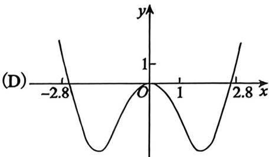

# 零基础

1. “ $\sin^2 \alpha + \sin^2 \beta = 1$ ” 是“ $\sin \alpha + \cos \beta = 0$ ” 的（ ）.

(A)充分非必要条件  
(B)必要非充分条件  
(c)充分必要条件  
(D) 既非充分又非必要条件

2. 证明: 对任意正整数 $n$ , 均有 $2^n + 2 > n^2$ .

3. 设实数 $a \in (0,1)$ . 数列 $\{x_{n}\}$ 满足 $x_{0} = 1$ , 且对任意正整数 $n$ , 均有 $x_{n} = \frac{1}{x_{n-1}} + a$ . 证明: 对任意正整数 $n$ , 有 $x_{n} > 1$ .  
4. $(2a^{3} + ab^{2} + b^{3})(a^{2}b - ab^{2}) =$   
5. 设 $\lambda \neq 0,2$ ，则 $\frac{\lambda^4 - 3\lambda^3 - 6\lambda^2 + 16\lambda}{\lambda^2 - 2\lambda} = \_$   
6. 设函数 $f(x) = \frac{x^2}{1 + x^2}$ ，则 $f(1) + f(2) + f(3) + f(4) + f\left(\frac{1}{2}\right) + f\left(\frac{1}{3}\right) + f\left(\frac{1}{4}\right) =$ ________.  
7. 设 $f(x)$ 在 $[0,1]$ 上有定义， $f(0) = f(1)$ ，且对任意 $x_1, x_2 \in [0,1]$ ，均有

$$
\left| f \left(x _ {1}\right) - f \left(x _ {2}\right) \right| \leqslant \left| x _ {1} - x _ {2} \right|.
$$

证明：当 $a, b \in [0,1]$ 时， $\left|f(a) - f(b)\right| \leqslant \frac{1}{2}$ .

8. 设 $x > 0$ ，求函数 $y = x + \frac{4}{x^2}$ 的最小值。  
9. 设实数 $x, y$ 满足 $3x^{2} + 2y^{2} = 6$ , 求 $2x + y$ 的最大值.  
10. 函数 $f(x) = ax^{3} + bx^{2} - 2x(a, b \in \mathbb{R}, ab \neq 0)$ 的图像如图所示，且 $x_{1} + x_{2} < 0$ ，则有（ ）.

(A) $a > 0, b > 0$

(B) $a <   0$ ， $b <   0$

(C) $a <   0$ ， $b > 0$

(D) $a > 0, b < 0$

11. 设函数 $f(x)$ 满足 $a f(x) + f\left(\frac{1}{x}\right) = a x$ ，其中 $x \neq 0$ ， $a^2 \neq 1$ ，求函数 $f(x)$ 的表达式.  
12. 已知 $\cos \left(\frac{\pi}{12} -\theta\right) = \frac{1}{3}$ , 则 $\sin \left(\frac{5\pi}{12} +\theta\right)$ 的值为  
13. 已知 $|x_1 - 3| < 1$ , $|x_2 - 3| < 1$ . 求证:

(1) $4 < x_{1} + x_{2} < 8, |x_{1} - x_{2}| < 2$ ;   
(2) 若 $f(x) = x^{2} - x + 1$ ，且 $x_{1} \neq x_{2}$ ，则 $|x_{1} - x_{2}| < |f(x_{1}) - f(x_{2})| < 7|x_{1} - x_{2}|$ .

14. 已知等差数列 $\left\{a_{n}\right\}$ 满足 $(a_{1} + a_{2}) + (a_{2} + a_{3}) + \dots + (a_{n} + a_{n+1}) = 2n(n+1)(n \in \mathbf{N}_{+})$ 。求：

(1) 数列 $\{a_{n}\}$ 的通项公式；  
(2) 数列 $\left\{\frac{a_{n}}{2^{n-1}}\right\}$ 的前 $n$ 项和 $S_{n}$ .

15. 函数 $y = -x^{2} + (e^{x} - e^{-x}) \sin x$ 在区间 $[-2.8, 2.8]$ 的图像大致为（ ）.

16. 已知曲线 $C$ 的极坐标方程是 $r = 1$ ，以极点为原点，极轴为 $x$ 轴的正半轴建立平面直角坐标

系, 直线 $l$ 的参数方程为 $\left\{ \begin{array}{l} x = 1 + \frac{l}{2}, \\ y = 2 + \frac{\sqrt{3}}{2} t \end{array} \right.$ (t为参数).

(1)写出直线 $l$ 与曲线 $C$ 的直角坐标方程；  
(2) 设曲线 $C$ 经过伸缩变换 $\left\{ \begin{array}{l} x' = 3x, \\ y' = y \end{array} \right.$ 得到曲线 $C'$ ，设曲线 $C'$ 上任一点为 $M(x,y)$ ，求 $\frac{x}{3} + \sqrt{3}y$ 的最小值.

