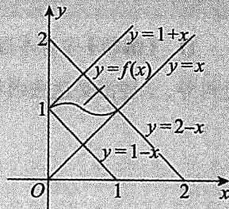
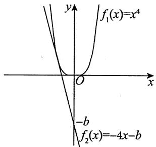

## 基础篇

# 第6章 一元函数微分学的应用（二）

# ——中值定理、微分等式与微分不等式

# 1.【答案】(C)

【解析】 $f(x) = 0$ 的实根为 $x_{1} = 0, x_{2} = \frac{5}{4}, x_{3} = \frac{3}{2}$ ，即 $f(0) = f\left(\frac{5}{4}\right) = f\left(\frac{3}{2}\right)$ ，且 $f(x)$ 可导，则由罗尔定理，存在 $\xi_{1} \in \left(0, \frac{5}{4}\right)$ ，使 $f'(\xi_{1}) = 0$ ；存在 $\xi_{2} \in \left(\frac{5}{4}, \frac{3}{2}\right)$ ，使 $f'(\xi_{2}) = 0$ 。故 $f'(x) = 0$ 至少有两个实根。又 $f'(x) = 0$ 为一元二次方程，至多有两个实根。综上，选(C)。

# 2.【答案】(C)

【解析】记 $f(x) = x - \mathrm{e}\ln x - k$ ，则 $f^{\prime}(x) = 1 - \frac{\mathrm{e}}{x} < 0$ ， $x\in (0,1]$ ，这表明 $f(x)$ 在 $\left(0,1\right]$ 上单调递减，因而它在 $\left(0,1\right]$ 上最多只有一个零点.

又 $\lim_{x\to 0^{+}}f(x) = +\infty$ ，由极限的保号性，存在 $r$ ， $0 < r < 1$ ，使得 $f(r) > 0$ . $f(x)$ 在 $[r,1]$ 上连续， $f(r) > 0$ ， $f(1) = 1 - k$ ：

当 $f(1) = 1 - k = 0$ ，即 $k = 1$ 时， $x = 1$ 是 $f(x)$ 的一个零点，即 $x = 1$ 是方程 $x - \mathrm{e}\ln x - k = 0$ 的一个解.

当 $f(1) = 1 - k < 0$ ，即 $k > 1$ 时，由在闭区间上连续函数的零点定理，知函数 $f(x)$ 在 $(r,1) \subset (0,1)$ 内有一个零点，即方程 $x - \mathrm{e}\ln x - k = 0$ 在 $(0,1)$ 内有一个解.

当 $f(1) = 1 - k > 0$ ，即 $k < 1$ 时，在 $\left(0,1\right]$ 上 $f(x) > 0$ ，这时方程 $x - \mathrm{e}\ln x - k = 0$ 在 $\left(0,1\right]$ 上没有解.

因此，如果方程 $x - \mathrm{e}\ln x - k = 0$ 在 $\left(0,1\right]$ 上有解，则 $k$ 的最小值为1.

故正确选项为(C).

# 3.【答案】(D)

【解析】 $f(x)$ 的定义域为 $(-\infty , + \infty)$ .显然 $b > 0$ ，否则 $f(x)$ 是单调增加函数，与条件矛盾.

$f^{\prime}(x) = ae^{x} - b$ ，令 $f^{\prime}(x) = 0$ ，得驻点 $x = \ln \frac{b}{a}$

当 $x \in \left(-\infty, \ln \frac{b}{a}\right)$ 时， $f'(x) < 0$ ，则 $f(x)$ 单调递减.

当 $x \in \left(\ln \frac{b}{a}, +\infty\right)$ 时， $f'(x) > 0$ ，则 $f(x)$ 单调递增.

当 $x \to -\infty$ 时, $f(x) \to +\infty$ . 当 $x \to +\infty$ 时, $f(x) \to +\infty$ .

因此 $f\left(\ln \frac{b}{a}\right)$ 是最小值. 故当 $f\left(\ln \frac{b}{a}\right) = a \mathrm{e}^{\ln \frac{b}{a}} - b \ln \frac{b}{a} = b\left(1 - \ln \frac{b}{a}\right) < 0$ 时, $f(x)$ 有两个零点(见图), 此时 $\frac{b}{a} > \mathrm{e}$ , 即 $\frac{b}{a} \in (\mathrm{e}, +\infty)$ .

4.【答案】(D)

【解析】 $f^{\prime}(x) = \frac{1}{x} -\frac{1}{e} = \frac{e - x}{ex}\stackrel {\text{令}}{=}0,$

得 $x = \mathsf{e}$ ，又 $f''(x) = -\frac{1}{x^2} < 0$ ，故 $x = \mathbf{e}$ 是唯一极大值点，极大值为 $f(\mathfrak{e}) = a$ ：

又 $\lim_{x\to 0^{+}}f(x) = \lim_{x\to 0^{+}}\left(\ln x - \frac{x}{e} +a\right) = -\infty ,$

$$
\lim  _ {x \rightarrow + \infty} f (x) = \lim  _ {x \rightarrow + \infty} \left(\ln x - \frac {x}{e} + a\right) = \lim  _ {x \rightarrow + \infty} x \left(\frac {\ln x}{x} - \frac {1}{e} + \frac {a}{x}\right) = - \infty ,
$$

于是当 $a > 0$ 时， $f(\mathfrak{e}) > 0$ ，且 $f(x)$ 在 $(0, \mathfrak{e}), (\mathfrak{e}, +\infty)$ 上均单调，由零点定理知， $f(x)$ 有两个零点.

5.【答案】 $\frac{\sqrt{3}}{3}$

【解析】由 $\arcsin x = \frac{x}{\sqrt{1 - (\theta x)^2}}$ ，可得当 $x\neq 0$ 时，

$$
\theta^ {2} = \frac {1 - \frac {x ^ {2}}{\arcsin^ {2} x}}{x ^ {2}} = \frac {\arcsin^ {2} x - x ^ {2}}{\arcsin^ {2} x \cdot x ^ {2}},
$$

故

$$
\lim  _ {x \rightarrow 0} \theta = \lim  _ {x \rightarrow 0} \sqrt {\frac {\arcsin^ {2} x - x ^ {2}}{\arcsin^ {2} x \cdot x ^ {2}}} = \lim  _ {x \rightarrow 0} \sqrt {\frac {(\arcsin x + x) (\arcsin x - x)}{x ^ {4}}}.
$$

因为当 $x \to 0$ 时， $\arcsin x = x + \frac{1}{6} x^3 + o(x^3)$ ，故 $(\arcsin x + x)(\arcsin x - x) \sim \frac{1}{3} x^4 (x \to 0)$ ，所以原式 $= \frac{\sqrt{3}}{3}$ .

6.【解析】令 $f(t) = \ln (1 + t), t > 0$ ，在 $[0, x]$ 上对 $f(t)$ 用拉格朗日中值定理，有

$$
f (x) - f (0) = f ^ {\prime} (\xi) (x - 0), \xi \in (0, x),
$$

即 $\ln (1 + x) = \frac{1}{1 + \xi} \cdot x$ ，由于 $\frac{1}{1 + x} < \frac{1}{1 + \xi} < 1$ ，故 $\frac{x}{1 + x} < \ln (1 + x) < x (x > 0)$ .

7.【解析】令 $f(t) = \ln t, t > 0$ ，在 $[x,1 + x]$ 上对 $f(t)$ 用拉格朗日中值定理，有

$$
\ln (1 + x) - \ln x = \frac {1}{\xi}, x <   \xi <   x + 1,
$$

故 $\frac{1}{1 + x} < \ln \left(1 + \frac{1}{x}\right) < \frac{1}{x} (x > 0)$ .

【注】 $\ln \left(1 + \frac{1}{x}\right) = \ln \frac{1 + x}{x} = \ln (1 + x) - \ln x$ ，这一步构造出了 $f(b) - f(a)$ ：

8.【解析】因 $f(x) - f(0) = f'(\xi)x$ ， $x\in (0,1)$ ， $\xi \in (0,x)$ ，又 $f(0) = 1$ ， $\left|f^{\prime}(\xi)\right|\leqslant 1$ ，于是当 $0 < x < 1$ 时，有 $\left|f(x)\right| = \left|f(0) + f'(\xi)x\right|\leqslant 1 + \left|f'(\xi)\right|x\leqslant 1 + x$ ：

【注】进一步地，令 $f(0) = f(1) = 1$ ，由 $-1\leqslant f^{\prime}(x)\leqslant 1$ ，可证得当 $0 <   x <   1$ 时，

$$
\begin{array}{l} f (x) = f (0) + f ^ {\prime} \left(\xi_ {1}\right) x \leqslant 1 + x, \xi_ {1} \in (0, x), \\ f (x) = f (0) + f ^ {\prime} \left(\xi_ {2}\right) x \geqslant 1 - x, \xi_ {2} \in (0, x), \\ f (x) = f (1) + f ^ {\prime} \left(\xi_ {3}\right) (x - 1) \geqslant 1 + (x - 1) = x, \xi_ {3} \in (x, 1), \\ f (x) = f (1) + f ^ {\prime} \left(\xi_ {4}\right) (x - 1) \leqslant 1 - (x - 1) = 2 - x, \xi_ {4} \in (x, 1), \\ \end{array}
$$

也即 $f(x)$ 在 $(0,1)$ 上被包在由 $y = 1 + x$ ， $y = x$ ， $y = 1 - x$ ， $y = 2 - x$ 四条直线所围平面区域内(见图).这能直观地让考生感受到拉格朗日中值定理的重要作用之一：用 $f^{\prime}(x)$ 的大小来限定 $f(x)$ 的变化幅度大小.此题中，由于 $\left|f^{\prime}(x)\right|\leqslant 1$ ，故 $f(x)$ 被限定在一个小的区域内.

# 9.【答案】(C)

【解析】由拉格朗日中值定理知，

$$
f (x + 1) - f (x) = f ^ {\prime} (\xi), a \leqslant x <   \xi <   x + 1,
$$

故 $\lim_{x\to +\infty}\left[f(x + 1) - f(x)\right] = \lim_{x\to +\infty}f'(\xi)\xrightarrow{x <   \xi <  x + 1}\lim_{\xi \to +\infty}f'(\xi) = 0.$ (C) 正确.

取 $f(x) = \sqrt{x}$ ，则 $\lim_{x\to +\infty}(\sqrt{2x} +\sqrt{x}) = +\infty ,$

$$
\lim  _ {x \rightarrow + \infty} (\sqrt {2 x} - \sqrt {x}) = + \infty ,
$$

$$
\lim  _ {x \rightarrow + \infty} (\sqrt {x + 1} + \sqrt {x}) = + \infty .
$$

可排除(A)，(B)，(D).

【注】当 $x \to +\infty$ 时， $f'(x) \to 0$ 。意味着当 $x \to +\infty$ 时， $f(x)$ 的变化率 $\rightarrow 0$ ，于是 $f(x + 1) - f(x) \to 0 (x \to +\infty)$ 也就顺理成章了。

# 10.【答案】2

【解析】 $\ln 1 = 0$ ，当 $x > 1$ 时，

$$
\frac {f (x) - f (1)}{\ln x} = \frac {f (x) - f (1)}{\ln x - \ln 1}   \frac {\text {柯 西 中 值 定 理}}{1}   \frac {f ^ {\prime} (\xi)}{\frac {1}{\xi}} = \xi f ^ {\prime} (\xi) ,   1 <   \xi <   x .
$$

当 $x \to 1^{+}$ 时， $\xi \to 1^{+}$ ，于是原式 $= \lim_{\xi \to 1^{+}} \xi f'(\xi) = f'(1) = 2$ 。

【注】本题用洛必达法则或导数定义法亦可.

$$
\lim  _ {x \to 1 ^ {+}} {\frac {f (x) - f (1)}{\ln x}}   {\frac {\text {洛 必 达 法 则}}{x \to 1 ^ {+}}}   \lim  _ {x \to 1 ^ {+}} {\frac {f ^ {\prime} (x)}{{\frac {1}{x}}}} = \lim  _ {x \to 1 ^ {+}} x f ^ {\prime} (x) = 2 .
$$

如何用导数定义求解？见下题.

11.【解析】注意本题与上题的区别，本题未讲 $f(x)$ 在 $x = 1$ 处一阶导数连续，只有 $f(x)$ 在 $x = 1$ 处可导，上述洛必达法则和柯西中值定理均不可用。改用导数的定义来求解：

$\lim_{x \to 1^{+}} \frac{\frac{f(x) - f(1)}{x - 1}}{\frac{\ln x - \ln 1}{x - 1}} = \frac{f_{+}^{\prime}(1)}{\left. \frac{1}{x} \right|_{x=1}} = \frac{2}{1} = 2.$

12.【解析】(1) $\sin x = \sin 0 + (\sin x)'\Big|_{x = 0} \cdot x + \frac{(\sin x)''}{2!} \cdot x^2 = x - \frac{\sin\xi}{2} x^2$ ( $\xi$ 介于0, $x$ 之间).

(2) $\left|\frac{\sin x}{x} - 1\right| = \left|\frac{x - \frac{\sin\xi}{2}x^2}{x} - 1\right| = \left|1 - \frac{\sin\xi}{2}x - 1\right| \leqslant \frac{1}{2}\left|x\right|(x \neq 0)$ .

13.【解析】令 $f(x) = \mathrm{e}^{-\frac{x}{2}} - x^3 + 3x$ ，则

$$
f ^ {\prime} (x) = - \frac {1}{2} e ^ {- \frac {x}{2}} - 3 x ^ {2} + 3, f ^ {\prime \prime} (x) = \frac {1}{4} e ^ {- \frac {x}{2}} - 6 x, f ^ {\prime \prime} (x) = - \frac {1}{8} e ^ {- \frac {x}{2}} - 6,
$$

至此，由 $\mathrm{e}^{-\frac{x}{2}} > 0$ ，有 $f^{\prime \prime}(x) < 0$ ，即 $f''(x) = 0$ 无实根，则 $f(x) = 0$ 至多有3个实根.

取 $x = -\sqrt{3}$ ，有 $f(-\sqrt{3}) = \mathrm{e}^{\frac{\sqrt{3}}{2}} > 0$ ；取 $x = -1$ ，有 $f(-1) = \mathrm{e}^{\frac{1}{2}} - 2 < 0$

取 $x = 1$ ，有 $f(1) = \mathrm{e}^{-\frac{1}{2}} + 2 > 0$ ；取 $x = 2$ ，有 $f(2) = \mathrm{e}^{-1} - 2 < 0$ ：

故 $f(x) = 0$ 在 $(- \sqrt{3}, -1)$ , $(-1, 1)$ , $(1, 2)$ 内各有一个实根.

综上，两曲线恰有3个交点.

# 14.【答案】(B)

【解析】令 $F(x) = \frac{f(x)}{x}$ ，则 $F^{\prime}(x) = \frac{xf^{\prime}(x) - f(x)}{x^{2}}$

又因为当 $0 < a < x < b$ 时， $xf'(x) < f(x)$ ，所以在 $(a, b)$ 内有 $F'(x) < 0$ ， $F(x)$ 单调减少，从而 $F(a) > F(x) > F(b)$ ，即 $\frac{f(a)}{a} > \frac{f(x)}{x} > \frac{f(b)}{b}$ .

故选项(B)成立.

# 15.【答案】(A)

【解析】方法一设 $f(x) = x^4 + 4x + b$ ，方程有两个不等实根，等价于函数 $f(x)$ 有两个零点，根据4次函数的几何图形可知，此时 $f(x)$ 的极小值应小于零.

$$
f ^ {\prime} (x) = 4 x ^ {3} + 4 = 4 (x + 1) \left(x ^ {2} - x + 1\right).
$$

由 $f^{\prime}(x) = 0$ 得唯一驻点 $x = -1$

又 $f''(x) = 12x^2 \geqslant 0$ ，所以 $x = -1$ 为极小值点.

由 $f(-1) = 1 - 4 + b < 0$ 可得 $b < 3$

方法二 令 $f_{1}(x) = x^{4}$ ， $f_{2}(x) = -4x - b$ ，如图所示，方程 $x^{4} + 4x + b = 0$ 有两个不等的实根意味着 $f_{1}(x)$ 与 $f_{2}(x)$ 有两个交点.

当 $f_{2}(x)$ 与 $f_{1}(x)$ 相切时， $f_{1}(x)$ 与 $f_{2}(x)$ 恰好有一个交点，此时

$$
f _ {1} ^ {\prime} (x) = 4 x ^ {3} = f _ {2} ^ {\prime} (x) = - 4,
$$

解得 $x = -1$ ，此时 $f_{1}(-1) = 1$ ，因此 $f_{2}(-1) = 4 - b = 1$ ，即 $b = 3$ ，则 $f_{2}(x) = -4x - 3$ ：

结合图形, 知 $-b > -3$ , 即 $b < 3$ 时, 才能使得 $f_{1}(x)$ 与 $f_{2}(x)$ 有两个交点.

# 16.【答案】(B)

【解析】令 $g(x) = \ln x - \frac{x}{\mathrm{e}} + k$ ，易知 $g'(x) = \frac{1}{x} - \frac{1}{\mathrm{e}}$ 。当 $x > \mathrm{e}$ 时， $g'(x) < 0$ ；当 $0 < x < \mathrm{e}$ 时， $g'(x) > 0$ 。故在 $(0, \mathrm{e})$ 和 $(\mathrm{e}, +\infty)$ 内 $g(x)$ 分别至多有一个零点，又 $g(\mathrm{e}) = k > 0$ ， $\lim_{x \to 0^+} g(x) = -\infty$ ， $\lim_{x \to +\infty} g(x) = -\infty$ ，所以 $g(x)$ 在 $(0, +\infty)$ 内有两个零点。不妨设 $g(x)$ 的两个零点分别为 $x_1$ 和 $x_2$ ，又 $\lim_{x \to x_1} f(x) = \infty$ ， $\lim_{x \to x_2} f(x) = \infty$ ，故 $x_1$ 和 $x_2$ 均为 $f(x)$ 的无穷间断点，所以 $f(x)$ 在 $(0, +\infty)$ 内有两个间断点，故答案选(B)。

# 17.【答案】(D)

【解析】令 $F(x) = \frac{f(x)}{g(x)}$ ，由 $f'(x)g(x) - f(x)g'(x) < 0$ 可知

$$
F ^ {\prime} (x) = \left[ \frac {f (x)}{g (x)} \right] ^ {\prime} = \frac {f ^ {\prime} (x) g (x) - f (x) g ^ {\prime} (x)}{g ^ {2} (x)} <   0.
$$

从而函数 $\frac{f(x)}{g(x)}$ 单调减少，故有 $\frac{f(a)}{g(a)} > \frac{f(x)}{g(x)} > \frac{f(b)}{g(b)}$ .

由上述不等式可知选项(A)，(B)，(C)三个不等式不一定成立.

而由 $\frac{f(x)}{g(x)} >\frac{f(b)}{g(b)}$ 可知选项(D)正确.

18.【分析】欲证不等式需找出基本函数 $f(x)$ ，按常规方法求出 $f(x)$ 的极值与最值，再进行比较，即可得证.

【解析】令 $f(x) = x^{p} + (1 - x)^{p}$ ，则

$$
f ^ {\prime} (x) = p x ^ {p - 1} + p (1 - x) ^ {p - 1} (- 1) = p \left[ x ^ {p - 1} - (1 - x) ^ {p - 1} \right],
$$

$$
f ^ {\prime \prime} (x) = p (p - 1) x ^ {p - 2} + p (p - 1) (1 - x) ^ {p - 2},
$$

令 $f^{\prime}(x) = 0$ 可得 $x = \frac{1}{2}$ .

又因 $p > 1$ ，故 $f''\left(\frac{1}{2}\right) = 2p(p - 1)\left(\frac{1}{2}\right)^{p - 2} > 0$ ，于是 $f(x)$ 在 $x = \frac{1}{2}$ 处取得极小值 $f\left(\frac{1}{2}\right) = \frac{1}{2^{p - 1}}$

由于 $f(0) = f(1) = 1$ ，于是 $f(x)$ 在 $[0,1]$ 上的最小值为 $\frac{1}{2^{p - 1}}$ ，最大值为1.

故有 $\frac{1}{2^{p - 1}}\leqslant f(x)\leqslant 1$ ，即 $\frac{1}{2^{p - 1}}\leqslant x^p +(1 - x)^p\leqslant 1$

19.【分析】方程 $x^{3} - 3x + k = 0$ 是三次方程，它可能有一个实根，两个实根或者三个实根。根的个数取决于曲线 $y = x^{3} - 3x + k$ 与 $x$ 轴交点的个数。曲线 $y = x^{3} - 3x + k$ 与 $x$ 轴相切时，该切点必为 $y = x^{3} - 3x + k$ 的极值点。

【解析】设 $y = x^3 - 3x + k$ ，则当 $x \to +\infty$ 时， $y \to +\infty$ ；当 $x \to -\infty$ 时， $y \to -\infty$ . $y' = 3x^2 - 3$ ，令 $y' = 0$ ，可得 $x = -1$ 或 1.

又 $y'' = 6x$ ，由极值点的第二充分条件可知， $y''|_{x=-1} = -6 < 0$ ，则 $y|_{x=-1} = k + 2$ 为极大值； $y''|_{x=1} = 6 > 0$ ，则 $y|_{x=1} = k - 2$ 为极小值.

当极大值 $k + 2 < 0$ ，极小值 $k - 2 < 0$ 时，方程只有一个实根.同理，当极小值 $k - 2 > 0$ ，极大值 $k + 2 > 0$ 时，方程也只有一个实根.

当 $k + 2 = 0$ 或 $k - 2 = 0$ 时，方程有两个实根.当 $k + 2 > 0$ 且 $k - 2 <   0$ 时，方程有三个实根.

综上，当 $k > 2$ 或 $k < -2$ 时，方程有一个实根；当 $k = \pm 2$ 时，方程有两个实根；当 $-2 < k < 2$ 时，方程有三个实根.

20.【分析】欲证结论，相当于证明在 $(a,b)$ 内至少有一点满足

$$
\left(b ^ {2} - a ^ {2}\right) f ^ {\prime} (x) - 2 x \left[ f (b) - f (a) \right] = 0.
$$

由于 $f(x)$ 在 $[a,b]$ 上连续，在 $(a,b)$ 内可导，因此，构造函数 $F(x) = (b^{2} - a^{2})f(x) -x^{2}\left[f(b) - f(a)\right]$ , 使 $F^{\prime}(x) = (b^{2} - a^{2})f^{\prime}(x) - 2x\left[f(b) - f(a)\right]$ , 于是 $F(x)$ 在 $[a,b]$ 上连续, 在 $(a,b)$ 内可导, 如果能验证 $F(a) = F(b)$ , 则由罗尔定理可证原命题成立.

【解析】构造函数 $F(x) = (b^{2} - a^{2})f(x) - [f(b) - f(a)]x^{2}$ ，由 $f(x)$ 在 $[a,b]$ 上连续，在 $(a,b)$ 内可导，可知 $F(x)$ 也在 $[a,b]$ 上连续，在 $(a,b)$ 内可导，又 $F(a) = b^{2}f(a) - a^{2}f(b) = F(b)$ ，则由罗尔定理可知，至少存在一点 $\xi \in (a,b)$ ，使

$$
F ^ {\prime} (\xi) = (b ^ {2} - a ^ {2}) f ^ {\prime} (\xi) - 2 \xi \left[ f (b) - f (a) \right] = 0,
$$

命题得证.

# 21.【答案】(B)

【解析】令 $f(x) = a_{0}x + \frac{a_{1}}{2} x^{2} + \dots + \frac{a_{n}}{n + 1} x^{n + 1}$ ，则 $f(x)$ 在 $[0,1]$ 上连续，在(0,1)内可导，且

$$
f (0) = 0, f (1) = a _ {0} + \frac {a _ {1}}{2} + \dots + \frac {a _ {n}}{n + 1} = 0.
$$

故由罗尔定理知, 至少存在一点 $\xi \in (0,1)$ , 使 $f'(\xi) = 0$ , 即 $a_0 + a_1\xi + \dots + a_n\xi^n = 0$ , 亦即方程 $a_0 + a_1x + \dots + a_nx^n = 0$ 在 $(0,1)$ 内至少有一个实根 $\xi$ .

22.【解析】(1)令 $G(x) = f(x) - \frac{f(c) - f(a)}{c - a} (x - a)$

则 $G(a) = f(a) = G(c)$

又 $G(x)$ 在 $[a,c]$ 上连续，在 $(a,c)$ 内可导，故根据罗尔定理可知，存在 $\xi \in (a,c)$ ，使得 $G'(\xi) = 0$ ，即 $f'(\xi) = \frac{f(c) - f(a)}{c - a}$ ，原命题得证.

(2) 由(1)可知，

$$
\begin{array}{l} \frac {f (b) - f (a)}{b - a} = \frac {f (b) - f (c) + f (c) - f (a)}{b - a} \\ = \frac {f (b) - f (c)}{b - c} \cdot \frac {b - c}{b - a} + \frac {f (c) - f (a)}{c - a} \cdot \frac {c - a}{b - a} \\ = f ^ {\prime} (\gamma) \cdot \frac {b - c}{b - a} + f ^ {\prime} (\xi) \cdot \frac {c - a}{b - a}, \\ \end{array}
$$

其中 $\gamma \in (c,b)$ . 令 $\frac{b - c}{b - a} = t$ , 则 $\frac{c - a}{b - a} = 1 - t$ , $0 < t < 1$ , 故 $\frac{f(b) - f(a)}{b - a} = tf'(\gamma) + (1 - t)f'(\xi)$ 介于 $f'(\gamma)$ 与 $f'(\xi)$ 之间 (当 $f'(\gamma) = f'(\xi)$ 时, 取 $\eta = \gamma$ 显然得证), 于是, 由导数的介值定理可知, 存在 $\eta$ 使得 $\eta > \xi$ , 原命题得证.

---

## 强化篇

# ——中值定理、微分等式与微分不等式

# 1.【答案】(A)

【解析】对于 ① ，可举反例 $f(x) = \frac{\sin x^2}{x}$ ， $\lim_{x \to +\infty} f(x)$ 存在，但 $\lim_{x \to +\infty} f'(x)$ 不存在.

对于 ② ，可举反例 $f(x) = x$ ， $\lim_{x\to +\infty}f'(x)$ 存在，但 $\lim_{x\to +\infty}f(x)$ 不存在.

对于 ③ ，不妨设 $a > 0$ ，则存在 $X > 0$ ，当 $x > X$ 时， $f'(x) > \frac{a}{2}$ ，故

$$
f (x) = f (X) + \int_ {X} ^ {x} f ^ {\prime} (t) d t > f (X) + \frac {a}{2} (x - X),
$$

当 $x \to +\infty$ 时， $f(x) \to +\infty$ ，故③正确.

对于 ④ ，可举反例 $f(x) = \sqrt{x}$ ， $\lim_{x \to +\infty} f'(x) = 0$ ，但 $f(x)$ 在 $x \to +\infty$ 时无界.

# 2.【答案】(C)

【解析】常用结论：已知 $\lim_{x\to +\infty}f'(x)$ 存在，若 $\lim_{x\to +\infty}f'(x) = a\neq 0$ ，则 $f(x)$ 在 $x\rightarrow +\infty$ 时无界.其逆否命题为已知 $\lim_{x\to +\infty}f'(x)$ 存在，若 $f(x)$ 在 $x\to +\infty$ 时有界，则 $\lim_{x\to +\infty}f'(x)$ 不等于非零常数，即 $\lim_{x\to +\infty}f'(x) = 0$ 又 $\lim_{x\to +\infty}f(x)$ 存在，则 $f(x)$ 在 $x\to +\infty$ 时有界.综上，结论①正确.

已知 $\lim_{x\to +\infty}\left[f(x) + f'(x)\right]$ 存在，且

$$
\lim  _ {x \to + \infty} f (x) = \lim  _ {x \to + \infty} {\frac {f (x) \mathrm {e} ^ {x}}{\mathrm {e} ^ {x}}} {\overset {\text {广 义 洛 必 达 法 则}} {=}} \lim  _ {x \to + \infty} \left[ f (x) + f ^ {\prime} (x) \right],
$$

故 $\lim_{x\to +\infty}f'(x) = 0$ .结论 $②$ 正确，选(C).

【注】结论“已知 $\lim_{x\to +\infty}f'(x)$ 存在，若 $\lim_{x\to +\infty}f'(x) = a\neq 0$ ，则 $f(x)$ 在 $x\rightarrow +\infty$ 时无界”的证明见第1题③的证明.

3.【解析】用反证法.假设对于任意 $x\in (0,1)$ ， $f^{\prime}(x)\leqslant 1$ ，则 $F(x) = f(x) - x$ 在 $[0,1]$ 上单调递减(由 $F^{\prime}(x)\leqslant 0$ ).因此 $0 = F(0)\geqslant F(x)\geqslant F(1) = 0$ ， $x\in (0,1)$ ，即 $f(x)\equiv x$ ，与题设矛盾.故假设不成立，命题得证.  
4.【解析】(1)若 $f(x)$ 在 $(0, +\infty)$ 上有一零点 $x_0$ ，则对区间 $(0, x_0)$ 用罗尔定理即可.否则，由连续性知 $f(x)$ 在 $(0, +\infty)$ 上不变号，不妨设为恒正，则存在 $M > 1$ ，对任意 $x > M$ ，有 $f(x) < f(1)$ ，特别地，

$0 < f(2M) < f(1)$ . 又由 $f(x)$ 的连续性, 存在 $m \in (0,1)$ , 使得 $f(m) = f(2M)$ , 从而对区间 $(m,2M)$ 用罗尔定理, 即存在 $\xi \in (m,2M) \subset (0, +\infty)$ , 使 $f'(\xi) = 0$ .

(2) 记 $g(x) = f(x) - \ln \frac{2x + 1}{x + \sqrt{1 + x^2}}$ ，当 $x = 0$ 时， $\ln \frac{2x + 1}{x + \sqrt{1 + x^2}} = 0$ ，又 $\lim_{x \to +\infty} \ln \frac{2x + 1}{x + \sqrt{1 + x^2}} = 0$ ，由夹逼准则即得 $g(0) = 0$ ， $\lim_{x \to +\infty} g(x) = 0$ 。因此，由(1)的结论知存在 $\xi \in (0, +\infty)$ ，使得 $g'(\xi) = 0$ 。整理即得 $f'(\xi) = \frac{2}{2\xi + 1} - \frac{1}{\sqrt{1 + \xi^2}}$ 。

5.【解析】令 $g(x) = \ln f(x)$ ，则 $g^{\prime}(x) = \frac{f^{\prime}(x)}{f(x)}$

$$
g ^ {\prime \prime} (x) = \frac {f ^ {\prime \prime} (x) f (x) - \left[ f ^ {\prime} (x) \right] ^ {2}}{f ^ {2} (x)} <   0.
$$

又 $f(0) - 0 = 1$ ， $f^{\prime}(0) - 1 = 0$ ，得 $f(0) = 1$ ， $f^{\prime}(0) = 1$ ，也即

$$
g (0) = \ln f (0) = 0, g ^ {\prime} (0) = \frac {f ^ {\prime} (0)}{f (0)} = 1.
$$

于是 $g(x) = g(0) + g'(0)x + \frac{g''(\xi)}{2} x^2 = x + \frac{g''(\xi)}{2} x^2 \leqslant x$ ，其中 $\xi$ 介于0， $x$ 之间。故 $\ln f(x) \leqslant x$ ， $f(x) \leqslant e^x$ 。证毕。

6.【解析】(1)若 $x > x_0$ ，则存在 $\xi \in (x_0,x)$ ，有 $\frac{f(x) - f(x_0)}{x - x_0} = f'(\xi)\geqslant f'(x_0)$ （由 $f''(x)\geqslant 0$ 知 $f^{\prime}(x)$ 单调递增)，移项即得待证式. $x <   x_0$ 的情形同理可证.

(2) 用反证法. 假设存在 $x_{1} < x_{2}$ , 使 $f(x_{1}) \neq f(x_{2})$ , 不妨设 $f(x_{1}) < f(x_{2})$ , 则 $k = \frac{f(x_{2}) - f(x_{1})}{x_{2} - x_{1}} > 0$ . 由拉格朗日中值定理, 知存在 $\xi \in (x_{1}, x_{2})$ 使得 $f'(\xi) = k$ , 从而对于任意 $x > \xi$ , $f'(x) \geqslant k$ , 由(1)得, 对于任意 $x > \xi$ , $f(x) \geqslant f(\xi) + k(x - \xi)$ , 这与 $f(x)$ 的有界性矛盾. 故假设不成立, 命题得证.

7.【解析】(1)设 $x\in [0,1]$ ，则

$$
f (0) = f (x) + f ^ {\prime} (x) (0 - x) + \frac {f ^ {\prime \prime} (\xi_ {1})}{2} (0 - x) ^ {2}, \xi_ {1} \in (0, x), \tag {①}
$$

$$
f (1) = f (x) + f ^ {\prime} (x) (1 - x) + \frac {f ^ {\prime \prime} (\xi_ {2})}{2} (1 - x) ^ {2}, \xi_ {2} \in (x, 1), \tag {②}
$$

$1 - 2$ ，得 $f^{\prime}(x) = \frac{1}{2} [f^{\prime \prime}(\xi_{1})x^{2} - f^{\prime \prime}(\xi_{2})(1 - x)^{2}],$

又 $\left|f^{\prime \prime}(x)\right|\leqslant M$ ，则

$$
\left| f ^ {\prime} (x) \right| \leqslant \frac {M}{2} \cdot [ x ^ {2} + (1 - x) ^ {2} ] \leqslant \frac {(*)}{2} \cdot 1 = \frac {M}{2},
$$

当且仅当 $x = 0$ 或1时 $(^{*})$ 处等号成立.

(2) 由(1)知, 当 $x \in (0,1)$ 时, $\left|f'(x)\right| < \frac{M}{2}$ , 故只需研究 $x = 0$ 和 $x = 1$ 处 $\left|f'(x)\right|$ 的情况.

如果 $\left|f^{\prime}(0)\right| = \frac{M}{2}$ ，不妨设 $f^{\prime}(0) = \frac{M}{2}$ 则

$$
f \left(\frac {1}{2}\right) = f (0) + f ^ {\prime} (0) \left(\frac {1}{2} - 0\right) + \frac {f ^ {\prime \prime} (\xi)}{2} \left(\frac {1}{2} - 0\right) ^ {2} = 0, \xi \in \left(0, \frac {1}{2}\right),
$$

即 $\frac{M}{4} = -\frac{1}{8} f''(\xi)$ ，也即 $f''(\xi) = -2M$ ，则 $\left|f''(\xi)\right| = 2M > M$ ，矛盾。

同理，可证 $f^{\prime}(0) = -\frac{M}{2}$ 及 $|f'(1)| = \frac{M}{2}$ 均不成立，即得 $|f'(x)| < \frac{M}{2}, x \in [0,1]$ .

# 8.【答案】(B)

【解析】令 $g(x) = \mathrm{e}^{-2x}f(x)$ ，则 $g^{\prime}(x) = [-2f(x) + f^{\prime}(x)]\mathrm{e}^{-2x} > 0$ ，故 $g(x)$ 在 $[-2,2]$ 上单调增加，从而 $g(0) > g(-1)$ ，即 $f(0) > \mathrm{e}^{2}f(-1)$ ，又 $f(x) > 0$ ，所以 $\frac{f(0)}{f(-1)} > \mathrm{e}^{2}$ . 选项(B) 正确. 同理可知选项(A), (C), (D) 均不正确.

# 9.【答案】(B)

【解析】令 $\varphi(x) = \mathrm{e}^{-2x} f(x)$ ，则由题设知， $\varphi'(x) = \mathrm{e}^{-2x} [f'(x) - 2f(x)] < 0$ ，故 $\varphi(x)$ 单调减少。于是，当 $b > a > 0$ 时， $\varphi(\ln b) < \varphi(\ln a)$ ，即 $\mathrm{e}^{-2\ln b} f(\ln b) < \mathrm{e}^{-2\ln a} f(\ln a)$ ，也即 $b^{-2} f(\ln b) < a^{-2} f(\ln a)$ ，由此即得 $b^2 f(\ln a) > a^2 f(\ln b)$ 。

由题干条件无法确定 $b^{2}f(a)$ 与 $a^2 f(b)$ 的大小关系，如 $f(x) = \mathrm{e}^{x}$ ，则 $f^{\prime}(x) = \mathrm{e}^{x} < 2\mathrm{e}^{x} = 2f(x)$ ：

令 $g(x) = \frac{\mathrm{e}^x}{x^2}$ ( $x > 0$ ), 则 $g'(x) = \frac{\mathrm{e}^x(x - 2)}{x^3}$ , 当 $0 < x < 2$ 时, $g(x)$ 单调减少, 当 $x > 2$ 时, $g(x)$ 单调增加. 所以, 当 $2 > b > a > 0$ 时, $g(b) < g(a)$ , 即 $b^2 f(a) > a^2 f(b)$ ; 当 $b > a > 2$ 时, $g(b) > g(a)$ , 即 $b^2 f(a) < a^2 f(b)$ .

10.【解析】(1)当 $x > 0$ 时，对 $f(x)$ 在 $[0,x]$ 上用拉格朗日中值定理，有

$$
f (x) - f (0) = f ^ {\prime} [ x \cdot \theta (x) ] \cdot x, 0 <   \theta (x) <   1,
$$

即 $\int_0^x\mathrm{e}^{t^2}\mathrm{d}t = xf''[x\bullet \theta (x)], 0 <   \theta (x) <   1.$

若另有 $\theta^{*}(x)$ ，使得 $f(x) - f(0) = f^{\prime}[x\bullet \theta^{*}(x)]\bullet x(0 <   \theta^{*}(x) <   1)$ ，则

$$
f ^ {\prime} [ x \cdot \theta (x) ] x - f ^ {\prime} [ x \cdot \theta^ {*} (x) ] x = f ^ {\prime \prime} (\xi) \cdot x \cdot [ \theta (x) - \theta^ {*} (x) ] x = 0,
$$

其中 $\xi$ 介于 $x\cdot \theta (x)$ 与 $x\cdot \theta^{*}(x)$ 之间，而 $f''(x) > 0,x > 0$ ，故 $\theta (x) = \theta^{*}(x)$ ：

(2) 由(1)知, $\int_{0}^{x} \mathrm{e}^{t^2} \mathrm{d}t = x \cdot \mathrm{e}^{[x \cdot \theta(x)]^2} (0 < \theta(x) < 1, x > 0)$ , 解得

$$
\theta (x) = \frac {1}{x} \cdot \sqrt {\ln \frac {\int_ {0} ^ {x} e ^ {t ^ {2}} d t}{x}},
$$

故

$$
\begin{array}{l} \lim  _ {x \rightarrow 0 ^ {+}} \theta (x) = \lim  _ {x \rightarrow 0 ^ {+}} \frac {1}{x} \cdot \sqrt {\frac {\int_ {0} ^ {x} e ^ {t ^ {2}} d t - x}{x}} = \lim  _ {x \rightarrow 0 ^ {+}} \sqrt {\frac {\int_ {0} ^ {x} e ^ {t ^ {2}} d t - x}{x ^ {3}}} \\ = \sqrt {\lim  _ {x \rightarrow 0 ^ {+}} \frac {\int_ {0} ^ {x} \mathrm {e} ^ {t ^ {2}} \mathrm {d} t - x}{x ^ {3}}} = \sqrt {\lim  _ {x \rightarrow 0 ^ {+}} \frac {\mathrm {e} ^ {x ^ {2}} - 1}{3 x ^ {2}}} = \frac {\sqrt {3}}{3}. \\ \end{array}
$$

11.【解析】(1)在 $[2,3]$ 上对 $f(x)$ 应用拉格朗日中值定理，有 $f(3) - f(2) = f'(\eta) \geqslant M > 0$ ，其中 $\eta \in (2,3)$ . 又 $f(2) > 0$ ，故 $f(3) = f(2) + f'(\eta) > M$ .

又在 $[2,4]$ 上 $f^{\prime}(x) > 0,f(x)$ 单调增加，于是对任意的 $x\in [3,4]$ ，均有 $f(x) > M$ ：

(2) 令 $F(x) = \int_{3}^{x} f(t) \, \mathrm{d}t$ , $G(x) = \mathrm{e}^{x}$ , 在 $[3,4]$ 上对 $F(x)$ , $G(x)$ 应用柯西中值定理, 有

即

$$
\frac {F (4) - F (3)}{G (4) - G (3)} = \frac {F ^ {\prime} (\xi)}{G ^ {\prime} (\xi)}, \xi \in (3, 4),
$$

$$
\frac {\int_ {3} ^ {4} f (x) \mathrm {d} x}{\mathrm {e} ^ {3} (\mathrm {e} - 1)} = \frac {f (\xi)}{\mathrm {e} ^ {\xi}}, \xi \in (3, 4).
$$

又由(1)，有

$$
\int_ {3} ^ {4} f (x) \mathrm {d} x > \int_ {3} ^ {4} M \mathrm {d} x = M,
$$

故 $\frac{f(\xi)}{\mathrm{e}^{\xi}} >\frac{M}{\mathrm{e}^{3}(\mathrm{e} - 1)}$ ，即 $f(\xi) > M\cdot \frac{\mathrm{e}^{\xi - 3}}{\mathrm{e} - 1}$

【注】 $\xi \in (3,4)$ ，故 $\frac{\mathrm{e}^{\xi - 3}}{\mathrm{e} - 1}$ 与1的大小关系不确定，不能简单认为(1)成立则(2)必成立.

12.【解析】记 $F(x) = f(x) - (ax^2 + bx + c)$ ，则 $F(x)$ 在 $(\alpha, \beta)$ 内二阶可导。由已知条件，在 $(\alpha, \beta)$ 内存在 $u, v, w$ ，且 $u < v < w$ ，使得 $F(u) = F(v) = F(w) = 0$ ，故由罗尔定理知存在 $\xi_1 \in (u, v)$ ， $\xi_2 \in (v, w)$ ，使得 $F'(\xi_1) = F'(\xi_2) = 0$ 。因此，存在 $\xi \in (\xi_1, \xi_2) \subset (\alpha, \beta)$ ，使得 $F''(\xi) = f''(\xi) - 2a = 0$ ，即 $f''(\xi) = 2a$ 。

13.【答案】(D)

【解析】 $f(x)$ 在 $[0,1]$ 上二阶可导，则由带拉格朗日余项的泰勒公式，有

$$
f (x) = f \left(\frac {1}{2}\right) + f ^ {\prime} \left(\frac {1}{2}\right) \left(x - \frac {1}{2}\right) + \frac {1}{2} f ^ {\prime \prime} (\xi) \left(x - \frac {1}{2}\right) ^ {2},
$$

其中 $\xi$ 介于 $x$ 与 $\frac{1}{2}$ 之间. 又在 $[0,1]$ 上取积分得

$$
\begin{array}{l} \int_ {0} ^ {1} f (x) \mathrm {d} x = \int_ {0} ^ {1} f \left(\frac {1}{2}\right) \mathrm {d} x + \int_ {0} ^ {1} f ^ {\prime} \left(\frac {1}{2}\right) \left(x - \frac {1}{2}\right) \mathrm {d} x + \frac {1}{2} \int_ {0} ^ {1} f ^ {\prime \prime} (\xi) \left(x - \frac {1}{2}\right) ^ {2} \mathrm {d} x, \\ 0 = f \left(\frac {1}{2}\right) + f ^ {\prime} \left(\frac {1}{2}\right) \cdot \frac {1}{2} \left(x - \frac {1}{2}\right) ^ {2} \Bigg | _ {0} ^ {1} + \frac {1}{2} \int_ {0} ^ {1} f ^ {\prime \prime} (\xi) \left(x - \frac {1}{2}\right) ^ {2} d x, \\ f \left(\frac {1}{2}\right) = - \frac {1}{2} \int_ {0} ^ {1} f ^ {\prime \prime} (\xi) \left(x - \frac {1}{2}\right) ^ {2} d x. \\ \end{array}
$$

故当 $f''(x) > 0$ 时，有 $f''(\xi) > 0$ ，则 $f\left(\frac{1}{2}\right) < 0$ .因此选(D).

14.【解析】(1)记 $x_0$ 为 $[0,1]$ 上 $f(x)$ 的最大值点，又 $f(0) = f(1) = 0$ ，则 $M = f(x_0) > 0$ ， $x_0 \in (0,1)$ 且由费马定理，有 $f'(x_0) = 0$ ：

在 $[0, x_0]$ 上对 $f(x)$ 应用拉格朗日中值定理，得 $f'(\xi) = \frac{f(x_0) - f(0)}{x_0 - 0} = \frac{M}{x_0}$ ， $\xi \in (0, x_0)$ 。

对任意正整数 $n$ ， $0 < \frac{M}{n} < \frac{M}{x_0}$ ，即 $f'(x_0) < \frac{M}{n} < f'(\xi)$ . 又由于 $f'(x)$ 在 $[\xi, x_0]$ 上连续，故由介值定理，存在 $x_n \in (\xi, x_0) \subset (0, 1)$ ，使得 $f'(x_n) = \frac{M}{n}$ . 又 $f''(x) < 0$ ， $f'(x)$ 严格单调减少，故 $x_n$ 唯一.

(2) 由于 $f'(x_n) = \frac{M}{n} > \frac{M}{n + 1} = f'(x_{n + 1})$ ，且 $f'(x)$ 严格单调减少，故 $x_n < x_{n + 1}$ ，即 $\{x_n\}$ 严格单调增加，且有界，故 $\lim_{n \to \infty} x_n$ 存在。又

$$
\lim  _ {n \to \infty} f ^ {\prime} (x _ {n}) = \lim  _ {n \to \infty} {\frac {M}{n}} = 0 ,   \text {即} f ^ {\prime} \left(\lim  _ {n \to \infty} x _ {n}\right) = 0 ,
$$

由于 $f^{\prime}(x_0) = 0$ ，且导数零点唯一，故 $\lim_{n\to \infty}x_n = x_0$ ，所以 $\lim_{n\to \infty}f(x_n) = f(x_0) = M$ ：

【注】本题还可以这样做.

解析 (1) 记 $x_0$ 为 $[0,1]$ 上的最大值点， $f(x_0) = M$ 。令 $F(x) = f(x) - \frac{M}{n} x$ ，则 $F(x_0) = M - \frac{M}{n} x_0 > 0$ ， $F(1) = -\frac{M}{n} < 0$ ，由零点定理，存在 $\xi \in (x_0,1)$ ，使 $F(\xi) = 0$ 。又 $F(0) = 0$ ，由罗尔定理，

存在 $x_{n}\in (0,\xi)\subset (0,1)$ ，使 $F^{\prime}(x_n) = 0$ ，即 $f^{\prime}(x_n) = \frac{M}{n}$ 又 $f''(x) <   0$ ， $f^{\prime}(x)$ 严格单调减少，故 $x_{n}$ 唯一.

(2) 由拉格朗日中值定理, 有 $f'(x_{n+1}) - f'(x_n) = f''(\xi_n)(x_{n+1} - x_n)$ , $\xi_n$ 介于 $x_n$ , $x_{n+1}$ 之间, 则

$$
x _ {n + 1} - x _ {n} = \frac {1}{f ^ {\prime \prime} (\xi_ {n})} \left(\frac {M}{n + 1} - \frac {M}{n}\right) > 0,
$$

故 $\{x_{n}\}$ 单调增加，且有界，故 $\lim_{n\to \infty}x_n$ 存在

其余同标准答案.

15.【解析】必要性.若对任意 $x\in (a,b)$ 及适当小的 $h > 0$ ，有

$$
f (x) \leqslant \frac {1}{2} [ f (x + h) + f (x - h) ],
$$

则对上述 $x$ 及 $h$ 有

$$
\frac {f (x + h) + f (x - h) - 2 f (x)}{h ^ {2}} \geqslant 0.
$$

两边取极限，由于 $f(x)$ 二次可微，左端极限为

$$
\begin{array}{l} \lim  _ {h \rightarrow 0 ^ {+}} \frac {f (x + h) + f (x - h) - 2 f (x)}{h ^ {2}} = \lim  _ {h \rightarrow 0 ^ {+}} \frac {f ^ {\prime} (x + h) - f ^ {\prime} (x - h)}{2 h} \\ = \lim  _ {h \rightarrow 0 ^ {+}} \frac {1}{2} \left[ \frac {f ^ {\prime} (x + h) - f ^ {\prime} (x)}{h} + \frac {f ^ {\prime} (x - h) - f ^ {\prime} (x)}{- h} \right] = f _ {+} ^ {\prime \prime} (x) = f ^ {\prime \prime} (x). \\ \end{array}
$$

因此得 $f''(x) \geqslant 0, x \in (a,b)$ .

充分性. 若 $f''(x) \geqslant 0, x \in (a,b)$ , 则 $f'(x)$ 单调不减, 于是对任意的 $x \in (a,b)$ 及适当小的 $h > 0$ , 有

$$
f (x + h) + f (x - h) - 2 f (x) = \int_ {x} ^ {x + h} [ f ^ {\prime} (t) - f ^ {\prime} (t - h) ] d t \geqslant 0,
$$

即 $f(x)\leqslant \frac{1}{2}\big[f(x + h) + f(x - h)\big].$

16.【解析】令 $f(x) = \frac{1}{x^2} -\frac{\arctan x}{x^3}$ ，则

$$
f ^ {\prime} (x) = - \frac {2}{x ^ {3}} - \frac {\frac {x}{1 + x ^ {2}} - 3 \arctan x}{x ^ {4}} = \frac {3 \arctan x - 2 x - \frac {x}{1 + x ^ {2}}}{x ^ {4}}.
$$

再令 $g(x) = 3\arctan x - 2x - \frac{x}{1 + x^2}$ ，则 $g'(x) = \frac{-2x^4}{(1 + x^2)^2} < 0 (x \neq 0)$ . 故 $g(x)$ 在 $[0, +\infty)$ 上单调减少，从而当 $x > 0$ 时， $g(x) < g(0) = 0$ ，即 $f'(x) < 0$ 。由此可见， $f(x)$ 在 $(0, +\infty)$ 上单调减少。于是，当 $0 < x \leqslant 1$ 时， $f(1) \leqslant f(x) < f(0^+)$ 。由于 $f(1) = 1 - \frac{\pi}{4}$ ，

$$
f \left(0 ^ {+}\right) = \lim  _ {x \rightarrow 0 ^ {+}} \left(\frac {1}{x ^ {2}} - \frac {\arctan x}{x ^ {3}}\right) = \lim  _ {x \rightarrow 0 ^ {+}} \frac {x - \arctan x}{x ^ {3}} = \lim  _ {x \rightarrow 0 ^ {+}} \frac {1 - \frac {1}{1 + x ^ {2}}}{3 x ^ {2}} = \frac {1}{3},
$$

故当 $0 < x \leqslant 1$ 时， $1 - \frac{\pi}{4} \leqslant f(x) < \frac{1}{3}$ . 由此可见，当且仅当 $1 - \frac{\pi}{4} \leqslant k < \frac{1}{3}$ 时，方程 $\frac{1}{x^2} - \frac{\arctan x}{x^3} = k$ 在 $(0,1]$ 内有实根. 由于在 $(0,1]$ 内方程 $x - \arctan x = kx^3$ 有实根，即方程 $\frac{1}{x^2} - \frac{\arctan x}{x^3} = k$ 有实根，故所求常数 $k$ 的取值范围为 $1 - \frac{\pi}{4} \leqslant k < \frac{1}{3}$ .

# 17.【答案】(C)

【解析】令 $f(x) = \frac{\tan x}{x}$ ，则

$$
f ^ {\prime} (x) = \frac {x \sec^ {2} x - \tan x}{x ^ {2}} = \frac {x - \sin x \cos x}{x ^ {2} \cos^ {2} x} = \frac {2 x - \sin 2 x}{2 x ^ {2} \cos^ {2} x} > 0 \left(0 <   x <   \frac {\pi}{4}\right).
$$

故函数 $f(x)$ 在 $\left(0, \frac{\pi}{4}\right]$ 上单调增加，从而当 $0 < x < \frac{\pi}{4}$ 时， $f(0^{+}) < f(x) < f\left(\frac{\pi}{4}\right)$ ，即 $1 < f(x) < \frac{4}{\pi}$ 。于是，当且仅当 $1 < k < \frac{4}{\pi}$ 时，方程 $\frac{\tan x}{x} = k$ 在 $\left(0, \frac{\pi}{4}\right)$ 内有实根。

# 18.【答案】(A)

【解析】令 $f(x) = \frac{\int_{0}^{x} t \mathrm{e}^{t} \mathrm{d}t}{\int_{0}^{x} \mathrm{e}^{t} \mathrm{d}t} (x \neq 0)$ ，其中 $\int_{0}^{x} \mathrm{e}^{t} \mathrm{d}t = \mathrm{e}^{x} - 1$ ，则

$$
f ^ {\prime} (x) = \frac {x \mathrm {e} ^ {x} \cdot \int_ {0} ^ {x} \mathrm {e} ^ {t} \mathrm {d} t - \int_ {0} ^ {x} t \mathrm {e} ^ {t} \mathrm {d} t \cdot \mathrm {e} ^ {x}}{(\mathrm {e} ^ {x} - 1) ^ {2}} = \frac {\mathrm {e} ^ {x} \left(\int_ {0} ^ {x} x \mathrm {e} ^ {t} \mathrm {d} t - \int_ {0} ^ {x} t \mathrm {e} ^ {t} \mathrm {d} t\right)}{(\mathrm {e} ^ {x} - 1) ^ {2}} = \frac {\mathrm {e} ^ {x} \cdot \int_ {0} ^ {x} (x - t) \mathrm {e} ^ {t} \mathrm {d} t}{(\mathrm {e} ^ {x} - 1) ^ {2}} > 0.
$$

故 $f(x)$ 在 $(- \infty, 0)$ , $(0, +\infty)$ 上分别单调递增, 又 $\lim_{x \to 0} f(x) = \lim_{x \to 0} \frac{x \mathrm{e}^x}{\mathrm{e}^x} = 0$ , 所以当 $b > 0 > a$ 时, $f(b) > \lim_{x \to 0^+} f(x) = \lim_{x \to 0^-} f(x) > f(a)$ , 即 $\frac{\int_{0}^{b} t \mathrm{e}^t \mathrm{d}t}{\int_{0}^{b} \mathrm{e}^t \mathrm{d}t} > \frac{\int_{0}^{a} t \mathrm{e}^t \mathrm{d}t}{\int_{0}^{a} \mathrm{e}^t \mathrm{d}t}$ , 整理得 $a \mathrm{e}^a (\mathrm{e}^b - 1) > b \mathrm{e}^b (\mathrm{e}^a - 1)$ , 故(A) 正确, (B) 错误.

对于选项(C), (D), 构造函数 $g(x) = \frac{x(\mathrm{e}^x - 1)}{\mathrm{e}^x}$ ，求导得 $g'(x) = \frac{\mathrm{e}^x - 1 + x}{\mathrm{e}^x} \left\{ \begin{array}{ll} > 0, & x > 0, \\ < 0, & x < 0, \end{array} \right.$ 得 $g(x)$ 在 $(0, +\infty)$ 上单调递增，在 $(- \infty, 0)$ 上单调递减，无法判断 $g(a)$ ， $g(b)$ 的大小.

19.【分析】由题设知 $ab > 0$ ，欲证之式变为 $\frac{a}{b} < \frac{\ln a}{\ln b} < \frac{b}{a}$ .要证 $\frac{a}{b} < \frac{\ln a}{\ln b}$ ，即证 $\frac{\ln b}{b} < \frac{\ln a}{a}$ ，由此构造辅助函数 $\varphi_{1}(x) = \frac{\ln x}{x}$ ，利用 $\varphi_{1}(x)$ 的单调性证明即可；要证 $\frac{\ln a}{\ln b} < \frac{b}{a}$ ，即证 $a\ln a < b\ln b$ ，由此构造辅助函数 $\varphi_{2}(x) = x\ln x$ ，利用 $\varphi_{2}(x)$ 的单调性证明即可.

【解析】令 $\varphi_{1}(x) = \frac{\ln x}{x}$ , $\varphi_{1}^{\prime}(x) = \frac{1 - \ln x}{x^{2}} < 0 (x > e)$ , 知 $\varphi_{1}(x)$ 在 $(e, +\infty)$ 上单调递减, 于是当 $e < a < b$ 时, 有 $\varphi_{1}(b) < \varphi_{1}(a)$ , 则 $\frac{\ln b}{b} < \frac{\ln a}{a}$ , 即 $\frac{a}{b} < \frac{\ln a}{\ln b}$ ;

令 $\varphi_{2}(x) = x\ln x$ ， $\varphi_2'(x) = 1 + \ln x > 0(x > e)$ ，知 $\varphi_{2}(x)$ 在 $(\mathbf{e}, + \infty)$ 上单调递增，于是当 $e < a < b$ 时，有 $\varphi_{2}(a) < \varphi_{2}(b)$ ，则 $a\ln a < b\ln b$ ，即 $\frac{\ln a}{\ln b} < \frac{b}{a}$

综上， $\frac{a}{b} <  \frac{\ln a}{\ln b} <  \frac{b}{a}$ ，故 $a^2 <  ab\frac{\ln a}{\ln b} <  b^2$

20.【解析】由 $\lim_{x\to 0}\frac{f(x)}{x} = 1$ ，可得 $\frac{f(x)}{x} = 1 + o(1)(x\to 0)$ ，故 $f(x) = x + o(1)x$ ，则

$$
\lim  _ {x \rightarrow 0} f (x) = f (0) = 0, f ^ {\prime} (0) = \lim  _ {x \rightarrow 0} \frac {f (x) - f (0)}{x - 0} = \lim  _ {x \rightarrow 0} \frac {f (x)}{x} = 1.
$$

由 $f(x)$ 的一阶带拉格朗日余项的泰勒公式，有

$$
f (x) = f (0) + f ^ {\prime} (0) x + \frac {f ^ {\prime \prime} (\xi)}{2}   x ^ {2} = x + \frac {f ^ {\prime \prime} (\xi)}{2}   x ^ {2} (\xi \text {在} 0 \text {与} x \text {之 间}),
$$

因 $f''(x) < 0$ ，故 $f(x)\leqslant x$

21.【分析】采用反证法.在证明过程中利用一阶带拉格朗日余项的泰勒公式.

【解析】假设存在 $x_0 \in [0, +\infty)$ 使得 $f'(x_0) < 0$ ，则由一阶带拉格朗日余项的泰勒公式，有

$$
f (x) = f (x _ {0}) + f ^ {\prime} (x _ {0}) (x - x _ {0}) + \frac {f ^ {\prime \prime} (\xi)}{2   !}   (x - x _ {0}) ^ {2}   (\text {其 中}   \xi \text {在}   x _ {0} \text {与}   x \text {之 间}),
$$

又 $f''(x) \leqslant 0$ ，故 $\lim_{x \to +\infty} f(x) = -\infty$ ，即存在 $G > 0$ ，当 $x > G$ 时，有 $f(x) < 0$ ，此与题设 $f(x) > 0$ 矛盾。

因此，对于任意 $x \in [0, +\infty)$ ， $f'(x) \geqslant 0$

