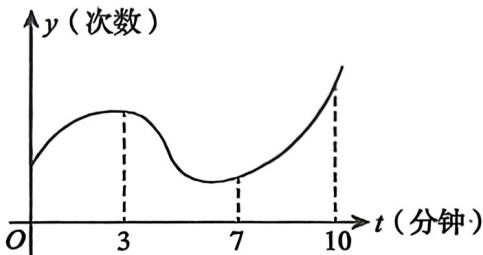

## 基础篇

# 第7章 一元函数微分学的应用（三）

# 物理应用

1. 一动点 $P$ 在曲线 $9y = 4x^{2}$ 上运动, 设坐标轴的单位长度是 $1 \mathrm{~cm}$ , 若点 $P$ 横坐标的变化率是 $30 \mathrm{~cm} / \mathrm{s}$ , 则当点 $P$ 经过点 (3,4) 时, 点 $P$ 到原点距离的变化率为

2. 设二阶可导函数 $y = f(t)$ 表示某人在 10 分钟内心跳次数的变化曲线, 如图所示. 则关于此人心跳次数的增长速度, 说法正确的是 ( )

(A) $0 \sim 3$ 分钟增速变小; $7 \sim 10$ 分钟增速变大  
(B)0~3分钟增速变大；7~10分钟增速变小  
(C) $0 \sim 3$ 分钟增速变大; $7 \sim 10$ 分钟增速变大  
(D)0~3分钟增速变小；7~10分钟增速变小

3. 已知一容器中水增加的速率为 $1 \mathrm{~m}^{3} / \mathrm{min}$ , 且水的体积 $V$ 与水面高度 $y$ 满足 $V = \frac{\pi}{2} y^{2}$ , 当水面上升到高为 $1 \mathrm{~m}$ 时, 求水面高度上升的速率.  
4. 已知某圆柱体底面半径与高随时间变化的速率分别为 $2 \mathrm{~cm} / \mathrm{s}, -3 \mathrm{~cm} / \mathrm{s}$ , 且圆柱体的体积与表面积随时间变化的速率分别为 $-100 \pi \mathrm{~cm}^{3} / \mathrm{s}, 40 \pi \mathrm{~cm}^{2} / \mathrm{s}$ , 则圆柱体的底面半径与高分别为 ( ).

(A) $5\mathrm{cm}, 5\mathrm{cm}$

(B) $10\mathrm{cm},5\mathrm{cm}$

(C) $5\mathrm{cm}$ ，10cm

(D) $10\mathrm{cm}$ , 10 cm

5. 一物体在距离同一水平面上的地面观测器 $10 \mathrm{~m}$ 处离地匀速垂直上升, 其速度为 $a \mathrm{~m} / \mathrm{s}$ . 若该物体上升到离地 $20 \mathrm{~m}$ 时, 观测器视线倾角的变化率为 $\frac{1}{10}$ , 则 $a =$ ( ).

(A)1

(B)2

(C)3

(D)5

---

## 强化篇

# 物理应用

1. 质点 $P$ 沿抛物线 $x = y^{2} (y > 0)$ 移动, $P$ 的横坐标 $x$ 的变化速度为 $5 \mathrm{~cm} / \mathrm{s}$ . 当 $x = 9$ 时, 点 $P$ 到原点 $O$ 的距离变化速度为  
2. 球的半径以 $5 \mathrm{~cm} / \mathrm{s}$ 的速度匀速增长, 当球的半径为 $50 \mathrm{~cm}$ 时, 球的表面积和体积的增长速度各是多少?  
3. 已知曲线 $L:y = \ln \sqrt{x} (2\leqslant x\leqslant 4)$ ，在 $L$ 上的任意点 $P(x,y)$ 作切线，记切线与曲线 $L$ 在 $x = 2\leqslant x\leqslant 4$ 时所围成的有界区域的面积为 $S$ ：

(1)求一点 $P_0$ ，使上述面积S关于 $\pmb{x}$ 的变化率为零；

(2) 当点 $P(x, y)$ 在曲线上移动至 $\left(\mathrm{e}, \frac{1}{2}\right)$ 时, 横坐标关于时间的变化率为 1 , 求此时面积关于时间的变化率 $\frac{\mathrm{d} S}{\mathrm{~d} t}$ .

