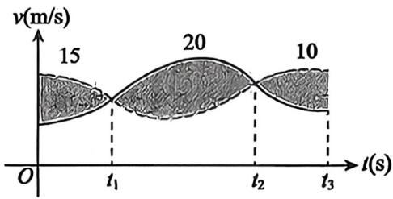

## 基础篇

# 第8章 一元函数和光学的概念与性质

1. 设函数 $f(x)$ 在区间 $[0, 1]$ 上连续，则 $\int_{0}^{1} f(x) \mathrm{d}x = (\quad)$ .

(A) $\lim_{n\to \infty}\sum_{k = 1}^{n}f\left(\frac{3k - 1}{3n}\right)\frac{1}{3n}$ (B) $\lim_{n\to \infty}\sum_{k = 1}^{n}f\left(\frac{3k - 1}{3n}\right)\frac{1}{n}$ (C) $\lim_{n\to \infty}\sum_{k = 1}^{3n}f\left(\frac{k - 1}{3n}\right)\frac{1}{n}$ (D) $\lim_{n\to \infty}\sum_{k = 1}^{3n}f\left(\frac{k}{3n}\right)\frac{3}{n}$

2. $\lim_{n\to \infty}\frac{1}{n^3}\left[\ln \frac{1}{n} +4\ln \frac{2}{n} +\dots +(n - 1)^2\ln \frac{n - 1}{n}\right] = \underline{\quad}$

3. 甲、乙两人赛跑, 图中实线和虚线分别为甲和乙的速度曲线(单位: $\mathrm{m} / \mathrm{s}$ ), 三块阴影部分面积依次为15, 20, 10, 且当 $t = 0$ 时, 甲在乙前面 $10 \mathrm{~m}$ 处, 则在 $[0, t_{3}]$ 上, 甲、乙相遇的次数为( ).

(A)1

(B)2

(C)3

(D)4

4. 设 $M = \int_{-\frac{1}{2}}^{\frac{1}{2}}\left(1 + \frac{x}{1 + x^2}\right)\mathrm{d}x, N = \int_0^1\frac{(1 + x)\ln^2(1 + x)}{x^2}\mathrm{d}x, K = \int_0^1\frac{\mathrm{e}^x}{01 + x}\mathrm{d}x$ 则（ ）

(A) $M > N > K$

(B) $N > K > M$

(C) $K > M > N$

(D) $K > N > M$

5. 设 $f(x)$ 是 $(0, +\infty)$ 内的正值连续函数，且 $f'(x) < 0$ ， $g(x) = \int_{1}^{x} f(t) \, \mathrm{d}t$ ，则 $g\left(\frac{1}{2}\right)$ 和 $g\left(\frac{3}{2}\right)$ 的可能取值是（ ）.

(A) $-2,1$

(B)-2,3

(C)2, -1

(D)2, -3

6. 设 $f(x) = \begin{cases} x \ln x, & x > 0, \\ x^2 + x, & x \leqslant 0, \end{cases}$ 若 $\int_{a}^{b} f(x) \mathrm{d}x (a < b)$ 取得最小值，则 $(a, b) = (\quad)$ .

(A) $(-1, 1)$

(B) $(-1,2)$

(C) $(0,1)$

(D) (1,2)

7. 设函数 $g(x)$ 在 $\left[0, \frac{\pi}{2}\right]$ 上连续，若在 $\left(0, \frac{\pi}{2}\right)$ 内 $g'(x) \geqslant 0$ ，则对任意的 $x \in \left(0, \frac{\pi}{2}\right)$ ，有（ ）.

(A) $\int_{x}^{\frac{\pi}{2}}g(t)\mathrm{d}t\geqslant \int_{x}^{\frac{\pi}{2}}g(\sin t)\mathrm{d}t$

(B) $\int_{x}^{1}g(t)\mathrm{d}t\leqslant \int_{x}^{1}g(\sin t)\mathrm{d}t$

(C) $\int_{x}^{1}g(t)\mathrm{d}t\geqslant \int_{x}^{1}g(\sin t)\mathrm{d}t$

(D) $\int_{x}^{\frac{\pi}{2}}g(t)\mathrm{d}t\leqslant \int_{x}^{\frac{\pi}{2}}g(\sin t)\mathrm{d}t$

8. 若 $\sqrt{1 - x^2}$ 是 $xf(x)$ 的一个原函数, 则 $\int_{0}^{1} \frac{1}{f(x)} \mathrm{d}x = (\quad)$ .

(A)-1

(B) $\frac{\pi}{4}$

(C) $-\frac{\pi}{4}$

(D)1

9. $\lim_{n\to \infty}\sum_{i = 1}^{n}\frac{1}{\sqrt{in}} = \underline{\quad}$

10. 设 $f(x)$ 是 $(- \infty, +\infty)$ 上可导的奇函数，任意的 $x \in (-\infty, +\infty)$ ，均有 $f(x + 1) - f(x) = f(1)$ ， $f\left(\frac{1}{2}\right) = 0$ ，则以下是偶函数的是（ ）.

(A) $\int_0^x [\sin f(t) + f(t + 1)]\mathrm{d}t$

(B) $\int_0^x\bigl [\sin f'(t) + f'(t + 1)\bigr ]\mathrm{d}t$

(C) $\int_0^x [\cos f(t) + f(t + 2)]\mathrm{d}t$

(D) $\int_0^x [\cos f'(t) + f'(t + 2)]\mathrm{d}t$

11. 设 $f(x)$ 是实数集上连续的偶函数，在 $(- \infty, 0)$ 上有唯一零点 $x_0 = -1$ ，且 $f'(x_0) = 1$ ，则函数 $F(x) = \int_{0}^{x} f(t) \mathrm{d}t$ 的严格单调增区间是（ ）.

(A) $(-\infty , - 1)$

(B) $(-1, +\infty)$

(C) $(-1,1)$

(D) $(1, +\infty)$

12. 设 $f(x)$ 在 $[0, 2]$ 上单调连续， $f(0) = 1$ ， $f(2) = 2$ ，且对任意 $x_1, x_2 \in [0, 2]$ 总有 $f\left(\frac{x_1 + x_2}{2}\right) > \frac{f(x_1) + f(x_2)}{2}$ ， $g(x)$ 是 $f(x)$ 的反函数， $P = \int_{1}^{2} g(x) \, \mathrm{d}x$ ，则（ ）.

(A) $3 <   P <   4$

(B) $2 <   P <   3$

(C) $1 <   P <   2$

(D) $0 < P < 1$

13. 下列反常积分中，发散的是( ).

(A) $\int_{0}^{+\infty}x\mathrm{e}^{-x}\mathrm{d}x$

(B) $\int_{-\infty}^{+\infty}x\mathrm{e}^{-x^2}\mathrm{d}x$

(C) $\int_{-\infty}^{+\infty}\frac{\arctan x}{1 + x^2}\mathrm{d}x$

(D) $\int_{-\infty}^{+\infty}\frac{x}{1 + x^2}\mathrm{d}x$

14. 若反常积分 $\int_{0}^{+\infty}\frac{\ln x}{(1 + x)x^{1 - p}}\mathrm{d}x$ 收敛, 则( ).

(A) $p < 1$

(B) $p > 1$

(C) $0 < p < 1$

(D) $0 \leqslant p < 1$

15. 下列反常积分收敛的是( ).

(A) $\int_{2}^{+\infty}\frac{1}{x\ln x}\mathrm{d}x$

(B) $\int_{0}^{+\infty}\mathrm{e}^{-x^2}\mathrm{d}x$

(C) $\int_{-1}^{1}\frac{1}{\sin x}\mathrm{d}x$

(D) $\int_0^1\frac{x}{\ln^2(1 + x)}\mathrm{d}x$

16. $\lim_{n\to \infty}\frac{1}{n^2}\left[\sqrt{n^2 - 1} +\sqrt{n^2 - 2^2} +\dots +\sqrt{n^2 - (n - 1)^2}\right] = \underline{\quad}$   
17. $\lim_{n\to \infty}\sum_{l = 1}^{n}\frac{n}{n^2 + 9l^2} = \underline{\quad}$

# 结字 考研数学题源探析经典1000题（数学一）

18. 定积分 $I = \int_{\frac{\pi}{4}}^{\frac{\pi}{2}} \frac{\sin x}{x} \, \mathrm{d}x$ 的值满足( ).

(A) $0 \leqslant I \leqslant \frac{1}{2}$

(B) $\frac{1}{2} \leqslant I \leqslant \frac{\sqrt{2}}{2}$

(C) $\frac{\sqrt{2}}{2} \leqslant I \leqslant 1$

(D) $1 \leqslant I \leqslant 2\sqrt{2}$

19. 设 $f(x) \neq 0$ 为 $(- \infty, + \infty)$ 上可导的奇函数，则下列函数为奇函数的是( ).

(A) $x^{3}\int_{0}^{x}f^{\prime}(t)\mathrm{d}t$

(B) $\int_0^x f(-t)\mathrm{d}t$

(C) $\int_0^x [f'(t) + f(t)]\mathrm{d}t$

(D) $\int_0^x |f(t)|\mathrm{d}t$

20. 设 $M = \int_{-\frac{\pi}{2}}^{\frac{\pi}{2}} \frac{x}{1 + x^2} \cos^5 x \, \mathrm{d}x$ , $N = \int_{-\frac{\pi}{2}}^{\frac{\pi}{2}} (x^2 \sin x + \sin^2 x \cos x) \, \mathrm{d}x$ , $P = \int_{-\frac{\pi}{2}}^{\frac{\pi}{2}} (\sin^3 x - \cos^4 x) \, \mathrm{d}x$ , 则有( ).

(A) $N <   P <   M$

(B) $M <   P <   N$

(C) $N <   M <   P$

(D) $P <   M <   N$

21. 设 $a, b$ 为常数， $\int_{0}^{1} \frac{\ln x}{x^a \left( \tan \frac{\pi}{2} x \right)^b} \mathrm{d}x$ 收敛，则（ ）.

(A) $a + b > 1$ 且 $b > -2$

(B) $a + b < 1$ 且 $b > -2$

(C) $a + b > 1$ 且 $b < -2$

(D) $a + b < 1$ 且 $b < -2$

22. 设 $F(x) = \int_{0}^{x}(t - [t])\mathrm{d}t$ ，其中 $[x]$ 表示不超过 $x$ 的最大整数，则 $F_{-}^{\prime}(1) - F_{+}^{\prime}(1) =$   
23. 下列命题中不成立的是( ).

(A) 若 $f(x)$ 连续, $x \in [a,b]$ , 则 $\int_{a}^{x} f(t) \mathrm{d}t$ 必为 $f(x)$ 的原函数  
(B) 若 $f(x)$ 可积, $x \in [a,b]$ , 则 $f(x)$ 在 $(a,b)$ 内存在原函数  
(C) 若 $f(x)$ 连续, 且为奇函数, $x \in [-a, a]$ , 则 $\int_{-a}^{a} f(x) \mathrm{d} x = 0$   
(D) 若 $f(x)$ 连续, $T$ 为其周期, 则 $\int_{a}^{a + T} f(x) \mathrm{d}x = \int_{0}^{T} f(x) \mathrm{d}x$

24. 设 $f(x - 5) = \frac{4}{x^2 - 10x}$ ，则 $\int_0^4 f(2x + 1)\mathrm{d}x$ （ ）

(A)为反常积分，且发散   
(B)为反常积分，且收敛   
(C)不是反常积分，且其值为10   
(D) 不是反常积分, 且其值为 $\frac{\pi}{4}$

25. 下列表达式中正确的是( ).

(A) $\int_{\pi}^{2\pi}\left|\sin x\right|\mathrm{d}x\leqslant \int_{\pi}^{2\pi}\sin^2 x\mathrm{d}x$   
(B) $\int_{-\frac{\pi}{4}}^{\frac{\pi}{4}}\frac{x}{1 + \cos x}\mathrm{d}x <   \int_{-\frac{\pi}{4}}^{\frac{\pi}{4}}\left(\frac{\sin x}{1 + x^4} +\frac{1}{1 + x^2}\right)\mathrm{d}x$   
(C) $\int_{a}^{b}f(x)\mathrm{d}x\leqslant \int_{c}^{d}f(x)\mathrm{d}x,[a,b]\subset [c,d],f(x)$ 连续， $x\in [c,d]$   
(D) $\int_{-1}^{1}\left|f(x)\right|\mathrm{d}x = 2\int_{0}^{1}\left|f(x)\right|\mathrm{d}x,f(x)$ 连续， $x\in [-1,1]$

---

## 强化篇

1. 计算 $\lim_{n\to \infty}\sum_{i = 1}^{n}\frac{1 - \cos\frac{\pi}{\sqrt{n}}}{1 + \cos\frac{i\pi}{2n}}$   
2. 设 $f(x)$ 连续，则 $\lim_{n\to \infty}\sum_{k = 1}^{n}\frac{k - \frac{1}{2} + n}{n^2} f\left(\frac{2k - 1}{2n}\right) = (\quad)$ .

(A) $\int_0^1\left(x + \frac{1}{2}\right)f(x)\mathrm{d}x$   
(B) $\int_0^1\left(x + 1 - \frac{1}{2n}\right)f\left(x - \frac{1}{2n}\right)\mathrm{d}x$   
(C) $\int_0^1 (x + 1)f(x)\mathrm{d}x$   
(D) $\int_0^1\left(x + \frac{1}{2} +\frac{1}{n}\right)f\left(x - \frac{1}{n}\right)\mathrm{d}x$

3. 设 $f(x)$ 在 $[0,1]$ 上可积，则 $\lim_{n\to \infty}\sum_{i = 0}^{n - 1}\ln \left[1 + \frac{1}{n} f\left(\frac{i}{n}\right)\right] = (\quad)$ .

(A) $\int_0^1\ln \left[1 + \frac{f(x)}{n}\right]\mathrm{d}x$

(B) $\int_0^1\ln [1 + f(x)]\mathrm{d}x$

(C) $\int_0^1 f(x)\mathrm{d}x$

(D) $\int_0^1 f^2 (x)\mathrm{d}x$

4. $I_{1} = \int_{0}^{2\pi}\frac{\sin x}{x}\mathrm{d}x,I_{2} = \int_{0}^{2\pi}\frac{\sin x}{2\pi - x}\mathrm{d}x,I_{3} = \int_{0}^{2\pi}\frac{\sin x}{x(2\pi - x)}\mathrm{d}x$ ，则（ ）

(A) $I_{3} < I_{1} < I_{2}$

(B) $I_{3} < I_{2} < I_{1}$

(C) $I_{2} < I_{3} < I_{1}$

(D) $I_{1} < I_{2} < I_{3}$

5. 设 $I_{1} = \int_{0}^{\sqrt{2\pi}} \sin x^{2} \mathrm{d}x, I_{2} = \int_{-\frac{\pi}{4} 1 + \sin x}^{\frac{\pi}{4}} \mathrm{d}x$ ，则( ).

(A) $I_{1} > 0, I_{2} > 0$   
(B) $I_{1} <   0,I_{2} <   0$   
(C) $I_{1} > 0, I_{2} < 0$   
(D) $I_{1} <   0,I_{2} > 0$

6. 设 $f(x)$ 在 $[0,1]$ 上连续， $\int_0^1 2x^2 f(x)\mathrm{d}x\geqslant \int_0^1 f^2 (x)\mathrm{d}x + \frac{1}{5}$ ，则 $f(x) =$   
7. 设 $f(x) = \int_{0}^{\left|\sin x\right|}\mathrm{e}^{t^{2}}\mathrm{d}t, g(x) = \int_{0}^{\left|x\right|}\sin t^{2}\mathrm{d}t$ ，则在 $(- \pi, \pi)$ 内（ ）.

(A) $f(x)$ 是可导的奇函数  
(B) $g(x)$ 是可导的偶函数  
(C) $f(x)$ 是奇函数且 $f^{\prime}(0)$ 不存在

(D) $g(x)$ 是偶函数且 $g^{\prime}(0)$ 不存在

8. 设 $f(x) = 3x - \sqrt{1 - x^2} \int_0^1 f^2(x) \, \mathrm{d}x$ ，求 $f(x)$ 的表达式.  
9. 设常数 $m > 0, n > 0$ ，则 $\int_{0}^{n}\sqrt{x}\left[\frac{m}{x}\right]\mathrm{d}x\left([\cdot]\right.$ 是取整符号)的敛散性( ).

(A) 仅与 $m$ 有关

(B) 仅与 $n$ 有关

(C)与 $m,n$ 均有关

(D)与 $m,n$ 均无关

10. 设 $p, q$ 为正常数，若 $\int_0^1 \frac{1}{x^p |\ln x|^q} \mathrm{d}x$ 收敛，则( ).

(A) $p < 1, q < 1$

(B) $p > 1$ ， $q <   1$

(C) $p <   1,q > 1$

(D) $p > 1$ ， $q > 1$

11. 若函数 $f(x) = \int_{2}^{+\infty}\frac{1}{t(\ln t)^{x + 1}}\mathrm{d}t$ 存在，则该函数的最小值点为 $x_0 = (\quad)$ .

(A) $-\frac{1}{\ln \ln 2}$

(B) -ln ln 2

(C) $\frac{1}{\ln 2}$

(D) In 2

12. 设 $p$ 为常数, 若反常积分 $\int_{0}^{1} \frac{\ln x}{x^p (1 - x)^{1 - p}} \mathrm{d}x$ 收敛, 则 $p$ 的取值范围是( ).

(A) $(-1,1)$

(B) $(-1,2)$

(C) $(-\infty ,1)$

(D) $(- \infty, 2)$

13. 设非负函数 $f(x)$ 在 $[0, +\infty)$ 上具有有界导数，给出以下四个命题：

① 若 $\int_{0}^{+\infty} f^{2}(x) \mathrm{d} x$ 收敛, 则 $\int_{0}^{+\infty} f(x) \mathrm{d} x$ 收敛; ② 若 $\int_{0}^{+\infty} f(x) \mathrm{d} x$ 收敛, 则 $\int_{0}^{+\infty} f^{2}(x) \mathrm{d} x$ 收敛;  
③若 $\lim_{x\to +\infty}x^{2}f(x)$ 存在，则 $\int_0^{+\infty}f(x)\mathrm{d}x$ 收敛；④若 $\int_0^{+\infty}f(x)\mathrm{d}x$ 收敛，则 $\lim_{x\to +\infty}x^{2}f(x)$ 存在.

其中，真命题的个数为（ ）.

(A) 1

(B) 2

(C) 3

(D) 4

14. 若反常积分 $\int_{1}^{+\infty}\left(\mathrm{e}^{-\cos \frac{1}{x}} - \mathrm{e}^{-1}\right)x^{k}\mathrm{d}x$ 收敛, 则 $k$ 的取值范围是  
15. 下列反常积分中发散的是( ).

(A) $\int_{0}^{+\infty}\frac{\mathrm{e}^{-x}}{\sqrt{x}}\mathrm{d}x$

(B) $\int_{0}^{+\infty}x^{2}\mathrm{e}^{-x^{2}}\mathrm{d}x$

(C) $\int_0^{+\infty}\frac{\mathrm{d}x}{x\ln^2x}$

(D) $\int_{0}^{+\infty}\frac{\mathrm{d}x}{(x + 2)\ln^2(x + 2)}$

16. 下列反常积分中收敛的是( ).

(A) $\int_{1}^{+\infty}\frac{\mathrm{d}x}{\sqrt{x^2 - 1}}$

(B) $\int_{1}^{+\infty}\frac{\mathrm{d}x}{\sqrt{x(x - 1)}}$

(C) $\int_{1}^{+\infty}\frac{\mathrm{d}x}{x^2\sqrt{x^2 - 1}}$

(D) $\int_{1}^{+\infty}\frac{\mathrm{d}x}{x(x^2 - 1)}$

17. 设 $y = y(x)$ 满足 $[(1 + x)y - 1]\mathrm{d}x + x(1 + x)\mathrm{d}y = 0, y(1) = \ln 2$ .

(1) 求 $y = y(x)$ 的表达式及定义域；  
(2) 记 $f(x) = \int_{-1}^{x} y(|t|) \, \mathrm{d}t$ ，求 $f'(0)$ 。

18. 设 $f(x) = \lim_{n \to \infty} \frac{x}{n} \left( e^{-\frac{x^2}{n^2}} + e^{-\frac{4x^2}{n^2}} + \dots + e^{-x^2} \right)$ ，求：

(1) $f(x)$ 的表达式；  
(2) 曲线 $y = \mathrm{e}^{x^2} f(x)$ 的拐点.

19. 设 $f(x) = x^{2}$ , $f[\varphi(x)] = -x^{2} + 2x + 3$ . 且 $\varphi(x) \geqslant 0$ , 则 $\lim_{n \to \infty} \frac{1}{n^{3}} \sum_{i=1}^{n} i^{2}(n - i) \cdot \frac{1}{n + \varphi(x)} =$

(A) $\frac{1}{12}$

(B) $\frac{1}{6}$

(C) $\frac{1}{3}$

(D) $\frac{2}{3}$

  
关注公众号【考研小舟】免费考研资料&无水印PDF

  
黑白&彩印都是5分/页，满4.9全国包邮下单备注：考研小舟，送草稿纸

