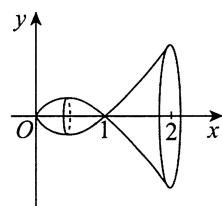
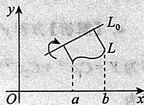
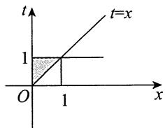

## 基础篇

# 第10章 一元函数和数学的应用（一）

# ——儿何应用

1.【答案】 $\frac{\pi}{2} -\arctan 2$

【解析】 $\int_{0}^{+\infty}\frac{\mathrm{d}x}{x^2 + 4x + 5} = \int_{0}^{+\infty}\frac{\mathrm{d}x}{(x + 2)^2 + 1} = \arctan (x + 2)\left| \begin{array}{l}+ \infty \\ 0 \end{array} \right. = \frac{\pi}{2} -\arctan 2.$

2.【答案】4

【解析】因为在 $\left[1, \mathrm{e}^{2}\right]$ 上， $y = \frac{\ln x}{\sqrt{x}} \geqslant 0$ 恒成立，所以所求面积为

$$
\begin{array}{l} \int_ {1} ^ {\mathrm {e} ^ {2}} \frac {\ln x}{\sqrt {x}} \mathrm {d} x = \int_ {1} ^ {\mathrm {e} ^ {2}} \ln x \mathrm {d} (2 \sqrt {x}) = 2 \sqrt {x} \cdot \ln x \left| _ {1} ^ {\mathrm {e} ^ {2}} - \int_ {1} ^ {\mathrm {e} ^ {2}} 2 \sqrt {x} \cdot \frac {1}{x} \mathrm {d} x \right. \\ = 4 e - 2 \int_ {1} ^ {e ^ {2}} \frac {1}{\sqrt {x}} d x = 4 e - 2 \cdot 2 \sqrt {x} \Big | _ {1} ^ {e ^ {2}} = 4 e - (4 e - 4) = 4. \\ \end{array}
$$

3.【答案】(B)

【解析】先求两条曲线的交点横坐标.由 $\left\{ \begin{array}{l}y = x(b - x),\\ y = (\sqrt{2} -1)x^2 \end{array} \right.$ 得 $x = 0$ 和 $x = \frac{b}{\sqrt{2}}$ 因此

$$
\begin{array}{l} S _ {A} = \int_ {0} ^ {\frac {b}{\sqrt {2}}} \left[ x (b - x) - (\sqrt {2} - 1) x ^ {2} \right] d x = \int_ {0} ^ {\frac {b}{\sqrt {2}}} (b x - \sqrt {2} x ^ {2}) d x \\ = \frac {b}{2} x ^ {2} \left| _ {0} ^ {\frac {b}{\sqrt {2}}} - \frac {\sqrt {2}}{3} x ^ {3} \right| _ {0} ^ {\frac {b}{\sqrt {2}}} = \frac {b ^ {3}}{4} - \frac {b ^ {3}}{6} = \frac {b ^ {3}}{1 2}, \\ S _ {A} + S _ {B} = \int_ {0} ^ {b} x (b - x) d x = \frac {b ^ {3}}{2} - \frac {b ^ {3}}{3} = \frac {b ^ {3}}{6}, \\ \end{array}
$$

所以 $S_B = \frac{b^3}{6} -\frac{b^3}{12} = \frac{b^3}{12} = S_A$

故正确选项为(B).

4.【答案】(D)

【解析】过点 $(p, \sin p)$ 的切线方程为 $y = (x - p) \cos p + \sin p$ .

令 $x = 0$ ，得 $y = -p\cos p + \sin p$ .因为 $S_{2} = \int_{0}^{p}\sin x\mathrm{d}x = 1 - \cos p$ ，而 $S_{1} + S_{2}$ 代表一个直角梯形的面积，即

$$
S _ {1} + S _ {2} = \frac {1}{2} [ \sin p + (- p \cos p + \sin p) ] p = - \frac {p ^ {2}}{2} \cos p + p \sin p,
$$

所以

$$
\begin{array}{l} \lim  _ {p \rightarrow 0 ^ {+}} \frac {S _ {2}}{S _ {1} + S _ {2}} = \lim  _ {p \rightarrow 0 ^ {+}} \frac {1 - \cos p}{- \frac {p ^ {2}}{2} \cos p + p \sin p} \\ \xlongequal {\text {洛 必 达 法 则}} \lim  _ {p \rightarrow 0 ^ {+}} \frac {\sin p}{- p \cos p + \frac {p ^ {2}}{2} \sin p + \sin p + p \cos p} \\ = \lim  _ {p \rightarrow 0 ^ {+}} \frac {\sin p}{\frac {p ^ {2}}{2} \sin p + \sin p} = \lim  _ {p \rightarrow 0 ^ {+}} \frac {1}{\frac {p ^ {2}}{2} + 1} = 1. \\ \end{array}
$$

故正确选项为(D).

# 5.【答案】 $2\pi$

【解析】平面区域如图所示，则面积为

$$
S = 2 \int_ {- \infty} ^ {+ \infty} \frac {1}{1 + x ^ {2}} d x = 4 \arctan x \Bigg | _ {0} ^ {+ \infty} = 4 \times \frac {\pi}{2} = 2 \pi .
$$

# 6.【答案】2

【解析】由题设知，平面区域 $D$ 绕 $y$ 轴旋转一周所成旋转体的体积为

$$
\begin{array}{l} V = 2 \pi \int_ {0} ^ {1} x \sin \pi x d x = - 2 \int_ {0} ^ {1} x d (\cos \pi x) = - 2 \left(x \cos \pi x \left| _ {0} ^ {1} - \int_ {0} ^ {1} \cos \pi x d x\right) \right. \\ = - 2 \left(- 1 - \frac {1}{\pi} \sin \pi x \Bigg | _ {0} ^ {1}\right) = 2. \\ \end{array}
$$

7.【答案】 $-\frac{1}{4} (e - 1)$

【分析】本题利用变限函数给出 $f(x)$ ，要求考生计算定积分 $\int_{0}^{1}f(x)\mathrm{d}x$ ，以此考查考生掌握变限积分函数的熟练程度。同时，由于 $f(x)$ 是一个初等函数与一个变限积分函数的乘积，需要考生将其整合后再利用分部积分法才能解决问题，考生也可将其转化成二重积分，交换积分次序后计算得到答案，这对考生综合利用数学知识、灵活处理数学问题的能力进行了全面的考查。

【解析】方法一 $\overline{f} = \frac{1}{1 - 0}\int_{0}^{1}f(x)\mathrm{d}x = \int_{0}^{1}\left(x\int_{1}^{x}\frac{\mathrm{e}^{t^2}}{t}\mathrm{d}t\right)\mathrm{d}x = \frac{1}{2}\int_{0}^{1}\left(\int_{1}^{x}\frac{\mathrm{e}^{t^2}}{t}\mathrm{d}t\right)\mathrm{d}(x^2)$

$$
\begin{array}{l} = \frac {1}{2} \left[ x ^ {2} \int_ {1} ^ {x} \frac {\mathrm {e} ^ {t ^ {2}}}{t} \mathrm {d} t \Bigg | _ {0} ^ {1} - \int_ {0} ^ {1} x ^ {2} \mathrm {d} \left(\int_ {1} ^ {x} \frac {\mathrm {e} ^ {t ^ {2}}}{t} \mathrm {d} t\right) \right] \\ = - \frac {1}{2} \int_ {0} ^ {1} x ^ {2} \cdot \left. \frac {\mathrm {e} ^ {x ^ {2}}}{x} \mathrm {d} x = - \frac {1}{4} \mathrm {e} ^ {x ^ {2}} \right| _ {0} ^ {1} = - \frac {1}{4} (\mathrm {e} - 1). \\ \end{array}
$$

方法二 (此方法学完二重积分再看)

$$
\begin{array}{l} \bar {f} = \frac {1}{1 - 0} \int_ {0} ^ {1} f (x) d x = \int_ {0} ^ {1} \left(x \int_ {1} ^ {x} \frac {e ^ {t ^ {2}}}{t} d t\right) d x = - \int_ {0} ^ {1} x d x \int_ {x} ^ {1} \frac {e ^ {t ^ {2}}}{t} d t \\ = - \int_ {0} ^ {1} \frac {\mathrm {e} ^ {t ^ {2}}}{t} \mathrm {d} t \int_ {0} ^ {t} x \mathrm {d} x = - \frac {1}{2} \int_ {0} ^ {1} t ^ {2} \cdot \frac {\mathrm {e} ^ {t ^ {2}}}{t} \mathrm {d} t = - \frac {1}{4} \mathrm {e} ^ {t ^ {2}} \Bigg | _ {0} ^ {1} = - \frac {1}{4} (\mathrm {e} - 1). \\ \end{array}
$$

【注】函数 $y = f(x)$ 在区间 $[a, b]$ 上的平均值是指 $\frac{1}{b - a} \int_{a}^{b} f(x) \, \mathrm{d}x$ .

8.【解析】设 $P(m, \mathrm{e}^{-m})$ ， $m \geqslant 0$ ，旋转体图像如图所示，则

$$
V = \int_ {0} ^ {m} \pi \left(\mathrm {e} ^ {- x}\right) ^ {2} \mathrm {d} x = - \frac {\pi}{2} \int_ {0} ^ {m} \mathrm {e} ^ {- 2 x} \mathrm {d} (- 2 x) = - \frac {\pi}{2} \mathrm {e} ^ {- 2 x} \Bigg | _ {0} ^ {m} = \frac {\pi}{2} (1 - \mathrm {e} ^ {- 2 m}),
$$

$$
\frac {\mathrm {d} V}{\mathrm {d} t} = \frac {\mathrm {d} V}{\mathrm {d} m} \cdot \frac {\mathrm {d} m}{\mathrm {d} t} = - \frac {\pi}{2} \mathrm {e} ^ {- 2 m} \cdot (- 2) \cdot \frac {\mathrm {d} m}{\mathrm {d} t} = \pi \mathrm {e} ^ {- 2 m} \cdot \frac {\mathrm {d} m}{\mathrm {d} t}.
$$

又 $m = 1$ 时， $\frac{\mathrm{d}m}{\mathrm{d}t} = 1$ ，故 $\left.\frac{\mathrm{d}V}{\mathrm{d}t}\right|_{m = 1} = \frac{\pi}{\mathrm{e}^2}$

9.【答案】 $\ln \frac{2\sqrt{3} + 3}{3}$

【解析】由于 $y^\prime = \cot x$ ，因此根据弧长公式，曲线 $y = \ln \sin x\left(\frac{\pi}{6}\leqslant x\leqslant \frac{\pi}{3}\right)$ 的弧长为

$$
s = \int_ {\frac {\pi}{6}} ^ {\frac {\pi}{3}} \sqrt {1 + \left(y ^ {\prime}\right) ^ {2}} d x = \int_ {\frac {\pi}{6}} ^ {\frac {\pi}{3}} \sqrt {1 + \cot^ {2} x} d x = \int_ {\frac {\pi}{6}} ^ {\frac {\pi}{3}} \csc x d x = \ln | \csc x - \cot x | \Bigg | _ {\frac {\pi}{6}} ^ {\frac {\pi}{3}} = \ln \frac {2 \sqrt {3} + 3}{3}.
$$

10.【答案】 $\sqrt{2} (\mathrm{e} - 1)$

【解析】 $s = \int_{0}^{1}\sqrt{\left[(\mathrm{e}^{\theta})^{\prime}\right]^{2} + (\mathrm{e}^{\theta})^{2}}\mathrm{d}\theta = \sqrt{2}\int_{0}^{1}\mathrm{e}^{\theta}\mathrm{d}\theta = \sqrt{2} (\mathrm{e} - 1).$

11.【答案】 $\frac{17}{12}$

【解析】由 $y^4 - 6xy + 3 = 0$ 可得 $x = \frac{1}{6} y^3 + \frac{1}{2y}$ ，故曲线 $y = y(x)$ 从点 $\left(\frac{2}{3}, 1\right)$ 到点 $\left(\frac{19}{12}, 2\right)$ 的长度为

$$
\begin{array}{l} \int_ {\frac {2}{3}} ^ {\frac {1 9}{1 2}} \sqrt {1 + \left[ y ^ {\prime} (x) \right] ^ {2}}   \mathrm {d} x   \frac {\text {换 元} , x = x (y)}{x = \frac {1}{6} y ^ {3} + \frac {1}{2 y}}   \int_ {1} ^ {2} \sqrt {1 + \left[ x ^ {\prime} (y) \right] ^ {2}}   \mathrm {d} y = \int_ {1} ^ {2} \sqrt {1 + \frac {1}{4} \left(y ^ {2} - \frac {1}{y ^ {2}}\right) ^ {2}}   \mathrm {d} y \\ = \frac {1}{2} \int_ {1} ^ {2} \sqrt {\left(y ^ {2} + \frac {1}{y ^ {2}}\right) ^ {2}} d y = \frac {1}{2} \int_ {1} ^ {2} \left(y ^ {2} + \frac {1}{y ^ {2}}\right) d y = \frac {1 7}{1 2}. \\ \end{array}
$$

# 12.【答案】(B)

【解析】先求出曲线 $y = \mathrm{e}^{x}$ 上过原点的切线，设 $(x_0, \mathrm{e}^{x_0})$ 为曲线 $y = \mathrm{e}^{x}$ 上任意一点，则该点处的切线方程为 $y - \mathrm{e}^{x_0} = \mathrm{e}^{x_0}(x - x_0)$ . 若切线过原点，则 $(0,0)$ 在切线方程上，此时 $x_0 = 1$ ，于是过原点的切线方程为 $y = \mathrm{ex}$ ，故所求的面积为 $\int_{0}^{1} (\mathrm{e}^x - \mathrm{e}x) \, \mathrm{d}x$ .

13.【答案】 $\frac{3}{4}\pi$

【解析】由旋转体的体积公式，得

$$
\begin{array}{l} V = \pi \int_ {0} ^ {+ \infty} y ^ {2} d x = \pi \int_ {0} ^ {+ \infty} \left(x ^ {2} e ^ {- x}\right) ^ {2} d x = \pi \int_ {0} ^ {+ \infty} x ^ {4} e ^ {- 2 x} d x = \frac {\pi}{2 ^ {5}} \int_ {0} ^ {+ \infty} (2 x) ^ {4} e ^ {- 2 x} d (2 x) \\ \stackrel {t = 2 x} {=} \frac {\pi}{2 ^ {5}} \int_ {0} ^ {+ \infty} t ^ {4} e ^ {- t} d t = \frac {\pi}{2 ^ {5}} \Gamma (5) = \frac {\pi}{2 ^ {5}} \cdot 4! = \frac {3}{4} \pi . \\ \end{array}
$$

14.【答案】 $\pi \left[\frac{8}{3} (\ln 2)^2 -\frac{16\ln 2}{9} +\frac{16}{27}\right]$

【解析】如图所示，所求旋转体体积为

$$
\begin{array}{l} V = \int_ {0} ^ {2} \pi (x \ln x) ^ {2} d x = \pi \int_ {0} ^ {2} x ^ {2} (\ln x) ^ {2} d x \\ = \pi \left[ \frac {1}{3} x ^ {3} (\ln x) ^ {2} \Bigg | _ {0} ^ {2} - \int_ {0} ^ {2} \frac {2}{3} x ^ {2} \ln x d x \right] \\ = \pi \left[ \frac {8}{3} (\ln 2) ^ {2} - \frac {2}{3} \left(\frac {1}{3} x ^ {3} \ln x \Big | _ {0} ^ {2} - \frac {1}{3} \int_ {0} ^ {2} x ^ {2} d x\right) \right] \\ = \pi \left[ \frac {8}{3} (\ln 2) ^ {2} - \frac {2}{3} \left(\frac {8}{3} \ln 2 - \frac {8}{9}\right) \right] \\ = \pi \left[ \frac {8}{3} (\ln 2) ^ {2} - \frac {1 6 \ln 2}{9} + \frac {1 6}{2 7} \right]. \\ \end{array}
$$

【注】由于 $\lim_{x\to 0^{+}}x\ln x = 0$ ，故不用考虑 $x = 0$ ：

15.【答案】 $\frac{1}{2}\left[\sqrt{2} +\ln (1 + \sqrt{2})\right]$

【解析】由 $\mathrm{ds} = \sqrt{1 + (y')^2}\mathrm{dx} = \sqrt{1 + x^2}\mathrm{dx}$ ，知曲线 $y = \frac{1}{2} x^{2}(0\leqslant x\leqslant 1)$ 的长度为 $s = \int_0^1\sqrt{1 + x^2}\mathrm{d}x$ 。令 $x = \tan t$ ，则

$$
s = \int_ {0} ^ {1} \sqrt {1 + x ^ {2}} d x = \int_ {0} ^ {\frac {\pi}{4}} \sec t d (\tan t)
$$

$$
\begin{array}{l} = \sec t \cdot \tan t \left| _ {0} ^ {\frac {\pi}{4}} - \int_ {0} ^ {\frac {\pi}{4}} \tan t \cdot \sec t \cdot \tan t d t \right. \\ = \sqrt {2} - \int_ {0} ^ {\frac {\pi}{4}} \sec t \cdot \sec^ {2} t d t + \int_ {0} ^ {\frac {\pi}{4}} \sec t d t \\ = \sqrt {2} - \int_ {0} ^ {\frac {\pi}{4}} \sec t d (\tan t) + \int_ {0} ^ {\frac {\pi}{4}} \sec t d t \\ = \sqrt {2} - \int_ {0} ^ {\frac {\pi}{4}} \sec t d (\tan t) + \ln (\sec t + \tan t) \left| \begin{array}{c} \frac {\pi}{4} \\ 0 \end{array} \right. \\ = \sqrt {2} - \int_ {0} ^ {\frac {\pi}{4}} \sec t d (\tan t) + \ln (1 + \sqrt {2}), \\ \end{array}
$$

得 $s = \frac{1}{2}\left[\sqrt{2} +\ln (1 + \sqrt{2})\right]$

16.【答案】(A)

【解析】 $V_{1} = \int_{1}^{\mathrm{e}}\pi \left[1 - (\ln x)^{2}\right]\mathrm{d}x = \pi \left[(\mathrm{e} - 1) - x(\ln x)^{2}\bigg|_{1}^{\mathrm{e}} + 2\int_{1}^{\mathrm{e}}\ln x\mathrm{d}x\right]$

$$
\begin{array}{l} = \pi \left(- 1 + 2 x \ln x \left| _ {1} ^ {e} - 2 \int_ {1} ^ {e} 1 d x\right) = \pi , \right. \\ V _ {2} = \int_ {1} ^ {\mathrm {e}} \pi (1 - \ln x) ^ {2} \mathrm {d} x = \pi \left[ (\mathrm {e} - 1) + \int_ {1} ^ {\mathrm {e}} (\ln x) ^ {2} \mathrm {d} x - 2 \int_ {1} ^ {\mathrm {e}} \ln x \mathrm {d} x \right] = \pi (2 \mathrm {e} - 5), \\ \end{array}
$$

因此 $V_{1} > \frac{\pi}{2} > V_{2}$

17.【答案】 $\frac{\pi}{6} (17\sqrt{17} -5\sqrt{5})$

【解析】 $x = \sqrt{y},\frac{\mathrm{d}x}{\mathrm{d}y} = \frac{1}{2\sqrt{y}},$

$$
\begin{array}{l} S = \int_ {1} ^ {4} 2 \pi x \sqrt {1 + \left(\frac {\mathrm {d} x}{\mathrm {d} y}\right) ^ {2}} \mathrm {d} y = \int_ {1} ^ {4} 2 \pi \sqrt {y} \sqrt {1 + \frac {1}{4 y}} \mathrm {d} y = 2 \pi \int_ {1} ^ {4} \sqrt {y + \frac {1}{4}} \mathrm {d} y \\ = 2 \pi \cdot \frac {2}{3} \left(y + \frac {1}{4}\right) ^ {\frac {3}{2}} \Bigg | _ {1} ^ {4} = \frac {\pi}{6} (1 7 \sqrt {1 7} - 5 \sqrt {5}). \\ \end{array}
$$

18.【答案】 $\frac{1}{4}\pi$

【解析】所求的平均值为 $\int_{0}^{1}\frac{x^2}{\sqrt{1 - x^2}}\mathrm{d}x$

令 $x = \sin \theta$ ，则

$$
\text {上 式} = \int_ {0} ^ {\frac {\pi}{2}} \sin^ {2} \theta \mathrm {d} \theta = \left(\frac {1}{2}   \theta - \frac {1}{4}   \sin 2 \theta\right) \Bigg | _ {0} ^ {\frac {\pi}{2}} = \frac {1}{4}   \pi    .
$$

19.【解析】(1)设 $D$ 的面积为 $S$ ，则

$$
\begin{array}{l} S = \int_ {\sqrt {2}} ^ {2} \frac {\sqrt {x ^ {2} - 1}}{x ^ {2}} \mathrm {d} x \stackrel {x = \sec t} {=} \int_ {\frac {\pi}{4}} ^ {\frac {\pi}{3}} \frac {\tan t}{\sec^ {2} t} \sec t \tan t \mathrm {d} t = \int_ {\frac {\pi}{4}} ^ {\frac {\pi}{3}} \frac {\tan^ {2} t}{\sec t} \mathrm {d} t \\ = \int_ {\frac {\pi}{4}} ^ {\frac {\pi}{3}} \frac {\sin^ {2} t}{\cos t} d t = \int_ {\frac {\pi}{4}} ^ {\frac {\pi}{3}} \frac {1 - \cos^ {2} t}{\cos t} d t = \int_ {\frac {\pi}{4}} ^ {\frac {\pi}{3}} (\sec t - \cos t) d t \\ = \ln \left| \sec t + \tan t \right| \left| \frac {\frac {\pi}{3}}{\frac {\pi}{4}} - \sin t \right| \left| \frac {\frac {\pi}{3}}{\frac {\pi}{4}} = \ln \frac {2 + \sqrt {3}}{1 + \sqrt {2}} - \frac {\sqrt {3} - \sqrt {2}}{2} \right. \\ = \ln \left[ (\sqrt {3} + 2) (\sqrt {2} - 1) \right] - \frac {\sqrt {3} - \sqrt {2}}{2}. \\ \end{array}
$$

(2)由旋转体的体积公式知

$$
\begin{array}{l} V = \pi \int_ {\sqrt {2}} ^ {2} \left(\frac {\sqrt {x ^ {2} - 1}}{x ^ {2}}\right) ^ {2} d x = \pi \int_ {\sqrt {2}} ^ {2} \frac {x ^ {2} - 1}{x ^ {4}} d x = \pi \int_ {\sqrt {2}} ^ {2} \left(\frac {1}{x ^ {2}} - \frac {1}{x ^ {4}}\right) d x \\ = \pi \left(- \frac {1}{x} + \frac {1}{3 x ^ {3}}\right) \Bigg | _ {\sqrt {2}} ^ {2} = \pi \left(\frac {5}{6 \sqrt {2}} - \frac {1 1}{2 4}\right) = \frac {1 0 \sqrt {2} - 1 1}{2 4} \pi . \\ \end{array}
$$

  
关注公众号【考研小舟】免费考研资料&无水印PDF

  
黑白&彩印都是5分/页，满4.9全国包邮下单备注：考研小舟，送草稿纸

---

## 强化篇

# ——儿何应用

1.【答案】 $\frac{\mathrm{e}}{2}$

【解析】方程 $\mathrm{e}^{y} + xy + x^{3} = \mathrm{e}$ 两边对 $x$ 求导，得

$$
\mathrm {e} ^ {y} y ^ {\prime} + y + x y ^ {\prime} + 3 x ^ {2} = 0.
$$

将 $x = 0, y = 1$ 代入上式，得 $y'(0) = -\frac{1}{e}$ . 于是，曲线在点 $(0,1)$ 处的切线方程为 $y = 1 - \frac{1}{e} x$ . 切线与两坐标轴的交点分别为 $(e,0)$ 与 $(0,1)$ ，故曲线在点 $(0,1)$ 处的切线与两坐标轴所围成的三角形的面积为 $\frac{e}{2}$ .

2.【答案】 $\frac{\pi}{6}$

【解析】 $S = \frac{1}{2}\int_{0}^{\frac{\pi}{6}}(2\cos 3\theta)^{2}\mathrm{d}\theta = 2\int_{0}^{\frac{\pi}{6}}\cos^{2}3\theta \mathrm{d}\theta$

$$
\frac {t = 3 \theta}{2} \int_ {0} ^ {\frac {\pi}{2}} \cos^ {2} t d t = \frac {2}{3} \times \frac {1}{2} \times \frac {\pi}{2} = \frac {\pi}{6}.
$$

# 3.【答案】2

【解析】设所围成图形面积为 $S$ ，则

$$
\begin{array}{l} S = 2 \int_ {0} ^ {\pi} \frac {1}{2} r ^ {2} (\theta) \mathrm {d} \theta = \int_ {0} ^ {\pi} a ^ {2} (1 + \cos \theta) ^ {2} \mathrm {d} \theta \\ = a ^ {2} \int_ {0} ^ {\pi} \left(\frac {3}{2} + 2 \cos \theta + \frac {1}{2} \cos 2 \theta\right) d \theta \\ = a ^ {2} \left(\frac {3}{2} \theta + 2 \sin \theta + \frac {1}{4} \sin 2 \theta\right) \Bigg | _ {0} ^ {\pi} = \frac {3}{2} \pi a ^ {2}, \\ \end{array}
$$

又由于 $S = 6\pi$ ， $a > 0$ ，故 $a = 2$ ：

4.【解析】方程 $y'' + 3y' + 2y = e^{-x}$ 为二阶常系数非齐次线性微分方程，其相应的齐次方程的通解为 $Y = C_1 e^{-x} + C_2 e^{-2x}$ ，可设原方程的一个特解为 $y^* = A x e^{-x}$ ，代入原方程得 $A = 1$ . 故原方程的通解为

$$
y = C _ {1} \mathrm {e} ^ {- x} + C _ {2} \mathrm {e} ^ {- 2 x} + x \mathrm {e} ^ {- x}. \tag {①}
$$

①式对 $x$ 求导得

$$
y ^ {\prime} = - C _ {1} \mathrm {e} ^ {- x} - 2 C _ {2} \mathrm {e} ^ {- 2 x} + (1 - x) \mathrm {e} ^ {- x}. \tag {②}
$$

由函数 $y = y(x)$ 连续及条件 $\lim_{x\to 0}\frac{y(x)}{x} = 1$ ，得

$$
y (0) = \lim  _ {x \rightarrow 0} y (x) = 0, y ^ {\prime} (0) = \lim  _ {x \rightarrow 0} \frac {y (x) - y (0)}{x - 0} = \lim  _ {x \rightarrow 0} \frac {y (x)}{x} = 1,
$$

将其代入 ① 式及 ② 式，得 $C_1 = C_2 = 0$ ，故曲线方程为 $y = x\mathrm{e}^{-x}$

如图所示，所求面积为

$$
\begin{array}{l} S = \int_ {0} ^ {+ \infty} y (x) d x = \int_ {0} ^ {+ \infty} x e ^ {- x} d x = - \int_ {0} ^ {+ \infty} x d \left(e ^ {- x}\right) \\ = - x \mathrm {e} ^ {- x} \Big | _ {0} ^ {+ \infty} + \int_ {0} ^ {+ \infty} \mathrm {e} ^ {- x} \mathrm {d} x = - \left. \mathrm {e} ^ {- x} \right| _ {0} ^ {+ \infty} = 1. \\ \end{array}
$$

所求体积为

$$
\begin{array}{l} V = \int_ {0} ^ {+ \infty} 2 \pi x y (x) d x = 2 \pi \int_ {0} ^ {+ \infty} x ^ {2} e ^ {- x} d x = - 2 \pi \int_ {0} ^ {+ \infty} x ^ {2} d \left(e ^ {- x}\right) \\ = - 2 \pi x ^ {2} e ^ {- x} \Big | _ {0} ^ {+ \infty} + 4 \pi \int_ {0} ^ {+ \infty} x e ^ {- x} d x = 4 \pi . \\ \end{array}
$$

5.【答案】 $\frac{\sqrt{2}}{60}\pi$

【解析】 $y = \sqrt{x}$ 与 $y = x^2 (x \geqslant 0)$ 互为反函数，两个函数的图像关于直线 $y = x$ 对称，故只需计算其中一条曲线段绕 $y = x$ 旋转一周所得旋转体的体积即可.

取曲线 $y = x^2$ 进行计算：

$$
\begin{array}{l} V \stackrel {(*)} {=} \frac {\pi}{(1 + 1) ^ {\frac {3}{2}}} \int_ {0} ^ {1} (x - x ^ {2}) ^ {2} | 2 x + 1 | d x \\ = \frac {\pi}{2 \sqrt {2}} \int_ {0} ^ {1} (2 x ^ {5} - 3 x ^ {4} + x ^ {2}) d x \\ = \frac {\pi}{2 \sqrt {2}} \left(2 \times \frac {1}{6} - 3 \times \frac {1}{5} + \frac {1}{3}\right) = \frac {\sqrt {2}}{6 0} \pi . \\ \end{array}
$$

【注】(*)处来源于以下结论(见《考研数学基础30讲·高等数学分册》).

设平面曲线 $L:y = f(x)$ ， $a\leqslant x\leqslant b$ ，且 $f(x)$ 可导.

定直线 $L_{0}:Ax + By + C = 0$ ，且过 $L_{0}$ 的任一条垂线与 $L$ 至多有一个交点，如图所示，则 $L$ 绕 $L_{0}$ 旋转一周所得旋转体的体积为

$$
V = \frac {\pi}{\left(A ^ {2} + B ^ {2}\right) ^ {\frac {3}{2}}} \int_ {a} ^ {b} [ A x + B f (x) + C ] ^ {2} | A f ^ {\prime} (x) - B | d x.
$$

6.【解析】设切点坐标为 $P(x_0,y_0)$ ，于是曲线 $y = \mathrm{e}^{x}$ 在点 $P$ 处的切线斜率为 $y^\prime (x_0) = \mathrm{e}^{x_0}$ ，切线方程为 $y - y_{0} = \mathrm{e}^{x_{0}}(x - x_{0})$ ：

因为它经过点 $O(0,0)$ ，所以 $-y_{0} = -x_{0}\mathrm{e}^{x_{0}}$ 。又因 $y_{0} = \mathrm{e}^{x_{0}}$ ，代入求得 $x_{0} = 1$ ，从而 $y_{0} = \mathrm{e}^{x_{0}} = \mathrm{e}$ ，切线方程为 $y = \mathrm{ex}$ ，如图所示。

(1) $D$ 的面积为

$$
S = \int_ {- \infty} ^ {0} \mathrm {e} ^ {x} \mathrm {d} x + \int_ {0} ^ {1} (\mathrm {e} ^ {x} - \mathrm {e} x) \mathrm {d} x = \left. \mathrm {e} ^ {x} \right| _ {- \infty} ^ {0} + \left(\left. \mathrm {e} ^ {x} - \frac {\mathrm {e}}{2} x ^ {2} \right.\right) \Bigg | _ {0} ^ {1} = \frac {\mathrm {e}}{2}.
$$

(2) $D$ 绕直线 $x = 1$ 旋转一周所成旋转体的体积微元为

$$
\mathrm {d} V = \left[ \pi (1 - \ln y) ^ {2} - \pi \left(1 - \frac {y}{\mathrm {e}}\right) ^ {2} \right] \mathrm {d} y,
$$

从而 $V = \pi \int_{0}^{\mathrm{e}}\left(\ln^{2}y - 2\ln y + \frac{2y}{\mathrm{e}} -\frac{y^{2}}{\mathrm{e}^{2}}\right)\mathrm{d}y = \frac{5}{3}\pi \mathrm{e}.$

7.【解析】 $y = \mathrm{e}^{-\frac{x}{2}}\sqrt{\sin x},x\in [2k\pi ,(2k + 1)\pi ],k = 0,1,2,\dots ,$ 体积 $V = \sum_{k = 0}^{\infty}V_{k}$ ，其中

$$
\begin{array}{l} V _ {k} = \int_ {2 k \pi} ^ {(2 k + 1) \pi} \pi y ^ {2} d x = \int_ {2 k \pi} ^ {(2 k + 1) \pi} \pi e ^ {- x} \sin x d x \\ = \frac {1}{2} \pi (1 + e ^ {- \pi}) e ^ {- 2 k \pi}, k = 0, 1, 2, \dots , \\ \end{array}
$$

故 $V = \sum_{k=0}^{\infty} \frac{1}{2} \pi (1 + \mathrm{e}^{-\pi}) \mathrm{e}^{-2k\pi} = \frac{1}{2} \pi (1 + \mathrm{e}^{-\pi}) \sum_{k=0}^{\infty} \mathrm{e}^{-2k\pi}$

$$
\stackrel {(*)} {=} \frac {1}{2} \pi (1 + e ^ {- \pi}) \frac {1}{1 - e ^ {- 2 \pi}} = \frac {\pi}{2 (1 - e ^ {- \pi})},
$$

其中 $(\ast)$ 处来自无穷递缩等比数列求和公式： $\frac{\text{首项}}{1 - \text{公比}} (|\text{公比}| < 1)$ .

8.【解析】 $y = ax^{2} (x \geqslant 0)$ 与 $y = 1 - x^{2}$ 的交点为 $A\left(\frac{1}{\sqrt{1 + a}}, \frac{a}{1 + a}\right)$ . 直线 $OA$ 的方程为 $y = \frac{a}{\sqrt{1 + a}} x$ .

(1)旋转体体积

$$
V (a) = \pi \int_ {0} ^ {\frac {1}{\sqrt {1 + a}}} \left(\frac {a ^ {2}}{1 + a} x ^ {2} - a ^ {2} x ^ {4}\right) d x = \frac {2 \pi a ^ {2}}{1 5 (1 + a) ^ {\frac {5}{2}}}.
$$

(2) $\frac{\mathrm{d}[V(a)]}{\mathrm{d}a} = \frac{2\pi}{15} \cdot \frac{2a(1 + a)^{\frac{5}{2}} - a^{2} \cdot \frac{5}{2}(1 + a)^{\frac{3}{2}}}{(1 + a)^{5}} = \frac{\pi(4a - a^{2})}{15(1 + a)^{\frac{7}{2}}}$ .

由 $a > 0$ ，得 $V(a)$ 的唯一驻点 $a = 4$ .当 $0 < a < 4$ 时， $V^{\prime}(a) > 0$ ，当 $a > 4$ 时， $V^{\prime}(a) < 0$ .故 $a = 4$ 为 $V(a)$ 的唯一极大值点，为最大值点.

9.【解析】在 $x\neq 0$ 处， $\left[\frac{f(x)}{x}\right]' = \frac{xf'(x) - f(x)}{x^2} = 1$ ，结合连续性得

$$
f (x) = x ^ {2} + C x (x \in [ 0, 1 ]) ,
$$

故 $\int_0^1\left|x^2 +Cx\right|\mathrm{d}x = 2$

当 $C \geqslant 0$ 时，解得 $C = \frac{10}{3}$ ，则 $f(x) = x^{2} + \frac{10}{3} x$ ，从而 $V = \int_{0}^{1} \pi f^{2}(x) \, \mathrm{d}x = \frac{752}{135} \pi$ ；

当 $-1 < C < 0$ 时，不符合题意；

当 $C \leqslant -1$ 时，解得 $C = -\frac{14}{3}$ ，则 $f(x) = x^{2} - \frac{14}{3}x$ ，从而 $V = \int_{0}^{1} \pi f^{2}(x) \, \mathrm{d}x = \frac{692}{135} \pi$ 。

综上，共有两组符合题意的解。

10.【答案】 $\frac{\mathrm{e}^2 + 1}{2(\mathrm{e}^2 - 1)}$

【解析】区间 $[k, k + 1](k = 0, 1, 2, \dots)$ 上的阴影面积等于矩形面积减去曲边梯形的面积，即

$$
\mathrm {e} ^ {- 2 k} - \int_ {k} ^ {k + 1} \mathrm {e} ^ {- 2 x} \mathrm {d} x = \mathrm {e} ^ {- 2 k} + \frac {1}{2} \mathrm {e} ^ {- 2 x} \left| _ {k} ^ {k + 1} = \mathrm {e} ^ {- 2 k} + \frac {1}{2} \mathrm {e} ^ {- 2 k - 2} - \frac {1}{2} \mathrm {e} ^ {- 2 k} = \left(\frac {1}{2} + \frac {1}{2 \mathrm {e} ^ {2}}\right) \mathrm {e} ^ {- 2 k}, \right.
$$

而 $\sum_{k=0}^{\infty} e^{-2k} = \frac{1}{1 - e^{-2}}$ ，故 $S = \left(\frac{1}{2} + \frac{1}{2e^2}\right)\frac{1}{1 - e^{-2}} = \frac{e^2 + 1}{2e^2} \cdot \frac{e^2}{e^2 - 1} = \frac{e^2 + 1}{2(e^2 - 1)}$ .

11.【解析】解题干给的一阶线性微分方程，有

$$
\begin{array}{l} y = \mathrm {e} ^ {- \int p \mathrm {d} x} \left(\int \mathrm {e} ^ {\int p \mathrm {d} x} q \mathrm {d} x + C\right) \\ = \mathrm {e} ^ {- x} \left(\int \mathrm {e} ^ {x} \frac {\mathrm {e} ^ {- x} \cos x}{2 \sqrt {\sin x}} \mathrm {d} x + C\right) = \mathrm {e} ^ {- x} \left(\int \frac {\cos x}{2 \sqrt {\sin x}} \mathrm {d} x + C\right) \\ = \mathrm {e} ^ {- x} \left[ \int \frac {\mathrm {d} (\sin x)}{2 \sqrt {\sin x}} + C \right] = \mathrm {e} ^ {- x} (\sqrt {\sin x} + C), \\ \end{array}
$$

又 $f(\pi) = \mathrm{e}^{-\pi}\cdot C = 0$ ，故 $C = 0$ ，得

$$
f (x) = \mathrm {e} ^ {- x} \sqrt {\sin x} (x \geqslant 0).
$$

故旋转体体积为

$$
\begin{array}{l} V = \sum_ {n = 0} ^ {\infty} \pi \int_ {2 n \pi} ^ {(2 n + 1) \pi} e ^ {- 2 x} \sin x d x = \sum_ {n = 0} ^ {\infty} \pi \frac {\left| \begin{array}{c c} (e ^ {- 2 x}) ^ {\prime} & (\sin x) ^ {\prime} \\ e ^ {- 2 x} & \sin x \end{array} \right|}{(- 2) ^ {2} + 1 ^ {2}} \Bigg | _ {2 n \pi} ^ {(2 n + 1) \pi} \\ = \frac {\pi}{5} \sum_ {n = 0} ^ {\infty} (- 2 \sin x - \cos x) e ^ {- 2 x} \left| _ {2 n \pi} ^ {(2 n + 1) \pi} = \frac {\pi}{5} \sum_ {n = 0} ^ {\infty} \left(e ^ {- 4 n \pi} \cdot e ^ {- 2 \pi} + e ^ {- 4 n \pi}\right) \right. \\ = \frac {\pi \left(1 + e ^ {- 2 \pi}\right)}{5} \sum_ {n = 0} ^ {\infty} e ^ {- 4 n \pi} = \frac {\pi \left(1 + e ^ {- 2 \pi}\right)}{5} \cdot \frac {1}{1 - e ^ {- 4 \pi}} = \frac {\pi}{5 \left(1 - e ^ {- 2 \pi}\right)}. \\ \end{array}
$$

12.【解析】令 $x^{2} - t^{2} = u$ ，则

$$
\begin{array}{l} \int_ {0} ^ {x} t f \left(x ^ {2}\right) f \left(x ^ {2} - t ^ {2}\right) \mathrm {d} t = f \left(x ^ {2}\right) \left[ - \frac {1}{2} \int_ {x ^ {2}} ^ {0} f (u) \mathrm {d} u \right] \\ = \frac {1}{2} f (x ^ {2}) \int_ {0} ^ {x ^ {2}} f (u) \mathrm {d} u, \\ \end{array}
$$

于是有 $f(x^{2})\int_{0}^{x^{2}}f(u)\mathrm{d}u = 2\sin^{2}x^{2}$ ，再令 $x^{2} = \nu$ ，有 $f(\nu)\int_{0}^{\nu}f(u)\mathrm{d}u = 2\sin^{2}\nu$ 。

又令 $F(v) = \int_{0}^{v}f(u)\mathrm{d}u$ ， $F(0) = 0$ ，于是

$$
F (v) F ^ {\prime} (v) = 2 \sin^ {2} v,
$$

上式在 $[0, \pi]$ 上对 $\nu$ 作积分，有

$$
\begin{array}{l} \int_ {0} ^ {\pi} F (v) F ^ {\prime} (v) \mathrm {d} v = \int_ {0} ^ {\pi} F (v) \mathrm {d} [ F (v) ] \\ = \frac {1}{2} F ^ {2} (\nu) \Bigg | _ {0} ^ {\pi} = 2 \int_ {0} ^ {\pi} \sin^ {2} \nu \mathrm {d} \nu = \pi , \\ \end{array}
$$

故 $F(\pi) = \sqrt{2\pi}$ ，则 $f(x)$ 在 $[0, \pi]$ 上的平均值为 $\frac{1}{\pi} \int_{0}^{\pi} f(x) \mathrm{d}x = \sqrt{\frac{2}{\pi}}$ 。

【注】① 连续函数 $f(x)$ 的一个原函数表达形式常写为 $F(x) = \int_{0}^{x} f(u) \, \mathrm{d}u$ ，考生须熟知。见到 $f(x) \int_{0}^{x} f(u) \, \mathrm{d}u$ ，一般令 $F(x) = \int_{0}^{x} f(u) \, \mathrm{d}u$ ，这样便有 $F'(x) = f(x)$ ，即得 $F'(x)F(x)$ ，于是 $\int F'(x) F(x) \, \mathrm{d}x = \int F(x) \, \mathrm{d}[F(x)] = \frac{1}{2} F^2(x) + C$ ，此思路非常重要。

②平均值是考研重点.

13.【答案】 $\frac{1}{\mathrm{e} + 1}$

【解析】由题可知， $f(x) = \left(\frac{1}{1 + \mathrm{e}^{\frac{1}{x}}}\right)^{\prime}$ ，故

  
关注公众号【考研小舟】免费考研资料&无水印PDF

  
黑白&彩印都是5分/页，满4.9全国包邮下单备注：考研小丹，送草稿纸

$$
\begin{array}{l} \bar {f} = \frac {1}{2} \int_ {- 1} ^ {1} \left(\frac {1}{1 + e ^ {\frac {1}{x}}}\right) ^ {\prime} d x = \frac {1}{2} \int_ {- 1} ^ {0} \left(\frac {1}{1 + e ^ {\frac {1}{x}}}\right) ^ {\prime} d x + \frac {1}{2} \int_ {0} ^ {1} \left(\frac {1}{1 + e ^ {\frac {1}{x}}}\right) ^ {\prime} d x \\ = \frac {1}{2} \frac {1}{1 + e ^ {\frac {1}{x}}} \left| _ {- 1} ^ {0 ^ {-}} + \frac {1}{2} \frac {1}{1 + e ^ {\frac {1}{x}}} \right| _ {0 ^ {+}} ^ {1} = \frac {1}{2} \left(1 - \frac {e}{e + 1}\right) + \frac {1}{2} \left(\frac {1}{e + 1} - 0\right) = \frac {1}{e + 1}. \\ \end{array}
$$

【注】若 $f(x)$ 在 $[a,b]$ 上除点 $c\in (a,b)$ 外均连续， $c$ 为其间断点， $F(x)$ 是 $f(x)$ 在 $[a,c)$ 与 $\left(c,b\right]$ 上的原函数，则 $\int_{a}^{b}f(x)\mathrm{d}x = F(x)\big|_{a}^{c^{-}} + F(x)\big|_{c^{+}}^{b}$ .若 $\lim_{x\to c^{-}}F(x)$ 与 $\lim_{x\to c^{+}}F(x)$ 均存在，则 $\int_{a}^{b}f(x)\mathrm{d}x$ 存在.

14.【答案】 $-\frac{2}{\pi}$

【解析】由题可知， $f(x) = \int_{a}^{x}\frac{\sin\pi t}{t}\mathrm{d}t$ ，且 $t\in (0,1)$ ，于是 $a$ 与 $x$ 均属于[0,1].当 $t\in (0,1)$ 时， $\frac{\sin\pi t}{t} >0$ ，故要使 $f(1) = 0$ ，则 $f(1)$ 上下限必相等，即 $a = 1$ ，故 $f(x) = \int_{1}^{x}\frac{\sin\pi t}{t}\mathrm{d}t$ ，可得 $f(x)$ 在区间[0,1]上的平均值为

$$
\begin{array}{l} \frac {1}{1 - 0} \int_ {0} ^ {1} f (x) d x = \int_ {0} ^ {1} d x \int_ {1} ^ {x} \frac {\sin \pi t}{t} d t = - \int_ {0} ^ {1} d t \int_ {0} ^ {t} \frac {\sin \pi t}{t} d x \\ = - \int_ {0} ^ {1} \sin \pi t d t = - \frac {2}{\pi}, \\ \end{array}
$$

积分区域如图所示.

15.【答案】2

【解析】因为 $\int_0^1 f(xt)\mathrm{d}t\stackrel {tx = u}{=}\frac{1}{x}\int_0^x f(u)\mathrm{d}u$ ，所以原方程等价于 $f(x)\int_0^x f(u)\mathrm{d}u = 2x^3$

令 $\int_0^x f(u)\mathrm{d}u = F(x)$ ，则原方程又等价于 $F^{\prime}(x)F(x) = 2x^{3}$ ，两边积分，得 $F^2 (x) = x^4 +C$ .由于 $F(0) = 0$ ,故 $F^2 (x) = x^4$ ,即 $\left[\int_0^x f(u)\mathrm{d}u\right]^2 = x^4$ .令 $x = 2$ ，并注意到 $f(x)$ 非负，得 $\int_0^2 f(u)\mathrm{d}u = 4$ .因此，

函数 $f(x)$ 在 $[0,2]$ 上的平均值为 $\frac{1}{2 - 0}\int_{0}^{2}f(u)\mathrm{d}u = 2$

16.【答案】4

【解析】令 $x(t - 1) = u$ ，则 $\int_{1}^{2}f(xt - x)\mathrm{d}t = \frac{1}{x}\int_{0}^{x}f(u)\mathrm{d}u$ ，所以 $f(x)\int_0^x f(u)\mathrm{d}u = 2x^3$ .记 $F(x) = \int_0^x f(u)\mathrm{d}u$ ， $F^{\prime}(x) = f(x)\geqslant 0$ ，则 $F(x)$ 是 $[0,3]$ 上单调不减的可导函数，满足 $\frac{\mathrm{d}}{\mathrm{d}x}\left[F^2 (x)\right] = 4x^3$ ，所以 $F^2 (x) = x^4 +C.$ 因为 $F(0) = 0$ ，所以 $C = 0$ ， $F(x) = x^{2}$ .于是， $f(x)$ 在区间[1,3]上的平均值为

$$
\frac {1}{3 - 1} \int_ {1} ^ {3} f (x) d x = \frac {1}{2} [ F (3) - F (1) ] = \frac {1}{2} (9 - 1) = 4.
$$

17.【答案】 $\frac{1}{3\pi}$

【解析】 $f(x)$ 在区间 $\left[0, \frac{3\pi}{2}\right]$ 上的平均值为

$$
\begin{array}{l} \bar {f} = \frac {2}{3 \pi} \int_ {0} ^ {\frac {3 \pi}{2}} f (x) d x = \frac {2}{3 \pi} \int_ {0} ^ {\frac {3 \pi}{2}} \left(\int_ {0} ^ {x} \frac {\cos t}{2 t - 3 \pi} d t\right) d x \\ = \frac {2}{3 \pi} \int_ {0} ^ {\frac {3 \pi}{2}} d t \int_ {t} ^ {\frac {3 \pi}{2}} \frac {\cos t}{2 t - 3 \pi} d x = - \frac {1}{3 \pi} \int_ {0} ^ {\frac {3 \pi}{2}} \cos t d t = \frac {1}{3 \pi}, \\ \end{array}
$$

积分区域如图所示.

18.【分析】因被积函数 $t|t|$ 是奇函数，故 $f(x)$ 是偶函数.由 $f^{\prime}(x)$ 的符号知，曲线 $y = f(x)$ 与 $x$ 轴只有两个交点，再由定积分的几何意义，即可求出封闭图形的面积.

【解析】由 $t|t|$ 为奇函数知，其原函数 $f(x) = \int_{-1}^{x} t|t| \, \mathrm{d}t$ 为偶函数，而 $f(-1) = 0$ ， $f(1) = 0$ ，即曲线 $y = f(x)$ 与 $x$ 轴的交点为 $(-1,0)$ ， $(1,0)$ ：

当 $x < 0$ 时， $f'(x) = x|x| < 0$ ，故 $f(x)$ 单调减少，从而当 $-1 < x < 0$ 时， $f(x) < f(-1) = 0$ ：

当 $x > 0$ 时， $f'(x) = x|x| > 0$ ，故 $f(x)$ 单调增加，从而当 $x > 1$ 时， $f(x) > f(1) = 0$ ，因此曲线 $y = f(x)$ 与 $x$ 轴的交点只有两个。

当 $x < 0$ 时， $f(x) = \int_{-1}^{x} t |t| \, \mathrm{d}t = \int_{-1}^{x} (-t^2) \, \mathrm{d}t = -\frac{1}{3} (1 + x^3)$ ，故所求图形的面积为

$$
S = \left| \int_ {- 1} ^ {1} f (x) d x \right| = 2 \left| \int_ {- 1} ^ {0} f (x) d x \right| = 2 \left| \int_ {- 1} ^ {0} \frac {- 1}{3} \left(1 + x ^ {3}\right) d x \right| = \frac {1}{2}.
$$

19.【解析】由 $f^{\prime}(x) = 2\sqrt{f(x)}$ ，有 $\int \frac{\mathrm{d}[f(x)]}{2\sqrt{f(x)}} = \int \mathrm{d}x$ ，得 $\sqrt{f(x)} = x + C_1$ ，因 $f(0) = 1$ ，则 $C_1 = 1$ 故 $f(x) = (x + 1)^2$ ：

由 $g^{\prime}(x) = \frac{g(x)}{x - 2} +\frac{x - 2}{x}$ ，有

$$
\begin{array}{l} g (x) = \mathrm {e} ^ {\int \frac {1}{x - 2} \mathrm {d} x} \left(\int \mathrm {e} ^ {- \int \frac {1}{x - 2} \mathrm {d} x} \cdot \frac {x - 2}{x} \mathrm {d} x + C _ {2}\right) \\ = (x - 2) \left(\int \frac {1}{x} d x + C _ {2}\right) = (x - 2) \left(\ln x + C _ {2}\right). \\ \end{array}
$$

又因 $g(1) = 0$ ，有 $C_2 = 0$ ，故 $g(x) = (x - 2)\ln x$ ：

因此，曲线方程为 $(x + 1)^2 = (2 - y)\ln y(1\leqslant y < 2)$ ，其绕 $x = -1$ 旋转一周所得旋转体体积为

$$
V = \pi \int_ {1} ^ {2} (x + 1) ^ {2} d y = \pi \int_ {1} ^ {2} (2 - y) \ln y d y = \left(2 \ln 2 - \frac {5}{4}\right) \pi .
$$

20.【解析】先求切线方程，由 $\sqrt{x} +\sqrt{y} = 1$ ，两边对 $x$ 求导，得

$$
\frac {1}{2 \sqrt {x}} + \frac {1}{2 \sqrt {y}} y ^ {\prime} = 0, y ^ {\prime} = - \frac {\sqrt {y}}{\sqrt {x}} = 1 - \frac {1}{\sqrt {x}}.
$$

故在 $x = a$ 处的切线方程为 $y - (1 - \sqrt{a})^2 = \left(1 - \frac{1}{\sqrt{a}}\right)(x - a)$

切线与两坐标轴的交点坐标为 $A(\sqrt{a},0)$ ， $B(0,1 - \sqrt{a})$ ，如图所示.

由圆锥体的体积公式可得

$$
V _ {y} = \frac {\pi}{3} (\sqrt {a}) ^ {2} (1 - \sqrt {a}) = \frac {\pi}{3} \left(a - a ^ {\frac {3}{2}}\right),
$$

$$
V _ {y} ^ {\prime} = \frac {\pi}{3} \left(1 - \frac {3}{2} a ^ {\frac {1}{2}}\right),
$$

令 $V_{y}^{\prime} = 0$ ，得 $a = \frac{4}{9}$ 又 $V_{y}^{\prime \prime} = -\frac{\pi}{4} a^{-\frac{1}{2}} < 0$ ，所以 $a = \frac{4}{9}$ 为极大值点，也是最大值点，即当 $a = \frac{4}{9}$ 时，旋转体的体积 $V_{y}$ 最大.

【注】对于这一类问题，大部分考生忘记可以用圆锥体的体积公式来计算旋转体的体积，而用定积分来求，这样要麻烦得多.

$$
\begin{array}{l} V _ {y} = 2 \pi \int_ {0} ^ {\sqrt {a}} x (1 - \sqrt {a}) \left(1 - \frac {x}{\sqrt {a}}\right) d x = 2 \pi (1 - \sqrt {a}) \left(\frac {x ^ {2}}{2} - \frac {x ^ {3}}{3 \sqrt {a}}\right) \Bigg | _ {0} ^ {\sqrt {a}} \\ = 2 \pi (1 - \sqrt {a}) \frac {a}{6} = \frac {\pi}{3} \left(a - a ^ {\frac {3}{2}}\right). \\ \end{array}
$$

若用公式 $V_{y} = \pi \int_{0}^{1 - \sqrt{a}}[x(y)]^{2}\mathrm{d}y$ ，计算更烦琐.

21.【解析】(1)由题意知， $\mathrm{dy} = \frac{4y^3}{4 - y^6}\mathrm{dx}$ ， $\frac{\mathrm{dx}}{\mathrm{dy}} = \frac{4 - y^6}{4y^3} = \frac{1}{y^3} -\frac{1}{4} y^3$ ， $-2\leqslant y\leqslant -1$ .故

$$
\begin{array}{l} \sqrt {1 + \left(\frac {\mathrm {d} x}{\mathrm {d} y}\right) ^ {2}} = \sqrt {1 + \left(\frac {1}{y ^ {3}} - \frac {1}{4} y ^ {3}\right) ^ {2}} = \sqrt {\left(\frac {1}{y ^ {3}} + \frac {1}{4} y ^ {3}\right) ^ {2}} \\ = - \left(\frac {1}{y ^ {3}} + \frac {1}{4} y ^ {3}\right), - 2 \leqslant y \leqslant - 1, \\ \end{array}
$$

则 $s = \int_{-2}^{-1}\sqrt{1 + \left(\frac{\mathrm{d}x}{\mathrm{d}y}\right)^2}\mathrm{d}y = -\int_{-2}^{-1}\left(\frac{1}{y^3} +\frac{1}{4} y^3\right)\mathrm{d}y$

$$
= \left(\frac {1}{2 y ^ {2}} - \frac {1}{1 6} y ^ {4}\right) \Bigg | _ {- 2} ^ {- 1} = \frac {1}{2} - \frac {1}{1 6} - \frac {1}{8} + 1 = \frac {2 1}{1 6}.
$$

(2) 由(1)知， $x = \int \left(\frac{1}{y^3} - \frac{1}{4} y^3\right) \, \mathrm{d}y = -\frac{1}{2y^2} - \frac{1}{16} y^4 + C$ ，且 $x(-1) = -\frac{9}{16} + C = -\frac{9}{16}$ ，则 $C = 0$ 故 $x = -\frac{1}{2y^2} - \frac{1}{16} y^4$ 。

当 $\frac{\mathrm{d}x}{\mathrm{d}y} = 0$ 时， $y^6 = 4$ ，得 $y = -\sqrt[6]{4}$ 。当 $-2 \leq y < -\sqrt[6]{4}$ 时， $\frac{\mathrm{d}x}{\mathrm{d}y} > 0$ ，当 $-\sqrt[6]{4} < y \leq -1$ 时， $\frac{\mathrm{d}x}{\mathrm{d}y} < 0$ 。故 $y = -\sqrt[6]{4}$ 为最大值点，最大值为 $x_{\max} = -\frac{3}{4}$ 。

22.【解析】(1) $y' + \frac{t^2}{y} x^3 = \frac{y}{x}$ 整理为 $y' - \frac{1}{x} y = -t^2 x^3 y^{-1}$ ，由 $z = y^2$ ，得 $\frac{1}{2} \frac{\mathrm{d}z}{\mathrm{d}x} - \frac{z}{x} = -t^2 x^3$ ，即

$$
\frac {\mathrm {d} z}{\mathrm {d} x} - \frac {2}{x} z = - 2 t ^ {2} x ^ {3},
$$

根据一阶线性微分方程的求解公式，解得

$$
z = \mathrm {e} ^ {\int_ {x} ^ {2} \mathrm {d} x} \left(- 2 \int \mathrm {e} ^ {- \int_ {x} ^ {2} \mathrm {d} x} t ^ {2} x ^ {3} \mathrm {d} x + C\right) = x ^ {2} \left(- x ^ {2} t ^ {2} + C\right),
$$

即 $y^{2} = x^{2}(-x^{2}t^{2} + C)$ ，根据初始条件 $y(1) = \sqrt{9 - t^2}$ ，可得 $C = 9$ 。故 $y = x\sqrt{9 - x^{2}t^{2}}$

(2) 由(1)得 $f(x) = \frac{1}{9} \int_{0}^{3} y(x) \, \mathrm{d}t = \frac{1}{9} \int_{0}^{3} x \sqrt{9 - x^2 t^2} \, \mathrm{d}t.$

由于 $y(0) = f(0) = 0$ ， $x = 0$ 对应的点 $(0,0)$ 在曲线上，且要求 $9 - x^{2}t^{2}\geqslant 0$ ，其中 $0\leqslant t\leqslant 3$ ，故曲线 $y = f(x)$ 在 $0\leqslant x\leqslant 1$ 上存在.

于是 $y = f(x) = \frac{1}{9}\int_{0}^{3}x\sqrt{9 - x^2t^2}\mathrm{d}t\stackrel {xt = u}{=}\frac{1}{9}\int_{0}^{3x}\sqrt{9 - u^2}\mathrm{d}u,$

则 $f^{\prime}(x) = \frac{1}{9}\sqrt{9 - 9x^{2}}\cdot 3 = \sqrt{1 - x^{2}},$

故所求曲线全长为

$$
\begin{array}{l} s = \int_ {0} ^ {1} \sqrt {1 + \left[ f ^ {\prime} (x) \right] ^ {2}} d x = \int_ {0} ^ {1} \sqrt {2 - x ^ {2}} d x \\ \xlongequal {x = \sqrt {2} \sin t} \int_ {0} ^ {\frac {\pi}{4}} \sqrt {2 - 2 \sin^ {2} t} \cdot \sqrt {2} \cos t d t = 2 \int_ {0} ^ {\frac {\pi}{4}} \cos^ {2} t d t = \frac {\pi}{4} + \frac {1}{2}. \\ \end{array}
$$

23.【解析】由 $2yy' = \cos x$ 分离变量，得 $2y\mathrm{d}y = \cos x\mathrm{d}x$ ，两边积分，得 $y^{2} = \sin x + C$ ，又 $y(0) = 0$ ，有 $C = 0$ ，且 $y(x)$ 非负，故 $y(x) = \sqrt{\sin x}$ .于是

$$
f _ {n} (x) = n \int_ {0} ^ {\frac {x}{n}} \sqrt {\sin t} d t, f _ {n} ^ {\prime} (x) = \sqrt {\sin \frac {x}{n}}.
$$

根据弧长计算公式，得

$$
\begin{array}{l} s _ {n} = \int_ {0} ^ {n \pi} \sqrt {1 + \left[ f _ {n} ^ {\prime} (x) \right] ^ {2}} d x = \int_ {0} ^ {n \pi} \sqrt {1 + \sin \frac {x}{n}} d x \\ = \int_ {0} ^ {n \pi} \sqrt {\left(\sin \frac {x}{2 n} + \cos \frac {x}{2 n}\right) ^ {2}} d x = \int_ {0} ^ {n \pi} \left(\sin \frac {x}{2 n} + \cos \frac {x}{2 n}\right) d x \\ \xlongequal {\text {令} \frac {x}{2 n} = u} 2 n \int_ {0} ^ {\frac {\pi}{2}} (\sin u + \cos u) \mathrm {d} u = 2 n (1 + 1) = 4 n. \\ \end{array}
$$

24.【解析】由 $\overline{x} = \frac{\int_{0}^{a}xf(x)\mathrm{d}x}{\int_{0}^{a}f(x)\mathrm{d}x} >\frac{2}{3} a$ ，将 $a$ 变量化为 $x$ ，令 $F(x) = \int_0^x tf(t)\mathrm{d}t - \frac{2x}{3}\int_0^x f(t)\mathrm{d}t$ ，则有 $F(0) = 0$ .又对任意 $x\in (0,a)$ ，有

$$
\begin{array}{l} F ^ {\prime} (x) = x f (x) - \frac {2}{3} \int_ {0} ^ {x} f (t) \mathrm {d} t - \frac {2}{3} x f (x) \\ = \frac {1}{3} x f (x) - \frac {2}{3} \int_ {0} ^ {x} f (t) d t, \\ F ^ {\prime \prime} (x) = \frac {1}{3} f (x) + \frac {1}{3} x f ^ {\prime} (x) - \frac {2}{3} f (x) = \frac {1}{3} x f ^ {\prime} (x) - \frac {1}{3} f (x) \\ = \frac {1}{3} x \left[ f ^ {\prime} (x) - f ^ {\prime} (\xi) \right] (0 <   \xi <   x). \\ \end{array}
$$

因为 $f''(x) > 0$ ，所以 $f'(x) > f'(\xi)$ ，于是 $F''(x) > 0$ ，从而 $F'(x)$ 在区间 $[0, a]$ 上单调增加，因此当 $0 < x \leqslant a$ 时，有 $F'(x) > F'(0) = 0$ ，故 $F(x)$ 在区间 $[0, a]$ 上单调增加， $F(a) > F(0) = 0$ 。所以

$$
\int_ {0} ^ {a} x f (x) \mathrm {d} x - \frac {2 a}{3} \int_ {0} ^ {a} f (x) \mathrm {d} x > 0 , \text {即} \overline {{x}} > \frac {2 a}{3} .
$$

25.【解析】由题设知，围成的平面图形如图所示，由对称性，所求旋转体的体积为

$$
\begin{array}{l} V = 2 \int_ {0} ^ {\pi a} \pi y ^ {2} d x = 2 \pi a ^ {3} \int_ {0} ^ {\pi} (1 - \cos t) ^ {3} d t = 1 6 \pi a ^ {3} \int_ {0} ^ {\pi} \sin^ {6} \frac {t}{2} d t \\ \stackrel {t = 2 u} {=} 3 2 \pi a ^ {3} \int_ {0} ^ {\frac {\pi}{2}} \sin^ {6} u \mathrm {d} u = 3 2 \pi a ^ {3} \cdot \frac {5}{6} \cdot \frac {3}{4} \cdot \frac {1}{2} \cdot \frac {\pi}{2} = 5 \pi^ {2} a ^ {3}. \\ \end{array}
$$

由对称性，所求旋转体的表面积为

$$
\begin{array}{l} S = 4 \pi \int_ {0} ^ {\pi} y (t) \sqrt {\left[ x ^ {\prime} (t) \right] ^ {2} + \left[ y ^ {\prime} (t) \right] ^ {2}} d t = 4 \pi \int_ {0} ^ {\pi} a (1 - \cos t) \sqrt {\left[ a (1 - \cos t) \right] ^ {2} + (a \sin t) ^ {2}} d t \\ = 4 \pi a ^ {2} \int_ {0} ^ {\pi} (1 - \cos t) \sqrt {2 (1 - \cos t)} d t = 1 6 \pi a ^ {2} \int_ {0} ^ {\pi} \sin^ {3} \frac {t}{2} d t \\ \frac {t = 2 u}{3 2 \pi a ^ {2}} \int_ {0} ^ {\frac {\pi}{2}} \sin^ {3} u \mathrm {d} u = 3 2 \pi a ^ {2} \cdot \frac {2}{3} \cdot 1 = \frac {6 4}{3} \pi a ^ {2}. \\ \end{array}
$$

26.【解析】摆线一拱弧长

$$
\begin{array}{l} s = \int_ {0} ^ {2 \pi} \sqrt {\left[ x ^ {\prime} (t) \right] ^ {2} + \left[ y ^ {\prime} (t) \right] ^ {2}} d t = a \int_ {0} ^ {2 \pi} \sqrt {(1 - \cos t) ^ {2} + (\sin t) ^ {2}} d t \\ = 2 a \int_ {0} ^ {2 \pi} \sin \frac {t}{2} d t = - 4 a \cos \left. \frac {t}{2} \right| _ {0} ^ {2 \pi} = 8 a. \\ \end{array}
$$

摆线一拱绕 $x$ 轴旋转一周所形成的旋转曲面面积为

$$
\begin{array}{l} S = 2 \pi \int_ {0} ^ {2 \pi} | y (t) | \sqrt {\left[ x ^ {\prime} (t) \right] ^ {2} + \left[ y ^ {\prime} (t) \right] ^ {2}} d t \\ = 2 \pi \int_ {0} ^ {2 \pi} a ^ {2} (1 - \cos t) \sqrt {(1 - \cos t) ^ {2} + (\sin t) ^ {2}} d t \\ = 8 \pi a ^ {2} \int_ {0} ^ {2 \pi} \sin^ {3} \frac {t}{2} d t = 8 \pi a ^ {2} \int_ {0} ^ {2 \pi} \left(1 - \cos^ {2} \frac {t}{2}\right) \sin \frac {t}{2} d t = \frac {6 4}{3} \pi a ^ {2}. \\ \end{array}
$$

按题意， $\frac{64}{3}\pi a^2 = 8a$ ，所以 $a = \frac{3}{8\pi}$

