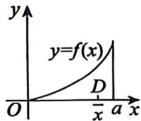

## 基础篇

# 第10章 一元函数和全学的应用（一）

# ——儿何应用

1. 曲线 $y = \frac{1}{x^2 + 4x + 5}$ 在区间 $(0, +\infty)$ 上与 $x$ 轴所围成的图形的面积为

2. 曲线 $y = \frac{\ln x}{\sqrt{x}}$ 在 $[1, \mathrm{e}^2]$ 上与 $x$ 轴所围成的图形的面积是

3. 如图所示, 抛物线 $y = (\sqrt{2} - 1)x^{2}$ 把曲线 $y = x(b - x)(b > 0)$ 与 $x$ 轴所围成的闭区域分成面积为 $S_{A}$ 与 $S_{B}$ 的两部分, 则( ).

(A) $S_{A} <   S_{B}$

(B) $S_{A} = S_{B}$

(C) $S_{A} > S_{B}$

(D) $S_{A}$ 与 $S_{B}$ 的大小关系与 $b$ 的数值有关

4. 过点 $(p, \sin p)$ 作曲线 $y = \sin x$ 的切线(见图), 设该曲线与切线及 $y$ 轴所围成的图形的面积为 $S_{1}$ , 曲线与直线 $x = p$ 及 $x$ 轴所围成的图形的面积为 $S_{2}$ , 则( ).

(A) $\lim_{p \to 0^{+}} \frac{S_{2}}{S_{1} + S_{2}} = \frac{1}{3}$

(B) $\lim_{p\to 0^{+}}\frac{S_2}{S_1 + S_2} = \frac{1}{2}$

(C) $\lim_{p\to 0^{+}}\frac{S_2}{S_1 + S_2} = \frac{2}{3}$

(D) $\lim_{p\to 0^{+}}\frac{S_2}{S_1 + S_2} = 1$

5. 平面无界区域 $D = \left\{(x, y) \mid (1 + x^2) |y| \leqslant 1\right\}$ 的面积为

6. 设平面区域 $D$ 由曲线段 $y = \sin \pi x (0 \leqslant x \leqslant 1)$ 与 $x$ 轴围成, 则 $D$ 绕 $y$ 轴旋转一周所成旋转体的体积为

7. 已知函数 $f(x) = x \int_{1}^{x} \frac{e^{t^2}}{t} \, \mathrm{d}t$ ，则 $f(x)$ 在 (0,1) 上的平均值为 _______.

8. 已知曲线 $L: y = \mathrm{e}^{-x} (x \geqslant 0)$ , 设 $P$ 是 $L$ 上的动点, $V$ 是 $L$ 上从点 $A(0,1)$ 到点 $P$ 的一段弧绕 $x$ 轴旋转一周所得的旋转体体积, 当 $P$ 运动到点 $\left(1, \frac{1}{\mathrm{e}}\right)$ 时, 沿 $x$ 轴正向的速度为 1 , 求此时 $V$ 关于时间 $t$ 的变化率.

9. 曲线 $y = \ln \sin x\left(\frac{\pi}{6} \leqslant x \leqslant \frac{\pi}{3}\right)$ 的弧长为

10. 曲线 $r = \mathrm{e}^{\theta}$ 从 $\theta = 0$ 到 $\theta = 1$ 的弧长为

11. 已知函数 $y = y(x)$ 由方程 $y^4 - 6xy + 3 = 0 (1 \leqslant y \leqslant 2)$ 所确定, 则曲线 $y = y(x)$ 从点 $\left(\frac{2}{3}, 1\right)$ 到点 $\left(\frac{19}{12}, 2\right)$ 的长度为

12. 曲线 $y = \mathrm{e}^{x}$ 与其过原点的切线及 $y$ 轴所围图形的面积为( ).

(A) $\int_0^1 (\ln y - y\ln y)\mathrm{d}x$

(B) $\int_0^1 (\mathrm{e}^x -\mathrm{e}x)\mathrm{d}x$

(C) $\int_{1}^{\mathbf{c}} (\ln y - y \ln y) \mathrm{d}x$

(D) $\int_{1}^{e} (e^x - x e^x) \, dx$

13. 曲线 $y = x^{2} \mathrm{e}^{-x} (0 \leqslant x < +\infty)$ 绕 $x$ 轴旋转一周所得延展到无穷远的旋转体的体积为

14. 曲线 $f(x) = x \ln x (0 < x \leqslant 2)$ 绕 $x$ 轴旋转一周所得旋转体的体积为

15. 曲线 $y = \frac{1}{2} x^{2} (0 \leqslant x \leqslant 1)$ 的长度为 _______.

16. 设平面 $D$ 是由 $y = \ln x, x = 1, y = 1$ 围成的第一象限的有界区域, 记 $D$ 绕 $x$ 轴与绕 $y = 1$ 旋转一周所得旋转体的体积分别为 $V_{1}, V_{2}$ , 则( ).

(A) $V_{1} > \frac{\pi}{2} > V_{2}$

(B) $V_{2} > \frac{\pi}{2} > V_{1}$

(C) $\frac{\pi}{2} > V_1 > V_2$

(D) $\frac{\pi}{2} > V_{2} > V_{1}$

17. 曲线 $y = x^{2}$ 从点 (1,1) 到点 (2,4) 的一段弧绕 $y$ 轴旋转一周所得旋转体的侧面积为

18. 函数 $y = \frac{x^2}{\sqrt{1 - x^2}}$ 在区间 $[0, 1]$ 上的平均值为 _______.

19. 设平面区域 $D = \left\{(x, y) \mid 0 \leqslant y \leqslant \frac{\sqrt{x^2 - 1}}{x^2}, \sqrt{2} \leqslant x \leqslant 2\right\}$ , 求:

(1) $D$ 的面积；

(2) $D$ 绕 $x$ 轴旋转一周所成旋转体的体积.

---

## 强化篇

# ——儿何应用

1. 曲线 $e^{y} + xy + x^{3} = e$ 在点 (0,1) 处的切线与两坐标轴所围成的三角形的面积为  
2. 曲线 $r = 2 \cos 3\theta \left(0 \leqslant \theta \leqslant \frac{\pi}{6}\right)$ 与 $\theta = 0$ 及 $\theta = \frac{\pi}{6}$ 所围图形面积为  
3. 若曲线 $r = a(1 + \cos \theta)(a > 0)$ 所围图形的面积为 $6\pi$ ，则 $a =$ ________.  
4. 设函数 $y = y(x)$ 满足方程 $y'' + 3y' + 2y = e^{-x}$ ，且 $\lim_{x \to 0} \frac{y(x)}{x} = 1$ ，求曲线 $y = y(x)$ 与 $x$ 轴正半轴之间的平面图形的面积及该平面图形绕 $y$ 轴旋转一周所形成的旋转体体积.  
5. 曲线 $y = \sqrt{x}$ 与 $y = x^2$ 所围平面有界区域绕直线 $y = x$ 旋转一周所得旋转体的体积为  
6. 过坐标原点作曲线 $y = \mathrm{e}^{x}$ 的切线, 该切线与曲线 $y = \mathrm{e}^{x}$ 以及 $x$ 轴围成的向 $x$ 轴负向无限伸展的图形记为 $D$ .

(1)求 $D$ 的面积；

(2)求 $D$ 绕直线 $x = 1$ 旋转一周所成的旋转体体积.

7. 求曲线 $y = \mathrm{e}^{-\frac{x}{2}} \sqrt{\sin x} (x \geqslant 0)$ 绕 $x$ 轴旋转一周所成旋转体的体积.

8. 设曲线 $y = ax^{2} (x \geqslant 0$ ，常数 $a > 0$ ) 与曲线 $y = 1 - x^{2}$ 交于点 $A$ ，过坐标原点 $O$ 和点 $A$ 的直线与曲线 $y = ax^{2}$ 围成一平面图形 $D$ .

(1) 求 $D$ 绕 $x$ 轴旋转一周所成的旋转体体积 $V(a)$ ;   
(2)求使 $V(a)$ 为最大值时 $\pmb{a}$ 的值  
9. 设函数 $f(x)$ 在 $[0,1]$ 上连续，在 $(0,1)$ 内可导，且满足 $xf'(x) = f(x) + x^2$ . 已知曲线 $y = f(x)$ 与 $x = 0, x = 1, y = 0$ 所围的图形 $S$ 面积为 2. 求 $f(x)$ 的表达式，以及图形 $S$ 绕 $x$ 轴旋转一周所得旋转体的体积.  
10. 当 $x \geqslant 0$ 时，在曲线 $y = \mathrm{e}^{-2x}$ 上面作一个台阶曲线，台阶的宽度皆为1(见图).则图中无穷多个阴影部分的面积之和 $S =$

11. 设函数 $y = f(x)$ 满足微分方程 $y' + y = \frac{e^{-x} \cos x}{2\sqrt{\sin x}}$ ，且 $f(\pi) = 0$ ，求曲线 $y = f(x) (x \geqslant 0)$ 绕 $x$ 轴旋转一周所得旋转体的体积.

12. 设 $f(x)$ 在 $(- \infty, + \infty)$ 内非负连续，且 $\int_{0}^{x} t f(x^2) f(x^2 - t^2) \mathrm{d}t = \sin^2 x^2$ ，求 $f(x)$ 在 $[0, \pi]$ 上的平均值.

13. 已知 $\frac{1}{1 + \mathrm{e}^{\frac{1}{x}}}$ 是函数 $f(x)$ 的一个原函数, 则 $f(x)$ 在 $[-1, 1]$ 上的平均值为

14. 已知函数 $f(x)$ 在 $[0, 1]$ 上连续，在 $(0, 1)$ 内是函数 $\frac{\sin \pi x}{x}$ 的一个原函数，且 $f(1) = 0$ ，则 $f(x)$ 在区间 $[0, 1]$ 上的平均值为 ______.

15. 设函数 $f(x)$ 非负连续, 且 $f(x) \int_{0}^{1} f(xt) \mathrm{d}t = 2x^2$ , 则 $f(x)$ 在区间 $[0, 2]$ 上的平均值为

16. 设 $f(x)$ 为 $[0,3]$ 上的非负连续函数，且满足 $f(x)\int_{1}^{2}f(xt - x)\mathrm{d}t = 2x^2$ ， $x\in [0,3]$ ，则 $f(x)$ 在区间 $[1,3]$ 上的平均值为

17. 已知函数 $f(x)$ 在 $\left[0, \frac{3\pi}{2}\right]$ 上连续，在 $\left(0, \frac{3\pi}{2}\right)$ 内是函数 $\frac{\cos x}{2x - 3\pi}$ 的一个原函数，且 $f(0) = 0$ ，则 $f(x)$ 在区间 $\left[0, \frac{3\pi}{2}\right]$ 上的平均值为 ______.

18. 设 $f(x) = \int_{-1}^{x} t |t| \, \mathrm{d}t$ ，求曲线 $y = f(x)$ 与 $x$ 轴所围成的封闭图形的面积.

19. 已知函数 $f(x), g(x)$ 分别满足 $f'(x) = 2\sqrt{f(x)}$ ， $g'(x) = \frac{g(x)}{x - 2} + \frac{x - 2}{x}$ ， $f(0) = 1$ ， $g(1) = 0$ 。求曲线 $f(x) + g(y) = 0$ 所围图形绕直线 $x = -1$ 旋转一周所成旋转体体积。

20. 在曲线 $\sqrt{x} + \sqrt{y} = 1$ 上的横坐标为 $a (0 < a < 1)$ 处作曲线的切线, 将切线与 $x$ 轴、 $y$ 轴所围成的图形绕 $y$ 轴旋转一周, 使得旋转体的体积最大, 求 $a$ 的值.

21. 设函数 $x = x(y)$ 满足 $y = \int \frac{4y^3}{4 - y^6} \, \mathrm{d}x$ , $L$ 为曲线 $x = x(y)(-2 \leqslant y \leqslant -1)$ , 且 $x(-1) = -\frac{9}{16}$ , 记 $L$ 的长度为 $s$ . 求:

(1) $s$ ;   
(2) $x$ 的最大值.

22. 设连续函数 $y = y(x)$ 满足 $y' + \frac{t^2}{y} x^3 = \frac{y}{x}$ , $y(1) = \sqrt{9 - t^2}$ , 其中 $0 \leqslant t \leqslant 3, x > 0$ .

# 第10章 一元函数积分学的应用（一）——几何应用

(1)利用换元 $z = y^{2}$ 求 $y = y(x)$ 的表达式；  
(2) 令 $f(x) = \frac{1}{9} \int_{0}^{3} y(x) \, \mathrm{d}t$ ，求曲线 $y = f(x)$ 的全长：

23. 设非负函数 $y(x)$ 是微分方程 $2yy' = \cos x$ 满足条件 $y(0) = 0$ 的解, 求曲线 $f_{n}(x) = n\int_{0}^{\frac{x}{n}}y(t)\mathrm{d}t (0 \leqslant x \leqslant n\pi)$ 的弧长.

24. 设函数 $y = f(x)$ 在区间 $[0, a]$ 上非负， $f''(x) > 0$ ，且 $f(0) = 0$ 。有一块质量均匀分布的平板 $D$ ，其占据的区域是曲线 $y = f(x)$ 与直线 $x = a$ 以及 $x$ 轴围成的平面图形。用 $\overline{x}$ 表示平板 $D$ 的质心的横坐标（见图）。证明： $\overline{x} > \frac{2}{3}a$ 。

25. 求摆线的一拱 $\left\{ \begin{array}{l} x = a(t - \sin t), \\ y = a(1 - \cos t) \end{array} \right.$ (0≤t≤2π,a>0)与x轴围成的平面图形绕x轴旋转一周所形成的旋转体的体积与表面积.

26. 已知摆线的参数方程为 $\left\{ \begin{array}{l} x = a(t - \sin t), \\ y = a(1 - \cos t), \end{array} \right.$ 其中 $0 \leqslant t \leqslant 2\pi$ ，常数 $a > 0$ 。设该摆线一拱的弧长的数值等于该弧段绕 $x$ 轴旋转一周所形成的旋转曲面面积的数值。求 $a$ 的值。

