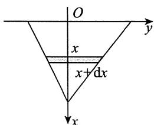
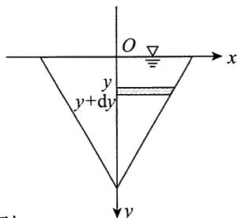
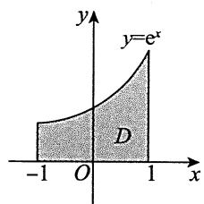

## 基础篇

# 第12章 一元函数积分学的应用（三）物理应用

1.【答案】 $-\frac{\sqrt{2}}{2} G\rho$

【解析】依题意画出如图所示的直角坐标系，用微元法.取 $y$ 轴上的 $[y,y + \mathrm{d}y]\subset [0,1]$ ，此微段

细杆对质点的引力大小为 $\mathrm{d}F = G\cdot \frac{\rho\mathrm{d}y}{1 + y^2}$ ，其在 $x$ 轴正向的分力为

$$
\mathrm {d} F _ {x} = \frac {- 1}{\sqrt {1 + y ^ {2}}} \mathrm {d} F = - \frac {G \rho \mathrm {d} y}{(1 + y ^ {2}) ^ {\frac {3}{2}}} ,
$$

于是该细杆对此质点的引力沿 $x$ 轴正向的分力为

$$
F _ {x} = \int_ {0} ^ {1} \left[ - \frac {G \rho}{\left(1 + y ^ {2}\right) ^ {\frac {3}{2}}} \right] \mathrm {d} y \xlongequal {\text {令} y = \tan t} - G \rho \int_ {0} ^ {\frac {\pi}{4}} \cos t \mathrm {d} t = - \frac {\sqrt {2}}{2} G \rho .
$$

2.【答案】 $\frac{\sqrt{2}}{2}\rho ga^3$

【解析】建立如图所示的坐标系，设压力微元为 $\mathrm{d}P$

当 $y > 0$ 时， $\mathrm{d}P = \rho g\cdot \left(\frac{a}{\sqrt{2}} -y\right)\cdot 2\left(\frac{a}{\sqrt{2}} -y\right)\mathrm{d}y$ ，则

$$
P _ {1} = \int_ {0} ^ {\frac {a}{\sqrt {2}}} 2 \rho g \left(\frac {a}{\sqrt {2}} - y\right) ^ {2} d y = - 2 \rho g \cdot \frac {1}{3} \left(\frac {a}{\sqrt {2}} - y\right) ^ {3} \Bigg | _ {0} ^ {\frac {a}{\sqrt {2}}} = \frac {\sqrt {2}}{6} \rho g a ^ {3}.
$$

当 $y < 0$ 时， $\mathrm{d}P = \rho g\cdot \left(\frac{a}{\sqrt{2}} -y\right)\cdot 2\left(\frac{a}{\sqrt{2}} +y\right)\mathrm{d}y$ ，则

$$
\begin{array}{l} P _ {2} = \int_ {- \frac {a}{\sqrt {2}}} ^ {0} 2 \rho g \left(\frac {a ^ {2}}{2} - y ^ {2}\right) d y = 2 \rho g \cdot \frac {a ^ {2}}{2} \cdot \frac {a}{\sqrt {2}} - 2 \rho g \cdot \left(\left. \frac {1}{3} y ^ {3} \right| _ {- \frac {a}{\sqrt {2}}} ^ {0}\right) \\ = 2 \rho g \left(\frac {a ^ {3}}{2 \sqrt {2}} - \frac {1}{3} \cdot \frac {a ^ {3}}{2 \sqrt {2}}\right) = \frac {4}{3} \cdot \frac {1}{2 \sqrt {2}} \cdot \rho g a ^ {3} = \frac {\sqrt {2}}{3} \rho g a ^ {3}. \\ \end{array}
$$

故 $P = P_{1} + P_{2} = \left(\frac{\sqrt{2}}{6} +\frac{\sqrt{2}}{3}\right)\rho ga^{3} = \frac{\sqrt{2}}{2}\rho ga^{3}.$

# 3.【答案】 $\frac{GM}{R}$

【解析】设举高至 $a$ ，则 $W(a) = \int_{R}^{R + a}G\frac{M}{x^2}\mathrm{d}x$ ，故

$$
W = \lim  _ {a \rightarrow + \infty} W (a) = \int_ {R} ^ {+ \infty} G \frac {M}{x ^ {2}} d x = - G M \left. \frac {1}{x} \right| _ {R} ^ {+ \infty} = \frac {G M}{R}.
$$

4.【解析】(1)以缸底中心为原点，对称轴为 $y$ 轴在轴截面上建立如图所示的平面直角坐标系，则可设缸内表面(旋转抛物面)是由抛物线 $y = kx^{2}$ 绕 $y$ 轴旋转而成的。根据题意， $y(a) = a$ ，故 $k = \frac{1}{a}$ ，

即抛物线方程为 $y = \frac{1}{a} x^2$

于是，缸的容积为

$$
V = \pi \int_ {0} ^ {a} x ^ {2} \mathrm {d} y = \pi \int_ {0} ^ {a} a y \mathrm {d} y = \frac {\pi a ^ {3}}{2} (\text {立 方 米}).
$$

因此，若以每秒 $Q$ 立方米的速率将缸中的水全部抽出，则需要的时间为

$$
t = \frac {V}{Q} = \frac {\frac {\pi a ^ {3}}{2}}{Q} = \frac {\pi a ^ {3}}{2 Q} (\text {秒}).
$$

(2) 取 $y$ 为积分变量, 其取值范围为 $[0, a]$ . 在 $y$ 轴上的区间 $[0, a]$ 内任取一个典型小区间 $[y, y + \mathrm{d}y]$ , 则在该典型小区间上需做功的微元为

$$
\mathrm {d} W = \rho g \pi x ^ {2} \mathrm {d} y \cdot (a - y) = \rho g \pi a y (a - y) \mathrm {d} y = \rho g \pi a \left(a y - y ^ {2}\right) \mathrm {d} y.
$$

于是，所求功为

$$
W = \int_ {0} ^ {a} \rho g \pi a (a y - y ^ {2}) \mathrm {d} y = \rho g \pi a \left(\frac {1}{2} a y ^ {2} - \frac {1}{3} y ^ {3}\right) \Bigg | _ {0} ^ {a} = \frac {1}{6} \rho g \pi a ^ {4} (\text {焦 耳}).
$$

5.【解析】(1)如图所示，当液面在 $y(-1\leqslant y\leqslant 1)$ 处时，容器内液体的体积为 $V = 2\int_{-1}^{y}\sqrt{1 - u^2}\mathrm{d}u$

设 $t$ 时刻液体的体积为 $V = V(t)$ ，则

$$
\frac {\mathrm {d} V}{\mathrm {d} t} = \frac {\mathrm {d} V}{\mathrm {d} y} \cdot \frac {\mathrm {d} y}{\mathrm {d} t} = 2 \sqrt {1 - y ^ {2}} \frac {\mathrm {d} y}{\mathrm {d} t},
$$

令 $y = 0$ ，并由条件 $\frac{\mathrm{d}V}{\mathrm{d}t} = 0.2$ 得 $\frac{\mathrm{dy}}{\mathrm{dt}} = 0.1$ ，故液面在 $y = 0$ 时，液面下降的速率为 $0.1\mathrm{m / min}$

$$
\begin{array}{l} W = \int_ {- 1} ^ {1} 2 \sqrt {1 - y ^ {2}} (1 - y) d y = \int_ {- 1} ^ {1} 2 \sqrt {1 - y ^ {2}} d y - \int_ {- 1} ^ {1} 2 y \sqrt {1 - y ^ {2}} d y \tag {2} \\ = 4 \int_ {0} ^ {1} \sqrt {1 - y ^ {2}} d y \xlongequal {y = \sin t} 4 \int_ {0} ^ {\frac {\pi}{2}} \cos^ {2} t d t = 4 \times \frac {\pi}{4} = \pi (J). \\ \end{array}
$$

【注】因为 $2y\sqrt{1 - y^2}$ 为奇函数，故 $\int_{-1}^{1}2y\sqrt{1 - y^2}\mathrm{d}y = 0$

# 6.【答案】(A)

【解析】设细杆的质量为 $M$ ，长为 $l$ ，建立如图所示的坐标系. 设质点距杆左端(原点)的距离为 $x_0(x_0 > 1)$ ，则引力微元大小为

$$
\mathrm {d} F = G \cdot \frac {M \cdot \frac {\mathrm {d} x}{l} \cdot a}{(x _ {0} - x) ^ {2}} = G a \frac {1}{(x _ {0} - x) ^ {2}} \mathrm {d} x, \quad \frac {M = 1 , l = 1}{0 x x + \mathrm {d} x 1 \frac {4}{3} \left| \frac {3}{2} \right.}
$$

此瞬时引力大小为

$$
\begin{array}{l} F = \int_ {0} ^ {1} \mathrm {d} F = G a \int_ {0} ^ {1} \frac {1}{\left(x _ {0} - x\right) ^ {2}} \mathrm {d} x \\ = G a \frac {1}{x _ {0} - x} \Bigg | _ {x = 0} ^ {x = 1} = G a \left(\frac {1}{x _ {0} - 1} - \frac {1}{x _ {0}}\right). \\ \end{array}
$$

故所求引力做功大小为

$$
\begin{array}{l} W = \left| \int_ {\frac {3}{2}} ^ {\frac {4}{3}} G a \left(\frac {1}{x _ {0} - 1} - \frac {1}{x _ {0}}\right) d x _ {0} \right| = \left| G a \ln \frac {x _ {0} - 1}{x _ {0}} \right| _ {\frac {3}{2}} ^ {\frac {4}{3}} \\ = \left| - G a \ln \frac {4}{3} \right| = G a \ln \frac {4}{3}. \\ \end{array}
$$

# 7.【答案】(A)

【解析】设三角形斜边与水面夹角为 $\theta$ (见图), 则斜边所在直线的方程为

$$
y = \cos \theta - x \cdot \cot \theta .
$$

直角三角板所受水的压力为

$$
\begin{array}{l} P = \rho g \int_ {0} ^ {\sin \theta} x (\cos \theta - x \cdot \cot \theta) d x \\ = \rho g \left(\cos \theta \int_ {0} ^ {\sin \theta} x d x - \cot \theta \int_ {0} ^ {\sin \theta} x ^ {2} d x\right) \\ = \frac {1}{6} \rho g \cos \theta \sin^ {2} \theta , \\ \end{array}
$$

其中 $\rho$ 为水的密度， $g$ 为重力加速度.

$$
P ^ {\prime} (\theta) = \frac {1}{6} \rho g (2 \sin \theta \cos^ {2} \theta - \sin^ {3} \theta),
$$

令 $P^{\prime}(\theta) = 0$ 得到唯一驻点 $\theta = \arccos \frac{1}{\sqrt{3}}$

于是当 $\theta = \arccos \frac{1}{\sqrt{3}}$ ，即水平直角边长度 $\cos \theta = \frac{1}{\sqrt{3}}$ 时，三角板受到水的压力最大，故选(A).

---

## 强化篇

# 物理应用

# 1.【答案】(C)

【解析】如图所示，以水面上某一点为原点，铅直向下的方向为 $x$ 轴正向，建立平面直角坐标系，选取 $x$ 为积分变量，设三角形薄板与水面相平齐的那条边的长为 $a$ ，相应的高为 $h$ ，重力加速度为 $g$ ，水的密度为 $\rho$ ，则

$$
F _ {1} = \int_ {0} ^ {h} \rho g x \frac {a}{h} (h - x) d x = \frac {\rho g a}{h} \int_ {0} ^ {h} (h x - x ^ {2}) d x = \frac {1}{6} \rho g a h ^ {2},
$$

$$
F _ {2} = \int_ {0} ^ {h} \rho g x \frac {a}{h} x d x = \frac {\rho g a}{h} \int_ {0} ^ {h} x ^ {2} d x = \frac {1}{3} \rho g a h ^ {2}.
$$

故 $F_{2} = 2F_{1}$ .应选(C).

  
(a)

  
(b)

2.【解析】(1)建立如图(a)所示的直角坐标系，则在水深 $y$ 处平板一侧所受的水压力为

$$
\mathrm {d} F = \rho g y \cdot 2 \left(1 - \frac {\sqrt {3}}{3} y\right) \mathrm {d} y,
$$

则平板一侧所受的水压力为

$$
\int_ {0} ^ {\sqrt {3}} \rho g y \cdot 2 \left(1 - \frac {\sqrt {3}}{3} y\right) d y = 2 \rho g \int_ {0} ^ {\sqrt {3}} \left(y - \frac {\sqrt {3}}{3} y ^ {2}\right) d y = 2 \rho g \left(\frac {3}{2} - 1\right) = \rho g.
$$

(2)如图(b)所示，设 $0\sim t$ 时刻水面增加的高度为 $-h$ ， $h = h(t)$ ， $h < 0$ ，则

$$
\begin{array}{l} F = \int_ {0} ^ {\sqrt {3}} 2 \rho g \left(1 - \frac {\sqrt {3}}{3} y\right) (y - h) d y \\ = \rho g - 2 \rho g \int_ {0} ^ {\sqrt {3}} \left(1 - \frac {\sqrt {3}}{3} y\right) d y \cdot h \\ = \rho g - \sqrt {3} \rho g h. \\ \end{array}
$$

又 $\frac{\mathrm{d}h}{\mathrm{d}t} = -\frac{1}{10}$ 故 $\frac{\mathrm{d}F}{\mathrm{d}t} = -\sqrt{3}\rho g\frac{\mathrm{d}h}{\mathrm{d}t} = \frac{\sqrt{3}}{10}\rho g.$

  
(a)

  
(b)

3.【答案】 $\frac{4}{3}\rho g\pi a^4$

【解析】建立如图所示的坐标系，重力微元为 $\rho g\pi y^2\mathrm{d}x$ ，其向上移动 $2a$ ，但在水中不做功，故做

功的位移为 $2a - x$ ，故 $\mathrm{d}W = \rho g\pi y^2\mathrm{d}x\cdot (2a - x)$ ，于是

$$
\begin{array}{l} W = \int_ {0} ^ {2 a} d W = \int_ {0} ^ {2 a} (2 a - x) \rho g \pi [ a ^ {2} - (x - a) ^ {2} ] d x \\ = \frac {4}{3} \rho g \pi a ^ {4}. \\ \end{array}
$$

4.【答案】(D)

【解析】由题设知，密度函数 $\rho (x,y) = k\sqrt{x^2 + y^2} (k > 0)$

设重心坐标为 $(\overline{x},\overline{y})$ ， $D = \left\{(x,y)\mid x^2 +y^2\leqslant a^2,y\geqslant 0\right\}$ ，由对称性知 $\overline{x} = 0$ ， $\overline{y} = \frac{M_x}{M}$

其中， $M_{x} = \iint_{D}ky\sqrt{x^{2} + y^{2}}\mathrm{d}x\mathrm{d}y = k\int_{0}^{\pi}\mathrm{d}\theta \int_{0}^{a}r\sin \theta \bullet r\bullet r\mathrm{d}r = \frac{1}{2} ka^{4},$

$$
M = \iint_ {D} k \sqrt {x ^ {2} + y ^ {2}} d x d y = k \int_ {0} ^ {\pi} d \theta \int_ {0} ^ {a} r ^ {2} d r = \frac {1}{3} k \pi a ^ {3},
$$

故 $\overline{y} = \frac{M_x}{M} = \frac{3a}{2\pi}$ . 因此, 重心坐标 $(\overline{x}, \overline{y}) = \left(0, \frac{3a}{2\pi}\right)$ .

5.【答案】 $\left(\frac{2}{\mathrm{e}^2 - 1},\frac{\mathrm{e}^2 + 1}{4\mathrm{e}}\right)$

【解析】区域 $D$ 如图所示.

$$
\begin{array}{l} \bar {x} = \frac {\int_ {- 1} ^ {1} d x \int_ {0} ^ {e ^ {x}} x d y}{\int_ {- 1} ^ {1} d x \int_ {0} ^ {e ^ {x}} d y} = \frac {\int_ {- 1} ^ {1} x e ^ {x} d x}{\int_ {- 1} ^ {1} e ^ {x} d x} = \frac {2}{e ^ {2} - 1}, \\ \bar {y} = \frac {\int_ {- 1} ^ {1} d x \int_ {0} ^ {e ^ {x}} y d y}{\int_ {- 1} ^ {1} d x \int_ {0} ^ {e ^ {x}} d y} = \frac {\frac {1}{2} \int_ {- 1} ^ {1} (e ^ {x}) ^ {2} d x}{\int_ {- 1} ^ {1} e ^ {x} d x} = \frac {e ^ {2} + 1}{4 e}. \\ \end{array}
$$

故所求形心为 $\left(\frac{2}{\mathrm{e}^2 - 1},\frac{\mathrm{e}^2 + 1}{4\mathrm{e}}\right)$

