## 基础篇

# 第14章 二重积分

# 1.【答案】(B)

【解析】当 $\frac{1}{2} \leqslant t \leqslant 1$ 时， $\ln t < \sin t < t \leqslant 1$ ，故当 $\frac{1}{2} \leqslant x + y \leqslant 1$ 时，有

$$
\ln^ {7} (x + y) <   \sin^ {7} (x + y) <   (x + y) ^ {7},
$$

根据二重积分比较定理，可知 $I_1 < I_3 < I_2$ ，故选(B).

# 2.【答案】(C)

【解析】 $D_{1}$ ， $D_{2}$ 是以原点为圆心、半径分别为 $R$ 与 $\sqrt{2} R$ 的圆， $D_{3}$ 是正方形，边长为 $2R$ ，如图所示.显然有

$$
D _ {1} \subset D _ {3} \subset D _ {2}.
$$

由于 $\mathrm{e}^{-(x^2 +y^2)}$ 恒正，因此(C)成立.

# 3.【答案】(B)

【解析】由积分中值定理知，存在 $(\xi, \eta) \in \left\{(x, y) \mid x^2 + y^2 \leqslant r^2 \right\}$ ，使得

$$
\begin{array}{l} \lim  _ {r \rightarrow 0} \frac {1}{\pi r ^ {2}} \iint_ {x ^ {2} + y ^ {2} \leqslant r ^ {2}} \mathrm {e} ^ {x ^ {2} - y ^ {2}} \cos (x + y) \mathrm {d} x \mathrm {d} y = \lim  _ {r \rightarrow 0} \frac {1}{\pi r ^ {2}} \cdot \mathrm {e} ^ {\xi^ {2} - \eta^ {2}} \cos (\xi + \eta) \cdot \pi r ^ {2} \\ = \lim  _ {r \rightarrow 0} \mathrm {e} ^ {\xi^ {2} - \eta^ {2}} \cos (\xi + \eta) = \lim  _ {(\xi , \eta) \rightarrow (0, 0)} \mathrm {e} ^ {\xi^ {2} - \eta^ {2}} \cos (\xi + \eta) = 1. \\ \end{array}
$$

# 4.【答案】(C)

【解析】 $\iint_{D}(axy + by^{2})\mathrm{d}x\mathrm{d}y = \iint_{D}axy\mathrm{d}x\mathrm{d}y + \iint_{D}by^{2}\mathrm{d}x\mathrm{d}y = I_{1} + I_{2},$

注意到积分区域 $D$ 关于 $y$ 轴对称，函数 $axy$ 关于 $x$ 为奇函数，所以 $I_{1} = 0$ ：因此原积分的符号只与 $b$ 有关，而与 $a$ 无关.

5.【答案】 $\mathrm{e}^{-\frac{1}{2}}$

【解析】交换积分次序，得

原式 $= \int_{0}^{1}\mathrm{d}y\int_{y^2}^{1}\mathrm{e}^{-\frac{y^2}{2}}\mathrm{d}x = \int_{0}^{1}(1 - y^2)\mathrm{e}^{-\frac{y^2}{2}}\mathrm{d}y = \int_{0}^{1}\mathrm{e}^{-\frac{y^2}{2}}\mathrm{d}y + \int_{0}^{1}y\mathrm{d}\left(\mathrm{e}^{-\frac{y^2}{2}}\right)$

$$
= \int_ {0} ^ {1} e ^ {- \frac {y ^ {2}}{2}} d y + y e ^ {- \frac {y ^ {2}}{2}} \Bigg | _ {0} ^ {1} - \int_ {0} ^ {1} e ^ {- \frac {y ^ {2}}{2}} d y = e ^ {- \frac {1}{2}}.
$$

# 6.【答案】1

【解析】积分区域如图所示，则

原式 $= \int_{0}^{1}\mathrm{d}x\int_{\sqrt{x}}^{1}\frac{x\mathrm{e}^{x}}{1 - \sqrt{x}}\mathrm{d}y$

$$
\begin{array}{l} = \int_ {0} ^ {1} x \mathrm {e} ^ {x} \mathrm {d} x = (x - 1) \mathrm {e} ^ {x} \Bigg | _ {0} ^ {1} \\ = 1. \\ \end{array}
$$

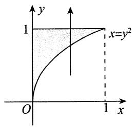

# 7.【答案】(B)

【解析】积分区域如图所示，所以先积 $y$ 时应是从 $y = \mathrm{e}^{x}$ 到 $y = \mathrm{e}$ ，故 $I = \int_{0}^{1} \mathrm{d}x \int_{\mathrm{e}^{x}}^{\mathrm{e}} f(x, y) \, \mathrm{d}y$ ，选(B).

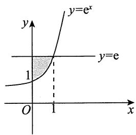

# 8.【答案】(B)

【解析】积分区域如图所示，交换积分次序，得

$$
\int_ {\frac {\pi}{2}} ^ {\frac {5 \pi}{6}} d x \int_ {\sin x} ^ {1} f (x, y) d y = \int_ {\frac {1}{2}} ^ {1} d y \int_ {\pi - \arcsin y} ^ {\frac {5 \pi}{6}} f (x, y) d x,
$$

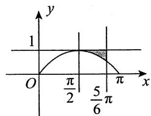

故选(B).

# 9.【答案】(C)

【解析】由题意知，此二重积分的积分区域为

$$
D = \left\{(x, y) \left| \sqrt {4 - x ^ {2}} \leqslant y \leqslant 2, - 2 \leqslant x \leqslant 2 \right. \right\},
$$

对应图像如图所示.

$$
I = \int_ {- 2} ^ {2} d x \int_ {\sqrt {4 - x ^ {2}}} ^ {2} f (x, y) d y = \int_ {0} ^ {2} \left[ \int_ {- 2} ^ {- \sqrt {4 - y ^ {2}}} f (x, y) d x + \int_ {\sqrt {4 - y ^ {2}}} ^ {2} f (x, y) d x \right] d y.
$$

故选项(A)错误.

又 $f(x,y) = f(-x,y)$ ，且积分区域关于 $y$ 轴对称，则 $I = 2\int_{0}^{2}\left[\int_{\sqrt{4 - y^2}}^{2}f(x,y)\mathrm{d}x\right]\mathrm{d}y$ 。故选项(B)错误。

记 $D_{1} = \left\{(x,y)\big|(x,y)\in D,x > y\right\}$ .由 $f(x,y) = f(y,x)$ ，得 $I = 4\iint_{D_1}f(x,y)\mathrm{d}x\mathrm{d}y.$

用极坐标来表示， $I = 4\int_{0}^{\frac{\pi}{4}}\mathrm{d}\theta \int_{2}^{2\sec \theta}f(r\cos \theta ,r\sin \theta)r\mathrm{d}r.$ 故选(C).

10.【答案】 $\frac{4}{27}$

【解析】 $\iint_{D} \sqrt{x^2 + y^2} \, \mathrm{d}x \, \mathrm{d}y = \int_{0}^{\frac{\pi}{3}} \, \mathrm{d}\theta \int_{0}^{\sin 3\theta} \sqrt{r^2 \cos^2\theta + r^2 \sin^2\theta} \cdot r \, \mathrm{d}r$

$$
\begin{array}{l} = \int_ {0} ^ {\frac {\pi}{3}} d \theta \int_ {0} ^ {\sin 3 \theta} r ^ {2} d r = \frac {1}{3} \int_ {0} ^ {\frac {\pi}{3}} \sin^ {3} 3 \theta d \theta \\ = \frac {1}{9} \int_ {0} ^ {\pi} \sin^ {3} t \mathrm {d} t = \frac {2}{9} \int_ {0} ^ {\frac {\pi}{2}} \sin^ {3} t \mathrm {d} t = \frac {2}{9} \cdot \frac {2}{3} = \frac {4}{2 7}. \\ \end{array}
$$

11.【答案】 $\frac{5}{144}$

【解析】由被积函数知，应先对 $x$ 积分，再对 $y$ 积分

$$
\iint_ {D} x \mathrm {e} ^ {- y ^ {2}} \mathrm {d} x \mathrm {d} y = \int_ {0} ^ {+ \infty} \mathrm {e} ^ {- y ^ {2}} \mathrm {d} y \int_ {\frac {\sqrt {y}}{3}} ^ {\frac {\sqrt {y}}{2}} x \mathrm {d} x = \int_ {0} ^ {+ \infty} \frac {1}{2} \left(\frac {y}{4} - \frac {y}{9}\right) \mathrm {e} ^ {- y ^ {2}} \mathrm {d} y = \frac {5}{1 4 4} (- \mathrm {e} ^ {- y ^ {2}}) \Bigg | _ {0} ^ {+ \infty} = \frac {5}{1 4 4}.
$$

12.【答案】 $\frac{4}{9} a^3 (3\pi - 4)$

【解析】令 $x = r\cos \theta, y = r\sin \theta$ ，则

$$
\begin{array}{l} \iint_ {D} \sqrt {4 a ^ {2} - x ^ {2} - y ^ {2}} d x d y = \int_ {0} ^ {\frac {\pi}{2}} d \theta \int_ {0} ^ {2 a \cos \theta} \sqrt {4 a ^ {2} - r ^ {2}} r d r \\ = \int_ {0} ^ {\frac {\pi}{2}} \left[ - \frac {1}{3} (4 a ^ {2} - r ^ {2}) ^ {\frac {3}{2}} \right] _ {0} ^ {2 a \cos \theta} \mathrm {d} \theta \\ = \frac {8 a ^ {3}}{3} \int_ {0} ^ {\frac {\pi}{2}} (1 - \sin^ {3} \theta) d \theta \\ = \frac {4}{9} a ^ {3} (3 \pi - 4). \\ \end{array}
$$

13.【解析】令 $x = r\cos \theta$ ， $y = r\sin \theta$ ，由 $y = \sqrt{3(1 - x^2)}$ ，得 $r^2\sin^2\theta + 3r^2\cos^2\theta = 3$ ，于是 $r^2 = \frac{3}{3\cos^2\theta + \sin^2\theta}$ 积分区域如图所示，则

$$
\begin{array}{l} \iint_ {D} \left(x ^ {2} + y ^ {2}\right) d x d y = \int_ {\frac {\pi}{3}} ^ {\frac {\pi}{2}} d \theta \int_ {0} ^ {\sqrt {\frac {3}{3 \cos^ {2} \theta + \sin^ {2} \theta}}} r ^ {3} d r = \frac {9}{4} \int_ {\frac {\pi}{3}} ^ {\frac {\pi}{2}} \frac {\tan^ {2} \theta + 1}{(3 + \tan^ {2} \theta) ^ {2}} d (\tan \theta) \\ = \frac {9}{4} \int^ {+ \infty} \frac {t ^ {2} + 1}{\sqrt {3} (3 + t ^ {2}) ^ {2}} d t = \frac {9}{4} \int^ {+ \infty} \frac {t ^ {2} + 3 - 2}{\sqrt {3} (t ^ {2} + 3) ^ {2}} d t \\ = \frac {9}{4} \int_ {\sqrt {3}} ^ {+ \infty} \frac {\mathrm {d} t}{t ^ {2} + 3} - \frac {9}{4} \int_ {\sqrt {3}} ^ {+ \infty} \frac {2 \mathrm {d} t}{\left(t ^ {2} + 3\right) ^ {2}} \\ = \frac {9}{4} \cdot \frac {1}{\sqrt {3}} \arctan \left. \frac {t}{\sqrt {3}} \right| _ {\sqrt {3}} ^ {+ \infty} - \frac {1}{4} \left(\frac {3 t}{t ^ {2} + 3} + \sqrt {3} \arctan \frac {t}{\sqrt {3}}\right) \Bigg | _ {\sqrt {3}} ^ {+ \infty} \\ = \frac {3 \sqrt {3} \pi}{1 6} - \frac {(\pi - 2) \sqrt {3}}{1 6} = \frac {\sqrt {3}}{8} (1 + \pi). \\ \end{array}
$$

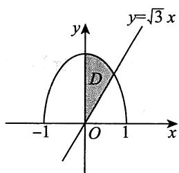

14.【解析】由轮换对称性，得

$$
\begin{array}{l} \iint_ {D} \frac {x \cos \sqrt {x ^ {2} + y ^ {2}}}{x + y} d x d y = \iint_ {D} \frac {y \cos \sqrt {x ^ {2} + y ^ {2}}}{x + y} d x d y \\ = \frac {1}{2} \iint_ {D} \cos \sqrt {x ^ {2} + y ^ {2}} d x d y = \frac {1}{2} \int_ {0} ^ {\frac {\pi}{2}} d \theta \int_ {1} ^ {2} r \cos r d r \\ = \frac {\pi}{4} (2 \sin 2 + \cos 2 - \sin 1 - \cos 1). \\ \end{array}
$$

15.【解析】由对称性，得

$$
\begin{array}{l} \iint_ {D} \frac {x ^ {2} - x \cos y - y ^ {2}}{x ^ {2} + y ^ {2}} d x d y = \iint_ {D} \frac {x ^ {2} - y ^ {2}}{x ^ {2} + y ^ {2}} d x d y = 2 \int_ {\frac {\pi}{4}} ^ {\frac {\pi}{2}} d \theta \int_ {0} ^ {\frac {1}{\sin \theta}} \frac {r ^ {2} \cos^ {2} \theta - r ^ {2} \sin^ {2} \theta}{r ^ {2}} r d r \\ = \int_ {\frac {\pi}{4}} ^ {\frac {\pi}{2}} \left(\cos^ {2} \theta - \sin^ {2} \theta\right) \frac {1}{\sin^ {2} \theta} d \theta = \int_ {\frac {\pi}{4}} ^ {\frac {\pi}{2}} \cot^ {2} \theta d \theta - \int_ {\frac {\pi}{4}} ^ {\frac {\pi}{2}} 1 d \theta \\ = \int_ {\frac {\pi}{4}} ^ {\frac {\pi}{2}} \csc^ {2} \theta \mathrm {d} \theta - \int_ {\frac {\pi}{4}} ^ {\frac {\pi}{2}} 2 \mathrm {d} \theta = - \cot \theta \left| \begin{array}{c} \frac {\pi}{2} \\ \frac {\pi}{4} \end{array} - \frac {\pi}{2} = 1 - \frac {\pi}{2} \right.. \\ \end{array}
$$

16.【解析】积分区域如图所示，由对称性，用极坐标，得

$$
\begin{array}{l} \iint_ {D} \sqrt {1 - x ^ {2} - y ^ {2}} d \sigma = 2 \int_ {0} ^ {\frac {\pi}{2}} d \theta \int_ {0} ^ {\sin \theta} \sqrt {1 - r ^ {2}} r d r \\ = - \int_ {0} ^ {\frac {\pi}{2}} d \theta \int_ {0} ^ {\sin \theta} (1 - r ^ {2}) ^ {\frac {1}{2}} d (1 - r ^ {2}) \\ = - \int_ {0} ^ {\frac {\pi}{2}} \left[ \left. \frac {2}{3} (1 - r ^ {2}) ^ {\frac {3}{2}} \right| _ {0} ^ {\sin \theta} \right] d \theta \\ = - \frac {2}{3} \int_ {0} ^ {\frac {\pi}{2}} \left(\cos^ {3} \theta - 1\right) d \theta \\ = - \frac {2}{3} \left(\frac {2}{3} - \frac {\pi}{2}\right) = \frac {\pi}{3} - \frac {4}{9}. \\ \end{array}
$$

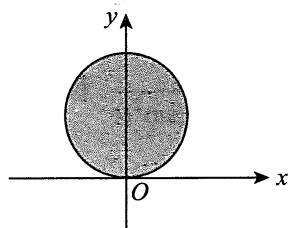

17.【解析】由于 $f(x) + f(-x)$ 为偶函数，因而 $x[f(x) + f(-x)]$ 为奇函数，又 $f(x) - f(-x)$ 为奇函数，从而 $(x + 1)f(x) + (x - 1)f(-x) = x[f(x) + f(-x)] + [f(x) - f(-x)]$ 为奇函数.故

原式 $= \int_{-1}^{1}\left[(x + 1)f(x) + (x - 1)f(-x)\right]\mathrm{d}x\int_{x^3}^{1}\sin y\mathrm{d}y$

$$
= \int_ {- 1} ^ {1} \left(\cos x ^ {3} - \cos 1\right) \left[ (x + 1) f (x) + (x - 1) f (- x) \right] d x = 0.
$$

18.【解析】积分区域如图所示，则

$$
\begin{array}{l} I = \int_ {0} ^ {1} d y \int_ {y} ^ {\sqrt {2 y - y ^ {2}}} \frac {1}{\sqrt {x ^ {2} + y ^ {2}} \sqrt {4 - x ^ {2} - y ^ {2}}} d x \\ = \int_ {0} ^ {\frac {\pi}{4}} \mathrm {d} \theta \int_ {0} ^ {2 \sin \theta} \frac {1}{\sqrt {4 - r ^ {2}}} \mathrm {d} r = \int_ {0} ^ {\frac {\pi}{4}} \left(\arcsin \frac {r}{2} \Bigg | _ {0} ^ {2 \sin \theta}\right) \mathrm {d} \theta \\ = \int_ {0} ^ {\frac {\pi}{4}} \theta d \theta = \frac {1}{2} \theta^ {2} \left| _ {0} ^ {\frac {\pi}{4}} = \frac {\pi^ {2}}{3 2} \right.. \\ \end{array}
$$

19.【解析】被积函数 $f(x,y)$ 的非零区域和积分区域的公共部分如图所示，故

$$
\begin{array}{l} \iint_ {D} f (x, y) \mathrm {d} \sigma = \int_ {0} ^ {\frac {\pi}{4}} \mathrm {d} \theta \int_ {2 \cos \theta} ^ {\frac {2}{\cos \theta}} r \sin \theta \cdot r \mathrm {d} r \\ = \frac {1}{3} \int_ {0} ^ {\frac {\pi}{4}} \left(\sin \theta \cdot r ^ {3} \left| \begin{array}{c} r = \frac {2}{\cos \theta} \\ r = 2 \cos \theta \end{array} \right.\right) d \theta \\ = \frac {8}{3} \int_ {0} ^ {\frac {\pi}{4}} \left(\frac {\sin \theta}{\cos^ {3} \theta} - \cos^ {3} \theta \sin \theta\right) d \theta \\ = \frac {8}{3} \left(\frac {1}{2} \frac {1}{\cos^ {2} \theta} + \frac {1}{4} \cos^ {4} \theta\right) \Bigg | _ {0} ^ {\frac {\pi}{4}} \\ = \frac {5}{6}. \\ \end{array}
$$

20.【解析】方法一 用极坐标系.

原式 $= \int_{0}^{\frac{\pi}{2}}\mathrm{d}\theta \int_{0}^{\frac{1}{\cos\theta + \sin\theta}}\frac{\mathrm{e}^{-r(\cos\theta + \sin\theta)}}{\sqrt{\cos\theta\sin\theta}}\mathrm{d}r$

$$
\begin{array}{l} = \int_ {0} ^ {\frac {\pi}{2}} \left[ \frac {1}{\sqrt {\cos \theta \sin \theta}} \cdot \frac {- 1}{\cos \theta + \sin \theta} \cdot e ^ {- r (\cos \theta + \sin \theta)} \right] _ {r = 0} ^ {r = \frac {1}{\cos \theta + \sin \theta}} d \theta \\ = \left(1 - \frac {1}{\mathrm {e}}\right) \int_ {0} ^ {\frac {\pi}{2}} \frac {1}{(\cos \theta + \sin \theta) \sqrt {\cos \theta \sin \theta}} \mathrm {d} \theta \\ = \left(1 - \frac {1}{\mathrm {e}}\right) \int_ {0} ^ {\frac {\pi}{2}} \frac {\mathrm {d} \theta}{\cos^ {2} \theta (1 + \tan \theta) \sqrt {\tan \theta}} \\ = \left(1 - \frac {1}{\mathrm {e}}\right) \int_ {0} ^ {\frac {\pi}{2}} \frac {\mathrm {d} (\tan \theta)}{(1 + \tan \theta) \sqrt {\tan \theta}} \\ \xlongequal {\tan \theta = u} \left(1 - \frac {1}{\mathrm {e}}\right) \int_ {0} ^ {+ \infty} \frac {\mathrm {d} u}{(1 + u) \sqrt {u}} \\ \end{array}
$$

$$
\begin{array}{l} = \left(1 - \frac {1}{\mathrm {e}}\right) \cdot 2 \int_ {0} ^ {+ \infty} \frac {\mathrm {d} (\sqrt {u})}{1 + (\sqrt {u}) ^ {2}} \\ = 2 \left(1 - \frac {1}{\mathrm {e}}\right) \cdot \arctan \sqrt {u} \Bigg | _ {0} ^ {+ \infty} \\ = \pi \left(1 - \frac {1}{\mathrm {e}}\right). \\ \end{array}
$$

方法二 用换元法.

令 $\left\{ \begin{array}{l} u = -(x + y), \\ v = x, \end{array} \right.$ 则 $D' = \{(u, v) | -1 \leqslant u \leqslant 0, 0 \leqslant v \leqslant 1, -1 \leqslant u + v \leqslant 0\}$ ，区域 $D'$ 如图中阴影部分所示.

原式 $= \iint_{D'} \frac{\mathrm{e}^u}{\sqrt{\nu(-v - u)}} \left\| \begin{array}{cc} \frac{\partial x}{\partial u} & \frac{\partial x}{\partial\nu} \\ \frac{\partial y}{\partial u} & \frac{\partial y}{\partial\nu} \end{array} \right\| \mathrm{d}u \mathrm{d}\nu = \iint_{D'} \frac{\mathrm{e}^u}{\sqrt{\nu(-v - u)}} \mathrm{d}u \mathrm{d}\nu$

$$
\begin{array}{l} = \int_ {- 1} ^ {0} \mathrm {d} u \int_ {0} ^ {- u} \frac {\mathrm {e} ^ {u}}{\sqrt {- v ^ {2} - u v}} \mathrm {d} v = \int_ {- 1} ^ {0} \mathrm {e} ^ {u} \left(\arcsin \left. \frac {v + \frac {u}{2}}{- \frac {u}{2}} \right| _ {v = 0} ^ {v = - u}\right) \mathrm {d} u \\ = \int_ {- 1} ^ {0} \mathrm {e} ^ {u} \left(\frac {\pi}{2} + \frac {\pi}{2}\right) \mathrm {d} u = \int_ {- 1} ^ {0} \pi \mathrm {e} ^ {u} \mathrm {d} u = \pi \left(1 - \frac {1}{\mathrm {e}}\right). \\ \end{array}
$$

21.【解析】方法一 用极坐标系.

将 $(x - 1)^2 + y^2 \leqslant 1$ ，即 $x^2 + y^2 \leqslant 2x$ ，转化成 $r^2 \leqslant 2r\cos \theta$ ，即 $r \leqslant 2\cos \theta$ 。由此， $\cos \theta \geqslant 0$ ，从而 $-\frac{\pi}{2} \leqslant \theta \leqslant \frac{\pi}{2}$ ，所求积分

$$
\begin{array}{l} I = \iint_ {D} (x ^ {2} - 3 y ^ {2}) \mathrm {d} x \mathrm {d} y = \int_ {- \frac {\pi}{2}} ^ {\frac {\pi}{2}} \mathrm {d} \theta \int_ {0} ^ {2 \cos \theta} (r ^ {2} \cos^ {2} \theta - 3 r ^ {2} \sin^ {2} \theta) r \mathrm {d} r \\ = 4 \int_ {- \frac {\pi}{2}} ^ {\frac {\pi}{2}} (\cos^ {2} \theta - 3 \sin^ {2} \theta) \cos^ {4} \theta d \theta = 4 \int_ {- \frac {\pi}{2}} ^ {\frac {\pi}{2}} \left[ 4 \cos^ {2} \theta - (3 \cos^ {2} \theta + 3 \sin^ {2} \theta) \right] \cos^ {4} \theta d \theta \\ = 4 \int_ {- \frac {\pi}{2}} ^ {\frac {\pi}{2}} (4 \cos^ {6} \theta - 3 \cos^ {4} \theta) d \theta = 8 \int_ {0} ^ {\frac {\pi}{2}} (4 \cos^ {6} \theta - 3 \cos^ {4} \theta) d \theta \\ = 8 \left(4 \times \frac {5}{6} \times \frac {3}{4} \times \frac {1}{2} \times \frac {\pi}{2} - 3 \times \frac {3}{4} \times \frac {1}{2} \times \frac {\pi}{2}\right) = \frac {\pi}{2}. \\ \end{array}
$$

方法二 平移坐标系.

将坐标系整体向右平移一个单位，积分区域变成 $D^{\prime} = \left\{(x,y)\mid x^{2} + y^{2}\leqslant 1\right\}$ ，此时所求积分

$$
I = \iint_ {D ^ {\prime}} \left[ (x + 1) ^ {2} - 3 y ^ {2} \right] d x d y = \iint_ {D ^ {\prime}} \left(x ^ {2} + 2 x + 1 - 3 y ^ {2}\right) d x d y.
$$

根据对称性， $\iint_{D^{\prime}}2x\mathrm{d}x\mathrm{d}y = 0$ ；根据轮换对称性， $\iint_{D^{\prime}}x^{2}\mathrm{d}x\mathrm{d}y = \iint_{D^{\prime}}y^{2}\mathrm{d}x\mathrm{d}y.$ 故

$$
\iint_ {D ^ {\prime}} \left(x ^ {2} - 3 y ^ {2}\right) d x d y = - \iint_ {D ^ {\prime}} \left(x ^ {2} + y ^ {2}\right) d x d y = - \int_ {- \pi} ^ {\pi} d \theta \int_ {0} ^ {1} r ^ {2} r d r = - 2 \pi \times \frac {1}{4} = - \frac {\pi}{2},
$$

进而 $I = \pi -\frac{\pi}{2} = \frac{\pi}{2}$

【注】方法一的最后一步可以通过反复进行分部积分得到，但华里士公式作为熟知公式，应当直接记住.

方法二之所以能够进行，一个重要的前提是被积函数在平移之后仍然简单。如果被积函数在平移变换之后复杂程度明显上升，那么转化积分区域可能是得不偿失的。

22.【解析】由 $x^{2} + y^{2}\leqslant x + y$ ，得 $\left(x - \frac{1}{2}\right)^2 +\left(y - \frac{1}{2}\right)^2\leqslant \frac{1}{2}.$

令 $\left\{ \begin{array}{l} x = \frac{1}{2} + r \cos \theta, \\ y = \frac{1}{2} + r \sin \theta, \end{array} \right.$ 其中 $0 \leqslant \theta \leqslant 2\pi, 0 \leqslant r \leqslant \frac{1}{\sqrt{2}}$ ，则

$$
\begin{array}{l} \iint_ {D} (x + y ^ {2}) \mathrm {d} \sigma = \int_ {0} ^ {2 \pi} \mathrm {d} \theta \int_ {0} ^ {\frac {1}{\sqrt {2}}} \left[ \left(\frac {1}{2} + r \cos \theta\right) + \left(\frac {1}{2} + r \sin \theta\right) ^ {2} \right] r \mathrm {d} r \\ = \int_ {0} ^ {2 \pi} d \theta \int_ {0} ^ {\frac {1}{\sqrt {2}}} \left(\frac {3}{4} + r \cos \theta + r \sin \theta + r ^ {2} \sin^ {2} \theta\right) r d r \\ = \int_ {0} ^ {2 \pi} \left[ \left. \left(\frac {3}{8} r ^ {2} + \frac {1}{3} r ^ {3} \cos \theta + \frac {1}{3} r ^ {3} \sin \theta + \frac {1}{4} r ^ {4} \sin^ {2} \theta\right) \right| _ {r = 0} ^ {r = \frac {1}{\sqrt {2}}} \right] d \theta \\ = \int_ {0} ^ {2 \pi} \left[ \frac {3}{1 6} + \frac {1}{6 \sqrt {2}} (\sin \theta + \cos \theta) + \frac {1}{1 6} \sin^ {2} \theta \right] d \theta \\ = \frac {3}{8} \pi + \frac {1}{6 \sqrt {2}} (\sin \theta - \cos \theta) \left| _ {0} ^ {2 \pi} + \frac {1}{1 6} \int_ {0} ^ {2 \pi} \frac {1 - \cos 2 \theta}{2} d \theta \right. \\ = \frac {3}{8} \pi + \frac {\pi}{1 6} = \frac {7}{1 6} \pi . \\ \end{array}
$$

23.【解析】方法一如图所示，积分区域 $D$ 由两个圆周围成，并且被积函数是因子 $x^{2} + y^{2}$ 的函数，故选用极坐标系计算.

$$
\begin{array}{l} I = \iint_ {D} r \cdot r \mathrm {d} r \mathrm {d} \theta = \int_ {- \frac {\pi}{2}} ^ {\frac {\pi}{2}} \mathrm {d} \theta \int_ {a \cos \theta} ^ {a} r ^ {2} \mathrm {d} r + \int_ {\frac {\pi}{2}} ^ {\frac {3 \pi}{2}} \mathrm {d} \theta \int_ {0} ^ {a} r ^ {2} \mathrm {d} r \\ = \frac {2}{3} \int_ {0} ^ {\frac {\pi}{2}} \left(a ^ {3} - a ^ {3} \cos^ {3} \theta\right) d \theta + \frac {\pi}{3} a ^ {3} \\ = \frac {2 \pi}{3} a ^ {3} - \frac {2}{3} a ^ {3} \int_ {0} ^ {\frac {\pi}{2}} \cos^ {3} \theta d \theta = \frac {2}{3} a ^ {3} \left(\pi - \frac {2}{3}\right). \\ \end{array}
$$

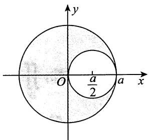

方法二 由积分区域的可加性计算.

$$
\begin{array}{l} I = \iint_ {x ^ {2} + y ^ {2} \leqslant a ^ {2}} \sqrt {x ^ {2} + y ^ {2}} d x d y - \iint_ {\left(x - \frac {a}{2}\right) ^ {2} + y ^ {2} \leqslant \frac {a ^ {2}}{4}} \sqrt {x ^ {2} + y ^ {2}} d x d y \\ = \int_ {0} ^ {2 \pi} d \theta \int_ {0} ^ {a} r ^ {2} d r - \int_ {- \frac {\pi}{2}} ^ {\frac {\pi}{2}} d \theta \int_ {0} ^ {a \cos \theta} r ^ {2} d r \\ = \frac {2}{3} a ^ {3} \left(\pi - \frac {2}{3}\right). \\ \end{array}
$$

24.【解析】令 $\left\{ \begin{array}{l}x = r\cos \theta ,\\ y = r\sin \theta , \end{array} \right.$ 其中 $\left\{ \begin{array}{ll}0\leqslant \theta \leqslant \frac{\pi}{2}\\ 0\leqslant r\leqslant 1, \end{array} \right.$ 则有

$$
\begin{array}{l} \iint_ {D} \sqrt {\frac {1 - x ^ {2} - y ^ {2}}{1 + x ^ {2} + y ^ {2}}} d x d y = \int_ {0} ^ {\frac {\pi}{2}} d \theta \int_ {0} ^ {1} \sqrt {\frac {1 - r ^ {2}}{1 + r ^ {2}}} r d r \\ = \frac {\pi}{2} \cdot \frac {1}{2} \int_ {0} ^ {1} \sqrt {\frac {1 - r ^ {2}}{1 + r ^ {2}}} \mathrm {d} (r ^ {2}) \xlongequal {\text {令} r ^ {2} = t} \frac {\pi}{4} \int_ {0} ^ {1} \sqrt {\frac {1 - t}{1 + t}} \mathrm {d} t \\ = \frac {\pi}{4} \int_ {0} ^ {1} \frac {1 - t}{\sqrt {1 - t ^ {2}}} d t = \frac {\pi}{4} \left(\int_ {0} ^ {1} \frac {d t}{\sqrt {1 - t ^ {2}}} - \int_ {0} ^ {1} \frac {t}{\sqrt {1 - t ^ {2}}} d t\right) \\ = \frac {\pi}{4} (\arcsin t + \sqrt {1 - t ^ {2}}) \Bigg | _ {0} ^ {1} = \frac {\pi}{8} (\pi - 2). \\ \end{array}
$$

  
关注公众号【考研小舟】免费考研资料&无水印PDF

  
黑白&彩印都是5分/页，满4.9全国包邮下单备注：考研小舟，送草稿纸

---

## 强化篇

1.【答案】 $\ln 2\cdot \ln (1 + \sqrt{2})$

【解析】 $\lim_{n\to \infty}\sum_{i = 1}^{n}\sum_{j = 1}^{n}\frac{1}{(n + i)\sqrt{n^2 + j^2}} = \lim_{n\to \infty}\sum_{i = 1}^{n}\sum_{j = 1}^{n}\frac{1}{\left(1 + \frac{i}{n}\right)\sqrt{1 + \left(\frac{j}{n}\right)^2}}\cdot \frac{1}{n^2}$

$$
\begin{array}{l} = \iint_ {D} \frac {1}{(1 + x) \sqrt {1 + y ^ {2}}} d x d y = \int_ {0} ^ {1} \frac {1}{1 + x} d x \int_ {0} ^ {1} \frac {1}{\sqrt {1 + y ^ {2}}} d y \\ = \ln (1 + x) \bigg | _ {0} ^ {1} \cdot \ln (y + \sqrt {1 + y ^ {2}}) \bigg | _ {0} ^ {1} = \ln 2 \cdot \ln (1 + \sqrt {2}), \\ \end{array}
$$

其中 $D = \left\{(x,y)\mid 0\leqslant x\leqslant 1,0\leqslant y\leqslant 1\right\} .$

# 2.【答案】(D)

【解析】如图所示，由轮换对称性知， $I_{1} = I_{3} = 0$ ：

在 $D_{2}$ 上， $-\pi < -3 \leqslant x - y < 0$ ；在 $D_{4}$ 上， $0 < x - y \leqslant 3 < \pi$

故 $I_{2} < 0, I_{4} > 0$

# 3.【答案】(B)

【解析】因为当 $x > 1$ 时， $\ln x <   x - 1$ ，所以在 $D$ 上，当 $x^{2} + y^{2}\neq 1$ 时， $\ln (x^2 +y^2) <   x^2 +y^2 -1$ ，从

而 $M = \iint_{D} \ln (x^{2} + y^{2}) \, \mathrm{d}x \, \mathrm{d}y < \iint_{D} (x^{2} + y^{2} - 1) \, \mathrm{d}x \, \mathrm{d}y = P.$

又因为在 $D$ 上， $1\leqslant x^{2} + y^{2}\leqslant 2$ ，所以在 $D$ 上，

$$
0 <   \ln (x ^ {2} + y ^ {2}) <   1 (x ^ {2} + y ^ {2} \neq 1), \ln (x ^ {2} + y ^ {2}) > \left[ \ln (x ^ {2} + y ^ {2}) \right] ^ {2} (x ^ {2} + y ^ {2} \neq 1),
$$

从而 $N = \iint_{D}\left[\ln (x^{2} + y^{2})\right]^{2}\mathrm{d}x\mathrm{d}y <   \iint_{D}\ln (x^{2} + y^{2})\mathrm{d}x\mathrm{d}y = M.$

于是， $N <   M <   P$ ：

4.【解析】由题意， $\overline{f} = \int_0^1 f(x)\mathrm{d}x = \frac{1}{2}$ ，又 $f(x) = 1 - a\int_{1}^{x}f(y)f(y - x)\mathrm{d}y$ ，两边关于 $x$ 作 $[0,1]$ 上的积分，有 $\int_0^1 f(x)\mathrm{d}x = 1 - a\int_0^1\mathrm{d}x\int_1^x f(y)f(y - x)\mathrm{d}y = 1 + a\int_0^1\mathrm{d}x\int_x^1 f(y)f(y - x)\mathrm{d}y$

$$
\begin{array}{l} = 1 + a \int_ {0} ^ {1} d y \int_ {0} ^ {y} f (y) f (y - x) d x = 1 + a \int_ {0} ^ {1} f (y) d y \int_ {0} ^ {y} f (y - x) d x. \\ \int_ {0} ^ {y} f (y - x) \mathrm {d} x \xlongequal {\text {令} y - x = t} \int_ {y} ^ {0} f (t) (- \mathrm {d} t) = \int_ {0} ^ {y} f (t) \mathrm {d} t, \\ \end{array}
$$

故 $\int_0^1 f(x)\mathrm{d}x = 1 + a\int_0^1 f(y)\mathrm{d}y\int_0^y f(t)\mathrm{d}t = 1 + a\int_0^1\left[\int_0^y f(t)\mathrm{d}t\right]\mathrm{d}\left[\int_0^y f(t)\mathrm{d}t\right]$

$$
= 1 + \frac {a}{2} \left[ \int_ {0} ^ {y} f (t) \mathrm {d} t \right] ^ {2} \Bigg | _ {y = 0} ^ {y = 1} = 1 + \frac {a}{2} \left[ \int_ {0} ^ {1} f (t) \mathrm {d} t \right] ^ {2},
$$

即 $\overline{f} = 1 + \frac{a}{2} (\overline{f})^2$ ，也即 $\frac{1}{2} = 1 + \frac{a}{8}$ 得 $a = -4$

# 5.【答案】(D)

【解析】 $I_{1} = \iint \limits_{\substack{0\leqslant x\leqslant 1\\ 0\leqslant y\leqslant 1}}(\sin x^{2} + \cos x^{2})  \mathrm{d}\sigma = \sqrt{2}\iint \limits_{\substack{0\leqslant x\leqslant 1\\ 0\leqslant y\leqslant 1}}\sin \left(x^{2} + \frac{\pi}{4}\right)  \mathrm{d}\sigma .$

由于 $0 \leqslant x^{2} \leqslant 1$ ，则 $\frac{\pi}{4} \leqslant x^{2} + \frac{\pi}{4} \leqslant \frac{\pi}{4} + 1$ ，故 $\frac{\sqrt{2}}{2} \leqslant \sin \left(x^{2} + \frac{\pi}{4}\right) \leqslant 1$ ，于是 $1 \leqslant I_{1} \leqslant \sqrt{2}$ .

令 $D = \left\{(x,y)\bigg|x^2 +y^2\leqslant \left(\frac{1}{2}\right)^2\right\}$ （见图），则

$$
\sqrt {x ^ {2} + y ^ {2}} \leqslant \frac {1}{2}, \sqrt {x ^ {2} + y ^ {2}} + \frac {1}{2} \leqslant 1, \ln \left(\sqrt {x ^ {2} + y ^ {2}} + \frac {1}{2}\right) \leqslant 0,
$$

故 $I_{2} \leqslant 2\iint_{|x| + |y| \leqslant \frac{1}{2}} \mathrm{d}\sigma = 2 \cdot \frac{1}{2} = 1$

综上， $I_{2}\leqslant 1\leqslant I_{1}$ ，选(D).

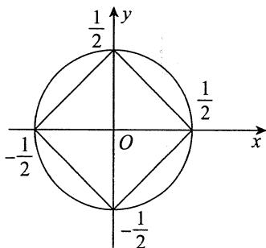

6.【答案】 $\frac{5}{16}\pi$

【解析】积分区域如图所示，故

$$
\begin{array}{l} \int_ {- 1} ^ {0} d x \int_ {\left(1 - x ^ {\frac {2}{3}}\right) ^ {\frac {3}{2}}} (1 - \sin x \cos y) d y + \int_ {0} ^ {1} d x \int_ {\left(1 - x ^ {\frac {2}{3}}\right) ^ {\frac {3}{2}}} (1 - \sin x \cos y) d y \\ = \int_ {- 1} ^ {1} d x \int_ {\left(1 - x ^ {\frac {2}{3}}\right) ^ {\frac {3}{2}}} ^ {(1 - x ^ {2}) ^ {\frac {1}{2}}} (1 - \sin x \cos y) d y = 2 \int_ {0} ^ {1} d x \int_ {\left(1 - x ^ {\frac {2}{3}}\right) ^ {\frac {3}{2}}} ^ {(1 - x ^ {2}) ^ {\frac {1}{2}}} d y \\ = 2 \int_ {0} ^ {1} \left[ (1 - x ^ {2}) ^ {\frac {1}{2}} - \left(1 - x ^ {\frac {2}{3}}\right) ^ {\frac {3}{2}} \right] d x \\ \end{array}
$$

$$
\begin{array}{l} = 2 \int_ {0} ^ {\frac {\pi}{2}} \cos^ {2} t d t - 2 \int_ {0} ^ {\frac {\pi}{2}} \cos^ {3} t \cdot 3 \sin^ {2} t \cdot \cos t d t \\ = 2 \int_ {0} ^ {\frac {\pi}{2}} \left[ \cos^ {2} t - 3 \cos^ {4} t \left(1 - \cos^ {2} t\right) \right] d t \\ = 2 \int_ {0} ^ {\frac {\pi}{2}} \left(\cos^ {2} t - 3 \cos^ {4} t + 3 \cos^ {6} t\right) d t \\ = 2 \cdot \frac {1}{2} \cdot \frac {\pi}{2} - 6 \cdot \frac {3}{4} \cdot \frac {1}{2} \cdot \frac {\pi}{2} + 6 \cdot \frac {5}{6} \cdot \frac {3}{4} \cdot \frac {1}{2} \cdot \frac {\pi}{2} \\ = \frac {\pi}{2} - \frac {9}{8} \pi + \frac {1 5}{1 6} \pi = \frac {5}{1 6} \pi . \\ \end{array}
$$

7.【解析】方法一 在极坐标系中，区域 $D$ 可表示为 $\left\{(r,\theta)\bigg|0\leqslant r\leqslant 1,0\leqslant \theta \leqslant \frac{\pi}{4}\right\}$ ，所以

$$
\begin{array}{l} \iint_ {D} \mathrm {e} ^ {(x + y) ^ {2}} (x ^ {2} - y ^ {2}) \mathrm {d} x \mathrm {d} y = \int_ {0} ^ {\frac {\pi}{4}} \mathrm {d} \theta \int_ {0} ^ {1} \mathrm {e} ^ {r ^ {2} (\sin \theta + \cos \theta) ^ {2}} r ^ {3} (\cos^ {2} \theta - \sin^ {2} \theta) \mathrm {d} r \\ = \int_ {0} ^ {1} d r \int_ {0} ^ {\frac {\pi}{4}} e ^ {r ^ {2} (\sin \theta + \cos \theta) ^ {2}} r ^ {3} (\cos^ {2} \theta - \sin^ {2} \theta) d \theta = \frac {1}{2} \int_ {0} ^ {1} r d r \int_ {0} ^ {\frac {\pi}{4}} e ^ {r ^ {2} (\sin \theta + \cos \theta) ^ {2}} d \left[ r ^ {2} (\sin \theta + \cos \theta) ^ {2} \right] \\ = \frac {1}{2} \int_ {0} ^ {1} r \left[ \mathrm {e} ^ {r ^ {2} (\sin \theta + \cos \theta) ^ {2}} \left| \begin{array}{c} \theta = \frac {\pi}{4} \\ \theta = 0 \end{array} \right. \right] \mathrm {d} r = \frac {1}{2} \int_ {0} ^ {1} r \left(\mathrm {e} ^ {2 r ^ {2}} - \mathrm {e} ^ {r ^ {2}}\right) \mathrm {d} r = \frac {(\mathrm {e} - 1) ^ {2}}{8}. \\ \end{array}
$$

方法二 令 $\left\{ \begin{array}{l} u = x - y, \\ v = x + y, \end{array} \right.$ $D_{uv} = \{(u,v)\mid u^2 +v^2\leqslant 2,v\geqslant u\geqslant 0\}$ .

因为 $\left\{ \begin{array}{l}x = \frac{u + v}{2}\\ y = \frac{v - u}{2} \end{array} \right.$ ， $(u,v)\in D_{uv}$ ， $\left\| \begin{array}{ll}\frac{\partial x}{\partial u} & \frac{\partial x}{\partial v}\\ \frac{\partial y}{\partial u} & \frac{\partial y}{\partial v} \end{array} \right\| = \frac{1}{2}$ 所以

$$
\begin{array}{l} \iint_ {D} \mathrm {e} ^ {(x + y) ^ {2}} \left(x ^ {2} - y ^ {2}\right) \mathrm {d} x \mathrm {d} y = \iint_ {D _ {u v}} \frac {1}{2} \mathrm {e} ^ {v ^ {2}} u v \mathrm {d} u \mathrm {d} v = \frac {1}{2} \int_ {0} ^ {1} u \mathrm {d} u \int_ {u} ^ {\sqrt {2 - u ^ {2}}} \mathrm {e} ^ {v ^ {2}} v \mathrm {d} v \\ = \frac {1}{4} \int_ {0} ^ {1} \left(\mathrm {e} ^ {2 - u ^ {2}} - \mathrm {e} ^ {u ^ {2}}\right) u \mathrm {d} u = \frac {\left(\mathrm {e} - 1\right) ^ {2}}{8}. \\ \end{array}
$$

8.【答案】0

【解析】令 $\left\{ \begin{array}{l}x = \frac{1}{2} r\cos \theta ,\\ y = r\sin \theta , \end{array} \right.$ 则

$$
I = \int_ {0} ^ {\frac {\pi}{2}} \mathrm {d} \theta \int_ {0} ^ {1} (1 - r ^ {2} - 2 r ^ {2} \cos^ {2} \theta) \frac {r}{2} \mathrm {d} r
$$

$$
= \frac {1}{2} \int_ {0} ^ {\frac {\pi}{2}} \mathrm {d} \theta \int_ {0} ^ {1} (1 - r ^ {2}) r \mathrm {d} r - \int_ {0} ^ {\frac {\pi}{2}} \cos^ {2} \theta \mathrm {d} \theta \int_ {0} ^ {1} r ^ {3} \mathrm {d} r = \frac {\pi}{1 6} - \frac {\pi}{1 6} = 0.
$$

9.【解析】先画出积分区域 $D$ ，如图所示，

方法一 用直角坐标.

$$
I = \int_ {1} ^ {2} d x \int_ {\frac {1}{\sqrt {3}} x} ^ {\sqrt {3} x} y e ^ {\frac {y}{x}} d y,
$$

对内层积分作积分变量代换，令 $u = \frac{y}{x}$ （视 $x$ 为常量)，当 $y = \frac{1}{\sqrt{3}} x$ 时， $u = \frac{1}{\sqrt{3}}$ ；当 $y = \sqrt{3} x$ 时， $u = \sqrt{3}$ ，得

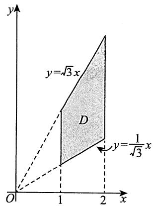

$$
\begin{array}{l} I = \int_ {1} ^ {2} d x \int_ {\frac {1}{\sqrt {3}}} ^ {\sqrt {3}} x ^ {2} u e ^ {u} d u = \int_ {1} ^ {2} x ^ {2} d x \int_ {\frac {1}{\sqrt {3}}} ^ {\sqrt {3}} u e ^ {u} d u \\ = \frac {7}{3} \left(u e ^ {u} - e ^ {u}\right) \left| \begin{array}{l} \sqrt {3} \\ \frac {1}{\sqrt {3}} \end{array} = \frac {7}{3} \left(\sqrt {3} e ^ {\sqrt {3}} - e ^ {\sqrt {3}} - \frac {1}{\sqrt {3}} e ^ {\frac {1}{\sqrt {3}}} + e ^ {\frac {1}{\sqrt {3}}}\right) \right. \\ = \frac {7}{3} (\sqrt {3} - 1) \left(e ^ {\sqrt {3}} + \frac {1}{\sqrt {3}} e ^ {\frac {1}{\sqrt {3}}}\right). \\ \end{array}
$$

方法二 用极坐标. 先将 $D$ 化成极坐标形式, 为 $D = \left\{(r, \theta) \mid \frac{1}{\cos \theta} \leqslant r \leqslant \frac{2}{\cos \theta}, \frac{\pi}{6} \leqslant \theta \leqslant \frac{\pi}{3}\right\}$ , 所以

$$
I = \int_ {\frac {\pi}{6}} ^ {\frac {\pi}{3}} d \theta \int_ {\frac {1}{\cos \theta}} ^ {\frac {2}{\cos \theta}} r \sin \theta \cdot e ^ {\tan \theta} r d r = \frac {1}{3} \int_ {\frac {\pi}{6}} ^ {\frac {\pi}{3}} \frac {\sin \theta}{\cos^ {3} \theta} \cdot (8 - 1) \cdot e ^ {\tan \theta} d \theta .
$$

令 $u = \tan \theta$ ，得

$$
\begin{array}{l} I = \frac {7}{3} \int_ {\frac {1}{\sqrt {3}}} ^ {\sqrt {3}} u e ^ {u} d u = \frac {7}{3} \left(u e ^ {u} - e ^ {u}\right) \left| \begin{array}{l} \sqrt {3} \\ \frac {1}{\sqrt {3}} \end{array} \right. = \frac {7}{3} \left(\sqrt {3} e ^ {\sqrt {3}} - e ^ {\sqrt {3}} - \frac {1}{\sqrt {3}} e ^ {\frac {1}{\sqrt {3}}} + e ^ {\frac {1}{\sqrt {3}}}\right) \\ = \frac {7}{3} (\sqrt {3} - 1) \left(e ^ {\sqrt {3}} + \frac {1}{\sqrt {3}} e ^ {\frac {1}{\sqrt {3}}}\right). \\ \end{array}
$$

10.【答案】ln cos 1

【解析】 $\int_0^1\mathrm{d}x\int_1^x\frac{\tan y}{y}\mathrm{d}y = -\int_0^1\frac{\tan y}{y}\mathrm{d}y\int_0^y\mathrm{d}x$

$$
= - \int_ {0} ^ {1} \frac {\tan y}{y} \cdot y d y = - \int_ {0} ^ {1} \frac {\sin y}{\cos y} d y = \ln \cos 1.
$$

11.【答案】 $\frac{5}{4}\pi$

【解析】 $\iint_{D} (x - 2y)^{2} \, \mathrm{d}x \, \mathrm{d}y = \iint_{D} (x^{2} + 4y^{2} - 4xy) \, \mathrm{d}x \, \mathrm{d}y.$

由于在区域 $D$ 上， $4xy$ 为 $x$ 的奇函数，区域 $D$ 关于 $y$ 轴对称，因此 $\iint_{D} (-4xy) \, \mathrm{d}x \, \mathrm{d}y = 0$ 。所以

$$
\iint_ {D} (x - 2 y) ^ {2} \mathrm {d} x \mathrm {d} y = \iint_ {D} (x ^ {2} + 4 y ^ {2}) \mathrm {d} x \mathrm {d} y.
$$

由于区域 $D$ 中交换 $x$ 与 $y$ 的位置 $D$ 不变，因此 $I = \iint_{D} (x^2 + 4y^2) \, \mathrm{d}x \, \mathrm{d}y = \iint_{D} (y^2 + 4x^2) \, \mathrm{d}x \, \mathrm{d}y$ ，即

$$
\begin{array}{l} 2 I = \iint_ {D} \left[ \left(x ^ {2} + 4 y ^ {2}\right) + \left(y ^ {2} + 4 x ^ {2}\right) \right] d x d y \\ = 5 \iint_ {D} \left(x ^ {2} + y ^ {2}\right) \mathrm {d} x \mathrm {d} y = 5 \int_ {0} ^ {2 \pi} \mathrm {d} \theta \int_ {0} ^ {1} r ^ {2} \cdot r \mathrm {d} r = \frac {5}{4} \cdot 2 \pi = \frac {5}{2} \pi . \\ \end{array}
$$

故 $I = \frac{5}{4}\pi$

【注】本题也可以不用如上技巧，而直接用极坐标求解.先用极坐标，再用华里士公式，有

$$
\begin{array}{l} \iint_ {D} (x - 2 y) ^ {2} \mathrm {d} x \mathrm {d} y = \int_ {0} ^ {2 \pi} \mathrm {d} \theta \int_ {0} ^ {1} (r \cos \theta - 2 r \sin \theta) ^ {2} r \mathrm {d} r \\ = \int_ {0} ^ {2 \pi} (\cos^ {2} \theta - 4 \cos \theta \sin \theta + 4 \sin^ {2} \theta) d \theta \int_ {0} ^ {1} r ^ {3} d r \\ = \frac {1}{4} \int_ {0} ^ {2 \pi} \left(\cos^ {2} \theta - 4 \cos \theta \sin \theta + 4 \sin^ {2} \theta\right) d \theta \\ = \frac {1}{4} \left(4 \cdot \frac {1}{2} \cdot \frac {\pi}{2} - \frac {4}{2} \cdot 0 + 4 \cdot 4 \cdot \frac {1}{2} \cdot \frac {\pi}{2}\right) \\ = \frac {5}{4} \pi . \\ \end{array}
$$

12.【解析】 $I = \iint_{D}\left[(x - 1)^{2} + (2y + 3)^{2}\right]\mathrm{d}x\mathrm{d}y$

$$
= \iint_ {D} \left(x ^ {2} + 4 y ^ {2}\right) d x d y + \iint_ {D} (- 2 x + 1 2 y) d x d y + 1 0 \iint_ {D} d x d y,
$$

其中 $I_{2} = \iint_{D} (-2x + 12y) \, \mathrm{d}x \, \mathrm{d}y = 0$ (奇函数在对称区域上的积分性质),

$I_{3} = 10\iint \limits_{D}\mathrm{d}x\mathrm{d}y = 10ab\pi$ （椭圆的面积公式）

$$
I _ {1} = \iint_ {D} (x ^ {2} + 4 y ^ {2}) \mathrm {d} x \mathrm {d} y = \iint_ {D} x ^ {2} \mathrm {d} x \mathrm {d} y + 4 \iint_ {D} y ^ {2} \mathrm {d} x \mathrm {d} y,
$$

$$
\begin{array}{l} \iint_ {D} x ^ {2} \mathrm {d} x \mathrm {d} y = 4 \int_ {0} ^ {a} \mathrm {d} x \int_ {0} ^ {\frac {b}{a} - \sqrt {a ^ {2} - x ^ {2}}} x ^ {2} \mathrm {d} y \\ = \frac {4 b}{a} \int_ {0} ^ {a} x ^ {2} \sqrt {a ^ {2} - x ^ {2}} \mathrm {d} x \xlongequal {\text {令} x = a \sin t} 4 a ^ {3} b \int_ {0} ^ {\frac {\pi}{2}} \sin^ {2} t \cos^ {2} t \mathrm {d} t \\ = 4 a ^ {3} b \left(\int_ {0} ^ {\frac {\pi}{2}} \sin^ {2} t \mathrm {d} t - \int_ {0} ^ {\frac {\pi}{2}} \sin^ {4} t \mathrm {d} t\right) \\ = 4 a ^ {3} b \left(\frac {1}{2} \cdot \frac {\pi}{2} - \frac {3}{4} \cdot \frac {1}{2} \cdot \frac {\pi}{2}\right) = \frac {\pi}{4} a ^ {3} b. \\ \end{array}
$$

同理， $4\iint_{D}y^{2}\mathrm{d}x\mathrm{d}y = \pi ab^{3}$ ，则 $I_{1} = \frac{\pi}{4} a^{3}b + \pi ab^{3}$ ，所以 $I = 10\pi ab + \frac{\pi}{4} a^3 b + \pi ab^3$

13.【解析】设 $D_{1}$ 是 $D$ 在第一象限的部分，如图所示，则由对称性，得

$$
\begin{array}{l} \iint_ {D} \frac {x ^ {2} + y ^ {2}}{| x | + | y |} d x d y = 4 \iint_ {D _ {1}} \frac {x ^ {2} + y ^ {2}}{x + y} d x d y = 4 \iint_ {D _ {1}} \frac {r ^ {2}}{\cos \theta + \sin \theta} d r d \theta \\ = 4 \int_ {0} ^ {\frac {\pi}{2}} d \theta \int_ {\frac {1}{\cos \theta + \sin \theta}} ^ {\frac {2}{\cos \theta + \sin \theta}} \frac {r ^ {2}}{\cos \theta + \sin \theta} d r \\ = \frac {2 8}{3} \int_ {0} ^ {\frac {\pi}{2}} \frac {1}{(\cos \theta + \sin \theta) ^ {4}} d \theta \\ = \frac {7}{3} \int_ {0} ^ {\frac {\pi}{2}} \frac {1}{\sin^ {4} \left(\theta + \frac {\pi}{4}\right)} d \theta \\ = \frac {7}{3} \int_ {0} ^ {\frac {\pi}{2}} \csc^ {4} \left(\theta + \frac {\pi}{4}\right) d \theta \\ = - \frac {7}{3} \int_ {0} ^ {\frac {\pi}{2}} \left[ \cot^ {2} \left(\theta + \frac {\pi}{4}\right) + 1 \right] d \left[ \cot \left(\theta + \frac {\pi}{4}\right) \right] \\ = - \frac {7}{3} \left[ \frac {1}{3} \cot^ {3} \left(\theta + \frac {\pi}{4}\right) + \cot \left(\theta + \frac {\pi}{4}\right) \right] \Bigg | _ {0} ^ {\frac {\pi}{2}} = \frac {5 6}{9}. \\ \end{array}
$$

14.【答案】 $\frac{1}{2}$

【解析】交换积分次序，得 $\int_{-1}^{1}\mathrm{d}y\int_{-1}^{y}y\sqrt{1 + x^2 - y^2}\mathrm{d}x = \int_{-1}^{1}\mathrm{d}x\int_{x}^{1}y\sqrt{1 + x^2 - y^2}\mathrm{d}y.$

又因为 $\int_{x}^{1}y\sqrt{1 + x^2 - y^2}\mathrm{d}y = -\frac{1}{3} (1 + x^2 -y^2)^{\frac{3}{2}}\bigg|_x^1 = \frac{1}{3} (1 - |x|^3)$ ，所以

$$
\begin{array}{l} \text {原 式} = \int_ {- 1} ^ {1} \mathrm {d} x \int_ {x} ^ {1} y \sqrt {1 + x ^ {2} - y ^ {2}} \mathrm {d} y = \frac {1}{3} \int_ {- 1} ^ {1} (1 - | x | ^ {3}) \mathrm {d} x \\ = \frac {2}{3} \int_ {0} ^ {1} (1 - x ^ {3}) d x = \frac {2}{3} \times \frac {3}{4} = \frac {1}{2}. \\ \end{array}
$$

15.【答案】 $\frac{22}{15}$

【解析】积分区域如图所示，则

$$
\begin{array}{l} \int_ {- 1} ^ {1} \mathrm {d} x \int_ {x ^ {2}} ^ {\sqrt {2 - x ^ {2}}} (x + 1) y \mathrm {d} y \xlongequal {\text {对 称 性}} \int_ {- 1} ^ {1} \mathrm {d} x \int_ {x ^ {2}} ^ {\sqrt {2 - x ^ {2}}} y \mathrm {d} y \\ = 2 \int_ {0} ^ {1} d x \int_ {x ^ {2}} ^ {\sqrt {2 - x ^ {2}}} y d y = \int_ {0} ^ {1} \left(y ^ {2} \left| _ {x ^ {2}} ^ {\sqrt {2 - x ^ {2}}} \right.\right) d x \\ = \int_ {0} ^ {1} (2 - x ^ {2} - x ^ {4}) \mathrm {d} x = \left. \left(2 x - \frac {1}{3} x ^ {3} - \frac {1}{5} x ^ {5}\right) \right| _ {0} ^ {1} = \frac {2 2}{1 5}. \\ \end{array}
$$

16.【解析】积分区域 $D$ 关于 $x$ 轴对称，记 $D_{1}$ 为 $D$ 在 $x$ 轴上方的部分，用直线 $y = x$ 将 $D_{1}$ 分割为 $D_{11}$ 与 $D_{12}$ 两部分，如图所示，则

$$
\begin{array}{l} \iint_ {D} | x - | y | | \mathrm {d} \sigma = 2 \iint_ {D _ {1}} | x - y | \mathrm {d} \sigma \\ = 2 \iint_ {D _ {1 1}} (x - y) d \sigma - 2 \iint_ {D _ {1 2}} (x - y) d \sigma \\ = 2 \int_ {0} ^ {1} d x \int_ {0} ^ {x} (x - y) d y - 2 \int_ {\frac {\pi}{4}} ^ {\frac {\pi}{2}} d \theta \int_ {0} ^ {2 \cos \theta} r ^ {2} (\cos \theta - \sin \theta) d r \\ = \int_ {0} ^ {1} x ^ {2} d x - \frac {1 6}{3} \int_ {\frac {\pi}{4}} ^ {\frac {\pi}{2}} \cos^ {3} \theta (\cos \theta - \sin \theta) d \theta \\ = \frac {1}{3} - \frac {4}{3} \int_ {\frac {\pi}{4}} ^ {\frac {\pi}{2}} \left(\frac {3}{2} + 2 \cos 2 \theta + \frac {1}{2} \cos 4 \theta\right) d \theta - \frac {1 6}{3} \int_ {\frac {\pi}{4}} ^ {\frac {\pi}{2}} \cos^ {3} \theta d (\cos \theta) \\ \end{array}
$$

$$
\begin{array}{l} = \frac {1}{3} - \frac {4}{3} \left(\frac {3}{2} \theta + \sin 2 \theta + \frac {1}{8} \sin 4 \theta\right) \left| \begin{array}{l} \frac {\pi}{2} \\ \frac {\pi}{4} \end{array} - \frac {4}{3} \cos^ {4} \theta \right| \frac {\pi}{4} \\ = \frac {1}{3} - \frac {4}{3} \left(\frac {3 \pi}{8} - 1\right) + \frac {1}{3} = 2 - \frac {\pi}{2}. \\ \end{array}
$$

17.【解析】用曲线 $\left(x - \frac{1}{\sqrt{2}}\right)^2 + \left(y - \frac{1}{\sqrt{2}}\right)^2 = 1$ 将 $D$ 划分为 $D_{1}, D_{2}$ 两部分, 如图所示, 则有

$$
\begin{array}{l} \iint_ {D} \left| x ^ {2} + y ^ {2} - \sqrt {2} (x + y) \right| d x d y \\ = - \iint_ {D _ {1}} \left[ x ^ {2} + y ^ {2} - \sqrt {2} (x + y) \right] d x d y + \iint_ {D _ {2}} \left[ x ^ {2} + y ^ {2} - \sqrt {2} (x + y) \right] d x d y \\ = - \iint_ {D _ {1}} \left[ x ^ {2} + y ^ {2} - \sqrt {2} (x + y) \right] d x d y + \iint_ {D - D _ {1}} \left[ x ^ {2} + y ^ {2} - \sqrt {2} (x + y) \right] d x d y \\ = - 2 \iint_ {D _ {1}} \left[ x ^ {2} + y ^ {2} - \sqrt {2} (x + y) \right] d x d y + \iint_ {D} \left[ x ^ {2} + y ^ {2} - \sqrt {2} (x + y) \right] d x d y \\ = - 4 \int_ {- \frac {\pi}{4}} ^ {\frac {\pi}{4}} d \theta \int_ {0} ^ {\sqrt {2} (\cos \theta + \sin \theta)} \left[ r ^ {3} - \sqrt {2} r ^ {2} (\cos \theta + \sin \theta) \right] d r + \iint_ {D} (x ^ {2} + y ^ {2}) d x d y \\ = \frac {4}{3} \int_ {- \frac {\pi}{4}} ^ {\frac {\pi}{4}} (\cos \theta + \sin \theta) ^ {4} d \theta + \int_ {0} ^ {2 \pi} d \theta \int_ {0} ^ {2} r ^ {3} d r = \frac {1 6}{3} \int_ {- \frac {\pi}{4}} ^ {\frac {\pi}{4}} \sin^ {4} \left(\theta + \frac {\pi}{4}\right) d \theta + 8 \pi \\ \xlongequal {\theta + \frac {\pi}{4} = t} \frac {1 6}{3} \int_ {0} ^ {\frac {\pi}{2}} \sin^ {4} t d t + 8 \pi = \frac {1 6}{3} \cdot \frac {3}{4} \cdot \frac {1}{2} \cdot \frac {\pi}{2} + 8 \pi = 9 \pi . \\ \end{array}
$$

18.【解析】作出区域 $D$ ，如图所示.在 $D$ 中作曲线 $y = \frac{1}{x}$ 及直线 $x = \frac{1}{2}$ ，将 $D$ 划分成 $D_{1}$ ， $D_{2}$ 及 $D_{3}$ 三部分(见图)，则

$$
\left| x y - 1 \right| = \left\{ \begin{array}{l l} 1 - x y, & (x, y) \in D _ {1}, \\ 1 - x y, & (x, y) \in D _ {2}, \\ x y - 1, & (x, y) \in D _ {3}, \end{array} \right.
$$

$$
\begin{array}{l} \iint_ {D} | x y - 1 | \mathrm {d} \sigma = \iint_ {D _ {1}} (1 - x y) \mathrm {d} \sigma + \iint_ {D _ {2}} (1 - x y) \mathrm {d} \sigma + \iint_ {D _ {3}} (x y - 1) \mathrm {d} \sigma \\ = \int_ {0} ^ {\frac {1}{2}} d x \int_ {0} ^ {2} (1 - x y) d y + \int_ {\frac {1}{2}} ^ {2} d x \int_ {0} ^ {\frac {1}{x}} (1 - x y) d y + \int_ {\frac {1}{2}} ^ {2} d x \int_ {\frac {1}{x}} ^ {2} (x y - 1) d y \\ = \int_ {0} ^ {\frac {1}{2}} (2 - 2 x) d x + \int_ {\frac {1}{2}} ^ {2} \frac {1}{2 x} d x + \int_ {\frac {1}{2}} ^ {2} \left(2 x - 2 + \frac {1}{2 x}\right) d x = \frac {3}{2} + 2 \ln 2. \\ \end{array}
$$

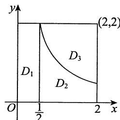

19.【解析】积分区域 $D$ 如图所示，

$$
\begin{array}{l} \iint_ {D} \left(x ^ {2} + y ^ {2}\right) \mathrm {d} \sigma = \int_ {\frac {\pi}{4}} ^ {\frac {\pi}{2}} \mathrm {d} \theta \int_ {2 \cos \theta} ^ {4 \cos \theta} r ^ {3} \mathrm {d} r = \int_ {\frac {\pi}{4}} ^ {\frac {\pi}{2}} \left(\left. \frac {1}{4} r ^ {4} \right| _ {2 \cos \theta} ^ {4 \cos \theta}\right) \mathrm {d} \theta \\ = 6 0 \int_ {\frac {\pi}{4}} ^ {\frac {\pi}{2}} \cos^ {4} \theta d \theta = 6 0 \int_ {\frac {\pi}{4}} ^ {\frac {\pi}{2}} \frac {(1 + \cos 2 \theta) ^ {2}}{4} d \theta \\ = 1 5 \int_ {\frac {\pi}{4}} ^ {\frac {\pi}{2}} (1 + 2 \cos 2 \theta + \cos^ {2} 2 \theta) d \theta \\ = 1 5 \left(\frac {1}{4} \pi + \sin 2 \theta \left| \frac {\frac {\pi}{2}}{\frac {\pi}{4}} + \int_ {\frac {\pi}{4}} ^ {\frac {\pi}{2}} \frac {1 + \cos 4 \theta}{2} d \theta\right) \right. \\ = 1 5 \left(\frac {1}{4} \pi - 1 + \frac {1}{2} \cdot \frac {\pi}{4} + \frac {1}{8} \sin 4 \theta \left| \begin{array}{l} \frac {\pi}{2} \\ \frac {\pi}{4} \end{array} \right.\right) \\ = 1 5 \left(\frac {1}{4} \pi - 1 + \frac {\pi}{8}\right) = 1 5 \left(\frac {3}{8} \pi - 1\right). \\ \end{array}
$$

20.【答案】 $2\pi - \frac{16}{9}$

【解析】画出积分区域(见图)，用极坐标.

原式 $= \iint_{D_1 \cup D_2} r^2 \, \mathrm{d}r \, \mathrm{d}\theta = \iint_{D_1} r^2 \, \mathrm{d}r \, \mathrm{d}\theta + \iint_{D_2} r^2 \, \mathrm{d}r \, \mathrm{d}\theta$

$$
= \int_ {0} ^ {\frac {\pi}{2}} d \theta \int_ {2 \cos \theta} ^ {2} r ^ {2} d r + \int_ {\frac {\pi}{2}} ^ {\frac {3 \pi}{4}} d \theta \int_ {0} ^ {2} r ^ {2} d r = 2 \pi - \frac {1 6}{9}.
$$

21.【解析】 $D$ 是一正方形区域，如图所示

$$
\begin{array}{l} \iint_ {D} \sin \left(\max  \left\{x ^ {2}, y ^ {2} \right\}\right) d \sigma = \iint_ {D _ {1}} \sin x ^ {2} d \sigma + \iint_ {D _ {2}} \sin y ^ {2} d \sigma \\ = 2 \iint_ {D _ {1}} \sin x ^ {2} d \sigma = 2 \int_ {0} ^ {\sqrt {\pi}} d x \int_ {0} ^ {x} \sin x ^ {2} d y \\ = 2 \int_ {0} ^ {\sqrt {\pi}} x \sin x ^ {2} d x = \int_ {0} ^ {\sqrt {\pi}} \sin x ^ {2} d \left(x ^ {2}\right) \\ = - \cos x ^ {2} \left| _ {0} ^ {\sqrt {\pi}} \right. = - (- 1 - 1) = 2. \\ \end{array}
$$

22.【答案】 $\frac{\pi}{20}$

【解析】交换积分次序，得

$$
\begin{array}{l} \int_ {0} ^ {1} \mathrm {d} y \int_ {\sqrt {y}} ^ {1} \sqrt {x ^ {4} - y ^ {2}} \mathrm {d} x = \int_ {0} ^ {1} \mathrm {d} x \int_ {0} ^ {x ^ {2}} \sqrt {x ^ {4} - y ^ {2}} \mathrm {d} y \\ = \int_ {0} ^ {1} d x \int_ {0} ^ {x ^ {2}} \sqrt {\left(x ^ {2}\right) ^ {2} - y ^ {2}} d y = \int_ {0} ^ {1} \frac {\pi}{4} x ^ {4} d x = \frac {\pi}{2 0}. \\ \end{array}
$$

【注】 $\int_0^a\sqrt{a^2 - y^2}\mathrm{d}y(a > 0)$ 是以 $a$ 为半径的圆在第一象限部分的面积，利用定积分的几何意义计算定积分是一种“技巧”

23.【答案】 $\frac{1}{6} -\frac{1}{3e}$

【解析】交换积分次序，得

$$
\begin{array}{l} \int_ {0} ^ {1} x ^ {2} d x \int_ {x} ^ {1} e ^ {- y ^ {2}} d y = \int_ {0} ^ {1} e ^ {- y ^ {2}} d y \int_ {0} ^ {y} x ^ {2} d x \\ = \int_ {0} ^ {1} e ^ {- y ^ {2}} \cdot \frac {y ^ {3}}{3} d y = \frac {1}{3} \int_ {0} ^ {1} y ^ {3} \cdot e ^ {- y ^ {2}} d y \\ = \frac {1}{3} \cdot \left(- \frac {1}{2}\right) \int_ {0} ^ {1} y ^ {2} d \left(e ^ {- y ^ {2}}\right) \stackrel {y ^ {2} = t} {=} - \frac {1}{6} \int_ {0} ^ {1} t d \left(e ^ {- t}\right) \\ = - \frac {1}{6} \left(t e ^ {- t} + e ^ {- t}\right) \Bigg | _ {0} ^ {1} = \frac {1}{6} - \frac {1}{3 e}. \\ \end{array}
$$

24.【解析】积分区域 $D$ 如图所示，由极坐标表示：

$x^{2} + y^{2} = 4, y \geqslant 0$ 化为 $r = 2, 0 \leqslant \theta \leqslant \pi$ ;

$(x - 1)^2 + y^2 = 1, y \geqslant 0$ 化为 $r = 2\cos \theta, 0 \leqslant \theta \leqslant \frac{\pi}{2}$ .

$$
\begin{array}{l} \iint_ {D} (x y + y ^ {2}) \mathrm {d} \sigma = \int_ {0} ^ {\frac {\pi}{2}} \mathrm {d} \theta \int_ {2 \cos \theta} ^ {2} (r ^ {2} \sin \theta \cos \theta + r ^ {2} \sin^ {2} \theta) r \mathrm {d} r + \int_ {\frac {\pi}{2}} ^ {\pi} \mathrm {d} \theta \int_ {0} ^ {2} (r ^ {2} \sin \theta \cos \theta + r ^ {2} \sin^ {2} \theta) r \mathrm {d} r \\ = \int_ {0} ^ {\frac {\pi}{2}} 4 (1 - \cos^ {4} \theta) (\sin \theta \cos \theta + \sin^ {2} \theta) d \theta + \int_ {\frac {\pi}{2}} ^ {\pi} 4 (\sin \theta \cos \theta + \sin^ {2} \theta) d \theta \\ = 4 \int_ {0} ^ {\pi} (\sin \theta \cos \theta + \sin^ {2} \theta) d \theta - 4 \int_ {0} ^ {\frac {\pi}{2}} \cos^ {5} \theta \sin \theta d \theta - 4 \int_ {0} ^ {\frac {\pi}{2}} \cos^ {4} \theta \sin^ {2} \theta d \theta \\ = 0 + 8 \int_ {0} ^ {\frac {\pi}{2}} \sin^ {2} \theta d \theta + 4 \int_ {0} ^ {\frac {\pi}{2}} \cos^ {5} \theta d (\cos \theta) - 4 \int_ {0} ^ {\frac {\pi}{2}} \cos^ {4} \theta d \theta + 4 \int_ {0} ^ {\frac {\pi}{2}} \cos^ {6} \theta d \theta \\ = 8 \cdot \frac {1}{2} \cdot \frac {\pi}{2} + \frac {2}{3} \left(\cos^ {6} \frac {\pi}{2} - 1\right) - 4 \cdot \frac {3}{4} \cdot \frac {1}{2} \cdot \frac {\pi}{2} + 4 \cdot \frac {5}{6} \cdot \frac {3}{4} \cdot \frac {1}{2} \cdot \frac {\pi}{2} \\ \end{array}
$$

$$
= \frac {1 5}{8} \pi - \frac {2}{3}.
$$

【注】计算 $\int_{0}^{\frac{\pi}{2}}\sin^{n}x\mathrm{d}x$ 与 $\int_0^{\frac{\pi}{2}}\cos^n x\mathrm{d}x$ 用到华里士公式, 请考生切记此公式.

25.【答案】 $\frac{5\pi}{2}$

【解析】方法一 令 $x = 1 + r\cos \theta, y = 1 + r\sin \theta$ ，则

$$
\begin{array}{l} \iint_ {D} \left(x ^ {2} + y ^ {2}\right) \mathrm {d} \sigma = \int_ {0} ^ {2 \pi} \mathrm {d} \theta \int_ {0} ^ {1} \left(r ^ {2} + 2 r \cos \theta + 2 r \sin \theta + 2\right) r \mathrm {d} r \\ = \int_ {0} ^ {2 \pi} d \theta \int_ {0} ^ {1} \left(r ^ {3} + 2 r ^ {2} \cos \theta + 2 r ^ {2} \sin \theta + 2 r\right) d r \\ = \int_ {0} ^ {2 \pi} \left(\frac {5}{4} + \frac {2}{3} \cos \theta + \frac {2}{3} \sin \theta\right) d \theta \\ = \left. \left(\frac {5}{4} \theta + \frac {2}{3} \sin \theta - \frac {2}{3} \cos \theta\right) \right| _ {0} ^ {2 \pi} = \frac {5 \pi}{2}. \\ \end{array}
$$

方法二 作变换 $x = u + 1, y = v + 1$ ，在此变换下，与 $D$ 对应的闭区域为 $D' = \{(u, v) | u^2 + v^2 \leqslant 1\}$ ，则有 $J(u, v) = \frac{\partial(x, y)}{\partial(u, v)} = 1$ ，从而有

$$
\begin{array}{l} \iint_ {D} \left(x ^ {2} + y ^ {2}\right) \mathrm {d} \sigma = \iint_ {D ^ {\prime}} \left[ (u + 1) ^ {2} + (v + 1) ^ {2} \right] | J (u, v) | \mathrm {d} \sigma \\ = \iint_ {D ^ {\prime}} (u ^ {2} + v ^ {2} + 2) \mathrm {d} \sigma \\ = \iint_ {D ^ {\prime}} \left(u ^ {2} + v ^ {2}\right) \mathrm {d} \sigma + \iint_ {D ^ {\prime}} 2 \mathrm {d} \sigma \\ = \int_ {0} ^ {2 \pi} d \theta \int_ {0} ^ {1} r ^ {3} d r + 2 \pi = \frac {5 \pi}{2}. \\ \end{array}
$$

26.【解析】将 $D$ 分成第一、二、三、四象限中的4块，分别记为 $D_{1}, D_{2}, D_{3}, D_{4}$ (见图)，用极坐标，先对 $D_{1}$ 进行积分：

$$
\begin{array}{l} \iint_ {D _ {1}} \mathrm {e} ^ {\frac {| y |}{| x | + | y |}} \mathrm {d} \sigma = \int_ {0} ^ {\frac {\pi}{2}} \mathrm {d} \theta \int_ {0} ^ {\frac {1}{\sin \theta + \cos \theta}} \mathrm {e} ^ {\frac {\sin \theta}{\sin \theta + \cos \theta}} r \mathrm {d} r \\ = \frac {1}{2} \int_ {0} ^ {\frac {\pi}{2}} e ^ {\frac {\sin \theta}{\sin \theta + \cos \theta}} \cdot \frac {1}{(\sin \theta + \cos \theta) ^ {2}} d \theta \\ \end{array}
$$

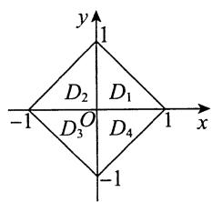

$$
\begin{array}{l} = \frac {1}{2} \int_ {0} ^ {\frac {\pi}{2}} e ^ {\frac {\sin \theta}{\sin \theta + \cos \theta}} d \left(\frac {\sin \theta}{\sin \theta + \cos \theta}\right) \\ = \frac {1}{2} e ^ {\frac {\sin \theta}{\sin \theta + \cos \theta}} \left| _ {0} ^ {\frac {\pi}{2}} = \frac {1}{2} (e - 1) \right.. \\ \end{array}
$$

根据对称性, 被积函数关于 $x, y$ 均为偶函数, 且积分区域关于 $y$ 轴, $x$ 轴对称, 故

$$
\iint_ {D} \mathrm {e} ^ {\frac {| y |}{| x | + | y |}} \mathrm {d} \sigma = 4 \iint_ {D _ {1}} \mathrm {e} ^ {\frac {| y |}{| x | + | y |}} \mathrm {d} \sigma = 4 \cdot \frac {1}{2} (\mathrm {e} - 1) = 2 (\mathrm {e} - 1).
$$

# 27.【答案】(D)

【解析】积分区域如图所示.

$$
\begin{array}{l} \int_ {0} ^ {+ \infty} d y \int_ {y} ^ {2 y} e ^ {- x ^ {2}} d x = \int_ {0} ^ {+ \infty} d x \int_ {\frac {x}{2}} ^ {x} e ^ {- x ^ {2}} d y = \int_ {0} ^ {+ \infty} \frac {x}{2} e ^ {- x ^ {2}} d x \\ = - \frac {1}{4} \int_ {0} ^ {+ \infty} e ^ {- x ^ {2}} d (- x ^ {2}) = - \frac {1}{4} \cdot e ^ {- x ^ {2}} \Bigg | _ {0} ^ {+ \infty} = \frac {1}{4}. \\ \end{array}
$$

28.【答案】 $-\pi \left(\mathrm{e}^{\pi} - \mathrm{e}^{\frac{1}{\pi}}\right)$

【解析】当 $t > 1$ 时，设区域 $D = \left\{(x,y) \mid 1 \leqslant x \leqslant t^2, \sqrt{x} \leqslant y \leqslant t\right\}$ ，从而

$$
f (t) = - \int_ {1} ^ {t ^ {2}} d x \int_ {\sqrt {x}} ^ {t} e ^ {\frac {x}{y}} d y = - \iint_ {D} e ^ {\frac {x}{y}} d x d y,
$$

将二重积分写为先对 $x$ ，后对 $y$ 的累次积分，有 $f(t) = -\int_{1}^{t}\mathrm{d}y\int_{1}^{y^2}\mathrm{e}^{\frac{x}{y}}\mathrm{d}x = -\int_{1}^{t}y\left(\mathrm{e}^{y} - \mathrm{e}^{\frac{1}{y}}\right)\mathrm{d}y$ ，所以

$$
f ^ {\prime} (t) = - t \left(e ^ {t} - e ^ {\frac {1}{t}}\right),
$$

从而 $f^{\prime}(\pi) = -\pi \left(\mathrm{e}^{\pi} - \mathrm{e}^{\frac{1}{\pi}}\right)$

【注】由于所求为 $f^{\prime}(\pi)$ ， $\pi >1$ ，故只研究 $t > 1$ 即可.

# 29.【答案】 $4\pi$

【解析】方法一 在极坐标系中，将 $(x - 1)^2 + (y - 1)^2 = 2$ 化为 $r = 2(\cos \theta + \sin \theta) = 2\sqrt{2}\sin \left(\frac{\pi}{4} + \theta\right)$ .

$$
\iint_ {D} (x + y) \mathrm {d} \sigma = \int_ {- \frac {\pi}{4}} ^ {\frac {3 \pi}{4}} \mathrm {d} \theta \int_ {0} ^ {2 \sqrt {2} \sin \left(\frac {\pi}{4} + \theta\right)} r ^ {2} (\cos \theta + \sin \theta) \mathrm {d} r
$$

$$
\begin{array}{l} = \int_ {- \frac {\pi}{4}} ^ {\frac {3 \pi}{4}} d \theta \int_ {0} ^ {2 \sqrt {2} \sin \left(\frac {\pi}{4} + \theta\right)} \sqrt {2} r ^ {2} \sin \left(\frac {\pi}{4} + \theta\right) d r \\ = \frac {2 ^ {5}}{3} \int_ {- \frac {\pi}{4}} ^ {\frac {3 \pi}{4}} \sin^ {4} \left(\frac {\pi}{4} + \theta\right) d \theta = \frac {2 ^ {5}}{3} \int_ {0} ^ {\pi} \sin^ {4} t d t \\ = \frac {6 4}{3} \int_ {0} ^ {\frac {\pi}{2}} \sin^ {4} t \mathrm {d} t = \frac {6 4}{3} \cdot \frac {3}{4} \cdot \frac {1}{2} \cdot \frac {\pi}{2} = 4 \pi . \\ \end{array}
$$

方法二 用直角坐标.

$$
\begin{array}{l} \iint_ {D} (x + y) \mathrm {d} \sigma = \iint_ {D} \left[ (x - 1) + (y - 1) + 2 \right] \mathrm {d} \sigma \\ = \iint_ {D} (x - 1) d \sigma + \iint_ {D} (y - 1) d \sigma + 2 \iint_ {D} d \sigma . \\ \end{array}
$$

$$
\begin{array}{l} \iint_ {D} (x - 1) \mathrm {d} \sigma = \int_ {1 - \sqrt {2}} ^ {1 + \sqrt {2}} \mathrm {d} x \int_ {1 - \sqrt {2 - (x - 1) ^ {2}}} ^ {1 + \sqrt {2 - (x - 1) ^ {2}}} (x - 1) \mathrm {d} y \\ = \int_ {1 - \sqrt {2}} ^ {1 + \sqrt {2}} 2 (x - 1) \sqrt {2 - (x - 1) ^ {2}} d x \stackrel {x - 1 = t} {=} \int_ {- \sqrt {2}} ^ {\sqrt {2}} 2 t \sqrt {2 - t ^ {2}} d t = 0. \\ \end{array}
$$

同理， $\iint_{D}(y - 1)\mathrm{d}\sigma = 0$ ，而 $2\iint_{D}\mathrm{d}\sigma = 2\cdot 2\pi = 4\pi$ ，所以原式 $= 4\pi$ ：

30.【解析】如图所示，将 $D$ 分成 $D_{1} \cup D_{2}$ ， $D_{1}$ 与 $D_{2}$ 除边界之外无公共部分。

$$
\begin{array}{l} \iint_ {D} x \left| y - e ^ {x} \right| d \sigma = \iint_ {D _ {1}} x \left| y - e ^ {x} \right| d \sigma + \iint_ {D _ {2}} x \left| y - e ^ {x} \right| d \sigma \\ = \int_ {0} ^ {1} d x \int_ {e ^ {x}} ^ {2 e} x \left(y - e ^ {x}\right) d y + \int_ {0} ^ {1} d x \int_ {0} ^ {e ^ {x}} x \left(e ^ {x} - y\right) d y \\ = \int_ {0} ^ {1} \left[ \left. \left(\frac {x y ^ {2}}{2} - y x e ^ {x}\right) \right| _ {y = e ^ {x}} ^ {y = 2 e} \right] d x + \int_ {0} ^ {1} \left[ \left. \left(y x e ^ {x} - \frac {x y ^ {2}}{2}\right) \right| _ {y = 0} ^ {y = e ^ {x}} \right] d x \\ = \int_ {0} ^ {1} \left(2 e ^ {2} x - 2 e x e ^ {x} + \frac {1}{2} x e ^ {2 x}\right) d x + \int_ {0} ^ {1} \frac {x}{2} e ^ {2 x} d x \\ = \frac {5}{4} e ^ {2} - 2 e + \frac {1}{4}. \\ \end{array}
$$

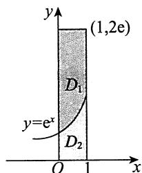

31.【解析】如图所示，曲线 $x^{2} + y^{2} = 1$ 将 $D$ 分成三块，中间一块记为 $D_{3}$ ，左、右两块分别记为 $D_{1}$ 与 $D_{2}$ ，则

$$
f (x, y) = \max  \left\{\sqrt {x ^ {2} + y ^ {2}}, 1 \right\}
$$

$$
= \left\{ \begin{array}{l l} \sqrt {x ^ {2} + y ^ {2}}, & (x, y) \in D _ {1} \bigcup D _ {2}, \\ 1, & (x, y) \in D _ {3}, \end{array} \right.
$$

$$
\begin{array}{l} \iint_ {D} f (x, y) \mathrm {d} \sigma = \iint_ {D _ {1} \cup D _ {2}} \sqrt {x ^ {2} + y ^ {2}} \mathrm {d} \sigma + \iint_ {D _ {3}} \mathrm {d} \sigma \\ = \int_ {\frac {\pi}{4}} ^ {\frac {3 \pi}{4}} \mathrm {d} \theta \int_ {1} ^ {\frac {1}{\sin \theta}} r ^ {2} \mathrm {d} r + \frac {\pi}{4} \\ = \frac {1}{3} \int_ {\frac {\pi}{4}} ^ {\frac {3 \pi}{4}} \left(\csc^ {3} \theta - 1\right) d \theta + \frac {\pi}{4} \\ = \frac {1}{3} \int_ {\frac {\pi}{4}} ^ {\frac {3 \pi}{4}} \csc^ {3} \theta d \theta + \frac {\pi}{1 2}. \\ \end{array}
$$

而 $\int_{\frac{\pi}{4}}^{\frac{3\pi}{4}}\csc^3\theta \mathrm{d}\theta = \int_{\frac{\pi}{4}}^{\frac{3\pi}{4}}\csc \theta \csc^2\theta \mathrm{d}\theta$

$$
\begin{array}{l} = - \int_ {\frac {\pi}{4}} ^ {\frac {3 \pi}{4}} \csc \theta d (\cot \theta) = - \left(\csc \theta \cot \theta \left| \begin{array}{l} \frac {3 \pi}{4} \\ \frac {\pi}{4} \end{array} + \int_ {\frac {\pi}{4}} ^ {\frac {3 \pi}{4}} \cot^ {2} \theta \csc \theta d \theta \right.\right) \\ = - \left[ - \sqrt {2} - \sqrt {2} + \int_ {\frac {\pi}{4}} ^ {\frac {3 \pi}{4}} \left(\csc^ {2} \theta - 1\right) \csc \theta d \theta \right], \\ \end{array}
$$

所以

$$
\begin{array}{l} \int_ {\frac {\pi}{4}} ^ {\frac {3 \pi}{4}} \csc^ {3} \theta d \theta = \sqrt {2} + \frac {1}{2} \int_ {\frac {\pi}{4}} ^ {\frac {3 \pi}{4}} \csc \theta d \theta \\ = \sqrt {2} + \frac {1}{2} (\ln | \csc \theta - \cot \theta |) \left| \begin{array}{l} \frac {3 \pi}{4} \\ \frac {\pi}{4} \end{array} \right. \\ = \sqrt {2} + \frac {1}{2} \left[ \ln (\sqrt {2} + 1) - \ln (\sqrt {2} - 1) \right] \\ = \sqrt {2} + \ln (\sqrt {2} + 1). \\ \end{array}
$$

故原式 $= \frac{\sqrt{2}}{3} +\frac{1}{3}\ln (\sqrt{2} +1) + \frac{\pi}{12}.$

32.【解析】积分区域如图所示，则

原式 $= -\int_{0}^{1}\mathrm{d}x\int_{x}^{1}(\mathrm{e}^{-y^2} + \mathrm{e}^y\sin y)\mathrm{d}y$

$$
= - \int_ {0} ^ {1} d y \int_ {0} ^ {y} \left(e ^ {- y ^ {2}} + e ^ {y} \sin y\right) d x
$$

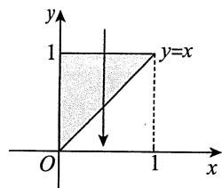

$$
\begin{array}{l} = - \int_ {0} ^ {1} y e ^ {- y ^ {2}} d y - \int_ {0} ^ {1} y e ^ {y} \sin y d y \\ = \frac {1}{2} e ^ {- y ^ {2}} \left| _ {0} ^ {1} - \int_ {0} ^ {1} y e ^ {y} \sin y d y \right. \\ = \frac {1}{2} e ^ {- 1} - \frac {1}{2} - \int_ {0} ^ {1} y e ^ {y} \sin y d y. \\ \end{array}
$$

其中，

$$
\begin{array}{l} \int_ {0} ^ {1} y \mathrm {e} ^ {y} \sin y \mathrm {d} y = \int_ {0} ^ {1} y \sin y \mathrm {d} (\mathrm {e} ^ {y}) \\ = y \sin y \cdot e ^ {y} \left| _ {0} ^ {1} - \int_ {0} ^ {1} e ^ {y} (\sin y + y \cos y) d y \right. \\ = \mathrm {e} \sin 1 - \int_ {0} ^ {1} \mathrm {e} ^ {y} \sin y \mathrm {d} y - \int_ {0} ^ {1} y \cos y \mathrm {d} (\mathrm {e} ^ {y}) \\ = \mathrm {e} \sin 1 - \int_ {0} ^ {1} \mathrm {e} ^ {y} \sin y \mathrm {d} y - y \cos y \cdot \mathrm {e} ^ {y} \left| _ {0} ^ {1} + \int_ {0} ^ {1} \mathrm {e} ^ {y} (\cos y - y \sin y) \mathrm {d} y \right. \\ = \mathrm {e} (\sin 1 - \cos 1) + \mathrm {e} ^ {y} \cos y \Bigg | _ {0} ^ {1} - \int_ {0} ^ {1} y \mathrm {e} ^ {y} \sin y \mathrm {d} y \\ = \mathrm {e} \sin 1 - 1 - \int_ {0} ^ {1} y \mathrm {e} ^ {y} \sin y \mathrm {d} y, \\ \end{array}
$$

则 $\int_0^1 y\mathrm{e}^y\sin y\mathrm{d}y = \frac{1}{2} (\mathrm{e}\sin 1 - 1).$

故 原式 $= \frac{1}{2}\mathrm{e}^{-1} - \frac{1}{2} -\frac{1}{2} (\mathrm{esin}1 - 1)$

$$
= \frac {\mathrm {e} ^ {- 1} - \mathrm {e} \sin 1}{2}.
$$

33.【解析】转化为直角坐标系再计算.

由 $r \leqslant 1$ ，知 $x^{2} + y^{2} \leqslant 1$ ；由 $r \leqslant 2\cos \theta$ ，知 $(x - 1)^{2} + y^{2} \leqslant 1$ ；由 $\sin \theta \geqslant 0$ ，知 $y \geqslant 0$ 。积分区域 $D_{xy}$ 如图所示。

$$
\begin{array}{l} \text {原 式} = \iint_ {D} r \cos \theta (1 + r \sin \theta) r \mathrm {d} r \mathrm {d} \theta \\ = \iint_ {D _ {x y}} x (1 + y) d x d y \\ = \iint_ {D _ {x y}} x d x d y + \iint_ {D _ {x y}} x y d x d y \\ \end{array}
$$

$$
\begin{array}{l} = \iint_ {D _ {x y}} \left(x - \frac {1}{2}\right) d x d y + \frac {1}{2} S _ {D _ {x y}} + \iint_ {D _ {x y}} x y d x d y \\ = 0 + \frac {1}{2} \times 2 \int_ {0} ^ {\frac {\sqrt {3}}{2}} d y \int_ {1 - \sqrt {1 - y ^ {2}}} ^ {\frac {1}{2}} d x + \int_ {0} ^ {\frac {\sqrt {3}}{2}} y d y \int_ {1 - \sqrt {1 - y ^ {2}}} ^ {\sqrt {1 - y ^ {2}}} x d x \\ = \int_ {0} ^ {\frac {\sqrt {3}}{2}} \sqrt {1 - y ^ {2}} d y - \frac {\sqrt {3}}{4} + \int_ {0} ^ {\frac {\sqrt {3}}{2}} \left(y \sqrt {1 - y ^ {2}} - \frac {1}{2} y\right) d y \\ = \frac {\pi}{6} + \frac {\sqrt {3}}{8} - \frac {\sqrt {3}}{4} + \frac {5}{4 8} \\ = \frac {\pi}{6} - \frac {\sqrt {3}}{8} + \frac {5}{4 8}. \\ \end{array}
$$

34.【解析】令 $a = \iint_{D} \frac{(2x^2 + 1)f(x,y)}{x^2 + y^2 + 1} \, \mathrm{d}x \, \mathrm{d}y$ ，则 $f(x,y) = \mathrm{e}^{x^2 + y^2} - a = f(y,x)$ . 由轮换对称性，得

$$
\begin{array}{l} a = \iint_ {D} \frac {(2 y ^ {2} + 1) f (x , y)}{y ^ {2} + x ^ {2} + 1} d x d y \\ = \frac {1}{2} \iint_ {D} 2 f (x, y) d x d y \\ = \iint_ {D} f (x, y) d x d y, \\ \end{array}
$$

于是 $a = \iint_{D} (\mathrm{e}^{x^2 + y^2} - a) \, \mathrm{d}x \, \mathrm{d}y$

$$
\begin{array}{l} = \int_ {0} ^ {2 \pi} \mathrm {d} \theta \int_ {0} ^ {1} \left(\mathrm {e} ^ {r ^ {2}} - a\right) r \mathrm {d} r \\ = (e - a - 1) \pi , \\ \end{array}
$$

解得 $a = \frac{(\mathrm{e} - 1)\pi}{\pi + 1}$ 故 $\iint_{D}f(x,y)\mathrm{d}x\mathrm{d}y = \frac{(\mathrm{e} - 1)\pi}{\pi + 1}$

35.【解析】方法一 由题可知，积分区域如图所示.

易求得 $y^{2} = 2x$ 与 $x + y = 4$ 的交点为 (2,2)，(8,-4)； $y^{2} = 2x$ 与 $x + y = 12$ 的交点为 (8,4)，(18,-6).故

$$
\iint_ {D} \frac {2 x + y}{x ^ {\frac {3}{2}}} d x d y = \int_ {2} ^ {8} d x \int_ {4 - x} ^ {\sqrt {2 x}} \frac {2 x + y}{x ^ {\frac {3}{2}}} d y + \int_ {8} ^ {1 8} d x \int_ {- \sqrt {2 x}} ^ {1 2 - x} \frac {2 x + y}{x ^ {\frac {3}{2}}} d y,
$$

其中， $\int_{2}^{8}\mathrm{d}x\int_{4 - x}^{\sqrt{2x}}\frac{2x + y}{x^{\frac{3}{2}}}\mathrm{d}y = \int_{2}^{8}\left(2\sqrt{2} -3x^{-\frac{1}{2}} + \frac{3}{2} x^{\frac{1}{2}} - 8x^{-\frac{3}{2}}\right)\mathrm{d}x$

$$
= 1 2 \sqrt {2} - 6 \sqrt {2} + 1 4 \sqrt {2} - 4 \sqrt {2} = 1 6 \sqrt {2},
$$

$$
\begin{array}{l} \int_ {8} ^ {1 8} d x \int_ {- \sqrt {2 x}} ^ {1 2 - x} \frac {2 x + y}{x ^ {\frac {3}{2}}} d y = \int_ {8} ^ {1 8} \left(2 \sqrt {2} - \frac {3}{2} x ^ {\frac {1}{2}} + 1 1 x ^ {- \frac {1}{2}} + 7 2 x ^ {- \frac {3}{2}}\right) d x \\ = 2 0 \sqrt {2} - 3 8 \sqrt {2} + 2 2 \sqrt {2} + 1 2 \sqrt {2} = 1 6 \sqrt {2}. \\ \end{array}
$$

故 $\iint_{D} \frac{2x + y}{x^{\frac{3}{2}}} \, \mathrm{d}x \, \mathrm{d}y = 16\sqrt{2} + 16\sqrt{2} = 32\sqrt{2}$ .

方法二 令 $\left\{ \begin{array}{l} y = \xi \sqrt{x}, \\ x + y = \eta, \end{array} \right.$ 从中解出 $\xi, \eta$ ，即得变量代换 $\left\{ \begin{array}{l} \xi = \frac{y}{\sqrt{x}}, \\ \eta = x + y. \end{array} \right.$

在这个变换下， $xOy$ 平面上的区域 $D$ 变成 $\xi O\eta$ 平面上的矩形区域 $D^{\prime}$ ，其中 $D^{\prime} = \left\{(\xi ,\eta)| - \sqrt{2}\leqslant \xi \leqslant \sqrt{2},4\leqslant \eta \leqslant 12\right\}$ ，其雅可比行列式为

$$
J = \frac {\partial (x , y)}{\partial (\xi , \eta)} = \frac {1}{\frac {\partial (\xi , \eta)}{\partial (x , y)}} = \frac {1}{\left| \begin{array}{l l} \frac {\partial \xi}{\partial x} & \frac {\partial \xi}{\partial y} \\ \frac {\partial \eta}{\partial x} & \frac {\partial \eta}{\partial y} \end{array} \right|} = \frac {1}{\left| \begin{array}{c c} - \frac {y}{2 x ^ {\frac {3}{2}}} & \frac {1}{x ^ {\frac {1}{2}}} \\ 1 & 1 \end{array} \right|} = \frac {1}{- \frac {2 x + y}{2 x ^ {\frac {3}{2}}}} = - \frac {2 x ^ {\frac {3}{2}}}{2 x + y},
$$

于是 $\iint_{D} \frac{2x + y}{x^{\frac{3}{2}}} \, \mathrm{d}x \, \mathrm{d}y = \iint_{D'} \frac{2x + y}{x^{\frac{3}{2}}} \left| \frac{\partial(x,y)}{\partial(\xi,\eta)} \right| \, \mathrm{d}\xi \, \mathrm{d}\eta$

$$
= \iint_ {D ^ {\prime}} 2 \mathrm {d} \xi \mathrm {d} \eta = 3 2 \sqrt {2}.
$$

36.【解析】将 $x^{2} + y^{2} = \sqrt{x^{2} + y^{2}} +\frac{y}{2}$ 进行极坐标变换得 $r^2 = r + \frac{1}{2} r\sin \theta$ ，即 $r = 1 + \frac{\sin\theta}{2}$ .由于

平面区域 $D$ 关于 $y$ 轴对称(见图), 故 $\iint_{D} \frac{x}{\sqrt{x^2 + y^2}} \, \mathrm{d}x \, \mathrm{d}y = 0$ . 又

$$
\begin{array}{l} \iint_ {D} \frac {y}{\sqrt {x ^ {2} + y ^ {2}}} d x d y = 2 \int_ {\frac {\pi}{4}} ^ {\frac {\pi}{2}} d \theta \int_ {0} ^ {1 + \frac {\sin \theta}{2}} \frac {r \sin \theta}{r} r d r \\ = \int_ {\frac {\pi}{4}} ^ {\frac {\pi}{2}} \sin \theta \cdot \left(1 + \frac {\sin \theta}{2}\right) ^ {2} d \theta \\ = \int_ {\frac {\pi}{4}} ^ {\frac {\pi}{2}} \left(\sin \theta + \sin^ {2} \theta + \frac {1}{4} \sin^ {3} \theta\right) d \theta \\ = - \cos \theta \left| \frac {\pi}{2} \right. + \frac {1}{2} \cdot \frac {\pi}{4} - \frac {1}{4} \sin 2 \theta \left| \frac {\pi}{2} \right. - \frac {1}{4} \left(\cos \theta \left| \frac {\pi}{2} \right. - \frac {1}{3} \cos^ {3} \theta \left| \frac {\pi}{2} \right. \right. \\ \end{array}
$$

$$
= \frac {2 9}{4 8} \sqrt {2} + \frac {\pi}{8} + \frac {1}{4},
$$

所以 $\iint_{D} \frac{x + y}{\sqrt{x^2 + y^2}} \, \mathrm{d}x \, \mathrm{d}y = \frac{29}{48} \sqrt{2} + \frac{\pi}{8} + \frac{1}{4}$ .

37.【解析】区域 $D$ 和 $D_{1}$ 如图所示

$$
I = \iint_ {D + D _ {1}} x ^ {2} y ^ {2} d x d y - \iint_ {D _ {1}} x ^ {2} y ^ {2} d x d y,
$$

其中 $\iint_{D + D_1}x^2 y^2\mathrm{d}x\mathrm{d}y = \int_{-2}^0\mathrm{d}x\int_0^2 x^2 y^2\mathrm{d}y$

$$
= \int_ {- 2} ^ {0} \frac {8}{3} x ^ {2} d x = \frac {6 4}{9}.
$$

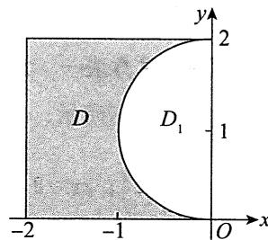

对于 $\iint_{D_1}x^2 y^2\mathrm{d}x\mathrm{d}y$ ，可采用极坐标，得

$$
\begin{array}{l} \iint_ {D _ {1}} x ^ {2} y ^ {2} \mathrm {d} x \mathrm {d} y = \iint_ {D _ {1}} r ^ {5} \sin^ {2} \theta \cos^ {2} \theta \mathrm {d} r \mathrm {d} \theta = \int_ {\frac {\pi}{2}} ^ {\pi} \mathrm {d} \theta \int_ {0} ^ {2 \sin \theta} r ^ {5} \sin^ {2} \theta \cos^ {2} \theta \mathrm {d} r \\ = \frac {3 2}{3} \int_ {\frac {\pi}{2}} ^ {\pi} \sin^ {8} \theta (1 - \sin^ {2} \theta) d \theta = \frac {3 2}{3} \left(\int_ {0} ^ {\frac {\pi}{2}} \cos^ {8} u d u - \int_ {0} ^ {\frac {\pi}{2}} \cos^ {1 0} u d u\right) \\ \xlongequal {\text {华 里 士 公 式}} \frac {3 2}{3} \left(\frac {7}{8} \times \frac {5}{6} \times \frac {3}{4} \times \frac {1}{2} \times \frac {\pi}{2} - \frac {9}{1 0} \times \frac {7}{8} \times \frac {5}{6} \times \frac {3}{4} \times \frac {1}{2} \times \frac {\pi}{2}\right) \\ = \frac {7}{4 8} \pi . \\ \end{array}
$$

从而 $I = \frac{64}{9} -\frac{7}{48}\pi .$

38.【解析】 $I = \iint_{D}\frac{|xy|}{\sqrt{x^2 + y^2 + x^2 - y^2}}\mathrm{d}\sigma = 4\iint_{D_1}\frac{xy}{\sqrt{x^2 + y^2 + x^2 - y^2}}\mathrm{d}\sigma ,$

其中 $D_{1} = \left\{(x,y)\mid x^{2} + y^{2}\leqslant 1,0\leqslant y\leqslant x\right\}$ ，如图所示.

$$
\begin{array}{l} \iint_ {D _ {1}} \frac {x y}{\sqrt {x ^ {2} + y ^ {2}} + x ^ {2} - y ^ {2}} d \sigma = \frac {1}{2} \int_ {0} ^ {1} r d r \int_ {0} ^ {\frac {\pi}{4}} \frac {r ^ {2} \sin 2 \theta}{r + r ^ {2} \cos 2 \theta} d \theta \\ = - \frac {1}{4} \int_ {0} ^ {1} r \mathrm {d} r \int_ {0} ^ {\frac {\pi}{4}} \frac {\mathrm {d} (1 + r \cos 2 \theta)}{1 + r \cos 2 \theta} \\ = \frac {1}{4} \int_ {0} ^ {1} r \ln (1 + r) d r \\ \end{array}
$$

$$
\begin{array}{l} = \frac {1}{8} \left[ r ^ {2} \ln (1 + r) \bigg | _ {0} ^ {1} - \int_ {0} ^ {1} \frac {r ^ {2}}{1 + r} d r \right] \\ = \frac {1}{8} \left[ \ln 2 - \int_ {0} ^ {1} (r - 1) d r - \int_ {0} ^ {1} \frac {1}{1 + r} d r \right] = \frac {1}{1 6}, \\ \end{array}
$$

故 $I = 4 \times \frac{1}{16} = \frac{1}{4}$ .

# 39.【解析】方法一 常规做法.

积分区域如图所示， $xy = 1$ 与 $y = x$ 及 $y = 4x$ 的交点坐标分别为 $(1,1),\left(\frac{1}{2},2\right);$ $xy = 2$ 与 $y = x$ 及 $y = 4x$ 的交点坐标分别为 $(\sqrt{2},\sqrt{2}),\left(\frac{\sqrt{2}}{2},2\sqrt{2}\right)$ 故

$$
\begin{array}{l} \iint_ {D} \ln (x y) d x d y = \int_ {\frac {1}{2}} ^ {\frac {\sqrt {2}}{2}} d x \int_ {\frac {1}{x}} ^ {4 x} \ln (x y) d y + \int_ {\frac {\sqrt {2}}{2}} ^ {1} d x \int_ {\frac {1}{x}} ^ {\frac {2}{x}} \ln (x y) d y + \int_ {1} ^ {\sqrt {2}} d x \int_ {x} ^ {\frac {2}{x}} \ln (x y) d y \\ = I _ {1} + I _ {2} + I _ {3}, \\ \end{array}
$$

其中 $\int \ln (xy)\mathrm{d}y = y\ln (xy) - y + C$ ，则

$$
\begin{array}{l} \int_ {\frac {1}{x}} ^ {4 x} \ln (x y) d y = 4 (2 \ln 2 - 1) x + 8 x \ln x + \frac {1}{x}, \\ \int_ {\frac {1}{x}} ^ {\frac {2}{x}} \ln (x y) d y = \frac {2 \ln 2 - 1}{x}, \\ \int_ {x} ^ {\frac {2}{x}} \ln (x y) d y = \frac {2 \ln 2 - 2}{x} - 2 x \ln x + x, \\ \end{array}
$$

故 $I_{1} = \int_{\frac{1}{2}}^{\frac{\sqrt{2}}{2}}\left[4(2\ln 2 - 1)x + 8x\ln x + \frac{1}{x}\right]\mathrm{d}x$

$$
\begin{array}{l} = \left[ 2 (2 \ln 2 - 1) x ^ {2} + 4 x ^ {2} \ln x - 2 x ^ {2} + \ln x \right] \left| \begin{array}{c} \frac {\sqrt {2}}{2} \\ \frac {1}{2} \end{array} \right. \\ = \frac {3}{2} \ln 2 - 1, \\ \end{array}
$$

$$
\begin{array}{l} I _ {2} = \int_ {\frac {\sqrt {2}}{2}} ^ {1} \frac {2 \ln 2 - 1}{x} d x = (2 \ln 2 - 1) \ln x \left| _ {\frac {\sqrt {2}}{2}} ^ {1} = \ln^ {2} 2 - \frac {1}{2} \ln 2, \right. \\ I _ {3} = \int_ {1} ^ {\sqrt {2}} \left(\frac {2 \ln 2 - 2}{x} - 2 x \ln x + x\right) d x \\ \end{array}
$$

$$
\begin{array}{l} = \left[ (2 \ln 2 - 2) \ln x - x ^ {2} \ln x + x ^ {2} \right] _ {1} ^ {\sqrt {2}} \\ = \ln^ {2} 2 - 2 \ln 2 + 1, \\ \end{array}
$$

可得 $\iint_{D} \ln(xy) \, \mathrm{d}x \, \mathrm{d}y = \ln 2(2 \ln 2 - 1)$ .

方法二 $D = \left\{(x,y)\bigg|1\leqslant xy\leqslant 2,1\leqslant \frac{y}{x}\leqslant 4,x > 0\right\} ,$ 令 $xy = u,\frac{y}{x} = v$ ，则 $x = \sqrt{\frac{u}{v}},y = \sqrt{uv}$ $(u > 0,v > 0)$

$$
J = \left| \begin{array}{c c} \frac {1}{2 \sqrt {u v}} & - \frac {1}{2} \sqrt {\frac {u}{v ^ {3}}} \\ \frac {1}{2} \sqrt {\frac {v}{u}} & \frac {1}{2} \sqrt {\frac {u}{v}} \end{array} \right| = \frac {1}{2 v},
$$

$$
D ^ {\prime} = \left\{\left(u, v\right) \mid 1 \leqslant u \leqslant 2, 1 \leqslant v \leqslant 4 \right\},
$$

所以

$$
\iint_ {D} \ln (x y) d x d y = \iint_ {D ^ {\prime}} \ln u \cdot \frac {1}{2 v} d u d v = \int_ {1} ^ {2} \ln u d u \int_ {1} ^ {4} \frac {d v}{2 v} = \ln 2 (2 \ln 2 - 1).
$$

40.【解析】 $2\int_{-\frac{1}{2}}^{1}\left(\int_{0}^{x}\mathrm{e}^{-y^2}\mathrm{d}y\right)\mathrm{d}x = 2\left(-\int_{-\frac{1}{2}}^{0}\mathrm{d}x\int_{x}^{0}\mathrm{e}^{-y^2}\mathrm{d}y + \int_{0}^{1}\mathrm{d}x\int_{0}^{x}\mathrm{e}^{-y^2}\mathrm{d}y\right)$

$$
\begin{array}{l} = 2 \left(- \iint_ {- \frac {1}{2} \leqslant x \leqslant y \leqslant 0} e ^ {- y ^ {2}} d x d y + \iint_ {0 \leqslant y \leqslant x \leqslant 1} e ^ {- y ^ {2}} d x d y\right) \\ = 2 \left(- \int_ {- \frac {1}{2}} ^ {0} d y \int_ {- \frac {1}{2}} ^ {y} e ^ {- y ^ {2}} d x + \int_ {0} ^ {1} d y \int_ {y} ^ {1} e ^ {- y ^ {2}} d x\right) \\ = 2 \left[ \int_ {0} ^ {- \frac {1}{2}} \left(y + \frac {1}{2}\right) e ^ {- y ^ {2}} d y + \int_ {0} ^ {1} (1 - y) e ^ {- y ^ {2}} d y \right] \\ = - \mathrm {e} ^ {- y ^ {2}} \left| _ {0} ^ {\frac {1}{2}} + \int_ {0} ^ {- \frac {1}{2}} \mathrm {e} ^ {- y ^ {2}} \mathrm {d} y + 2 \int_ {0} ^ {1} \mathrm {e} ^ {- y ^ {2}} \mathrm {d} y + \mathrm {e} ^ {- y ^ {2}} \right| _ {0} ^ {1} \\ = 2 \int_ {0} ^ {1} e ^ {- y ^ {2}} d y - \int_ {0} ^ {\frac {1}{2}} e ^ {- y ^ {2}} d y + \frac {1}{e} - \frac {1}{\sqrt [ 4 ]{e}} \\ = 2 a - b + \frac {1}{e} - \frac {1}{\sqrt [ 4 ]{e}}, \\ \end{array}
$$

所以 $m = 2$ ， $n = 1$

41.【解析】(1) $2x^{2} + y^{2} = 2\sqrt{x^{2} + y^{2}}$ 在极坐标系下为 $r(1 + \cos^2\theta) = 2$ ，直角坐标系下的积分区域 $D$ 如图所示.故

$$
\begin{array}{l} \iint_ {D} \frac {1}{\sqrt {1 - x ^ {2}}} d \sigma = \int_ {\frac {\pi}{4}} ^ {\frac {\pi}{2}} d \theta \int_ {0} ^ {\frac {2}{1 + \cos^ {2} \theta}} \frac {1}{\sqrt {1 - r ^ {2} \cos^ {2} \theta}} r d r \\ = 2 \int_ {\frac {\pi}{4}} ^ {\frac {\pi}{2}} \frac {1}{1 + \cos^ {2} \theta} d \theta \\ = 2 \int_ {\frac {\pi}{4}} ^ {\frac {\pi}{2}} \frac {\sec^ {2} \theta}{\sec^ {2} \theta + 1} d \theta = 2 \int_ {\frac {\pi}{4}} ^ {\frac {\pi}{2}} \frac {d (\tan \theta)}{2 + \tan^ {2} \theta} \\ \frac {u = \tan \theta}{2} \int_ {1} ^ {+ \infty} \frac {\mathrm {d} u}{2 + u ^ {2}} = \sqrt {2} \arctan \left. \frac {u}{\sqrt {2}} \right| _ {1} ^ {+ \infty} \\ = \sqrt {2} \cdot \left(\frac {\pi}{2} - \arctan \frac {\sqrt {2}}{2}\right) \\ = \frac {\sqrt {2}}{2} \pi - \sqrt {2} \arctan \frac {\sqrt {2}}{2}. \\ \end{array}
$$

(2) 由积分保号性可得

$$
\begin{array}{l} a = \iint_ {D} \frac {f (x , y)}{\sqrt {1 - x ^ {2}}} d \sigma = \left| \iint_ {D} \frac {f (x , y)}{\sqrt {1 - x ^ {2}}} d \sigma \right| \leqslant \iint_ {D} \frac {\left| f (x , y) \right|}{\sqrt {1 - x ^ {2}}} d \sigma \\ \stackrel {(*)} {\Longrightarrow} | f (\xi , \eta) | \iint_ {D} \frac {1}{\sqrt {1 - x ^ {2}}} d \sigma \\ = \left(\frac {\sqrt {2}}{2} \pi - \sqrt {2} \arctan \frac {\sqrt {2}}{2}\right) | f (\xi , \eta) |, \\ \end{array}
$$

其中 $(\xi, \eta) \in D$ ，即存在 $(\xi, \eta) \in D$ ，使得 $a \leqslant \left(\frac{\sqrt{2}}{2} \pi - \sqrt{2} \arctan \frac{\sqrt{2}}{2}\right) |f(\xi, \eta)|$ ，即

$$
\left| f (\xi , \eta) \right| \geqslant \frac {a}{\frac {\sqrt {2}}{2} \pi - \sqrt {2} \arctan \frac {\sqrt {2}}{2}} \geqslant \frac {a}{\frac {\sqrt {2}}{2} \pi} = \frac {\sqrt {2}}{\pi} a.
$$

【注】(*)处利用了二重积分的中值定理.

设 $f(x,y)$ 和 $g(x,y)$ 都在闭区域 $D$ 上连续，且 $g(x,y)$ 在 $D$ 上不变号，则至少存在一点 $(\xi, \eta) \in D$ ，使得 $\iint_{D} f(x,y) \cdot g(x,y) \, \mathrm{d}x \, \mathrm{d}y = f(\xi, \eta) \iint_{D} g(x,y) \, \mathrm{d}x \, \mathrm{d}y$ 。

