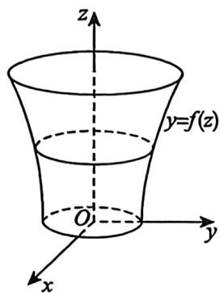

## 基础篇

# 第15章 微分方程

1. $x\mathrm{d}y + y\mathrm{d}x = \sin x\mathrm{d}x$ 满足 $y(\pi) = 0$ 的特解为

2. 已知曲线上任一点的切线在 $y$ 轴上的截距与法线在 $x$ 轴上的截距之比为 $3:1$ , 则该曲线方程为  
3. 设 $y_{1}, y_{2}$ 是一阶非齐次线性微分方程 $y' + p(x)y = q(x)$ 的两个特解, 若常数 $\lambda, \mu$ 使 $\lambda y_{1} + \mu y_{2}$ 是该方程的解, $\lambda y_{1} - \mu y_{2}$ 是该方程对应的齐次方程的解, 则( ).

(A) $\lambda = \frac{1}{2}, \mu = \frac{1}{2}$

(B) $\lambda = -\frac{1}{2}, \mu = -\frac{1}{2}$

(C) $\lambda = \frac{2}{3}, \mu = \frac{1}{3}$

(D) $\lambda = \frac{2}{3}, \mu = \frac{2}{3}$

4. 求微分方程 $(2x - 3xy^{2} - y^{3})y' + y^{3} = 0$ 的通解.  
5. 过原点的曲线 $y = y(x)$ 满足 $\frac{\mathrm{d}y}{\mathrm{d}x} = (x + y)^2$ ，则 $\lim_{x \to 0^+}[y(x)]^x =$ ________.  
6. 微分方程 $y' = (x + 1) \sec y - \tan y$ 的通解为  
7. 设函数 $y(x)$ 是微分方程 $y' + \frac{1}{x^2}y = 2\mathrm{e}^{\frac{1}{x}}$ 满足 $y\left(\frac{1}{2}\right) = 0$ 的解.

(1)求 $y = y(x)$ 的表达式；

(2) 求曲线 $y(x)$ 的斜渐近线.

8. 以 $yOz$ 面上的平面曲线段 $y = f(z) (z \geqslant 0)$ 绕 $z$ 轴旋转一周所成旋转曲面与 $xOy$ 面围成一个无上盖容器(见图), 现以 $3\mathrm{cm}^3 / \mathrm{s}$ 的速率把水注入容器内, 水面的面积以 $\pi \mathrm{cm}^2 / \mathrm{s}$ 的速率增大. 已知容器底面积为 $16\pi \mathrm{cm}^2$ , 求曲线 $y = f(z)$ 的方程.

9. 设 $f(x)$ 有连续导数， $x \in [0, +\infty)$ ，且满足方程 $\int_{0}^{x} (x - 1)f(t)\mathrm{d}t - \int_{0}^{x}tf(t)\mathrm{d}t = x$ ，求函数 $f(x)$ 。

10. 设 $\varphi(x)$ 为连续函数, $|\varphi(x)| \leqslant k (k$ 为常数), 求微分方程 $\frac{\mathrm{d}y}{\mathrm{d}x} + y = \varphi(x)$ 满足初始条件 $y(0) = 0$ 的特解 $y(x)$ , 并证明当 $x \geqslant 0$ 时, 有 $|y(x)| \leqslant k (1 - \mathrm{e}^{-x})$ .

11. 设函数 $y = y(x)$ 是微分方程 $2xy' - 4y = 2\ln x - 1$ 满足条件 $y(1) = \frac{1}{4}$ 的解，求曲线 $y = y(x)$ 在

$[1, \mathbf{e}]$ 上的平均值.

12. 设曲线 $y = y(x) (x > 0)$ 经过点 (1,0)，该曲线上任一点 $P(x,y)$ 到 $y$ 轴的距离等于该点处的切线在 $y$ 轴上的截距，求 $y(x)$ 在区间 (0,1) 上与 $x$ 轴所围平面图形的面积.  
13. 设曲线 $y = y(x)$ 上点 $P(0,4)$ 处的切线垂直于直线 $x - 2y + 5 = 0$ ，且该曲线满足微分方程 $y'' + 2y' + y = 0$ ，则此曲线方程为（ ）.

(A) $y = \frac{9}{2} x \mathrm{e}^{-x}$

(B) $y = \left(4 + \frac{9}{2} x\right)\mathrm{e}^{-x}$

(C) $y = \left( {{C}_{1}x + {C}_{2}}\right) {\mathrm{e}}^{-x}$

(D) $y = 2(x + 2)\mathrm{e}^{-x}$

14. 设曲线 $y = y(x)$ 经过原点, 且在原点处的切线与直线 $2x + y + 6 = 0$ 平行, 而 $y(x)$ 满足微分方程 $y'' - 2y' + 5y = 0$ , 则此曲线的方程为( ).

(A) $y = \mathrm{e}^{x}\sin 2x$   
(B) $y = -\mathrm{e}^{x}\sin 2x$   
(C) $y = \mathrm{e}^{x}(\cos 2x - \sin 2x)$   
(D) $y = \mathrm{e}^{x}(\sin 2x - \cos 2x)$

15. 设 $y = y(x)$ 满足 $y'' - 2y' + y = 0$ ，且 $y(0) = 0$ ， $y'(0) = 1$ ，则 $\int_{-\infty}^{0} y(x) \, \mathrm{d}x =$ ________.

16. 已知某常系数齐次线性微分方程的通解为 $y = C_{1} + \mathrm{e}^{x}(C_{2}\cos 2x + C_{3}\sin 2x)$ ，则该微分方程为  
17. 微分方程 $4y'' - 12y' + 9y = \mathrm{e}^{\frac{3}{2} x}(3x^{2} + 2)$ 的特解形式为( ).

(A) $Ax^{2} + Bx + C + D\mathrm{e}^{\frac{3}{2} x}$

(B) $(Ax^{2} + Bx + C)\mathrm{e}^{\frac{3}{2} x}$

(C) $x(Ax^{2} + Bx + C)\mathrm{e}^{\frac{3}{2} x}$

(D) $x^{2}(Ax^{2} + Bx + C)\mathrm{e}^{\frac{3}{2} x}$

18. 已知 $y_{1} = x \mathrm{e}^{x} + \mathrm{e}^{2x}, y_{2} = x \mathrm{e}^{x} + \mathrm{e}^{-x}, y_{3} = x \mathrm{e}^{x} + \mathrm{e}^{2x} - \mathrm{e}^{-x}$ 是某二阶常系数非齐次线性微分方程的三个解，则此微分方程为

19. 求微分方程 $y'' - 2y' + y = 2(3x^2 - 2)e^x$ 的通解.  
20. 求微分方程 $y'' + 4y' + 5y = 8\cos x$ ，当 $x \to -\infty$ 时为有界的特解。  
21. 欧拉方程 $x^{2}y^{\prime \prime} + 3xy^{\prime} + 3y = 0$ 满足条件 $y(1) = 0, y'(1) = \sqrt{2}$ 的解为 $y =$

---

## 强化篇

1. 微分方程 $x + yy' = y - xy'$ 的通解为  
2. 每一个解 $y = y(x)$ 都满足 $\lim_{x \to +\infty} y(x) = 0$ 的微分方程是( ).

(A) $y' + \frac{y}{\sqrt{1 + x^3}} = 0$

(B) $y' - \frac{y}{\sqrt{1 + x^3}} = 0$

(C) $y' + \frac{y}{\sqrt[4]{1 + x^3}} = 0$

(D) $y' - \frac{y}{\sqrt[4]{1 + x^3}} = 0$

3. 设 $f(u, v)$ 具有连续偏导数，且满足 $f_u'(u, v) + f_v'(u, v) = uv$ ，则函数 $y = \mathrm{e}^{-2x} f(x, x)$ 满足条件 $y|_{x=0} = 1$ 的表达式为 ______.

4. 设 $f(x)$ 在 $[0, +\infty)$ 上连续且有水平渐近线 $y = b \neq 0$ ，则（ ）.

(A) 当 $a > 0$ 时, $y' + ay = f(x)$ 的任意解都满足 $\lim_{x \to +\infty} y(x) = \frac{b}{a}$   
(B) 当 $a > 0$ 时, $y' + ay = f(x)$ 的任意解都满足 $\lim_{x \to +\infty} y(x) = \frac{a}{b}$   
(C) 当 $a < 0$ 时, $y' + ay = f(x)$ 的任意解都满足 $\lim_{x \to +\infty} y(x) = \frac{b}{a}$   
(D) 当 $a < 0$ 时, $y' + ay = f(x)$ 的任意解都满足 $\lim_{x \to +\infty} y(x) = \frac{a}{b}$ .

5. 若二阶常系数齐次微分方程 $y'' + ay' + by = 0$ 的解在 $(- \infty, +\infty)$ 上均有周期性，则( ).

(A) $a <   0$ ， $b <   0$

(B) $a > 0, b > 0$

(C) $a = 0, b < 0$

(D) $a = 0, b > 0$

6. 如果对于微分方程 $y'' - (2k - 4)y' + ky = 0$ 的任一解 $y(x)$ ，反常积分 $\int_{0}^{+\infty}y(x)\mathrm{d}x$ 均收敛，则 $k$ 的取值范围为（ ）.

(A) $(-\infty ,1]$

(B) $(0,1]$

(C) $(-\infty ,2)$

(D) (0,2)

7. 以 $y = x$ 与 $y = xe^{-2x}$ 为特解的最低阶常系数齐次线性微分方程为( ).

(A) $y^{\prime \prime} + 2y^{\prime \prime} = 0$   
(B) $y'' + 4y'' + 4y' - 4y = 0$   
(C) $y^{(4)} + 2y^{\prime \prime} = 0$   
(D) $y^{(4)} + 4y^{\prime \prime} + 4y^{\prime \prime} = 0$

8. 已知函数 $y = y(x)$ 在任意点 $x$ 处的增量 $\Delta y = \frac{xy}{1 + x^2} \Delta x + o(\Delta x)$ ，且 $y(0) = 1$ ，则 $y'(1) = (\quad)$ .

(A) $\frac{\sqrt{2}}{2}$

(B) $\sqrt{2}$

(C)2

(D) $2\sqrt{2}$

9. 微分方程 $(x + y)\mathrm{d}y + (y + 1)\mathrm{d}x = 0$ 满足 $y\big|_{x = 1} = 2$ 的特解是

10. 以 $y_{1} = x^{2}$ 和 $y_{2} = x^{2} - e^{2x}$ 为特解的一阶非齐次线性微分方程为

11. 设当 $x \geqslant 0$ 时, $f(x)$ 有连续的一阶导数, 并且满足 $f(x) = -1 + x + 2\int_{0}^{x}(x - t)f(t)f'(t)\mathrm{d}t$ , 则 $f(x) = \_$ .

12. 设 $f(x)$ 是 $(0, +\infty)$ 上的连续函数，且对任意 $x > 0$ 满足 $x \int_{0}^{1} f(tx) \mathrm{d}t = -2 \int_{0}^{x} f(t) \mathrm{d}t + xf(x) + x^4$ ， $f(1) = 0$ 。求函数 $f(x)$ ：

13. 设函数 $y = f(x)$ 满足 $f'(x) + 2f(x) + 2x\int_{0}^{1}f(xt)\mathrm{d}t + \mathrm{e}^{-x} = 0$ ，且 $f(x) - x$ 在 $x = 0$ 处取得极值，求 $f(x)$ 的表达式.

14. 已知函数 $y = y(x)$ 满足 $y' + 2\sqrt{2} x\sqrt{y} = 0$ ，且其曲线的拐点的横坐标为 -2，则 $y(x) =$

15. 若函数 $f(x)$ 满足关系式 $f'(x) + a f(x) = \int_{x}^{0} f(t) \, \mathrm{d}t$ ， $a > 0$ ，求 $\int_{0}^{+\infty} f(x) \, \mathrm{d}x$ .

16. 已知函数 $y = y(x)$ 满足 $x(\ln x - 1)y'(x) + (3 - \ln x^2)y(x) = 0$ ， $x > e$ ，且 $y(e^2) = \frac{e^4}{2}$ ，求 $y = y(x)$ 的最小值.

17. 设 $y = y(x)$ 满足 $y' + 2(\ln x + 1)y = 0$ , $y(1) = 1$ , 则 $y(x)$ 在 $(0,1]$ 上的最大值为

18. 若微分方程 $\frac{\mathrm{d}y}{\mathrm{d}x} + (a + \sin^2 x)y = 0$ 的所有解都以 $\pi$ 为周期, 则 $a =$

19. 当 $x > 0$ 时, 函数 $f(x)$ 满足关系式 $x^{2} f'(x) + (-1 + \ln x) f(x) = 0$ , 且 $f(1) = 1$ , 则 $f(x)$ 的最大值为( ).

(A) $e^{-e}$

(B) $\mathbf{e}^{\mathbf{c}}$

(C) $e^{-\frac{1}{e}}$

(D) $\mathrm{e}^{\frac{1}{\mathrm{c}}}$

20. 设函数 $f(x)$ 在 $(- \infty, + \infty)$ 上连续，且满足 $f(x) - \int_{0}^{x} f(t) \mathrm{d}t = -\frac{1}{2} + \sin x$ .

(1) 求 $f(x)$ 的表达式；

(2) 求曲线 $y = f(x)$ 与 $y = 0$ 在 $\left[\frac{\pi}{4}, \frac{5\pi}{4}\right]$ 上围成的图形绕 $x$ 轴旋转一周所成旋转体的体积.

21. 微分方程 $\mathrm{dy} = \cos (y - x)\mathrm{dx}$ 满足 $y(0) = \frac{\pi}{2}$ 的解为

22. 设 $y \geqslant -2$ ，则微分方程 $x' - \sqrt{x + y^2} = -2y$ 满足 $x(0) = 1$ 的特解为

23. 微分方程 $\frac{\mathrm{dy}}{\mathrm{dx}} -\frac{1}{x} = \mathrm{e}^{-y}$ 的通解为

24. 设曲线 $y = y(x)$ 过原点且在原点处与曲线 $y = \sin x$ 有公共切线, 且函数 $y(x)$ 满足方程 $y'' + 4y' + 4y = 0$ , 则 $\int_{0}^{+\infty} y(x) \mathrm{d}x =$ ________.

25. 设下列 $A, B, C$ 为任意常数，则微分方程 $y'' + 4y = \sin^2 x$ 有特解形如（ ）.

(A) $A \sin^2 x$

(B) $A\cos^2 x$

(C) $x(A + B\cos 2x + C\sin 2x)$

(D) $A + x(B\cos 2x + C\sin 2x)$

26. 微分方程 $y'' - 3y' + 2y = xe^x$ 的通解为

27. 设三阶常系数齐次线性微分方程有特解 $\cos x$ 与 $e^{2x}$ , 则该微分方程为( ).

(A) $y^{\prime \prime} + 2y^{\prime \prime} + y^{\prime} + 2y = 0$

(B) $y^{\prime \prime} - 2y^{\prime \prime} + y^{\prime} - 2y = 0$

(C) $y^{\prime \prime} + 2y^{\prime \prime} - y^{\prime} + 2y = 0$

(D) $y^{\prime \prime} - 2y^{\prime \prime} - y^{\prime} + 2y = 0$

28. 设函数 $y(x)$ 满足微分方程 $y^{(4)} - y'' = 0$ ，且当 $x \to 0$ 时 $y(x) \sim x^3$ . 求 $y(x)$ .

29. 设 $y = y_{1}(x)$ 是 $y'' + P(x)y' + Q(x)y = 0$ 的一个非零特解.

(1) 证明 $y_{2}(x) = y_{1}(x)\int \frac{1}{y_{1}^{2}(x)}\mathrm{e}^{-\int P(x)\mathrm{d}x}\mathrm{d}x$ 是与 $y_{1}(x)$ 线性无关的另一个特解；

(2) 求 $y^{\prime \prime} - \frac{1}{x} y' + \frac{1}{x^2} y = 0$ 的通解, 其中 $y = x$ 是方程的一个解.

30. 将以 $y = y(x)$ 为未知函数的微分方程 $y'' + (x + e^y + \sin y)(y')^3 = 0$ 化为以 $x = x(y)$ 为未知函数的形式, 并求其通解.

31. 设 $y = y(x)$ 满足关系式 $e^{2x}(y'' + y') + y = e^{-x}$ ，且 $x = -\ln t, t > 0$ ， $y\left(\ln \frac{2}{\pi}\right) = \frac{\pi}{2}$ ，则 $y(x) =$

32. 设函数 $f(x)$ 满足 $f^{\prime}(x) = f\left(\frac{2}{x}\right)(x > 0)$ .

(1) 证明 $x^{2}f^{\prime \prime}(x) + 2f(x) = 0 (x > 0)$ ;

(2) 令 $x = \mathbf{e}^t$ ，化(1)中方程为常系数线性微分方程，并求 $f(x)$ 。

33. 设 $u(x, y) = f(x) + g(y)$ 具有二阶连续偏导数，且满足 $\left[1 + \left(\frac{\partial u}{\partial y}\right)^2\right] \frac{\partial^2 u}{\partial x^2} - 2 \frac{\partial u}{\partial x} \frac{\partial u}{\partial y} \frac{\partial^2 u}{\partial x \partial y} +$ $\left[1 + \left(\frac{\partial u}{\partial x}\right)^2\right] \frac{\partial^2 u}{\partial y^2} = 0.$ 又已知 $f''(x) \neq 0$ ，求 $u = u(x, y)$ 的表达式.

34. 设函数 $f(x)$ 在 $(0, +\infty)$ 内可导，对任意的 $s > 0, t > 0$ ，均有

$$
\int_ {1} ^ {x \pi} f (x) d x + \ln t ^ {s} + \ln s ^ {\prime} = \int_ {1} ^ {t} \left[ s f (x) + \frac {1}{x} \right] d x + \int_ {1} ^ {s} \left[ t f (x) + \frac {1}{x} \right] d x
$$

成立，且 $f(1) = 2$ ，求 $f(x)$ 的表达式.

35. 设函数 $y(x)$ 具有二阶导数, 曲线 $l: y = y(x)$ 与直线 $y = x$ 相切于原点, 且曲线 $l$ 在点 $(x, y)$ 处切线的倾角 $\theta$ 关于 $x$ 的变化率与曲线 $l$ 在该点的切线斜率相等. 求 $y(x)$ 的表达式.  
36. 设平面曲线 $y = y(x)$ 满足 $y(0) = 1$ , $y'(0) = 0$ , 且对曲线上任意点 $P(x, y) (x > 0)$ , 沿曲线从点 (0,1) 到点 $P(x, y)$ 的弧长等于该曲线在点 $P(x, y)$ 的切线斜率.

(1) 求 $y(x)(x > 0)$   
(2) 求 $y(x)$ 与 $x = \ln 2$ 及坐标轴所围平面区域 $D$ 的形心.  
37. 设曲线 $L: r = r(\theta)$ , $P(r, \theta)$ 为 $L$ 上任意一点, $P_0(2,0)$ 为 $L$ 上的一定点, 且曲线 $L$ 与极径 $OP_0$ , $OP$ 所围成的曲边扇形面积值等于曲线 $L$ 上 $P_0$ , $P$ 两点间弧长值的一半, 求曲线 $L$ 的方程.  
38. 微分方程 $2y'' = 3y^2$ 满足初始条件 $y(-2) = 1, y'(-2) = 1$ 的特解为  
39. 微分方程 $y' = \frac{1}{xy(1 + xy^2)}$ 满足 $y(1) = 0$ 的解为  
40. 设 $f(x)$ 具有二阶连续导数， $f(0) = 0$ ， $f'(0) = 1$ ，且微分方程

$$
\left[ x y (x + y) - f (x) y \right] d x + \left[ f ^ {\prime} (x) + x ^ {2} y \right] d y = 0
$$

为全微分方程.

(1)求 $f(x)$   
(2)求该全微分方程的通解.

