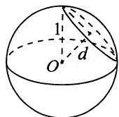
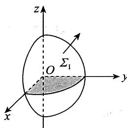
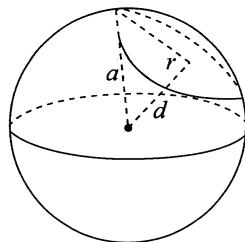
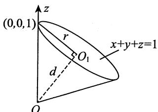
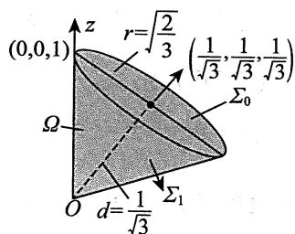
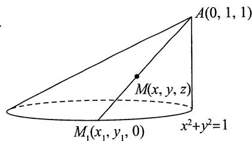
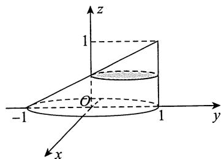
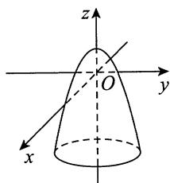

## 基础篇

# 第18章 多元函数和数学

1.【答案】 $3\pi \ln \frac{4}{3}$

【解析】 $\Sigma$ 的方程为 $y^{2} + z^{2} = 2x$ ，用定限截面法，如图所示，则

$$
I = \int_ {1} ^ {2} d x \int_ {0} ^ {2 \pi} d \theta \int_ {0} ^ {\sqrt {2 x}} \frac {r}{r ^ {2} + x ^ {2}} d r = 3 \pi \ln \frac {4}{3}.
$$

2.【答案】 $\frac{39}{38}$

【解析】 $\overline{z} = \frac{\iiint_{\Omega} z \mathrm{d}\nu}{\iiint_{\Omega} \mathrm{d}\nu},$

其中 $\iiint_{\Omega} z \mathrm{d}\nu = \int_{0}^{2\pi} \mathrm{d}\theta \int_{0}^{\sqrt{3}} r \mathrm{d}r \int_{\frac{r^2}{3}}^{\sqrt{4 - r^2}} z \mathrm{d}z = \frac{13}{4}\pi,$

$$
\iiint_ {\Omega} \mathrm {d} v = \int_ {0} ^ {2 \pi} \mathrm {d} \theta \int_ {0} ^ {\sqrt {3}} r \mathrm {d} r \int_ {\frac {r ^ {2}}{3}} ^ {\sqrt {4 - r ^ {2}}} \mathrm {d} z = \frac {1 9}{6} \pi ,
$$

则 $\overline{z} = \frac{\iiint_{\Omega} z \mathrm{d}\nu}{\iiint_{\Omega} \mathrm{d}\nu} = \frac{39}{38}$ .

# 3.【答案】 $\pi$

【解析】由于 $L$ 关于 $y$ 轴对称，故 $\oint_{L}x^{3}\mathrm{d}s = 0$ ，又

$$
\oint_ {L} y ^ {2} \mathrm {d} s = \frac {1}{2} \oint_ {L} \left(x ^ {2} + y ^ {2}\right) \mathrm {d} s = \frac {1}{2} l = \frac {1}{2} \cdot 2 \pi = \pi ,
$$

其中 $l$ 表示圆周 $L$ 的周长，于是 $\oint_{L}(x^{3} + y^{2})\mathrm{d}s = \pi .$

4.【答案】 $\frac{4\sqrt{6}}{9}\pi$

【解析】由轮换对称性，有

$$
\oint_ {\Gamma} x ^ {2} \mathrm {d} s = \oint_ {\Gamma} y ^ {2} \mathrm {d} s = \oint_ {\Gamma} z ^ {2} \mathrm {d} s, \oint_ {\Gamma} x \mathrm {d} s = \oint_ {\Gamma} y \mathrm {d} s = \oint_ {\Gamma} z \mathrm {d} s.
$$

故 $\oint_{\Gamma}(y^{2} + 2x - z)\mathrm{d}s = \frac{1}{3}\oint_{\Gamma}(x^{2} + y^{2} + z^{2})\mathrm{d}s + \frac{1}{3}\oint_{\Gamma}(x + y + z)\mathrm{d}s = \frac{2}{3} l_{\Gamma}.$

如图所示，设球心到平面 $x + y + z = 1$ 的距离为 $d$ ，曲线 $\Gamma$ 围成的圆的半径为 $r$ ，则

$$
d = \frac {\left| 0 + 0 + 0 - 1 \right|}{\sqrt {1 ^ {2} + 1 ^ {2} + 1 ^ {2}}} = \frac {1}{\sqrt {3}},
$$

故 $r = \sqrt{1 - \frac{1}{3}} = \sqrt{\frac{2}{3}}$ ，于是 $l_{\Gamma} = 2\pi \sqrt{\frac{2}{3}}$ ，故

原式 $= \frac{2}{3} l_{\Gamma} = \frac{2}{3} \cdot 2\pi \sqrt{\frac{2}{3}} = \frac{4\sqrt{6}}{9}\pi$

5.【答案】 $3\sqrt{3}$

【解析】 $l$ 是过空间两点的直线段，其参数方程为 $\left\{ \begin{array}{ll}x = 1 + t,\\ y = 1 + t,\\ z = 1 + t, \end{array} \right.$ 其中 $0\leqslant t\leqslant 3$ ，于是

$$
\int_ {l} \frac {x d x + y d y + z d z}{\sqrt {x ^ {2} + y ^ {2} + z ^ {2} - x - y + 2 z}} = \int_ {0} ^ {3} \frac {3 (1 + t) d t}{\sqrt {3 (1 + t) ^ {2}}} = \sqrt {3} \int_ {0} ^ {3} d t = 3 \sqrt {3}.
$$

6.【答案】 $x^{4}y^{3} - 3xy^{2} + 5x - 4y + C$

【解析】由题，易知 $\frac{\partial u}{\partial x} = 2ax^3 y^3 - 3y^2 + 5, \frac{\partial u}{\partial y} = 3x^4 y^2 - 2bxy - 4$ ，则

$$
\frac {\partial^ {2} u}{\partial x \partial y} = 6 a x ^ {3} y ^ {2} - 6 y, \frac {\partial^ {2} u}{\partial y \partial x} = 1 2 x ^ {3} y ^ {2} - 2 b y.
$$

显然 $\frac{\partial^2u}{\partial x\partial y}$ 和 $\frac{\partial^2u}{\partial y\partial x}$ 连续，于是 $\frac{\partial^2u}{\partial x\partial y} = \frac{\partial^2u}{\partial y\partial x}$ ，故得 $a = 2, b = 3$ 。

在根据全微分求原函数时，可用①凑全微分法；②曲线积分与路径无关法；③不定积分法。应根据实际情形选用恰当的方法。此题我们可以选用方法②，选折线 $(0,0) \to (x,0) \to (x,y)$ 为积分路径，则

$$
\begin{array}{l} u (x, y) - u (0, 0) = \int_ {(0, 0)} ^ {(x, y)} \left(4 x ^ {3} y ^ {3} - 3 y ^ {2} + 5\right) d x + \left(3 x ^ {4} y ^ {2} - 6 x y - 4\right) d y \\ = \int_ {0} ^ {x} 5 \mathrm {d} x + \int_ {0} ^ {y} (3 x ^ {4} y ^ {2} - 6 x y - 4) \mathrm {d} y = 5 x + x ^ {4} y ^ {3} - 3 x y ^ {2} - 4 y. \\ \end{array}
$$

故 $u(x,y) = x^4 y^3 - 3xy^2 + 5x - 4y + C.$

7.【答案】(D)

【解析】由格林公式 $\oint_{L} P \mathrm{d}x + Q \mathrm{d}y = \iint_{D_{xy}} \left( \frac{\partial Q}{\partial x} - \frac{\partial P}{\partial y} \right) \mathrm{d}x \mathrm{d}y,$

得 $\oint_{L}(2y^{3} - 3y)\mathrm{d}x - x^{3}\mathrm{d}y = \iint_{D_{xy}}(-3x^{2} - 6y^{2} + 3)\mathrm{d}x\mathrm{d}y\stackrel {\text{记}}{=}I.$

当被积函数在积分区域上恒小于0时， $I < 0$ ；当被积函数在积分区域上恒大于0时， $I > 0$ ：故当 $L$ 为区域 $-3x^{2} - 6y^{2} + 3\geqslant 0$ 的正向边界时， $I$ 取最大值，即 $x^{2} + 2y^{2} = 1$ ：

8.【答案】 $\frac{3}{8}\pi^2$

【解析】由于积分与路径无关，因此取折线段路径

$$
L _ {1}: \left(\frac {\pi}{2}, 1\right)\rightarrow \left(\frac {\pi}{2}, 0\right); L _ {2}: \left(\frac {\pi}{2}, 0\right)\rightarrow (\pi , 0).
$$

又因为在 $L_{1}$ 上 $x \equiv \frac{\pi}{2}, f\left(\frac{\pi}{2}\right) = 0$ ，故在 $L_{1}$ 上 $\frac{f(x)}{x} = 0$ ，从而有

$$
\begin{array}{l} I = \int_ {A} ^ {B} (x + x y \sin x) d x + \frac {f (x)}{x} d y = \int_ {L _ {1}} \frac {f (x)}{x} d y + \int_ {L _ {2}} (x + x y \sin x) d x \\ = \int_ {L _ {1}} 0 \mathrm {d} y + \int_ {L _ {2}} x \mathrm {d} x = \int_ {\frac {\pi}{2}} ^ {\pi} x \mathrm {d} x = \frac {3}{8} \pi^ {2}. \\ \end{array}
$$

【注】事实上，可以求 $f(x)$ 的表达式，具体如下

因为积分与路径无关，所以

$$
\frac {\mathrm {d}}{\mathrm {d} x} \left[ \frac {f (x)}{x} \right] = \frac {\partial}{\partial y} (x + x y \sin x) = x \sin x,
$$

对 $\frac{\mathrm{d}}{\mathrm{d}x}\left[\frac{f(x)}{x}\right] = x\sin x$ 两端积分，得

$$
\frac {f (x)}{x} = \int x \sin x d x = \sin x - x \cos x + C.
$$

又 $f\left(\frac{\pi}{2}\right) = 0$ ，所以 $C = -1$ .故 $f(x) = x\sin x - x^{2}\cos x - x$

9.【解析】(1)依题设，函数 $f(x,y) = 1 - x^{2} - y^{2}$ 在平面区域 $D_{1}$ 上非负，在 $D_{1}$ 之外小于零，所以

$$
D _ {1} = \left\{(x, y) \mid x ^ {2} + y ^ {2} \leqslant 1 \right\}, I (D _ {1}) = \iint_ {D _ {1}} (1 - x ^ {2} - y ^ {2}) d x d y = \int_ {0} ^ {2 \pi} d \theta \int_ {0} ^ {1} (1 - r ^ {2}) r d r = \frac {\pi}{2}.
$$

(2) 取 $L: x^2 + 2y^2 = \frac{1}{4}$ , 顺时针方向, $\partial D_1$ 与 $L$ 之间的区域记为 $E$ . 因为

$$
\frac {\partial}{\partial x} \left(\frac {2 y \mathrm {e} ^ {x ^ {2} + 2 y ^ {2}} - x}{x ^ {2} + 2 y ^ {2}}\right) = \frac {4 x y (x ^ {2} + 2 y ^ {2} - 1) \mathrm {e} ^ {x ^ {2} + 2 y ^ {2}} + x ^ {2} - 2 y ^ {2}}{(x ^ {2} + 2 y ^ {2}) ^ {2}} = \frac {\partial}{\partial y} \left(\frac {x \mathrm {e} ^ {x ^ {2} + 2 y ^ {2}} + y}{x ^ {2} + 2 y ^ {2}}\right),
$$

所以由格林公式可知

$$
\oint_ {\partial D _ {1} + L} \frac {(x \mathrm {e} ^ {x ^ {2} + 2 y ^ {2}} + y) \mathrm {d} x + (2 y \mathrm {e} ^ {x ^ {2} + 2 y ^ {2}} - x) \mathrm {d} y}{x ^ {2} + 2 y ^ {2}}
$$

$$
= \iint_ {E} \left[ \frac {\partial}{\partial x} \left(\frac {2 y \mathrm {e} ^ {x ^ {2} + 2 y ^ {2}} - x}{x ^ {2} + 2 y ^ {2}}\right) - \frac {\partial}{\partial y} \left(\frac {x \mathrm {e} ^ {x ^ {2} + 2 y ^ {2}} + y}{x ^ {2} + 2 y ^ {2}}\right) \right] \mathrm {d} x \mathrm {d} y = 0,
$$

从而

$$
\begin{array}{l} \oint_ {\partial D _ {1}} \frac {\left(x \mathrm {e} ^ {x ^ {2} + 2 y ^ {2}} + y\right) \mathrm {d} x + \left(2 y \mathrm {e} ^ {x ^ {2} + 2 y ^ {2}} - x\right) \mathrm {d} y}{x ^ {2} + 2 y ^ {2}} = - \oint_ {L} \frac {\left(x \mathrm {e} ^ {x ^ {2} + 2 y ^ {2}} + y\right) \mathrm {d} x + \left(2 y \mathrm {e} ^ {x ^ {2} + 2 y ^ {2}} - x\right) \mathrm {d} y}{x ^ {2} + 2 y ^ {2}} \\ = - 4 \oint_ {L} \left(\mathrm {e} ^ {\frac {1}{4}} x + y\right) \mathrm {d} x + \left(2 \mathrm {e} ^ {\frac {1}{4}} y - x\right) \mathrm {d} y \\ = 4 \iint_ {x ^ {2} + 2 y ^ {2} \leqslant \frac {1}{4}} (- 2) d x d y = - \sqrt {2} \pi . \\ \end{array}
$$

10.【答案】 $\frac{7}{4}\pi$

【解析】由高斯公式，得

原式 $= \iiint_{\Omega}(3y^{2} + 1)\mathrm{d}\nu = \int_{0}^{2\pi}\mathrm{d}\theta \int_{0}^{1}r(3r^{2}\cos^{2}\theta +1)\mathrm{d}r\int_{0}^{1}\mathrm{d}x$

$$
\begin{array}{l} = \int_ {0} ^ {2 \pi} \left[ \int_ {0} ^ {1} \left(3 r ^ {3} \cos^ {2} \theta + r\right) d r \right] d \theta = \int_ {0} ^ {2 \pi} \left(\frac {3}{4} \cos^ {2} \theta + \frac {1}{2}\right) d \theta \\ = \frac {3}{4} \cdot 4 \cdot \frac {1}{2} \cdot \frac {\pi}{2} + \pi = \frac {7}{4} \pi . \\ \end{array}
$$

11.【答案】 $\frac{2}{5}\pi a^5$

【解析】由高斯公式，得

$$
\begin{array}{l} \iint_ {\Sigma} x z ^ {2} \mathrm {d} y \mathrm {d} z + \left(x ^ {2} y - z ^ {3}\right) \mathrm {d} z \mathrm {d} x + \left(2 x y + y ^ {2} z\right) \mathrm {d} x \mathrm {d} y = \iiint_ {\Omega} \left(z ^ {2} + x ^ {2} + y ^ {2}\right) \mathrm {d} v \\ = \int_ {0} ^ {2 \pi} d \theta \int_ {0} ^ {\frac {\pi}{2}} d \varphi \int_ {0} ^ {a} r ^ {2} \cdot r ^ {2} \sin \varphi d r = \frac {2}{5} \pi a ^ {5}, \\ \end{array}
$$

其中 $\Omega = \{(x,y,z) | 0 \leqslant z \leqslant \sqrt{a^2 - x^2 - y^2}\}$ .

12.【答案】 $\frac{2}{15}$

【解析】积分区域如图所示，由类对称性，得

原式 $= 2\iint_{\Sigma_1}xyz\mathrm{d}x\mathrm{d}y$

其中 $\Sigma_{1}:z = \sqrt{1 - x^{2} - y^{2}} (x\geqslant 0,y\geqslant 0)$ ，方向向上. $\Sigma_{1}$ 在 $xOy$ 面的投影域为 $D = \{(x,y)|x^2 +y^2\leqslant 1,$

$x\geqslant 0,y\geqslant 0\}$ ，故 原式 $= 2\int_{0}^{\frac{\pi}{2}}\mathrm{d}\theta \int_{0}^{1}r^{3}\sin \theta \cos \theta \cdot \sqrt{1 - r^{2}}\mathrm{d}r = \frac{2}{15}.$

13.【答案】 $2a^{2}(\mathrm{e}^{2a} - 1)\pi$

【解析】旋转曲面方程为 $x = \mathrm{e}^{\sqrt{y^2 + z^2}}$ .直接计算曲面积分比较困难，可利用高斯公式化成三重积分.添加辅助曲面 $\Sigma_1:x = \mathrm{e}^a,y^2 +z^2\leqslant a^2$ ，取前侧，则 $\Sigma_{1}$ 与 $\boldsymbol{\Sigma}$ 构成封闭曲面 $\Sigma^{*}$ ，记所围成的空间闭区域为 $\Omega$ ，由高斯公式可得

$$
\begin{array}{l} I = \left(\oiint_ {\Sigma^ {*}} - \iint_ {\Sigma_ {1}}\right) 2 \left(1 - x ^ {2}\right) \mathrm {d} y \mathrm {d} z + 8 x y \mathrm {d} z \mathrm {d} x - 4 x z \mathrm {d} x \mathrm {d} y \\ = \iiint_ {\Omega} 0 \mathrm {d} x \mathrm {d} y \mathrm {d} z - \iint_ {D _ {y z}} 2 \left(1 - \mathrm {e} ^ {2 a}\right) \mathrm {d} y \mathrm {d} z = 2 a ^ {2} \left(\mathrm {e} ^ {2 a} - 1\right) \pi , \\ \end{array}
$$

其中 $D_{yz}$ 为 $\Sigma_1$ 在 $yOz$ 平面上的投影域，是一个半径为 $a$ 的圆.

14.【解析】曲面 $\Sigma$ 在 $yOz$ 坐标面的投影域为 $D = \{(y,z)|y^2 +z^2\leqslant 1\}$ ，因为 $\frac{\partial x}{\partial y} = 2y,\frac{\partial x}{\partial z} = 2z$ ，所以

$$
\begin{array}{l} I = \iint_ {\Sigma} (x - 1) \mathrm {d} y \mathrm {d} z + (y - 1) ^ {3} \mathrm {d} z \mathrm {d} x + (z - 1) ^ {3} \mathrm {d} x \mathrm {d} y \\ = \iint_ {D} [ 1 - y ^ {2} - z ^ {2} + 2 y (y - 1) ^ {3} + 2 z (z - 1) ^ {3} ] d y d z \\ = \iint_ {D} (2 y ^ {4} + 2 z ^ {4} - 6 y ^ {3} - 6 z ^ {3} + 5 y ^ {2} + 5 z ^ {2} - 2 y - 2 z + 1) d y d z. \\ \end{array}
$$

因为区域 $D$ 关于 $y, z$ 坐标轴对称，所以 $\iint_{D} (-6y^3 - 6z^3 - 2y - 2z) \, \mathrm{d}y \, \mathrm{d}z = 0$ ，故

$$
\begin{array}{l} I = \iint_ {D} (2 y ^ {4} + 2 z ^ {4} + 5 y ^ {2} + 5 z ^ {2} + 1) d y d z \\ = \int_ {0} ^ {2 \pi} d \theta \int_ {0} ^ {1} [ 2 r ^ {4} (\cos^ {4} \theta + \sin^ {4} \theta) + 5 r ^ {2} + 1 ] r d r \\ = \int_ {0} ^ {2 \pi} \left[ \frac {1}{3} \left(\cos^ {4} \theta + \sin^ {4} \theta\right) + \frac {7}{4} \right] d \theta \\ = \frac {7}{2} \pi + \frac {8}{3} \int_ {0} ^ {\frac {\pi}{2}} \sin^ {4} \theta d \theta = 4 \pi . \\ \end{array}
$$

15.【解析】易求得 $\Sigma$ 的外法线向量为 $n = (2x, 2y, -2z)$ ，则单位法向量为

$$
\boldsymbol {n} ^ {\circ} = \left(\frac {x}{\sqrt {x ^ {2} + y ^ {2} + z ^ {2}}}, \frac {y}{\sqrt {x ^ {2} + y ^ {2} + z ^ {2}}}, \frac {- z}{\sqrt {x ^ {2} + y ^ {2} + z ^ {2}}}\right),
$$

于是

$$
\begin{array}{l} \iint_ {\Sigma} y f (x y) \mathrm {d} y \mathrm {d} z - x f (x y) \mathrm {d} z \mathrm {d} x \\ = \iint_ {\Sigma} \left[ y f (x y) \cdot \frac {x}{\sqrt {x ^ {2} + y ^ {2} + z ^ {2}}} - x f (x y) \cdot \frac {y}{\sqrt {x ^ {2} + y ^ {2} + z ^ {2}}} \right] d S = 0. \\ \end{array}
$$

如图所示，记 $\Sigma_{1}$ 为 $z = 0(x^{2} + y^{2}\leqslant 1)$ ，方向向下，记 $\Sigma_{2}$ 为 $z = 1(x^{2} + y^{2}\leqslant 2)$ ，方向向上， $\varOmega$ 为 $\Sigma ,\Sigma_1,\Sigma_2$ 围成的空间区域，则

$$
\begin{array}{l} I = \iint_ {\Sigma} (- 2 x) d y d z + y ^ {2} d z d x + (z - 1) ^ {2} d x d y = \oiint_ {\Sigma + \Sigma_ {1} + \Sigma_ {2}} - \iint_ {\Sigma_ {1}} - \iint_ {\Sigma_ {2}} \\ = \iiint_ {\Omega} (2 y + 2 z - 4) d v + \iint_ {x ^ {2} + y ^ {2} \leqslant 1} d x d y - 0 \\ = \int_ {0} ^ {1} d z \iint_ {x ^ {2} + y ^ {2} \leqslant z ^ {2} + 1} (2 y + 2 z - 4) d x d y + \pi \\ = \int_ {0} ^ {1} \pi (z ^ {2} + 1) (2 z - 4) d z + \pi = - \frac {1 7}{6} \pi . \\ \end{array}
$$

16.【解析】根据斯托克斯公式，得

$$
I = \iint_ {\Sigma} \left| \begin{array}{c c c} \mathrm {d} y \mathrm {d} z & \mathrm {d} z \mathrm {d} x & \mathrm {d} x \mathrm {d} y \\ \frac {\partial}{\partial x} & \frac {\partial}{\partial y} & \frac {\partial}{\partial z} \\ x ^ {2} - y & 2 x + y ^ {2} & z ^ {2} \end{array} \right| = \iint_ {\Sigma} 3 \mathrm {d} x \mathrm {d} y = \iint_ {D} 3 \mathrm {d} x \mathrm {d} y = 3 \cdot (\sqrt {2}) ^ {2} = 6,
$$

其中 $\Sigma$ 为任意以曲线 $\Gamma$ 为边界的空间曲面，方向向上， $D$ 为 $\Sigma$ 在 $xOy$ 面上的投影，即 $D = \{(x,y) \mid |x| + |y| \leqslant 1\}$ ，如图所示.

【注】本题不适合用参数表示 $\Gamma$ ，比较烦琐，但有的题目适合用参数式，所以考试时要注意选择简便的做法.

---

## 强化篇

1.【答案】 $\frac{\pi}{5}$

【解析】由轮换对称性知， $\iiint_{\Omega} x^2 \, \mathrm{d}x \, \mathrm{d}y \, \mathrm{d}z = \iiint_{\Omega} y^2 \, \mathrm{d}x \, \mathrm{d}y \, \mathrm{d}z = \iiint_{\Omega} z^2 \, \mathrm{d}x \, \mathrm{d}y \, \mathrm{d}z$ ，所以

$$
\begin{array}{l} \iiint_ {\Omega} \left(x ^ {2} + 2 y ^ {2} + 3 z ^ {2}\right) d x d y d z = 2 \iiint_ {\Omega} \left(x ^ {2} + y ^ {2} + z ^ {2}\right) d x d y d z \\ = 2 \int_ {0} ^ {\frac {\pi}{2}} d \theta \int_ {0} ^ {\frac {\pi}{2}} d \varphi \int_ {0} ^ {1} r ^ {4} \sin \varphi d r = \pi \int_ {0} ^ {\frac {\pi}{2}} \sin \varphi d \varphi \int_ {0} ^ {1} r ^ {4} d r = \frac {\pi}{5}. \\ \end{array}
$$

2.【答案】 $\frac{2\sqrt{2} - 1}{3}$

【解析】 $\int_{L}y\mathrm{d}s = \int_{0}^{1}y\sqrt{1 + (x_{y}^{\prime})^{2}}\mathrm{d}y = \int_{0}^{1}y\sqrt{1 + y^{2}}\mathrm{d}y$

$$
\begin{array}{l} = \frac {1}{2} \int_ {0} ^ {1} \sqrt {1 + y ^ {2}} d (1 + y ^ {2}) \\ = \frac {1}{2} \times \frac {2}{3} (1 + y ^ {2}) ^ {\frac {3}{2}} \Bigg | _ {0} ^ {1} = \frac {1}{3} \times 2 ^ {\frac {3}{2}} - \frac {1}{3} \\ = \frac {2 \sqrt {2} - 1}{3}. \\ \end{array}
$$

# 3.【答案】(A)

【解析】记 $L$ 所围的封闭区域为 $D$ ，则由格林公式，得

$$
I = \oint_ {L} 4 y \mathrm {d} x + (x + y) ^ {2} \mathrm {d} y = 2 \iint_ {D} (x + y - 2) \mathrm {d} x \mathrm {d} y,
$$

$$
J = \oint_ {L} 4 x \mathrm {d} x + (x + y) ^ {2} \mathrm {d} y = 2 \iint_ {D} (x + y) \mathrm {d} x \mathrm {d} y,
$$

$$
K = \oint_ {L} 4 x y \mathrm {d} x + (x + y) ^ {2} \mathrm {d} y = 2 \iint_ {D} (y - x) \mathrm {d} x \mathrm {d} y.
$$

由于积分区域 $D$ 介于两直线 $x + y = 0$ 与 $x + y = 2$ 之间, 故在 $D$ 上(除点 $(0,0)$ 与 $(1,1)$ 外)有 $0 < x + y < 2$ , 因而 $I < 0$ , $J > 0$ . 由于积分区域 $D$ 关于直线 $y = x$ 对称, 因此

$$
K = \iint_ {D} (y - x) \mathrm {d} x \mathrm {d} y + \iint_ {D} (x - y) \mathrm {d} x \mathrm {d} y = 0.
$$

故 $I < K < J$

4.【解析】展开可得 $I = \iiint_{\Omega}(x^{2} + y^{2} + z^{2} + 2xy + 2yz + 2xz)\mathrm{d}x\mathrm{d}y\mathrm{d}z$

因为 $\Omega$ 关于 $xOz$ 和 $yOz$ 坐标平面对称，所以

$$
\iiint_ {\Omega} 2 x y \mathrm {d} x \mathrm {d} y \mathrm {d} z = \iiint_ {\Omega} 2 x z \mathrm {d} x \mathrm {d} y \mathrm {d} z = \iiint_ {\Omega} 2 y z \mathrm {d} x \mathrm {d} y \mathrm {d} z = 0.
$$

采用柱坐标变换，可得

$$
\begin{array}{l} \iiint_ {\Omega} \left(x ^ {2} + y ^ {2} + z ^ {2}\right) \mathrm {d} x \mathrm {d} y \mathrm {d} z = \int_ {0} ^ {2 \pi} \mathrm {d} \theta \int_ {0} ^ {1} \mathrm {d} r \int_ {r} ^ {1} \left(r ^ {2} + z ^ {2}\right) r \mathrm {d} z \\ = 2 \pi \int_ {0} ^ {1} \left[ r ^ {3} (1 - r) + \frac {1}{3} r \left(1 - r ^ {3}\right) \right] d r = \frac {3 \pi}{1 0}, \\ \end{array}
$$

所以 $I = \iiint_{\Omega} (x + y + z)^2 \, \mathrm{d}x \, \mathrm{d}y \, \mathrm{d}z = \frac{3\pi}{10}$ .

5.【答案】 $\frac{5}{4}\pi a^3$

【解析】如图所示，球心 $(0,0,0)$ 到平面 $x + y + z = \frac{3a}{2}$ 的距离为 $d = \frac{\left|0 + 0 + 0 - \frac{3a}{2}\right|}{\sqrt{1^2 + 1^2 + 1^2}} = \frac{\sqrt{3}}{2} a$

圆 $\Gamma : \left\{ \begin{array}{l} x^{2} + y^{2} + z^{2} = a^{2}, \\ x + y + z = \frac{3}{2} a \end{array} \right.$ 的半径为 $r = \sqrt{a^2 - \left(\frac{\sqrt{3}a}{2}\right)^2} = \frac{a}{2}$ , 圆 $\Gamma$ 的周长为 $2\pi r = \pi a$ , 于是

$$
\begin{array}{l} \oint_ {\Gamma} (2 y z + 2 z x + 2 x y) \mathrm {d} s \\ = \oint_ {\Gamma} \left[ (x + y + z) ^ {2} - \left(x ^ {2} + y ^ {2} + z ^ {2}\right) \right] d s \\ \xlongequal {(*)} \oint_ {\Gamma} \left[ \left(\frac {3 a}{2}\right) ^ {2} - a ^ {2} \right] d s = \frac {5 a ^ {2}}{4} \oint_ {\Gamma} 1 d s = \frac {5}{4} a ^ {2} \cdot \pi a = \frac {5}{4} \pi a ^ {3}. \\ \end{array}
$$

【注】(*)处来自边界方程 $x + y + z = \frac{3}{2} a, x^2 + y^2 + z^2 = a^2$ ，可直接代入被积函数，从而化简计算.

6.【答案】 $\pi$

【解析】 $\varGamma$ 的参数方程为 $\left\{ \begin{array}{l}x = \frac{1}{\sqrt{2}}\cos t,\\ y = \frac{1}{\sqrt{2}}\cos t,t\in [0,2\pi ],\\ z = \sin t, \end{array} \right.$ 则

$$
\begin{array}{l} \oint_ {\Gamma} \left(x ^ {2} + y ^ {2}\right) d s = \int_ {0} ^ {2 \pi} \cos^ {2} t \sqrt {\left(- \frac {1}{\sqrt {2}} \sin t\right) ^ {2} + \left(- \frac {1}{\sqrt {2}} \sin t\right) ^ {2} + \cos^ {2} t} d t \\ = \int_ {0} ^ {2 \pi} \cos^ {2} t d t = \frac {1}{2} \int_ {0} ^ {2 \pi} (1 + \cos 2 t) d t \\ = \frac {1}{2} \left. \left(t + \frac {1}{2} \sin 2 t\right) \right| _ {0} ^ {2 \pi} = \pi . \\ \end{array}
$$

7.【解析】由题可知， $\varGamma$ 关于 $z = x$ 对称，故

$$
\oint_ {\Gamma} x z (y z - x y) \mathrm {d} s = \oint_ {\Gamma} \left(x y z ^ {2} - x ^ {2} y z\right) \mathrm {d} s = \oint_ {\Gamma} x y z ^ {2} \mathrm {d} s - \oint_ {\Gamma} z ^ {2} y x \mathrm {d} s = 0,
$$

将 $z = m - x$ 代入 $x^{2} + y^{2} + z^{2} = m^{2}$ ，得

$$
\left(x - \frac {m}{2}\right) ^ {2} + \frac {1}{2} y ^ {2} = \left(\frac {m}{2}\right) ^ {2}.
$$

令 $x = \frac{m}{2} +\frac{m}{2}\cos \theta ,y = \frac{m}{\sqrt{2}}\sin \theta ,z = \frac{m}{2} -\frac{m}{2}\cos \theta ,\theta \in [0,2\pi ]$

于是

$$
\begin{array}{l} I = \oint_ {\Gamma} x z d s \\ = \int_ {0} ^ {2 \pi} \left[ \left(\frac {m}{2}\right) ^ {2} - \left(\frac {m}{2} \cos \theta\right) ^ {2} \right] \cdot \sqrt {\left(- \frac {m}{2} \sin \theta\right) ^ {2} + \left(\frac {m}{\sqrt {2}} \cos \theta\right) ^ {2} + \left(\frac {m}{2} \sin \theta\right) ^ {2}} d \theta \\ = \frac {\sqrt {2} \pi}{8} m ^ {3}. \\ \end{array}
$$

8.【答案】 $-\pi$

【解析】记 $P = \frac{x\mathrm{e}^{x^2 + 4y^2} + y}{x^2 + 4y^2}$ ， $Q = \frac{4y\mathrm{e}^{x^2 + 4y^2} - x}{x^2 + 4y^2}$ .经计算有

$$
\frac {\partial}{\partial x} \left(\frac {4 y \mathrm {e} ^ {x ^ {2} + 4 y ^ {2}} - x}{x ^ {2} + 4 y ^ {2}}\right) = \frac {8 x y (x ^ {2} + 4 y ^ {2} - 1) \mathrm {e} ^ {x ^ {2} + 4 y ^ {2}} + x ^ {2} - 4 y ^ {2}}{(x ^ {2} + 4 y ^ {2}) ^ {2}} = \frac {\partial}{\partial y} \left(\frac {x \mathrm {e} ^ {x ^ {2} + 4 y ^ {2}} + y}{x ^ {2} + 4 y ^ {2}}\right),
$$

但是这里不能用格林公式，因为在 $D$ 内的点 $O(0,0)$ 处， $P$ ， $Q$ 均不连续。故在 $D$ 内作一曲线 $L: x^2 + 4y^2 = 1$ ，取逆时针方向，从而

$$
\begin{array}{l} I = \oint_ {\partial D} \frac {\left(x \mathrm {e} ^ {x ^ {2} + 4 y ^ {2}} + y\right) \mathrm {d} x + \left(4 y \mathrm {e} ^ {x ^ {2} + 4 y ^ {2}} - x\right) \mathrm {d} y}{x ^ {2} + 4 y ^ {2}} = \oint_ {L} \frac {\left(x \mathrm {e} ^ {x ^ {2} + 4 y ^ {2}} + y\right) \mathrm {d} x + \left(4 y \mathrm {e} ^ {x ^ {2} + 4 y ^ {2}} - x\right) \mathrm {d} y}{x ^ {2} + 4 y ^ {2}} \\ = \oint_ {L} (\mathrm {e} x + y) \mathrm {d} x + (4 \mathrm {e} y - x) \mathrm {d} y, \\ \end{array}
$$

由格林公式可得 $I = \iint_{x^2 + 4y^2 \leqslant 1} (-2) \, \mathrm{d}x \, \mathrm{d}y = -\pi$

9.【解析】(1)记 $P(x,y) = y^{2}f(x) + 2ye^{x} + 2yg(x)$

$$
Q (x, y) = 2 \left[ y g (x) + f (x) \right].
$$

由题意知， $\frac{\partial Q}{\partial x} = \frac{\partial P}{\partial y}$ ，即 $2[yg^{\prime}(x) + f^{\prime}(x)] = 2yf(x) + 2\mathrm{e}^{x} + 2g(x)$ ，整理得

$$
y \left[ g ^ {\prime} (x) - f (x) \right] = - \left[ f ^ {\prime} (x) - g (x) - e ^ {x} \right],
$$

比较等式两边 $y$ 的同次幂系数，有

$$
\left\{ \begin{array}{l} g ^ {\prime} (x) - f (x) = 0, \\ f ^ {\prime} (x) - g (x) - \mathrm {e} ^ {x} = 0. \end{array} \right. \tag {①}
$$

由 ① 式, 有 $f^{\prime}(x) = g^{\prime \prime}(x)$ , 代入 ② 式, 得 $g^{\prime \prime}(x) - g(x) = \mathrm{e}^{x}$ , 解得

$$
g (x) = C _ {1} \mathrm {e} ^ {x} + C _ {2} \mathrm {e} ^ {- x} + \frac {1}{2} x \mathrm {e} ^ {x},
$$

于是 $f(x) = g'(x) = \left(C_1 + \frac{1}{2}\right)\mathrm{e}^x -C_2\mathrm{e}^{-x} + \frac{1}{2} x\mathrm{e}^x.$

又 $g(0) = 0, f(0) = 0$ ，故

$$
\left\{ \begin{array}{l} C _ {1} + C _ {2} = 0, \\ C _ {1} + \frac {1}{2} - C _ {2} = 0, \end{array} \right.
$$

解得 $C_1 = -\frac{1}{4}, C_2 = \frac{1}{4}$ , 故

$$
f (x) = \frac {1}{4} \left(\mathrm {e} ^ {x} - \mathrm {e} ^ {- x}\right) + \frac {1}{2} x \mathrm {e} ^ {x},
$$

$$
g (x) = - \frac {1}{4} \left(\mathrm {e} ^ {x} - \mathrm {e} ^ {- x}\right) + \frac {1}{2} x \mathrm {e} ^ {x}.
$$

(2)用折线法.如图所示，沿折线 $(0,0)\to (1,0)\to (1,1)$ ，有

原式 $= \int_{(0,0)}^{(1,1)}\left[y^{2}f(x) + 2y\mathrm{e}^{x} + 2yg(x)\right]\mathrm{d}x + 2\left[yg(x) + f(x)\right]\mathrm{d}y$

$$
= \int_ {0} ^ {1} 0 \mathrm {d} x + 2 \int_ {0} ^ {1} [ y g (1) + f (1) ] \mathrm {d} y
$$

$$
\begin{array}{l} = 2 \left[ \frac {1}{2} g (1) + f (1) \right] \\ = \frac {1}{4} (7 e - e ^ {- 1}). \\ \end{array}
$$

10.【解析】(1) 令 $F(x, y, z) = x^{2} + y^{2} + z^{2} - 2z$ ，则球面 $\Sigma$ 在点 $P(x, y, z)$ 处的法向量为 $\pmb{n} = (F_x', F_y', F_z') = (2x, 2y, 2z - 2)$ . 因为 $\pmb{n}$ 与平面 $x + z = 0$ 平行，故 $2x \cdot 1 + 2y \cdot 0 + (2z - 2) \cdot 1 = 0$ ，即 $z = 1 - x$ . 于是，点 $P$ 的轨迹 $\Gamma$ 的方程为 $\left\{ \begin{array}{l} x^{2} + y^{2} + z^{2} - 2z = 0, \\ z = 1 - x, \end{array} \right.$ 即 $\left\{ \begin{array}{l} 2x^{2} + y^{2} = 1, \\ z = 1 - x. \end{array} \right.$

(2)取上侧的平面区域 $z = 1 - x(2x^{2} + y^{2}\leqslant 1)$ 记为 $\Sigma_{1}$ ，则 $\Sigma_{1}$ 的单位法向量为 $\pmb {n}_1 = \left(\frac{1}{\sqrt{2}},0,\frac{1}{\sqrt{2}}\right)$ 记 $D_{xy} = \big\{(x,y)\big|2x^2 +y^2\leqslant 1\big\}$ ，根据斯托克斯公式，有

$$
\begin{array}{l} \oint_ {\Gamma} y ^ {2} \mathrm {d} x + z ^ {2} \mathrm {d} y + x ^ {2} \mathrm {d} z = \iint_ {\Sigma_ {1}} \left| \begin{array}{c c c} \frac {1}{\sqrt {2}} & 0 & \frac {1}{\sqrt {2}} \\ \frac {\partial}{\partial x} & \frac {\partial}{\partial y} & \frac {\partial}{\partial z} \\ y ^ {2} & z ^ {2} & x ^ {2} \end{array} \right| \mathrm {d} S = - \sqrt {2} \iint_ {\Sigma_ {1}} (z + y) \mathrm {d} S \\ = - 2 \iint_ {D _ {x y}} (1 - x + y) d x d y = - 2 \iint_ {D _ {x y}} d x d y \\ = - 2 \cdot \pi \cdot \frac {1}{\sqrt {2}} \cdot 1 = - \sqrt {2} \pi . \\ \end{array}
$$

11.【解析】方法一 一投二代三计算.记

$L_{x}:\left\{ \begin{array}{l}y^{2} + z^{2} = 1,\\ x = 0, \end{array} \right.$ 方向为 $(0,1,0)\to (0,0,1)$

$L_{y}:\left\{ \begin{array}{l}4x^{2} + z^{2} = 1,\\ y = 0, \end{array} \right.$ 方向为 $(0,0,1)\to \left(\frac{1}{2},0,0\right);$

$L_{z}:\left\{ \begin{array}{l}4x^{2} + y^{2} = 1,\\ z = 0, \end{array} \right.$ 方向为 $\left(\frac{1}{2},0,0\right)\to (0,1,0).$

因为

$$
\begin{array}{l} I _ {x} = \int_ {L _ {x}} \left(y z ^ {2} - \cos z\right) d x + 2 x z ^ {2} d y + (2 x y z + x \sin z) d z = \int_ {L _ {x}} 0 d y + 0 d z = 0, \\ I _ {y} = \int_ {L _ {y}} (y z ^ {2} - \cos z) d x + 2 x z ^ {2} d y + (2 x y z + x \sin z) d z \\ = \int_ {L _ {y}} (- \cos z) d x + x \sin z d z = \int_ {L _ {y}} d (- x \cos z) \\ \end{array}
$$

$$
\begin{array}{l} = - x \cos z \Bigg | _ {(0, 0, 1)} ^ {\left(\frac {1}{2}, 0, 0\right)} = - \frac {1}{2}  , \\ I _ {z} = \int_ {L _ {z}} \left(y z ^ {2} - \cos z\right) d x + 2 x z ^ {2} d y + (2 x y z + x \sin z) d z \\ = - \int_ {L _ {z}} d x = - x \left| _ {\left(\frac {1}{2}, 0, 0\right)} ^ {(0, 1, 0)} \right. = \frac {1}{2}, \\ \end{array}
$$

所以 $I = I_{x} + I_{y} + I_{z} = 0 - \frac{1}{2} +\frac{1}{2} = 0.$

方法二 根据斯托克斯公式，得

$$
\begin{array}{l} I = \oint_ {L} (y z ^ {2} - \cos z) d x + 2 x z ^ {2} d y + (2 x y z + x \sin z) d z \\ = \iint_ {\Sigma} \left| \begin{array}{c c c} \mathrm {d} y \mathrm {d} z & \mathrm {d} z \mathrm {d} x & \mathrm {d} x \mathrm {d} y \\ \frac {\partial}{\partial x} & \frac {\partial}{\partial y} & \frac {\partial}{\partial z} \\ y z ^ {2} - \cos z & 2 x z ^ {2} & 2 x y z + x \sin z \end{array} \right| \\ = \iint_ {\Sigma} (- 2 x z) d y d z + z ^ {2} d x d y. \\ \end{array}
$$

记 $D = \left\{(x,y) \mid 4x^2 + y^2 \leqslant 1, x \geqslant 0, y \geqslant 0\right\}$ , 则 $\Sigma: z = \sqrt{1 - 4x^2 - y^2}, (x,y) \in D$ . 因为 $\Sigma$ 上侧为正, 所以

$$
\begin{array}{l} I = \iint_ {D} \left(2 x \sqrt {1 - 4 x ^ {2} - y ^ {2}} \frac {\partial z}{\partial x} + 1 - 4 x ^ {2} - y ^ {2}\right) d x d y \\ = \iint_ {D} (1 - 1 2 x ^ {2} - y ^ {2}) d x d y. \\ \end{array}
$$

由强化篇第14章第8题知， $I = \iint_{D}(1 - 12x^{2} - y^{2})\mathrm{d}x\mathrm{d}y = 0$

12.【答案】 $-\frac{\sqrt{2}}{4}\pi$

【解析】由 $\left\{ \begin{array}{l} z = \sqrt{1 - x^2 - y^2}, \\ z = -x, \end{array} \right.$ 得 $\sqrt{1 - x^2 - y^2} = -x$ ，即 $2x^2 + y^2 = 1$ 。

于是曲线 $L$ 的参数方程为 $\left\{ \begin{array}{ll}x = \frac{\sqrt{2}}{2}\cos t,\\ y = \sin t,\\ z = -\frac{\sqrt{2}}{2}\cos t, \end{array} \right.$ 从 $\frac{\pi}{2}$ （起点 $A$ )到 $\frac{3\pi}{2}$ (终点 $B$ ),故

原式 $= \int_{\frac{\pi}{2}}^{\frac{3\pi}{2}}\left[\left(\frac{\sqrt{2}}{2}\cos t + \sin t + \frac{\sqrt{2}}{2}\cos t\right)\left(-\frac{\sqrt{2}}{2}\sin t\right) + |\sin t|\frac{\sqrt{2}}{2}\sin t\right]\mathrm{d}t$

$$
\begin{array}{l} = - \int_ {\frac {\pi}{2}} ^ {\pi} \sin t \cos t d t - \int_ {\pi} ^ {\frac {3 \pi}{2}} (\sin t \cos t + \sqrt {2} \sin^ {2} t) d t \\ = - \frac {\sqrt {2}}{4} \pi . \\ \end{array}
$$

13.【答案】 $-\frac{\pi}{2} - 3$

【解析】如图所示，增补有向线段 $L_{1}:y = 0(x:1\to 0)$ ， $L_{2}:x = 0(y:0\to 2)$ ，则由格林公式，得

$$
\begin{array}{l} \int_ {L} (2 y + 1) \mathrm {d} x + (3 x + 2) \mathrm {d} y \\ = \left(\oint_ {L + L _ {1} + L _ {2}} - \int_ {L _ {1}} - \int_ {L _ {2}}\right) (2 y + 1) d x + (3 x + 2) d y \\ = - \iint_ {D} d x d y - \int_ {1} ^ {0} d x - \int_ {0} ^ {2} 2 d y \\ = - \frac {1}{4} \pi \cdot 1 \cdot 2 - (- 1) - 4 = - \frac {\pi}{2} - 3. \\ \end{array}
$$

14.【答案】 $2\pi$

【解析】由格林公式，有

$$
\text {原 式} = \iint_ {D} \left\{f _ {y x} ^ {\prime \prime} (x, y) - \left[ f _ {x y} ^ {\prime \prime} (x, y) - 1 \right] \right\} \mathrm {d} x \mathrm {d} y = \iint_ {D} 1 \mathrm {d} x \mathrm {d} y = 2 \pi ,
$$

其中 $\iint_{D} \mathrm{d}x \, \mathrm{d}y$ 为区域 $D$ 的面积，即 $\pi \cdot 2 \cdot 1 = 2\pi$

15.【答案】2a

【解析】将边界方程代入被积函数，于是有

$$
I = \oint_ {L} x y ^ {\prime} \mathrm {d} x - \frac {y}{y ^ {\prime}} \mathrm {d} y = \oint_ {L} x \mathrm {d} y - y \mathrm {d} x \xlongequal {\text {格 林 公 式}} \iint_ {D} (1 + 1) \mathrm {d} \sigma = 2 a.
$$

16.【解析】将 $y = x\tan \theta$ 代入 $x^{2} + y^{2} + z^{2} = a^{2}$ ，有 $x^{2}\sec^2\theta +z^{2} = a^{2}$ ，令 $\left\{ \begin{array}{l}x\sec \theta = a\cos \alpha ,\\ z = a\sin \alpha , \end{array} \right.$ 可得曲线 $\varGamma$ 的参数方程为 $\begin{cases} x = a\cos \alpha \cos \theta ,\\ y = a\cos \alpha \sin \theta ,\\ z = a\sin \alpha , \end{cases}$ 其中参数 $\theta$ 的取值范围分如下两种情况.

① 当 $-\frac{\pi}{2} < \theta < 0$ 时，参数 $\alpha: 0 \to 2\pi$ ，则有

$$
\begin{array}{l} I (\theta) = \int_ {0} ^ {2 \pi} (a \cos \alpha \sin \theta - a \sin \alpha) (- a \sin \alpha \cos \theta) d \alpha + \\ \int_ {0} ^ {2 \pi} (a \sin \alpha - a \cos \alpha \cos \theta) (- a \sin \alpha \sin \theta) d \alpha + \\ \int_ {0} ^ {2 \pi} (a \cos \alpha \cos \theta - a \cos \alpha \sin \theta) a \cos \alpha d \alpha \\ = \int_ {0} ^ {2 \pi} a ^ {2} (\cos \theta - \sin \theta) d \alpha = 2 \pi a ^ {2} (\cos \theta - \sin \theta). \\ \end{array}
$$

令 $I^{\prime}(\theta) = 2\pi a^{2}(-\sin \theta -\cos \theta) = 0,$

可得 $\sin \theta +\cos \theta = 0$ ，结合 $-\frac{\pi}{2} <  \theta <  0$ ，解得 $\theta = -\frac{\pi}{4}$

又

故此时 $I_{\max} = I\left(-\frac{\pi}{4}\right) = 2\pi a^2 \cdot \sqrt{2} = 2\sqrt{2}\pi a^2.$

② 当 $0 < \theta < \frac{\pi}{2}$ 时, 参数 $\alpha: 2\pi \rightarrow 0$ , 类似 ① 可得 $I(\theta) = 2\pi a^2 (\sin \theta - \cos \theta)$ . 此时 $I'(\theta) = 2\pi a^2 \cdot (\cos \theta + \sin \theta) > 0$ , 故此时 $I(\theta) < I\left(\frac{\pi}{2}\right) = 2\pi a^2 < 2\sqrt{2}\pi a^2$ .

综上，当 $\theta = -\frac{\pi}{4}$ 时， $I$ 最大，最大值为 $2\sqrt{2}\pi a^2$

17.【解析】(1)记 $P(x,y) = \frac{-y^3}{2x^2 + y^6},Q(x,y) = \frac{f(x)y^2}{2x^2 + y^6}.$

由题可知， $\oint_{L}Q(x,y)\mathrm{d}y + P(x,y)\mathrm{d}x = 0$ 故 $\frac{\partial Q}{\partial x} = \frac{\partial P}{\partial y}$ 即

$$
\frac {y ^ {2} f ^ {\prime} (x) \bullet (2 x ^ {2} + y ^ {6}) - 4 x y ^ {2} f (x)}{(2 x ^ {2} + y ^ {6}) ^ {2}} = \frac {- 3 y ^ {2} (2 x ^ {2} + y ^ {6}) + y ^ {3} \bullet 6 y ^ {5}}{(2 x ^ {2} + y ^ {6}) ^ {2}}.
$$

整理得 $y^{8}f^{\prime}(x) + 2x^{2}y^{2}f^{\prime}(x) - 4xy^{2}f(x) = 3y^{8} - 6x^{2}y^{2}.$

比较得 $y^8 f'(x) = 3y^8$ ，则 $f'(x) = 3$ ，积分得 $f(x) = 3x + C$ ，代入上式，可得

$$
2 x ^ {2} y ^ {2} \cdot 3 - 4 x y ^ {2} (3 x + C) = - 6 x ^ {2} y ^ {2}.
$$

比较系数，得 $C = 0$ 故 $f(x) = 3x$

(2)设 $L_{c}:2x^{2} + y^{6} = \varepsilon ,\varepsilon$ 大于0且足够小，使 $L_{\varepsilon}$ 在 $L_0$ 内部，且取逆时针方向，如图所示，故

$$
\begin{array}{l} \oint_ {L _ {0}} = \oint_ {L _ {0} + L _ {\varepsilon} ^ {-}} - \oint_ {L _ {\varepsilon} ^ {-}} = \oint_ {L _ {\varepsilon} ^ {+}} \\ = \frac {1}{\varepsilon} \oint_ {L _ {\varepsilon} ^ {*}} - y ^ {3} d x + 3 x y ^ {2} d y = \frac {1}{\varepsilon} \iint_ {D _ {\varepsilon}: 2 x ^ {2} + y ^ {6} \leqslant \varepsilon} 6 y ^ {2} d x d y, \\ \end{array}
$$

令 $u = \sqrt{2} x, v = y^3$ ，则

$$
J = \frac {1}{\left| \begin{array}{c c} \frac {\partial u}{\partial x} & \frac {\partial u}{\partial y} \\ \frac {\partial v}{\partial x} & \frac {\partial v}{\partial y} \end{array} \right|} = \frac {1}{\left| \begin{array}{c c} \sqrt {2} & 0 \\ 0 & 3 y ^ {2} \end{array} \right|} = \frac {1}{3 \sqrt {2} y ^ {2}}.
$$

于是

原式 $= \frac{1}{\varepsilon}\iint_{D_{uv}:u^2 +y^2\leqslant \varepsilon}6y^2\cdot \frac{1}{3\sqrt{2}y^2}\mathrm{d}u\mathrm{d}v$

$$
= \frac {1}{\varepsilon} \iint_ {D _ {u v}: u ^ {2} + v ^ {2} \leqslant \varepsilon} \sqrt {2} d u d v = \frac {1}{\varepsilon} \sqrt {2} \cdot \pi \varepsilon = \sqrt {2} \pi .
$$

18.【答案】 $-\pi +\ln 3$

【解析】记 $P = \frac{x - y}{x^2 + y^2}$ , $Q = \frac{x + y}{x^2 + y^2}$ , 经计算有 $\frac{\partial Q}{\partial x} = \frac{\partial P}{\partial y} ((x,y)\neq (0,0))$ . 记点 $C(1,0)$ , 将 $L$ 改路径为 $\widehat{AC}$ 和 $\overline{CB}$ , 其中 $\widehat{AC}:x = \cos t$ , $y = \sin t$ , $t$ 从 $\pi$ 到 0; $\overline{CB}:y = 0$ 从 $C$ 到 $B$ . 于是

原式 $= \int_{\pi}^{0}\left[(\cos t - \sin t)(-\sin t) + (\cos t + \sin t)\cos t\right]\mathrm{d}t + \int_{1}^{3}\frac{1}{x}\mathrm{d}x = -\pi +\ln 3.$

19.【答案】 $\frac{1}{2} (e^x - e^{-x})$

【解析】记 $P = \left[f(x) - \mathrm{e}^{x}\right]y^{2},Q = -2yf(x)$ ，则 $\frac{\partial P}{\partial y} = 2y\left[f(x) - \mathrm{e}^x\right],\frac{\partial Q}{\partial x} = -2yf'(x).$

由题设知， $\frac{\partial Q}{\partial x} = \frac{\partial P}{\partial y}$ ，由此得 $f^{\prime}(x) + f(x) = \mathrm{e}^{x}$ .这是一阶线性微分方程，其通解为

$$
\begin{array}{l} f (x) = \mathrm {e} ^ {- \int \mathrm {d} x} \left(\int \mathrm {e} ^ {x} \mathrm {e} ^ {\int \mathrm {d} x} \mathrm {d} x + C\right) = \mathrm {e} ^ {- x} \left(\int \mathrm {e} ^ {2 x} \mathrm {d} x + C\right) \\ = \mathrm {e} ^ {- x} \left(\frac {1}{2} \mathrm {e} ^ {2 x} + C\right) = \frac {1}{2} \mathrm {e} ^ {x} + C \mathrm {e} ^ {- x}. \\ \end{array}
$$

由于 $f(0) = 0$ ，因此 $C = -\frac{1}{2}$ . 于是 $f(x) = \frac{1}{2} (\mathrm{e}^x - \mathrm{e}^{-x})$ .

20.【解析】由题设可得 $\left\{ \begin{array}{l} f_{x}^{\prime}(x, y) = 6x^{2} + 6x, \\ f_{y}^{\prime}(x, y) = 6y - 6. \end{array} \right.$

又 $f(0,0) = 0$ ，故 $f(x,y) = 2x^{3} + 3y^{2} + 3x^{2} - 6y$ .从而 $f_{xx}^{\prime \prime} = 12x + 6,f_{xy}^{\prime \prime} = 0,f_{yy}^{\prime \prime} = 6$ ：

令 $\left\{ \begin{array}{l} f_{x}^{\prime}(x,y) = 0, \\ f_{y}^{\prime}(x,y) = 0, \end{array} \right.$ 解得 $f(x,y)$ 的驻点为 $(0,1), (-1,1)$ .

在驻点 $(0,1)$ 处， $A = f_{xx}''(0,1) = 6$ ， $B = f_{xy}''(0,1) = 0$ ， $C = f_{yy}''(0,1) = 6$ 。由于 $AC - B^2 = 36 > 0$ ，且 $A = 6 > 0$ ，因此 $f(0,1) = -3$ 为极小值。

在驻点 $(-1,1)$ 处， $A = f_{xx}''(-1,1) = -6$ ， $B = f_{xy}''(-1,1) = 0$ ， $C = f_{yy}''(-1,1) = 6$ 。由于 $AC - B^2 = -36 < 0$ ，因此 $f(-1,1) = -2$ 不是极值。

21.【解析】积分区域及其在 $xOy$ 面上的投影域如图所示，

由对称性，得 $\iint_{\Sigma} |x| y \, \mathrm{d}S = 0$

$\Sigma$ 在 $xOy$ 面上的投影域为 $D = \left\{(x,y)\Bigg{|}x^{2} + y^{2}\leqslant \frac{8}{9} m\right\}$ ，故

原式 $= \iint_{\Sigma} \frac{1}{z} \, \mathrm{d}S = \iint_{D} \frac{1}{\sqrt{m - x^2 - y^2}} \sqrt{1 + (z_x')^2 + (z_y')^2} \, \mathrm{d}x \, \mathrm{d}y$

$$
\begin{array}{l} = \iint_ {D} \frac {1}{\sqrt {m - x ^ {2} - y ^ {2}}} \sqrt {1 + \frac {x ^ {2} + y ^ {2}}{m - x ^ {2} - y ^ {2}}} d x d y = \sqrt {m} \iint_ {D} \frac {1}{m - x ^ {2} - y ^ {2}} d x d y \\ = \sqrt {m} \int_ {0} ^ {2 \pi} \mathrm {d} \theta \int_ {0} ^ {\frac {2 \sqrt {2 m}}{3}} \frac {1}{m - r ^ {2}} r \mathrm {d} r = \sqrt {m} \cdot \left(- \frac {1}{2}\right) \left[ \ln (m - r ^ {2}) \right] _ {r = 0} ^ {r = \frac {2 \sqrt {2 m}}{3}} \cdot 2 \pi \\ = - \sqrt {m} \pi \left(\ln \frac {m}{9} - \ln m\right) = 2 \pi \sqrt {m} \ln 3. \\ \end{array}
$$

22.【解析】由题意可知， $\Sigma$ 为圆锥曲面，如图(a)所示，直线 $\left\{ \begin{array}{l}x = 0,\\ y = 0 \end{array} \right.$ 绕直线 $x = y = z$ 旋转一周所得曲面满足的条件为 $\mid PO\mid = \mid MO\mid$ ， $\overrightarrow{PM}\bot \tau$ ，其中点 $P(0,0,z_1)$ 是直线 $\left\{ \begin{array}{l}x = 0,\\ y = 0 \end{array} \right.$ 上异于原点 $o$ 的点，点 $M(x,y,z)$ 是点 $P$ 绕直线 $x = y = z$ 旋转一周所形成的圆周上异于点 $P$ 的点， $\pmb{\tau}$ 表示直线 $x = y = z$ 的方向向量，所以 $\left\{ \begin{array}{l}x^{2} + y^{2} + z^{2} = z_{1}^{2},\\ x + y + z - z_{1} = 0, \end{array} \right.$ 即 $x^{2} + y^{2} + z^{2} = (x + y + z)^{2}$ ，于是有 $\Sigma :xy + yz + xz = 0$ ：

如图(b)所示，当 $x + y + z = 1$ 与 $\Sigma$ 相交时，有 $z_{1} = 1$ ，由原点 $O$ 到平面 $x + y + z = 1$ 的距离 $d = \frac{\left|0 + 0 + 0 - 1\right|}{\sqrt{3}} = \frac{1}{\sqrt{3}}$ ，得平面 $x + y + z = 1$ 与曲面 $\Sigma$ 相交所得的圆的半径 $r = \sqrt{1 - d^2} = \sqrt{\frac{2}{3}}$

故 $\Sigma_{1}$ 为如图(c)所示的圆锥曲面的外侧，令 $\Sigma_{0}$ 为平面 $x + y + z = 1$ 被 $\Sigma$ 所截得的平面，方向向上，则 $\Sigma_{0}$ 的单位法向量为 $(\cos \alpha, \cos \beta, \cos \gamma) = \left( \frac{1}{\sqrt{3}}, \frac{1}{\sqrt{3}}, \frac{1}{\sqrt{3}} \right)$ ，记 $\Sigma_{1}$ ， $\Sigma_{0}$ 所围区域为 $\Omega$ ，则

$$
\begin{array}{l} \oiint_ {\Sigma_ {1} + \Sigma_ {0}} x d y d z + (y + 1) d z d x + (z + 2) d x d y \\ = \iiint_ {\Omega} (1 + 1 + 1) d v = 3 V _ {\Omega} = 3 \cdot \frac {1}{3} \pi \left(\sqrt {\frac {2}{3}}\right) ^ {2} \cdot \frac {1}{\sqrt {3}} = \frac {2 \sqrt {3}}{9} \pi , \\ \iint_ {\Sigma_ {0}} x \mathrm {d} y \mathrm {d} z + (y + 1) \mathrm {d} z \mathrm {d} x + (z + 2) \mathrm {d} x \mathrm {d} y \\ = \iint_ {\Sigma_ {0}} \left[ x \cos \alpha + (y + 1) \cos \beta + (z + 2) \cos \gamma \right] d S \\ = \frac {1}{\sqrt {3}} \iint_ {\Sigma_ {0}} (x + y + 1 + z + 2) d S \\ = \frac {1}{\sqrt {3}} \iint_ {\Sigma_ {0}} 4 \mathrm {d} S = \frac {4}{\sqrt {3}} \cdot \pi \left(\sqrt {\frac {2}{3}}\right) ^ {2} = \frac {8 \sqrt {3}}{9} \pi , \\ \end{array}
$$

故 $I = \frac{2\sqrt{3}}{9}\pi -\frac{8\sqrt{3}}{9}\pi = -\frac{2\sqrt{3}}{3}\pi .$

  
(a)

  
(b)

  
(c)

【注】参数 $t$ 是不出现在 $\Sigma$ 的表达式中的，事实上， $t$ 只表达了 $x = y = z$ 而已.

23.【解析】(1)如图(a)所示，从顶点 $A$ 到准线上任一点 $M_{1}(x_{1},y_{1},0)$ 作直线段 $\overline{AM_1}$ ，记其上任一点 $M(x,y,z)$ ，由于 $\overline{AM} / / \overline{AM}_1$ ，则

$$
\frac {x - 0}{x _ {1} - 0} = \frac {y - 1}{y _ {1} - 1} = \frac {z - 1}{- 1}, \tag {①}
$$

此即为 $L$ 的方程. 又由于 $M_{1}$ 在准线上, 因此

$$
x _ {1} ^ {2} + y _ {1} ^ {2} = 1. \tag {②}
$$

由①式得 $x_{1} = \frac{x}{1 - z}, y_{1} = \frac{y - z}{1 - z}$ ，代入②式，有 $\frac{x^2}{(1 - z)^2} + \frac{(y - z)^2}{(1 - z)^2} = 1$ ，即锥面 $\Sigma$ 的方程为

$$
x ^ {2} + (y - z) ^ {2} = (1 - z) ^ {2} (0 \leqslant z \leqslant 1).
$$

(2)如图(b)所示，设 $\Omega$ 的形心坐标为 $(\overline{x},\overline{y},\overline{z})$ ，因为 $\Omega$ 关于 $yOz$ 平面对称，所以 $\overline{x} = 0$ ：

对于 $0 \leqslant z \leqslant 1$ ，记 $D_z = \left\{(x, y) \mid x^2 + (y - z)^2 \leqslant (1 - z)^2\right\}$ . 因为

$$
V = \iiint_ {D} \mathrm {d} x \mathrm {d} y \mathrm {d} z = \int_ {0} ^ {1} \mathrm {d} z \iint_ {D _ {z}} \mathrm {d} x \mathrm {d} y = \int_ {0} ^ {1} \pi (1 - z) ^ {2} \mathrm {d} z = \frac {\pi}{3},
$$

$$
\begin{array}{l} \iiint_ {D} y \mathrm {d} x \mathrm {d} y \mathrm {d} z = \int_ {0} ^ {1} \mathrm {d} z \iint_ {D _ {z}} y \mathrm {d} x \mathrm {d} y = \int_ {0} ^ {1} \bar {y} S _ {D _ {z}} \mathrm {d} z = \int_ {0} ^ {1} z \cdot \pi (1 - z) ^ {2} \mathrm {d} z = \frac {\pi}{1 2}, \\ \iiint_ {D} z \mathrm {d} x \mathrm {d} y \mathrm {d} z = \int_ {0} ^ {1} \mathrm {d} z \iint_ {D _ {z}} z \mathrm {d} x \mathrm {d} y = \int_ {0} ^ {1} \pi z (1 - z) ^ {2} \mathrm {d} z = \frac {\pi}{1 2}, \\ \end{array}
$$

  
(a)

  
(b)

$\overline{y} = \frac{\iiint_{D} y \mathrm{d}x \mathrm{d}y \mathrm{d}z}{V} = \frac{1}{4}, \overline{z} = \frac{\iiint_{D} z \mathrm{d}x \mathrm{d}y \mathrm{d}z}{V} = \frac{1}{4}$ . 故 $\Omega$ 的形心坐标为 $\left(0, \frac{1}{4}, \frac{1}{4}\right)$ .

【注】①考生可从第(1)问中学到求锥面方程的一般方法，在考研题中，命题人给出方程 $x^{2} + (y - z)^{2} = (1 - z)^{2}$ 时，很多考生不知所云，这里的第(1)问回答了此问题.  
② 若不画图, 把 $(x, y, z)$ 与 $(-x, y, z)$ 代入表达式, 表达式不变, 也可知锥面关于 $yOz$ 平面对称, 于是 $\overline{x} = 0$ .

24.【解析】(1)设 $P(x,y,z)$ 为 $\Sigma$ 上任一点，其对应于准线上的点为 $P_0(1,y_0,z_0)$ .OP与 $OP_{0}$ 共线，得 $\frac{1}{x} = \frac{y_0}{y} = \frac{z_0}{z}$ ，且 $z_{0} = y_{0}^{2}$ ，则 $\frac{1}{x} = \frac{y_0}{y} = \frac{y_0^2}{z}$ ，故 $\left\{ \begin{array}{ll}y_0 = \frac{y}{x},\\ y_0^2 = \frac{z}{x}, \end{array} \right.$ 得 $\frac{y^2}{x^2} = \frac{z}{x}$ ，则

$$
y ^ {2} = x z, | y | \leqslant 1, 0 \leqslant x \leqslant 1, 0 \leqslant z \leqslant x.
$$

(2) 该锥面在 $xOy$ 面上的投影域为 $D = \{(x,y)| - x\leqslant y\leqslant x,0\leqslant x\leqslant 1\}$ ，利用转换投影法，又由(1)，得

$$
- \frac {\partial z}{\partial x} = \frac {y ^ {2}}{x ^ {2}}, - \frac {\partial z}{\partial y} = - \frac {2 y}{x},
$$

则

$$
\begin{array}{l} I = \iint_ {D} \left[ \left(2 x ^ {2} \cdot \frac {y ^ {2}}{x ^ {2}} - x y \cdot \frac {2 y}{x}\right) + \frac {y ^ {2}}{x} + 1 \right] d x d y \\ = \iint_ {D} \frac {y ^ {2}}{x} d x d y + \iint_ {D} d x d y = \int_ {0} ^ {1} d x \int_ {- x} ^ {x} \frac {y ^ {2}}{x} d y + \int_ {0} ^ {1} d x \int_ {- x} ^ {x} d y \\ = \int_ {0} ^ {1} \frac {2}{3} x ^ {2} d x + \int_ {0} ^ {1} 2 x d x = \frac {2}{9} + 1 = \frac {1 1}{9}. \\ \end{array}
$$

25.【解析】(1)函数 $f(x,y) = ax^{2} + by^{2}$ 在点(1,1)处的梯度为

$$
\operatorname {g r a d} f (1, 1) = \left. \left(\frac {\partial f}{\partial x}, \frac {\partial f}{\partial y}\right) \right| _ {(1, 1)} = (2 a x, 2 b y) \big | _ {(1, 1)} = (2 a, 2 b).
$$

由题设条件知， $\sqrt{(2a)^2 + (2b)^2} = 2\sqrt{2}$ 且 $\frac{2a}{1} = \frac{2b}{1} = k > 0$ ，解得 $\left\{ \begin{array}{l} a = 1, \\ b = 1. \end{array} \right.$

(2) 由(1)知 $f(x, y) = x^{2} + y^{2}$ . 记 $\Sigma_{1}$ 为 $\Sigma$ 在第一卦限的部分, 由对称性, 有 $I = 4\iint_{\Sigma_{1}} z \, \mathrm{d}S$ .

由 $x^{2} + z^{2} = 2z$ 与 $z = \sqrt{x^2 + y^2}$ 消去 $z$ 可知 $\Sigma_{1}$ 在 $xOy$ 平面的投影域为曲线 $2x^{2} + y^{2} = 2\sqrt{x^{2} + y^{2}}$ 与坐标轴围成的位于第一象限的有界区域，记其为 $D$ .由于曲面 $\Sigma$ 满足 $z = 1 + \sqrt{1 - x^2}$ ，于是

$$
\sqrt {1 + \left(z _ {x} ^ {\prime}\right) ^ {2} + \left(z _ {y} ^ {\prime}\right) ^ {2}} = \sqrt {1 + \frac {x ^ {2}}{1 - x ^ {2}}} = \frac {1}{\sqrt {1 - x ^ {2}}},
$$

从而

$$
\begin{array}{l} I = 4 \iint_ {\Sigma_ {1}} z \mathrm {d} S = 4 \iint_ {D} (1 + \sqrt {1 - x ^ {2}}) \cdot \frac {1}{\sqrt {1 - x ^ {2}}} \mathrm {d} x \mathrm {d} y = 4 \iint_ {D} \left(\frac {1}{\sqrt {1 - x ^ {2}}} + 1\right) \mathrm {d} x \mathrm {d} y \\ = 4 \int_ {0} ^ {\frac {\pi}{2}} d \theta \int_ {0} ^ {\frac {2}{1 + \cos^ {2} \theta}} \left(\frac {1}{\sqrt {1 - r ^ {2} \cos^ {2} \theta}} + 1\right) \cdot r d r \\ = 4 \int_ {0} ^ {\frac {\pi}{2}} \frac {1}{\cos^ {2} \theta} \sqrt {1 - r ^ {2} \cos^ {2} \theta} \left| _ {\frac {2}{1 + \cos^ {2} \theta}} ^ {0} d \theta + 4 \cdot \frac {1}{2} \int_ {0} ^ {\frac {\pi}{2}} \frac {4}{(1 + \cos^ {2} \theta) ^ {2}} d \theta \right. \\ = 4 \int_ {0} ^ {\frac {\pi}{2}} \frac {1 - \sqrt {1 - \frac {4 \cos^ {2} \theta}{\left(1 + \cos^ {2} \theta\right) ^ {2}}}}{\cos^ {2} \theta} d \theta + 8 \int_ {0} ^ {\frac {\pi}{2}} \frac {d \theta}{\left(1 + \cos^ {2} \theta\right) ^ {2}} \\ = 4 \int_ {0} ^ {\frac {\pi}{2}} \frac {1 - \frac {1 - \cos^ {2} \theta}{1 + \cos^ {2} \theta}}{\cos^ {2} \theta} d \theta + 8 \int_ {0} ^ {\frac {\pi}{2}} \frac {d \theta}{(1 + \cos^ {2} \theta) ^ {2}} \\ = 8 \int_ {0} ^ {\frac {\pi}{2}} \frac {\mathrm {d} \theta}{1 + \cos^ {2} \theta} + 8 \int_ {0} ^ {\frac {\pi}{2}} \frac {\mathrm {d} \theta}{(1 + \cos^ {2} \theta) ^ {2}} \\ \end{array}
$$

$$
\begin{array}{l} = 8 \int_ {0} ^ {\frac {\pi}{2}} \frac {\mathrm {d} (\tan \theta)}{\sec^ {2} \theta + 1} + 8 \int_ {0} ^ {\frac {\pi}{2}} \frac {\sec^ {2} \theta}{\left(\sec^ {2} \theta + 1\right) ^ {2}} \mathrm {d} (\tan \theta) \\ = 8 \int_ {0} ^ {+ \infty} \frac {\mathrm {d} t}{t ^ {2} + 2} + 8 \int_ {0} ^ {+ \infty} \frac {(t ^ {2} + 2) - 1}{(t ^ {2} + 2) ^ {2}} \mathrm {d} t \\ = 2 \cdot 8 \cdot \frac {1}{\sqrt {2}} \arctan \left. \frac {t}{\sqrt {2}} \right| _ {0} ^ {+ \infty} - 8 \int_ {0} ^ {+ \infty} \frac {\mathrm {d} t}{(t ^ {2} + 2) ^ {2}} \\ \xlongequal {t = \sqrt {2} \tan u} 8 \sqrt {2} \cdot \frac {\pi}{2} - 8 \int_ {0} ^ {\frac {\pi}{2}} \frac {\sqrt {2} \sec^ {2} u}{4 \sec^ {4} u} d u \\ = 4 \sqrt {2} \pi - 2 \sqrt {2} \int_ {0} ^ {\frac {\pi}{2}} \cos^ {2} u \mathrm {d} u \\ = 4 \sqrt {2} \pi - 2 \sqrt {2} \cdot \frac {1}{2} \cdot \frac {\pi}{2} = \frac {7 \sqrt {2}}{2} \pi . \\ \end{array}
$$

# 26.【答案】(B)

【解析】由轮换对称性，有

$$
I _ {1} = \iint_ {\Sigma} x ^ {2} \mathrm {d} S = \iint_ {\Sigma} y ^ {2} \mathrm {d} S = \frac {1}{2} \iint_ {\Sigma} (x ^ {2} + y ^ {2}) \mathrm {d} S = \frac {1}{2} \iint_ {\Sigma} \mathrm {d} S = \frac {1}{2} \times 2 \pi \times 1 \times 2 = 2 \pi .
$$

如图所示，把 $\Sigma$ 分为前后两侧： $\Sigma = \Sigma_{1} + \Sigma_{2}$ ，其中 $\Sigma_1:x = \sqrt{1 - y^2}$ ， $(y,z)\in D_{yz}$ (前侧)，

$\Sigma_{2}:x = -\sqrt{1 - y^{2}}$ ， $(y,z)\in D_{yz}$ (后侧)， $D_{yz} = \left\{(y,z)\mid -1\leqslant y\leqslant 1,0\leqslant z\leqslant 2\right\}$

在两个曲面上都有

$$
\mathrm {d} S = \sqrt {1 + \left(\frac {\partial x}{\partial y}\right) ^ {2} + \left(\frac {\partial x}{\partial z}\right) ^ {2}} \mathrm {d} y \mathrm {d} z = \sqrt {1 + \left(\frac {\mp y}{\sqrt {1 - y ^ {2}}}\right) ^ {2} + 0} \mathrm {d} y \mathrm {d} z = \frac {1}{\sqrt {1 - y ^ {2}}} \mathrm {d} y \mathrm {d} z,
$$

于是

$$
\begin{array}{l} I _ {2} = \iint_ {\Sigma} z ^ {2} \mathrm {d} S = \iint_ {\Sigma_ {1}} z ^ {2} \mathrm {d} S + \iint_ {\Sigma_ {2}} z ^ {2} \mathrm {d} S \\ = \iint_ {D _ {y z}} \frac {z ^ {2}}{\sqrt {1 - y ^ {2}}} d y d z + \iint_ {D _ {y z}} \frac {z ^ {2}}{\sqrt {1 - y ^ {2}}} d y d z = 2 \iint_ {D _ {y z}} \frac {z ^ {2}}{\sqrt {1 - y ^ {2}}} d y d z \\ = 2 \int_ {- 1} ^ {1} \frac {\mathrm {d} y}{\sqrt {1 - y ^ {2}}} \int_ {0} ^ {2} z ^ {2} \mathrm {d} z = \frac {1 6 \pi}{3}. \\ \end{array}
$$

由于 $\Sigma_{1}$ 和 $\Sigma_{2}$ 的方向相反，因此

$$
\iint_ {\Sigma} z ^ {2} \mathrm {d} y \mathrm {d} z = \iint_ {\Sigma_ {1}} z ^ {2} \mathrm {d} y \mathrm {d} z + \iint_ {\Sigma_ {2}} z ^ {2} \mathrm {d} y \mathrm {d} z = \iint_ {D _ {y z}} z ^ {2} \mathrm {d} y \mathrm {d} z + \left(- \iint_ {D _ {y z}} z ^ {2} \mathrm {d} y \mathrm {d} z\right) = 0,
$$

$$
\iint_ {\Sigma} x ^ {2} \mathrm {d} y \mathrm {d} z = \iint_ {\Sigma_ {1}} (1 - y ^ {2}) \mathrm {d} y \mathrm {d} z + \iint_ {\Sigma_ {2}} (1 - y ^ {2}) \mathrm {d} y \mathrm {d} z = 0,
$$

故 $I_{3} = \iint_{\Sigma}(x^{2} + z^{2})\mathrm{d}y\mathrm{d}z = 0$ ，因此 $I_{2} > I_{1} > I_{3}$

27.【解析】联立 $\left\{ \begin{array}{l}z = x^2 +y^2\\ y + z = 1, \end{array} \right.$ 消去 $z$ ，得到 $x^{2} + y^{2} = 1 - y$ ，将 $L$ 所围区域投影到 $xOy$ 面上，得到

区域 $D = \left\{(x,y)\mid x^2 +y^2\leqslant 1 - y\right\}$ ，其图形如图所示. $L$ 满足 $\left\{ \begin{array}{l}z = x^2 +y^2,\\ y + z = 1, \end{array} \right.$ 于是

$$
P = 2 x z f (1) - y ^ {3}, Q = 2 y z f (1) + x ^ {3},
$$

$$
R \stackrel {z - t = u} {=} \int_ {z - \left(x ^ {2} + y ^ {2}\right)} ^ {z} f (u) \mathrm {d} u = \int_ {0} ^ {z} f (u) \mathrm {d} u,
$$

故

$$
\begin{array}{l} \oint_ {L} P \mathrm {d} x + Q \mathrm {d} y + R \mathrm {d} z \\ = \oint_ {L} \left[ 2 x z f (1) - y ^ {3} \right] d x + \left[ 2 y z f (1) + x ^ {3} \right] d y + \left[ \int_ {0} ^ {z} f (u) d u \right] d z \\ = \iint_ {\Sigma} \left| \begin{array}{c c c} \mathrm {d} y \mathrm {d} z & \mathrm {d} z \mathrm {d} x & \mathrm {d} x \mathrm {d} y \\ \frac {\partial}{\partial x} & \frac {\partial}{\partial y} & \frac {\partial}{\partial z} \\ 2 x z f (1) - y ^ {3} & 2 y z f (1) + x ^ {3} & \int_ {0} ^ {z} f (u) \mathrm {d} u \end{array} \right| \\ = \iint_ {\Sigma} 2 x f (1) \mathrm {d} z \mathrm {d} x - \iint_ {\Sigma} 2 y f (1) \mathrm {d} y \mathrm {d} z + \iint_ {\Sigma} 3 \left(x ^ {2} + y ^ {2}\right) \mathrm {d} x \mathrm {d} y \\ = 0 + 0 + 3 \iint_ {D} \left(x ^ {2} + y ^ {2}\right) \mathrm {d} \sigma \frac {x = r \cos \theta}{y + \frac {1}{2} = r \sin \theta} 3 \int_ {0} ^ {2 \pi} \mathrm {d} \theta \int_ {0} ^ {\frac {\sqrt {5}}{2}} \left(r ^ {2} - r \sin \theta + \frac {1}{4}\right) r \mathrm {d} r \\ = \frac {1 0 5}{3 2} \pi , \\ \end{array}
$$

其中 $\Sigma$ 为平面 $y + z = 1$ 上由 $L$ 围成的椭圆面的上侧.

28.【答案】 $\frac{\pi}{2}$

【解析】由第一型曲面积分与第二型曲面积分的关系可知

$$
\text {原 式} = \iint_ {\Sigma} | x y | \cos \alpha \mathrm {d} S + \iint_ {\Sigma} z ^ {2} \cos \beta \mathrm {d} S = \iint_ {\Sigma} | x y | \mathrm {d} y \mathrm {d} z + \iint_ {\Sigma} z ^ {2} \mathrm {d} x \mathrm {d} y,
$$

其中 $\Sigma$ 关于 $yOz$ 面对称，故 $\iint_{\Sigma}|xy|\mathrm{d}y\mathrm{d}z = 0$ ，又

$$
\begin{array}{l} \iint_ {\Sigma} z ^ {2} \mathrm {d} x \mathrm {d} y = \iint_ {x ^ {2} + y ^ {2} \leqslant 1} (1 - x ^ {2} - y ^ {2}) \mathrm {d} x \mathrm {d} y \\ = \int_ {0} ^ {2 \pi} d \theta \int_ {0} ^ {1} (1 - r ^ {2}) \cdot r d r = \frac {\pi}{2}, \\ \end{array}
$$

故原式 $= \frac{\pi}{2}$

29.【解析】 $I = \iint_{\Sigma} yz \sqrt{x^2 + y^2 + z^2} \, \mathrm{d}y \, \mathrm{d}z + xz \sqrt{x^2 + y^2 + z^2} \, \mathrm{d}z \, \mathrm{d}x + (x^2y^2 - 2xy \sqrt{x^2 + y^2 + z^2}) \, \mathrm{d}x \, \mathrm{d}y$

$$
\begin{array}{l} = 0 + 0 + \iint_ {\Sigma} \left(x ^ {2} y ^ {2} - 2 x y \sqrt {x ^ {2} + y ^ {2} + z ^ {2}}\right) d x d y \\ = \iint_ {D _ {x y}} \left[ x ^ {2} y ^ {2} - 2 x y \sqrt {x ^ {2} + y ^ {2} + (1 - x ^ {2} - y ^ {2}) ^ {2}} \right] d x d y \\ = \iint_ {D _ {x y}} x ^ {2} y ^ {2} \mathrm {d} x \mathrm {d} y = 4 \int_ {0} ^ {\frac {\pi}{2}} \mathrm {d} \theta \int_ {0} ^ {2} r ^ {2} \cos^ {2} \theta \cdot r ^ {2} \sin^ {2} \theta \cdot r \mathrm {d} r \\ = 4 \int_ {0} ^ {\frac {\pi}{2}} \cos^ {2} \theta (1 - \cos^ {2} \theta) d \theta \int_ {0} ^ {2} r ^ {5} d r \\ = 4 \cdot \frac {3 2}{3} \int_ {0} ^ {\frac {\pi}{2}} \left(\cos^ {2} \theta - \cos^ {4} \theta\right) d \theta \\ = \frac {8 \pi}{3}, \\ \end{array}
$$

其中 $D_{xy} = \left\{(x,y)\mid x^2 +y^2\leqslant 4\right\}$ .对于 $\iint \limits_{\Sigma}yz\sqrt{x^2 + y^2 + z^2}\mathrm{d}y\mathrm{d}z$ 和 $\iint \limits_{\Sigma}xz\sqrt{x^2 + y^2 + z^2}\mathrm{d}z\mathrm{d}x$ ，如图所示，由于曲面 $\boldsymbol{\Sigma}$ 是关于 $yOz$ 坐标面和 $xOz$ 坐标面对称的有向曲面，且 $yz\sqrt{x^2 + y^2 + z^2}$ 为关于 $x$ 的偶函数， $xz\sqrt{x^2 + y^2 + z^2}$ 为关于 $y$ 的偶函数，因此由第二型曲面积分“奇倍偶零”的性质，有

$$
\iint_ {\Sigma} y z \sqrt {x ^ {2} + y ^ {2} + z ^ {2}} d y d z = 0, \iint_ {\Sigma} x z \sqrt {x ^ {2} + y ^ {2} + z ^ {2}} d z d x = 0.
$$

