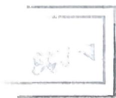

## 基础篇

# 第1章 行别式

1. 设 $a, b, c$ 是方程 $x^{3} - 2x + 4 = 0$ 的三个不同的根, 则行列式 $\left| \begin{array}{ccc} a & b & c \\ b & c & a \\ c & a & b \end{array} \right|$ 的值等于( ).

(A)1

(B)0

(C)-1

(D)-2

2.行列式 $\left| \begin{array}{cccc}x & 1 & 0 & 1\\ 0 & 1 & x & 1\\ 1 & x & 1 & 0\\ 1 & 0 & 1 & x \end{array} \right|$ 展开式中的常数项为( ).

(A)4

(B)2

(C)1

(D)0

3. 设 $D = \left| \begin{array}{lll} 5x & 1 & 2 & 3 \\ x & x & 1 & 2 \\ 1 & 2 & x & 3 \\ x & 1 & 2 & 2x \end{array} \right|$ , 则 $D$ 的展开式中 $x^3$ 的系数与 $x^4$ 的系数分别为( ).

(A)-5, 10

(B)-5, -10

(C)5, -10

(D)5, 10

4. 不恒为零的函数 $f(x) = \begin{cases} a_1 + x & b_1 + x \\ a_2 + x & b_2 + x \\ a_3 + x & b_3 + x \end{cases}$ ( ).

(A)没有零点

(B)至多有1个零点

(C) 恰有 2 个零点

(D) 恰有 3 个零点

5. 若 $f(x) = \begin{vmatrix} 3x + 1 & x + 11 & x - 2 \\ x + 1 & x + 4 & -1 \\ x & 7 & x - 1 \end{vmatrix}$ ，则曲线 $f(x)$ 的拐点为( ).

(A) (1,7)

(B) $(-1, - 1)$

(C) $(0,0)$

(D) $(-2, - 2)$

2 1 0 ... 0  
1 2 1 ... 0  
0 1 2 ... 0  
: : : : :  
0 0 0 ... 2

(A) $D_{1}, D_{2}, \dots, D_{n}$ 为等比数列  
(B) $D_{1}, D_{2}, \dots, D_{n}$ 为等差数列  
(C) $D_{n}$ 为范德蒙德行列式  
(D) $D_{n} = n$

7. 已知 \(A, B\) 均为4阶矩阵，\(r(A A^{\mathrm{T}}) = 3, |A B| = \left| \begin{array}{cccc}2 & a & 0 & -a\\ -a & 2 & -5 & b\\ b & 0 & b & -2\\ 0 & -2 & 4 & 0 \end{array} \right|\)，且 \(\left| \begin{array}{ccc}2 & a & -a\\ -a & 2 & b\\ b & 0 & -2 \end{array} \right| = 5\)，则 \(\left| \begin{array}{ccc} -a & -5 & b\\ 2 & 0 & -a\\ b & b & -2 \end{array} \right| = \_\_\_\_\_\_\_\_\_\_\_\_\_\_\_\_\_\_\_\_\_\_\_\_\_\_\_\_\_\_\_\_\_\_\_\_\_\_\_\_\_\_\_\_\_\_\_\_\_\_\_\_\_\_\_\_\_\_\_\_\_\_\_\_\_\_\_\_\_\_\_\_\_\_\_\_\_\_\_\_\_\_\_\_\_\_\_\_\_\_\_\_\_\_\_\_\_\_\_
\]   
2 1 0 -1 -2 1 0 -1 3 -5 3 2 -5 3 3 0 a b 1 -1 1 0   
9. 设行列式 $D = \left| \begin{array}{cccc}2 & 0 & -1 & 1\\ 3 & 1 & 0 & 1\\ 4 & 1 & 1 & 0\\ 5 & -1 & 0 & a \end{array} \right|$ ， $A_{ij}$ 表示元素 $a_{ij}(i,j = 1,2,3,4)$ 的代数余子式。若 $A_{11} - A_{21} + A_{41} = 4$ ，则 $a = \_\_\_\_\_\_\_\_\_\_\_\_\_\_\_\_\_\_\_\_\_\_\_\_\_\_\_\_\_\_\_\_\_\_\_\_\_\_\_\_\_\_\_\_\_\_\_\_\_\_\_\_\_\_\_\_\_\_\_\_\_\_\_\_\_\_\_\_\_\_\_\_\_\_\_\_\_\_\_\_\_\_\_\_\_\_\_\_\_\_\_\_\_\_\_\_\_$ \[
\begin{aligned}
& A_{11} - A_{21} + A_{41} = 4, \text{则 } a = \underline{\quad}. \\
& A_{11} - A_{21} + A_{41} = 4, \text{则 } a = \underline{\quad}.
\end{aligned}
\]  
10. 设 $x \neq 0$ ，则 $D_{4} = \left| \begin{array}{cccc} x & x & 0 & 0 \\ 1 & 1 + 2x & 2x & 0 \\ 0 & 2 & 2 + 3x & 3x \\ 0 & 0 & 3 & 3 + 4x \end{array} \right| =$ ________.  
11. 设 $A$ 是 3 阶矩阵, $\alpha_{1}, \alpha_{2}, \alpha_{3}$ 是 3 维线性无关列向量, 且满足 $A\alpha_{1} = \alpha_{1} + 2\alpha_{2} + \alpha_{3}, A\alpha_{2} = 2\alpha_{1} + \alpha_{2} + \alpha_{3}, A\alpha_{3} = \alpha_{1} + \alpha_{2} + 2\alpha_{3}$ , 则 $\left|A\right| =$

---

## 强化篇

1. 计算 $n$ 阶行列式：

$$
D _ {n} = \left| \begin{array}{c c c c} a _ {1} + x _ {1} & a _ {2} & \dots & a _ {n} \\ a _ {1} & a _ {2} + x _ {2} & \dots & a _ {n} \\ \vdots & \vdots & & \vdots \\ a _ {1} & a _ {2} & \dots & a _ {n} + x _ {n} \end{array} \right|,
$$

其中 $x_{i}\neq 0,i = 1,2,\dots ,n$

$$
2. D _ {n} = \left| \begin{array}{c c c c c c} b & - 1 & 0 & \dots & 0 & 0 \\ 0 & b & - 1 & \dots & 0 & 0 \\ \vdots & \vdots & \vdots & & \vdots & \vdots \\ 0 & 0 & 0 & \dots & b & - 1 \\ a _ {n} & a _ {n - 1} & a _ {n - 2} & \dots & a _ {2} & b + a _ {1} \end{array} \right| = \underline {{\quad}}.
$$

3. 已知 3 阶矩阵 $A, B$ 相似， $\lambda_1 = 1, \lambda_2 = 2$ 为 $A$ 的两个特征值，行列式 $|B| = 2$ ，则行列式 $\left|\begin{array}{cc}(A + E)^{-1} & O \\ O & (2B)^{\bullet}\end{array}\right| =$ ________.

4. 设 $A = \left[ \begin{array}{lll}\alpha_{1},\alpha_{2},\alpha_{3} \end{array} \right],\alpha_{1},\alpha_{2},\alpha_{3}$ 为线性无关的3维列向量， $\pmb{P}$ 为3阶矩阵,且 $\pmb {PA} = \left[-a_1, - 2a_2, - 3a_3\right]$ 则 $\left|P - E\right| = ()$

(A)6

(B)-6

(C)24

(D)-24

5. 设 $A$ 是 $n$ 阶实对称矩阵， $r(A) = r$ ，且满足 $A^2 = A$ ， $f(x) = x^2 - 2x - 3$ ，则 $\left|f(A) - 6E\right| = \_$

6. 设 $A$ 为3阶矩阵，若 $\left|E - A\right| = \left|E + A\right| = \left|2E - A\right| = 0$ ，则 $\left|3E - A\right| = (\quad)$

(A)-2

(B)-8

(C)8

(D)11

7. 设 $A$ 为3阶矩阵， $\lambda_1, \lambda_2, \lambda_3$ 是 $A$ 的3个不同的特征值，其对应的特征向量为 $\xi_1, \xi_2, \xi_3$ ， $\alpha = \xi_1 + \xi_2 + \xi_3$ ， $P = [a, Aa, A^2a]$

(1)证明 $\pmb{P}$ 可逆；  
(2) 若 $(A^3 - A)\alpha = 0$ ，求 $|A - 3E|$ .

