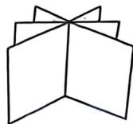
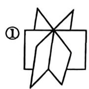

## 基础篇

# 第4章 线性方程组

1. 方程组 $\left\{ \begin{array}{l} ax + y + z = 1, \\ x + ay + z = 1, \\ x + y + az = -2 \end{array} \right.$ 有无穷多解，则 $a = \_\_\_\_\_\_\_\_\_$ .

2. 设3维列向量组 $\alpha_{1}, \alpha_{2}, \alpha_{3}$ 线性无关, $k, l$ 均为非零常数, $\pmb{\beta}_{1} = k\pmb{\alpha}_{1} + l\pmb{\alpha}_{2}, \pmb{\beta}_{2} = k\pmb{\alpha}_{2} + l\pmb{\alpha}_{3}, \pmb{\beta}_{3} = k\pmb{\alpha}_{3} + l\pmb{\alpha}_{1}$ , 记 $\pmb{B} = \left[\pmb{\beta}_{1}, \pmb{\beta}_{2}, \pmb{\beta}_{3}\right]$ , 则齐次线性方程组 $\pmb{Bx} = \mathbf{0}$ 有非零解的充分必要条件为( ).

(A) $k - l = 0$

(B) $k + l = 0$

(C) $k - l \neq 0$

(D) $k + l\neq 0$

3. 设 $A$ 是 $m \times n$ 矩阵, $B$ 是 $n \times m$ 矩阵, 则( ).

(A)当 $m > n$ 时，必有 $\left|AB\right| = 0$   
(B)当 $\hat{m} >n$ 时， $AB$ 必可逆  
(C)当 $n > m$ 时， $ABx = 0$ 有唯一零解  
(D)当 $n > m$ 时，必有 $r(AB) <   m$

4. 设 $A$ 为 $n(n > 2)$ 阶方阵, $r(A^*) = 1$ , $\alpha_1, \alpha_2$ 是非齐次线性方程组 $Ax = b$ 的两个不同解, $k$ 为任意常数, 则方程组 $Ax = b$ 的通解为( ).

(A) $(k - 1)a_{1} + ka_{2}$

(B) $(k - 1)\pmb{a}_{1} - k\pmb{a}_{2}$

(C) $(k + 1)a_{1} + ka_{2}$

(D) $(k + 1)\alpha_{1} - k\alpha_{2}$

5. 设 $\alpha_{1} = \begin{bmatrix} 4 \\ 1 \\ 2 \end{bmatrix}$ , $\alpha_{2} = \begin{bmatrix} 1 \\ 1 \\ -1 \end{bmatrix}$ , $\alpha_{3} = \begin{bmatrix} -2 \\ 0 \\ 4 \end{bmatrix}$ , $\alpha_{4} = \begin{bmatrix} 7 \\ 2 \\ -3 \end{bmatrix}$ , $A = [\alpha_{1}, \alpha_{2}, \alpha_{3}, \alpha_{4}]$ , 则 $Ax = \alpha_{2} + 3\alpha_{4}$ 的通解为

6. 设 $A$ 为 $n (n \geqslant 2)$ 阶方阵, $A^{\prime}$ 为 $A$ 的伴随矩阵, 若对任一 $n$ 维列向量 $\alpha$ , 均有 $A^{\prime} \alpha = 0$ , 则齐次线性方程组 $Ax = 0$ 的基础解系所含解向量的个数 $k$ 必定满足

7. 已知非齐次线性方程组 $\left\{ \begin{array}{l} x_{1} + x_{2} + x_{3} + x_{4} = -1, \\ 4x_{1} + 3x_{2} + 5x_{3} - x_{4} = -1, \\ ax_{1} + x_{2} + 3x_{3} + bx_{4} = 1 \end{array} \right.$ 有 3 个线性无关的解，记该方程组的系数矩阵为 $A$ 。求：

(1) $a, b$ 的值；  
(2) 该方程组的通解；

(3)齐次线性方程组 $A^{\mathrm{T}}Ax = 0$ 的通解.

8. 设 $A = \left[a_{1}, a_{2}, \cdots, a_{n}\right]$ 经过若干次初等行变换得 $B = \left[\beta_{1}, \beta_{2}, \cdots, \beta_{n}\right]$ , 则 $A$ 与 $B$ ( ).

(A) 对应的任何部分行向量组具有相同的线性相关性  
(B) 对应的任何部分列向量组具有相同的线性相关性  
(C) 对应的任何 $k$ 阶子式同时为零或同时不为零  
(D) 对应的非齐次线性方程组 $Ax = b$ 和 $Bx = b$ 是同解方程组

9. 设 $A$ 是 3 阶非零矩阵, 满足 $A^2 = O$ , 若非齐次线性方程组 $Ax = b$ 有解, 则其线性无关的解向量的个数为 ( )、

(A)1

(B)2

(C)3

(D)4

10. 已知线性方程组 $A\mathbf{x} = k\pmb{\beta}_1 + \pmb{\beta}_2$ 有解, 其中 $A = \begin{bmatrix} 1 & 1 & -1 \\ -1 & -2 & 1 \\ 1 & -1 & -1 \end{bmatrix}$ , $\pmb{\beta}_1 = \begin{bmatrix} 2 \\ 1 \\ 3 \end{bmatrix}$ , $\pmb{\beta}_2 = \begin{bmatrix} 1 \\ 3 \\ -1 \end{bmatrix}$ , 则 $k$ 等于( ).

(A)1

(B)-1

(C)2

(D)-2

11. 已知 $\pmb{A}$ 是3阶矩阵, $\pmb{A}$ 的每行元素之和为3, 且齐次线性方程组 $\pmb{Ax} = \pmb{0}$ 有通解 $k_{1}[1,2,-2]^{\mathrm{T}} + k_{2}[2,1,2]^{\mathrm{T}}, \alpha = [1,1,1]^{\mathrm{T}}$ , 其中 $k_{1}, k_{2}$ 是任意常数.

(1)证明：对任意的一个3维列向量 $\pmb{\beta}$ ，向量 $A\beta$ 和 $\alpha$ 线性相关  
(2) 若 $\pmb{\beta} = [3,6, - 3]^{\mathrm{T}}$ ，求 $A\pmb{\beta}$

12. 设3维列向量组 $\alpha_{1}, \alpha_{2}, \alpha_{3}$ 与 $\beta_{1}, \beta_{2}, \beta_{3}$ 等价, 记 $A = [\alpha_{1}, \alpha_{2}, \alpha_{3}]$ , $B = [\beta_{1}, \beta_{2}, \beta_{3}]$ , 则下列结论:

① $A x = 0$ 与 $B x = 0$ 同解；

② $A^{\mathrm{T}}x = 0$ 与 $\pmb{B}^{\mathrm{T}}\pmb{x} = \pmb{0}$ 同解；

$③ \left[ \begin{array} { c } { A } \\ { B } \end{array} \right] x = 0$ 与 $A\pmb {x} = \pmb{0}$ 同解；

$④ \left[ \begin{array} { l } { A ^ { \mathrm { T } } } \\ { B ^ { \mathrm { T } } } \end{array} \right] x = 0$ 与 $A^{\mathrm{T}}x = 0$ 同解.

所有正确结论的序号是( ).

(A)①②

(B)①③

(C)②④

(D)①②③④

13. 设 $A$ 为 $m \times n$ 矩阵, $e = [1,1,\dots,1]^{\mathrm{T}}$ . 若方程组 $Ay = e$ 有解, 则对于 (I) $A^{\mathrm{T}}x = 0$ 与 (II) $\left\{ \begin{array}{l} A^{\mathrm{T}}x = 0, \\ e^{\mathrm{T}}x = 0, \end{array} \right.$ 说法正确的是( ).

(A)(I)的解都是(II)的解，但(II)的解未必是(I)的解  
(B)(II)的解都是(I)的解, 但(I)的解未必是(II)的解  
(C)(I)的解不是(II)的解, 且(II)的解也不是(I)的解  
(D)(I)的解都是(II)的解，且(II)的解也都是(I)的解

14. 设齐次线性方程组(I) $\left\{ \begin{array}{l} x_{1} + 3x_{3} + 5x_{4} = 0, \\ x_{1} - x_{2} - 2x_{3} + 2x_{4} = 0, \\ 2x_{1} - x_{2} + x_{3} + 3x_{4} = 0. \end{array} \right.$ 在线性方程组(I)的基础上增添一个方程

$ax_{1} + bx_{2} + cx_{3} + dx_{4} = 0$ ，得(Ⅱ) $\left\{ \begin{array}{l}x_{1} + 3x_{3} + 5x_{4} = 0,\\ x_{1} - x_{2} - 2x_{3} + 2x_{4} = 0,\\ 2x_{1} - x_{2} + x_{3} + 3x_{4} = 0,\\ ax_{1} + bx_{2} + cx_{3} + dx_{4} = 0. \end{array} \right.$ 问 $a,b,c,d$ 满足什么条件时，方程组

(I), (II) 是同解方程组? 并求出此时方程组 (II) 的通解.

15. 设平面 $\pi_1: x + ay = a, \pi_2: ax + z = 1, \pi_3: ay + z = 1$ ，已知这三个平面没有公共交点，则 $a =$ ________.  
16. 在空间直角坐标系 $O - xyz$ 中, 三张平面 $\pi_1: ax + y - z = 1$ , $\pi_2: x + y + bz = a$ , $\pi_3: x + ay - z = 1$ 的位置关系如图所示, 则( ).

(A) $a = -2, b = 2$

(B) $a \neq -2, b = 2$

(C) $a = 1, b = -1$

(D) $a = 1, b \neq -1$

17. 设 $\pmb{B}$ 是3阶矩阵, 齐次线性方程组 $\pmb{Bx} = \mathbf{0}$ 的解空间的维数为2, $\pmb{A} = \begin{bmatrix} 1 & 2 & -2 \\ 4 & a & 3 \\ 3 & -1 & 1 \end{bmatrix}$ , 若 $\pmb{AB} = \pmb{O}$ , 则齐次线性方程组 $\pmb{Ax} = \pmb{0}$ 的解空间的维数为( ).

(A)0

(B)1

(C)2

(D)3

---

## 强化篇

1. 设4阶矩阵 $A = \left[a_{ij}\right]$ 不可逆, 且元素 $a_{12}$ 的代数余子式 $A_{12} \neq 0$ , 若矩阵 $A$ 的列向量组为 $a_1$ , $a_2, a_3, a_4, k_1, k_2, k_3$ 为任意常数, 则方程组 $A^* x = 0$ 的通解为( ).

(A) $k_{1} \pmb{\alpha}_{1} + k_{2} \pmb{\alpha}_{2} + k_{3} \pmb{\alpha}_{3}$

(B) $k_{1}\alpha_{1} + k_{2}\alpha_{2} + k_{3}\alpha_{4}$

(C) $k_{1}a_{1} + k_{2}a_{3} + k_{3}a_{4}$

(D) $k_{1}\alpha_{2} + k_{2}\alpha_{3} + k_{3}\alpha_{4}$

2. 设 $A$ 是 4 阶矩阵, $A$ 的伴随矩阵 $A^{\bullet} = \begin{bmatrix} 1 & 0 & 1 & 0 \\ 0 & 2 & 0 & 2 \\ 0 & 0 & 1 & 1 \\ 0 & 0 & 0 & 4 \end{bmatrix}, b = [1,1,1,1]^{\mathrm{T}}$ , 则方程组 $Ax = b$ 的解为

3. 设方程组 $\left\{ \begin{array}{l} x_{1} + ax_{2} - 2x_{3} = 0, \\ x_{1} + 2x_{2} + x_{3} = 1, \\ 2x_{1} + 3x_{2} + (a + 2)x_{3} = 3 \end{array} \right.$ 的系数矩阵为 $A$ ，自由项为 $b$ ，若 $Ax = b$ 无解， $A^{\mathrm{T}}Ax = A^{\mathrm{T}}b$ 有解，则 $a = (\quad)$ .

(A) -1

(B)1

(C)-3

(D)3

4. 设 $A$ 是秩为 2 的 3 阶实对称矩阵, $\alpha, \beta$ 是 3 维非零列向量, $B = \begin{bmatrix} A & \beta \\ \alpha^{\mathrm{T}} & 1 \end{bmatrix}$ , 则 $r(B) = 2$ 是方程组 $\left\{ \begin{array}{l} A x = \beta, \\ a^{\mathrm{T}} x = 1 \end{array} \right.$ 有解的 ( ).

(A) 充分非必要条件

(B)必要非充分条件

(C) 充分必要条件

(D) 既非充分又非必要条件

5. 设四元齐次线性方程组 (I) $\left\{ \begin{array}{l} 2x_{1} + 3x_{2} - x_{3} = 0, \\ x_{1} + 2x_{2} + x_{3} - x_{4} = 0, \end{array} \right.$ 且四元齐次线性方程组 (II) 的一个基础解系为 $\xi_{1} = [2, -1, k + 2, 1]^{\mathrm{T}}, \xi_{2} = [-1, 2, 4, k + 8]^{\mathrm{T}}$ ，若方程组 (I) 与 (II) 没有非零公共解，则 $k$ 的取值范围为

6. 已知 $A, B$ 均是 $2 \times 4$ 矩阵， $Ax = 0$ 的基础解系是 $\alpha_{1} = [1,1,2,1]^{\mathrm{T}}$ ， $\alpha_{2} = [0,-3,1,0]^{\mathrm{T}}$ ， $Bx = 0$ 的基础解系是 $\beta_{1} = [1,3,0,2]^{\mathrm{T}}$ ， $\beta_{2} = [1,2,-1,a]^{\mathrm{T}}$ 。

(1)求矩阵 $\pmb{A}$

(2) 如果 $Ax = 0$ 和 $Bx = 0$ 有非零公共解, 求 $\alpha$ 的值及所有非零公共解.

7. 设3阶矩阵 $A, B$ 满足 $r(BA) < r(AB)$ , 对于以下结论

① $ABx = 0$ 与 $BAx = 0$ 有非零公共解；  
② $ABAx = 0$ 与 $BABx = 0$ 有非零公共解.

正确的说法是( ).

(A)①正确, ②正确   
(B)①正确, ②错误   
(C)①错误, ②正确   
(D)①错误, ②错误

8. 设 $A$ 为 $n$ 阶实矩阵, 则( ).

(A) $\left[ \begin{array}{cc}A & O\\ E & A^{\mathrm{T}}A \end{array} \right]x = 0$ 只有零解  
(B) $\left[ \begin{array}{cc} \boldsymbol{O} & \boldsymbol{A} \\ \boldsymbol{A}^{\mathrm{T}}\boldsymbol{A} & \boldsymbol{A}\boldsymbol{A}^{\mathrm{T}}\boldsymbol{A} \end{array} \right]\boldsymbol{x} = \boldsymbol{0}$ 只有零解  
(A) $\left[ \begin{array}{ll}A & A^{\mathrm{T}}A\\ 0 & A^{\mathrm{T}}A \end{array} \right]x = 0$ 与 $\left[ \begin{array}{ll}A^{\mathrm{T}}A & A\\ 0 & A \end{array} \right]x = 0$ 同解  
$\left[ \begin{array}{ll}AA^{\mathrm{T}}A & A^{\mathrm{T}}A\\ 0 & A \end{array} \right]x = 0$ 与 $\left[ \begin{array}{cc}A^{\mathrm{T}}A^{2} & A\\ 0 & A^{\mathrm{T}}A \end{array} \right]x = 0$ 同解

9. 设 $A, B$ 为 $n$ 阶矩阵，且 $A$ 满足 $A^2 - A = 3E$ ，则与 $\left[ \begin{array}{l}A \\ B \end{array} \right]x = 0$ 不一定同解的是（ ）.

(A) $\left[ \begin{array}{l}A - B\\ A + AB \end{array} \right]\pmb {x} = \pmb{0}$

(A+B) (B) $\left[\begin{array}{c}A + B \\ A + AB - B\end{array}\right]x = 0$

(A-B) (C) [2A+B]x=0

(A+B) (D) $\left[\begin{array}{c}A+B \\ BA+B^{2}\end{array}\right]x=0$

10. 设 $\boldsymbol{\alpha}_{1} = [1, -2, 1, 0, 0]^{\mathrm{T}}$ , $\boldsymbol{\alpha}_{2} = [1, -2, 0, 1, 0]^{\mathrm{T}}$ , $\boldsymbol{\alpha}_{3} = [0, 0, 1, -1, 0]^{\mathrm{T}}$ , $\boldsymbol{\alpha}_{4} = [1, -2, 3, -2, 0]^{\mathrm{T}}$ 是线性方程组

$$
\left\{ \begin{array}{l} x _ {1} + x _ {2} + x _ {3} + x _ {4} + x _ {5} = 0, \\ 3 x _ {1} + 2 x _ {2} + x _ {3} + x _ {4} - 3 x _ {5} = 0, \\ x _ {2} + 2 x _ {3} + 2 x _ {4} + 6 x _ {5} = 0, \\ 5 x _ {1} + 4 x _ {2} + 3 x _ {3} + 3 x _ {4} - x _ {5} = 0 \end{array} \right. \tag {*}
$$

的解向量, 则 $\alpha_{1}, \alpha_{2}, \alpha_{3}, \alpha_{4}$ 能否构成方程组 (*) 的基础解系? 若能, 说明理由; 若不能, 请增或减向量, 使之成为基础解系.

11. 已知 $a$ 是常数, 且矩阵 $\mathbf{A} = \begin{bmatrix} 1 & 2 & a \\ 1 & 3 & 0 \\ 2 & 7 & -a \end{bmatrix}$ 可经初等列变换化为矩阵 $\mathbf{B} = \begin{bmatrix} 1 & a & 2 \\ 0 & 1 & 1 \\ -1 & 1 & 1 \end{bmatrix}$ .

(1)求 $a$

(2) 求满足 $\mathbf{A}\mathbf{P} = \mathbf{B}$ 的可逆矩阵 $\mathbf{P}$ .

12. 设 $A = \begin{bmatrix} 1 & -2 & 3 \\ 0 & 1 & -1 \\ 1 & 2 & 0 \end{bmatrix}$ , $\pmb{\beta} = \begin{bmatrix} -4 \\ 1 \\ -3 \end{bmatrix}$ , $\pmb{B} = \begin{bmatrix} -2 & 1 & 3 \\ 1 & 0 & -1 \\ 2 & 1 & 0 \end{bmatrix}$ , $[A, \pmb{\beta}] = B\pmb{C}$ .

(1) 求 $A\pmb{x} = \pmb{\beta}$ 的解，并求出 $\pmb{C}$ ；  
(2) 求满足 $[A, \beta] \mathbf{Y} = \mathbf{E}$ 的所有 $\mathbf{Y}$ .  
13. 设 $A_{3 \times 3} = \left[ \alpha_{1}, \alpha_{2}, \alpha_{3} \right]$ , 方程组 $Ax = \beta$ 有通解 $k\xi + \eta = k\left[1, 2, -3\right]^{\mathrm{T}} + \left[2, -1, 1\right]^{\mathrm{T}}$ , 其中 $k$ 是任意常数, 又设 $B = \left[ \alpha_{1} + \alpha_{2} + \alpha_{3} + \beta, \alpha_{1}, \alpha_{2}, \alpha_{3} \right]$ , 求方程组 $By = \beta$ 的通解.  
14. 如图所示有三张平面, 其中有两张平面平行, 第三张平面与它们相交, 其方程 $a_{i1}x + a_{i2}y + a_{i3}z = d_i (i = 1,2,3)$ 组成的方程组的系数矩阵与增广矩阵分别为 $\pmb{A}$ 和 $\overline{\pmb{A}}$ , 则( ).

(A) $r(\mathbf{A}) = 2, r(\overline{\mathbf{A}}) = 3$

(B) $r(A) = 2, r(\overline{A}) = 2$

(C) $r(A) = 1, r(\overline{A}) = 2$

(D) $r(\mathbf{A}) = 1, r(\overline{\mathbf{A}}) = 1$

15. 设 $\pmb{a}_i = [a_i, b_i, c_i]^{\mathrm{T}}$ ( $i = 1,2,3$ ) 均为非零列向量，且直线 $\frac{x - a_1}{a_2} = \frac{y - b_1}{b_2} = \frac{z - c_1}{c_2}$ 过点 $(a_3, b_3, c_3)$ ，则可能是三个平面 $\pi_i: \pmb{a}_i^{\mathrm{T}} \begin{bmatrix} x \\ y \\ z \end{bmatrix} = 1 (i = 1,2,3)$ 的位置关系的所有序号是（ ）.

(A)①③

(C) ②④

(B)②③

(D)①③④

