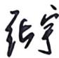

## 基础篇

# 第6章 二次型

1. $f(x_{1},x_{2},x_{3}) = -2x_{1}x_{2} - 2x_{1}x_{3} + 6x_{2}x_{3}$ 的正惯性指数为( ).

(A)3

(B)2

(C)1

(D)0

2. 设二次型 $f(x_{1}, x_{2}, x_{3}) = ax_{1}x_{2} + x_{1}x_{3} - x_{2}x_{3}$ 的正惯性指数为 2, 负惯性指数为 1, 则以下结论可能成立的是 ( ).

(A) $a = -1$

(B) $a = 1$

(C) $a\geqslant 0$

(D) $a < 0$

3. 已知二次型 $f(x_{1}, x_{2}, x_{3}) = (x_{1} - x_{2} + x_{3})^{2} + (x_{2} - ax_{3})^{2} + (ax_{3} + x_{1})^{2}$ 的秩为 2, 则 $a =$ ________.

4. 设二次型 $f(x_{1}, x_{2}, x_{3}) = a(x_{1}^{2} + x_{2}^{2} + x_{3}^{2}) + 4(x_{1}x_{2} + x_{1}x_{3} + x_{2}x_{3})$ 经正交变换可化为标准形 $f = 5y_{1}^{2} - y_{2}^{2} - y_{3}^{2}$ ，则 $a = (\quad)$ .

(A)0

(B)1

(C)2

(D)3

5. 设二次型 $f(x_{1}, x_{2}, x_{3})$ 在正交变换 $x = P y$ 下的标准形为 $y_{1}^{2} + y_{2}^{2} - 2y_{3}^{2}$ ，其中 $P = [e_{1}, e_{2}, e_{3}]$ . 若 $Q = [-e_{3}, e_{2}, e_{1}]$ ，则 $f(x_{1}, x_{2}, x_{3})$ 在正交变换 $x = Q y$ 下的标准形为（ ）.

(A) $2y_{1}^{2} - y_{2}^{2} + y_{3}^{2}$

(B) $2y_{1}^{2} + y_{2}^{2} - y_{3}^{2}$

(C) $-2y_{1}^{2} + y_{2}^{2} + y_{3}^{2}$

(D) $-2y_{1}^{2} - y_{2}^{2} + y_{3}^{2}$

6. 设 $f(x_{1}, x_{2}, x_{3}) = [x_{1} + (a - 2)x_{2} - 2x_{3}]^{2} + (x_{1} + ax_{2} + x_{3})^{2} + [x_{1} + ax_{2} + (a - 2)x_{3}]^{2}$ . 求：

(1)方程 $f(x_{1},x_{2},x_{3}) = 0$ 的解；  
(2)二次型 $f(x_{1},x_{2},x_{3})$ 的规范形.

7. 已知二次型 $f(x_{1}, x_{2}, x_{3}) = ax_{1}^{2} + ax_{2}^{2} + ax_{3}^{2} + 2x_{1}x_{2} + 2x_{1}x_{3} - 2x_{2}x_{3}$ 对应的矩阵为 $A$ ，且其在正交变换 $x = Qy$ 下的标准形为 $y_{1}^{2} + y_{2}^{2} - 2y_{3}^{2}$ .

(1)求 $a$ 的值和正交矩阵 $Q$ ：

(2) 设矩阵 $\pmb{B} = \begin{bmatrix} 1 & 0 & 0 \\ c & b & 0 \\ -1 & -1 & 1 \end{bmatrix}$ , 若 $\pmb{A}$ 与 $\pmb{B}$ 相似, 求 $b$ , $c$ 的值. 在此情形下, 是否存在正交矩阵 $\pmb{P}$ , 使 $\pmb{P}^{\mathrm{T}}\pmb{A}\pmb{P} = \pmb{B}$ ? 若存在, 求 $\pmb{P}$ ; 若不存在, 请说明理由.

8. 设 $A = \begin{bmatrix} 0 & 0 & 0 & 1 \\ 0 & 0 & 1 & 0 \\ 0 & 1 & 0 & 0 \\ 1 & 0 & 0 & 0 \end{bmatrix}$ , $B = \begin{bmatrix} -1 & 0 & 0 & 0 \\ 0 & -1 & 0 & 0 \\ 0 & 0 & 1 & 0 \\ 0 & 0 & 0 & 1 \end{bmatrix}$ , 则 $A$ 和 $B$ ( ).

(A) 不相似且不合同

(B)相似但不合同

(C) 不相似但合同

(D) 相似且合同

9. 设 $A$ 为 $n(n > 1)$ 阶方阵, $i, j = 1,2,\dots,n; i \neq j$ , 互换 $A$ 的第 $i$ 行与第 $j$ 行得到矩阵 $\pmb{B}$ , 再互换 $\pmb{B}$ 的第 $i$ 列与第 $j$ 列得到矩阵 $\pmb{C}$ , 则 $\pmb{A}$ 与 $\pmb{C}$ ( ).

(A)等价，相似且合同

(B)等价, 合同但不相似

(C) 合同, 相似但不等价

(D)等价, 相似但不合同

10. 下列矩阵中的正定矩阵是( ).

(A) $A = \left[ \begin{array}{rrr}2 & -1 & 1\\ -1 & 1 & 2\\ 1 & 2 & 0 \end{array} \right]$

(B) $\pmb{B} = \begin{bmatrix} 2 & -1 & 1 \\ -1 & 2 & 2 \\ 1 & 2 & 5 \end{bmatrix}$

(C) $\mathbf{C} = \begin{bmatrix} 1 & 1 & 2 \\ 1 & 3 & 1 \\ 2 & 1 & -1 \end{bmatrix}$

(D) $\pmb{D} = \begin{bmatrix} 1 & 2 & -1 \\ 2 & 5 & -3 \\ -1 & -3 & 2 \end{bmatrix}$

11. 设 $A$ 为 $n$ 阶方阵, 有下列结论:

(1)若 $\pmb{A}$ 的全部顺序主子式为正, 则 $\pmb{A}$ 正定;  
②若 $\pmb{A}$ 相似于对角矩阵 $\pmb{\Lambda}$ , 则 $\pmb{A}$ 与 $\pmb{\Lambda}$ 合同;  
(3)若 $\pmb{A}$ 与正定矩阵合同, 则 $\pmb{A}$ 为正定矩阵.

则正确结论的个数为( ).

(A) 0

(B) 1

(C) 2

(D) 3

12. 已知 $A$ 为3阶矩阵， $E$ 为3阶单位矩阵，且 $(aE + A)^2 = \begin{bmatrix} 1 & 0 & 1 \\ 0 & 2 & 0 \\ 1 & 0 & 1 \end{bmatrix}$ ， $\operatorname{tr}(A) = 2\sqrt{2} - 3a$ ， $a$ 为常数。

(1)求矩阵 $A$   
(2)若 $\pmb{A}$ 正定，求 $\pmb{\alpha}$ 的取值范围.

13. 设矩阵 $A = \begin{bmatrix} 1 & 1 & a \\ 1 & a & 1 \\ a & 1 & 1 \end{bmatrix}$ , 向量 $\pmb{\beta} = \begin{bmatrix} 1 \\ 1 \\ a \end{bmatrix}$ , 若齐次线性方程组 $Ax = 0$ 的解空间的维数为 1.

(1)求常数 $a$ 的值及非齐次线性方程组 $Ax = \beta$ 的解；  
(2)求一个正交变换 $x = Qy$ ，将二次型 $f(x) = x^{\mathrm{T}}Ax$ 化为标准形，并写出该标准形.

14. 设 $A = \left[ \begin{array}{rrr} -3 & 0 & 0 \\ 0 & -1 & 2 \\ 0 & 2 & 2 \end{array} \right], B = \left[ \begin{array}{rrr} 0 & 3 & 0 \\ 3 & 0 & 0 \\ 0 & 0 & k \end{array} \right]$ , 若 $A$ 与 $B$ 合同但不相似, 则常数 $k$ 的取值范围为 ( ).

(A) $k > 0$ 且 $k \neq 2$

(B) $k > 0$ 且 $k \neq 3$

(C) $k < 0$ 且 $k \neq -2$

(D) $k < 0$ 且 $k \neq -3$

15. 设二次型 $f(x_{1}, x_{2}, x_{3}) = 4x_{1}^{2} + x_{2}^{2} + ax_{3}^{2} + 2x_{1}x_{2} - 4x_{1}x_{3} + 2x_{2}x_{3}$ 与 $g(y_{1}, y_{2}, y_{3}) = 2y_{1}^{2} + by_{2}^{2}$ 合同，则（ ）.

(A) $a = 3,b > 0$

(B) $a = 3,b <   0$

(C) $a = 4,b > 0$

(D) $a = 4, b < 0$

16. 设3阶实对称矩阵 $\pmb{A}$ 的各行元素之和均为2, 其主对角线元素之和为5, $r(A) = 2$ , 则二次型 $f(x_{1},x_{2},x_{3}) = x^{\mathrm{T}}Ax$ 满足条件 $x_{1}^{2} + x_{2}^{2} + x_{3}^{2} = 1$ 的最大值为( ).

(A) $\frac{1}{5}$

(B) $\frac{1}{2}$

(C)2

(D)3

17. 设 $A = \left[ \begin{array}{rrr} 1 & 1 & 1 \\ 1 & a + 2 & 1 \\ 1 & 1 & a \end{array} \right]$ , 若二次型 $f(x_{1}, x_{2}, x_{3}) = x^{\mathrm{T}}Ax$ 的规范形为 $z_{1}^{2} + z_{2}^{2}$ , 求 $a$ 的值与将其化为规范形的可逆线性变换.

18. 设 $\alpha, \beta$ 为 $n$ 维列向量， $P = [\alpha, \beta]$ ， $Q = [\alpha + \beta, 2\alpha]$ 。若矩阵 $A$ 使得 $P^{\mathrm{T}}AP = \begin{bmatrix} 1 & 0 \\ 0 & 0 \end{bmatrix}$ ，则 $Q^{\mathrm{T}}AQ = (\quad)$ 。

(A) $\left[ \begin{array}{ll}1 & 4\\ 4 & 2 \end{array} \right]$

(B) $\left[ \begin{array}{ll}4 & 2\\ 2 & 1 \end{array} \right]$

(c) $\left[ \begin{array}{ll}1 & 2\\ 2 & 4 \end{array} \right]$

(D) $\left[ \begin{array}{ll}2 & 1\\ 1 & 4 \end{array} \right]$

19. 已知 $A = \begin{bmatrix} 3 & 2 & 1 \\ 2 & 2 & 1 \\ 1 & 1 & 1 \end{bmatrix}, A = \begin{bmatrix} 2 & 0 & 0 \\ 0 & 3 & 0 \\ 0 & 0 & 1 \end{bmatrix}$ , 求可逆矩阵 $C$ , 使得 $C^{\mathrm{T}}AC = A$ .

20. 设3维列向量 $\alpha = [1,1,1]^{\mathrm{T}}$ ，矩阵 $A = \alpha \alpha^{\mathrm{T}}$

(1)求 $\pmb{A}$ 的特征值与全部特征向量；  
(2)求方程组 $(A + kE)x = 0$ （ $k$ 为常数）的通解；  
(3)求一个正交变换 $x = Qy$ ，将二次型 $f = x^{\mathrm{T}}Ax$ 化为标准形.

21. 设二次型 $f(x_{1}, x_{2}, x_{3}) = x_{1}^{2} + x_{2}^{2} + 2x_{3}^{2} - 2x_{1}x_{2}$ 的矩阵为 $A$ ，则与 $A^{2}$ 既相似又合同的矩阵是（ ）.

(A) $\left[ \begin{array}{lll}2 & 0 & 0\\ 0 & 2 & 0\\ 0 & 0 & 0 \end{array} \right]$

(B) $\left[ \begin{array}{lll}4 & 0 & 0\\ 0 & 4 & 0\\ 0 & 0 & 0 \end{array} \right]$

(C) $\left[ \begin{array}{lll}4 & 0 & 0\\ 0 & 0 & 0\\ 0 & 0 & 0 \end{array} \right]$

(D) $\left[ \begin{array}{lll}3 & 0 & 0\\ 0 & 3 & 0\\ 0 & 0 & 2 \end{array} \right]$

22. 下列二次型中，属于正定二次型的是( ).

(A) $f_{1}(x_{1}, x_{2}, x_{3}, x_{4}) = (x_{1} - x_{2})^{2} + (x_{2} - x_{3})^{2} + (x_{3} - x_{4})^{2} + (x_{4} - x_{1})^{2}$   
(B) $f_{2}(x_{1}, x_{2}, x_{3}, x_{4}) = (x_{1} + x_{2})^{2} + (x_{2} + x_{3})^{2} + (x_{3} + x_{4})^{2} + (x_{4} + x_{1})^{2}$

(C) $f_{3}(x_{1}, x_{2}, x_{3}, x_{4}) = (x_{1} - x_{2})^{2} + (x_{2} + x_{3})^{2} + (x_{3} - x_{4})^{2} + (x_{4} + x_{1})^{2}$   
(D) $f_{4}(x_{1},x_{2},x_{3},x_{4}) = (x_{1} - x_{2})^{2} + (x_{2} + x_{3})^{2} + (x_{3} + x_{4})^{2} + (x_{4} + x_{1})^{2}$

23. (1) 设二次型 $f(x, y, z) = y^2 + 2xz$ ，用正交变换 $x = Qy$ 将其化为标准形，并写出 $Q$ ；  
(2) 求函数 $g(x, y, z) = \frac{y^2 + 2xz}{x^2 + y^2 + z^2} (x^2 + y^2 + z^2 \neq 0)$ 的最大值，并求出一个最大值点.  
24. 二次型 $f(x_{1}, x_{2}, x_{3}) = \mathbf{x}^{\mathrm{T}} \mathbf{A}\mathbf{x}$ 通过正交变换化成 $2y_{1}^{2} + 2y_{2}^{2}$ , 方程组 $\mathbf{A}\mathbf{x} = \mathbf{0}$ 有解 $\xi = [1,0,1]^{\mathrm{T}}$ , 求正交变换及二次型矩阵 $\mathbf{A}$ .  
25. 设 $A = \left[ \begin{array}{ccccc}1 & 1 & 1 & \dots & 1\\ 1 & 2 & 3 & \dots & s\\ 1 & 2^2 & 3^2 & \dots & s^2\\ \vdots & \vdots & \vdots & & \vdots \\ 1 & 2^{n - 1} & 3^{n - 1} & \dots & s^{n - 1} \end{array} \right]$ ，其中 $s, n$ 是正整数，证明 $A^{\mathrm{T}}A$ 是实对称矩阵，并就正整

数 $s, n$ 的情况讨论矩阵 $\mathbf{A}^{\mathrm{T}}\mathbf{A}$ 的正定性.

26. $f(x_{1},x_{2},x_{3}) = -2x_{1}x_{2} - 2x_{1}x_{3} + 6x_{2}x_{3} = 0$ 是( ).

(A) 柱面

(B)单叶双曲面

(C) 双叶双曲面

(D) 锥面

27. 已知二次型 $f(x_{1}, x_{2}, x_{3}) = x_{1}^{2} + x_{2}^{2} + ax_{3}^{2} - 2x_{1}x_{3}$ ，且二次曲面 $f(x_{1}, x_{2}, x_{3}) = 1$ 是柱面.

(1)求 $\pmb{a}$ 的值；  
(2) 用正交变换将二次型 $f$ 化为标准形, 并求所用的正交变换;  
(3)求此柱面母线的方向向量.

---

## 强化篇

1. 已知二次型 $f(x_{1}, x_{2}, x_{3}) = 4x_{1}^{2} + x_{2}^{2} + ax_{3}^{2} + 2x_{1}x_{2} - 4x_{1}x_{3} + 2x_{2}x_{3}$ 可经可逆线性变换但不可经正交变换化为 $g(y_{1}, y_{2}, y_{3}) = by_{1}^{2} + 6y_{2}^{2}$ ，则 $a + b$ 的取值范围为（ ）.

(A) $(4, +\infty)$

(B) $(7, +\infty)$

(C) $[4, +\infty)$

(D) $(4,7)\bigcup (7, + \infty)$

2. 设 $A$ 为3阶实对称方阵， $r(E - A) = 1$ ，且 $A^2 + 2A = 3E$ ，则二次型 $f(x_1, x_2, x_3) = x^{\mathrm{T}}Ax$ 的规范形为（ ）.

(A) $z_1^2 + z_2^2 + z_3^2$

(B) $z_1^2 + z_2^2 - z_3^2$

(C) $z_1^2 - z_2^2 - z_3^2$

(D) $-z_{1}^{2} - z_{2}^{2} - z_{3}^{2}$

3. $f(x_{1},x_{2},x_{3}) = x_{1}x_{2} + x_{1}x_{3} - 3x_{2}x_{3}$ 的规范形为( ).

(A) $z_1^2 + z_2^2 - z_3^2$

(B) $z_1^2 - z_2^2 - z_3^2$

(C) $z_1^2 + z_2^2 + z_3^2$

(D) $-z_{1}^{2} - z_{2}^{2} - z_{3}^{2}$

4. 二次型 $f(x_{1}, x_{2}, x_{3}) = (x_{1} + 3x_{2} + ax_{3})(x_{1} + 5x_{2} + bx_{3})$ 的正惯性指数 $p$ ( ).

(A)与 $a$ 有关, 与 $b$ 无关

(B)与 $a$ 无关，与 $b$ 有关

(C)与 $a,b$ 均有关

(D)与 $a, b$ 均无关

5. 二次型 $f(x_{1}, x_{2}, x_{3}) = \sum_{1 \leqslant i, j \leqslant 3} |i - j| x_{i} x_{j}$ 的规范形为 _______.  
6. 设 $a_{1}, a_{2}, a_{3}$ 为一组不全为零的实数, 则二次型 $f\left(x_{1}, x_{2}, x_{3}\right)=\sum_{i=1}^{3} \sum_{j=1}^{3} a_{i} a_{j} x_{i} x_{j}$ 的规范形为  
7. 设 $\pmb{A}$ 是 3 阶实对称矩阵, $\pmb{A}$ 的每行元素之和为 3 , 则二次型 $f(x_{1}, x_{2}, x_{3}) = \pmb{x}^{\mathrm{T}}\pmb{A}\pmb{x}$ 在 $\pmb{x} = \pmb{x}_{0} = [1,1,1]^{\mathrm{T}}$ 处的值 $f(1,1,1) = \pmb{x}_{0}^{\mathrm{T}}\pmb{A}\pmb{x}_{0} = \_$ .  
8. 二次型 $f\left( {{x}_{1},{x}_{2},{x}_{3},{x}_{4}}\right)  = {\left( {x}_{1} + {x}_{2}\right) }^{2} + {\left( {x}_{2} + {x}_{3}\right) }^{2} + {\left( {x}_{3} + {x}_{4}\right) }^{2} + {\left( {x}_{4} + {x}_{1}\right) }^{2}$ 的秩为_____.  
9. 已知二次型 $f(x_{1}, x_{2}, x_{3}) = (1 - a)x_{1}^{2} + (1 - a)x_{2}^{2} + 2x_{3}^{2} + 2(1 + a)x_{1}x_{2}$ 的秩为 2, 则 $f(x_{1}, x_{2}, x_{3}) = 0$ 的通解为  
10. 设二次型 $f(x_{1},x_{2},x_{3}) = x^{\mathrm{T}}Ax = \left[x_{1},x_{2},x_{3}\right]\left[ \begin{array}{lll}a_{11} & a_{12} & a_{13}\\ a_{21} & a_{22} & a_{23}\\ a_{31} & a_{32} & a_{33} \end{array} \right]\left[ \begin{array}{l}x_{1}\\ x_{2}\\ x_{3} \end{array} \right],$ 且 $\sum_{l = 1}^{3}a_{ll} = 2,AB = O,$

其中 $\pmb{B} = \begin{bmatrix} 1 & -1 & 0 \\ 1 & 1 & 2 \\ 1 & 0 & 1 \end{bmatrix}$ .

(1)用正交变换化二次型为标准形,并求所作的正交变换；  
(2)求该二次型；  
(3) $f(x_{1}, x_{2}, x_{3}) = 1$ 表示什么曲面？

11. 已知矩阵 $A = \left[ \begin{array}{rrr}2 & -2 & 0\\ -2 & 1 & -2\\ 0 & -2 & 0 \end{array} \right],\pmb {\beta} = \left[ \begin{array}{l} - 2\\ 0\\ 0 \end{array} \right],A\pmb {\eta} + \pmb {\beta} = \mathbf{0},\pmb {\eta}$ 为3维列向量.

(1)求 $\pmb{\eta}$

(2)求正交矩阵 $\pmb{P}$ ，使 $P^{\mathrm{T}}AP = A$

(3) 令 $x = P y + \eta$ , 其中 $x = [x, y, z]^{\mathrm{T}}$ , $y = [x_1, y_1, z_1]^{\mathrm{T}}$ , 化简二次曲面方程 $2x^2 + y^2 - 4xy - 4yz - 4x - 5 = 0$ , 并说明它表示什么曲面.

12. 设二次型 $f(x_{1}, x_{2}, x_{3}) = \mathbf{x}^{\mathrm{T}} \begin{bmatrix} 1 & 0 & 6 \\ 4 & 4 & 4 \\ 0 & 8 & 9 \end{bmatrix}$ ，其中 $\mathbf{x} = \begin{bmatrix} x_{1} \\ x_{2} \\ x_{3} \end{bmatrix}$ .

(1)用正交变换 $x = Qy$ 将其化为标准形，并求出 $Q$

(2) 求 $g(x_{1}, x_{2}, x_{3}) = \frac{f(x_{1}, x_{2}, x_{3})}{x_{1}^{2} + x_{2}^{2} + x_{3}^{2}}$ 的最大值, 并求出一个最大值点, 其中 $x_{1}^{2} + x_{2}^{2} + x_{3}^{2} \neq 0$

13. 设 $f(x) = (\pmb{\alpha}^{\mathrm{T}}\pmb{x})^{2} + k(\pmb{\beta}^{\mathrm{T}}\pmb{x})^{2}$ 的二次型矩阵的迹为3, 其中

$$
\boldsymbol {\alpha} = \left[ \frac {1}{\sqrt {2}}, 0, - \frac {1}{\sqrt {2}} \right] ^ {\mathrm {T}}, \boldsymbol {\beta} = \left[ \frac {1}{\sqrt {3}}, \frac {1}{\sqrt {3}}, \frac {1}{\sqrt {3}} \right] ^ {\mathrm {T}}, x = [ x _ {1}, x _ {2}, x _ {3} ] ^ {\mathrm {T}}.
$$

(1)求 $k$ 的值，并求正交矩阵 $\pmb{Q}$ ，将 $f(x)$ 化为标准形；  
(2)求一个实对称矩阵 $\pmb{P}$ ，使 $f(x) = (Px)^{\mathrm{T}}Px$

14. 二次型 $f(x_{1}, x_{2}, x_{3}) = x_{1}^{2} - x_{2}x_{3}$ 经正交变换 $\pmb{x} = \pmb{Q}\pmb{y}$ 化为二次型 $g(y_{1}, y_{2}, y_{3}) = y_{1}y_{2} + ay_{3}^{2}$ .

(1)求 $\pmb{a}$ 的值；  
(2)求正交矩阵 $\pmb{Q}$

15. 设二次型 $f(x_{1}, x_{2}) = x_{1}^{2} - 4x_{1}x_{2} + 4x_{2}^{2}$ ， $g(x_{1}, x_{2})$ 的二次型矩阵为 $B = \begin{bmatrix} 1 & -1 \\ -1 & 2 \end{bmatrix}$ .

(1) 是否存在可逆矩阵 $\pmb{D}$ , 使 $\pmb{B} = \pmb{D}^{\mathrm{T}}\pmb{D}$ ? 若存在, 求出矩阵 $\pmb{D}$ , 若不存在, 说明理由.  
(2) 求 $\max_{x \neq 0} \frac{f(x)}{g(x)}$ ，其中 $x = \begin{bmatrix} x_1 \\ x_2 \end{bmatrix}$ .

16. 已知实矩阵 $A = \begin{bmatrix} 1 & 1 \\ 1 & a \end{bmatrix}$ , $B = \begin{bmatrix} 4 & b \\ 3 & 1 \end{bmatrix}$ , 其中 $a$ 为非负整数, 且 $A$ 与 $B$ 合同.

(1)求 $a,b$ 的值；  
(2)求可逆矩阵 $\pmb{D}$ ，使得 $A = D^{\mathrm{T}}BD$

17. 设矩阵 $A = \begin{bmatrix} 1 & 0 & 1 \\ 0 & -2 & 0 \\ 1 & 0 & a \end{bmatrix}$ 与矩阵 $B = \begin{bmatrix} 1 & 2 & 1 \\ 2 & -5 & 2 \\ 1 & 2 & 1 \end{bmatrix}$ 合同，求 $a$ ，并求可逆矩阵 $P$ ，使得 $P^{\mathrm{T}}AP = B$   
18. 若可逆线性变换 $x = P y$ 可将二次型 $f(x_{1}, x_{2}) = x_{1}^{2} + 2x_{2}^{2} + 2x_{1}x_{2}$ 化为规范形 $y_{1}^{2} + y_{2}^{2}$ , 同时将二次型 $g(x_{1}, x_{2}) = -x_{1}^{2} + 2x_{2}^{2} + 2x_{1}x_{2}$ 化为标准形 $k_{1}y_{1}^{2} + k_{2}y_{2}^{2}$ , 求可逆矩阵 $\pmb{P}$ 及 $k_{1}, k_{2}$ 的值.  
19. 已知 $f(x_{1},x_{2},x_{3}) = x^{\mathrm{T}}Ax$ 经正交变换 $\pmb {x} = \pmb{Q}\pmb{y}$ 化为 $g(y_{1},y_{2},y_{3}) = y_{1}^{2} + 2y_{2}^{2} + ay_{3}^{2}(\bar{a}\neq 0)$ ，且 $Q^{-1}A^{*}Q = \left[ \begin{array}{lll}1 & 0 & 0\\ 0 & \frac{1}{2} & 0\\ 0 & 0 & \frac{1}{a} \end{array} \right],$ 其中 $A^{\star}$ 是 $A$ 的伴随矩阵, 则对任意 $\pmb {x}\neq \pmb{0}$ ，有( ).

(A) $f(x_{1},x_{2},x_{3}) > 0$   
(B) $f(x_{1},x_{2},x_{3})\geqslant 0$   
(C) $f(x_{1},x_{2},x_{3}) <   0$   
(D) $f(x_{1},x_{2},x_{3})\leqslant 0$

20. 二次型 $f(x_{1}, x_{2}, x_{3}) = \sum_{i=1}^{3} x_{i}^{2} + \sum_{1 \leqslant i < j \leqslant 3} 2ax_{i}x_{j}$ 正定的充要条件为( ).

(A) $a > 0$

(B) $0 <   a <   1$

(C) $-1 < a < 1$

(D) $-\frac{1}{2} < a < 1$

21. 设 $\pmb{A}$ 为 $m$ 阶正定矩阵， $\pmb{B}$ 为 $m \times n$ 实矩阵， $\pmb{C} = \pmb{B}^{\mathrm{T}}\pmb{A}\pmb{B}$ ，则 $\pmb{C}$ 与 $n$ 阶单位矩阵 $\pmb{E}$ 合同的充分必要条件为（ ）.

(A)齐次线性方程组 $\pmb{B}\pmb{x} = \pmb{0}$ 只有零解  
(B)齐次线性方程组 $\pmb{B}^{\mathrm{T}}\pmb{x} = \pmb{0}$ 有非零解  
(C)齐次线性方程组 $\boldsymbol{BB}^{\mathrm{T}}\boldsymbol{x} = \mathbf{0}$ 只有零解  
(D)齐次线性方程组 $\boldsymbol{B}^{\mathrm{T}}\boldsymbol{B}\boldsymbol{x} = \mathbf{0}$ 有非零解

22. 设二次型 $f(x_{1}, x_{2}, x_{3}) = (x_{1} + 2x_{2} + x_{3})^{2} + \left[-x_{1} + (a - 4)x_{2} + 2x_{3}\right]^{2} + (2x_{1} + x_{2} + ax_{3})^{2}$ 正定, 则参数 $a$ 的取值范围是( ).

(A) $a = 2$   
(B) $a = -7$   
(C) $a > 0$   
(D) $a$ 为任意实数

23. 设 $\alpha, \beta, \gamma$ 为3维列向量，二次型 $f(x_{1}, x_{2}, x_{3}) = x^{\mathrm{T}} (\alpha \alpha^{\mathrm{T}} + \beta \beta^{\mathrm{T}} + \gamma \gamma^{\mathrm{T}}) x$ .

(1) 若 $\alpha, \beta, \gamma$ 线性无关，证明 $f$ 为正定二次型；

(2) 若 $\pmb{\alpha} = \begin{bmatrix} 1 \\ -1 \\ 0 \end{bmatrix}$ , $\pmb{\beta} = \begin{bmatrix} 1 \\ 1 \\ -2 \end{bmatrix}$ , $\pmb{\gamma} = \begin{bmatrix} 1 \\ 0 \\ a \end{bmatrix}$ , 求 $f(x_{1}, x_{2}, x_{3}) = 0$ 的解, 并求二次型的规范形.

24. 设 $A = \begin{bmatrix} 1 & 1 & 0 \\ 0 & 1 & 1 \\ 1 & 0 & 1 \end{bmatrix}$ , $A^{\mathrm{T}}A = B^{2}$ , 其中 $B$ 为正定矩阵.

(1)求 $\pmb{B}$   
(2)证明存在正交矩阵 $\pmb{C}$ ，使得 $A = CB$ ，并求出 $\pmb{C}$

25. 设 $A$ 为 $n$ 阶矩阵, 则以下不是 “ $A^{\mathrm{T}} A$ 正定”的充要条件的是( ).

(A) $A$ 为初等矩阵的乘积   
(B) $A$ 为 $\mathbf{R}^{n}$ 的某两个基之间的过渡矩阵  
(C) $A$ 的行向量组线性无关  
(D) $\pmb{A}$ 与 $\pmb{n}$ 阶单位矩阵 $\pmb{E}$ 相似

26. 设二次型 $f(x_{1}, x_{2}, x_{3}) = a(x_{1}^{2} + x_{2}^{2} + x_{3}^{2}) + 4x_{1}x_{2} + 4x_{1}x_{3} + 4x_{2}x_{3}$ . 若方程 $f(x_{1}, x_{2}, x_{3}) = -1$ 表示的曲面为圆柱面, 则( ).

(A) $a = -4$ ，且 $f(x_{1},x_{2},x_{3})$ 的规范形为 $-y_1^2 -y_2^2 -y_3^2$   
(B) $a = -4$ , 且 $f\left(x_{1}, x_{2}, x_{3}\right)$ 在正交变换下的标准形为 $-6 y_{1}^{2} - 6 y_{2}^{2}$   
(C) $a = 2$ ，且 $f(x_{1},x_{2},x_{3})$ 的规范形为 $-y_1^2 -y_2^2 -y_3^2$   
(D) $a = 2$ , 且 $f(x_{1}, x_{2}, x_{3})$ 在正交变换下的标准形为 $-6y_{1}^{2} - 6y_{2}^{2}$

27. 设 $f(x_{1}, x_{2}, x_{3}) = x_{1}^{2} + x_{2}^{2} + x_{3}^{2} + 2ax_{1}x_{2} + 2ax_{1}x_{3} + 2ax_{2}x_{3}$ 的正、负惯性指数分别为 $p = 2, q = 0$ ，则 $f(x_{1}, x_{2}, x_{3}) = 1$ 在点 (0,1,1) 处的切平面方程为

# 概率论与数理统计

