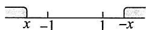
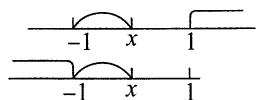

# 第3章 一维随机变量函数的分布

# 1.【答案】(B)

【解析】 $P\left\{Y = k\right\} = P\left\{\left[X + 1\right] = k\right\} = P\left\{\left[X\right] + 1 = k\right\}$

$$
\begin{array}{l} = P \left\{\left[ X \right] = k - 1 \right\} = P \left\{k - 1 \leqslant X <   k \right\} \\ = \int_ {k - 1} ^ {k} e ^ {- x} d x = e ^ {1 - k} - e ^ {- k} = e ^ {1 - k} (1 - e ^ {- 1}) \\ = \left(e ^ {- 1}\right) ^ {k - 1} \left(1 - e ^ {- 1}\right), k = 1, 2, \dots . \\ \end{array}
$$

故 $Y\sim G(1 - \mathrm{e}^{-1})$

# 2.【答案】(B)

【解析】显然，(A)，(C)不正确.

对于选项(D), 若 $X \sim B(n, p_1)$ , $Y \sim B(m, p_2)$ , 且二者相互独立, 则只有当 $p_1 = p_2 = p$ 时, $X + Y \sim B(n + m, p)$ , 故(D)不正确. 选(B).

事实上，设 $X\sim P(\lambda_1),Y\sim P(\lambda_2),X,Y$ 相互独立，则

$$
\begin{array}{l} P \{X + Y = n \} = \sum_ {i = 0} ^ {n} P \{X = i \} P \{Y = n - i \} \\ = \sum_ {i = 0} ^ {n} \frac {\lambda_ {1} ^ {i}}{i !} \mathrm {e} ^ {- \lambda_ {1}} \cdot \frac {\lambda_ {2} ^ {n - i}}{(n - i) !} \mathrm {e} ^ {- \lambda_ {2}} = \frac {1}{n !} \mathrm {e} ^ {- (\lambda_ {1} + \lambda_ {2})} \sum_ {i = 0} ^ {n} C _ {n} ^ {i} \lambda_ {1} ^ {i} \lambda_ {2} ^ {n - i} \\ = \frac {\left(\lambda_ {1} + \lambda_ {2}\right) ^ {n}}{n !} \mathrm {e} ^ {- \left(\lambda_ {1} + \lambda_ {2}\right)}, \\ \end{array}
$$

即 $X + Y\sim P(\lambda_1 + \lambda_2)$

# 3.【答案】(A)

【解析】①当 $x < -1$ 时，

$$
\begin{array}{l} P \{Y \leqslant x \} = P \{- X \leqslant x \} = P \{X \geqslant - x \} = 1 - P \{X <   - x \} \\ = 1 - P \{X > x \} = P \{X \leqslant x \} = \Phi (x), \\ \end{array}
$$

可结合图(a)来理解.

  
(a)

② 当 $-1 \leqslant x \leqslant 1$ 时，

$$
\begin{array}{l} P \{Y \leqslant x \} = P \{Y <   - 1 \} + P \{- 1 \leqslant Y \leqslant x \} = P \{- X <   - 1 \} + P \{- 1 \leqslant X \leqslant x \} \\ = P \{X > 1 \} + P \{- 1 \leqslant X \leqslant x \} \\ \end{array}
$$

$$
\begin{array}{l} = P \{X <   - 1 \} + P \{- 1 \leqslant X \leqslant x \} \\ = P \{X \leqslant x \} = \Phi (x), \\ \end{array}
$$

可结合图(b)来理解.

  
(b)

③当 $x > 1$ 时，

$$
\begin{array}{l} P \{Y \leqslant x \} = P \{Y <   - 1 \} + P \{- 1 \leqslant Y \leqslant 1 \} + P \{1 <   Y \leqslant x \} \\ = P \{X > 1 \} + P \{- 1 \leqslant X \leqslant 1 \} + P \{- x \leqslant X <   - 1 \} \\ = 1 - P \{X <   - x \} = 1 - P \{X > x \} \\ = P \{X \leqslant x \} = \Phi (x), \\ \end{array}
$$

可结合图(c)来理解.

  
(c)

故选(A).

【注】画出数轴，数形结合，就不会迷失做题方向.

4.【答案】 $\mathrm{e}^{-\frac{1}{2}}$

【解析】 $P\left\{Y \leqslant x\right\} = P\left\{-\ln \left[1 - F_{X}(X)\right] \leqslant x\right\} = P\left\{F_{X}(X) \leqslant 1 - e^{-x}\right\}.$

又 $F_{X}(X)\sim U(0,1)$ ，故

$$
P \left\{Y \leqslant x \right\} = P \left\{F _ {X} (X) \leqslant 1 - e ^ {- x} \right\} = 1 - e ^ {- x}, x > 0.
$$

于是 $P\left\{Y > \frac{1}{2}\right\} = 1 - P\left\{Y \leqslant \frac{1}{2}\right\} = e^{-\frac{1}{2}}.$

5.【答案】 $\left\{ \begin{array}{ll}\mathrm{e}^{-\sqrt{\ln y}}\bullet \frac{1}{2\sqrt{\ln y}}\bullet \frac{1}{y}, & y > 1,\\ 0, & \text{其他} \end{array} \right.$

【解析】由分布函数法得，

$$
F _ {Y} (y) = P \left\{Y \leqslant y \right\} = P \left\{X ^ {\ln X} \leqslant y \right\} = P \left\{\mathrm {e} ^ {(\ln X) ^ {2}} \leqslant y \right\}.
$$

当 $y < 1$ 时， $F_{Y}(y) = 0$

当 $y \geqslant 1$ 时，

$$
F _ {Y} (y) = P \left\{\mathrm {e} ^ {(\ln X) ^ {2}} \leqslant y \right\} = P \left\{(\ln X) ^ {2} \leqslant \ln y \right\} = P \left\{- \ln X \leqslant \sqrt {\ln y} \right\}
$$

$$
= P \left\{X \geqslant e ^ {- \sqrt {\ln y}} \right\} = 1 - e ^ {- \sqrt {\ln y}}.
$$

所以 $f_{Y}(y) = F_{Y}^{\prime}(y) = \left\{ \begin{array}{ll}\mathrm{e}^{-\sqrt{\ln y}} & \bullet \frac{1}{2\sqrt{\ln y}}\bullet \frac{1}{y},\\ 0, & \end{array} \right.$ $y > 1$ 其他.

6.【解析】 $X$ 的分布函数为

$$
F (x) = \left\{ \begin{array}{l l} 1 - \mathrm {e} ^ {- \lambda x}, & x \geqslant 0, \\ 0, & x <   0. \end{array} \right.
$$

区间 $[0,1]$ 上的均匀分布函数为

$$
G (x) = \left\{ \begin{array}{l l} 0, & x <   0, \\ x, & 0 \leqslant x <   1, \\ 1, & x \geqslant 1. \end{array} \right.
$$

设 $Y = G(X)$ 的分布函数为 $H(y)$ . 由于分布函数 $G(x)$ 的值域为 $[0,1]$ , 可见当 $y < 0$ 时,

$$
H (y) = P \left\{Y \leqslant y \right\} = P \left\{G (X) \leqslant y \right\} = 0;
$$

当 $y \geqslant 1$ 时， $H(y) = P\{Y \leqslant y\} = P\{G(X) \leqslant y\} = 1$ ；

当 $0 \leqslant y < 1$ 时，有

$$
\begin{array}{l} H (y) = P \left\{Y \leqslant y \right\} \\ = P \left\{G (X) \leqslant y, 0 \leqslant X <   1 \right\} + P \left\{G (X) \leqslant y, X <   0 \right\} + P \left\{G (X) \leqslant y, X \geqslant 1 \right\} \\ = P \left\{0 \leqslant X \leqslant y \right\} = 1 - e ^ {- \lambda y}. \\ \end{array}
$$

于是， $Y = G(X)$ 的分布函数为

$$
H (y) = \left\{ \begin{array}{l l} 0, & y <   0, \\ 1 - \mathrm {e} ^ {- \lambda y}, & 0 \leqslant y <   1, \\ 1, & y \geqslant 1. \end{array} \right.
$$

【注】注意 $F(x)$ 和 $G(x)$ 都是连续型随机变量的分布函数，因此都是连续函数，而随机变量 $Y = G(X)$ 的分布函数 $H(y)$ 并不是连续函数， $y = 1$ 显然是 $H(y)$ 的间断点，因此 $Y$ 不是连续型随机变量.易见， $Y$ 也不是离散型随机变量.

7.【解析】(1)如图所示，折点坐标记为 $V$ ，则 $V\sim U(0,1)$ ，于是 $X = \min \left\{V,1 - V\right\}$ ，则 $X$ 的分布函数为

$$
F _ {X} (x) = P \left\{X \leqslant x \right\} = P \left\{\min  \left\{V, 1 - V \right\} \leqslant x \right\}.
$$

由题意， $P\left\{0 \leqslant X \leqslant \frac{1}{2}\right\} = 1$ ，故

① 当 $x < 0$ 时， $F_{X}(x) = 0$ ；  
② 当 $x \geqslant \frac{1}{2}$ 时, $F_{X}(x) = 1$ ;  
③当 $0 \leqslant x < \frac{1}{2}$ 时，

$$
\begin{array}{l} F _ {X} (x) = P \left\{\min  \left\{V, 1 - V \right\} \leqslant x \right\} = 1 - P \left\{\min  \left\{V, 1 - V \right\} > x \right\} \\ = 1 - P \left\{V > x, 1 - V > x \right\} = 1 - P \left\{x <   V <   1 - x \right\} \\ = 1 - \frac {1 - x - x}{1} = 2 x. \\ \end{array}
$$

于是 $f_{X}(x) = F_{X}^{\prime}(x) = \left\{ \begin{array}{ll}2, & 0 <   x <   \frac{1}{2}\\ 0, & \text{其他}. \end{array} \right.$

(2) 方法一 由(1)知， $X \sim U\left(0, \frac{1}{2}\right)$ ，故 $E(X) = \frac{1}{4}$ ， $D(X) = \frac{1}{48}$ ，故

$$
\begin{array}{l} E (Z) = E \left[ X (1 - X) \right] = E (X) - E (X ^ {2}) \\ = E (X) - \left[ E (X) \right] ^ {2} - D (X) = \frac {1}{4} - \frac {1}{1 6} - \frac {1}{4 8} = \frac {1}{6}. \\ \end{array}
$$

方法二 $Z = X(1 - X) = X - X^{2}$ ，由于 $z^{\prime} = (x - x^{2})^{\prime} = 1 - 2x > 0$ ， $x\in \left(0,\frac{1}{2}\right)$ 故 $z = x - x^{2}$ 在 $\left(0,\frac{1}{2}\right)$ 内单调可导，于是由 $x^{2} - x + z = 0$ ，解得 $x = \frac{1\pm\sqrt{1 - 4z}}{2} = \frac{1}{2}\pm \sqrt{\frac{1}{4} - z}$

又 $x < \frac{1}{2}$ , 故 $x = \frac{1}{2} - \sqrt{\frac{1}{4} - z} \cdot \frac{\mathrm{d}x}{\mathrm{d}z} = \frac{1}{2} \cdot \frac{1}{\sqrt{\frac{1}{4} - z}}$ , 故 $Z$ 的概率密度为

$$
f _ {Z} (z) = \left\{ \begin{array}{l l} f _ {X} (x) \left| \frac {\mathrm {d} x}{\mathrm {d} z} \right|, & 0 <   z <   \frac {1}{4}, \\ 0, & \text {其 他} \end{array} , \quad \left\{ \begin{array}{l l} \frac {1}{\sqrt {\frac {1}{4} - z}}, & 0 <   z <   \frac {1}{4}, \\ 0, & \text {其 他}, \end{array} \right. \right.
$$

于是 $E(Z) = \int_{0}^{\frac{1}{4}}\frac{z}{\sqrt{\frac{1}{4} - z}}\mathrm{d}z\frac{\sqrt{\frac{1}{4} - z} = t}{z = \frac{1}{4} - t^{2}}\int_{0}^{\frac{1}{2}}\frac{\frac{1}{4} - t^{2}}{t} 2t\mathrm{d}t = 2\left(\frac{1}{8} -\frac{1}{24}\right) = \frac{1}{6}.$

