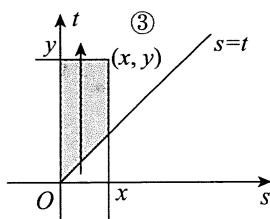

## 基础篇

# 第3章 多维随机变量及其分布

# 1.【答案】(B)

【解析】该题宜用排除法，亦可用直选法.

方法一 排除法. 易知, 选项(A), (C) 和(D) 中的随机变量的可能值都有负数, 因此不可能服从二项分布. 于是, 只有选项(B) 正确.

方法二 直选法. 由于二项分布的可能值只能是自然数, 只有选项(B)中的随机变量满足此条件, 它有0,1,2共3个可能值, 因此应该选(B). 事实上, 通过计算各可能值的概率, 容易证明选项(B)的随机变量服从参数为 $(2,p)$ 的二项分布:

$$
\begin{array}{l} P \left\{\frac {X + Y}{2} + 1 = 0 \right\} = P \left\{X = - 1, Y = - 1 \right\} = q ^ {2}, \\ P \left\{\frac {X + Y}{2} + 1 = 1 \right\} = P \left\{X = - 1, Y = 1 \right\} + P \left\{X = 1, Y = - 1 \right\} = 2 p q , \\ P \left\{\frac {X + Y}{2} + 1 = 2 \right\} = P \left\{X = 1, Y = 1 \right\} = p ^ {2}. \\ \end{array}
$$

于是，选项(B)正确.

# 2.【答案】(D)

【解析】 $X \sim B\left(1, \frac{1}{2}\right)$ ，即 $P\{X = 0\} = P\{X = 1\} = \frac{1}{2}$ 。可以将事件“ $X = 0$ ”和事件“ $X = 1$ ”看成一完备事件组。

$$
\begin{array}{l} P \left\{X Y \leqslant 0 \right\} = P \left\{X Y \leqslant 0, X = 0 \right\} + P \left\{X Y \leqslant 0, X = 1 \right\} = P \left\{X = 0 \right\} + P \left\{Y \leqslant 0, X = 1 \right\} \\ = \frac {1}{2} + P \left\{Y \leqslant 0 \right\} P \left\{X = 1 \right\} = \frac {1}{2} + \frac {1}{2} \times \frac {1}{2} = \frac {3}{4}. \\ \end{array}
$$

# 3.【答案】(C)

【解析】 $X \sim B\left(1, \frac{1}{2}\right)$ ，即 $P\{X = 0\} = P\{X = 1\} = \frac{1}{2}$ ，可以将事件“ $X = 0$ ”和事件“ $X = 1$ ”看成一完备事件组.

$$
P \left\{X + Y \geqslant 1 \right\} = P \left\{X + Y \geqslant 1, X = 0 \right\} + P \left\{X + Y \geqslant 1, X = 1 \right\} = \frac {1}{2} P \left\{Y \geqslant 1 \right\} + \frac {1}{2} P \left\{Y \geqslant 0 \right\}.
$$

又由于 $Y\sim E(1)$ ，故 $P\left\{Y\geqslant t\right\} = \int_{t}^{+\infty}\mathrm{e}^{-x}\mathrm{d}x = \mathrm{e}^{-t},t\geqslant 0$ ，所以 $P\left\{X + Y\geqslant 1\right\} = \frac{1}{2}\mathrm{e}^{-1} + \frac{1}{2} = \frac{1}{2} (1 + \mathrm{e}^{-1})$

4.【答案】 $\frac{2}{5}$

【解析】因为 $X \sim U[-3,2]$ ，所以 $X$ 的概率密度为 $f(x) = \begin{cases} \frac{1}{5}, & -3 \leqslant x \leqslant 2, \\ 0, & \text{其他，} \end{cases}$ 则

$$
\begin{array}{l} P \left\{Y + Z = 0 \right\} = P \left\{Y = 1, Z = - 1 \right\} + P \left\{Y = - 1, Z = 1 \right\} \\ = P \left\{- 1 <   X \leqslant 1 \right\} + 0 = \int_ {- 1} ^ {1} f (x) \mathrm {d} x = \int_ {- 1} ^ {1} \frac {1}{5} \mathrm {d} x = \frac {2}{5}. \\ \end{array}
$$

5.【答案】 $\frac{3}{4}$

【解析】方法一 $P\{X \geqslant Y\} = P\{X = 0, Y = 0\} + P\{X = 1, Y = 0\} + P\{X = 1, Y = 1\}$

$$
\begin{array}{l} = P \left\{X = 0 \right\} P \left\{Y = 0 \right\} + P \left\{X = 1 \right\} P \left\{Y = 0 \right\} + P \left\{X = 1 \right\} P \left\{Y = 1 \right\} \\ = \frac {1}{2} \times \frac {1}{2} + \frac {1}{2} \times \frac {1}{2} + \frac {1}{2} \times \frac {1}{2} = \frac {3}{4}. \\ \end{array}
$$

方法二 $P\{X \geqslant Y\} = 1 - P\{X < Y\} = 1 - P\{X = 0, Y = 1\} = 1 - P\{X = 0\} P\{Y = 1\}$

$$
= 1 - \frac {1}{2} \times \frac {1}{2} = \frac {3}{4}.
$$

6.【答案】 $\sum_{k = 1}^{\infty}p_k^2$

【解析】由于 $X$ 和 $Y$ 独立同分布，易得

$$
P \left\{X = Y \right\} = \sum_ {k = 1} ^ {\infty} P \left\{X = Y = x _ {k} \right\} = \sum_ {k = 1} ^ {\infty} P \left\{X = x _ {k} \right\} P \left\{Y = x _ {k} \right\} = \sum_ {k = 1} ^ {\infty} p _ {k} ^ {2}.
$$

7.【答案】(D)

【解析】由 $X, Y$ 相互独立，且均服从正态分布 $N\left(0, \frac{1}{2}\right)$ ，故 $X - Y \sim N(0, 1)$ 。

当 $z \leqslant 0$ 时，随机变量 $Z$ 的分布函数为 $F(z) = P\{Z \leqslant z\} = 0$ ；

当 $z > 0$ 时，

$$
\begin{array}{l} F (z) = P \left\{Z \leqslant z \right\} = P \left\{\left| X - Y \right| \leqslant z \right\} = P \left\{- z \leqslant X - Y \leqslant z \right\} \\ = \Phi (z) - \Phi (- z) = 2 \Phi (z) - 1, \\ \end{array}
$$

其中 $\Phi (z)$ 为标准正态分布的分布函数.

综上， $f(z) = F^{\prime}(z) = \left\{ \begin{array}{ll}\sqrt{\frac{2}{\pi}}\mathrm{e}^{-\frac{z^2}{2}}, & z > 0,\\ 0, & z\leqslant 0. \end{array} \right.$

【注】本题还可用排除法，而不必具体求解.

(A), (B) 选项显然不正确, 因为 $Z = |X - Y|$ 非负, 而 (A), (B) 选项中, $z < 0$ 时, 概率不为 0. (C) 选项不可能, 因为不满足 $\int_{-\infty}^{+\infty} f(z) \mathrm{d}z = 1$ , 事实上,

$$
\int_ {0} ^ {+ \infty} \frac {1}{\sqrt {2 \pi}} e ^ {- \frac {z ^ {2}}{2}} d z = \frac {1}{2} \int_ {- \infty} ^ {+ \infty} \frac {1}{\sqrt {2 \pi}} e ^ {- \frac {z ^ {2}}{2}} d z = \frac {1}{2}.
$$

8.【解析】(1)由题意， $X\sim U(a,b)$ ，故 $X$ 的概率密度为

$$
f _ {X} (x) = \left\{ \begin{array}{l l} { \frac {1}{b - a} ,} & {a <   x <   b,} \\ {0,} & {\text {其 他}.} \end{array} \right.
$$

对于任意给定的 $x \in (a, b)$ , 在 $X = x$ 的条件下, $Y$ 的条件概率密度为

$$
f _ {Y | X} (y \mid x) = \left\{ \begin{array}{l l} \frac {1}{b - x}, & x <   y <   b, \\ 0, & \text {其 他}. \end{array} \right.
$$

故 $X$ 和 $Y$ 的联合概率密度为

$$
f (x, y) = f _ {Y \mid X} (y \mid x) f _ {X} (x) = \left\{ \begin{array}{l l} { \frac {1}{(b - a) (b - x)} ,} & {a <   x <   y <   b ,} \\ {0 ,} & {\text {其 他}.} \end{array} \right.
$$

于是， $Y$ 的概率密度为

$$
\begin{array}{l} f _ {Y} (y) = \int_ {- \infty} ^ {+ \infty} f (x, y) \mathrm {d} x = \left\{ \begin{array}{l l} \int_ {a} ^ {y} \frac {1}{(b - a) (b - x)} \mathrm {d} x, & a <   y <   b, \\ 0, & \text {其 他} \end{array} \right. \\ = \left\{ \begin{array}{l l} { \frac {1}{b - a} \ln \frac {b - a}{b - y} ,} & {a <   y <   b,} \\ {0,} & {\text {其 他}.} \end{array} \right. \\ \end{array}
$$

$$
\begin{array}{l} P \left\{X + Y <   a + b \right\} = \int_ {a} ^ {\frac {a + b}{2}} d x \int_ {x} ^ {a + b - x} \frac {1}{(b - a) (b - x)} d y \tag {2} \\ = \int_ {a} ^ {\frac {a + b}{2}} \frac {a + b - 2 x}{(b - a) (b - x)} d x = \int_ {a} ^ {\frac {a + b}{2}} \frac {(a - b) + 2 (b - x)}{(b - a) (b - x)} d x \\ = \int_ {a} ^ {\frac {a + b}{2}} \left(\frac {2}{b - a} - \frac {1}{b - x}\right) d x = 1 + \ln (b - x) \Bigg | _ {a} ^ {\frac {a + b}{2}} = 1 - \ln 2. \\ \end{array}
$$

9.【分析】(1)系统是串联工作，所以 $X = \min \left\{X_{1}, X_{2}\right\}$ ，先求出 $X$ 的分布函数 $F(x) = P\left\{X \leqslant x\right\}$ ，再求 $X$ 的概率密度 $f(x) = F'(x)$ 。

(2) $P\{X > t + s \mid X > t\} = \frac{P\{X > t + s, X > t\}}{P\{X > t\}} = \frac{P\{X > t + s\}}{P\{X > t\}}$ ，所以只要求出 $P\{X > x\}$ ，就不

难进一步计算.

【解析】(1)当 $x > 0$ 时，

$$
\begin{array}{l} F (x) = P \left\{X \leqslant x \right\} = P \left\{\min  \left\{X _ {1}, X _ {2} \right\} \leqslant x \right\} = 1 - P \left\{\min  \left\{X _ {1}, X _ {2} \right\} > x \right\} \\ = 1 - P \left\{X _ {1} > x, X _ {2} > x \right\} = 1 - P \left\{X _ {1} > x \right\} P \left\{X _ {2} > x \right\} \\ = 1 - \int_ {x} ^ {+ \infty} \lambda_ {1} \mathrm {e} ^ {- \lambda_ {1} t} \mathrm {d} t \cdot \int_ {x} ^ {+ \infty} \lambda_ {2} \mathrm {e} ^ {- \lambda_ {2} t} \mathrm {d} t = 1 - \mathrm {e} ^ {- (\lambda_ {1} + \lambda_ {2}) x}. \\ \end{array}
$$

$$
f (x) = F ^ {\prime} (x) = \left(\lambda_ {1} + \lambda_ {2}\right) \mathrm {e} ^ {- \left(\lambda_ {1} + \lambda_ {2}\right) x}, x > 0.
$$

当 $x \leqslant 0$ 时，显然 $F(x) = 0, f(x) = 0$

所以 $f(x) = \left\{ \begin{array}{ll}(\lambda_1 + \lambda_2)\mathrm{e}^{-(\lambda_1 + \lambda_2)x}, & x > 0,\\ 0, & x\leqslant 0. \end{array} \right.$

(2) 记 $\lambda = \lambda_1 + \lambda_2$ ，则 $P\{X > x\} = \int_{x}^{+\infty} \lambda \mathrm{e}^{-\lambda t} \, \mathrm{d}t = \mathrm{e}^{-\lambda x}, x > 0$ 。

当 $t, s > 0$ 时，

$$
P \left\{X > t + s \mid X > t \right\} = \frac {P \left\{X > t + s \right\}}{P \left\{X > t \right\}} = \frac {\mathrm {e} ^ {- \lambda (t + s)}}{\mathrm {e} ^ {- \lambda t}} = \mathrm {e} ^ {- \lambda s} = P \left\{X > s \right\}.
$$

10.【解析】直接应用公式计算，但要注意非零区域(见图).

由于以 $(0,0)$ ， $(1,-1)$ ， $(1,1)$ 为顶点的三角形的面积为 $\frac{1}{2} \times 1 \times 2 = 1$ ，故

$$
f (x, y) = \left\{ \begin{array}{l l} 1, & 0 \leqslant x \leqslant 1, | y | <   x, \\ 0, & \text {其 他}. \end{array} \right.
$$

(1) $f_{X}(x) = \int_{-\infty}^{+\infty} f(x, y) \mathrm{d}y = \left\{ \begin{array}{ll} \int_{-x}^{x} \mathrm{d}y = 2x, & 0 \leqslant x \leqslant 1, \\ 0, & \text{其他}. \end{array} \right.$

$$
\begin{array}{l} f _ {Y} (y) = \int_ {- \infty} ^ {+ \infty} f (x, y) \mathrm {d} x = \left\{ \begin{array}{l l} \int_ {- y} ^ {1} \mathrm {d} x = 1 + y, & - 1 \leqslant y <   0, \\ \int_ {y} ^ {1} \mathrm {d} x = 1 - y, & 0 \leqslant y \leqslant 1, \\ 0, & \text {其 他} \end{array} \right. \\ = \left\{ \begin{array}{l l} 1 - | y |, & | y | \leqslant 1, \\ 0, & \text {其 他}. \end{array} \right. \\ f _ {X \mid Y} (x \mid y) = \frac {f (x , y)}{f _ {Y} (y)} = \left\{ \begin{array}{l l} \frac {1}{1 - \left| y \right|}, & | y | <   x \leqslant 1, \\ 0, & \text {其 他 .} \end{array} \right. \\ \end{array}
$$

$$
f _ {Y | X} (y \mid x) = \frac {f (x , y)}{f _ {X} (x)} = \left\{ \begin{array}{l l} \frac {1}{2 x}, & | y | <   x \leqslant 1, \\ 0, & \text {其 他}. \end{array} \right.
$$

由于 $f_{X}(x)f_{Y}(y)\neq f(x,y)$ ，故 $X$ 与 $Y$ 不独立.

$$
\begin{array}{l} P \left\{X > \frac {1}{2} \mid Y > 0 \right\} = \frac {P \left\{X > \frac {1}{2} , Y > 0 \right\}}{P \left\{Y > 0 \right\}} = \frac {\iint_ {x > \frac {1}{2} , y > 0} f (x , y) d x d y}{\iint_ {y > 0} f (x , y) d x d y} \tag {2} \\ = \frac {\int_ {\frac {1}{2}} ^ {1} d x \int_ {0} ^ {x} d y}{\int_ {0} ^ {1} d x \int_ {0} ^ {x} d y} = \frac {\int_ {\frac {1}{2}} ^ {1} x d x}{\int_ {0} ^ {1} x d x} = \frac {\frac {3}{8}}{\frac {1}{2}} = \frac {3}{4}. \\ P \left\{X > \frac {1}{2} \mid Y = \frac {1}{4} \right\} = \int_ {\frac {1}{2}} ^ {+ \infty} f _ {X \mid Y} \left(x \mid y = \frac {1}{4}\right) d x = \int_ {\frac {1}{2}} ^ {1} \frac {1}{1 - \frac {1}{4}} d x = \frac {2}{3}. \\ \end{array}
$$

【注】由于 $f(x,y)$ 在 $(X,Y)$ 的正概率密度区域上为常数，因此可以利用面积计算概率.

11.【解析】如图(a)所示，①当 $x < 0$ 或 $y < 0$ 时， $F(x, y) = 0$ ；

如图(b)所示，②当 $0 \leqslant y < x$ 时，

$$
F (x, y) = \int_ {- \infty} ^ {x} d s \int_ {- \infty} ^ {y} f (s, t) d t = 2 \int_ {0} ^ {y} e ^ {- t} d t \int_ {0} ^ {t} e ^ {- s} d s = 1 - 2 e ^ {- y} + e ^ {- 2 y};
$$

如图(c)所示，③当 $0 \leqslant x \leqslant y$ 时，

$$
\begin{array}{l} F (x, y) = \int_ {- \infty} ^ {x} d s \int_ {- \infty} ^ {y} f (s, t) d t = 2 \int_ {0} ^ {x} e ^ {- s} d s \int_ {s} ^ {y} e ^ {- t} d t \\ = 1 - 2 \mathrm {e} ^ {- y} - \mathrm {e} ^ {- 2 x} + 2 \mathrm {e} ^ {- (x + y)}. \\ \end{array}
$$

  
(b)

  
(c)

于是， $(X,Y)$ 的分布函数为

$$
F (x, y) = \left\{ \begin{array}{l l} {0  ,} & {x <   0 \text {或} y <   0  ,} \\ {1 - 2 \mathrm {e} ^ {- y} + \mathrm {e} ^ {- 2 y}  ,} & {0 \leqslant y <   x  ,} \\ {1 - 2 \mathrm {e} ^ {- y} - \mathrm {e} ^ {- 2 x} + 2 \mathrm {e} ^ {- (x + y)}  ,} & {0 \leqslant x \leqslant y.} \end{array} \right.
$$

12.【解析】由题设知 $(X,Y)$ 的概率密度为

$$
f (x, y) = \left\{ \begin{array}{l l} { \frac {1}{2},} & {0 \leqslant x \leqslant 2, 0 \leqslant y \leqslant 1,} \\ {0,} & {\text {其 他}.} \end{array} \right.
$$

用卷积公式 $f_{Z}(z) = \int_{-\infty}^{+\infty}\frac{1}{|x|} f\left(x,\frac{z}{x}\right)\mathrm{d}x,0 <   z <   x\leqslant 2.$

当 $z \leqslant 0$ 或 $z \geqslant 2$ 时, $f_{Z}(z) = 0$ ;

当 $0 < z < 2$ 时， $f_{Z}(z) = \frac{1}{2} \int_{z}^{2} \frac{1}{x} \, \mathrm{d}x = \frac{1}{2} (\ln 2 - \ln z)$ .

因此 $Z = XY$ 的概率密度为

$$
f _ {Z} \left(z\right) = \left\{ \begin{array}{l l} { \frac {1}{2} \left(\ln 2 - \ln z\right),} & {0 <   z <   2,} \\ {0,} & {\text {其 他}.} \end{array} \right.
$$

【注】本题亦可用分布函数法.

正概率密度区域 $D$ 与所求概率 $F_{Z}(z) = P\{XY \leqslant z\}$ 的积分区域的公共部分有三种不同的组合形式(见图)，于是

当 $z \leqslant 0$ 时， $F_Z(z) = 0$ ；

当 $0 < z < 2$ 时，

$$
F _ {Z} (z) = \int_ {0} ^ {z} d x \int_ {0} ^ {1} \frac {1}{2} d y + \int_ {z} ^ {2} d x \int_ {0} ^ {\frac {z}{x}} \frac {1}{2} d y = \frac {1}{2} z (1 - \ln z + \ln 2);
$$

当 $z \geqslant 2$ 时， $F_Z(z) = 1$

因此 $Z = XY$ 的概率密度为

$$
f _ {Z} (z) = \left\{ \begin{array}{l l} \frac {1}{2} (\ln 2 - \ln z), & 0 <   z <   2, \\ 0, & \text {其 他}. \end{array} \right.
$$

13.【解析】因为 $X$ 服从二项分布 $B\left(2, \frac{1}{2}\right)$ , 所以 $X$ 的概率分布为

<table><tr><td>X</td><td>0</td><td>1</td><td>2</td></tr><tr><td>P</td><td>1/4</td><td>1/2</td><td>1/4</td></tr></table>

(1)由 $X$ 与 $Y$ 相互独立，得

$$
P \left\{Z \leqslant \frac {5}{2} \mid X > 1 \right\} = P \left\{X + Y \leqslant \frac {5}{2} \mid X = 2 \right\} = P \left\{Y \leqslant \frac {1}{2} \mid X = 2 \right\}
$$

$$
= P \left\{Y \leqslant \frac {1}{2} \right\} = \int_ {- \infty} ^ {\frac {1}{2}} f _ {Y} (y) d y = \int_ {0} ^ {\frac {1}{2}} 4 y ^ {3} d y = \frac {1}{1 6}.
$$

(2) 由分布函数法, 得

$$
\begin{array}{l} F _ {Z} (z) = P \left\{Z \leqslant z \right\} = P \left\{X + Y \leqslant z \right\} \\ = P \left\{X + Y \leqslant z, X = 0 \right\} + P \left\{X + Y \leqslant z, X = 1 \right\} + P \left\{X + Y \leqslant z, X = 2 \right\} \\ = P \left\{Y \leqslant z, X = 0 \right\} + P \left\{Y \leqslant z - 1, X = 1 \right\} + P \left\{Y \leqslant z - 2, X = 2 \right\} \\ = P \left\{Y \leqslant z \right\} P \left\{X = 0 \right\} + P \left\{Y \leqslant z - 1 \right\} P \left\{X = 1 \right\} + P \left\{Y \leqslant z - 2 \right\} P \left\{X = 2 \right\} \\ = \frac {1}{4} F _ {Y} (z) + \frac {1}{2} F _ {Y} (z - 1) + \frac {1}{4} F _ {Y} (z - 2), \\ \end{array}
$$

故 $Z$ 的概率密度为

$$
\begin{array}{l} f _ {Z} (z) = F _ {Z} ^ {\prime} (z) = \frac {1}{4} F _ {Y} ^ {\prime} (z) + \frac {1}{2} F _ {Y} ^ {\prime} (z - 1) + \frac {1}{4} F _ {Y} ^ {\prime} (z - 2) \\ = \frac {1}{4} f _ {Y} (z) + \frac {1}{2} f _ {Y} (z - 1) + \frac {1}{4} f _ {Y} (z - 2) \\ = \left\{ \begin{array}{l l} z ^ {3}, & 0 \leqslant z \leqslant 1, \\ 2 (z - 1) ^ {3}, & 1 <   z \leqslant 2, \\ (z - 2) ^ {3}, & 2 <   z \leqslant 3, \\ 0, & \text {其 他}. \end{array} \right. \\ \end{array}
$$

14.【解析】(1)由 $\int_{-\infty}^{+\infty}f_Y(y)\mathrm{d}y = 1$ ，知 $a\neq 0$ ，且

$$
\int_ {0} ^ {+ \infty} \mathrm {e} ^ {a y} \mathrm {d} y = \frac {1}{a} \mathrm {e} ^ {a y} \left| _ {0} ^ {+ \infty} = \lim  _ {y \rightarrow + \infty} \left(\frac {1}{a} \mathrm {e} ^ {a y} - \frac {1}{a}\right) = 1 \right.,
$$

若成立，必有 $\lim_{y\to +\infty}\frac{1}{a}\mathrm{e}^{ay} = 0$ ，解得 $a = -1$

(2) 由(1)知， $Z = 2X - Y$ ，且 $X, Y$ 相互独立，故

$$
f _ {Z} (z) \stackrel {(*)} {=} \int_ {- \infty} ^ {+ \infty} f _ {X} (x) f _ {Y} (2 x - z) d x,
$$

积分区域为 $\left\{ \begin{array}{l}0 < x < 1,\\ 2x - z > 0, \end{array} \right.$ 即 $\left\{ \begin{array}{l}0 < x < 1,\\ 2x > z, \end{array} \right.$ 如图所示.于是

$$
f _ {Z} (z) = \left\{ \begin{array}{l l} \int_ {0} ^ {1} \mathrm {e} ^ {- (2 x - z)} \mathrm {d} x, & z <   0, \\ \int_ {\frac {z}{2}} ^ {1} \mathrm {e} ^ {- (2 x - z)} \mathrm {d} x, & 0 \leqslant z <   2, \\ 0, & \text {其 他} \end{array} = \left\{ \begin{array}{l l} \frac {1}{2} (1 - \mathrm {e} ^ {- 2}) \mathrm {e} ^ {z}, & z <   0, \\ \frac {1}{2} (1 - \mathrm {e} ^ {z - 2}), & 0 \leqslant z <   2, \\ 0, & \text {其 他}. \end{array} \right. \right.
$$

【注】①(*)处来自如下公式.设 $(X,Y)\sim f(x,y)$ ，则 $Z = aX + bY(ab\neq 0)$ 的概率密度为

$$
f _ {Z} (z) = \frac {1}{| a |} \int_ {- \infty} ^ {+ \infty} f \left(\frac {z - b y}{a}, y\right) d y = \frac {1}{| b |} \int_ {- \infty} ^ {+ \infty} f \left(x, \frac {z - a x}{b}\right) d x.
$$

进一步地，若 $X, Y$ 相互独立，且 $X \sim f_{X}(x), Y \sim f_{Y}(y)$ ，则

$$
f _ {Z} (z) = \frac {1}{| a |} \int_ {- \infty} ^ {+ \infty} f _ {X} \left(\frac {z - b y}{a}\right) f _ {Y} (y) d y = \frac {1}{| b |} \int_ {- \infty} ^ {+ \infty} f _ {X} (x) f _ {Y} \left(\frac {z - a x}{b}\right) d x.
$$

这些公式符合如下“口诀”：“积谁不换谁，换完求偏导”。

如 $f_{Z}(z) = \frac{1}{|a|}\int_{-\infty}^{+\infty}f\left(\frac{z - by}{a},y\right)\mathrm{d}y$ 中

先用第一句：“积谁不换谁”.对 $y$ 积分，则不换 $y$ ，写成 $f(\square ,y)$ ，换 $x = \frac{z - by}{a}$ 为 $f\left(\frac{z - by}{a},y\right)$

再用第二句：“换完求偏导” $\frac{\partial\left(\frac{z - by}{a}\right)}{\partial z} = \frac{1}{a}$ 因概率密度非负，要加绝对值，即为 $\frac{1}{|a|}$ 这样便记住了公式.

②考生亦可用分布函数法求 $Z$ 的概率密度，一来检查答案的正确性，二来比较两种方法的繁简.

利用分布函数法.

由题意可知， $X$ 与 $Y$ 的联合概率密度为

$$
f (x, y) = \left\{ \begin{array}{l l} {\mathrm {e} ^ {- y},} & {0 <   x <   1, y > 0,} \\ {0,} & {\text {其 他}.} \end{array} \right.
$$

由 $Z = 2X - Y$ 的分布函数 $F_{Z}(z) = \iint_{2x - y\leqslant z}f(x,y)\mathrm{d}x\mathrm{d}y$ ，可知

当 $z < 0$ 时， $F_Z(z) = \int_0^1 \mathrm{d}x \int_{2x - z}^{+\infty} \mathrm{e}^{-y} \, \mathrm{d}y = \frac{1}{2} (1 - \mathrm{e}^{-2}) \mathrm{e}^z$ ;

当 $0 \leqslant z < 2$ 时， $F_{Z}(z) = \int_{0}^{z} \mathrm{d}x \int_{0}^{+\infty} \mathrm{e}^{-y} \mathrm{d}y + \int_{\frac{z}{2}}^{1} \mathrm{d}x \int_{2x - z}^{+\infty} \mathrm{e}^{-y} \mathrm{d}y = \frac{z}{2} + \frac{1}{2} - \frac{1}{2} \mathrm{e}^{z - 2}$ ;

当 $z \geqslant 2$ 时， $F_Z(z) = 1$

故 $Z = 2X - Y$ 的概率密度为 $f_{Z}(z) = \left\{ \begin{array}{ll} \frac{1}{2} (1 - \mathrm{e}^{-2})\mathrm{e}^{z}, & z < 0,\\ \frac{1}{2} (1 - \mathrm{e}^{z - 2}), & 0\leqslant z < 2,\\ 0, & \text{其他}. \end{array} \right.$

---

## 强化篇

# 1.【答案】(C)

【解析】由题意知 $a > 1$ ，再由概率分布的归一性，有 $\sum_{k = 1}^{\infty}\frac{1}{a^k} = \frac{\frac{1}{a}}{1 - \frac{1}{a}} = \frac{1}{a - 1} = 1$ ，得 $a = 2$ ：

又 $P\{X > Y\} + P\{X = Y\} + P\{X < Y\} = 1$ ，且显然 $P\{X > Y\} = P\{X < Y\}$ ，由

$$
P \left\{X = Y \right\} = \sum_ {k = 1} ^ {\infty} P \left\{X = k, Y = k \right\} = \sum_ {k = 1} ^ {\infty} \frac {1}{2 ^ {k}} \cdot \frac {1}{2 ^ {k}} = \sum_ {k = 1} ^ {\infty} \frac {1}{4 ^ {k}} = \frac {\frac {1}{4}}{1 - \frac {1}{4}} = \frac {1}{3},
$$

故

$$
P \left\{X > Y \right\} = \frac {1}{2} \left(1 - P \left\{X = Y \right\}\right) = \frac {1}{3}.
$$

# 2.【答案】(B)

【解析】由于 $X \sim U(-2, 4)$ , 因此 $X$ 的概率密度为 $f(x) = \begin{cases} \frac{1}{6}, & -2 < x < 4, \\ 0, & \text{其他.} \end{cases}$ 又随机变量 $X, Y$ 相互独立, 故

$$
\begin{array}{l} P \left\{X Y > 2 \right\} = P \left\{Y = - 2 \right\} P \left\{X Y > 2 \mid Y = - 2 \right\} + P \left\{Y = 2 \right\} P \left\{X Y > 2 \mid Y = 2 \right\} \\ = P \left\{Y = - 2 \right\} P \left\{X <   - 1 \right\} + P \left\{Y = 2 \right\} P \left\{X > 1 \right\} \\ = \frac {3}{4} \int_ {- 2} ^ {- 1} \frac {1}{6} d x + \frac {1}{4} \int_ {1} ^ {4} \frac {1}{6} d x = \frac {3}{4} \times \frac {1}{6} + \frac {1}{4} \times \frac {3}{6} = \frac {1}{4}. \\ \end{array}
$$

# 3.【答案】(A)

【解析】题设二次型 $g(x_{1},x_{2},x_{3})$ 对应的矩阵为 $\pmb {A} = \left[ \begin{array}{lll}1 & 1 & X\\ 1 & 2 & 0\\ X & 0 & Y \end{array} \right].$

注意到 $\pmb{A}$ 的顺序主子式： $A_{1} = 1 > 0$ ， $A_{2} = \left| \begin{array}{ll}1 & 1\\ 1 & 2 \end{array} \right| = 1 > 0$ ， $A_{3} = |A|$ ，故若要二次型正定，当且仅当

$$
\left| \boldsymbol {A} \right| = \left| \begin{array}{l l l} 1 & 1 & X \\ 1 & 2 & 0 \\ X & 0 & Y \end{array} \right| = Y - 2 X ^ {2} > 0.
$$

故 $g(x_{1},x_{2},x_{3})$ 正定的概率为 $P\left\{Y - 2X^{2} > 0\right\} = \int_{-1}^{1}\mathrm{d}x\int_{2x^{2}}^{2}\frac{1}{4}\mathrm{d}y = \frac{2}{3}.$

4.【答案】 $\frac{4 + \sqrt{2\pi}}{4} -\frac{\sqrt{2\pi}}{2}$ 0(2)

【解析】由于 $f_{X}(x) = \left\{ \begin{array}{ll} \frac{1}{2}, & 0 \leqslant x \leqslant 2, \\ 0, & \text{其他}, \end{array} \right.$ $f_{Y}(y) = \left\{ \begin{array}{ll} 2e^{-2y}, & y > 0, \\ 0, & \text{其他}, \end{array} \right.$ 且 $X, Y$ 相互独立，故

$$
f (x, y) = \left\{ \begin{array}{l l} {\mathrm {e} ^ {- 2 y},} & {0 \leqslant x \leqslant 2, y > 0,} \\ {0,} & {\text {其 他},} \end{array} \right.
$$

方程 $a^2 + Xa + Y = 0$ 有实根, 则需要 $X^2 - 4Y \geqslant 0$ , 即 $Y \leqslant \frac{X^2}{4}$ . 如图所示, 故方程有实根的概率为

$$
\begin{array}{l} P \left\{Y \leqslant \frac {X ^ {2}}{4} \right\} = \iint_ {y \leqslant \frac {x ^ {2}}{4}} f (x, y) d x d y = \iint_ {0 \leqslant x \leqslant 2} e ^ {- 2 y} d x d y \\ = \int_ {0} ^ {2} d x \int_ {0} ^ {\frac {x ^ {2}}{4}} e ^ {- 2 y} d y = - \frac {1}{2} \int_ {0} ^ {2} \left(e ^ {- 2 y} \left| _ {0} ^ {\frac {x ^ {2}}{4}} \right.\right) d x \\ = - \frac {1}{2} \int_ {0} ^ {2} \left(\mathrm {e} ^ {- \frac {x ^ {2}}{2}} - 1\right) \mathrm {d} x = 1 - \frac {1}{2} \int_ {0} ^ {2} \mathrm {e} ^ {- \frac {x ^ {2}}{2}} \mathrm {d} x \\ = 1 - \frac {\sqrt {2 \pi}}{2} \int_ {0} ^ {2} \frac {1}{\sqrt {2 \pi}} \mathrm {e} ^ {- \frac {x ^ {2}}{2}} \mathrm {d} x = 1 - \frac {\sqrt {2 \pi}}{2} [ \Phi (2) - \Phi (0) ] \\ = 1 + \frac {\sqrt {2 \pi}}{4} - \frac {\sqrt {2 \pi}}{2} \Phi (2) = \frac {4 + \sqrt {2 \pi}}{4} - \frac {\sqrt {2 \pi}}{2} \Phi (2). \\ \end{array}
$$

5.【分析】(1)由性质 $\int_{-\infty}^{+\infty}f_{X|Y}(x|y)\mathrm{d}x = 1$ 可以定出常数 $A$ ：

也可以更简单地把 $A\mathrm{e}^{-\frac{2}{3}\left(x - \frac{y}{2}\right)^2}$ 看成形式 $\frac{1}{\sqrt{2\pi}\sigma}\mathrm{e}^{-\frac{(x - \mu)^2}{2\sigma^2}}$ ， $-\infty < x < +\infty$ .再由 $-\frac{2}{3}\left(x - \frac{y}{2}\right)^2 = -\frac{(x - \mu)^2}{2\sigma^2}$ 求出 $\sigma$ ，然后求出 $A = \frac{1}{\sqrt{2\pi}\sigma}$ .同理可得常数 $B$ ：

(2) $f_{X|Y}(x|y) = \frac{f(x,y)}{f_Y(y)}, f_{Y|X}(y|x) = \frac{f(x,y)}{f_X(x)}$ 故 $\frac{f_{X|Y}(x|y)}{f_{Y|X}(y|x)} = \frac{f_X(x)}{f_Y(y)}$ ，从而将 $x, y$ 的函数分离.  
(3) $f(x, y) = f_{X|Y}(x \mid y) \cdot f_{Y}(y)$ .

【解析】(1) 令 $A \mathrm{e}^{-\frac{2}{3}\left(x - \frac{y}{2}\right)^2} = \frac{1}{\sqrt{2\pi}\sigma} \mathrm{e}^{-\frac{(x - \mu)^2}{2\sigma^2}}$ ，即 $\left\{ \begin{array}{l} -\frac{2}{3}\left(x - \frac{y}{2}\right)^2 = -\frac{(x - \mu)^2}{2\sigma^2}, \\ A = \frac{1}{\sqrt{2\pi}\sigma}, \end{array} \right.$ 解得 $\mu = \frac{y}{2}, \sigma = \frac{\sqrt{3}}{2}$ ,

$A = \sqrt{\frac{2}{3\pi}}$ .同理得 $B = \sqrt{\frac{2}{3\pi}}$

$$
\frac {f _ {X \mid Y} (x \mid y)}{f _ {Y \mid X} (y \mid x)} = \frac {f _ {X} (x)}{f _ {Y} (y)} = e ^ {- \frac {2}{3} \left[ \left(x ^ {2} - x y + \frac {y ^ {2}}{4}\right) - \left(y ^ {2} - x y + \frac {x ^ {2}}{4}\right) \right]} = e ^ {- \frac {x ^ {2} - y ^ {2}}{2}} = \frac {e ^ {- \frac {x ^ {2}}{2}}}{e ^ {- \frac {y ^ {2}}{2}}} \tag {2}
$$

故 $f_{X}(x) = C\mathrm{e}^{-\frac{x^{2}}{2}},f_{Y}(y) = C\mathrm{e}^{-\frac{y^{2}}{2}}$ 显然 $C = \frac{1}{\sqrt{2\pi}}$ 即

$$
f _ {X} (x) = \frac {1}{\sqrt {2 \pi}} e ^ {- \frac {x ^ {2}}{2}}, - \infty <   x <   + \infty , f _ {Y} (y) = \frac {1}{\sqrt {2 \pi}} e ^ {- \frac {y ^ {2}}{2}}, - \infty <   y <   + \infty .
$$

(3) $f(x,y) = f_{X|Y}(x|y)\bullet f_{Y}(y) = \sqrt{\frac{2}{3\pi}}\mathrm{e}^{-\frac{2}{3}\left(x - \frac{y}{2}\right)^{2}}\bullet \frac{1}{\sqrt{2\pi}}\mathrm{e}^{-\frac{y^{2}}{2}}$

$$
= \frac {1}{\sqrt {3} \pi} e ^ {- \frac {2}{3} (x ^ {2} - x y + y ^ {2})} (- \infty <   x <   + \infty , - \infty <   y <   + \infty).
$$

6.【解析】(1) $(U,V)$ 在 $D$ 上服从均匀分布，则下列事件的概率可由面积之比得到.

$$
P \left\{X = - 1, Y = - 1 \right\} = P \left\{U \leqslant - 1, V \leqslant \frac {1}{2} \right\} = \frac {1}{8},
$$

$$
P \left\{X = - 1, Y = 1 \right\} = P \left\{U \leqslant - 1, V > \frac {1}{2} \right\} = 0 ,
$$

$$
P \left\{X = 1, Y = - 1 \right\} = P \left\{U > - 1, V \leqslant \frac {1}{2} \right\} = \frac {3}{4},
$$

$$
P \left\{X = 1, Y = 1 \right\} = P \left\{U > - 1, V > \frac {1}{2} \right\} = \frac {1}{8},
$$

故 $(X,Y)$ 的分布律为

<table><tr><td>X Y</td><td>-1</td><td>1</td><td>pi.</td></tr><tr><td>-1</td><td>1/8</td><td>0</td><td>1/8</td></tr><tr><td>1</td><td>3/4</td><td>1/8</td><td>7/8</td></tr><tr><td>pj</td><td>7/8</td><td>1/8</td><td>1</td></tr></table>

(2) 由(1)可知, $E(X) = \frac{3}{4}$ , $E(Y) = -\frac{3}{4}$ , $E(XY) = \frac{1}{8} - \frac{3}{4} + \frac{1}{8} = -\frac{1}{2}$ , $E(X^2) = E(Y^2) = 1$ , 所以

$$
D (X) = E \left(X ^ {2}\right) - \left[ E (X) \right] ^ {2} = \frac {7}{1 6}, D (Y) = E \left(Y ^ {2}\right) - \left[ E (Y) \right] ^ {2} = \frac {7}{1 6},
$$

$$
\operatorname {C o v} (X, Y) = E (X Y) - E (X) E (Y) = \frac {1}{1 6}, \rho_ {X Y} = \frac {\operatorname {C o v} (X , Y)}{\sqrt {D (X)} \sqrt {D (Y)}} = \frac {1}{7}.
$$

(3)由题设易知 $(U,V)$ 的概率密度为 $f(u,v) = \left\{ \begin{array}{ll} \frac{1}{4}, & (u,v)\in D,\\ 0, & \text{其他，} \end{array} \right.$ 非零区域 $D$ 如图所示，则 $V$ 的边缘概率密度为

$$
\begin{array}{l} f _ {V} (v) = \int_ {- \infty} ^ {+ \infty} f (u, v) \mathrm {d} u = \left\{ \begin{array}{l l} \int_ {- 2 - 2 v} ^ {2 + 2 v} \frac {1}{4} \mathrm {d} u, & - 1 <   v \leqslant 0, \\ \int_ {- 2 + 2 v} ^ {2 - 2 v} \frac {1}{4} \mathrm {d} u, & 0 <   v <   1, \\ 0, & \text {其 他} \end{array} \right. \\ = \left\{ \begin{array}{l l} 1 + v, & - 1 <   v \leqslant 0, \\ 1 - v, & 0 <   v <   1, \\ 0, & \text {其 他}. \end{array} \right. \\ \end{array}
$$

7.【解析】（1） $X = \min \{T_1,T_2\}$ ，则当 $x > 0$ 时，

$$
F _ {X} (x) = P \{X \leqslant x \} = P \{\min  \left\{T _ {1}, T _ {2} \right\} \leqslant x \} = 1 - P \left\{T _ {1} > x \right\} P \left\{T _ {2} > x \right\} = 1 - e ^ {- x} e ^ {- x} = 1 - e ^ {- 2 x}.
$$

则 $P\{Y > 0\} = P\{X > 1\} = 1 - P\{X \leqslant 1\} = 1 - F_X(1) = \mathrm{e}^{-2}$ .

(2) $N \sim P(2\mathrm{e}^2)$ , $P\{M = m \mid N = n\} = \mathrm{C}_n^m\left(\frac{1}{\mathrm{e}^2}\right)^m\left(1 - \frac{1}{\mathrm{e}^2}\right)^{n - m}$ .

$$
P \{M = m, N = n \} = P \{N = n \} P \{M = m | N = n \} = \frac {\left(2 e ^ {2}\right) ^ {n}}{n !} e ^ {- 2 e ^ {2}} C _ {n} ^ {m} \left(\frac {1}{e ^ {2}}\right) ^ {m} \left(1 - \frac {1}{e ^ {2}}\right) ^ {n - m}.
$$

故 $M$ 的概率分布为

$$
\begin{array}{l} P \{M = m \} = \sum_ {n = m} ^ {\infty} P \{M = m, N = n \} = \sum_ {n = m} ^ {\infty} \frac {(2 e ^ {2}) ^ {n}}{n !} e ^ {- 2 e ^ {2}} C _ {n} ^ {m} \left(\frac {1}{e ^ {2}}\right) ^ {m} \left(1 - \frac {1}{e ^ {2}}\right) ^ {n - m} \\ = (2 \mathrm {e} ^ {2}) ^ {m} \left(\frac {1}{\mathrm {e} ^ {2}}\right) ^ {m} \frac {\mathrm {e} ^ {- 2 \mathrm {e} ^ {2}}}{m !} \sum_ {n = m} ^ {\infty} \frac {(2 \mathrm {e} ^ {2}) ^ {n - m}}{(n - m) !} \left(1 - \frac {1}{\mathrm {e} ^ {2}}\right) ^ {n - m} \\ = 2 ^ {m} \mathrm {e} ^ {2 m} \frac {1}{\mathrm {e} ^ {2 m}} \frac {\mathrm {e} ^ {- 2 \mathrm {e} ^ {2}}}{m !} \mathrm {e} ^ {2 \mathrm {e} ^ {2} - 2} = \frac {2 ^ {m}}{m !} \mathrm {e} ^ {- 2}, m = 0, 1, 2, \dots . \\ \end{array}
$$

即 $M\sim P(2)$ ：

