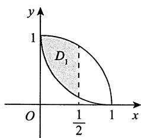

# 测试卷三

# 一、选择题

1.【答案】(B)

【解析】 $f(x) = \int_0^x (x - 2t)\mathrm{e}^{-t^2}\mathrm{d}t = x\int_0^x\mathrm{e}^{-t^2}\mathrm{d}t - \int_0^x 2te^{-t^2}\mathrm{d}t,$

求导得

$$
f ^ {\prime} (x) = \int_ {0} ^ {x} \mathrm {e} ^ {- t ^ {2}} \mathrm {d} t + x \mathrm {e} ^ {- x ^ {2}} - 2 x \mathrm {e} ^ {- x ^ {2}} = \int_ {0} ^ {x} \mathrm {e} ^ {- t ^ {2}} \mathrm {d} t - x \mathrm {e} ^ {- x ^ {2}},
$$

易知 $f^{\prime}(0) = 0$

又 $f''(x) = \mathrm{e}^{-x^2} - (\mathrm{e}^{-x^2} - 2x^2\mathrm{e}^{-x^2}) = 2x^2\mathrm{e}^{-x^2}\geqslant 0$ ，故 $f^{\prime}(x)$ 单调增加，进而有 $f^{\prime}(x)\geqslant f^{\prime}(0) = 0$ ，则 $f(x)$ 单调增加.

$$
g (x) = \int_ {0} ^ {x} (x - 2 t) \sin t ^ {2} d t = x \int_ {0} ^ {x} \sin t ^ {2} d t - \int_ {0} ^ {x} 2 t \sin t ^ {2} d t,
$$

由于 $\int_0^x\sin t^2\mathrm{d}t$ 为奇函数， $\int_0^x 2t\sin t^2\mathrm{d}t$ 为偶函数，故 $g(x)$ 为偶函数.

【注】对 $g(x)$ 亦可求导，得

$$
\begin{array}{l} g ^ {\prime} (x) = x \sin x ^ {2} + \int_ {0} ^ {x} \sin t ^ {2} \mathrm {d} t - 2 x \sin x ^ {2} = \int_ {0} ^ {x} \sin t ^ {2} \mathrm {d} t - x \sin x ^ {2}, \\ g ^ {\prime \prime} (x) = \sin x ^ {2} - (\sin x ^ {2} + 2 x ^ {2} \cos x ^ {2}) = - 2 x ^ {2} \cos x ^ {2}. \\ \end{array}
$$

因 $g''(x)$ 为偶函数，且 $g'(0) = 0$ ，故 $g'(x)$ 为奇函数，进而可知 $g(x)$ 为偶函数.

# 2.【答案】(D)

【解析】将 $f(t)$ 在 $t = \frac{1}{3}$ 处展开，得

$$
f (t) = f \left(\frac {1}{3}\right) + f ^ {\prime} \left(\frac {1}{3}\right) \left(t - \frac {1}{3}\right) + \frac {f ^ {\prime \prime} (\xi)}{2} \left(t - \frac {1}{3}\right) ^ {2},
$$

$\xi$ 介于 $t$ 与 $\frac{1}{3}$ 之间.

当 $f''(t) > 0$ 时， $f''(\xi) > 0, \frac{f''(\xi)}{2}\left(t - \frac{1}{3}\right)^2 \geqslant 0$ ，故

$$
f (t) \geqslant f \left(\frac {1}{3}\right) + f ^ {\prime} \left(\frac {1}{3}\right) \left(t - \frac {1}{3}\right).
$$

于是 $f(t^{2})\geqslant f\left(\frac{1}{3}\right) + f^{\prime}\left(\frac{1}{3}\right)\left(t^{2} - \frac{1}{3}\right)$ ，当且仅当 $t^2 = \frac{1}{3}$ 时等号成立，则

$$
\int_ {0} ^ {1} f (t ^ {2}) \mathrm {d} t > \int_ {0} ^ {1} \left[ f \left(\frac {1}{3}\right) + f ^ {\prime} \left(\frac {1}{3}\right) \left(t ^ {2} - \frac {1}{3}\right) \right] \mathrm {d} t = f \left(\frac {1}{3}\right) + \int_ {0} ^ {1} f ^ {\prime} \left(\frac {1}{3}\right) \left(t ^ {2} - \frac {1}{3}\right) \mathrm {d} t = f \left(\frac {1}{3}\right),
$$

即 $\int_0^1 f(x^2)\mathrm{d}x > f\left(\frac{1}{3}\right).$

【注】由于 $\int_0^1\left(t^2 -\frac{1}{3}\right)\mathrm{d}t = 0$ ，消除了 $\int_0^1 f''\left(\frac{1}{3}\right)\left(t^2 -\frac{1}{3}\right)\mathrm{d}t$ 这一项.这是解决此题的关键.

# 3.【答案】(A)

【解析】当 $f(x,y)$ 在点 $(0,0)$ 处可微时，有

$$
\lim  _ {\substack {x \to 0 \\ y \to 0}} \frac {f (x , y) - f (0 , 0) - x f _ {x} ^ {\prime} (0 , 0) - y f _ {y} ^ {\prime} (0 , 0)}{\sqrt {x ^ {2} + y ^ {2}}} = 0,
$$

即 $\lim_{\substack{x\to 0\\ y\to 0}}\frac{f(x,y) - xf_x'(0,0) - yf_y'(0,0)}{\sqrt{x^2 + y^2}} = 0,$

则有 $\lim_{\substack{x\to 0\\ y\to 0}}\left[f(x,y) - xf_x'(0,0) - yf_y'(0,0)\right]$

$$
= \lim  _ {\substack {x \to 0 \\ y \to 0}} \sqrt {x ^ {2} + y ^ {2}} \cdot \frac {f (x , y) - x f _ {x} ^ {\prime} (0 , 0) - y f _ {y} ^ {\prime} (0 , 0)}{\sqrt {x ^ {2} + y ^ {2}}} = 0,
$$

此时不一定有 $f(x,y) = xf_x'(0,0) + yf_y'(0,0)$ 成立，即 $\pmb{n}\cdot \pmb{\alpha} = 0$ 不一定成立.

当 $n\cdot \alpha = 0$ 时，有

$$
f (x, y) - x f _ {x} ^ {\prime} (0, 0) - y f _ {y} ^ {\prime} (0, 0) = 0,
$$

此时

$$
\lim  _ {\substack {x \to 0 \\ y \to 0}} \frac {f (x , y) - x f _ {x} ^ {\prime} (0 , 0) - y f _ {y} ^ {\prime} (0 , 0)}{\sqrt {x ^ {2} + y ^ {2}}} = 0,
$$

即 $f(x,y)$ 在点 $(0,0)$ 处一定可微.

故 $n\cdot \alpha = 0$ 是 $f(x,y)$ 在点(0,0)处可微的充分非必要条件.

# 4.【答案】(D)

【解析】由拉格朗日中值定理，得

$$
I _ {2} = f (n) - f \left(\frac {2 n - 1}{2}\right) = \frac {1}{2} f ^ {\prime} (\xi), \frac {2 n - 1}{2} <   \xi <   n,
$$

$$
I _ {3} = f \left(\frac {2 n + 1}{2}\right) - f (n) = \frac {1}{2} f ^ {\prime} (\eta), n <   \eta <   \frac {2 n + 1}{2}.
$$

由 $f''(x) < 0$ ，知 $f'(x)$ 单调减少，故 $f'(\xi) > f'(\eta)$ ，得 $I_2 > I_3$

又

$$
\begin{array}{l} I _ {1} = \frac {1}{2} \bigl [ f (n + 1) - f (n) \bigr ] = \frac {1}{2} \biggl [ f (n + 1) - f \biggl (\frac {2 n + 1}{2} \biggr) \biggr ] + \frac {1}{2} \biggl [ f \biggl (\frac {2 n + 1}{2} \biggr) - f (n) \biggr ] \\ = \frac {1}{4} f ^ {\prime} (\xi_ {1}) + \frac {1}{4} f ^ {\prime} (\eta), \\ \end{array}
$$

其中， $n < \eta < \frac{2n + 1}{2} < \xi_1 < n + 1$ ，故 $f^{\prime}(\xi_1) < f^{\prime}(\eta)$ ，于是有

$$
I _ {1} <   \frac {1}{4} f ^ {\prime} (\eta) + \frac {1}{4} f ^ {\prime} (\eta) = \frac {1}{2} f ^ {\prime} (\eta) = I _ {3}.
$$

综上， $I_{2} > I_{3} > I_{1}$

# 5.【答案】(B)

【解析】因 $r(ABC) \geqslant r(AB) + r(C) - n$ ，则

$$
r (\boldsymbol {A}) + r (\boldsymbol {B}) + r (\boldsymbol {C}) = r (\boldsymbol {A B C}) + 2 n \geqslant r (\boldsymbol {A B}) + r (\boldsymbol {C}) - n + 2 n,
$$

即 $r(\pmb {A}) + r(\pmb {B})\geqslant r(\pmb {A}\pmb {B}) + n$

又 $r(\mathbf{AB})\geqslant r(\mathbf{A}) + r(\mathbf{B}) - n$ ，即 $r(AB) + n\geqslant r(A) + r(B)$

综上， $r(\pmb {A}\pmb {B}) + n = r(\pmb {A}) + r(\pmb {B})$ .故选项(B)正确.

同理，选项(C)不成立.

若 $r(\mathbf{A}) + r(\mathbf{B}) + r(\mathbf{C}) = r(\mathbf{AB})$ ，则有 $r(AB) = r(ABC) + 2n\geqslant 2n$ ，矛盾，故选项(A)不成立.

显然，选项(D)不一定成立.

【注】本题亦可举反例，令 $A = B = E$ ， $C = 0$ ，可排除选项(A)，(C)，(D).

# 6.【答案】(D)

【解析】记矩阵 $A = \begin{bmatrix} 1 & 2 & 0\\ 2 & a & 1\\ 0 & 1 & b \end{bmatrix}$ ，其为实对称矩阵，则对应的二次型为

$$
\begin{array}{l} f \left(x _ {1}, x _ {2}, x _ {3}\right) = x _ {1} ^ {2} + a x _ {2} ^ {2} + b x _ {3} ^ {2} + 4 x _ {1} x _ {2} + 2 x _ {2} x _ {3} \\ = \left(x _ {1} + 2 x _ {2}\right) ^ {2} + (a - 4) x _ {2} ^ {2} + 2 x _ {2} x _ {3} + b x _ {3} ^ {2}. \\ \end{array}
$$

① 当 $a = 4, b \neq 0$ 时，

$$
\begin{array}{l} f \left(x _ {1}, x _ {2}, x _ {3}\right) = \left(x _ {1} + 2 x _ {2}\right) ^ {2} + b x _ {3} ^ {2} + 2 x _ {2} x _ {3} \\ = \left(x _ {1} + 2 x _ {2}\right) ^ {2} + b \left(x _ {3} + \frac {1}{b} x _ {2}\right) ^ {2} - \frac {1}{b} x _ {2} ^ {2}, \\ \end{array}
$$

此时满足矩阵 $\pmb{A}$ 的特征值两正一负的条件.

② 当 $a = 4, b = 0$ 时，

$$
f \left(x _ {1}, x _ {2}, x _ {3}\right) = \left(x _ {1} + 2 x _ {2}\right) ^ {2} + 2 x _ {2} x _ {3}.
$$

令 $\left\{ \begin{array}{l}x_{1} + 2x_{2} = y_{1},\\ x_{2} = y_{2} + y_{3},\\ x_{3} = y_{2} - y_{3}, \end{array} \right.$ 得 $f = y_1^2 +2y_2^2 -2y_3^2$ ，此时满足矩阵 $\pmb{A}$ 的特征值两正一负的条件.

③当 $a \neq 4$ 时，

$$
\begin{array}{l} f \left(x _ {1}, x _ {2}, x _ {3}\right) = \left(x _ {1} + 2 x _ {2}\right) ^ {2} + (a - 4) x _ {2} ^ {2} + 2 x _ {2} x _ {3} + b x _ {3} ^ {2} \\ = \left(x _ {1} + 2 x _ {2}\right) ^ {2} + (a - 4) \left(x _ {2} + \frac {1}{a - 4} x _ {3}\right) ^ {2} + \left(b - \frac {1}{a - 4}\right) x _ {3} ^ {2}. \\ \end{array}
$$

要满足矩阵 $\pmb{A}$ 的特征值两正一负，则有 $\left\{ \begin{array}{l}a - 4 > 0,\\ b - \frac{1}{a - 4} <  0 \end{array} \right.$ 或 $\left\{ \begin{array}{l}a - 4 <   0,\\ b - \frac{1}{a - 4} >0, \end{array} \right.$ 此时均有 $(a - 4)b <   1$

综上， $(a - 4)b <   1$

# 7.【答案】(C)

【解析】若由方程组 $x\alpha_{1} + y\alpha_{2} + z\alpha_{3} = \alpha_{4}$ 确定的几何图形过原点，则有 $\alpha_{4} = 0$ ，与题干矛盾，故该几何图形不过原点.

因 $x_{1}\pmb{\alpha}_{1} + x_{2}\pmb{\alpha}_{2} = \pmb{\alpha}_{3}$ 有唯一解，故 $r(\pmb{\alpha}_1,\pmb{\alpha}_2) = r(\pmb{\alpha}_1,\pmb{\alpha}_2,\pmb{\alpha}_3) = 2$

又 $\alpha_{1},\alpha_{2},\alpha_{4}$ 线性相关，则 $r(\pmb{\alpha}_{1},\pmb{\alpha}_{2},\pmb{\alpha}_{3},\pmb{\alpha}_{4}) = r(\pmb{\alpha}_{1},\pmb{\alpha}_{2},\pmb{\alpha}_{3}) = r(\pmb{\alpha}_{1},\pmb{\alpha}_{2}) = 2$ ，不妨将 $x\pmb{\alpha}_{1} + y\pmb{\alpha}_{2} + z\pmb{\alpha}_{3} = \pmb{\alpha}_{4}$ 设为

$$
\left\{ \begin{array}{l} a _ {1 1} x + a _ {1 2} y + a _ {1 3} z = a _ {1 4}, \\ a _ {2 1} x + a _ {2 2} y + a _ {2 3} z = a _ {2 4}, \end{array} \right.
$$

该方程组表示的是两个不平行的平面方程, 即该几何图形为不过原点的一条直线.

# 8.【答案】(A)

【解析】①由对称性，有

$$
E (X) = \int_ {- \infty} ^ {+ \infty} x f (x) d x = 0, E (X | X |) = \int_ {- \infty} ^ {+ \infty} x | x | f (x) d x = 0,
$$

因此 $\operatorname{Cov}(X, |X|) = E(X|X|) - E(X)E(|X|) = 0$ ，知 $X$ 与 $|X|$ 不相关.

② $P\{X \leqslant x_0\} = \int_{-\infty}^{x_0} f(x) \, \mathrm{d}x$ ，取 $x_0 = 1$ ，则

$$
\begin{array}{l} P \left\{X \leqslant 1 \right\} = \frac {1}{2} \int_ {- \infty} ^ {1} \mathrm {e} ^ {- | x |} \mathrm {d} x = \frac {1}{2} \int_ {- \infty} ^ {0} \mathrm {e} ^ {x} \mathrm {d} x + \frac {1}{2} \int_ {0} ^ {1} \mathrm {e} ^ {- x} \mathrm {d} x = 1 - \frac {1}{2} \mathrm {e} ^ {- 1}, \\ P \left\{\left| X \right| \leqslant 1 \right\} = \frac {1}{2} \int_ {- 1} ^ {1} \mathrm {e} ^ {- | x |} \mathrm {d} x = \int_ {0} ^ {1} \mathrm {e} ^ {- x} \mathrm {d} x = 1 - \mathrm {e} ^ {- 1}. \\ \end{array}
$$

又事件 $\left\{\left|X\right|\leqslant 1\right\} \subset \{X\leqslant 1\}$ ，即 $\left\{\left|X\right|\leqslant 1\right\} \cap \{X\leqslant 1\} = \left\{\left|X\right|\leqslant 1\right\}$ ，故有

$$
P \left\{X \leqslant 1, | X | \leqslant 1 \right\} = P \left\{| X | \leqslant 1 \right\} = 1 - e ^ {- 1},
$$

从而有

$$
P \left\{X \leqslant 1, | X | \leqslant 1 \right\} \neq P \left\{X \leqslant 1 \right\} \cdot P \left\{| X | \leqslant 1 \right\},
$$

因此， $X$ 与 $\left|X\right|$ 不相互独立.

# 9.【答案】(B)

【解析】方法一 $X_{1}$ 与 $X_{2}$ 的可能取值均为0,1,2，样本点总数为 $3^{2} = 9$ ，则

$$
P \left\{X _ {1} = 0, X _ {2} = 0 \right\} = \frac {1}{9}, P \left\{X _ {1} = 0, X _ {2} = 1 \right\} = \frac {2}{9},
$$

$$
P \left\{X _ {1} = 0, X _ {2} = 2 \right\} = \frac {1}{9}, P \left\{X _ {1} = 1, X _ {2} = 0 \right\} = \frac {2}{9},
$$

$$
P \left\{X _ {1} = 1, X _ {2} = 1 \right\} = \frac {2}{9}, P \left\{X _ {1} = 1, X _ {2} = 2 \right\} = 0,
$$

$$
P \left\{X _ {1} = 2, X _ {2} = 0 \right\} = \frac {1}{9}, P \left\{X _ {1} = 2, X _ {2} = 1 \right\} = P \left\{X _ {1} = 2, X _ {2} = 2 \right\} = 0,
$$

于是 $(X_{1},X_{2})$ 的分布律为

<table><tr><td>X2
X1</td><td>0</td><td>1</td><td>2</td></tr><tr><td>0</td><td>1/9</td><td>2/9</td><td>1/9</td></tr><tr><td>1</td><td>2/9</td><td>2/9</td><td>0</td></tr><tr><td>2</td><td>1/9</td><td>0</td><td>0</td></tr></table>

$Y_{1} = X_{1} + X_{2}$ 的可能取值为0,1,2，于是

$$
P \left\{Y _ {1} = 0 \right\} = \frac {1}{9}, P \left\{Y _ {1} = 1 \right\} = P \left\{X _ {1} = 0, X _ {2} = 1 \right\} + P \left\{X _ {1} = 1, X _ {2} = 0 \right\} = \frac {4}{9},
$$

$$
P \left\{Y _ {1} = 2 \right\} = P \left\{X _ {1} = 1, X _ {2} = 1 \right\} + P \left\{X _ {1} = 2, X _ {2} = 0 \right\} + P \left\{X _ {1} = 0, X _ {2} = 2 \right\} = \frac {4}{9},
$$

从而有 $Y_{1}\sim \left( \begin{array}{lll}0 & 1 & 2\\ \frac{1}{9} & \frac{4}{9} & \frac{4}{9} \end{array} \right).$

又 $Y_{2} = X_{1} - X_{2}$ 的可能取值为 $-2, -1, 0, 1, 2$ ，于是

$$
\begin{array}{l} P \left\{Y _ {2} = - 2 \right\} = P \left\{X _ {1} = 0, X _ {2} = 2 \right\} = \frac {1}{9}, P \left\{Y _ {2} = - 1 \right\} = P \left\{X _ {1} = 0, X _ {2} = 1 \right\} = \frac {2}{9}, \\ P \left\{Y _ {2} = 0 \right\} = P \left\{X _ {1} = 0, X _ {2} = 0 \right\} + P \left\{X _ {1} = 1, X _ {2} = 1 \right\} = \frac {1}{3}, \\ \end{array}
$$

$$
P \left\{Y _ {2} = 1 \right\} = P \left\{X _ {1} = 1, X _ {2} = 0 \right\} = \frac {2}{9}, P \left\{Y _ {2} = 2 \right\} = P \left\{X _ {1} = 2, X _ {2} = 0 \right\} = \frac {1}{9},
$$

从而有 $Y_{2}\sim \left( \begin{array}{ccccc} - 2 & -1 & 0 & 1 & 2\\ \frac{1}{9} & \frac{2}{9} & \frac{1}{3} & \frac{2}{9} & \frac{1}{9} \end{array} \right).$

故 $E(Y_{1}) = 0 \times \frac{1}{9} + 1 \times \frac{4}{9} + 2 \times \frac{4}{9} = \frac{4}{3}, E(Y_{2}) = (-2) \times \frac{1}{9} + (-1) \times \frac{2}{9} + 0 \times \frac{1}{3} + 1 \times \frac{2}{9} + 2 \times \frac{1}{9} = 0.$

方法二 由题设知 $X_{1} \sim B\left(2, \frac{1}{3}\right), X_{2} \sim B\left(2, \frac{1}{3}\right)$ ，则有 $E(X_{1}) = E(X_{2}) = \frac{2}{3}$ ，故 $E(Y_{1}) = E(X_{1} + X_{2}) = E(X_{1}) + E(X_{2}) = \frac{4}{3}$ ， $E(Y_{2}) = E(X_{1} - X_{2}) = E(X_{1}) - E(X_{2}) = 0$ 。

10.【答案】(C)

【解析】由题设， $E(X) = \int_0^1 x\bullet 6x(1 - x)\mathrm{d}x = \frac{1}{2}$ ， $E\left(\frac{1}{X}\right) = \int_0^1\frac{1}{x}\cdot 6x(1 - x)\mathrm{d}x = 3$ ，故

$$
E \left(\frac {X _ {2}}{X _ {1}}\right) = E \left(\frac {1}{X _ {1}} \cdot X _ {2}\right) = E \left(\frac {1}{X _ {1}}\right) \cdot E (X _ {2}) = \frac {3}{2}.
$$

由辛钦大数定律，有

$$
\sum_ {i = 1} ^ {n} \frac {X _ {2 i}}{n X _ {2 i - 1}} = \frac {1}{n} \sum_ {i = 1} ^ {n} \frac {X _ {2 i}}{X _ {2 i - 1}} \xrightarrow {P} E \left(\frac {X _ {2}}{X _ {1}}\right) = \frac {3}{2},
$$

故 $a = \frac{3}{2}$

# 二、填空题

11.【答案】-12π

【解析】 $\int_{-\pi}^{\pi}(x + \cos x)^{3}\mathrm{d}x = \int_{-\pi}^{\pi}(x^{3} + 3x^{2}\cos x + 3x\cos^{2}x + \cos^{3}x)\mathrm{d}x$

$$
= 6 \int_ {0} ^ {\pi} x ^ {2} \cos x d x + 2 \int_ {0} ^ {\pi} \cos^ {3} x d x.
$$

分别利用分部积分法和换元积分法，可得

$$
\begin{array}{l} \int_ {0} ^ {\pi} x ^ {2} \cos x d x = \int_ {0} ^ {\pi} x ^ {2} d (\sin x) = x ^ {2} \sin x \left| _ {0} ^ {\pi} - \int_ {0} ^ {\pi} \sin x d (x ^ {2}) \right. \\ = - 2 \int_ {0} ^ {\pi} x \sin x d x = 2 \int_ {0} ^ {\pi} x d (\cos x) \\ = 2 \left(x \cos x \Big | _ {0} ^ {\pi} - \int_ {0} ^ {\pi} \cos x \mathrm {d} x\right) = 2 \left(- \pi - \sin x \Big | _ {0} ^ {\pi}\right) = - 2 \pi , \\ \int_ {0} ^ {\pi} \cos^ {3} x \mathrm {d} x \xlongequal {t = x - \frac {\pi}{2}} - \int_ {- \frac {\pi}{2}} ^ {\frac {\pi}{2}} \sin^ {3} t \mathrm {d} t = 0. \\ \end{array}
$$

故 $\int_{-\pi}^{\pi}(x + \cos x)^{3}\mathrm{d}x = 6\times (-2\pi) + 2\times 0 = -12\pi .$

12.【答案】2e(cos2-sin2)

【解析】 $\frac{\partial u}{\partial x} = \frac{\partial z}{\partial x}\mathrm{e}^{\frac{x}{y}}\sin (x^{2} + y^{2}) + \frac{z}{y}\mathrm{e}^{\frac{x}{y}}\sin (x^{2} + y^{2}) + 2xz\mathrm{e}^{\frac{x}{y}}\cos (x^{2} + y^{2}),$ （\*）

方程 $3x^{2} + 2y^{2} + 2z = 7$ 两边同时对 $x$ 求偏导，得

$$
6 x + 2 \frac {\partial z}{\partial x} = 0  ,   \text {即}   \left. \frac {\partial z}{\partial x} \right| _ {(1, 1)} = - 3    .
$$

当 $x = 1, y = 1$ 时， $z = 1$ ，将 $x = 1, y = 1, z = 1$ 和 $\left.\frac{\partial z}{\partial x}\right|_{(1,1)} = -3$ 代入 (*) 式，得

$$
\left. \frac {\partial u}{\partial x} \right| _ {(1, 1)} = 2 \mathrm {e} (\cos 2 - \sin 2).
$$

13.【答案】 $\sum_{n = 0}^{\infty}\frac{x^{2n + 1}}{2n + 1}$

【解析】 $\ln \sqrt{\frac{1 + x}{1 - x}} = \frac{1}{2}\left[\ln (1 + x) - \ln (1 - x)\right] = \frac{1}{2}\left[\sum_{n = 1}^{\infty}(-1)^{n - 1}\frac{x^n}{n} -\sum_{n = 1}^{\infty}(-1)^{n - 1}\cdot \frac{(-x)^n}{n}\right]$

$$
= \sum_ {n = 0} ^ {\infty} \frac {x ^ {2 n + 1}}{2 n + 1} (| x | <   1).
$$

14.【答案】 $8\pi$

【解析】将 $\sum : x^{2} + y^{2} + z^{2} = 4 (z \geqslant 0)$ 代入表达式, 则 $\sqrt{x^{2} + (y - 1)^{2} + z^{2}} = \sqrt{5 - 2y}$ , 记 $P = \frac{x}{\sqrt{5 - 2y}}$ , $Q = \frac{y}{\sqrt{5 - 2y}}$ , $R = \frac{z}{\sqrt{5 - 2y}}$ , 则 $I = \iint_{\Sigma} P \mathrm{d}y \mathrm{~d}z + Q \mathrm{~d}z \mathrm{~d}x + R \mathrm{~d}x \mathrm{~d}y$ .

方法一 补面，用高斯公式.

设 $\sum_{1}:z = 0(x^{2} + y^{2}\leqslant 4)$ ，取下侧，则

$$
\begin{array}{l} I = \oiint_ {\Sigma + \Sigma_ {1}} P d y d z + Q d z d x + R d x d y - \iint_ {\Sigma_ {1}} P d y d z + Q d z d x + R d x d y \\ = \iint_ {\Sigma + \Sigma_ {1}} P \mathrm {d} y \mathrm {d} z + Q \mathrm {d} z \mathrm {d} x + R \mathrm {d} x \mathrm {d} y + 0. \\ \end{array}
$$

记 $\Sigma$ 与 $\Sigma_{1}$ 所围的空间闭区域为 $\Omega$ ，在 $\Sigma +\Sigma_{1}$ 上用高斯公式，得

$$
\begin{array}{l} I = \iiint_ {\Omega} \left(\frac {\partial P}{\partial x} + \frac {\partial Q}{\partial y} + \frac {\partial R}{\partial z}\right) d v = 5 \iiint_ {\Omega} \frac {3 - y}{(5 - 2 y) ^ {\frac {3}{2}}} d v \\ = 5 \int_ {- 2} ^ {2} d y \iint_ {x ^ {2} + z ^ {2} \leqslant 4 - y ^ {2}} \frac {3 - y}{(5 - 2 y) ^ {\frac {3}{2}}} d x d z = 5 \int_ {- 2} ^ {2} \frac {3 - y}{(5 - 2 y) ^ {\frac {3}{2}}} \cdot \frac {\pi}{2} (4 - y ^ {2}) d y \\ \underline {\frac {\sqrt {5 - 2 y} = t}} \frac {5 \pi}{1 6} \int_ {1} ^ {3} \left(- \frac {9}{t ^ {2}} + 1 + 9 t ^ {2} - t ^ {4}\right) d t = \frac {5 \pi}{1 6} \left(\frac {9}{t} + t + 3 t ^ {3} - \frac {1}{5} t ^ {5}\right) \Bigg | _ {1} ^ {3} = 8 \pi . \\ \end{array}
$$

方法二 根据转换投影定理，有 $\frac{\mathrm{dy} \, \mathrm{dz}}{-z_x'} = \frac{\mathrm{dz} \, \mathrm{dx}}{-z_y'} = \frac{\mathrm{dx} \, \mathrm{dy}}{1}$ ，其中，

$$
z = \sqrt {4 - x ^ {2} - y ^ {2}}, z _ {x} ^ {\prime} = \frac {- x}{\sqrt {4 - x ^ {2} - y ^ {2}}}, z _ {y} ^ {\prime} = \frac {- y}{\sqrt {4 - x ^ {2} - y ^ {2}}},
$$

于是 $\mathrm{dydz} = \frac{x}{\sqrt{4 - x^2 - y^2}}\mathrm{dxdy} = \frac{x}{z}\mathrm{dxdy}$ ， $\mathrm{dzdx} = \frac{y}{\sqrt{4 - x^2 - y^2}}\mathrm{dxdy} = \frac{y}{z}\mathrm{dxdy}$ ，故

$$
\begin{array}{l} I = \iint_ {\Sigma} \frac {\frac {x ^ {2}}{z} + \frac {y ^ {2}}{z} + z}{\sqrt {5 - 2 y}} d x d y = \iint_ {\Sigma} \frac {x ^ {2} + y ^ {2} + z ^ {2}}{z \sqrt {5 - 2 y}} d x d y \\ = 4 \iint_ {D: x ^ {2} + y ^ {2} \leqslant 4} \frac {1}{\sqrt {5 - 2 y} \sqrt {4 - x ^ {2} - y ^ {2}}} d x d y \\ = 8 \int_ {- 2} ^ {2} d y \int_ {0} ^ {\sqrt {4 - y ^ {2}}} \frac {1}{\sqrt {5 - 2 y} \sqrt {(\sqrt {4 - y ^ {2}}) ^ {2} - x ^ {2}}} d x \\ = 8 \int_ {- 2} ^ {2} \left(\frac {1}{\sqrt {5 - 2 y}} \cdot \arcsin \frac {x}{\sqrt {4 - y ^ {2}}} \Bigg | _ {x = 0} ^ {x = \sqrt {4 - y ^ {2}}}\right) d y \\ = 4 \pi \int_ {- 2} ^ {2} \frac {1}{\sqrt {5 - 2 y}} d y = 4 \pi \cdot (- 1) \cdot \left. \sqrt {5 - 2 y} \right| _ {- 2} ^ {2} = 8 \pi . \\ \end{array}
$$

15.【答案】 $\left(\frac{\sqrt{5}}{2}, + \infty\right)$

【解析】将二次曲面写为 $x^{2} + (2 + a)y^{2} + az^{2} + 2xy - 2xz - yz = 5$ ，若二次曲面为椭球

面，需二次型 $f = x^{2} + (2 + a)y^{2} + az^{2} + 2xy - 2xz - yz$ 为正定二次型，亦即二次型的矩阵 $A = \left[ \begin{array}{rrr}1 & 1 & -1\\ 1 & 2 + a & -\frac{1}{2}\\ -1 & -\frac{1}{2} & a \end{array} \right]$ 为正定矩阵. $A$ 的一阶顺序主子式 $A_{1} = 1 > 0$ ； $A$ 的二阶顺序主子式 $A_{2} = \left| \begin{array}{cc}1 & 1\\ 1 & 2 + a \end{array} \right| =$

$1 + a > 0$ ，即 $a > -1$ ； $\pmb{A}$ 的三阶顺序主子式 $|A| = a^2 -\frac{5}{4} >0$ ，即 $a > \frac{\sqrt{5}}{2}$ 或 $a <   - \frac{\sqrt{5}}{2}$ .所以当 $a > \frac{\sqrt{5}}{2}$ 时，所给曲面为椭球面.

16.【答案】 $\frac{1}{n}\sum_{i = 1}^{n}X_{i}^{2}$

【解析】设 $x_{1}, x_{2}, \dots, x_{n}$ 为 $X_{1}, X_{2}, \dots, X_{n}$ 的一组观测值，则似然函数

$$
L (\sigma^ {2}) = \prod_ {i = 1} ^ {n} f (x _ {i}; \sigma^ {2}) = \left\{ \begin{array}{l l} a ^ {n} \bullet (\sigma^ {2}) ^ {- \frac {n}{2}} \bullet \mathrm {e} ^ {- \sum_ {i = 1} ^ {n} \frac {x _ {i} ^ {2}}{2 \sigma^ {2}}}, & x _ {1}, x _ {2}, \dots , x _ {n} \geqslant 0, \\ 0, & \text {其 他}. \end{array} \right.
$$

当 $x_{1}, x_{2}, \dots, x_{n} \geqslant 0$ 时，取对数，有

$$
\ln L \left(\sigma^ {2}\right) = \ln a ^ {n} - \frac {n}{2} \ln \sigma^ {2} - \frac {1}{2 \sigma^ {2}} \sum_ {i = 1} ^ {n} x _ {i} ^ {2},
$$

令 $\frac{\mathrm{d}[\ln L(\sigma^2)]}{\mathrm{d}(\sigma^2)} = -\frac{n}{2}\cdot \frac{1}{\sigma^2} +\frac{1}{2\sigma^4}\sum_{i = 1}^{n}x_i^2 = 0$ ，解得 $\sigma^2$ 的最大似然估计量 $\hat{\sigma}^2 = \frac{1}{n}\sum_{i = 1}^{n}X_i^2$

【注】本题不需要求出 $a$ ，因为最大似然估计的对数似然函数中，常数式求导后为0.

# 三、解答题

17.【解析】设 $F(x,y,\lambda) = \cos^2 x + \cos^2 y + \lambda \left(x - y - \frac{\pi}{4}\right),$ 2分

解方程组 $\left\{ \begin{array}{l} F_{x}^{\prime} = -\sin 2x + \lambda = 0, \\ F_{y}^{\prime} = -\sin 2y - \lambda = 0, \\ F_{\lambda}^{\prime} = x - y - \frac{\pi}{4} = 0, \end{array} \right.$ ……4分

可得 $x_{k} = \frac{\pi}{8} +\frac{k\pi}{2},y_{k} = \frac{-\pi}{8} +\frac{k\pi}{2}(k = 0,\pm 1,\pm 2,\dots)$ ： 6分

相应地，当 $k$ 为偶数时， $z = 1 + \frac{1}{\sqrt{2}}$ ；当 $k$ 为奇数时， $z = 1 - \frac{1}{\sqrt{2}}$ 。……8分

由于所给连续函数 $z$ 必在任意有限区域内取得最大值和最小值，而且 $z$ 又是关于 $x, y$ 的周期函数（周期为 $\pi$ ），故当 $k$ 为偶数时，函数 $z$ 在点 $(x_k, y_k)$ 处取得最大值 $1 + \frac{1}{\sqrt{2}}$ ，从而是极大值；当 $k$ 为奇

数时, 函数 $z$ 在点 $(x_{k}, y_{k})$ 处取得最小值 $1 - \frac{1}{\sqrt{2}}$ , 从而是极小值. (*)

10分

【注】①本题(*)处的分析是必要的，利用拉格朗日乘数法一般只能求条件最值(因考纲工具所限)，但本题给出的例子，可由条件最值确定条件极值，考研中尚未考过，请重视其分析过程.

②本题亦可将 $y = x - \frac{\pi}{4}$ 代入 $z$ 的表达式中，转化为求 $z(x) = \cos^2 x + \cos^2\left(x - \frac{\pi}{4}\right)$ 的极值.

18.【解析】(1)由题设知， $F(x) = \int_0^x f(t)\mathrm{d}t,F'(x) = f(x),$

2分

且 $\int_0^1 F(x)\mathrm{d}x = xF(x)\big|_0^1 -\int_0^1 xf(x)\mathrm{d}x = F(1) - \int_0^1 xf(x)\mathrm{d}x = -\int_0^1 xf(x)\mathrm{d}x = 0,$

故 $\int_0^1 xf(x)\mathrm{d}x = 0$ ，得证.

4分

(2) 方法一 ① 若 $f(x) \geqslant 0$ ， $x \in (0,1)$ ，由 $\int_0^1 f(x)\mathrm{d}x = 0$ ，知 $f(x) \equiv 0$ ，如若不然，则存在 $x_0 \in (0,1)$ ，使得 $f(x_0) > 0$ ，由极限保号性，知存在 $\delta > 0$ ，当 $x \in (x_0 - \delta, x_0 + \delta)$ 时，均有 $f(x) > k > 0$ ，即

$$
\begin{array}{l} \int_ {0} ^ {1} f (x) \mathrm {d} x = \int_ {0} ^ {x _ {0} - \delta} f (x) \mathrm {d} x + \int_ {x _ {0} - \delta} ^ {x _ {0} + \delta} f (x) \mathrm {d} x + \int_ {x _ {0} + \delta} ^ {1} f (x) \mathrm {d} x \\ \geqslant \int_ {x _ {0} - \delta} ^ {x _ {0} + \delta} f (x) d x > k \cdot 2 \delta > 0. \\ \end{array}
$$

矛盾，故 $f(x)\equiv 0$ ，则 $f^{\prime}(x) = 0$ ，成立.

同理可证 $f(x)\leqslant 0,x\in (0,1)$ 的情形.

7分

② 下面讨论 $f(x)$ 不恒大于等于(小于等于)0的情况.

因为 $\int_0^1 f(x)\mathrm{d}x = 0$ ，所以由积分中值定理，可知存在 $\eta \in (0,1)$ ，使得 $f(\eta) = 0$ ：

假设 $\eta$ 为 $f(x)$ 在(0,1)上的唯一零点，不妨设当 $x < \eta$ 时， $f(x) > 0$ ，当 $x > \eta$ 时， $f(x) < 0$ ，则 $(x - \eta)f(x) < 0$ ，故 $\int_0^1 (x - \eta)f(x)\mathrm{d}x < 0$ ，即 $\int_0^1 xf(x)\mathrm{d}x - \eta \int_0^1 f(x)\mathrm{d}x < 0$ 。由(1)知 $\int_0^1 xf(x)\mathrm{d}x = 0$ ，又 $\int_0^1 f(x)\mathrm{d}x = 0$ ，故 $\int_0^1 (x - \eta)f(x)\mathrm{d}x = 0$ ，矛盾。

故 $f(x)$ 在 $(0,1)$ 上至少有两个零点，记为 $\eta_1,\eta_2$ ，且 $\eta_{1} < \eta_{2}$ .由罗尔定理知，存在 $\xi \in (\eta_1,\eta_2)\subset (0,1)$ ，使得 $f^{\prime}(\xi) = 0$ ：

方法二 因为 $\int_0^1 F(x)\mathrm{d}x = 0$ ，由积分中值定理知，存在 $\eta \in (0,1)$ ，使得 $F(\eta) = 0$ ，故有 $F(0) = F(\eta) = F(1) = 0.$ （204

由罗尔定理知，存在 $\xi_1\in (0,\eta),\xi_2\in (\eta ,1)$ ，使得 $F^{\prime}(\xi_{1}) = F^{\prime}(\xi_{2}) = 0$ ，即 $f(\xi_1) = f(\xi_2) = 0$ ：

由罗尔定理知，存在 $\xi \in (\xi_1,\xi_2)\subset (0,1)$ ，使得 $f^{\prime}(\xi) = 0$ ：

12分

19.【解析】(1) $\frac{\partial u}{\partial x} = \frac{1}{y}, \frac{\partial u}{\partial y} = -\frac{x}{y^2}, \frac{\partial v}{\partial x} = 1, \frac{\partial v}{\partial y} = 0.$

对 $w = xz - y$ 关于 $y$ 求偏导数，得

$$
\frac {\partial w}{\partial y} = x \frac {\partial z}{\partial y} - 1,
$$

2分

故 $\frac{\partial z}{\partial y} = \frac{1}{x}\frac{\partial w}{\partial y} +\frac{1}{x} = \frac{1}{x}\left(\frac{\partial w}{\partial u}\frac{\partial u}{\partial y} +\frac{\partial w}{\partial v}\frac{\partial v}{\partial y}\right) + \frac{1}{x} = \frac{1}{x} -\frac{1}{y^2}\frac{\partial w}{\partial u},$

$$
\frac {\partial^ {2} z}{\partial y ^ {2}} = \frac {2}{y ^ {3}} \frac {\partial w}{\partial u} - \frac {1}{y ^ {2}} \left(\frac {\partial^ {2} w}{\partial u ^ {2}} \frac {\partial u}{\partial y} + \frac {\partial^ {2} w}{\partial u \partial v} \frac {\partial v}{\partial y}\right) = \frac {2}{y ^ {3}} \frac {\partial w}{\partial u} + \frac {x}{y ^ {4}} \frac {\partial^ {2} w}{\partial u ^ {2}},
$$

$$
\begin{array}{l} \frac {\partial^ {2} z}{\partial y \partial x} = \frac {\partial}{\partial x} \left(\frac {1}{x} - \frac {1}{y ^ {2}} \frac {\partial w}{\partial u}\right) = - \frac {1}{x ^ {2}} - \frac {1}{y ^ {2}} \left(\frac {\partial^ {2} w}{\partial u ^ {2}} \frac {\partial u}{\partial x} + \frac {\partial^ {2} w}{\partial u \partial v} \frac {\partial v}{\partial x}\right) \\ = - \frac {1}{x ^ {2}} - \frac {1}{y ^ {3}} \frac {\partial^ {2} w}{\partial u ^ {2}} - \frac {1}{y ^ {2}} \frac {\partial^ {2} w}{\partial u \partial v}. \quad \dots \dots 5 分 \\ \end{array}
$$

将上述三个偏导数代入题中所给方程，化简得 $\frac{\partial^2 w}{\partial u \partial v} = y$ ，又 $y = \frac{v}{u}$ ，则 $\frac{\partial^2 w}{\partial u \partial v} = \frac{v}{u}$ 6分

(2)由(1)得， $\frac{\partial w}{\partial u} = \frac{v^2}{2u} +\varphi (u)$ ，因为 $w_{u}^{\prime}(u,0) = 1$ ，所以 $\varphi (u) = 1$ ，则 $\frac{\partial w}{\partial u} = \frac{v^2}{2u} +1$ ：

故 $w = \frac{v^2}{2} \ln |u| + u + \psi(v)$ .

又 $w(1,\nu) = \nu^2$ ，则 $\psi (\nu) = \nu^{2} - 1$ .于是 $w = \frac{1}{2}\nu^2\ln u + u + \nu^2 -1$ ：

20.【解析】两个曲面的交线为 $\left\{ \begin{array}{l} z = \sqrt{1 - x^2 - y^2}, \\ z = \sqrt{x^2 + y^2}, \end{array} \right.$ 消去 $z$ 可得 $\Sigma$ 在 $xOy$ 面上的投影区域为

$$
D = \left\{(x, y) \Bigg | x ^ {2} + y ^ {2} \leqslant \frac {1}{2} \right\}. \quad \dots \dots 2 \text {分}
$$

由题意知， $\rho = \frac{1}{z} = \frac{1}{\sqrt{1 - x^2 - y^2}}$ ，故

$$
\begin{array}{l} M = \iint_ {\Sigma} \frac {1}{z} \mathrm {d} S = \iint_ {D} \frac {1}{\sqrt {1 - x ^ {2} - y ^ {2}}} \sqrt {1 + (z _ {x} ^ {\prime}) ^ {2} + (z _ {y} ^ {\prime}) ^ {2}} \mathrm {d} x \mathrm {d} y \quad \dots \dots 5 分 \\ = \iint_ {D} \frac {1}{\sqrt {1 - x ^ {2} - y ^ {2}}} \frac {1}{\sqrt {1 - x ^ {2} - y ^ {2}}} d x d y \\ \end{array}
$$

$$
\begin{array}{l} = \int_ {0} ^ {2 \pi} \mathrm {d} \theta \int_ {0} ^ {\frac {1}{\sqrt {2}}} \frac {1}{1 - r ^ {2}} \cdot r \mathrm {d} r \quad \dots \dots 8 分 \\ = 2 \pi \cdot \left(- \frac {1}{2}\right) \ln \left| 1 - r ^ {2} \right| \Bigg | _ {0} ^ {\frac {1}{\sqrt {2}}} \\ = \pi \ln 2. \quad \dots \dots 1 2 \text {分} \\ \end{array}
$$

21.【解析】(1)由题知，

$$
x _ {n + 1} = \left(1 - \frac {1}{6}\right) x _ {n} + \frac {1}{4} y _ {n}, y _ {n + 1} = \frac {1}{6} x _ {n} + \left(1 - \frac {1}{4}\right) y _ {n},
$$

即 $x_{n + 1} = \frac{5}{6} x_n + \frac{1}{4} y_n, y_{n + 1} = \frac{1}{6} x_n + \frac{3}{4} y_n.$ （20

故 $\left[ \begin{array}{l}x_{n + 1}\\ y_{n + 1} \end{array} \right] = \left[ \begin{array}{ll}\frac{5}{6} x_n & +\frac{1}{4} y_n\\ \frac{1}{6} x_n & +\frac{3}{4} y_n \end{array} \right] = \left[ \begin{array}{ll}\frac{5}{6} & \frac{1}{4}\\ \frac{1}{6} & \frac{3}{4} \end{array} \right]\left[ \begin{array}{l}x_n\\ y_n \end{array} \right],$

即 $A = \begin{bmatrix} \frac{5}{6} & \frac{1}{4}\\ \frac{1}{6} & \frac{3}{4} \end{bmatrix} .$ 4分

(2) 当 $\left[ \begin{array}{l}x_0\\ y_0 \end{array} \right] = \left[ \begin{array}{l}\frac{1}{2}\\ \frac{1}{2} \end{array} \right]$ 时，

$$
\left[ \begin{array}{l} x _ {1} \\ y _ {1} \end{array} \right] = A \left[ \begin{array}{l} x _ {0} \\ y _ {0} \end{array} \right], \left[ \begin{array}{l} x _ {2} \\ y _ {2} \end{array} \right] = A \left[ \begin{array}{l} x _ {1} \\ y _ {1} \end{array} \right] = A ^ {2} \left[ \begin{array}{l} x _ {0} \\ y _ {0} \end{array} \right], \dots , \left[ \begin{array}{l} x _ {n} \\ y _ {n} \end{array} \right] = A ^ {n} \left[ \begin{array}{l} x _ {0} \\ y _ {0} \end{array} \right] = A ^ {n} \boldsymbol {\beta},
$$

其中 $\pmb {\beta} = \left[ \begin{array}{l}x_{0}\\ y_{0} \end{array} \right].$ 6分

由 $\left|\lambda E - A\right| = \left| \begin{array}{cc}\lambda -\frac{5}{6} & -\frac{1}{4}\\ -\frac{1}{6} & \lambda -\frac{3}{4} \end{array} \right| = \lambda^2 -\frac{19}{12}\lambda +\frac{15}{24} -\frac{1}{24} = (\lambda -1)\left(\lambda -\frac{7}{12}\right) = 0,$

解得 $\lambda_1 = 1, \lambda_2 = \frac{7}{12}$ .

对于 $\lambda_1 = 1$ ，由

$$
(\boldsymbol {E} - \boldsymbol {A}) \boldsymbol {x} = \left[ \begin{array}{l l} \frac {1}{6} & - \frac {1}{4} \\ - \frac {1}{6} & \frac {1}{4} \end{array} \right] \left[ \begin{array}{l} x _ {1} \\ x _ {2} \end{array} \right] = \mathbf {0},
$$

解得对应的特征向量为 $\pmb{\xi}_{1} = \begin{bmatrix} 3\\ 2 \end{bmatrix}$

对于 $\lambda_{2} = \frac{7}{12}$ 由

$$
\left(\frac {7}{1 2} \boldsymbol {E} - \boldsymbol {A}\right) \boldsymbol {x} = \left[ \begin{array}{l l} - \frac {1}{4} & - \frac {1}{4} \\ - \frac {1}{6} & - \frac {1}{6} \end{array} \right] \left[ \begin{array}{l} x _ {1} \\ x _ {2} \end{array} \right] = \mathbf {0},
$$

解得对应的特征向量为 $\xi_{2} = \left[ \begin{array}{l} - 1\\ 1 \end{array} \right]$

令 $\pmb{P} = [\pmb{\xi}_1, \pmb{\xi}_2]$ ，则 $\pmb{P}^{-1}\pmb{A}\pmb{P} = \pmb{A} = \begin{bmatrix} 1 & \\ & \frac{7}{12} \end{bmatrix}$ ，故 $\pmb{A} = \pmb{P}\pmb{A}\pmb{P}^{-1}$ 。

则 $A^n = P A^n P^{-1}$

$$
\begin{array}{l} = \left[ \begin{array}{l l} 3 & - 1 \\ 2 & 1 \end{array} \right] \left[ \begin{array}{l l} 1 & \\ & \left(\frac {7}{1 2}\right) ^ {n} \end{array} \right] \cdot \frac {1}{5} \left[ \begin{array}{l l} 1 & 1 \\ - 2 & 3 \end{array} \right] \\ = \frac {1}{5} \left[ \begin{array}{l l} 3 + 2 \left(\frac {7}{1 2}\right) ^ {n} & 3 - 3 \left(\frac {7}{1 2}\right) ^ {n} \\ 2 - 2 \left(\frac {7}{1 2}\right) ^ {n} & 2 + 3 \left(\frac {7}{1 2}\right) ^ {n} \end{array} \right], \quad \dots \dots 1 0 分 \\ \end{array}
$$

于是

$$
\left[ \begin{array}{l} {x _ {n}} \\ {y _ {n}} \end{array} \right] = A ^ {n} \pmb {\beta} = \frac {6}{5} \left[ \begin{array}{l} { \frac {1}{2} - \frac {7 ^ {n}}{1 2 ^ {n + 1}}} \\ { \frac {1}{3} + \frac {7 ^ {n}}{1 2 ^ {n + 1}}} \end{array} \right]. \qquad \dots \dots 1 2 \text {分}
$$

22.【解析】(1)由题可知，区域 $D$ 如图(a)所示.

$$
P \left\{X \leqslant \frac {1}{2} \right\} = \frac {S _ {D _ {1}}}{S _ {D}},
$$

其中 $D_{1} = \left\{(x,y)\bigg|0\leqslant x\leqslant \frac{1}{2},1 - \sqrt{2x - x^{2}}\leqslant y\leqslant \sqrt{1 - x^{2}}\right\}$ ，如图(b)所示.

$$
P \{Z = 0 \} = P \{X + Y \leqslant 1 \} = \frac {1}{2},
$$

而 $P\left\{X \leqslant \frac{1}{2}, Z = 0\right\} = P\left\{X \leqslant \frac{1}{2}, X + Y \leqslant 1\right\} = \frac{S_{D_2}}{S_D},$ ……3分

其中 $D_{2} = \left\{(x,y)\bigg|0\leqslant x\leqslant \frac{1}{2},1 - \sqrt{2x - x^{2}}\leqslant y\leqslant 1 - x\right\}$ ，如图(c)所示.

  
(a)

  
(b)

  
(c)

又 $S_{D_1} = \int_0^{\frac{1}{2}}\left[\sqrt{1 - x^2} -(1 - \sqrt{2x - x^2})\right]\mathrm{d}x = \int_0^{\frac{\pi}{6}}\cos^2 t\mathrm{d}t - \frac{1}{2} +\int_{\frac{\pi}{6}}^{\frac{\pi}{2}}\cos^2 t\mathrm{d}t = \frac{\pi}{4} -\frac{1}{2},$

$$
\begin{array}{l} S _ {D _ {2}} = \int_ {0} ^ {\frac {1}{2}} \left[ (1 - x) - \left(1 - \sqrt {2 x - x ^ {2}}\right) \right] d x = - \frac {1}{2} x ^ {2} \left| _ {0} ^ {\frac {1}{2}} + \int_ {\frac {\pi}{6}} ^ {\frac {\pi}{2}} \cos^ {2} t d t \right. \\ = - \frac {1}{8} + \left(\frac {1}{4} \sin 2 t + \frac {1}{2} t\right) \Bigg | _ {\frac {\pi}{6}} ^ {\frac {\pi}{2}} = \frac {\pi}{6} - \frac {1}{8} - \frac {\sqrt {3}}{8}, \quad \dots \dots 6 分 \\ \end{array}
$$

显然 $S_{D_2} \neq \frac{1}{2} S_{D_1}$ , 故 $\frac{S_{D_2}}{S_D} \neq \frac{1}{2} \frac{S_{D_1}}{S_D}$ , 即

$$
P \left\{X \leqslant \frac {1}{2}, Z = 0 \right\} \neq P \left\{X \leqslant \frac {1}{2} \right\} \cdot P \left\{Z = 0 \right\},
$$

因此， $X,Z$ 不相互独立. 7分

(2) $F_{U}\left(\frac{1}{2}\right) = P\left\{U \leqslant \frac{1}{2}\right\} = P\left\{XZ \leqslant \frac{1}{2}\right\}$

$$
\begin{array}{l} = P \{Z = 0 \} \bullet P \left\{X Z \leqslant \frac {1}{2} \mid Z = 0 \right\} + P \{Z = 1 \} \bullet P \left\{X Z \leqslant \frac {1}{2} \mid Z = 1 \right\} \quad \dots \dots 9 分 \\ = \frac {1}{2} \cdot 1 + \frac {1}{2} \cdot \frac {P \left\{X \leqslant \frac {1}{2} , Z = 1 \right\}}{\frac {1}{2}} = \frac {1}{2} + P \left\{X \leqslant \frac {1}{2}, X + Y > 1 \right\} \\ = \frac {1}{2} + \frac {S _ {D _ {1}} - S _ {D _ {2}}}{S _ {D}} = \frac {1}{2} + \frac {\frac {\pi}{4} - \frac {1}{2} - \left(\frac {\pi}{6} - \frac {1}{8} - \frac {\sqrt {3}}{8}\right)}{2 \left(\frac {1}{4} \pi \times 1 ^ {2} - \frac {1}{2}\right)} \\ = \frac {8 \pi + 3 \sqrt {3} - 2 1}{1 2 (\pi - 2)}. \quad \dots \dots 1 2 分 \\ \end{array}
$$

