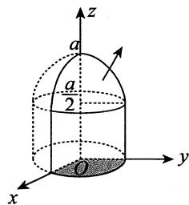
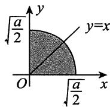

# 测试卷回

# 一、选择题

1.【答案】(A)

【解析】 $\lim_{x\to 0^{+}}f(x) = \lim_{x\to 0^{+}}\frac{1 - \cos{\sqrt{x}}}{a\ln(1 + x)} = \lim_{x\to 0^{+}}\frac{\frac{1}{2}x}{ax} = \frac{1}{2a},$

$$
\lim  _ {x \rightarrow 0 ^ {-}} f (x) = b = f (0),
$$

由于 $f(x)$ 在 $x = 0$ 处连续，故 $\frac{1}{2a} = b$ ，则有 $ab = \frac{1}{2}$

# 2.【答案】(B)

【解析】由于 $0 \leqslant |f(x, y)| \leqslant |\sin x \cos y| + 1 - \cos y$ ，又

故 $\lim_{x\to 0}\lim_{y\to 0}(\left|\sin x\cos y\right| + 1 - \cos y) = 0,$

$$
\lim  _ {y \rightarrow 0} (\left| \sin x \cos y \right| + 1 - \cos y) = \left| \sin x \right|, \lim  _ {x \rightarrow 0} \left| \sin x \right| = 0,
$$

由夹逼准则知， $\lim_{x\to 0}\lim_{y\to 0}\left|f(x,y)\right| = 0$ ，故有 $\lim_{x\to 0}\lim_{y\to 0}f(x,y) = 0$ ，即选项(B)正确.

对于选项(A)，

$$
f _ {x} ^ {\prime} (0, 0) = \lim  _ {x \rightarrow 0} \frac {f (x , 0) - f (0 , 0)}{x} = \lim  _ {x \rightarrow 0} \frac {\sin x - 0}{x} = 1,
$$

故选项(A)错误.

对于选项(C)，(D)，当 $x\neq 0$ 时，

$$
f _ {y} ^ {\prime} (x, 0) = \lim  _ {y \rightarrow 0} \frac {f (x , y) - f (x , 0)}{y} = \lim  _ {y \rightarrow 0} \frac {\sin x \cos y - \sin x}{y} = \lim  _ {y \rightarrow 0} \frac {(\cos y - 1) \sin x}{y} = 0,
$$

当 $x = 0$ 时，

$$
f _ {y} ^ {\prime} (0, 0) = \lim  _ {y \rightarrow 0} \frac {f (0 , y) - f (0 , 0)}{y} = \lim  _ {y \rightarrow 0} \frac {1 - \cos y - 0}{y} = 0,
$$

则 $f_{yx}''(0,0) = \lim_{x\to 0}\frac{f_y'(x,0) - f_y'(0,0)}{x} = 0$ ，故选项(C)，(D)错误.

# 3.【答案】(B)

【解析】根据解的结构可知， $y_{1} - y_{2} = \mathrm{e}^{2x} - \mathrm{e}^{-x}$ 为对应的齐次线性微分方程的一个解，则其特征方程的根为2，-1，特征方程为 $(r - 2)(r + 1) = r^2 - r - 2 = 0$ ，故对应的齐次线性微分方程为

$y^{\prime \prime} - y^{\prime} - 2y = 0$ .排除选项(A)，(C).

又 $y_{1} = x\mathrm{e}^{x} + \mathrm{e}^{2x}$ ， $y_{1}^{\prime} = x\mathrm{e}^{x} + \mathrm{e}^{x} + 2\mathrm{e}^{2x}$ ， $y_{1}^{\prime \prime} = x\mathrm{e}^{x} + 2\mathrm{e}^{x} + 4\mathrm{e}^{2x}$ ，则

$$
\begin{array}{l} y _ {1} ^ {\prime \prime} - y _ {1} ^ {\prime} - 2 y _ {1} = x e ^ {x} + 2 e ^ {x} + 4 e ^ {2 x} - x e ^ {x} - e ^ {x} - 2 e ^ {2 x} - 2 x e ^ {x} - 2 e ^ {2 x} \\ = e ^ {x} - 2 x e ^ {x}, \\ \end{array}
$$

故所对应的非齐次线性微分方程为

$$
y ^ {\prime \prime} - y ^ {\prime} - 2 y = e ^ {x} - 2 x e ^ {x}.
$$

# 4.【答案】(A)

【解析】当 $|r| < R$ 时，根据阿贝尔定理，此时级数 $\sum_{n=1}^{\infty} a_n r^n$ 绝对收敛，即正项级数 $\sum_{n=1}^{\infty} |a_n r^n|$ 收敛，而正项级数 $\sum_{n=1}^{\infty} |a_{2n+1} r^{2n+1}|$ 可看作是由 $\sum_{n=1}^{\infty} |a_n r^n|$ 的所有奇数项构成的，故也收敛，从而 $\sum_{n=1}^{\infty} a_{2n+1} r^{2n+1}$ 收敛。于是根据逆否命题的等价性，知当 $\sum_{n=1}^{\infty} a_{2n+1} r^{2n+1}$ 发散时，必有 $|r| \geqslant R$ 。

# 5.【答案】(D)

【解析】记 $\pmb{\alpha} = \begin{bmatrix} a_1 \\ a_2 \end{bmatrix}$ , $\pmb{\beta} = \begin{bmatrix} b_1 \\ b_2 \end{bmatrix}$ , 则由题意, 得

$$
\left(a _ {1} + b _ {1}\right) ^ {2} + \left(a _ {2} + b _ {2}\right) ^ {2} = \left(a _ {1} - b _ {1}\right) ^ {2} + \left(a _ {2} - b _ {2}\right) ^ {2},
$$

整理得

$$
a _ {1} b _ {1} + a _ {2} b _ {2} = 0,
$$

则 $\alpha$ 与 $\beta$ 正交, 故实矩阵 $A$ 为对称矩阵.

# 6.【答案】(C)

【解析】方法一 $f(x_{1},x_{2},x_{3}) = x_{1}^{2} + 2x_{1}x_{2} + 2x_{1}x_{3}$

$$
\begin{array}{l} = \left(x _ {1} + x _ {2} + x _ {3}\right) ^ {2} - \left(x _ {2} ^ {2} + x _ {3} ^ {2} + 2 x _ {2} x _ {3}\right) \\ = \left(x _ {1} + x _ {2} + x _ {3}\right) ^ {2} - \left(x _ {2} + x _ {3}\right) ^ {2}, \\ \end{array}
$$

则二次型 $f(x_{1},x_{2},x_{3})$ 的正、负惯性指数均为1，故符号差为0.

方法二 二次型 $f(x_{1},x_{2},x_{3})$ 的矩阵为 $\pmb{A} = \begin{bmatrix} 1 & 1 & 1\\ 1 & 0 & 0\\ 1 & 0 & 0 \end{bmatrix}$ ，令

$$
\left| \lambda E - A \right| = \left| \begin{array}{c c c} \lambda - 1 & - 1 & - 1 \\ - 1 & \lambda & 0 \\ - 1 & 0 & \lambda \end{array} \right| = \lambda (\lambda + 1) (\lambda - 2) = 0,
$$

则 $\pmb{A}$ 的特征值为0，-1，2，即二次型 $f(x_{1},x_{2},x_{3})$ 的正、负惯性指数均为1，故符号差为0.

# 7.【答案】(B)

【解析】设 $Ax = 0$ 有非零解，记 $\pmb{x}$ 的分量 $x_{i}\neq 0$ ，且其绝对值最大.考虑第 $i$ 个方程

$$
a _ {i 1} x _ {1} + \dots + a _ {i, i - 1} x _ {i - 1} + a _ {i i} x _ {i} + a _ {i, i + 1} x _ {i + 1} + \dots + a _ {i n} x _ {n} = 0,
$$

于是 $\left|a_{ii}\right|\left|x_i\right| = \left|\sum_{j\neq i}a_{ij}x_j\right|\leqslant \sum_{j\neq i}\left|a_{ij}\right|\left|x_j\right|\leqslant \sum_{j\neq i}\left|a_{ij}\right|\left|x_i\right| <   \left|a_{ii}\right|\left|x_i\right|$ ，矛盾.

故 $\pmb{x}$ 的所有分量均为0，即 $Ax = 0$ 只有零解，故 $\pmb{A}$ 为可逆矩阵，则 $Ax = \beta$ 有唯一解.

【注】从选项考虑， $x$ 是不是零向量是一个重要的思考方向，故可设 $x_{i} \neq 0$ ，且根据题意，设其绝对值最大，再利用 $\left|a_{ii}\right| > \sum_{j \neq i} \left|a_{ij}\right|$ 分析。此题提示考生，对于较难的选择题，题干与选项可结合起来考虑。

# 8.【答案】(D)

【解析】令 $Z \sim \left( \begin{array}{cc} 1 & 0 \\ p & 1 - p \end{array} \right)$ 且与 $X$ 相互独立, 则 $Z + X \sim B(2, p)$ , 与 $Y$ 同分布, 于是

$$
F _ {Y} (z) = P \left\{Y \leqslant z \right\} = P \left\{Z + X \leqslant z \right\}, F _ {X} (z) = P \left\{X \leqslant z \right\}.
$$

又由于 $\{Z + X\leqslant z\} \subset \{X\leqslant z\}$ ，于是 $F_{Y}(z)\leqslant F_{X}(z)$

【注】此处的随机变量 $X, Y$ 均为伯努利试验中成功的次数，缺少 $(X, Y)$ 的分布律的信息，故(A)与(B)均不正确.

# 9.【答案】(C)

【解析】积分区域如图所示，则

$$
\begin{array}{l} f _ {Y} (y) = \int_ {- \infty} ^ {+ \infty} f (x, y) \mathrm {d} x = \left\{ \begin{array}{l l} \int_ {- y} ^ {y} \frac {1}{8} (y ^ {2} - x ^ {2}) \mathrm {e} ^ {- y} \mathrm {d} x, & y > 0, \\ 0, & \text {其 他} \end{array} \right. \\ = \left\{ \begin{array}{l l} \frac {1}{6} y ^ {3} \mathrm {e} ^ {- y}, & y > 0, \\ 0, & \text {其 他}, \end{array} \right. \\ \end{array}
$$

$$
f _ {X | Y} (x \mid 1) = \left\{ \begin{array}{l l} \frac {f (x , 1)}{f _ {Y} (1)}, & - 1 <   x <   1, \\ 0, & \text {其 他} \end{array} = \left\{ \begin{array}{l l} \frac {\frac {1}{8} (1 - x ^ {2}) \mathrm {e} ^ {- 1}}{\frac {1}{6} \mathrm {e} ^ {- 1}}, & - 1 <   x <   1, \\ 0, & \text {其 他} \end{array} = \left\{ \begin{array}{l l} \frac {3}{4} (1 - x ^ {2}), & - 1 <   x <   1, \\ 0, & \text {其 他}. \end{array} \right. \right. \right.
$$

故 $P\left\{0 < X < 2 \mid Y = 1\right\} = \int_{0}^{1} \frac{3}{4} (1 - x^2) \, \mathrm{d}x = \frac{3}{4} - \frac{3}{4} \times \frac{1}{3} = \frac{1}{2}$ .

# 10.【答案】(C)

【解析】由题设， $X\sim N(0,1)$ ， $Y\sim N(0,4)$ ， $\rho_{XY} = \frac{1}{2}$ ，故

$$
E (X) = E (Y) = 0, D (X) = 1, D (Y) = 4,
$$

$$
E (X - Y) = E (X) - E (Y) = 0,
$$

$$
D (X - Y) = D (X) + D (Y) - 2 \operatorname {C o v} (X, Y) = D (X) + D (Y) - 2 \cdot \rho_ {X Y} \sqrt {D (X)} \sqrt {D (Y)} = 3 ,
$$

于是 $X - Y\sim N(0,3),\frac{X - Y}{\sqrt{3}}\sim N(0,1).$

因 $\left[ \begin{array}{l}X\\ X - Y \end{array} \right] = \left[ \begin{array}{ll}1 & 0\\ 1 & -1 \end{array} \right]\left[ \begin{array}{l}X\\ Y \end{array} \right],$ 这里矩阵 $\left[ \begin{array}{ll}1 & 0\\ 1 & -1 \end{array} \right]$ 可逆，故 $(X,X - Y)$ 服从二维正态分布.又

$$
\operatorname {C o v} (X - Y, X) = \operatorname {C o v} (X, X) - \operatorname {C o v} (X, Y) = D (X) - \rho_ {X Y} \sqrt {D (X)} \sqrt {D (Y)} = 0,
$$

于是 $X$ 与 $X - Y$ 相互独立.

综上， $\frac{X - Y}{\sqrt{3}}$ 与 $X$ 相互独立且同分布.

# 二、填空题

11.【答案】 $-\frac{3}{2}$

【解析】方程两端同时对 $y$ 求偏导，有

$$
e ^ {z} \cdot \frac {\partial z}{\partial y} + z + y \cdot \frac {\partial z}{\partial y} = 2, \tag {1}
$$

(1)式两端再同时对 $y$ 求偏导, 有

$$
\mathrm {e} ^ {z} \cdot \left(\frac {\partial z}{\partial y}\right) ^ {2} + \mathrm {e} ^ {z} \cdot \frac {\partial^ {2} z}{\partial y ^ {2}} + 2 \frac {\partial z}{\partial y} + y \cdot \frac {\partial^ {2} z}{\partial y ^ {2}} = 0. \tag {②}
$$

将 $x = 1, y = 1$ 代入原方程，得 $z(1,1) = 0$ 。将 $x = 1, y = 1, z(1,1) = 0$ 代入①式，得 $\left.\frac{\partial z}{\partial y}\right|_{(1,1)} = 1$ 。

将 $x = 1, y = 1, z(1,1) = 0, \left.\frac{\partial z}{\partial y}\right|_{(1,1)} = 1$ 代入②式，得 $\left.\frac{\partial^2z}{\partial y^2}\right|_{(1,1)} = -\frac{3}{2}$ .

12.【答案】 $y = -\ln \left|\cos (x + C_1)\right| + C_2$ ，其中 $C_1, C_2$ 为任意常数

【解析】令 $y^\prime = p$ ，则 $y^{\prime \prime} = p^{\prime}$ ，于是原微分方程化为 $p^\prime -p^2 = 1$ .分离变量得

$$
\frac {\mathrm {d} p}{1 + p ^ {2}} = \mathrm {d} x,
$$

两边同时积分得 $\arctan p = x + C_1$ ，即 $p = \tan (x + C_1)$ ，则 $y^\prime = \tan (x + C_1)$ ，再两边同时积分得通解

$$
y = - \ln \left| \cos \left(x + C _ {1}\right) \right| + C _ {2} \text {, 其 中} C _ {1}, C _ {2} \text {为 任 意 常 数 .}
$$

13.【答案】 $\frac{\pi}{2} + 1$

【解析】 $S(0) = \frac{f(0 - 0) + f(0 + 0)}{2} = \frac{\pi + 1}{2},$

$$
S (- \pi) = \frac {f (\pi - 0) + f (- \pi + 0)}{2} = \frac {1 + 0}{2} = \frac {1}{2},
$$

故 $S(0) + S(-\pi) = \frac{\pi}{2} + 1$

14.【答案】 $\arctan \frac{1}{2} -\frac{\pi}{2}$

【解析】方法一 使用格林公式.

$$
\frac {\partial Q}{\partial x} = - 2 x y e ^ {- y ^ {2}} - \frac {2 x}{\left(x ^ {2} + y ^ {2}\right) ^ {2}}, \frac {\partial P}{\partial y} = - 2 x y e ^ {- y ^ {2}},
$$

故 $\frac{\partial Q}{\partial x} - \frac{\partial P}{\partial y} = -\frac{2x}{(x^2 + y^2)^2}$ .

由格林公式，有

原式 $= \iint_{D} \frac{-2x}{(x^2 + y^2)^2} \, \mathrm{d}x \, \mathrm{d}y = \int_{-1}^{1} \mathrm{d}y \int_{1}^{2} \frac{-2x}{(x^2 + y^2)^2} \, \mathrm{d}x$

$$
= 2 \int_ {0} ^ {1} \left(\frac {1}{4 + y ^ {2}} - \frac {1}{1 + y ^ {2}}\right) d y = \arctan \frac {1}{2} - \frac {\pi}{2},
$$

其中 $D = \{(x,y)\big|1\leqslant x\leqslant 2, - 1\leqslant y\leqslant 1\}$

方法二 直接代入.

原式 $= \int_{1}^{2} x \mathrm{e}^{-1} \mathrm{d}x + \int_{-1}^{1} \left( \frac{1}{4 + y^2} - 4y \mathrm{e}^{-y^2} \right) \mathrm{d}y + \int_{2}^{1} x \mathrm{e}^{-1} \mathrm{d}x + \int_{1}^{-1} \left( \frac{1}{1 + y^2} - y \mathrm{e}^{-y^2} \right) \mathrm{d}y$

$$
\begin{array}{l} = \int_ {- 1} ^ {1} \left(\frac {1}{4 + y ^ {2}} - \frac {1}{1 + y ^ {2}} - 3 y e ^ {- y ^ {2}}\right) d y \\ = 2 \int_ {0} ^ {1} \left(\frac {1}{4 + y ^ {2}} - \frac {1}{1 + y ^ {2}}\right) d y = \arctan \frac {1}{2} - \frac {\pi}{2}. \\ \end{array}
$$

15.【答案】 $[1,2,3,4]^{\mathrm{T}} + k_{1}[0,2,3,3]^{\mathrm{T}} + k_{2}[0,1,2,3]^{\mathrm{T}}$ ，其中 $k_{1},k_{2}$ 为任意常数

【解析】因为方程组 $Ax = b$ 有解，且秩 $r(A) = 2$ ，所以其导出组基础解系中解向量的个数为 $n - r(A) = 4 - 2 = 2$ ，故方程组 $Ax = b$ 的通解形式为 $\pmb {\alpha} + k_{1}\pmb{\eta}_{1} + k_{2}\pmb{\eta}_{2}$ ，其中 $\pmb{\alpha}$ 为非齐次线性方程组的特解， $\eta_1,\eta_2$ 为 $Ax = 0$ 的基础解系， $k_{1},k_{2}$ 为任意常数.下面用解的性质分析出特解 $\pmb{\alpha}$ 及导出组的基础解系.

由 $A(\alpha_{1} + \alpha_{2}) = 2b$ ，有 $A\frac{\alpha_1 + \alpha_2}{2} = b$ ，因此[1,2,3,4]T是方程组 $Ax = b$ 的一个特解.

又 $(\alpha_{1} + \alpha_{2}) - (\alpha_{1} + 2\alpha_{2} - \alpha_{3}) = \alpha_{3} - \alpha_{2} = [0,4,6,6]^{\mathrm{T}}$

$$
3 \left(\boldsymbol {\alpha} _ {1} + \boldsymbol {\alpha} _ {2}\right) - 2 \left(\boldsymbol {\alpha} _ {2} + \boldsymbol {\alpha} _ {3} + \boldsymbol {\alpha} _ {4}\right) = 2 \left(\boldsymbol {\alpha} _ {1} - \boldsymbol {\alpha} _ {3}\right) + \left(\boldsymbol {\alpha} _ {1} - \boldsymbol {\alpha} _ {4}\right) + \left(\boldsymbol {\alpha} _ {2} - \boldsymbol {\alpha} _ {4}\right) = [ 0, 2, 4, 6 ] ^ {\mathrm {T}}
$$

是导出组 $Ax = 0$ 的两个线性无关的解，故方程组 $Ax = b$ 的通解为

$[1,2,3,4]^{\mathrm{T}} + k_{1}[0,2,3,3]^{\mathrm{T}} + k_{2}[0,1,2,3]^{\mathrm{T}}$ ，其中 $k_{1},k_{2}$ 为任意常数.

16.【答案】 $\frac{25}{28}$

【解析】 $P(A\bigcup C|A\bigcup B) = \frac{P((A\bigcup C)(A\bigcup B))}{P(A\bigcup B)} = \frac{P(A\bigcup BC)}{P(A\bigcup B)} = \frac{P(A) + P(B)P(C) - P(A)P(B)P(C)}{P(A) + P(B) - P(A)P(B)}$

$$
= \frac {\frac {1}{2} + \frac {9}{1 6} - \frac {1}{2} \times \frac {9}{1 6}}{\frac {1}{2} + \frac {3}{4} - \frac {1}{2} \times \frac {3}{4}} = \frac {2 5}{2 8}.
$$

# 三、解答题

17.【解析】设 $x = \tan t\left(-\frac{\pi}{2} < t < \frac{\pi}{2}\right)$ ，则 $\mathrm{dx} = \sec^2 t\mathrm{dt}$ ，于是

原式 $= \int \frac{x^3 + 1}{(x^2 + 1)^2} \, \mathrm{d}x = \int \frac{\tan^3 t + 1}{\sec^2 t} \, \mathrm{d}t = \int \frac{\cos^2 t - 1}{\cos t} \, \mathrm{d}(\cos t) + \int \frac{1 + \cos 2t}{2} \, \mathrm{d}t$

$$
= \frac {1}{2} \cos^ {2} t - \ln \cos t + \frac {t}{2} + \frac {1}{4} \sin 2 t + C
$$

$= \frac{1}{2}\cos^2 t - \ln \cos t + \frac{t}{2} +\frac{1}{2}\sin t\cos t + C.$ 7分

按 $\tan t = x$ 作辅助三角形(见图)，可知

$$
\cos t = \frac {1}{\sqrt {1 + x ^ {2}}}, \sin t = \frac {x}{\sqrt {1 + x ^ {2}}}, \qquad \dots \dots 8 \text {分}
$$

于是

原式 $= \frac{1 + x}{2(1 + x^2)} +\frac{1}{2}\ln (1 + x^2) + \frac{1}{2}\arctan x + C(C$ 为任意常数).

18.【解析】解方程组

$$
\left\{ \begin{array}{l l} z _ {x} ^ {\prime} = 2 \mathrm {e} ^ {2 x + 3 y} (8 x ^ {2} - 6 x y + 3 y ^ {2} + 8 x - 3 y) = 0, & \dots \dots 2 \text {分} \\ z _ {y} ^ {\prime} = 3 \mathrm {e} ^ {2 x + 3 y} (8 x ^ {2} - 6 x y + 3 y ^ {2} - 2 x + 2 y) = 0, & \dots \dots 4 \text {分} \end{array} \right.
$$

得驻点(0,0)及 $\left(-\frac{1}{4}, - \frac{1}{2}\right)$ 5分

$$
z _ {x x} ^ {\prime \prime} = 4 \mathrm {e} ^ {2 x + 3 y} \left(8 x ^ {2} - 6 x y + 3 y ^ {2} + 1 6 x - 6 y + 4\right),
$$

$$
z _ {x y} ^ {\prime \prime} = 6 \mathrm {e} ^ {2 x + 3 y} \left(8 x ^ {2} - 6 x y + 3 y ^ {2} + 6 x - y - 1\right),
$$

$$
z _ {y y} ^ {\prime \prime} = 9 \mathrm {e} ^ {2 x + 3 y} \left(8 x ^ {2} - 6 x y + 3 y ^ {2} - 4 x + 4 y + \frac {2}{3}\right). \quad \dots \dots 8 \text {分}
$$

在点 $(0,0)$ 处， $A = z_{xx}''(0,0) = 16$ ， $B = z_{xy}''(0,0) = -6$ ， $C = z_{yy}''(0,0) = 6$ ，可知 $AC - B^2 = 60 > 0$ ，且 $A > 0$ ，故函数 $z$ 在该点取得极小值，极小值为 $z(0,0) = 0$ ；……10分

在点 $\left(-\frac{1}{4}, - \frac{1}{2}\right)$ 处， $A = z_{xx}^{\prime \prime}\left(-\frac{1}{4}, - \frac{1}{2}\right) = 14\mathrm{e}^{-2}$ ， $B = z_{xy}^{\prime \prime}\left(-\frac{1}{4}, - \frac{1}{2}\right) = -9\mathrm{e}^{-2}$ ， $C = z_{yy}^{\prime \prime}\left(-\frac{1}{4}, - \frac{1}{2}\right) =$ $\frac{3}{2}\mathrm{e}^{-2}$ ，可知 $AC - B^{2} = -60\mathrm{e}^{-4} <   0$ ，故函数 $z$ 在该点不取极值.

综上，函数 $z$ 在点 $(0,0)$ 处取得极小值0，无极大值. 12分

19.【解析】欲证结论变形为 $\frac{\frac{f''(\eta)}{6}}{\mathrm{e}^{\xi}} = \frac{f'(\xi)}{\mathrm{e}^{\xi}}$

令 $g(x) = \mathrm{e}^{x}$ ，对 $f(x)$ ， $g(x)$ 在 $[0,1]$ 上应用柯西中值定理，有 $\frac{f(1) - f(0)}{g(1) - g(0)} = \frac{f'(\xi)}{g'(\xi)}$ ，即

$$
\frac {f (1) - f (0)}{\mathrm {e} - 1} = \frac {f ^ {\prime} (\xi)}{\mathrm {e} ^ {\xi}}, \xi \in (0, 1). \tag {①}
$$

4分

又 $f(x) = f(0) + f'(0)x + \frac{f''(0)}{2} x^2 +\frac{f''(\tau)}{6} x^3 = f(0) + \frac{f''(\tau)}{6} x^3$ ，其中 $\pmb{\tau}$ 介于0与 $x$ 之间．…6分

故 $f(1) = f(0) + \frac{f^{\prime\prime}(\eta)}{6},\eta \in (0,1),$ ②

8分

且 $\mathrm{e} - 1 = \mathrm{e}^{\varsigma}(1 - 0) = \mathrm{e}^{\varsigma},\quad \varsigma \in (0,1).$ （20 ③

10分

联立①~③式，有 $\frac{\frac{f^{\prime\prime}(\eta)}{6}}{\mathrm{e}^{\xi}} = \frac{f^{\prime}(\xi)}{\mathrm{e}^{\xi}}$ 即 $\mathrm{e}^{\xi} f^{\prime \prime}(\eta) = 6 \mathrm{e}^{\xi} f^{\prime}(\xi), \xi, \eta, \varsigma \in (0,1)$ .

【注】欲证结论中有数字“6”，这提示我们需将函数泰勒展开到二阶带拉格朗日余项，此时的拉格朗日余项中有 $\frac{1}{6}$ 。

20.【解析】曲面 $\Sigma$ 如图(a)所示，其在 $xOy$ 面上的投影为 $D = \left\{(x,y)\Bigg|x^2 +y^2\leqslant \frac{a}{2},x\geqslant 0,y\geqslant 0\right\}$ 如图(b)所示，由转换投影法，

$$
\frac {\partial z}{\partial x} = - 2 x, \frac {\partial z}{\partial y} = - 2 y.
$$

1分

故 $I = \iint_{\Sigma} [yz + (2x)xz + (2y)xy] \, \mathrm{d}x \, \mathrm{d}y$

$$
\begin{array}{l} = \iint_ {\Sigma} \left(y z + 2 x ^ {2} z + 2 x y ^ {2}\right) d x d y \\ = \iint_ {D} \left[ y \left(a - x ^ {2} - y ^ {2}\right) + 2 x ^ {2} \left(a - x ^ {2} - y ^ {2}\right) + 2 x y ^ {2} \right] d x d y \\ = 2 \iint_ {D} x ^ {2} (a - x ^ {2} - y ^ {2}) d x d y + \iint_ {D} (a y - x ^ {2} y - y ^ {3} + 2 x y ^ {2}) d x d y \\ = I _ {1} + I _ {2}, \\ \end{array}
$$

  
(a)

  
(b)

5分

其中 $I_{1} = 2a\iint_{D}x^{2}\mathrm{d}x\mathrm{d}y - 2\iint_{D}x^{2}(x^{2} + y^{2})\mathrm{d}x\mathrm{d}y$

$$
\begin{array}{l} \frac {\text {轮 换}}{\text {对 称 性}} a \iint_ {D} (x ^ {2} + y ^ {2})   \mathrm {d} x \mathrm {d} y - \iint_ {D} (x ^ {2} + y ^ {2}) ^ {2}   \mathrm {d} x \mathrm {d} y \\ = a \int_ {0} ^ {\frac {\pi}{2}} \mathrm {d} \theta \int_ {0} ^ {\sqrt {\frac {a}{2}}} r ^ {3} \mathrm {d} r - \int_ {0} ^ {\frac {\pi}{2}} \mathrm {d} \theta \int_ {0} ^ {\sqrt {\frac {a}{2}}} r ^ {5} \mathrm {d} r = \frac {\pi a ^ {3}}{3 2} - \frac {\pi a ^ {3}}{9 6} = \frac {\pi a ^ {3}}{4 8}, \quad \dots \dots 8 分 \\ \end{array}
$$

$$
\begin{array}{l} I _ {2} = \iint_ {D} (a y - x ^ {2} y - y ^ {3} + 2 x y ^ {2}) d x d y = \iint_ {D} (a y - y ^ {3}) d x d y + \iint_ {D} x ^ {2} y d x d y \\ = \int_ {0} ^ {\frac {\pi}{2}} d \theta \int_ {0} ^ {\sqrt {\frac {a}{2}}} (a r \sin \theta - r ^ {3} \sin^ {3} \theta) r d r + \int_ {0} ^ {\frac {\pi}{2}} d \theta \int_ {0} ^ {\sqrt {\frac {a}{2}}} r ^ {4} \cos^ {2} \theta \sin \theta d r \\ = \int_ {0} ^ {\frac {\pi}{2}} \left(\frac {\sqrt {2} a ^ {\frac {5}{2}}}{1 2} \sin \theta - \frac {\sqrt {2} a ^ {\frac {5}{2}}}{4 0} \sin^ {3} \theta\right) d \theta + \frac {\sqrt {2} a ^ {\frac {5}{2}}}{4 0} \int_ {0} ^ {\frac {\pi}{2}} \cos^ {2} \theta \sin \theta d \theta \\ = \frac {\sqrt {2} a ^ {\frac {5}{2}}}{1 2} - \frac {\sqrt {2} a ^ {\frac {5}{2}}}{6 0} + \frac {\sqrt {2} a ^ {\frac {5}{2}}}{1 2 0} = \frac {3 \sqrt {2}}{4 0} a ^ {\frac {5}{2}}. \quad \dots \dots 1 1 分 \\ \end{array}
$$

综上， $I = \frac{\pi a^3}{48} +\frac{3\sqrt{2}}{40} a^{\frac{5}{2}}.$ 12分

21.【解析】(1)因为 $|\lambda E - A| = \left| \begin{array}{ccc}\lambda -a & -1 & 1\\ -1 & \lambda -a & 1\\ 1 & 1 & \lambda -a \end{array} \right| = (\lambda -a + 1)^2 (\lambda -a - 2)$ ，所以 $\pmb{A}$ 的特征值为

$$
\lambda_ {1} = \lambda_ {2} = a - 1, \lambda_ {3} = a + 2.
$$

2分

当 $\lambda_{1} = \lambda_{2} = a - 1$ 时，解方程组 $\left[(a - 1)\pmb {E} - \pmb {A}\right]\pmb {x} = \mathbf{0}$ ，得 $A$ 的线性无关的特征向量 $\xi_{1} = \begin{bmatrix} -1\\ 1\\ 0 \end{bmatrix},$

$\xi_{2} = \left[ \begin{array}{l}1\\ 0\\ 1 \end{array} \right],$ 进行施密特正交单位化得 $\pmb{\eta}_{1} = \left[ \begin{array}{c} - \frac{\sqrt{2}}{2}\\ \frac{\sqrt{2}}{2}\\ 0 \end{array} \right],\pmb{\eta}_{2} = \left[ \begin{array}{l}\frac{\sqrt{6}}{6}\\ \frac{\sqrt{6}}{6}\\ \frac{\sqrt{6}}{3} \end{array} \right].$

4分

当 $\lambda_3 = a + 2$ 时，解方程组 $\left[(a + 2)\pmb {E} - \pmb {A}\right]\pmb {x} = \mathbf{0}$ ，得 $\pmb{A}$ 的特征向量 $\xi_{3} = \begin{bmatrix} -1\\ -1\\ 1 \end{bmatrix}$ ，单位化得

$$
\boldsymbol {\eta} _ {3} = \left[ \begin{array}{c} - \frac {\sqrt {3}}{3} \\ - \frac {\sqrt {3}}{3} \\ \frac {\sqrt {3}}{3} \end{array} \right].
$$

5分

令 $\pmb{P} = [\pmb{\eta}_1, \pmb{\eta}_2, \pmb{\eta}_3] = \left[ \begin{array}{ccc} -\frac{\sqrt{2}}{2} & \frac{\sqrt{6}}{6} & -\frac{\sqrt{3}}{3} \\ \frac{\sqrt{2}}{2} & \frac{\sqrt{6}}{6} & -\frac{\sqrt{3}}{3} \\ 0 & \frac{\sqrt{6}}{3} & \frac{\sqrt{3}}{3} \end{array} \right]$ ，则

$$
\boldsymbol {P} ^ {\mathrm {T}} \boldsymbol {A} \boldsymbol {P} = \left[ \begin{array}{c c c} a - 1 & 0 & 0 \\ 0 & a - 1 & 0 \\ 0 & 0 & a + 2 \end{array} \right] = \boldsymbol {\Lambda}.
$$

故 $\pmb{P}$ 为所求正交矩阵，且 $\pmb{\Lambda} = \begin{bmatrix} a - 1 & 0 & 0\\ 0 & a - 1 & 0\\ 0 & 0 & a + 2 \end{bmatrix} .$

6分

(2) $\pmb{B}^{2} = (3 + a)\pmb{E} - \pmb{A} = (3 + a)\pmb{E} - \pmb{P}\left[ \begin{array}{ccc}a - 1 & & \\ & a - 1 & \\ & & a + 2 \end{array} \right]\pmb{P}^{\mathrm{T}} = \pmb{P}\left[ \begin{array}{ccc}4 & & \\ & 4 & \\ & & 1 \end{array} \right]\pmb{P}^{\mathrm{T}}.$

又 $\pmb{B}$ 为正定矩阵，故 $\pmb {B} = \pmb {P}\left[ \begin{array}{lll}2 & & \\ & 2 & \\ & & 1 \end{array} \right]\pmb{P}^{\mathrm{T}}$ ： ……10分

于是 $\pmb{B}^{3} = \pmb{P}\left[ \begin{array}{ccc}8 & & \\ & 8 & \\ & & 1 \end{array} \right]\pmb{P}^{\mathrm{T}} = \left[ \begin{array}{ccc}\frac{17}{3} & -\frac{7}{3} & \frac{7}{3}\\ -\frac{7}{3} & \frac{17}{3} & \frac{7}{3}\\ \frac{7}{3} & \frac{7}{3} & \frac{17}{3} \end{array} \right].$

12分

【注】本题给出 $\pmb{A}$ ，只是为了给考生一个提示.事实上， $\pmb{B}^{2}$ 可用正交相似对角化得到，已知 $\pmb{B}^{2} = \pmb {P}\left[ \begin{array}{lll}4 & & \\ & 4 & \\ & & 1 \end{array} \right]\pmb{P}^{\mathrm{T}}$ ，即可知 $\pmb{B}$ ，进而得到 $B^3$ ：

22.【解析】(1)设 $X$ 的分布函数为 $F(x)$ ，由题知， $F(x) = \begin{cases} 1 - \mathrm{e}^{-\lambda x}, & x \geqslant 0, \\ 0, & x < 0. \end{cases}$ ……2分

因此 $P\{X \leqslant 200\} = F(200) = 1 - \mathrm{e}^{-200\lambda}$ ，故 $Y \sim B(10,1 - \mathrm{e}^{-200\lambda})$ 。

(2) 似然函数 $L(\lambda) = P\left\{Y = 2 \mid \lambda \right\} = C_{10}^{2}(1 - e^{-200\lambda})^{2}(e^{-200\lambda})^{8}$ ,

取对数得

$$
\ln L (\lambda) = \ln C _ {1 0} ^ {2} + 2 \ln (1 - e ^ {- 2 0 0 \lambda}) - 8 \cdot 2 0 0 \lambda . \quad \dots \dots 7 分
$$

令 $\frac{\mathrm{d}\left[\ln L(\lambda)\right]}{\mathrm{d}\lambda} = 2\frac{(-\mathrm{e}^{-200\lambda})(-200)}{1 - \mathrm{e}^{-200\lambda}} -1600 = 0,$

解得 $\hat{\lambda} = \frac{1}{200}\ln \frac{5}{4}$ 10分

由 $\lambda = \frac{1}{E(X)} = \frac{1}{T}$ 故 $\hat{T} = \frac{1}{\hat{\lambda}} = \frac{200}{\ln\frac{5}{4}}$ 12分

  
关注公众号【考研小舟】  
免费考研资料&无水印PDF

  
